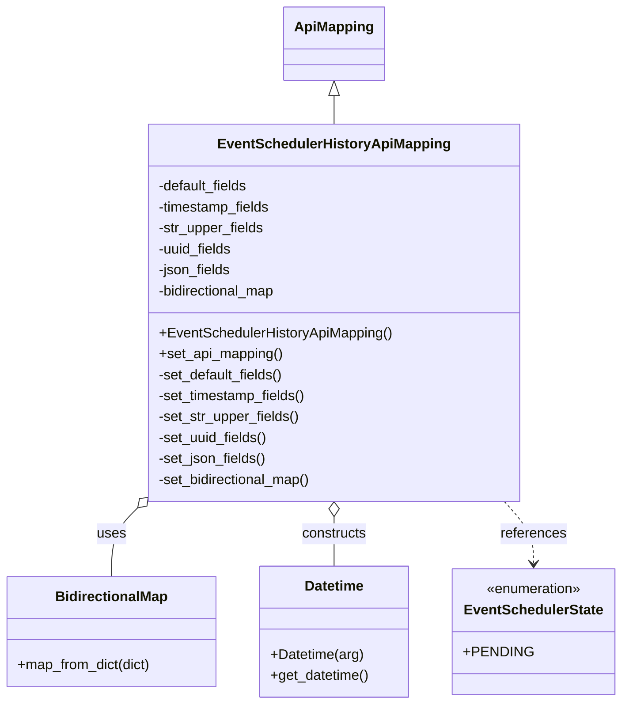

# Diagram: partview_core/partview_service/partview_service/api/event_scheduler/mapping/EventSchedulerApiMapping.py

> Auto-generated by Obscura crawlers

## Mermaid

### SVG

<svg id="container" width="705.46875" xmlns="http://www.w3.org/2000/svg" class="classDiagram" height="806" viewBox="0 0 705.46875 806" role="graphics-document document" aria-roledescription="class"><g><defs><marker id="container_class-aggregationStart" class="marker aggregation class" refX="18" refY="7" markerWidth="190" markerHeight="240" orient="auto"><path d="M 18,7 L9,13 L1,7 L9,1 Z"></path></marker></defs><defs><marker id="container_class-aggregationEnd" class="marker aggregation class" refX="1" refY="7" markerWidth="20" markerHeight="28" orient="auto"><path d="M 18,7 L9,13 L1,7 L9,1 Z"></path></marker></defs><defs><marker id="container_class-extensionStart" class="marker extension class" refX="18" refY="7" markerWidth="190" markerHeight="240" orient="auto"><path d="M 1,7 L18,13 V 1 Z"></path></marker></defs><defs><marker id="container_class-extensionEnd" class="marker extension class" refX="1" refY="7" markerWidth="20" markerHeight="28" orient="auto"><path d="M 1,1 V 13 L18,7 Z"></path></marker></defs><defs><marker id="container_class-compositionStart" class="marker composition class" refX="18" refY="7" markerWidth="190" markerHeight="240" orient="auto"><path d="M 18,7 L9,13 L1,7 L9,1 Z"></path></marker></defs><defs><marker id="container_class-compositionEnd" class="marker composition class" refX="1" refY="7" markerWidth="20" markerHeight="28" orient="auto"><path d="M 18,7 L9,13 L1,7 L9,1 Z"></path></marker></defs><defs><marker id="container_class-dependencyStart" class="marker dependency class" refX="6" refY="7" markerWidth="190" markerHeight="240" orient="auto"><path d="M 5,7 L9,13 L1,7 L9,1 Z"></path></marker></defs><defs><marker id="container_class-dependencyEnd" class="marker dependency class" refX="13" refY="7" markerWidth="20" markerHeight="28" orient="auto"><path d="M 18,7 L9,13 L14,7 L9,1 Z"></path></marker></defs><defs><marker id="container_class-lollipopStart" class="marker lollipop class" refX="13" refY="7" markerWidth="190" markerHeight="240" orient="auto"><circle stroke="black" fill="transparent" cx="7" cy="7" r="6"></circle></marker></defs><defs><marker id="container_class-lollipopEnd" class="marker lollipop class" refX="1" refY="7" markerWidth="190" markerHeight="240" orient="auto"><circle stroke="black" fill="transparent" cx="7" cy="7" r="6"></circle></marker></defs><g class="root"><g class="clusters"></g><g class="edgePaths"><path d="M385.09,109.25L385.09,110.542C385.09,111.833,385.09,114.417,385.09,119.875C385.09,125.333,385.09,133.667,385.09,137.833L385.09,142" id="id_ApiMapping_EventSchedulerHistoryApiMapping_1" class="edge-thickness-normal edge-pattern-solid relation" style=";;;" data-edge="true" data-et="edge" data-id="id_ApiMapping_EventSchedulerHistoryApiMapping_1" data-points="W3sieCI6Mzg1LjA4OTg0Mzc1LCJ5Ijo5Mn0seyJ4IjozODUuMDg5ODQzNzUsInkiOjExN30seyJ4IjozODUuMDg5ODQzNzUsInkiOjE0Mn1d" marker-start="url(#container_class-extensionStart)"></path><path d="M163.244,576.872L157.479,582.56C151.713,588.248,140.183,599.624,134.418,613.479C128.652,627.333,128.652,643.667,128.652,651.833L128.652,660" id="id_EventSchedulerHistoryApiMapping_BidirectionalMap_2" class="edge-thickness-normal edge-pattern-solid relation" style=";;;" data-edge="true" data-et="edge" data-id="id_EventSchedulerHistoryApiMapping_BidirectionalMap_2" data-points="W3sieCI6MTc1LjUyMzQzNzUsInkiOjU2NC43NTcyMDUwOTM4MzM4fSx7IngiOjEyOC42NTIzNDM3NSwieSI6NjExfSx7IngiOjEyOC42NTIzNDM3NSwieSI6NjYwfV0=" marker-start="url(#container_class-aggregationStart)"></path><path d="M385.09,591.25L385.09,594.542C385.09,597.833,385.09,604.417,385.09,613.875C385.09,623.333,385.09,635.667,385.09,641.833L385.09,648" id="id_EventSchedulerHistoryApiMapping_Datetime_3" class="edge-thickness-normal edge-pattern-solid relation" style=";;;" data-edge="true" data-et="edge" data-id="id_EventSchedulerHistoryApiMapping_Datetime_3" data-points="W3sieCI6Mzg1LjA4OTg0Mzc1LCJ5Ijo1NzR9LHsieCI6Mzg1LjA4OTg0Mzc1LCJ5Ijo2MTF9LHsieCI6Mzg1LjA4OTg0Mzc1LCJ5Ijo2NDh9XQ==" marker-start="url(#container_class-aggregationStart)"></path><path d="M576.401,574L581.863,580.167C587.325,586.333,598.248,598.667,603.71,610.5C609.172,622.333,609.172,633.667,609.172,639.333L609.172,645" id="id_EventSchedulerHistoryApiMapping_EventSchedulerState_4" class="edge-thickness-normal edge-pattern-dashed relation" style=";;;" data-edge="true" data-et="edge" data-id="id_EventSchedulerHistoryApiMapping_EventSchedulerState_4" data-points="W3sieCI6NTc2LjQwMDk4NTA1NDM0NzgsInkiOjU3NH0seyJ4Ijo2MDkuMTcxODc1LCJ5Ijo2MTF9LHsieCI6NjA5LjE3MTg3NSwieSI6NjUxfV0=" marker-end="url(#container_class-dependencyEnd)"></path></g><g class="edgeLabels"><g class="edgeLabel"><g class="label" data-id="id_ApiMapping_EventSchedulerHistoryApiMapping_1" transform="translate(0, 0)"><foreignObject width="0" height="0">

</foreignObject></g></g><g class="edgeLabel" transform="translate(128.65234375, 611)"><g class="label" data-id="id_EventSchedulerHistoryApiMapping_BidirectionalMap_2" transform="translate(-16.4921875, -12)"><foreignObject width="32.984375" height="24">

uses

</foreignObject></g></g><g class="edgeLabel" transform="translate(385.08984375, 611)"><g class="label" data-id="id_EventSchedulerHistoryApiMapping_Datetime_3" transform="translate(-37.84375, -12)"><foreignObject width="75.6875" height="24">

constructs

</foreignObject></g></g><g class="edgeLabel" transform="translate(609.171875, 611)"><g class="label" data-id="id_EventSchedulerHistoryApiMapping_EventSchedulerState_4" transform="translate(-37.828125, -12)"><foreignObject width="75.65625" height="24">

references

</foreignObject></g></g></g><g class="nodes"><g class="node default" id="classId-ApiMapping-0" transform="translate(385.08984375, 50)"><g class="basic label-container"><path d="M-55.2578125 -42 L55.2578125 -42 L55.2578125 42 L-55.2578125 42" stroke="none" stroke-width="0" fill="#ECECFF" style=""></path><path d="M-55.2578125 -42 C-18.863436948667164 -42, 17.53093860266567 -42, 55.2578125 -42 M-55.2578125 -42 C-21.553808080690253 -42, 12.150196338619494 -42, 55.2578125 -42 M55.2578125 -42 C55.2578125 -18.104292880241776, 55.2578125 5.791414239516449, 55.2578125 42 M55.2578125 -42 C55.2578125 -18.005255014798074, 55.2578125 5.989489970403852, 55.2578125 42 M55.2578125 42 C25.56635180118088 42, -4.125108897638242 42, -55.2578125 42 M55.2578125 42 C31.71617660399804 42, 8.17454070799608 42, -55.2578125 42 M-55.2578125 42 C-55.2578125 24.547913500566125, -55.2578125 7.09582700113225, -55.2578125 -42 M-55.2578125 42 C-55.2578125 18.478539165262877, -55.2578125 -5.0429216694742465, -55.2578125 -42" stroke="#9370DB" stroke-width="1.3" fill="none" stroke-dasharray="0 0" style=""></path></g><g class="annotation-group text" transform="translate(0, -18)"></g><g class="label-group text" transform="translate(-43.2578125, -18)"><g class="label" style="font-weight: bolder" transform="translate(0,-12)"><foreignObject width="86.515625" height="24">

ApiMapping

</foreignObject></g></g><g class="members-group text" transform="translate(-43.2578125, 30)"></g><g class="methods-group text" transform="translate(-43.2578125, 60)"></g><g class="divider" style=""><path d="M-55.2578125 6 C-30.841963262342937 6, -6.426114024685873 6, 55.2578125 6 M-55.2578125 6 C-18.639794075901676 6, 17.978224348196647 6, 55.2578125 6" stroke="#9370DB" stroke-width="1.3" fill="none" stroke-dasharray="0 0" style=""></path></g><g class="divider" style=""><path d="M-55.2578125 24 C-21.88212124122994 24, 11.493570017540122 24, 55.2578125 24 M-55.2578125 24 C-24.042288263803602 24, 7.173235972392796 24, 55.2578125 24" stroke="#9370DB" stroke-width="1.3" fill="none" stroke-dasharray="0 0" style=""></path></g></g><g class="node default" id="classId-EventSchedulerHistoryApiMapping-1" transform="translate(385.08984375, 358)"><g class="basic label-container"><path d="M-209.56640625 -216 L209.56640625 -216 L209.56640625 216 L-209.56640625 216" stroke="none" stroke-width="0" fill="#ECECFF" style=""></path><path d="M-209.56640625 -216 C-79.09536346605583 -216, 51.37567931788834 -216, 209.56640625 -216 M-209.56640625 -216 C-59.296449201306245 -216, 90.97350784738751 -216, 209.56640625 -216 M209.56640625 -216 C209.56640625 -108.5877130545949, 209.56640625 -1.1754261091898002, 209.56640625 216 M209.56640625 -216 C209.56640625 -92.94064053925275, 209.56640625 30.11871892149449, 209.56640625 216 M209.56640625 216 C68.86009886129551 216, -71.84620852740898 216, -209.56640625 216 M209.56640625 216 C69.44900756610068 216, -70.66839111779865 216, -209.56640625 216 M-209.56640625 216 C-209.56640625 77.77746119458212, -209.56640625 -60.44507761083577, -209.56640625 -216 M-209.56640625 216 C-209.56640625 73.04954719512432, -209.56640625 -69.90090560975136, -209.56640625 -216" stroke="#9370DB" stroke-width="1.3" fill="none" stroke-dasharray="0 0" style=""></path></g><g class="annotation-group text" transform="translate(0, -192)"></g><g class="label-group text" transform="translate(-126.6640625, -192)"><g class="label" style="font-weight: bolder" transform="translate(0,-12)"><foreignObject width="253.328125" height="24">

EventSchedulerHistoryApiMapping

</foreignObject></g></g><g class="members-group text" transform="translate(-197.56640625, -144)"><g class="label" style="" transform="translate(0,-12)"><foreignObject width="105.796875" height="24">

-default_fields

</foreignObject></g><g class="label" style="" transform="translate(0,12)"><foreignObject width="131.40625" height="24">

-timestamp_fields

</foreignObject></g><g class="label" style="" transform="translate(0,36)"><foreignObject width="122.109375" height="24">

-str_upper_fields

</foreignObject></g><g class="label" style="" transform="translate(0,60)"><foreignObject width="86.734375" height="24">

-uuid_fields

</foreignObject></g><g class="label" style="" transform="translate(0,84)"><foreignObject width="84.53125" height="24">

-json_fields

</foreignObject></g><g class="label" style="" transform="translate(0,108)"><foreignObject width="139.09375" height="24">

-bidirectional_map

</foreignObject></g></g><g class="methods-group text" transform="translate(-197.56640625, 24)"><g class="label" style="" transform="translate(0,-12)"><foreignObject width="268.46875" height="24">

+EventSchedulerHistoryApiMapping()

</foreignObject></g><g class="label" style="" transform="translate(0,12)"><foreignObject width="143" height="24">

+set_api_mapping()

</foreignObject></g><g class="label" style="" transform="translate(0,36)"><foreignObject width="146.140625" height="24">

-set_default_fields()

</foreignObject></g><g class="label" style="" transform="translate(0,60)"><foreignObject width="171.8125" height="24">

-set_timestamp_fields()

</foreignObject></g><g class="label" style="" transform="translate(0,84)"><foreignObject width="162.765625" height="24">

-set_str_upper_fields()

</foreignObject></g><g class="label" style="" transform="translate(0,108)"><foreignObject width="127.0625" height="24">

-set_uuid_fields()

</foreignObject></g><g class="label" style="" transform="translate(0,132)"><foreignObject width="125.921875" height="24">

-set_json_fields()

</foreignObject></g><g class="label" style="" transform="translate(0,156)"><foreignObject width="179.75" height="24">

-set_bidirectional_map()

</foreignObject></g></g><g class="divider" style=""><path d="M-209.56640625 -168 C-55.170203029444025 -168, 99.22600019111195 -168, 209.56640625 -168 M-209.56640625 -168 C-49.135270319893806 -168, 111.29586561021239 -168, 209.56640625 -168" stroke="#9370DB" stroke-width="1.3" fill="none" stroke-dasharray="0 0" style=""></path></g><g class="divider" style=""><path d="M-209.56640625 0 C-63.193371732315114 0, 83.17966278536977 0, 209.56640625 0 M-209.56640625 0 C-120.78662318169434 0, -32.00684011338868 0, 209.56640625 0" stroke="#9370DB" stroke-width="1.3" fill="none" stroke-dasharray="0 0" style=""></path></g></g><g class="node default" id="classId-BidirectionalMap-2" transform="translate(128.65234375, 723)"><g class="basic label-container"><path d="M-120.65234375 -63 L120.65234375 -63 L120.65234375 63 L-120.65234375 63" stroke="none" stroke-width="0" fill="#ECECFF" style=""></path><path d="M-120.65234375 -63 C-27.11026881038076 -63, 66.43180612923848 -63, 120.65234375 -63 M-120.65234375 -63 C-68.42540473046265 -63, -16.198465710925305 -63, 120.65234375 -63 M120.65234375 -63 C120.65234375 -16.1736424984639, 120.65234375 30.652715003072203, 120.65234375 63 M120.65234375 -63 C120.65234375 -22.66811180201438, 120.65234375 17.66377639597124, 120.65234375 63 M120.65234375 63 C25.395138761015104 63, -69.86206622796979 63, -120.65234375 63 M120.65234375 63 C45.5499886449756 63, -29.552366460048802 63, -120.65234375 63 M-120.65234375 63 C-120.65234375 15.218870315911005, -120.65234375 -32.56225936817799, -120.65234375 -63 M-120.65234375 63 C-120.65234375 19.3124809468249, -120.65234375 -24.375038106350203, -120.65234375 -63" stroke="#9370DB" stroke-width="1.3" fill="none" stroke-dasharray="0 0" style=""></path></g><g class="annotation-group text" transform="translate(0, -39)"></g><g class="label-group text" transform="translate(-62.2265625, -39)"><g class="label" style="font-weight: bolder" transform="translate(0,-12)"><foreignObject width="124.453125" height="24">

BidirectionalMap

</foreignObject></g></g><g class="members-group text" transform="translate(-108.65234375, 9)"></g><g class="methods-group text" transform="translate(-108.65234375, 39)"><g class="label" style="" transform="translate(0,-12)"><foreignObject width="155.078125" height="24">

+map_from_dict(dict)

</foreignObject></g></g><g class="divider" style=""><path d="M-120.65234375 -15 C-39.64479408536329 -15, 41.362755579273426 -15, 120.65234375 -15 M-120.65234375 -15 C-63.16755234196617 -15, -5.682760933932343 -15, 120.65234375 -15" stroke="#9370DB" stroke-width="1.3" fill="none" stroke-dasharray="0 0" style=""></path></g><g class="divider" style=""><path d="M-120.65234375 9 C-60.56737473717257 9, -0.48240572434514206 9, 120.65234375 9 M-120.65234375 9 C-30.30265365759591 9, 60.04703643480818 9, 120.65234375 9" stroke="#9370DB" stroke-width="1.3" fill="none" stroke-dasharray="0 0" style=""></path></g></g><g class="node default" id="classId-Datetime-3" transform="translate(385.08984375, 723)"><g class="basic label-container"><path d="M-85.78515625 -75 L85.78515625 -75 L85.78515625 75 L-85.78515625 75" stroke="none" stroke-width="0" fill="#ECECFF" style=""></path><path d="M-85.78515625 -75 C-42.8005492653176 -75, 0.18405771936480164 -75, 85.78515625 -75 M-85.78515625 -75 C-47.75948485435503 -75, -9.73381345871006 -75, 85.78515625 -75 M85.78515625 -75 C85.78515625 -37.38653756739382, 85.78515625 0.22692486521235367, 85.78515625 75 M85.78515625 -75 C85.78515625 -23.545184471979148, 85.78515625 27.909631056041704, 85.78515625 75 M85.78515625 75 C19.2927246574518 75, -47.1997069350964 75, -85.78515625 75 M85.78515625 75 C39.200252788725436 75, -7.384650672549128 75, -85.78515625 75 M-85.78515625 75 C-85.78515625 17.321031459746088, -85.78515625 -40.357937080507824, -85.78515625 -75 M-85.78515625 75 C-85.78515625 26.500565757795407, -85.78515625 -21.998868484409186, -85.78515625 -75" stroke="#9370DB" stroke-width="1.3" fill="none" stroke-dasharray="0 0" style=""></path></g><g class="annotation-group text" transform="translate(0, -51)"></g><g class="label-group text" transform="translate(-33.3984375, -51)"><g class="label" style="font-weight: bolder" transform="translate(0,-12)"><foreignObject width="66.796875" height="24">

Datetime

</foreignObject></g></g><g class="members-group text" transform="translate(-73.78515625, -3)"></g><g class="methods-group text" transform="translate(-73.78515625, 27)"><g class="label" style="" transform="translate(0,-12)"><foreignObject width="107.140625" height="24">

+Datetime(arg)

</foreignObject></g><g class="label" style="" transform="translate(0,12)"><foreignObject width="114.171875" height="24">

+get_datetime()

</foreignObject></g></g><g class="divider" style=""><path d="M-85.78515625 -27 C-29.722773090121265 -27, 26.33961006975747 -27, 85.78515625 -27 M-85.78515625 -27 C-40.45774896845274 -27, 4.869658313094519 -27, 85.78515625 -27" stroke="#9370DB" stroke-width="1.3" fill="none" stroke-dasharray="0 0" style=""></path></g><g class="divider" style=""><path d="M-85.78515625 -3 C-29.18944144635232 -3, 27.406273357295362 -3, 85.78515625 -3 M-85.78515625 -3 C-18.088265461073647 -3, 49.60862532785271 -3, 85.78515625 -3" stroke="#9370DB" stroke-width="1.3" fill="none" stroke-dasharray="0 0" style=""></path></g></g><g class="node default" id="classId-EventSchedulerState-4" transform="translate(609.171875, 723)"><g class="basic label-container"><path d="M-88.296875 -72 L88.296875 -72 L88.296875 72 L-88.296875 72" stroke="none" stroke-width="0" fill="#ECECFF" style=""></path><path d="M-88.296875 -72 C-25.574310706725143 -72, 37.148253586549714 -72, 88.296875 -72 M-88.296875 -72 C-33.69016888538341 -72, 20.916537229233185 -72, 88.296875 -72 M88.296875 -72 C88.296875 -30.258128128837527, 88.296875 11.483743742324947, 88.296875 72 M88.296875 -72 C88.296875 -21.329445380083783, 88.296875 29.341109239832434, 88.296875 72 M88.296875 72 C26.088493181164218 72, -36.119888637671565 72, -88.296875 72 M88.296875 72 C40.94729522322572 72, -6.402284553548554 72, -88.296875 72 M-88.296875 72 C-88.296875 35.586175787947994, -88.296875 -0.8276484241040123, -88.296875 -72 M-88.296875 72 C-88.296875 39.24118007171531, -88.296875 6.4823601434306255, -88.296875 -72" stroke="#9370DB" stroke-width="1.3" fill="none" stroke-dasharray="0 0" style=""></path></g><g class="annotation-group text" transform="translate(-55.5546875, -48)"><g class="label" style="" transform="translate(0,-12)"><foreignObject width="111.109375" height="24">

«enumeration»

</foreignObject></g></g><g class="label-group text" transform="translate(-76.296875, -24)"><g class="label" style="font-weight: bolder" transform="translate(0,-12)"><foreignObject width="152.59375" height="24">

EventSchedulerState

</foreignObject></g></g><g class="members-group text" transform="translate(-76.296875, 24)"><g class="label" style="" transform="translate(0,-12)"><foreignObject width="72.828125" height="24">

+PENDING

</foreignObject></g></g><g class="methods-group text" transform="translate(-76.296875, 72)"></g><g class="divider" style=""><path d="M-88.296875 0 C-48.25153353305431 0, -8.206192066108613 0, 88.296875 0 M-88.296875 0 C-37.4986241163304 0, 13.299626767339205 0, 88.296875 0" stroke="#9370DB" stroke-width="1.3" fill="none" stroke-dasharray="0 0" style=""></path></g><g class="divider" style=""><path d="M-88.296875 48 C-38.07163413002156 48, 12.153606739956885 48, 88.296875 48 M-88.296875 48 C-36.17925892859713 48, 15.938357142805742 48, 88.296875 48" stroke="#9370DB" stroke-width="1.3" fill="none" stroke-dasharray="0 0" style=""></path></g></g></g></g></g></svg>
