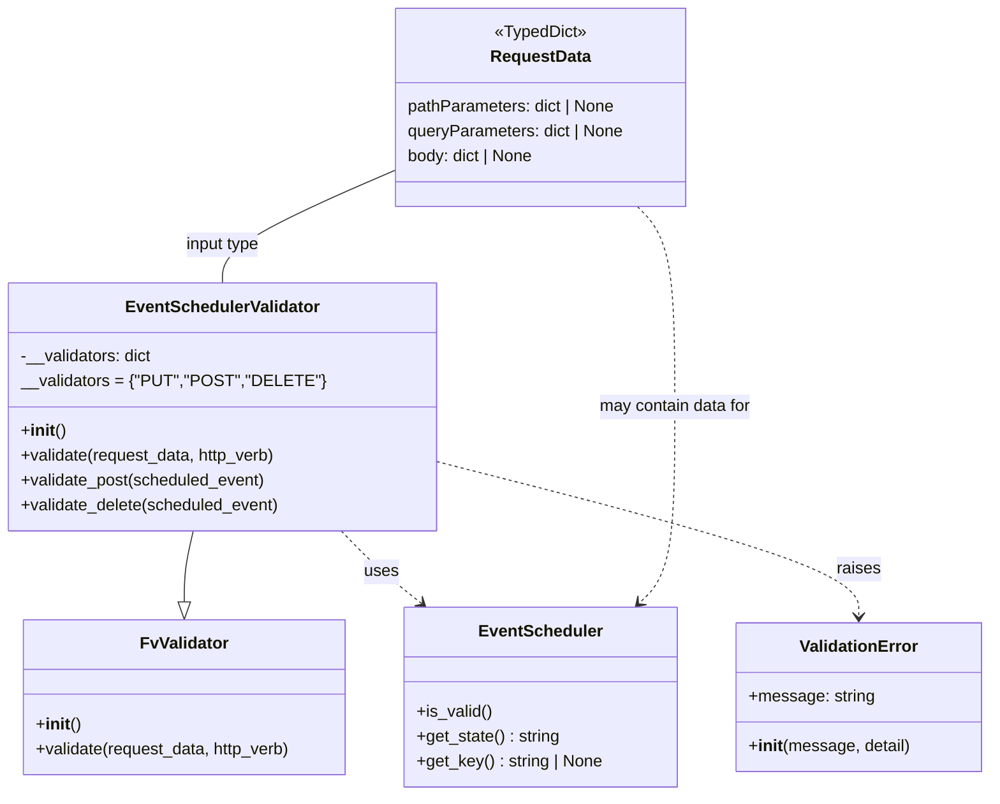

# Diagram: partview_core/partview_service/partview_service/api/event_scheduler/validation/EventSchedulerValidator.py

> Auto-generated by Obscura crawlers

## Mermaid

### SVG

<svg id="container" width="928.6875" xmlns="http://www.w3.org/2000/svg" class="classDiagram" height="770" viewBox="0 0 928.6875 770" role="graphics-document document" aria-roledescription="class"><g><defs><marker id="container_class-aggregationStart" class="marker aggregation class" refX="18" refY="7" markerWidth="190" markerHeight="240" orient="auto"><path d="M 18,7 L9,13 L1,7 L9,1 Z"></path></marker></defs><defs><marker id="container_class-aggregationEnd" class="marker aggregation class" refX="1" refY="7" markerWidth="20" markerHeight="28" orient="auto"><path d="M 18,7 L9,13 L1,7 L9,1 Z"></path></marker></defs><defs><marker id="container_class-extensionStart" class="marker extension class" refX="18" refY="7" markerWidth="190" markerHeight="240" orient="auto"><path d="M 1,7 L18,13 V 1 Z"></path></marker></defs><defs><marker id="container_class-extensionEnd" class="marker extension class" refX="1" refY="7" markerWidth="20" markerHeight="28" orient="auto"><path d="M 1,1 V 13 L18,7 Z"></path></marker></defs><defs><marker id="container_class-compositionStart" class="marker composition class" refX="18" refY="7" markerWidth="190" markerHeight="240" orient="auto"><path d="M 18,7 L9,13 L1,7 L9,1 Z"></path></marker></defs><defs><marker id="container_class-compositionEnd" class="marker composition class" refX="1" refY="7" markerWidth="20" markerHeight="28" orient="auto"><path d="M 18,7 L9,13 L1,7 L9,1 Z"></path></marker></defs><defs><marker id="container_class-dependencyStart" class="marker dependency class" refX="6" refY="7" markerWidth="190" markerHeight="240" orient="auto"><path d="M 5,7 L9,13 L1,7 L9,1 Z"></path></marker></defs><defs><marker id="container_class-dependencyEnd" class="marker dependency class" refX="13" refY="7" markerWidth="20" markerHeight="28" orient="auto"><path d="M 18,7 L9,13 L14,7 L9,1 Z"></path></marker></defs><defs><marker id="container_class-lollipopStart" class="marker lollipop class" refX="13" refY="7" markerWidth="190" markerHeight="240" orient="auto"><circle stroke="black" fill="transparent" cx="7" cy="7" r="6"></circle></marker></defs><defs><marker id="container_class-lollipopEnd" class="marker lollipop class" refX="1" refY="7" markerWidth="190" markerHeight="240" orient="auto"><circle stroke="black" fill="transparent" cx="7" cy="7" r="6"></circle></marker></defs><g class="root"><g class="clusters"></g><g class="edgePaths"><path d="M174.17,514L172.737,520.167C171.304,526.333,168.437,538.667,167.004,550.125C165.57,561.583,165.57,572.167,165.57,577.458L165.57,582.75" id="id_EventSchedulerValidator_FvValidator_1" class="edge-thickness-normal edge-pattern-solid relation" style=";;;" data-edge="true" data-et="edge" data-id="id_EventSchedulerValidator_FvValidator_1" data-points="W3sieCI6MTc0LjE3MDM4MjE2NTYwNTEsInkiOjUxNH0seyJ4IjoxNjUuNTcwMzEyNSwieSI6NTUxfSx7IngiOjE2NS41NzAzMTI1LCJ5Ijo2MDB9XQ==" marker-end="url(#container_class-extensionEnd)"></path><path d="M317.515,514L323.448,520.167C329.381,526.333,341.247,538.667,353.952,550.367C366.656,562.068,380.2,573.136,386.971,578.669L393.743,584.203" id="id_EventSchedulerValidator_EventScheduler_2" class="edge-thickness-normal edge-pattern-dashed relation" style=";;;" data-edge="true" data-et="edge" data-id="id_EventSchedulerValidator_EventScheduler_2" data-points="W3sieCI6MzE3LjUxNTMyNjQzMzEyMSwieSI6NTE0fSx7IngiOjM1My4xMTMyODEyNSwieSI6NTUxfSx7IngiOjM5OC4zODg4NjA4ODcwOTY3NywieSI6NTg4fV0=" marker-end="url(#container_class-dependencyEnd)"></path><path d="M395.313,444.436L463.364,462.197C531.415,479.957,667.518,515.479,735.57,540.906C803.621,566.333,803.621,581.667,803.621,589.333L803.621,597" id="id_EventSchedulerValidator_ValidationError_3" class="edge-thickness-normal edge-pattern-dashed relation" style=";;;" data-edge="true" data-et="edge" data-id="id_EventSchedulerValidator_ValidationError_3" data-points="W3sieCI6Mzk1LjMxMjUsInkiOjQ0NC40MzYwNjc3NjY2NzM4M30seyJ4Ijo4MDMuNjIxMDkzNzUsInkiOjU1MX0seyJ4Ijo4MDMuNjIxMDkzNzUsInkiOjYwM31d" marker-end="url(#container_class-dependencyEnd)"></path><path d="M363.375,166.143L336.49,177.952C309.604,189.762,255.833,213.381,228.948,231.357C202.063,249.333,202.063,261.667,202.063,267.833L202.063,274" id="id_RequestData_EventSchedulerValidator_4" class="edge-thickness-normal edge-pattern-solid relation" style=";;;" data-edge="true" data-et="edge" data-id="id_RequestData_EventSchedulerValidator_4" data-points="W3sieCI6MzYzLjM3NSwieSI6MTY2LjE0MjYyMTIzNzcyNzg3fSx7IngiOjIwMi4wNjI1LCJ5IjoyMzd9LHsieCI6MjAyLjA2MjUsInkiOjI3NH1d"></path><path d="M597.542,200L603.496,206.167C609.45,212.333,621.359,224.667,627.313,257C633.268,289.333,633.268,341.667,633.268,394C633.268,446.333,633.268,498.667,627.6,530.305C621.933,561.944,610.599,572.888,604.932,578.36L599.265,583.832" id="id_RequestData_EventScheduler_5" class="edge-thickness-normal edge-pattern-dashed relation" style=";;;" data-edge="true" data-et="edge" data-id="id_RequestData_EventScheduler_5" data-points="W3sieCI6NTk3LjU0MTczNTE5NzM2ODQsInkiOjIwMH0seyJ4Ijo2MzMuMjY3NTc4MTI1LCJ5IjoyMzd9LHsieCI6NjMzLjI2NzU3ODEyNSwieSI6Mzk0fSx7IngiOjYzMy4yNjc1NzgxMjUsInkiOjU1MX0seyJ4Ijo1OTQuOTQ4NzMwNDY4NzUsInkiOjU4OH1d" marker-end="url(#container_class-dependencyEnd)"></path></g><g class="edgeLabels"><g class="edgeLabel"><g class="label" data-id="id_EventSchedulerValidator_FvValidator_1" transform="translate(0, 0)"><foreignObject width="0" height="0">

</foreignObject></g></g><g class="edgeLabel" transform="translate(355.87262, 553.25498)"><g class="label" data-id="id_EventSchedulerValidator_EventScheduler_2" transform="translate(-16.4921875, -12)"><foreignObject width="32.984375" height="24">

uses

</foreignObject></g></g><g class="edgeLabel" transform="translate(803.62109375, 551)"><g class="label" data-id="id_EventSchedulerValidator_ValidationError_3" transform="translate(-21.25, -12)"><foreignObject width="42.5" height="24">

raises

</foreignObject></g></g><g class="edgeLabel" transform="translate(202.0625, 237)"><g class="label" data-id="id_RequestData_EventSchedulerValidator_4" transform="translate(-37.2578125, -12)"><foreignObject width="74.515625" height="24">

input type

</foreignObject></g></g><g class="edgeLabel" transform="translate(633.267578125, 394)"><g class="label" data-id="id_RequestData_EventScheduler_5" transform="translate(-75.21875, -12)"><foreignObject width="150.4375" height="24">

may contain data for

</foreignObject></g></g></g><g class="nodes"><g class="node default" id="classId-RequestData-0" transform="translate(504.84765625, 104)"><g class="basic label-container"><path d="M-141.47265625 -96 L141.47265625 -96 L141.47265625 96 L-141.47265625 96" stroke="none" stroke-width="0" fill="#ECECFF" style=""></path><path d="M-141.47265625 -96 C-78.59580329396096 -96, -15.718950337921925 -96, 141.47265625 -96 M-141.47265625 -96 C-76.63925063355036 -96, -11.805845017100722 -96, 141.47265625 -96 M141.47265625 -96 C141.47265625 -50.656903045406196, 141.47265625 -5.313806090812392, 141.47265625 96 M141.47265625 -96 C141.47265625 -36.074421060075295, 141.47265625 23.85115787984941, 141.47265625 96 M141.47265625 96 C49.326429891112525 96, -42.81979646777495 96, -141.47265625 96 M141.47265625 96 C42.6015032765914 96, -56.2696496968172 96, -141.47265625 96 M-141.47265625 96 C-141.47265625 37.675671983776866, -141.47265625 -20.64865603244627, -141.47265625 -96 M-141.47265625 96 C-141.47265625 44.13845352309927, -141.47265625 -7.723092953801455, -141.47265625 -96" stroke="#9370DB" stroke-width="1.3" fill="none" stroke-dasharray="0 0" style=""></path></g><g class="annotation-group text" transform="translate(-44.7421875, -72)"><g class="label" style="" transform="translate(0,-12)"><foreignObject width="89.484375" height="24">

«TypedDict»

</foreignObject></g></g><g class="label-group text" transform="translate(-46.8671875, -48)"><g class="label" style="font-weight: bolder" transform="translate(0,-12)"><foreignObject width="93.734375" height="24">

RequestData

</foreignObject></g></g><g class="members-group text" transform="translate(-129.47265625, 0)"><g class="label" style="" transform="translate(0,-12)"><foreignObject width="203.625" height="24">

pathParameters: dict | None

</foreignObject></g><g class="label" style="" transform="translate(0,12)"><foreignObject width="212.078125" height="24">

queryParameters: dict | None

</foreignObject></g><g class="label" style="" transform="translate(0,36)"><foreignObject width="125.234375" height="24">

body: dict | None

</foreignObject></g></g><g class="methods-group text" transform="translate(-129.47265625, 96)"></g><g class="divider" style=""><path d="M-141.47265625 -24 C-59.673981640088925 -24, 22.12469296982215 -24, 141.47265625 -24 M-141.47265625 -24 C-51.34020763803679 -24, 38.792240973926425 -24, 141.47265625 -24" stroke="#9370DB" stroke-width="1.3" fill="none" stroke-dasharray="0 0" style=""></path></g><g class="divider" style=""><path d="M-141.47265625 72 C-29.37740458302065 72, 82.7178470839587 72, 141.47265625 72 M-141.47265625 72 C-42.04871318667006 72, 57.37522987665989 72, 141.47265625 72" stroke="#9370DB" stroke-width="1.3" fill="none" stroke-dasharray="0 0" style=""></path></g></g><g class="node default" id="classId-FvValidator-1" transform="translate(165.5703125, 675)"><g class="basic label-container"><path d="M-157.5703125 -75 L157.5703125 -75 L157.5703125 75 L-157.5703125 75" stroke="none" stroke-width="0" fill="#ECECFF" style=""></path><path d="M-157.5703125 -75 C-40.471068991859966 -75, 76.62817451628007 -75, 157.5703125 -75 M-157.5703125 -75 C-42.798270452391876 -75, 71.97377159521625 -75, 157.5703125 -75 M157.5703125 -75 C157.5703125 -32.73567718116777, 157.5703125 9.528645637664454, 157.5703125 75 M157.5703125 -75 C157.5703125 -29.475274532667044, 157.5703125 16.049450934665913, 157.5703125 75 M157.5703125 75 C88.61696818242199 75, 19.66362386484397 75, -157.5703125 75 M157.5703125 75 C76.50195218675303 75, -4.56640812649394 75, -157.5703125 75 M-157.5703125 75 C-157.5703125 17.64674334111543, -157.5703125 -39.70651331776914, -157.5703125 -75 M-157.5703125 75 C-157.5703125 27.678093755116898, -157.5703125 -19.643812489766205, -157.5703125 -75" stroke="#9370DB" stroke-width="1.3" fill="none" stroke-dasharray="0 0" style=""></path></g><g class="annotation-group text" transform="translate(0, -51)"></g><g class="label-group text" transform="translate(-40.90625, -51)"><g class="label" style="font-weight: bolder" transform="translate(0,-12)"><foreignObject width="81.8125" height="24">

FvValidator

</foreignObject></g></g><g class="members-group text" transform="translate(-145.5703125, -3)"></g><g class="methods-group text" transform="translate(-145.5703125, 27)"><g class="label" style="" transform="translate(0,-12)"><foreignObject width="42.796875" height="24">

+<strong>init</strong>()

</foreignObject></g><g class="label" style="" transform="translate(0,12)"><foreignObject width="250.234375" height="24">

+validate(request_data, http_verb)

</foreignObject></g></g><g class="divider" style=""><path d="M-157.5703125 -27 C-67.76853254643505 -27, 22.033247407129892 -27, 157.5703125 -27 M-157.5703125 -27 C-69.71831762740395 -27, 18.133677245192104 -27, 157.5703125 -27" stroke="#9370DB" stroke-width="1.3" fill="none" stroke-dasharray="0 0" style=""></path></g><g class="divider" style=""><path d="M-157.5703125 -3 C-47.19463279735663 -3, 63.181046905286735 -3, 157.5703125 -3 M-157.5703125 -3 C-86.1578050089855 -3, -14.74529751797101 -3, 157.5703125 -3" stroke="#9370DB" stroke-width="1.3" fill="none" stroke-dasharray="0 0" style=""></path></g></g><g class="node default" id="classId-EventSchedulerValidator-2" transform="translate(202.0625, 394)"><g class="basic label-container"><path d="M-193.25 -120 L193.25 -120 L193.25 120 L-193.25 120" stroke="none" stroke-width="0" fill="#ECECFF" style=""></path><path d="M-193.25 -120 C-66.23249023340593 -120, 60.78501953318815 -120, 193.25 -120 M-193.25 -120 C-48.637090460359275 -120, 95.97581907928145 -120, 193.25 -120 M193.25 -120 C193.25 -67.6969511472636, 193.25 -15.393902294527194, 193.25 120 M193.25 -120 C193.25 -33.816581777600774, 193.25 52.36683644479845, 193.25 120 M193.25 120 C48.3852085784678 120, -96.4795828430644 120, -193.25 120 M193.25 120 C75.9413155386986 120, -41.36736892260279 120, -193.25 120 M-193.25 120 C-193.25 25.297785907066327, -193.25 -69.40442818586735, -193.25 -120 M-193.25 120 C-193.25 70.75934159661747, -193.25 21.518683193234935, -193.25 -120" stroke="#9370DB" stroke-width="1.3" fill="none" stroke-dasharray="0 0" style=""></path></g><g class="annotation-group text" transform="translate(0, -96)"></g><g class="label-group text" transform="translate(-90.171875, -96)"><g class="label" style="font-weight: bolder" transform="translate(0,-12)"><foreignObject width="180.34375" height="24">

EventSchedulerValidator

</foreignObject></g></g><g class="members-group text" transform="translate(-181.25, -48)"><g class="label" style="" transform="translate(0,-12)"><foreignObject width="128.6875" height="24">

-__validators: dict

</foreignObject></g><g class="label" style="" transform="translate(0,12)"><foreignObject width="272.328125" height="24">

__validators = {"PUT","POST","DELETE"}

</foreignObject></g></g><g class="methods-group text" transform="translate(-181.25, 24)"><g class="label" style="" transform="translate(0,-12)"><foreignObject width="42.796875" height="24">

+<strong>init</strong>()

</foreignObject></g><g class="label" style="" transform="translate(0,12)"><foreignObject width="250.234375" height="24">

+validate(request_data, http_verb)

</foreignObject></g><g class="label" style="" transform="translate(0,36)"><foreignObject width="239.515625" height="24">

+validate_post(scheduled_event)

</foreignObject></g><g class="label" style="" transform="translate(0,60)"><foreignObject width="252.96875" height="24">

+validate_delete(scheduled_event)

</foreignObject></g></g><g class="divider" style=""><path d="M-193.25 -72 C-49.278050715000774 -72, 94.69389856999845 -72, 193.25 -72 M-193.25 -72 C-83.44592957459945 -72, 26.358140850801107 -72, 193.25 -72" stroke="#9370DB" stroke-width="1.3" fill="none" stroke-dasharray="0 0" style=""></path></g><g class="divider" style=""><path d="M-193.25 0 C-108.4303800381905 0, -23.610760076381013 0, 193.25 0 M-193.25 0 C-55.18614815754526 0, 82.87770368490948 0, 193.25 0" stroke="#9370DB" stroke-width="1.3" fill="none" stroke-dasharray="0 0" style=""></path></g></g><g class="node default" id="classId-EventScheduler-3" transform="translate(504.84765625, 675)"><g class="basic label-container"><path d="M-131.0234375 -87 L131.0234375 -87 L131.0234375 87 L-131.0234375 87" stroke="none" stroke-width="0" fill="#ECECFF" style=""></path><path d="M-131.0234375 -87 C-35.054077099636615 -87, 60.91528330072677 -87, 131.0234375 -87 M-131.0234375 -87 C-37.84631863985359 -87, 55.330800220292815 -87, 131.0234375 -87 M131.0234375 -87 C131.0234375 -34.678498690847334, 131.0234375 17.64300261830533, 131.0234375 87 M131.0234375 -87 C131.0234375 -38.721747415625266, 131.0234375 9.556505168749467, 131.0234375 87 M131.0234375 87 C27.697022691813117 87, -75.62939211637377 87, -131.0234375 87 M131.0234375 87 C58.535077029679385 87, -13.95328344064123 87, -131.0234375 87 M-131.0234375 87 C-131.0234375 51.57784284974489, -131.0234375 16.15568569948978, -131.0234375 -87 M-131.0234375 87 C-131.0234375 21.03923904713909, -131.0234375 -44.92152190572182, -131.0234375 -87" stroke="#9370DB" stroke-width="1.3" fill="none" stroke-dasharray="0 0" style=""></path></g><g class="annotation-group text" transform="translate(0, -63)"></g><g class="label-group text" transform="translate(-56.984375, -63)"><g class="label" style="font-weight: bolder" transform="translate(0,-12)"><foreignObject width="113.96875" height="24">

EventScheduler

</foreignObject></g></g><g class="members-group text" transform="translate(-119.0234375, -15)"></g><g class="methods-group text" transform="translate(-119.0234375, 15)"><g class="label" style="" transform="translate(0,-12)"><foreignObject width="72.796875" height="24">

+is_valid()

</foreignObject></g><g class="label" style="" transform="translate(0,12)"><foreignObject width="139.28125" height="24">

+get_state() : string

</foreignObject></g><g class="label" style="" transform="translate(0,36)"><foreignObject width="181.0625" height="24">

+get_key() : string | None

</foreignObject></g></g><g class="divider" style=""><path d="M-131.0234375 -39 C-63.560951531325586 -39, 3.901534437348829 -39, 131.0234375 -39 M-131.0234375 -39 C-29.67427827364442 -39, 71.67488095271116 -39, 131.0234375 -39" stroke="#9370DB" stroke-width="1.3" fill="none" stroke-dasharray="0 0" style=""></path></g><g class="divider" style=""><path d="M-131.0234375 -15 C-76.86222924063311 -15, -22.701020981266225 -15, 131.0234375 -15 M-131.0234375 -15 C-47.13600822820652 -15, 36.75142104358696 -15, 131.0234375 -15" stroke="#9370DB" stroke-width="1.3" fill="none" stroke-dasharray="0 0" style=""></path></g></g><g class="node default" id="classId-ValidationError-4" transform="translate(803.62109375, 675)"><g class="basic label-container"><path d="M-117.06640625 -72 L117.06640625 -72 L117.06640625 72 L-117.06640625 72" stroke="none" stroke-width="0" fill="#ECECFF" style=""></path><path d="M-117.06640625 -72 C-41.79074354308378 -72, 33.484919163832444 -72, 117.06640625 -72 M-117.06640625 -72 C-55.334903658485025 -72, 6.396598933029949 -72, 117.06640625 -72 M117.06640625 -72 C117.06640625 -20.313573255346896, 117.06640625 31.37285348930621, 117.06640625 72 M117.06640625 -72 C117.06640625 -19.721867003545754, 117.06640625 32.55626599290849, 117.06640625 72 M117.06640625 72 C54.071990230934354 72, -8.922425788131292 72, -117.06640625 72 M117.06640625 72 C61.337957384423575 72, 5.60950851884715 72, -117.06640625 72 M-117.06640625 72 C-117.06640625 33.36486417435209, -117.06640625 -5.270271651295815, -117.06640625 -72 M-117.06640625 72 C-117.06640625 14.735822676551848, -117.06640625 -42.528354646896304, -117.06640625 -72" stroke="#9370DB" stroke-width="1.3" fill="none" stroke-dasharray="0 0" style=""></path></g><g class="annotation-group text" transform="translate(0, -48)"></g><g class="label-group text" transform="translate(-55.1796875, -48)"><g class="label" style="font-weight: bolder" transform="translate(0,-12)"><foreignObject width="110.359375" height="24">

ValidationError

</foreignObject></g></g><g class="members-group text" transform="translate(-105.06640625, 0)"><g class="label" style="" transform="translate(0,-12)"><foreignObject width="120.09375" height="24">

+message: string

</foreignObject></g></g><g class="methods-group text" transform="translate(-105.06640625, 48)"><g class="label" style="" transform="translate(0,-12)"><foreignObject width="154.953125" height="24">

+<strong>init</strong>(message, detail)

</foreignObject></g></g><g class="divider" style=""><path d="M-117.06640625 -24 C-53.2217271961354 -24, 10.622951857729205 -24, 117.06640625 -24 M-117.06640625 -24 C-46.44976171434739 -24, 24.166882821305222 -24, 117.06640625 -24" stroke="#9370DB" stroke-width="1.3" fill="none" stroke-dasharray="0 0" style=""></path></g><g class="divider" style=""><path d="M-117.06640625 24 C-26.53063611148012 24, 64.00513402703976 24, 117.06640625 24 M-117.06640625 24 C-35.937289831411405 24, 45.19182658717719 24, 117.06640625 24" stroke="#9370DB" stroke-width="1.3" fill="none" stroke-dasharray="0 0" style=""></path></g></g></g></g></g></svg>
