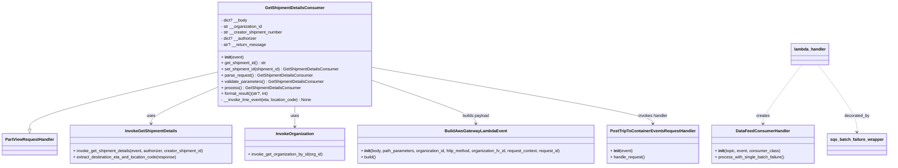

# Diagram: partview_core/partview_service/partview_service/api/get_shipment_details/get_shipment_details_consumer.py


> Auto-generated by Obscura crawlers

## Diagram 1



### SVG

<svg id="container" width="3432.9609375" xmlns="http://www.w3.org/2000/svg" class="classDiagram" height="648" viewBox="0 0 3432.9609375 648" role="graphics-document document" aria-roledescription="class"><style>#container{font-family:"trebuchet ms",verdana,arial,sans-serif;font-size:16px;fill:#333;}@keyframes edge-animation-frame{from{stroke-dashoffset:0;}}@keyframes dash{to{stroke-dashoffset:0;}}#container .edge-animation-slow{stroke-dasharray:9,5!important;stroke-dashoffset:900;animation:dash 50s linear infinite;stroke-linecap:round;}#container .edge-animation-fast{stroke-dasharray:9,5!important;stroke-dashoffset:900;animation:dash 20s linear infinite;stroke-linecap:round;}#container .error-icon{fill:#552222;}#container .error-text{fill:#552222;stroke:#552222;}#container .edge-thickness-normal{stroke-width:1px;}#container .edge-thickness-thick{stroke-width:3.5px;}#container .edge-pattern-solid{stroke-dasharray:0;}#container .edge-thickness-invisible{stroke-width:0;fill:none;}#container .edge-pattern-dashed{stroke-dasharray:3;}#container .edge-pattern-dotted{stroke-dasharray:2;}#container .marker{fill:#333333;stroke:#333333;}#container .marker.cross{stroke:#333333;}#container svg{font-family:"trebuchet ms",verdana,arial,sans-serif;font-size:16px;}#container p{margin:0;}#container g.classGroup text{fill:#9370DB;stroke:none;font-family:"trebuchet ms",verdana,arial,sans-serif;font-size:10px;}#container g.classGroup text .title{font-weight:bolder;}#container .nodeLabel,#container .edgeLabel{color:#131300;}#container .edgeLabel .label rect{fill:#ECECFF;}#container .label text{fill:#131300;}#container .labelBkg{background:#ECECFF;}#container .edgeLabel .label span{background:#ECECFF;}#container .classTitle{font-weight:bolder;}#container .node rect,#container .node circle,#container .node ellipse,#container .node polygon,#container .node path{fill:#ECECFF;stroke:#9370DB;stroke-width:1px;}#container .divider{stroke:#9370DB;stroke-width:1;}#container g.clickable{cursor:pointer;}#container g.classGroup rect{fill:#ECECFF;stroke:#9370DB;}#container g.classGroup line{stroke:#9370DB;stroke-width:1;}#container .classLabel .box{stroke:none;stroke-width:0;fill:#ECECFF;opacity:0.5;}#container .classLabel .label{fill:#9370DB;font-size:10px;}#container .relation{stroke:#333333;stroke-width:1;fill:none;}#container .dashed-line{stroke-dasharray:3;}#container .dotted-line{stroke-dasharray:1 2;}#container #compositionStart,#container .composition{fill:#333333!important;stroke:#333333!important;stroke-width:1;}#container #compositionEnd,#container .composition{fill:#333333!important;stroke:#333333!important;stroke-width:1;}#container #dependencyStart,#container .dependency{fill:#333333!important;stroke:#333333!important;stroke-width:1;}#container #dependencyStart,#container .dependency{fill:#333333!important;stroke:#333333!important;stroke-width:1;}#container #extensionStart,#container .extension{fill:transparent!important;stroke:#333333!important;stroke-width:1;}#container #extensionEnd,#container .extension{fill:transparent!important;stroke:#333333!important;stroke-width:1;}#container #aggregationStart,#container .aggregation{fill:transparent!important;stroke:#333333!important;stroke-width:1;}#container #aggregationEnd,#container .aggregation{fill:transparent!important;stroke:#333333!important;stroke-width:1;}#container #lollipopStart,#container .lollipop{fill:#ECECFF!important;stroke:#333333!important;stroke-width:1;}#container #lollipopEnd,#container .lollipop{fill:#ECECFF!important;stroke:#333333!important;stroke-width:1;}#container .edgeTerminals{font-size:11px;line-height:initial;}#container .classTitleText{text-anchor:middle;font-size:18px;fill:#333;}#container .label-icon{display:inline-block;height:1em;overflow:visible;vertical-align:-0.125em;}#container .node .label-icon path{fill:currentColor;stroke:revert;stroke-width:revert;}#container :root{--mermaid-font-family:"trebuchet ms",verdana,arial,sans-serif;}</style><g><defs><marker id="container_class-aggregationStart" class="marker aggregation class" refX="18" refY="7" markerWidth="190" markerHeight="240" orient="auto"><path d="M 18,7 L9,13 L1,7 L9,1 Z"></path></marker></defs><defs><marker id="container_class-aggregationEnd" class="marker aggregation class" refX="1" refY="7" markerWidth="20" markerHeight="28" orient="auto"><path d="M 18,7 L9,13 L1,7 L9,1 Z"></path></marker></defs><defs><marker id="container_class-extensionStart" class="marker extension class" refX="18" refY="7" markerWidth="190" markerHeight="240" orient="auto"><path d="M 1,7 L18,13 V 1 Z"></path></marker></defs><defs><marker id="container_class-extensionEnd" class="marker extension class" refX="1" refY="7" markerWidth="20" markerHeight="28" orient="auto"><path d="M 1,1 V 13 L18,7 Z"></path></marker></defs><defs><marker id="container_class-compositionStart" class="marker composition class" refX="18" refY="7" markerWidth="190" markerHeight="240" orient="auto"><path d="M 18,7 L9,13 L1,7 L9,1 Z"></path></marker></defs><defs><marker id="container_class-compositionEnd" class="marker composition class" refX="1" refY="7" markerWidth="20" markerHeight="28" orient="auto"><path d="M 18,7 L9,13 L1,7 L9,1 Z"></path></marker></defs><defs><marker id="container_class-dependencyStart" class="marker dependency class" refX="6" refY="7" markerWidth="190" markerHeight="240" orient="auto"><path d="M 5,7 L9,13 L1,7 L9,1 Z"></path></marker></defs><defs><marker id="container_class-dependencyEnd" class="marker dependency class" refX="13" refY="7" markerWidth="20" markerHeight="28" orient="auto"><path d="M 18,7 L9,13 L14,7 L9,1 Z"></path></marker></defs><defs><marker id="container_class-lollipopStart" class="marker lollipop class" refX="13" refY="7" markerWidth="190" markerHeight="240" orient="auto"><circle stroke="black" fill="transparent" cx="7" cy="7" r="6"></circle></marker></defs><defs><marker id="container_class-lollipopEnd" class="marker lollipop class" refX="1" refY="7" markerWidth="190" markerHeight="240" orient="auto"><circle stroke="black" fill="transparent" cx="7" cy="7" r="6"></circle></marker></defs><g class="root"><g class="clusters"></g><g class="edgePaths"><path d="M846.332,281.678L723.837,310.232C601.341,338.785,356.35,395.893,233.855,433.238C111.359,470.583,111.359,488.167,111.359,496.958L111.359,505.75" id="id_GetShipmentDetailsConsumer_PartViewRequestHandler_1" class="edge-thickness-normal edge-pattern-solid relation" style=";;;" data-edge="true" data-et="edge" data-id="id_GetShipmentDetailsConsumer_PartViewRequestHandler_1" data-points="W3sieCI6ODQ2LjMzMjAzMTI1LCJ5IjoyODEuNjc3ODA2MDcyMzI5OTN9LHsieCI6MTExLjM1OTM3NSwieSI6NDUzfSx7IngiOjExMS4zNTkzNzUsInkiOjUyM31d" marker-end="url(#container_class-extensionEnd)"></path><path d="M846.332,340.122L802.44,358.935C758.548,377.748,670.764,415.374,626.872,439.354C582.98,463.333,582.98,473.667,582.98,478.833L582.98,484" id="id_GetShipmentDetailsConsumer_InvokeGetShipmentDetails_2" class="edge-thickness-normal edge-pattern-solid relation" style=";;;" data-edge="true" data-et="edge" data-id="id_GetShipmentDetailsConsumer_InvokeGetShipmentDetails_2" data-points="W3sieCI6ODQ2LjMzMjAzMTI1LCJ5IjozNDAuMTIyMjM3NTgzNDU0M30seyJ4Ijo1ODIuOTgwNDY4NzUsInkiOjQ1M30seyJ4Ijo1ODIuOTgwNDY4NzUsInkiOjQ5MH1d" marker-end="url(#container_class-dependencyEnd)"></path><path d="M1145.25,416L1145.25,422.167C1145.25,428.333,1145.25,440.667,1145.25,454C1145.25,467.333,1145.25,481.667,1145.25,488.833L1145.25,496" id="id_GetShipmentDetailsConsumer_InvokeOrganization_3" class="edge-thickness-normal edge-pattern-solid relation" style=";;;" data-edge="true" data-et="edge" data-id="id_GetShipmentDetailsConsumer_InvokeOrganization_3" data-points="W3sieCI6MTE0NS4yNSwieSI6NDE2fSx7IngiOjExNDUuMjUsInkiOjQ1M30seyJ4IjoxMTQ1LjI1LCJ5Ijo1MDJ9XQ==" marker-end="url(#container_class-dependencyEnd)"></path><path d="M1444.168,313.674L1512.437,336.895C1580.706,360.116,1717.243,406.558,1785.512,434.946C1853.781,463.333,1853.781,473.667,1853.781,478.833L1853.781,484" id="id_GetShipmentDetailsConsumer_BuildAwsGatewayLambdaEvent_4" class="edge-thickness-normal edge-pattern-solid relation" style=";;;" data-edge="true" data-et="edge" data-id="id_GetShipmentDetailsConsumer_BuildAwsGatewayLambdaEvent_4" data-points="W3sieCI6MTQ0NC4xNjc5Njg3NSwieSI6MzEzLjY3NDAzNDA5MzQxNTA2fSx7IngiOjE4NTMuNzgxMjUsInkiOjQ1M30seyJ4IjoxODUzLjc4MTI1LCJ5Ijo0OTB9XQ==" marker-end="url(#container_class-dependencyEnd)"></path><path d="M1444.168,263.721L1626.49,295.267C1808.813,326.814,2173.457,389.907,2355.779,426.62C2538.102,463.333,2538.102,473.667,2538.102,478.833L2538.102,484" id="id_GetShipmentDetailsConsumer_PostTripToContainerEventsRequestHandler_5" class="edge-thickness-normal edge-pattern-solid relation" style=";;;" data-edge="true" data-et="edge" data-id="id_GetShipmentDetailsConsumer_PostTripToContainerEventsRequestHandler_5" data-points="W3sieCI6MTQ0NC4xNjc5Njg3NSwieSI6MjYzLjcyMDY4MDM3MTMxNTZ9LHsieCI6MjUzOC4xMDE1NjI1LCJ5Ijo0NTN9LHsieCI6MjUzOC4xMDE1NjI1LCJ5Ijo0OTB9XQ==" marker-end="url(#container_class-dependencyEnd)"></path><path d="M3103.501,254L3078.83,287.167C3054.159,320.333,3004.818,386.667,2980.147,425C2955.477,463.333,2955.477,473.667,2955.477,478.833L2955.477,484" id="id_lambda_handler_DataFeedConsumerHandler_6" class="edge-thickness-normal edge-pattern-dashed relation" style=";;;" data-edge="true" data-et="edge" data-id="id_lambda_handler_DataFeedConsumerHandler_6" data-points="W3sieCI6MzEwMy41MDA4NzUyNTkzMzYsInkiOjI1NH0seyJ4IjoyOTU1LjQ3NjU2MjUsInkiOjQ1M30seyJ4IjoyOTU1LjQ3NjU2MjUsInkiOjQ5MH1d" marker-end="url(#container_class-dependencyEnd)"></path><path d="M3165.983,254L3190.654,287.167C3215.325,320.333,3264.666,386.667,3289.337,430.5C3314.008,474.333,3314.008,495.667,3314.008,506.333L3314.008,517" id="id_lambda_handler_sqs_batch_failure_wrapper_7" class="edge-thickness-normal edge-pattern-dashed relation" style=";;;" data-edge="true" data-et="edge" data-id="id_lambda_handler_sqs_batch_failure_wrapper_7" data-points="W3sieCI6MzE2NS45ODM0OTk3NDA2NjQsInkiOjI1NH0seyJ4IjozMzE0LjAwNzgxMjUsInkiOjQ1M30seyJ4IjozMzE0LjAwNzgxMjUsInkiOjUyM31d" marker-end="url(#container_class-dependencyEnd)"></path></g><g class="edgeLabels"><g class="edgeLabel"><g class="label" data-id="id_GetShipmentDetailsConsumer_PartViewRequestHandler_1" transform="translate(0, 0)"><foreignObject width="0" height="0"><div xmlns="http://www.w3.org/1999/xhtml" class="labelBkg" style="display: table-cell; white-space: nowrap; line-height: 1.5; max-width: 200px; text-align: center;"><span class="edgeLabel"></span></div></foreignObject></g></g><g class="edgeLabel" transform="translate(582.98046875, 453)"><g class="label" data-id="id_GetShipmentDetailsConsumer_InvokeGetShipmentDetails_2" transform="translate(-16.4921875, -12)"><foreignObject width="32.984375" height="24"><div xmlns="http://www.w3.org/1999/xhtml" class="labelBkg" style="display: table-cell; white-space: nowrap; line-height: 1.5; max-width: 200px; text-align: center;"><span class="edgeLabel"><p>uses</p></span></div></foreignObject></g></g><g class="edgeLabel" transform="translate(1145.25, 453)"><g class="label" data-id="id_GetShipmentDetailsConsumer_InvokeOrganization_3" transform="translate(-16.4921875, -12)"><foreignObject width="32.984375" height="24"><div xmlns="http://www.w3.org/1999/xhtml" class="labelBkg" style="display: table-cell; white-space: nowrap; line-height: 1.5; max-width: 200px; text-align: center;"><span class="edgeLabel"><p>uses</p></span></div></foreignObject></g></g><g class="edgeLabel" transform="translate(1853.78125, 453)"><g class="label" data-id="id_GetShipmentDetailsConsumer_BuildAwsGatewayLambdaEvent_4" transform="translate(-53.484375, -12)"><foreignObject width="106.96875" height="24"><div xmlns="http://www.w3.org/1999/xhtml" class="labelBkg" style="display: table-cell; white-space: nowrap; line-height: 1.5; max-width: 200px; text-align: center;"><span class="edgeLabel"><p>builds payload</p></span></div></foreignObject></g></g><g class="edgeLabel" transform="translate(2538.1015625, 453)"><g class="label" data-id="id_GetShipmentDetailsConsumer_PostTripToContainerEventsRequestHandler_5" transform="translate(-57.96875, -12)"><foreignObject width="115.9375" height="24"><div xmlns="http://www.w3.org/1999/xhtml" class="labelBkg" style="display: table-cell; white-space: nowrap; line-height: 1.5; max-width: 200px; text-align: center;"><span class="edgeLabel"><p>invokes handler</p></span></div></foreignObject></g></g><g class="edgeLabel" transform="translate(2955.4765625, 453)"><g class="label" data-id="id_lambda_handler_DataFeedConsumerHandler_6" transform="translate(-26.171875, -12)"><foreignObject width="52.34375" height="24"><div xmlns="http://www.w3.org/1999/xhtml" class="labelBkg" style="display: table-cell; white-space: nowrap; line-height: 1.5; max-width: 200px; text-align: center;"><span class="edgeLabel"><p>creates</p></span></div></foreignObject></g></g><g class="edgeLabel" transform="translate(3314.0078125, 453)"><g class="label" data-id="id_lambda_handler_sqs_batch_failure_wrapper_7" transform="translate(-49.375, -12)"><foreignObject width="98.75" height="24"><div xmlns="http://www.w3.org/1999/xhtml" class="labelBkg" style="display: table-cell; white-space: nowrap; line-height: 1.5; max-width: 200px; text-align: center;"><span class="edgeLabel"><p>decorated_by</p></span></div></foreignObject></g></g></g><g class="nodes"><g class="node default" id="classId-GetShipmentDetailsConsumer-0" transform="translate(1145.25, 212)"><g class="basic label-container"><path d="M-298.91796875 -204 L298.91796875 -204 L298.91796875 204 L-298.91796875 204" stroke="none" stroke-width="0" fill="#ECECFF" style=""></path><path d="M-298.91796875 -204 C-63.7773541262539 -204, 171.3632604974922 -204, 298.91796875 -204 M-298.91796875 -204 C-134.72533652072002 -204, 29.46729570855996 -204, 298.91796875 -204 M298.91796875 -204 C298.91796875 -69.52882565538616, 298.91796875 64.94234868922769, 298.91796875 204 M298.91796875 -204 C298.91796875 -95.83937328505716, 298.91796875 12.321253429885672, 298.91796875 204 M298.91796875 204 C174.69605939723235 204, 50.47415004446469 204, -298.91796875 204 M298.91796875 204 C136.38026546236736 204, -26.157437825265276 204, -298.91796875 204 M-298.91796875 204 C-298.91796875 92.58085583695437, -298.91796875 -18.83828832609126, -298.91796875 -204 M-298.91796875 204 C-298.91796875 121.03548443065904, -298.91796875 38.07096886131808, -298.91796875 -204" stroke="#9370DB" stroke-width="1.3" fill="none" stroke-dasharray="0 0" style=""></path></g><g class="annotation-group text" transform="translate(0, -180)"></g><g class="label-group text" transform="translate(-109.8203125, -180)"><g class="label" style="font-weight: bolder" transform="translate(0,-12)"><foreignObject width="219.640625" height="24"><div xmlns="http://www.w3.org/1999/xhtml" style="display: table-cell; white-space: nowrap; line-height: 1.5; max-width: 268px; text-align: center;"><span class="nodeLabel markdown-node-label" style=""><p>GetShipmentDetailsConsumer</p></span></div></foreignObject></g></g><g class="members-group text" transform="translate(-286.91796875, -132)"><g class="label" style="" transform="translate(0,-12)"><foreignObject width="102.078125" height="24"><div xmlns="http://www.w3.org/1999/xhtml" style="display: table-cell; white-space: nowrap; line-height: 1.5; max-width: 160px; text-align: center;"><span class="nodeLabel markdown-node-label" style=""><p>- dict? __body</p></span></div></foreignObject></g><g class="label" style="" transform="translate(0,12)"><foreignObject width="163.265625" height="24"><div xmlns="http://www.w3.org/1999/xhtml" style="display: table-cell; white-space: nowrap; line-height: 1.5; max-width: 221px; text-align: center;"><span class="nodeLabel markdown-node-label" style=""><p>- str __organization_id</p></span></div></foreignObject></g><g class="label" style="" transform="translate(0,36)"><foreignObject width="242.796875" height="24"><div xmlns="http://www.w3.org/1999/xhtml" style="display: table-cell; white-space: nowrap; line-height: 1.5; max-width: 301px; text-align: center;"><span class="nodeLabel markdown-node-label" style=""><p>- str __creator_shipment_number</p></span></div></foreignObject></g><g class="label" style="" transform="translate(0,60)"><foreignObject width="140.4375" height="24"><div xmlns="http://www.w3.org/1999/xhtml" style="display: table-cell; white-space: nowrap; line-height: 1.5; max-width: 199px; text-align: center;"><span class="nodeLabel markdown-node-label" style=""><p>- dict? __authorizer</p></span></div></foreignObject></g><g class="label" style="" transform="translate(0,84)"><foreignObject width="173.46875" height="24"><div xmlns="http://www.w3.org/1999/xhtml" style="display: table-cell; white-space: nowrap; line-height: 1.5; max-width: 231px; text-align: center;"><span class="nodeLabel markdown-node-label" style=""><p>- str? __return_message</p></span></div></foreignObject></g></g><g class="methods-group text" transform="translate(-286.91796875, 12)"><g class="label" style="" transform="translate(0,-12)"><foreignObject width="87.390625" height="24"><div xmlns="http://www.w3.org/1999/xhtml" style="display: table-cell; white-space: nowrap; line-height: 1.5; max-width: 177px; text-align: center;"><span class="nodeLabel markdown-node-label" style=""><p>+ <strong>init</strong>(event)</p></span></div></foreignObject></g><g class="label" style="" transform="translate(0,12)"><foreignObject width="176.078125" height="24"><div xmlns="http://www.w3.org/1999/xhtml" style="display: table-cell; white-space: nowrap; line-height: 1.5; max-width: 234px; text-align: center;"><span class="nodeLabel markdown-node-label" style=""><p>+ get_shipment_id() : str</p></span></div></foreignObject></g><g class="label" style="" transform="translate(0,36)"><foreignObject width="464.015625" height="24"><div xmlns="http://www.w3.org/1999/xhtml" style="display: table-cell; white-space: nowrap; line-height: 1.5; max-width: 522px; text-align: center;"><span class="nodeLabel markdown-node-label" style=""><p>+ set_shipment_id(shipment_id) : GetShipmentDetailsConsumer</p></span></div></foreignObject></g><g class="label" style="" transform="translate(0,60)"><foreignObject width="355.46875" height="24"><div xmlns="http://www.w3.org/1999/xhtml" style="display: table-cell; white-space: nowrap; line-height: 1.5; max-width: 414px; text-align: center;"><span class="nodeLabel markdown-node-label" style=""><p>+ parse_request() : GetShipmentDetailsConsumer</p></span></div></foreignObject></g><g class="label" style="" transform="translate(0,84)"><foreignObject width="400.375" height="24"><div xmlns="http://www.w3.org/1999/xhtml" style="display: table-cell; white-space: nowrap; line-height: 1.5; max-width: 459px; text-align: center;"><span class="nodeLabel markdown-node-label" style=""><p>+ validate_parameters() : GetShipmentDetailsConsumer</p></span></div></foreignObject></g><g class="label" style="" transform="translate(0,108)"><foreignObject width="307.40625" height="24"><div xmlns="http://www.w3.org/1999/xhtml" style="display: table-cell; white-space: nowrap; line-height: 1.5; max-width: 366px; text-align: center;"><span class="nodeLabel markdown-node-label" style=""><p>+ process() : GetShipmentDetailsConsumer</p></span></div></foreignObject></g><g class="label" style="" transform="translate(0,132)"><foreignObject width="184.296875" height="24"><div xmlns="http://www.w3.org/1999/xhtml" style="display: table-cell; white-space: nowrap; line-height: 1.5; max-width: 242px; text-align: center;"><span class="nodeLabel markdown-node-label" style=""><p>+ format_result()(str?, int)</p></span></div></foreignObject></g><g class="label" style="" transform="translate(0,156)"><foreignObject width="352.1875" height="24"><div xmlns="http://www.w3.org/1999/xhtml" style="display: table-cell; white-space: nowrap; line-height: 1.5; max-width: 410px; text-align: center;"><span class="nodeLabel markdown-node-label" style=""><p>- __invoke_lme_event(eta, location_code) : None</p></span></div></foreignObject></g></g><g class="divider" style=""><path d="M-298.91796875 -156 C-155.1935221524066 -156, -11.469075554813173 -156, 298.91796875 -156 M-298.91796875 -156 C-97.91578410360984 -156, 103.08640054278032 -156, 298.91796875 -156" stroke="#9370DB" stroke-width="1.3" fill="none" stroke-dasharray="0 0" style=""></path></g><g class="divider" style=""><path d="M-298.91796875 -12 C-170.23024068654334 -12, -41.54251262308668 -12, 298.91796875 -12 M-298.91796875 -12 C-152.32493932558276 -12, -5.731909901165523 -12, 298.91796875 -12" stroke="#9370DB" stroke-width="1.3" fill="none" stroke-dasharray="0 0" style=""></path></g></g><g class="node default" id="classId-PartViewRequestHandler-1" transform="translate(111.359375, 565)"><g class="basic label-container"><path d="M-103.359375 -42 L103.359375 -42 L103.359375 42 L-103.359375 42" stroke="none" stroke-width="0" fill="#ECECFF" style=""></path><path d="M-103.359375 -42 C-48.5132259149918 -42, 6.3329231700164 -42, 103.359375 -42 M-103.359375 -42 C-32.999717670175144 -42, 37.35993965964971 -42, 103.359375 -42 M103.359375 -42 C103.359375 -15.70462506577925, 103.359375 10.590749868441499, 103.359375 42 M103.359375 -42 C103.359375 -9.611267841374854, 103.359375 22.777464317250292, 103.359375 42 M103.359375 42 C27.773769260584558 42, -47.811836478830884 42, -103.359375 42 M103.359375 42 C23.13982124387563 42, -57.07973251224874 42, -103.359375 42 M-103.359375 42 C-103.359375 19.16510545449014, -103.359375 -3.669789091019723, -103.359375 -42 M-103.359375 42 C-103.359375 9.482031625464892, -103.359375 -23.035936749070217, -103.359375 -42" stroke="#9370DB" stroke-width="1.3" fill="none" stroke-dasharray="0 0" style=""></path></g><g class="annotation-group text" transform="translate(0, -18)"></g><g class="label-group text" transform="translate(-91.359375, -18)"><g class="label" style="font-weight: bolder" transform="translate(0,-12)"><foreignObject width="182.71875" height="24"><div xmlns="http://www.w3.org/1999/xhtml" style="display: table-cell; white-space: nowrap; line-height: 1.5; max-width: 231px; text-align: center;"><span class="nodeLabel markdown-node-label" style=""><p>PartViewRequestHandler</p></span></div></foreignObject></g></g><g class="members-group text" transform="translate(-91.359375, 30)"></g><g class="methods-group text" transform="translate(-91.359375, 60)"></g><g class="divider" style=""><path d="M-103.359375 6 C-26.749982243148324 6, 49.85941051370335 6, 103.359375 6 M-103.359375 6 C-36.806337634957444 6, 29.746699730085112 6, 103.359375 6" stroke="#9370DB" stroke-width="1.3" fill="none" stroke-dasharray="0 0" style=""></path></g><g class="divider" style=""><path d="M-103.359375 24 C-41.44515237946183 24, 20.469070241076338 24, 103.359375 24 M-103.359375 24 C-34.577397943253175 24, 34.20457911349365 24, 103.359375 24" stroke="#9370DB" stroke-width="1.3" fill="none" stroke-dasharray="0 0" style=""></path></g></g><g class="node default" id="classId-InvokeGetShipmentDetails-2" transform="translate(582.98046875, 565)"><g class="basic label-container"><path d="M-318.26171875 -75 L318.26171875 -75 L318.26171875 75 L-318.26171875 75" stroke="none" stroke-width="0" fill="#ECECFF" style=""></path><path d="M-318.26171875 -75 C-165.44556227344236 -75, -12.629405796884726 -75, 318.26171875 -75 M-318.26171875 -75 C-179.09877686855856 -75, -39.93583498711712 -75, 318.26171875 -75 M318.26171875 -75 C318.26171875 -25.114352046743313, 318.26171875 24.771295906513373, 318.26171875 75 M318.26171875 -75 C318.26171875 -42.82223202311101, 318.26171875 -10.644464046222026, 318.26171875 75 M318.26171875 75 C172.26934881103608 75, 26.276978872072164 75, -318.26171875 75 M318.26171875 75 C187.31878730473366 75, 56.37585585946732 75, -318.26171875 75 M-318.26171875 75 C-318.26171875 42.04479272774425, -318.26171875 9.089585455488503, -318.26171875 -75 M-318.26171875 75 C-318.26171875 37.952946454527606, -318.26171875 0.9058929090552112, -318.26171875 -75" stroke="#9370DB" stroke-width="1.3" fill="none" stroke-dasharray="0 0" style=""></path></g><g class="annotation-group text" transform="translate(0, -51)"></g><g class="label-group text" transform="translate(-97.6171875, -51)"><g class="label" style="font-weight: bolder" transform="translate(0,-12)"><foreignObject width="195.234375" height="24"><div xmlns="http://www.w3.org/1999/xhtml" style="display: table-cell; white-space: nowrap; line-height: 1.5; max-width: 242px; text-align: center;"><span class="nodeLabel markdown-node-label" style=""><p>InvokeGetShipmentDetails</p></span></div></foreignObject></g></g><g class="members-group text" transform="translate(-306.26171875, -3)"></g><g class="methods-group text" transform="translate(-306.26171875, 27)"><g class="label" style="" transform="translate(0,-12)"><foreignObject width="514.90625" height="24"><div xmlns="http://www.w3.org/1999/xhtml" style="display: table-cell; white-space: nowrap; line-height: 1.5; max-width: 572px; text-align: center;"><span class="nodeLabel markdown-node-label" style=""><p>+ invoke_get_shipment_details(event, authorizer, creator_shipment_id)</p></span></div></foreignObject></g><g class="label" style="" transform="translate(0,12)"><foreignObject width="406.90625" height="24"><div xmlns="http://www.w3.org/1999/xhtml" style="display: table-cell; white-space: nowrap; line-height: 1.5; max-width: 464px; text-align: center;"><span class="nodeLabel markdown-node-label" style=""><p>+ extract_destination_eta_and_location_code(response)</p></span></div></foreignObject></g></g><g class="divider" style=""><path d="M-318.26171875 -27 C-152.78237950515606 -27, 12.696959739687884 -27, 318.26171875 -27 M-318.26171875 -27 C-184.12691178983167 -27, -49.99210482966333 -27, 318.26171875 -27" stroke="#9370DB" stroke-width="1.3" fill="none" stroke-dasharray="0 0" style=""></path></g><g class="divider" style=""><path d="M-318.26171875 -3 C-154.9031474235923 -3, 8.455423902815426 -3, 318.26171875 -3 M-318.26171875 -3 C-89.755446269685 -3, 138.75082621063 -3, 318.26171875 -3" stroke="#9370DB" stroke-width="1.3" fill="none" stroke-dasharray="0 0" style=""></path></g></g><g class="node default" id="classId-InvokeOrganization-3" transform="translate(1145.25, 565)"><g class="basic label-container"><path d="M-194.0078125 -63 L194.0078125 -63 L194.0078125 63 L-194.0078125 63" stroke="none" stroke-width="0" fill="#ECECFF" style=""></path><path d="M-194.0078125 -63 C-100.9386403179992 -63, -7.869468135998403 -63, 194.0078125 -63 M-194.0078125 -63 C-96.8924015149132 -63, 0.22300947017359363 -63, 194.0078125 -63 M194.0078125 -63 C194.0078125 -33.537101956116416, 194.0078125 -4.074203912232825, 194.0078125 63 M194.0078125 -63 C194.0078125 -20.071007145159562, 194.0078125 22.857985709680875, 194.0078125 63 M194.0078125 63 C39.87024715232528 63, -114.26731819534945 63, -194.0078125 63 M194.0078125 63 C91.263912560015 63, -11.479987379969998 63, -194.0078125 63 M-194.0078125 63 C-194.0078125 15.05378111346976, -194.0078125 -32.89243777306048, -194.0078125 -63 M-194.0078125 63 C-194.0078125 36.61745840545406, -194.0078125 10.234916810908118, -194.0078125 -63" stroke="#9370DB" stroke-width="1.3" fill="none" stroke-dasharray="0 0" style=""></path></g><g class="annotation-group text" transform="translate(0, -39)"></g><g class="label-group text" transform="translate(-71.046875, -39)"><g class="label" style="font-weight: bolder" transform="translate(0,-12)"><foreignObject width="142.09375" height="24"><div xmlns="http://www.w3.org/1999/xhtml" style="display: table-cell; white-space: nowrap; line-height: 1.5; max-width: 190px; text-align: center;"><span class="nodeLabel markdown-node-label" style=""><p>InvokeOrganization</p></span></div></foreignObject></g></g><g class="members-group text" transform="translate(-182.0078125, 9)"></g><g class="methods-group text" transform="translate(-182.0078125, 39)"><g class="label" style="" transform="translate(0,-12)"><foreignObject width="292.96875" height="24"><div xmlns="http://www.w3.org/1999/xhtml" style="display: table-cell; white-space: nowrap; line-height: 1.5; max-width: 350px; text-align: center;"><span class="nodeLabel markdown-node-label" style=""><p>+ invoke_get_organization_by_id(org_id)</p></span></div></foreignObject></g></g><g class="divider" style=""><path d="M-194.0078125 -15 C-63.01808932762083 -15, 67.97163384475834 -15, 194.0078125 -15 M-194.0078125 -15 C-99.40008065554984 -15, -4.792348811099686 -15, 194.0078125 -15" stroke="#9370DB" stroke-width="1.3" fill="none" stroke-dasharray="0 0" style=""></path></g><g class="divider" style=""><path d="M-194.0078125 9 C-57.58868456740424 9, 78.83044336519151 9, 194.0078125 9 M-194.0078125 9 C-94.58953348515045 9, 4.828745529699091 9, 194.0078125 9" stroke="#9370DB" stroke-width="1.3" fill="none" stroke-dasharray="0 0" style=""></path></g></g><g class="node default" id="classId-PostTripToContainerEventsRequestHandler-4" transform="translate(2538.1015625, 565)"><g class="basic label-container"><path d="M-169.796875 -75 L169.796875 -75 L169.796875 75 L-169.796875 75" stroke="none" stroke-width="0" fill="#ECECFF" style=""></path><path d="M-169.796875 -75 C-91.36819679481171 -75, -12.939518589623418 -75, 169.796875 -75 M-169.796875 -75 C-52.102789643039955 -75, 65.59129571392009 -75, 169.796875 -75 M169.796875 -75 C169.796875 -29.971695381579124, 169.796875 15.056609236841751, 169.796875 75 M169.796875 -75 C169.796875 -36.978861739633665, 169.796875 1.0422765207326705, 169.796875 75 M169.796875 75 C51.88994578131508 75, -66.01698343736984 75, -169.796875 75 M169.796875 75 C62.51551678202273 75, -44.76584143595454 75, -169.796875 75 M-169.796875 75 C-169.796875 32.14284552285036, -169.796875 -10.714308954299284, -169.796875 -75 M-169.796875 75 C-169.796875 25.442336445575428, -169.796875 -24.115327108849144, -169.796875 -75" stroke="#9370DB" stroke-width="1.3" fill="none" stroke-dasharray="0 0" style=""></path></g><g class="annotation-group text" transform="translate(0, -51)"></g><g class="label-group text" transform="translate(-157.796875, -51)"><g class="label" style="font-weight: bolder" transform="translate(0,-12)"><foreignObject width="315.59375" height="24"><div xmlns="http://www.w3.org/1999/xhtml" style="display: table-cell; white-space: nowrap; line-height: 1.5; max-width: 362px; text-align: center;"><span class="nodeLabel markdown-node-label" style=""><p>PostTripToContainerEventsRequestHandler</p></span></div></foreignObject></g></g><g class="members-group text" transform="translate(-157.796875, -3)"></g><g class="methods-group text" transform="translate(-157.796875, 27)"><g class="label" style="" transform="translate(0,-12)"><foreignObject width="87.390625" height="24"><div xmlns="http://www.w3.org/1999/xhtml" style="display: table-cell; white-space: nowrap; line-height: 1.5; max-width: 177px; text-align: center;"><span class="nodeLabel markdown-node-label" style=""><p>+ <strong>init</strong>(event)</p></span></div></foreignObject></g><g class="label" style="" transform="translate(0,12)"><foreignObject width="136.21875" height="24"><div xmlns="http://www.w3.org/1999/xhtml" style="display: table-cell; white-space: nowrap; line-height: 1.5; max-width: 194px; text-align: center;"><span class="nodeLabel markdown-node-label" style=""><p>+ handle_request()</p></span></div></foreignObject></g></g><g class="divider" style=""><path d="M-169.796875 -27 C-70.09340236671949 -27, 29.610070266561024 -27, 169.796875 -27 M-169.796875 -27 C-36.263506887387905 -27, 97.26986122522419 -27, 169.796875 -27" stroke="#9370DB" stroke-width="1.3" fill="none" stroke-dasharray="0 0" style=""></path></g><g class="divider" style=""><path d="M-169.796875 -3 C-76.37446416683558 -3, 17.04794666632884 -3, 169.796875 -3 M-169.796875 -3 C-53.60563331581325 -3, 62.5856083683735 -3, 169.796875 -3" stroke="#9370DB" stroke-width="1.3" fill="none" stroke-dasharray="0 0" style=""></path></g></g><g class="node default" id="classId-BuildAwsGatewayLambdaEvent-5" transform="translate(1853.78125, 565)"><g class="basic label-container"><path d="M-464.5234375 -75 L464.5234375 -75 L464.5234375 75 L-464.5234375 75" stroke="none" stroke-width="0" fill="#ECECFF" style=""></path><path d="M-464.5234375 -75 C-167.53924829745426 -75, 129.44494090509147 -75, 464.5234375 -75 M-464.5234375 -75 C-113.44479915896756 -75, 237.6338391820649 -75, 464.5234375 -75 M464.5234375 -75 C464.5234375 -25.025609887039316, 464.5234375 24.948780225921368, 464.5234375 75 M464.5234375 -75 C464.5234375 -18.42393672242585, 464.5234375 38.1521265551483, 464.5234375 75 M464.5234375 75 C164.91662483121814 75, -134.6901878375637 75, -464.5234375 75 M464.5234375 75 C251.80296680481197 75, 39.082496109623946 75, -464.5234375 75 M-464.5234375 75 C-464.5234375 29.911830644196883, -464.5234375 -15.176338711606235, -464.5234375 -75 M-464.5234375 75 C-464.5234375 24.18332962464097, -464.5234375 -26.633340750718062, -464.5234375 -75" stroke="#9370DB" stroke-width="1.3" fill="none" stroke-dasharray="0 0" style=""></path></g><g class="annotation-group text" transform="translate(0, -51)"></g><g class="label-group text" transform="translate(-114.015625, -51)"><g class="label" style="font-weight: bolder" transform="translate(0,-12)"><foreignObject width="228.03125" height="24"><div xmlns="http://www.w3.org/1999/xhtml" style="display: table-cell; white-space: nowrap; line-height: 1.5; max-width: 275px; text-align: center;"><span class="nodeLabel markdown-node-label" style=""><p>BuildAwsGatewayLambdaEvent</p></span></div></foreignObject></g></g><g class="members-group text" transform="translate(-452.5234375, -3)"></g><g class="methods-group text" transform="translate(-452.5234375, 27)"><g class="label" style="" transform="translate(0,-12)"><foreignObject width="791.03125" height="24"><div xmlns="http://www.w3.org/1999/xhtml" style="display: table-cell; white-space: nowrap; line-height: 1.5; max-width: 881px; text-align: center;"><span class="nodeLabel markdown-node-label" style=""><p>+ <strong>init</strong>(body, path_parameters, organization_id, http_method, organization_fv_id, request_context, request_id)</p></span></div></foreignObject></g><g class="label" style="" transform="translate(0,12)"><foreignObject width="60.109375" height="24"><div xmlns="http://www.w3.org/1999/xhtml" style="display: table-cell; white-space: nowrap; line-height: 1.5; max-width: 117px; text-align: center;"><span class="nodeLabel markdown-node-label" style=""><p>+ build()</p></span></div></foreignObject></g></g><g class="divider" style=""><path d="M-464.5234375 -27 C-189.2168933945651 -27, 86.08965071086982 -27, 464.5234375 -27 M-464.5234375 -27 C-255.4374179273119 -27, -46.351398354623825 -27, 464.5234375 -27" stroke="#9370DB" stroke-width="1.3" fill="none" stroke-dasharray="0 0" style=""></path></g><g class="divider" style=""><path d="M-464.5234375 -3 C-219.63747886294084 -3, 25.248479774118323 -3, 464.5234375 -3 M-464.5234375 -3 C-155.88631234785754 -3, 152.75081280428492 -3, 464.5234375 -3" stroke="#9370DB" stroke-width="1.3" fill="none" stroke-dasharray="0 0" style=""></path></g></g><g class="node default" id="classId-DataFeedConsumerHandler-6" transform="translate(2955.4765625, 565)"><g class="basic label-container"><path d="M-197.578125 -75 L197.578125 -75 L197.578125 75 L-197.578125 75" stroke="none" stroke-width="0" fill="#ECECFF" style=""></path><path d="M-197.578125 -75 C-66.92521236572054 -75, 63.72770026855892 -75, 197.578125 -75 M-197.578125 -75 C-94.735233264462 -75, 8.107658471076007 -75, 197.578125 -75 M197.578125 -75 C197.578125 -23.970840474707927, 197.578125 27.058319050584146, 197.578125 75 M197.578125 -75 C197.578125 -34.92203792978732, 197.578125 5.1559241404253555, 197.578125 75 M197.578125 75 C88.71427261287062 75, -20.14957977425877 75, -197.578125 75 M197.578125 75 C70.60922286618744 75, -56.359679267625125 75, -197.578125 75 M-197.578125 75 C-197.578125 33.534390757887905, -197.578125 -7.931218484224189, -197.578125 -75 M-197.578125 75 C-197.578125 42.171642718603835, -197.578125 9.343285437207669, -197.578125 -75" stroke="#9370DB" stroke-width="1.3" fill="none" stroke-dasharray="0 0" style=""></path></g><g class="annotation-group text" transform="translate(0, -51)"></g><g class="label-group text" transform="translate(-99.78125, -51)"><g class="label" style="font-weight: bolder" transform="translate(0,-12)"><foreignObject width="199.5625" height="24"><div xmlns="http://www.w3.org/1999/xhtml" style="display: table-cell; white-space: nowrap; line-height: 1.5; max-width: 249px; text-align: center;"><span class="nodeLabel markdown-node-label" style=""><p>DataFeedConsumerHandler</p></span></div></foreignObject></g></g><g class="members-group text" transform="translate(-185.578125, -3)"></g><g class="methods-group text" transform="translate(-185.578125, 27)"><g class="label" style="" transform="translate(0,-12)"><foreignObject width="254.0625" height="24"><div xmlns="http://www.w3.org/1999/xhtml" style="display: table-cell; white-space: nowrap; line-height: 1.5; max-width: 344px; text-align: center;"><span class="nodeLabel markdown-node-label" style=""><p>+ <strong>init</strong>(topic, event, consumer_class)</p></span></div></foreignObject></g><g class="label" style="" transform="translate(0,12)"><foreignObject width="271.375" height="24"><div xmlns="http://www.w3.org/1999/xhtml" style="display: table-cell; white-space: nowrap; line-height: 1.5; max-width: 329px; text-align: center;"><span class="nodeLabel markdown-node-label" style=""><p>+ process_with_single_batch_failure()</p></span></div></foreignObject></g></g><g class="divider" style=""><path d="M-197.578125 -27 C-41.33713898658658 -27, 114.90384702682684 -27, 197.578125 -27 M-197.578125 -27 C-70.60443168732941 -27, 56.36926162534118 -27, 197.578125 -27" stroke="#9370DB" stroke-width="1.3" fill="none" stroke-dasharray="0 0" style=""></path></g><g class="divider" style=""><path d="M-197.578125 -3 C-117.07477783092571 -3, -36.57143066185142 -3, 197.578125 -3 M-197.578125 -3 C-99.32879720831927 -3, -1.0794694166385455 -3, 197.578125 -3" stroke="#9370DB" stroke-width="1.3" fill="none" stroke-dasharray="0 0" style=""></path></g></g><g class="node default" id="classId-sqs_batch_failure_wrapper-7" transform="translate(3314.0078125, 565)"><g class="basic label-container"><path d="M-110.953125 -42 L110.953125 -42 L110.953125 42 L-110.953125 42" stroke="none" stroke-width="0" fill="#ECECFF" style=""></path><path d="M-110.953125 -42 C-53.183961516495835 -42, 4.585201967008331 -42, 110.953125 -42 M-110.953125 -42 C-31.411034178232086 -42, 48.13105664353583 -42, 110.953125 -42 M110.953125 -42 C110.953125 -21.174862226798133, 110.953125 -0.34972445359626647, 110.953125 42 M110.953125 -42 C110.953125 -22.26810789269034, 110.953125 -2.5362157853806835, 110.953125 42 M110.953125 42 C65.18026394214515 42, 19.407402884290292 42, -110.953125 42 M110.953125 42 C43.798561182071566 42, -23.356002635856868 42, -110.953125 42 M-110.953125 42 C-110.953125 14.55696232592894, -110.953125 -12.886075348142121, -110.953125 -42 M-110.953125 42 C-110.953125 21.814552403282054, -110.953125 1.6291048065641078, -110.953125 -42" stroke="#9370DB" stroke-width="1.3" fill="none" stroke-dasharray="0 0" style=""></path></g><g class="annotation-group text" transform="translate(0, -18)"></g><g class="label-group text" transform="translate(-98.953125, -18)"><g class="label" style="font-weight: bolder" transform="translate(0,-12)"><foreignObject width="197.90625" height="24"><div xmlns="http://www.w3.org/1999/xhtml" style="display: table-cell; white-space: nowrap; line-height: 1.5; max-width: 246px; text-align: center;"><span class="nodeLabel markdown-node-label" style=""><p>sqs_batch_failure_wrapper</p></span></div></foreignObject></g></g><g class="members-group text" transform="translate(-98.953125, 30)"></g><g class="methods-group text" transform="translate(-98.953125, 60)"></g><g class="divider" style=""><path d="M-110.953125 6 C-35.78703724328899 6, 39.379050513422015 6, 110.953125 6 M-110.953125 6 C-57.18554607130156 6, -3.4179671426031177 6, 110.953125 6" stroke="#9370DB" stroke-width="1.3" fill="none" stroke-dasharray="0 0" style=""></path></g><g class="divider" style=""><path d="M-110.953125 24 C-33.839364441469556 24, 43.27439611706089 24, 110.953125 24 M-110.953125 24 C-62.57276346172419 24, -14.192401923448386 24, 110.953125 24" stroke="#9370DB" stroke-width="1.3" fill="none" stroke-dasharray="0 0" style=""></path></g></g><g class="node default" id="classId-lambda_handler-8" transform="translate(3134.7421875, 212)"><g class="basic label-container"><path d="M-71.9765625 -42 L71.9765625 -42 L71.9765625 42 L-71.9765625 42" stroke="none" stroke-width="0" fill="#ECECFF" style=""></path><path d="M-71.9765625 -42 C-35.51629433626761 -42, 0.9439738274647738 -42, 71.9765625 -42 M-71.9765625 -42 C-39.13287216059976 -42, -6.28918182119952 -42, 71.9765625 -42 M71.9765625 -42 C71.9765625 -21.793770909567886, 71.9765625 -1.5875418191357724, 71.9765625 42 M71.9765625 -42 C71.9765625 -15.510411312235316, 71.9765625 10.979177375529368, 71.9765625 42 M71.9765625 42 C17.45611745322065 42, -37.0643275935587 42, -71.9765625 42 M71.9765625 42 C36.34460507152743 42, 0.7126476430548649 42, -71.9765625 42 M-71.9765625 42 C-71.9765625 11.99408319193109, -71.9765625 -18.01183361613782, -71.9765625 -42 M-71.9765625 42 C-71.9765625 14.854442002843086, -71.9765625 -12.291115994313827, -71.9765625 -42" stroke="#9370DB" stroke-width="1.3" fill="none" stroke-dasharray="0 0" style=""></path></g><g class="annotation-group text" transform="translate(0, -18)"></g><g class="label-group text" transform="translate(-59.9765625, -18)"><g class="label" style="font-weight: bolder" transform="translate(0,-12)"><foreignObject width="119.953125" height="24"><div xmlns="http://www.w3.org/1999/xhtml" style="display: table-cell; white-space: nowrap; line-height: 1.5; max-width: 170px; text-align: center;"><span class="nodeLabel markdown-node-label" style=""><p>lambda_handler</p></span></div></foreignObject></g></g><g class="members-group text" transform="translate(-59.9765625, 30)"></g><g class="methods-group text" transform="translate(-59.9765625, 60)"></g><g class="divider" style=""><path d="M-71.9765625 6 C-24.795567817332845 6, 22.38542686533431 6, 71.9765625 6 M-71.9765625 6 C-36.2274712371058 6, -0.47837997421160594 6, 71.9765625 6" stroke="#9370DB" stroke-width="1.3" fill="none" stroke-dasharray="0 0" style=""></path></g><g class="divider" style=""><path d="M-71.9765625 24 C-32.70028058967573 24, 6.576001320648544 24, 71.9765625 24 M-71.9765625 24 C-31.86085775357472 24, 8.25484699285056 24, 71.9765625 24" stroke="#9370DB" stroke-width="1.3" fill="none" stroke-dasharray="0 0" style=""></path></g></g></g></g></g></svg>

## Diagram 2

```mermaid
flowchart TD
    A[Lambda Event (SQS)] -->|sqs_batch_failure_wrapper| B[DataFeedConsumerHandler]
    B --> C[Instantiate GetShipmentDetailsConsumer]
    C --> D[parse_request()]
    D --> E{body valid JSON?}
    E -- yes --> F[set_shipment_id()]
    E -- no --> G[raise ProcessingError]
    F --> H[validate_parameters()]
    H --> I{shipment_id present?}
    I -- no --> J[raise KeyError]
    I -- yes --> K[process(): InvokeGetShipmentDetails.invoke_get_shipment_details]
    K --> L[extract_destination_eta_and_location_code]
    L --> M{eta & location_code present?}
    M -- no --> N[set return_message "ETA not found or response invalid"]
    M -- yes --> O[InvokeOrganization.invoke_get_organization_by_id]
    O --> P[BuildAwsGatewayLambdaEvent.build -> full_payload]
    P --> Q[PostTripToContainerEventsRequestHandler(full_payload).handle_request()]
    Q --> R[logger.info LME payload]
    N --> S[format_result() -> (message, status_code)]
    R --> S
    S --> T[Return from handler]
```

> SVG rendering failed for this diagram.
