# Diagram: partview_core/partview_service/partview_service/api/internal/get_supplemental_package_data.py


> Auto-generated by Obscura crawlers

## Diagram 1

```mermaid
classDiagram
class GetSupplementalPackageData {
  -_table: str|None
  -_external_id: str|None
  -_package_container: PackageContainer|None
  -_response: list
  -_helper: PackageContainerHelper
  +__init__(event)
  +set_container(container)
  +parse_request()
  +validate_parameters()
  +process()
  +format_result()
  +is_fv_admin()
  -_format_eta_history(rows)
  -_format_events(rows)
  -_format_event_scheduler(rows)
  -_format_archive_orchestrator(rows)
  -_format_lifecycle_history(rows)
}
class PartViewRequestHandler
class PackageContainerHelper
class PackageContainer
class PackageContainerEtaHistoryPostgresqlMapping
class PackageContainerEventPostgresqlMapping
class ContainerArchiveOrchestratorPostgresqlMapping
class PackageContainerLifecycleHistoryPostgresMapping
class EventSchedulerMapping
class PackageContainerEtaHistory
class PackageContainerEvent
class ContainerArchiveOrchestrator
class PackageContainerLifecycleHistory
class EventScheduler
class PackageContainerEventApiMapping
class EventSchedulerHistoryApiMapping
class MapAction
class Auth
class LambdaHandlerMiddleware
PartViewRequestHandler <|-- GetSupplementalPackageData
GetSupplementalPackageData o-- PackageContainerHelper : uses
GetSupplementalPackageData o-- PackageContainer : holds
GetSupplementalPackageData --> PackageContainerEtaHistoryPostgresqlMapping : creates
GetSupplementalPackageData --> PackageContainerEventPostgresqlMapping : creates
GetSupplementalPackageData --> ContainerArchiveOrchestratorPostgresqlMapping : creates
GetSupplementalPackageData --> PackageContainerLifecycleHistoryPostgresMapping : creates
GetSupplementalPackageData --> EventSchedulerMapping : creates
GetSupplementalPackageData --> PackageContainerEtaHistory : constructs
GetSupplementalPackageData --> PackageContainerEvent : constructs
GetSupplementalPackageData --> ContainerArchiveOrchestrator : constructs
GetSupplementalPackageData --> PackageContainerLifecycleHistory : constructs
GetSupplementalPackageData --> EventScheduler : constructs
GetSupplementalPackageData ..> PackageContainerEventApiMapping : uses
GetSupplementalPackageData ..> EventSchedulerHistoryApiMapping : uses
GetSupplementalPackageData ..> MapAction : uses
GetSupplementalPackageData ..> Auth : uses
LambdaHandlerMiddleware <|.. GetSupplementalPackageData : wrapped_by
```



### SVG

<svg id="container" width="4610.171875" xmlns="http://www.w3.org/2000/svg" class="classDiagram" height="836" viewBox="0 0 4610.171875 836" role="graphics-document document" aria-roledescription="class"><style>#container{font-family:"trebuchet ms",verdana,arial,sans-serif;font-size:16px;fill:#333;}@keyframes edge-animation-frame{from{stroke-dashoffset:0;}}@keyframes dash{to{stroke-dashoffset:0;}}#container .edge-animation-slow{stroke-dasharray:9,5!important;stroke-dashoffset:900;animation:dash 50s linear infinite;stroke-linecap:round;}#container .edge-animation-fast{stroke-dasharray:9,5!important;stroke-dashoffset:900;animation:dash 20s linear infinite;stroke-linecap:round;}#container .error-icon{fill:#552222;}#container .error-text{fill:#552222;stroke:#552222;}#container .edge-thickness-normal{stroke-width:1px;}#container .edge-thickness-thick{stroke-width:3.5px;}#container .edge-pattern-solid{stroke-dasharray:0;}#container .edge-thickness-invisible{stroke-width:0;fill:none;}#container .edge-pattern-dashed{stroke-dasharray:3;}#container .edge-pattern-dotted{stroke-dasharray:2;}#container .marker{fill:#333333;stroke:#333333;}#container .marker.cross{stroke:#333333;}#container svg{font-family:"trebuchet ms",verdana,arial,sans-serif;font-size:16px;}#container p{margin:0;}#container g.classGroup text{fill:#9370DB;stroke:none;font-family:"trebuchet ms",verdana,arial,sans-serif;font-size:10px;}#container g.classGroup text .title{font-weight:bolder;}#container .nodeLabel,#container .edgeLabel{color:#131300;}#container .edgeLabel .label rect{fill:#ECECFF;}#container .label text{fill:#131300;}#container .labelBkg{background:#ECECFF;}#container .edgeLabel .label span{background:#ECECFF;}#container .classTitle{font-weight:bolder;}#container .node rect,#container .node circle,#container .node ellipse,#container .node polygon,#container .node path{fill:#ECECFF;stroke:#9370DB;stroke-width:1px;}#container .divider{stroke:#9370DB;stroke-width:1;}#container g.clickable{cursor:pointer;}#container g.classGroup rect{fill:#ECECFF;stroke:#9370DB;}#container g.classGroup line{stroke:#9370DB;stroke-width:1;}#container .classLabel .box{stroke:none;stroke-width:0;fill:#ECECFF;opacity:0.5;}#container .classLabel .label{fill:#9370DB;font-size:10px;}#container .relation{stroke:#333333;stroke-width:1;fill:none;}#container .dashed-line{stroke-dasharray:3;}#container .dotted-line{stroke-dasharray:1 2;}#container #compositionStart,#container .composition{fill:#333333!important;stroke:#333333!important;stroke-width:1;}#container #compositionEnd,#container .composition{fill:#333333!important;stroke:#333333!important;stroke-width:1;}#container #dependencyStart,#container .dependency{fill:#333333!important;stroke:#333333!important;stroke-width:1;}#container #dependencyStart,#container .dependency{fill:#333333!important;stroke:#333333!important;stroke-width:1;}#container #extensionStart,#container .extension{fill:transparent!important;stroke:#333333!important;stroke-width:1;}#container #extensionEnd,#container .extension{fill:transparent!important;stroke:#333333!important;stroke-width:1;}#container #aggregationStart,#container .aggregation{fill:transparent!important;stroke:#333333!important;stroke-width:1;}#container #aggregationEnd,#container .aggregation{fill:transparent!important;stroke:#333333!important;stroke-width:1;}#container #lollipopStart,#container .lollipop{fill:#ECECFF!important;stroke:#333333!important;stroke-width:1;}#container #lollipopEnd,#container .lollipop{fill:#ECECFF!important;stroke:#333333!important;stroke-width:1;}#container .edgeTerminals{font-size:11px;line-height:initial;}#container .classTitleText{text-anchor:middle;font-size:18px;fill:#333;}#container .label-icon{display:inline-block;height:1em;overflow:visible;vertical-align:-0.125em;}#container .node .label-icon path{fill:currentColor;stroke:revert;stroke-width:revert;}#container :root{--mermaid-font-family:"trebuchet ms",verdana,arial,sans-serif;}</style><g><defs><marker id="container_class-aggregationStart" class="marker aggregation class" refX="18" refY="7" markerWidth="190" markerHeight="240" orient="auto"><path d="M 18,7 L9,13 L1,7 L9,1 Z"></path></marker></defs><defs><marker id="container_class-aggregationEnd" class="marker aggregation class" refX="1" refY="7" markerWidth="20" markerHeight="28" orient="auto"><path d="M 18,7 L9,13 L1,7 L9,1 Z"></path></marker></defs><defs><marker id="container_class-extensionStart" class="marker extension class" refX="18" refY="7" markerWidth="190" markerHeight="240" orient="auto"><path d="M 1,7 L18,13 V 1 Z"></path></marker></defs><defs><marker id="container_class-extensionEnd" class="marker extension class" refX="1" refY="7" markerWidth="20" markerHeight="28" orient="auto"><path d="M 1,1 V 13 L18,7 Z"></path></marker></defs><defs><marker id="container_class-compositionStart" class="marker composition class" refX="18" refY="7" markerWidth="190" markerHeight="240" orient="auto"><path d="M 18,7 L9,13 L1,7 L9,1 Z"></path></marker></defs><defs><marker id="container_class-compositionEnd" class="marker composition class" refX="1" refY="7" markerWidth="20" markerHeight="28" orient="auto"><path d="M 18,7 L9,13 L1,7 L9,1 Z"></path></marker></defs><defs><marker id="container_class-dependencyStart" class="marker dependency class" refX="6" refY="7" markerWidth="190" markerHeight="240" orient="auto"><path d="M 5,7 L9,13 L1,7 L9,1 Z"></path></marker></defs><defs><marker id="container_class-dependencyEnd" class="marker dependency class" refX="13" refY="7" markerWidth="20" markerHeight="28" orient="auto"><path d="M 18,7 L9,13 L14,7 L9,1 Z"></path></marker></defs><defs><marker id="container_class-lollipopStart" class="marker lollipop class" refX="13" refY="7" markerWidth="190" markerHeight="240" orient="auto"><circle stroke="black" fill="transparent" cx="7" cy="7" r="6"></circle></marker></defs><defs><marker id="container_class-lollipopEnd" class="marker lollipop class" refX="1" refY="7" markerWidth="190" markerHeight="240" orient="auto"><circle stroke="black" fill="transparent" cx="7" cy="7" r="6"></circle></marker></defs><g class="root"><g class="clusters"></g><g class="edgePaths"><path d="M2519.957,109.25L2519.957,112.542C2519.957,115.833,2519.957,122.417,2522.796,131.875C2525.636,141.333,2531.314,153.667,2534.153,159.833L2536.993,166" id="id_PartViewRequestHandler_GetSupplementalPackageData_1" class="edge-thickness-normal edge-pattern-solid relation" style=";;;" data-edge="true" data-et="edge" data-id="id_PartViewRequestHandler_GetSupplementalPackageData_1" data-points="W3sieCI6MjUxOS45NTcwMzEyNSwieSI6OTJ9LHsieCI6MjUxOS45NTcwMzEyNSwieSI6MTI5fSx7IngiOjI1MzYuOTkyNzE0NjQxMDAzNywieSI6MTY2fV0=" marker-start="url(#container_class-extensionStart)"></path><path d="M2403.235,446.386L2021.024,489.822C1638.813,533.257,874.391,620.129,492.18,669.731C109.969,719.333,109.969,731.667,109.969,737.833L109.969,744" id="id_GetSupplementalPackageData_PackageContainerHelper_2" class="edge-thickness-normal edge-pattern-solid relation" style=";;;" data-edge="true" data-et="edge" data-id="id_GetSupplementalPackageData_PackageContainerHelper_2" data-points="W3sieCI6MjQyMC4zNzUsInkiOjQ0NC40Mzg0Mjk3ODk1MTUyfSx7IngiOjEwOS45Njg3NSwieSI6NzA3fSx7IngiOjEwOS45Njg3NSwieSI6NzQ0fV0=" marker-start="url(#container_class-aggregationStart)"></path><path d="M2403.258,449.198L2059.28,492.165C1715.302,535.132,1027.346,621.066,683.369,670.2C339.391,719.333,339.391,731.667,339.391,737.833L339.391,744" id="id_GetSupplementalPackageData_PackageContainer_3" class="edge-thickness-normal edge-pattern-solid relation" style=";;;" data-edge="true" data-et="edge" data-id="id_GetSupplementalPackageData_PackageContainer_3" data-points="W3sieCI6MjQyMC4zNzUsInkiOjQ0Ny4wNjAwOTIyODYwMjkyNn0seyJ4IjozMzkuMzkwNjI1LCJ5Ijo3MDd9LHsieCI6MzM5LjM5MDYyNSwieSI6NzQ0fV0=" marker-start="url(#container_class-aggregationStart)"></path><path d="M2420.375,451.609L2125.738,494.174C1831.102,536.74,1241.828,621.87,947.191,669.602C652.555,717.333,652.555,727.667,652.555,732.833L652.555,738" id="id_GetSupplementalPackageData_PackageContainerEtaHistoryPostgresqlMapping_4" class="edge-thickness-normal edge-pattern-solid relation" style=";;;" data-edge="true" data-et="edge" data-id="id_GetSupplementalPackageData_PackageContainerEtaHistoryPostgresqlMapping_4" data-points="W3sieCI6MjQyMC4zNzUsInkiOjQ1MS42MDkzMjMyMjM3MDM5fSx7IngiOjY1Mi41NTQ2ODc1LCJ5Ijo3MDd9LHsieCI6NjUyLjU1NDY4NzUsInkiOjc0NH1d" marker-end="url(#container_class-dependencyEnd)"></path><path d="M2420.375,460.108L2193.034,501.257C1965.693,542.406,1511.01,624.703,1283.669,671.018C1056.328,717.333,1056.328,727.667,1056.328,732.833L1056.328,738" id="id_GetSupplementalPackageData_PackageContainerEventPostgresqlMapping_5" class="edge-thickness-normal edge-pattern-solid relation" style=";;;" data-edge="true" data-et="edge" data-id="id_GetSupplementalPackageData_PackageContainerEventPostgresqlMapping_5" data-points="W3sieCI6MjQyMC4zNzUsInkiOjQ2MC4xMDg0OTMzOTMzMjA2Nn0seyJ4IjoxMDU2LjMyODEyNSwieSI6NzA3fSx7IngiOjEwNTYuMzI4MTI1LCJ5Ijo3NDR9XQ==" marker-end="url(#container_class-dependencyEnd)"></path><path d="M2420.375,474.626L2261.26,513.355C2102.146,552.084,1783.917,629.542,1624.802,673.438C1465.688,717.333,1465.688,727.667,1465.688,732.833L1465.688,738" id="id_GetSupplementalPackageData_ContainerArchiveOrchestratorPostgresqlMapping_6" class="edge-thickness-normal edge-pattern-solid relation" style=";;;" data-edge="true" data-et="edge" data-id="id_GetSupplementalPackageData_ContainerArchiveOrchestratorPostgresqlMapping_6" data-points="W3sieCI6MjQyMC4zNzUsInkiOjQ3NC42MjYzNDE4ODM4ODQ5fSx7IngiOjE0NjUuNjg3NSwieSI6NzA3fSx7IngiOjE0NjUuNjg3NSwieSI6NzQ0fV0=" marker-end="url(#container_class-dependencyEnd)"></path><path d="M2420.375,508.017L2334.665,541.181C2248.956,574.345,2077.536,640.672,1991.827,679.003C1906.117,717.333,1906.117,727.667,1906.117,732.833L1906.117,738" id="id_GetSupplementalPackageData_PackageContainerLifecycleHistoryPostgresMapping_7" class="edge-thickness-normal edge-pattern-solid relation" style=";;;" data-edge="true" data-et="edge" data-id="id_GetSupplementalPackageData_PackageContainerLifecycleHistoryPostgresMapping_7" data-points="W3sieCI6MjQyMC4zNzUsInkiOjUwOC4wMTc0ODM2Njk1MzA5fSx7IngiOjE5MDYuMTE3MTg3NSwieSI6NzA3fSx7IngiOjE5MDYuMTE3MTg3NSwieSI6NzQ0fV0=" marker-end="url(#container_class-dependencyEnd)"></path><path d="M2420.375,587.238L2392.936,607.198C2365.497,627.158,2310.62,667.079,2283.181,692.206C2255.742,717.333,2255.742,727.667,2255.742,732.833L2255.742,738" id="id_GetSupplementalPackageData_EventSchedulerMapping_8" class="edge-thickness-normal edge-pattern-solid relation" style=";;;" data-edge="true" data-et="edge" data-id="id_GetSupplementalPackageData_EventSchedulerMapping_8" data-points="W3sieCI6MjQyMC4zNzUsInkiOjU4Ny4yMzc2MTM0NDMwNjQ3fSx7IngiOjIyNTUuNzQyMTg3NSwieSI6NzA3fSx7IngiOjIyNTUuNzQyMTg3NSwieSI6NzQ0fV0=" marker-end="url(#container_class-dependencyEnd)"></path><path d="M2538.372,670L2535.567,676.167C2532.761,682.333,2527.15,694.667,2524.345,706C2521.539,717.333,2521.539,727.667,2521.539,732.833L2521.539,738" id="id_GetSupplementalPackageData_PackageContainerEtaHistory_9" class="edge-thickness-normal edge-pattern-solid relation" style=";;;" data-edge="true" data-et="edge" data-id="id_GetSupplementalPackageData_PackageContainerEtaHistory_9" data-points="W3sieCI6MjUzOC4zNzIyMDIwOTc3NTA3LCJ5Ijo2NzB9LHsieCI6MjUyMS41MzkwNjI1LCJ5Ijo3MDd9LHsieCI6MjUyMS41MzkwNjI1LCJ5Ijo3NDR9XQ==" marker-end="url(#container_class-dependencyEnd)"></path><path d="M2767.667,670L2770.472,676.167C2773.278,682.333,2778.889,694.667,2781.694,706C2784.5,717.333,2784.5,727.667,2784.5,732.833L2784.5,738" id="id_GetSupplementalPackageData_PackageContainerEvent_10" class="edge-thickness-normal edge-pattern-solid relation" style=";;;" data-edge="true" data-et="edge" data-id="id_GetSupplementalPackageData_PackageContainerEvent_10" data-points="W3sieCI6Mjc2Ny42NjY4NjA0MDIyNDkzLCJ5Ijo2NzB9LHsieCI6Mjc4NC41LCJ5Ijo3MDd9LHsieCI6Mjc4NC41LCJ5Ijo3NDR9XQ==" marker-end="url(#container_class-dependencyEnd)"></path><path d="M2885.664,586.071L2913.563,606.226C2941.461,626.381,2997.258,666.69,3025.156,692.012C3053.055,717.333,3053.055,727.667,3053.055,732.833L3053.055,738" id="id_GetSupplementalPackageData_ContainerArchiveOrchestrator_11" class="edge-thickness-normal edge-pattern-solid relation" style=";;;" data-edge="true" data-et="edge" data-id="id_GetSupplementalPackageData_ContainerArchiveOrchestrator_11" data-points="W3sieCI6Mjg4NS42NjQwNjI1LCJ5Ijo1ODYuMDcwOTAxOTcxNTA2NH0seyJ4IjozMDUzLjA1NDY4NzUsInkiOjcwN30seyJ4IjozMDUzLjA1NDY4NzUsInkiOjc0NH1d" marker-end="url(#container_class-dependencyEnd)"></path><path d="M2885.664,513.12L2964.697,545.433C3043.729,577.746,3201.794,642.373,3280.827,679.853C3359.859,717.333,3359.859,727.667,3359.859,732.833L3359.859,738" id="id_GetSupplementalPackageData_PackageContainerLifecycleHistory_12" class="edge-thickness-normal edge-pattern-solid relation" style=";;;" data-edge="true" data-et="edge" data-id="id_GetSupplementalPackageData_PackageContainerLifecycleHistory_12" data-points="W3sieCI6Mjg4NS42NjQwNjI1LCJ5Ijo1MTMuMTE5NTI0MDcwMDUyMX0seyJ4IjozMzU5Ljg1OTM3NSwieSI6NzA3fSx7IngiOjMzNTkuODU5Mzc1LCJ5Ijo3NDR9XQ==" marker-end="url(#container_class-dependencyEnd)"></path><path d="M2885.664,487.91L3007.178,524.425C3128.693,560.94,3371.721,633.97,3493.236,675.652C3614.75,717.333,3614.75,727.667,3614.75,732.833L3614.75,738" id="id_GetSupplementalPackageData_EventScheduler_13" class="edge-thickness-normal edge-pattern-solid relation" style=";;;" data-edge="true" data-et="edge" data-id="id_GetSupplementalPackageData_EventScheduler_13" data-points="W3sieCI6Mjg4NS42NjQwNjI1LCJ5Ijo0ODcuOTA5NjgwMjIzMjMwNDV9LHsieCI6MzYxNC43NSwieSI6NzA3fSx7IngiOjM2MTQuNzUsInkiOjc0NH1d" marker-end="url(#container_class-dependencyEnd)"></path><path d="M2885.664,473.037L3050.495,512.03C3215.326,551.024,3544.987,629.012,3709.818,673.173C3874.648,717.333,3874.648,727.667,3874.648,732.833L3874.648,738" id="id_GetSupplementalPackageData_PackageContainerEventApiMapping_14" class="edge-thickness-normal edge-pattern-dashed relation" style=";;;" data-edge="true" data-et="edge" data-id="id_GetSupplementalPackageData_PackageContainerEventApiMapping_14" data-points="W3sieCI6Mjg4NS42NjQwNjI1LCJ5Ijo0NzMuMDM2NTczODYyMzgyNzR9LHsieCI6Mzg3NC42NDg0Mzc1LCJ5Ijo3MDd9LHsieCI6Mzg3NC42NDg0Mzc1LCJ5Ijo3NDR9XQ==" marker-end="url(#container_class-dependencyEnd)"></path><path d="M2885.664,461.343L3105.424,502.286C3325.185,543.229,3764.706,625.114,3984.466,671.224C4204.227,717.333,4204.227,727.667,4204.227,732.833L4204.227,738" id="id_GetSupplementalPackageData_EventSchedulerHistoryApiMapping_15" class="edge-thickness-normal edge-pattern-dashed relation" style=";;;" data-edge="true" data-et="edge" data-id="id_GetSupplementalPackageData_EventSchedulerHistoryApiMapping_15" data-points="W3sieCI6Mjg4NS42NjQwNjI1LCJ5Ijo0NjEuMzQzMTk1NDQ1MDc5M30seyJ4Ijo0MjA0LjIyNjU2MjUsInkiOjcwN30seyJ4Ijo0MjA0LjIyNjU2MjUsInkiOjc0NH1d" marker-end="url(#container_class-dependencyEnd)"></path><path d="M2885.664,455.55L3145.307,497.459C3404.951,539.367,3924.237,623.183,4183.88,670.258C4443.523,717.333,4443.523,727.667,4443.523,732.833L4443.523,738" id="id_GetSupplementalPackageData_MapAction_16" class="edge-thickness-normal edge-pattern-dashed relation" style=";;;" data-edge="true" data-et="edge" data-id="id_GetSupplementalPackageData_MapAction_16" data-points="W3sieCI6Mjg4NS42NjQwNjI1LCJ5Ijo0NTUuNTUwNDczNTI2Nzg3MzZ9LHsieCI6NDQ0My41MjM0Mzc1LCJ5Ijo3MDd9LHsieCI6NDQ0My41MjM0Mzc1LCJ5Ijo3NDR9XQ==" marker-end="url(#container_class-dependencyEnd)"></path><path d="M2885.664,453.015L3166.914,495.346C3448.164,537.677,4010.664,622.338,4291.914,669.836C4573.164,717.333,4573.164,727.667,4573.164,732.833L4573.164,738" id="id_GetSupplementalPackageData_Auth_17" class="edge-thickness-normal edge-pattern-dashed relation" style=";;;" data-edge="true" data-et="edge" data-id="id_GetSupplementalPackageData_Auth_17" data-points="W3sieCI6Mjg4NS42NjQwNjI1LCJ5Ijo0NTMuMDE1MjEyODg0NzcyMjd9LHsieCI6NDU3My4xNjQwNjI1LCJ5Ijo3MDd9LHsieCI6NDU3My4xNjQwNjI1LCJ5Ijo3NDR9XQ==" marker-end="url(#container_class-dependencyEnd)"></path><path d="M2786.082,109.25L2786.082,112.542C2786.082,115.833,2786.082,122.417,2783.243,131.875C2780.403,141.333,2774.725,153.667,2771.886,159.833L2769.046,166" id="id_LambdaHandlerMiddleware_GetSupplementalPackageData_18" class="edge-thickness-normal edge-pattern-dashed relation" style=";;;" data-edge="true" data-et="edge" data-id="id_LambdaHandlerMiddleware_GetSupplementalPackageData_18" data-points="W3sieCI6Mjc4Ni4wODIwMzEyNSwieSI6OTJ9LHsieCI6Mjc4Ni4wODIwMzEyNSwieSI6MTI5fSx7IngiOjI3NjkuMDQ2MzQ3ODU4OTk2MywieSI6MTY2fV0=" marker-start="url(#container_class-extensionStart)"></path></g><g class="edgeLabels"><g class="edgeLabel"><g class="label" data-id="id_PartViewRequestHandler_GetSupplementalPackageData_1" transform="translate(0, 0)"><foreignObject width="0" height="0"><div xmlns="http://www.w3.org/1999/xhtml" class="labelBkg" style="display: table-cell; white-space: nowrap; line-height: 1.5; max-width: 200px; text-align: center;"><span class="edgeLabel"></span></div></foreignObject></g></g><g class="edgeLabel" transform="translate(109.96875, 707)"><g class="label" data-id="id_GetSupplementalPackageData_PackageContainerHelper_2" transform="translate(-16.4921875, -12)"><foreignObject width="32.984375" height="24"><div xmlns="http://www.w3.org/1999/xhtml" class="labelBkg" style="display: table-cell; white-space: nowrap; line-height: 1.5; max-width: 200px; text-align: center;"><span class="edgeLabel"><p>uses</p></span></div></foreignObject></g></g><g class="edgeLabel" transform="translate(339.390625, 707)"><g class="label" data-id="id_GetSupplementalPackageData_PackageContainer_3" transform="translate(-20.1875, -12)"><foreignObject width="40.375" height="24"><div xmlns="http://www.w3.org/1999/xhtml" class="labelBkg" style="display: table-cell; white-space: nowrap; line-height: 1.5; max-width: 200px; text-align: center;"><span class="edgeLabel"><p>holds</p></span></div></foreignObject></g></g><g class="edgeLabel" transform="translate(652.5546875, 707)"><g class="label" data-id="id_GetSupplementalPackageData_PackageContainerEtaHistoryPostgresqlMapping_4" transform="translate(-26.171875, -12)"><foreignObject width="52.34375" height="24"><div xmlns="http://www.w3.org/1999/xhtml" class="labelBkg" style="display: table-cell; white-space: nowrap; line-height: 1.5; max-width: 200px; text-align: center;"><span class="edgeLabel"><p>creates</p></span></div></foreignObject></g></g><g class="edgeLabel" transform="translate(1056.328125, 707)"><g class="label" data-id="id_GetSupplementalPackageData_PackageContainerEventPostgresqlMapping_5" transform="translate(-26.171875, -12)"><foreignObject width="52.34375" height="24"><div xmlns="http://www.w3.org/1999/xhtml" class="labelBkg" style="display: table-cell; white-space: nowrap; line-height: 1.5; max-width: 200px; text-align: center;"><span class="edgeLabel"><p>creates</p></span></div></foreignObject></g></g><g class="edgeLabel" transform="translate(1465.6875, 707)"><g class="label" data-id="id_GetSupplementalPackageData_ContainerArchiveOrchestratorPostgresqlMapping_6" transform="translate(-26.171875, -12)"><foreignObject width="52.34375" height="24"><div xmlns="http://www.w3.org/1999/xhtml" class="labelBkg" style="display: table-cell; white-space: nowrap; line-height: 1.5; max-width: 200px; text-align: center;"><span class="edgeLabel"><p>creates</p></span></div></foreignObject></g></g><g class="edgeLabel" transform="translate(1906.1171875, 707)"><g class="label" data-id="id_GetSupplementalPackageData_PackageContainerLifecycleHistoryPostgresMapping_7" transform="translate(-26.171875, -12)"><foreignObject width="52.34375" height="24"><div xmlns="http://www.w3.org/1999/xhtml" class="labelBkg" style="display: table-cell; white-space: nowrap; line-height: 1.5; max-width: 200px; text-align: center;"><span class="edgeLabel"><p>creates</p></span></div></foreignObject></g></g><g class="edgeLabel" transform="translate(2255.7421875, 707)"><g class="label" data-id="id_GetSupplementalPackageData_EventSchedulerMapping_8" transform="translate(-26.171875, -12)"><foreignObject width="52.34375" height="24"><div xmlns="http://www.w3.org/1999/xhtml" class="labelBkg" style="display: table-cell; white-space: nowrap; line-height: 1.5; max-width: 200px; text-align: center;"><span class="edgeLabel"><p>creates</p></span></div></foreignObject></g></g><g class="edgeLabel" transform="translate(2521.5390625, 707)"><g class="label" data-id="id_GetSupplementalPackageData_PackageContainerEtaHistory_9" transform="translate(-37.84375, -12)"><foreignObject width="75.6875" height="24"><div xmlns="http://www.w3.org/1999/xhtml" class="labelBkg" style="display: table-cell; white-space: nowrap; line-height: 1.5; max-width: 200px; text-align: center;"><span class="edgeLabel"><p>constructs</p></span></div></foreignObject></g></g><g class="edgeLabel" transform="translate(2784.5, 707)"><g class="label" data-id="id_GetSupplementalPackageData_PackageContainerEvent_10" transform="translate(-37.84375, -12)"><foreignObject width="75.6875" height="24"><div xmlns="http://www.w3.org/1999/xhtml" class="labelBkg" style="display: table-cell; white-space: nowrap; line-height: 1.5; max-width: 200px; text-align: center;"><span class="edgeLabel"><p>constructs</p></span></div></foreignObject></g></g><g class="edgeLabel" transform="translate(3053.0546875, 707)"><g class="label" data-id="id_GetSupplementalPackageData_ContainerArchiveOrchestrator_11" transform="translate(-37.84375, -12)"><foreignObject width="75.6875" height="24"><div xmlns="http://www.w3.org/1999/xhtml" class="labelBkg" style="display: table-cell; white-space: nowrap; line-height: 1.5; max-width: 200px; text-align: center;"><span class="edgeLabel"><p>constructs</p></span></div></foreignObject></g></g><g class="edgeLabel" transform="translate(3359.859375, 707)"><g class="label" data-id="id_GetSupplementalPackageData_PackageContainerLifecycleHistory_12" transform="translate(-37.84375, -12)"><foreignObject width="75.6875" height="24"><div xmlns="http://www.w3.org/1999/xhtml" class="labelBkg" style="display: table-cell; white-space: nowrap; line-height: 1.5; max-width: 200px; text-align: center;"><span class="edgeLabel"><p>constructs</p></span></div></foreignObject></g></g><g class="edgeLabel" transform="translate(3614.75, 707)"><g class="label" data-id="id_GetSupplementalPackageData_EventScheduler_13" transform="translate(-37.84375, -12)"><foreignObject width="75.6875" height="24"><div xmlns="http://www.w3.org/1999/xhtml" class="labelBkg" style="display: table-cell; white-space: nowrap; line-height: 1.5; max-width: 200px; text-align: center;"><span class="edgeLabel"><p>constructs</p></span></div></foreignObject></g></g><g class="edgeLabel" transform="translate(3874.6484375, 707)"><g class="label" data-id="id_GetSupplementalPackageData_PackageContainerEventApiMapping_14" transform="translate(-16.4921875, -12)"><foreignObject width="32.984375" height="24"><div xmlns="http://www.w3.org/1999/xhtml" class="labelBkg" style="display: table-cell; white-space: nowrap; line-height: 1.5; max-width: 200px; text-align: center;"><span class="edgeLabel"><p>uses</p></span></div></foreignObject></g></g><g class="edgeLabel" transform="translate(4204.2265625, 707)"><g class="label" data-id="id_GetSupplementalPackageData_EventSchedulerHistoryApiMapping_15" transform="translate(-16.4921875, -12)"><foreignObject width="32.984375" height="24"><div xmlns="http://www.w3.org/1999/xhtml" class="labelBkg" style="display: table-cell; white-space: nowrap; line-height: 1.5; max-width: 200px; text-align: center;"><span class="edgeLabel"><p>uses</p></span></div></foreignObject></g></g><g class="edgeLabel" transform="translate(4443.5234375, 707)"><g class="label" data-id="id_GetSupplementalPackageData_MapAction_16" transform="translate(-16.4921875, -12)"><foreignObject width="32.984375" height="24"><div xmlns="http://www.w3.org/1999/xhtml" class="labelBkg" style="display: table-cell; white-space: nowrap; line-height: 1.5; max-width: 200px; text-align: center;"><span class="edgeLabel"><p>uses</p></span></div></foreignObject></g></g><g class="edgeLabel" transform="translate(4573.1640625, 707)"><g class="label" data-id="id_GetSupplementalPackageData_Auth_17" transform="translate(-16.4921875, -12)"><foreignObject width="32.984375" height="24"><div xmlns="http://www.w3.org/1999/xhtml" class="labelBkg" style="display: table-cell; white-space: nowrap; line-height: 1.5; max-width: 200px; text-align: center;"><span class="edgeLabel"><p>uses</p></span></div></foreignObject></g></g><g class="edgeLabel" transform="translate(2786.08203125, 129)"><g class="label" data-id="id_LambdaHandlerMiddleware_GetSupplementalPackageData_18" transform="translate(-44.3671875, -12)"><foreignObject width="88.734375" height="24"><div xmlns="http://www.w3.org/1999/xhtml" class="labelBkg" style="display: table-cell; white-space: nowrap; line-height: 1.5; max-width: 200px; text-align: center;"><span class="edgeLabel"><p>wrapped_by</p></span></div></foreignObject></g></g></g><g class="nodes"><g class="node default" id="classId-GetSupplementalPackageData-0" transform="translate(2653.01953125, 418)"><g class="basic label-container"><path d="M-232.64453125 -252 L232.64453125 -252 L232.64453125 252 L-232.64453125 252" stroke="none" stroke-width="0" fill="#ECECFF" style=""></path><path d="M-232.64453125 -252 C-100.42895584633212 -252, 31.78661955733577 -252, 232.64453125 -252 M-232.64453125 -252 C-104.58349357422077 -252, 23.477544101558465 -252, 232.64453125 -252 M232.64453125 -252 C232.64453125 -135.0535330261311, 232.64453125 -18.107066052262184, 232.64453125 252 M232.64453125 -252 C232.64453125 -126.90159843964787, 232.64453125 -1.80319687929574, 232.64453125 252 M232.64453125 252 C103.8068203640039 252, -25.030890521992205 252, -232.64453125 252 M232.64453125 252 C103.27031189908485 252, -26.10390745183031 252, -232.64453125 252 M-232.64453125 252 C-232.64453125 89.97738803172763, -232.64453125 -72.04522393654474, -232.64453125 -252 M-232.64453125 252 C-232.64453125 131.5983485817818, -232.64453125 11.196697163563584, -232.64453125 -252" stroke="#9370DB" stroke-width="1.3" fill="none" stroke-dasharray="0 0" style=""></path></g><g class="annotation-group text" transform="translate(0, -228)"></g><g class="label-group text" transform="translate(-110.3203125, -228)"><g class="label" style="font-weight: bolder" transform="translate(0,-12)"><foreignObject width="220.640625" height="24"><div xmlns="http://www.w3.org/1999/xhtml" style="display: table-cell; white-space: nowrap; line-height: 1.5; max-width: 267px; text-align: center;"><span class="nodeLabel markdown-node-label" style=""><p>GetSupplementalPackageData</p></span></div></foreignObject></g></g><g class="members-group text" transform="translate(-220.64453125, -180)"><g class="label" style="" transform="translate(0,-12)"><foreignObject width="122.703125" height="24"><div xmlns="http://www.w3.org/1999/xhtml" style="display: table-cell; white-space: nowrap; line-height: 1.5; max-width: 180px; text-align: center;"><span class="nodeLabel markdown-node-label" style=""><p>-_table: str|None</p></span></div></foreignObject></g><g class="label" style="" transform="translate(0,12)"><foreignObject width="167.265625" height="24"><div xmlns="http://www.w3.org/1999/xhtml" style="display: table-cell; white-space: nowrap; line-height: 1.5; max-width: 225px; text-align: center;"><span class="nodeLabel markdown-node-label" style=""><p>-_external_id: str|None</p></span></div></foreignObject></g><g class="label" style="" transform="translate(0,36)"><foreignObject width="330.96875" height="24"><div xmlns="http://www.w3.org/1999/xhtml" style="display: table-cell; white-space: nowrap; line-height: 1.5; max-width: 388px; text-align: center;"><span class="nodeLabel markdown-node-label" style=""><p>-_package_container: PackageContainer|None</p></span></div></foreignObject></g><g class="label" style="" transform="translate(0,60)"><foreignObject width="110.328125" height="24"><div xmlns="http://www.w3.org/1999/xhtml" style="display: table-cell; white-space: nowrap; line-height: 1.5; max-width: 168px; text-align: center;"><span class="nodeLabel markdown-node-label" style=""><p>-_response: list</p></span></div></foreignObject></g><g class="label" style="" transform="translate(0,84)"><foreignObject width="246.171875" height="24"><div xmlns="http://www.w3.org/1999/xhtml" style="display: table-cell; white-space: nowrap; line-height: 1.5; max-width: 304px; text-align: center;"><span class="nodeLabel markdown-node-label" style=""><p>-_helper: PackageContainerHelper</p></span></div></foreignObject></g></g><g class="methods-group text" transform="translate(-220.64453125, -36)"><g class="label" style="" transform="translate(0,-12)"><foreignObject width="83.140625" height="24"><div xmlns="http://www.w3.org/1999/xhtml" style="display: table-cell; white-space: nowrap; line-height: 1.5; max-width: 172px; text-align: center;"><span class="nodeLabel markdown-node-label" style=""><p>+<strong>init</strong>(event)</p></span></div></foreignObject></g><g class="label" style="" transform="translate(0,12)"><foreignObject width="186.734375" height="24"><div xmlns="http://www.w3.org/1999/xhtml" style="display: table-cell; white-space: nowrap; line-height: 1.5; max-width: 244px; text-align: center;"><span class="nodeLabel markdown-node-label" style=""><p>+set_container(container)</p></span></div></foreignObject></g><g class="label" style="" transform="translate(0,36)"><foreignObject width="121.796875" height="24"><div xmlns="http://www.w3.org/1999/xhtml" style="display: table-cell; white-space: nowrap; line-height: 1.5; max-width: 179px; text-align: center;"><span class="nodeLabel markdown-node-label" style=""><p>+parse_request()</p></span></div></foreignObject></g><g class="label" style="" transform="translate(0,60)"><foreignObject width="166.546875" height="24"><div xmlns="http://www.w3.org/1999/xhtml" style="display: table-cell; white-space: nowrap; line-height: 1.5; max-width: 224px; text-align: center;"><span class="nodeLabel markdown-node-label" style=""><p>+validate_parameters()</p></span></div></foreignObject></g><g class="label" style="" transform="translate(0,84)"><foreignObject width="73.734375" height="24"><div xmlns="http://www.w3.org/1999/xhtml" style="display: table-cell; white-space: nowrap; line-height: 1.5; max-width: 131px; text-align: center;"><span class="nodeLabel markdown-node-label" style=""><p>+process()</p></span></div></foreignObject></g><g class="label" style="" transform="translate(0,108)"><foreignObject width="117.015625" height="24"><div xmlns="http://www.w3.org/1999/xhtml" style="display: table-cell; white-space: nowrap; line-height: 1.5; max-width: 174px; text-align: center;"><span class="nodeLabel markdown-node-label" style=""><p>+format_result()</p></span></div></foreignObject></g><g class="label" style="" transform="translate(0,132)"><foreignObject width="104.640625" height="24"><div xmlns="http://www.w3.org/1999/xhtml" style="display: table-cell; white-space: nowrap; line-height: 1.5; max-width: 162px; text-align: center;"><span class="nodeLabel markdown-node-label" style=""><p>+is_fv_admin()</p></span></div></foreignObject></g><g class="label" style="" transform="translate(0,156)"><foreignObject width="196.140625" height="24"><div xmlns="http://www.w3.org/1999/xhtml" style="display: table-cell; white-space: nowrap; line-height: 1.5; max-width: 254px; text-align: center;"><span class="nodeLabel markdown-node-label" style=""><p>-_format_eta_history(rows)</p></span></div></foreignObject></g><g class="label" style="" transform="translate(0,180)"><foreignObject width="162.25" height="24"><div xmlns="http://www.w3.org/1999/xhtml" style="display: table-cell; white-space: nowrap; line-height: 1.5; max-width: 220px; text-align: center;"><span class="nodeLabel markdown-node-label" style=""><p>-_format_events(rows)</p></span></div></foreignObject></g><g class="label" style="" transform="translate(0,204)"><foreignObject width="234.703125" height="24"><div xmlns="http://www.w3.org/1999/xhtml" style="display: table-cell; white-space: nowrap; line-height: 1.5; max-width: 292px; text-align: center;"><span class="nodeLabel markdown-node-label" style=""><p>-_format_event_scheduler(rows)</p></span></div></foreignObject></g><g class="label" style="" transform="translate(0,228)"><foreignObject width="264" height="24"><div xmlns="http://www.w3.org/1999/xhtml" style="display: table-cell; white-space: nowrap; line-height: 1.5; max-width: 321px; text-align: center;"><span class="nodeLabel markdown-node-label" style=""><p>-_format_archive_orchestrator(rows)</p></span></div></foreignObject></g><g class="label" style="" transform="translate(0,252)"><foreignObject width="232.4375" height="24"><div xmlns="http://www.w3.org/1999/xhtml" style="display: table-cell; white-space: nowrap; line-height: 1.5; max-width: 290px; text-align: center;"><span class="nodeLabel markdown-node-label" style=""><p>-_format_lifecycle_history(rows)</p></span></div></foreignObject></g></g><g class="divider" style=""><path d="M-232.64453125 -204 C-107.65339995149613 -204, 17.337731347007747 -204, 232.64453125 -204 M-232.64453125 -204 C-87.1623230329943 -204, 58.31988518401141 -204, 232.64453125 -204" stroke="#9370DB" stroke-width="1.3" fill="none" stroke-dasharray="0 0" style=""></path></g><g class="divider" style=""><path d="M-232.64453125 -60 C-47.741141476222026 -60, 137.16224829755595 -60, 232.64453125 -60 M-232.64453125 -60 C-138.55357420192684 -60, -44.4626171538537 -60, 232.64453125 -60" stroke="#9370DB" stroke-width="1.3" fill="none" stroke-dasharray="0 0" style=""></path></g></g><g class="node default" id="classId-PartViewRequestHandler-1" transform="translate(2519.95703125, 50)"><g class="basic label-container"><path d="M-103.359375 -42 L103.359375 -42 L103.359375 42 L-103.359375 42" stroke="none" stroke-width="0" fill="#ECECFF" style=""></path><path d="M-103.359375 -42 C-20.937331401601895 -42, 61.48471219679621 -42, 103.359375 -42 M-103.359375 -42 C-55.760190730831226 -42, -8.161006461662453 -42, 103.359375 -42 M103.359375 -42 C103.359375 -10.134038890447737, 103.359375 21.731922219104526, 103.359375 42 M103.359375 -42 C103.359375 -12.344570426389463, 103.359375 17.310859147221073, 103.359375 42 M103.359375 42 C26.5271334596425 42, -50.305108080715 42, -103.359375 42 M103.359375 42 C21.036123925508264 42, -61.28712714898347 42, -103.359375 42 M-103.359375 42 C-103.359375 13.550003216383494, -103.359375 -14.899993567233011, -103.359375 -42 M-103.359375 42 C-103.359375 18.96821167647411, -103.359375 -4.063576647051782, -103.359375 -42" stroke="#9370DB" stroke-width="1.3" fill="none" stroke-dasharray="0 0" style=""></path></g><g class="annotation-group text" transform="translate(0, -18)"></g><g class="label-group text" transform="translate(-91.359375, -18)"><g class="label" style="font-weight: bolder" transform="translate(0,-12)"><foreignObject width="182.71875" height="24"><div xmlns="http://www.w3.org/1999/xhtml" style="display: table-cell; white-space: nowrap; line-height: 1.5; max-width: 231px; text-align: center;"><span class="nodeLabel markdown-node-label" style=""><p>PartViewRequestHandler</p></span></div></foreignObject></g></g><g class="members-group text" transform="translate(-91.359375, 30)"></g><g class="methods-group text" transform="translate(-91.359375, 60)"></g><g class="divider" style=""><path d="M-103.359375 6 C-40.40259480823324 6, 22.55418538353352 6, 103.359375 6 M-103.359375 6 C-59.28645801567827 6, -15.213541031356542 6, 103.359375 6" stroke="#9370DB" stroke-width="1.3" fill="none" stroke-dasharray="0 0" style=""></path></g><g class="divider" style=""><path d="M-103.359375 24 C-32.207620157924836 24, 38.94413468415033 24, 103.359375 24 M-103.359375 24 C-61.86861156284269 24, -20.377848125685375 24, 103.359375 24" stroke="#9370DB" stroke-width="1.3" fill="none" stroke-dasharray="0 0" style=""></path></g></g><g class="node default" id="classId-PackageContainerHelper-2" transform="translate(109.96875, 786)"><g class="basic label-container"><path d="M-101.96875 -42 L101.96875 -42 L101.96875 42 L-101.96875 42" stroke="none" stroke-width="0" fill="#ECECFF" style=""></path><path d="M-101.96875 -42 C-43.7900450650596 -42, 14.388659869880797 -42, 101.96875 -42 M-101.96875 -42 C-37.03194061216408 -42, 27.904868775671844 -42, 101.96875 -42 M101.96875 -42 C101.96875 -12.0235805878559, 101.96875 17.9528388242882, 101.96875 42 M101.96875 -42 C101.96875 -21.193032877971213, 101.96875 -0.3860657559424254, 101.96875 42 M101.96875 42 C39.403377614545704 42, -23.161994770908592 42, -101.96875 42 M101.96875 42 C52.344293403413964 42, 2.719836806827928 42, -101.96875 42 M-101.96875 42 C-101.96875 15.847207999035284, -101.96875 -10.305584001929432, -101.96875 -42 M-101.96875 42 C-101.96875 23.756570268714647, -101.96875 5.513140537429294, -101.96875 -42" stroke="#9370DB" stroke-width="1.3" fill="none" stroke-dasharray="0 0" style=""></path></g><g class="annotation-group text" transform="translate(0, -18)"></g><g class="label-group text" transform="translate(-89.96875, -18)"><g class="label" style="font-weight: bolder" transform="translate(0,-12)"><foreignObject width="179.9375" height="24"><div xmlns="http://www.w3.org/1999/xhtml" style="display: table-cell; white-space: nowrap; line-height: 1.5; max-width: 228px; text-align: center;"><span class="nodeLabel markdown-node-label" style=""><p>PackageContainerHelper</p></span></div></foreignObject></g></g><g class="members-group text" transform="translate(-89.96875, 30)"></g><g class="methods-group text" transform="translate(-89.96875, 60)"></g><g class="divider" style=""><path d="M-101.96875 6 C-31.84174137046371 6, 38.28526725907258 6, 101.96875 6 M-101.96875 6 C-28.654093968610425 6, 44.66056206277915 6, 101.96875 6" stroke="#9370DB" stroke-width="1.3" fill="none" stroke-dasharray="0 0" style=""></path></g><g class="divider" style=""><path d="M-101.96875 24 C-49.71275330231622 24, 2.543243395367554 24, 101.96875 24 M-101.96875 24 C-43.62265723920527 24, 14.723435521589465 24, 101.96875 24" stroke="#9370DB" stroke-width="1.3" fill="none" stroke-dasharray="0 0" style=""></path></g></g><g class="node default" id="classId-PackageContainer-3" transform="translate(339.390625, 786)"><g class="basic label-container"><path d="M-77.453125 -42 L77.453125 -42 L77.453125 42 L-77.453125 42" stroke="none" stroke-width="0" fill="#ECECFF" style=""></path><path d="M-77.453125 -42 C-26.151435744817967 -42, 25.150253510364067 -42, 77.453125 -42 M-77.453125 -42 C-19.739667227967168 -42, 37.973790544065665 -42, 77.453125 -42 M77.453125 -42 C77.453125 -18.028909259349177, 77.453125 5.942181481301645, 77.453125 42 M77.453125 -42 C77.453125 -22.266730822549665, 77.453125 -2.5334616450993295, 77.453125 42 M77.453125 42 C17.549235498522243 42, -42.35465400295551 42, -77.453125 42 M77.453125 42 C23.867258776438007 42, -29.718607447123986 42, -77.453125 42 M-77.453125 42 C-77.453125 23.971896706134906, -77.453125 5.943793412269812, -77.453125 -42 M-77.453125 42 C-77.453125 20.759083798891886, -77.453125 -0.48183240221622725, -77.453125 -42" stroke="#9370DB" stroke-width="1.3" fill="none" stroke-dasharray="0 0" style=""></path></g><g class="annotation-group text" transform="translate(0, -18)"></g><g class="label-group text" transform="translate(-65.453125, -18)"><g class="label" style="font-weight: bolder" transform="translate(0,-12)"><foreignObject width="130.90625" height="24"><div xmlns="http://www.w3.org/1999/xhtml" style="display: table-cell; white-space: nowrap; line-height: 1.5; max-width: 179px; text-align: center;"><span class="nodeLabel markdown-node-label" style=""><p>PackageContainer</p></span></div></foreignObject></g></g><g class="members-group text" transform="translate(-65.453125, 30)"></g><g class="methods-group text" transform="translate(-65.453125, 60)"></g><g class="divider" style=""><path d="M-77.453125 6 C-20.981093052762454 6, 35.49093889447509 6, 77.453125 6 M-77.453125 6 C-34.827954921715374 6, 7.797215156569251 6, 77.453125 6" stroke="#9370DB" stroke-width="1.3" fill="none" stroke-dasharray="0 0" style=""></path></g><g class="divider" style=""><path d="M-77.453125 24 C-32.72885834575918 24, 11.995408308481643 24, 77.453125 24 M-77.453125 24 C-31.766443057447383 24, 13.920238885105235 24, 77.453125 24" stroke="#9370DB" stroke-width="1.3" fill="none" stroke-dasharray="0 0" style=""></path></g></g><g class="node default" id="classId-PackageContainerEtaHistoryPostgresqlMapping-4" transform="translate(652.5546875, 786)"><g class="basic label-container"><path d="M-185.7109375 -42 L185.7109375 -42 L185.7109375 42 L-185.7109375 42" stroke="none" stroke-width="0" fill="#ECECFF" style=""></path><path d="M-185.7109375 -42 C-41.51914296451412 -42, 102.67265157097177 -42, 185.7109375 -42 M-185.7109375 -42 C-68.35855956275985 -42, 48.9938183744803 -42, 185.7109375 -42 M185.7109375 -42 C185.7109375 -21.258682352170226, 185.7109375 -0.5173647043404515, 185.7109375 42 M185.7109375 -42 C185.7109375 -10.441260911815426, 185.7109375 21.117478176369147, 185.7109375 42 M185.7109375 42 C107.60574129179889 42, 29.500545083597785 42, -185.7109375 42 M185.7109375 42 C39.09615047600576 42, -107.51863654798848 42, -185.7109375 42 M-185.7109375 42 C-185.7109375 11.9413982322916, -185.7109375 -18.1172035354168, -185.7109375 -42 M-185.7109375 42 C-185.7109375 9.706717501274426, -185.7109375 -22.58656499745115, -185.7109375 -42" stroke="#9370DB" stroke-width="1.3" fill="none" stroke-dasharray="0 0" style=""></path></g><g class="annotation-group text" transform="translate(0, -18)"></g><g class="label-group text" transform="translate(-173.7109375, -18)"><g class="label" style="font-weight: bolder" transform="translate(0,-12)"><foreignObject width="347.421875" height="24"><div xmlns="http://www.w3.org/1999/xhtml" style="display: table-cell; white-space: nowrap; line-height: 1.5; max-width: 392px; text-align: center;"><span class="nodeLabel markdown-node-label" style=""><p>PackageContainerEtaHistoryPostgresqlMapping</p></span></div></foreignObject></g></g><g class="members-group text" transform="translate(-173.7109375, 30)"></g><g class="methods-group text" transform="translate(-173.7109375, 60)"></g><g class="divider" style=""><path d="M-185.7109375 6 C-95.88397268650678 6, -6.057007873013561 6, 185.7109375 6 M-185.7109375 6 C-43.80016182435136 6, 98.11061385129727 6, 185.7109375 6" stroke="#9370DB" stroke-width="1.3" fill="none" stroke-dasharray="0 0" style=""></path></g><g class="divider" style=""><path d="M-185.7109375 24 C-62.58285501270704 24, 60.545227474585914 24, 185.7109375 24 M-185.7109375 24 C-63.45966704352084 24, 58.791603412958324 24, 185.7109375 24" stroke="#9370DB" stroke-width="1.3" fill="none" stroke-dasharray="0 0" style=""></path></g></g><g class="node default" id="classId-PackageContainerEventPostgresqlMapping-5" transform="translate(1056.328125, 786)"><g class="basic label-container"><path d="M-168.0625 -42 L168.0625 -42 L168.0625 42 L-168.0625 42" stroke="none" stroke-width="0" fill="#ECECFF" style=""></path><path d="M-168.0625 -42 C-90.61063744814179 -42, -13.158774896283575 -42, 168.0625 -42 M-168.0625 -42 C-95.0208901804717 -42, -21.97928036094339 -42, 168.0625 -42 M168.0625 -42 C168.0625 -12.330397612443107, 168.0625 17.339204775113785, 168.0625 42 M168.0625 -42 C168.0625 -22.1452408851036, 168.0625 -2.290481770207201, 168.0625 42 M168.0625 42 C75.38307360268712 42, -17.29635279462576 42, -168.0625 42 M168.0625 42 C64.52152712659998 42, -39.019445746800045 42, -168.0625 42 M-168.0625 42 C-168.0625 12.817141125267575, -168.0625 -16.36571774946485, -168.0625 -42 M-168.0625 42 C-168.0625 16.036349841577717, -168.0625 -9.927300316844565, -168.0625 -42" stroke="#9370DB" stroke-width="1.3" fill="none" stroke-dasharray="0 0" style=""></path></g><g class="annotation-group text" transform="translate(0, -18)"></g><g class="label-group text" transform="translate(-156.0625, -18)"><g class="label" style="font-weight: bolder" transform="translate(0,-12)"><foreignObject width="312.125" height="24"><div xmlns="http://www.w3.org/1999/xhtml" style="display: table-cell; white-space: nowrap; line-height: 1.5; max-width: 357px; text-align: center;"><span class="nodeLabel markdown-node-label" style=""><p>PackageContainerEventPostgresqlMapping</p></span></div></foreignObject></g></g><g class="members-group text" transform="translate(-156.0625, 30)"></g><g class="methods-group text" transform="translate(-156.0625, 60)"></g><g class="divider" style=""><path d="M-168.0625 6 C-100.62863433166082 6, -33.19476866332164 6, 168.0625 6 M-168.0625 6 C-52.86967088037578 6, 62.32315823924844 6, 168.0625 6" stroke="#9370DB" stroke-width="1.3" fill="none" stroke-dasharray="0 0" style=""></path></g><g class="divider" style=""><path d="M-168.0625 24 C-94.80558624715444 24, -21.548672494308875 24, 168.0625 24 M-168.0625 24 C-87.7318119756753 24, -7.401123951350598 24, 168.0625 24" stroke="#9370DB" stroke-width="1.3" fill="none" stroke-dasharray="0 0" style=""></path></g></g><g class="node default" id="classId-ContainerArchiveOrchestratorPostgresqlMapping-6" transform="translate(1465.6875, 786)"><g class="basic label-container"><path d="M-191.296875 -42 L191.296875 -42 L191.296875 42 L-191.296875 42" stroke="none" stroke-width="0" fill="#ECECFF" style=""></path><path d="M-191.296875 -42 C-76.60391096903474 -42, 38.089053061930514 -42, 191.296875 -42 M-191.296875 -42 C-55.567374887964945 -42, 80.16212522407011 -42, 191.296875 -42 M191.296875 -42 C191.296875 -8.543033098820793, 191.296875 24.913933802358414, 191.296875 42 M191.296875 -42 C191.296875 -14.610310606060061, 191.296875 12.779378787879878, 191.296875 42 M191.296875 42 C58.60686628109681 42, -74.08314243780637 42, -191.296875 42 M191.296875 42 C61.48291163473414 42, -68.33105173053173 42, -191.296875 42 M-191.296875 42 C-191.296875 15.632155191132174, -191.296875 -10.735689617735652, -191.296875 -42 M-191.296875 42 C-191.296875 11.814801626804257, -191.296875 -18.370396746391485, -191.296875 -42" stroke="#9370DB" stroke-width="1.3" fill="none" stroke-dasharray="0 0" style=""></path></g><g class="annotation-group text" transform="translate(0, -18)"></g><g class="label-group text" transform="translate(-179.296875, -18)"><g class="label" style="font-weight: bolder" transform="translate(0,-12)"><foreignObject width="358.59375" height="24"><div xmlns="http://www.w3.org/1999/xhtml" style="display: table-cell; white-space: nowrap; line-height: 1.5; max-width: 403px; text-align: center;"><span class="nodeLabel markdown-node-label" style=""><p>ContainerArchiveOrchestratorPostgresqlMapping</p></span></div></foreignObject></g></g><g class="members-group text" transform="translate(-179.296875, 30)"></g><g class="methods-group text" transform="translate(-179.296875, 60)"></g><g class="divider" style=""><path d="M-191.296875 6 C-69.57262997779796 6, 52.15161504440408 6, 191.296875 6 M-191.296875 6 C-85.30005204213549 6, 20.69677091572902 6, 191.296875 6" stroke="#9370DB" stroke-width="1.3" fill="none" stroke-dasharray="0 0" style=""></path></g><g class="divider" style=""><path d="M-191.296875 24 C-75.91714067744749 24, 39.46259364510502 24, 191.296875 24 M-191.296875 24 C-46.64285115479743 24, 98.01117269040515 24, 191.296875 24" stroke="#9370DB" stroke-width="1.3" fill="none" stroke-dasharray="0 0" style=""></path></g></g><g class="node default" id="classId-PackageContainerLifecycleHistoryPostgresMapping-7" transform="translate(1906.1171875, 786)"><g class="basic label-container"><path d="M-199.1328125 -42 L199.1328125 -42 L199.1328125 42 L-199.1328125 42" stroke="none" stroke-width="0" fill="#ECECFF" style=""></path><path d="M-199.1328125 -42 C-74.00697839729244 -42, 51.118855705415115 -42, 199.1328125 -42 M-199.1328125 -42 C-54.590712306870586 -42, 89.95138788625883 -42, 199.1328125 -42 M199.1328125 -42 C199.1328125 -23.582712385272817, 199.1328125 -5.165424770545634, 199.1328125 42 M199.1328125 -42 C199.1328125 -23.346440583599573, 199.1328125 -4.692881167199147, 199.1328125 42 M199.1328125 42 C117.94468930329151 42, 36.75656610658302 42, -199.1328125 42 M199.1328125 42 C58.497073870550196 42, -82.13866475889961 42, -199.1328125 42 M-199.1328125 42 C-199.1328125 11.20194024881252, -199.1328125 -19.59611950237496, -199.1328125 -42 M-199.1328125 42 C-199.1328125 9.718159249032254, -199.1328125 -22.56368150193549, -199.1328125 -42" stroke="#9370DB" stroke-width="1.3" fill="none" stroke-dasharray="0 0" style=""></path></g><g class="annotation-group text" transform="translate(0, -18)"></g><g class="label-group text" transform="translate(-187.1328125, -18)"><g class="label" style="font-weight: bolder" transform="translate(0,-12)"><foreignObject width="374.265625" height="24"><div xmlns="http://www.w3.org/1999/xhtml" style="display: table-cell; white-space: nowrap; line-height: 1.5; max-width: 418px; text-align: center;"><span class="nodeLabel markdown-node-label" style=""><p>PackageContainerLifecycleHistoryPostgresMapping</p></span></div></foreignObject></g></g><g class="members-group text" transform="translate(-187.1328125, 30)"></g><g class="methods-group text" transform="translate(-187.1328125, 60)"></g><g class="divider" style=""><path d="M-199.1328125 6 C-84.9902689721525 6, 29.152274555694987 6, 199.1328125 6 M-199.1328125 6 C-118.69756487710296 6, -38.262317254205925 6, 199.1328125 6" stroke="#9370DB" stroke-width="1.3" fill="none" stroke-dasharray="0 0" style=""></path></g><g class="divider" style=""><path d="M-199.1328125 24 C-101.59223714627419 24, -4.051661792548373 24, 199.1328125 24 M-199.1328125 24 C-82.5967694152243 24, 33.9392736695514 24, 199.1328125 24" stroke="#9370DB" stroke-width="1.3" fill="none" stroke-dasharray="0 0" style=""></path></g></g><g class="node default" id="classId-EventSchedulerMapping-8" transform="translate(2255.7421875, 786)"><g class="basic label-container"><path d="M-100.4921875 -42 L100.4921875 -42 L100.4921875 42 L-100.4921875 42" stroke="none" stroke-width="0" fill="#ECECFF" style=""></path><path d="M-100.4921875 -42 C-38.161021259554644 -42, 24.17014498089071 -42, 100.4921875 -42 M-100.4921875 -42 C-59.43949628737539 -42, -18.386805074750782 -42, 100.4921875 -42 M100.4921875 -42 C100.4921875 -9.742701915487721, 100.4921875 22.514596169024557, 100.4921875 42 M100.4921875 -42 C100.4921875 -15.502370578187517, 100.4921875 10.995258843624967, 100.4921875 42 M100.4921875 42 C43.67572454047822 42, -13.140738419043558 42, -100.4921875 42 M100.4921875 42 C32.45476412166923 42, -35.58265925666154 42, -100.4921875 42 M-100.4921875 42 C-100.4921875 13.681900338659407, -100.4921875 -14.636199322681186, -100.4921875 -42 M-100.4921875 42 C-100.4921875 16.96299682819386, -100.4921875 -8.074006343612282, -100.4921875 -42" stroke="#9370DB" stroke-width="1.3" fill="none" stroke-dasharray="0 0" style=""></path></g><g class="annotation-group text" transform="translate(0, -18)"></g><g class="label-group text" transform="translate(-88.4921875, -18)"><g class="label" style="font-weight: bolder" transform="translate(0,-12)"><foreignObject width="176.984375" height="24"><div xmlns="http://www.w3.org/1999/xhtml" style="display: table-cell; white-space: nowrap; line-height: 1.5; max-width: 226px; text-align: center;"><span class="nodeLabel markdown-node-label" style=""><p>EventSchedulerMapping</p></span></div></foreignObject></g></g><g class="members-group text" transform="translate(-88.4921875, 30)"></g><g class="methods-group text" transform="translate(-88.4921875, 60)"></g><g class="divider" style=""><path d="M-100.4921875 6 C-39.98492397284578 6, 20.522339554308445 6, 100.4921875 6 M-100.4921875 6 C-47.03943988090149 6, 6.41330773819702 6, 100.4921875 6" stroke="#9370DB" stroke-width="1.3" fill="none" stroke-dasharray="0 0" style=""></path></g><g class="divider" style=""><path d="M-100.4921875 24 C-33.637698908206744 24, 33.21678968358651 24, 100.4921875 24 M-100.4921875 24 C-24.060442802251913 24, 52.371301895496174 24, 100.4921875 24" stroke="#9370DB" stroke-width="1.3" fill="none" stroke-dasharray="0 0" style=""></path></g></g><g class="node default" id="classId-PackageContainerEtaHistory-9" transform="translate(2521.5390625, 786)"><g class="basic label-container"><path d="M-115.3046875 -42 L115.3046875 -42 L115.3046875 42 L-115.3046875 42" stroke="none" stroke-width="0" fill="#ECECFF" style=""></path><path d="M-115.3046875 -42 C-27.043524515078232 -42, 61.217638469843536 -42, 115.3046875 -42 M-115.3046875 -42 C-66.7396260429523 -42, -18.174564585904605 -42, 115.3046875 -42 M115.3046875 -42 C115.3046875 -21.719458383333887, 115.3046875 -1.4389167666677736, 115.3046875 42 M115.3046875 -42 C115.3046875 -16.28305790928479, 115.3046875 9.433884181430422, 115.3046875 42 M115.3046875 42 C32.642952737192275 42, -50.01878202561545 42, -115.3046875 42 M115.3046875 42 C68.36643014989033 42, 21.428172799780654 42, -115.3046875 42 M-115.3046875 42 C-115.3046875 15.22174515809282, -115.3046875 -11.556509683814362, -115.3046875 -42 M-115.3046875 42 C-115.3046875 16.075518599143177, -115.3046875 -9.848962801713647, -115.3046875 -42" stroke="#9370DB" stroke-width="1.3" fill="none" stroke-dasharray="0 0" style=""></path></g><g class="annotation-group text" transform="translate(0, -18)"></g><g class="label-group text" transform="translate(-103.3046875, -18)"><g class="label" style="font-weight: bolder" transform="translate(0,-12)"><foreignObject width="206.609375" height="24"><div xmlns="http://www.w3.org/1999/xhtml" style="display: table-cell; white-space: nowrap; line-height: 1.5; max-width: 253px; text-align: center;"><span class="nodeLabel markdown-node-label" style=""><p>PackageContainerEtaHistory</p></span></div></foreignObject></g></g><g class="members-group text" transform="translate(-103.3046875, 30)"></g><g class="methods-group text" transform="translate(-103.3046875, 60)"></g><g class="divider" style=""><path d="M-115.3046875 6 C-28.806326000167047 6, 57.692035499665906 6, 115.3046875 6 M-115.3046875 6 C-55.99549689666438 6, 3.313693706671245 6, 115.3046875 6" stroke="#9370DB" stroke-width="1.3" fill="none" stroke-dasharray="0 0" style=""></path></g><g class="divider" style=""><path d="M-115.3046875 24 C-49.283528608458326 24, 16.737630283083348 24, 115.3046875 24 M-115.3046875 24 C-54.933935558768525 24, 5.4368163824629505 24, 115.3046875 24" stroke="#9370DB" stroke-width="1.3" fill="none" stroke-dasharray="0 0" style=""></path></g></g><g class="node default" id="classId-PackageContainerEvent-10" transform="translate(2784.5, 786)"><g class="basic label-container"><path d="M-97.65625 -42 L97.65625 -42 L97.65625 42 L-97.65625 42" stroke="none" stroke-width="0" fill="#ECECFF" style=""></path><path d="M-97.65625 -42 C-30.471695118747945 -42, 36.71285976250411 -42, 97.65625 -42 M-97.65625 -42 C-22.89210254154426 -42, 51.87204491691148 -42, 97.65625 -42 M97.65625 -42 C97.65625 -21.525960878407023, 97.65625 -1.0519217568140462, 97.65625 42 M97.65625 -42 C97.65625 -17.989217355979754, 97.65625 6.021565288040492, 97.65625 42 M97.65625 42 C23.470910591643133 42, -50.714428816713735 42, -97.65625 42 M97.65625 42 C36.324246545999344 42, -25.007756908001312 42, -97.65625 42 M-97.65625 42 C-97.65625 19.077505015739646, -97.65625 -3.844989968520707, -97.65625 -42 M-97.65625 42 C-97.65625 21.076721640449556, -97.65625 0.1534432808991113, -97.65625 -42" stroke="#9370DB" stroke-width="1.3" fill="none" stroke-dasharray="0 0" style=""></path></g><g class="annotation-group text" transform="translate(0, -18)"></g><g class="label-group text" transform="translate(-85.65625, -18)"><g class="label" style="font-weight: bolder" transform="translate(0,-12)"><foreignObject width="171.3125" height="24"><div xmlns="http://www.w3.org/1999/xhtml" style="display: table-cell; white-space: nowrap; line-height: 1.5; max-width: 219px; text-align: center;"><span class="nodeLabel markdown-node-label" style=""><p>PackageContainerEvent</p></span></div></foreignObject></g></g><g class="members-group text" transform="translate(-85.65625, 30)"></g><g class="methods-group text" transform="translate(-85.65625, 60)"></g><g class="divider" style=""><path d="M-97.65625 6 C-33.464388864718586 6, 30.727472270562828 6, 97.65625 6 M-97.65625 6 C-25.393410536322435 6, 46.86942892735513 6, 97.65625 6" stroke="#9370DB" stroke-width="1.3" fill="none" stroke-dasharray="0 0" style=""></path></g><g class="divider" style=""><path d="M-97.65625 24 C-37.55057399615701 24, 22.555102007685974 24, 97.65625 24 M-97.65625 24 C-36.2202342539962 24, 25.215781492007594 24, 97.65625 24" stroke="#9370DB" stroke-width="1.3" fill="none" stroke-dasharray="0 0" style=""></path></g></g><g class="node default" id="classId-ContainerArchiveOrchestrator-11" transform="translate(3053.0546875, 786)"><g class="basic label-container"><path d="M-120.8984375 -42 L120.8984375 -42 L120.8984375 42 L-120.8984375 42" stroke="none" stroke-width="0" fill="#ECECFF" style=""></path><path d="M-120.8984375 -42 C-25.356416747288947 -42, 70.1856040054221 -42, 120.8984375 -42 M-120.8984375 -42 C-30.796297971797173 -42, 59.30584155640565 -42, 120.8984375 -42 M120.8984375 -42 C120.8984375 -13.18028106429816, 120.8984375 15.639437871403679, 120.8984375 42 M120.8984375 -42 C120.8984375 -17.04468848488427, 120.8984375 7.910623030231463, 120.8984375 42 M120.8984375 42 C70.51392010786694 42, 20.12940271573386 42, -120.8984375 42 M120.8984375 42 C54.11362917851177 42, -12.671179142976456 42, -120.8984375 42 M-120.8984375 42 C-120.8984375 12.11594147375369, -120.8984375 -17.76811705249262, -120.8984375 -42 M-120.8984375 42 C-120.8984375 24.312356725847753, -120.8984375 6.624713451695506, -120.8984375 -42" stroke="#9370DB" stroke-width="1.3" fill="none" stroke-dasharray="0 0" style=""></path></g><g class="annotation-group text" transform="translate(0, -18)"></g><g class="label-group text" transform="translate(-108.8984375, -18)"><g class="label" style="font-weight: bolder" transform="translate(0,-12)"><foreignObject width="217.796875" height="24"><div xmlns="http://www.w3.org/1999/xhtml" style="display: table-cell; white-space: nowrap; line-height: 1.5; max-width: 265px; text-align: center;"><span class="nodeLabel markdown-node-label" style=""><p>ContainerArchiveOrchestrator</p></span></div></foreignObject></g></g><g class="members-group text" transform="translate(-108.8984375, 30)"></g><g class="methods-group text" transform="translate(-108.8984375, 60)"></g><g class="divider" style=""><path d="M-120.8984375 6 C-59.45390312639092 6, 1.990631247218161 6, 120.8984375 6 M-120.8984375 6 C-30.56334542926598 6, 59.77174664146804 6, 120.8984375 6" stroke="#9370DB" stroke-width="1.3" fill="none" stroke-dasharray="0 0" style=""></path></g><g class="divider" style=""><path d="M-120.8984375 24 C-52.05578838195929 24, 16.786860736081422 24, 120.8984375 24 M-120.8984375 24 C-55.05778994964285 24, 10.782857600714294 24, 120.8984375 24" stroke="#9370DB" stroke-width="1.3" fill="none" stroke-dasharray="0 0" style=""></path></g></g><g class="node default" id="classId-PackageContainerLifecycleHistory-12" transform="translate(3359.859375, 786)"><g class="basic label-container"><path d="M-135.90625 -42 L135.90625 -42 L135.90625 42 L-135.90625 42" stroke="none" stroke-width="0" fill="#ECECFF" style=""></path><path d="M-135.90625 -42 C-80.46897748699513 -42, -25.031704973990273 -42, 135.90625 -42 M-135.90625 -42 C-47.982069522365165 -42, 39.94211095526967 -42, 135.90625 -42 M135.90625 -42 C135.90625 -20.875316101385387, 135.90625 0.24936779722922608, 135.90625 42 M135.90625 -42 C135.90625 -21.02613863228469, 135.90625 -0.05227726456938342, 135.90625 42 M135.90625 42 C42.22005703085178 42, -51.466135938296446 42, -135.90625 42 M135.90625 42 C35.29535111330067 42, -65.31554777339866 42, -135.90625 42 M-135.90625 42 C-135.90625 14.617941341712484, -135.90625 -12.764117316575032, -135.90625 -42 M-135.90625 42 C-135.90625 10.309687544218615, -135.90625 -21.38062491156277, -135.90625 -42" stroke="#9370DB" stroke-width="1.3" fill="none" stroke-dasharray="0 0" style=""></path></g><g class="annotation-group text" transform="translate(0, -18)"></g><g class="label-group text" transform="translate(-123.90625, -18)"><g class="label" style="font-weight: bolder" transform="translate(0,-12)"><foreignObject width="247.8125" height="24"><div xmlns="http://www.w3.org/1999/xhtml" style="display: table-cell; white-space: nowrap; line-height: 1.5; max-width: 293px; text-align: center;"><span class="nodeLabel markdown-node-label" style=""><p>PackageContainerLifecycleHistory</p></span></div></foreignObject></g></g><g class="members-group text" transform="translate(-123.90625, 30)"></g><g class="methods-group text" transform="translate(-123.90625, 60)"></g><g class="divider" style=""><path d="M-135.90625 6 C-73.13825265828117 6, -10.370255316562336 6, 135.90625 6 M-135.90625 6 C-56.780520895164926 6, 22.345208209670147 6, 135.90625 6" stroke="#9370DB" stroke-width="1.3" fill="none" stroke-dasharray="0 0" style=""></path></g><g class="divider" style=""><path d="M-135.90625 24 C-70.66951113145555 24, -5.432772262911101 24, 135.90625 24 M-135.90625 24 C-33.33089008757025 24, 69.2444698248595 24, 135.90625 24" stroke="#9370DB" stroke-width="1.3" fill="none" stroke-dasharray="0 0" style=""></path></g></g><g class="node default" id="classId-EventScheduler-13" transform="translate(3614.75, 786)"><g class="basic label-container"><path d="M-68.984375 -42 L68.984375 -42 L68.984375 42 L-68.984375 42" stroke="none" stroke-width="0" fill="#ECECFF" style=""></path><path d="M-68.984375 -42 C-21.149514179455842 -42, 26.685346641088316 -42, 68.984375 -42 M-68.984375 -42 C-24.923948135556067 -42, 19.136478728887866 -42, 68.984375 -42 M68.984375 -42 C68.984375 -19.148586863779656, 68.984375 3.7028262724406886, 68.984375 42 M68.984375 -42 C68.984375 -13.613190734639055, 68.984375 14.77361853072189, 68.984375 42 M68.984375 42 C29.182163719567612 42, -10.620047560864776 42, -68.984375 42 M68.984375 42 C29.862360012931035 42, -9.25965497413793 42, -68.984375 42 M-68.984375 42 C-68.984375 13.262626082744625, -68.984375 -15.474747834510751, -68.984375 -42 M-68.984375 42 C-68.984375 20.65292086142685, -68.984375 -0.6941582771463004, -68.984375 -42" stroke="#9370DB" stroke-width="1.3" fill="none" stroke-dasharray="0 0" style=""></path></g><g class="annotation-group text" transform="translate(0, -18)"></g><g class="label-group text" transform="translate(-56.984375, -18)"><g class="label" style="font-weight: bolder" transform="translate(0,-12)"><foreignObject width="113.96875" height="24"><div xmlns="http://www.w3.org/1999/xhtml" style="display: table-cell; white-space: nowrap; line-height: 1.5; max-width: 164px; text-align: center;"><span class="nodeLabel markdown-node-label" style=""><p>EventScheduler</p></span></div></foreignObject></g></g><g class="members-group text" transform="translate(-56.984375, 30)"></g><g class="methods-group text" transform="translate(-56.984375, 60)"></g><g class="divider" style=""><path d="M-68.984375 6 C-39.713150704482096 6, -10.441926408964193 6, 68.984375 6 M-68.984375 6 C-36.05476447975825 6, -3.1251539595164957 6, 68.984375 6" stroke="#9370DB" stroke-width="1.3" fill="none" stroke-dasharray="0 0" style=""></path></g><g class="divider" style=""><path d="M-68.984375 24 C-17.999620778098006 24, 32.98513344380399 24, 68.984375 24 M-68.984375 24 C-17.024935134796287 24, 34.934504730407426 24, 68.984375 24" stroke="#9370DB" stroke-width="1.3" fill="none" stroke-dasharray="0 0" style=""></path></g></g><g class="node default" id="classId-PackageContainerEventApiMapping-14" transform="translate(3874.6484375, 786)"><g class="basic label-container"><path d="M-140.9140625 -42 L140.9140625 -42 L140.9140625 42 L-140.9140625 42" stroke="none" stroke-width="0" fill="#ECECFF" style=""></path><path d="M-140.9140625 -42 C-81.12621034283251 -42, -21.33835818566503 -42, 140.9140625 -42 M-140.9140625 -42 C-81.72329902137177 -42, -22.532535542743545 -42, 140.9140625 -42 M140.9140625 -42 C140.9140625 -19.869877260352087, 140.9140625 2.2602454792958255, 140.9140625 42 M140.9140625 -42 C140.9140625 -17.800579084800102, 140.9140625 6.398841830399796, 140.9140625 42 M140.9140625 42 C50.858708078028826 42, -39.19664634394235 42, -140.9140625 42 M140.9140625 42 C45.59007016454926 42, -49.73392217090148 42, -140.9140625 42 M-140.9140625 42 C-140.9140625 10.500582110134406, -140.9140625 -20.998835779731188, -140.9140625 -42 M-140.9140625 42 C-140.9140625 14.430733396852045, -140.9140625 -13.13853320629591, -140.9140625 -42" stroke="#9370DB" stroke-width="1.3" fill="none" stroke-dasharray="0 0" style=""></path></g><g class="annotation-group text" transform="translate(0, -18)"></g><g class="label-group text" transform="translate(-128.9140625, -18)"><g class="label" style="font-weight: bolder" transform="translate(0,-12)"><foreignObject width="257.828125" height="24"><div xmlns="http://www.w3.org/1999/xhtml" style="display: table-cell; white-space: nowrap; line-height: 1.5; max-width: 305px; text-align: center;"><span class="nodeLabel markdown-node-label" style=""><p>PackageContainerEventApiMapping</p></span></div></foreignObject></g></g><g class="members-group text" transform="translate(-128.9140625, 30)"></g><g class="methods-group text" transform="translate(-128.9140625, 60)"></g><g class="divider" style=""><path d="M-140.9140625 6 C-59.87146392085148 6, 21.171134658297035 6, 140.9140625 6 M-140.9140625 6 C-64.57216541013476 6, 11.769731679730484 6, 140.9140625 6" stroke="#9370DB" stroke-width="1.3" fill="none" stroke-dasharray="0 0" style=""></path></g><g class="divider" style=""><path d="M-140.9140625 24 C-72.70557247571193 24, -4.497082451423864 24, 140.9140625 24 M-140.9140625 24 C-70.22360213460202 24, 0.4668582307959639 24, 140.9140625 24" stroke="#9370DB" stroke-width="1.3" fill="none" stroke-dasharray="0 0" style=""></path></g></g><g class="node default" id="classId-EventSchedulerHistoryApiMapping-15" transform="translate(4204.2265625, 786)"><g class="basic label-container"><path d="M-138.6640625 -42 L138.6640625 -42 L138.6640625 42 L-138.6640625 42" stroke="none" stroke-width="0" fill="#ECECFF" style=""></path><path d="M-138.6640625 -42 C-81.53139606871903 -42, -24.398729637438052 -42, 138.6640625 -42 M-138.6640625 -42 C-54.21656012335002 -42, 30.230942253299958 -42, 138.6640625 -42 M138.6640625 -42 C138.6640625 -16.839077514344552, 138.6640625 8.321844971310895, 138.6640625 42 M138.6640625 -42 C138.6640625 -22.326522594021963, 138.6640625 -2.653045188043926, 138.6640625 42 M138.6640625 42 C63.78716455027255 42, -11.0897333994549 42, -138.6640625 42 M138.6640625 42 C28.42711805241126 42, -81.80982639517748 42, -138.6640625 42 M-138.6640625 42 C-138.6640625 8.779700808420905, -138.6640625 -24.44059838315819, -138.6640625 -42 M-138.6640625 42 C-138.6640625 24.531930914491184, -138.6640625 7.063861828982368, -138.6640625 -42" stroke="#9370DB" stroke-width="1.3" fill="none" stroke-dasharray="0 0" style=""></path></g><g class="annotation-group text" transform="translate(0, -18)"></g><g class="label-group text" transform="translate(-126.6640625, -18)"><g class="label" style="font-weight: bolder" transform="translate(0,-12)"><foreignObject width="253.328125" height="24"><div xmlns="http://www.w3.org/1999/xhtml" style="display: table-cell; white-space: nowrap; line-height: 1.5; max-width: 301px; text-align: center;"><span class="nodeLabel markdown-node-label" style=""><p>EventSchedulerHistoryApiMapping</p></span></div></foreignObject></g></g><g class="members-group text" transform="translate(-126.6640625, 30)"></g><g class="methods-group text" transform="translate(-126.6640625, 60)"></g><g class="divider" style=""><path d="M-138.6640625 6 C-36.65292220901355 6, 65.3582180819729 6, 138.6640625 6 M-138.6640625 6 C-50.77780443215744 6, 37.10845363568512 6, 138.6640625 6" stroke="#9370DB" stroke-width="1.3" fill="none" stroke-dasharray="0 0" style=""></path></g><g class="divider" style=""><path d="M-138.6640625 24 C-51.67581406138467 24, 35.31243437723066 24, 138.6640625 24 M-138.6640625 24 C-50.69630592701424 24, 37.27145064597153 24, 138.6640625 24" stroke="#9370DB" stroke-width="1.3" fill="none" stroke-dasharray="0 0" style=""></path></g></g><g class="node default" id="classId-MapAction-16" transform="translate(4443.5234375, 786)"><g class="basic label-container"><path d="M-50.6328125 -42 L50.6328125 -42 L50.6328125 42 L-50.6328125 42" stroke="none" stroke-width="0" fill="#ECECFF" style=""></path><path d="M-50.6328125 -42 C-14.342350697701576 -42, 21.948111104596848 -42, 50.6328125 -42 M-50.6328125 -42 C-11.050980245794157 -42, 28.530852008411685 -42, 50.6328125 -42 M50.6328125 -42 C50.6328125 -18.687563753796073, 50.6328125 4.624872492407853, 50.6328125 42 M50.6328125 -42 C50.6328125 -23.034863469249437, 50.6328125 -4.069726938498874, 50.6328125 42 M50.6328125 42 C10.256157935538567 42, -30.120496628922865 42, -50.6328125 42 M50.6328125 42 C18.023578242748556 42, -14.585656014502888 42, -50.6328125 42 M-50.6328125 42 C-50.6328125 22.40335792237736, -50.6328125 2.80671584475472, -50.6328125 -42 M-50.6328125 42 C-50.6328125 14.524849877289167, -50.6328125 -12.950300245421666, -50.6328125 -42" stroke="#9370DB" stroke-width="1.3" fill="none" stroke-dasharray="0 0" style=""></path></g><g class="annotation-group text" transform="translate(0, -18)"></g><g class="label-group text" transform="translate(-38.6328125, -18)"><g class="label" style="font-weight: bolder" transform="translate(0,-12)"><foreignObject width="77.265625" height="24"><div xmlns="http://www.w3.org/1999/xhtml" style="display: table-cell; white-space: nowrap; line-height: 1.5; max-width: 126px; text-align: center;"><span class="nodeLabel markdown-node-label" style=""><p>MapAction</p></span></div></foreignObject></g></g><g class="members-group text" transform="translate(-38.6328125, 30)"></g><g class="methods-group text" transform="translate(-38.6328125, 60)"></g><g class="divider" style=""><path d="M-50.6328125 6 C-18.41846743634497 6, 13.795877627310063 6, 50.6328125 6 M-50.6328125 6 C-26.467523982411162 6, -2.302235464822324 6, 50.6328125 6" stroke="#9370DB" stroke-width="1.3" fill="none" stroke-dasharray="0 0" style=""></path></g><g class="divider" style=""><path d="M-50.6328125 24 C-25.233013493156992 24, 0.16678551368601546 24, 50.6328125 24 M-50.6328125 24 C-16.727306670595524 24, 17.17819915880895 24, 50.6328125 24" stroke="#9370DB" stroke-width="1.3" fill="none" stroke-dasharray="0 0" style=""></path></g></g><g class="node default" id="classId-Auth-17" transform="translate(4573.1640625, 786)"><g class="basic label-container"><path d="M-29.0078125 -42 L29.0078125 -42 L29.0078125 42 L-29.0078125 42" stroke="none" stroke-width="0" fill="#ECECFF" style=""></path><path d="M-29.0078125 -42 C-6.393213172982865 -42, 16.22138615403427 -42, 29.0078125 -42 M-29.0078125 -42 C-13.238783863826875 -42, 2.5302447723462507 -42, 29.0078125 -42 M29.0078125 -42 C29.0078125 -17.158521152247037, 29.0078125 7.682957695505927, 29.0078125 42 M29.0078125 -42 C29.0078125 -11.587772626330239, 29.0078125 18.824454747339523, 29.0078125 42 M29.0078125 42 C15.804782810826426 42, 2.6017531216528518 42, -29.0078125 42 M29.0078125 42 C14.061331501322613 42, -0.8851494973547744 42, -29.0078125 42 M-29.0078125 42 C-29.0078125 13.47819681710082, -29.0078125 -15.043606365798361, -29.0078125 -42 M-29.0078125 42 C-29.0078125 13.180251547046648, -29.0078125 -15.639496905906704, -29.0078125 -42" stroke="#9370DB" stroke-width="1.3" fill="none" stroke-dasharray="0 0" style=""></path></g><g class="annotation-group text" transform="translate(0, -18)"></g><g class="label-group text" transform="translate(-17.0078125, -18)"><g class="label" style="font-weight: bolder" transform="translate(0,-12)"><foreignObject width="34.015625" height="24"><div xmlns="http://www.w3.org/1999/xhtml" style="display: table-cell; white-space: nowrap; line-height: 1.5; max-width: 84px; text-align: center;"><span class="nodeLabel markdown-node-label" style=""><p>Auth</p></span></div></foreignObject></g></g><g class="members-group text" transform="translate(-17.0078125, 30)"></g><g class="methods-group text" transform="translate(-17.0078125, 60)"></g><g class="divider" style=""><path d="M-29.0078125 6 C-7.894881077943079 6, 13.218050344113841 6, 29.0078125 6 M-29.0078125 6 C-13.722619113795117 6, 1.5625742724097655 6, 29.0078125 6" stroke="#9370DB" stroke-width="1.3" fill="none" stroke-dasharray="0 0" style=""></path></g><g class="divider" style=""><path d="M-29.0078125 24 C-8.255930065766915 24, 12.49595236846617 24, 29.0078125 24 M-29.0078125 24 C-8.307559759655774 24, 12.392692980688452 24, 29.0078125 24" stroke="#9370DB" stroke-width="1.3" fill="none" stroke-dasharray="0 0" style=""></path></g></g><g class="node default" id="classId-LambdaHandlerMiddleware-18" transform="translate(2786.08203125, 50)"><g class="basic label-container"><path d="M-112.765625 -42 L112.765625 -42 L112.765625 42 L-112.765625 42" stroke="none" stroke-width="0" fill="#ECECFF" style=""></path><path d="M-112.765625 -42 C-32.315194717657704 -42, 48.13523556468459 -42, 112.765625 -42 M-112.765625 -42 C-33.13177592903773 -42, 46.50207314192454 -42, 112.765625 -42 M112.765625 -42 C112.765625 -10.705186903185758, 112.765625 20.589626193628483, 112.765625 42 M112.765625 -42 C112.765625 -24.22216526691373, 112.765625 -6.444330533827461, 112.765625 42 M112.765625 42 C51.29445107464406 42, -10.176722850711883 42, -112.765625 42 M112.765625 42 C56.02963948391827 42, -0.7063460321634665 42, -112.765625 42 M-112.765625 42 C-112.765625 12.428656078192478, -112.765625 -17.142687843615043, -112.765625 -42 M-112.765625 42 C-112.765625 21.59641712642955, -112.765625 1.1928342528591003, -112.765625 -42" stroke="#9370DB" stroke-width="1.3" fill="none" stroke-dasharray="0 0" style=""></path></g><g class="annotation-group text" transform="translate(0, -18)"></g><g class="label-group text" transform="translate(-100.765625, -18)"><g class="label" style="font-weight: bolder" transform="translate(0,-12)"><foreignObject width="201.53125" height="24"><div xmlns="http://www.w3.org/1999/xhtml" style="display: table-cell; white-space: nowrap; line-height: 1.5; max-width: 250px; text-align: center;"><span class="nodeLabel markdown-node-label" style=""><p>LambdaHandlerMiddleware</p></span></div></foreignObject></g></g><g class="members-group text" transform="translate(-100.765625, 30)"></g><g class="methods-group text" transform="translate(-100.765625, 60)"></g><g class="divider" style=""><path d="M-112.765625 6 C-51.43723054994798 6, 9.891163900104047 6, 112.765625 6 M-112.765625 6 C-52.15283115904713 6, 8.459962681905736 6, 112.765625 6" stroke="#9370DB" stroke-width="1.3" fill="none" stroke-dasharray="0 0" style=""></path></g><g class="divider" style=""><path d="M-112.765625 24 C-65.90980803570386 24, -19.053991071407722 24, 112.765625 24 M-112.765625 24 C-31.641606476291997 24, 49.482412047416005 24, 112.765625 24" stroke="#9370DB" stroke-width="1.3" fill="none" stroke-dasharray="0 0" style=""></path></g></g></g></g></g></svg>

## Diagram 2

```mermaid
sequenceDiagram
participant Client
participant Lambda as LambdaHandlerMiddleware
participant Handler as GetSupplementalPackageData
Client->>Lambda: invoke lambda_handler(event)
Lambda->>Handler: instantiate with event
Handler->>Handler: parse_request()
alt missing/invalid params
Handler-->>Client: raise BadRequestError / ForbiddenError
else valid params
Handler->>Handler: validate_parameters() (Auth check, resolve container)
Handler->>Handler: process() (select mapper by table and format rows)
Handler->>Handler: format_result()
Handler-->>Lambda: return (response, HTTPStatus.OK)
Lambda-->>Client: respond with payload and status
```

> SVG rendering failed for this diagram.
