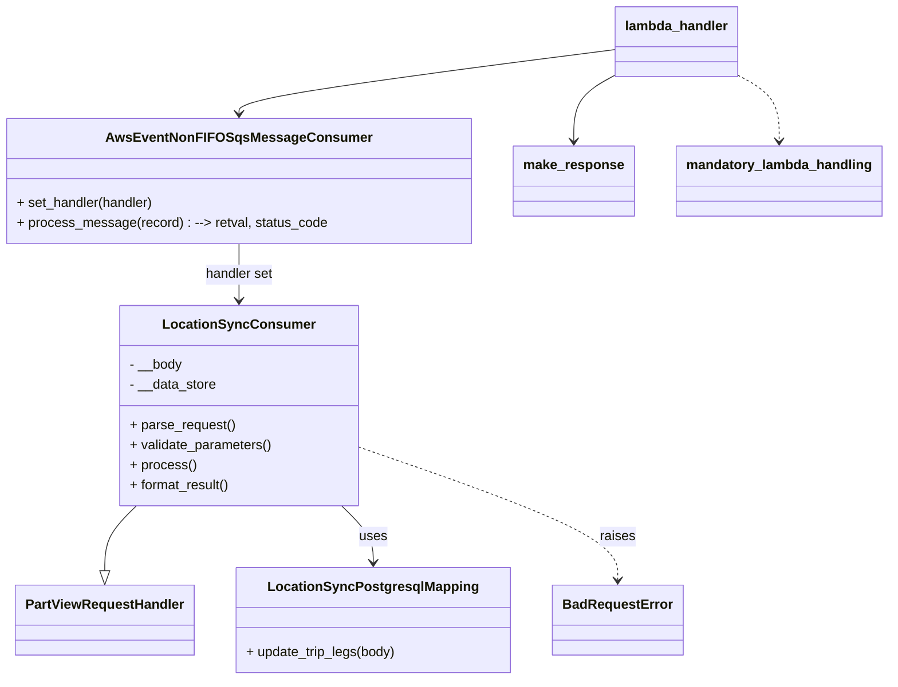

# Diagram: partview_core/partview_service/partview_service/api/location_sync/location_sync_consumer.py


> Auto-generated by Obscura crawlers

## Diagram 1



### SVG

<svg id="container" width="1032.0390625" xmlns="http://www.w3.org/2000/svg" class="classDiagram" height="814" viewBox="0 0 1032.0390625 814" role="graphics-document document" aria-roledescription="class"><style>#container{font-family:"trebuchet ms",verdana,arial,sans-serif;font-size:16px;fill:#333;}@keyframes edge-animation-frame{from{stroke-dashoffset:0;}}@keyframes dash{to{stroke-dashoffset:0;}}#container .edge-animation-slow{stroke-dasharray:9,5!important;stroke-dashoffset:900;animation:dash 50s linear infinite;stroke-linecap:round;}#container .edge-animation-fast{stroke-dasharray:9,5!important;stroke-dashoffset:900;animation:dash 20s linear infinite;stroke-linecap:round;}#container .error-icon{fill:#552222;}#container .error-text{fill:#552222;stroke:#552222;}#container .edge-thickness-normal{stroke-width:1px;}#container .edge-thickness-thick{stroke-width:3.5px;}#container .edge-pattern-solid{stroke-dasharray:0;}#container .edge-thickness-invisible{stroke-width:0;fill:none;}#container .edge-pattern-dashed{stroke-dasharray:3;}#container .edge-pattern-dotted{stroke-dasharray:2;}#container .marker{fill:#333333;stroke:#333333;}#container .marker.cross{stroke:#333333;}#container svg{font-family:"trebuchet ms",verdana,arial,sans-serif;font-size:16px;}#container p{margin:0;}#container g.classGroup text{fill:#9370DB;stroke:none;font-family:"trebuchet ms",verdana,arial,sans-serif;font-size:10px;}#container g.classGroup text .title{font-weight:bolder;}#container .nodeLabel,#container .edgeLabel{color:#131300;}#container .edgeLabel .label rect{fill:#ECECFF;}#container .label text{fill:#131300;}#container .labelBkg{background:#ECECFF;}#container .edgeLabel .label span{background:#ECECFF;}#container .classTitle{font-weight:bolder;}#container .node rect,#container .node circle,#container .node ellipse,#container .node polygon,#container .node path{fill:#ECECFF;stroke:#9370DB;stroke-width:1px;}#container .divider{stroke:#9370DB;stroke-width:1;}#container g.clickable{cursor:pointer;}#container g.classGroup rect{fill:#ECECFF;stroke:#9370DB;}#container g.classGroup line{stroke:#9370DB;stroke-width:1;}#container .classLabel .box{stroke:none;stroke-width:0;fill:#ECECFF;opacity:0.5;}#container .classLabel .label{fill:#9370DB;font-size:10px;}#container .relation{stroke:#333333;stroke-width:1;fill:none;}#container .dashed-line{stroke-dasharray:3;}#container .dotted-line{stroke-dasharray:1 2;}#container #compositionStart,#container .composition{fill:#333333!important;stroke:#333333!important;stroke-width:1;}#container #compositionEnd,#container .composition{fill:#333333!important;stroke:#333333!important;stroke-width:1;}#container #dependencyStart,#container .dependency{fill:#333333!important;stroke:#333333!important;stroke-width:1;}#container #dependencyStart,#container .dependency{fill:#333333!important;stroke:#333333!important;stroke-width:1;}#container #extensionStart,#container .extension{fill:transparent!important;stroke:#333333!important;stroke-width:1;}#container #extensionEnd,#container .extension{fill:transparent!important;stroke:#333333!important;stroke-width:1;}#container #aggregationStart,#container .aggregation{fill:transparent!important;stroke:#333333!important;stroke-width:1;}#container #aggregationEnd,#container .aggregation{fill:transparent!important;stroke:#333333!important;stroke-width:1;}#container #lollipopStart,#container .lollipop{fill:#ECECFF!important;stroke:#333333!important;stroke-width:1;}#container #lollipopEnd,#container .lollipop{fill:#ECECFF!important;stroke:#333333!important;stroke-width:1;}#container .edgeTerminals{font-size:11px;line-height:initial;}#container .classTitleText{text-anchor:middle;font-size:18px;fill:#333;}#container .label-icon{display:inline-block;height:1em;overflow:visible;vertical-align:-0.125em;}#container .node .label-icon path{fill:currentColor;stroke:revert;stroke-width:revert;}#container :root{--mermaid-font-family:"trebuchet ms",verdana,arial,sans-serif;}</style><g><defs><marker id="container_class-aggregationStart" class="marker aggregation class" refX="18" refY="7" markerWidth="190" markerHeight="240" orient="auto"><path d="M 18,7 L9,13 L1,7 L9,1 Z"></path></marker></defs><defs><marker id="container_class-aggregationEnd" class="marker aggregation class" refX="1" refY="7" markerWidth="20" markerHeight="28" orient="auto"><path d="M 18,7 L9,13 L1,7 L9,1 Z"></path></marker></defs><defs><marker id="container_class-extensionStart" class="marker extension class" refX="18" refY="7" markerWidth="190" markerHeight="240" orient="auto"><path d="M 1,7 L18,13 V 1 Z"></path></marker></defs><defs><marker id="container_class-extensionEnd" class="marker extension class" refX="1" refY="7" markerWidth="20" markerHeight="28" orient="auto"><path d="M 1,1 V 13 L18,7 Z"></path></marker></defs><defs><marker id="container_class-compositionStart" class="marker composition class" refX="18" refY="7" markerWidth="190" markerHeight="240" orient="auto"><path d="M 18,7 L9,13 L1,7 L9,1 Z"></path></marker></defs><defs><marker id="container_class-compositionEnd" class="marker composition class" refX="1" refY="7" markerWidth="20" markerHeight="28" orient="auto"><path d="M 18,7 L9,13 L1,7 L9,1 Z"></path></marker></defs><defs><marker id="container_class-dependencyStart" class="marker dependency class" refX="6" refY="7" markerWidth="190" markerHeight="240" orient="auto"><path d="M 5,7 L9,13 L1,7 L9,1 Z"></path></marker></defs><defs><marker id="container_class-dependencyEnd" class="marker dependency class" refX="13" refY="7" markerWidth="20" markerHeight="28" orient="auto"><path d="M 18,7 L9,13 L14,7 L9,1 Z"></path></marker></defs><defs><marker id="container_class-lollipopStart" class="marker lollipop class" refX="13" refY="7" markerWidth="190" markerHeight="240" orient="auto"><circle stroke="black" fill="transparent" cx="7" cy="7" r="6"></circle></marker></defs><defs><marker id="container_class-lollipopEnd" class="marker lollipop class" refX="1" refY="7" markerWidth="190" markerHeight="240" orient="auto"><circle stroke="black" fill="transparent" cx="7" cy="7" r="6"></circle></marker></defs><g class="root"><g class="clusters"></g><g class="edgePaths"><path d="M156.684,606L150.495,612.167C144.305,618.333,131.927,630.667,125.738,643.625C119.549,656.583,119.549,670.167,119.549,676.958L119.549,683.75" id="id_LocationSyncConsumer_PartViewRequestHandler_1" class="edge-thickness-normal edge-pattern-solid relation" style=";;;" data-edge="true" data-et="edge" data-id="id_LocationSyncConsumer_PartViewRequestHandler_1" data-points="W3sieCI6MTU2LjY4MzY5MzI3MjI5MywieSI6NjA2fSx7IngiOjExOS41NDg4MjgxMjUsInkiOjY0M30seyJ4IjoxMTkuNTQ4ODI4MTI1LCJ5Ijo3MDF9XQ==" marker-end="url(#container_class-extensionEnd)"></path><path d="M397.558,606L403.748,612.167C409.937,618.333,422.315,630.667,428.504,642C434.693,653.333,434.693,663.667,434.693,668.833L434.693,674" id="id_LocationSyncConsumer_LocationSyncPostgresqlMapping_2" class="edge-thickness-normal edge-pattern-solid relation" style=";;;" data-edge="true" data-et="edge" data-id="id_LocationSyncConsumer_LocationSyncPostgresqlMapping_2" data-points="W3sieCI6Mzk3LjU1ODQ5NDIyNzcwNywieSI6NjA2fSx7IngiOjQzNC42OTMzNTkzNzUsInkiOjY0M30seyJ4Ijo0MzQuNjkzMzU5Mzc1LCJ5Ijo2ODB9XQ==" marker-end="url(#container_class-dependencyEnd)"></path><path d="M277.121,292L277.121,298.167C277.121,304.333,277.121,316.667,277.121,328C277.121,339.333,277.121,349.667,277.121,354.833L277.121,360" id="id_AwsEventNonFIFOSqsMessageConsumer_LocationSyncConsumer_3" class="edge-thickness-normal edge-pattern-solid relation" style=";;;" data-edge="true" data-et="edge" data-id="id_AwsEventNonFIFOSqsMessageConsumer_LocationSyncConsumer_3" data-points="W3sieCI6Mjc3LjEyMTA5Mzc1LCJ5IjoyOTJ9LHsieCI6Mjc3LjEyMTA5Mzc1LCJ5IjozMjl9LHsieCI6Mjc3LjEyMTA5Mzc1LCJ5IjozNjZ9XQ==" marker-end="url(#container_class-dependencyEnd)"></path><path d="M417.09,535.534L467.701,553.445C518.313,571.356,619.536,607.178,670.148,633.756C720.76,660.333,720.76,677.667,720.76,686.333L720.76,695" id="id_LocationSyncConsumer_BadRequestError_4" class="edge-thickness-normal edge-pattern-dashed relation" style=";;;" data-edge="true" data-et="edge" data-id="id_LocationSyncConsumer_BadRequestError_4" data-points="W3sieCI6NDE3LjA4OTg0Mzc1LCJ5Ijo1MzUuNTMzNzY1MDczMTAzN30seyJ4Ijo3MjAuNzU5NzY1NjI1LCJ5Ijo2NDN9LHsieCI6NzIwLjc1OTc2NTYyNSwieSI6NzAxfV0=" marker-end="url(#container_class-dependencyEnd)"></path><path d="M713.184,59.492L640.507,69.077C567.829,78.661,422.475,97.831,349.798,110.582C277.121,123.333,277.121,129.667,277.121,132.833L277.121,136" id="id_lambda_handler_AwsEventNonFIFOSqsMessageConsumer_5" class="edge-thickness-normal edge-pattern-solid relation" style=";;;" data-edge="true" data-et="edge" data-id="id_lambda_handler_AwsEventNonFIFOSqsMessageConsumer_5" data-points="W3sieCI6NzEzLjE4MzU5Mzc1LCJ5Ijo1OS40OTIyNDE5MjI4MzQ0MjR9LHsieCI6Mjc3LjEyMTA5Mzc1LCJ5IjoxMTd9LHsieCI6Mjc3LjEyMTA5Mzc1LCJ5IjoxNDJ9XQ==" marker-end="url(#container_class-dependencyEnd)"></path><path d="M713.184,90.372L705.271,94.81C697.359,99.248,681.535,108.124,673.623,121.229C665.711,134.333,665.711,151.667,665.711,160.333L665.711,169" id="id_lambda_handler_make_response_6" class="edge-thickness-normal edge-pattern-solid relation" style=";;;" data-edge="true" data-et="edge" data-id="id_lambda_handler_make_response_6" data-points="W3sieCI6NzEzLjE4MzU5Mzc1LCJ5Ijo5MC4zNzIyMTYyMjY4MjIzM30seyJ4Ijo2NjUuNzEwOTM3NSwieSI6MTE3fSx7IngiOjY2NS43MTA5Mzc1LCJ5IjoxNzV9XQ==" marker-end="url(#container_class-dependencyEnd)"></path><path d="M857.137,90.372L865.049,94.81C872.961,99.248,888.785,108.124,896.697,121.229C904.609,134.333,904.609,151.667,904.609,160.333L904.609,169" id="id_lambda_handler_mandatory_lambda_handling_7" class="edge-thickness-normal edge-pattern-dashed relation" style=";;;" data-edge="true" data-et="edge" data-id="id_lambda_handler_mandatory_lambda_handling_7" data-points="W3sieCI6ODU3LjEzNjcxODc1LCJ5Ijo5MC4zNzIyMTYyMjY4MjIzM30seyJ4Ijo5MDQuNjA5Mzc1LCJ5IjoxMTd9LHsieCI6OTA0LjYwOTM3NSwieSI6MTc1fV0=" marker-end="url(#container_class-dependencyEnd)"></path></g><g class="edgeLabels"><g class="edgeLabel"><g class="label" data-id="id_LocationSyncConsumer_PartViewRequestHandler_1" transform="translate(0, 0)"><foreignObject width="0" height="0"><div xmlns="http://www.w3.org/1999/xhtml" class="labelBkg" style="display: table-cell; white-space: nowrap; line-height: 1.5; max-width: 200px; text-align: center;"><span class="edgeLabel"></span></div></foreignObject></g></g><g class="edgeLabel" transform="translate(434.693359375, 643)"><g class="label" data-id="id_LocationSyncConsumer_LocationSyncPostgresqlMapping_2" transform="translate(-16.4921875, -12)"><foreignObject width="32.984375" height="24"><div xmlns="http://www.w3.org/1999/xhtml" class="labelBkg" style="display: table-cell; white-space: nowrap; line-height: 1.5; max-width: 200px; text-align: center;"><span class="edgeLabel"><p>uses</p></span></div></foreignObject></g></g><g class="edgeLabel" transform="translate(277.12109375, 329)"><g class="label" data-id="id_AwsEventNonFIFOSqsMessageConsumer_LocationSyncConsumer_3" transform="translate(-41.375, -12)"><foreignObject width="82.75" height="24"><div xmlns="http://www.w3.org/1999/xhtml" class="labelBkg" style="display: table-cell; white-space: nowrap; line-height: 1.5; max-width: 200px; text-align: center;"><span class="edgeLabel"><p>handler set</p></span></div></foreignObject></g></g><g class="edgeLabel" transform="translate(720.759765625, 643)"><g class="label" data-id="id_LocationSyncConsumer_BadRequestError_4" transform="translate(-21.25, -12)"><foreignObject width="42.5" height="24"><div xmlns="http://www.w3.org/1999/xhtml" class="labelBkg" style="display: table-cell; white-space: nowrap; line-height: 1.5; max-width: 200px; text-align: center;"><span class="edgeLabel"><p>raises</p></span></div></foreignObject></g></g><g class="edgeLabel"><g class="label" data-id="id_lambda_handler_AwsEventNonFIFOSqsMessageConsumer_5" transform="translate(0, 0)"><foreignObject width="0" height="0"><div xmlns="http://www.w3.org/1999/xhtml" class="labelBkg" style="display: table-cell; white-space: nowrap; line-height: 1.5; max-width: 200px; text-align: center;"><span class="edgeLabel"></span></div></foreignObject></g></g><g class="edgeLabel"><g class="label" data-id="id_lambda_handler_make_response_6" transform="translate(0, 0)"><foreignObject width="0" height="0"><div xmlns="http://www.w3.org/1999/xhtml" class="labelBkg" style="display: table-cell; white-space: nowrap; line-height: 1.5; max-width: 200px; text-align: center;"><span class="edgeLabel"></span></div></foreignObject></g></g><g class="edgeLabel"><g class="label" data-id="id_lambda_handler_mandatory_lambda_handling_7" transform="translate(0, 0)"><foreignObject width="0" height="0"><div xmlns="http://www.w3.org/1999/xhtml" class="labelBkg" style="display: table-cell; white-space: nowrap; line-height: 1.5; max-width: 200px; text-align: center;"><span class="edgeLabel"></span></div></foreignObject></g></g></g><g class="nodes"><g class="node default" id="classId-LocationSyncConsumer-0" transform="translate(277.12109375, 486)"><g class="basic label-container"><path d="M-139.96875 -120 L139.96875 -120 L139.96875 120 L-139.96875 120" stroke="none" stroke-width="0" fill="#ECECFF" style=""></path><path d="M-139.96875 -120 C-65.69727050054 -120, 8.57420899892 -120, 139.96875 -120 M-139.96875 -120 C-61.51827714676624 -120, 16.932195706467525 -120, 139.96875 -120 M139.96875 -120 C139.96875 -69.19570043245537, 139.96875 -18.391400864910736, 139.96875 120 M139.96875 -120 C139.96875 -60.15705098247775, 139.96875 -0.3141019649554977, 139.96875 120 M139.96875 120 C71.10180115622937 120, 2.2348523124587416 120, -139.96875 120 M139.96875 120 C36.42647802654413 120, -67.11579394691174 120, -139.96875 120 M-139.96875 120 C-139.96875 30.87878578946136, -139.96875 -58.24242842107728, -139.96875 -120 M-139.96875 120 C-139.96875 29.444285906291753, -139.96875 -61.11142818741649, -139.96875 -120" stroke="#9370DB" stroke-width="1.3" fill="none" stroke-dasharray="0 0" style=""></path></g><g class="annotation-group text" transform="translate(0, -96)"></g><g class="label-group text" transform="translate(-84.984375, -96)"><g class="label" style="font-weight: bolder" transform="translate(0,-12)"><foreignObject width="169.96875" height="24"><div xmlns="http://www.w3.org/1999/xhtml" style="display: table-cell; white-space: nowrap; line-height: 1.5; max-width: 219px; text-align: center;"><span class="nodeLabel markdown-node-label" style=""><p>LocationSyncConsumer</p></span></div></foreignObject></g></g><g class="members-group text" transform="translate(-127.96875, -48)"><g class="label" style="" transform="translate(0,-12)"><foreignObject width="63.46875" height="24"><div xmlns="http://www.w3.org/1999/xhtml" style="display: table-cell; white-space: nowrap; line-height: 1.5; max-width: 121px; text-align: center;"><span class="nodeLabel markdown-node-label" style=""><p>- __body</p></span></div></foreignObject></g><g class="label" style="" transform="translate(0,12)"><foreignObject width="104.578125" height="24"><div xmlns="http://www.w3.org/1999/xhtml" style="display: table-cell; white-space: nowrap; line-height: 1.5; max-width: 162px; text-align: center;"><span class="nodeLabel markdown-node-label" style=""><p>- __data_store</p></span></div></foreignObject></g></g><g class="methods-group text" transform="translate(-127.96875, 24)"><g class="label" style="" transform="translate(0,-12)"><foreignObject width="126.046875" height="24"><div xmlns="http://www.w3.org/1999/xhtml" style="display: table-cell; white-space: nowrap; line-height: 1.5; max-width: 183px; text-align: center;"><span class="nodeLabel markdown-node-label" style=""><p>+ parse_request()</p></span></div></foreignObject></g><g class="label" style="" transform="translate(0,12)"><foreignObject width="170.953125" height="24"><div xmlns="http://www.w3.org/1999/xhtml" style="display: table-cell; white-space: nowrap; line-height: 1.5; max-width: 228px; text-align: center;"><span class="nodeLabel markdown-node-label" style=""><p>+ validate_parameters()</p></span></div></foreignObject></g><g class="label" style="" transform="translate(0,36)"><foreignObject width="77.96875" height="24"><div xmlns="http://www.w3.org/1999/xhtml" style="display: table-cell; white-space: nowrap; line-height: 1.5; max-width: 135px; text-align: center;"><span class="nodeLabel markdown-node-label" style=""><p>+ process()</p></span></div></foreignObject></g><g class="label" style="" transform="translate(0,60)"><foreignObject width="121.5" height="24"><div xmlns="http://www.w3.org/1999/xhtml" style="display: table-cell; white-space: nowrap; line-height: 1.5; max-width: 179px; text-align: center;"><span class="nodeLabel markdown-node-label" style=""><p>+ format_result()</p></span></div></foreignObject></g></g><g class="divider" style=""><path d="M-139.96875 -72 C-30.930396466348725 -72, 78.10795706730255 -72, 139.96875 -72 M-139.96875 -72 C-43.580863485041434 -72, 52.80702302991713 -72, 139.96875 -72" stroke="#9370DB" stroke-width="1.3" fill="none" stroke-dasharray="0 0" style=""></path></g><g class="divider" style=""><path d="M-139.96875 0 C-42.2965610547802 0, 55.3756278904396 0, 139.96875 0 M-139.96875 0 C-70.1628428259761 0, -0.3569356519521989 0, 139.96875 0" stroke="#9370DB" stroke-width="1.3" fill="none" stroke-dasharray="0 0" style=""></path></g></g><g class="node default" id="classId-PartViewRequestHandler-1" transform="translate(119.548828125, 743)"><g class="basic label-container"><path d="M-103.359375 -42 L103.359375 -42 L103.359375 42 L-103.359375 42" stroke="none" stroke-width="0" fill="#ECECFF" style=""></path><path d="M-103.359375 -42 C-60.40725802230144 -42, -17.455141044602883 -42, 103.359375 -42 M-103.359375 -42 C-21.109063280113432 -42, 61.141248439773136 -42, 103.359375 -42 M103.359375 -42 C103.359375 -10.424488427540108, 103.359375 21.151023144919783, 103.359375 42 M103.359375 -42 C103.359375 -12.006798463194158, 103.359375 17.986403073611683, 103.359375 42 M103.359375 42 C46.58653040267053 42, -10.186314194658934 42, -103.359375 42 M103.359375 42 C21.970682651075066 42, -59.41800969784987 42, -103.359375 42 M-103.359375 42 C-103.359375 8.726567233491544, -103.359375 -24.546865533016913, -103.359375 -42 M-103.359375 42 C-103.359375 24.634276598493386, -103.359375 7.2685531969867725, -103.359375 -42" stroke="#9370DB" stroke-width="1.3" fill="none" stroke-dasharray="0 0" style=""></path></g><g class="annotation-group text" transform="translate(0, -18)"></g><g class="label-group text" transform="translate(-91.359375, -18)"><g class="label" style="font-weight: bolder" transform="translate(0,-12)"><foreignObject width="182.71875" height="24"><div xmlns="http://www.w3.org/1999/xhtml" style="display: table-cell; white-space: nowrap; line-height: 1.5; max-width: 231px; text-align: center;"><span class="nodeLabel markdown-node-label" style=""><p>PartViewRequestHandler</p></span></div></foreignObject></g></g><g class="members-group text" transform="translate(-91.359375, 30)"></g><g class="methods-group text" transform="translate(-91.359375, 60)"></g><g class="divider" style=""><path d="M-103.359375 6 C-51.65237297323738 6, 0.05462905352524672 6, 103.359375 6 M-103.359375 6 C-30.603908035553573 6, 42.151558928892854 6, 103.359375 6" stroke="#9370DB" stroke-width="1.3" fill="none" stroke-dasharray="0 0" style=""></path></g><g class="divider" style=""><path d="M-103.359375 24 C-56.32707556646873 24, -9.294776132937457 24, 103.359375 24 M-103.359375 24 C-36.01793725586744 24, 31.323500488265125 24, 103.359375 24" stroke="#9370DB" stroke-width="1.3" fill="none" stroke-dasharray="0 0" style=""></path></g></g><g class="node default" id="classId-LocationSyncPostgresqlMapping-2" transform="translate(434.693359375, 743)"><g class="basic label-container"><path d="M-161.78515625 -63 L161.78515625 -63 L161.78515625 63 L-161.78515625 63" stroke="none" stroke-width="0" fill="#ECECFF" style=""></path><path d="M-161.78515625 -63 C-69.75772499353333 -63, 22.26970626293334 -63, 161.78515625 -63 M-161.78515625 -63 C-73.97403314547653 -63, 13.83708995904695 -63, 161.78515625 -63 M161.78515625 -63 C161.78515625 -20.28142371315451, 161.78515625 22.43715257369098, 161.78515625 63 M161.78515625 -63 C161.78515625 -24.55694210814348, 161.78515625 13.886115783713038, 161.78515625 63 M161.78515625 63 C60.20703657792909 63, -41.371083094141824 63, -161.78515625 63 M161.78515625 63 C92.31450070052301 63, 22.843845151046025 63, -161.78515625 63 M-161.78515625 63 C-161.78515625 30.45749133451684, -161.78515625 -2.0850173309663234, -161.78515625 -63 M-161.78515625 63 C-161.78515625 34.783337034025784, -161.78515625 6.566674068051569, -161.78515625 -63" stroke="#9370DB" stroke-width="1.3" fill="none" stroke-dasharray="0 0" style=""></path></g><g class="annotation-group text" transform="translate(0, -39)"></g><g class="label-group text" transform="translate(-118.8359375, -39)"><g class="label" style="font-weight: bolder" transform="translate(0,-12)"><foreignObject width="237.671875" height="24"><div xmlns="http://www.w3.org/1999/xhtml" style="display: table-cell; white-space: nowrap; line-height: 1.5; max-width: 284px; text-align: center;"><span class="nodeLabel markdown-node-label" style=""><p>LocationSyncPostgresqlMapping</p></span></div></foreignObject></g></g><g class="members-group text" transform="translate(-149.78515625, 9)"></g><g class="methods-group text" transform="translate(-149.78515625, 39)"><g class="label" style="" transform="translate(0,-12)"><foreignObject width="180.734375" height="24"><div xmlns="http://www.w3.org/1999/xhtml" style="display: table-cell; white-space: nowrap; line-height: 1.5; max-width: 238px; text-align: center;"><span class="nodeLabel markdown-node-label" style=""><p>+ update_trip_legs(body)</p></span></div></foreignObject></g></g><g class="divider" style=""><path d="M-161.78515625 -15 C-74.98458077942195 -15, 11.815994691156106 -15, 161.78515625 -15 M-161.78515625 -15 C-39.56699903942312 -15, 82.65115817115375 -15, 161.78515625 -15" stroke="#9370DB" stroke-width="1.3" fill="none" stroke-dasharray="0 0" style=""></path></g><g class="divider" style=""><path d="M-161.78515625 9 C-32.982870606428946 9, 95.81941503714211 9, 161.78515625 9 M-161.78515625 9 C-38.52968401493041 9, 84.72578822013918 9, 161.78515625 9" stroke="#9370DB" stroke-width="1.3" fill="none" stroke-dasharray="0 0" style=""></path></g></g><g class="node default" id="classId-AwsEventNonFIFOSqsMessageConsumer-3" transform="translate(277.12109375, 217)"><g class="basic label-container"><path d="M-269.12109375 -75 L269.12109375 -75 L269.12109375 75 L-269.12109375 75" stroke="none" stroke-width="0" fill="#ECECFF" style=""></path><path d="M-269.12109375 -75 C-99.4991376376087 -75, 70.1228184747826 -75, 269.12109375 -75 M-269.12109375 -75 C-70.61108280858849 -75, 127.89892813282302 -75, 269.12109375 -75 M269.12109375 -75 C269.12109375 -40.073451662763404, 269.12109375 -5.146903325526807, 269.12109375 75 M269.12109375 -75 C269.12109375 -32.89171132943503, 269.12109375 9.216577341129934, 269.12109375 75 M269.12109375 75 C154.6671904730211 75, 40.21328719604219 75, -269.12109375 75 M269.12109375 75 C124.9104009822968 75, -19.300291785406387 75, -269.12109375 75 M-269.12109375 75 C-269.12109375 36.82964763720223, -269.12109375 -1.3407047255955433, -269.12109375 -75 M-269.12109375 75 C-269.12109375 20.023727170257757, -269.12109375 -34.952545659484485, -269.12109375 -75" stroke="#9370DB" stroke-width="1.3" fill="none" stroke-dasharray="0 0" style=""></path></g><g class="annotation-group text" transform="translate(0, -51)"></g><g class="label-group text" transform="translate(-145.9296875, -51)"><g class="label" style="font-weight: bolder" transform="translate(0,-12)"><foreignObject width="291.859375" height="24"><div xmlns="http://www.w3.org/1999/xhtml" style="display: table-cell; white-space: nowrap; line-height: 1.5; max-width: 339px; text-align: center;"><span class="nodeLabel markdown-node-label" style=""><p>AwsEventNonFIFOSqsMessageConsumer</p></span></div></foreignObject></g></g><g class="members-group text" transform="translate(-257.12109375, -3)"></g><g class="methods-group text" transform="translate(-257.12109375, 27)"><g class="label" style="" transform="translate(0,-12)"><foreignObject width="165.9375" height="24"><div xmlns="http://www.w3.org/1999/xhtml" style="display: table-cell; white-space: nowrap; line-height: 1.5; max-width: 223px; text-align: center;"><span class="nodeLabel markdown-node-label" style=""><p>+ set_handler(handler)</p></span></div></foreignObject></g><g class="label" style="" transform="translate(0,12)"><foreignObject width="368.3125" height="24"><div xmlns="http://www.w3.org/1999/xhtml" style="display: table-cell; white-space: nowrap; line-height: 1.5; max-width: 447px; text-align: center;"><span class="nodeLabel markdown-node-label" style=""><p>+ process_message(record) : --&gt; retval, status_code</p></span></div></foreignObject></g></g><g class="divider" style=""><path d="M-269.12109375 -27 C-107.91753148812637 -27, 53.28603077374726 -27, 269.12109375 -27 M-269.12109375 -27 C-109.2468952045813 -27, 50.627303340837386 -27, 269.12109375 -27" stroke="#9370DB" stroke-width="1.3" fill="none" stroke-dasharray="0 0" style=""></path></g><g class="divider" style=""><path d="M-269.12109375 -3 C-142.63117921260164 -3, -16.141264675203246 -3, 269.12109375 -3 M-269.12109375 -3 C-129.91690830428897 -3, 9.287277141422067 -3, 269.12109375 -3" stroke="#9370DB" stroke-width="1.3" fill="none" stroke-dasharray="0 0" style=""></path></g></g><g class="node default" id="classId-BadRequestError-4" transform="translate(720.759765625, 743)"><g class="basic label-container"><path d="M-74.28125 -42 L74.28125 -42 L74.28125 42 L-74.28125 42" stroke="none" stroke-width="0" fill="#ECECFF" style=""></path><path d="M-74.28125 -42 C-39.85966115431853 -42, -5.438072308637061 -42, 74.28125 -42 M-74.28125 -42 C-38.08057726495062 -42, -1.8799045299012391 -42, 74.28125 -42 M74.28125 -42 C74.28125 -23.968429432176205, 74.28125 -5.936858864352409, 74.28125 42 M74.28125 -42 C74.28125 -14.385149294693509, 74.28125 13.229701410612982, 74.28125 42 M74.28125 42 C21.818619631672817 42, -30.644010736654366 42, -74.28125 42 M74.28125 42 C21.432121716293636 42, -31.417006567412727 42, -74.28125 42 M-74.28125 42 C-74.28125 8.856612165999898, -74.28125 -24.286775668000203, -74.28125 -42 M-74.28125 42 C-74.28125 22.424501237162445, -74.28125 2.849002474324891, -74.28125 -42" stroke="#9370DB" stroke-width="1.3" fill="none" stroke-dasharray="0 0" style=""></path></g><g class="annotation-group text" transform="translate(0, -18)"></g><g class="label-group text" transform="translate(-62.28125, -18)"><g class="label" style="font-weight: bolder" transform="translate(0,-12)"><foreignObject width="124.5625" height="24"><div xmlns="http://www.w3.org/1999/xhtml" style="display: table-cell; white-space: nowrap; line-height: 1.5; max-width: 174px; text-align: center;"><span class="nodeLabel markdown-node-label" style=""><p>BadRequestError</p></span></div></foreignObject></g></g><g class="members-group text" transform="translate(-62.28125, 30)"></g><g class="methods-group text" transform="translate(-62.28125, 60)"></g><g class="divider" style=""><path d="M-74.28125 6 C-41.62620409441948 6, -8.971158188838956 6, 74.28125 6 M-74.28125 6 C-23.218183893019877 6, 27.844882213960247 6, 74.28125 6" stroke="#9370DB" stroke-width="1.3" fill="none" stroke-dasharray="0 0" style=""></path></g><g class="divider" style=""><path d="M-74.28125 24 C-16.263386092128968 24, 41.754477815742064 24, 74.28125 24 M-74.28125 24 C-38.87465161956641 24, -3.4680532391328143 24, 74.28125 24" stroke="#9370DB" stroke-width="1.3" fill="none" stroke-dasharray="0 0" style=""></path></g></g><g class="node default" id="classId-make_response-5" transform="translate(665.7109375, 217)"><g class="basic label-container"><path d="M-69.46875 -42 L69.46875 -42 L69.46875 42 L-69.46875 42" stroke="none" stroke-width="0" fill="#ECECFF" style=""></path><path d="M-69.46875 -42 C-39.88499195256196 -42, -10.301233905123915 -42, 69.46875 -42 M-69.46875 -42 C-33.27049969598578 -42, 2.9277506080284468 -42, 69.46875 -42 M69.46875 -42 C69.46875 -19.717713766815812, 69.46875 2.564572466368375, 69.46875 42 M69.46875 -42 C69.46875 -20.48484423630539, 69.46875 1.0303115273892232, 69.46875 42 M69.46875 42 C30.156015099454258 42, -9.156719801091484 42, -69.46875 42 M69.46875 42 C38.622317946561566 42, 7.775885893123132 42, -69.46875 42 M-69.46875 42 C-69.46875 20.97536072405429, -69.46875 -0.04927855189141894, -69.46875 -42 M-69.46875 42 C-69.46875 22.132177904625976, -69.46875 2.2643558092519527, -69.46875 -42" stroke="#9370DB" stroke-width="1.3" fill="none" stroke-dasharray="0 0" style=""></path></g><g class="annotation-group text" transform="translate(0, -18)"></g><g class="label-group text" transform="translate(-57.46875, -18)"><g class="label" style="font-weight: bolder" transform="translate(0,-12)"><foreignObject width="114.9375" height="24"><div xmlns="http://www.w3.org/1999/xhtml" style="display: table-cell; white-space: nowrap; line-height: 1.5; max-width: 164px; text-align: center;"><span class="nodeLabel markdown-node-label" style=""><p>make_response</p></span></div></foreignObject></g></g><g class="members-group text" transform="translate(-57.46875, 30)"></g><g class="methods-group text" transform="translate(-57.46875, 60)"></g><g class="divider" style=""><path d="M-69.46875 6 C-22.211285083155424 6, 25.046179833689152 6, 69.46875 6 M-69.46875 6 C-35.92229746265828 6, -2.3758449253165566 6, 69.46875 6" stroke="#9370DB" stroke-width="1.3" fill="none" stroke-dasharray="0 0" style=""></path></g><g class="divider" style=""><path d="M-69.46875 24 C-15.419380610433869 24, 38.62998877913226 24, 69.46875 24 M-69.46875 24 C-16.006879994787845 24, 37.45499001042431 24, 69.46875 24" stroke="#9370DB" stroke-width="1.3" fill="none" stroke-dasharray="0 0" style=""></path></g></g><g class="node default" id="classId-mandatory_lambda_handling-6" transform="translate(904.609375, 217)"><g class="basic label-container"><path d="M-119.4296875 -42 L119.4296875 -42 L119.4296875 42 L-119.4296875 42" stroke="none" stroke-width="0" fill="#ECECFF" style=""></path><path d="M-119.4296875 -42 C-32.11370161075402 -42, 55.20228427849196 -42, 119.4296875 -42 M-119.4296875 -42 C-63.56666209912916 -42, -7.703636698258322 -42, 119.4296875 -42 M119.4296875 -42 C119.4296875 -21.906421251663755, 119.4296875 -1.8128425033275093, 119.4296875 42 M119.4296875 -42 C119.4296875 -20.276794617279446, 119.4296875 1.446410765441108, 119.4296875 42 M119.4296875 42 C53.11545585890953 42, -13.198775782180945 42, -119.4296875 42 M119.4296875 42 C37.85633858197383 42, -43.71701033605234 42, -119.4296875 42 M-119.4296875 42 C-119.4296875 14.451347600090092, -119.4296875 -13.097304799819817, -119.4296875 -42 M-119.4296875 42 C-119.4296875 24.4602008835002, -119.4296875 6.920401767000399, -119.4296875 -42" stroke="#9370DB" stroke-width="1.3" fill="none" stroke-dasharray="0 0" style=""></path></g><g class="annotation-group text" transform="translate(0, -18)"></g><g class="label-group text" transform="translate(-107.4296875, -18)"><g class="label" style="font-weight: bolder" transform="translate(0,-12)"><foreignObject width="214.859375" height="24"><div xmlns="http://www.w3.org/1999/xhtml" style="display: table-cell; white-space: nowrap; line-height: 1.5; max-width: 264px; text-align: center;"><span class="nodeLabel markdown-node-label" style=""><p>mandatory_lambda_handling</p></span></div></foreignObject></g></g><g class="members-group text" transform="translate(-107.4296875, 30)"></g><g class="methods-group text" transform="translate(-107.4296875, 60)"></g><g class="divider" style=""><path d="M-119.4296875 6 C-64.06139507388721 6, -8.69310264777441 6, 119.4296875 6 M-119.4296875 6 C-48.74420301859975 6, 21.941281462800504 6, 119.4296875 6" stroke="#9370DB" stroke-width="1.3" fill="none" stroke-dasharray="0 0" style=""></path></g><g class="divider" style=""><path d="M-119.4296875 24 C-69.28976561863703 24, -19.149843737274054 24, 119.4296875 24 M-119.4296875 24 C-70.55551112265607 24, -21.681334745312142 24, 119.4296875 24" stroke="#9370DB" stroke-width="1.3" fill="none" stroke-dasharray="0 0" style=""></path></g></g><g class="node default" id="classId-lambda_handler-7" transform="translate(785.16015625, 50)"><g class="basic label-container"><path d="M-71.9765625 -42 L71.9765625 -42 L71.9765625 42 L-71.9765625 42" stroke="none" stroke-width="0" fill="#ECECFF" style=""></path><path d="M-71.9765625 -42 C-23.916765466127927 -42, 24.143031567744146 -42, 71.9765625 -42 M-71.9765625 -42 C-17.130423011773715 -42, 37.71571647645257 -42, 71.9765625 -42 M71.9765625 -42 C71.9765625 -15.141571082182548, 71.9765625 11.716857835634904, 71.9765625 42 M71.9765625 -42 C71.9765625 -19.371081437841323, 71.9765625 3.257837124317355, 71.9765625 42 M71.9765625 42 C29.473454854725304 42, -13.029652790549392 42, -71.9765625 42 M71.9765625 42 C23.35536521453406 42, -25.26583207093188 42, -71.9765625 42 M-71.9765625 42 C-71.9765625 21.549024822893774, -71.9765625 1.0980496457875475, -71.9765625 -42 M-71.9765625 42 C-71.9765625 15.761769136807505, -71.9765625 -10.47646172638499, -71.9765625 -42" stroke="#9370DB" stroke-width="1.3" fill="none" stroke-dasharray="0 0" style=""></path></g><g class="annotation-group text" transform="translate(0, -18)"></g><g class="label-group text" transform="translate(-59.9765625, -18)"><g class="label" style="font-weight: bolder" transform="translate(0,-12)"><foreignObject width="119.953125" height="24"><div xmlns="http://www.w3.org/1999/xhtml" style="display: table-cell; white-space: nowrap; line-height: 1.5; max-width: 170px; text-align: center;"><span class="nodeLabel markdown-node-label" style=""><p>lambda_handler</p></span></div></foreignObject></g></g><g class="members-group text" transform="translate(-59.9765625, 30)"></g><g class="methods-group text" transform="translate(-59.9765625, 60)"></g><g class="divider" style=""><path d="M-71.9765625 6 C-22.016037452337088 6, 27.944487595325825 6, 71.9765625 6 M-71.9765625 6 C-17.79897598148711 6, 36.37861053702578 6, 71.9765625 6" stroke="#9370DB" stroke-width="1.3" fill="none" stroke-dasharray="0 0" style=""></path></g><g class="divider" style=""><path d="M-71.9765625 24 C-18.46840627900086 24, 35.03974994199828 24, 71.9765625 24 M-71.9765625 24 C-30.382924428039537 24, 11.210713643920926 24, 71.9765625 24" stroke="#9370DB" stroke-width="1.3" fill="none" stroke-dasharray="0 0" style=""></path></g></g></g></g></g></svg>

## Diagram 2

```mermaid
flowchart TD
    Start([Start]) --> Receive[Receive event with Records]
    Receive --> SetQueue[Create AwsEventNonFIFOSqsMessageConsumer("PV-location-sync")\n.set_handler(LocationSyncConsumer)]
    SetQueue --> ForEach{For each record in event.Records}
    ForEach --> Process[queue.process_message(record)\nreturns (retval, status_code)]
    Process --> Append[Append {"request_id": retval, "status_code": status_code} to status]
    Process --> Check{status_code > 201?}
    Check -->|yes| SetResp[response_code = status_code]
    Check -->|no| Continue[continue]
    Continue --> LoopEnd((next record))
    SetResp --> LoopEnd
    LoopEnd --> Complete[All records processed]
    Complete --> Respond[make_response(status, response_code)]
    Respond --> End([Return response])
```

> SVG rendering failed for this diagram.
