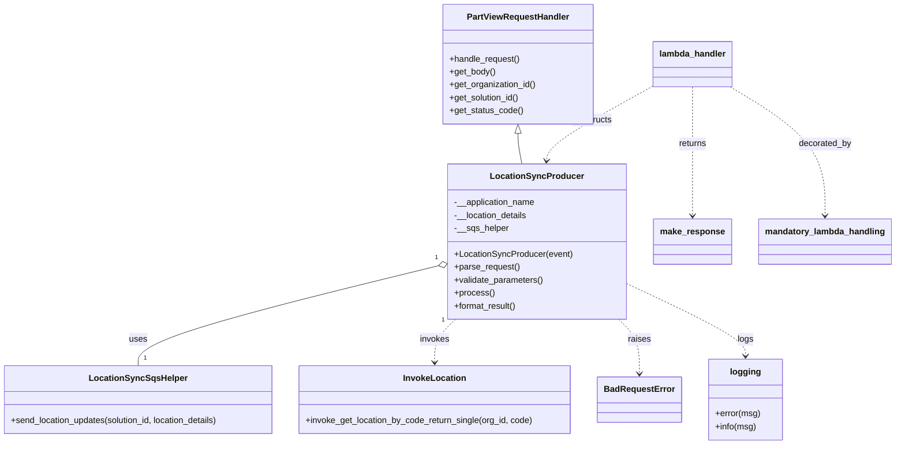
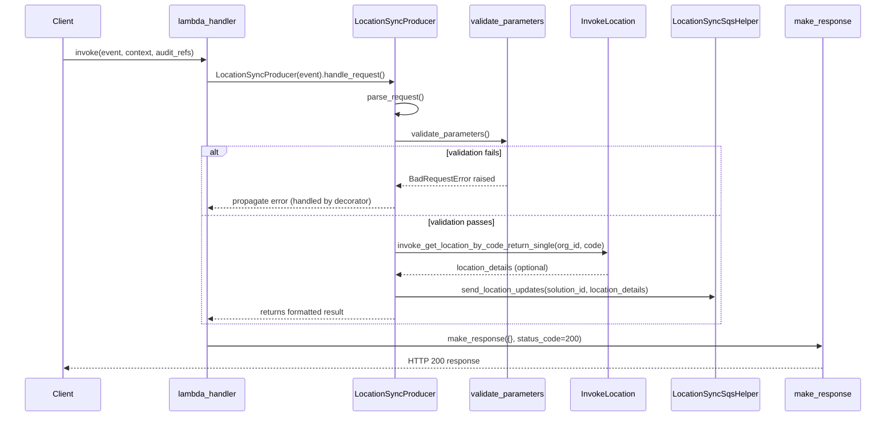

# Diagram: partview_core/partview_service/partview_service/api/location_sync/location_sync_producer.py

> Auto-generated by Obscura crawlers

## Diagram 1

### SVG

<svg id="container" width="1651.9609375" xmlns="http://www.w3.org/2000/svg" class="classDiagram" height="824" viewBox="0 0 1651.9609375 824" role="graphics-document document" aria-roledescription="class"><g><defs><marker id="container_class-aggregationStart" class="marker aggregation class" refX="18" refY="7" markerWidth="190" markerHeight="240" orient="auto"><path d="M 18,7 L9,13 L1,7 L9,1 Z"></path></marker></defs><defs><marker id="container_class-aggregationEnd" class="marker aggregation class" refX="1" refY="7" markerWidth="20" markerHeight="28" orient="auto"><path d="M 18,7 L9,13 L1,7 L9,1 Z"></path></marker></defs><defs><marker id="container_class-extensionStart" class="marker extension class" refX="18" refY="7" markerWidth="190" markerHeight="240" orient="auto"><path d="M 1,7 L18,13 V 1 Z"></path></marker></defs><defs><marker id="container_class-extensionEnd" class="marker extension class" refX="1" refY="7" markerWidth="20" markerHeight="28" orient="auto"><path d="M 1,1 V 13 L18,7 Z"></path></marker></defs><defs><marker id="container_class-compositionStart" class="marker composition class" refX="18" refY="7" markerWidth="190" markerHeight="240" orient="auto"><path d="M 18,7 L9,13 L1,7 L9,1 Z"></path></marker></defs><defs><marker id="container_class-compositionEnd" class="marker composition class" refX="1" refY="7" markerWidth="20" markerHeight="28" orient="auto"><path d="M 18,7 L9,13 L1,7 L9,1 Z"></path></marker></defs><defs><marker id="container_class-dependencyStart" class="marker dependency class" refX="6" refY="7" markerWidth="190" markerHeight="240" orient="auto"><path d="M 5,7 L9,13 L1,7 L9,1 Z"></path></marker></defs><defs><marker id="container_class-dependencyEnd" class="marker dependency class" refX="13" refY="7" markerWidth="20" markerHeight="28" orient="auto"><path d="M 18,7 L9,13 L14,7 L9,1 Z"></path></marker></defs><defs><marker id="container_class-lollipopStart" class="marker lollipop class" refX="13" refY="7" markerWidth="190" markerHeight="240" orient="auto"><circle stroke="black" fill="transparent" cx="7" cy="7" r="6"></circle></marker></defs><defs><marker id="container_class-lollipopEnd" class="marker lollipop class" refX="1" refY="7" markerWidth="190" markerHeight="240" orient="auto"><circle stroke="black" fill="transparent" cx="7" cy="7" r="6"></circle></marker></defs><g class="root"><g class="clusters"></g><g class="edgePaths"><path d="M969.945,247.25L969.945,250.542C969.945,253.833,969.945,260.417,971.098,269.875C972.25,279.333,974.555,291.667,975.708,297.833L976.86,304" id="id_PartViewRequestHandler_LocationSyncProducer_1" class="edge-thickness-normal edge-pattern-solid relation" style=";;;" data-edge="true" data-et="edge" data-id="id_PartViewRequestHandler_LocationSyncProducer_1" data-points="W3sieCI6OTY5Ljk0NTMxMjUsInkiOjIzMH0seyJ4Ijo5NjkuOTQ1MzEyNSwieSI6MjY3fSx7IngiOjk3Ni44NjA0NTQwNzQ1ODU2LCJ5IjozMDR9XQ==" marker-start="url(#container_class-extensionStart)"></path><path d="M824.622,491.615L730.569,514.512C636.515,537.41,448.408,583.205,354.354,614.269C260.301,645.333,260.301,661.667,260.301,669.833L260.301,678" id="id_LocationSyncProducer_LocationSyncSqsHelper_2" class="edge-thickness-normal edge-pattern-solid relation" style=";;;" data-edge="true" data-et="edge" data-id="id_LocationSyncProducer_LocationSyncSqsHelper_2" data-points="W3sieCI6ODQxLjM4MjgxMjUsInkiOjQ4Ny41MzQzNDMxNjM2Nzk3NX0seyJ4IjoyNjAuMzAwNzgxMjUsInkiOjYyOX0seyJ4IjoyNjAuMzAwNzgxMjUsInkiOjY3OH1d" marker-start="url(#container_class-aggregationStart)"></path><path d="M853.819,592L847.397,598.167C840.976,604.333,828.132,616.667,821.711,630C815.289,643.333,815.289,657.667,815.289,664.833L815.289,672" id="id_LocationSyncProducer_InvokeLocation_3" class="edge-thickness-normal edge-pattern-dashed relation" style=";;;" data-edge="true" data-et="edge" data-id="id_LocationSyncProducer_InvokeLocation_3" data-points="W3sieCI6ODUzLjgxOTAxNzYxMDQ5NzIsInkiOjU5Mn0seyJ4Ijo4MTUuMjg5MDYyNSwieSI6NjI5fSx7IngiOjgxNS4yODkwNjI1LCJ5Ijo2Nzh9XQ==" marker-end="url(#container_class-dependencyEnd)"></path><path d="M1153.728,592L1160.15,598.167C1166.571,604.333,1179.414,616.667,1185.836,633.5C1192.258,650.333,1192.258,671.667,1192.258,682.333L1192.258,693" id="id_LocationSyncProducer_BadRequestError_4" class="edge-thickness-normal edge-pattern-dashed relation" style=";;;" data-edge="true" data-et="edge" data-id="id_LocationSyncProducer_BadRequestError_4" data-points="W3sieCI6MTE1My43Mjc4NTczODk1MDI4LCJ5Ijo1OTJ9LHsieCI6MTE5Mi4yNTc4MTI1LCJ5Ijo2Mjl9LHsieCI6MTE5Mi4yNTc4MTI1LCJ5Ijo2OTl9XQ==" marker-end="url(#container_class-dependencyEnd)"></path><path d="M1213.656,160.314L1182.678,178.095C1151.701,195.876,1089.745,231.438,1058.08,254.394C1026.416,277.351,1025.042,287.701,1024.356,292.877L1023.669,298.052" id="id_lambda_handler_LocationSyncProducer_5" class="edge-thickness-normal edge-pattern-dashed relation" style=";;;" data-edge="true" data-et="edge" data-id="id_lambda_handler_LocationSyncProducer_5" data-points="W3sieCI6MTIxMy42NTYyNSwieSI6MTYwLjMxMzkwMTM0NTI5MTQ3fSx7IngiOjEwMjcuNzg5MDYyNSwieSI6MjY3fSx7IngiOjEwMjIuODc5NzkxMDkxMTYwMiwieSI6MzA0fV0=" marker-end="url(#container_class-dependencyEnd)"></path><path d="M1285.633,161L1285.633,178.667C1285.633,196.333,1285.633,231.667,1285.633,271.5C1285.633,311.333,1285.633,355.667,1285.633,377.833L1285.633,400" id="id_lambda_handler_make_response_6" class="edge-thickness-normal edge-pattern-dashed relation" style=";;;" data-edge="true" data-et="edge" data-id="id_lambda_handler_make_response_6" data-points="W3sieCI6MTI4NS42MzI4MTI1LCJ5IjoxNjF9LHsieCI6MTI4NS42MzI4MTI1LCJ5IjoyNjd9LHsieCI6MTI4NS42MzI4MTI1LCJ5Ijo0MDZ9XQ==" marker-end="url(#container_class-dependencyEnd)"></path><path d="M1353.428,161L1381.945,178.667C1410.463,196.333,1467.497,231.667,1496.014,271.5C1524.531,311.333,1524.531,355.667,1524.531,377.833L1524.531,400" id="id_lambda_handler_mandatory_lambda_handling_7" class="edge-thickness-normal edge-pattern-dashed relation" style=";;;" data-edge="true" data-et="edge" data-id="id_lambda_handler_mandatory_lambda_handling_7" data-points="W3sieCI6MTM1My40MjgzMTUwMzM3ODM3LCJ5IjoxNjF9LHsieCI6MTUyNC41MzEyNSwieSI6MjY3fSx7IngiOjE1MjQuNTMxMjUsInkiOjQwNn1d" marker-end="url(#container_class-dependencyEnd)"></path><path d="M1166.164,525.287L1202.483,542.573C1238.802,559.858,1311.44,594.429,1347.759,616.881C1384.078,639.333,1384.078,649.667,1384.078,654.833L1384.078,660" id="id_LocationSyncProducer_logging_8" class="edge-thickness-normal edge-pattern-dashed relation" style=";;;" data-edge="true" data-et="edge" data-id="id_LocationSyncProducer_logging_8" data-points="W3sieCI6MTE2Ni4xNjQwNjI1LCJ5Ijo1MjUuMjg3MjQ5MTIxNzk3OX0seyJ4IjoxMzg0LjA3ODEyNSwieSI6NjI5fSx7IngiOjEzODQuMDc4MTI1LCJ5Ijo2NjZ9XQ==" marker-end="url(#container_class-dependencyEnd)"></path></g><g class="edgeLabels"><g class="edgeLabel"><g class="label" data-id="id_PartViewRequestHandler_LocationSyncProducer_1" transform="translate(0, 0)"><foreignObject width="0" height="0">

</foreignObject></g></g><g class="edgeLabel" transform="translate(260.30078125, 629)"><g class="label" data-id="id_LocationSyncProducer_LocationSyncSqsHelper_2" transform="translate(-16.4921875, -12)"><foreignObject width="32.984375" height="24">

uses

</foreignObject></g></g><g class="edgeLabel" transform="translate(815.2890625, 629)"><g class="label" data-id="id_LocationSyncProducer_InvokeLocation_3" transform="translate(-27.5859375, -12)"><foreignObject width="55.171875" height="24">

invokes

</foreignObject></g></g><g class="edgeLabel" transform="translate(1192.2578125, 629)"><g class="label" data-id="id_LocationSyncProducer_BadRequestError_4" transform="translate(-21.25, -12)"><foreignObject width="42.5" height="24">

raises

</foreignObject></g></g><g class="edgeLabel" transform="translate(1104.53728, 222.94721)"><g class="label" data-id="id_lambda_handler_LocationSyncProducer_5" transform="translate(-37.84375, -12)"><foreignObject width="75.6875" height="24">

constructs

</foreignObject></g></g><g class="edgeLabel" transform="translate(1285.6328125, 267)"><g class="label" data-id="id_lambda_handler_make_response_6" transform="translate(-26.265625, -12)"><foreignObject width="52.53125" height="24">

returns

</foreignObject></g></g><g class="edgeLabel" transform="translate(1524.53125, 267)"><g class="label" data-id="id_lambda_handler_mandatory_lambda_handling_7" transform="translate(-49.375, -12)"><foreignObject width="98.75" height="24">

decorated_by

</foreignObject></g></g><g class="edgeLabel" transform="translate(1384.078125, 629)"><g class="label" data-id="id_LocationSyncProducer_logging_8" transform="translate(-14.8203125, -12)"><foreignObject width="29.640625" height="24">

logs

</foreignObject></g></g><g class="edgeTerminals" transform="translate(820.8313001871516, 477.09953152017425)"><g class="inner" transform="translate(0, 0)"><foreignObject style="width: 9px; height: 12px;">
1
</foreignObject></g></g><g class="edgeTerminals" transform="translate(830.8069583417308, 593.301992743317)"><g class="inner" transform="translate(0, 0)"><foreignObject style="width: 9px; height: 12px;">
1
</foreignObject></g></g><g class="edgeTerminals" transform="translate(270.300780625, 655.4999994642857)"><g class="inner" transform="translate(0, 0)"></g><foreignObject style="width: 9px; height: 12px;">
1
</foreignObject></g></g><g class="nodes"><g class="node default" id="classId-LocationSyncProducer-0" transform="translate(1003.7734375, 448)"><g class="basic label-container"><path d="M-162.390625 -144 L162.390625 -144 L162.390625 144 L-162.390625 144" stroke="none" stroke-width="0" fill="#ECECFF" style=""></path><path d="M-162.390625 -144 C-49.704334060185985 -144, 62.98195687962803 -144, 162.390625 -144 M-162.390625 -144 C-60.921425902381 -144, 40.547773195237994 -144, 162.390625 -144 M162.390625 -144 C162.390625 -35.31637415750856, 162.390625 73.36725168498288, 162.390625 144 M162.390625 -144 C162.390625 -30.296328131618495, 162.390625 83.40734373676301, 162.390625 144 M162.390625 144 C38.30851397861447 144, -85.77359704277106 144, -162.390625 144 M162.390625 144 C51.0472304507132 144, -60.2961640985736 144, -162.390625 144 M-162.390625 144 C-162.390625 59.804910172474706, -162.390625 -24.390179655050588, -162.390625 -144 M-162.390625 144 C-162.390625 66.86785014781115, -162.390625 -10.264299704377692, -162.390625 -144" stroke="#9370DB" stroke-width="1.3" fill="none" stroke-dasharray="0 0" style=""></path></g><g class="annotation-group text" transform="translate(0, -120)"></g><g class="label-group text" transform="translate(-81.390625, -120)"><g class="label" style="font-weight: bolder" transform="translate(0,-12)"><foreignObject width="162.78125" height="24">

LocationSyncProducer

</foreignObject></g></g><g class="members-group text" transform="translate(-150.390625, -72)"><g class="label" style="" transform="translate(0,-12)"><foreignObject width="152.28125" height="24">

-__application_name

</foreignObject></g><g class="label" style="" transform="translate(0,12)"><foreignObject width="137.96875" height="24">

-__location_details

</foreignObject></g><g class="label" style="" transform="translate(0,36)"><foreignObject width="101.359375" height="24">

-__sqs_helper

</foreignObject></g></g><g class="methods-group text" transform="translate(-150.390625, 24)"><g class="label" style="" transform="translate(0,-12)"><foreignObject width="219.390625" height="24">

+LocationSyncProducer(event)

</foreignObject></g><g class="label" style="" transform="translate(0,12)"><foreignObject width="121.796875" height="24">

+parse_request()

</foreignObject></g><g class="label" style="" transform="translate(0,36)"><foreignObject width="166.546875" height="24">

+validate_parameters()

</foreignObject></g><g class="label" style="" transform="translate(0,60)"><foreignObject width="73.734375" height="24">

+process()

</foreignObject></g><g class="label" style="" transform="translate(0,84)"><foreignObject width="117.015625" height="24">

+format_result()

</foreignObject></g></g><g class="divider" style=""><path d="M-162.390625 -96 C-86.02037593860427 -96, -9.65012687720855 -96, 162.390625 -96 M-162.390625 -96 C-85.27478730785192 -96, -8.158949615703847 -96, 162.390625 -96" stroke="#9370DB" stroke-width="1.3" fill="none" stroke-dasharray="0 0" style=""></path></g><g class="divider" style=""><path d="M-162.390625 0 C-95.60208197387622 0, -28.81353894775245 0, 162.390625 0 M-162.390625 0 C-33.079552779815344 0, 96.23151944036931 0, 162.390625 0" stroke="#9370DB" stroke-width="1.3" fill="none" stroke-dasharray="0 0" style=""></path></g></g><g class="node default" id="classId-PartViewRequestHandler-1" transform="translate(969.9453125, 119)"><g class="basic label-container"><path d="M-138.515625 -111 L138.515625 -111 L138.515625 111 L-138.515625 111" stroke="none" stroke-width="0" fill="#ECECFF" style=""></path><path d="M-138.515625 -111 C-39.29085219484682 -111, 59.93392061030636 -111, 138.515625 -111 M-138.515625 -111 C-70.7189652500945 -111, -2.9223055001889975 -111, 138.515625 -111 M138.515625 -111 C138.515625 -41.17298301577149, 138.515625 28.654033968457014, 138.515625 111 M138.515625 -111 C138.515625 -60.18379206844888, 138.515625 -9.367584136897761, 138.515625 111 M138.515625 111 C63.403457622822785 111, -11.70870975435443 111, -138.515625 111 M138.515625 111 C36.82206514117681 111, -64.87149471764639 111, -138.515625 111 M-138.515625 111 C-138.515625 56.09988762254334, -138.515625 1.199775245086684, -138.515625 -111 M-138.515625 111 C-138.515625 38.84250169714612, -138.515625 -33.31499660570776, -138.515625 -111" stroke="#9370DB" stroke-width="1.3" fill="none" stroke-dasharray="0 0" style=""></path></g><g class="annotation-group text" transform="translate(0, -87)"></g><g class="label-group text" transform="translate(-91.359375, -87)"><g class="label" style="font-weight: bolder" transform="translate(0,-12)"><foreignObject width="182.71875" height="24">

PartViewRequestHandler

</foreignObject></g></g><g class="members-group text" transform="translate(-126.515625, -39)"></g><g class="methods-group text" transform="translate(-126.515625, -9)"><g class="label" style="" transform="translate(0,-12)"><foreignObject width="131.96875" height="24">

+handle_request()

</foreignObject></g><g class="label" style="" transform="translate(0,12)"><foreignObject width="85.53125" height="24">

+get_body()

</foreignObject></g><g class="label" style="" transform="translate(0,36)"><foreignObject width="161.671875" height="24">

+get_organization_id()

</foreignObject></g><g class="label" style="" transform="translate(0,60)"><foreignObject width="131.46875" height="24">

+get_solution_id()

</foreignObject></g><g class="label" style="" transform="translate(0,84)"><foreignObject width="136.28125" height="24">

+get_status_code()

</foreignObject></g></g><g class="divider" style=""><path d="M-138.515625 -63 C-46.67138386985435 -63, 45.172857260291295 -63, 138.515625 -63 M-138.515625 -63 C-82.96760845825955 -63, -27.419591916519096 -63, 138.515625 -63" stroke="#9370DB" stroke-width="1.3" fill="none" stroke-dasharray="0 0" style=""></path></g><g class="divider" style=""><path d="M-138.515625 -39 C-29.026532863588812 -39, 80.46255927282238 -39, 138.515625 -39 M-138.515625 -39 C-70.50919759148312 -39, -2.5027701829662305 -39, 138.515625 -39" stroke="#9370DB" stroke-width="1.3" fill="none" stroke-dasharray="0 0" style=""></path></g></g><g class="node default" id="classId-LocationSyncSqsHelper-2" transform="translate(260.30078125, 741)"><g class="basic label-container"><path d="M-252.30078125 -63 L252.30078125 -63 L252.30078125 63 L-252.30078125 63" stroke="none" stroke-width="0" fill="#ECECFF" style=""></path><path d="M-252.30078125 -63 C-105.26338492440303 -63, 41.774011401193945 -63, 252.30078125 -63 M-252.30078125 -63 C-63.011800511872366 -63, 126.27718022625527 -63, 252.30078125 -63 M252.30078125 -63 C252.30078125 -25.266755526506685, 252.30078125 12.46648894698663, 252.30078125 63 M252.30078125 -63 C252.30078125 -24.70581713757484, 252.30078125 13.58836572485032, 252.30078125 63 M252.30078125 63 C81.26509790074056 63, -89.77058544851889 63, -252.30078125 63 M252.30078125 63 C69.90581139733828 63, -112.48915845532343 63, -252.30078125 63 M-252.30078125 63 C-252.30078125 32.70243195714663, -252.30078125 2.4048639142932515, -252.30078125 -63 M-252.30078125 63 C-252.30078125 22.650374988327805, -252.30078125 -17.69925002334439, -252.30078125 -63" stroke="#9370DB" stroke-width="1.3" fill="none" stroke-dasharray="0 0" style=""></path></g><g class="annotation-group text" transform="translate(0, -39)"></g><g class="label-group text" transform="translate(-86.1953125, -39)"><g class="label" style="font-weight: bolder" transform="translate(0,-12)"><foreignObject width="172.390625" height="24">

LocationSyncSqsHelper

</foreignObject></g></g><g class="members-group text" transform="translate(-240.30078125, 9)"></g><g class="methods-group text" transform="translate(-240.30078125, 39)"><g class="label" style="" transform="translate(0,-12)"><foreignObject width="394.40625" height="24">

+send_location_updates(solution_id, location_details)

</foreignObject></g></g><g class="divider" style=""><path d="M-252.30078125 -15 C-91.41240027111863 -15, 69.47598070776274 -15, 252.30078125 -15 M-252.30078125 -15 C-81.69709946957514 -15, 88.90658231084973 -15, 252.30078125 -15" stroke="#9370DB" stroke-width="1.3" fill="none" stroke-dasharray="0 0" style=""></path></g><g class="divider" style=""><path d="M-252.30078125 9 C-119.96679234943582 9, 12.367196551128359 9, 252.30078125 9 M-252.30078125 9 C-95.78843346562164 9, 60.72391431875673 9, 252.30078125 9" stroke="#9370DB" stroke-width="1.3" fill="none" stroke-dasharray="0 0" style=""></path></g></g><g class="node default" id="classId-InvokeLocation-3" transform="translate(815.2890625, 741)"><g class="basic label-container"><path d="M-252.6875 -63 L252.6875 -63 L252.6875 63 L-252.6875 63" stroke="none" stroke-width="0" fill="#ECECFF" style=""></path><path d="M-252.6875 -63 C-114.81816866906587 -63, 23.05116266186826 -63, 252.6875 -63 M-252.6875 -63 C-119.36362347429161 -63, 13.960253051416771 -63, 252.6875 -63 M252.6875 -63 C252.6875 -12.768909475704987, 252.6875 37.462181048590026, 252.6875 63 M252.6875 -63 C252.6875 -16.429579563567195, 252.6875 30.14084087286561, 252.6875 63 M252.6875 63 C54.83816664138001 63, -143.01116671723997 63, -252.6875 63 M252.6875 63 C69.39024522450259 63, -113.90700955099481 63, -252.6875 63 M-252.6875 63 C-252.6875 26.53385330962537, -252.6875 -9.932293380749257, -252.6875 -63 M-252.6875 63 C-252.6875 19.59249322475649, -252.6875 -23.815013550487024, -252.6875 -63" stroke="#9370DB" stroke-width="1.3" fill="none" stroke-dasharray="0 0" style=""></path></g><g class="annotation-group text" transform="translate(0, -39)"></g><g class="label-group text" transform="translate(-55.703125, -39)"><g class="label" style="font-weight: bolder" transform="translate(0,-12)"><foreignObject width="111.40625" height="24">

InvokeLocation

</foreignObject></g></g><g class="members-group text" transform="translate(-240.6875, 9)"></g><g class="methods-group text" transform="translate(-240.6875, 39)"><g class="label" style="" transform="translate(0,-12)"><foreignObject width="425.671875" height="24">

+invoke_get_location_by_code_return_single(org_id, code)

</foreignObject></g></g><g class="divider" style=""><path d="M-252.6875 -15 C-55.18815691169695 -15, 142.3111861766061 -15, 252.6875 -15 M-252.6875 -15 C-142.12953240165064 -15, -31.5715648033013 -15, 252.6875 -15" stroke="#9370DB" stroke-width="1.3" fill="none" stroke-dasharray="0 0" style=""></path></g><g class="divider" style=""><path d="M-252.6875 9 C-120.94171017893453 9, 10.804079642130944 9, 252.6875 9 M-252.6875 9 C-148.05981625411852 9, -43.43213250823706 9, 252.6875 9" stroke="#9370DB" stroke-width="1.3" fill="none" stroke-dasharray="0 0" style=""></path></g></g><g class="node default" id="classId-BadRequestError-4" transform="translate(1192.2578125, 741)"><g class="basic label-container"><path d="M-74.28125 -42 L74.28125 -42 L74.28125 42 L-74.28125 42" stroke="none" stroke-width="0" fill="#ECECFF" style=""></path><path d="M-74.28125 -42 C-31.812064260988464 -42, 10.657121478023072 -42, 74.28125 -42 M-74.28125 -42 C-22.392355449969756 -42, 29.496539100060488 -42, 74.28125 -42 M74.28125 -42 C74.28125 -24.5169207891158, 74.28125 -7.033841578231602, 74.28125 42 M74.28125 -42 C74.28125 -14.301180902046504, 74.28125 13.397638195906993, 74.28125 42 M74.28125 42 C37.2733267436579 42, 0.265403487315794 42, -74.28125 42 M74.28125 42 C35.27968977256006 42, -3.721870454879877 42, -74.28125 42 M-74.28125 42 C-74.28125 17.094708333314543, -74.28125 -7.810583333370914, -74.28125 -42 M-74.28125 42 C-74.28125 16.979381754167377, -74.28125 -8.041236491665245, -74.28125 -42" stroke="#9370DB" stroke-width="1.3" fill="none" stroke-dasharray="0 0" style=""></path></g><g class="annotation-group text" transform="translate(0, -18)"></g><g class="label-group text" transform="translate(-62.28125, -18)"><g class="label" style="font-weight: bolder" transform="translate(0,-12)"><foreignObject width="124.5625" height="24">

BadRequestError

</foreignObject></g></g><g class="members-group text" transform="translate(-62.28125, 30)"></g><g class="methods-group text" transform="translate(-62.28125, 60)"></g><g class="divider" style=""><path d="M-74.28125 6 C-28.55684755900569 6, 17.16755488198862 6, 74.28125 6 M-74.28125 6 C-44.348539589218106 6, -14.41582917843622 6, 74.28125 6" stroke="#9370DB" stroke-width="1.3" fill="none" stroke-dasharray="0 0" style=""></path></g><g class="divider" style=""><path d="M-74.28125 24 C-41.15074145206542 24, -8.020232904130836 24, 74.28125 24 M-74.28125 24 C-36.46957101934221 24, 1.3421079613155769 24, 74.28125 24" stroke="#9370DB" stroke-width="1.3" fill="none" stroke-dasharray="0 0" style=""></path></g></g><g class="node default" id="classId-make_response-5" transform="translate(1285.6328125, 448)"><g class="basic label-container"><path d="M-69.46875 -42 L69.46875 -42 L69.46875 42 L-69.46875 42" stroke="none" stroke-width="0" fill="#ECECFF" style=""></path><path d="M-69.46875 -42 C-37.51638456902049 -42, -5.564019138040969 -42, 69.46875 -42 M-69.46875 -42 C-19.988012492855987 -42, 29.492725014288027 -42, 69.46875 -42 M69.46875 -42 C69.46875 -12.196065186826107, 69.46875 17.607869626347785, 69.46875 42 M69.46875 -42 C69.46875 -19.85433621270378, 69.46875 2.2913275745924366, 69.46875 42 M69.46875 42 C41.39935240631352 42, 13.329954812627037 42, -69.46875 42 M69.46875 42 C18.9344092396178 42, -31.5999315207644 42, -69.46875 42 M-69.46875 42 C-69.46875 18.54070247919084, -69.46875 -4.9185950416183175, -69.46875 -42 M-69.46875 42 C-69.46875 20.463927145282067, -69.46875 -1.0721457094358655, -69.46875 -42" stroke="#9370DB" stroke-width="1.3" fill="none" stroke-dasharray="0 0" style=""></path></g><g class="annotation-group text" transform="translate(0, -18)"></g><g class="label-group text" transform="translate(-57.46875, -18)"><g class="label" style="font-weight: bolder" transform="translate(0,-12)"><foreignObject width="114.9375" height="24">

make_response

</foreignObject></g></g><g class="members-group text" transform="translate(-57.46875, 30)"></g><g class="methods-group text" transform="translate(-57.46875, 60)"></g><g class="divider" style=""><path d="M-69.46875 6 C-31.94256311362963 6, 5.5836237727407365 6, 69.46875 6 M-69.46875 6 C-20.15619708454299 6, 29.156355830914023 6, 69.46875 6" stroke="#9370DB" stroke-width="1.3" fill="none" stroke-dasharray="0 0" style=""></path></g><g class="divider" style=""><path d="M-69.46875 24 C-32.7617590526523 24, 3.9452318946953966 24, 69.46875 24 M-69.46875 24 C-26.62619701707549 24, 16.21635596584902 24, 69.46875 24" stroke="#9370DB" stroke-width="1.3" fill="none" stroke-dasharray="0 0" style=""></path></g></g><g class="node default" id="classId-mandatory_lambda_handling-6" transform="translate(1524.53125, 448)"><g class="basic label-container"><path d="M-119.4296875 -42 L119.4296875 -42 L119.4296875 42 L-119.4296875 42" stroke="none" stroke-width="0" fill="#ECECFF" style=""></path><path d="M-119.4296875 -42 C-64.53273682853515 -42, -9.635786157070285 -42, 119.4296875 -42 M-119.4296875 -42 C-58.53696619137838 -42, 2.355755117243234 -42, 119.4296875 -42 M119.4296875 -42 C119.4296875 -19.53907208230612, 119.4296875 2.9218558353877597, 119.4296875 42 M119.4296875 -42 C119.4296875 -24.83986140167102, 119.4296875 -7.679722803342038, 119.4296875 42 M119.4296875 42 C51.54593542777593 42, -16.33781664444814 42, -119.4296875 42 M119.4296875 42 C43.87596260409522 42, -31.677762291809557 42, -119.4296875 42 M-119.4296875 42 C-119.4296875 10.603028849384735, -119.4296875 -20.79394230123053, -119.4296875 -42 M-119.4296875 42 C-119.4296875 20.563207539100393, -119.4296875 -0.873584921799214, -119.4296875 -42" stroke="#9370DB" stroke-width="1.3" fill="none" stroke-dasharray="0 0" style=""></path></g><g class="annotation-group text" transform="translate(0, -18)"></g><g class="label-group text" transform="translate(-107.4296875, -18)"><g class="label" style="font-weight: bolder" transform="translate(0,-12)"><foreignObject width="214.859375" height="24">

mandatory_lambda_handling

</foreignObject></g></g><g class="members-group text" transform="translate(-107.4296875, 30)"></g><g class="methods-group text" transform="translate(-107.4296875, 60)"></g><g class="divider" style=""><path d="M-119.4296875 6 C-40.75155590127727 6, 37.92657569744546 6, 119.4296875 6 M-119.4296875 6 C-42.22596756486227 6, 34.977752370275454 6, 119.4296875 6" stroke="#9370DB" stroke-width="1.3" fill="none" stroke-dasharray="0 0" style=""></path></g><g class="divider" style=""><path d="M-119.4296875 24 C-61.572455974858194 24, -3.7152244497163878 24, 119.4296875 24 M-119.4296875 24 C-63.84871730304718 24, -8.267747106094362 24, 119.4296875 24" stroke="#9370DB" stroke-width="1.3" fill="none" stroke-dasharray="0 0" style=""></path></g></g><g class="node default" id="classId-logging-7" transform="translate(1384.078125, 741)"><g class="basic label-container"><path d="M-67.5390625 -75 L67.5390625 -75 L67.5390625 75 L-67.5390625 75" stroke="none" stroke-width="0" fill="#ECECFF" style=""></path><path d="M-67.5390625 -75 C-18.374079871470236 -75, 30.790902757059527 -75, 67.5390625 -75 M-67.5390625 -75 C-29.05283232915213 -75, 9.433397841695736 -75, 67.5390625 -75 M67.5390625 -75 C67.5390625 -21.233134513235356, 67.5390625 32.53373097352929, 67.5390625 75 M67.5390625 -75 C67.5390625 -24.038128496971986, 67.5390625 26.92374300605603, 67.5390625 75 M67.5390625 75 C29.69601922175127 75, -8.147024056497457 75, -67.5390625 75 M67.5390625 75 C31.172629766721997 75, -5.193802966556007 75, -67.5390625 75 M-67.5390625 75 C-67.5390625 33.60343975264903, -67.5390625 -7.793120494701938, -67.5390625 -75 M-67.5390625 75 C-67.5390625 26.252286279201527, -67.5390625 -22.495427441596945, -67.5390625 -75" stroke="#9370DB" stroke-width="1.3" fill="none" stroke-dasharray="0 0" style=""></path></g><g class="annotation-group text" transform="translate(0, -51)"></g><g class="label-group text" transform="translate(-27.109375, -51)"><g class="label" style="font-weight: bolder" transform="translate(0,-12)"><foreignObject width="54.21875" height="24">

logging

</foreignObject></g></g><g class="members-group text" transform="translate(-55.5390625, -3)"></g><g class="methods-group text" transform="translate(-55.5390625, 27)"><g class="label" style="" transform="translate(0,-12)"><foreignObject width="83.96875" height="24">

+error(msg)

</foreignObject></g><g class="label" style="" transform="translate(0,12)"><foreignObject width="76.296875" height="24">

+info(msg)

</foreignObject></g></g><g class="divider" style=""><path d="M-67.5390625 -27 C-31.233706900166794 -27, 5.071648699666412 -27, 67.5390625 -27 M-67.5390625 -27 C-25.733323126888216 -27, 16.07241624622357 -27, 67.5390625 -27" stroke="#9370DB" stroke-width="1.3" fill="none" stroke-dasharray="0 0" style=""></path></g><g class="divider" style=""><path d="M-67.5390625 -3 C-31.17207343808692 -3, 5.194915623826162 -3, 67.5390625 -3 M-67.5390625 -3 C-29.490254306312657 -3, 8.558553887374686 -3, 67.5390625 -3" stroke="#9370DB" stroke-width="1.3" fill="none" stroke-dasharray="0 0" style=""></path></g></g><g class="node default" id="classId-lambda_handler-8" transform="translate(1285.6328125, 119)"><g class="basic label-container"><path d="M-71.9765625 -42 L71.9765625 -42 L71.9765625 42 L-71.9765625 42" stroke="none" stroke-width="0" fill="#ECECFF" style=""></path><path d="M-71.9765625 -42 C-31.993082180016685 -42, 7.990398139966629 -42, 71.9765625 -42 M-71.9765625 -42 C-30.40407905337937 -42, 11.16840439324126 -42, 71.9765625 -42 M71.9765625 -42 C71.9765625 -23.445271913912784, 71.9765625 -4.890543827825567, 71.9765625 42 M71.9765625 -42 C71.9765625 -21.776294171300663, 71.9765625 -1.5525883426013252, 71.9765625 42 M71.9765625 42 C33.45768194141294 42, -5.061198617174114 42, -71.9765625 42 M71.9765625 42 C14.879768574141494 42, -42.21702535171701 42, -71.9765625 42 M-71.9765625 42 C-71.9765625 11.251097541224215, -71.9765625 -19.49780491755157, -71.9765625 -42 M-71.9765625 42 C-71.9765625 23.72973731187212, -71.9765625 5.459474623744242, -71.9765625 -42" stroke="#9370DB" stroke-width="1.3" fill="none" stroke-dasharray="0 0" style=""></path></g><g class="annotation-group text" transform="translate(0, -18)"></g><g class="label-group text" transform="translate(-59.9765625, -18)"><g class="label" style="font-weight: bolder" transform="translate(0,-12)"><foreignObject width="119.953125" height="24">

lambda_handler

</foreignObject></g></g><g class="members-group text" transform="translate(-59.9765625, 30)"></g><g class="methods-group text" transform="translate(-59.9765625, 60)"></g><g class="divider" style=""><path d="M-71.9765625 6 C-32.83557485783402 6, 6.305412784331963 6, 71.9765625 6 M-71.9765625 6 C-24.093072977607584 6, 23.790416544784833 6, 71.9765625 6" stroke="#9370DB" stroke-width="1.3" fill="none" stroke-dasharray="0 0" style=""></path></g><g class="divider" style=""><path d="M-71.9765625 24 C-24.463076217835614 24, 23.050410064328773 24, 71.9765625 24 M-71.9765625 24 C-36.698241793028906 24, -1.419921086057812 24, 71.9765625 24" stroke="#9370DB" stroke-width="1.3" fill="none" stroke-dasharray="0 0" style=""></path></g></g></g></g></g></svg>

## Diagram 2

### SVG

<svg id="container" width="1863" xmlns="http://www.w3.org/2000/svg" height="877" viewBox="-50 -10 1863 877" role="graphics-document document" aria-roledescription="sequence"><g><rect x="1613" y="791" fill="#eaeaea" stroke="#666" width="150" height="65" name="AWSResp" rx="3" ry="3" class="actor actor-bottom"></rect><text x="1688" y="823.5" dominant-baseline="central" alignment-baseline="central" class="actor actor-box" style="text-anchor: middle; font-size: 16px; font-weight: 400;"><tspan x="1688" dy="0">make_response</tspan></text></g><g><rect x="1372" y="791" fill="#eaeaea" stroke="#666" width="191" height="65" name="SQS" rx="3" ry="3" class="actor actor-bottom"></rect><text x="1467.5" y="823.5" dominant-baseline="central" alignment-baseline="central" class="actor actor-box" style="text-anchor: middle; font-size: 16px; font-weight: 400;"><tspan x="1467.5" dy="0">LocationSyncSqsHelper</tspan></text></g><g><rect x="1172" y="791" fill="#eaeaea" stroke="#666" width="150" height="65" name="Invoker" rx="3" ry="3" class="actor actor-bottom"></rect><text x="1247" y="823.5" dominant-baseline="central" alignment-baseline="central" class="actor actor-box" style="text-anchor: middle; font-size: 16px; font-weight: 400;"><tspan x="1247" dy="0">InvokeLocation</tspan></text></g><g><rect x="954" y="791" fill="#eaeaea" stroke="#666" width="168" height="65" name="Validator" rx="3" ry="3" class="actor actor-bottom"></rect><text x="1038" y="823.5" dominant-baseline="central" alignment-baseline="central" class="actor actor-box" style="text-anchor: middle; font-size: 16px; font-weight: 400;"><tspan x="1038" dy="0">validate_parameters</tspan></text></g><g><rect x="705" y="791" fill="#eaeaea" stroke="#666" width="182" height="65" name="Producer" rx="3" ry="3" class="actor actor-bottom"></rect><text x="796" y="823.5" dominant-baseline="central" alignment-baseline="central" class="actor actor-box" style="text-anchor: middle; font-size: 16px; font-weight: 400;"><tspan x="796" dy="0">LocationSyncProducer</tspan></text></g><g><rect x="312" y="791" fill="#eaeaea" stroke="#666" width="150" height="65" name="Lambda" rx="3" ry="3" class="actor actor-bottom"></rect><text x="387" y="823.5" dominant-baseline="central" alignment-baseline="central" class="actor actor-box" style="text-anchor: middle; font-size: 16px; font-weight: 400;"><tspan x="387" dy="0">lambda_handler</tspan></text></g><g><rect x="0" y="791" fill="#eaeaea" stroke="#666" width="150" height="65" name="Client" rx="3" ry="3" class="actor actor-bottom"></rect><text x="75" y="823.5" dominant-baseline="central" alignment-baseline="central" class="actor actor-box" style="text-anchor: middle; font-size: 16px; font-weight: 400;"><tspan x="75" dy="0">Client</tspan></text></g><g><line id="actor6" x1="1688" y1="65" x2="1688" y2="791" class="actor-line 200" stroke-width="0.5px" stroke="#999" name="AWSResp"></line><g id="root-6"><rect x="1613" y="0" fill="#eaeaea" stroke="#666" width="150" height="65" name="AWSResp" rx="3" ry="3" class="actor actor-top"></rect><text x="1688" y="32.5" dominant-baseline="central" alignment-baseline="central" class="actor actor-box" style="text-anchor: middle; font-size: 16px; font-weight: 400;"><tspan x="1688" dy="0">make_response</tspan></text></g></g><g><line id="actor5" x1="1467.5" y1="65" x2="1467.5" y2="791" class="actor-line 200" stroke-width="0.5px" stroke="#999" name="SQS"></line><g id="root-5"><rect x="1372" y="0" fill="#eaeaea" stroke="#666" width="191" height="65" name="SQS" rx="3" ry="3" class="actor actor-top"></rect><text x="1467.5" y="32.5" dominant-baseline="central" alignment-baseline="central" class="actor actor-box" style="text-anchor: middle; font-size: 16px; font-weight: 400;"><tspan x="1467.5" dy="0">LocationSyncSqsHelper</tspan></text></g></g><g><line id="actor4" x1="1247" y1="65" x2="1247" y2="791" class="actor-line 200" stroke-width="0.5px" stroke="#999" name="Invoker"></line><g id="root-4"><rect x="1172" y="0" fill="#eaeaea" stroke="#666" width="150" height="65" name="Invoker" rx="3" ry="3" class="actor actor-top"></rect><text x="1247" y="32.5" dominant-baseline="central" alignment-baseline="central" class="actor actor-box" style="text-anchor: middle; font-size: 16px; font-weight: 400;"><tspan x="1247" dy="0">InvokeLocation</tspan></text></g></g><g><line id="actor3" x1="1038" y1="65" x2="1038" y2="791" class="actor-line 200" stroke-width="0.5px" stroke="#999" name="Validator"></line><g id="root-3"><rect x="954" y="0" fill="#eaeaea" stroke="#666" width="168" height="65" name="Validator" rx="3" ry="3" class="actor actor-top"></rect><text x="1038" y="32.5" dominant-baseline="central" alignment-baseline="central" class="actor actor-box" style="text-anchor: middle; font-size: 16px; font-weight: 400;"><tspan x="1038" dy="0">validate_parameters</tspan></text></g></g><g><line id="actor2" x1="796" y1="65" x2="796" y2="791" class="actor-line 200" stroke-width="0.5px" stroke="#999" name="Producer"></line><g id="root-2"><rect x="705" y="0" fill="#eaeaea" stroke="#666" width="182" height="65" name="Producer" rx="3" ry="3" class="actor actor-top"></rect><text x="796" y="32.5" dominant-baseline="central" alignment-baseline="central" class="actor actor-box" style="text-anchor: middle; font-size: 16px; font-weight: 400;"><tspan x="796" dy="0">LocationSyncProducer</tspan></text></g></g><g><line id="actor1" x1="387" y1="65" x2="387" y2="791" class="actor-line 200" stroke-width="0.5px" stroke="#999" name="Lambda"></line><g id="root-1"><rect x="312" y="0" fill="#eaeaea" stroke="#666" width="150" height="65" name="Lambda" rx="3" ry="3" class="actor actor-top"></rect><text x="387" y="32.5" dominant-baseline="central" alignment-baseline="central" class="actor actor-box" style="text-anchor: middle; font-size: 16px; font-weight: 400;"><tspan x="387" dy="0">lambda_handler</tspan></text></g></g><g><line id="actor0" x1="75" y1="65" x2="75" y2="791" class="actor-line 200" stroke-width="0.5px" stroke="#999" name="Client"></line><g id="root-0"><rect x="0" y="0" fill="#eaeaea" stroke="#666" width="150" height="65" name="Client" rx="3" ry="3" class="actor actor-top"></rect><text x="75" y="32.5" dominant-baseline="central" alignment-baseline="central" class="actor actor-box" style="text-anchor: middle; font-size: 16px; font-weight: 400;"><tspan x="75" dy="0">Client</tspan></text></g></g><g></g><defs><symbol id="computer" width="24" height="24"><path transform="scale(.5)" d="M2 2v13h20v-13h-20zm18 11h-16v-9h16v9zm-10.228 6l.466-1h3.524l.467 1h-4.457zm14.228 3h-24l2-6h2.104l-1.33 4h18.45l-1.297-4h2.073l2 6zm-5-10h-14v-7h14v7z"></path></symbol></defs><defs><symbol id="database" fill-rule="evenodd" clip-rule="evenodd"><path transform="scale(.5)" d="M12.258.001l.256.004.255.005.253.008.251.01.249.012.247.015.246.016.242.019.241.02.239.023.236.024.233.027.231.028.229.031.225.032.223.034.22.036.217.038.214.04.211.041.208.043.205.045.201.046.198.048.194.05.191.051.187.053.183.054.18.056.175.057.172.059.168.06.163.061.16.063.155.064.15.066.074.033.073.033.071.034.07.034.069.035.068.035.067.035.066.035.064.036.064.036.062.036.06.036.06.037.058.037.058.037.055.038.055.038.053.038.052.038.051.039.05.039.048.039.047.039.045.04.044.04.043.04.041.04.04.041.039.041.037.041.036.041.034.041.033.042.032.042.03.042.029.042.027.042.026.043.024.043.023.043.021.043.02.043.018.044.017.043.015.044.013.044.012.044.011.045.009.044.007.045.006.045.004.045.002.045.001.045v17l-.001.045-.002.045-.004.045-.006.045-.007.045-.009.044-.011.045-.012.044-.013.044-.015.044-.017.043-.018.044-.02.043-.021.043-.023.043-.024.043-.026.043-.027.042-.029.042-.03.042-.032.042-.033.042-.034.041-.036.041-.037.041-.039.041-.04.041-.041.04-.043.04-.044.04-.045.04-.047.039-.048.039-.05.039-.051.039-.052.038-.053.038-.055.038-.055.038-.058.037-.058.037-.06.037-.06.036-.062.036-.064.036-.064.036-.066.035-.067.035-.068.035-.069.035-.07.034-.071.034-.073.033-.074.033-.15.066-.155.064-.16.063-.163.061-.168.06-.172.059-.175.057-.18.056-.183.054-.187.053-.191.051-.194.05-.198.048-.201.046-.205.045-.208.043-.211.041-.214.04-.217.038-.22.036-.223.034-.225.032-.229.031-.231.028-.233.027-.236.024-.239.023-.241.02-.242.019-.246.016-.247.015-.249.012-.251.01-.253.008-.255.005-.256.004-.258.001-.258-.001-.256-.004-.255-.005-.253-.008-.251-.01-.249-.012-.247-.015-.245-.016-.243-.019-.241-.02-.238-.023-.236-.024-.234-.027-.231-.028-.228-.031-.226-.032-.223-.034-.22-.036-.217-.038-.214-.04-.211-.041-.208-.043-.204-.045-.201-.046-.198-.048-.195-.05-.19-.051-.187-.053-.184-.054-.179-.056-.176-.057-.172-.059-.167-.06-.164-.061-.159-.063-.155-.064-.151-.066-.074-.033-.072-.033-.072-.034-.07-.034-.069-.035-.068-.035-.067-.035-.066-.035-.064-.036-.063-.036-.062-.036-.061-.036-.06-.037-.058-.037-.057-.037-.056-.038-.055-.038-.053-.038-.052-.038-.051-.039-.049-.039-.049-.039-.046-.039-.046-.04-.044-.04-.043-.04-.041-.04-.04-.041-.039-.041-.037-.041-.036-.041-.034-.041-.033-.042-.032-.042-.03-.042-.029-.042-.027-.042-.026-.043-.024-.043-.023-.043-.021-.043-.02-.043-.018-.044-.017-.043-.015-.044-.013-.044-.012-.044-.011-.045-.009-.044-.007-.045-.006-.045-.004-.045-.002-.045-.001-.045v-17l.001-.045.002-.045.004-.045.006-.045.007-.045.009-.044.011-.045.012-.044.013-.044.015-.044.017-.043.018-.044.02-.043.021-.043.023-.043.024-.043.026-.043.027-.042.029-.042.03-.042.032-.042.033-.042.034-.041.036-.041.037-.041.039-.041.04-.041.041-.04.043-.04.044-.04.046-.04.046-.039.049-.039.049-.039.051-.039.052-.038.053-.038.055-.038.056-.038.057-.037.058-.037.06-.037.061-.036.062-.036.063-.036.064-.036.066-.035.067-.035.068-.035.069-.035.07-.034.072-.034.072-.033.074-.033.151-.066.155-.064.159-.063.164-.061.167-.06.172-.059.176-.057.179-.056.184-.054.187-.053.19-.051.195-.05.198-.048.201-.046.204-.045.208-.043.211-.041.214-.04.217-.038.22-.036.223-.034.226-.032.228-.031.231-.028.234-.027.236-.024.238-.023.241-.02.243-.019.245-.016.247-.015.249-.012.251-.01.253-.008.255-.005.256-.004.258-.001.258.001zm-9.258 20.499v.01l.001.021.003.021.004.022.005.021.006.022.007.022.009.023.01.022.011.023.012.023.013.023.015.023.016.024.017.023.018.024.019.024.021.024.022.025.023.024.024.025.052.049.056.05.061.051.066.051.07.051.075.051.079.052.084.052.088.052.092.052.097.052.102.051.105.052.11.052.114.051.119.051.123.051.127.05.131.05.135.05.139.048.144.049.147.047.152.047.155.047.16.045.163.045.167.043.171.043.176.041.178.041.183.039.187.039.19.037.194.035.197.035.202.033.204.031.209.03.212.029.216.027.219.025.222.024.226.021.23.02.233.018.236.016.24.015.243.012.246.01.249.008.253.005.256.004.259.001.26-.001.257-.004.254-.005.25-.008.247-.011.244-.012.241-.014.237-.016.233-.018.231-.021.226-.021.224-.024.22-.026.216-.027.212-.028.21-.031.205-.031.202-.034.198-.034.194-.036.191-.037.187-.039.183-.04.179-.04.175-.042.172-.043.168-.044.163-.045.16-.046.155-.046.152-.047.148-.048.143-.049.139-.049.136-.05.131-.05.126-.05.123-.051.118-.052.114-.051.11-.052.106-.052.101-.052.096-.052.092-.052.088-.053.083-.051.079-.052.074-.052.07-.051.065-.051.06-.051.056-.05.051-.05.023-.024.023-.025.021-.024.02-.024.019-.024.018-.024.017-.024.015-.023.014-.024.013-.023.012-.023.01-.023.01-.022.008-.022.006-.022.006-.022.004-.022.004-.021.001-.021.001-.021v-4.127l-.077.055-.08.053-.083.054-.085.053-.087.052-.09.052-.093.051-.095.05-.097.05-.1.049-.102.049-.105.048-.106.047-.109.047-.111.046-.114.045-.115.045-.118.044-.12.043-.122.042-.124.042-.126.041-.128.04-.13.04-.132.038-.134.038-.135.037-.138.037-.139.035-.142.035-.143.034-.144.033-.147.032-.148.031-.15.03-.151.03-.153.029-.154.027-.156.027-.158.026-.159.025-.161.024-.162.023-.163.022-.165.021-.166.02-.167.019-.169.018-.169.017-.171.016-.173.015-.173.014-.175.013-.175.012-.177.011-.178.01-.179.008-.179.008-.181.006-.182.005-.182.004-.184.003-.184.002h-.37l-.184-.002-.184-.003-.182-.004-.182-.005-.181-.006-.179-.008-.179-.008-.178-.01-.176-.011-.176-.012-.175-.013-.173-.014-.172-.015-.171-.016-.17-.017-.169-.018-.167-.019-.166-.02-.165-.021-.163-.022-.162-.023-.161-.024-.159-.025-.157-.026-.156-.027-.155-.027-.153-.029-.151-.03-.15-.03-.148-.031-.146-.032-.145-.033-.143-.034-.141-.035-.14-.035-.137-.037-.136-.037-.134-.038-.132-.038-.13-.04-.128-.04-.126-.041-.124-.042-.122-.042-.12-.044-.117-.043-.116-.045-.113-.045-.112-.046-.109-.047-.106-.047-.105-.048-.102-.049-.1-.049-.097-.05-.095-.05-.093-.052-.09-.051-.087-.052-.085-.053-.083-.054-.08-.054-.077-.054v4.127zm0-5.654v.011l.001.021.003.021.004.021.005.022.006.022.007.022.009.022.01.022.011.023.012.023.013.023.015.024.016.023.017.024.018.024.019.024.021.024.022.024.023.025.024.024.052.05.056.05.061.05.066.051.07.051.075.052.079.051.084.052.088.052.092.052.097.052.102.052.105.052.11.051.114.051.119.052.123.05.127.051.131.05.135.049.139.049.144.048.147.048.152.047.155.046.16.045.163.045.167.044.171.042.176.042.178.04.183.04.187.038.19.037.194.036.197.034.202.033.204.032.209.03.212.028.216.027.219.025.222.024.226.022.23.02.233.018.236.016.24.014.243.012.246.01.249.008.253.006.256.003.259.001.26-.001.257-.003.254-.006.25-.008.247-.01.244-.012.241-.015.237-.016.233-.018.231-.02.226-.022.224-.024.22-.025.216-.027.212-.029.21-.03.205-.032.202-.033.198-.035.194-.036.191-.037.187-.039.183-.039.179-.041.175-.042.172-.043.168-.044.163-.045.16-.045.155-.047.152-.047.148-.048.143-.048.139-.05.136-.049.131-.05.126-.051.123-.051.118-.051.114-.052.11-.052.106-.052.101-.052.096-.052.092-.052.088-.052.083-.052.079-.052.074-.051.07-.052.065-.051.06-.05.056-.051.051-.049.023-.025.023-.024.021-.025.02-.024.019-.024.018-.024.017-.024.015-.023.014-.023.013-.024.012-.022.01-.023.01-.023.008-.022.006-.022.006-.022.004-.021.004-.022.001-.021.001-.021v-4.139l-.077.054-.08.054-.083.054-.085.052-.087.053-.09.051-.093.051-.095.051-.097.05-.1.049-.102.049-.105.048-.106.047-.109.047-.111.046-.114.045-.115.044-.118.044-.12.044-.122.042-.124.042-.126.041-.128.04-.13.039-.132.039-.134.038-.135.037-.138.036-.139.036-.142.035-.143.033-.144.033-.147.033-.148.031-.15.03-.151.03-.153.028-.154.028-.156.027-.158.026-.159.025-.161.024-.162.023-.163.022-.165.021-.166.02-.167.019-.169.018-.169.017-.171.016-.173.015-.173.014-.175.013-.175.012-.177.011-.178.009-.179.009-.179.007-.181.007-.182.005-.182.004-.184.003-.184.002h-.37l-.184-.002-.184-.003-.182-.004-.182-.005-.181-.007-.179-.007-.179-.009-.178-.009-.176-.011-.176-.012-.175-.013-.173-.014-.172-.015-.171-.016-.17-.017-.169-.018-.167-.019-.166-.02-.165-.021-.163-.022-.162-.023-.161-.024-.159-.025-.157-.026-.156-.027-.155-.028-.153-.028-.151-.03-.15-.03-.148-.031-.146-.033-.145-.033-.143-.033-.141-.035-.14-.036-.137-.036-.136-.037-.134-.038-.132-.039-.13-.039-.128-.04-.126-.041-.124-.042-.122-.043-.12-.043-.117-.044-.116-.044-.113-.046-.112-.046-.109-.046-.106-.047-.105-.048-.102-.049-.1-.049-.097-.05-.095-.051-.093-.051-.09-.051-.087-.053-.085-.052-.083-.054-.08-.054-.077-.054v4.139zm0-5.666v.011l.001.02.003.022.004.021.005.022.006.021.007.022.009.023.01.022.011.023.012.023.013.023.015.023.016.024.017.024.018.023.019.024.021.025.022.024.023.024.024.025.052.05.056.05.061.05.066.051.07.051.075.052.079.051.084.052.088.052.092.052.097.052.102.052.105.051.11.052.114.051.119.051.123.051.127.05.131.05.135.05.139.049.144.048.147.048.152.047.155.046.16.045.163.045.167.043.171.043.176.042.178.04.183.04.187.038.19.037.194.036.197.034.202.033.204.032.209.03.212.028.216.027.219.025.222.024.226.021.23.02.233.018.236.017.24.014.243.012.246.01.249.008.253.006.256.003.259.001.26-.001.257-.003.254-.006.25-.008.247-.01.244-.013.241-.014.237-.016.233-.018.231-.02.226-.022.224-.024.22-.025.216-.027.212-.029.21-.03.205-.032.202-.033.198-.035.194-.036.191-.037.187-.039.183-.039.179-.041.175-.042.172-.043.168-.044.163-.045.16-.045.155-.047.152-.047.148-.048.143-.049.139-.049.136-.049.131-.051.126-.05.123-.051.118-.052.114-.051.11-.052.106-.052.101-.052.096-.052.092-.052.088-.052.083-.052.079-.052.074-.052.07-.051.065-.051.06-.051.056-.05.051-.049.023-.025.023-.025.021-.024.02-.024.019-.024.018-.024.017-.024.015-.023.014-.024.013-.023.012-.023.01-.022.01-.023.008-.022.006-.022.006-.022.004-.022.004-.021.001-.021.001-.021v-4.153l-.077.054-.08.054-.083.053-.085.053-.087.053-.09.051-.093.051-.095.051-.097.05-.1.049-.102.048-.105.048-.106.048-.109.046-.111.046-.114.046-.115.044-.118.044-.12.043-.122.043-.124.042-.126.041-.128.04-.13.039-.132.039-.134.038-.135.037-.138.036-.139.036-.142.034-.143.034-.144.033-.147.032-.148.032-.15.03-.151.03-.153.028-.154.028-.156.027-.158.026-.159.024-.161.024-.162.023-.163.023-.165.021-.166.02-.167.019-.169.018-.169.017-.171.016-.173.015-.173.014-.175.013-.175.012-.177.01-.178.01-.179.009-.179.007-.181.006-.182.006-.182.004-.184.003-.184.001-.185.001-.185-.001-.184-.001-.184-.003-.182-.004-.182-.006-.181-.006-.179-.007-.179-.009-.178-.01-.176-.01-.176-.012-.175-.013-.173-.014-.172-.015-.171-.016-.17-.017-.169-.018-.167-.019-.166-.02-.165-.021-.163-.023-.162-.023-.161-.024-.159-.024-.157-.026-.156-.027-.155-.028-.153-.028-.151-.03-.15-.03-.148-.032-.146-.032-.145-.033-.143-.034-.141-.034-.14-.036-.137-.036-.136-.037-.134-.038-.132-.039-.13-.039-.128-.041-.126-.041-.124-.041-.122-.043-.12-.043-.117-.044-.116-.044-.113-.046-.112-.046-.109-.046-.106-.048-.105-.048-.102-.048-.1-.05-.097-.049-.095-.051-.093-.051-.09-.052-.087-.052-.085-.053-.083-.053-.08-.054-.077-.054v4.153zm8.74-8.179l-.257.004-.254.005-.25.008-.247.011-.244.012-.241.014-.237.016-.233.018-.231.021-.226.022-.224.023-.22.026-.216.027-.212.028-.21.031-.205.032-.202.033-.198.034-.194.036-.191.038-.187.038-.183.04-.179.041-.175.042-.172.043-.168.043-.163.045-.16.046-.155.046-.152.048-.148.048-.143.048-.139.049-.136.05-.131.05-.126.051-.123.051-.118.051-.114.052-.11.052-.106.052-.101.052-.096.052-.092.052-.088.052-.083.052-.079.052-.074.051-.07.052-.065.051-.06.05-.056.05-.051.05-.023.025-.023.024-.021.024-.02.025-.019.024-.018.024-.017.023-.015.024-.014.023-.013.023-.012.023-.01.023-.01.022-.008.022-.006.023-.006.021-.004.022-.004.021-.001.021-.001.021.001.021.001.021.004.021.004.022.006.021.006.023.008.022.01.022.01.023.012.023.013.023.014.023.015.024.017.023.018.024.019.024.02.025.021.024.023.024.023.025.051.05.056.05.06.05.065.051.07.052.074.051.079.052.083.052.088.052.092.052.096.052.101.052.106.052.11.052.114.052.118.051.123.051.126.051.131.05.136.05.139.049.143.048.148.048.152.048.155.046.16.046.163.045.168.043.172.043.175.042.179.041.183.04.187.038.191.038.194.036.198.034.202.033.205.032.21.031.212.028.216.027.22.026.224.023.226.022.231.021.233.018.237.016.241.014.244.012.247.011.25.008.254.005.257.004.26.001.26-.001.257-.004.254-.005.25-.008.247-.011.244-.012.241-.014.237-.016.233-.018.231-.021.226-.022.224-.023.22-.026.216-.027.212-.028.21-.031.205-.032.202-.033.198-.034.194-.036.191-.038.187-.038.183-.04.179-.041.175-.042.172-.043.168-.043.163-.045.16-.046.155-.046.152-.048.148-.048.143-.048.139-.049.136-.05.131-.05.126-.051.123-.051.118-.051.114-.052.11-.052.106-.052.101-.052.096-.052.092-.052.088-.052.083-.052.079-.052.074-.051.07-.052.065-.051.06-.05.056-.05.051-.05.023-.025.023-.024.021-.024.02-.025.019-.024.018-.024.017-.023.015-.024.014-.023.013-.023.012-.023.01-.023.01-.022.008-.022.006-.023.006-.021.004-.022.004-.021.001-.021.001-.021-.001-.021-.001-.021-.004-.021-.004-.022-.006-.021-.006-.023-.008-.022-.01-.022-.01-.023-.012-.023-.013-.023-.014-.023-.015-.024-.017-.023-.018-.024-.019-.024-.02-.025-.021-.024-.023-.024-.023-.025-.051-.05-.056-.05-.06-.05-.065-.051-.07-.052-.074-.051-.079-.052-.083-.052-.088-.052-.092-.052-.096-.052-.101-.052-.106-.052-.11-.052-.114-.052-.118-.051-.123-.051-.126-.051-.131-.05-.136-.05-.139-.049-.143-.048-.148-.048-.152-.048-.155-.046-.16-.046-.163-.045-.168-.043-.172-.043-.175-.042-.179-.041-.183-.04-.187-.038-.191-.038-.194-.036-.198-.034-.202-.033-.205-.032-.21-.031-.212-.028-.216-.027-.22-.026-.224-.023-.226-.022-.231-.021-.233-.018-.237-.016-.241-.014-.244-.012-.247-.011-.25-.008-.254-.005-.257-.004-.26-.001-.26.001z"></path></symbol></defs><defs><symbol id="clock" width="24" height="24"><path transform="scale(.5)" d="M12 2c5.514 0 10 4.486 10 10s-4.486 10-10 10-10-4.486-10-10 4.486-10 10-10zm0-2c-6.627 0-12 5.373-12 12s5.373 12 12 12 12-5.373 12-12-5.373-12-12-12zm5.848 12.459c.202.038.202.333.001.372-1.907.361-6.045 1.111-6.547 1.111-.719 0-1.301-.582-1.301-1.301 0-.512.77-5.447 1.125-7.445.034-.192.312-.181.343.014l.985 6.238 5.394 1.011z"></path></symbol></defs><defs><marker id="arrowhead" refX="7.9" refY="5" markerUnits="userSpaceOnUse" markerWidth="12" markerHeight="12" orient="auto-start-reverse"><path d="M -1 0 L 10 5 L 0 10 z"></path></marker></defs><defs><marker id="crosshead" markerWidth="15" markerHeight="8" orient="auto" refX="4" refY="4.5"><path fill="none" stroke="#000000" stroke-width="1pt" d="M 1,2 L 6,7 M 6,2 L 1,7" style="stroke-dasharray: 0, 0;"></path></marker></defs><defs><marker id="filled-head" refX="15.5" refY="7" markerWidth="20" markerHeight="28" orient="auto"><path d="M 18,7 L9,13 L14,7 L9,1 Z"></path></marker></defs><defs><marker id="sequencenumber" refX="15" refY="15" markerWidth="60" markerHeight="40" orient="auto"><circle cx="15" cy="15" r="6"></circle></marker></defs><g><line x1="376" y1="297" x2="1478.5" y2="297" class="loopLine"></line><line x1="1478.5" y1="297" x2="1478.5" y2="675" class="loopLine"></line><line x1="376" y1="675" x2="1478.5" y2="675" class="loopLine"></line><line x1="376" y1="297" x2="376" y2="675" class="loopLine"></line><line x1="376" y1="443" x2="1478.5" y2="443" class="loopLine" style="stroke-dasharray: 3, 3;"></line><polygon points="376,297 426,297 426,310 417.6,317 376,317" class="labelBox"></polygon><text x="401" y="310" text-anchor="middle" dominant-baseline="middle" alignment-baseline="middle" class="labelText" style="font-size: 16px; font-weight: 400;">alt</text><text x="952.25" y="315" text-anchor="middle" class="loopText" style="font-size: 16px; font-weight: 400;"><tspan x="952.25">[validation fails]</tspan></text><text x="927.25" y="461" text-anchor="middle" class="loopText" style="font-size: 16px; font-weight: 400;">[validation passes]</text></g><text x="230" y="80" text-anchor="middle" dominant-baseline="middle" alignment-baseline="middle" class="messageText" dy="1em" style="font-size: 16px; font-weight: 400;">invoke(event, context, audit_refs)</text><line x1="76" y1="113" x2="383" y2="113" class="messageLine0" stroke-width="2" stroke="none" marker-end="url(#arrowhead)" style="fill: none;"></line><text x="590" y="128" text-anchor="middle" dominant-baseline="middle" alignment-baseline="middle" class="messageText" dy="1em" style="font-size: 16px; font-weight: 400;">LocationSyncProducer(event).handle_request()</text><line x1="388" y1="161" x2="792" y2="161" class="messageLine0" stroke-width="2" stroke="none" marker-end="url(#arrowhead)" style="fill: none;"></line><text x="797" y="176" text-anchor="middle" dominant-baseline="middle" alignment-baseline="middle" class="messageText" dy="1em" style="font-size: 16px; font-weight: 400;">parse_request()</text><path d="M 797,209 C 857,199 857,239 797,229" class="messageLine0" stroke-width="2" stroke="none" marker-end="url(#arrowhead)" style="fill: none;"></path><text x="916" y="254" text-anchor="middle" dominant-baseline="middle" alignment-baseline="middle" class="messageText" dy="1em" style="font-size: 16px; font-weight: 400;">validate_parameters()</text><line x1="797" y1="287" x2="1034" y2="287" class="messageLine0" stroke-width="2" stroke="none" marker-end="url(#arrowhead)" style="fill: none;"></line><text x="919" y="347" text-anchor="middle" dominant-baseline="middle" alignment-baseline="middle" class="messageText" dy="1em" style="font-size: 16px; font-weight: 400;">BadRequestError raised</text><line x1="1037" y1="380" x2="800" y2="380" class="messageLine1" stroke-width="2" stroke="none" marker-end="url(#arrowhead)" style="stroke-dasharray: 3, 3; fill: none;"></line><text x="593" y="395" text-anchor="middle" dominant-baseline="middle" alignment-baseline="middle" class="messageText" dy="1em" style="font-size: 16px; font-weight: 400;">propagate error (handled by decorator)</text><line x1="795" y1="428" x2="391" y2="428" class="messageLine1" stroke-width="2" stroke="none" marker-end="url(#arrowhead)" style="stroke-dasharray: 3, 3; fill: none;"></line><text x="1020" y="488" text-anchor="middle" dominant-baseline="middle" alignment-baseline="middle" class="messageText" dy="1em" style="font-size: 16px; font-weight: 400;">invoke_get_location_by_code_return_single(org_id, code)</text><line x1="797" y1="521" x2="1243" y2="521" class="messageLine0" stroke-width="2" stroke="none" marker-end="url(#arrowhead)" style="fill: none;"></line><text x="1023" y="536" text-anchor="middle" dominant-baseline="middle" alignment-baseline="middle" class="messageText" dy="1em" style="font-size: 16px; font-weight: 400;">location_details (optional)</text><line x1="1246" y1="569" x2="800" y2="569" class="messageLine1" stroke-width="2" stroke="none" marker-end="url(#arrowhead)" style="stroke-dasharray: 3, 3; fill: none;"></line><text x="1130" y="584" text-anchor="middle" dominant-baseline="middle" alignment-baseline="middle" class="messageText" dy="1em" style="font-size: 16px; font-weight: 400;">send_location_updates(solution_id, location_details)</text><line x1="797" y1="617" x2="1463.5" y2="617" class="messageLine0" stroke-width="2" stroke="none" marker-end="url(#arrowhead)" style="fill: none;"></line><text x="593" y="632" text-anchor="middle" dominant-baseline="middle" alignment-baseline="middle" class="messageText" dy="1em" style="font-size: 16px; font-weight: 400;">returns formatted result</text><line x1="795" y1="665" x2="391" y2="665" class="messageLine1" stroke-width="2" stroke="none" marker-end="url(#arrowhead)" style="stroke-dasharray: 3, 3; fill: none;"></line><text x="1036" y="690" text-anchor="middle" dominant-baseline="middle" alignment-baseline="middle" class="messageText" dy="1em" style="font-size: 16px; font-weight: 400;">make_response({}, status_code=200)</text><line x1="388" y1="723" x2="1684" y2="723" class="messageLine0" stroke-width="2" stroke="none" marker-end="url(#arrowhead)" style="fill: none;"></line><text x="883" y="738" text-anchor="middle" dominant-baseline="middle" alignment-baseline="middle" class="messageText" dy="1em" style="font-size: 16px; font-weight: 400;">HTTP 200 response</text><line x1="1687" y1="771" x2="79" y2="771" class="messageLine1" stroke-width="2" stroke="none" marker-end="url(#arrowhead)" style="stroke-dasharray: 3, 3; fill: none;"></line></svg>
