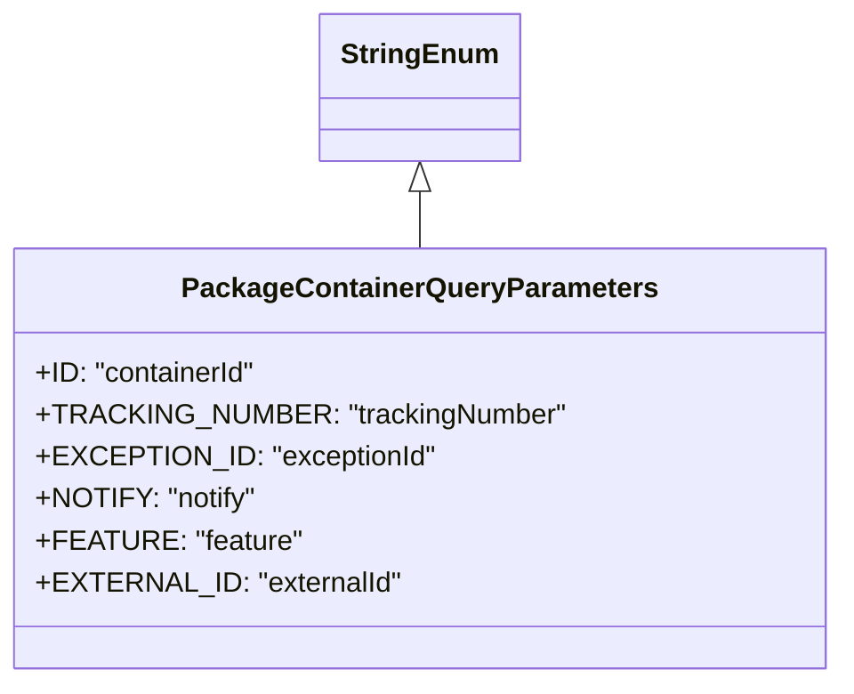

# Diagram: partview_core/partview_service/partview_service/api/package_container/PackageContainerQueryParameters.py

> Auto-generated by Obscura crawlers

## Mermaid

### SVG

<svg id="container" width="455.015625" xmlns="http://www.w3.org/2000/svg" class="classDiagram" height="390" viewBox="0 0 455.015625 390" role="graphics-document document" aria-roledescription="class"><g><defs><marker id="container_class-aggregationStart" class="marker aggregation class" refX="18" refY="7" markerWidth="190" markerHeight="240" orient="auto"><path d="M 18,7 L9,13 L1,7 L9,1 Z"></path></marker></defs><defs><marker id="container_class-aggregationEnd" class="marker aggregation class" refX="1" refY="7" markerWidth="20" markerHeight="28" orient="auto"><path d="M 18,7 L9,13 L1,7 L9,1 Z"></path></marker></defs><defs><marker id="container_class-extensionStart" class="marker extension class" refX="18" refY="7" markerWidth="190" markerHeight="240" orient="auto"><path d="M 1,7 L18,13 V 1 Z"></path></marker></defs><defs><marker id="container_class-extensionEnd" class="marker extension class" refX="1" refY="7" markerWidth="20" markerHeight="28" orient="auto"><path d="M 1,1 V 13 L18,7 Z"></path></marker></defs><defs><marker id="container_class-compositionStart" class="marker composition class" refX="18" refY="7" markerWidth="190" markerHeight="240" orient="auto"><path d="M 18,7 L9,13 L1,7 L9,1 Z"></path></marker></defs><defs><marker id="container_class-compositionEnd" class="marker composition class" refX="1" refY="7" markerWidth="20" markerHeight="28" orient="auto"><path d="M 18,7 L9,13 L1,7 L9,1 Z"></path></marker></defs><defs><marker id="container_class-dependencyStart" class="marker dependency class" refX="6" refY="7" markerWidth="190" markerHeight="240" orient="auto"><path d="M 5,7 L9,13 L1,7 L9,1 Z"></path></marker></defs><defs><marker id="container_class-dependencyEnd" class="marker dependency class" refX="13" refY="7" markerWidth="20" markerHeight="28" orient="auto"><path d="M 18,7 L9,13 L14,7 L9,1 Z"></path></marker></defs><defs><marker id="container_class-lollipopStart" class="marker lollipop class" refX="13" refY="7" markerWidth="190" markerHeight="240" orient="auto"><circle stroke="black" fill="transparent" cx="7" cy="7" r="6"></circle></marker></defs><defs><marker id="container_class-lollipopEnd" class="marker lollipop class" refX="1" refY="7" markerWidth="190" markerHeight="240" orient="auto"><circle stroke="black" fill="transparent" cx="7" cy="7" r="6"></circle></marker></defs><g class="root"><g class="clusters"></g><g class="edgePaths"><path d="M227.508,109.25L227.508,110.542C227.508,111.833,227.508,114.417,227.508,119.875C227.508,125.333,227.508,133.667,227.508,137.833L227.508,142" id="id_StringEnum_PackageContainerQueryParameters_1" class="edge-thickness-normal edge-pattern-solid relation" style=";;;" data-edge="true" data-et="edge" data-id="id_StringEnum_PackageContainerQueryParameters_1" data-points="W3sieCI6MjI3LjUwNzgxMjUsInkiOjkyfSx7IngiOjIyNy41MDc4MTI1LCJ5IjoxMTd9LHsieCI6MjI3LjUwNzgxMjUsInkiOjE0Mn1d" marker-start="url(#container_class-extensionStart)"></path></g><g class="edgeLabels"><g class="edgeLabel"><g class="label" data-id="id_StringEnum_PackageContainerQueryParameters_1" transform="translate(0, 0)"><foreignObject width="0" height="0">

</foreignObject></g></g></g><g class="nodes"><g class="node default" id="classId-StringEnum-0" transform="translate(227.5078125, 50)"><g class="basic label-container"><path d="M-54.234375 -42 L54.234375 -42 L54.234375 42 L-54.234375 42" stroke="none" stroke-width="0" fill="#ECECFF" style=""></path><path d="M-54.234375 -42 C-26.122908947750084 -42, 1.988557104499833 -42, 54.234375 -42 M-54.234375 -42 C-25.10120316174691 -42, 4.031968676506182 -42, 54.234375 -42 M54.234375 -42 C54.234375 -10.00207096058448, 54.234375 21.99585807883104, 54.234375 42 M54.234375 -42 C54.234375 -19.946453865214743, 54.234375 2.107092269570515, 54.234375 42 M54.234375 42 C32.530879957341796 42, 10.827384914683599 42, -54.234375 42 M54.234375 42 C15.174041872805034 42, -23.88629125438993 42, -54.234375 42 M-54.234375 42 C-54.234375 23.161765406538358, -54.234375 4.323530813076715, -54.234375 -42 M-54.234375 42 C-54.234375 15.93862882870484, -54.234375 -10.122742342590321, -54.234375 -42" stroke="#9370DB" stroke-width="1.3" fill="none" stroke-dasharray="0 0" style=""></path></g><g class="annotation-group text" transform="translate(0, -18)"></g><g class="label-group text" transform="translate(-42.234375, -18)"><g class="label" style="font-weight: bolder" transform="translate(0,-12)"><foreignObject width="84.46875" height="24">

StringEnum

</foreignObject></g></g><g class="members-group text" transform="translate(-42.234375, 30)"></g><g class="methods-group text" transform="translate(-42.234375, 60)"></g><g class="divider" style=""><path d="M-54.234375 6 C-26.013227314034108 6, 2.2079203719317846 6, 54.234375 6 M-54.234375 6 C-24.731108877666077 6, 4.772157244667845 6, 54.234375 6" stroke="#9370DB" stroke-width="1.3" fill="none" stroke-dasharray="0 0" style=""></path></g><g class="divider" style=""><path d="M-54.234375 24 C-20.95593101842592 24, 12.322512963148156 24, 54.234375 24 M-54.234375 24 C-25.69555407773584 24, 2.8432668445283227 24, 54.234375 24" stroke="#9370DB" stroke-width="1.3" fill="none" stroke-dasharray="0 0" style=""></path></g></g><g class="node default" id="classId-PackageContainerQueryParameters-1" transform="translate(227.5078125, 262)"><g class="basic label-container"><path d="M-219.5078125 -120 L219.5078125 -120 L219.5078125 120 L-219.5078125 120" stroke="none" stroke-width="0" fill="#ECECFF" style=""></path><path d="M-219.5078125 -120 C-108.94267261678904 -120, 1.6224672664219213 -120, 219.5078125 -120 M-219.5078125 -120 C-79.99546879749977 -120, 59.51687490500046 -120, 219.5078125 -120 M219.5078125 -120 C219.5078125 -29.81562834288954, 219.5078125 60.36874331422092, 219.5078125 120 M219.5078125 -120 C219.5078125 -71.80043545420094, 219.5078125 -23.60087090840186, 219.5078125 120 M219.5078125 120 C87.81428786198325 120, -43.87923677603351 120, -219.5078125 120 M219.5078125 120 C102.88373708191173 120, -13.740338336176535 120, -219.5078125 120 M-219.5078125 120 C-219.5078125 44.679832214899264, -219.5078125 -30.640335570201472, -219.5078125 -120 M-219.5078125 120 C-219.5078125 29.416200906851316, -219.5078125 -61.16759818629737, -219.5078125 -120" stroke="#9370DB" stroke-width="1.3" fill="none" stroke-dasharray="0 0" style=""></path></g><g class="annotation-group text" transform="translate(0, -96)"></g><g class="label-group text" transform="translate(-128.90625, -96)"><g class="label" style="font-weight: bolder" transform="translate(0,-12)"><foreignObject width="257.8125" height="24">

PackageContainerQueryParameters

</foreignObject></g></g><g class="members-group text" transform="translate(-207.5078125, -48)"><g class="label" style="" transform="translate(0,-12)"><foreignObject width="127.1875" height="24">

+ID: "containerId"

</foreignObject></g><g class="label" style="" transform="translate(0,12)"><foreignObject width="286.109375" height="24">

+TRACKING_NUMBER: "trackingNumber"

</foreignObject></g><g class="label" style="" transform="translate(0,36)"><foreignObject width="215.453125" height="24">

+EXCEPTION_ID: "exceptionId"

</foreignObject></g><g class="label" style="" transform="translate(0,60)"><foreignObject width="121.21875" height="24">

+NOTIFY: "notify"

</foreignObject></g><g class="label" style="" transform="translate(0,84)"><foreignObject width="142.53125" height="24">

+FEATURE: "feature"

</foreignObject></g><g class="label" style="" transform="translate(0,108)"><foreignObject width="197.46875" height="24">

+EXTERNAL_ID: "externalId"

</foreignObject></g></g><g class="methods-group text" transform="translate(-207.5078125, 120)"></g><g class="divider" style=""><path d="M-219.5078125 -72 C-52.37022690255421 -72, 114.76735869489158 -72, 219.5078125 -72 M-219.5078125 -72 C-60.5855925044757 -72, 98.3366274910486 -72, 219.5078125 -72" stroke="#9370DB" stroke-width="1.3" fill="none" stroke-dasharray="0 0" style=""></path></g><g class="divider" style=""><path d="M-219.5078125 96 C-87.99111558454263 96, 43.52558133091475 96, 219.5078125 96 M-219.5078125 96 C-64.02319227173481 96, 91.46142795653037 96, 219.5078125 96" stroke="#9370DB" stroke-width="1.3" fill="none" stroke-dasharray="0 0" style=""></path></g></g></g></g></g></svg>
