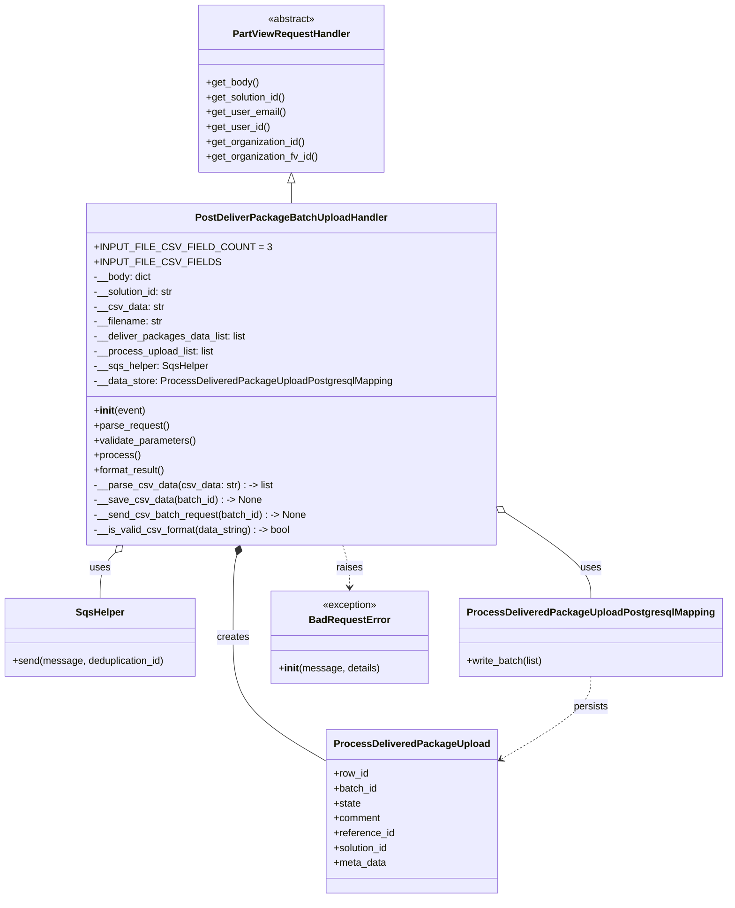
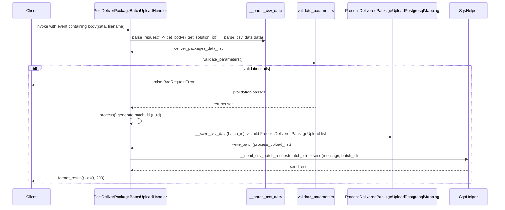

# Diagram: partview_core/partview_service/partview_service/api/package_container/batch_upload/handler/post_deliver_package_batch_upload_handler.py

> Auto-generated by Obscura crawlers

## Diagram 1

### SVG

<svg id="container" width="1148.65625" xmlns="http://www.w3.org/2000/svg" class="classDiagram" height="1450" viewBox="0 0 1148.65625 1450" role="graphics-document document" aria-roledescription="class"><g><defs><marker id="container_class-aggregationStart" class="marker aggregation class" refX="18" refY="7" markerWidth="190" markerHeight="240" orient="auto"><path d="M 18,7 L9,13 L1,7 L9,1 Z"></path></marker></defs><defs><marker id="container_class-aggregationEnd" class="marker aggregation class" refX="1" refY="7" markerWidth="20" markerHeight="28" orient="auto"><path d="M 18,7 L9,13 L1,7 L9,1 Z"></path></marker></defs><defs><marker id="container_class-extensionStart" class="marker extension class" refX="18" refY="7" markerWidth="190" markerHeight="240" orient="auto"><path d="M 1,7 L18,13 V 1 Z"></path></marker></defs><defs><marker id="container_class-extensionEnd" class="marker extension class" refX="1" refY="7" markerWidth="20" markerHeight="28" orient="auto"><path d="M 1,1 V 13 L18,7 Z"></path></marker></defs><defs><marker id="container_class-compositionStart" class="marker composition class" refX="18" refY="7" markerWidth="190" markerHeight="240" orient="auto"><path d="M 18,7 L9,13 L1,7 L9,1 Z"></path></marker></defs><defs><marker id="container_class-compositionEnd" class="marker composition class" refX="1" refY="7" markerWidth="20" markerHeight="28" orient="auto"><path d="M 18,7 L9,13 L1,7 L9,1 Z"></path></marker></defs><defs><marker id="container_class-dependencyStart" class="marker dependency class" refX="6" refY="7" markerWidth="190" markerHeight="240" orient="auto"><path d="M 5,7 L9,13 L1,7 L9,1 Z"></path></marker></defs><defs><marker id="container_class-dependencyEnd" class="marker dependency class" refX="13" refY="7" markerWidth="20" markerHeight="28" orient="auto"><path d="M 18,7 L9,13 L14,7 L9,1 Z"></path></marker></defs><defs><marker id="container_class-lollipopStart" class="marker lollipop class" refX="13" refY="7" markerWidth="190" markerHeight="240" orient="auto"><circle stroke="black" fill="transparent" cx="7" cy="7" r="6"></circle></marker></defs><defs><marker id="container_class-lollipopEnd" class="marker lollipop class" refX="1" refY="7" markerWidth="190" markerHeight="240" orient="auto"><circle stroke="black" fill="transparent" cx="7" cy="7" r="6"></circle></marker></defs><g class="root"><g class="clusters"></g><g class="edgePaths"><path d="M470.969,295.25L470.969,296.542C470.969,297.833,470.969,300.417,470.969,305.875C470.969,311.333,470.969,319.667,470.969,323.833L470.969,328" id="id_PartViewRequestHandler_PostDeliverPackageBatchUploadHandler_1" class="edge-thickness-normal edge-pattern-solid relation" style=";;;" data-edge="true" data-et="edge" data-id="id_PartViewRequestHandler_PostDeliverPackageBatchUploadHandler_1" data-points="W3sieCI6NDcwLjk2ODc1LCJ5IjoyNzh9LHsieCI6NDcwLjk2ODc1LCJ5IjozMDN9LHsieCI6NDcwLjk2ODc1LCJ5IjozMjh9XQ==" marker-start="url(#container_class-extensionStart)"></path><path d="M186.87,892.287L182.811,896.405C178.752,900.524,170.634,908.762,166.575,921.048C162.516,933.333,162.516,949.667,162.516,957.833L162.516,966" id="id_PostDeliverPackageBatchUploadHandler_SqsHelper_2" class="edge-thickness-normal edge-pattern-solid relation" style=";;;" data-edge="true" data-et="edge" data-id="id_PostDeliverPackageBatchUploadHandler_SqsHelper_2" data-points="W3sieCI6MTk4Ljk3ODEzNDk4NDAyNTYsInkiOjg4MH0seyJ4IjoxNjIuNTE1NjI1LCJ5Ijo5MTd9LHsieCI6MTYyLjUxNTYyNSwieSI6OTY2fV0=" marker-start="url(#container_class-aggregationStart)"></path><path d="M810.706,831.02L832.151,845.35C853.596,859.68,896.485,888.34,917.93,910.837C939.375,933.333,939.375,949.667,939.375,957.833L939.375,966" id="id_PostDeliverPackageBatchUploadHandler_ProcessDeliveredPackageUploadPostgresqlMapping_3" class="edge-thickness-normal edge-pattern-solid relation" style=";;;" data-edge="true" data-et="edge" data-id="id_PostDeliverPackageBatchUploadHandler_ProcessDeliveredPackageUploadPostgresqlMapping_3" data-points="W3sieCI6Nzk2LjM2MzI4MTI1LCJ5Ijo4MjEuNDM2MjI4MjM0MDM4M30seyJ4Ijo5MzkuMzc1LCJ5Ijo5MTd9LHsieCI6OTM5LjM3NSwieSI6OTY2fV0=" marker-start="url(#container_class-aggregationStart)"></path><path d="M384.267,896.539L383.257,899.949C382.246,903.359,380.225,910.18,379.214,932.256C378.203,954.333,378.203,991.667,378.203,1029C378.203,1066.333,378.203,1103.667,403.154,1137.361C428.104,1171.056,478.005,1201.112,502.956,1216.14L527.906,1231.168" id="id_PostDeliverPackageBatchUploadHandler_ProcessDeliveredPackageUpload_4" class="edge-thickness-normal edge-pattern-solid relation" style=";;;" data-edge="true" data-et="edge" data-id="id_PostDeliverPackageBatchUploadHandler_ProcessDeliveredPackageUpload_4" data-points="W3sieCI6Mzg5LjE2OTAyOTU1MjcxNTY0LCJ5Ijo4ODB9LHsieCI6Mzc4LjIwMzEyNSwieSI6OTE3fSx7IngiOjM3OC4yMDMxMjUsInkiOjEwMjl9LHsieCI6Mzc4LjIwMzEyNSwieSI6MTE0MX0seyJ4Ijo1MjcuOTA2MjUsInkiOjEyMzEuMTY3ODQwNzM1MDY5fV0=" marker-start="url(#container_class-compositionStart)"></path><path d="M552.768,880L554.596,886.167C556.424,892.333,560.079,904.667,561.907,916C563.734,927.333,563.734,937.667,563.734,942.833L563.734,948" id="id_PostDeliverPackageBatchUploadHandler_BadRequestError_5" class="edge-thickness-normal edge-pattern-dashed relation" style=";;;" data-edge="true" data-et="edge" data-id="id_PostDeliverPackageBatchUploadHandler_BadRequestError_5" data-points="W3sieCI6NTUyLjc2ODQ3MDQ0NzI4NDQsInkiOjg4MH0seyJ4Ijo1NjMuNzM0Mzc1LCJ5Ijo5MTd9LHsieCI6NTYzLjczNDM3NSwieSI6OTU0fV0=" marker-end="url(#container_class-dependencyEnd)"></path><path d="M939.375,1092L939.375,1100.167C939.375,1108.333,939.375,1124.667,915.281,1147.345C891.187,1170.024,842.999,1199.048,818.905,1213.56L794.812,1228.072" id="id_ProcessDeliveredPackageUploadPostgresqlMapping_ProcessDeliveredPackageUpload_6" class="edge-thickness-normal edge-pattern-dashed relation" style=";;;" data-edge="true" data-et="edge" data-id="id_ProcessDeliveredPackageUploadPostgresqlMapping_ProcessDeliveredPackageUpload_6" data-points="W3sieCI6OTM5LjM3NSwieSI6MTA5Mn0seyJ4Ijo5MzkuMzc1LCJ5IjoxMTQxfSx7IngiOjc4OS42NzE4NzUsInkiOjEyMzEuMTY3ODQwNzM1MDY5fV0=" marker-end="url(#container_class-dependencyEnd)"></path></g><g class="edgeLabels"><g class="edgeLabel"><g class="label" data-id="id_PartViewRequestHandler_PostDeliverPackageBatchUploadHandler_1" transform="translate(0, 0)"><foreignObject width="0" height="0">

</foreignObject></g></g><g class="edgeLabel" transform="translate(162.515625, 917)"><g class="label" data-id="id_PostDeliverPackageBatchUploadHandler_SqsHelper_2" transform="translate(-16.4921875, -12)"><foreignObject width="32.984375" height="24">

uses

</foreignObject></g></g><g class="edgeLabel" transform="translate(939.375, 917)"><g class="label" data-id="id_PostDeliverPackageBatchUploadHandler_ProcessDeliveredPackageUploadPostgresqlMapping_3" transform="translate(-16.4921875, -12)"><foreignObject width="32.984375" height="24">

uses

</foreignObject></g></g><g class="edgeLabel" transform="translate(378.203125, 1029)"><g class="label" data-id="id_PostDeliverPackageBatchUploadHandler_ProcessDeliveredPackageUpload_4" transform="translate(-26.171875, -12)"><foreignObject width="52.34375" height="24">

creates

</foreignObject></g></g><g class="edgeLabel" transform="translate(563.734375, 917)"><g class="label" data-id="id_PostDeliverPackageBatchUploadHandler_BadRequestError_5" transform="translate(-21.25, -12)"><foreignObject width="42.5" height="24">

raises

</foreignObject></g></g><g class="edgeLabel" transform="translate(939.375, 1141)"><g class="label" data-id="id_ProcessDeliveredPackageUploadPostgresqlMapping_ProcessDeliveredPackageUpload_6" transform="translate(-28.4375, -12)"><foreignObject width="56.875" height="24">

persists

</foreignObject></g></g></g><g class="nodes"><g class="node default" id="classId-PartViewRequestHandler-0" transform="translate(470.96875, 143)"><g class="basic label-container"><path d="M-148.890625 -135 L148.890625 -135 L148.890625 135 L-148.890625 135" stroke="none" stroke-width="0" fill="#ECECFF" style=""></path><path d="M-148.890625 -135 C-60.21879245987647 -135, 28.453040080247064 -135, 148.890625 -135 M-148.890625 -135 C-69.79435658338399 -135, 9.301911833232026 -135, 148.890625 -135 M148.890625 -135 C148.890625 -61.58762612020679, 148.890625 11.824747759586415, 148.890625 135 M148.890625 -135 C148.890625 -37.96764650068076, 148.890625 59.064706998638485, 148.890625 135 M148.890625 135 C55.62710152978502 135, -37.636421940429955 135, -148.890625 135 M148.890625 135 C48.86188681076145 135, -51.166851378477105 135, -148.890625 135 M-148.890625 135 C-148.890625 69.08398796489008, -148.890625 3.1679759297801695, -148.890625 -135 M-148.890625 135 C-148.890625 72.50930520775624, -148.890625 10.018610415512484, -148.890625 -135" stroke="#9370DB" stroke-width="1.3" fill="none" stroke-dasharray="0 0" style=""></path></g><g class="annotation-group text" transform="translate(-38.609375, -111)"><g class="label" style="" transform="translate(0,-12)"><foreignObject width="77.21875" height="24">

«abstract»

</foreignObject></g></g><g class="label-group text" transform="translate(-91.359375, -87)"><g class="label" style="font-weight: bolder" transform="translate(0,-12)"><foreignObject width="182.71875" height="24">

PartViewRequestHandler

</foreignObject></g></g><g class="members-group text" transform="translate(-136.890625, -39)"></g><g class="methods-group text" transform="translate(-136.890625, -9)"><g class="label" style="" transform="translate(0,-12)"><foreignObject width="85.53125" height="24">

+get_body()

</foreignObject></g><g class="label" style="" transform="translate(0,12)"><foreignObject width="131.46875" height="24">

+get_solution_id()

</foreignObject></g><g class="label" style="" transform="translate(0,36)"><foreignObject width="127.65625" height="24">

+get_user_email()

</foreignObject></g><g class="label" style="" transform="translate(0,60)"><foreignObject width="101.71875" height="24">

+get_user_id()

</foreignObject></g><g class="label" style="" transform="translate(0,84)"><foreignObject width="161.671875" height="24">

+get_organization_id()

</foreignObject></g><g class="label" style="" transform="translate(0,108)"><foreignObject width="182.421875" height="24">

+get_organization_fv_id()

</foreignObject></g></g><g class="divider" style=""><path d="M-148.890625 -63 C-72.12657574670168 -63, 4.637473506596649 -63, 148.890625 -63 M-148.890625 -63 C-86.7019167538121 -63, -24.5132085076242 -63, 148.890625 -63" stroke="#9370DB" stroke-width="1.3" fill="none" stroke-dasharray="0 0" style=""></path></g><g class="divider" style=""><path d="M-148.890625 -39 C-50.34726643205134 -39, 48.19609213589732 -39, 148.890625 -39 M-148.890625 -39 C-87.38741430106151 -39, -25.884203602123037 -39, 148.890625 -39" stroke="#9370DB" stroke-width="1.3" fill="none" stroke-dasharray="0 0" style=""></path></g></g><g class="node default" id="classId-PostDeliverPackageBatchUploadHandler-1" transform="translate(470.96875, 604)"><g class="basic label-container"><path d="M-325.39453125 -276 L325.39453125 -276 L325.39453125 276 L-325.39453125 276" stroke="none" stroke-width="0" fill="#ECECFF" style=""></path><path d="M-325.39453125 -276 C-67.90127802872178 -276, 189.59197519255645 -276, 325.39453125 -276 M-325.39453125 -276 C-77.74269010534488 -276, 169.90915103931025 -276, 325.39453125 -276 M325.39453125 -276 C325.39453125 -149.85609486127302, 325.39453125 -23.712189722546043, 325.39453125 276 M325.39453125 -276 C325.39453125 -123.45303495478302, 325.39453125 29.093930090433958, 325.39453125 276 M325.39453125 276 C165.59530549003114 276, 5.796079730062274 276, -325.39453125 276 M325.39453125 276 C69.10953348238564 276, -187.1754642852287 276, -325.39453125 276 M-325.39453125 276 C-325.39453125 136.21628570214, -325.39453125 -3.5674285957200027, -325.39453125 -276 M-325.39453125 276 C-325.39453125 153.43848886154106, -325.39453125 30.87697772308212, -325.39453125 -276" stroke="#9370DB" stroke-width="1.3" fill="none" stroke-dasharray="0 0" style=""></path></g><g class="annotation-group text" transform="translate(0, -252)"></g><g class="label-group text" transform="translate(-147.8515625, -252)"><g class="label" style="font-weight: bolder" transform="translate(0,-12)"><foreignObject width="295.703125" height="24">

PostDeliverPackageBatchUploadHandler

</foreignObject></g></g><g class="members-group text" transform="translate(-313.39453125, -204)"><g class="label" style="" transform="translate(0,-12)"><foreignObject width="250.140625" height="24">

+INPUT_FILE_CSV_FIELD_COUNT = 3

</foreignObject></g><g class="label" style="" transform="translate(0,12)"><foreignObject width="177.84375" height="24">

+INPUT_FILE_CSV_FIELDS

</foreignObject></g><g class="label" style="" transform="translate(0,36)"><foreignObject width="93.59375" height="24">

-__body: dict

</foreignObject></g><g class="label" style="" transform="translate(0,60)"><foreignObject width="131.390625" height="24">

-__solution_id: str

</foreignObject></g><g class="label" style="" transform="translate(0,84)"><foreignObject width="111.71875" height="24">

-__csv_data: str

</foreignObject></g><g class="label" style="" transform="translate(0,108)"><foreignObject width="111.875" height="24">

-__filename: str

</foreignObject></g><g class="label" style="" transform="translate(0,132)"><foreignObject width="246.53125" height="24">

-__deliver_packages_data_list: list

</foreignObject></g><g class="label" style="" transform="translate(0,156)"><foreignObject width="196.796875" height="24">

-__process_upload_list: list

</foreignObject></g><g class="label" style="" transform="translate(0,180)"><foreignObject width="184.046875" height="24">

-__sqs_helper: SqsHelper

</foreignObject></g><g class="label" style="" transform="translate(0,204)"><foreignObject width="478.9375" height="24">

-__data_store: ProcessDeliveredPackageUploadPostgresqlMapping

</foreignObject></g></g><g class="methods-group text" transform="translate(-313.39453125, 60)"><g class="label" style="" transform="translate(0,-12)"><foreignObject width="83.140625" height="24">

+<strong>init</strong>(event)

</foreignObject></g><g class="label" style="" transform="translate(0,12)"><foreignObject width="121.796875" height="24">

+parse_request()

</foreignObject></g><g class="label" style="" transform="translate(0,36)"><foreignObject width="166.546875" height="24">

+validate_parameters()

</foreignObject></g><g class="label" style="" transform="translate(0,60)"><foreignObject width="73.734375" height="24">

+process()

</foreignObject></g><g class="label" style="" transform="translate(0,84)"><foreignObject width="117.015625" height="24">

+format_result()

</foreignObject></g><g class="label" style="" transform="translate(0,108)"><foreignObject width="286.59375" height="24">

-__parse_csv_data(csv_data: str) : -&gt; list

</foreignObject></g><g class="label" style="" transform="translate(0,132)"><foreignObject width="267.265625" height="24">

-__save_csv_data(batch_id) : -&gt; None

</foreignObject></g><g class="label" style="" transform="translate(0,156)"><foreignObject width="342.296875" height="24">

-__send_csv_batch_request(batch_id) : -&gt; None

</foreignObject></g><g class="label" style="" transform="translate(0,180)"><foreignObject width="320.09375" height="24">

-__is_valid_csv_format(data_string) : -&gt; bool

</foreignObject></g></g><g class="divider" style=""><path d="M-325.39453125 -228 C-93.26021410846124 -228, 138.87410303307752 -228, 325.39453125 -228 M-325.39453125 -228 C-152.83868738688025 -228, 19.717156476239495 -228, 325.39453125 -228" stroke="#9370DB" stroke-width="1.3" fill="none" stroke-dasharray="0 0" style=""></path></g><g class="divider" style=""><path d="M-325.39453125 36 C-140.8467200846958 36, 43.70109108060842 36, 325.39453125 36 M-325.39453125 36 C-80.6423715140119 36, 164.1097882219762 36, 325.39453125 36" stroke="#9370DB" stroke-width="1.3" fill="none" stroke-dasharray="0 0" style=""></path></g></g><g class="node default" id="classId-SqsHelper-2" transform="translate(162.515625, 1029)"><g class="basic label-container"><path d="M-154.515625 -63 L154.515625 -63 L154.515625 63 L-154.515625 63" stroke="none" stroke-width="0" fill="#ECECFF" style=""></path><path d="M-154.515625 -63 C-68.23570924010097 -63, 18.044206519798053 -63, 154.515625 -63 M-154.515625 -63 C-73.12636755679127 -63, 8.262889886417469 -63, 154.515625 -63 M154.515625 -63 C154.515625 -22.27568040174907, 154.515625 18.44863919650186, 154.515625 63 M154.515625 -63 C154.515625 -22.43710600729215, 154.515625 18.1257879854157, 154.515625 63 M154.515625 63 C86.17622695251805 63, 17.8368289050361 63, -154.515625 63 M154.515625 63 C58.74132208802294 63, -37.03298082395412 63, -154.515625 63 M-154.515625 63 C-154.515625 28.852565590289302, -154.515625 -5.294868819421396, -154.515625 -63 M-154.515625 63 C-154.515625 36.065280807433595, -154.515625 9.130561614867183, -154.515625 -63" stroke="#9370DB" stroke-width="1.3" fill="none" stroke-dasharray="0 0" style=""></path></g><g class="annotation-group text" transform="translate(0, -39)"></g><g class="label-group text" transform="translate(-37.765625, -39)"><g class="label" style="font-weight: bolder" transform="translate(0,-12)"><foreignObject width="75.53125" height="24">

SqsHelper

</foreignObject></g></g><g class="members-group text" transform="translate(-142.515625, 9)"></g><g class="methods-group text" transform="translate(-142.515625, 39)"><g class="label" style="" transform="translate(0,-12)"><foreignObject width="247.265625" height="24">

+send(message, deduplication_id)

</foreignObject></g></g><g class="divider" style=""><path d="M-154.515625 -15 C-86.00386742225774 -15, -17.492109844515483 -15, 154.515625 -15 M-154.515625 -15 C-70.13157823194406 -15, 14.252468536111877 -15, 154.515625 -15" stroke="#9370DB" stroke-width="1.3" fill="none" stroke-dasharray="0 0" style=""></path></g><g class="divider" style=""><path d="M-154.515625 9 C-64.13691725146653 9, 26.241790497066944 9, 154.515625 9 M-154.515625 9 C-60.414099304561276 9, 33.68742639087745 9, 154.515625 9" stroke="#9370DB" stroke-width="1.3" fill="none" stroke-dasharray="0 0" style=""></path></g></g><g class="node default" id="classId-ProcessDeliveredPackageUploadPostgresqlMapping-3" transform="translate(939.375, 1029)"><g class="basic label-container"><path d="M-201.28125 -63 L201.28125 -63 L201.28125 63 L-201.28125 63" stroke="none" stroke-width="0" fill="#ECECFF" style=""></path><path d="M-201.28125 -63 C-64.0489817321041 -63, 73.18328653579181 -63, 201.28125 -63 M-201.28125 -63 C-80.49167472844412 -63, 40.29790054311175 -63, 201.28125 -63 M201.28125 -63 C201.28125 -15.670431795473242, 201.28125 31.659136409053517, 201.28125 63 M201.28125 -63 C201.28125 -17.384370549649546, 201.28125 28.231258900700908, 201.28125 63 M201.28125 63 C107.06854693896459 63, 12.855843877929175 63, -201.28125 63 M201.28125 63 C89.55634688011564 63, -22.16855623976872 63, -201.28125 63 M-201.28125 63 C-201.28125 19.413341553185496, -201.28125 -24.173316893629007, -201.28125 -63 M-201.28125 63 C-201.28125 19.683794671500088, -201.28125 -23.632410656999824, -201.28125 -63" stroke="#9370DB" stroke-width="1.3" fill="none" stroke-dasharray="0 0" style=""></path></g><g class="annotation-group text" transform="translate(0, -39)"></g><g class="label-group text" transform="translate(-189.28125, -39)"><g class="label" style="font-weight: bolder" transform="translate(0,-12)"><foreignObject width="378.5625" height="24">

ProcessDeliveredPackageUploadPostgresqlMapping

</foreignObject></g></g><g class="members-group text" transform="translate(-189.28125, 9)"></g><g class="methods-group text" transform="translate(-189.28125, 39)"><g class="label" style="" transform="translate(0,-12)"><foreignObject width="125.828125" height="24">

+write_batch(list)

</foreignObject></g></g><g class="divider" style=""><path d="M-201.28125 -15 C-98.81911694119756 -15, 3.6430161176048728 -15, 201.28125 -15 M-201.28125 -15 C-54.33944507117761 -15, 92.60235985764479 -15, 201.28125 -15" stroke="#9370DB" stroke-width="1.3" fill="none" stroke-dasharray="0 0" style=""></path></g><g class="divider" style=""><path d="M-201.28125 9 C-42.912083489870696 9, 115.45708302025861 9, 201.28125 9 M-201.28125 9 C-54.61505712833477 9, 92.05113574333046 9, 201.28125 9" stroke="#9370DB" stroke-width="1.3" fill="none" stroke-dasharray="0 0" style=""></path></g></g><g class="node default" id="classId-ProcessDeliveredPackageUpload-4" transform="translate(658.7890625, 1310)"><g class="basic label-container"><path d="M-130.8828125 -132 L130.8828125 -132 L130.8828125 132 L-130.8828125 132" stroke="none" stroke-width="0" fill="#ECECFF" style=""></path><path d="M-130.8828125 -132 C-55.78225258667594 -132, 19.318307326648124 -132, 130.8828125 -132 M-130.8828125 -132 C-73.66287293473184 -132, -16.442933369463688 -132, 130.8828125 -132 M130.8828125 -132 C130.8828125 -76.35278849160528, 130.8828125 -20.705576983210563, 130.8828125 132 M130.8828125 -132 C130.8828125 -64.81663114489045, 130.8828125 2.3667377102190983, 130.8828125 132 M130.8828125 132 C60.60304834219802 132, -9.676715815603956 132, -130.8828125 132 M130.8828125 132 C40.417997258495745 132, -50.04681798300851 132, -130.8828125 132 M-130.8828125 132 C-130.8828125 29.21819244462155, -130.8828125 -73.5636151107569, -130.8828125 -132 M-130.8828125 132 C-130.8828125 74.24252846828617, -130.8828125 16.48505693657232, -130.8828125 -132" stroke="#9370DB" stroke-width="1.3" fill="none" stroke-dasharray="0 0" style=""></path></g><g class="annotation-group text" transform="translate(0, -108)"></g><g class="label-group text" transform="translate(-118.8828125, -108)"><g class="label" style="font-weight: bolder" transform="translate(0,-12)"><foreignObject width="237.765625" height="24">

ProcessDeliveredPackageUpload

</foreignObject></g></g><g class="members-group text" transform="translate(-118.8828125, -60)"><g class="label" style="" transform="translate(0,-12)"><foreignObject width="56.578125" height="24">

+row_id

</foreignObject></g><g class="label" style="" transform="translate(0,12)"><foreignObject width="71" height="24">

+batch_id

</foreignObject></g><g class="label" style="" transform="translate(0,36)"><foreignObject width="44.09375" height="24">

+state

</foreignObject></g><g class="label" style="" transform="translate(0,60)"><foreignObject width="75.953125" height="24">

+comment

</foreignObject></g><g class="label" style="" transform="translate(0,84)"><foreignObject width="98.25" height="24">

+reference_id

</foreignObject></g><g class="label" style="" transform="translate(0,108)"><foreignObject width="90.21875" height="24">

+solution_id

</foreignObject></g><g class="label" style="" transform="translate(0,132)"><foreignObject width="85.4375" height="24">

+meta_data

</foreignObject></g></g><g class="methods-group text" transform="translate(-118.8828125, 132)"></g><g class="divider" style=""><path d="M-130.8828125 -84 C-68.28657510919952 -84, -5.690337718399036 -84, 130.8828125 -84 M-130.8828125 -84 C-71.60549059761681 -84, -12.3281686952336 -84, 130.8828125 -84" stroke="#9370DB" stroke-width="1.3" fill="none" stroke-dasharray="0 0" style=""></path></g><g class="divider" style=""><path d="M-130.8828125 108 C-42.209095236543234 108, 46.46462202691353 108, 130.8828125 108 M-130.8828125 108 C-46.90501112243891 108, 37.072790255122186 108, 130.8828125 108" stroke="#9370DB" stroke-width="1.3" fill="none" stroke-dasharray="0 0" style=""></path></g></g><g class="node default" id="classId-BadRequestError-5" transform="translate(563.734375, 1029)"><g class="basic label-container"><path d="M-124.359375 -75 L124.359375 -75 L124.359375 75 L-124.359375 75" stroke="none" stroke-width="0" fill="#ECECFF" style=""></path><path d="M-124.359375 -75 C-31.33333909328482 -75, 61.69269681343036 -75, 124.359375 -75 M-124.359375 -75 C-51.9382658736954 -75, 20.4828432526092 -75, 124.359375 -75 M124.359375 -75 C124.359375 -38.63271801245721, 124.359375 -2.265436024914422, 124.359375 75 M124.359375 -75 C124.359375 -17.151603758901075, 124.359375 40.69679248219785, 124.359375 75 M124.359375 75 C36.968743261469996 75, -50.42188847706001 75, -124.359375 75 M124.359375 75 C27.67898116340413 75, -69.00141267319174 75, -124.359375 75 M-124.359375 75 C-124.359375 25.811010659345357, -124.359375 -23.377978681309287, -124.359375 -75 M-124.359375 75 C-124.359375 16.25329923923993, -124.359375 -42.49340152152014, -124.359375 -75" stroke="#9370DB" stroke-width="1.3" fill="none" stroke-dasharray="0 0" style=""></path></g><g class="annotation-group text" transform="translate(-44.3515625, -51)"><g class="label" style="" transform="translate(0,-12)"><foreignObject width="88.703125" height="24">

«exception»

</foreignObject></g></g><g class="label-group text" transform="translate(-62.28125, -27)"><g class="label" style="font-weight: bolder" transform="translate(0,-12)"><foreignObject width="124.5625" height="24">

BadRequestError

</foreignObject></g></g><g class="members-group text" transform="translate(-112.359375, 21)"></g><g class="methods-group text" transform="translate(-112.359375, 51)"><g class="label" style="" transform="translate(0,-12)"><foreignObject width="162.4375" height="24">

+<strong>init</strong>(message, details)

</foreignObject></g></g><g class="divider" style=""><path d="M-124.359375 -3 C-48.97202471452863 -3, 26.41532557094274 -3, 124.359375 -3 M-124.359375 -3 C-49.458003100371286 -3, 25.443368799257428 -3, 124.359375 -3" stroke="#9370DB" stroke-width="1.3" fill="none" stroke-dasharray="0 0" style=""></path></g><g class="divider" style=""><path d="M-124.359375 21 C-28.797098814963974 21, 66.76517737007205 21, 124.359375 21 M-124.359375 21 C-45.56396530582093 21, 33.23144438835814 21, 124.359375 21" stroke="#9370DB" stroke-width="1.3" fill="none" stroke-dasharray="0 0" style=""></path></g></g></g></g></g></svg>

## Diagram 2

### SVG

<svg id="container" width="2137" xmlns="http://www.w3.org/2000/svg" height="877" viewBox="-50 -10 2137 877" role="graphics-document document" aria-roledescription="sequence"><g><rect x="1887" y="791" fill="#eaeaea" stroke="#666" width="150" height="65" name="SQS" rx="3" ry="3" class="actor actor-bottom"></rect><text x="1962" y="823.5" dominant-baseline="central" alignment-baseline="central" class="actor actor-box" style="text-anchor: middle; font-size: 16px; font-weight: 400;"><tspan x="1962" dy="0">SqsHelper</tspan></text></g><g><rect x="1445" y="791" fill="#eaeaea" stroke="#666" width="392" height="65" name="Store" rx="3" ry="3" class="actor actor-bottom"></rect><text x="1641" y="823.5" dominant-baseline="central" alignment-baseline="central" class="actor actor-box" style="text-anchor: middle; font-size: 16px; font-weight: 400;"><tspan x="1641" dy="0">ProcessDeliveredPackageUploadPostgresqlMapping</tspan></text></g><g><rect x="1227" y="791" fill="#eaeaea" stroke="#666" width="168" height="65" name="Validator" rx="3" ry="3" class="actor actor-bottom"></rect><text x="1311" y="823.5" dominant-baseline="central" alignment-baseline="central" class="actor actor-box" style="text-anchor: middle; font-size: 16px; font-weight: 400;"><tspan x="1311" dy="0">validate_parameters</tspan></text></g><g><rect x="1027" y="791" fill="#eaeaea" stroke="#666" width="150" height="65" name="Parser" rx="3" ry="3" class="actor actor-bottom"></rect><text x="1102" y="823.5" dominant-baseline="central" alignment-baseline="central" class="actor actor-box" style="text-anchor: middle; font-size: 16px; font-weight: 400;"><tspan x="1102" dy="0">__parse_csv_data</tspan></text></g><g><rect x="352" y="791" fill="#eaeaea" stroke="#666" width="312" height="65" name="Handler" rx="3" ry="3" class="actor actor-bottom"></rect><text x="508" y="823.5" dominant-baseline="central" alignment-baseline="central" class="actor actor-box" style="text-anchor: middle; font-size: 16px; font-weight: 400;"><tspan x="508" dy="0">PostDeliverPackageBatchUploadHandler</tspan></text></g><g><rect x="0" y="791" fill="#eaeaea" stroke="#666" width="150" height="65" name="Client" rx="3" ry="3" class="actor actor-bottom"></rect><text x="75" y="823.5" dominant-baseline="central" alignment-baseline="central" class="actor actor-box" style="text-anchor: middle; font-size: 16px; font-weight: 400;"><tspan x="75" dy="0">Client</tspan></text></g><g><line id="actor5" x1="1962" y1="65" x2="1962" y2="791" class="actor-line 200" stroke-width="0.5px" stroke="#999" name="SQS"></line><g id="root-5"><rect x="1887" y="0" fill="#eaeaea" stroke="#666" width="150" height="65" name="SQS" rx="3" ry="3" class="actor actor-top"></rect><text x="1962" y="32.5" dominant-baseline="central" alignment-baseline="central" class="actor actor-box" style="text-anchor: middle; font-size: 16px; font-weight: 400;"><tspan x="1962" dy="0">SqsHelper</tspan></text></g></g><g><line id="actor4" x1="1641" y1="65" x2="1641" y2="791" class="actor-line 200" stroke-width="0.5px" stroke="#999" name="Store"></line><g id="root-4"><rect x="1445" y="0" fill="#eaeaea" stroke="#666" width="392" height="65" name="Store" rx="3" ry="3" class="actor actor-top"></rect><text x="1641" y="32.5" dominant-baseline="central" alignment-baseline="central" class="actor actor-box" style="text-anchor: middle; font-size: 16px; font-weight: 400;"><tspan x="1641" dy="0">ProcessDeliveredPackageUploadPostgresqlMapping</tspan></text></g></g><g><line id="actor3" x1="1311" y1="65" x2="1311" y2="791" class="actor-line 200" stroke-width="0.5px" stroke="#999" name="Validator"></line><g id="root-3"><rect x="1227" y="0" fill="#eaeaea" stroke="#666" width="168" height="65" name="Validator" rx="3" ry="3" class="actor actor-top"></rect><text x="1311" y="32.5" dominant-baseline="central" alignment-baseline="central" class="actor actor-box" style="text-anchor: middle; font-size: 16px; font-weight: 400;"><tspan x="1311" dy="0">validate_parameters</tspan></text></g></g><g><line id="actor2" x1="1102" y1="65" x2="1102" y2="791" class="actor-line 200" stroke-width="0.5px" stroke="#999" name="Parser"></line><g id="root-2"><rect x="1027" y="0" fill="#eaeaea" stroke="#666" width="150" height="65" name="Parser" rx="3" ry="3" class="actor actor-top"></rect><text x="1102" y="32.5" dominant-baseline="central" alignment-baseline="central" class="actor actor-box" style="text-anchor: middle; font-size: 16px; font-weight: 400;"><tspan x="1102" dy="0">__parse_csv_data</tspan></text></g></g><g><line id="actor1" x1="508" y1="65" x2="508" y2="791" class="actor-line 200" stroke-width="0.5px" stroke="#999" name="Handler"></line><g id="root-1"><rect x="352" y="0" fill="#eaeaea" stroke="#666" width="312" height="65" name="Handler" rx="3" ry="3" class="actor actor-top"></rect><text x="508" y="32.5" dominant-baseline="central" alignment-baseline="central" class="actor actor-box" style="text-anchor: middle; font-size: 16px; font-weight: 400;"><tspan x="508" dy="0">PostDeliverPackageBatchUploadHandler</tspan></text></g></g><g><line id="actor0" x1="75" y1="65" x2="75" y2="791" class="actor-line 200" stroke-width="0.5px" stroke="#999" name="Client"></line><g id="root-0"><rect x="0" y="0" fill="#eaeaea" stroke="#666" width="150" height="65" name="Client" rx="3" ry="3" class="actor actor-top"></rect><text x="75" y="32.5" dominant-baseline="central" alignment-baseline="central" class="actor actor-box" style="text-anchor: middle; font-size: 16px; font-weight: 400;"><tspan x="75" dy="0">Client</tspan></text></g></g><g></g><defs><symbol id="computer" width="24" height="24"><path transform="scale(.5)" d="M2 2v13h20v-13h-20zm18 11h-16v-9h16v9zm-10.228 6l.466-1h3.524l.467 1h-4.457zm14.228 3h-24l2-6h2.104l-1.33 4h18.45l-1.297-4h2.073l2 6zm-5-10h-14v-7h14v7z"></path></symbol></defs><defs><symbol id="database" fill-rule="evenodd" clip-rule="evenodd"><path transform="scale(.5)" d="M12.258.001l.256.004.255.005.253.008.251.01.249.012.247.015.246.016.242.019.241.02.239.023.236.024.233.027.231.028.229.031.225.032.223.034.22.036.217.038.214.04.211.041.208.043.205.045.201.046.198.048.194.05.191.051.187.053.183.054.18.056.175.057.172.059.168.06.163.061.16.063.155.064.15.066.074.033.073.033.071.034.07.034.069.035.068.035.067.035.066.035.064.036.064.036.062.036.06.036.06.037.058.037.058.037.055.038.055.038.053.038.052.038.051.039.05.039.048.039.047.039.045.04.044.04.043.04.041.04.04.041.039.041.037.041.036.041.034.041.033.042.032.042.03.042.029.042.027.042.026.043.024.043.023.043.021.043.02.043.018.044.017.043.015.044.013.044.012.044.011.045.009.044.007.045.006.045.004.045.002.045.001.045v17l-.001.045-.002.045-.004.045-.006.045-.007.045-.009.044-.011.045-.012.044-.013.044-.015.044-.017.043-.018.044-.02.043-.021.043-.023.043-.024.043-.026.043-.027.042-.029.042-.03.042-.032.042-.033.042-.034.041-.036.041-.037.041-.039.041-.04.041-.041.04-.043.04-.044.04-.045.04-.047.039-.048.039-.05.039-.051.039-.052.038-.053.038-.055.038-.055.038-.058.037-.058.037-.06.037-.06.036-.062.036-.064.036-.064.036-.066.035-.067.035-.068.035-.069.035-.07.034-.071.034-.073.033-.074.033-.15.066-.155.064-.16.063-.163.061-.168.06-.172.059-.175.057-.18.056-.183.054-.187.053-.191.051-.194.05-.198.048-.201.046-.205.045-.208.043-.211.041-.214.04-.217.038-.22.036-.223.034-.225.032-.229.031-.231.028-.233.027-.236.024-.239.023-.241.02-.242.019-.246.016-.247.015-.249.012-.251.01-.253.008-.255.005-.256.004-.258.001-.258-.001-.256-.004-.255-.005-.253-.008-.251-.01-.249-.012-.247-.015-.245-.016-.243-.019-.241-.02-.238-.023-.236-.024-.234-.027-.231-.028-.228-.031-.226-.032-.223-.034-.22-.036-.217-.038-.214-.04-.211-.041-.208-.043-.204-.045-.201-.046-.198-.048-.195-.05-.19-.051-.187-.053-.184-.054-.179-.056-.176-.057-.172-.059-.167-.06-.164-.061-.159-.063-.155-.064-.151-.066-.074-.033-.072-.033-.072-.034-.07-.034-.069-.035-.068-.035-.067-.035-.066-.035-.064-.036-.063-.036-.062-.036-.061-.036-.06-.037-.058-.037-.057-.037-.056-.038-.055-.038-.053-.038-.052-.038-.051-.039-.049-.039-.049-.039-.046-.039-.046-.04-.044-.04-.043-.04-.041-.04-.04-.041-.039-.041-.037-.041-.036-.041-.034-.041-.033-.042-.032-.042-.03-.042-.029-.042-.027-.042-.026-.043-.024-.043-.023-.043-.021-.043-.02-.043-.018-.044-.017-.043-.015-.044-.013-.044-.012-.044-.011-.045-.009-.044-.007-.045-.006-.045-.004-.045-.002-.045-.001-.045v-17l.001-.045.002-.045.004-.045.006-.045.007-.045.009-.044.011-.045.012-.044.013-.044.015-.044.017-.043.018-.044.02-.043.021-.043.023-.043.024-.043.026-.043.027-.042.029-.042.03-.042.032-.042.033-.042.034-.041.036-.041.037-.041.039-.041.04-.041.041-.04.043-.04.044-.04.046-.04.046-.039.049-.039.049-.039.051-.039.052-.038.053-.038.055-.038.056-.038.057-.037.058-.037.06-.037.061-.036.062-.036.063-.036.064-.036.066-.035.067-.035.068-.035.069-.035.07-.034.072-.034.072-.033.074-.033.151-.066.155-.064.159-.063.164-.061.167-.06.172-.059.176-.057.179-.056.184-.054.187-.053.19-.051.195-.05.198-.048.201-.046.204-.045.208-.043.211-.041.214-.04.217-.038.22-.036.223-.034.226-.032.228-.031.231-.028.234-.027.236-.024.238-.023.241-.02.243-.019.245-.016.247-.015.249-.012.251-.01.253-.008.255-.005.256-.004.258-.001.258.001zm-9.258 20.499v.01l.001.021.003.021.004.022.005.021.006.022.007.022.009.023.01.022.011.023.012.023.013.023.015.023.016.024.017.023.018.024.019.024.021.024.022.025.023.024.024.025.052.049.056.05.061.051.066.051.07.051.075.051.079.052.084.052.088.052.092.052.097.052.102.051.105.052.11.052.114.051.119.051.123.051.127.05.131.05.135.05.139.048.144.049.147.047.152.047.155.047.16.045.163.045.167.043.171.043.176.041.178.041.183.039.187.039.19.037.194.035.197.035.202.033.204.031.209.03.212.029.216.027.219.025.222.024.226.021.23.02.233.018.236.016.24.015.243.012.246.01.249.008.253.005.256.004.259.001.26-.001.257-.004.254-.005.25-.008.247-.011.244-.012.241-.014.237-.016.233-.018.231-.021.226-.021.224-.024.22-.026.216-.027.212-.028.21-.031.205-.031.202-.034.198-.034.194-.036.191-.037.187-.039.183-.04.179-.04.175-.042.172-.043.168-.044.163-.045.16-.046.155-.046.152-.047.148-.048.143-.049.139-.049.136-.05.131-.05.126-.05.123-.051.118-.052.114-.051.11-.052.106-.052.101-.052.096-.052.092-.052.088-.053.083-.051.079-.052.074-.052.07-.051.065-.051.06-.051.056-.05.051-.05.023-.024.023-.025.021-.024.02-.024.019-.024.018-.024.017-.024.015-.023.014-.024.013-.023.012-.023.01-.023.01-.022.008-.022.006-.022.006-.022.004-.022.004-.021.001-.021.001-.021v-4.127l-.077.055-.08.053-.083.054-.085.053-.087.052-.09.052-.093.051-.095.05-.097.05-.1.049-.102.049-.105.048-.106.047-.109.047-.111.046-.114.045-.115.045-.118.044-.12.043-.122.042-.124.042-.126.041-.128.04-.13.04-.132.038-.134.038-.135.037-.138.037-.139.035-.142.035-.143.034-.144.033-.147.032-.148.031-.15.03-.151.03-.153.029-.154.027-.156.027-.158.026-.159.025-.161.024-.162.023-.163.022-.165.021-.166.02-.167.019-.169.018-.169.017-.171.016-.173.015-.173.014-.175.013-.175.012-.177.011-.178.01-.179.008-.179.008-.181.006-.182.005-.182.004-.184.003-.184.002h-.37l-.184-.002-.184-.003-.182-.004-.182-.005-.181-.006-.179-.008-.179-.008-.178-.01-.176-.011-.176-.012-.175-.013-.173-.014-.172-.015-.171-.016-.17-.017-.169-.018-.167-.019-.166-.02-.165-.021-.163-.022-.162-.023-.161-.024-.159-.025-.157-.026-.156-.027-.155-.027-.153-.029-.151-.03-.15-.03-.148-.031-.146-.032-.145-.033-.143-.034-.141-.035-.14-.035-.137-.037-.136-.037-.134-.038-.132-.038-.13-.04-.128-.04-.126-.041-.124-.042-.122-.042-.12-.044-.117-.043-.116-.045-.113-.045-.112-.046-.109-.047-.106-.047-.105-.048-.102-.049-.1-.049-.097-.05-.095-.05-.093-.052-.09-.051-.087-.052-.085-.053-.083-.054-.08-.054-.077-.054v4.127zm0-5.654v.011l.001.021.003.021.004.021.005.022.006.022.007.022.009.022.01.022.011.023.012.023.013.023.015.024.016.023.017.024.018.024.019.024.021.024.022.024.023.025.024.024.052.05.056.05.061.05.066.051.07.051.075.052.079.051.084.052.088.052.092.052.097.052.102.052.105.052.11.051.114.051.119.052.123.05.127.051.131.05.135.049.139.049.144.048.147.048.152.047.155.046.16.045.163.045.167.044.171.042.176.042.178.04.183.04.187.038.19.037.194.036.197.034.202.033.204.032.209.03.212.028.216.027.219.025.222.024.226.022.23.02.233.018.236.016.24.014.243.012.246.01.249.008.253.006.256.003.259.001.26-.001.257-.003.254-.006.25-.008.247-.01.244-.012.241-.015.237-.016.233-.018.231-.02.226-.022.224-.024.22-.025.216-.027.212-.029.21-.03.205-.032.202-.033.198-.035.194-.036.191-.037.187-.039.183-.039.179-.041.175-.042.172-.043.168-.044.163-.045.16-.045.155-.047.152-.047.148-.048.143-.048.139-.05.136-.049.131-.05.126-.051.123-.051.118-.051.114-.052.11-.052.106-.052.101-.052.096-.052.092-.052.088-.052.083-.052.079-.052.074-.051.07-.052.065-.051.06-.05.056-.051.051-.049.023-.025.023-.024.021-.025.02-.024.019-.024.018-.024.017-.024.015-.023.014-.023.013-.024.012-.022.01-.023.01-.023.008-.022.006-.022.006-.022.004-.021.004-.022.001-.021.001-.021v-4.139l-.077.054-.08.054-.083.054-.085.052-.087.053-.09.051-.093.051-.095.051-.097.05-.1.049-.102.049-.105.048-.106.047-.109.047-.111.046-.114.045-.115.044-.118.044-.12.044-.122.042-.124.042-.126.041-.128.04-.13.039-.132.039-.134.038-.135.037-.138.036-.139.036-.142.035-.143.033-.144.033-.147.033-.148.031-.15.03-.151.03-.153.028-.154.028-.156.027-.158.026-.159.025-.161.024-.162.023-.163.022-.165.021-.166.02-.167.019-.169.018-.169.017-.171.016-.173.015-.173.014-.175.013-.175.012-.177.011-.178.009-.179.009-.179.007-.181.007-.182.005-.182.004-.184.003-.184.002h-.37l-.184-.002-.184-.003-.182-.004-.182-.005-.181-.007-.179-.007-.179-.009-.178-.009-.176-.011-.176-.012-.175-.013-.173-.014-.172-.015-.171-.016-.17-.017-.169-.018-.167-.019-.166-.02-.165-.021-.163-.022-.162-.023-.161-.024-.159-.025-.157-.026-.156-.027-.155-.028-.153-.028-.151-.03-.15-.03-.148-.031-.146-.033-.145-.033-.143-.033-.141-.035-.14-.036-.137-.036-.136-.037-.134-.038-.132-.039-.13-.039-.128-.04-.126-.041-.124-.042-.122-.043-.12-.043-.117-.044-.116-.044-.113-.046-.112-.046-.109-.046-.106-.047-.105-.048-.102-.049-.1-.049-.097-.05-.095-.051-.093-.051-.09-.051-.087-.053-.085-.052-.083-.054-.08-.054-.077-.054v4.139zm0-5.666v.011l.001.02.003.022.004.021.005.022.006.021.007.022.009.023.01.022.011.023.012.023.013.023.015.023.016.024.017.024.018.023.019.024.021.025.022.024.023.024.024.025.052.05.056.05.061.05.066.051.07.051.075.052.079.051.084.052.088.052.092.052.097.052.102.052.105.051.11.052.114.051.119.051.123.051.127.05.131.05.135.05.139.049.144.048.147.048.152.047.155.046.16.045.163.045.167.043.171.043.176.042.178.04.183.04.187.038.19.037.194.036.197.034.202.033.204.032.209.03.212.028.216.027.219.025.222.024.226.021.23.02.233.018.236.017.24.014.243.012.246.01.249.008.253.006.256.003.259.001.26-.001.257-.003.254-.006.25-.008.247-.01.244-.013.241-.014.237-.016.233-.018.231-.02.226-.022.224-.024.22-.025.216-.027.212-.029.21-.03.205-.032.202-.033.198-.035.194-.036.191-.037.187-.039.183-.039.179-.041.175-.042.172-.043.168-.044.163-.045.16-.045.155-.047.152-.047.148-.048.143-.049.139-.049.136-.049.131-.051.126-.05.123-.051.118-.052.114-.051.11-.052.106-.052.101-.052.096-.052.092-.052.088-.052.083-.052.079-.052.074-.052.07-.051.065-.051.06-.051.056-.05.051-.049.023-.025.023-.025.021-.024.02-.024.019-.024.018-.024.017-.024.015-.023.014-.024.013-.023.012-.023.01-.022.01-.023.008-.022.006-.022.006-.022.004-.022.004-.021.001-.021.001-.021v-4.153l-.077.054-.08.054-.083.053-.085.053-.087.053-.09.051-.093.051-.095.051-.097.05-.1.049-.102.048-.105.048-.106.048-.109.046-.111.046-.114.046-.115.044-.118.044-.12.043-.122.043-.124.042-.126.041-.128.04-.13.039-.132.039-.134.038-.135.037-.138.036-.139.036-.142.034-.143.034-.144.033-.147.032-.148.032-.15.03-.151.03-.153.028-.154.028-.156.027-.158.026-.159.024-.161.024-.162.023-.163.023-.165.021-.166.02-.167.019-.169.018-.169.017-.171.016-.173.015-.173.014-.175.013-.175.012-.177.01-.178.01-.179.009-.179.007-.181.006-.182.006-.182.004-.184.003-.184.001-.185.001-.185-.001-.184-.001-.184-.003-.182-.004-.182-.006-.181-.006-.179-.007-.179-.009-.178-.01-.176-.01-.176-.012-.175-.013-.173-.014-.172-.015-.171-.016-.17-.017-.169-.018-.167-.019-.166-.02-.165-.021-.163-.023-.162-.023-.161-.024-.159-.024-.157-.026-.156-.027-.155-.028-.153-.028-.151-.03-.15-.03-.148-.032-.146-.032-.145-.033-.143-.034-.141-.034-.14-.036-.137-.036-.136-.037-.134-.038-.132-.039-.13-.039-.128-.041-.126-.041-.124-.041-.122-.043-.12-.043-.117-.044-.116-.044-.113-.046-.112-.046-.109-.046-.106-.048-.105-.048-.102-.048-.1-.05-.097-.049-.095-.051-.093-.051-.09-.052-.087-.052-.085-.053-.083-.053-.08-.054-.077-.054v4.153zm8.74-8.179l-.257.004-.254.005-.25.008-.247.011-.244.012-.241.014-.237.016-.233.018-.231.021-.226.022-.224.023-.22.026-.216.027-.212.028-.21.031-.205.032-.202.033-.198.034-.194.036-.191.038-.187.038-.183.04-.179.041-.175.042-.172.043-.168.043-.163.045-.16.046-.155.046-.152.048-.148.048-.143.048-.139.049-.136.05-.131.05-.126.051-.123.051-.118.051-.114.052-.11.052-.106.052-.101.052-.096.052-.092.052-.088.052-.083.052-.079.052-.074.051-.07.052-.065.051-.06.05-.056.05-.051.05-.023.025-.023.024-.021.024-.02.025-.019.024-.018.024-.017.023-.015.024-.014.023-.013.023-.012.023-.01.023-.01.022-.008.022-.006.023-.006.021-.004.022-.004.021-.001.021-.001.021.001.021.001.021.004.021.004.022.006.021.006.023.008.022.01.022.01.023.012.023.013.023.014.023.015.024.017.023.018.024.019.024.02.025.021.024.023.024.023.025.051.05.056.05.06.05.065.051.07.052.074.051.079.052.083.052.088.052.092.052.096.052.101.052.106.052.11.052.114.052.118.051.123.051.126.051.131.05.136.05.139.049.143.048.148.048.152.048.155.046.16.046.163.045.168.043.172.043.175.042.179.041.183.04.187.038.191.038.194.036.198.034.202.033.205.032.21.031.212.028.216.027.22.026.224.023.226.022.231.021.233.018.237.016.241.014.244.012.247.011.25.008.254.005.257.004.26.001.26-.001.257-.004.254-.005.25-.008.247-.011.244-.012.241-.014.237-.016.233-.018.231-.021.226-.022.224-.023.22-.026.216-.027.212-.028.21-.031.205-.032.202-.033.198-.034.194-.036.191-.038.187-.038.183-.04.179-.041.175-.042.172-.043.168-.043.163-.045.16-.046.155-.046.152-.048.148-.048.143-.048.139-.049.136-.05.131-.05.126-.051.123-.051.118-.051.114-.052.11-.052.106-.052.101-.052.096-.052.092-.052.088-.052.083-.052.079-.052.074-.051.07-.052.065-.051.06-.05.056-.05.051-.05.023-.025.023-.024.021-.024.02-.025.019-.024.018-.024.017-.023.015-.024.014-.023.013-.023.012-.023.01-.023.01-.022.008-.022.006-.023.006-.021.004-.022.004-.021.001-.021.001-.021-.001-.021-.001-.021-.004-.021-.004-.022-.006-.021-.006-.023-.008-.022-.01-.022-.01-.023-.012-.023-.013-.023-.014-.023-.015-.024-.017-.023-.018-.024-.019-.024-.02-.025-.021-.024-.023-.024-.023-.025-.051-.05-.056-.05-.06-.05-.065-.051-.07-.052-.074-.051-.079-.052-.083-.052-.088-.052-.092-.052-.096-.052-.101-.052-.106-.052-.11-.052-.114-.052-.118-.051-.123-.051-.126-.051-.131-.05-.136-.05-.139-.049-.143-.048-.148-.048-.152-.048-.155-.046-.16-.046-.163-.045-.168-.043-.172-.043-.175-.042-.179-.041-.183-.04-.187-.038-.191-.038-.194-.036-.198-.034-.202-.033-.205-.032-.21-.031-.212-.028-.216-.027-.22-.026-.224-.023-.226-.022-.231-.021-.233-.018-.237-.016-.241-.014-.244-.012-.247-.011-.25-.008-.254-.005-.257-.004-.26-.001-.26.001z"></path></symbol></defs><defs><symbol id="clock" width="24" height="24"><path transform="scale(.5)" d="M12 2c5.514 0 10 4.486 10 10s-4.486 10-10 10-10-4.486-10-10 4.486-10 10-10zm0-2c-6.627 0-12 5.373-12 12s5.373 12 12 12 12-5.373 12-12-5.373-12-12-12zm5.848 12.459c.202.038.202.333.001.372-1.907.361-6.045 1.111-6.547 1.111-.719 0-1.301-.582-1.301-1.301 0-.512.77-5.447 1.125-7.445.034-.192.312-.181.343.014l.985 6.238 5.394 1.011z"></path></symbol></defs><defs><marker id="arrowhead" refX="7.9" refY="5" markerUnits="userSpaceOnUse" markerWidth="12" markerHeight="12" orient="auto-start-reverse"><path d="M -1 0 L 10 5 L 0 10 z"></path></marker></defs><defs><marker id="crosshead" markerWidth="15" markerHeight="8" orient="auto" refX="4" refY="4.5"><path fill="none" stroke="#000000" stroke-width="1pt" d="M 1,2 L 6,7 M 6,2 L 1,7" style="stroke-dasharray: 0, 0;"></path></marker></defs><defs><marker id="filled-head" refX="15.5" refY="7" markerWidth="20" markerHeight="28" orient="auto"><path d="M 18,7 L9,13 L14,7 L9,1 Z"></path></marker></defs><defs><marker id="sequencenumber" refX="15" refY="15" markerWidth="60" markerHeight="40" orient="auto"><circle cx="15" cy="15" r="6"></circle></marker></defs><g><line x1="64" y1="267" x2="1973" y2="267" class="loopLine"></line><line x1="1973" y1="267" x2="1973" y2="771" class="loopLine"></line><line x1="64" y1="771" x2="1973" y2="771" class="loopLine"></line><line x1="64" y1="267" x2="64" y2="771" class="loopLine"></line><line x1="64" y1="365" x2="1973" y2="365" class="loopLine" style="stroke-dasharray: 3, 3;"></line><polygon points="64,267 114,267 114,280 105.6,287 64,287" class="labelBox"></polygon><text x="89" y="280" text-anchor="middle" dominant-baseline="middle" alignment-baseline="middle" class="labelText" style="font-size: 16px; font-weight: 400;">alt</text><text x="1043.5" y="285" text-anchor="middle" class="loopText" style="font-size: 16px; font-weight: 400;"><tspan x="1043.5">[validation fails]</tspan></text><text x="1018.5" y="383" text-anchor="middle" class="loopText" style="font-size: 16px; font-weight: 400;">[validation passes]</text></g><text x="290" y="80" text-anchor="middle" dominant-baseline="middle" alignment-baseline="middle" class="messageText" dy="1em" style="font-size: 16px; font-weight: 400;">invoke with event containing body(data, filename)</text><line x1="76" y1="113" x2="504" y2="113" class="messageLine0" stroke-width="2" stroke="none" marker-end="url(#arrowhead)" style="fill: none;"></line><text x="804" y="128" text-anchor="middle" dominant-baseline="middle" alignment-baseline="middle" class="messageText" dy="1em" style="font-size: 16px; font-weight: 400;">parse_request() -&gt; get_body(), get_solution_id(), __parse_csv_data(data)</text><line x1="509" y1="161" x2="1098" y2="161" class="messageLine0" stroke-width="2" stroke="none" marker-end="url(#arrowhead)" style="fill: none;"></line><text x="807" y="176" text-anchor="middle" dominant-baseline="middle" alignment-baseline="middle" class="messageText" dy="1em" style="font-size: 16px; font-weight: 400;">deliver_packages_data_list</text><line x1="1101" y1="209" x2="512" y2="209" class="messageLine1" stroke-width="2" stroke="none" marker-end="url(#arrowhead)" style="stroke-dasharray: 3, 3; fill: none;"></line><text x="908" y="224" text-anchor="middle" dominant-baseline="middle" alignment-baseline="middle" class="messageText" dy="1em" style="font-size: 16px; font-weight: 400;">validate_parameters()</text><line x1="509" y1="257" x2="1307" y2="257" class="messageLine0" stroke-width="2" stroke="none" marker-end="url(#arrowhead)" style="fill: none;"></line><text x="695" y="317" text-anchor="middle" dominant-baseline="middle" alignment-baseline="middle" class="messageText" dy="1em" style="font-size: 16px; font-weight: 400;">raise BadRequestError</text><line x1="1310" y1="350" x2="79" y2="350" class="messageLine1" stroke-width="2" stroke="none" marker-end="url(#arrowhead)" style="stroke-dasharray: 3, 3; fill: none;"></line><text x="911" y="410" text-anchor="middle" dominant-baseline="middle" alignment-baseline="middle" class="messageText" dy="1em" style="font-size: 16px; font-weight: 400;">returns self</text><line x1="1310" y1="443" x2="512" y2="443" class="messageLine1" stroke-width="2" stroke="none" marker-end="url(#arrowhead)" style="stroke-dasharray: 3, 3; fill: none;"></line><text x="509" y="458" text-anchor="middle" dominant-baseline="middle" alignment-baseline="middle" class="messageText" dy="1em" style="font-size: 16px; font-weight: 400;">process() generate batch_id (uuid)</text><path d="M 509,491 C 569,481 569,521 509,511" class="messageLine0" stroke-width="2" stroke="none" marker-end="url(#arrowhead)" style="fill: none;"></path><text x="1073" y="536" text-anchor="middle" dominant-baseline="middle" alignment-baseline="middle" class="messageText" dy="1em" style="font-size: 16px; font-weight: 400;">__save_csv_data(batch_id) -&gt; build ProcessDeliveredPackageUpload list</text><line x1="509" y1="569" x2="1637" y2="569" class="messageLine0" stroke-width="2" stroke="none" marker-end="url(#arrowhead)" style="fill: none;"></line><text x="1076" y="584" text-anchor="middle" dominant-baseline="middle" alignment-baseline="middle" class="messageText" dy="1em" style="font-size: 16px; font-weight: 400;">write_batch(process_upload_list)</text><line x1="1640" y1="617" x2="512" y2="617" class="messageLine1" stroke-width="2" stroke="none" marker-end="url(#arrowhead)" style="stroke-dasharray: 3, 3; fill: none;"></line><text x="1234" y="632" text-anchor="middle" dominant-baseline="middle" alignment-baseline="middle" class="messageText" dy="1em" style="font-size: 16px; font-weight: 400;">__send_csv_batch_request(batch_id) -&gt; send(message, batch_id)</text><line x1="509" y1="665" x2="1958" y2="665" class="messageLine0" stroke-width="2" stroke="none" marker-end="url(#arrowhead)" style="fill: none;"></line><text x="1237" y="680" text-anchor="middle" dominant-baseline="middle" alignment-baseline="middle" class="messageText" dy="1em" style="font-size: 16px; font-weight: 400;">send result</text><line x1="1961" y1="713" x2="512" y2="713" class="messageLine1" stroke-width="2" stroke="none" marker-end="url(#arrowhead)" style="stroke-dasharray: 3, 3; fill: none;"></line><text x="293" y="728" text-anchor="middle" dominant-baseline="middle" alignment-baseline="middle" class="messageText" dy="1em" style="font-size: 16px; font-weight: 400;">format_result() -&gt; ((), 200)</text><line x1="507" y1="761" x2="79" y2="761" class="messageLine1" stroke-width="2" stroke="none" marker-end="url(#arrowhead)" style="stroke-dasharray: 3, 3; fill: none;"></line></svg>
