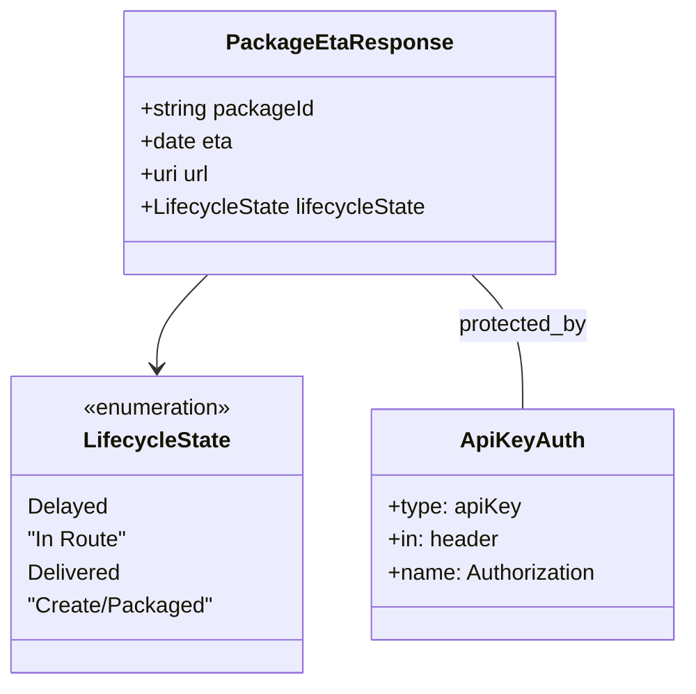

# Diagram: partview_core/partview_service/partview_service/api/package_container/eta/get_package_container_eta_public.yml


> Auto-generated by Obscura crawlers

## Diagram 1

```mermaid
graph LR
  Portal["FreightVerify Portal\nhttps://portal.freightverify.com/"]
  API[PartView Package ETA API]
  Portal --> API
  subgraph Endpoints
    A1["GET /api/package-container/{containerId}/eta"]
    A2["GET /app/package-container/{externalId}/eta"]
  end
  API --> Endpoints
  A1 --> S1[Security: ApiKeyAuth (header Authorization)]
  A2 --> S2[Security: ApiKeyAuth (header Authorization)]
  A1 --> R200_1["200 OK\n{ packageId, eta(date), url(uri), lifecycleState }"]
  A1 --> R400_1["400 Bad Request"]
  A1 --> R401_1["401 Unauthorized"]
  A1 --> R404_1["404 Not Found"]
  A1 --> R500_1["500 Internal Server Error"]
  A2 --> R200_2["200 OK\n{ packageId, eta(date), url(uri), lifecycleState }"]
  A2 --> R400_2["400 Bad Request"]
  A2 --> R401_2["401 Unauthorized"]
  A2 --> R404_2["404 Not Found"]
  A2 --> R500_2["500 Internal Server Error"]
  R200_1 --> Portal
  R200_2 --> Portal
```

> SVG rendering failed for this diagram.

## Diagram 2



> SVG rendering failed for this diagram.
