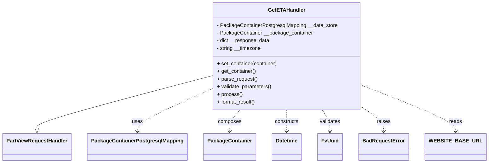
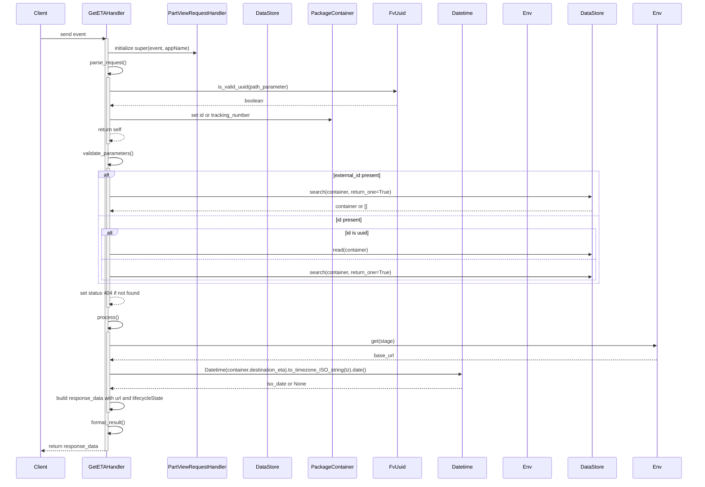

# Diagram: partview_core/partview_service/partview_service/api/package_container/eta/handlers/get_eta.py

> Auto-generated by Obscura crawlers

## Diagram 1

### SVG

<svg id="container" width="1453.6875" xmlns="http://www.w3.org/2000/svg" class="classDiagram" height="510" viewBox="0 0 1453.6875 510" role="graphics-document document" aria-roledescription="class"><g><defs><marker id="container_class-aggregationStart" class="marker aggregation class" refX="18" refY="7" markerWidth="190" markerHeight="240" orient="auto"><path d="M 18,7 L9,13 L1,7 L9,1 Z"></path></marker></defs><defs><marker id="container_class-aggregationEnd" class="marker aggregation class" refX="1" refY="7" markerWidth="20" markerHeight="28" orient="auto"><path d="M 18,7 L9,13 L1,7 L9,1 Z"></path></marker></defs><defs><marker id="container_class-extensionStart" class="marker extension class" refX="18" refY="7" markerWidth="190" markerHeight="240" orient="auto"><path d="M 1,7 L18,13 V 1 Z"></path></marker></defs><defs><marker id="container_class-extensionEnd" class="marker extension class" refX="1" refY="7" markerWidth="20" markerHeight="28" orient="auto"><path d="M 1,1 V 13 L18,7 Z"></path></marker></defs><defs><marker id="container_class-compositionStart" class="marker composition class" refX="18" refY="7" markerWidth="190" markerHeight="240" orient="auto"><path d="M 18,7 L9,13 L1,7 L9,1 Z"></path></marker></defs><defs><marker id="container_class-compositionEnd" class="marker composition class" refX="1" refY="7" markerWidth="20" markerHeight="28" orient="auto"><path d="M 18,7 L9,13 L1,7 L9,1 Z"></path></marker></defs><defs><marker id="container_class-dependencyStart" class="marker dependency class" refX="6" refY="7" markerWidth="190" markerHeight="240" orient="auto"><path d="M 5,7 L9,13 L1,7 L9,1 Z"></path></marker></defs><defs><marker id="container_class-dependencyEnd" class="marker dependency class" refX="13" refY="7" markerWidth="20" markerHeight="28" orient="auto"><path d="M 18,7 L9,13 L14,7 L9,1 Z"></path></marker></defs><defs><marker id="container_class-lollipopStart" class="marker lollipop class" refX="13" refY="7" markerWidth="190" markerHeight="240" orient="auto"><circle stroke="black" fill="transparent" cx="7" cy="7" r="6"></circle></marker></defs><defs><marker id="container_class-lollipopEnd" class="marker lollipop class" refX="1" refY="7" markerWidth="190" markerHeight="240" orient="auto"><circle stroke="black" fill="transparent" cx="7" cy="7" r="6"></circle></marker></defs><g class="root"><g class="clusters"></g><g class="edgePaths"><path d="M633.73,238.098L546.669,261.915C459.607,285.732,285.483,333.366,198.421,360.475C111.359,387.583,111.359,394.167,111.359,397.458L111.359,400.75" id="id_GetETAHandler_PartViewRequestHandler_1" class="edge-thickness-normal edge-pattern-solid relation" style=";;;" data-edge="true" data-et="edge" data-id="id_GetETAHandler_PartViewRequestHandler_1" data-points="W3sieCI6NjMzLjczMDQ2ODc1LCJ5IjoyMzguMDk3OTk0MTQwODg5N30seyJ4IjoxMTEuMzU5Mzc1LCJ5IjozODF9LHsieCI6MTExLjM1OTM3NSwieSI6NDE4fV0=" marker-end="url(#container_class-extensionEnd)"></path><path d="M633.73,279.835L596.87,296.696C560.01,313.557,486.29,347.278,449.43,369.306C412.57,391.333,412.57,401.667,412.57,406.833L412.57,412" id="id_GetETAHandler_PackageContainerPostgresqlMapping_2" class="edge-thickness-normal edge-pattern-dashed relation" style=";;;" data-edge="true" data-et="edge" data-id="id_GetETAHandler_PackageContainerPostgresqlMapping_2" data-points="W3sieCI6NjMzLjczMDQ2ODc1LCJ5IjoyNzkuODM0NzY1NzA2NzE1fSx7IngiOjQxMi41NzAzMTI1LCJ5IjozODF9LHsieCI6NDEyLjU3MDMxMjUsInkiOjQxOH1d" marker-end="url(#container_class-dependencyEnd)"></path><path d="M719.073,344L713.873,350.167C708.673,356.333,698.274,368.667,693.075,380C687.875,391.333,687.875,401.667,687.875,406.833L687.875,412" id="id_GetETAHandler_PackageContainer_3" class="edge-thickness-normal edge-pattern-dashed relation" style=";;;" data-edge="true" data-et="edge" data-id="id_GetETAHandler_PackageContainer_3" data-points="W3sieCI6NzE5LjA3MjU5OTA4NTM2NTgsInkiOjM0NH0seyJ4Ijo2ODcuODc1LCJ5IjozODF9LHsieCI6Njg3Ljg3NSwieSI6NDE4fV0=" marker-end="url(#container_class-dependencyEnd)"></path><path d="M860.727,344L860.727,350.167C860.727,356.333,860.727,368.667,860.727,380C860.727,391.333,860.727,401.667,860.727,406.833L860.727,412" id="id_GetETAHandler_Datetime_4" class="edge-thickness-normal edge-pattern-dashed relation" style=";;;" data-edge="true" data-et="edge" data-id="id_GetETAHandler_Datetime_4" data-points="W3sieCI6ODYwLjcyNjU2MjUsInkiOjM0NH0seyJ4Ijo4NjAuNzI2NTYyNSwieSI6MzgxfSx7IngiOjg2MC43MjY1NjI1LCJ5Ijo0MTh9XQ==" marker-end="url(#container_class-dependencyEnd)"></path><path d="M968.87,344L972.84,350.167C976.809,356.333,984.748,368.667,988.718,380C992.688,391.333,992.688,401.667,992.688,406.833L992.688,412" id="id_GetETAHandler_FvUuid_5" class="edge-thickness-normal edge-pattern-dashed relation" style=";;;" data-edge="true" data-et="edge" data-id="id_GetETAHandler_FvUuid_5" data-points="W3sieCI6OTY4Ljg3MDE2MDA2MDk3NTYsInkiOjM0NH0seyJ4Ijo5OTIuNjg3NSwieSI6MzgxfSx7IngiOjk5Mi42ODc1LCJ5Ijo0MTh9XQ==" marker-end="url(#container_class-dependencyEnd)"></path><path d="M1087.723,334.926L1098.691,342.605C1109.659,350.284,1131.595,365.642,1142.563,378.488C1153.531,391.333,1153.531,401.667,1153.531,406.833L1153.531,412" id="id_GetETAHandler_BadRequestError_6" class="edge-thickness-normal edge-pattern-dashed relation" style=";;;" data-edge="true" data-et="edge" data-id="id_GetETAHandler_BadRequestError_6" data-points="W3sieCI6MTA4Ny43MjI2NTYyNSwieSI6MzM0LjkyNTczMTc0MzEwOTV9LHsieCI6MTE1My41MzEyNSwieSI6MzgxfSx7IngiOjExNTMuNTMxMjUsInkiOjQxOH1d" marker-end="url(#container_class-dependencyEnd)"></path><path d="M1087.723,268.878L1133.394,287.565C1179.065,306.252,1270.408,343.626,1316.079,367.48C1361.75,391.333,1361.75,401.667,1361.75,406.833L1361.75,412" id="id_GetETAHandler_WEBSITE_BASE_URL_7" class="edge-thickness-normal edge-pattern-dashed relation" style=";;;" data-edge="true" data-et="edge" data-id="id_GetETAHandler_WEBSITE_BASE_URL_7" data-points="W3sieCI6MTA4Ny43MjI2NTYyNSwieSI6MjY4Ljg3ODI4ODE5MTM1ODN9LHsieCI6MTM2MS43NSwieSI6MzgxfSx7IngiOjEzNjEuNzUsInkiOjQxOH1d" marker-end="url(#container_class-dependencyEnd)"></path></g><g class="edgeLabels"><g class="edgeLabel"><g class="label" data-id="id_GetETAHandler_PartViewRequestHandler_1" transform="translate(0, 0)"><foreignObject width="0" height="0">

</foreignObject></g></g><g class="edgeLabel" transform="translate(412.5703125, 381)"><g class="label" data-id="id_GetETAHandler_PackageContainerPostgresqlMapping_2" transform="translate(-16.4921875, -12)"><foreignObject width="32.984375" height="24">

uses

</foreignObject></g></g><g class="edgeLabel" transform="translate(687.875, 381)"><g class="label" data-id="id_GetETAHandler_PackageContainer_3" transform="translate(-36.453125, -12)"><foreignObject width="72.90625" height="24">

composes

</foreignObject></g></g><g class="edgeLabel" transform="translate(860.7265625, 381)"><g class="label" data-id="id_GetETAHandler_Datetime_4" transform="translate(-37.84375, -12)"><foreignObject width="75.6875" height="24">

constructs

</foreignObject></g></g><g class="edgeLabel" transform="translate(992.6875, 381)"><g class="label" data-id="id_GetETAHandler_FvUuid_5" transform="translate(-32.6875, -12)"><foreignObject width="65.375" height="24">

validates

</foreignObject></g></g><g class="edgeLabel" transform="translate(1153.53125, 381)"><g class="label" data-id="id_GetETAHandler_BadRequestError_6" transform="translate(-21.25, -12)"><foreignObject width="42.5" height="24">

raises

</foreignObject></g></g><g class="edgeLabel" transform="translate(1361.75, 381)"><g class="label" data-id="id_GetETAHandler_WEBSITE_BASE_URL_7" transform="translate(-20.0078125, -12)"><foreignObject width="40.015625" height="24">

reads

</foreignObject></g></g></g><g class="nodes"><g class="node default" id="classId-GetETAHandler-0" transform="translate(860.7265625, 176)"><g class="basic label-container"><path d="M-226.99609375 -168 L226.99609375 -168 L226.99609375 168 L-226.99609375 168" stroke="none" stroke-width="0" fill="#ECECFF" style=""></path><path d="M-226.99609375 -168 C-117.35280043532356 -168, -7.7095071206471175 -168, 226.99609375 -168 M-226.99609375 -168 C-121.56440680254202 -168, -16.132719855084048 -168, 226.99609375 -168 M226.99609375 -168 C226.99609375 -92.38880360164605, 226.99609375 -16.777607203292092, 226.99609375 168 M226.99609375 -168 C226.99609375 -34.44834131314249, 226.99609375 99.10331737371502, 226.99609375 168 M226.99609375 168 C91.52817873740324 168, -43.939736275193525 168, -226.99609375 168 M226.99609375 168 C80.09480974586916 168, -66.80647425826169 168, -226.99609375 168 M-226.99609375 168 C-226.99609375 79.04933568611092, -226.99609375 -9.901328627778156, -226.99609375 -168 M-226.99609375 168 C-226.99609375 42.52140718568215, -226.99609375 -82.9571856286357, -226.99609375 -168" stroke="#9370DB" stroke-width="1.3" fill="none" stroke-dasharray="0 0" style=""></path></g><g class="annotation-group text" transform="translate(0, -144)"></g><g class="label-group text" transform="translate(-54.6015625, -144)"><g class="label" style="font-weight: bolder" transform="translate(0,-12)"><foreignObject width="109.203125" height="24">

GetETAHandler

</foreignObject></g></g><g class="members-group text" transform="translate(-214.99609375, -96)"><g class="label" style="" transform="translate(0,-12)"><foreignObject width="375.390625" height="24">

- PackageContainerPostgresqlMapping __data_store

</foreignObject></g><g class="label" style="" transform="translate(0,12)"><foreignObject width="295.828125" height="24">

- PackageContainer __package_container

</foreignObject></g><g class="label" style="" transform="translate(0,36)"><foreignObject width="165.546875" height="24">

- dict __response_data

</foreignObject></g><g class="label" style="" transform="translate(0,60)"><foreignObject width="139.65625" height="24">

- string __timezone

</foreignObject></g></g><g class="methods-group text" transform="translate(-214.99609375, 24)"><g class="label" style="" transform="translate(0,-12)"><foreignObject width="190.96875" height="24">

+ set_container(container)

</foreignObject></g><g class="label" style="" transform="translate(0,12)"><foreignObject width="122.359375" height="24">

+ get_container()

</foreignObject></g><g class="label" style="" transform="translate(0,36)"><foreignObject width="126.046875" height="24">

+ parse_request()

</foreignObject></g><g class="label" style="" transform="translate(0,60)"><foreignObject width="170.953125" height="24">

+ validate_parameters()

</foreignObject></g><g class="label" style="" transform="translate(0,84)"><foreignObject width="77.96875" height="24">

+ process()

</foreignObject></g><g class="label" style="" transform="translate(0,108)"><foreignObject width="121.5" height="24">

+ format_result()

</foreignObject></g></g><g class="divider" style=""><path d="M-226.99609375 -120 C-45.97271621283471 -120, 135.05066132433058 -120, 226.99609375 -120 M-226.99609375 -120 C-67.85945471739987 -120, 91.27718431520026 -120, 226.99609375 -120" stroke="#9370DB" stroke-width="1.3" fill="none" stroke-dasharray="0 0" style=""></path></g><g class="divider" style=""><path d="M-226.99609375 0 C-45.43786349211467 0, 136.12036676577065 0, 226.99609375 0 M-226.99609375 0 C-81.99023909768832 0, 63.015615554623366 0, 226.99609375 0" stroke="#9370DB" stroke-width="1.3" fill="none" stroke-dasharray="0 0" style=""></path></g></g><g class="node default" id="classId-PartViewRequestHandler-1" transform="translate(111.359375, 460)"><g class="basic label-container"><path d="M-103.359375 -42 L103.359375 -42 L103.359375 42 L-103.359375 42" stroke="none" stroke-width="0" fill="#ECECFF" style=""></path><path d="M-103.359375 -42 C-23.699204075484488 -42, 55.960966849031024 -42, 103.359375 -42 M-103.359375 -42 C-46.85153943187746 -42, 9.656296136245075 -42, 103.359375 -42 M103.359375 -42 C103.359375 -17.9140187177034, 103.359375 6.171962564593201, 103.359375 42 M103.359375 -42 C103.359375 -17.27515853610783, 103.359375 7.4496829277843375, 103.359375 42 M103.359375 42 C45.22264446383665 42, -12.914086072326697 42, -103.359375 42 M103.359375 42 C21.276667732135763 42, -60.80603953572847 42, -103.359375 42 M-103.359375 42 C-103.359375 10.817378586699132, -103.359375 -20.365242826601737, -103.359375 -42 M-103.359375 42 C-103.359375 17.85539430561118, -103.359375 -6.2892113887776375, -103.359375 -42" stroke="#9370DB" stroke-width="1.3" fill="none" stroke-dasharray="0 0" style=""></path></g><g class="annotation-group text" transform="translate(0, -18)"></g><g class="label-group text" transform="translate(-91.359375, -18)"><g class="label" style="font-weight: bolder" transform="translate(0,-12)"><foreignObject width="182.71875" height="24">

PartViewRequestHandler

</foreignObject></g></g><g class="members-group text" transform="translate(-91.359375, 30)"></g><g class="methods-group text" transform="translate(-91.359375, 60)"></g><g class="divider" style=""><path d="M-103.359375 6 C-43.252491949882135 6, 16.85439110023573 6, 103.359375 6 M-103.359375 6 C-38.70111861704285 6, 25.957137765914297 6, 103.359375 6" stroke="#9370DB" stroke-width="1.3" fill="none" stroke-dasharray="0 0" style=""></path></g><g class="divider" style=""><path d="M-103.359375 24 C-31.173761498948423 24, 41.011852002103154 24, 103.359375 24 M-103.359375 24 C-28.14935623371072 24, 47.06066253257856 24, 103.359375 24" stroke="#9370DB" stroke-width="1.3" fill="none" stroke-dasharray="0 0" style=""></path></g></g><g class="node default" id="classId-PackageContainerPostgresqlMapping-2" transform="translate(412.5703125, 460)"><g class="basic label-container"><path d="M-147.8515625 -42 L147.8515625 -42 L147.8515625 42 L-147.8515625 42" stroke="none" stroke-width="0" fill="#ECECFF" style=""></path><path d="M-147.8515625 -42 C-46.14375197556856 -42, 55.564058548862874 -42, 147.8515625 -42 M-147.8515625 -42 C-72.9180899760423 -42, 2.015382547915408 -42, 147.8515625 -42 M147.8515625 -42 C147.8515625 -9.231038549693153, 147.8515625 23.537922900613694, 147.8515625 42 M147.8515625 -42 C147.8515625 -23.16050651562902, 147.8515625 -4.32101303125804, 147.8515625 42 M147.8515625 42 C79.90340939047536 42, 11.95525628095072 42, -147.8515625 42 M147.8515625 42 C31.839607457690718 42, -84.17234758461856 42, -147.8515625 42 M-147.8515625 42 C-147.8515625 8.965375313143817, -147.8515625 -24.069249373712367, -147.8515625 -42 M-147.8515625 42 C-147.8515625 19.77129706576051, -147.8515625 -2.457405868478979, -147.8515625 -42" stroke="#9370DB" stroke-width="1.3" fill="none" stroke-dasharray="0 0" style=""></path></g><g class="annotation-group text" transform="translate(0, -18)"></g><g class="label-group text" transform="translate(-135.8515625, -18)"><g class="label" style="font-weight: bolder" transform="translate(0,-12)"><foreignObject width="271.703125" height="24">

PackageContainerPostgresqlMapping

</foreignObject></g></g><g class="members-group text" transform="translate(-135.8515625, 30)"></g><g class="methods-group text" transform="translate(-135.8515625, 60)"></g><g class="divider" style=""><path d="M-147.8515625 6 C-71.86797551835159 6, 4.11561146329683 6, 147.8515625 6 M-147.8515625 6 C-77.26639777042949 6, -6.681233040858984 6, 147.8515625 6" stroke="#9370DB" stroke-width="1.3" fill="none" stroke-dasharray="0 0" style=""></path></g><g class="divider" style=""><path d="M-147.8515625 24 C-87.03951093402357 24, -26.227459368047136 24, 147.8515625 24 M-147.8515625 24 C-35.4111469535185 24, 77.029268592963 24, 147.8515625 24" stroke="#9370DB" stroke-width="1.3" fill="none" stroke-dasharray="0 0" style=""></path></g></g><g class="node default" id="classId-PackageContainer-3" transform="translate(687.875, 460)"><g class="basic label-container"><path d="M-77.453125 -42 L77.453125 -42 L77.453125 42 L-77.453125 42" stroke="none" stroke-width="0" fill="#ECECFF" style=""></path><path d="M-77.453125 -42 C-39.50828908989849 -42, -1.56345317979698 -42, 77.453125 -42 M-77.453125 -42 C-20.7539130104947 -42, 35.9452989790106 -42, 77.453125 -42 M77.453125 -42 C77.453125 -24.59687755534013, 77.453125 -7.193755110680257, 77.453125 42 M77.453125 -42 C77.453125 -17.1437598699662, 77.453125 7.712480260067601, 77.453125 42 M77.453125 42 C44.32332994508732 42, 11.193534890174647 42, -77.453125 42 M77.453125 42 C21.806158068064384 42, -33.84080886387123 42, -77.453125 42 M-77.453125 42 C-77.453125 14.500476867671079, -77.453125 -12.999046264657842, -77.453125 -42 M-77.453125 42 C-77.453125 13.752834651026593, -77.453125 -14.494330697946815, -77.453125 -42" stroke="#9370DB" stroke-width="1.3" fill="none" stroke-dasharray="0 0" style=""></path></g><g class="annotation-group text" transform="translate(0, -18)"></g><g class="label-group text" transform="translate(-65.453125, -18)"><g class="label" style="font-weight: bolder" transform="translate(0,-12)"><foreignObject width="130.90625" height="24">

PackageContainer

</foreignObject></g></g><g class="members-group text" transform="translate(-65.453125, 30)"></g><g class="methods-group text" transform="translate(-65.453125, 60)"></g><g class="divider" style=""><path d="M-77.453125 6 C-21.070749877613522 6, 35.311625244772955 6, 77.453125 6 M-77.453125 6 C-31.38221949378618 6, 14.688686012427638 6, 77.453125 6" stroke="#9370DB" stroke-width="1.3" fill="none" stroke-dasharray="0 0" style=""></path></g><g class="divider" style=""><path d="M-77.453125 24 C-31.974596896231247 24, 13.503931207537505 24, 77.453125 24 M-77.453125 24 C-40.00554182025942 24, -2.5579586405188337 24, 77.453125 24" stroke="#9370DB" stroke-width="1.3" fill="none" stroke-dasharray="0 0" style=""></path></g></g><g class="node default" id="classId-Datetime-4" transform="translate(860.7265625, 460)"><g class="basic label-container"><path d="M-45.3984375 -42 L45.3984375 -42 L45.3984375 42 L-45.3984375 42" stroke="none" stroke-width="0" fill="#ECECFF" style=""></path><path d="M-45.3984375 -42 C-16.081557607476494 -42, 13.235322285047012 -42, 45.3984375 -42 M-45.3984375 -42 C-9.348274712239153 -42, 26.701888075521694 -42, 45.3984375 -42 M45.3984375 -42 C45.3984375 -14.092222506512915, 45.3984375 13.81555498697417, 45.3984375 42 M45.3984375 -42 C45.3984375 -22.400141202647145, 45.3984375 -2.80028240529429, 45.3984375 42 M45.3984375 42 C20.88436023202525 42, -3.629717035949497 42, -45.3984375 42 M45.3984375 42 C9.893683593550065 42, -25.61107031289987 42, -45.3984375 42 M-45.3984375 42 C-45.3984375 23.611700097755012, -45.3984375 5.223400195510024, -45.3984375 -42 M-45.3984375 42 C-45.3984375 19.044106539244662, -45.3984375 -3.911786921510675, -45.3984375 -42" stroke="#9370DB" stroke-width="1.3" fill="none" stroke-dasharray="0 0" style=""></path></g><g class="annotation-group text" transform="translate(0, -18)"></g><g class="label-group text" transform="translate(-33.3984375, -18)"><g class="label" style="font-weight: bolder" transform="translate(0,-12)"><foreignObject width="66.796875" height="24">

Datetime

</foreignObject></g></g><g class="members-group text" transform="translate(-33.3984375, 30)"></g><g class="methods-group text" transform="translate(-33.3984375, 60)"></g><g class="divider" style=""><path d="M-45.3984375 6 C-24.35106886669986 6, -3.3037002333997165 6, 45.3984375 6 M-45.3984375 6 C-19.65133683567341 6, 6.095763828653183 6, 45.3984375 6" stroke="#9370DB" stroke-width="1.3" fill="none" stroke-dasharray="0 0" style=""></path></g><g class="divider" style=""><path d="M-45.3984375 24 C-16.50849072319378 24, 12.381456053612439 24, 45.3984375 24 M-45.3984375 24 C-24.636457266193375 24, -3.87447703238675 24, 45.3984375 24" stroke="#9370DB" stroke-width="1.3" fill="none" stroke-dasharray="0 0" style=""></path></g></g><g class="node default" id="classId-FvUuid-5" transform="translate(992.6875, 460)"><g class="basic label-container"><path d="M-36.5625 -42 L36.5625 -42 L36.5625 42 L-36.5625 42" stroke="none" stroke-width="0" fill="#ECECFF" style=""></path><path d="M-36.5625 -42 C-14.727493034702416 -42, 7.107513930595168 -42, 36.5625 -42 M-36.5625 -42 C-16.353918024155938 -42, 3.8546639516881243 -42, 36.5625 -42 M36.5625 -42 C36.5625 -10.93192424428764, 36.5625 20.13615151142472, 36.5625 42 M36.5625 -42 C36.5625 -20.666635786314643, 36.5625 0.6667284273707139, 36.5625 42 M36.5625 42 C19.0515210252624 42, 1.5405420505247989 42, -36.5625 42 M36.5625 42 C15.930112656971286 42, -4.702274686057429 42, -36.5625 42 M-36.5625 42 C-36.5625 24.925385024251337, -36.5625 7.850770048502675, -36.5625 -42 M-36.5625 42 C-36.5625 24.282701900580097, -36.5625 6.565403801160194, -36.5625 -42" stroke="#9370DB" stroke-width="1.3" fill="none" stroke-dasharray="0 0" style=""></path></g><g class="annotation-group text" transform="translate(0, -18)"></g><g class="label-group text" transform="translate(-24.5625, -18)"><g class="label" style="font-weight: bolder" transform="translate(0,-12)"><foreignObject width="49.125" height="24">

FvUuid

</foreignObject></g></g><g class="members-group text" transform="translate(-24.5625, 30)"></g><g class="methods-group text" transform="translate(-24.5625, 60)"></g><g class="divider" style=""><path d="M-36.5625 6 C-18.173399095071908 6, 0.21570180985618492 6, 36.5625 6 M-36.5625 6 C-16.440664510643085 6, 3.68117097871383 6, 36.5625 6" stroke="#9370DB" stroke-width="1.3" fill="none" stroke-dasharray="0 0" style=""></path></g><g class="divider" style=""><path d="M-36.5625 24 C-19.400213179851143 24, -2.2379263597022856 24, 36.5625 24 M-36.5625 24 C-12.668822971837127 24, 11.224854056325746 24, 36.5625 24" stroke="#9370DB" stroke-width="1.3" fill="none" stroke-dasharray="0 0" style=""></path></g></g><g class="node default" id="classId-BadRequestError-6" transform="translate(1153.53125, 460)"><g class="basic label-container"><path d="M-74.28125 -42 L74.28125 -42 L74.28125 42 L-74.28125 42" stroke="none" stroke-width="0" fill="#ECECFF" style=""></path><path d="M-74.28125 -42 C-17.60484632782653 -42, 39.07155734434694 -42, 74.28125 -42 M-74.28125 -42 C-43.612736454725166 -42, -12.944222909450332 -42, 74.28125 -42 M74.28125 -42 C74.28125 -18.140665869648437, 74.28125 5.718668260703126, 74.28125 42 M74.28125 -42 C74.28125 -14.934616556527384, 74.28125 12.130766886945231, 74.28125 42 M74.28125 42 C37.15044412089955 42, 0.019638241799100342 42, -74.28125 42 M74.28125 42 C16.697605882984128 42, -40.886038234031744 42, -74.28125 42 M-74.28125 42 C-74.28125 14.934446673550418, -74.28125 -12.131106652899163, -74.28125 -42 M-74.28125 42 C-74.28125 18.50497739907453, -74.28125 -4.99004520185094, -74.28125 -42" stroke="#9370DB" stroke-width="1.3" fill="none" stroke-dasharray="0 0" style=""></path></g><g class="annotation-group text" transform="translate(0, -18)"></g><g class="label-group text" transform="translate(-62.28125, -18)"><g class="label" style="font-weight: bolder" transform="translate(0,-12)"><foreignObject width="124.5625" height="24">

BadRequestError

</foreignObject></g></g><g class="members-group text" transform="translate(-62.28125, 30)"></g><g class="methods-group text" transform="translate(-62.28125, 60)"></g><g class="divider" style=""><path d="M-74.28125 6 C-18.58370268960354 6, 37.11384462079292 6, 74.28125 6 M-74.28125 6 C-16.815465818474593 6, 40.650318363050815 6, 74.28125 6" stroke="#9370DB" stroke-width="1.3" fill="none" stroke-dasharray="0 0" style=""></path></g><g class="divider" style=""><path d="M-74.28125 24 C-22.885944217818697 24, 28.509361564362607 24, 74.28125 24 M-74.28125 24 C-23.18185396788361 24, 27.917542064232777 24, 74.28125 24" stroke="#9370DB" stroke-width="1.3" fill="none" stroke-dasharray="0 0" style=""></path></g></g><g class="node default" id="classId-WEBSITE_BASE_URL-7" transform="translate(1361.75, 460)"><g class="basic label-container"><path d="M-83.9375 -42 L83.9375 -42 L83.9375 42 L-83.9375 42" stroke="none" stroke-width="0" fill="#ECECFF" style=""></path><path d="M-83.9375 -42 C-18.398260032153132 -42, 47.140979935693736 -42, 83.9375 -42 M-83.9375 -42 C-32.81733406271065 -42, 18.3028318745787 -42, 83.9375 -42 M83.9375 -42 C83.9375 -24.25966745289794, 83.9375 -6.51933490579588, 83.9375 42 M83.9375 -42 C83.9375 -23.6676518813867, 83.9375 -5.3353037627734, 83.9375 42 M83.9375 42 C18.197849935904287 42, -47.541800128191426 42, -83.9375 42 M83.9375 42 C37.39826420749452 42, -9.14097158501096 42, -83.9375 42 M-83.9375 42 C-83.9375 15.958758743642996, -83.9375 -10.082482512714009, -83.9375 -42 M-83.9375 42 C-83.9375 9.58435691814406, -83.9375 -22.83128616371188, -83.9375 -42" stroke="#9370DB" stroke-width="1.3" fill="none" stroke-dasharray="0 0" style=""></path></g><g class="annotation-group text" transform="translate(0, -18)"></g><g class="label-group text" transform="translate(-71.9375, -18)"><g class="label" style="font-weight: bolder" transform="translate(0,-12)"><foreignObject width="143.875" height="24">

WEBSITE_BASE_URL

</foreignObject></g></g><g class="members-group text" transform="translate(-71.9375, 30)"></g><g class="methods-group text" transform="translate(-71.9375, 60)"></g><g class="divider" style=""><path d="M-83.9375 6 C-30.579104203507335 6, 22.77929159298533 6, 83.9375 6 M-83.9375 6 C-28.984331664589526 6, 25.96883667082095 6, 83.9375 6" stroke="#9370DB" stroke-width="1.3" fill="none" stroke-dasharray="0 0" style=""></path></g><g class="divider" style=""><path d="M-83.9375 24 C-40.57373155384196 24, 2.790036892316081 24, 83.9375 24 M-83.9375 24 C-42.14130766919742 24, -0.34511533839483377 24, 83.9375 24" stroke="#9370DB" stroke-width="1.3" fill="none" stroke-dasharray="0 0" style=""></path></g></g></g></g></g></svg>

## Diagram 2

### SVG

<svg id="container" width="2207.5" xmlns="http://www.w3.org/2000/svg" height="1569" viewBox="-50 -10 2207.5 1569" role="graphics-document document" aria-roledescription="sequence"><g><rect x="1957.5" y="1483" fill="#eaeaea" stroke="#666" width="150" height="65" name="Env" rx="3" ry="3" class="actor actor-bottom"></rect><text x="2032.5" y="1515.5" dominant-baseline="central" alignment-baseline="central" class="actor actor-box" style="text-anchor: middle; font-size: 16px; font-weight: 400;"><tspan x="2032.5" dy="0">Env</tspan></text></g><g><rect x="1757.5" y="1483" fill="#eaeaea" stroke="#666" width="150" height="65" name="DataStore" rx="3" ry="3" class="actor actor-bottom"></rect><text x="1832.5" y="1515.5" dominant-baseline="central" alignment-baseline="central" class="actor actor-box" style="text-anchor: middle; font-size: 16px; font-weight: 400;"><tspan x="1832.5" dy="0">DataStore</tspan></text></g><g><rect x="1557.5" y="1483" fill="#eaeaea" stroke="#666" width="150" height="65" name="WEBSITE_BASE_URL" rx="3" ry="3" class="actor actor-bottom"></rect><text x="1632.5" y="1515.5" dominant-baseline="central" alignment-baseline="central" class="actor actor-box" style="text-anchor: middle; font-size: 16px; font-weight: 400;"><tspan x="1632.5" dy="0">Env</tspan></text></g><g><rect x="1357.5" y="1483" fill="#eaeaea" stroke="#666" width="150" height="65" name="Datetime" rx="3" ry="3" class="actor actor-bottom"></rect><text x="1432.5" y="1515.5" dominant-baseline="central" alignment-baseline="central" class="actor actor-box" style="text-anchor: middle; font-size: 16px; font-weight: 400;"><tspan x="1432.5" dy="0">Datetime</tspan></text></g><g><rect x="1157.5" y="1483" fill="#eaeaea" stroke="#666" width="150" height="65" name="FvUuid" rx="3" ry="3" class="actor actor-bottom"></rect><text x="1232.5" y="1515.5" dominant-baseline="central" alignment-baseline="central" class="actor actor-box" style="text-anchor: middle; font-size: 16px; font-weight: 400;"><tspan x="1232.5" dy="0">FvUuid</tspan></text></g><g><rect x="957.5" y="1483" fill="#eaeaea" stroke="#666" width="150" height="65" name="PackageContainer" rx="3" ry="3" class="actor actor-bottom"></rect><text x="1032.5" y="1515.5" dominant-baseline="central" alignment-baseline="central" class="actor actor-box" style="text-anchor: middle; font-size: 16px; font-weight: 400;"><tspan x="1032.5" dy="0">PackageContainer</tspan></text></g><g><rect x="757.5" y="1483" fill="#eaeaea" stroke="#666" width="150" height="65" name="PackageContainerPostgresqlMapping" rx="3" ry="3" class="actor actor-bottom"></rect><text x="832.5" y="1515.5" dominant-baseline="central" alignment-baseline="central" class="actor actor-box" style="text-anchor: middle; font-size: 16px; font-weight: 400;"><tspan x="832.5" dy="0">DataStore</tspan></text></g><g><rect x="506.5" y="1483" fill="#eaeaea" stroke="#666" width="201" height="65" name="PartViewRequestHandler" rx="3" ry="3" class="actor actor-bottom"></rect><text x="607" y="1515.5" dominant-baseline="central" alignment-baseline="central" class="actor actor-box" style="text-anchor: middle; font-size: 16px; font-weight: 400;"><tspan x="607" dy="0">PartViewRequestHandler</tspan></text></g><g><rect x="226" y="1483" fill="#eaeaea" stroke="#666" width="150" height="65" name="GetETAHandler" rx="3" ry="3" class="actor actor-bottom"></rect><text x="301" y="1515.5" dominant-baseline="central" alignment-baseline="central" class="actor actor-box" style="text-anchor: middle; font-size: 16px; font-weight: 400;"><tspan x="301" dy="0">GetETAHandler</tspan></text></g><g><rect x="0" y="1483" fill="#eaeaea" stroke="#666" width="150" height="65" name="Client" rx="3" ry="3" class="actor actor-bottom"></rect><text x="75" y="1515.5" dominant-baseline="central" alignment-baseline="central" class="actor actor-box" style="text-anchor: middle; font-size: 16px; font-weight: 400;"><tspan x="75" dy="0">Client</tspan></text></g><g><line id="actor9" x1="2032.5" y1="65" x2="2032.5" y2="1483" class="actor-line 200" stroke-width="0.5px" stroke="#999" name="Env"></line><g id="root-9"><rect x="1957.5" y="0" fill="#eaeaea" stroke="#666" width="150" height="65" name="Env" rx="3" ry="3" class="actor actor-top"></rect><text x="2032.5" y="32.5" dominant-baseline="central" alignment-baseline="central" class="actor actor-box" style="text-anchor: middle; font-size: 16px; font-weight: 400;"><tspan x="2032.5" dy="0">Env</tspan></text></g></g><g><line id="actor8" x1="1832.5" y1="65" x2="1832.5" y2="1483" class="actor-line 200" stroke-width="0.5px" stroke="#999" name="DataStore"></line><g id="root-8"><rect x="1757.5" y="0" fill="#eaeaea" stroke="#666" width="150" height="65" name="DataStore" rx="3" ry="3" class="actor actor-top"></rect><text x="1832.5" y="32.5" dominant-baseline="central" alignment-baseline="central" class="actor actor-box" style="text-anchor: middle; font-size: 16px; font-weight: 400;"><tspan x="1832.5" dy="0">DataStore</tspan></text></g></g><g><line id="actor7" x1="1632.5" y1="65" x2="1632.5" y2="1483" class="actor-line 200" stroke-width="0.5px" stroke="#999" name="WEBSITE_BASE_URL"></line><g id="root-7"><rect x="1557.5" y="0" fill="#eaeaea" stroke="#666" width="150" height="65" name="WEBSITE_BASE_URL" rx="3" ry="3" class="actor actor-top"></rect><text x="1632.5" y="32.5" dominant-baseline="central" alignment-baseline="central" class="actor actor-box" style="text-anchor: middle; font-size: 16px; font-weight: 400;"><tspan x="1632.5" dy="0">Env</tspan></text></g></g><g><line id="actor6" x1="1432.5" y1="65" x2="1432.5" y2="1483" class="actor-line 200" stroke-width="0.5px" stroke="#999" name="Datetime"></line><g id="root-6"><rect x="1357.5" y="0" fill="#eaeaea" stroke="#666" width="150" height="65" name="Datetime" rx="3" ry="3" class="actor actor-top"></rect><text x="1432.5" y="32.5" dominant-baseline="central" alignment-baseline="central" class="actor actor-box" style="text-anchor: middle; font-size: 16px; font-weight: 400;"><tspan x="1432.5" dy="0">Datetime</tspan></text></g></g><g><line id="actor5" x1="1232.5" y1="65" x2="1232.5" y2="1483" class="actor-line 200" stroke-width="0.5px" stroke="#999" name="FvUuid"></line><g id="root-5"><rect x="1157.5" y="0" fill="#eaeaea" stroke="#666" width="150" height="65" name="FvUuid" rx="3" ry="3" class="actor actor-top"></rect><text x="1232.5" y="32.5" dominant-baseline="central" alignment-baseline="central" class="actor actor-box" style="text-anchor: middle; font-size: 16px; font-weight: 400;"><tspan x="1232.5" dy="0">FvUuid</tspan></text></g></g><g><line id="actor4" x1="1032.5" y1="65" x2="1032.5" y2="1483" class="actor-line 200" stroke-width="0.5px" stroke="#999" name="PackageContainer"></line><g id="root-4"><rect x="957.5" y="0" fill="#eaeaea" stroke="#666" width="150" height="65" name="PackageContainer" rx="3" ry="3" class="actor actor-top"></rect><text x="1032.5" y="32.5" dominant-baseline="central" alignment-baseline="central" class="actor actor-box" style="text-anchor: middle; font-size: 16px; font-weight: 400;"><tspan x="1032.5" dy="0">PackageContainer</tspan></text></g></g><g><line id="actor3" x1="832.5" y1="65" x2="832.5" y2="1483" class="actor-line 200" stroke-width="0.5px" stroke="#999" name="PackageContainerPostgresqlMapping"></line><g id="root-3"><rect x="757.5" y="0" fill="#eaeaea" stroke="#666" width="150" height="65" name="PackageContainerPostgresqlMapping" rx="3" ry="3" class="actor actor-top"></rect><text x="832.5" y="32.5" dominant-baseline="central" alignment-baseline="central" class="actor actor-box" style="text-anchor: middle; font-size: 16px; font-weight: 400;"><tspan x="832.5" dy="0">DataStore</tspan></text></g></g><g><line id="actor2" x1="607" y1="65" x2="607" y2="1483" class="actor-line 200" stroke-width="0.5px" stroke="#999" name="PartViewRequestHandler"></line><g id="root-2"><rect x="506.5" y="0" fill="#eaeaea" stroke="#666" width="201" height="65" name="PartViewRequestHandler" rx="3" ry="3" class="actor actor-top"></rect><text x="607" y="32.5" dominant-baseline="central" alignment-baseline="central" class="actor actor-box" style="text-anchor: middle; font-size: 16px; font-weight: 400;"><tspan x="607" dy="0">PartViewRequestHandler</tspan></text></g></g><g><line id="actor1" x1="301" y1="65" x2="301" y2="1483" class="actor-line 200" stroke-width="0.5px" stroke="#999" name="GetETAHandler"></line><g id="root-1"><rect x="226" y="0" fill="#eaeaea" stroke="#666" width="150" height="65" name="GetETAHandler" rx="3" ry="3" class="actor actor-top"></rect><text x="301" y="32.5" dominant-baseline="central" alignment-baseline="central" class="actor actor-box" style="text-anchor: middle; font-size: 16px; font-weight: 400;"><tspan x="301" dy="0">GetETAHandler</tspan></text></g></g><g><line id="actor0" x1="75" y1="65" x2="75" y2="1483" class="actor-line 200" stroke-width="0.5px" stroke="#999" name="Client"></line><g id="root-0"><rect x="0" y="0" fill="#eaeaea" stroke="#666" width="150" height="65" name="Client" rx="3" ry="3" class="actor actor-top"></rect><text x="75" y="32.5" dominant-baseline="central" alignment-baseline="central" class="actor actor-box" style="text-anchor: middle; font-size: 16px; font-weight: 400;"><tspan x="75" dy="0">Client</tspan></text></g></g><g></g><defs><symbol id="computer" width="24" height="24"><path transform="scale(.5)" d="M2 2v13h20v-13h-20zm18 11h-16v-9h16v9zm-10.228 6l.466-1h3.524l.467 1h-4.457zm14.228 3h-24l2-6h2.104l-1.33 4h18.45l-1.297-4h2.073l2 6zm-5-10h-14v-7h14v7z"></path></symbol></defs><defs><symbol id="database" fill-rule="evenodd" clip-rule="evenodd"><path transform="scale(.5)" d="M12.258.001l.256.004.255.005.253.008.251.01.249.012.247.015.246.016.242.019.241.02.239.023.236.024.233.027.231.028.229.031.225.032.223.034.22.036.217.038.214.04.211.041.208.043.205.045.201.046.198.048.194.05.191.051.187.053.183.054.18.056.175.057.172.059.168.06.163.061.16.063.155.064.15.066.074.033.073.033.071.034.07.034.069.035.068.035.067.035.066.035.064.036.064.036.062.036.06.036.06.037.058.037.058.037.055.038.055.038.053.038.052.038.051.039.05.039.048.039.047.039.045.04.044.04.043.04.041.04.04.041.039.041.037.041.036.041.034.041.033.042.032.042.03.042.029.042.027.042.026.043.024.043.023.043.021.043.02.043.018.044.017.043.015.044.013.044.012.044.011.045.009.044.007.045.006.045.004.045.002.045.001.045v17l-.001.045-.002.045-.004.045-.006.045-.007.045-.009.044-.011.045-.012.044-.013.044-.015.044-.017.043-.018.044-.02.043-.021.043-.023.043-.024.043-.026.043-.027.042-.029.042-.03.042-.032.042-.033.042-.034.041-.036.041-.037.041-.039.041-.04.041-.041.04-.043.04-.044.04-.045.04-.047.039-.048.039-.05.039-.051.039-.052.038-.053.038-.055.038-.055.038-.058.037-.058.037-.06.037-.06.036-.062.036-.064.036-.064.036-.066.035-.067.035-.068.035-.069.035-.07.034-.071.034-.073.033-.074.033-.15.066-.155.064-.16.063-.163.061-.168.06-.172.059-.175.057-.18.056-.183.054-.187.053-.191.051-.194.05-.198.048-.201.046-.205.045-.208.043-.211.041-.214.04-.217.038-.22.036-.223.034-.225.032-.229.031-.231.028-.233.027-.236.024-.239.023-.241.02-.242.019-.246.016-.247.015-.249.012-.251.01-.253.008-.255.005-.256.004-.258.001-.258-.001-.256-.004-.255-.005-.253-.008-.251-.01-.249-.012-.247-.015-.245-.016-.243-.019-.241-.02-.238-.023-.236-.024-.234-.027-.231-.028-.228-.031-.226-.032-.223-.034-.22-.036-.217-.038-.214-.04-.211-.041-.208-.043-.204-.045-.201-.046-.198-.048-.195-.05-.19-.051-.187-.053-.184-.054-.179-.056-.176-.057-.172-.059-.167-.06-.164-.061-.159-.063-.155-.064-.151-.066-.074-.033-.072-.033-.072-.034-.07-.034-.069-.035-.068-.035-.067-.035-.066-.035-.064-.036-.063-.036-.062-.036-.061-.036-.06-.037-.058-.037-.057-.037-.056-.038-.055-.038-.053-.038-.052-.038-.051-.039-.049-.039-.049-.039-.046-.039-.046-.04-.044-.04-.043-.04-.041-.04-.04-.041-.039-.041-.037-.041-.036-.041-.034-.041-.033-.042-.032-.042-.03-.042-.029-.042-.027-.042-.026-.043-.024-.043-.023-.043-.021-.043-.02-.043-.018-.044-.017-.043-.015-.044-.013-.044-.012-.044-.011-.045-.009-.044-.007-.045-.006-.045-.004-.045-.002-.045-.001-.045v-17l.001-.045.002-.045.004-.045.006-.045.007-.045.009-.044.011-.045.012-.044.013-.044.015-.044.017-.043.018-.044.02-.043.021-.043.023-.043.024-.043.026-.043.027-.042.029-.042.03-.042.032-.042.033-.042.034-.041.036-.041.037-.041.039-.041.04-.041.041-.04.043-.04.044-.04.046-.04.046-.039.049-.039.049-.039.051-.039.052-.038.053-.038.055-.038.056-.038.057-.037.058-.037.06-.037.061-.036.062-.036.063-.036.064-.036.066-.035.067-.035.068-.035.069-.035.07-.034.072-.034.072-.033.074-.033.151-.066.155-.064.159-.063.164-.061.167-.06.172-.059.176-.057.179-.056.184-.054.187-.053.19-.051.195-.05.198-.048.201-.046.204-.045.208-.043.211-.041.214-.04.217-.038.22-.036.223-.034.226-.032.228-.031.231-.028.234-.027.236-.024.238-.023.241-.02.243-.019.245-.016.247-.015.249-.012.251-.01.253-.008.255-.005.256-.004.258-.001.258.001zm-9.258 20.499v.01l.001.021.003.021.004.022.005.021.006.022.007.022.009.023.01.022.011.023.012.023.013.023.015.023.016.024.017.023.018.024.019.024.021.024.022.025.023.024.024.025.052.049.056.05.061.051.066.051.07.051.075.051.079.052.084.052.088.052.092.052.097.052.102.051.105.052.11.052.114.051.119.051.123.051.127.05.131.05.135.05.139.048.144.049.147.047.152.047.155.047.16.045.163.045.167.043.171.043.176.041.178.041.183.039.187.039.19.037.194.035.197.035.202.033.204.031.209.03.212.029.216.027.219.025.222.024.226.021.23.02.233.018.236.016.24.015.243.012.246.01.249.008.253.005.256.004.259.001.26-.001.257-.004.254-.005.25-.008.247-.011.244-.012.241-.014.237-.016.233-.018.231-.021.226-.021.224-.024.22-.026.216-.027.212-.028.21-.031.205-.031.202-.034.198-.034.194-.036.191-.037.187-.039.183-.04.179-.04.175-.042.172-.043.168-.044.163-.045.16-.046.155-.046.152-.047.148-.048.143-.049.139-.049.136-.05.131-.05.126-.05.123-.051.118-.052.114-.051.11-.052.106-.052.101-.052.096-.052.092-.052.088-.053.083-.051.079-.052.074-.052.07-.051.065-.051.06-.051.056-.05.051-.05.023-.024.023-.025.021-.024.02-.024.019-.024.018-.024.017-.024.015-.023.014-.024.013-.023.012-.023.01-.023.01-.022.008-.022.006-.022.006-.022.004-.022.004-.021.001-.021.001-.021v-4.127l-.077.055-.08.053-.083.054-.085.053-.087.052-.09.052-.093.051-.095.05-.097.05-.1.049-.102.049-.105.048-.106.047-.109.047-.111.046-.114.045-.115.045-.118.044-.12.043-.122.042-.124.042-.126.041-.128.04-.13.04-.132.038-.134.038-.135.037-.138.037-.139.035-.142.035-.143.034-.144.033-.147.032-.148.031-.15.03-.151.03-.153.029-.154.027-.156.027-.158.026-.159.025-.161.024-.162.023-.163.022-.165.021-.166.02-.167.019-.169.018-.169.017-.171.016-.173.015-.173.014-.175.013-.175.012-.177.011-.178.01-.179.008-.179.008-.181.006-.182.005-.182.004-.184.003-.184.002h-.37l-.184-.002-.184-.003-.182-.004-.182-.005-.181-.006-.179-.008-.179-.008-.178-.01-.176-.011-.176-.012-.175-.013-.173-.014-.172-.015-.171-.016-.17-.017-.169-.018-.167-.019-.166-.02-.165-.021-.163-.022-.162-.023-.161-.024-.159-.025-.157-.026-.156-.027-.155-.027-.153-.029-.151-.03-.15-.03-.148-.031-.146-.032-.145-.033-.143-.034-.141-.035-.14-.035-.137-.037-.136-.037-.134-.038-.132-.038-.13-.04-.128-.04-.126-.041-.124-.042-.122-.042-.12-.044-.117-.043-.116-.045-.113-.045-.112-.046-.109-.047-.106-.047-.105-.048-.102-.049-.1-.049-.097-.05-.095-.05-.093-.052-.09-.051-.087-.052-.085-.053-.083-.054-.08-.054-.077-.054v4.127zm0-5.654v.011l.001.021.003.021.004.021.005.022.006.022.007.022.009.022.01.022.011.023.012.023.013.023.015.024.016.023.017.024.018.024.019.024.021.024.022.024.023.025.024.024.052.05.056.05.061.05.066.051.07.051.075.052.079.051.084.052.088.052.092.052.097.052.102.052.105.052.11.051.114.051.119.052.123.05.127.051.131.05.135.049.139.049.144.048.147.048.152.047.155.046.16.045.163.045.167.044.171.042.176.042.178.04.183.04.187.038.19.037.194.036.197.034.202.033.204.032.209.03.212.028.216.027.219.025.222.024.226.022.23.02.233.018.236.016.24.014.243.012.246.01.249.008.253.006.256.003.259.001.26-.001.257-.003.254-.006.25-.008.247-.01.244-.012.241-.015.237-.016.233-.018.231-.02.226-.022.224-.024.22-.025.216-.027.212-.029.21-.03.205-.032.202-.033.198-.035.194-.036.191-.037.187-.039.183-.039.179-.041.175-.042.172-.043.168-.044.163-.045.16-.045.155-.047.152-.047.148-.048.143-.048.139-.05.136-.049.131-.05.126-.051.123-.051.118-.051.114-.052.11-.052.106-.052.101-.052.096-.052.092-.052.088-.052.083-.052.079-.052.074-.051.07-.052.065-.051.06-.05.056-.051.051-.049.023-.025.023-.024.021-.025.02-.024.019-.024.018-.024.017-.024.015-.023.014-.023.013-.024.012-.022.01-.023.01-.023.008-.022.006-.022.006-.022.004-.021.004-.022.001-.021.001-.021v-4.139l-.077.054-.08.054-.083.054-.085.052-.087.053-.09.051-.093.051-.095.051-.097.05-.1.049-.102.049-.105.048-.106.047-.109.047-.111.046-.114.045-.115.044-.118.044-.12.044-.122.042-.124.042-.126.041-.128.04-.13.039-.132.039-.134.038-.135.037-.138.036-.139.036-.142.035-.143.033-.144.033-.147.033-.148.031-.15.03-.151.03-.153.028-.154.028-.156.027-.158.026-.159.025-.161.024-.162.023-.163.022-.165.021-.166.02-.167.019-.169.018-.169.017-.171.016-.173.015-.173.014-.175.013-.175.012-.177.011-.178.009-.179.009-.179.007-.181.007-.182.005-.182.004-.184.003-.184.002h-.37l-.184-.002-.184-.003-.182-.004-.182-.005-.181-.007-.179-.007-.179-.009-.178-.009-.176-.011-.176-.012-.175-.013-.173-.014-.172-.015-.171-.016-.17-.017-.169-.018-.167-.019-.166-.02-.165-.021-.163-.022-.162-.023-.161-.024-.159-.025-.157-.026-.156-.027-.155-.028-.153-.028-.151-.03-.15-.03-.148-.031-.146-.033-.145-.033-.143-.033-.141-.035-.14-.036-.137-.036-.136-.037-.134-.038-.132-.039-.13-.039-.128-.04-.126-.041-.124-.042-.122-.043-.12-.043-.117-.044-.116-.044-.113-.046-.112-.046-.109-.046-.106-.047-.105-.048-.102-.049-.1-.049-.097-.05-.095-.051-.093-.051-.09-.051-.087-.053-.085-.052-.083-.054-.08-.054-.077-.054v4.139zm0-5.666v.011l.001.02.003.022.004.021.005.022.006.021.007.022.009.023.01.022.011.023.012.023.013.023.015.023.016.024.017.024.018.023.019.024.021.025.022.024.023.024.024.025.052.05.056.05.061.05.066.051.07.051.075.052.079.051.084.052.088.052.092.052.097.052.102.052.105.051.11.052.114.051.119.051.123.051.127.05.131.05.135.05.139.049.144.048.147.048.152.047.155.046.16.045.163.045.167.043.171.043.176.042.178.04.183.04.187.038.19.037.194.036.197.034.202.033.204.032.209.03.212.028.216.027.219.025.222.024.226.021.23.02.233.018.236.017.24.014.243.012.246.01.249.008.253.006.256.003.259.001.26-.001.257-.003.254-.006.25-.008.247-.01.244-.013.241-.014.237-.016.233-.018.231-.02.226-.022.224-.024.22-.025.216-.027.212-.029.21-.03.205-.032.202-.033.198-.035.194-.036.191-.037.187-.039.183-.039.179-.041.175-.042.172-.043.168-.044.163-.045.16-.045.155-.047.152-.047.148-.048.143-.049.139-.049.136-.049.131-.051.126-.05.123-.051.118-.052.114-.051.11-.052.106-.052.101-.052.096-.052.092-.052.088-.052.083-.052.079-.052.074-.052.07-.051.065-.051.06-.051.056-.05.051-.049.023-.025.023-.025.021-.024.02-.024.019-.024.018-.024.017-.024.015-.023.014-.024.013-.023.012-.023.01-.022.01-.023.008-.022.006-.022.006-.022.004-.022.004-.021.001-.021.001-.021v-4.153l-.077.054-.08.054-.083.053-.085.053-.087.053-.09.051-.093.051-.095.051-.097.05-.1.049-.102.048-.105.048-.106.048-.109.046-.111.046-.114.046-.115.044-.118.044-.12.043-.122.043-.124.042-.126.041-.128.04-.13.039-.132.039-.134.038-.135.037-.138.036-.139.036-.142.034-.143.034-.144.033-.147.032-.148.032-.15.03-.151.03-.153.028-.154.028-.156.027-.158.026-.159.024-.161.024-.162.023-.163.023-.165.021-.166.02-.167.019-.169.018-.169.017-.171.016-.173.015-.173.014-.175.013-.175.012-.177.01-.178.01-.179.009-.179.007-.181.006-.182.006-.182.004-.184.003-.184.001-.185.001-.185-.001-.184-.001-.184-.003-.182-.004-.182-.006-.181-.006-.179-.007-.179-.009-.178-.01-.176-.01-.176-.012-.175-.013-.173-.014-.172-.015-.171-.016-.17-.017-.169-.018-.167-.019-.166-.02-.165-.021-.163-.023-.162-.023-.161-.024-.159-.024-.157-.026-.156-.027-.155-.028-.153-.028-.151-.03-.15-.03-.148-.032-.146-.032-.145-.033-.143-.034-.141-.034-.14-.036-.137-.036-.136-.037-.134-.038-.132-.039-.13-.039-.128-.041-.126-.041-.124-.041-.122-.043-.12-.043-.117-.044-.116-.044-.113-.046-.112-.046-.109-.046-.106-.048-.105-.048-.102-.048-.1-.05-.097-.049-.095-.051-.093-.051-.09-.052-.087-.052-.085-.053-.083-.053-.08-.054-.077-.054v4.153zm8.74-8.179l-.257.004-.254.005-.25.008-.247.011-.244.012-.241.014-.237.016-.233.018-.231.021-.226.022-.224.023-.22.026-.216.027-.212.028-.21.031-.205.032-.202.033-.198.034-.194.036-.191.038-.187.038-.183.04-.179.041-.175.042-.172.043-.168.043-.163.045-.16.046-.155.046-.152.048-.148.048-.143.048-.139.049-.136.05-.131.05-.126.051-.123.051-.118.051-.114.052-.11.052-.106.052-.101.052-.096.052-.092.052-.088.052-.083.052-.079.052-.074.051-.07.052-.065.051-.06.05-.056.05-.051.05-.023.025-.023.024-.021.024-.02.025-.019.024-.018.024-.017.023-.015.024-.014.023-.013.023-.012.023-.01.023-.01.022-.008.022-.006.023-.006.021-.004.022-.004.021-.001.021-.001.021.001.021.001.021.004.021.004.022.006.021.006.023.008.022.01.022.01.023.012.023.013.023.014.023.015.024.017.023.018.024.019.024.02.025.021.024.023.024.023.025.051.05.056.05.06.05.065.051.07.052.074.051.079.052.083.052.088.052.092.052.096.052.101.052.106.052.11.052.114.052.118.051.123.051.126.051.131.05.136.05.139.049.143.048.148.048.152.048.155.046.16.046.163.045.168.043.172.043.175.042.179.041.183.04.187.038.191.038.194.036.198.034.202.033.205.032.21.031.212.028.216.027.22.026.224.023.226.022.231.021.233.018.237.016.241.014.244.012.247.011.25.008.254.005.257.004.26.001.26-.001.257-.004.254-.005.25-.008.247-.011.244-.012.241-.014.237-.016.233-.018.231-.021.226-.022.224-.023.22-.026.216-.027.212-.028.21-.031.205-.032.202-.033.198-.034.194-.036.191-.038.187-.038.183-.04.179-.041.175-.042.172-.043.168-.043.163-.045.16-.046.155-.046.152-.048.148-.048.143-.048.139-.049.136-.05.131-.05.126-.051.123-.051.118-.051.114-.052.11-.052.106-.052.101-.052.096-.052.092-.052.088-.052.083-.052.079-.052.074-.051.07-.052.065-.051.06-.05.056-.05.051-.05.023-.025.023-.024.021-.024.02-.025.019-.024.018-.024.017-.023.015-.024.014-.023.013-.023.012-.023.01-.023.01-.022.008-.022.006-.023.006-.021.004-.022.004-.021.001-.021.001-.021-.001-.021-.001-.021-.004-.021-.004-.022-.006-.021-.006-.023-.008-.022-.01-.022-.01-.023-.012-.023-.013-.023-.014-.023-.015-.024-.017-.023-.018-.024-.019-.024-.02-.025-.021-.024-.023-.024-.023-.025-.051-.05-.056-.05-.06-.05-.065-.051-.07-.052-.074-.051-.079-.052-.083-.052-.088-.052-.092-.052-.096-.052-.101-.052-.106-.052-.11-.052-.114-.052-.118-.051-.123-.051-.126-.051-.131-.05-.136-.05-.139-.049-.143-.048-.148-.048-.152-.048-.155-.046-.16-.046-.163-.045-.168-.043-.172-.043-.175-.042-.179-.041-.183-.04-.187-.038-.191-.038-.194-.036-.198-.034-.202-.033-.205-.032-.21-.031-.212-.028-.216-.027-.22-.026-.224-.023-.226-.022-.231-.021-.233-.018-.237-.016-.241-.014-.244-.012-.247-.011-.25-.008-.254-.005-.257-.004-.26-.001-.26.001z"></path></symbol></defs><defs><symbol id="clock" width="24" height="24"><path transform="scale(.5)" d="M12 2c5.514 0 10 4.486 10 10s-4.486 10-10 10-10-4.486-10-10 4.486-10 10-10zm0-2c-6.627 0-12 5.373-12 12s5.373 12 12 12 12-5.373 12-12-5.373-12-12-12zm5.848 12.459c.202.038.202.333.001.372-1.907.361-6.045 1.111-6.547 1.111-.719 0-1.301-.582-1.301-1.301 0-.512.77-5.447 1.125-7.445.034-.192.312-.181.343.014l.985 6.238 5.394 1.011z"></path></symbol></defs><defs><marker id="arrowhead" refX="7.9" refY="5" markerUnits="userSpaceOnUse" markerWidth="12" markerHeight="12" orient="auto-start-reverse"><path d="M -1 0 L 10 5 L 0 10 z"></path></marker></defs><defs><marker id="crosshead" markerWidth="15" markerHeight="8" orient="auto" refX="4" refY="4.5"><path fill="none" stroke="#000000" stroke-width="1pt" d="M 1,2 L 6,7 M 6,2 L 1,7" style="stroke-dasharray: 0, 0;"></path></marker></defs><defs><marker id="filled-head" refX="15.5" refY="7" markerWidth="20" markerHeight="28" orient="auto"><path d="M 18,7 L9,13 L14,7 L9,1 Z"></path></marker></defs><defs><marker id="sequencenumber" refX="15" refY="15" markerWidth="60" markerHeight="40" orient="auto"><circle cx="15" cy="15" r="6"></circle></marker></defs><g><rect x="296" y="113" fill="#EDF2AE" stroke="#666" width="10" height="1350" class="activation0"></rect></g><g><rect x="301" y="241" fill="#EDF2AE" stroke="#666" width="10" height="220" class="activation1"></rect></g><g><rect x="301" y="541" fill="#EDF2AE" stroke="#666" width="10" height="448" class="activation1"></rect></g><g><line x1="286" y1="735" x2="1843.5" y2="735" class="loopLine"></line><line x1="1843.5" y1="735" x2="1843.5" y2="901" class="loopLine"></line><line x1="286" y1="901" x2="1843.5" y2="901" class="loopLine"></line><line x1="286" y1="735" x2="286" y2="901" class="loopLine"></line><line x1="286" y1="833" x2="1843.5" y2="833" class="loopLine" style="stroke-dasharray: 3, 3;"></line><polygon points="286,735 336,735 336,748 327.6,755 286,755" class="labelBox"></polygon><text x="311" y="748" text-anchor="middle" dominant-baseline="middle" alignment-baseline="middle" class="labelText" style="font-size: 16px; font-weight: 400;">alt</text><text x="1089.75" y="753" text-anchor="middle" class="loopText" style="font-size: 16px; font-weight: 400;"><tspan x="1089.75">[id is uuid]</tspan></text></g><g><line x1="276" y1="549" x2="1853.5" y2="549" class="loopLine"></line><line x1="1853.5" y1="549" x2="1853.5" y2="911" class="loopLine"></line><line x1="276" y1="911" x2="1853.5" y2="911" class="loopLine"></line><line x1="276" y1="549" x2="276" y2="911" class="loopLine"></line><line x1="276" y1="695" x2="1853.5" y2="695" class="loopLine" style="stroke-dasharray: 3, 3;"></line><polygon points="276,549 326,549 326,562 317.6,569 276,569" class="labelBox"></polygon><text x="301" y="562" text-anchor="middle" dominant-baseline="middle" alignment-baseline="middle" class="labelText" style="font-size: 16px; font-weight: 400;">alt</text><text x="1089.75" y="567" text-anchor="middle" class="loopText" style="font-size: 16px; font-weight: 400;"><tspan x="1089.75">[external_id present]</tspan></text><text x="1064.75" y="713" text-anchor="middle" class="loopText" style="font-size: 16px; font-weight: 400;">[id present]</text></g><g><rect x="301" y="1069" fill="#EDF2AE" stroke="#666" width="10" height="268" class="activation1"></rect></g><text x="187" y="80" text-anchor="middle" dominant-baseline="middle" alignment-baseline="middle" class="messageText" dy="1em" style="font-size: 16px; font-weight: 400;">send event</text><line x1="76" y1="113" x2="297" y2="113" class="messageLine0" stroke-width="2" stroke="none" marker-end="url(#arrowhead)" style="fill: none;"></line><text x="455" y="128" text-anchor="middle" dominant-baseline="middle" alignment-baseline="middle" class="messageText" dy="1em" style="font-size: 16px; font-weight: 400;">initialize super(event, appName)</text><line x1="306" y1="161" x2="603" y2="161" class="messageLine0" stroke-width="2" stroke="none" marker-end="url(#arrowhead)" style="fill: none;"></line><text x="306" y="176" text-anchor="middle" dominant-baseline="middle" alignment-baseline="middle" class="messageText" dy="1em" style="font-size: 16px; font-weight: 400;">parse_request()</text><path d="M 306,209 C 366,199 366,239 306,229" class="messageLine0" stroke-width="2" stroke="none" marker-end="url(#arrowhead)" style="fill: none;"></path><text x="770" y="254" text-anchor="middle" dominant-baseline="middle" alignment-baseline="middle" class="messageText" dy="1em" style="font-size: 16px; font-weight: 400;">is_valid_uuid(path_parameter)</text><line x1="311" y1="287" x2="1228.5" y2="287" class="messageLine0" stroke-width="2" stroke="none" marker-end="url(#arrowhead)" style="fill: none;"></line><text x="773" y="302" text-anchor="middle" dominant-baseline="middle" alignment-baseline="middle" class="messageText" dy="1em" style="font-size: 16px; font-weight: 400;">boolean</text><line x1="1231.5" y1="335" x2="314" y2="335" class="messageLine1" stroke-width="2" stroke="none" marker-end="url(#arrowhead)" style="stroke-dasharray: 3, 3; fill: none;"></line><text x="670" y="350" text-anchor="middle" dominant-baseline="middle" alignment-baseline="middle" class="messageText" dy="1em" style="font-size: 16px; font-weight: 400;">set id or tracking_number</text><line x1="311" y1="383" x2="1028.5" y2="383" class="messageLine0" stroke-width="2" stroke="none" marker-end="url(#arrowhead)" style="fill: none;"></line><text x="311" y="398" text-anchor="middle" dominant-baseline="middle" alignment-baseline="middle" class="messageText" dy="1em" style="font-size: 16px; font-weight: 400;">return self</text><path d="M 311,431 C 371,421 371,461 311,451" class="messageLine1" stroke-width="2" stroke="none" marker-end="url(#arrowhead)" style="stroke-dasharray: 3, 3; fill: none;"></path><text x="306" y="476" text-anchor="middle" dominant-baseline="middle" alignment-baseline="middle" class="messageText" dy="1em" style="font-size: 16px; font-weight: 400;">validate_parameters()</text><path d="M 306,509 C 366,499 366,539 306,529" class="messageLine0" stroke-width="2" stroke="none" marker-end="url(#arrowhead)" style="fill: none;"></path><text x="1070" y="599" text-anchor="middle" dominant-baseline="middle" alignment-baseline="middle" class="messageText" dy="1em" style="font-size: 16px; font-weight: 400;">search(container, return_one=True)</text><line x1="311" y1="632" x2="1828.5" y2="632" class="messageLine0" stroke-width="2" stroke="none" marker-end="url(#arrowhead)" style="fill: none;"></line><text x="1073" y="647" text-anchor="middle" dominant-baseline="middle" alignment-baseline="middle" class="messageText" dy="1em" style="font-size: 16px; font-weight: 400;">container or []</text><line x1="1831.5" y1="680" x2="314" y2="680" class="messageLine1" stroke-width="2" stroke="none" marker-end="url(#arrowhead)" style="stroke-dasharray: 3, 3; fill: none;"></line><text x="1070" y="785" text-anchor="middle" dominant-baseline="middle" alignment-baseline="middle" class="messageText" dy="1em" style="font-size: 16px; font-weight: 400;">read(container)</text><line x1="311" y1="818" x2="1828.5" y2="818" class="messageLine0" stroke-width="2" stroke="none" marker-end="url(#arrowhead)" style="fill: none;"></line><text x="1070" y="858" text-anchor="middle" dominant-baseline="middle" alignment-baseline="middle" class="messageText" dy="1em" style="font-size: 16px; font-weight: 400;">search(container, return_one=True)</text><line x1="311" y1="891" x2="1828.5" y2="891" class="messageLine0" stroke-width="2" stroke="none" marker-end="url(#arrowhead)" style="fill: none;"></line><text x="311" y="926" text-anchor="middle" dominant-baseline="middle" alignment-baseline="middle" class="messageText" dy="1em" style="font-size: 16px; font-weight: 400;">set status 404 if not found</text><path d="M 311,959 C 371,949 371,989 311,979" class="messageLine1" stroke-width="2" stroke="none" marker-end="url(#arrowhead)" style="stroke-dasharray: 3, 3; fill: none;"></path><text x="306" y="1004" text-anchor="middle" dominant-baseline="middle" alignment-baseline="middle" class="messageText" dy="1em" style="font-size: 16px; font-weight: 400;">process()</text><path d="M 306,1037 C 366,1027 366,1067 306,1057" class="messageLine0" stroke-width="2" stroke="none" marker-end="url(#arrowhead)" style="fill: none;"></path><text x="1170" y="1082" text-anchor="middle" dominant-baseline="middle" alignment-baseline="middle" class="messageText" dy="1em" style="font-size: 16px; font-weight: 400;">get(stage)</text><line x1="311" y1="1115" x2="2028.5" y2="1115" class="messageLine0" stroke-width="2" stroke="none" marker-end="url(#arrowhead)" style="fill: none;"></line><text x="1173" y="1130" text-anchor="middle" dominant-baseline="middle" alignment-baseline="middle" class="messageText" dy="1em" style="font-size: 16px; font-weight: 400;">base_url</text><line x1="2031.5" y1="1163" x2="314" y2="1163" class="messageLine1" stroke-width="2" stroke="none" marker-end="url(#arrowhead)" style="stroke-dasharray: 3, 3; fill: none;"></line><text x="870" y="1178" text-anchor="middle" dominant-baseline="middle" alignment-baseline="middle" class="messageText" dy="1em" style="font-size: 16px; font-weight: 400;">Datetime(container.destination_eta).to_timezone_ISO_string(tz).date()</text><line x1="311" y1="1211" x2="1428.5" y2="1211" class="messageLine0" stroke-width="2" stroke="none" marker-end="url(#arrowhead)" style="fill: none;"></line><text x="873" y="1226" text-anchor="middle" dominant-baseline="middle" alignment-baseline="middle" class="messageText" dy="1em" style="font-size: 16px; font-weight: 400;">iso_date or None</text><line x1="1431.5" y1="1259" x2="314" y2="1259" class="messageLine1" stroke-width="2" stroke="none" marker-end="url(#arrowhead)" style="stroke-dasharray: 3, 3; fill: none;"></line><text x="311" y="1274" text-anchor="middle" dominant-baseline="middle" alignment-baseline="middle" class="messageText" dy="1em" style="font-size: 16px; font-weight: 400;">build response_data with url and lifecycleState</text><path d="M 311,1307 C 371,1297 371,1337 311,1327" class="messageLine0" stroke-width="2" stroke="none" marker-end="url(#arrowhead)" style="fill: none;"></path><text x="306" y="1352" text-anchor="middle" dominant-baseline="middle" alignment-baseline="middle" class="messageText" dy="1em" style="font-size: 16px; font-weight: 400;">format_result()</text><path d="M 306,1385 C 366,1375 366,1415 306,1405" class="messageLine0" stroke-width="2" stroke="none" marker-end="url(#arrowhead)" style="fill: none;"></path><text x="188" y="1430" text-anchor="middle" dominant-baseline="middle" alignment-baseline="middle" class="messageText" dy="1em" style="font-size: 16px; font-weight: 400;">return response_data</text><line x1="296" y1="1463" x2="79" y2="1463" class="messageLine1" stroke-width="2" stroke="none" marker-end="url(#arrowhead)" style="stroke-dasharray: 3, 3; fill: none;"></line></svg>
