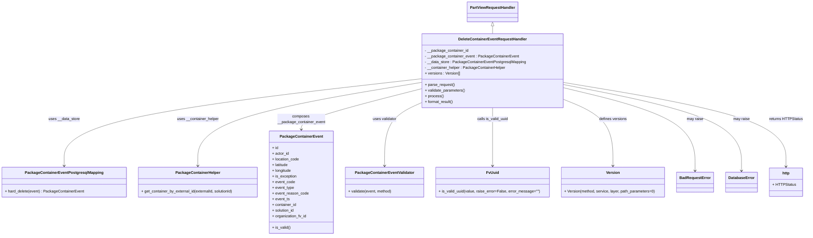

# Diagram: partview_core/partview_service/partview_service/api/package_container/event/handlers/delete_container_event.py

> Auto-generated by Obscura crawlers

## Mermaid

### SVG

<svg id="container" width="3342.26171875" xmlns="http://www.w3.org/2000/svg" class="classDiagram" height="992" viewBox="0 0 3342.26171875 992" role="graphics-document document" aria-roledescription="class"><g><defs><marker id="container_class-aggregationStart" class="marker aggregation class" refX="18" refY="7" markerWidth="190" markerHeight="240" orient="auto"><path d="M 18,7 L9,13 L1,7 L9,1 Z"></path></marker></defs><defs><marker id="container_class-aggregationEnd" class="marker aggregation class" refX="1" refY="7" markerWidth="20" markerHeight="28" orient="auto"><path d="M 18,7 L9,13 L1,7 L9,1 Z"></path></marker></defs><defs><marker id="container_class-extensionStart" class="marker extension class" refX="18" refY="7" markerWidth="190" markerHeight="240" orient="auto"><path d="M 1,7 L18,13 V 1 Z"></path></marker></defs><defs><marker id="container_class-extensionEnd" class="marker extension class" refX="1" refY="7" markerWidth="20" markerHeight="28" orient="auto"><path d="M 1,1 V 13 L18,7 Z"></path></marker></defs><defs><marker id="container_class-compositionStart" class="marker composition class" refX="18" refY="7" markerWidth="190" markerHeight="240" orient="auto"><path d="M 18,7 L9,13 L1,7 L9,1 Z"></path></marker></defs><defs><marker id="container_class-compositionEnd" class="marker composition class" refX="1" refY="7" markerWidth="20" markerHeight="28" orient="auto"><path d="M 18,7 L9,13 L1,7 L9,1 Z"></path></marker></defs><defs><marker id="container_class-dependencyStart" class="marker dependency class" refX="6" refY="7" markerWidth="190" markerHeight="240" orient="auto"><path d="M 5,7 L9,13 L1,7 L9,1 Z"></path></marker></defs><defs><marker id="container_class-dependencyEnd" class="marker dependency class" refX="13" refY="7" markerWidth="20" markerHeight="28" orient="auto"><path d="M 18,7 L9,13 L14,7 L9,1 Z"></path></marker></defs><defs><marker id="container_class-lollipopStart" class="marker lollipop class" refX="13" refY="7" markerWidth="190" markerHeight="240" orient="auto"><circle stroke="black" fill="transparent" cx="7" cy="7" r="6"></circle></marker></defs><defs><marker id="container_class-lollipopEnd" class="marker lollipop class" refX="1" refY="7" markerWidth="190" markerHeight="240" orient="auto"><circle stroke="black" fill="transparent" cx="7" cy="7" r="6"></circle></marker></defs><g class="root"><g class="clusters"></g><g class="edgePaths"><path d="M2050.883,109.25L2050.883,110.542C2050.883,111.833,2050.883,114.417,2050.883,119.875C2050.883,125.333,2050.883,133.667,2050.883,137.833L2050.883,142" id="id_PartViewRequestHandler_DeleteContainerEventRequestHandler_1" class="edge-thickness-normal edge-pattern-solid relation" style=";;;" data-edge="true" data-et="edge" data-id="id_PartViewRequestHandler_DeleteContainerEventRequestHandler_1" data-points="W3sieCI6MjA1MC44ODI4MTI1LCJ5Ijo5Mn0seyJ4IjoyMDUwLjg4MjgxMjUsInkiOjExN30seyJ4IjoyMDUwLjg4MjgxMjUsInkiOjE0Mn1d" marker-start="url(#container_class-extensionStart)"></path><path d="M1757.883,331.605L1508.82,360.171C1259.758,388.737,761.633,445.868,512.57,507.101C263.508,568.333,263.508,633.667,263.508,666.333L263.508,699" id="id_DeleteContainerEventRequestHandler_PackageContainerEventPostgresqlMapping_2" class="edge-thickness-normal edge-pattern-solid relation" style=";;;" data-edge="true" data-et="edge" data-id="id_DeleteContainerEventRequestHandler_PackageContainerEventPostgresqlMapping_2" data-points="W3sieCI6MTc1Ny44ODI4MTI1LCJ5IjozMzEuNjA1MTQ3MjEzMDkxOH0seyJ4IjoyNjMuNTA3ODEyNSwieSI6NTAzfSx7IngiOjI2My41MDc4MTI1LCJ5Ijo3MDV9XQ==" marker-end="url(#container_class-dependencyEnd)"></path><path d="M1757.883,346.875L1601.891,372.896C1445.898,398.917,1133.914,450.958,977.922,509.646C821.93,568.333,821.93,633.667,821.93,666.333L821.93,699" id="id_DeleteContainerEventRequestHandler_PackageContainerHelper_3" class="edge-thickness-normal edge-pattern-solid relation" style=";;;" data-edge="true" data-et="edge" data-id="id_DeleteContainerEventRequestHandler_PackageContainerHelper_3" data-points="W3sieCI6MTc1Ny44ODI4MTI1LCJ5IjozNDYuODc0OTMxNjYxODU2NX0seyJ4Ijo4MjEuOTI5Njg3NSwieSI6NTAzfSx7IngiOjgyMS45Mjk2ODc1LCJ5Ijo3MDV9XQ==" marker-end="url(#container_class-dependencyEnd)"></path><path d="M1757.883,373.574L1674.251,395.145C1590.62,416.716,1423.357,459.858,1339.725,488.596C1256.094,517.333,1256.094,531.667,1256.094,538.833L1256.094,546" id="id_DeleteContainerEventRequestHandler_PackageContainerEvent_4" class="edge-thickness-normal edge-pattern-solid relation" style=";;;" data-edge="true" data-et="edge" data-id="id_DeleteContainerEventRequestHandler_PackageContainerEvent_4" data-points="W3sieCI6MTc1Ny44ODI4MTI1LCJ5IjozNzMuNTczNTExMDUzNDQzODR9LHsieCI6MTI1Ni4wOTM3NSwieSI6NTAzfSx7IngiOjEyNTYuMDkzNzUsInkiOjU1Mn1d" marker-end="url(#container_class-dependencyEnd)"></path><path d="M1757.883,431.661L1731.819,443.551C1705.755,455.441,1653.628,479.22,1627.564,523.777C1601.5,568.333,1601.5,633.667,1601.5,666.333L1601.5,699" id="id_DeleteContainerEventRequestHandler_PackageContainerEventValidator_5" class="edge-thickness-normal edge-pattern-solid relation" style=";;;" data-edge="true" data-et="edge" data-id="id_DeleteContainerEventRequestHandler_PackageContainerEventValidator_5" data-points="W3sieCI6MTc1Ny44ODI4MTI1LCJ5Ijo0MzEuNjYxMDk3Njg2MDYyNX0seyJ4IjoxNjAxLjUsInkiOjUwM30seyJ4IjoxNjAxLjUsInkiOjcwNX1d" marker-end="url(#container_class-dependencyEnd)"></path><path d="M2050.883,454L2050.883,462.167C2050.883,470.333,2050.883,486.667,2050.883,527.5C2050.883,568.333,2050.883,633.667,2050.883,666.333L2050.883,699" id="id_DeleteContainerEventRequestHandler_FvUuid_6" class="edge-thickness-normal edge-pattern-solid relation" style=";;;" data-edge="true" data-et="edge" data-id="id_DeleteContainerEventRequestHandler_FvUuid_6" data-points="W3sieCI6MjA1MC44ODI4MTI1LCJ5Ijo0NTR9LHsieCI6MjA1MC44ODI4MTI1LCJ5Ijo1MDN9LHsieCI6MjA1MC44ODI4MTI1LCJ5Ijo3MDV9XQ==" marker-end="url(#container_class-dependencyEnd)"></path><path d="M2343.883,417.534L2378.798,431.778C2413.714,446.023,2483.544,474.511,2518.46,521.422C2553.375,568.333,2553.375,633.667,2553.375,666.333L2553.375,699" id="id_DeleteContainerEventRequestHandler_Version_7" class="edge-thickness-normal edge-pattern-solid relation" style=";;;" data-edge="true" data-et="edge" data-id="id_DeleteContainerEventRequestHandler_Version_7" data-points="W3sieCI6MjM0My44ODI4MTI1LCJ5Ijo0MTcuNTM0MTk2NzM4MTMzMzV9LHsieCI6MjU1My4zNzUsInkiOjUwM30seyJ4IjoyNTUzLjM3NSwieSI6NzA1fV0=" marker-end="url(#container_class-dependencyEnd)"></path><path d="M2343.883,369.164L2435.723,391.47C2527.563,413.776,2711.242,458.388,2803.082,516.861C2894.922,575.333,2894.922,647.667,2894.922,683.833L2894.922,720" id="id_DeleteContainerEventRequestHandler_BadRequestError_8" class="edge-thickness-normal edge-pattern-solid relation" style=";;;" data-edge="true" data-et="edge" data-id="id_DeleteContainerEventRequestHandler_BadRequestError_8" data-points="W3sieCI6MjM0My44ODI4MTI1LCJ5IjozNjkuMTYzNzY3OTY4MzgxMn0seyJ4IjoyODk0LjkyMTg3NSwieSI6NTAzfSx7IngiOjI4OTQuOTIxODc1LCJ5Ijo3MjZ9XQ==" marker-end="url(#container_class-dependencyEnd)"></path><path d="M2343.883,356.164L2467.163,380.637C2590.443,405.109,2837.003,454.055,2960.283,514.694C3083.563,575.333,3083.563,647.667,3083.563,683.833L3083.563,720" id="id_DeleteContainerEventRequestHandler_DatabaseError_9" class="edge-thickness-normal edge-pattern-solid relation" style=";;;" data-edge="true" data-et="edge" data-id="id_DeleteContainerEventRequestHandler_DatabaseError_9" data-points="W3sieCI6MjM0My44ODI4MTI1LCJ5IjozNTYuMTY0MjExNzM2NzU4OX0seyJ4IjozMDgzLjU2MjUsInkiOjUwM30seyJ4IjozMDgzLjU2MjUsInkiOjcyNn1d" marker-end="url(#container_class-dependencyEnd)"></path><path d="M2343.883,347.478L2497.377,373.399C2650.871,399.319,2957.859,451.159,3111.354,510.246C3264.848,569.333,3264.848,635.667,3264.848,668.833L3264.848,702" id="id_DeleteContainerEventRequestHandler_http_10" class="edge-thickness-normal edge-pattern-solid relation" style=";;;" data-edge="true" data-et="edge" data-id="id_DeleteContainerEventRequestHandler_http_10" data-points="W3sieCI6MjM0My44ODI4MTI1LCJ5IjozNDcuNDc4MzY4NTk0NjQyNH0seyJ4IjozMjY0Ljg0NzY1NjI1LCJ5Ijo1MDN9LHsieCI6MzI2NC44NDc2NTYyNSwieSI6NzA4fV0=" marker-end="url(#container_class-dependencyEnd)"></path></g><g class="edgeLabels"><g class="edgeLabel"><g class="label" data-id="id_PartViewRequestHandler_DeleteContainerEventRequestHandler_1" transform="translate(0, 0)"><foreignObject width="0" height="0">

</foreignObject></g></g><g class="edgeLabel" transform="translate(263.5078125, 503)"><g class="label" data-id="id_DeleteContainerEventRequestHandler_PackageContainerEventPostgresqlMapping_2" transform="translate(-65.5546875, -12)"><foreignObject width="131.109375" height="24">

uses __data_store

</foreignObject></g></g><g class="edgeLabel" transform="translate(821.9296875, 503)"><g class="label" data-id="id_DeleteContainerEventRequestHandler_PackageContainerHelper_3" transform="translate(-88.40625, -12)"><foreignObject width="176.8125" height="24">

uses __container_helper

</foreignObject></g></g><g class="edgeLabel" transform="translate(1256.09375, 503)"><g class="label" data-id="id_DeleteContainerEventRequestHandler_PackageContainerEvent_4" transform="translate(-100, -24)"><foreignObject width="200" height="48">

composes __package_container_event

</foreignObject></g></g><g class="edgeLabel" transform="translate(1601.5, 503)"><g class="label" data-id="id_DeleteContainerEventRequestHandler_PackageContainerEventValidator_5" transform="translate(-50.953125, -12)"><foreignObject width="101.90625" height="24">

uses validator

</foreignObject></g></g><g class="edgeLabel" transform="translate(2050.8828125, 503)"><g class="label" data-id="id_DeleteContainerEventRequestHandler_FvUuid_6" transform="translate(-66.1328125, -12)"><foreignObject width="132.265625" height="24">

calls is_valid_uuid

</foreignObject></g></g><g class="edgeLabel" transform="translate(2553.375, 503)"><g class="label" data-id="id_DeleteContainerEventRequestHandler_Version_7" transform="translate(-58.96875, -12)"><foreignObject width="117.9375" height="24">

defines versions

</foreignObject></g></g><g class="edgeLabel" transform="translate(2894.921875, 503)"><g class="label" data-id="id_DeleteContainerEventRequestHandler_BadRequestError_8" transform="translate(-34.65625, -12)"><foreignObject width="69.3125" height="24">

may raise

</foreignObject></g></g><g class="edgeLabel" transform="translate(3083.5625, 503)"><g class="label" data-id="id_DeleteContainerEventRequestHandler_DatabaseError_9" transform="translate(-34.65625, -12)"><foreignObject width="69.3125" height="24">

may raise

</foreignObject></g></g><g class="edgeLabel" transform="translate(3264.84765625, 503)"><g class="label" data-id="id_DeleteContainerEventRequestHandler_http_10" transform="translate(-69.4140625, -12)"><foreignObject width="138.828125" height="24">

returns HTTPStatus

</foreignObject></g></g></g><g class="nodes"><g class="node default" id="classId-PartViewRequestHandler-0" transform="translate(2050.8828125, 50)"><g class="basic label-container"><path d="M-103.359375 -42 L103.359375 -42 L103.359375 42 L-103.359375 42" stroke="none" stroke-width="0" fill="#ECECFF" style=""></path><path d="M-103.359375 -42 C-39.45181345913983 -42, 24.455748081720344 -42, 103.359375 -42 M-103.359375 -42 C-43.14151034831487 -42, 17.076354303370266 -42, 103.359375 -42 M103.359375 -42 C103.359375 -12.744446731546109, 103.359375 16.511106536907782, 103.359375 42 M103.359375 -42 C103.359375 -12.338742223426788, 103.359375 17.322515553146424, 103.359375 42 M103.359375 42 C56.03538591905805 42, 8.711396838116102 42, -103.359375 42 M103.359375 42 C42.61230466375323 42, -18.134765672493543 42, -103.359375 42 M-103.359375 42 C-103.359375 19.21883193662382, -103.359375 -3.5623361267523634, -103.359375 -42 M-103.359375 42 C-103.359375 21.271835968819197, -103.359375 0.5436719376383934, -103.359375 -42" stroke="#9370DB" stroke-width="1.3" fill="none" stroke-dasharray="0 0" style=""></path></g><g class="annotation-group text" transform="translate(0, -18)"></g><g class="label-group text" transform="translate(-91.359375, -18)"><g class="label" style="font-weight: bolder" transform="translate(0,-12)"><foreignObject width="182.71875" height="24">

PartViewRequestHandler

</foreignObject></g></g><g class="members-group text" transform="translate(-91.359375, 30)"></g><g class="methods-group text" transform="translate(-91.359375, 60)"></g><g class="divider" style=""><path d="M-103.359375 6 C-23.76231858842165 6, 55.8347378231567 6, 103.359375 6 M-103.359375 6 C-27.646979800035737 6, 48.065415399928526 6, 103.359375 6" stroke="#9370DB" stroke-width="1.3" fill="none" stroke-dasharray="0 0" style=""></path></g><g class="divider" style=""><path d="M-103.359375 24 C-35.65843217592233 24, 32.04251064815534 24, 103.359375 24 M-103.359375 24 C-61.1559244663736 24, -18.952473932747196 24, 103.359375 24" stroke="#9370DB" stroke-width="1.3" fill="none" stroke-dasharray="0 0" style=""></path></g></g><g class="node default" id="classId-DeleteContainerEventRequestHandler-1" transform="translate(2050.8828125, 298)"><g class="basic label-container"><path d="M-293 -156 L293 -156 L293 156 L-293 156" stroke="none" stroke-width="0" fill="#ECECFF" style=""></path><path d="M-293 -156 C-104.26005800224223 -156, 84.47988399551554 -156, 293 -156 M-293 -156 C-134.8736186971461 -156, 23.2527626057078 -156, 293 -156 M293 -156 C293 -91.98545333728268, 293 -27.970906674565356, 293 156 M293 -156 C293 -88.8839428188058, 293 -21.767885637611613, 293 156 M293 156 C80.87822029336053 156, -131.24355941327894 156, -293 156 M293 156 C82.6274986100405 156, -127.74500277991899 156, -293 156 M-293 156 C-293 89.05768054464853, -293 22.115361089297068, -293 -156 M-293 156 C-293 63.6819126079093, -293 -28.636174784181406, -293 -156" stroke="#9370DB" stroke-width="1.3" fill="none" stroke-dasharray="0 0" style=""></path></g><g class="annotation-group text" transform="translate(0, -132)"></g><g class="label-group text" transform="translate(-138.609375, -132)"><g class="label" style="font-weight: bolder" transform="translate(0,-12)"><foreignObject width="277.21875" height="24">

DeleteContainerEventRequestHandler

</foreignObject></g></g><g class="members-group text" transform="translate(-281, -84)"><g class="label" style="" transform="translate(0,-12)"><foreignObject width="184.15625" height="24">

- __package_container_id

</foreignObject></g><g class="label" style="" transform="translate(0,12)"><foreignObject width="390.890625" height="24">

- __package_container_event : PackageContainerEvent

</foreignObject></g><g class="label" style="" transform="translate(0,36)"><foreignObject width="423.390625" height="24">

- __data_store : PackageContainerEventPostgresqlMapping

</foreignObject></g><g class="label" style="" transform="translate(0,60)"><foreignObject width="339.84375" height="24">

- __container_helper : PackageContainerHelper

</foreignObject></g><g class="label" style="" transform="translate(0,84)"><foreignObject width="149.359375" height="24">

+ versions : Version[]

</foreignObject></g></g><g class="methods-group text" transform="translate(-281, 60)"><g class="label" style="" transform="translate(0,-12)"><foreignObject width="126.046875" height="24">

+ parse_request()

</foreignObject></g><g class="label" style="" transform="translate(0,12)"><foreignObject width="170.953125" height="24">

+ validate_parameters()

</foreignObject></g><g class="label" style="" transform="translate(0,36)"><foreignObject width="77.96875" height="24">

+ process()

</foreignObject></g><g class="label" style="" transform="translate(0,60)"><foreignObject width="121.5" height="24">

+ format_result()

</foreignObject></g></g><g class="divider" style=""><path d="M-293 -108 C-60.61938602886195 -108, 171.7612279422761 -108, 293 -108 M-293 -108 C-72.97249360338901 -108, 147.05501279322198 -108, 293 -108" stroke="#9370DB" stroke-width="1.3" fill="none" stroke-dasharray="0 0" style=""></path></g><g class="divider" style=""><path d="M-293 36 C-138.05682390346036 36, 16.88635219307929 36, 293 36 M-293 36 C-90.28333675653207 36, 112.43332648693587 36, 293 36" stroke="#9370DB" stroke-width="1.3" fill="none" stroke-dasharray="0 0" style=""></path></g></g><g class="node default" id="classId-PackageContainerEvent-2" transform="translate(1256.09375, 768)"><g class="basic label-container"><path d="M-131.25 -216 L131.25 -216 L131.25 216 L-131.25 216" stroke="none" stroke-width="0" fill="#ECECFF" style=""></path><path d="M-131.25 -216 C-39.253093710302494 -216, 52.74381257939501 -216, 131.25 -216 M-131.25 -216 C-47.096476274446786 -216, 37.05704745110643 -216, 131.25 -216 M131.25 -216 C131.25 -106.91735634296748, 131.25 2.16528731406504, 131.25 216 M131.25 -216 C131.25 -90.07350769197818, 131.25 35.85298461604364, 131.25 216 M131.25 216 C76.29136597717027 216, 21.33273195434056 216, -131.25 216 M131.25 216 C64.90365807870248 216, -1.442683842595045 216, -131.25 216 M-131.25 216 C-131.25 75.33242257798426, -131.25 -65.33515484403148, -131.25 -216 M-131.25 216 C-131.25 101.41029473502027, -131.25 -13.179410529959455, -131.25 -216" stroke="#9370DB" stroke-width="1.3" fill="none" stroke-dasharray="0 0" style=""></path></g><g class="annotation-group text" transform="translate(0, -192)"></g><g class="label-group text" transform="translate(-85.65625, -192)"><g class="label" style="font-weight: bolder" transform="translate(0,-12)"><foreignObject width="171.3125" height="24">

PackageContainerEvent

</foreignObject></g></g><g class="members-group text" transform="translate(-119.25, -144)"><g class="label" style="" transform="translate(0,-12)"><foreignObject width="26.3125" height="24">

+ id

</foreignObject></g><g class="label" style="" transform="translate(0,12)"><foreignObject width="70.765625" height="24">

+ actor_id

</foreignObject></g><g class="label" style="" transform="translate(0,36)"><foreignObject width="114.34375" height="24">

+ location_code

</foreignObject></g><g class="label" style="" transform="translate(0,60)"><foreignObject width="69.203125" height="24">

+ latitude

</foreignObject></g><g class="label" style="" transform="translate(0,84)"><foreignObject width="81.765625" height="24">

+ longitude

</foreignObject></g><g class="label" style="" transform="translate(0,108)"><foreignObject width="102.640625" height="24">

+ is_exception

</foreignObject></g><g class="label" style="" transform="translate(0,132)"><foreignObject width="95.53125" height="24">

+ event_code

</foreignObject></g><g class="label" style="" transform="translate(0,156)"><foreignObject width="92.359375" height="24">

+ event_type

</foreignObject></g><g class="label" style="" transform="translate(0,180)"><foreignObject width="152.84375" height="24">

+ event_reason_code

</foreignObject></g><g class="label" style="" transform="translate(0,204)"><foreignObject width="73.8125" height="24">

+ event_ts

</foreignObject></g><g class="label" style="" transform="translate(0,228)"><foreignObject width="102.546875" height="24">

+ container_id

</foreignObject></g><g class="label" style="" transform="translate(0,252)"><foreignObject width="94.453125" height="24">

+ solution_id

</foreignObject></g><g class="label" style="" transform="translate(0,276)"><foreignObject width="145.734375" height="24">

+ organization_fv_id

</foreignObject></g></g><g class="methods-group text" transform="translate(-119.25, 192)"><g class="label" style="" transform="translate(0,-12)"><foreignObject width="77.03125" height="24">

+ is_valid()

</foreignObject></g></g><g class="divider" style=""><path d="M-131.25 -168 C-33.794953644291894 -168, 63.66009271141621 -168, 131.25 -168 M-131.25 -168 C-58.40282310682018 -168, 14.444353786359642 -168, 131.25 -168" stroke="#9370DB" stroke-width="1.3" fill="none" stroke-dasharray="0 0" style=""></path></g><g class="divider" style=""><path d="M-131.25 168 C-46.92977921256495 168, 37.390441574870096 168, 131.25 168 M-131.25 168 C-62.84753937768993 168, 5.554921244620147 168, 131.25 168" stroke="#9370DB" stroke-width="1.3" fill="none" stroke-dasharray="0 0" style=""></path></g></g><g class="node default" id="classId-PackageContainerEventPostgresqlMapping-3" transform="translate(263.5078125, 768)"><g class="basic label-container"><path d="M-255.5078125 -63 L255.5078125 -63 L255.5078125 63 L-255.5078125 63" stroke="none" stroke-width="0" fill="#ECECFF" style=""></path><path d="M-255.5078125 -63 C-116.86304053193567 -63, 21.781731436128666 -63, 255.5078125 -63 M-255.5078125 -63 C-92.24932210069957 -63, 71.00916829860085 -63, 255.5078125 -63 M255.5078125 -63 C255.5078125 -35.72797142304472, 255.5078125 -8.45594284608945, 255.5078125 63 M255.5078125 -63 C255.5078125 -13.37303172612885, 255.5078125 36.2539365477423, 255.5078125 63 M255.5078125 63 C66.00075003444437 63, -123.50631243111127 63, -255.5078125 63 M255.5078125 63 C53.22839614234471 63, -149.0510202153106 63, -255.5078125 63 M-255.5078125 63 C-255.5078125 35.88379336158573, -255.5078125 8.767586723171469, -255.5078125 -63 M-255.5078125 63 C-255.5078125 21.925250878961883, -255.5078125 -19.149498242076234, -255.5078125 -63" stroke="#9370DB" stroke-width="1.3" fill="none" stroke-dasharray="0 0" style=""></path></g><g class="annotation-group text" transform="translate(0, -39)"></g><g class="label-group text" transform="translate(-156.0625, -39)"><g class="label" style="font-weight: bolder" transform="translate(0,-12)"><foreignObject width="312.125" height="24">

PackageContainerEventPostgresqlMapping

</foreignObject></g></g><g class="members-group text" transform="translate(-243.5078125, 9)"></g><g class="methods-group text" transform="translate(-243.5078125, 39)"><g class="label" style="" transform="translate(0,-12)"><foreignObject width="330.953125" height="24">

+ hard_delete(event) : PackageContainerEvent

</foreignObject></g></g><g class="divider" style=""><path d="M-255.5078125 -15 C-79.26403373601974 -15, 96.97974502796052 -15, 255.5078125 -15 M-255.5078125 -15 C-111.20881822791952 -15, 33.090176044160955 -15, 255.5078125 -15" stroke="#9370DB" stroke-width="1.3" fill="none" stroke-dasharray="0 0" style=""></path></g><g class="divider" style=""><path d="M-255.5078125 9 C-74.18160426254192 9, 107.14460397491615 9, 255.5078125 9 M-255.5078125 9 C-101.96348136336971 9, 51.58084977326058 9, 255.5078125 9" stroke="#9370DB" stroke-width="1.3" fill="none" stroke-dasharray="0 0" style=""></path></g></g><g class="node default" id="classId-PackageContainerHelper-4" transform="translate(821.9296875, 768)"><g class="basic label-container"><path d="M-252.9140625 -63 L252.9140625 -63 L252.9140625 63 L-252.9140625 63" stroke="none" stroke-width="0" fill="#ECECFF" style=""></path><path d="M-252.9140625 -63 C-92.93564336208306 -63, 67.04277577583389 -63, 252.9140625 -63 M-252.9140625 -63 C-126.36907986166966 -63, 0.17590277666067777 -63, 252.9140625 -63 M252.9140625 -63 C252.9140625 -33.702084507202684, 252.9140625 -4.404169014405376, 252.9140625 63 M252.9140625 -63 C252.9140625 -24.561156325518404, 252.9140625 13.877687348963192, 252.9140625 63 M252.9140625 63 C149.29748225332628 63, 45.68090200665256 63, -252.9140625 63 M252.9140625 63 C114.7775720115009 63, -23.358918476998213 63, -252.9140625 63 M-252.9140625 63 C-252.9140625 16.695226447536825, -252.9140625 -29.60954710492635, -252.9140625 -63 M-252.9140625 63 C-252.9140625 27.525645282830368, -252.9140625 -7.948709434339264, -252.9140625 -63" stroke="#9370DB" stroke-width="1.3" fill="none" stroke-dasharray="0 0" style=""></path></g><g class="annotation-group text" transform="translate(0, -39)"></g><g class="label-group text" transform="translate(-89.96875, -39)"><g class="label" style="font-weight: bolder" transform="translate(0,-12)"><foreignObject width="179.9375" height="24">

PackageContainerHelper

</foreignObject></g></g><g class="members-group text" transform="translate(-240.9140625, 9)"></g><g class="methods-group text" transform="translate(-240.9140625, 39)"><g class="label" style="" transform="translate(0,-12)"><foreignObject width="391.859375" height="24">

+ get_container_by_external_id(externalId, solutionId)

</foreignObject></g></g><g class="divider" style=""><path d="M-252.9140625 -15 C-140.46197863905286 -15, -28.009894778105718 -15, 252.9140625 -15 M-252.9140625 -15 C-114.61605249210538 -15, 23.681957515789236 -15, 252.9140625 -15" stroke="#9370DB" stroke-width="1.3" fill="none" stroke-dasharray="0 0" style=""></path></g><g class="divider" style=""><path d="M-252.9140625 9 C-58.635963576229955 9, 135.6421353475401 9, 252.9140625 9 M-252.9140625 9 C-118.84945772308694 9, 15.215147053826115 9, 252.9140625 9" stroke="#9370DB" stroke-width="1.3" fill="none" stroke-dasharray="0 0" style=""></path></g></g><g class="node default" id="classId-PackageContainerEventValidator-5" transform="translate(1601.5, 768)"><g class="basic label-container"><path d="M-164.15625 -63 L164.15625 -63 L164.15625 63 L-164.15625 63" stroke="none" stroke-width="0" fill="#ECECFF" style=""></path><path d="M-164.15625 -63 C-52.6248731280385 -63, 58.906503743923 -63, 164.15625 -63 M-164.15625 -63 C-89.58641976182552 -63, -15.01658952365105 -63, 164.15625 -63 M164.15625 -63 C164.15625 -33.83661495836381, 164.15625 -4.673229916727628, 164.15625 63 M164.15625 -63 C164.15625 -24.546822240080218, 164.15625 13.906355519839565, 164.15625 63 M164.15625 63 C65.6926136254335 63, -32.77102274913301 63, -164.15625 63 M164.15625 63 C46.60959363141541 63, -70.93706273716919 63, -164.15625 63 M-164.15625 63 C-164.15625 16.15530225864896, -164.15625 -30.689395482702082, -164.15625 -63 M-164.15625 63 C-164.15625 19.349520046855538, -164.15625 -24.300959906288924, -164.15625 -63" stroke="#9370DB" stroke-width="1.3" fill="none" stroke-dasharray="0 0" style=""></path></g><g class="annotation-group text" transform="translate(0, -39)"></g><g class="label-group text" transform="translate(-118.84375, -39)"><g class="label" style="font-weight: bolder" transform="translate(0,-12)"><foreignObject width="237.6875" height="24">

PackageContainerEventValidator

</foreignObject></g></g><g class="members-group text" transform="translate(-152.15625, 9)"></g><g class="methods-group text" transform="translate(-152.15625, 39)"><g class="label" style="" transform="translate(0,-12)"><foreignObject width="185.46875" height="24">

+ validate(event, method)

</foreignObject></g></g><g class="divider" style=""><path d="M-164.15625 -15 C-68.71725526812239 -15, 26.721739463755227 -15, 164.15625 -15 M-164.15625 -15 C-65.16886343099588 -15, 33.81852313800823 -15, 164.15625 -15" stroke="#9370DB" stroke-width="1.3" fill="none" stroke-dasharray="0 0" style=""></path></g><g class="divider" style=""><path d="M-164.15625 9 C-49.00603260418865 9, 66.1441847916227 9, 164.15625 9 M-164.15625 9 C-47.83829272446448 9, 68.47966455107104 9, 164.15625 9" stroke="#9370DB" stroke-width="1.3" fill="none" stroke-dasharray="0 0" style=""></path></g></g><g class="node default" id="classId-FvUuid-6" transform="translate(2050.8828125, 768)"><g class="basic label-container"><path d="M-235.2265625 -63 L235.2265625 -63 L235.2265625 63 L-235.2265625 63" stroke="none" stroke-width="0" fill="#ECECFF" style=""></path><path d="M-235.2265625 -63 C-99.20048093174614 -63, 36.825600636507716 -63, 235.2265625 -63 M-235.2265625 -63 C-122.74123366617843 -63, -10.255904832356862 -63, 235.2265625 -63 M235.2265625 -63 C235.2265625 -15.29914848120211, 235.2265625 32.40170303759578, 235.2265625 63 M235.2265625 -63 C235.2265625 -21.298577495145892, 235.2265625 20.402845009708216, 235.2265625 63 M235.2265625 63 C115.58899412727094 63, -4.048574245458127 63, -235.2265625 63 M235.2265625 63 C84.90445110339385 63, -65.4176602932123 63, -235.2265625 63 M-235.2265625 63 C-235.2265625 26.333775846585667, -235.2265625 -10.332448306828667, -235.2265625 -63 M-235.2265625 63 C-235.2265625 26.594571423393987, -235.2265625 -9.810857153212027, -235.2265625 -63" stroke="#9370DB" stroke-width="1.3" fill="none" stroke-dasharray="0 0" style=""></path></g><g class="annotation-group text" transform="translate(0, -39)"></g><g class="label-group text" transform="translate(-24.5625, -39)"><g class="label" style="font-weight: bolder" transform="translate(0,-12)"><foreignObject width="49.125" height="24">

FvUuid

</foreignObject></g></g><g class="members-group text" transform="translate(-223.2265625, 9)"></g><g class="methods-group text" transform="translate(-223.2265625, 39)"><g class="label" style="" transform="translate(0,-12)"><foreignObject width="421.890625" height="24">

+ is_valid_uuid(value, raise_error=False, error_message="")

</foreignObject></g></g><g class="divider" style=""><path d="M-235.2265625 -15 C-96.90708763208178 -15, 41.412387235836434 -15, 235.2265625 -15 M-235.2265625 -15 C-88.98972398708054 -15, 57.247114525838924 -15, 235.2265625 -15" stroke="#9370DB" stroke-width="1.3" fill="none" stroke-dasharray="0 0" style=""></path></g><g class="divider" style=""><path d="M-235.2265625 9 C-64.68832074936398 9, 105.84992100127204 9, 235.2265625 9 M-235.2265625 9 C-138.3006568284677 9, -41.374751156935446 9, 235.2265625 9" stroke="#9370DB" stroke-width="1.3" fill="none" stroke-dasharray="0 0" style=""></path></g></g><g class="node default" id="classId-Version-7" transform="translate(2553.375, 768)"><g class="basic label-container"><path d="M-217.265625 -63 L217.265625 -63 L217.265625 63 L-217.265625 63" stroke="none" stroke-width="0" fill="#ECECFF" style=""></path><path d="M-217.265625 -63 C-71.84490994572965 -63, 73.57580510854069 -63, 217.265625 -63 M-217.265625 -63 C-65.72206153112091 -63, 85.82150193775817 -63, 217.265625 -63 M217.265625 -63 C217.265625 -35.29639231578605, 217.265625 -7.592784631572101, 217.265625 63 M217.265625 -63 C217.265625 -18.340562311857575, 217.265625 26.31887537628485, 217.265625 63 M217.265625 63 C66.85536477862715 63, -83.5548954427457 63, -217.265625 63 M217.265625 63 C54.705967448762834 63, -107.85369010247433 63, -217.265625 63 M-217.265625 63 C-217.265625 15.16428194946036, -217.265625 -32.67143610107928, -217.265625 -63 M-217.265625 63 C-217.265625 17.946121575547167, -217.265625 -27.107756848905666, -217.265625 -63" stroke="#9370DB" stroke-width="1.3" fill="none" stroke-dasharray="0 0" style=""></path></g><g class="annotation-group text" transform="translate(0, -39)"></g><g class="label-group text" transform="translate(-27.296875, -39)"><g class="label" style="font-weight: bolder" transform="translate(0,-12)"><foreignObject width="54.59375" height="24">

Version

</foreignObject></g></g><g class="members-group text" transform="translate(-205.265625, 9)"></g><g class="methods-group text" transform="translate(-205.265625, 39)"><g class="label" style="" transform="translate(0,-12)"><foreignObject width="383.234375" height="24">

+ Version(method, service, layer, path_parameters=0)

</foreignObject></g></g><g class="divider" style=""><path d="M-217.265625 -15 C-67.48432435899127 -15, 82.29697628201745 -15, 217.265625 -15 M-217.265625 -15 C-73.10783371188347 -15, 71.04995757623306 -15, 217.265625 -15" stroke="#9370DB" stroke-width="1.3" fill="none" stroke-dasharray="0 0" style=""></path></g><g class="divider" style=""><path d="M-217.265625 9 C-88.81222743964418 9, 39.64117012071165 9, 217.265625 9 M-217.265625 9 C-83.88160548415738 9, 49.50241403168525 9, 217.265625 9" stroke="#9370DB" stroke-width="1.3" fill="none" stroke-dasharray="0 0" style=""></path></g></g><g class="node default" id="classId-BadRequestError-8" transform="translate(2894.921875, 768)"><g class="basic label-container"><path d="M-74.28125 -42 L74.28125 -42 L74.28125 42 L-74.28125 42" stroke="none" stroke-width="0" fill="#ECECFF" style=""></path><path d="M-74.28125 -42 C-17.145973694832392 -42, 39.989302610335216 -42, 74.28125 -42 M-74.28125 -42 C-31.256143733848177 -42, 11.768962532303647 -42, 74.28125 -42 M74.28125 -42 C74.28125 -15.240296004672867, 74.28125 11.519407990654265, 74.28125 42 M74.28125 -42 C74.28125 -10.443090564079395, 74.28125 21.11381887184121, 74.28125 42 M74.28125 42 C26.062222823084767 42, -22.156804353830466 42, -74.28125 42 M74.28125 42 C43.03501908318968 42, 11.788788166379355 42, -74.28125 42 M-74.28125 42 C-74.28125 11.107949717162057, -74.28125 -19.784100565675885, -74.28125 -42 M-74.28125 42 C-74.28125 15.924490038474797, -74.28125 -10.151019923050406, -74.28125 -42" stroke="#9370DB" stroke-width="1.3" fill="none" stroke-dasharray="0 0" style=""></path></g><g class="annotation-group text" transform="translate(0, -18)"></g><g class="label-group text" transform="translate(-62.28125, -18)"><g class="label" style="font-weight: bolder" transform="translate(0,-12)"><foreignObject width="124.5625" height="24">

BadRequestError

</foreignObject></g></g><g class="members-group text" transform="translate(-62.28125, 30)"></g><g class="methods-group text" transform="translate(-62.28125, 60)"></g><g class="divider" style=""><path d="M-74.28125 6 C-44.36590076722572 6, -14.450551534451435 6, 74.28125 6 M-74.28125 6 C-43.365598736855944 6, -12.449947473711887 6, 74.28125 6" stroke="#9370DB" stroke-width="1.3" fill="none" stroke-dasharray="0 0" style=""></path></g><g class="divider" style=""><path d="M-74.28125 24 C-39.14743093861072 24, -4.013611877221436 24, 74.28125 24 M-74.28125 24 C-19.712481611282563 24, 34.856286777434875 24, 74.28125 24" stroke="#9370DB" stroke-width="1.3" fill="none" stroke-dasharray="0 0" style=""></path></g></g><g class="node default" id="classId-DatabaseError-9" transform="translate(3083.5625, 768)"><g class="basic label-container"><path d="M-64.359375 -42 L64.359375 -42 L64.359375 42 L-64.359375 42" stroke="none" stroke-width="0" fill="#ECECFF" style=""></path><path d="M-64.359375 -42 C-22.389637743143766 -42, 19.58009951371247 -42, 64.359375 -42 M-64.359375 -42 C-20.585607079070577 -42, 23.188160841858846 -42, 64.359375 -42 M64.359375 -42 C64.359375 -24.666920976475428, 64.359375 -7.333841952950856, 64.359375 42 M64.359375 -42 C64.359375 -17.638166236905523, 64.359375 6.7236675261889545, 64.359375 42 M64.359375 42 C29.24999854134984 42, -5.859377917300321 42, -64.359375 42 M64.359375 42 C20.739935805873728 42, -22.879503388252544 42, -64.359375 42 M-64.359375 42 C-64.359375 9.035366986426524, -64.359375 -23.92926602714695, -64.359375 -42 M-64.359375 42 C-64.359375 15.388335213262291, -64.359375 -11.223329573475418, -64.359375 -42" stroke="#9370DB" stroke-width="1.3" fill="none" stroke-dasharray="0 0" style=""></path></g><g class="annotation-group text" transform="translate(0, -18)"></g><g class="label-group text" transform="translate(-52.359375, -18)"><g class="label" style="font-weight: bolder" transform="translate(0,-12)"><foreignObject width="104.71875" height="24">

DatabaseError

</foreignObject></g></g><g class="members-group text" transform="translate(-52.359375, 30)"></g><g class="methods-group text" transform="translate(-52.359375, 60)"></g><g class="divider" style=""><path d="M-64.359375 6 C-31.414795903573932 6, 1.5297831928521362 6, 64.359375 6 M-64.359375 6 C-34.5108688954692 6, -4.662362790938403 6, 64.359375 6" stroke="#9370DB" stroke-width="1.3" fill="none" stroke-dasharray="0 0" style=""></path></g><g class="divider" style=""><path d="M-64.359375 24 C-18.270641301154107 24, 27.818092397691785 24, 64.359375 24 M-64.359375 24 C-34.324687319816974 24, -4.2899996396339475 24, 64.359375 24" stroke="#9370DB" stroke-width="1.3" fill="none" stroke-dasharray="0 0" style=""></path></g></g><g class="node default" id="classId-http-10" transform="translate(3264.84765625, 768)"><g class="basic label-container"><path d="M-66.92578125 -60 L66.92578125 -60 L66.92578125 60 L-66.92578125 60" stroke="none" stroke-width="0" fill="#ECECFF" style=""></path><path d="M-66.92578125 -60 C-33.435276621682306 -60, 0.05522800663538874 -60, 66.92578125 -60 M-66.92578125 -60 C-26.788712526210993 -60, 13.348356197578013 -60, 66.92578125 -60 M66.92578125 -60 C66.92578125 -13.77343359812086, 66.92578125 32.45313280375828, 66.92578125 60 M66.92578125 -60 C66.92578125 -14.747336512969667, 66.92578125 30.505326974060665, 66.92578125 60 M66.92578125 60 C34.34650987669698 60, 1.7672385033939548 60, -66.92578125 60 M66.92578125 60 C30.767113016310745 60, -5.39155521737851 60, -66.92578125 60 M-66.92578125 60 C-66.92578125 30.913301006187428, -66.92578125 1.826602012374856, -66.92578125 -60 M-66.92578125 60 C-66.92578125 19.68099815598608, -66.92578125 -20.638003688027837, -66.92578125 -60" stroke="#9370DB" stroke-width="1.3" fill="none" stroke-dasharray="0 0" style=""></path></g><g class="annotation-group text" transform="translate(0, -36)"></g><g class="label-group text" transform="translate(-15.5703125, -36)"><g class="label" style="font-weight: bolder" transform="translate(0,-12)"><foreignObject width="31.140625" height="24">

http

</foreignObject></g></g><g class="members-group text" transform="translate(-54.92578125, 12)"><g class="label" style="" transform="translate(0,-12)"><foreignObject width="94.28125" height="24">

+ HTTPStatus

</foreignObject></g></g><g class="methods-group text" transform="translate(-54.92578125, 60)"></g><g class="divider" style=""><path d="M-66.92578125 -12 C-37.734136531326456 -12, -8.542491812652905 -12, 66.92578125 -12 M-66.92578125 -12 C-32.641351966379865 -12, 1.6430773172402695 -12, 66.92578125 -12" stroke="#9370DB" stroke-width="1.3" fill="none" stroke-dasharray="0 0" style=""></path></g><g class="divider" style=""><path d="M-66.92578125 36 C-38.845002629969635 36, -10.76422400993927 36, 66.92578125 36 M-66.92578125 36 C-26.99473470544718 36, 12.936311839105642 36, 66.92578125 36" stroke="#9370DB" stroke-width="1.3" fill="none" stroke-dasharray="0 0" style=""></path></g></g></g></g></g></svg>
