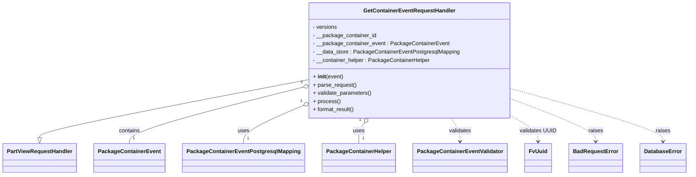
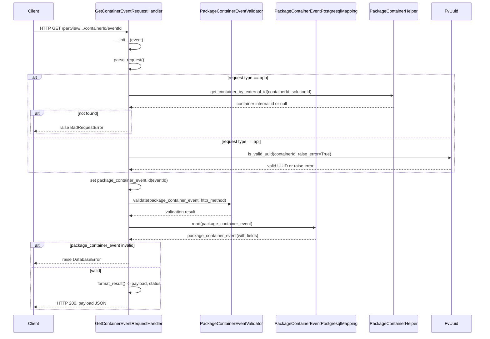

# Diagram: partview_core/partview_service/partview_service/api/package_container/event/handlers/get_container_event.py

> Auto-generated by Obscura crawlers

## Diagram 1

### SVG

<svg id="container" width="1920.1875" xmlns="http://www.w3.org/2000/svg" class="classDiagram" height="510" viewBox="0 0 1920.1875 510" role="graphics-document document" aria-roledescription="class"><g><defs><marker id="container_class-aggregationStart" class="marker aggregation class" refX="18" refY="7" markerWidth="190" markerHeight="240" orient="auto"><path d="M 18,7 L9,13 L1,7 L9,1 Z"></path></marker></defs><defs><marker id="container_class-aggregationEnd" class="marker aggregation class" refX="1" refY="7" markerWidth="20" markerHeight="28" orient="auto"><path d="M 18,7 L9,13 L1,7 L9,1 Z"></path></marker></defs><defs><marker id="container_class-extensionStart" class="marker extension class" refX="18" refY="7" markerWidth="190" markerHeight="240" orient="auto"><path d="M 1,7 L18,13 V 1 Z"></path></marker></defs><defs><marker id="container_class-extensionEnd" class="marker extension class" refX="1" refY="7" markerWidth="20" markerHeight="28" orient="auto"><path d="M 1,1 V 13 L18,7 Z"></path></marker></defs><defs><marker id="container_class-compositionStart" class="marker composition class" refX="18" refY="7" markerWidth="190" markerHeight="240" orient="auto"><path d="M 18,7 L9,13 L1,7 L9,1 Z"></path></marker></defs><defs><marker id="container_class-compositionEnd" class="marker composition class" refX="1" refY="7" markerWidth="20" markerHeight="28" orient="auto"><path d="M 18,7 L9,13 L1,7 L9,1 Z"></path></marker></defs><defs><marker id="container_class-dependencyStart" class="marker dependency class" refX="6" refY="7" markerWidth="190" markerHeight="240" orient="auto"><path d="M 5,7 L9,13 L1,7 L9,1 Z"></path></marker></defs><defs><marker id="container_class-dependencyEnd" class="marker dependency class" refX="13" refY="7" markerWidth="20" markerHeight="28" orient="auto"><path d="M 18,7 L9,13 L14,7 L9,1 Z"></path></marker></defs><defs><marker id="container_class-lollipopStart" class="marker lollipop class" refX="13" refY="7" markerWidth="190" markerHeight="240" orient="auto"><circle stroke="black" fill="transparent" cx="7" cy="7" r="6"></circle></marker></defs><defs><marker id="container_class-lollipopEnd" class="marker lollipop class" refX="1" refY="7" markerWidth="190" markerHeight="240" orient="auto"><circle stroke="black" fill="transparent" cx="7" cy="7" r="6"></circle></marker></defs><g class="root"><g class="clusters"></g><g class="edgePaths"><path d="M852.066,233.316L728.615,257.93C605.164,282.544,358.262,331.772,234.811,359.678C111.359,387.583,111.359,394.167,111.359,397.458L111.359,400.75" id="id_GetContainerEventRequestHandler_PartViewRequestHandler_1" class="edge-thickness-normal edge-pattern-solid relation" style=";;;" data-edge="true" data-et="edge" data-id="id_GetContainerEventRequestHandler_PartViewRequestHandler_1" data-points="W3sieCI6ODUyLjA2NjQwNjI1LCJ5IjoyMzMuMzE1NjA0OTExNjMwMTd9LHsieCI6MTExLjM1OTM3NSwieSI6MzgxfSx7IngiOjExMS4zNTkzNzUsInkiOjQxOH1d" marker-end="url(#container_class-extensionEnd)"></path><path d="M835.387,256.228L756.552,277.023C677.716,297.819,520.046,339.409,441.21,366.371C362.375,393.333,362.375,405.667,362.375,411.833L362.375,418" id="id_GetContainerEventRequestHandler_PackageContainerEvent_2" class="edge-thickness-normal edge-pattern-solid relation" style=";;;" data-edge="true" data-et="edge" data-id="id_GetContainerEventRequestHandler_PackageContainerEvent_2" data-points="W3sieCI6ODUyLjA2NjQwNjI1LCJ5IjoyNTEuODI4MTE0MzE5MDMxNzN9LHsieCI6MzYyLjM3NSwieSI6MzgxfSx7IngiOjM2Mi4zNzUsInkiOjQxOH1d" marker-start="url(#container_class-aggregationStart)"></path><path d="M836.302,310.714L809.934,322.428C783.566,334.142,730.83,357.571,704.462,375.452C678.094,393.333,678.094,405.667,678.094,411.833L678.094,418" id="id_GetContainerEventRequestHandler_PackageContainerEventPostgresqlMapping_3" class="edge-thickness-normal edge-pattern-solid relation" style=";;;" data-edge="true" data-et="edge" data-id="id_GetContainerEventRequestHandler_PackageContainerEventPostgresqlMapping_3" data-points="W3sieCI6ODUyLjA2NjQwNjI1LCJ5IjozMDMuNzEwMjM4MDQ2ODY0NDV9LHsieCI6Njc4LjA5Mzc1LCJ5IjozODF9LHsieCI6Njc4LjA5Mzc1LCJ5Ijo0MTh9XQ==" marker-start="url(#container_class-aggregationStart)"></path><path d="M1013.852,358.2L1011.231,362C1008.61,365.8,1003.367,373.4,1000.746,383.367C998.125,393.333,998.125,405.667,998.125,411.833L998.125,418" id="id_GetContainerEventRequestHandler_PackageContainerHelper_4" class="edge-thickness-normal edge-pattern-solid relation" style=";;;" data-edge="true" data-et="edge" data-id="id_GetContainerEventRequestHandler_PackageContainerHelper_4" data-points="W3sieCI6MTAyMy42NDcxMDM2NTg1MzY2LCJ5IjozNDR9LHsieCI6OTk4LjEyNSwieSI6MzgxfSx7IngiOjk5OC4xMjUsInkiOjQxOH1d" marker-start="url(#container_class-aggregationStart)"></path><path d="M1255.415,344L1259.669,350.167C1263.923,356.333,1272.43,368.667,1276.684,380C1280.938,391.333,1280.938,401.667,1280.938,406.833L1280.938,412" id="id_GetContainerEventRequestHandler_PackageContainerEventValidator_5" class="edge-thickness-normal edge-pattern-dashed relation" style=";;;" data-edge="true" data-et="edge" data-id="id_GetContainerEventRequestHandler_PackageContainerEventValidator_5" data-points="W3sieCI6MTI1NS40MTUzOTYzNDE0NjM1LCJ5IjozNDR9LHsieCI6MTI4MC45Mzc1LCJ5IjozODF9LHsieCI6MTI4MC45Mzc1LCJ5Ijo0MTh9XQ==" marker-end="url(#container_class-dependencyEnd)"></path><path d="M1426.996,340.237L1438.887,347.031C1450.779,353.825,1474.561,367.412,1486.452,379.373C1498.344,391.333,1498.344,401.667,1498.344,406.833L1498.344,412" id="id_GetContainerEventRequestHandler_FvUuid_6" class="edge-thickness-normal edge-pattern-dashed relation" style=";;;" data-edge="true" data-et="edge" data-id="id_GetContainerEventRequestHandler_FvUuid_6" data-points="W3sieCI6MTQyNi45OTYwOTM3NSwieSI6MzQwLjIzNzAxMjI4MDA5MDU0fSx7IngiOjE0OTguMzQzNzUsInkiOjM4MX0seyJ4IjoxNDk4LjM0Mzc1LCJ5Ijo0MTh9XQ==" marker-end="url(#container_class-dependencyEnd)"></path><path d="M1426.996,289.402L1465.695,304.669C1504.393,319.935,1581.79,350.467,1620.489,370.9C1659.188,391.333,1659.188,401.667,1659.188,406.833L1659.188,412" id="id_GetContainerEventRequestHandler_BadRequestError_7" class="edge-thickness-normal edge-pattern-dashed relation" style=";;;" data-edge="true" data-et="edge" data-id="id_GetContainerEventRequestHandler_BadRequestError_7" data-points="W3sieCI6MTQyNi45OTYwOTM3NSwieSI6Mjg5LjQwMjQ1MjA0MTYxNDF9LHsieCI6MTY1OS4xODc1LCJ5IjozODF9LHsieCI6MTY1OS4xODc1LCJ5Ijo0MTh9XQ==" marker-end="url(#container_class-dependencyEnd)"></path><path d="M1426.996,259.2L1497.135,279.5C1567.273,299.8,1707.551,340.4,1777.689,365.867C1847.828,391.333,1847.828,401.667,1847.828,406.833L1847.828,412" id="id_GetContainerEventRequestHandler_DatabaseError_8" class="edge-thickness-normal edge-pattern-dashed relation" style=";;;" data-edge="true" data-et="edge" data-id="id_GetContainerEventRequestHandler_DatabaseError_8" data-points="W3sieCI6MTQyNi45OTYwOTM3NSwieSI6MjU5LjE5OTk5MDA3MzAxODQ1fSx7IngiOjE4NDcuODI4MTI1LCJ5IjozODF9LHsieCI6MTg0Ny44MjgxMjUsInkiOjQxOH1d" marker-end="url(#container_class-dependencyEnd)"></path></g><g class="edgeLabels"><g class="edgeLabel"><g class="label" data-id="id_GetContainerEventRequestHandler_PartViewRequestHandler_1" transform="translate(0, 0)"><foreignObject width="0" height="0">

</foreignObject></g></g><g class="edgeLabel" transform="translate(362.375, 381)"><g class="label" data-id="id_GetContainerEventRequestHandler_PackageContainerEvent_2" transform="translate(-30.890625, -12)"><foreignObject width="61.78125" height="24">

contains

</foreignObject></g></g><g class="edgeLabel" transform="translate(678.09375, 381)"><g class="label" data-id="id_GetContainerEventRequestHandler_PackageContainerEventPostgresqlMapping_3" transform="translate(-16.4921875, -12)"><foreignObject width="32.984375" height="24">

uses

</foreignObject></g></g><g class="edgeLabel" transform="translate(998.125, 381)"><g class="label" data-id="id_GetContainerEventRequestHandler_PackageContainerHelper_4" transform="translate(-16.4921875, -12)"><foreignObject width="32.984375" height="24">

uses

</foreignObject></g></g><g class="edgeLabel" transform="translate(1280.9375, 381)"><g class="label" data-id="id_GetContainerEventRequestHandler_PackageContainerEventValidator_5" transform="translate(-32.6875, -12)"><foreignObject width="65.375" height="24">

validates

</foreignObject></g></g><g class="edgeLabel" transform="translate(1498.34375, 381)"><g class="label" data-id="id_GetContainerEventRequestHandler_FvUuid_6" transform="translate(-52.90625, -12)"><foreignObject width="105.8125" height="24">

validates UUID

</foreignObject></g></g><g class="edgeLabel" transform="translate(1659.1875, 381)"><g class="label" data-id="id_GetContainerEventRequestHandler_BadRequestError_7" transform="translate(-21.25, -12)"><foreignObject width="42.5" height="24">

raises

</foreignObject></g></g><g class="edgeLabel" transform="translate(1847.828125, 381)"><g class="label" data-id="id_GetContainerEventRequestHandler_DatabaseError_8" transform="translate(-21.25, -12)"><foreignObject width="42.5" height="24">

raises

</foreignObject></g></g><g class="edgeTerminals" transform="translate(831.3193353637516, 241.78774023657556)"><g class="inner" transform="translate(0, 0)"><foreignObject style="width: 9px; height: 12px;">
1
</foreignObject></g></g><g class="edgeTerminals" transform="translate(829.9836234500928, 297.1071571737423)"><g class="inner" transform="translate(0, 0)"><foreignObject style="width: 9px; height: 12px;">
1
</foreignObject></g></g><g class="edgeTerminals" transform="translate(1001.3630590587331, 349.88824519149193)"><g class="inner" transform="translate(0, 0)"><foreignObject style="width: 9px; height: 12px;">
1
</foreignObject></g></g><g class="edgeTerminals" transform="translate(372.375, 395.5)"><g class="inner" transform="translate(0, 0)"></g><foreignObject style="width: 9px; height: 12px;">
1
</foreignObject></g><g class="edgeTerminals" transform="translate(688.09375, 395.5)"><g class="inner" transform="translate(0, 0)"></g><foreignObject style="width: 9px; height: 12px;">
1
</foreignObject></g><g class="edgeTerminals" transform="translate(1008.125, 395.5)"><g class="inner" transform="translate(0, 0)"></g><foreignObject style="width: 9px; height: 12px;">
1
</foreignObject></g></g><g class="nodes"><g class="node default" id="classId-GetContainerEventRequestHandler-0" transform="translate(1139.53125, 176)"><g class="basic label-container"><path d="M-287.46484375 -168 L287.46484375 -168 L287.46484375 168 L-287.46484375 168" stroke="none" stroke-width="0" fill="#ECECFF" style=""></path><path d="M-287.46484375 -168 C-170.94434426446668 -168, -54.42384477893333 -168, 287.46484375 -168 M-287.46484375 -168 C-86.45448314404749 -168, 114.55587746190503 -168, 287.46484375 -168 M287.46484375 -168 C287.46484375 -37.809995637123905, 287.46484375 92.38000872575219, 287.46484375 168 M287.46484375 -168 C287.46484375 -77.74217470291511, 287.46484375 12.515650594169784, 287.46484375 168 M287.46484375 168 C167.75180117322373 168, 48.03875859644748 168, -287.46484375 168 M287.46484375 168 C92.83992453736704 168, -101.78499467526592 168, -287.46484375 168 M-287.46484375 168 C-287.46484375 100.0503436039927, -287.46484375 32.1006872079854, -287.46484375 -168 M-287.46484375 168 C-287.46484375 42.26223093585793, -287.46484375 -83.47553812828414, -287.46484375 -168" stroke="#9370DB" stroke-width="1.3" fill="none" stroke-dasharray="0 0" style=""></path></g><g class="annotation-group text" transform="translate(0, -144)"></g><g class="label-group text" transform="translate(-127.5390625, -144)"><g class="label" style="font-weight: bolder" transform="translate(0,-12)"><foreignObject width="255.078125" height="24">

GetContainerEventRequestHandler

</foreignObject></g></g><g class="members-group text" transform="translate(-275.46484375, -96)"><g class="label" style="" transform="translate(0,-12)"><foreignObject width="71.34375" height="24">

- versions

</foreignObject></g><g class="label" style="" transform="translate(0,12)"><foreignObject width="184.15625" height="24">

- __package_container_id

</foreignObject></g><g class="label" style="" transform="translate(0,36)"><foreignObject width="390.890625" height="24">

- __package_container_event : PackageContainerEvent

</foreignObject></g><g class="label" style="" transform="translate(0,60)"><foreignObject width="423.390625" height="24">

- __data_store : PackageContainerEventPostgresqlMapping

</foreignObject></g><g class="label" style="" transform="translate(0,84)"><foreignObject width="339.84375" height="24">

- __container_helper : PackageContainerHelper

</foreignObject></g></g><g class="methods-group text" transform="translate(-275.46484375, 48)"><g class="label" style="" transform="translate(0,-12)"><foreignObject width="87.390625" height="24">

+ <strong>init</strong>(event)

</foreignObject></g><g class="label" style="" transform="translate(0,12)"><foreignObject width="126.046875" height="24">

+ parse_request()

</foreignObject></g><g class="label" style="" transform="translate(0,36)"><foreignObject width="170.953125" height="24">

+ validate_parameters()

</foreignObject></g><g class="label" style="" transform="translate(0,60)"><foreignObject width="77.96875" height="24">

+ process()

</foreignObject></g><g class="label" style="" transform="translate(0,84)"><foreignObject width="121.5" height="24">

+ format_result()

</foreignObject></g></g><g class="divider" style=""><path d="M-287.46484375 -120 C-157.55964355686018 -120, -27.65444336372036 -120, 287.46484375 -120 M-287.46484375 -120 C-65.28022597843804 -120, 156.90439179312392 -120, 287.46484375 -120" stroke="#9370DB" stroke-width="1.3" fill="none" stroke-dasharray="0 0" style=""></path></g><g class="divider" style=""><path d="M-287.46484375 24 C-125.18974262118715 24, 37.0853585076257 24, 287.46484375 24 M-287.46484375 24 C-114.33607324746953 24, 58.79269725506094 24, 287.46484375 24" stroke="#9370DB" stroke-width="1.3" fill="none" stroke-dasharray="0 0" style=""></path></g></g><g class="node default" id="classId-PartViewRequestHandler-1" transform="translate(111.359375, 460)"><g class="basic label-container"><path d="M-103.359375 -42 L103.359375 -42 L103.359375 42 L-103.359375 42" stroke="none" stroke-width="0" fill="#ECECFF" style=""></path><path d="M-103.359375 -42 C-33.57172062222203 -42, 36.21593375555594 -42, 103.359375 -42 M-103.359375 -42 C-27.904037733947874 -42, 47.55129953210425 -42, 103.359375 -42 M103.359375 -42 C103.359375 -16.140992437786753, 103.359375 9.718015124426493, 103.359375 42 M103.359375 -42 C103.359375 -19.333712965296574, 103.359375 3.332574069406853, 103.359375 42 M103.359375 42 C60.89812134707204 42, 18.436867694144084 42, -103.359375 42 M103.359375 42 C21.276124294995682 42, -60.807126410008635 42, -103.359375 42 M-103.359375 42 C-103.359375 17.21051565821282, -103.359375 -7.5789686835743595, -103.359375 -42 M-103.359375 42 C-103.359375 24.23395494106281, -103.359375 6.467909882125618, -103.359375 -42" stroke="#9370DB" stroke-width="1.3" fill="none" stroke-dasharray="0 0" style=""></path></g><g class="annotation-group text" transform="translate(0, -18)"></g><g class="label-group text" transform="translate(-91.359375, -18)"><g class="label" style="font-weight: bolder" transform="translate(0,-12)"><foreignObject width="182.71875" height="24">

PartViewRequestHandler

</foreignObject></g></g><g class="members-group text" transform="translate(-91.359375, 30)"></g><g class="methods-group text" transform="translate(-91.359375, 60)"></g><g class="divider" style=""><path d="M-103.359375 6 C-48.746574672220824 6, 5.8662256555583525 6, 103.359375 6 M-103.359375 6 C-36.87224129111766 6, 29.61489241776468 6, 103.359375 6" stroke="#9370DB" stroke-width="1.3" fill="none" stroke-dasharray="0 0" style=""></path></g><g class="divider" style=""><path d="M-103.359375 24 C-29.645317782467203 24, 44.068739435065595 24, 103.359375 24 M-103.359375 24 C-60.43955104468552 24, -17.519727089371045 24, 103.359375 24" stroke="#9370DB" stroke-width="1.3" fill="none" stroke-dasharray="0 0" style=""></path></g></g><g class="node default" id="classId-PackageContainerEvent-2" transform="translate(362.375, 460)"><g class="basic label-container"><path d="M-97.65625 -42 L97.65625 -42 L97.65625 42 L-97.65625 42" stroke="none" stroke-width="0" fill="#ECECFF" style=""></path><path d="M-97.65625 -42 C-35.298704253077275 -42, 27.05884149384545 -42, 97.65625 -42 M-97.65625 -42 C-27.46074448770956 -42, 42.73476102458088 -42, 97.65625 -42 M97.65625 -42 C97.65625 -17.47836687155385, 97.65625 7.043266256892302, 97.65625 42 M97.65625 -42 C97.65625 -21.678178026509112, 97.65625 -1.3563560530182244, 97.65625 42 M97.65625 42 C41.10325300498132 42, -15.449743990037362 42, -97.65625 42 M97.65625 42 C56.956658207713744 42, 16.257066415427488 42, -97.65625 42 M-97.65625 42 C-97.65625 9.050750614396762, -97.65625 -23.898498771206476, -97.65625 -42 M-97.65625 42 C-97.65625 18.303464093464076, -97.65625 -5.393071813071849, -97.65625 -42" stroke="#9370DB" stroke-width="1.3" fill="none" stroke-dasharray="0 0" style=""></path></g><g class="annotation-group text" transform="translate(0, -18)"></g><g class="label-group text" transform="translate(-85.65625, -18)"><g class="label" style="font-weight: bolder" transform="translate(0,-12)"><foreignObject width="171.3125" height="24">

PackageContainerEvent

</foreignObject></g></g><g class="members-group text" transform="translate(-85.65625, 30)"></g><g class="methods-group text" transform="translate(-85.65625, 60)"></g><g class="divider" style=""><path d="M-97.65625 6 C-26.67255054576367 6, 44.31114890847266 6, 97.65625 6 M-97.65625 6 C-25.917309063565696 6, 45.82163187286861 6, 97.65625 6" stroke="#9370DB" stroke-width="1.3" fill="none" stroke-dasharray="0 0" style=""></path></g><g class="divider" style=""><path d="M-97.65625 24 C-25.90027732336823 24, 45.85569535326354 24, 97.65625 24 M-97.65625 24 C-36.58921634918014 24, 24.477817301639718 24, 97.65625 24" stroke="#9370DB" stroke-width="1.3" fill="none" stroke-dasharray="0 0" style=""></path></g></g><g class="node default" id="classId-PackageContainerEventPostgresqlMapping-3" transform="translate(678.09375, 460)"><g class="basic label-container"><path d="M-168.0625 -42 L168.0625 -42 L168.0625 42 L-168.0625 42" stroke="none" stroke-width="0" fill="#ECECFF" style=""></path><path d="M-168.0625 -42 C-99.42166243291653 -42, -30.78082486583307 -42, 168.0625 -42 M-168.0625 -42 C-72.47136910497703 -42, 23.119761790045942 -42, 168.0625 -42 M168.0625 -42 C168.0625 -20.485392835556503, 168.0625 1.0292143288869937, 168.0625 42 M168.0625 -42 C168.0625 -25.008318800684442, 168.0625 -8.016637601368885, 168.0625 42 M168.0625 42 C80.43370790261895 42, -7.195084194762103 42, -168.0625 42 M168.0625 42 C35.63889083943411 42, -96.78471832113178 42, -168.0625 42 M-168.0625 42 C-168.0625 10.190490285790027, -168.0625 -21.619019428419946, -168.0625 -42 M-168.0625 42 C-168.0625 11.473727423973326, -168.0625 -19.052545152053348, -168.0625 -42" stroke="#9370DB" stroke-width="1.3" fill="none" stroke-dasharray="0 0" style=""></path></g><g class="annotation-group text" transform="translate(0, -18)"></g><g class="label-group text" transform="translate(-156.0625, -18)"><g class="label" style="font-weight: bolder" transform="translate(0,-12)"><foreignObject width="312.125" height="24">

PackageContainerEventPostgresqlMapping

</foreignObject></g></g><g class="members-group text" transform="translate(-156.0625, 30)"></g><g class="methods-group text" transform="translate(-156.0625, 60)"></g><g class="divider" style=""><path d="M-168.0625 6 C-91.18215193293616 6, -14.30180386587233 6, 168.0625 6 M-168.0625 6 C-78.38972939870511 6, 11.283041202589772 6, 168.0625 6" stroke="#9370DB" stroke-width="1.3" fill="none" stroke-dasharray="0 0" style=""></path></g><g class="divider" style=""><path d="M-168.0625 24 C-66.83266777214533 24, 34.397164455709344 24, 168.0625 24 M-168.0625 24 C-83.9448767192085 24, 0.17274656158301127 24, 168.0625 24" stroke="#9370DB" stroke-width="1.3" fill="none" stroke-dasharray="0 0" style=""></path></g></g><g class="node default" id="classId-PackageContainerHelper-4" transform="translate(998.125, 460)"><g class="basic label-container"><path d="M-101.96875 -42 L101.96875 -42 L101.96875 42 L-101.96875 42" stroke="none" stroke-width="0" fill="#ECECFF" style=""></path><path d="M-101.96875 -42 C-46.33661528189107 -42, 9.295519436217859 -42, 101.96875 -42 M-101.96875 -42 C-44.962262434300015 -42, 12.044225131399969 -42, 101.96875 -42 M101.96875 -42 C101.96875 -18.779641209830814, 101.96875 4.440717580338372, 101.96875 42 M101.96875 -42 C101.96875 -8.45699058216401, 101.96875 25.08601883567198, 101.96875 42 M101.96875 42 C22.79767649551441 42, -56.37339700897118 42, -101.96875 42 M101.96875 42 C45.284625365210765 42, -11.39949926957847 42, -101.96875 42 M-101.96875 42 C-101.96875 9.595167604920029, -101.96875 -22.809664790159943, -101.96875 -42 M-101.96875 42 C-101.96875 14.779455490335486, -101.96875 -12.441089019329027, -101.96875 -42" stroke="#9370DB" stroke-width="1.3" fill="none" stroke-dasharray="0 0" style=""></path></g><g class="annotation-group text" transform="translate(0, -18)"></g><g class="label-group text" transform="translate(-89.96875, -18)"><g class="label" style="font-weight: bolder" transform="translate(0,-12)"><foreignObject width="179.9375" height="24">

PackageContainerHelper

</foreignObject></g></g><g class="members-group text" transform="translate(-89.96875, 30)"></g><g class="methods-group text" transform="translate(-89.96875, 60)"></g><g class="divider" style=""><path d="M-101.96875 6 C-49.708700280344274 6, 2.5513494393114513 6, 101.96875 6 M-101.96875 6 C-59.600099723305085 6, -17.23144944661017 6, 101.96875 6" stroke="#9370DB" stroke-width="1.3" fill="none" stroke-dasharray="0 0" style=""></path></g><g class="divider" style=""><path d="M-101.96875 24 C-27.141695009367666 24, 47.68535998126467 24, 101.96875 24 M-101.96875 24 C-21.89459529233777 24, 58.17955941532446 24, 101.96875 24" stroke="#9370DB" stroke-width="1.3" fill="none" stroke-dasharray="0 0" style=""></path></g></g><g class="node default" id="classId-PackageContainerEventValidator-5" transform="translate(1280.9375, 460)"><g class="basic label-container"><path d="M-130.84375 -42 L130.84375 -42 L130.84375 42 L-130.84375 42" stroke="none" stroke-width="0" fill="#ECECFF" style=""></path><path d="M-130.84375 -42 C-44.1058224298847 -42, 42.63210514023061 -42, 130.84375 -42 M-130.84375 -42 C-35.906888153198906 -42, 59.02997369360219 -42, 130.84375 -42 M130.84375 -42 C130.84375 -14.42629999514925, 130.84375 13.1474000097015, 130.84375 42 M130.84375 -42 C130.84375 -20.905731770144165, 130.84375 0.18853645971167055, 130.84375 42 M130.84375 42 C64.98986227712525 42, -0.8640254457494905 42, -130.84375 42 M130.84375 42 C68.90378079030059 42, 6.963811580601174 42, -130.84375 42 M-130.84375 42 C-130.84375 19.55388620090626, -130.84375 -2.892227598187482, -130.84375 -42 M-130.84375 42 C-130.84375 10.631575764226014, -130.84375 -20.736848471547972, -130.84375 -42" stroke="#9370DB" stroke-width="1.3" fill="none" stroke-dasharray="0 0" style=""></path></g><g class="annotation-group text" transform="translate(0, -18)"></g><g class="label-group text" transform="translate(-118.84375, -18)"><g class="label" style="font-weight: bolder" transform="translate(0,-12)"><foreignObject width="237.6875" height="24">

PackageContainerEventValidator

</foreignObject></g></g><g class="members-group text" transform="translate(-118.84375, 30)"></g><g class="methods-group text" transform="translate(-118.84375, 60)"></g><g class="divider" style=""><path d="M-130.84375 6 C-48.92721760386617 6, 32.98931479226766 6, 130.84375 6 M-130.84375 6 C-31.38846956553374 6, 68.06681086893252 6, 130.84375 6" stroke="#9370DB" stroke-width="1.3" fill="none" stroke-dasharray="0 0" style=""></path></g><g class="divider" style=""><path d="M-130.84375 24 C-68.3236353319518 24, -5.803520663903612 24, 130.84375 24 M-130.84375 24 C-63.316805701608175 24, 4.210138596783651 24, 130.84375 24" stroke="#9370DB" stroke-width="1.3" fill="none" stroke-dasharray="0 0" style=""></path></g></g><g class="node default" id="classId-FvUuid-6" transform="translate(1498.34375, 460)"><g class="basic label-container"><path d="M-36.5625 -42 L36.5625 -42 L36.5625 42 L-36.5625 42" stroke="none" stroke-width="0" fill="#ECECFF" style=""></path><path d="M-36.5625 -42 C-11.783255932746314 -42, 12.995988134507371 -42, 36.5625 -42 M-36.5625 -42 C-21.922482525704766 -42, -7.2824650514095275 -42, 36.5625 -42 M36.5625 -42 C36.5625 -17.984879836380905, 36.5625 6.0302403272381895, 36.5625 42 M36.5625 -42 C36.5625 -9.641703755243029, 36.5625 22.716592489513943, 36.5625 42 M36.5625 42 C15.092250674865706 42, -6.377998650268587 42, -36.5625 42 M36.5625 42 C20.717170482645535 42, 4.871840965291067 42, -36.5625 42 M-36.5625 42 C-36.5625 13.203997364978797, -36.5625 -15.592005270042407, -36.5625 -42 M-36.5625 42 C-36.5625 12.410605866950057, -36.5625 -17.178788266099886, -36.5625 -42" stroke="#9370DB" stroke-width="1.3" fill="none" stroke-dasharray="0 0" style=""></path></g><g class="annotation-group text" transform="translate(0, -18)"></g><g class="label-group text" transform="translate(-24.5625, -18)"><g class="label" style="font-weight: bolder" transform="translate(0,-12)"><foreignObject width="49.125" height="24">

FvUuid

</foreignObject></g></g><g class="members-group text" transform="translate(-24.5625, 30)"></g><g class="methods-group text" transform="translate(-24.5625, 60)"></g><g class="divider" style=""><path d="M-36.5625 6 C-20.22716987356534 6, -3.891839747130682 6, 36.5625 6 M-36.5625 6 C-14.742183736023794 6, 7.0781325279524125 6, 36.5625 6" stroke="#9370DB" stroke-width="1.3" fill="none" stroke-dasharray="0 0" style=""></path></g><g class="divider" style=""><path d="M-36.5625 24 C-13.983046599897321 24, 8.596406800205358 24, 36.5625 24 M-36.5625 24 C-9.505453082803758 24, 17.551593834392484 24, 36.5625 24" stroke="#9370DB" stroke-width="1.3" fill="none" stroke-dasharray="0 0" style=""></path></g></g><g class="node default" id="classId-BadRequestError-7" transform="translate(1659.1875, 460)"><g class="basic label-container"><path d="M-74.28125 -42 L74.28125 -42 L74.28125 42 L-74.28125 42" stroke="none" stroke-width="0" fill="#ECECFF" style=""></path><path d="M-74.28125 -42 C-43.09097097051784 -42, -11.900691941035674 -42, 74.28125 -42 M-74.28125 -42 C-15.41051951726979 -42, 43.46021096546042 -42, 74.28125 -42 M74.28125 -42 C74.28125 -11.859295749767242, 74.28125 18.281408500465517, 74.28125 42 M74.28125 -42 C74.28125 -13.300097180174017, 74.28125 15.399805639651966, 74.28125 42 M74.28125 42 C28.57785386797815 42, -17.125542264043702 42, -74.28125 42 M74.28125 42 C19.570547957805253 42, -35.14015408438949 42, -74.28125 42 M-74.28125 42 C-74.28125 23.654283249474407, -74.28125 5.308566498948814, -74.28125 -42 M-74.28125 42 C-74.28125 17.992156760081848, -74.28125 -6.015686479836305, -74.28125 -42" stroke="#9370DB" stroke-width="1.3" fill="none" stroke-dasharray="0 0" style=""></path></g><g class="annotation-group text" transform="translate(0, -18)"></g><g class="label-group text" transform="translate(-62.28125, -18)"><g class="label" style="font-weight: bolder" transform="translate(0,-12)"><foreignObject width="124.5625" height="24">

BadRequestError

</foreignObject></g></g><g class="members-group text" transform="translate(-62.28125, 30)"></g><g class="methods-group text" transform="translate(-62.28125, 60)"></g><g class="divider" style=""><path d="M-74.28125 6 C-32.21249544359107 6, 9.856259112817867 6, 74.28125 6 M-74.28125 6 C-24.51732728291963 6, 25.24659543416074 6, 74.28125 6" stroke="#9370DB" stroke-width="1.3" fill="none" stroke-dasharray="0 0" style=""></path></g><g class="divider" style=""><path d="M-74.28125 24 C-32.46932110255315 24, 9.342607794893695 24, 74.28125 24 M-74.28125 24 C-42.18372762137535 24, -10.086205242750694 24, 74.28125 24" stroke="#9370DB" stroke-width="1.3" fill="none" stroke-dasharray="0 0" style=""></path></g></g><g class="node default" id="classId-DatabaseError-8" transform="translate(1847.828125, 460)"><g class="basic label-container"><path d="M-64.359375 -42 L64.359375 -42 L64.359375 42 L-64.359375 42" stroke="none" stroke-width="0" fill="#ECECFF" style=""></path><path d="M-64.359375 -42 C-28.04785716028551 -42, 8.26366067942898 -42, 64.359375 -42 M-64.359375 -42 C-31.679361783727217 -42, 1.0006514325455669 -42, 64.359375 -42 M64.359375 -42 C64.359375 -11.436238804511962, 64.359375 19.127522390976075, 64.359375 42 M64.359375 -42 C64.359375 -19.44406514068959, 64.359375 3.1118697186208166, 64.359375 42 M64.359375 42 C32.27875796081757 42, 0.19814092163514374 42, -64.359375 42 M64.359375 42 C26.054467635172976 42, -12.250439729654047 42, -64.359375 42 M-64.359375 42 C-64.359375 24.938804282906208, -64.359375 7.877608565812416, -64.359375 -42 M-64.359375 42 C-64.359375 10.021278596456927, -64.359375 -21.957442807086146, -64.359375 -42" stroke="#9370DB" stroke-width="1.3" fill="none" stroke-dasharray="0 0" style=""></path></g><g class="annotation-group text" transform="translate(0, -18)"></g><g class="label-group text" transform="translate(-52.359375, -18)"><g class="label" style="font-weight: bolder" transform="translate(0,-12)"><foreignObject width="104.71875" height="24">

DatabaseError

</foreignObject></g></g><g class="members-group text" transform="translate(-52.359375, 30)"></g><g class="methods-group text" transform="translate(-52.359375, 60)"></g><g class="divider" style=""><path d="M-64.359375 6 C-29.12471759953374 6, 6.109939800932523 6, 64.359375 6 M-64.359375 6 C-17.80849560616359 6, 28.74238378767282 6, 64.359375 6" stroke="#9370DB" stroke-width="1.3" fill="none" stroke-dasharray="0 0" style=""></path></g><g class="divider" style=""><path d="M-64.359375 24 C-18.245269098068874 24, 27.86883680386225 24, 64.359375 24 M-64.359375 24 C-14.130575695327558 24, 36.098223609344885 24, 64.359375 24" stroke="#9370DB" stroke-width="1.3" fill="none" stroke-dasharray="0 0" style=""></path></g></g></g></g></g></svg>

## Diagram 2

### SVG

<svg id="container" width="1934.5" xmlns="http://www.w3.org/2000/svg" height="1314" viewBox="-50 -10 1934.5 1314" role="graphics-document document" aria-roledescription="sequence"><g><rect x="1684.5" y="1228" fill="#eaeaea" stroke="#666" width="150" height="65" name="UUIDUtil" rx="3" ry="3" class="actor actor-bottom"></rect><text x="1759.5" y="1260.5" dominant-baseline="central" alignment-baseline="central" class="actor actor-box" style="text-anchor: middle; font-size: 16px; font-weight: 400;"><tspan x="1759.5" dy="0">FvUuid</tspan></text></g><g><rect x="1436.5" y="1228" fill="#eaeaea" stroke="#666" width="198" height="65" name="Helper" rx="3" ry="3" class="actor actor-bottom"></rect><text x="1535.5" y="1260.5" dominant-baseline="central" alignment-baseline="central" class="actor actor-box" style="text-anchor: middle; font-size: 16px; font-weight: 400;"><tspan x="1535.5" dy="0">PackageContainerHelper</tspan></text></g><g><rect x="1059.5" y="1228" fill="#eaeaea" stroke="#666" width="327" height="65" name="DataStore" rx="3" ry="3" class="actor actor-bottom"></rect><text x="1223" y="1260.5" dominant-baseline="central" alignment-baseline="central" class="actor actor-box" style="text-anchor: middle; font-size: 16px; font-weight: 400;"><tspan x="1223" dy="0">PackageContainerEventPostgresqlMapping</tspan></text></g><g><rect x="754.5" y="1228" fill="#eaeaea" stroke="#666" width="255" height="65" name="Validator" rx="3" ry="3" class="actor actor-bottom"></rect><text x="882" y="1260.5" dominant-baseline="central" alignment-baseline="central" class="actor actor-box" style="text-anchor: middle; font-size: 16px; font-weight: 400;"><tspan x="882" dy="0">PackageContainerEventValidator</tspan></text></g><g><rect x="321.5" y="1228" fill="#eaeaea" stroke="#666" width="273" height="65" name="Handler" rx="3" ry="3" class="actor actor-bottom"></rect><text x="458" y="1260.5" dominant-baseline="central" alignment-baseline="central" class="actor actor-box" style="text-anchor: middle; font-size: 16px; font-weight: 400;"><tspan x="458" dy="0">GetContainerEventRequestHandler</tspan></text></g><g><rect x="0" y="1228" fill="#eaeaea" stroke="#666" width="150" height="65" name="Client" rx="3" ry="3" class="actor actor-bottom"></rect><text x="75" y="1260.5" dominant-baseline="central" alignment-baseline="central" class="actor actor-box" style="text-anchor: middle; font-size: 16px; font-weight: 400;"><tspan x="75" dy="0">Client</tspan></text></g><g><line id="actor5" x1="1759.5" y1="65" x2="1759.5" y2="1228" class="actor-line 200" stroke-width="0.5px" stroke="#999" name="UUIDUtil"></line><g id="root-5"><rect x="1684.5" y="0" fill="#eaeaea" stroke="#666" width="150" height="65" name="UUIDUtil" rx="3" ry="3" class="actor actor-top"></rect><text x="1759.5" y="32.5" dominant-baseline="central" alignment-baseline="central" class="actor actor-box" style="text-anchor: middle; font-size: 16px; font-weight: 400;"><tspan x="1759.5" dy="0">FvUuid</tspan></text></g></g><g><line id="actor4" x1="1535.5" y1="65" x2="1535.5" y2="1228" class="actor-line 200" stroke-width="0.5px" stroke="#999" name="Helper"></line><g id="root-4"><rect x="1436.5" y="0" fill="#eaeaea" stroke="#666" width="198" height="65" name="Helper" rx="3" ry="3" class="actor actor-top"></rect><text x="1535.5" y="32.5" dominant-baseline="central" alignment-baseline="central" class="actor actor-box" style="text-anchor: middle; font-size: 16px; font-weight: 400;"><tspan x="1535.5" dy="0">PackageContainerHelper</tspan></text></g></g><g><line id="actor3" x1="1223" y1="65" x2="1223" y2="1228" class="actor-line 200" stroke-width="0.5px" stroke="#999" name="DataStore"></line><g id="root-3"><rect x="1059.5" y="0" fill="#eaeaea" stroke="#666" width="327" height="65" name="DataStore" rx="3" ry="3" class="actor actor-top"></rect><text x="1223" y="32.5" dominant-baseline="central" alignment-baseline="central" class="actor actor-box" style="text-anchor: middle; font-size: 16px; font-weight: 400;"><tspan x="1223" dy="0">PackageContainerEventPostgresqlMapping</tspan></text></g></g><g><line id="actor2" x1="882" y1="65" x2="882" y2="1228" class="actor-line 200" stroke-width="0.5px" stroke="#999" name="Validator"></line><g id="root-2"><rect x="754.5" y="0" fill="#eaeaea" stroke="#666" width="255" height="65" name="Validator" rx="3" ry="3" class="actor actor-top"></rect><text x="882" y="32.5" dominant-baseline="central" alignment-baseline="central" class="actor actor-box" style="text-anchor: middle; font-size: 16px; font-weight: 400;"><tspan x="882" dy="0">PackageContainerEventValidator</tspan></text></g></g><g><line id="actor1" x1="458" y1="65" x2="458" y2="1228" class="actor-line 200" stroke-width="0.5px" stroke="#999" name="Handler"></line><g id="root-1"><rect x="321.5" y="0" fill="#eaeaea" stroke="#666" width="273" height="65" name="Handler" rx="3" ry="3" class="actor actor-top"></rect><text x="458" y="32.5" dominant-baseline="central" alignment-baseline="central" class="actor actor-box" style="text-anchor: middle; font-size: 16px; font-weight: 400;"><tspan x="458" dy="0">GetContainerEventRequestHandler</tspan></text></g></g><g><line id="actor0" x1="75" y1="65" x2="75" y2="1228" class="actor-line 200" stroke-width="0.5px" stroke="#999" name="Client"></line><g id="root-0"><rect x="0" y="0" fill="#eaeaea" stroke="#666" width="150" height="65" name="Client" rx="3" ry="3" class="actor actor-top"></rect><text x="75" y="32.5" dominant-baseline="central" alignment-baseline="central" class="actor actor-box" style="text-anchor: middle; font-size: 16px; font-weight: 400;"><tspan x="75" dy="0">Client</tspan></text></g></g><g></g><defs><symbol id="computer" width="24" height="24"><path transform="scale(.5)" d="M2 2v13h20v-13h-20zm18 11h-16v-9h16v9zm-10.228 6l.466-1h3.524l.467 1h-4.457zm14.228 3h-24l2-6h2.104l-1.33 4h18.45l-1.297-4h2.073l2 6zm-5-10h-14v-7h14v7z"></path></symbol></defs><defs><symbol id="database" fill-rule="evenodd" clip-rule="evenodd"><path transform="scale(.5)" d="M12.258.001l.256.004.255.005.253.008.251.01.249.012.247.015.246.016.242.019.241.02.239.023.236.024.233.027.231.028.229.031.225.032.223.034.22.036.217.038.214.04.211.041.208.043.205.045.201.046.198.048.194.05.191.051.187.053.183.054.18.056.175.057.172.059.168.06.163.061.16.063.155.064.15.066.074.033.073.033.071.034.07.034.069.035.068.035.067.035.066.035.064.036.064.036.062.036.06.036.06.037.058.037.058.037.055.038.055.038.053.038.052.038.051.039.05.039.048.039.047.039.045.04.044.04.043.04.041.04.04.041.039.041.037.041.036.041.034.041.033.042.032.042.03.042.029.042.027.042.026.043.024.043.023.043.021.043.02.043.018.044.017.043.015.044.013.044.012.044.011.045.009.044.007.045.006.045.004.045.002.045.001.045v17l-.001.045-.002.045-.004.045-.006.045-.007.045-.009.044-.011.045-.012.044-.013.044-.015.044-.017.043-.018.044-.02.043-.021.043-.023.043-.024.043-.026.043-.027.042-.029.042-.03.042-.032.042-.033.042-.034.041-.036.041-.037.041-.039.041-.04.041-.041.04-.043.04-.044.04-.045.04-.047.039-.048.039-.05.039-.051.039-.052.038-.053.038-.055.038-.055.038-.058.037-.058.037-.06.037-.06.036-.062.036-.064.036-.064.036-.066.035-.067.035-.068.035-.069.035-.07.034-.071.034-.073.033-.074.033-.15.066-.155.064-.16.063-.163.061-.168.06-.172.059-.175.057-.18.056-.183.054-.187.053-.191.051-.194.05-.198.048-.201.046-.205.045-.208.043-.211.041-.214.04-.217.038-.22.036-.223.034-.225.032-.229.031-.231.028-.233.027-.236.024-.239.023-.241.02-.242.019-.246.016-.247.015-.249.012-.251.01-.253.008-.255.005-.256.004-.258.001-.258-.001-.256-.004-.255-.005-.253-.008-.251-.01-.249-.012-.247-.015-.245-.016-.243-.019-.241-.02-.238-.023-.236-.024-.234-.027-.231-.028-.228-.031-.226-.032-.223-.034-.22-.036-.217-.038-.214-.04-.211-.041-.208-.043-.204-.045-.201-.046-.198-.048-.195-.05-.19-.051-.187-.053-.184-.054-.179-.056-.176-.057-.172-.059-.167-.06-.164-.061-.159-.063-.155-.064-.151-.066-.074-.033-.072-.033-.072-.034-.07-.034-.069-.035-.068-.035-.067-.035-.066-.035-.064-.036-.063-.036-.062-.036-.061-.036-.06-.037-.058-.037-.057-.037-.056-.038-.055-.038-.053-.038-.052-.038-.051-.039-.049-.039-.049-.039-.046-.039-.046-.04-.044-.04-.043-.04-.041-.04-.04-.041-.039-.041-.037-.041-.036-.041-.034-.041-.033-.042-.032-.042-.03-.042-.029-.042-.027-.042-.026-.043-.024-.043-.023-.043-.021-.043-.02-.043-.018-.044-.017-.043-.015-.044-.013-.044-.012-.044-.011-.045-.009-.044-.007-.045-.006-.045-.004-.045-.002-.045-.001-.045v-17l.001-.045.002-.045.004-.045.006-.045.007-.045.009-.044.011-.045.012-.044.013-.044.015-.044.017-.043.018-.044.02-.043.021-.043.023-.043.024-.043.026-.043.027-.042.029-.042.03-.042.032-.042.033-.042.034-.041.036-.041.037-.041.039-.041.04-.041.041-.04.043-.04.044-.04.046-.04.046-.039.049-.039.049-.039.051-.039.052-.038.053-.038.055-.038.056-.038.057-.037.058-.037.06-.037.061-.036.062-.036.063-.036.064-.036.066-.035.067-.035.068-.035.069-.035.07-.034.072-.034.072-.033.074-.033.151-.066.155-.064.159-.063.164-.061.167-.06.172-.059.176-.057.179-.056.184-.054.187-.053.19-.051.195-.05.198-.048.201-.046.204-.045.208-.043.211-.041.214-.04.217-.038.22-.036.223-.034.226-.032.228-.031.231-.028.234-.027.236-.024.238-.023.241-.02.243-.019.245-.016.247-.015.249-.012.251-.01.253-.008.255-.005.256-.004.258-.001.258.001zm-9.258 20.499v.01l.001.021.003.021.004.022.005.021.006.022.007.022.009.023.01.022.011.023.012.023.013.023.015.023.016.024.017.023.018.024.019.024.021.024.022.025.023.024.024.025.052.049.056.05.061.051.066.051.07.051.075.051.079.052.084.052.088.052.092.052.097.052.102.051.105.052.11.052.114.051.119.051.123.051.127.05.131.05.135.05.139.048.144.049.147.047.152.047.155.047.16.045.163.045.167.043.171.043.176.041.178.041.183.039.187.039.19.037.194.035.197.035.202.033.204.031.209.03.212.029.216.027.219.025.222.024.226.021.23.02.233.018.236.016.24.015.243.012.246.01.249.008.253.005.256.004.259.001.26-.001.257-.004.254-.005.25-.008.247-.011.244-.012.241-.014.237-.016.233-.018.231-.021.226-.021.224-.024.22-.026.216-.027.212-.028.21-.031.205-.031.202-.034.198-.034.194-.036.191-.037.187-.039.183-.04.179-.04.175-.042.172-.043.168-.044.163-.045.16-.046.155-.046.152-.047.148-.048.143-.049.139-.049.136-.05.131-.05.126-.05.123-.051.118-.052.114-.051.11-.052.106-.052.101-.052.096-.052.092-.052.088-.053.083-.051.079-.052.074-.052.07-.051.065-.051.06-.051.056-.05.051-.05.023-.024.023-.025.021-.024.02-.024.019-.024.018-.024.017-.024.015-.023.014-.024.013-.023.012-.023.01-.023.01-.022.008-.022.006-.022.006-.022.004-.022.004-.021.001-.021.001-.021v-4.127l-.077.055-.08.053-.083.054-.085.053-.087.052-.09.052-.093.051-.095.05-.097.05-.1.049-.102.049-.105.048-.106.047-.109.047-.111.046-.114.045-.115.045-.118.044-.12.043-.122.042-.124.042-.126.041-.128.04-.13.04-.132.038-.134.038-.135.037-.138.037-.139.035-.142.035-.143.034-.144.033-.147.032-.148.031-.15.03-.151.03-.153.029-.154.027-.156.027-.158.026-.159.025-.161.024-.162.023-.163.022-.165.021-.166.02-.167.019-.169.018-.169.017-.171.016-.173.015-.173.014-.175.013-.175.012-.177.011-.178.01-.179.008-.179.008-.181.006-.182.005-.182.004-.184.003-.184.002h-.37l-.184-.002-.184-.003-.182-.004-.182-.005-.181-.006-.179-.008-.179-.008-.178-.01-.176-.011-.176-.012-.175-.013-.173-.014-.172-.015-.171-.016-.17-.017-.169-.018-.167-.019-.166-.02-.165-.021-.163-.022-.162-.023-.161-.024-.159-.025-.157-.026-.156-.027-.155-.027-.153-.029-.151-.03-.15-.03-.148-.031-.146-.032-.145-.033-.143-.034-.141-.035-.14-.035-.137-.037-.136-.037-.134-.038-.132-.038-.13-.04-.128-.04-.126-.041-.124-.042-.122-.042-.12-.044-.117-.043-.116-.045-.113-.045-.112-.046-.109-.047-.106-.047-.105-.048-.102-.049-.1-.049-.097-.05-.095-.05-.093-.052-.09-.051-.087-.052-.085-.053-.083-.054-.08-.054-.077-.054v4.127zm0-5.654v.011l.001.021.003.021.004.021.005.022.006.022.007.022.009.022.01.022.011.023.012.023.013.023.015.024.016.023.017.024.018.024.019.024.021.024.022.024.023.025.024.024.052.05.056.05.061.05.066.051.07.051.075.052.079.051.084.052.088.052.092.052.097.052.102.052.105.052.11.051.114.051.119.052.123.05.127.051.131.05.135.049.139.049.144.048.147.048.152.047.155.046.16.045.163.045.167.044.171.042.176.042.178.04.183.04.187.038.19.037.194.036.197.034.202.033.204.032.209.03.212.028.216.027.219.025.222.024.226.022.23.02.233.018.236.016.24.014.243.012.246.01.249.008.253.006.256.003.259.001.26-.001.257-.003.254-.006.25-.008.247-.01.244-.012.241-.015.237-.016.233-.018.231-.02.226-.022.224-.024.22-.025.216-.027.212-.029.21-.03.205-.032.202-.033.198-.035.194-.036.191-.037.187-.039.183-.039.179-.041.175-.042.172-.043.168-.044.163-.045.16-.045.155-.047.152-.047.148-.048.143-.048.139-.05.136-.049.131-.05.126-.051.123-.051.118-.051.114-.052.11-.052.106-.052.101-.052.096-.052.092-.052.088-.052.083-.052.079-.052.074-.051.07-.052.065-.051.06-.05.056-.051.051-.049.023-.025.023-.024.021-.025.02-.024.019-.024.018-.024.017-.024.015-.023.014-.023.013-.024.012-.022.01-.023.01-.023.008-.022.006-.022.006-.022.004-.021.004-.022.001-.021.001-.021v-4.139l-.077.054-.08.054-.083.054-.085.052-.087.053-.09.051-.093.051-.095.051-.097.05-.1.049-.102.049-.105.048-.106.047-.109.047-.111.046-.114.045-.115.044-.118.044-.12.044-.122.042-.124.042-.126.041-.128.04-.13.039-.132.039-.134.038-.135.037-.138.036-.139.036-.142.035-.143.033-.144.033-.147.033-.148.031-.15.03-.151.03-.153.028-.154.028-.156.027-.158.026-.159.025-.161.024-.162.023-.163.022-.165.021-.166.02-.167.019-.169.018-.169.017-.171.016-.173.015-.173.014-.175.013-.175.012-.177.011-.178.009-.179.009-.179.007-.181.007-.182.005-.182.004-.184.003-.184.002h-.37l-.184-.002-.184-.003-.182-.004-.182-.005-.181-.007-.179-.007-.179-.009-.178-.009-.176-.011-.176-.012-.175-.013-.173-.014-.172-.015-.171-.016-.17-.017-.169-.018-.167-.019-.166-.02-.165-.021-.163-.022-.162-.023-.161-.024-.159-.025-.157-.026-.156-.027-.155-.028-.153-.028-.151-.03-.15-.03-.148-.031-.146-.033-.145-.033-.143-.033-.141-.035-.14-.036-.137-.036-.136-.037-.134-.038-.132-.039-.13-.039-.128-.04-.126-.041-.124-.042-.122-.043-.12-.043-.117-.044-.116-.044-.113-.046-.112-.046-.109-.046-.106-.047-.105-.048-.102-.049-.1-.049-.097-.05-.095-.051-.093-.051-.09-.051-.087-.053-.085-.052-.083-.054-.08-.054-.077-.054v4.139zm0-5.666v.011l.001.02.003.022.004.021.005.022.006.021.007.022.009.023.01.022.011.023.012.023.013.023.015.023.016.024.017.024.018.023.019.024.021.025.022.024.023.024.024.025.052.05.056.05.061.05.066.051.07.051.075.052.079.051.084.052.088.052.092.052.097.052.102.052.105.051.11.052.114.051.119.051.123.051.127.05.131.05.135.05.139.049.144.048.147.048.152.047.155.046.16.045.163.045.167.043.171.043.176.042.178.04.183.04.187.038.19.037.194.036.197.034.202.033.204.032.209.03.212.028.216.027.219.025.222.024.226.021.23.02.233.018.236.017.24.014.243.012.246.01.249.008.253.006.256.003.259.001.26-.001.257-.003.254-.006.25-.008.247-.01.244-.013.241-.014.237-.016.233-.018.231-.02.226-.022.224-.024.22-.025.216-.027.212-.029.21-.03.205-.032.202-.033.198-.035.194-.036.191-.037.187-.039.183-.039.179-.041.175-.042.172-.043.168-.044.163-.045.16-.045.155-.047.152-.047.148-.048.143-.049.139-.049.136-.049.131-.051.126-.05.123-.051.118-.052.114-.051.11-.052.106-.052.101-.052.096-.052.092-.052.088-.052.083-.052.079-.052.074-.052.07-.051.065-.051.06-.051.056-.05.051-.049.023-.025.023-.025.021-.024.02-.024.019-.024.018-.024.017-.024.015-.023.014-.024.013-.023.012-.023.01-.022.01-.023.008-.022.006-.022.006-.022.004-.022.004-.021.001-.021.001-.021v-4.153l-.077.054-.08.054-.083.053-.085.053-.087.053-.09.051-.093.051-.095.051-.097.05-.1.049-.102.048-.105.048-.106.048-.109.046-.111.046-.114.046-.115.044-.118.044-.12.043-.122.043-.124.042-.126.041-.128.04-.13.039-.132.039-.134.038-.135.037-.138.036-.139.036-.142.034-.143.034-.144.033-.147.032-.148.032-.15.03-.151.03-.153.028-.154.028-.156.027-.158.026-.159.024-.161.024-.162.023-.163.023-.165.021-.166.02-.167.019-.169.018-.169.017-.171.016-.173.015-.173.014-.175.013-.175.012-.177.01-.178.01-.179.009-.179.007-.181.006-.182.006-.182.004-.184.003-.184.001-.185.001-.185-.001-.184-.001-.184-.003-.182-.004-.182-.006-.181-.006-.179-.007-.179-.009-.178-.01-.176-.01-.176-.012-.175-.013-.173-.014-.172-.015-.171-.016-.17-.017-.169-.018-.167-.019-.166-.02-.165-.021-.163-.023-.162-.023-.161-.024-.159-.024-.157-.026-.156-.027-.155-.028-.153-.028-.151-.03-.15-.03-.148-.032-.146-.032-.145-.033-.143-.034-.141-.034-.14-.036-.137-.036-.136-.037-.134-.038-.132-.039-.13-.039-.128-.041-.126-.041-.124-.041-.122-.043-.12-.043-.117-.044-.116-.044-.113-.046-.112-.046-.109-.046-.106-.048-.105-.048-.102-.048-.1-.05-.097-.049-.095-.051-.093-.051-.09-.052-.087-.052-.085-.053-.083-.053-.08-.054-.077-.054v4.153zm8.74-8.179l-.257.004-.254.005-.25.008-.247.011-.244.012-.241.014-.237.016-.233.018-.231.021-.226.022-.224.023-.22.026-.216.027-.212.028-.21.031-.205.032-.202.033-.198.034-.194.036-.191.038-.187.038-.183.04-.179.041-.175.042-.172.043-.168.043-.163.045-.16.046-.155.046-.152.048-.148.048-.143.048-.139.049-.136.05-.131.05-.126.051-.123.051-.118.051-.114.052-.11.052-.106.052-.101.052-.096.052-.092.052-.088.052-.083.052-.079.052-.074.051-.07.052-.065.051-.06.05-.056.05-.051.05-.023.025-.023.024-.021.024-.02.025-.019.024-.018.024-.017.023-.015.024-.014.023-.013.023-.012.023-.01.023-.01.022-.008.022-.006.023-.006.021-.004.022-.004.021-.001.021-.001.021.001.021.001.021.004.021.004.022.006.021.006.023.008.022.01.022.01.023.012.023.013.023.014.023.015.024.017.023.018.024.019.024.02.025.021.024.023.024.023.025.051.05.056.05.06.05.065.051.07.052.074.051.079.052.083.052.088.052.092.052.096.052.101.052.106.052.11.052.114.052.118.051.123.051.126.051.131.05.136.05.139.049.143.048.148.048.152.048.155.046.16.046.163.045.168.043.172.043.175.042.179.041.183.04.187.038.191.038.194.036.198.034.202.033.205.032.21.031.212.028.216.027.22.026.224.023.226.022.231.021.233.018.237.016.241.014.244.012.247.011.25.008.254.005.257.004.26.001.26-.001.257-.004.254-.005.25-.008.247-.011.244-.012.241-.014.237-.016.233-.018.231-.021.226-.022.224-.023.22-.026.216-.027.212-.028.21-.031.205-.032.202-.033.198-.034.194-.036.191-.038.187-.038.183-.04.179-.041.175-.042.172-.043.168-.043.163-.045.16-.046.155-.046.152-.048.148-.048.143-.048.139-.049.136-.05.131-.05.126-.051.123-.051.118-.051.114-.052.11-.052.106-.052.101-.052.096-.052.092-.052.088-.052.083-.052.079-.052.074-.051.07-.052.065-.051.06-.05.056-.05.051-.05.023-.025.023-.024.021-.024.02-.025.019-.024.018-.024.017-.023.015-.024.014-.023.013-.023.012-.023.01-.023.01-.022.008-.022.006-.023.006-.021.004-.022.004-.021.001-.021.001-.021-.001-.021-.001-.021-.004-.021-.004-.022-.006-.021-.006-.023-.008-.022-.01-.022-.01-.023-.012-.023-.013-.023-.014-.023-.015-.024-.017-.023-.018-.024-.019-.024-.02-.025-.021-.024-.023-.024-.023-.025-.051-.05-.056-.05-.06-.05-.065-.051-.07-.052-.074-.051-.079-.052-.083-.052-.088-.052-.092-.052-.096-.052-.101-.052-.106-.052-.11-.052-.114-.052-.118-.051-.123-.051-.126-.051-.131-.05-.136-.05-.139-.049-.143-.048-.148-.048-.152-.048-.155-.046-.16-.046-.163-.045-.168-.043-.172-.043-.175-.042-.179-.041-.183-.04-.187-.038-.191-.038-.194-.036-.198-.034-.202-.033-.205-.032-.21-.031-.212-.028-.216-.027-.22-.026-.224-.023-.226-.022-.231-.021-.233-.018-.237-.016-.241-.014-.244-.012-.247-.011-.25-.008-.254-.005-.257-.004-.26-.001-.26.001z"></path></symbol></defs><defs><symbol id="clock" width="24" height="24"><path transform="scale(.5)" d="M12 2c5.514 0 10 4.486 10 10s-4.486 10-10 10-10-4.486-10-10 4.486-10 10-10zm0-2c-6.627 0-12 5.373-12 12s5.373 12 12 12 12-5.373 12-12-5.373-12-12-12zm5.848 12.459c.202.038.202.333.001.372-1.907.361-6.045 1.111-6.547 1.111-.719 0-1.301-.582-1.301-1.301 0-.512.77-5.447 1.125-7.445.034-.192.312-.181.343.014l.985 6.238 5.394 1.011z"></path></symbol></defs><defs><marker id="arrowhead" refX="7.9" refY="5" markerUnits="userSpaceOnUse" markerWidth="12" markerHeight="12" orient="auto-start-reverse"><path d="M -1 0 L 10 5 L 0 10 z"></path></marker></defs><defs><marker id="crosshead" markerWidth="15" markerHeight="8" orient="auto" refX="4" refY="4.5"><path fill="none" stroke="#000000" stroke-width="1pt" d="M 1,2 L 6,7 M 6,2 L 1,7" style="stroke-dasharray: 0, 0;"></path></marker></defs><defs><marker id="filled-head" refX="15.5" refY="7" markerWidth="20" markerHeight="28" orient="auto"><path d="M 18,7 L9,13 L14,7 L9,1 Z"></path></marker></defs><defs><marker id="sequencenumber" refX="15" refY="15" markerWidth="60" markerHeight="40" orient="auto"><circle cx="15" cy="15" r="6"></circle></marker></defs><g><line x1="64" y1="420" x2="469" y2="420" class="loopLine"></line><line x1="469" y1="420" x2="469" y2="513" class="loopLine"></line><line x1="64" y1="513" x2="469" y2="513" class="loopLine"></line><line x1="64" y1="420" x2="64" y2="513" class="loopLine"></line><polygon points="64,420 114,420 114,433 105.6,440 64,440" class="labelBox"></polygon><text x="89" y="433" text-anchor="middle" dominant-baseline="middle" alignment-baseline="middle" class="labelText" style="font-size: 16px; font-weight: 400;">alt</text><text x="291.5" y="438" text-anchor="middle" class="loopText" style="font-size: 16px; font-weight: 400;"><tspan x="291.5">[not found]</tspan></text></g><g><line x1="54" y1="279" x2="1770.5" y2="279" class="loopLine"></line><line x1="1770.5" y1="279" x2="1770.5" y2="664" class="loopLine"></line><line x1="54" y1="664" x2="1770.5" y2="664" class="loopLine"></line><line x1="54" y1="279" x2="54" y2="664" class="loopLine"></line><line x1="54" y1="528" x2="1770.5" y2="528" class="loopLine" style="stroke-dasharray: 3, 3;"></line><polygon points="54,279 104,279 104,292 95.6,299 54,299" class="labelBox"></polygon><text x="79" y="292" text-anchor="middle" dominant-baseline="middle" alignment-baseline="middle" class="labelText" style="font-size: 16px; font-weight: 400;">alt</text><text x="937.25" y="297" text-anchor="middle" class="loopText" style="font-size: 16px; font-weight: 400;"><tspan x="937.25">[request type == app]</tspan></text><text x="912.25" y="546" text-anchor="middle" class="loopText" style="font-size: 16px; font-weight: 400;">[request type == api]</text></g><g><line x1="64" y1="944" x2="590" y2="944" class="loopLine"></line><line x1="590" y1="944" x2="590" y2="1208" class="loopLine"></line><line x1="64" y1="1208" x2="590" y2="1208" class="loopLine"></line><line x1="64" y1="944" x2="64" y2="1208" class="loopLine"></line><line x1="64" y1="1042" x2="590" y2="1042" class="loopLine" style="stroke-dasharray: 3, 3;"></line><polygon points="64,944 114,944 114,957 105.6,964 64,964" class="labelBox"></polygon><text x="89" y="957" text-anchor="middle" dominant-baseline="middle" alignment-baseline="middle" class="labelText" style="font-size: 16px; font-weight: 400;">alt</text><text x="352" y="962" text-anchor="middle" class="loopText" style="font-size: 16px; font-weight: 400;"><tspan x="352">[package_container_event invalid]</tspan></text><text x="327" y="1060" text-anchor="middle" class="loopText" style="font-size: 16px; font-weight: 400;">[valid]</text></g><text x="265" y="80" text-anchor="middle" dominant-baseline="middle" alignment-baseline="middle" class="messageText" dy="1em" style="font-size: 16px; font-weight: 400;">HTTP GET /partview/.../containerId/eventId</text><line x1="76" y1="113" x2="454" y2="113" class="messageLine0" stroke-width="2" stroke="none" marker-end="url(#arrowhead)" style="fill: none;"></line><text x="459" y="128" text-anchor="middle" dominant-baseline="middle" alignment-baseline="middle" class="messageText" dy="1em" style="font-size: 16px; font-weight: 400;">__init__(event)</text><path d="M 459,161 C 519,151 519,191 459,181" class="messageLine0" stroke-width="2" stroke="none" marker-end="url(#arrowhead)" style="fill: none;"></path><text x="459" y="206" text-anchor="middle" dominant-baseline="middle" alignment-baseline="middle" class="messageText" dy="1em" style="font-size: 16px; font-weight: 400;">parse_request()</text><path d="M 459,239 C 519,229 519,269 459,259" class="messageLine0" stroke-width="2" stroke="none" marker-end="url(#arrowhead)" style="fill: none;"></path><text x="995" y="329" text-anchor="middle" dominant-baseline="middle" alignment-baseline="middle" class="messageText" dy="1em" style="font-size: 16px; font-weight: 400;">get_container_by_external_id(containerId, solutionId)</text><line x1="459" y1="362" x2="1531.5" y2="362" class="messageLine0" stroke-width="2" stroke="none" marker-end="url(#arrowhead)" style="fill: none;"></line><text x="998" y="377" text-anchor="middle" dominant-baseline="middle" alignment-baseline="middle" class="messageText" dy="1em" style="font-size: 16px; font-weight: 400;">container internal id or null</text><line x1="1534.5" y1="410" x2="462" y2="410" class="messageLine1" stroke-width="2" stroke="none" marker-end="url(#arrowhead)" style="stroke-dasharray: 3, 3; fill: none;"></line><text x="268" y="470" text-anchor="middle" dominant-baseline="middle" alignment-baseline="middle" class="messageText" dy="1em" style="font-size: 16px; font-weight: 400;">raise BadRequestError</text><line x1="457" y1="503" x2="79" y2="503" class="messageLine1" stroke-width="2" stroke="none" marker-end="url(#arrowhead)" style="stroke-dasharray: 3, 3; fill: none;"></line><text x="1107" y="573" text-anchor="middle" dominant-baseline="middle" alignment-baseline="middle" class="messageText" dy="1em" style="font-size: 16px; font-weight: 400;">is_valid_uuid(containerId, raise_error=True)</text><line x1="459" y1="606" x2="1755.5" y2="606" class="messageLine0" stroke-width="2" stroke="none" marker-end="url(#arrowhead)" style="fill: none;"></line><text x="1110" y="621" text-anchor="middle" dominant-baseline="middle" alignment-baseline="middle" class="messageText" dy="1em" style="font-size: 16px; font-weight: 400;">valid UUID or raise error</text><line x1="1758.5" y1="654" x2="462" y2="654" class="messageLine1" stroke-width="2" stroke="none" marker-end="url(#arrowhead)" style="stroke-dasharray: 3, 3; fill: none;"></line><text x="459" y="679" text-anchor="middle" dominant-baseline="middle" alignment-baseline="middle" class="messageText" dy="1em" style="font-size: 16px; font-weight: 400;">set package_container_event.id(eventId)</text><path d="M 459,712 C 519,702 519,742 459,732" class="messageLine0" stroke-width="2" stroke="none" marker-end="url(#arrowhead)" style="fill: none;"></path><text x="669" y="757" text-anchor="middle" dominant-baseline="middle" alignment-baseline="middle" class="messageText" dy="1em" style="font-size: 16px; font-weight: 400;">validate(package_container_event, http_method)</text><line x1="459" y1="790" x2="878" y2="790" class="messageLine0" stroke-width="2" stroke="none" marker-end="url(#arrowhead)" style="fill: none;"></line><text x="672" y="805" text-anchor="middle" dominant-baseline="middle" alignment-baseline="middle" class="messageText" dy="1em" style="font-size: 16px; font-weight: 400;">validation result</text><line x1="881" y1="838" x2="462" y2="838" class="messageLine1" stroke-width="2" stroke="none" marker-end="url(#arrowhead)" style="stroke-dasharray: 3, 3; fill: none;"></line><text x="839" y="853" text-anchor="middle" dominant-baseline="middle" alignment-baseline="middle" class="messageText" dy="1em" style="font-size: 16px; font-weight: 400;">read(package_container_event)</text><line x1="459" y1="886" x2="1219" y2="886" class="messageLine0" stroke-width="2" stroke="none" marker-end="url(#arrowhead)" style="fill: none;"></line><text x="842" y="901" text-anchor="middle" dominant-baseline="middle" alignment-baseline="middle" class="messageText" dy="1em" style="font-size: 16px; font-weight: 400;">package_container_event(with fields)</text><line x1="1222" y1="934" x2="462" y2="934" class="messageLine1" stroke-width="2" stroke="none" marker-end="url(#arrowhead)" style="stroke-dasharray: 3, 3; fill: none;"></line><text x="268" y="994" text-anchor="middle" dominant-baseline="middle" alignment-baseline="middle" class="messageText" dy="1em" style="font-size: 16px; font-weight: 400;">raise DatabaseError</text><line x1="457" y1="1027" x2="79" y2="1027" class="messageLine1" stroke-width="2" stroke="none" marker-end="url(#arrowhead)" style="stroke-dasharray: 3, 3; fill: none;"></line><text x="459" y="1087" text-anchor="middle" dominant-baseline="middle" alignment-baseline="middle" class="messageText" dy="1em" style="font-size: 16px; font-weight: 400;">format_result() -&gt; payload, status</text><path d="M 459,1120 C 519,1110 519,1150 459,1140" class="messageLine0" stroke-width="2" stroke="none" marker-end="url(#arrowhead)" style="fill: none;"></path><text x="268" y="1165" text-anchor="middle" dominant-baseline="middle" alignment-baseline="middle" class="messageText" dy="1em" style="font-size: 16px; font-weight: 400;">HTTP 200, payload JSON</text><line x1="457" y1="1198" x2="79" y2="1198" class="messageLine1" stroke-width="2" stroke="none" marker-end="url(#arrowhead)" style="stroke-dasharray: 3, 3; fill: none;"></line></svg>
