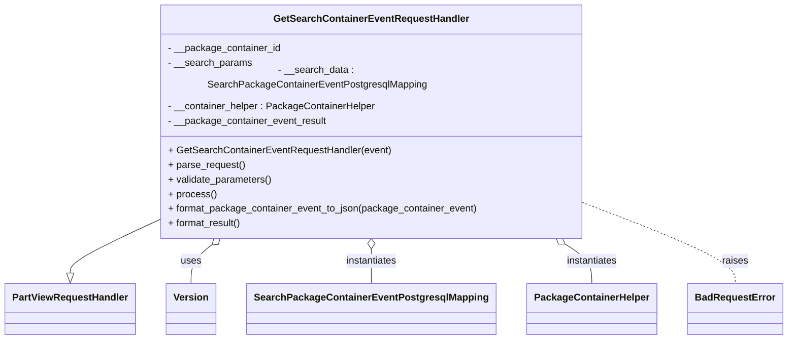
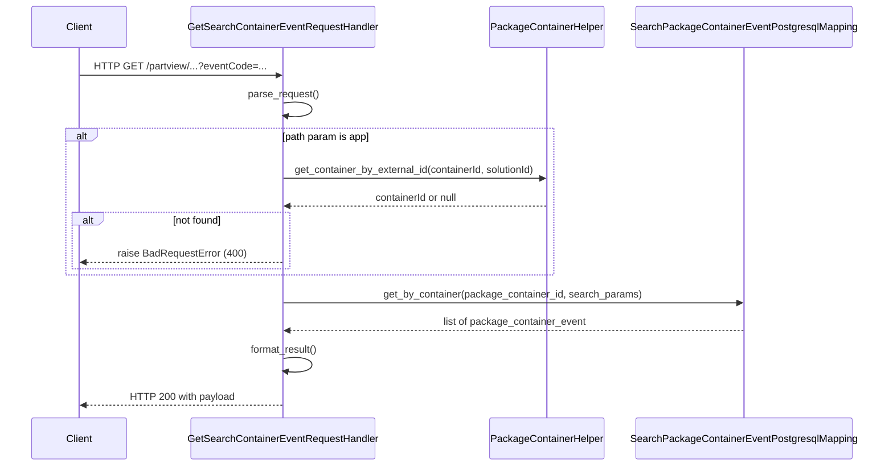

# Diagram: partview_core/partview_service/partview_service/api/package_container/event/handlers/get_search_container_event.py

> Auto-generated by Obscura crawlers

## Diagram 1

### SVG

<svg id="container" width="1239.359375" xmlns="http://www.w3.org/2000/svg" class="classDiagram" height="534" viewBox="0 0 1239.359375 534" role="graphics-document document" aria-roledescription="class"><g><defs><marker id="container_class-aggregationStart" class="marker aggregation class" refX="18" refY="7" markerWidth="190" markerHeight="240" orient="auto"><path d="M 18,7 L9,13 L1,7 L9,1 Z"></path></marker></defs><defs><marker id="container_class-aggregationEnd" class="marker aggregation class" refX="1" refY="7" markerWidth="20" markerHeight="28" orient="auto"><path d="M 18,7 L9,13 L1,7 L9,1 Z"></path></marker></defs><defs><marker id="container_class-extensionStart" class="marker extension class" refX="18" refY="7" markerWidth="190" markerHeight="240" orient="auto"><path d="M 1,7 L18,13 V 1 Z"></path></marker></defs><defs><marker id="container_class-extensionEnd" class="marker extension class" refX="1" refY="7" markerWidth="20" markerHeight="28" orient="auto"><path d="M 1,1 V 13 L18,7 Z"></path></marker></defs><defs><marker id="container_class-compositionStart" class="marker composition class" refX="18" refY="7" markerWidth="190" markerHeight="240" orient="auto"><path d="M 18,7 L9,13 L1,7 L9,1 Z"></path></marker></defs><defs><marker id="container_class-compositionEnd" class="marker composition class" refX="1" refY="7" markerWidth="20" markerHeight="28" orient="auto"><path d="M 18,7 L9,13 L1,7 L9,1 Z"></path></marker></defs><defs><marker id="container_class-dependencyStart" class="marker dependency class" refX="6" refY="7" markerWidth="190" markerHeight="240" orient="auto"><path d="M 5,7 L9,13 L1,7 L9,1 Z"></path></marker></defs><defs><marker id="container_class-dependencyEnd" class="marker dependency class" refX="13" refY="7" markerWidth="20" markerHeight="28" orient="auto"><path d="M 18,7 L9,13 L14,7 L9,1 Z"></path></marker></defs><defs><marker id="container_class-lollipopStart" class="marker lollipop class" refX="13" refY="7" markerWidth="190" markerHeight="240" orient="auto"><circle stroke="black" fill="transparent" cx="7" cy="7" r="6"></circle></marker></defs><defs><marker id="container_class-lollipopEnd" class="marker lollipop class" refX="1" refY="7" markerWidth="190" markerHeight="240" orient="auto"><circle stroke="black" fill="transparent" cx="7" cy="7" r="6"></circle></marker></defs><g class="root"><g class="clusters"></g><g class="edgePaths"><path d="M244.07,344.337L221.952,354.448C199.833,364.558,155.596,384.779,133.478,398.181C111.359,411.583,111.359,418.167,111.359,421.458L111.359,424.75" id="id_GetSearchContainerEventRequestHandler_PartViewRequestHandler_1" class="edge-thickness-normal edge-pattern-solid relation" style=";;;" data-edge="true" data-et="edge" data-id="id_GetSearchContainerEventRequestHandler_PartViewRequestHandler_1" data-points="W3sieCI6MjQ0LjA3MDMxMjUsInkiOjM0NC4zMzcxMzQ4NjM4MTk2NH0seyJ4IjoxMTEuMzU5Mzc1LCJ5Ijo0MDV9LHsieCI6MTExLjM1OTM3NSwieSI6NDQyfV0=" marker-end="url(#container_class-extensionEnd)"></path><path d="M338.438,378.518L332.701,382.932C326.964,387.345,315.49,396.173,309.753,406.753C304.016,417.333,304.016,429.667,304.016,435.833L304.016,442" id="id_GetSearchContainerEventRequestHandler_Version_2" class="edge-thickness-normal edge-pattern-solid relation" style=";;;" data-edge="true" data-et="edge" data-id="id_GetSearchContainerEventRequestHandler_Version_2" data-points="W3sieCI6MzUyLjExMDU2MzA3NjAzNjksInkiOjM2OH0seyJ4IjozMDQuMDE1NjI1LCJ5Ijo0MDV9LHsieCI6MzA0LjAxNTYyNSwieSI6NDQyfV0=" marker-start="url(#container_class-aggregationStart)"></path><path d="M586.086,385.25L586.086,388.542C586.086,391.833,586.086,398.417,586.086,407.875C586.086,417.333,586.086,429.667,586.086,435.833L586.086,442" id="id_GetSearchContainerEventRequestHandler_SearchPackageContainerEventPostgresqlMapping_3" class="edge-thickness-normal edge-pattern-solid relation" style=";;;" data-edge="true" data-et="edge" data-id="id_GetSearchContainerEventRequestHandler_SearchPackageContainerEventPostgresqlMapping_3" data-points="W3sieCI6NTg2LjA4NTkzNzUsInkiOjM2OH0seyJ4Ijo1ODYuMDg1OTM3NSwieSI6NDA1fSx7IngiOjU4Ni4wODU5Mzc1LCJ5Ijo0NDJ9XQ==" marker-start="url(#container_class-aggregationStart)"></path><path d="M886.646,377.189L894.01,381.824C901.373,386.459,916.101,395.73,923.464,406.532C930.828,417.333,930.828,429.667,930.828,435.833L930.828,442" id="id_GetSearchContainerEventRequestHandler_PackageContainerHelper_4" class="edge-thickness-normal edge-pattern-solid relation" style=";;;" data-edge="true" data-et="edge" data-id="id_GetSearchContainerEventRequestHandler_PackageContainerHelper_4" data-points="W3sieCI6ODcyLjA0NzE5OTAyMDczNzMsInkiOjM2OH0seyJ4Ijo5MzAuODI4MTI1LCJ5Ijo0MDV9LHsieCI6OTMwLjgyODEyNSwieSI6NDQyfV0=" marker-start="url(#container_class-aggregationStart)"></path><path d="M928.102,317.98L966.264,332.483C1004.427,346.986,1080.753,375.993,1118.915,396.663C1157.078,417.333,1157.078,429.667,1157.078,435.833L1157.078,442" id="id_GetSearchContainerEventRequestHandler_BadRequestError_5" class="edge-thickness-normal edge-pattern-dashed relation" style=";;;" data-edge="true" data-et="edge" data-id="id_GetSearchContainerEventRequestHandler_BadRequestError_5" data-points="W3sieCI6OTI4LjEwMTU2MjUsInkiOjMxNy45Nzk2OTU0MzE0NzIxfSx7IngiOjExNTcuMDc4MTI1LCJ5Ijo0MDV9LHsieCI6MTE1Ny4wNzgxMjUsInkiOjQ0Mn1d"></path></g><g class="edgeLabels"><g class="edgeLabel"><g class="label" data-id="id_GetSearchContainerEventRequestHandler_PartViewRequestHandler_1" transform="translate(0, 0)"><foreignObject width="0" height="0">

</foreignObject></g></g><g class="edgeLabel" transform="translate(304.015625, 405)"><g class="label" data-id="id_GetSearchContainerEventRequestHandler_Version_2" transform="translate(-16.4921875, -12)"><foreignObject width="32.984375" height="24">

uses

</foreignObject></g></g><g class="edgeLabel" transform="translate(586.0859375, 405)"><g class="label" data-id="id_GetSearchContainerEventRequestHandler_SearchPackageContainerEventPostgresqlMapping_3" transform="translate(-42.9140625, -12)"><foreignObject width="85.828125" height="24">

instantiates

</foreignObject></g></g><g class="edgeLabel" transform="translate(930.828125, 405)"><g class="label" data-id="id_GetSearchContainerEventRequestHandler_PackageContainerHelper_4" transform="translate(-42.9140625, -12)"><foreignObject width="85.828125" height="24">

instantiates

</foreignObject></g></g><g class="edgeLabel" transform="translate(1157.078125, 405)"><g class="label" data-id="id_GetSearchContainerEventRequestHandler_BadRequestError_5" transform="translate(-21.25, -12)"><foreignObject width="42.5" height="24">

raises

</foreignObject></g></g></g><g class="nodes"><g class="node default" id="classId-GetSearchContainerEventRequestHandler-0" transform="translate(586.0859375, 188)"><g class="basic label-container"><path d="M-342.015625 -180 L342.015625 -180 L342.015625 180 L-342.015625 180" stroke="none" stroke-width="0" fill="#ECECFF" style=""></path><path d="M-342.015625 -180 C-177.2843047810727 -180, -12.552984562145411 -180, 342.015625 -180 M-342.015625 -180 C-120.56962271073954 -180, 100.87637957852093 -180, 342.015625 -180 M342.015625 -180 C342.015625 -44.437919539829835, 342.015625 91.12416092034033, 342.015625 180 M342.015625 -180 C342.015625 -82.70819134136848, 342.015625 14.583617317263048, 342.015625 180 M342.015625 180 C126.68509738087104 180, -88.64543023825792 180, -342.015625 180 M342.015625 180 C170.6561704912614 180, -0.7032840174771877 180, -342.015625 180 M-342.015625 180 C-342.015625 45.07248319884667, -342.015625 -89.85503360230666, -342.015625 -180 M-342.015625 180 C-342.015625 79.41544705507005, -342.015625 -21.169105889859907, -342.015625 -180" stroke="#9370DB" stroke-width="1.3" fill="none" stroke-dasharray="0 0" style=""></path></g><g class="annotation-group text" transform="translate(0, -156)"></g><g class="label-group text" transform="translate(-152.25, -156)"><g class="label" style="font-weight: bolder" transform="translate(0,-12)"><foreignObject width="304.5" height="24">

GetSearchContainerEventRequestHandler

</foreignObject></g></g><g class="members-group text" transform="translate(-330.015625, -108)"><g class="label" style="" transform="translate(0,-12)"><foreignObject width="184.15625" height="24">

- __package_container_id

</foreignObject></g><g class="label" style="" transform="translate(0,12)"><foreignObject width="136.5" height="24">

- __search_params

</foreignObject></g><g class="label" style="" transform="translate(0,36)"><foreignObject width="482.78125" height="24">

- __search_data : SearchPackageContainerEventPostgresqlMapping

</foreignObject></g><g class="label" style="" transform="translate(0,60)"><foreignObject width="339.84375" height="24">

- __container_helper : PackageContainerHelper

</foreignObject></g><g class="label" style="" transform="translate(0,84)"><foreignObject width="260.078125" height="24">

- __package_container_event_result

</foreignObject></g></g><g class="methods-group text" transform="translate(-330.015625, 36)"><g class="label" style="" transform="translate(0,-12)"><foreignObject width="363.703125" height="24">

+ GetSearchContainerEventRequestHandler(event)

</foreignObject></g><g class="label" style="" transform="translate(0,12)"><foreignObject width="126.046875" height="24">

+ parse_request()

</foreignObject></g><g class="label" style="" transform="translate(0,36)"><foreignObject width="170.953125" height="24">

+ validate_parameters()

</foreignObject></g><g class="label" style="" transform="translate(0,60)"><foreignObject width="77.96875" height="24">

+ process()

</foreignObject></g><g class="label" style="" transform="translate(0,84)"><foreignObject width="507.78125" height="24">

+ format_package_container_event_to_json(package_container_event)

</foreignObject></g><g class="label" style="" transform="translate(0,108)"><foreignObject width="121.5" height="24">

+ format_result()

</foreignObject></g></g><g class="divider" style=""><path d="M-342.015625 -132 C-179.78808911916073 -132, -17.56055323832146 -132, 342.015625 -132 M-342.015625 -132 C-93.20713076542353 -132, 155.60136346915294 -132, 342.015625 -132" stroke="#9370DB" stroke-width="1.3" fill="none" stroke-dasharray="0 0" style=""></path></g><g class="divider" style=""><path d="M-342.015625 12 C-105.47040464446616 12, 131.07481571106769 12, 342.015625 12 M-342.015625 12 C-125.47643515045976 12, 91.06275469908047 12, 342.015625 12" stroke="#9370DB" stroke-width="1.3" fill="none" stroke-dasharray="0 0" style=""></path></g></g><g class="node default" id="classId-PartViewRequestHandler-1" transform="translate(111.359375, 484)"><g class="basic label-container"><path d="M-103.359375 -42 L103.359375 -42 L103.359375 42 L-103.359375 42" stroke="none" stroke-width="0" fill="#ECECFF" style=""></path><path d="M-103.359375 -42 C-24.912348508109716 -42, 53.53467798378057 -42, 103.359375 -42 M-103.359375 -42 C-36.72932166480834 -42, 29.900731670383323 -42, 103.359375 -42 M103.359375 -42 C103.359375 -16.97285883125792, 103.359375 8.05428233748416, 103.359375 42 M103.359375 -42 C103.359375 -19.50261443426418, 103.359375 2.994771131471637, 103.359375 42 M103.359375 42 C29.510071990999407 42, -44.339231018001186 42, -103.359375 42 M103.359375 42 C56.97032744143606 42, 10.581279882872124 42, -103.359375 42 M-103.359375 42 C-103.359375 21.855170691296784, -103.359375 1.710341382593569, -103.359375 -42 M-103.359375 42 C-103.359375 18.16051482764395, -103.359375 -5.6789703447120985, -103.359375 -42" stroke="#9370DB" stroke-width="1.3" fill="none" stroke-dasharray="0 0" style=""></path></g><g class="annotation-group text" transform="translate(0, -18)"></g><g class="label-group text" transform="translate(-91.359375, -18)"><g class="label" style="font-weight: bolder" transform="translate(0,-12)"><foreignObject width="182.71875" height="24">

PartViewRequestHandler

</foreignObject></g></g><g class="members-group text" transform="translate(-91.359375, 30)"></g><g class="methods-group text" transform="translate(-91.359375, 60)"></g><g class="divider" style=""><path d="M-103.359375 6 C-52.17251419038366 6, -0.9856533807673173 6, 103.359375 6 M-103.359375 6 C-59.18267536261271 6, -15.005975725225426 6, 103.359375 6" stroke="#9370DB" stroke-width="1.3" fill="none" stroke-dasharray="0 0" style=""></path></g><g class="divider" style=""><path d="M-103.359375 24 C-42.547984948551736 24, 18.263405102896527 24, 103.359375 24 M-103.359375 24 C-29.913871235930145 24, 43.53163252813971 24, 103.359375 24" stroke="#9370DB" stroke-width="1.3" fill="none" stroke-dasharray="0 0" style=""></path></g></g><g class="node default" id="classId-Version-2" transform="translate(304.015625, 484)"><g class="basic label-container"><path d="M-39.296875 -42 L39.296875 -42 L39.296875 42 L-39.296875 42" stroke="none" stroke-width="0" fill="#ECECFF" style=""></path><path d="M-39.296875 -42 C-10.338567655067582 -42, 18.619739689864836 -42, 39.296875 -42 M-39.296875 -42 C-15.059368685654356 -42, 9.178137628691289 -42, 39.296875 -42 M39.296875 -42 C39.296875 -15.84671487470094, 39.296875 10.30657025059812, 39.296875 42 M39.296875 -42 C39.296875 -18.776519435452403, 39.296875 4.446961129095193, 39.296875 42 M39.296875 42 C21.8791219729079 42, 4.461368945815799 42, -39.296875 42 M39.296875 42 C16.808413585981143 42, -5.680047828037715 42, -39.296875 42 M-39.296875 42 C-39.296875 15.585365200307287, -39.296875 -10.829269599385427, -39.296875 -42 M-39.296875 42 C-39.296875 18.08566003839671, -39.296875 -5.828679923206579, -39.296875 -42" stroke="#9370DB" stroke-width="1.3" fill="none" stroke-dasharray="0 0" style=""></path></g><g class="annotation-group text" transform="translate(0, -18)"></g><g class="label-group text" transform="translate(-27.296875, -18)"><g class="label" style="font-weight: bolder" transform="translate(0,-12)"><foreignObject width="54.59375" height="24">

Version

</foreignObject></g></g><g class="members-group text" transform="translate(-27.296875, 30)"></g><g class="methods-group text" transform="translate(-27.296875, 60)"></g><g class="divider" style=""><path d="M-39.296875 6 C-22.207490068562254 6, -5.118105137124509 6, 39.296875 6 M-39.296875 6 C-12.422861809236643 6, 14.451151381526714 6, 39.296875 6" stroke="#9370DB" stroke-width="1.3" fill="none" stroke-dasharray="0 0" style=""></path></g><g class="divider" style=""><path d="M-39.296875 24 C-12.78341508940283 24, 13.73004482119434 24, 39.296875 24 M-39.296875 24 C-13.591705594970215 24, 12.11346381005957 24, 39.296875 24" stroke="#9370DB" stroke-width="1.3" fill="none" stroke-dasharray="0 0" style=""></path></g></g><g class="node default" id="classId-SearchPackageContainerEventPostgresqlMapping-3" transform="translate(586.0859375, 484)"><g class="basic label-container"><path d="M-192.7734375 -42 L192.7734375 -42 L192.7734375 42 L-192.7734375 42" stroke="none" stroke-width="0" fill="#ECECFF" style=""></path><path d="M-192.7734375 -42 C-115.56891127039424 -42, -38.36438504078848 -42, 192.7734375 -42 M-192.7734375 -42 C-110.16974060415477 -42, -27.566043708309536 -42, 192.7734375 -42 M192.7734375 -42 C192.7734375 -18.86238640220553, 192.7734375 4.27522719558894, 192.7734375 42 M192.7734375 -42 C192.7734375 -23.916255744088964, 192.7734375 -5.8325114881779285, 192.7734375 42 M192.7734375 42 C74.96096842149406 42, -42.85150065701188 42, -192.7734375 42 M192.7734375 42 C44.65538631658336 42, -103.46266486683328 42, -192.7734375 42 M-192.7734375 42 C-192.7734375 18.578920778509215, -192.7734375 -4.842158442981571, -192.7734375 -42 M-192.7734375 42 C-192.7734375 15.91040331426846, -192.7734375 -10.179193371463079, -192.7734375 -42" stroke="#9370DB" stroke-width="1.3" fill="none" stroke-dasharray="0 0" style=""></path></g><g class="annotation-group text" transform="translate(0, -18)"></g><g class="label-group text" transform="translate(-180.7734375, -18)"><g class="label" style="font-weight: bolder" transform="translate(0,-12)"><foreignObject width="361.546875" height="24">

SearchPackageContainerEventPostgresqlMapping

</foreignObject></g></g><g class="members-group text" transform="translate(-180.7734375, 30)"></g><g class="methods-group text" transform="translate(-180.7734375, 60)"></g><g class="divider" style=""><path d="M-192.7734375 6 C-51.840182763021716 6, 89.09307197395657 6, 192.7734375 6 M-192.7734375 6 C-84.56528899782538 6, 23.642859504349246 6, 192.7734375 6" stroke="#9370DB" stroke-width="1.3" fill="none" stroke-dasharray="0 0" style=""></path></g><g class="divider" style=""><path d="M-192.7734375 24 C-60.47784226556229 24, 71.81775296887542 24, 192.7734375 24 M-192.7734375 24 C-60.64728275254646 24, 71.47887199490708 24, 192.7734375 24" stroke="#9370DB" stroke-width="1.3" fill="none" stroke-dasharray="0 0" style=""></path></g></g><g class="node default" id="classId-PackageContainerHelper-4" transform="translate(930.828125, 484)"><g class="basic label-container"><path d="M-101.96875 -42 L101.96875 -42 L101.96875 42 L-101.96875 42" stroke="none" stroke-width="0" fill="#ECECFF" style=""></path><path d="M-101.96875 -42 C-39.42218569608404 -42, 23.124378607831915 -42, 101.96875 -42 M-101.96875 -42 C-33.12019621395747 -42, 35.72835757208506 -42, 101.96875 -42 M101.96875 -42 C101.96875 -10.57663523314789, 101.96875 20.84672953370422, 101.96875 42 M101.96875 -42 C101.96875 -8.621482926532046, 101.96875 24.757034146935908, 101.96875 42 M101.96875 42 C36.20051478211762 42, -29.567720435764755 42, -101.96875 42 M101.96875 42 C54.4049622675043 42, 6.841174535008605 42, -101.96875 42 M-101.96875 42 C-101.96875 9.956611269035307, -101.96875 -22.086777461929387, -101.96875 -42 M-101.96875 42 C-101.96875 19.34842389319688, -101.96875 -3.3031522136062392, -101.96875 -42" stroke="#9370DB" stroke-width="1.3" fill="none" stroke-dasharray="0 0" style=""></path></g><g class="annotation-group text" transform="translate(0, -18)"></g><g class="label-group text" transform="translate(-89.96875, -18)"><g class="label" style="font-weight: bolder" transform="translate(0,-12)"><foreignObject width="179.9375" height="24">

PackageContainerHelper

</foreignObject></g></g><g class="members-group text" transform="translate(-89.96875, 30)"></g><g class="methods-group text" transform="translate(-89.96875, 60)"></g><g class="divider" style=""><path d="M-101.96875 6 C-33.84311433095725 6, 34.2825213380855 6, 101.96875 6 M-101.96875 6 C-58.5787368838281 6, -15.1887237676562 6, 101.96875 6" stroke="#9370DB" stroke-width="1.3" fill="none" stroke-dasharray="0 0" style=""></path></g><g class="divider" style=""><path d="M-101.96875 24 C-49.3099411041495 24, 3.3488677917009966 24, 101.96875 24 M-101.96875 24 C-54.96730079207721 24, -7.9658515841544215 24, 101.96875 24" stroke="#9370DB" stroke-width="1.3" fill="none" stroke-dasharray="0 0" style=""></path></g></g><g class="node default" id="classId-BadRequestError-5" transform="translate(1157.078125, 484)"><g class="basic label-container"><path d="M-74.28125 -42 L74.28125 -42 L74.28125 42 L-74.28125 42" stroke="none" stroke-width="0" fill="#ECECFF" style=""></path><path d="M-74.28125 -42 C-19.736229522731364 -42, 34.80879095453727 -42, 74.28125 -42 M-74.28125 -42 C-41.26711452821492 -42, -8.252979056429837 -42, 74.28125 -42 M74.28125 -42 C74.28125 -16.351781325406918, 74.28125 9.296437349186164, 74.28125 42 M74.28125 -42 C74.28125 -24.709675072725474, 74.28125 -7.419350145450949, 74.28125 42 M74.28125 42 C26.721119096751906 42, -20.83901180649619 42, -74.28125 42 M74.28125 42 C33.84732113069534 42, -6.586607738609317 42, -74.28125 42 M-74.28125 42 C-74.28125 24.408396974121253, -74.28125 6.8167939482425055, -74.28125 -42 M-74.28125 42 C-74.28125 24.354801789346524, -74.28125 6.709603578693049, -74.28125 -42" stroke="#9370DB" stroke-width="1.3" fill="none" stroke-dasharray="0 0" style=""></path></g><g class="annotation-group text" transform="translate(0, -18)"></g><g class="label-group text" transform="translate(-62.28125, -18)"><g class="label" style="font-weight: bolder" transform="translate(0,-12)"><foreignObject width="124.5625" height="24">

BadRequestError

</foreignObject></g></g><g class="members-group text" transform="translate(-62.28125, 30)"></g><g class="methods-group text" transform="translate(-62.28125, 60)"></g><g class="divider" style=""><path d="M-74.28125 6 C-28.8446113399352 6, 16.592027320129603 6, 74.28125 6 M-74.28125 6 C-43.82261577955478 6, -13.363981559109561 6, 74.28125 6" stroke="#9370DB" stroke-width="1.3" fill="none" stroke-dasharray="0 0" style=""></path></g><g class="divider" style=""><path d="M-74.28125 24 C-37.86870131401315 24, -1.4561526280263024 24, 74.28125 24 M-74.28125 24 C-38.98368968468801 24, -3.686129369376019 24, 74.28125 24" stroke="#9370DB" stroke-width="1.3" fill="none" stroke-dasharray="0 0" style=""></path></g></g></g></g></g></svg>

## Diagram 2

### SVG

<svg id="container" width="1492" xmlns="http://www.w3.org/2000/svg" height="773" viewBox="-50 -10 1492 773" role="graphics-document document" aria-roledescription="sequence"><g><rect x="1016" y="687" fill="#eaeaea" stroke="#666" width="376" height="65" name="SearchData" rx="3" ry="3" class="actor actor-bottom"></rect><text x="1204" y="719.5" dominant-baseline="central" alignment-baseline="central" class="actor actor-box" style="text-anchor: middle; font-size: 16px; font-weight: 400;"><tspan x="1204" dy="0">SearchPackageContainerEventPostgresqlMapping</tspan></text></g><g><rect x="768" y="687" fill="#eaeaea" stroke="#666" width="198" height="65" name="Helper" rx="3" ry="3" class="actor actor-bottom"></rect><text x="867" y="719.5" dominant-baseline="central" alignment-baseline="central" class="actor actor-box" style="text-anchor: middle; font-size: 16px; font-weight: 400;"><tspan x="867" dy="0">PackageContainerHelper</tspan></text></g><g><rect x="247" y="687" fill="#eaeaea" stroke="#666" width="322" height="65" name="Handler" rx="3" ry="3" class="actor actor-bottom"></rect><text x="408" y="719.5" dominant-baseline="central" alignment-baseline="central" class="actor actor-box" style="text-anchor: middle; font-size: 16px; font-weight: 400;"><tspan x="408" dy="0">GetSearchContainerEventRequestHandler</tspan></text></g><g><rect x="0" y="687" fill="#eaeaea" stroke="#666" width="150" height="65" name="Client" rx="3" ry="3" class="actor actor-bottom"></rect><text x="75" y="719.5" dominant-baseline="central" alignment-baseline="central" class="actor actor-box" style="text-anchor: middle; font-size: 16px; font-weight: 400;"><tspan x="75" dy="0">Client</tspan></text></g><g><line id="actor3" x1="1204" y1="65" x2="1204" y2="687" class="actor-line 200" stroke-width="0.5px" stroke="#999" name="SearchData"></line><g id="root-3"><rect x="1016" y="0" fill="#eaeaea" stroke="#666" width="376" height="65" name="SearchData" rx="3" ry="3" class="actor actor-top"></rect><text x="1204" y="32.5" dominant-baseline="central" alignment-baseline="central" class="actor actor-box" style="text-anchor: middle; font-size: 16px; font-weight: 400;"><tspan x="1204" dy="0">SearchPackageContainerEventPostgresqlMapping</tspan></text></g></g><g><line id="actor2" x1="867" y1="65" x2="867" y2="687" class="actor-line 200" stroke-width="0.5px" stroke="#999" name="Helper"></line><g id="root-2"><rect x="768" y="0" fill="#eaeaea" stroke="#666" width="198" height="65" name="Helper" rx="3" ry="3" class="actor actor-top"></rect><text x="867" y="32.5" dominant-baseline="central" alignment-baseline="central" class="actor actor-box" style="text-anchor: middle; font-size: 16px; font-weight: 400;"><tspan x="867" dy="0">PackageContainerHelper</tspan></text></g></g><g><line id="actor1" x1="408" y1="65" x2="408" y2="687" class="actor-line 200" stroke-width="0.5px" stroke="#999" name="Handler"></line><g id="root-1"><rect x="247" y="0" fill="#eaeaea" stroke="#666" width="322" height="65" name="Handler" rx="3" ry="3" class="actor actor-top"></rect><text x="408" y="32.5" dominant-baseline="central" alignment-baseline="central" class="actor actor-box" style="text-anchor: middle; font-size: 16px; font-weight: 400;"><tspan x="408" dy="0">GetSearchContainerEventRequestHandler</tspan></text></g></g><g><line id="actor0" x1="75" y1="65" x2="75" y2="687" class="actor-line 200" stroke-width="0.5px" stroke="#999" name="Client"></line><g id="root-0"><rect x="0" y="0" fill="#eaeaea" stroke="#666" width="150" height="65" name="Client" rx="3" ry="3" class="actor actor-top"></rect><text x="75" y="32.5" dominant-baseline="central" alignment-baseline="central" class="actor actor-box" style="text-anchor: middle; font-size: 16px; font-weight: 400;"><tspan x="75" dy="0">Client</tspan></text></g></g><g></g><defs><symbol id="computer" width="24" height="24"><path transform="scale(.5)" d="M2 2v13h20v-13h-20zm18 11h-16v-9h16v9zm-10.228 6l.466-1h3.524l.467 1h-4.457zm14.228 3h-24l2-6h2.104l-1.33 4h18.45l-1.297-4h2.073l2 6zm-5-10h-14v-7h14v7z"></path></symbol></defs><defs><symbol id="database" fill-rule="evenodd" clip-rule="evenodd"><path transform="scale(.5)" d="M12.258.001l.256.004.255.005.253.008.251.01.249.012.247.015.246.016.242.019.241.02.239.023.236.024.233.027.231.028.229.031.225.032.223.034.22.036.217.038.214.04.211.041.208.043.205.045.201.046.198.048.194.05.191.051.187.053.183.054.18.056.175.057.172.059.168.06.163.061.16.063.155.064.15.066.074.033.073.033.071.034.07.034.069.035.068.035.067.035.066.035.064.036.064.036.062.036.06.036.06.037.058.037.058.037.055.038.055.038.053.038.052.038.051.039.05.039.048.039.047.039.045.04.044.04.043.04.041.04.04.041.039.041.037.041.036.041.034.041.033.042.032.042.03.042.029.042.027.042.026.043.024.043.023.043.021.043.02.043.018.044.017.043.015.044.013.044.012.044.011.045.009.044.007.045.006.045.004.045.002.045.001.045v17l-.001.045-.002.045-.004.045-.006.045-.007.045-.009.044-.011.045-.012.044-.013.044-.015.044-.017.043-.018.044-.02.043-.021.043-.023.043-.024.043-.026.043-.027.042-.029.042-.03.042-.032.042-.033.042-.034.041-.036.041-.037.041-.039.041-.04.041-.041.04-.043.04-.044.04-.045.04-.047.039-.048.039-.05.039-.051.039-.052.038-.053.038-.055.038-.055.038-.058.037-.058.037-.06.037-.06.036-.062.036-.064.036-.064.036-.066.035-.067.035-.068.035-.069.035-.07.034-.071.034-.073.033-.074.033-.15.066-.155.064-.16.063-.163.061-.168.06-.172.059-.175.057-.18.056-.183.054-.187.053-.191.051-.194.05-.198.048-.201.046-.205.045-.208.043-.211.041-.214.04-.217.038-.22.036-.223.034-.225.032-.229.031-.231.028-.233.027-.236.024-.239.023-.241.02-.242.019-.246.016-.247.015-.249.012-.251.01-.253.008-.255.005-.256.004-.258.001-.258-.001-.256-.004-.255-.005-.253-.008-.251-.01-.249-.012-.247-.015-.245-.016-.243-.019-.241-.02-.238-.023-.236-.024-.234-.027-.231-.028-.228-.031-.226-.032-.223-.034-.22-.036-.217-.038-.214-.04-.211-.041-.208-.043-.204-.045-.201-.046-.198-.048-.195-.05-.19-.051-.187-.053-.184-.054-.179-.056-.176-.057-.172-.059-.167-.06-.164-.061-.159-.063-.155-.064-.151-.066-.074-.033-.072-.033-.072-.034-.07-.034-.069-.035-.068-.035-.067-.035-.066-.035-.064-.036-.063-.036-.062-.036-.061-.036-.06-.037-.058-.037-.057-.037-.056-.038-.055-.038-.053-.038-.052-.038-.051-.039-.049-.039-.049-.039-.046-.039-.046-.04-.044-.04-.043-.04-.041-.04-.04-.041-.039-.041-.037-.041-.036-.041-.034-.041-.033-.042-.032-.042-.03-.042-.029-.042-.027-.042-.026-.043-.024-.043-.023-.043-.021-.043-.02-.043-.018-.044-.017-.043-.015-.044-.013-.044-.012-.044-.011-.045-.009-.044-.007-.045-.006-.045-.004-.045-.002-.045-.001-.045v-17l.001-.045.002-.045.004-.045.006-.045.007-.045.009-.044.011-.045.012-.044.013-.044.015-.044.017-.043.018-.044.02-.043.021-.043.023-.043.024-.043.026-.043.027-.042.029-.042.03-.042.032-.042.033-.042.034-.041.036-.041.037-.041.039-.041.04-.041.041-.04.043-.04.044-.04.046-.04.046-.039.049-.039.049-.039.051-.039.052-.038.053-.038.055-.038.056-.038.057-.037.058-.037.06-.037.061-.036.062-.036.063-.036.064-.036.066-.035.067-.035.068-.035.069-.035.07-.034.072-.034.072-.033.074-.033.151-.066.155-.064.159-.063.164-.061.167-.06.172-.059.176-.057.179-.056.184-.054.187-.053.19-.051.195-.05.198-.048.201-.046.204-.045.208-.043.211-.041.214-.04.217-.038.22-.036.223-.034.226-.032.228-.031.231-.028.234-.027.236-.024.238-.023.241-.02.243-.019.245-.016.247-.015.249-.012.251-.01.253-.008.255-.005.256-.004.258-.001.258.001zm-9.258 20.499v.01l.001.021.003.021.004.022.005.021.006.022.007.022.009.023.01.022.011.023.012.023.013.023.015.023.016.024.017.023.018.024.019.024.021.024.022.025.023.024.024.025.052.049.056.05.061.051.066.051.07.051.075.051.079.052.084.052.088.052.092.052.097.052.102.051.105.052.11.052.114.051.119.051.123.051.127.05.131.05.135.05.139.048.144.049.147.047.152.047.155.047.16.045.163.045.167.043.171.043.176.041.178.041.183.039.187.039.19.037.194.035.197.035.202.033.204.031.209.03.212.029.216.027.219.025.222.024.226.021.23.02.233.018.236.016.24.015.243.012.246.01.249.008.253.005.256.004.259.001.26-.001.257-.004.254-.005.25-.008.247-.011.244-.012.241-.014.237-.016.233-.018.231-.021.226-.021.224-.024.22-.026.216-.027.212-.028.21-.031.205-.031.202-.034.198-.034.194-.036.191-.037.187-.039.183-.04.179-.04.175-.042.172-.043.168-.044.163-.045.16-.046.155-.046.152-.047.148-.048.143-.049.139-.049.136-.05.131-.05.126-.05.123-.051.118-.052.114-.051.11-.052.106-.052.101-.052.096-.052.092-.052.088-.053.083-.051.079-.052.074-.052.07-.051.065-.051.06-.051.056-.05.051-.05.023-.024.023-.025.021-.024.02-.024.019-.024.018-.024.017-.024.015-.023.014-.024.013-.023.012-.023.01-.023.01-.022.008-.022.006-.022.006-.022.004-.022.004-.021.001-.021.001-.021v-4.127l-.077.055-.08.053-.083.054-.085.053-.087.052-.09.052-.093.051-.095.05-.097.05-.1.049-.102.049-.105.048-.106.047-.109.047-.111.046-.114.045-.115.045-.118.044-.12.043-.122.042-.124.042-.126.041-.128.04-.13.04-.132.038-.134.038-.135.037-.138.037-.139.035-.142.035-.143.034-.144.033-.147.032-.148.031-.15.03-.151.03-.153.029-.154.027-.156.027-.158.026-.159.025-.161.024-.162.023-.163.022-.165.021-.166.02-.167.019-.169.018-.169.017-.171.016-.173.015-.173.014-.175.013-.175.012-.177.011-.178.01-.179.008-.179.008-.181.006-.182.005-.182.004-.184.003-.184.002h-.37l-.184-.002-.184-.003-.182-.004-.182-.005-.181-.006-.179-.008-.179-.008-.178-.01-.176-.011-.176-.012-.175-.013-.173-.014-.172-.015-.171-.016-.17-.017-.169-.018-.167-.019-.166-.02-.165-.021-.163-.022-.162-.023-.161-.024-.159-.025-.157-.026-.156-.027-.155-.027-.153-.029-.151-.03-.15-.03-.148-.031-.146-.032-.145-.033-.143-.034-.141-.035-.14-.035-.137-.037-.136-.037-.134-.038-.132-.038-.13-.04-.128-.04-.126-.041-.124-.042-.122-.042-.12-.044-.117-.043-.116-.045-.113-.045-.112-.046-.109-.047-.106-.047-.105-.048-.102-.049-.1-.049-.097-.05-.095-.05-.093-.052-.09-.051-.087-.052-.085-.053-.083-.054-.08-.054-.077-.054v4.127zm0-5.654v.011l.001.021.003.021.004.021.005.022.006.022.007.022.009.022.01.022.011.023.012.023.013.023.015.024.016.023.017.024.018.024.019.024.021.024.022.024.023.025.024.024.052.05.056.05.061.05.066.051.07.051.075.052.079.051.084.052.088.052.092.052.097.052.102.052.105.052.11.051.114.051.119.052.123.05.127.051.131.05.135.049.139.049.144.048.147.048.152.047.155.046.16.045.163.045.167.044.171.042.176.042.178.04.183.04.187.038.19.037.194.036.197.034.202.033.204.032.209.03.212.028.216.027.219.025.222.024.226.022.23.02.233.018.236.016.24.014.243.012.246.01.249.008.253.006.256.003.259.001.26-.001.257-.003.254-.006.25-.008.247-.01.244-.012.241-.015.237-.016.233-.018.231-.02.226-.022.224-.024.22-.025.216-.027.212-.029.21-.03.205-.032.202-.033.198-.035.194-.036.191-.037.187-.039.183-.039.179-.041.175-.042.172-.043.168-.044.163-.045.16-.045.155-.047.152-.047.148-.048.143-.048.139-.05.136-.049.131-.05.126-.051.123-.051.118-.051.114-.052.11-.052.106-.052.101-.052.096-.052.092-.052.088-.052.083-.052.079-.052.074-.051.07-.052.065-.051.06-.05.056-.051.051-.049.023-.025.023-.024.021-.025.02-.024.019-.024.018-.024.017-.024.015-.023.014-.023.013-.024.012-.022.01-.023.01-.023.008-.022.006-.022.006-.022.004-.021.004-.022.001-.021.001-.021v-4.139l-.077.054-.08.054-.083.054-.085.052-.087.053-.09.051-.093.051-.095.051-.097.05-.1.049-.102.049-.105.048-.106.047-.109.047-.111.046-.114.045-.115.044-.118.044-.12.044-.122.042-.124.042-.126.041-.128.04-.13.039-.132.039-.134.038-.135.037-.138.036-.139.036-.142.035-.143.033-.144.033-.147.033-.148.031-.15.03-.151.03-.153.028-.154.028-.156.027-.158.026-.159.025-.161.024-.162.023-.163.022-.165.021-.166.02-.167.019-.169.018-.169.017-.171.016-.173.015-.173.014-.175.013-.175.012-.177.011-.178.009-.179.009-.179.007-.181.007-.182.005-.182.004-.184.003-.184.002h-.37l-.184-.002-.184-.003-.182-.004-.182-.005-.181-.007-.179-.007-.179-.009-.178-.009-.176-.011-.176-.012-.175-.013-.173-.014-.172-.015-.171-.016-.17-.017-.169-.018-.167-.019-.166-.02-.165-.021-.163-.022-.162-.023-.161-.024-.159-.025-.157-.026-.156-.027-.155-.028-.153-.028-.151-.03-.15-.03-.148-.031-.146-.033-.145-.033-.143-.033-.141-.035-.14-.036-.137-.036-.136-.037-.134-.038-.132-.039-.13-.039-.128-.04-.126-.041-.124-.042-.122-.043-.12-.043-.117-.044-.116-.044-.113-.046-.112-.046-.109-.046-.106-.047-.105-.048-.102-.049-.1-.049-.097-.05-.095-.051-.093-.051-.09-.051-.087-.053-.085-.052-.083-.054-.08-.054-.077-.054v4.139zm0-5.666v.011l.001.02.003.022.004.021.005.022.006.021.007.022.009.023.01.022.011.023.012.023.013.023.015.023.016.024.017.024.018.023.019.024.021.025.022.024.023.024.024.025.052.05.056.05.061.05.066.051.07.051.075.052.079.051.084.052.088.052.092.052.097.052.102.052.105.051.11.052.114.051.119.051.123.051.127.05.131.05.135.05.139.049.144.048.147.048.152.047.155.046.16.045.163.045.167.043.171.043.176.042.178.04.183.04.187.038.19.037.194.036.197.034.202.033.204.032.209.03.212.028.216.027.219.025.222.024.226.021.23.02.233.018.236.017.24.014.243.012.246.01.249.008.253.006.256.003.259.001.26-.001.257-.003.254-.006.25-.008.247-.01.244-.013.241-.014.237-.016.233-.018.231-.02.226-.022.224-.024.22-.025.216-.027.212-.029.21-.03.205-.032.202-.033.198-.035.194-.036.191-.037.187-.039.183-.039.179-.041.175-.042.172-.043.168-.044.163-.045.16-.045.155-.047.152-.047.148-.048.143-.049.139-.049.136-.049.131-.051.126-.05.123-.051.118-.052.114-.051.11-.052.106-.052.101-.052.096-.052.092-.052.088-.052.083-.052.079-.052.074-.052.07-.051.065-.051.06-.051.056-.05.051-.049.023-.025.023-.025.021-.024.02-.024.019-.024.018-.024.017-.024.015-.023.014-.024.013-.023.012-.023.01-.022.01-.023.008-.022.006-.022.006-.022.004-.022.004-.021.001-.021.001-.021v-4.153l-.077.054-.08.054-.083.053-.085.053-.087.053-.09.051-.093.051-.095.051-.097.05-.1.049-.102.048-.105.048-.106.048-.109.046-.111.046-.114.046-.115.044-.118.044-.12.043-.122.043-.124.042-.126.041-.128.04-.13.039-.132.039-.134.038-.135.037-.138.036-.139.036-.142.034-.143.034-.144.033-.147.032-.148.032-.15.03-.151.03-.153.028-.154.028-.156.027-.158.026-.159.024-.161.024-.162.023-.163.023-.165.021-.166.02-.167.019-.169.018-.169.017-.171.016-.173.015-.173.014-.175.013-.175.012-.177.01-.178.01-.179.009-.179.007-.181.006-.182.006-.182.004-.184.003-.184.001-.185.001-.185-.001-.184-.001-.184-.003-.182-.004-.182-.006-.181-.006-.179-.007-.179-.009-.178-.01-.176-.01-.176-.012-.175-.013-.173-.014-.172-.015-.171-.016-.17-.017-.169-.018-.167-.019-.166-.02-.165-.021-.163-.023-.162-.023-.161-.024-.159-.024-.157-.026-.156-.027-.155-.028-.153-.028-.151-.03-.15-.03-.148-.032-.146-.032-.145-.033-.143-.034-.141-.034-.14-.036-.137-.036-.136-.037-.134-.038-.132-.039-.13-.039-.128-.041-.126-.041-.124-.041-.122-.043-.12-.043-.117-.044-.116-.044-.113-.046-.112-.046-.109-.046-.106-.048-.105-.048-.102-.048-.1-.05-.097-.049-.095-.051-.093-.051-.09-.052-.087-.052-.085-.053-.083-.053-.08-.054-.077-.054v4.153zm8.74-8.179l-.257.004-.254.005-.25.008-.247.011-.244.012-.241.014-.237.016-.233.018-.231.021-.226.022-.224.023-.22.026-.216.027-.212.028-.21.031-.205.032-.202.033-.198.034-.194.036-.191.038-.187.038-.183.04-.179.041-.175.042-.172.043-.168.043-.163.045-.16.046-.155.046-.152.048-.148.048-.143.048-.139.049-.136.05-.131.05-.126.051-.123.051-.118.051-.114.052-.11.052-.106.052-.101.052-.096.052-.092.052-.088.052-.083.052-.079.052-.074.051-.07.052-.065.051-.06.05-.056.05-.051.05-.023.025-.023.024-.021.024-.02.025-.019.024-.018.024-.017.023-.015.024-.014.023-.013.023-.012.023-.01.023-.01.022-.008.022-.006.023-.006.021-.004.022-.004.021-.001.021-.001.021.001.021.001.021.004.021.004.022.006.021.006.023.008.022.01.022.01.023.012.023.013.023.014.023.015.024.017.023.018.024.019.024.02.025.021.024.023.024.023.025.051.05.056.05.06.05.065.051.07.052.074.051.079.052.083.052.088.052.092.052.096.052.101.052.106.052.11.052.114.052.118.051.123.051.126.051.131.05.136.05.139.049.143.048.148.048.152.048.155.046.16.046.163.045.168.043.172.043.175.042.179.041.183.04.187.038.191.038.194.036.198.034.202.033.205.032.21.031.212.028.216.027.22.026.224.023.226.022.231.021.233.018.237.016.241.014.244.012.247.011.25.008.254.005.257.004.26.001.26-.001.257-.004.254-.005.25-.008.247-.011.244-.012.241-.014.237-.016.233-.018.231-.021.226-.022.224-.023.22-.026.216-.027.212-.028.21-.031.205-.032.202-.033.198-.034.194-.036.191-.038.187-.038.183-.04.179-.041.175-.042.172-.043.168-.043.163-.045.16-.046.155-.046.152-.048.148-.048.143-.048.139-.049.136-.05.131-.05.126-.051.123-.051.118-.051.114-.052.11-.052.106-.052.101-.052.096-.052.092-.052.088-.052.083-.052.079-.052.074-.051.07-.052.065-.051.06-.05.056-.05.051-.05.023-.025.023-.024.021-.024.02-.025.019-.024.018-.024.017-.023.015-.024.014-.023.013-.023.012-.023.01-.023.01-.022.008-.022.006-.023.006-.021.004-.022.004-.021.001-.021.001-.021-.001-.021-.001-.021-.004-.021-.004-.022-.006-.021-.006-.023-.008-.022-.01-.022-.01-.023-.012-.023-.013-.023-.014-.023-.015-.024-.017-.023-.018-.024-.019-.024-.02-.025-.021-.024-.023-.024-.023-.025-.051-.05-.056-.05-.06-.05-.065-.051-.07-.052-.074-.051-.079-.052-.083-.052-.088-.052-.092-.052-.096-.052-.101-.052-.106-.052-.11-.052-.114-.052-.118-.051-.123-.051-.126-.051-.131-.05-.136-.05-.139-.049-.143-.048-.148-.048-.152-.048-.155-.046-.16-.046-.163-.045-.168-.043-.172-.043-.175-.042-.179-.041-.183-.04-.187-.038-.191-.038-.194-.036-.198-.034-.202-.033-.205-.032-.21-.031-.212-.028-.216-.027-.22-.026-.224-.023-.226-.022-.231-.021-.233-.018-.237-.016-.241-.014-.244-.012-.247-.011-.25-.008-.254-.005-.257-.004-.26-.001-.26.001z"></path></symbol></defs><defs><symbol id="clock" width="24" height="24"><path transform="scale(.5)" d="M12 2c5.514 0 10 4.486 10 10s-4.486 10-10 10-10-4.486-10-10 4.486-10 10-10zm0-2c-6.627 0-12 5.373-12 12s5.373 12 12 12 12-5.373 12-12-5.373-12-12-12zm5.848 12.459c.202.038.202.333.001.372-1.907.361-6.045 1.111-6.547 1.111-.719 0-1.301-.582-1.301-1.301 0-.512.77-5.447 1.125-7.445.034-.192.312-.181.343.014l.985 6.238 5.394 1.011z"></path></symbol></defs><defs><marker id="arrowhead" refX="7.9" refY="5" markerUnits="userSpaceOnUse" markerWidth="12" markerHeight="12" orient="auto-start-reverse"><path d="M -1 0 L 10 5 L 0 10 z"></path></marker></defs><defs><marker id="crosshead" markerWidth="15" markerHeight="8" orient="auto" refX="4" refY="4.5"><path fill="none" stroke="#000000" stroke-width="1pt" d="M 1,2 L 6,7 M 6,2 L 1,7" style="stroke-dasharray: 0, 0;"></path></marker></defs><defs><marker id="filled-head" refX="15.5" refY="7" markerWidth="20" markerHeight="28" orient="auto"><path d="M 18,7 L9,13 L14,7 L9,1 Z"></path></marker></defs><defs><marker id="sequencenumber" refX="15" refY="15" markerWidth="60" markerHeight="40" orient="auto"><circle cx="15" cy="15" r="6"></circle></marker></defs><g><line x1="64" y1="342" x2="419" y2="342" class="loopLine"></line><line x1="419" y1="342" x2="419" y2="435" class="loopLine"></line><line x1="64" y1="435" x2="419" y2="435" class="loopLine"></line><line x1="64" y1="342" x2="64" y2="435" class="loopLine"></line><polygon points="64,342 114,342 114,355 105.6,362 64,362" class="labelBox"></polygon><text x="89" y="355" text-anchor="middle" dominant-baseline="middle" alignment-baseline="middle" class="labelText" style="font-size: 16px; font-weight: 400;">alt</text><text x="266.5" y="360" text-anchor="middle" class="loopText" style="font-size: 16px; font-weight: 400;"><tspan x="266.5">[not found]</tspan></text></g><g><line x1="54" y1="201" x2="878" y2="201" class="loopLine"></line><line x1="878" y1="201" x2="878" y2="445" class="loopLine"></line><line x1="54" y1="445" x2="878" y2="445" class="loopLine"></line><line x1="54" y1="201" x2="54" y2="445" class="loopLine"></line><polygon points="54,201 104,201 104,214 95.6,221 54,221" class="labelBox"></polygon><text x="79" y="214" text-anchor="middle" dominant-baseline="middle" alignment-baseline="middle" class="labelText" style="font-size: 16px; font-weight: 400;">alt</text><text x="491" y="219" text-anchor="middle" class="loopText" style="font-size: 16px; font-weight: 400;"><tspan x="491">[path param is app]</tspan></text></g><text x="240" y="80" text-anchor="middle" dominant-baseline="middle" alignment-baseline="middle" class="messageText" dy="1em" style="font-size: 16px; font-weight: 400;">HTTP GET /partview/...?eventCode=...</text><line x1="76" y1="113" x2="404" y2="113" class="messageLine0" stroke-width="2" stroke="none" marker-end="url(#arrowhead)" style="fill: none;"></line><text x="409" y="128" text-anchor="middle" dominant-baseline="middle" alignment-baseline="middle" class="messageText" dy="1em" style="font-size: 16px; font-weight: 400;">parse_request()</text><path d="M 409,161 C 469,151 469,191 409,181" class="messageLine0" stroke-width="2" stroke="none" marker-end="url(#arrowhead)" style="fill: none;"></path><text x="636" y="251" text-anchor="middle" dominant-baseline="middle" alignment-baseline="middle" class="messageText" dy="1em" style="font-size: 16px; font-weight: 400;">get_container_by_external_id(containerId, solutionId)</text><line x1="409" y1="284" x2="863" y2="284" class="messageLine0" stroke-width="2" stroke="none" marker-end="url(#arrowhead)" style="fill: none;"></line><text x="639" y="299" text-anchor="middle" dominant-baseline="middle" alignment-baseline="middle" class="messageText" dy="1em" style="font-size: 16px; font-weight: 400;">containerId or null</text><line x1="866" y1="332" x2="412" y2="332" class="messageLine1" stroke-width="2" stroke="none" marker-end="url(#arrowhead)" style="stroke-dasharray: 3, 3; fill: none;"></line><text x="243" y="392" text-anchor="middle" dominant-baseline="middle" alignment-baseline="middle" class="messageText" dy="1em" style="font-size: 16px; font-weight: 400;">raise BadRequestError (400)</text><line x1="407" y1="425" x2="79" y2="425" class="messageLine1" stroke-width="2" stroke="none" marker-end="url(#arrowhead)" style="stroke-dasharray: 3, 3; fill: none;"></line><text x="805" y="460" text-anchor="middle" dominant-baseline="middle" alignment-baseline="middle" class="messageText" dy="1em" style="font-size: 16px; font-weight: 400;">get_by_container(package_container_id, search_params)</text><line x1="409" y1="493" x2="1200" y2="493" class="messageLine0" stroke-width="2" stroke="none" marker-end="url(#arrowhead)" style="fill: none;"></line><text x="808" y="508" text-anchor="middle" dominant-baseline="middle" alignment-baseline="middle" class="messageText" dy="1em" style="font-size: 16px; font-weight: 400;">list of package_container_event</text><line x1="1203" y1="541" x2="412" y2="541" class="messageLine1" stroke-width="2" stroke="none" marker-end="url(#arrowhead)" style="stroke-dasharray: 3, 3; fill: none;"></line><text x="409" y="556" text-anchor="middle" dominant-baseline="middle" alignment-baseline="middle" class="messageText" dy="1em" style="font-size: 16px; font-weight: 400;">format_result()</text><path d="M 409,589 C 469,579 469,619 409,609" class="messageLine0" stroke-width="2" stroke="none" marker-end="url(#arrowhead)" style="fill: none;"></path><text x="243" y="634" text-anchor="middle" dominant-baseline="middle" alignment-baseline="middle" class="messageText" dy="1em" style="font-size: 16px; font-weight: 400;">HTTP 200 with payload</text><line x1="407" y1="667" x2="79" y2="667" class="messageLine1" stroke-width="2" stroke="none" marker-end="url(#arrowhead)" style="stroke-dasharray: 3, 3; fill: none;"></line></svg>
