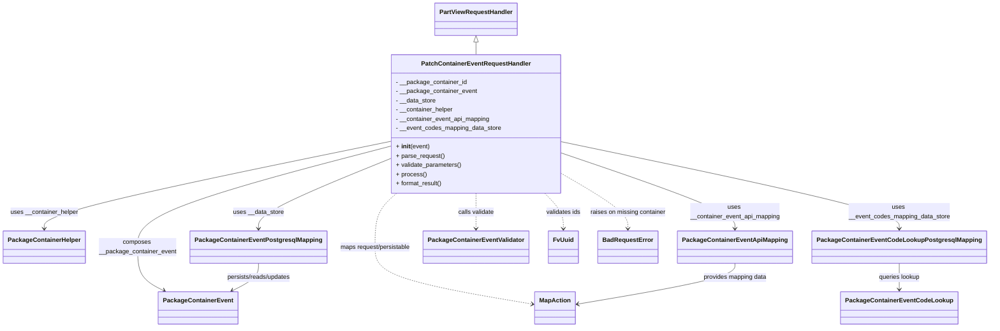

# Diagram: partview_core/partview_service/partview_service/api/package_container/event/handlers/patch_container_event.py


> Auto-generated by Obscura crawlers

## Diagram 1



### SVG

<svg id="container" width="2479.4140625" xmlns="http://www.w3.org/2000/svg" class="classDiagram" height="850" viewBox="0 0 2479.4140625 850" role="graphics-document document" aria-roledescription="class"><style>#container{font-family:"trebuchet ms",verdana,arial,sans-serif;font-size:16px;fill:#333;}@keyframes edge-animation-frame{from{stroke-dashoffset:0;}}@keyframes dash{to{stroke-dashoffset:0;}}#container .edge-animation-slow{stroke-dasharray:9,5!important;stroke-dashoffset:900;animation:dash 50s linear infinite;stroke-linecap:round;}#container .edge-animation-fast{stroke-dasharray:9,5!important;stroke-dashoffset:900;animation:dash 20s linear infinite;stroke-linecap:round;}#container .error-icon{fill:#552222;}#container .error-text{fill:#552222;stroke:#552222;}#container .edge-thickness-normal{stroke-width:1px;}#container .edge-thickness-thick{stroke-width:3.5px;}#container .edge-pattern-solid{stroke-dasharray:0;}#container .edge-thickness-invisible{stroke-width:0;fill:none;}#container .edge-pattern-dashed{stroke-dasharray:3;}#container .edge-pattern-dotted{stroke-dasharray:2;}#container .marker{fill:#333333;stroke:#333333;}#container .marker.cross{stroke:#333333;}#container svg{font-family:"trebuchet ms",verdana,arial,sans-serif;font-size:16px;}#container p{margin:0;}#container g.classGroup text{fill:#9370DB;stroke:none;font-family:"trebuchet ms",verdana,arial,sans-serif;font-size:10px;}#container g.classGroup text .title{font-weight:bolder;}#container .nodeLabel,#container .edgeLabel{color:#131300;}#container .edgeLabel .label rect{fill:#ECECFF;}#container .label text{fill:#131300;}#container .labelBkg{background:#ECECFF;}#container .edgeLabel .label span{background:#ECECFF;}#container .classTitle{font-weight:bolder;}#container .node rect,#container .node circle,#container .node ellipse,#container .node polygon,#container .node path{fill:#ECECFF;stroke:#9370DB;stroke-width:1px;}#container .divider{stroke:#9370DB;stroke-width:1;}#container g.clickable{cursor:pointer;}#container g.classGroup rect{fill:#ECECFF;stroke:#9370DB;}#container g.classGroup line{stroke:#9370DB;stroke-width:1;}#container .classLabel .box{stroke:none;stroke-width:0;fill:#ECECFF;opacity:0.5;}#container .classLabel .label{fill:#9370DB;font-size:10px;}#container .relation{stroke:#333333;stroke-width:1;fill:none;}#container .dashed-line{stroke-dasharray:3;}#container .dotted-line{stroke-dasharray:1 2;}#container #compositionStart,#container .composition{fill:#333333!important;stroke:#333333!important;stroke-width:1;}#container #compositionEnd,#container .composition{fill:#333333!important;stroke:#333333!important;stroke-width:1;}#container #dependencyStart,#container .dependency{fill:#333333!important;stroke:#333333!important;stroke-width:1;}#container #dependencyStart,#container .dependency{fill:#333333!important;stroke:#333333!important;stroke-width:1;}#container #extensionStart,#container .extension{fill:transparent!important;stroke:#333333!important;stroke-width:1;}#container #extensionEnd,#container .extension{fill:transparent!important;stroke:#333333!important;stroke-width:1;}#container #aggregationStart,#container .aggregation{fill:transparent!important;stroke:#333333!important;stroke-width:1;}#container #aggregationEnd,#container .aggregation{fill:transparent!important;stroke:#333333!important;stroke-width:1;}#container #lollipopStart,#container .lollipop{fill:#ECECFF!important;stroke:#333333!important;stroke-width:1;}#container #lollipopEnd,#container .lollipop{fill:#ECECFF!important;stroke:#333333!important;stroke-width:1;}#container .edgeTerminals{font-size:11px;line-height:initial;}#container .classTitleText{text-anchor:middle;font-size:18px;fill:#333;}#container .label-icon{display:inline-block;height:1em;overflow:visible;vertical-align:-0.125em;}#container .node .label-icon path{fill:currentColor;stroke:revert;stroke-width:revert;}#container :root{--mermaid-font-family:"trebuchet ms",verdana,arial,sans-serif;}</style><g><defs><marker id="container_class-aggregationStart" class="marker aggregation class" refX="18" refY="7" markerWidth="190" markerHeight="240" orient="auto"><path d="M 18,7 L9,13 L1,7 L9,1 Z"></path></marker></defs><defs><marker id="container_class-aggregationEnd" class="marker aggregation class" refX="1" refY="7" markerWidth="20" markerHeight="28" orient="auto"><path d="M 18,7 L9,13 L1,7 L9,1 Z"></path></marker></defs><defs><marker id="container_class-extensionStart" class="marker extension class" refX="18" refY="7" markerWidth="190" markerHeight="240" orient="auto"><path d="M 1,7 L18,13 V 1 Z"></path></marker></defs><defs><marker id="container_class-extensionEnd" class="marker extension class" refX="1" refY="7" markerWidth="20" markerHeight="28" orient="auto"><path d="M 1,1 V 13 L18,7 Z"></path></marker></defs><defs><marker id="container_class-compositionStart" class="marker composition class" refX="18" refY="7" markerWidth="190" markerHeight="240" orient="auto"><path d="M 18,7 L9,13 L1,7 L9,1 Z"></path></marker></defs><defs><marker id="container_class-compositionEnd" class="marker composition class" refX="1" refY="7" markerWidth="20" markerHeight="28" orient="auto"><path d="M 18,7 L9,13 L1,7 L9,1 Z"></path></marker></defs><defs><marker id="container_class-dependencyStart" class="marker dependency class" refX="6" refY="7" markerWidth="190" markerHeight="240" orient="auto"><path d="M 5,7 L9,13 L1,7 L9,1 Z"></path></marker></defs><defs><marker id="container_class-dependencyEnd" class="marker dependency class" refX="13" refY="7" markerWidth="20" markerHeight="28" orient="auto"><path d="M 18,7 L9,13 L14,7 L9,1 Z"></path></marker></defs><defs><marker id="container_class-lollipopStart" class="marker lollipop class" refX="13" refY="7" markerWidth="190" markerHeight="240" orient="auto"><circle stroke="black" fill="transparent" cx="7" cy="7" r="6"></circle></marker></defs><defs><marker id="container_class-lollipopEnd" class="marker lollipop class" refX="1" refY="7" markerWidth="190" markerHeight="240" orient="auto"><circle stroke="black" fill="transparent" cx="7" cy="7" r="6"></circle></marker></defs><g class="root"><g class="clusters"></g><g class="edgePaths"><path d="M1206.469,109.25L1206.469,110.542C1206.469,111.833,1206.469,114.417,1206.469,119.875C1206.469,125.333,1206.469,133.667,1206.469,137.833L1206.469,142" id="id_PartViewRequestHandler_PatchContainerEventRequestHandler_1" class="edge-thickness-normal edge-pattern-solid relation" style=";;;" data-edge="true" data-et="edge" data-id="id_PartViewRequestHandler_PatchContainerEventRequestHandler_1" data-points="W3sieCI6MTIwNi40Njg3NSwieSI6OTJ9LHsieCI6MTIwNi40Njg3NSwieSI6MTE3fSx7IngiOjEyMDYuNDY4NzUsInkiOjE0Mn1d" marker-start="url(#container_class-extensionStart)"></path><path d="M989.426,411.318L932.855,434.599C876.284,457.879,763.142,504.439,706.571,534.886C650,565.333,650,579.667,650,586.833L650,594" id="id_PatchContainerEventRequestHandler_PackageContainerEventPostgresqlMapping_2" class="edge-thickness-normal edge-pattern-solid relation" style=";;;" data-edge="true" data-et="edge" data-id="id_PatchContainerEventRequestHandler_PackageContainerEventPostgresqlMapping_2" data-points="W3sieCI6OTg5LjQyNTc4MTI1LCJ5Ijo0MTEuMzE4Mjk0NzcxNzE4OTd9LHsieCI6NjUwLCJ5Ijo1NTF9LHsieCI6NjUwLCJ5Ijo2MDB9XQ==" marker-end="url(#container_class-dependencyEnd)"></path><path d="M989.426,367.329L842.85,397.941C696.273,428.552,403.121,489.776,256.545,527.555C109.969,565.333,109.969,579.667,109.969,586.833L109.969,594" id="id_PatchContainerEventRequestHandler_PackageContainerHelper_3" class="edge-thickness-normal edge-pattern-solid relation" style=";;;" data-edge="true" data-et="edge" data-id="id_PatchContainerEventRequestHandler_PackageContainerHelper_3" data-points="W3sieCI6OTg5LjQyNTc4MTI1LCJ5IjozNjcuMzI4NjI3MzA4NDgxNTR9LHsieCI6MTA5Ljk2ODc1LCJ5Ijo1NTF9LHsieCI6MTA5Ljk2ODc1LCJ5Ijo2MDB9XQ==" marker-end="url(#container_class-dependencyEnd)"></path><path d="M1423.512,398.778L1495.231,424.148C1566.951,449.519,1710.389,500.259,1782.109,532.796C1853.828,565.333,1853.828,579.667,1853.828,586.833L1853.828,594" id="id_PatchContainerEventRequestHandler_PackageContainerEventApiMapping_4" class="edge-thickness-normal edge-pattern-solid relation" style=";;;" data-edge="true" data-et="edge" data-id="id_PatchContainerEventRequestHandler_PackageContainerEventApiMapping_4" data-points="W3sieCI6MTQyMy41MTE3MTg3NSwieSI6Mzk4Ljc3NzgxNzMzNDg0NTl9LHsieCI6MTg1My44MjgxMjUsInkiOjU1MX0seyJ4IjoxODUzLjgyODEyNSwieSI6NjAwfV0=" marker-end="url(#container_class-dependencyEnd)"></path><path d="M1423.512,369.264L1562.606,399.553C1701.701,429.842,1979.889,490.421,2118.984,527.877C2258.078,565.333,2258.078,579.667,2258.078,586.833L2258.078,594" id="id_PatchContainerEventRequestHandler_PackageContainerEventCodeLookupPostgresqlMapping_5" class="edge-thickness-normal edge-pattern-solid relation" style=";;;" data-edge="true" data-et="edge" data-id="id_PatchContainerEventRequestHandler_PackageContainerEventCodeLookupPostgresqlMapping_5" data-points="W3sieCI6MTQyMy41MTE3MTg3NSwieSI6MzY5LjI2MzU5NTIzMzQ5NjN9LHsieCI6MjI1OC4wNzgxMjUsInkiOjU1MX0seyJ4IjoyMjU4LjA3ODEyNSwieSI6NjAwfV0=" marker-end="url(#container_class-dependencyEnd)"></path><path d="M989.426,379.826L882.344,408.355C775.263,436.884,561.1,493.942,454.019,537.638C346.938,581.333,346.938,611.667,346.938,640C346.938,668.333,346.938,694.667,357.879,713.538C368.821,732.409,390.704,743.818,401.646,749.522L412.587,755.226" id="id_PatchContainerEventRequestHandler_PackageContainerEvent_6" class="edge-thickness-normal edge-pattern-solid relation" style=";;;" data-edge="true" data-et="edge" data-id="id_PatchContainerEventRequestHandler_PackageContainerEvent_6" data-points="W3sieCI6OTg5LjQyNTc4MTI1LCJ5IjozNzkuODI1NTE4MDg3NjIwNH0seyJ4IjozNDYuOTM3NSwieSI6NTUxfSx7IngiOjM0Ni45Mzc1LCJ5Ijo2NDJ9LHsieCI6MzQ2LjkzNzUsInkiOjcyMX0seyJ4Ijo0MTcuOTA3ODMyMjc4NDgxLCJ5Ijo3NTh9XQ==" marker-end="url(#container_class-dependencyEnd)"></path><path d="M1206.469,502L1206.469,510.167C1206.469,518.333,1206.469,534.667,1206.469,550C1206.469,565.333,1206.469,579.667,1206.469,586.833L1206.469,594" id="id_PatchContainerEventRequestHandler_PackageContainerEventValidator_7" class="edge-thickness-normal edge-pattern-dashed relation" style=";;;" data-edge="true" data-et="edge" data-id="id_PatchContainerEventRequestHandler_PackageContainerEventValidator_7" data-points="W3sieCI6MTIwNi40Njg3NSwieSI6NTAyfSx7IngiOjEyMDYuNDY4NzUsInkiOjU1MX0seyJ4IjoxMjA2LjQ2ODc1LCJ5Ijo2MDB9XQ==" marker-end="url(#container_class-dependencyEnd)"></path><path d="M1002.397,502L993.138,510.167C983.879,518.333,965.361,534.667,956.103,558C946.844,581.333,946.844,611.667,946.844,640C946.844,668.333,946.844,694.667,1013.002,719.358C1079.16,744.05,1211.476,767.1,1277.634,778.625L1343.792,790.15" id="id_PatchContainerEventRequestHandler_MapAction_8" class="edge-thickness-normal edge-pattern-dashed relation" style=";;;" data-edge="true" data-et="edge" data-id="id_PatchContainerEventRequestHandler_MapAction_8" data-points="W3sieCI6MTAwMi4zOTY2OTc1OTgyNTMyLCJ5Ijo1MDJ9LHsieCI6OTQ2Ljg0Mzc1LCJ5Ijo1NTF9LHsieCI6OTQ2Ljg0Mzc1LCJ5Ijo2NDJ9LHsieCI6OTQ2Ljg0Mzc1LCJ5Ijo3MjF9LHsieCI6MTM0OS43MDMxMjUsInkiOjc5MS4xNzk1Nzg2MTczMjc0fV0=" marker-end="url(#container_class-dependencyEnd)"></path><path d="M1377.356,502L1385.109,510.167C1392.862,518.333,1408.369,534.667,1416.122,550C1423.875,565.333,1423.875,579.667,1423.875,586.833L1423.875,594" id="id_PatchContainerEventRequestHandler_FvUuid_9" class="edge-thickness-normal edge-pattern-dashed relation" style=";;;" data-edge="true" data-et="edge" data-id="id_PatchContainerEventRequestHandler_FvUuid_9" data-points="W3sieCI6MTM3Ny4zNTU3NTg3MzM2MjQ1LCJ5Ijo1MDJ9LHsieCI6MTQyMy44NzUsInkiOjU1MX0seyJ4IjoxNDIzLjg3NSwieSI6NjAwfV0=" marker-end="url(#container_class-dependencyEnd)"></path><path d="M1423.512,452.056L1451.032,468.547C1478.552,485.038,1533.592,518.019,1561.113,541.676C1588.633,565.333,1588.633,579.667,1588.633,586.833L1588.633,594" id="id_PatchContainerEventRequestHandler_BadRequestError_10" class="edge-thickness-normal edge-pattern-dashed relation" style=";;;" data-edge="true" data-et="edge" data-id="id_PatchContainerEventRequestHandler_BadRequestError_10" data-points="W3sieCI6MTQyMy41MTE3MTg3NSwieSI6NDUyLjA1NjI4OTIyNDYwNDk0fSx7IngiOjE1ODguNjMyODEyNSwieSI6NTUxfSx7IngiOjE1ODguNjMyODEyNSwieSI6NjAwfV0=" marker-end="url(#container_class-dependencyEnd)"></path><path d="M650,684L650,690.167C650,696.333,650,708.667,639.058,720.538C628.117,732.409,606.233,743.818,595.292,749.522L584.35,755.226" id="id_PackageContainerEventPostgresqlMapping_PackageContainerEvent_11" class="edge-thickness-normal edge-pattern-solid relation" style=";;;" data-edge="true" data-et="edge" data-id="id_PackageContainerEventPostgresqlMapping_PackageContainerEvent_11" data-points="W3sieCI6NjUwLCJ5Ijo2ODR9LHsieCI6NjUwLCJ5Ijo3MjF9LHsieCI6NTc5LjAyOTY2NzcyMTUxOSwieSI6NzU4fV0=" marker-end="url(#container_class-dependencyEnd)"></path><path d="M2258.078,684L2258.078,690.167C2258.078,696.333,2258.078,708.667,2258.078,720C2258.078,731.333,2258.078,741.667,2258.078,746.833L2258.078,752" id="id_PackageContainerEventCodeLookupPostgresqlMapping_PackageContainerEventCodeLookup_12" class="edge-thickness-normal edge-pattern-solid relation" style=";;;" data-edge="true" data-et="edge" data-id="id_PackageContainerEventCodeLookupPostgresqlMapping_PackageContainerEventCodeLookup_12" data-points="W3sieCI6MjI1OC4wNzgxMjUsInkiOjY4NH0seyJ4IjoyMjU4LjA3ODEyNSwieSI6NzIxfSx7IngiOjIyNTguMDc4MTI1LCJ5Ijo3NTh9XQ==" marker-end="url(#container_class-dependencyEnd)"></path><path d="M1853.828,684L1853.828,690.167C1853.828,696.333,1853.828,708.667,1787.67,726.358C1721.512,744.05,1589.196,767.1,1523.038,778.625L1456.88,790.15" id="id_PackageContainerEventApiMapping_MapAction_13" class="edge-thickness-normal edge-pattern-solid relation" style=";;;" data-edge="true" data-et="edge" data-id="id_PackageContainerEventApiMapping_MapAction_13" data-points="W3sieCI6MTg1My44MjgxMjUsInkiOjY4NH0seyJ4IjoxODUzLjgyODEyNSwieSI6NzIxfSx7IngiOjE0NTAuOTY4NzUsInkiOjc5MS4xNzk1Nzg2MTczMjc0fV0=" marker-end="url(#container_class-dependencyEnd)"></path></g><g class="edgeLabels"><g class="edgeLabel"><g class="label" data-id="id_PartViewRequestHandler_PatchContainerEventRequestHandler_1" transform="translate(0, 0)"><foreignObject width="0" height="0"><div xmlns="http://www.w3.org/1999/xhtml" class="labelBkg" style="display: table-cell; white-space: nowrap; line-height: 1.5; max-width: 200px; text-align: center;"><span class="edgeLabel"></span></div></foreignObject></g></g><g class="edgeLabel" transform="translate(650, 551)"><g class="label" data-id="id_PatchContainerEventRequestHandler_PackageContainerEventPostgresqlMapping_2" transform="translate(-65.5546875, -12)"><foreignObject width="131.109375" height="24"><div xmlns="http://www.w3.org/1999/xhtml" class="labelBkg" style="display: table-cell; white-space: nowrap; line-height: 1.5; max-width: 200px; text-align: center;"><span class="edgeLabel"><p>uses __data_store</p></span></div></foreignObject></g></g><g class="edgeLabel" transform="translate(109.96875, 551)"><g class="label" data-id="id_PatchContainerEventRequestHandler_PackageContainerHelper_3" transform="translate(-88.40625, -12)"><foreignObject width="176.8125" height="24"><div xmlns="http://www.w3.org/1999/xhtml" class="labelBkg" style="display: table-cell; white-space: nowrap; line-height: 1.5; max-width: 200px; text-align: center;"><span class="edgeLabel"><p>uses __container_helper</p></span></div></foreignObject></g></g><g class="edgeLabel" transform="translate(1853.828125, 551)"><g class="label" data-id="id_PatchContainerEventRequestHandler_PackageContainerEventApiMapping_4" transform="translate(-117.546875, -24)"><foreignObject width="235.09375" height="48"><div xmlns="http://www.w3.org/1999/xhtml" class="labelBkg" style="display: table; white-space: break-spaces; line-height: 1.5; max-width: 200px; text-align: center; width: 200px;"><span class="edgeLabel"><p>uses __container_event_api_mapping</p></span></div></foreignObject></g></g><g class="edgeLabel" transform="translate(2258.078125, 551)"><g class="label" data-id="id_PatchContainerEventRequestHandler_PackageContainerEventCodeLookupPostgresqlMapping_5" transform="translate(-132.1796875, -24)"><foreignObject width="264.359375" height="48"><div xmlns="http://www.w3.org/1999/xhtml" class="labelBkg" style="display: table; white-space: break-spaces; line-height: 1.5; max-width: 200px; text-align: center; width: 200px;"><span class="edgeLabel"><p>uses __event_codes_mapping_data_store</p></span></div></foreignObject></g></g><g class="edgeLabel" transform="translate(346.9375, 642)"><g class="label" data-id="id_PatchContainerEventRequestHandler_PackageContainerEvent_6" transform="translate(-100, -24)"><foreignObject width="200" height="48"><div xmlns="http://www.w3.org/1999/xhtml" class="labelBkg" style="display: table; white-space: break-spaces; line-height: 1.5; max-width: 200px; text-align: center; width: 200px;"><span class="edgeLabel"><p>composes __package_container_event</p></span></div></foreignObject></g></g><g class="edgeLabel" transform="translate(1206.46875, 551)"><g class="label" data-id="id_PatchContainerEventRequestHandler_PackageContainerEventValidator_7" transform="translate(-47.5078125, -12)"><foreignObject width="95.015625" height="24"><div xmlns="http://www.w3.org/1999/xhtml" class="labelBkg" style="display: table-cell; white-space: nowrap; line-height: 1.5; max-width: 200px; text-align: center;"><span class="edgeLabel"><p>calls validate</p></span></div></foreignObject></g></g><g class="edgeLabel" transform="translate(946.84375, 642)"><g class="label" data-id="id_PatchContainerEventRequestHandler_MapAction_8" transform="translate(-93.78125, -12)"><foreignObject width="187.5625" height="24"><div xmlns="http://www.w3.org/1999/xhtml" class="labelBkg" style="display: table-cell; white-space: nowrap; line-height: 1.5; max-width: 200px; text-align: center;"><span class="edgeLabel"><p>maps request/persistable</p></span></div></foreignObject></g></g><g class="edgeLabel" transform="translate(1423.875, 551)"><g class="label" data-id="id_PatchContainerEventRequestHandler_FvUuid_9" transform="translate(-45.578125, -12)"><foreignObject width="91.15625" height="24"><div xmlns="http://www.w3.org/1999/xhtml" class="labelBkg" style="display: table-cell; white-space: nowrap; line-height: 1.5; max-width: 200px; text-align: center;"><span class="edgeLabel"><p>validates ids</p></span></div></foreignObject></g></g><g class="edgeLabel" transform="translate(1588.6328125, 551)"><g class="label" data-id="id_PatchContainerEventRequestHandler_BadRequestError_10" transform="translate(-99.1796875, -12)"><foreignObject width="198.359375" height="24"><div xmlns="http://www.w3.org/1999/xhtml" class="labelBkg" style="display: table-cell; white-space: nowrap; line-height: 1.5; max-width: 200px; text-align: center;"><span class="edgeLabel"><p>raises on missing container</p></span></div></foreignObject></g></g><g class="edgeLabel" transform="translate(650, 721)"><g class="label" data-id="id_PackageContainerEventPostgresqlMapping_PackageContainerEvent_11" transform="translate(-85.6875, -12)"><foreignObject width="171.375" height="24"><div xmlns="http://www.w3.org/1999/xhtml" class="labelBkg" style="display: table-cell; white-space: nowrap; line-height: 1.5; max-width: 200px; text-align: center;"><span class="edgeLabel"><p>persists/reads/updates</p></span></div></foreignObject></g></g><g class="edgeLabel" transform="translate(2258.078125, 721)"><g class="label" data-id="id_PackageContainerEventCodeLookupPostgresqlMapping_PackageContainerEventCodeLookup_12" transform="translate(-54.4609375, -12)"><foreignObject width="108.921875" height="24"><div xmlns="http://www.w3.org/1999/xhtml" class="labelBkg" style="display: table-cell; white-space: nowrap; line-height: 1.5; max-width: 200px; text-align: center;"><span class="edgeLabel"><p>queries lookup</p></span></div></foreignObject></g></g><g class="edgeLabel" transform="translate(1853.828125, 721)"><g class="label" data-id="id_PackageContainerEventApiMapping_MapAction_13" transform="translate(-83.6953125, -12)"><foreignObject width="167.390625" height="24"><div xmlns="http://www.w3.org/1999/xhtml" class="labelBkg" style="display: table-cell; white-space: nowrap; line-height: 1.5; max-width: 200px; text-align: center;"><span class="edgeLabel"><p>provides mapping data</p></span></div></foreignObject></g></g></g><g class="nodes"><g class="node default" id="classId-PatchContainerEventRequestHandler-0" transform="translate(1206.46875, 322)"><g class="basic label-container"><path d="M-217.04296875 -180 L217.04296875 -180 L217.04296875 180 L-217.04296875 180" stroke="none" stroke-width="0" fill="#ECECFF" style=""></path><path d="M-217.04296875 -180 C-75.6498969069051 -180, 65.7431749361898 -180, 217.04296875 -180 M-217.04296875 -180 C-66.35287015443956 -180, 84.33722844112089 -180, 217.04296875 -180 M217.04296875 -180 C217.04296875 -44.27054233072218, 217.04296875 91.45891533855564, 217.04296875 180 M217.04296875 -180 C217.04296875 -104.41566607022948, 217.04296875 -28.831332140458954, 217.04296875 180 M217.04296875 180 C78.504100346292 180, -60.03476805741599 180, -217.04296875 180 M217.04296875 180 C113.7515503298907 180, 10.46013190978141 180, -217.04296875 180 M-217.04296875 180 C-217.04296875 78.95403050302005, -217.04296875 -22.0919389939599, -217.04296875 -180 M-217.04296875 180 C-217.04296875 97.90046012681543, -217.04296875 15.800920253630863, -217.04296875 -180" stroke="#9370DB" stroke-width="1.3" fill="none" stroke-dasharray="0 0" style=""></path></g><g class="annotation-group text" transform="translate(0, -156)"></g><g class="label-group text" transform="translate(-135.0390625, -156)"><g class="label" style="font-weight: bolder" transform="translate(0,-12)"><foreignObject width="270.078125" height="24"><div xmlns="http://www.w3.org/1999/xhtml" style="display: table-cell; white-space: nowrap; line-height: 1.5; max-width: 318px; text-align: center;"><span class="nodeLabel markdown-node-label" style=""><p>PatchContainerEventRequestHandler</p></span></div></foreignObject></g></g><g class="members-group text" transform="translate(-205.04296875, -108)"><g class="label" style="" transform="translate(0,-12)"><foreignObject width="184.15625" height="24"><div xmlns="http://www.w3.org/1999/xhtml" style="display: table-cell; white-space: nowrap; line-height: 1.5; max-width: 242px; text-align: center;"><span class="nodeLabel markdown-node-label" style=""><p>- __package_container_id</p></span></div></foreignObject></g><g class="label" style="" transform="translate(0,12)"><foreignObject width="210.09375" height="24"><div xmlns="http://www.w3.org/1999/xhtml" style="display: table-cell; white-space: nowrap; line-height: 1.5; max-width: 268px; text-align: center;"><span class="nodeLabel markdown-node-label" style=""><p>- __package_container_event</p></span></div></foreignObject></g><g class="label" style="" transform="translate(0,36)"><foreignObject width="104.578125" height="24"><div xmlns="http://www.w3.org/1999/xhtml" style="display: table-cell; white-space: nowrap; line-height: 1.5; max-width: 162px; text-align: center;"><span class="nodeLabel markdown-node-label" style=""><p>- __data_store</p></span></div></foreignObject></g><g class="label" style="" transform="translate(0,60)"><foreignObject width="150.28125" height="24"><div xmlns="http://www.w3.org/1999/xhtml" style="display: table-cell; white-space: nowrap; line-height: 1.5; max-width: 208px; text-align: center;"><span class="nodeLabel markdown-node-label" style=""><p>- __container_helper</p></span></div></foreignObject></g><g class="label" style="" transform="translate(0,84)"><foreignObject width="245.78125" height="24"><div xmlns="http://www.w3.org/1999/xhtml" style="display: table-cell; white-space: nowrap; line-height: 1.5; max-width: 304px; text-align: center;"><span class="nodeLabel markdown-node-label" style=""><p>- __container_event_api_mapping</p></span></div></foreignObject></g><g class="label" style="" transform="translate(0,108)"><foreignObject width="275.046875" height="24"><div xmlns="http://www.w3.org/1999/xhtml" style="display: table-cell; white-space: nowrap; line-height: 1.5; max-width: 332px; text-align: center;"><span class="nodeLabel markdown-node-label" style=""><p>- __event_codes_mapping_data_store</p></span></div></foreignObject></g></g><g class="methods-group text" transform="translate(-205.04296875, 60)"><g class="label" style="" transform="translate(0,-12)"><foreignObject width="87.390625" height="24"><div xmlns="http://www.w3.org/1999/xhtml" style="display: table-cell; white-space: nowrap; line-height: 1.5; max-width: 177px; text-align: center;"><span class="nodeLabel markdown-node-label" style=""><p>+ <strong>init</strong>(event)</p></span></div></foreignObject></g><g class="label" style="" transform="translate(0,12)"><foreignObject width="126.046875" height="24"><div xmlns="http://www.w3.org/1999/xhtml" style="display: table-cell; white-space: nowrap; line-height: 1.5; max-width: 183px; text-align: center;"><span class="nodeLabel markdown-node-label" style=""><p>+ parse_request()</p></span></div></foreignObject></g><g class="label" style="" transform="translate(0,36)"><foreignObject width="170.953125" height="24"><div xmlns="http://www.w3.org/1999/xhtml" style="display: table-cell; white-space: nowrap; line-height: 1.5; max-width: 228px; text-align: center;"><span class="nodeLabel markdown-node-label" style=""><p>+ validate_parameters()</p></span></div></foreignObject></g><g class="label" style="" transform="translate(0,60)"><foreignObject width="77.96875" height="24"><div xmlns="http://www.w3.org/1999/xhtml" style="display: table-cell; white-space: nowrap; line-height: 1.5; max-width: 135px; text-align: center;"><span class="nodeLabel markdown-node-label" style=""><p>+ process()</p></span></div></foreignObject></g><g class="label" style="" transform="translate(0,84)"><foreignObject width="121.5" height="24"><div xmlns="http://www.w3.org/1999/xhtml" style="display: table-cell; white-space: nowrap; line-height: 1.5; max-width: 179px; text-align: center;"><span class="nodeLabel markdown-node-label" style=""><p>+ format_result()</p></span></div></foreignObject></g></g><g class="divider" style=""><path d="M-217.04296875 -132 C-120.67227477061887 -132, -24.30158079123774 -132, 217.04296875 -132 M-217.04296875 -132 C-64.79684926266879 -132, 87.44927022466243 -132, 217.04296875 -132" stroke="#9370DB" stroke-width="1.3" fill="none" stroke-dasharray="0 0" style=""></path></g><g class="divider" style=""><path d="M-217.04296875 36 C-54.69419382406525 36, 107.6545811018695 36, 217.04296875 36 M-217.04296875 36 C-89.09824623356718 36, 38.84647628286564 36, 217.04296875 36" stroke="#9370DB" stroke-width="1.3" fill="none" stroke-dasharray="0 0" style=""></path></g></g><g class="node default" id="classId-PartViewRequestHandler-1" transform="translate(1206.46875, 50)"><g class="basic label-container"><path d="M-103.359375 -42 L103.359375 -42 L103.359375 42 L-103.359375 42" stroke="none" stroke-width="0" fill="#ECECFF" style=""></path><path d="M-103.359375 -42 C-40.26574237045076 -42, 22.82789025909848 -42, 103.359375 -42 M-103.359375 -42 C-35.69988143754709 -42, 31.959612124905817 -42, 103.359375 -42 M103.359375 -42 C103.359375 -25.0533500364161, 103.359375 -8.106700072832197, 103.359375 42 M103.359375 -42 C103.359375 -10.448942253144704, 103.359375 21.102115493710592, 103.359375 42 M103.359375 42 C33.516467376608276 42, -36.32644024678345 42, -103.359375 42 M103.359375 42 C24.56365728688516 42, -54.23206042622968 42, -103.359375 42 M-103.359375 42 C-103.359375 15.118192341218979, -103.359375 -11.763615317562042, -103.359375 -42 M-103.359375 42 C-103.359375 11.579139378516825, -103.359375 -18.84172124296635, -103.359375 -42" stroke="#9370DB" stroke-width="1.3" fill="none" stroke-dasharray="0 0" style=""></path></g><g class="annotation-group text" transform="translate(0, -18)"></g><g class="label-group text" transform="translate(-91.359375, -18)"><g class="label" style="font-weight: bolder" transform="translate(0,-12)"><foreignObject width="182.71875" height="24"><div xmlns="http://www.w3.org/1999/xhtml" style="display: table-cell; white-space: nowrap; line-height: 1.5; max-width: 231px; text-align: center;"><span class="nodeLabel markdown-node-label" style=""><p>PartViewRequestHandler</p></span></div></foreignObject></g></g><g class="members-group text" transform="translate(-91.359375, 30)"></g><g class="methods-group text" transform="translate(-91.359375, 60)"></g><g class="divider" style=""><path d="M-103.359375 6 C-43.4053200102238 6, 16.548734979552407 6, 103.359375 6 M-103.359375 6 C-34.28895766449229 6, 34.781459671015426 6, 103.359375 6" stroke="#9370DB" stroke-width="1.3" fill="none" stroke-dasharray="0 0" style=""></path></g><g class="divider" style=""><path d="M-103.359375 24 C-52.04707871320792 24, -0.7347824264158334 24, 103.359375 24 M-103.359375 24 C-25.861375759150917 24, 51.636623481698166 24, 103.359375 24" stroke="#9370DB" stroke-width="1.3" fill="none" stroke-dasharray="0 0" style=""></path></g></g><g class="node default" id="classId-PackageContainerEvent-2" transform="translate(498.46875, 800)"><g class="basic label-container"><path d="M-97.65625 -42 L97.65625 -42 L97.65625 42 L-97.65625 42" stroke="none" stroke-width="0" fill="#ECECFF" style=""></path><path d="M-97.65625 -42 C-40.30115930869782 -42, 17.05393138260436 -42, 97.65625 -42 M-97.65625 -42 C-42.37812050521438 -42, 12.900008989571234 -42, 97.65625 -42 M97.65625 -42 C97.65625 -18.145804277612342, 97.65625 5.708391444775316, 97.65625 42 M97.65625 -42 C97.65625 -16.73522166064941, 97.65625 8.529556678701177, 97.65625 42 M97.65625 42 C27.69452746437743 42, -42.26719507124514 42, -97.65625 42 M97.65625 42 C35.79473182646729 42, -26.066786347065417 42, -97.65625 42 M-97.65625 42 C-97.65625 10.176671555541208, -97.65625 -21.646656888917583, -97.65625 -42 M-97.65625 42 C-97.65625 24.049670896506374, -97.65625 6.099341793012748, -97.65625 -42" stroke="#9370DB" stroke-width="1.3" fill="none" stroke-dasharray="0 0" style=""></path></g><g class="annotation-group text" transform="translate(0, -18)"></g><g class="label-group text" transform="translate(-85.65625, -18)"><g class="label" style="font-weight: bolder" transform="translate(0,-12)"><foreignObject width="171.3125" height="24"><div xmlns="http://www.w3.org/1999/xhtml" style="display: table-cell; white-space: nowrap; line-height: 1.5; max-width: 219px; text-align: center;"><span class="nodeLabel markdown-node-label" style=""><p>PackageContainerEvent</p></span></div></foreignObject></g></g><g class="members-group text" transform="translate(-85.65625, 30)"></g><g class="methods-group text" transform="translate(-85.65625, 60)"></g><g class="divider" style=""><path d="M-97.65625 6 C-33.68895820834051 6, 30.278333583318982 6, 97.65625 6 M-97.65625 6 C-43.968802796699585 6, 9.71864440660083 6, 97.65625 6" stroke="#9370DB" stroke-width="1.3" fill="none" stroke-dasharray="0 0" style=""></path></g><g class="divider" style=""><path d="M-97.65625 24 C-38.03124203782737 24, 21.593765924345263 24, 97.65625 24 M-97.65625 24 C-57.134514989122266 24, -16.612779978244532 24, 97.65625 24" stroke="#9370DB" stroke-width="1.3" fill="none" stroke-dasharray="0 0" style=""></path></g></g><g class="node default" id="classId-PackageContainerHelper-3" transform="translate(109.96875, 642)"><g class="basic label-container"><path d="M-101.96875 -42 L101.96875 -42 L101.96875 42 L-101.96875 42" stroke="none" stroke-width="0" fill="#ECECFF" style=""></path><path d="M-101.96875 -42 C-30.613380899250814 -42, 40.74198820149837 -42, 101.96875 -42 M-101.96875 -42 C-50.62340381933104 -42, 0.7219423613379234 -42, 101.96875 -42 M101.96875 -42 C101.96875 -9.000294706227521, 101.96875 23.999410587544958, 101.96875 42 M101.96875 -42 C101.96875 -16.232749263167307, 101.96875 9.534501473665387, 101.96875 42 M101.96875 42 C31.365149423374802 42, -39.238451153250395 42, -101.96875 42 M101.96875 42 C56.41050939055344 42, 10.852268781106886 42, -101.96875 42 M-101.96875 42 C-101.96875 23.07636765227839, -101.96875 4.152735304556778, -101.96875 -42 M-101.96875 42 C-101.96875 19.239594603232362, -101.96875 -3.5208107935352757, -101.96875 -42" stroke="#9370DB" stroke-width="1.3" fill="none" stroke-dasharray="0 0" style=""></path></g><g class="annotation-group text" transform="translate(0, -18)"></g><g class="label-group text" transform="translate(-89.96875, -18)"><g class="label" style="font-weight: bolder" transform="translate(0,-12)"><foreignObject width="179.9375" height="24"><div xmlns="http://www.w3.org/1999/xhtml" style="display: table-cell; white-space: nowrap; line-height: 1.5; max-width: 228px; text-align: center;"><span class="nodeLabel markdown-node-label" style=""><p>PackageContainerHelper</p></span></div></foreignObject></g></g><g class="members-group text" transform="translate(-89.96875, 30)"></g><g class="methods-group text" transform="translate(-89.96875, 60)"></g><g class="divider" style=""><path d="M-101.96875 6 C-25.679857021939625 6, 50.60903595612075 6, 101.96875 6 M-101.96875 6 C-48.70359938104522 6, 4.561551237909555 6, 101.96875 6" stroke="#9370DB" stroke-width="1.3" fill="none" stroke-dasharray="0 0" style=""></path></g><g class="divider" style=""><path d="M-101.96875 24 C-25.46033571849445 24, 51.0480785630111 24, 101.96875 24 M-101.96875 24 C-33.86034509983544 24, 34.248059800329116 24, 101.96875 24" stroke="#9370DB" stroke-width="1.3" fill="none" stroke-dasharray="0 0" style=""></path></g></g><g class="node default" id="classId-PackageContainerEventPostgresqlMapping-4" transform="translate(650, 642)"><g class="basic label-container"><path d="M-168.0625 -42 L168.0625 -42 L168.0625 42 L-168.0625 42" stroke="none" stroke-width="0" fill="#ECECFF" style=""></path><path d="M-168.0625 -42 C-60.94446527647054 -42, 46.173569447058924 -42, 168.0625 -42 M-168.0625 -42 C-48.731574814704146 -42, 70.59935037059171 -42, 168.0625 -42 M168.0625 -42 C168.0625 -11.4334000152855, 168.0625 19.133199969429, 168.0625 42 M168.0625 -42 C168.0625 -23.309063317165513, 168.0625 -4.618126634331027, 168.0625 42 M168.0625 42 C61.95662581480326 42, -44.14924837039348 42, -168.0625 42 M168.0625 42 C85.08635737973914 42, 2.110214759478282 42, -168.0625 42 M-168.0625 42 C-168.0625 9.05853278975433, -168.0625 -23.88293442049134, -168.0625 -42 M-168.0625 42 C-168.0625 24.049291316181012, -168.0625 6.0985826323620245, -168.0625 -42" stroke="#9370DB" stroke-width="1.3" fill="none" stroke-dasharray="0 0" style=""></path></g><g class="annotation-group text" transform="translate(0, -18)"></g><g class="label-group text" transform="translate(-156.0625, -18)"><g class="label" style="font-weight: bolder" transform="translate(0,-12)"><foreignObject width="312.125" height="24"><div xmlns="http://www.w3.org/1999/xhtml" style="display: table-cell; white-space: nowrap; line-height: 1.5; max-width: 357px; text-align: center;"><span class="nodeLabel markdown-node-label" style=""><p>PackageContainerEventPostgresqlMapping</p></span></div></foreignObject></g></g><g class="members-group text" transform="translate(-156.0625, 30)"></g><g class="methods-group text" transform="translate(-156.0625, 60)"></g><g class="divider" style=""><path d="M-168.0625 6 C-73.59577488321976 6, 20.870950233560478 6, 168.0625 6 M-168.0625 6 C-70.22961657922606 6, 27.603266841547878 6, 168.0625 6" stroke="#9370DB" stroke-width="1.3" fill="none" stroke-dasharray="0 0" style=""></path></g><g class="divider" style=""><path d="M-168.0625 24 C-92.40487425502998 24, -16.74724851005996 24, 168.0625 24 M-168.0625 24 C-76.51528399293574 24, 15.031932014128529 24, 168.0625 24" stroke="#9370DB" stroke-width="1.3" fill="none" stroke-dasharray="0 0" style=""></path></g></g><g class="node default" id="classId-PackageContainerEventApiMapping-5" transform="translate(1853.828125, 642)"><g class="basic label-container"><path d="M-140.9140625 -42 L140.9140625 -42 L140.9140625 42 L-140.9140625 42" stroke="none" stroke-width="0" fill="#ECECFF" style=""></path><path d="M-140.9140625 -42 C-28.926814766462826 -42, 83.06043296707435 -42, 140.9140625 -42 M-140.9140625 -42 C-61.84885259810382 -42, 17.216357303792364 -42, 140.9140625 -42 M140.9140625 -42 C140.9140625 -10.104506516875965, 140.9140625 21.79098696624807, 140.9140625 42 M140.9140625 -42 C140.9140625 -13.249532708481887, 140.9140625 15.500934583036226, 140.9140625 42 M140.9140625 42 C31.297402913958948 42, -78.3192566720821 42, -140.9140625 42 M140.9140625 42 C54.64524462746694 42, -31.623573245066126 42, -140.9140625 42 M-140.9140625 42 C-140.9140625 14.710876961079077, -140.9140625 -12.578246077841847, -140.9140625 -42 M-140.9140625 42 C-140.9140625 16.624654946614914, -140.9140625 -8.750690106770172, -140.9140625 -42" stroke="#9370DB" stroke-width="1.3" fill="none" stroke-dasharray="0 0" style=""></path></g><g class="annotation-group text" transform="translate(0, -18)"></g><g class="label-group text" transform="translate(-128.9140625, -18)"><g class="label" style="font-weight: bolder" transform="translate(0,-12)"><foreignObject width="257.828125" height="24"><div xmlns="http://www.w3.org/1999/xhtml" style="display: table-cell; white-space: nowrap; line-height: 1.5; max-width: 305px; text-align: center;"><span class="nodeLabel markdown-node-label" style=""><p>PackageContainerEventApiMapping</p></span></div></foreignObject></g></g><g class="members-group text" transform="translate(-128.9140625, 30)"></g><g class="methods-group text" transform="translate(-128.9140625, 60)"></g><g class="divider" style=""><path d="M-140.9140625 6 C-59.58931790609367 6, 21.735426687812662 6, 140.9140625 6 M-140.9140625 6 C-29.81101860631877 6, 81.29202528736246 6, 140.9140625 6" stroke="#9370DB" stroke-width="1.3" fill="none" stroke-dasharray="0 0" style=""></path></g><g class="divider" style=""><path d="M-140.9140625 24 C-41.0509321552899 24, 58.8121981894202 24, 140.9140625 24 M-140.9140625 24 C-73.99832906952099 24, -7.082595639041983 24, 140.9140625 24" stroke="#9370DB" stroke-width="1.3" fill="none" stroke-dasharray="0 0" style=""></path></g></g><g class="node default" id="classId-PackageContainerEventCodeLookup-6" transform="translate(2258.078125, 800)"><g class="basic label-container"><path d="M-142.9296875 -42 L142.9296875 -42 L142.9296875 42 L-142.9296875 42" stroke="none" stroke-width="0" fill="#ECECFF" style=""></path><path d="M-142.9296875 -42 C-56.58498948805358 -42, 29.75970852389284 -42, 142.9296875 -42 M-142.9296875 -42 C-54.95557956707542 -42, 33.018528365849164 -42, 142.9296875 -42 M142.9296875 -42 C142.9296875 -10.180907656773662, 142.9296875 21.638184686452675, 142.9296875 42 M142.9296875 -42 C142.9296875 -20.327937895572433, 142.9296875 1.3441242088551348, 142.9296875 42 M142.9296875 42 C47.47205415191313 42, -47.985579196173745 42, -142.9296875 42 M142.9296875 42 C51.598642025848065 42, -39.73240344830387 42, -142.9296875 42 M-142.9296875 42 C-142.9296875 10.522067290978967, -142.9296875 -20.955865418042066, -142.9296875 -42 M-142.9296875 42 C-142.9296875 11.377810535082041, -142.9296875 -19.244378929835918, -142.9296875 -42" stroke="#9370DB" stroke-width="1.3" fill="none" stroke-dasharray="0 0" style=""></path></g><g class="annotation-group text" transform="translate(0, -18)"></g><g class="label-group text" transform="translate(-130.9296875, -18)"><g class="label" style="font-weight: bolder" transform="translate(0,-12)"><foreignObject width="261.859375" height="24"><div xmlns="http://www.w3.org/1999/xhtml" style="display: table-cell; white-space: nowrap; line-height: 1.5; max-width: 308px; text-align: center;"><span class="nodeLabel markdown-node-label" style=""><p>PackageContainerEventCodeLookup</p></span></div></foreignObject></g></g><g class="members-group text" transform="translate(-130.9296875, 30)"></g><g class="methods-group text" transform="translate(-130.9296875, 60)"></g><g class="divider" style=""><path d="M-142.9296875 6 C-72.83110634418522 6, -2.732525188370431 6, 142.9296875 6 M-142.9296875 6 C-84.15616559419468 6, -25.382643688389365 6, 142.9296875 6" stroke="#9370DB" stroke-width="1.3" fill="none" stroke-dasharray="0 0" style=""></path></g><g class="divider" style=""><path d="M-142.9296875 24 C-46.130259999657014 24, 50.66916750068597 24, 142.9296875 24 M-142.9296875 24 C-73.01953463583173 24, -3.1093817716634646 24, 142.9296875 24" stroke="#9370DB" stroke-width="1.3" fill="none" stroke-dasharray="0 0" style=""></path></g></g><g class="node default" id="classId-PackageContainerEventCodeLookupPostgresqlMapping-7" transform="translate(2258.078125, 642)"><g class="basic label-container"><path d="M-213.3359375 -42 L213.3359375 -42 L213.3359375 42 L-213.3359375 42" stroke="none" stroke-width="0" fill="#ECECFF" style=""></path><path d="M-213.3359375 -42 C-115.95745565929859 -42, -18.578973818597177 -42, 213.3359375 -42 M-213.3359375 -42 C-87.49300092175355 -42, 38.3499356564929 -42, 213.3359375 -42 M213.3359375 -42 C213.3359375 -17.85175943296101, 213.3359375 6.296481134077979, 213.3359375 42 M213.3359375 -42 C213.3359375 -23.711691544512256, 213.3359375 -5.423383089024512, 213.3359375 42 M213.3359375 42 C48.86274946549145 42, -115.6104385690171 42, -213.3359375 42 M213.3359375 42 C103.87176800834733 42, -5.592401483305338 42, -213.3359375 42 M-213.3359375 42 C-213.3359375 20.563437348323465, -213.3359375 -0.8731253033530706, -213.3359375 -42 M-213.3359375 42 C-213.3359375 21.160862250393443, -213.3359375 0.3217245007868854, -213.3359375 -42" stroke="#9370DB" stroke-width="1.3" fill="none" stroke-dasharray="0 0" style=""></path></g><g class="annotation-group text" transform="translate(0, -18)"></g><g class="label-group text" transform="translate(-201.3359375, -18)"><g class="label" style="font-weight: bolder" transform="translate(0,-12)"><foreignObject width="402.671875" height="24"><div xmlns="http://www.w3.org/1999/xhtml" style="display: table-cell; white-space: nowrap; line-height: 1.5; max-width: 447px; text-align: center;"><span class="nodeLabel markdown-node-label" style=""><p>PackageContainerEventCodeLookupPostgresqlMapping</p></span></div></foreignObject></g></g><g class="members-group text" transform="translate(-201.3359375, 30)"></g><g class="methods-group text" transform="translate(-201.3359375, 60)"></g><g class="divider" style=""><path d="M-213.3359375 6 C-78.92691020922695 6, 55.48211708154611 6, 213.3359375 6 M-213.3359375 6 C-105.15104859521739 6, 3.033840309565221 6, 213.3359375 6" stroke="#9370DB" stroke-width="1.3" fill="none" stroke-dasharray="0 0" style=""></path></g><g class="divider" style=""><path d="M-213.3359375 24 C-48.19577608852521 24, 116.94438532294959 24, 213.3359375 24 M-213.3359375 24 C-93.83117341257439 24, 25.673590674851226 24, 213.3359375 24" stroke="#9370DB" stroke-width="1.3" fill="none" stroke-dasharray="0 0" style=""></path></g></g><g class="node default" id="classId-PackageContainerEventValidator-8" transform="translate(1206.46875, 642)"><g class="basic label-container"><path d="M-130.84375 -42 L130.84375 -42 L130.84375 42 L-130.84375 42" stroke="none" stroke-width="0" fill="#ECECFF" style=""></path><path d="M-130.84375 -42 C-34.48302733327546 -42, 61.87769533344908 -42, 130.84375 -42 M-130.84375 -42 C-48.26938582500904 -42, 34.30497834998192 -42, 130.84375 -42 M130.84375 -42 C130.84375 -16.70729987999272, 130.84375 8.585400240014557, 130.84375 42 M130.84375 -42 C130.84375 -19.044896811847583, 130.84375 3.910206376304835, 130.84375 42 M130.84375 42 C58.58993379080333 42, -13.663882418393342 42, -130.84375 42 M130.84375 42 C33.93402994019827 42, -62.975690119603456 42, -130.84375 42 M-130.84375 42 C-130.84375 8.973689050157937, -130.84375 -24.052621899684127, -130.84375 -42 M-130.84375 42 C-130.84375 17.450595277955763, -130.84375 -7.098809444088474, -130.84375 -42" stroke="#9370DB" stroke-width="1.3" fill="none" stroke-dasharray="0 0" style=""></path></g><g class="annotation-group text" transform="translate(0, -18)"></g><g class="label-group text" transform="translate(-118.84375, -18)"><g class="label" style="font-weight: bolder" transform="translate(0,-12)"><foreignObject width="237.6875" height="24"><div xmlns="http://www.w3.org/1999/xhtml" style="display: table-cell; white-space: nowrap; line-height: 1.5; max-width: 285px; text-align: center;"><span class="nodeLabel markdown-node-label" style=""><p>PackageContainerEventValidator</p></span></div></foreignObject></g></g><g class="members-group text" transform="translate(-118.84375, 30)"></g><g class="methods-group text" transform="translate(-118.84375, 60)"></g><g class="divider" style=""><path d="M-130.84375 6 C-31.55496690628388 6, 67.73381618743224 6, 130.84375 6 M-130.84375 6 C-34.37965619074774 6, 62.08443761850452 6, 130.84375 6" stroke="#9370DB" stroke-width="1.3" fill="none" stroke-dasharray="0 0" style=""></path></g><g class="divider" style=""><path d="M-130.84375 24 C-38.40437113826037 24, 54.035007723479254 24, 130.84375 24 M-130.84375 24 C-66.15396958323782 24, -1.4641891664756486 24, 130.84375 24" stroke="#9370DB" stroke-width="1.3" fill="none" stroke-dasharray="0 0" style=""></path></g></g><g class="node default" id="classId-MapAction-9" transform="translate(1400.3359375, 800)"><g class="basic label-container"><path d="M-50.6328125 -42 L50.6328125 -42 L50.6328125 42 L-50.6328125 42" stroke="none" stroke-width="0" fill="#ECECFF" style=""></path><path d="M-50.6328125 -42 C-15.58699397934162 -42, 19.45882454131676 -42, 50.6328125 -42 M-50.6328125 -42 C-21.936496353618427 -42, 6.759819792763146 -42, 50.6328125 -42 M50.6328125 -42 C50.6328125 -12.234516254329748, 50.6328125 17.530967491340505, 50.6328125 42 M50.6328125 -42 C50.6328125 -17.18940001514743, 50.6328125 7.621199969705138, 50.6328125 42 M50.6328125 42 C27.8055403375491 42, 4.978268175098201 42, -50.6328125 42 M50.6328125 42 C11.663897029943222 42, -27.305018440113557 42, -50.6328125 42 M-50.6328125 42 C-50.6328125 13.988971472902055, -50.6328125 -14.02205705419589, -50.6328125 -42 M-50.6328125 42 C-50.6328125 19.202932455738704, -50.6328125 -3.5941350885225916, -50.6328125 -42" stroke="#9370DB" stroke-width="1.3" fill="none" stroke-dasharray="0 0" style=""></path></g><g class="annotation-group text" transform="translate(0, -18)"></g><g class="label-group text" transform="translate(-38.6328125, -18)"><g class="label" style="font-weight: bolder" transform="translate(0,-12)"><foreignObject width="77.265625" height="24"><div xmlns="http://www.w3.org/1999/xhtml" style="display: table-cell; white-space: nowrap; line-height: 1.5; max-width: 126px; text-align: center;"><span class="nodeLabel markdown-node-label" style=""><p>MapAction</p></span></div></foreignObject></g></g><g class="members-group text" transform="translate(-38.6328125, 30)"></g><g class="methods-group text" transform="translate(-38.6328125, 60)"></g><g class="divider" style=""><path d="M-50.6328125 6 C-18.279333150686014 6, 14.074146198627972 6, 50.6328125 6 M-50.6328125 6 C-14.314715990065807 6, 22.003380519868387 6, 50.6328125 6" stroke="#9370DB" stroke-width="1.3" fill="none" stroke-dasharray="0 0" style=""></path></g><g class="divider" style=""><path d="M-50.6328125 24 C-18.510676586698928 24, 13.611459326602144 24, 50.6328125 24 M-50.6328125 24 C-11.475214102450899 24, 27.682384295098203 24, 50.6328125 24" stroke="#9370DB" stroke-width="1.3" fill="none" stroke-dasharray="0 0" style=""></path></g></g><g class="node default" id="classId-FvUuid-10" transform="translate(1423.875, 642)"><g class="basic label-container"><path d="M-36.5625 -42 L36.5625 -42 L36.5625 42 L-36.5625 42" stroke="none" stroke-width="0" fill="#ECECFF" style=""></path><path d="M-36.5625 -42 C-16.791215242845183 -42, 2.9800695143096334 -42, 36.5625 -42 M-36.5625 -42 C-13.528785353780037 -42, 9.504929292439925 -42, 36.5625 -42 M36.5625 -42 C36.5625 -18.073018904985876, 36.5625 5.853962190028248, 36.5625 42 M36.5625 -42 C36.5625 -10.796506500434294, 36.5625 20.406986999131412, 36.5625 42 M36.5625 42 C16.6002704779873 42, -3.3619590440253972 42, -36.5625 42 M36.5625 42 C19.554081205867057 42, 2.5456624117341136 42, -36.5625 42 M-36.5625 42 C-36.5625 23.42718886832461, -36.5625 4.854377736649219, -36.5625 -42 M-36.5625 42 C-36.5625 10.101062836581018, -36.5625 -21.797874326837963, -36.5625 -42" stroke="#9370DB" stroke-width="1.3" fill="none" stroke-dasharray="0 0" style=""></path></g><g class="annotation-group text" transform="translate(0, -18)"></g><g class="label-group text" transform="translate(-24.5625, -18)"><g class="label" style="font-weight: bolder" transform="translate(0,-12)"><foreignObject width="49.125" height="24"><div xmlns="http://www.w3.org/1999/xhtml" style="display: table-cell; white-space: nowrap; line-height: 1.5; max-width: 99px; text-align: center;"><span class="nodeLabel markdown-node-label" style=""><p>FvUuid</p></span></div></foreignObject></g></g><g class="members-group text" transform="translate(-24.5625, 30)"></g><g class="methods-group text" transform="translate(-24.5625, 60)"></g><g class="divider" style=""><path d="M-36.5625 6 C-11.117764292593748 6, 14.326971414812505 6, 36.5625 6 M-36.5625 6 C-12.700287581955433 6, 11.161924836089135 6, 36.5625 6" stroke="#9370DB" stroke-width="1.3" fill="none" stroke-dasharray="0 0" style=""></path></g><g class="divider" style=""><path d="M-36.5625 24 C-12.403445143440468 24, 11.755609713119064 24, 36.5625 24 M-36.5625 24 C-9.300450466790835 24, 17.96159906641833 24, 36.5625 24" stroke="#9370DB" stroke-width="1.3" fill="none" stroke-dasharray="0 0" style=""></path></g></g><g class="node default" id="classId-BadRequestError-11" transform="translate(1588.6328125, 642)"><g class="basic label-container"><path d="M-74.28125 -42 L74.28125 -42 L74.28125 42 L-74.28125 42" stroke="none" stroke-width="0" fill="#ECECFF" style=""></path><path d="M-74.28125 -42 C-41.820791584231955 -42, -9.36033316846391 -42, 74.28125 -42 M-74.28125 -42 C-43.35468610249633 -42, -12.428122204992661 -42, 74.28125 -42 M74.28125 -42 C74.28125 -20.03253968048716, 74.28125 1.9349206390256768, 74.28125 42 M74.28125 -42 C74.28125 -22.201820075322708, 74.28125 -2.4036401506454155, 74.28125 42 M74.28125 42 C44.332814106862706 42, 14.384378213725412 42, -74.28125 42 M74.28125 42 C19.325119400635423 42, -35.631011198729155 42, -74.28125 42 M-74.28125 42 C-74.28125 13.381670296548183, -74.28125 -15.236659406903634, -74.28125 -42 M-74.28125 42 C-74.28125 23.18982912836501, -74.28125 4.379658256730018, -74.28125 -42" stroke="#9370DB" stroke-width="1.3" fill="none" stroke-dasharray="0 0" style=""></path></g><g class="annotation-group text" transform="translate(0, -18)"></g><g class="label-group text" transform="translate(-62.28125, -18)"><g class="label" style="font-weight: bolder" transform="translate(0,-12)"><foreignObject width="124.5625" height="24"><div xmlns="http://www.w3.org/1999/xhtml" style="display: table-cell; white-space: nowrap; line-height: 1.5; max-width: 174px; text-align: center;"><span class="nodeLabel markdown-node-label" style=""><p>BadRequestError</p></span></div></foreignObject></g></g><g class="members-group text" transform="translate(-62.28125, 30)"></g><g class="methods-group text" transform="translate(-62.28125, 60)"></g><g class="divider" style=""><path d="M-74.28125 6 C-41.11304529872371 6, -7.944840597447424 6, 74.28125 6 M-74.28125 6 C-40.36571930710808 6, -6.4501886142161595 6, 74.28125 6" stroke="#9370DB" stroke-width="1.3" fill="none" stroke-dasharray="0 0" style=""></path></g><g class="divider" style=""><path d="M-74.28125 24 C-38.23531160010417 24, -2.189373200208337 24, 74.28125 24 M-74.28125 24 C-28.396066638656713 24, 17.489116722686575 24, 74.28125 24" stroke="#9370DB" stroke-width="1.3" fill="none" stroke-dasharray="0 0" style=""></path></g></g></g></g></g></svg>

## Diagram 2

```mermaid
flowchart LR
    A[Incoming HTTP Patch Request] --> B{parse_request()}
    B --> C[Get path params: containerId, eventId]
    C --> D{request type == "app" or "api"}
    D -->|app| E[lookup container by external id via PackageContainerHelper]
    D -->|api| F[validate containerId as UUID via FvUuid]
    E --> G[read PackageContainerEvent from data_store]
    F --> G
    G --> H[MapAction.map_request_to_persistable(mapping, body, event, method)]
    H --> I[set message group id to container id]
    I --> J[set container_id, solution_id, actor_id, actor_type]
    J --> K[derive event_type from EventCodeLookup via event_codes_mapping_data_store]
    K --> L[serialize details to JSON]
    L --> M{validate_parameters()}
    M --> N[PackageContainerEventValidator.validate(event, http_method)]
    N --> O{process()}
    O --> P[data_store.update(event)]
    P --> Q{format_result()}
    Q --> R[MapAction.map_persistable_to_payload(mapping, event)]
    R --> S[return payload, HTTP 200]
```

> SVG rendering failed for this diagram.
