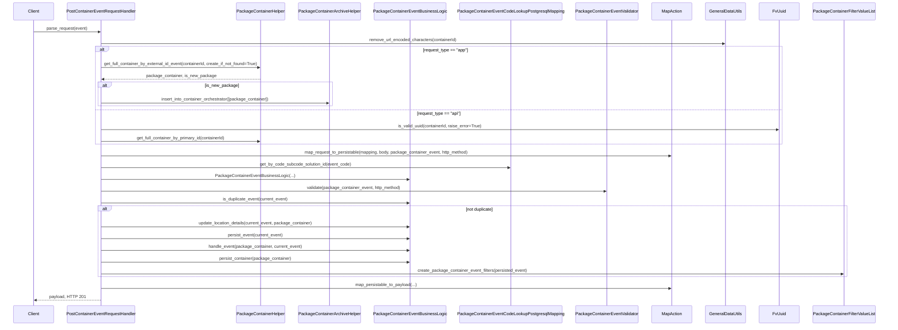

# Diagram: partview_core/partview_service/partview_service/api/package_container/event/handlers/post_container_event.py

> Auto-generated by Obscura crawlers

## Diagram 1

```mermaid
classDiagram
    class PartViewRequestHandler
    class PostContainerEventRequestHandler {
        - __package_container
        - __package_container_event
        - __container_event_api_mapping
        - __event_codes_mapping_data_store
        - __container_helper
        - __package_container_event_bl
        - __filter_value_list
        + get_group_id()
        + is_search_by_primary_id()
        + parse_request()
        + validate_parameters()
        + process()
        + format_result()
        + __remove_url_encoded_characters()
    }
    class PackageContainer
    class PackageContainerEvent
    class PackageContainerEventApiMapping
    class PackageContainerEventCodeLookupPostgresqlMapping
    class PackageContainerHelper
    class PackageContainerEventBusinessLogic
    class PackageContainerArchiveHelper
    class PackageContainerFilterValueList
    class PackageContainerApiMapping
    class PackageContainerEventValidator
    class PackageContainerEventCodeLookup
    class MapAction
    class GeneralDataUtils
    class FvUuid
    PartViewRequestHandler <|-- PostContainerEventRequestHandler
    PostContainerEventRequestHandler --> PackageContainer : uses
    PostContainerEventRequestHandler --> PackageContainerEvent : creates/uses
    PostContainerEventRequestHandler --> PackageContainerEventApiMapping : uses
    PostContainerEventRequestHandler --> PackageContainerEventCodeLookupPostgresqlMapping : uses
    PostContainerEventRequestHandler --> PackageContainerHelper : uses
    PostContainerEventRequestHandler --> PackageContainerEventBusinessLogic : uses
    PostContainerEventRequestHandler --> PackageContainerArchiveHelper : calls
    PostContainerEventRequestHandler --> PackageContainerFilterValueList : creates
    PostContainerEventRequestHandler --> PackageContainerApiMapping : maps to payload
    PostContainerEventRequestHandler --> PackageContainerEventValidator : validates
    PostContainerEventRequestHandler --> PackageContainerEventCodeLookup : queries
    PostContainerEventRequestHandler --> MapAction : maps request/persistable
    PostContainerEventRequestHandler --> GeneralDataUtils : sanitizes input
    PostContainerEventRequestHandler --> FvUuid : validates UUID
```

### SVG

<svg id="container" width="3871.015625" xmlns="http://www.w3.org/2000/svg" class="classDiagram" height="740" viewBox="0 0 3871.015625 740" role="graphics-document document" aria-roledescription="class"><g><defs><marker id="container_class-aggregationStart" class="marker aggregation class" refX="18" refY="7" markerWidth="190" markerHeight="240" orient="auto"><path d="M 18,7 L9,13 L1,7 L9,1 Z"></path></marker></defs><defs><marker id="container_class-aggregationEnd" class="marker aggregation class" refX="1" refY="7" markerWidth="20" markerHeight="28" orient="auto"><path d="M 18,7 L9,13 L1,7 L9,1 Z"></path></marker></defs><defs><marker id="container_class-extensionStart" class="marker extension class" refX="18" refY="7" markerWidth="190" markerHeight="240" orient="auto"><path d="M 1,7 L18,13 V 1 Z"></path></marker></defs><defs><marker id="container_class-extensionEnd" class="marker extension class" refX="1" refY="7" markerWidth="20" markerHeight="28" orient="auto"><path d="M 1,1 V 13 L18,7 Z"></path></marker></defs><defs><marker id="container_class-compositionStart" class="marker composition class" refX="18" refY="7" markerWidth="190" markerHeight="240" orient="auto"><path d="M 18,7 L9,13 L1,7 L9,1 Z"></path></marker></defs><defs><marker id="container_class-compositionEnd" class="marker composition class" refX="1" refY="7" markerWidth="20" markerHeight="28" orient="auto"><path d="M 18,7 L9,13 L1,7 L9,1 Z"></path></marker></defs><defs><marker id="container_class-dependencyStart" class="marker dependency class" refX="6" refY="7" markerWidth="190" markerHeight="240" orient="auto"><path d="M 5,7 L9,13 L1,7 L9,1 Z"></path></marker></defs><defs><marker id="container_class-dependencyEnd" class="marker dependency class" refX="13" refY="7" markerWidth="20" markerHeight="28" orient="auto"><path d="M 18,7 L9,13 L14,7 L9,1 Z"></path></marker></defs><defs><marker id="container_class-lollipopStart" class="marker lollipop class" refX="13" refY="7" markerWidth="190" markerHeight="240" orient="auto"><circle stroke="black" fill="transparent" cx="7" cy="7" r="6"></circle></marker></defs><defs><marker id="container_class-lollipopEnd" class="marker lollipop class" refX="1" refY="7" markerWidth="190" markerHeight="240" orient="auto"><circle stroke="black" fill="transparent" cx="7" cy="7" r="6"></circle></marker></defs><g class="root"><g class="clusters"></g><g class="edgePaths"><path d="M2151.797,109.25L2151.797,110.542C2151.797,111.833,2151.797,114.417,2151.797,119.875C2151.797,125.333,2151.797,133.667,2151.797,137.833L2151.797,142" id="id_PartViewRequestHandler_PostContainerEventRequestHandler_1" class="edge-thickness-normal edge-pattern-solid relation" style=";;;" data-edge="true" data-et="edge" data-id="id_PartViewRequestHandler_PostContainerEventRequestHandler_1" data-points="W3sieCI6MjE1MS43OTY4NzUsInkiOjkyfSx7IngiOjIxNTEuNzk2ODc1LCJ5IjoxMTd9LHsieCI6MjE1MS43OTY4NzUsInkiOjE0Mn1d" marker-start="url(#container_class-extensionStart)"></path><path d="M1936.742,384.331L1628.194,422.109C1319.646,459.887,702.549,535.444,394.001,578.388C85.453,621.333,85.453,631.667,85.453,636.833L85.453,642" id="id_PostContainerEventRequestHandler_PackageContainer_2" class="edge-thickness-normal edge-pattern-solid relation" style=";;;" data-edge="true" data-et="edge" data-id="id_PostContainerEventRequestHandler_PackageContainer_2" data-points="W3sieCI6MTkzNi43NDIxODc1LCJ5IjozODQuMzMwOTcwMzEyOTAxNzR9LHsieCI6ODUuNDUzMTI1LCJ5Ijo2MTF9LHsieCI6ODUuNDUzMTI1LCJ5Ijo2NDh9XQ==" marker-end="url(#container_class-dependencyEnd)"></path><path d="M1936.742,387.55L1665.712,424.792C1394.682,462.033,852.622,536.517,581.592,578.925C310.563,621.333,310.563,631.667,310.563,636.833L310.563,642" id="id_PostContainerEventRequestHandler_PackageContainerEvent_3" class="edge-thickness-normal edge-pattern-solid relation" style=";;;" data-edge="true" data-et="edge" data-id="id_PostContainerEventRequestHandler_PackageContainerEvent_3" data-points="W3sieCI6MTkzNi43NDIxODc1LCJ5IjozODcuNTUwMTk1NjA1ODY5fSx7IngiOjMxMC41NjI1LCJ5Ijo2MTF9LHsieCI6MzEwLjU2MjUsInkiOjY0OH1d" marker-end="url(#container_class-dependencyEnd)"></path><path d="M1936.742,393.042L1713.807,429.369C1490.872,465.695,1045.003,538.347,822.068,579.84C599.133,621.333,599.133,631.667,599.133,636.833L599.133,642" id="id_PostContainerEventRequestHandler_PackageContainerEventApiMapping_4" class="edge-thickness-normal edge-pattern-solid relation" style=";;;" data-edge="true" data-et="edge" data-id="id_PostContainerEventRequestHandler_PackageContainerEventApiMapping_4" data-points="W3sieCI6MTkzNi43NDIxODc1LCJ5IjozOTMuMDQyMjQ1OTM4MTgwOH0seyJ4Ijo1OTkuMTMyODEyNSwieSI6NjExfSx7IngiOjU5OS4xMzI4MTI1LCJ5Ijo2NDh9XQ==" marker-end="url(#container_class-dependencyEnd)"></path><path d="M1936.742,405.377L1781.182,439.648C1625.622,473.918,1314.503,542.459,1158.943,581.896C1003.383,621.333,1003.383,631.667,1003.383,636.833L1003.383,642" id="id_PostContainerEventRequestHandler_PackageContainerEventCodeLookupPostgresqlMapping_5" class="edge-thickness-normal edge-pattern-solid relation" style=";;;" data-edge="true" data-et="edge" data-id="id_PostContainerEventRequestHandler_PackageContainerEventCodeLookupPostgresqlMapping_5" data-points="W3sieCI6MTkzNi43NDIxODc1LCJ5Ijo0MDUuMzc3MzY4MjQ1NjEwNDZ9LHsieCI6MTAwMy4zODI4MTI1LCJ5Ijo2MTF9LHsieCI6MTAwMy4zODI4MTI1LCJ5Ijo2NDh9XQ==" marker-end="url(#container_class-dependencyEnd)"></path><path d="M1936.742,427.478L1842.066,458.065C1747.391,488.652,1558.039,549.826,1463.363,585.58C1368.688,621.333,1368.688,631.667,1368.688,636.833L1368.688,642" id="id_PostContainerEventRequestHandler_PackageContainerHelper_6" class="edge-thickness-normal edge-pattern-solid relation" style=";;;" data-edge="true" data-et="edge" data-id="id_PostContainerEventRequestHandler_PackageContainerHelper_6" data-points="W3sieCI6MTkzNi43NDIxODc1LCJ5Ijo0MjcuNDc3OTUyNDczMTE0fSx7IngiOjEzNjguNjg3NSwieSI6NjExfSx7IngiOjEzNjguNjg3NSwieSI6NjQ4fV0=" marker-end="url(#container_class-dependencyEnd)"></path><path d="M1936.742,470.865L1892.24,494.221C1847.737,517.577,1758.732,564.288,1714.229,592.811C1669.727,621.333,1669.727,631.667,1669.727,636.833L1669.727,642" id="id_PostContainerEventRequestHandler_PackageContainerEventBusinessLogic_7" class="edge-thickness-normal edge-pattern-solid relation" style=";;;" data-edge="true" data-et="edge" data-id="id_PostContainerEventRequestHandler_PackageContainerEventBusinessLogic_7" data-points="W3sieCI6MTkzNi43NDIxODc1LCJ5Ijo0NzAuODY0OTM4MDExNTA2MzV9LHsieCI6MTY2OS43MjY1NjI1LCJ5Ijo2MTF9LHsieCI6MTY2OS43MjY1NjI1LCJ5Ijo2NDh9XQ==" marker-end="url(#container_class-dependencyEnd)"></path><path d="M2020.165,574L2016.407,580.167C2012.649,586.333,2005.133,598.667,2001.375,610C1997.617,621.333,1997.617,631.667,1997.617,636.833L1997.617,642" id="id_PostContainerEventRequestHandler_PackageContainerArchiveHelper_8" class="edge-thickness-normal edge-pattern-solid relation" style=";;;" data-edge="true" data-et="edge" data-id="id_PostContainerEventRequestHandler_PackageContainerArchiveHelper_8" data-points="W3sieCI6MjAyMC4xNjUyMDUwMzk1MjU3LCJ5Ijo1NzR9LHsieCI6MTk5Ny42MTcxODc1LCJ5Ijo2MTF9LHsieCI6MTk5Ny42MTcxODc1LCJ5Ijo2NDh9XQ==" marker-end="url(#container_class-dependencyEnd)"></path><path d="M2283.429,574L2287.187,580.167C2290.945,586.333,2298.461,598.667,2302.219,610C2305.977,621.333,2305.977,631.667,2305.977,636.833L2305.977,642" id="id_PostContainerEventRequestHandler_PackageContainerFilterValueList_9" class="edge-thickness-normal edge-pattern-solid relation" style=";;;" data-edge="true" data-et="edge" data-id="id_PostContainerEventRequestHandler_PackageContainerFilterValueList_9" data-points="W3sieCI6MjI4My40Mjg1NDQ5NjA0NzQ1LCJ5Ijo1NzR9LHsieCI6MjMwNS45NzY1NjI1LCJ5Ijo2MTF9LHsieCI6MjMwNS45NzY1NjI1LCJ5Ijo2NDh9XQ==" marker-end="url(#container_class-dependencyEnd)"></path><path d="M2366.852,477.73L2406.747,499.942C2446.643,522.153,2526.435,566.577,2566.331,593.955C2606.227,621.333,2606.227,631.667,2606.227,636.833L2606.227,642" id="id_PostContainerEventRequestHandler_PackageContainerApiMapping_10" class="edge-thickness-normal edge-pattern-solid relation" style=";;;" data-edge="true" data-et="edge" data-id="id_PostContainerEventRequestHandler_PackageContainerApiMapping_10" data-points="W3sieCI6MjM2Ni44NTE1NjI1LCJ5Ijo0NzcuNzI5OTMyNzc5NzU0ODV9LHsieCI6MjYwNi4yMjY1NjI1LCJ5Ijo2MTF9LHsieCI6MjYwNi4yMjY1NjI1LCJ5Ijo2NDh9XQ==" marker-end="url(#container_class-dependencyEnd)"></path><path d="M2366.852,429.971L2457.007,460.142C2547.161,490.314,2727.471,550.657,2817.626,585.995C2907.781,621.333,2907.781,631.667,2907.781,636.833L2907.781,642" id="id_PostContainerEventRequestHandler_PackageContainerEventValidator_11" class="edge-thickness-normal edge-pattern-solid relation" style=";;;" data-edge="true" data-et="edge" data-id="id_PostContainerEventRequestHandler_PackageContainerEventValidator_11" data-points="W3sieCI6MjM2Ni44NTE1NjI1LCJ5Ijo0MjkuOTcwODQ3MTk4Mzk2MTR9LHsieCI6MjkwNy43ODEyNSwieSI6NjExfSx7IngiOjI5MDcuNzgxMjUsInkiOjY0OH1d" marker-end="url(#container_class-dependencyEnd)"></path><path d="M2366.852,408.39L2510.969,442.158C2655.086,475.927,2943.32,543.463,3087.438,582.398C3231.555,621.333,3231.555,631.667,3231.555,636.833L3231.555,642" id="id_PostContainerEventRequestHandler_PackageContainerEventCodeLookup_12" class="edge-thickness-normal edge-pattern-solid relation" style=";;;" data-edge="true" data-et="edge" data-id="id_PostContainerEventRequestHandler_PackageContainerEventCodeLookup_12" data-points="W3sieCI6MjM2Ni44NTE1NjI1LCJ5Ijo0MDguMzg5ODUxNjAxNTU5OTR9LHsieCI6MzIzMS41NTQ2ODc1LCJ5Ijo2MTF9LHsieCI6MzIzMS41NTQ2ODc1LCJ5Ijo2NDh9XQ==" marker-end="url(#container_class-dependencyEnd)"></path><path d="M2366.852,399.115L2551.563,434.429C2736.273,469.744,3105.695,540.372,3290.406,580.853C3475.117,621.333,3475.117,631.667,3475.117,636.833L3475.117,642" id="id_PostContainerEventRequestHandler_MapAction_13" class="edge-thickness-normal edge-pattern-solid relation" style=";;;" data-edge="true" data-et="edge" data-id="id_PostContainerEventRequestHandler_MapAction_13" data-points="W3sieCI6MjM2Ni44NTE1NjI1LCJ5IjozOTkuMTE1MzkzOTI1MDgxOX0seyJ4IjozNDc1LjExNzE4NzUsInkiOjYxMX0seyJ4IjozNDc1LjExNzE4NzUsInkiOjY0OH1d" marker-end="url(#container_class-dependencyEnd)"></path><path d="M2366.852,394.325L2580.651,430.437C2794.451,466.55,3222.049,538.775,3435.849,580.054C3649.648,621.333,3649.648,631.667,3649.648,636.833L3649.648,642" id="id_PostContainerEventRequestHandler_GeneralDataUtils_14" class="edge-thickness-normal edge-pattern-solid relation" style=";;;" data-edge="true" data-et="edge" data-id="id_PostContainerEventRequestHandler_GeneralDataUtils_14" data-points="W3sieCI6MjM2Ni44NTE1NjI1LCJ5IjozOTQuMzI0NTg0NjkxNjE1Nn0seyJ4IjozNjQ5LjY0ODQzNzUsInkiOjYxMX0seyJ4IjozNjQ5LjY0ODQzNzUsInkiOjY0OH1d" marker-end="url(#container_class-dependencyEnd)"></path><path d="M2366.852,390.81L2607.395,427.508C2847.938,464.207,3329.023,537.603,3569.566,579.468C3810.109,621.333,3810.109,631.667,3810.109,636.833L3810.109,642" id="id_PostContainerEventRequestHandler_FvUuid_15" class="edge-thickness-normal edge-pattern-solid relation" style=";;;" data-edge="true" data-et="edge" data-id="id_PostContainerEventRequestHandler_FvUuid_15" data-points="W3sieCI6MjM2Ni44NTE1NjI1LCJ5IjozOTAuODA5NzYwNDg2OTQwOH0seyJ4IjozODEwLjEwOTM3NSwieSI6NjExfSx7IngiOjM4MTAuMTA5Mzc1LCJ5Ijo2NDh9XQ==" marker-end="url(#container_class-dependencyEnd)"></path></g><g class="edgeLabels"><g class="edgeLabel"><g class="label" data-id="id_PartViewRequestHandler_PostContainerEventRequestHandler_1" transform="translate(0, 0)"><foreignObject width="0" height="0">

</foreignObject></g></g><g class="edgeLabel" transform="translate(85.453125, 611)"><g class="label" data-id="id_PostContainerEventRequestHandler_PackageContainer_2" transform="translate(-16.4921875, -12)"><foreignObject width="32.984375" height="24">

uses

</foreignObject></g></g><g class="edgeLabel" transform="translate(310.5625, 611)"><g class="label" data-id="id_PostContainerEventRequestHandler_PackageContainerEvent_3" transform="translate(-46.578125, -12)"><foreignObject width="93.15625" height="24">

creates/uses

</foreignObject></g></g><g class="edgeLabel" transform="translate(599.1328125, 611)"><g class="label" data-id="id_PostContainerEventRequestHandler_PackageContainerEventApiMapping_4" transform="translate(-16.4921875, -12)"><foreignObject width="32.984375" height="24">

uses

</foreignObject></g></g><g class="edgeLabel" transform="translate(1003.3828125, 611)"><g class="label" data-id="id_PostContainerEventRequestHandler_PackageContainerEventCodeLookupPostgresqlMapping_5" transform="translate(-16.4921875, -12)"><foreignObject width="32.984375" height="24">

uses

</foreignObject></g></g><g class="edgeLabel" transform="translate(1368.6875, 611)"><g class="label" data-id="id_PostContainerEventRequestHandler_PackageContainerHelper_6" transform="translate(-16.4921875, -12)"><foreignObject width="32.984375" height="24">

uses

</foreignObject></g></g><g class="edgeLabel" transform="translate(1669.7265625, 611)"><g class="label" data-id="id_PostContainerEventRequestHandler_PackageContainerEventBusinessLogic_7" transform="translate(-16.4921875, -12)"><foreignObject width="32.984375" height="24">

uses

</foreignObject></g></g><g class="edgeLabel" transform="translate(1997.6171875, 611)"><g class="label" data-id="id_PostContainerEventRequestHandler_PackageContainerArchiveHelper_8" transform="translate(-16.4453125, -12)"><foreignObject width="32.890625" height="24">

calls

</foreignObject></g></g><g class="edgeLabel" transform="translate(2305.9765625, 611)"><g class="label" data-id="id_PostContainerEventRequestHandler_PackageContainerFilterValueList_9" transform="translate(-26.171875, -12)"><foreignObject width="52.34375" height="24">

creates

</foreignObject></g></g><g class="edgeLabel" transform="translate(2606.2265625, 611)"><g class="label" data-id="id_PostContainerEventRequestHandler_PackageContainerApiMapping_10" transform="translate(-60.25, -12)"><foreignObject width="120.5" height="24">

maps to payload

</foreignObject></g></g><g class="edgeLabel" transform="translate(2907.78125, 611)"><g class="label" data-id="id_PostContainerEventRequestHandler_PackageContainerEventValidator_11" transform="translate(-32.6875, -12)"><foreignObject width="65.375" height="24">

validates

</foreignObject></g></g><g class="edgeLabel" transform="translate(3231.5546875, 611)"><g class="label" data-id="id_PostContainerEventRequestHandler_PackageContainerEventCodeLookup_12" transform="translate(-27.2421875, -12)"><foreignObject width="54.484375" height="24">

queries

</foreignObject></g></g><g class="edgeLabel" transform="translate(3475.1171875, 611)"><g class="label" data-id="id_PostContainerEventRequestHandler_MapAction_13" transform="translate(-93.78125, -12)"><foreignObject width="187.5625" height="24">

maps request/persistable

</foreignObject></g></g><g class="edgeLabel" transform="translate(3649.6484375, 611)"><g class="label" data-id="id_PostContainerEventRequestHandler_GeneralDataUtils_14" transform="translate(-52.9921875, -12)"><foreignObject width="105.984375" height="24">

sanitizes input

</foreignObject></g></g><g class="edgeLabel" transform="translate(3810.109375, 611)"><g class="label" data-id="id_PostContainerEventRequestHandler_FvUuid_15" transform="translate(-52.90625, -12)"><foreignObject width="105.8125" height="24">

validates UUID

</foreignObject></g></g></g><g class="nodes"><g class="node default" id="classId-PartViewRequestHandler-0" transform="translate(2151.796875, 50)"><g class="basic label-container"><path d="M-103.359375 -42 L103.359375 -42 L103.359375 42 L-103.359375 42" stroke="none" stroke-width="0" fill="#ECECFF" style=""></path><path d="M-103.359375 -42 C-28.516140135588074 -42, 46.32709472882385 -42, 103.359375 -42 M-103.359375 -42 C-56.34539032526507 -42, -9.331405650530144 -42, 103.359375 -42 M103.359375 -42 C103.359375 -15.032110943348755, 103.359375 11.93577811330249, 103.359375 42 M103.359375 -42 C103.359375 -24.345767464427652, 103.359375 -6.6915349288553045, 103.359375 42 M103.359375 42 C31.454324302249262 42, -40.450726395501476 42, -103.359375 42 M103.359375 42 C59.797941435629035 42, 16.23650787125807 42, -103.359375 42 M-103.359375 42 C-103.359375 12.446858490130477, -103.359375 -17.106283019739045, -103.359375 -42 M-103.359375 42 C-103.359375 20.839383382493075, -103.359375 -0.3212332350138496, -103.359375 -42" stroke="#9370DB" stroke-width="1.3" fill="none" stroke-dasharray="0 0" style=""></path></g><g class="annotation-group text" transform="translate(0, -18)"></g><g class="label-group text" transform="translate(-91.359375, -18)"><g class="label" style="font-weight: bolder" transform="translate(0,-12)"><foreignObject width="182.71875" height="24">

PartViewRequestHandler

</foreignObject></g></g><g class="members-group text" transform="translate(-91.359375, 30)"></g><g class="methods-group text" transform="translate(-91.359375, 60)"></g><g class="divider" style=""><path d="M-103.359375 6 C-44.547241697306696 6, 14.264891605386609 6, 103.359375 6 M-103.359375 6 C-28.064879533304037 6, 47.229615933391926 6, 103.359375 6" stroke="#9370DB" stroke-width="1.3" fill="none" stroke-dasharray="0 0" style=""></path></g><g class="divider" style=""><path d="M-103.359375 24 C-50.96424575908936 24, 1.430883481821283 24, 103.359375 24 M-103.359375 24 C-49.29480202229713 24, 4.769770955405747 24, 103.359375 24" stroke="#9370DB" stroke-width="1.3" fill="none" stroke-dasharray="0 0" style=""></path></g></g><g class="node default" id="classId-PostContainerEventRequestHandler-1" transform="translate(2151.796875, 358)"><g class="basic label-container"><path d="M-215.0546875 -216 L215.0546875 -216 L215.0546875 216 L-215.0546875 216" stroke="none" stroke-width="0" fill="#ECECFF" style=""></path><path d="M-215.0546875 -216 C-101.37121650385755 -216, 12.312254492284893 -216, 215.0546875 -216 M-215.0546875 -216 C-60.38126467194081 -216, 94.29215815611838 -216, 215.0546875 -216 M215.0546875 -216 C215.0546875 -111.00892264990023, 215.0546875 -6.017845299800456, 215.0546875 216 M215.0546875 -216 C215.0546875 -83.2311968164901, 215.0546875 49.537606367019805, 215.0546875 216 M215.0546875 216 C52.84488347915891 216, -109.36492054168218 216, -215.0546875 216 M215.0546875 216 C52.43342237101817 216, -110.18784275796367 216, -215.0546875 216 M-215.0546875 216 C-215.0546875 117.04405257669501, -215.0546875 18.088105153390018, -215.0546875 -216 M-215.0546875 216 C-215.0546875 92.06011870700945, -215.0546875 -31.879762585981098, -215.0546875 -216" stroke="#9370DB" stroke-width="1.3" fill="none" stroke-dasharray="0 0" style=""></path></g><g class="annotation-group text" transform="translate(0, -192)"></g><g class="label-group text" transform="translate(-131.0625, -192)"><g class="label" style="font-weight: bolder" transform="translate(0,-12)"><foreignObject width="262.125" height="24">

PostContainerEventRequestHandler

</foreignObject></g></g><g class="members-group text" transform="translate(-203.0546875, -144)"><g class="label" style="" transform="translate(0,-12)"><foreignObject width="163.03125" height="24">

- __package_container

</foreignObject></g><g class="label" style="" transform="translate(0,12)"><foreignObject width="210.09375" height="24">

- __package_container_event

</foreignObject></g><g class="label" style="" transform="translate(0,36)"><foreignObject width="245.78125" height="24">

- __container_event_api_mapping

</foreignObject></g><g class="label" style="" transform="translate(0,60)"><foreignObject width="275.046875" height="24">

- __event_codes_mapping_data_store

</foreignObject></g><g class="label" style="" transform="translate(0,84)"><foreignObject width="150.28125" height="24">

- __container_helper

</foreignObject></g><g class="label" style="" transform="translate(0,108)"><foreignObject width="232.59375" height="24">

- __package_container_event_bl

</foreignObject></g><g class="label" style="" transform="translate(0,132)"><foreignObject width="136.90625" height="24">

- __filter_value_list

</foreignObject></g></g><g class="methods-group text" transform="translate(-203.0546875, 48)"><g class="label" style="" transform="translate(0,-12)"><foreignObject width="117.875" height="24">

+ get_group_id()

</foreignObject></g><g class="label" style="" transform="translate(0,12)"><foreignObject width="202.09375" height="24">

+ is_search_by_primary_id()

</foreignObject></g><g class="label" style="" transform="translate(0,36)"><foreignObject width="126.046875" height="24">

+ parse_request()

</foreignObject></g><g class="label" style="" transform="translate(0,60)"><foreignObject width="170.953125" height="24">

+ validate_parameters()

</foreignObject></g><g class="label" style="" transform="translate(0,84)"><foreignObject width="77.96875" height="24">

+ process()

</foreignObject></g><g class="label" style="" transform="translate(0,108)"><foreignObject width="121.5" height="24">

+ format_result()

</foreignObject></g><g class="label" style="" transform="translate(0,132)"><foreignObject width="274.859375" height="24">

+ __remove_url_encoded_characters()

</foreignObject></g></g><g class="divider" style=""><path d="M-215.0546875 -168 C-47.27007146564611 -168, 120.51454456870778 -168, 215.0546875 -168 M-215.0546875 -168 C-53.6708854770643 -168, 107.7129165458714 -168, 215.0546875 -168" stroke="#9370DB" stroke-width="1.3" fill="none" stroke-dasharray="0 0" style=""></path></g><g class="divider" style=""><path d="M-215.0546875 24 C-103.1247458662836 24, 8.805195767432792 24, 215.0546875 24 M-215.0546875 24 C-48.196968778279796 24, 118.66074994344041 24, 215.0546875 24" stroke="#9370DB" stroke-width="1.3" fill="none" stroke-dasharray="0 0" style=""></path></g></g><g class="node default" id="classId-PackageContainer-2" transform="translate(85.453125, 690)"><g class="basic label-container"><path d="M-77.453125 -42 L77.453125 -42 L77.453125 42 L-77.453125 42" stroke="none" stroke-width="0" fill="#ECECFF" style=""></path><path d="M-77.453125 -42 C-17.745411157427384 -42, 41.96230268514523 -42, 77.453125 -42 M-77.453125 -42 C-34.10713106847126 -42, 9.238862863057477 -42, 77.453125 -42 M77.453125 -42 C77.453125 -16.543058588042186, 77.453125 8.913882823915628, 77.453125 42 M77.453125 -42 C77.453125 -12.526048657464223, 77.453125 16.947902685071554, 77.453125 42 M77.453125 42 C27.019065169336862 42, -23.414994661326276 42, -77.453125 42 M77.453125 42 C43.38337214164931 42, 9.313619283298621 42, -77.453125 42 M-77.453125 42 C-77.453125 19.239208553684293, -77.453125 -3.5215828926314146, -77.453125 -42 M-77.453125 42 C-77.453125 14.436421135566327, -77.453125 -13.127157728867346, -77.453125 -42" stroke="#9370DB" stroke-width="1.3" fill="none" stroke-dasharray="0 0" style=""></path></g><g class="annotation-group text" transform="translate(0, -18)"></g><g class="label-group text" transform="translate(-65.453125, -18)"><g class="label" style="font-weight: bolder" transform="translate(0,-12)"><foreignObject width="130.90625" height="24">

PackageContainer

</foreignObject></g></g><g class="members-group text" transform="translate(-65.453125, 30)"></g><g class="methods-group text" transform="translate(-65.453125, 60)"></g><g class="divider" style=""><path d="M-77.453125 6 C-29.373049950161658 6, 18.707025099676684 6, 77.453125 6 M-77.453125 6 C-18.112673882096594 6, 41.22777723580681 6, 77.453125 6" stroke="#9370DB" stroke-width="1.3" fill="none" stroke-dasharray="0 0" style=""></path></g><g class="divider" style=""><path d="M-77.453125 24 C-26.778609747207824 24, 23.895905505584352 24, 77.453125 24 M-77.453125 24 C-36.20152903938017 24, 5.050066921239662 24, 77.453125 24" stroke="#9370DB" stroke-width="1.3" fill="none" stroke-dasharray="0 0" style=""></path></g></g><g class="node default" id="classId-PackageContainerEvent-3" transform="translate(310.5625, 690)"><g class="basic label-container"><path d="M-97.65625 -42 L97.65625 -42 L97.65625 42 L-97.65625 42" stroke="none" stroke-width="0" fill="#ECECFF" style=""></path><path d="M-97.65625 -42 C-45.97441110812848 -42, 5.707427783743043 -42, 97.65625 -42 M-97.65625 -42 C-50.02723384250318 -42, -2.398217685006358 -42, 97.65625 -42 M97.65625 -42 C97.65625 -14.18217657348903, 97.65625 13.635646853021939, 97.65625 42 M97.65625 -42 C97.65625 -24.041018049986462, 97.65625 -6.082036099972925, 97.65625 42 M97.65625 42 C28.985794421358392 42, -39.684661157283216 42, -97.65625 42 M97.65625 42 C49.734768305397516 42, 1.813286610795032 42, -97.65625 42 M-97.65625 42 C-97.65625 18.978030624774632, -97.65625 -4.043938750450735, -97.65625 -42 M-97.65625 42 C-97.65625 15.15016377834624, -97.65625 -11.69967244330752, -97.65625 -42" stroke="#9370DB" stroke-width="1.3" fill="none" stroke-dasharray="0 0" style=""></path></g><g class="annotation-group text" transform="translate(0, -18)"></g><g class="label-group text" transform="translate(-85.65625, -18)"><g class="label" style="font-weight: bolder" transform="translate(0,-12)"><foreignObject width="171.3125" height="24">

PackageContainerEvent

</foreignObject></g></g><g class="members-group text" transform="translate(-85.65625, 30)"></g><g class="methods-group text" transform="translate(-85.65625, 60)"></g><g class="divider" style=""><path d="M-97.65625 6 C-28.4718882645858 6, 40.7124734708284 6, 97.65625 6 M-97.65625 6 C-25.683764883689605 6, 46.28872023262079 6, 97.65625 6" stroke="#9370DB" stroke-width="1.3" fill="none" stroke-dasharray="0 0" style=""></path></g><g class="divider" style=""><path d="M-97.65625 24 C-40.44318602978921 24, 16.76987794042158 24, 97.65625 24 M-97.65625 24 C-33.21288083809581 24, 31.230488323808373 24, 97.65625 24" stroke="#9370DB" stroke-width="1.3" fill="none" stroke-dasharray="0 0" style=""></path></g></g><g class="node default" id="classId-PackageContainerEventApiMapping-4" transform="translate(599.1328125, 690)"><g class="basic label-container"><path d="M-140.9140625 -42 L140.9140625 -42 L140.9140625 42 L-140.9140625 42" stroke="none" stroke-width="0" fill="#ECECFF" style=""></path><path d="M-140.9140625 -42 C-70.89453996954992 -42, -0.8750174390998495 -42, 140.9140625 -42 M-140.9140625 -42 C-45.34811162679172 -42, 50.21783924641656 -42, 140.9140625 -42 M140.9140625 -42 C140.9140625 -8.58977999183027, 140.9140625 24.82044001633946, 140.9140625 42 M140.9140625 -42 C140.9140625 -10.701101098756546, 140.9140625 20.59779780248691, 140.9140625 42 M140.9140625 42 C40.59137142962729 42, -59.731319640745426 42, -140.9140625 42 M140.9140625 42 C66.44173697388106 42, -8.030588552237873 42, -140.9140625 42 M-140.9140625 42 C-140.9140625 25.099885597822244, -140.9140625 8.199771195644487, -140.9140625 -42 M-140.9140625 42 C-140.9140625 10.856775721956367, -140.9140625 -20.286448556087265, -140.9140625 -42" stroke="#9370DB" stroke-width="1.3" fill="none" stroke-dasharray="0 0" style=""></path></g><g class="annotation-group text" transform="translate(0, -18)"></g><g class="label-group text" transform="translate(-128.9140625, -18)"><g class="label" style="font-weight: bolder" transform="translate(0,-12)"><foreignObject width="257.828125" height="24">

PackageContainerEventApiMapping

</foreignObject></g></g><g class="members-group text" transform="translate(-128.9140625, 30)"></g><g class="methods-group text" transform="translate(-128.9140625, 60)"></g><g class="divider" style=""><path d="M-140.9140625 6 C-39.09785407572063 6, 62.718354348558734 6, 140.9140625 6 M-140.9140625 6 C-55.86822356571116 6, 29.177615368577676 6, 140.9140625 6" stroke="#9370DB" stroke-width="1.3" fill="none" stroke-dasharray="0 0" style=""></path></g><g class="divider" style=""><path d="M-140.9140625 24 C-43.59639854256575 24, 53.7212654148685 24, 140.9140625 24 M-140.9140625 24 C-83.68330127185064 24, -26.45254004370129 24, 140.9140625 24" stroke="#9370DB" stroke-width="1.3" fill="none" stroke-dasharray="0 0" style=""></path></g></g><g class="node default" id="classId-PackageContainerEventCodeLookupPostgresqlMapping-5" transform="translate(1003.3828125, 690)"><g class="basic label-container"><path d="M-213.3359375 -42 L213.3359375 -42 L213.3359375 42 L-213.3359375 42" stroke="none" stroke-width="0" fill="#ECECFF" style=""></path><path d="M-213.3359375 -42 C-52.857318584441515 -42, 107.62130033111697 -42, 213.3359375 -42 M-213.3359375 -42 C-74.16304067995392 -42, 65.00985614009215 -42, 213.3359375 -42 M213.3359375 -42 C213.3359375 -18.792862986014033, 213.3359375 4.414274027971935, 213.3359375 42 M213.3359375 -42 C213.3359375 -12.600098768543482, 213.3359375 16.799802462913036, 213.3359375 42 M213.3359375 42 C66.3191153530095 42, -80.69770679398101 42, -213.3359375 42 M213.3359375 42 C70.7489842507294 42, -71.83796899854121 42, -213.3359375 42 M-213.3359375 42 C-213.3359375 19.61160025388547, -213.3359375 -2.7767994922290598, -213.3359375 -42 M-213.3359375 42 C-213.3359375 9.01671608172186, -213.3359375 -23.96656783655628, -213.3359375 -42" stroke="#9370DB" stroke-width="1.3" fill="none" stroke-dasharray="0 0" style=""></path></g><g class="annotation-group text" transform="translate(0, -18)"></g><g class="label-group text" transform="translate(-201.3359375, -18)"><g class="label" style="font-weight: bolder" transform="translate(0,-12)"><foreignObject width="402.671875" height="24">

PackageContainerEventCodeLookupPostgresqlMapping

</foreignObject></g></g><g class="members-group text" transform="translate(-201.3359375, 30)"></g><g class="methods-group text" transform="translate(-201.3359375, 60)"></g><g class="divider" style=""><path d="M-213.3359375 6 C-110.9775899694357 6, -8.619242438871396 6, 213.3359375 6 M-213.3359375 6 C-102.41796024671477 6, 8.50001700657046 6, 213.3359375 6" stroke="#9370DB" stroke-width="1.3" fill="none" stroke-dasharray="0 0" style=""></path></g><g class="divider" style=""><path d="M-213.3359375 24 C-85.41944904378958 24, 42.49703941242083 24, 213.3359375 24 M-213.3359375 24 C-96.7154521866888 24, 19.905033126622413 24, 213.3359375 24" stroke="#9370DB" stroke-width="1.3" fill="none" stroke-dasharray="0 0" style=""></path></g></g><g class="node default" id="classId-PackageContainerHelper-6" transform="translate(1368.6875, 690)"><g class="basic label-container"><path d="M-101.96875 -42 L101.96875 -42 L101.96875 42 L-101.96875 42" stroke="none" stroke-width="0" fill="#ECECFF" style=""></path><path d="M-101.96875 -42 C-28.97228624821416 -42, 44.02417750357168 -42, 101.96875 -42 M-101.96875 -42 C-29.599173704909063 -42, 42.770402590181874 -42, 101.96875 -42 M101.96875 -42 C101.96875 -14.499894298565735, 101.96875 13.00021140286853, 101.96875 42 M101.96875 -42 C101.96875 -16.487562349539655, 101.96875 9.02487530092069, 101.96875 42 M101.96875 42 C23.564231103929473 42, -54.840287792141055 42, -101.96875 42 M101.96875 42 C40.633019896577984 42, -20.70271020684403 42, -101.96875 42 M-101.96875 42 C-101.96875 9.305826224735874, -101.96875 -23.388347550528252, -101.96875 -42 M-101.96875 42 C-101.96875 14.0093134550878, -101.96875 -13.981373089824402, -101.96875 -42" stroke="#9370DB" stroke-width="1.3" fill="none" stroke-dasharray="0 0" style=""></path></g><g class="annotation-group text" transform="translate(0, -18)"></g><g class="label-group text" transform="translate(-89.96875, -18)"><g class="label" style="font-weight: bolder" transform="translate(0,-12)"><foreignObject width="179.9375" height="24">

PackageContainerHelper

</foreignObject></g></g><g class="members-group text" transform="translate(-89.96875, 30)"></g><g class="methods-group text" transform="translate(-89.96875, 60)"></g><g class="divider" style=""><path d="M-101.96875 6 C-54.89446853429589 6, -7.820187068591778 6, 101.96875 6 M-101.96875 6 C-32.332001238804224 6, 37.30474752239155 6, 101.96875 6" stroke="#9370DB" stroke-width="1.3" fill="none" stroke-dasharray="0 0" style=""></path></g><g class="divider" style=""><path d="M-101.96875 24 C-53.57793343980694 24, -5.187116879613882 24, 101.96875 24 M-101.96875 24 C-50.03729355650448 24, 1.8941628869910403 24, 101.96875 24" stroke="#9370DB" stroke-width="1.3" fill="none" stroke-dasharray="0 0" style=""></path></g></g><g class="node default" id="classId-PackageContainerEventBusinessLogic-7" transform="translate(1669.7265625, 690)"><g class="basic label-container"><path d="M-149.0703125 -42 L149.0703125 -42 L149.0703125 42 L-149.0703125 42" stroke="none" stroke-width="0" fill="#ECECFF" style=""></path><path d="M-149.0703125 -42 C-30.34359739992098 -42, 88.38311770015804 -42, 149.0703125 -42 M-149.0703125 -42 C-46.888052524200376 -42, 55.29420745159925 -42, 149.0703125 -42 M149.0703125 -42 C149.0703125 -10.974016040241441, 149.0703125 20.051967919517118, 149.0703125 42 M149.0703125 -42 C149.0703125 -23.50768657221289, 149.0703125 -5.01537314442578, 149.0703125 42 M149.0703125 42 C42.81795907348152 42, -63.434394353036964 42, -149.0703125 42 M149.0703125 42 C36.48470253454761 42, -76.10090743090478 42, -149.0703125 42 M-149.0703125 42 C-149.0703125 11.115476918319516, -149.0703125 -19.76904616336097, -149.0703125 -42 M-149.0703125 42 C-149.0703125 13.74132878035433, -149.0703125 -14.51734243929134, -149.0703125 -42" stroke="#9370DB" stroke-width="1.3" fill="none" stroke-dasharray="0 0" style=""></path></g><g class="annotation-group text" transform="translate(0, -18)"></g><g class="label-group text" transform="translate(-137.0703125, -18)"><g class="label" style="font-weight: bolder" transform="translate(0,-12)"><foreignObject width="274.140625" height="24">

PackageContainerEventBusinessLogic

</foreignObject></g></g><g class="members-group text" transform="translate(-137.0703125, 30)"></g><g class="methods-group text" transform="translate(-137.0703125, 60)"></g><g class="divider" style=""><path d="M-149.0703125 6 C-41.46369418338482 6, 66.14292413323037 6, 149.0703125 6 M-149.0703125 6 C-88.2427748495728 6, -27.415237199145594 6, 149.0703125 6" stroke="#9370DB" stroke-width="1.3" fill="none" stroke-dasharray="0 0" style=""></path></g><g class="divider" style=""><path d="M-149.0703125 24 C-46.07490968623571 24, 56.92049312752857 24, 149.0703125 24 M-149.0703125 24 C-73.38306258693136 24, 2.3041873261372814 24, 149.0703125 24" stroke="#9370DB" stroke-width="1.3" fill="none" stroke-dasharray="0 0" style=""></path></g></g><g class="node default" id="classId-PackageContainerArchiveHelper-8" transform="translate(1997.6171875, 690)"><g class="basic label-container"><path d="M-128.8203125 -42 L128.8203125 -42 L128.8203125 42 L-128.8203125 42" stroke="none" stroke-width="0" fill="#ECECFF" style=""></path><path d="M-128.8203125 -42 C-65.88416885989086 -42, -2.9480252197817265 -42, 128.8203125 -42 M-128.8203125 -42 C-48.57898221363169 -42, 31.66234807273662 -42, 128.8203125 -42 M128.8203125 -42 C128.8203125 -15.200843151799099, 128.8203125 11.598313696401803, 128.8203125 42 M128.8203125 -42 C128.8203125 -15.7168564167727, 128.8203125 10.5662871664546, 128.8203125 42 M128.8203125 42 C47.82043084235647 42, -33.179450815287055 42, -128.8203125 42 M128.8203125 42 C27.96833217091242 42, -72.88364815817516 42, -128.8203125 42 M-128.8203125 42 C-128.8203125 18.94098054725326, -128.8203125 -4.118038905493478, -128.8203125 -42 M-128.8203125 42 C-128.8203125 10.498365582803658, -128.8203125 -21.003268834392685, -128.8203125 -42" stroke="#9370DB" stroke-width="1.3" fill="none" stroke-dasharray="0 0" style=""></path></g><g class="annotation-group text" transform="translate(0, -18)"></g><g class="label-group text" transform="translate(-116.8203125, -18)"><g class="label" style="font-weight: bolder" transform="translate(0,-12)"><foreignObject width="233.640625" height="24">

PackageContainerArchiveHelper

</foreignObject></g></g><g class="members-group text" transform="translate(-116.8203125, 30)"></g><g class="methods-group text" transform="translate(-116.8203125, 60)"></g><g class="divider" style=""><path d="M-128.8203125 6 C-39.11120411873094 6, 50.59790426253812 6, 128.8203125 6 M-128.8203125 6 C-57.88450880031655 6, 13.051294899366894 6, 128.8203125 6" stroke="#9370DB" stroke-width="1.3" fill="none" stroke-dasharray="0 0" style=""></path></g><g class="divider" style=""><path d="M-128.8203125 24 C-45.666639843007744 24, 37.48703281398451 24, 128.8203125 24 M-128.8203125 24 C-45.22489805873575 24, 38.37051638252851 24, 128.8203125 24" stroke="#9370DB" stroke-width="1.3" fill="none" stroke-dasharray="0 0" style=""></path></g></g><g class="node default" id="classId-PackageContainerFilterValueList-9" transform="translate(2305.9765625, 690)"><g class="basic label-container"><path d="M-129.5390625 -42 L129.5390625 -42 L129.5390625 42 L-129.5390625 42" stroke="none" stroke-width="0" fill="#ECECFF" style=""></path><path d="M-129.5390625 -42 C-34.69083139980357 -42, 60.15739970039286 -42, 129.5390625 -42 M-129.5390625 -42 C-43.041385548566936 -42, 43.45629140286613 -42, 129.5390625 -42 M129.5390625 -42 C129.5390625 -21.72311789346762, 129.5390625 -1.4462357869352402, 129.5390625 42 M129.5390625 -42 C129.5390625 -15.052064756073342, 129.5390625 11.895870487853315, 129.5390625 42 M129.5390625 42 C76.91757934071421 42, 24.29609618142841 42, -129.5390625 42 M129.5390625 42 C76.4620588353573 42, 23.385055170714594 42, -129.5390625 42 M-129.5390625 42 C-129.5390625 18.96359699086817, -129.5390625 -4.0728060182636625, -129.5390625 -42 M-129.5390625 42 C-129.5390625 15.744325111841597, -129.5390625 -10.511349776316806, -129.5390625 -42" stroke="#9370DB" stroke-width="1.3" fill="none" stroke-dasharray="0 0" style=""></path></g><g class="annotation-group text" transform="translate(0, -18)"></g><g class="label-group text" transform="translate(-117.5390625, -18)"><g class="label" style="font-weight: bolder" transform="translate(0,-12)"><foreignObject width="235.078125" height="24">

PackageContainerFilterValueList

</foreignObject></g></g><g class="members-group text" transform="translate(-117.5390625, 30)"></g><g class="methods-group text" transform="translate(-117.5390625, 60)"></g><g class="divider" style=""><path d="M-129.5390625 6 C-77.3616973903728 6, -25.184332280745593 6, 129.5390625 6 M-129.5390625 6 C-59.10051008756696 6, 11.33804232486608 6, 129.5390625 6" stroke="#9370DB" stroke-width="1.3" fill="none" stroke-dasharray="0 0" style=""></path></g><g class="divider" style=""><path d="M-129.5390625 24 C-37.055243451606884 24, 55.42857559678623 24, 129.5390625 24 M-129.5390625 24 C-35.0966664628091 24, 59.34572957438181 24, 129.5390625 24" stroke="#9370DB" stroke-width="1.3" fill="none" stroke-dasharray="0 0" style=""></path></g></g><g class="node default" id="classId-PackageContainerApiMapping-10" transform="translate(2606.2265625, 690)"><g class="basic label-container"><path d="M-120.7109375 -42 L120.7109375 -42 L120.7109375 42 L-120.7109375 42" stroke="none" stroke-width="0" fill="#ECECFF" style=""></path><path d="M-120.7109375 -42 C-63.89724226656328 -42, -7.083547033126564 -42, 120.7109375 -42 M-120.7109375 -42 C-71.04279476943681 -42, -21.37465203887362 -42, 120.7109375 -42 M120.7109375 -42 C120.7109375 -17.485228041550084, 120.7109375 7.029543916899833, 120.7109375 42 M120.7109375 -42 C120.7109375 -23.262501108546722, 120.7109375 -4.525002217093444, 120.7109375 42 M120.7109375 42 C59.49032444996928 42, -1.7302886000614421 42, -120.7109375 42 M120.7109375 42 C39.98529943423803 42, -40.74033863152394 42, -120.7109375 42 M-120.7109375 42 C-120.7109375 22.417899390429035, -120.7109375 2.8357987808580702, -120.7109375 -42 M-120.7109375 42 C-120.7109375 9.71945215028984, -120.7109375 -22.56109569942032, -120.7109375 -42" stroke="#9370DB" stroke-width="1.3" fill="none" stroke-dasharray="0 0" style=""></path></g><g class="annotation-group text" transform="translate(0, -18)"></g><g class="label-group text" transform="translate(-108.7109375, -18)"><g class="label" style="font-weight: bolder" transform="translate(0,-12)"><foreignObject width="217.421875" height="24">

PackageContainerApiMapping

</foreignObject></g></g><g class="members-group text" transform="translate(-108.7109375, 30)"></g><g class="methods-group text" transform="translate(-108.7109375, 60)"></g><g class="divider" style=""><path d="M-120.7109375 6 C-66.93296167255542 6, -13.154985845110843 6, 120.7109375 6 M-120.7109375 6 C-48.50330321511339 6, 23.704331069773218 6, 120.7109375 6" stroke="#9370DB" stroke-width="1.3" fill="none" stroke-dasharray="0 0" style=""></path></g><g class="divider" style=""><path d="M-120.7109375 24 C-52.750070271622945 24, 15.210796956754109 24, 120.7109375 24 M-120.7109375 24 C-38.582666878261804 24, 43.54560374347639 24, 120.7109375 24" stroke="#9370DB" stroke-width="1.3" fill="none" stroke-dasharray="0 0" style=""></path></g></g><g class="node default" id="classId-PackageContainerEventValidator-11" transform="translate(2907.78125, 690)"><g class="basic label-container"><path d="M-130.84375 -42 L130.84375 -42 L130.84375 42 L-130.84375 42" stroke="none" stroke-width="0" fill="#ECECFF" style=""></path><path d="M-130.84375 -42 C-35.41624297203536 -42, 60.011264055929274 -42, 130.84375 -42 M-130.84375 -42 C-78.04859996406275 -42, -25.25344992812549 -42, 130.84375 -42 M130.84375 -42 C130.84375 -9.295063406003344, 130.84375 23.409873187993313, 130.84375 42 M130.84375 -42 C130.84375 -21.182102605497803, 130.84375 -0.3642052109956069, 130.84375 42 M130.84375 42 C27.069138372529196 42, -76.70547325494161 42, -130.84375 42 M130.84375 42 C45.335572205237966 42, -40.17260558952407 42, -130.84375 42 M-130.84375 42 C-130.84375 11.580763657399373, -130.84375 -18.838472685201253, -130.84375 -42 M-130.84375 42 C-130.84375 13.935363233670774, -130.84375 -14.129273532658452, -130.84375 -42" stroke="#9370DB" stroke-width="1.3" fill="none" stroke-dasharray="0 0" style=""></path></g><g class="annotation-group text" transform="translate(0, -18)"></g><g class="label-group text" transform="translate(-118.84375, -18)"><g class="label" style="font-weight: bolder" transform="translate(0,-12)"><foreignObject width="237.6875" height="24">

PackageContainerEventValidator

</foreignObject></g></g><g class="members-group text" transform="translate(-118.84375, 30)"></g><g class="methods-group text" transform="translate(-118.84375, 60)"></g><g class="divider" style=""><path d="M-130.84375 6 C-74.66933639668227 6, -18.494922793364523 6, 130.84375 6 M-130.84375 6 C-55.511250355601575 6, 19.82124928879685 6, 130.84375 6" stroke="#9370DB" stroke-width="1.3" fill="none" stroke-dasharray="0 0" style=""></path></g><g class="divider" style=""><path d="M-130.84375 24 C-43.06816994203061 24, 44.707410115938785 24, 130.84375 24 M-130.84375 24 C-75.45838835848903 24, -20.073026716978063 24, 130.84375 24" stroke="#9370DB" stroke-width="1.3" fill="none" stroke-dasharray="0 0" style=""></path></g></g><g class="node default" id="classId-PackageContainerEventCodeLookup-12" transform="translate(3231.5546875, 690)"><g class="basic label-container"><path d="M-142.9296875 -42 L142.9296875 -42 L142.9296875 42 L-142.9296875 42" stroke="none" stroke-width="0" fill="#ECECFF" style=""></path><path d="M-142.9296875 -42 C-70.07949939862515 -42, 2.770688702749709 -42, 142.9296875 -42 M-142.9296875 -42 C-29.78671257257284 -42, 83.35626235485432 -42, 142.9296875 -42 M142.9296875 -42 C142.9296875 -22.531028353954678, 142.9296875 -3.062056707909356, 142.9296875 42 M142.9296875 -42 C142.9296875 -12.409845519609853, 142.9296875 17.180308960780295, 142.9296875 42 M142.9296875 42 C78.1541378699154 42, 13.378588239830805 42, -142.9296875 42 M142.9296875 42 C40.06578427988818 42, -62.798118940223645 42, -142.9296875 42 M-142.9296875 42 C-142.9296875 18.29688397866891, -142.9296875 -5.406232042662182, -142.9296875 -42 M-142.9296875 42 C-142.9296875 22.86145178005779, -142.9296875 3.722903560115583, -142.9296875 -42" stroke="#9370DB" stroke-width="1.3" fill="none" stroke-dasharray="0 0" style=""></path></g><g class="annotation-group text" transform="translate(0, -18)"></g><g class="label-group text" transform="translate(-130.9296875, -18)"><g class="label" style="font-weight: bolder" transform="translate(0,-12)"><foreignObject width="261.859375" height="24">

PackageContainerEventCodeLookup

</foreignObject></g></g><g class="members-group text" transform="translate(-130.9296875, 30)"></g><g class="methods-group text" transform="translate(-130.9296875, 60)"></g><g class="divider" style=""><path d="M-142.9296875 6 C-41.12896335057849 6, 60.671760798843025 6, 142.9296875 6 M-142.9296875 6 C-35.33629305757897 6, 72.25710138484206 6, 142.9296875 6" stroke="#9370DB" stroke-width="1.3" fill="none" stroke-dasharray="0 0" style=""></path></g><g class="divider" style=""><path d="M-142.9296875 24 C-70.55196355037344 24, 1.825760399253113 24, 142.9296875 24 M-142.9296875 24 C-52.6928090980377 24, 37.5440693039246 24, 142.9296875 24" stroke="#9370DB" stroke-width="1.3" fill="none" stroke-dasharray="0 0" style=""></path></g></g><g class="node default" id="classId-MapAction-13" transform="translate(3475.1171875, 690)"><g class="basic label-container"><path d="M-50.6328125 -42 L50.6328125 -42 L50.6328125 42 L-50.6328125 42" stroke="none" stroke-width="0" fill="#ECECFF" style=""></path><path d="M-50.6328125 -42 C-20.98854623963596 -42, 8.655720020728083 -42, 50.6328125 -42 M-50.6328125 -42 C-22.889775848710162 -42, 4.853260802579676 -42, 50.6328125 -42 M50.6328125 -42 C50.6328125 -16.75788132316421, 50.6328125 8.484237353671581, 50.6328125 42 M50.6328125 -42 C50.6328125 -20.187498058095386, 50.6328125 1.625003883809228, 50.6328125 42 M50.6328125 42 C18.967230281213443 42, -12.698351937573115 42, -50.6328125 42 M50.6328125 42 C20.58122153292572 42, -9.470369434148559 42, -50.6328125 42 M-50.6328125 42 C-50.6328125 18.05252139676489, -50.6328125 -5.894957206470217, -50.6328125 -42 M-50.6328125 42 C-50.6328125 17.720205476799215, -50.6328125 -6.55958904640157, -50.6328125 -42" stroke="#9370DB" stroke-width="1.3" fill="none" stroke-dasharray="0 0" style=""></path></g><g class="annotation-group text" transform="translate(0, -18)"></g><g class="label-group text" transform="translate(-38.6328125, -18)"><g class="label" style="font-weight: bolder" transform="translate(0,-12)"><foreignObject width="77.265625" height="24">

MapAction

</foreignObject></g></g><g class="members-group text" transform="translate(-38.6328125, 30)"></g><g class="methods-group text" transform="translate(-38.6328125, 60)"></g><g class="divider" style=""><path d="M-50.6328125 6 C-16.988295249238995 6, 16.65622200152201 6, 50.6328125 6 M-50.6328125 6 C-26.39162050967619 6, -2.1504285193523813 6, 50.6328125 6" stroke="#9370DB" stroke-width="1.3" fill="none" stroke-dasharray="0 0" style=""></path></g><g class="divider" style=""><path d="M-50.6328125 24 C-30.045389491345407 24, -9.457966482690814 24, 50.6328125 24 M-50.6328125 24 C-11.256534172934785 24, 28.11974415413043 24, 50.6328125 24" stroke="#9370DB" stroke-width="1.3" fill="none" stroke-dasharray="0 0" style=""></path></g></g><g class="node default" id="classId-GeneralDataUtils-14" transform="translate(3649.6484375, 690)"><g class="basic label-container"><path d="M-73.8984375 -42 L73.8984375 -42 L73.8984375 42 L-73.8984375 42" stroke="none" stroke-width="0" fill="#ECECFF" style=""></path><path d="M-73.8984375 -42 C-16.631855138703493 -42, 40.634727222593014 -42, 73.8984375 -42 M-73.8984375 -42 C-32.1791663122021 -42, 9.540104875595802 -42, 73.8984375 -42 M73.8984375 -42 C73.8984375 -23.81798709972006, 73.8984375 -5.6359741994401205, 73.8984375 42 M73.8984375 -42 C73.8984375 -12.000651271946008, 73.8984375 17.998697456107983, 73.8984375 42 M73.8984375 42 C30.79944525276602 42, -12.29954699446796 42, -73.8984375 42 M73.8984375 42 C31.319921885399367 42, -11.258593729201266 42, -73.8984375 42 M-73.8984375 42 C-73.8984375 21.979106478203665, -73.8984375 1.9582129564073298, -73.8984375 -42 M-73.8984375 42 C-73.8984375 22.97654405271892, -73.8984375 3.9530881054378426, -73.8984375 -42" stroke="#9370DB" stroke-width="1.3" fill="none" stroke-dasharray="0 0" style=""></path></g><g class="annotation-group text" transform="translate(0, -18)"></g><g class="label-group text" transform="translate(-61.8984375, -18)"><g class="label" style="font-weight: bolder" transform="translate(0,-12)"><foreignObject width="123.796875" height="24">

GeneralDataUtils

</foreignObject></g></g><g class="members-group text" transform="translate(-61.8984375, 30)"></g><g class="methods-group text" transform="translate(-61.8984375, 60)"></g><g class="divider" style=""><path d="M-73.8984375 6 C-41.48056361791996 6, -9.062689735839925 6, 73.8984375 6 M-73.8984375 6 C-30.543278859463655 6, 12.81187978107269 6, 73.8984375 6" stroke="#9370DB" stroke-width="1.3" fill="none" stroke-dasharray="0 0" style=""></path></g><g class="divider" style=""><path d="M-73.8984375 24 C-31.314418998102326 24, 11.269599503795348 24, 73.8984375 24 M-73.8984375 24 C-36.46951219931076 24, 0.9594131013784732 24, 73.8984375 24" stroke="#9370DB" stroke-width="1.3" fill="none" stroke-dasharray="0 0" style=""></path></g></g><g class="node default" id="classId-FvUuid-15" transform="translate(3810.109375, 690)"><g class="basic label-container"><path d="M-36.5625 -42 L36.5625 -42 L36.5625 42 L-36.5625 42" stroke="none" stroke-width="0" fill="#ECECFF" style=""></path><path d="M-36.5625 -42 C-20.66137210697913 -42, -4.760244213958256 -42, 36.5625 -42 M-36.5625 -42 C-14.917557987601196 -42, 6.727384024797608 -42, 36.5625 -42 M36.5625 -42 C36.5625 -12.05229533453651, 36.5625 17.89540933092698, 36.5625 42 M36.5625 -42 C36.5625 -22.61500699111998, 36.5625 -3.23001398223996, 36.5625 42 M36.5625 42 C16.792084734196756 42, -2.9783305316064883 42, -36.5625 42 M36.5625 42 C17.06342817579283 42, -2.4356436484143416 42, -36.5625 42 M-36.5625 42 C-36.5625 19.18453778088707, -36.5625 -3.630924438225861, -36.5625 -42 M-36.5625 42 C-36.5625 14.022456089725218, -36.5625 -13.955087820549565, -36.5625 -42" stroke="#9370DB" stroke-width="1.3" fill="none" stroke-dasharray="0 0" style=""></path></g><g class="annotation-group text" transform="translate(0, -18)"></g><g class="label-group text" transform="translate(-24.5625, -18)"><g class="label" style="font-weight: bolder" transform="translate(0,-12)"><foreignObject width="49.125" height="24">

FvUuid

</foreignObject></g></g><g class="members-group text" transform="translate(-24.5625, 30)"></g><g class="methods-group text" transform="translate(-24.5625, 60)"></g><g class="divider" style=""><path d="M-36.5625 6 C-17.726362249678676 6, 1.1097755006426482 6, 36.5625 6 M-36.5625 6 C-21.036140609926296 6, -5.5097812198525915 6, 36.5625 6" stroke="#9370DB" stroke-width="1.3" fill="none" stroke-dasharray="0 0" style=""></path></g><g class="divider" style=""><path d="M-36.5625 24 C-8.767421187020421 24, 19.027657625959158 24, 36.5625 24 M-36.5625 24 C-14.698557163498652 24, 7.165385673002696 24, 36.5625 24" stroke="#9370DB" stroke-width="1.3" fill="none" stroke-dasharray="0 0" style=""></path></g></g></g></g></g></svg>

## Diagram 2

### SVG

<svg id="container" width="3505" xmlns="http://www.w3.org/2000/svg" height="1293" viewBox="-50 -10 3505 1293" role="graphics-document document" aria-roledescription="sequence"><g><rect x="3154" y="1207" fill="#eaeaea" stroke="#666" width="251" height="65" name="PackageContainerFilterValueList" rx="3" ry="3" class="actor actor-bottom"></rect><text x="3279.5" y="1239.5" dominant-baseline="central" alignment-baseline="central" class="actor actor-box" style="text-anchor: middle; font-size: 16px; font-weight: 400;"><tspan x="3279.5" dy="0">PackageContainerFilterValueList</tspan></text></g><g><rect x="2954" y="1207" fill="#eaeaea" stroke="#666" width="150" height="65" name="FvUuid" rx="3" ry="3" class="actor actor-bottom"></rect><text x="3029" y="1239.5" dominant-baseline="central" alignment-baseline="central" class="actor actor-box" style="text-anchor: middle; font-size: 16px; font-weight: 400;"><tspan x="3029" dy="0">FvUuid</tspan></text></g><g><rect x="2754" y="1207" fill="#eaeaea" stroke="#666" width="150" height="65" name="GeneralDataUtils" rx="3" ry="3" class="actor actor-bottom"></rect><text x="2829" y="1239.5" dominant-baseline="central" alignment-baseline="central" class="actor actor-box" style="text-anchor: middle; font-size: 16px; font-weight: 400;"><tspan x="2829" dy="0">GeneralDataUtils</tspan></text></g><g><rect x="2554" y="1207" fill="#eaeaea" stroke="#666" width="150" height="65" name="Mapper" rx="3" ry="3" class="actor actor-bottom"></rect><text x="2629" y="1239.5" dominant-baseline="central" alignment-baseline="central" class="actor actor-box" style="text-anchor: middle; font-size: 16px; font-weight: 400;"><tspan x="2629" dy="0">MapAction</tspan></text></g><g><rect x="2249" y="1207" fill="#eaeaea" stroke="#666" width="255" height="65" name="Validator" rx="3" ry="3" class="actor actor-bottom"></rect><text x="2376.5" y="1239.5" dominant-baseline="central" alignment-baseline="central" class="actor actor-box" style="text-anchor: middle; font-size: 16px; font-weight: 400;"><tspan x="2376.5" dy="0">PackageContainerEventValidator</tspan></text></g><g><rect x="1782" y="1207" fill="#eaeaea" stroke="#666" width="417" height="65" name="EventStore" rx="3" ry="3" class="actor actor-bottom"></rect><text x="1990.5" y="1239.5" dominant-baseline="central" alignment-baseline="central" class="actor actor-box" style="text-anchor: middle; font-size: 16px; font-weight: 400;"><tspan x="1990.5" dy="0">PackageContainerEventCodeLookupPostgresqlMapping</tspan></text></g><g><rect x="1442" y="1207" fill="#eaeaea" stroke="#666" width="290" height="65" name="EventBL" rx="3" ry="3" class="actor actor-bottom"></rect><text x="1587" y="1239.5" dominant-baseline="central" alignment-baseline="central" class="actor actor-box" style="text-anchor: middle; font-size: 16px; font-weight: 400;"><tspan x="1587" dy="0">PackageContainerEventBusinessLogic</tspan></text></g><g><rect x="1141" y="1207" fill="#eaeaea" stroke="#666" width="251" height="65" name="Archive" rx="3" ry="3" class="actor actor-bottom"></rect><text x="1266.5" y="1239.5" dominant-baseline="central" alignment-baseline="central" class="actor actor-box" style="text-anchor: middle; font-size: 16px; font-weight: 400;"><tspan x="1266.5" dy="0">PackageContainerArchiveHelper</tspan></text></g><g><rect x="893" y="1207" fill="#eaeaea" stroke="#666" width="198" height="65" name="Helper" rx="3" ry="3" class="actor actor-bottom"></rect><text x="992" y="1239.5" dominant-baseline="central" alignment-baseline="central" class="actor actor-box" style="text-anchor: middle; font-size: 16px; font-weight: 400;"><tspan x="992" dy="0">PackageContainerHelper</tspan></text></g><g><rect x="200" y="1207" fill="#eaeaea" stroke="#666" width="280" height="65" name="Handler" rx="3" ry="3" class="actor actor-bottom"></rect><text x="340" y="1239.5" dominant-baseline="central" alignment-baseline="central" class="actor actor-box" style="text-anchor: middle; font-size: 16px; font-weight: 400;"><tspan x="340" dy="0">PostContainerEventRequestHandler</tspan></text></g><g><rect x="0" y="1207" fill="#eaeaea" stroke="#666" width="150" height="65" name="Client" rx="3" ry="3" class="actor actor-bottom"></rect><text x="75" y="1239.5" dominant-baseline="central" alignment-baseline="central" class="actor actor-box" style="text-anchor: middle; font-size: 16px; font-weight: 400;"><tspan x="75" dy="0">Client</tspan></text></g><g><line id="actor10" x1="3279.5" y1="65" x2="3279.5" y2="1207" class="actor-line 200" stroke-width="0.5px" stroke="#999" name="PackageContainerFilterValueList"></line><g id="root-10"><rect x="3154" y="0" fill="#eaeaea" stroke="#666" width="251" height="65" name="PackageContainerFilterValueList" rx="3" ry="3" class="actor actor-top"></rect><text x="3279.5" y="32.5" dominant-baseline="central" alignment-baseline="central" class="actor actor-box" style="text-anchor: middle; font-size: 16px; font-weight: 400;"><tspan x="3279.5" dy="0">PackageContainerFilterValueList</tspan></text></g></g><g><line id="actor9" x1="3029" y1="65" x2="3029" y2="1207" class="actor-line 200" stroke-width="0.5px" stroke="#999" name="FvUuid"></line><g id="root-9"><rect x="2954" y="0" fill="#eaeaea" stroke="#666" width="150" height="65" name="FvUuid" rx="3" ry="3" class="actor actor-top"></rect><text x="3029" y="32.5" dominant-baseline="central" alignment-baseline="central" class="actor actor-box" style="text-anchor: middle; font-size: 16px; font-weight: 400;"><tspan x="3029" dy="0">FvUuid</tspan></text></g></g><g><line id="actor8" x1="2829" y1="65" x2="2829" y2="1207" class="actor-line 200" stroke-width="0.5px" stroke="#999" name="GeneralDataUtils"></line><g id="root-8"><rect x="2754" y="0" fill="#eaeaea" stroke="#666" width="150" height="65" name="GeneralDataUtils" rx="3" ry="3" class="actor actor-top"></rect><text x="2829" y="32.5" dominant-baseline="central" alignment-baseline="central" class="actor actor-box" style="text-anchor: middle; font-size: 16px; font-weight: 400;"><tspan x="2829" dy="0">GeneralDataUtils</tspan></text></g></g><g><line id="actor7" x1="2629" y1="65" x2="2629" y2="1207" class="actor-line 200" stroke-width="0.5px" stroke="#999" name="Mapper"></line><g id="root-7"><rect x="2554" y="0" fill="#eaeaea" stroke="#666" width="150" height="65" name="Mapper" rx="3" ry="3" class="actor actor-top"></rect><text x="2629" y="32.5" dominant-baseline="central" alignment-baseline="central" class="actor actor-box" style="text-anchor: middle; font-size: 16px; font-weight: 400;"><tspan x="2629" dy="0">MapAction</tspan></text></g></g><g><line id="actor6" x1="2376.5" y1="65" x2="2376.5" y2="1207" class="actor-line 200" stroke-width="0.5px" stroke="#999" name="Validator"></line><g id="root-6"><rect x="2249" y="0" fill="#eaeaea" stroke="#666" width="255" height="65" name="Validator" rx="3" ry="3" class="actor actor-top"></rect><text x="2376.5" y="32.5" dominant-baseline="central" alignment-baseline="central" class="actor actor-box" style="text-anchor: middle; font-size: 16px; font-weight: 400;"><tspan x="2376.5" dy="0">PackageContainerEventValidator</tspan></text></g></g><g><line id="actor5" x1="1990.5" y1="65" x2="1990.5" y2="1207" class="actor-line 200" stroke-width="0.5px" stroke="#999" name="EventStore"></line><g id="root-5"><rect x="1782" y="0" fill="#eaeaea" stroke="#666" width="417" height="65" name="EventStore" rx="3" ry="3" class="actor actor-top"></rect><text x="1990.5" y="32.5" dominant-baseline="central" alignment-baseline="central" class="actor actor-box" style="text-anchor: middle; font-size: 16px; font-weight: 400;"><tspan x="1990.5" dy="0">PackageContainerEventCodeLookupPostgresqlMapping</tspan></text></g></g><g><line id="actor4" x1="1587" y1="65" x2="1587" y2="1207" class="actor-line 200" stroke-width="0.5px" stroke="#999" name="EventBL"></line><g id="root-4"><rect x="1442" y="0" fill="#eaeaea" stroke="#666" width="290" height="65" name="EventBL" rx="3" ry="3" class="actor actor-top"></rect><text x="1587" y="32.5" dominant-baseline="central" alignment-baseline="central" class="actor actor-box" style="text-anchor: middle; font-size: 16px; font-weight: 400;"><tspan x="1587" dy="0">PackageContainerEventBusinessLogic</tspan></text></g></g><g><line id="actor3" x1="1266.5" y1="65" x2="1266.5" y2="1207" class="actor-line 200" stroke-width="0.5px" stroke="#999" name="Archive"></line><g id="root-3"><rect x="1141" y="0" fill="#eaeaea" stroke="#666" width="251" height="65" name="Archive" rx="3" ry="3" class="actor actor-top"></rect><text x="1266.5" y="32.5" dominant-baseline="central" alignment-baseline="central" class="actor actor-box" style="text-anchor: middle; font-size: 16px; font-weight: 400;"><tspan x="1266.5" dy="0">PackageContainerArchiveHelper</tspan></text></g></g><g><line id="actor2" x1="992" y1="65" x2="992" y2="1207" class="actor-line 200" stroke-width="0.5px" stroke="#999" name="Helper"></line><g id="root-2"><rect x="893" y="0" fill="#eaeaea" stroke="#666" width="198" height="65" name="Helper" rx="3" ry="3" class="actor actor-top"></rect><text x="992" y="32.5" dominant-baseline="central" alignment-baseline="central" class="actor actor-box" style="text-anchor: middle; font-size: 16px; font-weight: 400;"><tspan x="992" dy="0">PackageContainerHelper</tspan></text></g></g><g><line id="actor1" x1="340" y1="65" x2="340" y2="1207" class="actor-line 200" stroke-width="0.5px" stroke="#999" name="Handler"></line><g id="root-1"><rect x="200" y="0" fill="#eaeaea" stroke="#666" width="280" height="65" name="Handler" rx="3" ry="3" class="actor actor-top"></rect><text x="340" y="32.5" dominant-baseline="central" alignment-baseline="central" class="actor actor-box" style="text-anchor: middle; font-size: 16px; font-weight: 400;"><tspan x="340" dy="0">PostContainerEventRequestHandler</tspan></text></g></g><g><line id="actor0" x1="75" y1="65" x2="75" y2="1207" class="actor-line 200" stroke-width="0.5px" stroke="#999" name="Client"></line><g id="root-0"><rect x="0" y="0" fill="#eaeaea" stroke="#666" width="150" height="65" name="Client" rx="3" ry="3" class="actor actor-top"></rect><text x="75" y="32.5" dominant-baseline="central" alignment-baseline="central" class="actor actor-box" style="text-anchor: middle; font-size: 16px; font-weight: 400;"><tspan x="75" dy="0">Client</tspan></text></g></g><g></g><defs><symbol id="computer" width="24" height="24"><path transform="scale(.5)" d="M2 2v13h20v-13h-20zm18 11h-16v-9h16v9zm-10.228 6l.466-1h3.524l.467 1h-4.457zm14.228 3h-24l2-6h2.104l-1.33 4h18.45l-1.297-4h2.073l2 6zm-5-10h-14v-7h14v7z"></path></symbol></defs><defs><symbol id="database" fill-rule="evenodd" clip-rule="evenodd"><path transform="scale(.5)" d="M12.258.001l.256.004.255.005.253.008.251.01.249.012.247.015.246.016.242.019.241.02.239.023.236.024.233.027.231.028.229.031.225.032.223.034.22.036.217.038.214.04.211.041.208.043.205.045.201.046.198.048.194.05.191.051.187.053.183.054.18.056.175.057.172.059.168.06.163.061.16.063.155.064.15.066.074.033.073.033.071.034.07.034.069.035.068.035.067.035.066.035.064.036.064.036.062.036.06.036.06.037.058.037.058.037.055.038.055.038.053.038.052.038.051.039.05.039.048.039.047.039.045.04.044.04.043.04.041.04.04.041.039.041.037.041.036.041.034.041.033.042.032.042.03.042.029.042.027.042.026.043.024.043.023.043.021.043.02.043.018.044.017.043.015.044.013.044.012.044.011.045.009.044.007.045.006.045.004.045.002.045.001.045v17l-.001.045-.002.045-.004.045-.006.045-.007.045-.009.044-.011.045-.012.044-.013.044-.015.044-.017.043-.018.044-.02.043-.021.043-.023.043-.024.043-.026.043-.027.042-.029.042-.03.042-.032.042-.033.042-.034.041-.036.041-.037.041-.039.041-.04.041-.041.04-.043.04-.044.04-.045.04-.047.039-.048.039-.05.039-.051.039-.052.038-.053.038-.055.038-.055.038-.058.037-.058.037-.06.037-.06.036-.062.036-.064.036-.064.036-.066.035-.067.035-.068.035-.069.035-.07.034-.071.034-.073.033-.074.033-.15.066-.155.064-.16.063-.163.061-.168.06-.172.059-.175.057-.18.056-.183.054-.187.053-.191.051-.194.05-.198.048-.201.046-.205.045-.208.043-.211.041-.214.04-.217.038-.22.036-.223.034-.225.032-.229.031-.231.028-.233.027-.236.024-.239.023-.241.02-.242.019-.246.016-.247.015-.249.012-.251.01-.253.008-.255.005-.256.004-.258.001-.258-.001-.256-.004-.255-.005-.253-.008-.251-.01-.249-.012-.247-.015-.245-.016-.243-.019-.241-.02-.238-.023-.236-.024-.234-.027-.231-.028-.228-.031-.226-.032-.223-.034-.22-.036-.217-.038-.214-.04-.211-.041-.208-.043-.204-.045-.201-.046-.198-.048-.195-.05-.19-.051-.187-.053-.184-.054-.179-.056-.176-.057-.172-.059-.167-.06-.164-.061-.159-.063-.155-.064-.151-.066-.074-.033-.072-.033-.072-.034-.07-.034-.069-.035-.068-.035-.067-.035-.066-.035-.064-.036-.063-.036-.062-.036-.061-.036-.06-.037-.058-.037-.057-.037-.056-.038-.055-.038-.053-.038-.052-.038-.051-.039-.049-.039-.049-.039-.046-.039-.046-.04-.044-.04-.043-.04-.041-.04-.04-.041-.039-.041-.037-.041-.036-.041-.034-.041-.033-.042-.032-.042-.03-.042-.029-.042-.027-.042-.026-.043-.024-.043-.023-.043-.021-.043-.02-.043-.018-.044-.017-.043-.015-.044-.013-.044-.012-.044-.011-.045-.009-.044-.007-.045-.006-.045-.004-.045-.002-.045-.001-.045v-17l.001-.045.002-.045.004-.045.006-.045.007-.045.009-.044.011-.045.012-.044.013-.044.015-.044.017-.043.018-.044.02-.043.021-.043.023-.043.024-.043.026-.043.027-.042.029-.042.03-.042.032-.042.033-.042.034-.041.036-.041.037-.041.039-.041.04-.041.041-.04.043-.04.044-.04.046-.04.046-.039.049-.039.049-.039.051-.039.052-.038.053-.038.055-.038.056-.038.057-.037.058-.037.06-.037.061-.036.062-.036.063-.036.064-.036.066-.035.067-.035.068-.035.069-.035.07-.034.072-.034.072-.033.074-.033.151-.066.155-.064.159-.063.164-.061.167-.06.172-.059.176-.057.179-.056.184-.054.187-.053.19-.051.195-.05.198-.048.201-.046.204-.045.208-.043.211-.041.214-.04.217-.038.22-.036.223-.034.226-.032.228-.031.231-.028.234-.027.236-.024.238-.023.241-.02.243-.019.245-.016.247-.015.249-.012.251-.01.253-.008.255-.005.256-.004.258-.001.258.001zm-9.258 20.499v.01l.001.021.003.021.004.022.005.021.006.022.007.022.009.023.01.022.011.023.012.023.013.023.015.023.016.024.017.023.018.024.019.024.021.024.022.025.023.024.024.025.052.049.056.05.061.051.066.051.07.051.075.051.079.052.084.052.088.052.092.052.097.052.102.051.105.052.11.052.114.051.119.051.123.051.127.05.131.05.135.05.139.048.144.049.147.047.152.047.155.047.16.045.163.045.167.043.171.043.176.041.178.041.183.039.187.039.19.037.194.035.197.035.202.033.204.031.209.03.212.029.216.027.219.025.222.024.226.021.23.02.233.018.236.016.24.015.243.012.246.01.249.008.253.005.256.004.259.001.26-.001.257-.004.254-.005.25-.008.247-.011.244-.012.241-.014.237-.016.233-.018.231-.021.226-.021.224-.024.22-.026.216-.027.212-.028.21-.031.205-.031.202-.034.198-.034.194-.036.191-.037.187-.039.183-.04.179-.04.175-.042.172-.043.168-.044.163-.045.16-.046.155-.046.152-.047.148-.048.143-.049.139-.049.136-.05.131-.05.126-.05.123-.051.118-.052.114-.051.11-.052.106-.052.101-.052.096-.052.092-.052.088-.053.083-.051.079-.052.074-.052.07-.051.065-.051.06-.051.056-.05.051-.05.023-.024.023-.025.021-.024.02-.024.019-.024.018-.024.017-.024.015-.023.014-.024.013-.023.012-.023.01-.023.01-.022.008-.022.006-.022.006-.022.004-.022.004-.021.001-.021.001-.021v-4.127l-.077.055-.08.053-.083.054-.085.053-.087.052-.09.052-.093.051-.095.05-.097.05-.1.049-.102.049-.105.048-.106.047-.109.047-.111.046-.114.045-.115.045-.118.044-.12.043-.122.042-.124.042-.126.041-.128.04-.13.04-.132.038-.134.038-.135.037-.138.037-.139.035-.142.035-.143.034-.144.033-.147.032-.148.031-.15.03-.151.03-.153.029-.154.027-.156.027-.158.026-.159.025-.161.024-.162.023-.163.022-.165.021-.166.02-.167.019-.169.018-.169.017-.171.016-.173.015-.173.014-.175.013-.175.012-.177.011-.178.01-.179.008-.179.008-.181.006-.182.005-.182.004-.184.003-.184.002h-.37l-.184-.002-.184-.003-.182-.004-.182-.005-.181-.006-.179-.008-.179-.008-.178-.01-.176-.011-.176-.012-.175-.013-.173-.014-.172-.015-.171-.016-.17-.017-.169-.018-.167-.019-.166-.02-.165-.021-.163-.022-.162-.023-.161-.024-.159-.025-.157-.026-.156-.027-.155-.027-.153-.029-.151-.03-.15-.03-.148-.031-.146-.032-.145-.033-.143-.034-.141-.035-.14-.035-.137-.037-.136-.037-.134-.038-.132-.038-.13-.04-.128-.04-.126-.041-.124-.042-.122-.042-.12-.044-.117-.043-.116-.045-.113-.045-.112-.046-.109-.047-.106-.047-.105-.048-.102-.049-.1-.049-.097-.05-.095-.05-.093-.052-.09-.051-.087-.052-.085-.053-.083-.054-.08-.054-.077-.054v4.127zm0-5.654v.011l.001.021.003.021.004.021.005.022.006.022.007.022.009.022.01.022.011.023.012.023.013.023.015.024.016.023.017.024.018.024.019.024.021.024.022.024.023.025.024.024.052.05.056.05.061.05.066.051.07.051.075.052.079.051.084.052.088.052.092.052.097.052.102.052.105.052.11.051.114.051.119.052.123.05.127.051.131.05.135.049.139.049.144.048.147.048.152.047.155.046.16.045.163.045.167.044.171.042.176.042.178.04.183.04.187.038.19.037.194.036.197.034.202.033.204.032.209.03.212.028.216.027.219.025.222.024.226.022.23.02.233.018.236.016.24.014.243.012.246.01.249.008.253.006.256.003.259.001.26-.001.257-.003.254-.006.25-.008.247-.01.244-.012.241-.015.237-.016.233-.018.231-.02.226-.022.224-.024.22-.025.216-.027.212-.029.21-.03.205-.032.202-.033.198-.035.194-.036.191-.037.187-.039.183-.039.179-.041.175-.042.172-.043.168-.044.163-.045.16-.045.155-.047.152-.047.148-.048.143-.048.139-.05.136-.049.131-.05.126-.051.123-.051.118-.051.114-.052.11-.052.106-.052.101-.052.096-.052.092-.052.088-.052.083-.052.079-.052.074-.051.07-.052.065-.051.06-.05.056-.051.051-.049.023-.025.023-.024.021-.025.02-.024.019-.024.018-.024.017-.024.015-.023.014-.023.013-.024.012-.022.01-.023.01-.023.008-.022.006-.022.006-.022.004-.021.004-.022.001-.021.001-.021v-4.139l-.077.054-.08.054-.083.054-.085.052-.087.053-.09.051-.093.051-.095.051-.097.05-.1.049-.102.049-.105.048-.106.047-.109.047-.111.046-.114.045-.115.044-.118.044-.12.044-.122.042-.124.042-.126.041-.128.04-.13.039-.132.039-.134.038-.135.037-.138.036-.139.036-.142.035-.143.033-.144.033-.147.033-.148.031-.15.03-.151.03-.153.028-.154.028-.156.027-.158.026-.159.025-.161.024-.162.023-.163.022-.165.021-.166.02-.167.019-.169.018-.169.017-.171.016-.173.015-.173.014-.175.013-.175.012-.177.011-.178.009-.179.009-.179.007-.181.007-.182.005-.182.004-.184.003-.184.002h-.37l-.184-.002-.184-.003-.182-.004-.182-.005-.181-.007-.179-.007-.179-.009-.178-.009-.176-.011-.176-.012-.175-.013-.173-.014-.172-.015-.171-.016-.17-.017-.169-.018-.167-.019-.166-.02-.165-.021-.163-.022-.162-.023-.161-.024-.159-.025-.157-.026-.156-.027-.155-.028-.153-.028-.151-.03-.15-.03-.148-.031-.146-.033-.145-.033-.143-.033-.141-.035-.14-.036-.137-.036-.136-.037-.134-.038-.132-.039-.13-.039-.128-.04-.126-.041-.124-.042-.122-.043-.12-.043-.117-.044-.116-.044-.113-.046-.112-.046-.109-.046-.106-.047-.105-.048-.102-.049-.1-.049-.097-.05-.095-.051-.093-.051-.09-.051-.087-.053-.085-.052-.083-.054-.08-.054-.077-.054v4.139zm0-5.666v.011l.001.02.003.022.004.021.005.022.006.021.007.022.009.023.01.022.011.023.012.023.013.023.015.023.016.024.017.024.018.023.019.024.021.025.022.024.023.024.024.025.052.05.056.05.061.05.066.051.07.051.075.052.079.051.084.052.088.052.092.052.097.052.102.052.105.051.11.052.114.051.119.051.123.051.127.05.131.05.135.05.139.049.144.048.147.048.152.047.155.046.16.045.163.045.167.043.171.043.176.042.178.04.183.04.187.038.19.037.194.036.197.034.202.033.204.032.209.03.212.028.216.027.219.025.222.024.226.021.23.02.233.018.236.017.24.014.243.012.246.01.249.008.253.006.256.003.259.001.26-.001.257-.003.254-.006.25-.008.247-.01.244-.013.241-.014.237-.016.233-.018.231-.02.226-.022.224-.024.22-.025.216-.027.212-.029.21-.03.205-.032.202-.033.198-.035.194-.036.191-.037.187-.039.183-.039.179-.041.175-.042.172-.043.168-.044.163-.045.16-.045.155-.047.152-.047.148-.048.143-.049.139-.049.136-.049.131-.051.126-.05.123-.051.118-.052.114-.051.11-.052.106-.052.101-.052.096-.052.092-.052.088-.052.083-.052.079-.052.074-.052.07-.051.065-.051.06-.051.056-.05.051-.049.023-.025.023-.025.021-.024.02-.024.019-.024.018-.024.017-.024.015-.023.014-.024.013-.023.012-.023.01-.022.01-.023.008-.022.006-.022.006-.022.004-.022.004-.021.001-.021.001-.021v-4.153l-.077.054-.08.054-.083.053-.085.053-.087.053-.09.051-.093.051-.095.051-.097.05-.1.049-.102.048-.105.048-.106.048-.109.046-.111.046-.114.046-.115.044-.118.044-.12.043-.122.043-.124.042-.126.041-.128.04-.13.039-.132.039-.134.038-.135.037-.138.036-.139.036-.142.034-.143.034-.144.033-.147.032-.148.032-.15.03-.151.03-.153.028-.154.028-.156.027-.158.026-.159.024-.161.024-.162.023-.163.023-.165.021-.166.02-.167.019-.169.018-.169.017-.171.016-.173.015-.173.014-.175.013-.175.012-.177.01-.178.01-.179.009-.179.007-.181.006-.182.006-.182.004-.184.003-.184.001-.185.001-.185-.001-.184-.001-.184-.003-.182-.004-.182-.006-.181-.006-.179-.007-.179-.009-.178-.01-.176-.01-.176-.012-.175-.013-.173-.014-.172-.015-.171-.016-.17-.017-.169-.018-.167-.019-.166-.02-.165-.021-.163-.023-.162-.023-.161-.024-.159-.024-.157-.026-.156-.027-.155-.028-.153-.028-.151-.03-.15-.03-.148-.032-.146-.032-.145-.033-.143-.034-.141-.034-.14-.036-.137-.036-.136-.037-.134-.038-.132-.039-.13-.039-.128-.041-.126-.041-.124-.041-.122-.043-.12-.043-.117-.044-.116-.044-.113-.046-.112-.046-.109-.046-.106-.048-.105-.048-.102-.048-.1-.05-.097-.049-.095-.051-.093-.051-.09-.052-.087-.052-.085-.053-.083-.053-.08-.054-.077-.054v4.153zm8.74-8.179l-.257.004-.254.005-.25.008-.247.011-.244.012-.241.014-.237.016-.233.018-.231.021-.226.022-.224.023-.22.026-.216.027-.212.028-.21.031-.205.032-.202.033-.198.034-.194.036-.191.038-.187.038-.183.04-.179.041-.175.042-.172.043-.168.043-.163.045-.16.046-.155.046-.152.048-.148.048-.143.048-.139.049-.136.05-.131.05-.126.051-.123.051-.118.051-.114.052-.11.052-.106.052-.101.052-.096.052-.092.052-.088.052-.083.052-.079.052-.074.051-.07.052-.065.051-.06.05-.056.05-.051.05-.023.025-.023.024-.021.024-.02.025-.019.024-.018.024-.017.023-.015.024-.014.023-.013.023-.012.023-.01.023-.01.022-.008.022-.006.023-.006.021-.004.022-.004.021-.001.021-.001.021.001.021.001.021.004.021.004.022.006.021.006.023.008.022.01.022.01.023.012.023.013.023.014.023.015.024.017.023.018.024.019.024.02.025.021.024.023.024.023.025.051.05.056.05.06.05.065.051.07.052.074.051.079.052.083.052.088.052.092.052.096.052.101.052.106.052.11.052.114.052.118.051.123.051.126.051.131.05.136.05.139.049.143.048.148.048.152.048.155.046.16.046.163.045.168.043.172.043.175.042.179.041.183.04.187.038.191.038.194.036.198.034.202.033.205.032.21.031.212.028.216.027.22.026.224.023.226.022.231.021.233.018.237.016.241.014.244.012.247.011.25.008.254.005.257.004.26.001.26-.001.257-.004.254-.005.25-.008.247-.011.244-.012.241-.014.237-.016.233-.018.231-.021.226-.022.224-.023.22-.026.216-.027.212-.028.21-.031.205-.032.202-.033.198-.034.194-.036.191-.038.187-.038.183-.04.179-.041.175-.042.172-.043.168-.043.163-.045.16-.046.155-.046.152-.048.148-.048.143-.048.139-.049.136-.05.131-.05.126-.051.123-.051.118-.051.114-.052.11-.052.106-.052.101-.052.096-.052.092-.052.088-.052.083-.052.079-.052.074-.051.07-.052.065-.051.06-.05.056-.05.051-.05.023-.025.023-.024.021-.024.02-.025.019-.024.018-.024.017-.023.015-.024.014-.023.013-.023.012-.023.01-.023.01-.022.008-.022.006-.023.006-.021.004-.022.004-.021.001-.021.001-.021-.001-.021-.001-.021-.004-.021-.004-.022-.006-.021-.006-.023-.008-.022-.01-.022-.01-.023-.012-.023-.013-.023-.014-.023-.015-.024-.017-.023-.018-.024-.019-.024-.02-.025-.021-.024-.023-.024-.023-.025-.051-.05-.056-.05-.06-.05-.065-.051-.07-.052-.074-.051-.079-.052-.083-.052-.088-.052-.092-.052-.096-.052-.101-.052-.106-.052-.11-.052-.114-.052-.118-.051-.123-.051-.126-.051-.131-.05-.136-.05-.139-.049-.143-.048-.148-.048-.152-.048-.155-.046-.16-.046-.163-.045-.168-.043-.172-.043-.175-.042-.179-.041-.183-.04-.187-.038-.191-.038-.194-.036-.198-.034-.202-.033-.205-.032-.21-.031-.212-.028-.216-.027-.22-.026-.224-.023-.226-.022-.231-.021-.233-.018-.237-.016-.241-.014-.244-.012-.247-.011-.25-.008-.254-.005-.257-.004-.26-.001-.26.001z"></path></symbol></defs><defs><symbol id="clock" width="24" height="24"><path transform="scale(.5)" d="M12 2c5.514 0 10 4.486 10 10s-4.486 10-10 10-10-4.486-10-10 4.486-10 10-10zm0-2c-6.627 0-12 5.373-12 12s5.373 12 12 12 12-5.373 12-12-5.373-12-12-12zm5.848 12.459c.202.038.202.333.001.372-1.907.361-6.045 1.111-6.547 1.111-.719 0-1.301-.582-1.301-1.301 0-.512.77-5.447 1.125-7.445.034-.192.312-.181.343.014l.985 6.238 5.394 1.011z"></path></symbol></defs><defs><marker id="arrowhead" refX="7.9" refY="5" markerUnits="userSpaceOnUse" markerWidth="12" markerHeight="12" orient="auto-start-reverse"><path d="M -1 0 L 10 5 L 0 10 z"></path></marker></defs><defs><marker id="crosshead" markerWidth="15" markerHeight="8" orient="auto" refX="4" refY="4.5"><path fill="none" stroke="#000000" stroke-width="1pt" d="M 1,2 L 6,7 M 6,2 L 1,7" style="stroke-dasharray: 0, 0;"></path></marker></defs><defs><marker id="filled-head" refX="15.5" refY="7" markerWidth="20" markerHeight="28" orient="auto"><path d="M 18,7 L9,13 L14,7 L9,1 Z"></path></marker></defs><defs><marker id="sequencenumber" refX="15" refY="15" markerWidth="60" markerHeight="40" orient="auto"><circle cx="15" cy="15" r="6"></circle></marker></defs><g><line x1="329" y1="312" x2="1277.5" y2="312" class="loopLine"></line><line x1="1277.5" y1="312" x2="1277.5" y2="405" class="loopLine"></line><line x1="329" y1="405" x2="1277.5" y2="405" class="loopLine"></line><line x1="329" y1="312" x2="329" y2="405" class="loopLine"></line><polygon points="329,312 379,312 379,325 370.6,332 329,332" class="labelBox"></polygon><text x="354" y="325" text-anchor="middle" dominant-baseline="middle" alignment-baseline="middle" class="labelText" style="font-size: 16px; font-weight: 400;">alt</text><text x="828.25" y="330" text-anchor="middle" class="loopText" style="font-size: 16px; font-weight: 400;"><tspan x="828.25">[is_new_package]</tspan></text></g><g><line x1="319" y1="171" x2="3040" y2="171" class="loopLine"></line><line x1="3040" y1="171" x2="3040" y2="556" class="loopLine"></line><line x1="319" y1="556" x2="3040" y2="556" class="loopLine"></line><line x1="319" y1="171" x2="319" y2="556" class="loopLine"></line><line x1="319" y1="420" x2="3040" y2="420" class="loopLine" style="stroke-dasharray: 3, 3;"></line><polygon points="319,171 369,171 369,184 360.6,191 319,191" class="labelBox"></polygon><text x="344" y="184" text-anchor="middle" dominant-baseline="middle" alignment-baseline="middle" class="labelText" style="font-size: 16px; font-weight: 400;">alt</text><text x="1704.5" y="189" text-anchor="middle" class="loopText" style="font-size: 16px; font-weight: 400;"><tspan x="1704.5">[request_type == "app"]</tspan></text><text x="1679.5" y="438" text-anchor="middle" class="loopText" style="font-size: 16px; font-weight: 400;">[request_type == "api"]</text></g><g><line x1="329" y1="806" x2="3290.5" y2="806" class="loopLine"></line><line x1="3290.5" y1="806" x2="3290.5" y2="1091" class="loopLine"></line><line x1="329" y1="1091" x2="3290.5" y2="1091" class="loopLine"></line><line x1="329" y1="806" x2="329" y2="1091" class="loopLine"></line><polygon points="329,806 379,806 379,819 370.6,826 329,826" class="labelBox"></polygon><text x="354" y="819" text-anchor="middle" dominant-baseline="middle" alignment-baseline="middle" class="labelText" style="font-size: 16px; font-weight: 400;">alt</text><text x="1834.75" y="824" text-anchor="middle" class="loopText" style="font-size: 16px; font-weight: 400;"><tspan x="1834.75">[not duplicate]</tspan></text></g><text x="206" y="80" text-anchor="middle" dominant-baseline="middle" alignment-baseline="middle" class="messageText" dy="1em" style="font-size: 16px; font-weight: 400;">parse_request(event)</text><line x1="76" y1="113" x2="336" y2="113" class="messageLine0" stroke-width="2" stroke="none" marker-end="url(#arrowhead)" style="fill: none;"></line><text x="1583" y="128" text-anchor="middle" dominant-baseline="middle" alignment-baseline="middle" class="messageText" dy="1em" style="font-size: 16px; font-weight: 400;">remove_url_encoded_characters(containerId)</text><line x1="341" y1="161" x2="2825" y2="161" class="messageLine0" stroke-width="2" stroke="none" marker-end="url(#arrowhead)" style="fill: none;"></line><text x="665" y="221" text-anchor="middle" dominant-baseline="middle" alignment-baseline="middle" class="messageText" dy="1em" style="font-size: 16px; font-weight: 400;">get_full_container_by_external_id_event(containerId, create_if_not_found=True)</text><line x1="341" y1="254" x2="988" y2="254" class="messageLine0" stroke-width="2" stroke="none" marker-end="url(#arrowhead)" style="fill: none;"></line><text x="668" y="269" text-anchor="middle" dominant-baseline="middle" alignment-baseline="middle" class="messageText" dy="1em" style="font-size: 16px; font-weight: 400;">package_container, is_new_package</text><line x1="991" y1="302" x2="344" y2="302" class="messageLine1" stroke-width="2" stroke="none" marker-end="url(#arrowhead)" style="stroke-dasharray: 3, 3; fill: none;"></line><text x="802" y="362" text-anchor="middle" dominant-baseline="middle" alignment-baseline="middle" class="messageText" dy="1em" style="font-size: 16px; font-weight: 400;">insert_into_container_orchestrator([package_container])</text><line x1="341" y1="395" x2="1262.5" y2="395" class="messageLine0" stroke-width="2" stroke="none" marker-end="url(#arrowhead)" style="fill: none;"></line><text x="1683" y="465" text-anchor="middle" dominant-baseline="middle" alignment-baseline="middle" class="messageText" dy="1em" style="font-size: 16px; font-weight: 400;">is_valid_uuid(containerId, raise_error=True)</text><line x1="341" y1="498" x2="3025" y2="498" class="messageLine0" stroke-width="2" stroke="none" marker-end="url(#arrowhead)" style="fill: none;"></line><text x="665" y="513" text-anchor="middle" dominant-baseline="middle" alignment-baseline="middle" class="messageText" dy="1em" style="font-size: 16px; font-weight: 400;">get_full_container_by_primary_id(containerId)</text><line x1="341" y1="546" x2="988" y2="546" class="messageLine0" stroke-width="2" stroke="none" marker-end="url(#arrowhead)" style="fill: none;"></line><text x="1483" y="571" text-anchor="middle" dominant-baseline="middle" alignment-baseline="middle" class="messageText" dy="1em" style="font-size: 16px; font-weight: 400;">map_request_to_persistable(mapping, body, package_container_event, http_method)</text><line x1="341" y1="604" x2="2625" y2="604" class="messageLine0" stroke-width="2" stroke="none" marker-end="url(#arrowhead)" style="fill: none;"></line><text x="1164" y="619" text-anchor="middle" dominant-baseline="middle" alignment-baseline="middle" class="messageText" dy="1em" style="font-size: 16px; font-weight: 400;">get_by_code_subcode_solution_id(event_code)</text><line x1="341" y1="652" x2="1986.5" y2="652" class="messageLine0" stroke-width="2" stroke="none" marker-end="url(#arrowhead)" style="fill: none;"></line><text x="962" y="667" text-anchor="middle" dominant-baseline="middle" alignment-baseline="middle" class="messageText" dy="1em" style="font-size: 16px; font-weight: 400;">PackageContainerEventBusinessLogic(...)</text><line x1="341" y1="700" x2="1583" y2="700" class="messageLine0" stroke-width="2" stroke="none" marker-end="url(#arrowhead)" style="fill: none;"></line><text x="1357" y="715" text-anchor="middle" dominant-baseline="middle" alignment-baseline="middle" class="messageText" dy="1em" style="font-size: 16px; font-weight: 400;">validate(package_container_event, http_method)</text><line x1="341" y1="748" x2="2372.5" y2="748" class="messageLine0" stroke-width="2" stroke="none" marker-end="url(#arrowhead)" style="fill: none;"></line><text x="962" y="763" text-anchor="middle" dominant-baseline="middle" alignment-baseline="middle" class="messageText" dy="1em" style="font-size: 16px; font-weight: 400;">is_duplicate_event(current_event)</text><line x1="341" y1="796" x2="1583" y2="796" class="messageLine0" stroke-width="2" stroke="none" marker-end="url(#arrowhead)" style="fill: none;"></line><text x="962" y="856" text-anchor="middle" dominant-baseline="middle" alignment-baseline="middle" class="messageText" dy="1em" style="font-size: 16px; font-weight: 400;">update_location_details(current_event, package_container)</text><line x1="341" y1="889" x2="1583" y2="889" class="messageLine0" stroke-width="2" stroke="none" marker-end="url(#arrowhead)" style="fill: none;"></line><text x="962" y="904" text-anchor="middle" dominant-baseline="middle" alignment-baseline="middle" class="messageText" dy="1em" style="font-size: 16px; font-weight: 400;">persist_event(current_event)</text><line x1="341" y1="937" x2="1583" y2="937" class="messageLine0" stroke-width="2" stroke="none" marker-end="url(#arrowhead)" style="fill: none;"></line><text x="962" y="952" text-anchor="middle" dominant-baseline="middle" alignment-baseline="middle" class="messageText" dy="1em" style="font-size: 16px; font-weight: 400;">handle_event(package_container, current_event)</text><line x1="341" y1="985" x2="1583" y2="985" class="messageLine0" stroke-width="2" stroke="none" marker-end="url(#arrowhead)" style="fill: none;"></line><text x="962" y="1000" text-anchor="middle" dominant-baseline="middle" alignment-baseline="middle" class="messageText" dy="1em" style="font-size: 16px; font-weight: 400;">persist_container(package_container)</text><line x1="341" y1="1033" x2="1583" y2="1033" class="messageLine0" stroke-width="2" stroke="none" marker-end="url(#arrowhead)" style="fill: none;"></line><text x="1808" y="1048" text-anchor="middle" dominant-baseline="middle" alignment-baseline="middle" class="messageText" dy="1em" style="font-size: 16px; font-weight: 400;">create_package_container_event_filters(persisted_event)</text><line x1="341" y1="1081" x2="3275.5" y2="1081" class="messageLine0" stroke-width="2" stroke="none" marker-end="url(#arrowhead)" style="fill: none;"></line><text x="1483" y="1106" text-anchor="middle" dominant-baseline="middle" alignment-baseline="middle" class="messageText" dy="1em" style="font-size: 16px; font-weight: 400;">map_persistable_to_payload(...)</text><line x1="341" y1="1139" x2="2625" y2="1139" class="messageLine0" stroke-width="2" stroke="none" marker-end="url(#arrowhead)" style="fill: none;"></line><text x="209" y="1154" text-anchor="middle" dominant-baseline="middle" alignment-baseline="middle" class="messageText" dy="1em" style="font-size: 16px; font-weight: 400;">payload, HTTP 201</text><line x1="339" y1="1187" x2="79" y2="1187" class="messageLine1" stroke-width="2" stroke="none" marker-end="url(#arrowhead)" style="stroke-dasharray: 3, 3; fill: none;"></line></svg>
