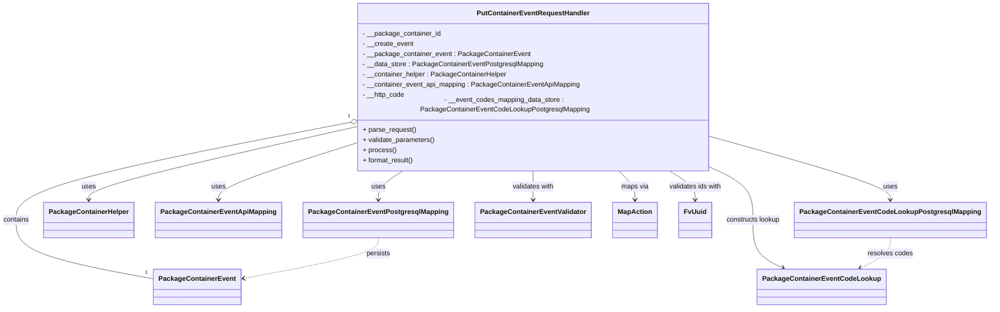
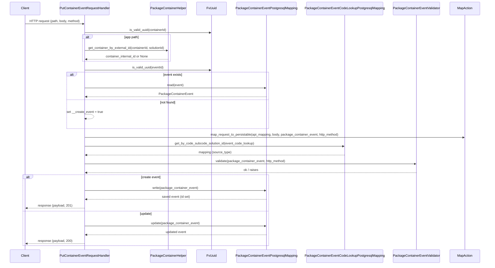

# Diagram: partview_core/partview_service/partview_service/api/package_container/event/handlers/put_container_event.py

> Auto-generated by Obscura crawlers

## Diagram 1

### SVG

<svg id="container" width="2247.546875" xmlns="http://www.w3.org/2000/svg" class="classDiagram" height="716" viewBox="0 0 2247.546875 716" role="graphics-document document" aria-roledescription="class"><g><defs><marker id="container_class-aggregationStart" class="marker aggregation class" refX="18" refY="7" markerWidth="190" markerHeight="240" orient="auto"><path d="M 18,7 L9,13 L1,7 L9,1 Z"></path></marker></defs><defs><marker id="container_class-aggregationEnd" class="marker aggregation class" refX="1" refY="7" markerWidth="20" markerHeight="28" orient="auto"><path d="M 18,7 L9,13 L1,7 L9,1 Z"></path></marker></defs><defs><marker id="container_class-extensionStart" class="marker extension class" refX="18" refY="7" markerWidth="190" markerHeight="240" orient="auto"><path d="M 1,7 L18,13 V 1 Z"></path></marker></defs><defs><marker id="container_class-extensionEnd" class="marker extension class" refX="1" refY="7" markerWidth="20" markerHeight="28" orient="auto"><path d="M 1,1 V 13 L18,7 Z"></path></marker></defs><defs><marker id="container_class-compositionStart" class="marker composition class" refX="18" refY="7" markerWidth="190" markerHeight="240" orient="auto"><path d="M 18,7 L9,13 L1,7 L9,1 Z"></path></marker></defs><defs><marker id="container_class-compositionEnd" class="marker composition class" refX="1" refY="7" markerWidth="20" markerHeight="28" orient="auto"><path d="M 18,7 L9,13 L1,7 L9,1 Z"></path></marker></defs><defs><marker id="container_class-dependencyStart" class="marker dependency class" refX="6" refY="7" markerWidth="190" markerHeight="240" orient="auto"><path d="M 5,7 L9,13 L1,7 L9,1 Z"></path></marker></defs><defs><marker id="container_class-dependencyEnd" class="marker dependency class" refX="13" refY="7" markerWidth="20" markerHeight="28" orient="auto"><path d="M 18,7 L9,13 L14,7 L9,1 Z"></path></marker></defs><defs><marker id="container_class-lollipopStart" class="marker lollipop class" refX="13" refY="7" markerWidth="190" markerHeight="240" orient="auto"><circle stroke="black" fill="transparent" cx="7" cy="7" r="6"></circle></marker></defs><defs><marker id="container_class-lollipopEnd" class="marker lollipop class" refX="1" refY="7" markerWidth="190" markerHeight="240" orient="auto"><circle stroke="black" fill="transparent" cx="7" cy="7" r="6"></circle></marker></defs><g class="root"><g class="clusters"></g><g class="edgePaths"><path d="M773.388,285.07L650.972,309.058C528.556,333.047,283.723,381.023,161.307,418.178C38.891,455.333,38.891,481.667,38.891,508C38.891,534.333,38.891,560.667,90.924,583.863C142.958,607.059,247.026,627.118,299.06,637.147L351.094,647.177" id="id_PutContainerEventRequestHandler_PackageContainerEvent_1" class="edge-thickness-normal edge-pattern-solid relation" style=";;;" data-edge="true" data-et="edge" data-id="id_PutContainerEventRequestHandler_PackageContainerEvent_1" data-points="W3sieCI6NzkwLjMxNjQwNjI1LCJ5IjoyODEuNzUzMDE4MzcwOTQ4OH0seyJ4IjozOC44OTA2MjUsInkiOjQyOX0seyJ4IjozOC44OTA2MjUsInkiOjUwOH0seyJ4IjozOC44OTA2MjUsInkiOjU4N30seyJ4IjozNTEuMDkzNzUsInkiOjY0Ny4xNzY4NTE4MTY1NTI5fV0=" marker-start="url(#container_class-aggregationStart)"></path><path d="M914.983,392L905.587,398.167C896.192,404.333,877.401,416.667,868.005,428C858.609,439.333,858.609,449.667,858.609,454.833L858.609,460" id="id_PutContainerEventRequestHandler_PackageContainerEventPostgresqlMapping_2" class="edge-thickness-normal edge-pattern-solid relation" style=";;;" data-edge="true" data-et="edge" data-id="id_PutContainerEventRequestHandler_PackageContainerEventPostgresqlMapping_2" data-points="W3sieCI6OTE0Ljk4Mjg3MzkwODI5NjksInkiOjM5Mn0seyJ4Ijo4NTguNjA5Mzc1LCJ5Ijo0Mjl9LHsieCI6ODU4LjYwOTM3NSwieSI6NDY2fV0=" marker-end="url(#container_class-dependencyEnd)"></path><path d="M790.316,295.466L693.055,317.721C595.794,339.977,401.272,384.489,304.011,411.911C206.75,439.333,206.75,449.667,206.75,454.833L206.75,460" id="id_PutContainerEventRequestHandler_PackageContainerHelper_3" class="edge-thickness-normal edge-pattern-solid relation" style=";;;" data-edge="true" data-et="edge" data-id="id_PutContainerEventRequestHandler_PackageContainerHelper_3" data-points="W3sieCI6NzkwLjMxNjQwNjI1LCJ5IjoyOTUuNDY1NTMwMjk3MTE2M30seyJ4IjoyMDYuNzUsInkiOjQyOX0seyJ4IjoyMDYuNzUsInkiOjQ2Nn1d" marker-end="url(#container_class-dependencyEnd)"></path><path d="M790.316,334.964L741.869,350.637C693.422,366.309,596.527,397.655,548.08,418.494C499.633,439.333,499.633,449.667,499.633,454.833L499.633,460" id="id_PutContainerEventRequestHandler_PackageContainerEventApiMapping_4" class="edge-thickness-normal edge-pattern-solid relation" style=";;;" data-edge="true" data-et="edge" data-id="id_PutContainerEventRequestHandler_PackageContainerEventApiMapping_4" data-points="W3sieCI6NzkwLjMxNjQwNjI1LCJ5IjozMzQuOTYzODk0MzE1MTM0Mjd9LHsieCI6NDk5LjYzMjgxMjUsInkiOjQyOX0seyJ4Ijo0OTkuNjMyODEyNSwieSI6NDY2fV0=" marker-end="url(#container_class-dependencyEnd)"></path><path d="M1624.715,316.696L1691.631,335.413C1758.547,354.131,1892.379,391.565,1959.295,415.449C2026.211,439.333,2026.211,449.667,2026.211,454.833L2026.211,460" id="id_PutContainerEventRequestHandler_PackageContainerEventCodeLookupPostgresqlMapping_5" class="edge-thickness-normal edge-pattern-solid relation" style=";;;" data-edge="true" data-et="edge" data-id="id_PutContainerEventRequestHandler_PackageContainerEventCodeLookupPostgresqlMapping_5" data-points="W3sieCI6MTYyNC43MTQ4NDM3NSwieSI6MzE2LjY5NjE4Njc2ODIwMDE2fSx7IngiOjIwMjYuMjEwOTM3NSwieSI6NDI5fSx7IngiOjIwMjYuMjEwOTM3NSwieSI6NDY2fV0=" marker-end="url(#container_class-dependencyEnd)"></path><path d="M1207.516,392L1207.516,398.167C1207.516,404.333,1207.516,416.667,1207.516,428C1207.516,439.333,1207.516,449.667,1207.516,454.833L1207.516,460" id="id_PutContainerEventRequestHandler_PackageContainerEventValidator_6" class="edge-thickness-normal edge-pattern-solid relation" style=";;;" data-edge="true" data-et="edge" data-id="id_PutContainerEventRequestHandler_PackageContainerEventValidator_6" data-points="W3sieCI6MTIwNy41MTU2MjUsInkiOjM5Mn0seyJ4IjoxMjA3LjUxNTYyNSwieSI6NDI5fSx7IngiOjEyMDcuNTE1NjI1LCJ5Ijo0NjZ9XQ==" marker-end="url(#container_class-dependencyEnd)"></path><path d="M1401.592,392L1407.825,398.167C1414.059,404.333,1426.525,416.667,1432.759,428C1438.992,439.333,1438.992,449.667,1438.992,454.833L1438.992,460" id="id_PutContainerEventRequestHandler_MapAction_7" class="edge-thickness-normal edge-pattern-solid relation" style=";;;" data-edge="true" data-et="edge" data-id="id_PutContainerEventRequestHandler_MapAction_7" data-points="W3sieCI6MTQwMS41OTIwNDQyMTM5NzM4LCJ5IjozOTJ9LHsieCI6MTQzOC45OTIxODc1LCJ5Ijo0Mjl9LHsieCI6MTQzOC45OTIxODc1LCJ5Ijo0NjZ9XQ==" marker-end="url(#container_class-dependencyEnd)"></path><path d="M1516.62,392L1526.548,398.167C1536.476,404.333,1556.332,416.667,1566.26,428C1576.188,439.333,1576.188,449.667,1576.188,454.833L1576.188,460" id="id_PutContainerEventRequestHandler_FvUuid_8" class="edge-thickness-normal edge-pattern-solid relation" style=";;;" data-edge="true" data-et="edge" data-id="id_PutContainerEventRequestHandler_FvUuid_8" data-points="W3sieCI6MTUxNi42MjA0Mjg0OTM0NDk3LCJ5IjozOTJ9LHsieCI6MTU3Ni4xODc1LCJ5Ijo0Mjl9LHsieCI6MTU3Ni4xODc1LCJ5Ijo0NjZ9XQ==" marker-end="url(#container_class-dependencyEnd)"></path><path d="M1624.715,389.074L1639.398,395.729C1654.081,402.383,1683.447,415.691,1698.13,435.512C1712.813,455.333,1712.813,481.667,1712.813,508C1712.813,534.333,1712.813,560.667,1724.151,579.55C1735.49,598.433,1758.168,609.866,1769.507,615.582L1780.846,621.299" id="id_PutContainerEventRequestHandler_PackageContainerEventCodeLookup_9" class="edge-thickness-normal edge-pattern-solid relation" style=";;;" data-edge="true" data-et="edge" data-id="id_PutContainerEventRequestHandler_PackageContainerEventCodeLookup_9" data-points="W3sieCI6MTYyNC43MTQ4NDM3NSwieSI6Mzg5LjA3NDIzNjk4OTM5MzZ9LHsieCI6MTcxMi44MTI1LCJ5Ijo0Mjl9LHsieCI6MTcxMi44MTI1LCJ5Ijo1MDh9LHsieCI6MTcxMi44MTI1LCJ5Ijo1ODd9LHsieCI6MTc4Ni4yMDMyNzMzMzg2MDc3LCJ5Ijo2MjR9XQ==" marker-end="url(#container_class-dependencyEnd)"></path><path d="M858.609,550L858.609,556.167C858.609,562.333,858.609,574.667,807.557,590.674C756.506,606.68,654.402,626.361,603.35,636.201L552.298,646.041" id="id_PackageContainerEventPostgresqlMapping_PackageContainerEvent_10" class="edge-thickness-normal edge-pattern-dashed relation" style=";;;" data-edge="true" data-et="edge" data-id="id_PackageContainerEventPostgresqlMapping_PackageContainerEvent_10" data-points="W3sieCI6ODU4LjYwOTM3NSwieSI6NTUwfSx7IngiOjg1OC42MDkzNzUsInkiOjU4N30seyJ4Ijo1NDYuNDA2MjUsInkiOjY0Ny4xNzY4NTE4MTY1NTI5fV0=" marker-end="url(#container_class-dependencyEnd)"></path><path d="M2026.211,550L2026.211,556.167C2026.211,562.333,2026.211,574.667,2014.872,586.55C2003.533,598.433,1980.856,609.866,1969.517,615.582L1958.178,621.299" id="id_PackageContainerEventCodeLookupPostgresqlMapping_PackageContainerEventCodeLookup_11" class="edge-thickness-normal edge-pattern-dashed relation" style=";;;" data-edge="true" data-et="edge" data-id="id_PackageContainerEventCodeLookupPostgresqlMapping_PackageContainerEventCodeLookup_11" data-points="W3sieCI6MjAyNi4yMTA5Mzc1LCJ5Ijo1NTB9LHsieCI6MjAyNi4yMTA5Mzc1LCJ5Ijo1ODd9LHsieCI6MTk1Mi44MjAxNjQxNjEzOTIzLCJ5Ijo2MjR9XQ==" marker-end="url(#container_class-dependencyEnd)"></path></g><g class="edgeLabels"><g class="edgeLabel" transform="translate(38.890625, 508)"><g class="label" data-id="id_PutContainerEventRequestHandler_PackageContainerEvent_1" transform="translate(-30.890625, -12)"><foreignObject width="61.78125" height="24">

contains

</foreignObject></g></g><g class="edgeLabel" transform="translate(858.609375, 429)"><g class="label" data-id="id_PutContainerEventRequestHandler_PackageContainerEventPostgresqlMapping_2" transform="translate(-16.4921875, -12)"><foreignObject width="32.984375" height="24">

uses

</foreignObject></g></g><g class="edgeLabel" transform="translate(206.75, 429)"><g class="label" data-id="id_PutContainerEventRequestHandler_PackageContainerHelper_3" transform="translate(-16.4921875, -12)"><foreignObject width="32.984375" height="24">

uses

</foreignObject></g></g><g class="edgeLabel" transform="translate(499.6328125, 429)"><g class="label" data-id="id_PutContainerEventRequestHandler_PackageContainerEventApiMapping_4" transform="translate(-16.4921875, -12)"><foreignObject width="32.984375" height="24">

uses

</foreignObject></g></g><g class="edgeLabel" transform="translate(2026.2109375, 429)"><g class="label" data-id="id_PutContainerEventRequestHandler_PackageContainerEventCodeLookupPostgresqlMapping_5" transform="translate(-16.4921875, -12)"><foreignObject width="32.984375" height="24">

uses

</foreignObject></g></g><g class="edgeLabel" transform="translate(1207.515625, 429)"><g class="label" data-id="id_PutContainerEventRequestHandler_PackageContainerEventValidator_6" transform="translate(-50.375, -12)"><foreignObject width="100.75" height="24">

validates with

</foreignObject></g></g><g class="edgeLabel" transform="translate(1438.9921875, 429)"><g class="label" data-id="id_PutContainerEventRequestHandler_MapAction_7" transform="translate(-32.3671875, -12)"><foreignObject width="64.734375" height="24">

maps via

</foreignObject></g></g><g class="edgeLabel" transform="translate(1576.1875, 429)"><g class="label" data-id="id_PutContainerEventRequestHandler_FvUuid_8" transform="translate(-63.265625, -12)"><foreignObject width="126.53125" height="24">

validates ids with

</foreignObject></g></g><g class="edgeLabel" transform="translate(1712.8125, 508)"><g class="label" data-id="id_PutContainerEventRequestHandler_PackageContainerEventCodeLookup_9" transform="translate(-65.0625, -12)"><foreignObject width="130.125" height="24">

constructs lookup

</foreignObject></g></g><g class="edgeLabel" transform="translate(858.609375, 587)"><g class="label" data-id="id_PackageContainerEventPostgresqlMapping_PackageContainerEvent_10" transform="translate(-28.4375, -12)"><foreignObject width="56.875" height="24">

persists

</foreignObject></g></g><g class="edgeLabel" transform="translate(2026.2109375, 587)"><g class="label" data-id="id_PackageContainerEventCodeLookupPostgresqlMapping_PackageContainerEventCodeLookup_11" transform="translate(-53.21875, -12)"><foreignObject width="106.4375" height="24">

resolves codes

</foreignObject></g></g><g class="edgeTerminals" transform="translate(770.2585306860217, 270.3982149134799)"><g class="inner" transform="translate(0, 0)"><foreignObject style="width: 9px; height: 12px;">
1
</foreignObject></g></g><g class="edgeTerminals" transform="translate(331.7490229449106, 624.1358207861963)"><g class="inner" transform="translate(0, 0)"></g><foreignObject style="width: 9px; height: 12px;">
1
</foreignObject></g></g><g class="nodes"><g class="node default" id="classId-PutContainerEventRequestHandler-0" transform="translate(1207.515625, 200)"><g class="basic label-container"><path d="M-417.19921875 -192 L417.19921875 -192 L417.19921875 192 L-417.19921875 192" stroke="none" stroke-width="0" fill="#ECECFF" style=""></path><path d="M-417.19921875 -192 C-244.35126361755306 -192, -71.50330848510612 -192, 417.19921875 -192 M-417.19921875 -192 C-162.99627330461203 -192, 91.20667214077594 -192, 417.19921875 -192 M417.19921875 -192 C417.19921875 -48.53991137946329, 417.19921875 94.92017724107342, 417.19921875 192 M417.19921875 -192 C417.19921875 -108.4365936491473, 417.19921875 -24.873187298294596, 417.19921875 192 M417.19921875 192 C128.6510442468225 192, -159.897130256355 192, -417.19921875 192 M417.19921875 192 C179.8933739117372 192, -57.4124709265256 192, -417.19921875 192 M-417.19921875 192 C-417.19921875 51.99633010092441, -417.19921875 -88.00733979815118, -417.19921875 -192 M-417.19921875 192 C-417.19921875 76.40027929169827, -417.19921875 -39.19944141660346, -417.19921875 -192" stroke="#9370DB" stroke-width="1.3" fill="none" stroke-dasharray="0 0" style=""></path></g><g class="annotation-group text" transform="translate(0, -168)"></g><g class="label-group text" transform="translate(-127.1328125, -168)"><g class="label" style="font-weight: bolder" transform="translate(0,-12)"><foreignObject width="254.265625" height="24">

PutContainerEventRequestHandler

</foreignObject></g></g><g class="members-group text" transform="translate(-405.19921875, -120)"><g class="label" style="" transform="translate(0,-12)"><foreignObject width="184.15625" height="24">

- __package_container_id

</foreignObject></g><g class="label" style="" transform="translate(0,12)"><foreignObject width="119.734375" height="24">

- __create_event

</foreignObject></g><g class="label" style="" transform="translate(0,36)"><foreignObject width="390.890625" height="24">

- __package_container_event : PackageContainerEvent

</foreignObject></g><g class="label" style="" transform="translate(0,60)"><foreignObject width="423.390625" height="24">

- __data_store : PackageContainerEventPostgresqlMapping

</foreignObject></g><g class="label" style="" transform="translate(0,84)"><foreignObject width="339.84375" height="24">

- __container_helper : PackageContainerHelper

</foreignObject></g><g class="label" style="" transform="translate(0,108)"><foreignObject width="512.140625" height="24">

- __container_event_api_mapping : PackageContainerEventApiMapping

</foreignObject></g><g class="label" style="" transform="translate(0,132)"><foreignObject width="100.25" height="24">

- __http_code

</foreignObject></g><g class="label" style="" transform="translate(0,156)"><foreignObject width="683.265625" height="24">

- __event_codes_mapping_data_store : PackageContainerEventCodeLookupPostgresqlMapping

</foreignObject></g></g><g class="methods-group text" transform="translate(-405.19921875, 96)"><g class="label" style="" transform="translate(0,-12)"><foreignObject width="126.046875" height="24">

+ parse_request()

</foreignObject></g><g class="label" style="" transform="translate(0,12)"><foreignObject width="170.953125" height="24">

+ validate_parameters()

</foreignObject></g><g class="label" style="" transform="translate(0,36)"><foreignObject width="77.96875" height="24">

+ process()

</foreignObject></g><g class="label" style="" transform="translate(0,60)"><foreignObject width="121.5" height="24">

+ format_result()

</foreignObject></g></g><g class="divider" style=""><path d="M-417.19921875 -144 C-182.30641490549652 -144, 52.58638893900695 -144, 417.19921875 -144 M-417.19921875 -144 C-129.27112082021614 -144, 158.65697710956772 -144, 417.19921875 -144" stroke="#9370DB" stroke-width="1.3" fill="none" stroke-dasharray="0 0" style=""></path></g><g class="divider" style=""><path d="M-417.19921875 72 C-144.50139998430126 72, 128.19641878139748 72, 417.19921875 72 M-417.19921875 72 C-171.9696397946932 72, 73.25993916061361 72, 417.19921875 72" stroke="#9370DB" stroke-width="1.3" fill="none" stroke-dasharray="0 0" style=""></path></g></g><g class="node default" id="classId-PackageContainerEvent-1" transform="translate(448.75, 666)"><g class="basic label-container"><path d="M-97.65625 -42 L97.65625 -42 L97.65625 42 L-97.65625 42" stroke="none" stroke-width="0" fill="#ECECFF" style=""></path><path d="M-97.65625 -42 C-20.634008769162264 -42, 56.38823246167547 -42, 97.65625 -42 M-97.65625 -42 C-21.66397542515861 -42, 54.32829914968278 -42, 97.65625 -42 M97.65625 -42 C97.65625 -15.960384312216092, 97.65625 10.079231375567815, 97.65625 42 M97.65625 -42 C97.65625 -10.895916897894441, 97.65625 20.208166204211118, 97.65625 42 M97.65625 42 C42.47392517780367 42, -12.708399644392657 42, -97.65625 42 M97.65625 42 C53.3464851568345 42, 9.036720313668994 42, -97.65625 42 M-97.65625 42 C-97.65625 18.52451359017172, -97.65625 -4.950972819656563, -97.65625 -42 M-97.65625 42 C-97.65625 15.942954648993943, -97.65625 -10.114090702012113, -97.65625 -42" stroke="#9370DB" stroke-width="1.3" fill="none" stroke-dasharray="0 0" style=""></path></g><g class="annotation-group text" transform="translate(0, -18)"></g><g class="label-group text" transform="translate(-85.65625, -18)"><g class="label" style="font-weight: bolder" transform="translate(0,-12)"><foreignObject width="171.3125" height="24">

PackageContainerEvent

</foreignObject></g></g><g class="members-group text" transform="translate(-85.65625, 30)"></g><g class="methods-group text" transform="translate(-85.65625, 60)"></g><g class="divider" style=""><path d="M-97.65625 6 C-51.94419074422298 6, -6.232131488445958 6, 97.65625 6 M-97.65625 6 C-57.68773694963689 6, -17.719223899273786 6, 97.65625 6" stroke="#9370DB" stroke-width="1.3" fill="none" stroke-dasharray="0 0" style=""></path></g><g class="divider" style=""><path d="M-97.65625 24 C-39.13379353963545 24, 19.388662920729104 24, 97.65625 24 M-97.65625 24 C-43.100536566011975 24, 11.45517686797605 24, 97.65625 24" stroke="#9370DB" stroke-width="1.3" fill="none" stroke-dasharray="0 0" style=""></path></g></g><g class="node default" id="classId-PackageContainerEventPostgresqlMapping-2" transform="translate(858.609375, 508)"><g class="basic label-container"><path d="M-168.0625 -42 L168.0625 -42 L168.0625 42 L-168.0625 42" stroke="none" stroke-width="0" fill="#ECECFF" style=""></path><path d="M-168.0625 -42 C-37.45746775586923 -42, 93.14756448826154 -42, 168.0625 -42 M-168.0625 -42 C-38.689519840221294 -42, 90.68346031955741 -42, 168.0625 -42 M168.0625 -42 C168.0625 -9.54180118258958, 168.0625 22.91639763482084, 168.0625 42 M168.0625 -42 C168.0625 -17.778946987315837, 168.0625 6.442106025368325, 168.0625 42 M168.0625 42 C35.99203623030286 42, -96.07842753939428 42, -168.0625 42 M168.0625 42 C71.87302869795845 42, -24.316442604083107 42, -168.0625 42 M-168.0625 42 C-168.0625 21.706482979928094, -168.0625 1.4129659598561872, -168.0625 -42 M-168.0625 42 C-168.0625 18.15353736869929, -168.0625 -5.69292526260142, -168.0625 -42" stroke="#9370DB" stroke-width="1.3" fill="none" stroke-dasharray="0 0" style=""></path></g><g class="annotation-group text" transform="translate(0, -18)"></g><g class="label-group text" transform="translate(-156.0625, -18)"><g class="label" style="font-weight: bolder" transform="translate(0,-12)"><foreignObject width="312.125" height="24">

PackageContainerEventPostgresqlMapping

</foreignObject></g></g><g class="members-group text" transform="translate(-156.0625, 30)"></g><g class="methods-group text" transform="translate(-156.0625, 60)"></g><g class="divider" style=""><path d="M-168.0625 6 C-79.7853862876721 6, 8.491727424655807 6, 168.0625 6 M-168.0625 6 C-56.64672096419537 6, 54.769058071609265 6, 168.0625 6" stroke="#9370DB" stroke-width="1.3" fill="none" stroke-dasharray="0 0" style=""></path></g><g class="divider" style=""><path d="M-168.0625 24 C-55.71833435815125 24, 56.625831283697494 24, 168.0625 24 M-168.0625 24 C-36.71999048343724 24, 94.62251903312551 24, 168.0625 24" stroke="#9370DB" stroke-width="1.3" fill="none" stroke-dasharray="0 0" style=""></path></g></g><g class="node default" id="classId-PackageContainerHelper-3" transform="translate(206.75, 508)"><g class="basic label-container"><path d="M-101.96875 -42 L101.96875 -42 L101.96875 42 L-101.96875 42" stroke="none" stroke-width="0" fill="#ECECFF" style=""></path><path d="M-101.96875 -42 C-48.610023983147 -42, 4.748702033705996 -42, 101.96875 -42 M-101.96875 -42 C-48.2559694970466 -42, 5.4568110059068005 -42, 101.96875 -42 M101.96875 -42 C101.96875 -13.741577889995867, 101.96875 14.516844220008267, 101.96875 42 M101.96875 -42 C101.96875 -15.57990533041255, 101.96875 10.840189339174898, 101.96875 42 M101.96875 42 C40.14192862782938 42, -21.68489274434124 42, -101.96875 42 M101.96875 42 C44.91889483858318 42, -12.130960322833644 42, -101.96875 42 M-101.96875 42 C-101.96875 17.4441144741103, -101.96875 -7.1117710517793995, -101.96875 -42 M-101.96875 42 C-101.96875 10.09873712468962, -101.96875 -21.80252575062076, -101.96875 -42" stroke="#9370DB" stroke-width="1.3" fill="none" stroke-dasharray="0 0" style=""></path></g><g class="annotation-group text" transform="translate(0, -18)"></g><g class="label-group text" transform="translate(-89.96875, -18)"><g class="label" style="font-weight: bolder" transform="translate(0,-12)"><foreignObject width="179.9375" height="24">

PackageContainerHelper

</foreignObject></g></g><g class="members-group text" transform="translate(-89.96875, 30)"></g><g class="methods-group text" transform="translate(-89.96875, 60)"></g><g class="divider" style=""><path d="M-101.96875 6 C-60.247959528007826 6, -18.52716905601565 6, 101.96875 6 M-101.96875 6 C-42.45411958988783 6, 17.060510820224337 6, 101.96875 6" stroke="#9370DB" stroke-width="1.3" fill="none" stroke-dasharray="0 0" style=""></path></g><g class="divider" style=""><path d="M-101.96875 24 C-57.80385049414555 24, -13.6389509882911 24, 101.96875 24 M-101.96875 24 C-59.690547098603496 24, -17.41234419720699 24, 101.96875 24" stroke="#9370DB" stroke-width="1.3" fill="none" stroke-dasharray="0 0" style=""></path></g></g><g class="node default" id="classId-PackageContainerEventApiMapping-4" transform="translate(499.6328125, 508)"><g class="basic label-container"><path d="M-140.9140625 -42 L140.9140625 -42 L140.9140625 42 L-140.9140625 42" stroke="none" stroke-width="0" fill="#ECECFF" style=""></path><path d="M-140.9140625 -42 C-47.66805760839564 -42, 45.577947283208715 -42, 140.9140625 -42 M-140.9140625 -42 C-70.2382934147449 -42, 0.43747567051019587 -42, 140.9140625 -42 M140.9140625 -42 C140.9140625 -11.866831631351246, 140.9140625 18.266336737297507, 140.9140625 42 M140.9140625 -42 C140.9140625 -9.169867612804318, 140.9140625 23.660264774391365, 140.9140625 42 M140.9140625 42 C67.64635707908384 42, -5.6213483418323165 42, -140.9140625 42 M140.9140625 42 C38.76764423375465 42, -63.378774032490696 42, -140.9140625 42 M-140.9140625 42 C-140.9140625 8.755046114903145, -140.9140625 -24.48990777019371, -140.9140625 -42 M-140.9140625 42 C-140.9140625 11.885891388281987, -140.9140625 -18.228217223436026, -140.9140625 -42" stroke="#9370DB" stroke-width="1.3" fill="none" stroke-dasharray="0 0" style=""></path></g><g class="annotation-group text" transform="translate(0, -18)"></g><g class="label-group text" transform="translate(-128.9140625, -18)"><g class="label" style="font-weight: bolder" transform="translate(0,-12)"><foreignObject width="257.828125" height="24">

PackageContainerEventApiMapping

</foreignObject></g></g><g class="members-group text" transform="translate(-128.9140625, 30)"></g><g class="methods-group text" transform="translate(-128.9140625, 60)"></g><g class="divider" style=""><path d="M-140.9140625 6 C-74.13298925527461 6, -7.351916010549218 6, 140.9140625 6 M-140.9140625 6 C-43.28567163711335 6, 54.342719225773294 6, 140.9140625 6" stroke="#9370DB" stroke-width="1.3" fill="none" stroke-dasharray="0 0" style=""></path></g><g class="divider" style=""><path d="M-140.9140625 24 C-72.8487740805803 24, -4.783485661160597 24, 140.9140625 24 M-140.9140625 24 C-78.83758993601765 24, -16.761117372035315 24, 140.9140625 24" stroke="#9370DB" stroke-width="1.3" fill="none" stroke-dasharray="0 0" style=""></path></g></g><g class="node default" id="classId-PackageContainerEventCodeLookupPostgresqlMapping-5" transform="translate(2026.2109375, 508)"><g class="basic label-container"><path d="M-213.3359375 -42 L213.3359375 -42 L213.3359375 42 L-213.3359375 42" stroke="none" stroke-width="0" fill="#ECECFF" style=""></path><path d="M-213.3359375 -42 C-80.63630226150897 -42, 52.06333297698205 -42, 213.3359375 -42 M-213.3359375 -42 C-80.03176144522843 -42, 53.27241460954315 -42, 213.3359375 -42 M213.3359375 -42 C213.3359375 -20.351290391864666, 213.3359375 1.2974192162706686, 213.3359375 42 M213.3359375 -42 C213.3359375 -10.31479768217855, 213.3359375 21.3704046356429, 213.3359375 42 M213.3359375 42 C95.30297305848273 42, -22.72999138303453 42, -213.3359375 42 M213.3359375 42 C48.22303539442959 42, -116.88986671114083 42, -213.3359375 42 M-213.3359375 42 C-213.3359375 14.502397958520735, -213.3359375 -12.99520408295853, -213.3359375 -42 M-213.3359375 42 C-213.3359375 13.15097586331381, -213.3359375 -15.698048273372379, -213.3359375 -42" stroke="#9370DB" stroke-width="1.3" fill="none" stroke-dasharray="0 0" style=""></path></g><g class="annotation-group text" transform="translate(0, -18)"></g><g class="label-group text" transform="translate(-201.3359375, -18)"><g class="label" style="font-weight: bolder" transform="translate(0,-12)"><foreignObject width="402.671875" height="24">

PackageContainerEventCodeLookupPostgresqlMapping

</foreignObject></g></g><g class="members-group text" transform="translate(-201.3359375, 30)"></g><g class="methods-group text" transform="translate(-201.3359375, 60)"></g><g class="divider" style=""><path d="M-213.3359375 6 C-120.26143847568207 6, -27.18693945136414 6, 213.3359375 6 M-213.3359375 6 C-84.36601028526908 6, 44.60391692946183 6, 213.3359375 6" stroke="#9370DB" stroke-width="1.3" fill="none" stroke-dasharray="0 0" style=""></path></g><g class="divider" style=""><path d="M-213.3359375 24 C-49.94845798560925 24, 113.4390215287815 24, 213.3359375 24 M-213.3359375 24 C-121.1973726549546 24, -29.05880780990921 24, 213.3359375 24" stroke="#9370DB" stroke-width="1.3" fill="none" stroke-dasharray="0 0" style=""></path></g></g><g class="node default" id="classId-PackageContainerEventValidator-6" transform="translate(1207.515625, 508)"><g class="basic label-container"><path d="M-130.84375 -42 L130.84375 -42 L130.84375 42 L-130.84375 42" stroke="none" stroke-width="0" fill="#ECECFF" style=""></path><path d="M-130.84375 -42 C-66.51231958398435 -42, -2.180889167968701 -42, 130.84375 -42 M-130.84375 -42 C-75.76654574914771 -42, -20.68934149829542 -42, 130.84375 -42 M130.84375 -42 C130.84375 -13.195853461590815, 130.84375 15.60829307681837, 130.84375 42 M130.84375 -42 C130.84375 -22.317688827613235, 130.84375 -2.6353776552264705, 130.84375 42 M130.84375 42 C75.30450875353812 42, 19.76526750707623 42, -130.84375 42 M130.84375 42 C35.652214561991755 42, -59.53932087601649 42, -130.84375 42 M-130.84375 42 C-130.84375 9.711947627660692, -130.84375 -22.576104744678616, -130.84375 -42 M-130.84375 42 C-130.84375 19.42063436908512, -130.84375 -3.1587312618297574, -130.84375 -42" stroke="#9370DB" stroke-width="1.3" fill="none" stroke-dasharray="0 0" style=""></path></g><g class="annotation-group text" transform="translate(0, -18)"></g><g class="label-group text" transform="translate(-118.84375, -18)"><g class="label" style="font-weight: bolder" transform="translate(0,-12)"><foreignObject width="237.6875" height="24">

PackageContainerEventValidator

</foreignObject></g></g><g class="members-group text" transform="translate(-118.84375, 30)"></g><g class="methods-group text" transform="translate(-118.84375, 60)"></g><g class="divider" style=""><path d="M-130.84375 6 C-55.09620300389851 6, 20.651343992202982 6, 130.84375 6 M-130.84375 6 C-32.86854601125664 6, 65.10665797748672 6, 130.84375 6" stroke="#9370DB" stroke-width="1.3" fill="none" stroke-dasharray="0 0" style=""></path></g><g class="divider" style=""><path d="M-130.84375 24 C-33.858100879077796 24, 63.12754824184441 24, 130.84375 24 M-130.84375 24 C-46.7365509985912 24, 37.3706480028176 24, 130.84375 24" stroke="#9370DB" stroke-width="1.3" fill="none" stroke-dasharray="0 0" style=""></path></g></g><g class="node default" id="classId-MapAction-7" transform="translate(1438.9921875, 508)"><g class="basic label-container"><path d="M-50.6328125 -42 L50.6328125 -42 L50.6328125 42 L-50.6328125 42" stroke="none" stroke-width="0" fill="#ECECFF" style=""></path><path d="M-50.6328125 -42 C-24.74588633121328 -42, 1.1410398375734374 -42, 50.6328125 -42 M-50.6328125 -42 C-21.579126947172597 -42, 7.474558605654806 -42, 50.6328125 -42 M50.6328125 -42 C50.6328125 -14.396507436905821, 50.6328125 13.206985126188357, 50.6328125 42 M50.6328125 -42 C50.6328125 -8.422068860159207, 50.6328125 25.155862279681585, 50.6328125 42 M50.6328125 42 C20.66132388320566 42, -9.310164733588678 42, -50.6328125 42 M50.6328125 42 C19.439377958627887 42, -11.754056582744226 42, -50.6328125 42 M-50.6328125 42 C-50.6328125 25.067316006743948, -50.6328125 8.134632013487895, -50.6328125 -42 M-50.6328125 42 C-50.6328125 13.540168728659296, -50.6328125 -14.919662542681408, -50.6328125 -42" stroke="#9370DB" stroke-width="1.3" fill="none" stroke-dasharray="0 0" style=""></path></g><g class="annotation-group text" transform="translate(0, -18)"></g><g class="label-group text" transform="translate(-38.6328125, -18)"><g class="label" style="font-weight: bolder" transform="translate(0,-12)"><foreignObject width="77.265625" height="24">

MapAction

</foreignObject></g></g><g class="members-group text" transform="translate(-38.6328125, 30)"></g><g class="methods-group text" transform="translate(-38.6328125, 60)"></g><g class="divider" style=""><path d="M-50.6328125 6 C-18.775702154663684 6, 13.081408190672633 6, 50.6328125 6 M-50.6328125 6 C-23.91160685397822 6, 2.809598792043559 6, 50.6328125 6" stroke="#9370DB" stroke-width="1.3" fill="none" stroke-dasharray="0 0" style=""></path></g><g class="divider" style=""><path d="M-50.6328125 24 C-26.27251099664889 24, -1.9122094932977802 24, 50.6328125 24 M-50.6328125 24 C-20.47204064125259 24, 9.68873121749482 24, 50.6328125 24" stroke="#9370DB" stroke-width="1.3" fill="none" stroke-dasharray="0 0" style=""></path></g></g><g class="node default" id="classId-FvUuid-8" transform="translate(1576.1875, 508)"><g class="basic label-container"><path d="M-36.5625 -42 L36.5625 -42 L36.5625 42 L-36.5625 42" stroke="none" stroke-width="0" fill="#ECECFF" style=""></path><path d="M-36.5625 -42 C-20.40764382194314 -42, -4.252787643886279 -42, 36.5625 -42 M-36.5625 -42 C-14.148097477767507 -42, 8.266305044464985 -42, 36.5625 -42 M36.5625 -42 C36.5625 -21.35703525554838, 36.5625 -0.7140705110967573, 36.5625 42 M36.5625 -42 C36.5625 -12.473053330954016, 36.5625 17.053893338091967, 36.5625 42 M36.5625 42 C21.304066357913612 42, 6.045632715827221 42, -36.5625 42 M36.5625 42 C8.34082383295831 42, -19.88085233408338 42, -36.5625 42 M-36.5625 42 C-36.5625 13.66607592258114, -36.5625 -14.66784815483772, -36.5625 -42 M-36.5625 42 C-36.5625 14.487158729879788, -36.5625 -13.025682540240425, -36.5625 -42" stroke="#9370DB" stroke-width="1.3" fill="none" stroke-dasharray="0 0" style=""></path></g><g class="annotation-group text" transform="translate(0, -18)"></g><g class="label-group text" transform="translate(-24.5625, -18)"><g class="label" style="font-weight: bolder" transform="translate(0,-12)"><foreignObject width="49.125" height="24">

FvUuid

</foreignObject></g></g><g class="members-group text" transform="translate(-24.5625, 30)"></g><g class="methods-group text" transform="translate(-24.5625, 60)"></g><g class="divider" style=""><path d="M-36.5625 6 C-15.829888030370196 6, 4.902723939259609 6, 36.5625 6 M-36.5625 6 C-20.90309718418998 6, -5.243694368379963 6, 36.5625 6" stroke="#9370DB" stroke-width="1.3" fill="none" stroke-dasharray="0 0" style=""></path></g><g class="divider" style=""><path d="M-36.5625 24 C-7.820104618634733 24, 20.922290762730533 24, 36.5625 24 M-36.5625 24 C-14.40567133785596 24, 7.75115732428808 24, 36.5625 24" stroke="#9370DB" stroke-width="1.3" fill="none" stroke-dasharray="0 0" style=""></path></g></g><g class="node default" id="classId-PackageContainerEventCodeLookup-9" transform="translate(1869.51171875, 666)"><g class="basic label-container"><path d="M-142.9296875 -42 L142.9296875 -42 L142.9296875 42 L-142.9296875 42" stroke="none" stroke-width="0" fill="#ECECFF" style=""></path><path d="M-142.9296875 -42 C-38.07141115350963 -42, 66.78686519298074 -42, 142.9296875 -42 M-142.9296875 -42 C-62.710647319554155 -42, 17.50839286089169 -42, 142.9296875 -42 M142.9296875 -42 C142.9296875 -17.139715857829913, 142.9296875 7.720568284340175, 142.9296875 42 M142.9296875 -42 C142.9296875 -12.890886268979475, 142.9296875 16.21822746204105, 142.9296875 42 M142.9296875 42 C44.39557326510395 42, -54.1385409697921 42, -142.9296875 42 M142.9296875 42 C64.42959349688736 42, -14.070500506225272 42, -142.9296875 42 M-142.9296875 42 C-142.9296875 18.414494476677287, -142.9296875 -5.171011046645425, -142.9296875 -42 M-142.9296875 42 C-142.9296875 13.725565710165267, -142.9296875 -14.548868579669467, -142.9296875 -42" stroke="#9370DB" stroke-width="1.3" fill="none" stroke-dasharray="0 0" style=""></path></g><g class="annotation-group text" transform="translate(0, -18)"></g><g class="label-group text" transform="translate(-130.9296875, -18)"><g class="label" style="font-weight: bolder" transform="translate(0,-12)"><foreignObject width="261.859375" height="24">

PackageContainerEventCodeLookup

</foreignObject></g></g><g class="members-group text" transform="translate(-130.9296875, 30)"></g><g class="methods-group text" transform="translate(-130.9296875, 60)"></g><g class="divider" style=""><path d="M-142.9296875 6 C-49.76021612277971 6, 43.40925525444058 6, 142.9296875 6 M-142.9296875 6 C-47.24252796513237 6, 48.444631569735265 6, 142.9296875 6" stroke="#9370DB" stroke-width="1.3" fill="none" stroke-dasharray="0 0" style=""></path></g><g class="divider" style=""><path d="M-142.9296875 24 C-64.59050153802625 24, 13.748684423947509 24, 142.9296875 24 M-142.9296875 24 C-52.65320289993613 24, 37.623281700127734 24, 142.9296875 24" stroke="#9370DB" stroke-width="1.3" fill="none" stroke-dasharray="0 0" style=""></path></g></g></g></g></g></svg>

## Diagram 2

### SVG

<svg id="container" width="2604" xmlns="http://www.w3.org/2000/svg" height="1398" viewBox="-50 -10 2604 1398" role="graphics-document document" aria-roledescription="sequence"><g><rect x="2354" y="1312" fill="#eaeaea" stroke="#666" width="150" height="65" name="Mapper" rx="3" ry="3" class="actor actor-bottom"></rect><text x="2429" y="1344.5" dominant-baseline="central" alignment-baseline="central" class="actor actor-box" style="text-anchor: middle; font-size: 16px; font-weight: 400;"><tspan x="2429" dy="0">MapAction</tspan></text></g><g><rect x="2049" y="1312" fill="#eaeaea" stroke="#666" width="255" height="65" name="Validator" rx="3" ry="3" class="actor actor-bottom"></rect><text x="2176.5" y="1344.5" dominant-baseline="central" alignment-baseline="central" class="actor actor-box" style="text-anchor: middle; font-size: 16px; font-weight: 400;"><tspan x="2176.5" dy="0">PackageContainerEventValidator</tspan></text></g><g><rect x="1582" y="1312" fill="#eaeaea" stroke="#666" width="417" height="65" name="CodesStore" rx="3" ry="3" class="actor actor-bottom"></rect><text x="1790.5" y="1344.5" dominant-baseline="central" alignment-baseline="central" class="actor actor-box" style="text-anchor: middle; font-size: 16px; font-weight: 400;"><tspan x="1790.5" dy="0">PackageContainerEventCodeLookupPostgresqlMapping</tspan></text></g><g><rect x="1205" y="1312" fill="#eaeaea" stroke="#666" width="327" height="65" name="DataStore" rx="3" ry="3" class="actor actor-bottom"></rect><text x="1368.5" y="1344.5" dominant-baseline="central" alignment-baseline="central" class="actor actor-box" style="text-anchor: middle; font-size: 16px; font-weight: 400;"><tspan x="1368.5" dy="0">PackageContainerEventPostgresqlMapping</tspan></text></g><g><rect x="1005" y="1312" fill="#eaeaea" stroke="#666" width="150" height="65" name="UUID" rx="3" ry="3" class="actor actor-bottom"></rect><text x="1080" y="1344.5" dominant-baseline="central" alignment-baseline="central" class="actor actor-box" style="text-anchor: middle; font-size: 16px; font-weight: 400;"><tspan x="1080" dy="0">FvUuid</tspan></text></g><g><rect x="757" y="1312" fill="#eaeaea" stroke="#666" width="198" height="65" name="Helper" rx="3" ry="3" class="actor actor-bottom"></rect><text x="856" y="1344.5" dominant-baseline="central" alignment-baseline="central" class="actor actor-box" style="text-anchor: middle; font-size: 16px; font-weight: 400;"><tspan x="856" dy="0">PackageContainerHelper</tspan></text></g><g><rect x="261" y="1312" fill="#eaeaea" stroke="#666" width="272" height="65" name="Handler" rx="3" ry="3" class="actor actor-bottom"></rect><text x="397" y="1344.5" dominant-baseline="central" alignment-baseline="central" class="actor actor-box" style="text-anchor: middle; font-size: 16px; font-weight: 400;"><tspan x="397" dy="0">PutContainerEventRequestHandler</tspan></text></g><g><rect x="0" y="1312" fill="#eaeaea" stroke="#666" width="150" height="65" name="Client" rx="3" ry="3" class="actor actor-bottom"></rect><text x="75" y="1344.5" dominant-baseline="central" alignment-baseline="central" class="actor actor-box" style="text-anchor: middle; font-size: 16px; font-weight: 400;"><tspan x="75" dy="0">Client</tspan></text></g><g><line id="actor7" x1="2429" y1="65" x2="2429" y2="1312" class="actor-line 200" stroke-width="0.5px" stroke="#999" name="Mapper"></line><g id="root-7"><rect x="2354" y="0" fill="#eaeaea" stroke="#666" width="150" height="65" name="Mapper" rx="3" ry="3" class="actor actor-top"></rect><text x="2429" y="32.5" dominant-baseline="central" alignment-baseline="central" class="actor actor-box" style="text-anchor: middle; font-size: 16px; font-weight: 400;"><tspan x="2429" dy="0">MapAction</tspan></text></g></g><g><line id="actor6" x1="2176.5" y1="65" x2="2176.5" y2="1312" class="actor-line 200" stroke-width="0.5px" stroke="#999" name="Validator"></line><g id="root-6"><rect x="2049" y="0" fill="#eaeaea" stroke="#666" width="255" height="65" name="Validator" rx="3" ry="3" class="actor actor-top"></rect><text x="2176.5" y="32.5" dominant-baseline="central" alignment-baseline="central" class="actor actor-box" style="text-anchor: middle; font-size: 16px; font-weight: 400;"><tspan x="2176.5" dy="0">PackageContainerEventValidator</tspan></text></g></g><g><line id="actor5" x1="1790.5" y1="65" x2="1790.5" y2="1312" class="actor-line 200" stroke-width="0.5px" stroke="#999" name="CodesStore"></line><g id="root-5"><rect x="1582" y="0" fill="#eaeaea" stroke="#666" width="417" height="65" name="CodesStore" rx="3" ry="3" class="actor actor-top"></rect><text x="1790.5" y="32.5" dominant-baseline="central" alignment-baseline="central" class="actor actor-box" style="text-anchor: middle; font-size: 16px; font-weight: 400;"><tspan x="1790.5" dy="0">PackageContainerEventCodeLookupPostgresqlMapping</tspan></text></g></g><g><line id="actor4" x1="1368.5" y1="65" x2="1368.5" y2="1312" class="actor-line 200" stroke-width="0.5px" stroke="#999" name="DataStore"></line><g id="root-4"><rect x="1205" y="0" fill="#eaeaea" stroke="#666" width="327" height="65" name="DataStore" rx="3" ry="3" class="actor actor-top"></rect><text x="1368.5" y="32.5" dominant-baseline="central" alignment-baseline="central" class="actor actor-box" style="text-anchor: middle; font-size: 16px; font-weight: 400;"><tspan x="1368.5" dy="0">PackageContainerEventPostgresqlMapping</tspan></text></g></g><g><line id="actor3" x1="1080" y1="65" x2="1080" y2="1312" class="actor-line 200" stroke-width="0.5px" stroke="#999" name="UUID"></line><g id="root-3"><rect x="1005" y="0" fill="#eaeaea" stroke="#666" width="150" height="65" name="UUID" rx="3" ry="3" class="actor actor-top"></rect><text x="1080" y="32.5" dominant-baseline="central" alignment-baseline="central" class="actor actor-box" style="text-anchor: middle; font-size: 16px; font-weight: 400;"><tspan x="1080" dy="0">FvUuid</tspan></text></g></g><g><line id="actor2" x1="856" y1="65" x2="856" y2="1312" class="actor-line 200" stroke-width="0.5px" stroke="#999" name="Helper"></line><g id="root-2"><rect x="757" y="0" fill="#eaeaea" stroke="#666" width="198" height="65" name="Helper" rx="3" ry="3" class="actor actor-top"></rect><text x="856" y="32.5" dominant-baseline="central" alignment-baseline="central" class="actor actor-box" style="text-anchor: middle; font-size: 16px; font-weight: 400;"><tspan x="856" dy="0">PackageContainerHelper</tspan></text></g></g><g><line id="actor1" x1="397" y1="65" x2="397" y2="1312" class="actor-line 200" stroke-width="0.5px" stroke="#999" name="Handler"></line><g id="root-1"><rect x="261" y="0" fill="#eaeaea" stroke="#666" width="272" height="65" name="Handler" rx="3" ry="3" class="actor actor-top"></rect><text x="397" y="32.5" dominant-baseline="central" alignment-baseline="central" class="actor actor-box" style="text-anchor: middle; font-size: 16px; font-weight: 400;"><tspan x="397" dy="0">PutContainerEventRequestHandler</tspan></text></g></g><g><line id="actor0" x1="75" y1="65" x2="75" y2="1312" class="actor-line 200" stroke-width="0.5px" stroke="#999" name="Client"></line><g id="root-0"><rect x="0" y="0" fill="#eaeaea" stroke="#666" width="150" height="65" name="Client" rx="3" ry="3" class="actor actor-top"></rect><text x="75" y="32.5" dominant-baseline="central" alignment-baseline="central" class="actor actor-box" style="text-anchor: middle; font-size: 16px; font-weight: 400;"><tspan x="75" dy="0">Client</tspan></text></g></g><g></g><defs><symbol id="computer" width="24" height="24"><path transform="scale(.5)" d="M2 2v13h20v-13h-20zm18 11h-16v-9h16v9zm-10.228 6l.466-1h3.524l.467 1h-4.457zm14.228 3h-24l2-6h2.104l-1.33 4h18.45l-1.297-4h2.073l2 6zm-5-10h-14v-7h14v7z"></path></symbol></defs><defs><symbol id="database" fill-rule="evenodd" clip-rule="evenodd"><path transform="scale(.5)" d="M12.258.001l.256.004.255.005.253.008.251.01.249.012.247.015.246.016.242.019.241.02.239.023.236.024.233.027.231.028.229.031.225.032.223.034.22.036.217.038.214.04.211.041.208.043.205.045.201.046.198.048.194.05.191.051.187.053.183.054.18.056.175.057.172.059.168.06.163.061.16.063.155.064.15.066.074.033.073.033.071.034.07.034.069.035.068.035.067.035.066.035.064.036.064.036.062.036.06.036.06.037.058.037.058.037.055.038.055.038.053.038.052.038.051.039.05.039.048.039.047.039.045.04.044.04.043.04.041.04.04.041.039.041.037.041.036.041.034.041.033.042.032.042.03.042.029.042.027.042.026.043.024.043.023.043.021.043.02.043.018.044.017.043.015.044.013.044.012.044.011.045.009.044.007.045.006.045.004.045.002.045.001.045v17l-.001.045-.002.045-.004.045-.006.045-.007.045-.009.044-.011.045-.012.044-.013.044-.015.044-.017.043-.018.044-.02.043-.021.043-.023.043-.024.043-.026.043-.027.042-.029.042-.03.042-.032.042-.033.042-.034.041-.036.041-.037.041-.039.041-.04.041-.041.04-.043.04-.044.04-.045.04-.047.039-.048.039-.05.039-.051.039-.052.038-.053.038-.055.038-.055.038-.058.037-.058.037-.06.037-.06.036-.062.036-.064.036-.064.036-.066.035-.067.035-.068.035-.069.035-.07.034-.071.034-.073.033-.074.033-.15.066-.155.064-.16.063-.163.061-.168.06-.172.059-.175.057-.18.056-.183.054-.187.053-.191.051-.194.05-.198.048-.201.046-.205.045-.208.043-.211.041-.214.04-.217.038-.22.036-.223.034-.225.032-.229.031-.231.028-.233.027-.236.024-.239.023-.241.02-.242.019-.246.016-.247.015-.249.012-.251.01-.253.008-.255.005-.256.004-.258.001-.258-.001-.256-.004-.255-.005-.253-.008-.251-.01-.249-.012-.247-.015-.245-.016-.243-.019-.241-.02-.238-.023-.236-.024-.234-.027-.231-.028-.228-.031-.226-.032-.223-.034-.22-.036-.217-.038-.214-.04-.211-.041-.208-.043-.204-.045-.201-.046-.198-.048-.195-.05-.19-.051-.187-.053-.184-.054-.179-.056-.176-.057-.172-.059-.167-.06-.164-.061-.159-.063-.155-.064-.151-.066-.074-.033-.072-.033-.072-.034-.07-.034-.069-.035-.068-.035-.067-.035-.066-.035-.064-.036-.063-.036-.062-.036-.061-.036-.06-.037-.058-.037-.057-.037-.056-.038-.055-.038-.053-.038-.052-.038-.051-.039-.049-.039-.049-.039-.046-.039-.046-.04-.044-.04-.043-.04-.041-.04-.04-.041-.039-.041-.037-.041-.036-.041-.034-.041-.033-.042-.032-.042-.03-.042-.029-.042-.027-.042-.026-.043-.024-.043-.023-.043-.021-.043-.02-.043-.018-.044-.017-.043-.015-.044-.013-.044-.012-.044-.011-.045-.009-.044-.007-.045-.006-.045-.004-.045-.002-.045-.001-.045v-17l.001-.045.002-.045.004-.045.006-.045.007-.045.009-.044.011-.045.012-.044.013-.044.015-.044.017-.043.018-.044.02-.043.021-.043.023-.043.024-.043.026-.043.027-.042.029-.042.03-.042.032-.042.033-.042.034-.041.036-.041.037-.041.039-.041.04-.041.041-.04.043-.04.044-.04.046-.04.046-.039.049-.039.049-.039.051-.039.052-.038.053-.038.055-.038.056-.038.057-.037.058-.037.06-.037.061-.036.062-.036.063-.036.064-.036.066-.035.067-.035.068-.035.069-.035.07-.034.072-.034.072-.033.074-.033.151-.066.155-.064.159-.063.164-.061.167-.06.172-.059.176-.057.179-.056.184-.054.187-.053.19-.051.195-.05.198-.048.201-.046.204-.045.208-.043.211-.041.214-.04.217-.038.22-.036.223-.034.226-.032.228-.031.231-.028.234-.027.236-.024.238-.023.241-.02.243-.019.245-.016.247-.015.249-.012.251-.01.253-.008.255-.005.256-.004.258-.001.258.001zm-9.258 20.499v.01l.001.021.003.021.004.022.005.021.006.022.007.022.009.023.01.022.011.023.012.023.013.023.015.023.016.024.017.023.018.024.019.024.021.024.022.025.023.024.024.025.052.049.056.05.061.051.066.051.07.051.075.051.079.052.084.052.088.052.092.052.097.052.102.051.105.052.11.052.114.051.119.051.123.051.127.05.131.05.135.05.139.048.144.049.147.047.152.047.155.047.16.045.163.045.167.043.171.043.176.041.178.041.183.039.187.039.19.037.194.035.197.035.202.033.204.031.209.03.212.029.216.027.219.025.222.024.226.021.23.02.233.018.236.016.24.015.243.012.246.01.249.008.253.005.256.004.259.001.26-.001.257-.004.254-.005.25-.008.247-.011.244-.012.241-.014.237-.016.233-.018.231-.021.226-.021.224-.024.22-.026.216-.027.212-.028.21-.031.205-.031.202-.034.198-.034.194-.036.191-.037.187-.039.183-.04.179-.04.175-.042.172-.043.168-.044.163-.045.16-.046.155-.046.152-.047.148-.048.143-.049.139-.049.136-.05.131-.05.126-.05.123-.051.118-.052.114-.051.11-.052.106-.052.101-.052.096-.052.092-.052.088-.053.083-.051.079-.052.074-.052.07-.051.065-.051.06-.051.056-.05.051-.05.023-.024.023-.025.021-.024.02-.024.019-.024.018-.024.017-.024.015-.023.014-.024.013-.023.012-.023.01-.023.01-.022.008-.022.006-.022.006-.022.004-.022.004-.021.001-.021.001-.021v-4.127l-.077.055-.08.053-.083.054-.085.053-.087.052-.09.052-.093.051-.095.05-.097.05-.1.049-.102.049-.105.048-.106.047-.109.047-.111.046-.114.045-.115.045-.118.044-.12.043-.122.042-.124.042-.126.041-.128.04-.13.04-.132.038-.134.038-.135.037-.138.037-.139.035-.142.035-.143.034-.144.033-.147.032-.148.031-.15.03-.151.03-.153.029-.154.027-.156.027-.158.026-.159.025-.161.024-.162.023-.163.022-.165.021-.166.02-.167.019-.169.018-.169.017-.171.016-.173.015-.173.014-.175.013-.175.012-.177.011-.178.01-.179.008-.179.008-.181.006-.182.005-.182.004-.184.003-.184.002h-.37l-.184-.002-.184-.003-.182-.004-.182-.005-.181-.006-.179-.008-.179-.008-.178-.01-.176-.011-.176-.012-.175-.013-.173-.014-.172-.015-.171-.016-.17-.017-.169-.018-.167-.019-.166-.02-.165-.021-.163-.022-.162-.023-.161-.024-.159-.025-.157-.026-.156-.027-.155-.027-.153-.029-.151-.03-.15-.03-.148-.031-.146-.032-.145-.033-.143-.034-.141-.035-.14-.035-.137-.037-.136-.037-.134-.038-.132-.038-.13-.04-.128-.04-.126-.041-.124-.042-.122-.042-.12-.044-.117-.043-.116-.045-.113-.045-.112-.046-.109-.047-.106-.047-.105-.048-.102-.049-.1-.049-.097-.05-.095-.05-.093-.052-.09-.051-.087-.052-.085-.053-.083-.054-.08-.054-.077-.054v4.127zm0-5.654v.011l.001.021.003.021.004.021.005.022.006.022.007.022.009.022.01.022.011.023.012.023.013.023.015.024.016.023.017.024.018.024.019.024.021.024.022.024.023.025.024.024.052.05.056.05.061.05.066.051.07.051.075.052.079.051.084.052.088.052.092.052.097.052.102.052.105.052.11.051.114.051.119.052.123.05.127.051.131.05.135.049.139.049.144.048.147.048.152.047.155.046.16.045.163.045.167.044.171.042.176.042.178.04.183.04.187.038.19.037.194.036.197.034.202.033.204.032.209.03.212.028.216.027.219.025.222.024.226.022.23.02.233.018.236.016.24.014.243.012.246.01.249.008.253.006.256.003.259.001.26-.001.257-.003.254-.006.25-.008.247-.01.244-.012.241-.015.237-.016.233-.018.231-.02.226-.022.224-.024.22-.025.216-.027.212-.029.21-.03.205-.032.202-.033.198-.035.194-.036.191-.037.187-.039.183-.039.179-.041.175-.042.172-.043.168-.044.163-.045.16-.045.155-.047.152-.047.148-.048.143-.048.139-.05.136-.049.131-.05.126-.051.123-.051.118-.051.114-.052.11-.052.106-.052.101-.052.096-.052.092-.052.088-.052.083-.052.079-.052.074-.051.07-.052.065-.051.06-.05.056-.051.051-.049.023-.025.023-.024.021-.025.02-.024.019-.024.018-.024.017-.024.015-.023.014-.023.013-.024.012-.022.01-.023.01-.023.008-.022.006-.022.006-.022.004-.021.004-.022.001-.021.001-.021v-4.139l-.077.054-.08.054-.083.054-.085.052-.087.053-.09.051-.093.051-.095.051-.097.05-.1.049-.102.049-.105.048-.106.047-.109.047-.111.046-.114.045-.115.044-.118.044-.12.044-.122.042-.124.042-.126.041-.128.04-.13.039-.132.039-.134.038-.135.037-.138.036-.139.036-.142.035-.143.033-.144.033-.147.033-.148.031-.15.03-.151.03-.153.028-.154.028-.156.027-.158.026-.159.025-.161.024-.162.023-.163.022-.165.021-.166.02-.167.019-.169.018-.169.017-.171.016-.173.015-.173.014-.175.013-.175.012-.177.011-.178.009-.179.009-.179.007-.181.007-.182.005-.182.004-.184.003-.184.002h-.37l-.184-.002-.184-.003-.182-.004-.182-.005-.181-.007-.179-.007-.179-.009-.178-.009-.176-.011-.176-.012-.175-.013-.173-.014-.172-.015-.171-.016-.17-.017-.169-.018-.167-.019-.166-.02-.165-.021-.163-.022-.162-.023-.161-.024-.159-.025-.157-.026-.156-.027-.155-.028-.153-.028-.151-.03-.15-.03-.148-.031-.146-.033-.145-.033-.143-.033-.141-.035-.14-.036-.137-.036-.136-.037-.134-.038-.132-.039-.13-.039-.128-.04-.126-.041-.124-.042-.122-.043-.12-.043-.117-.044-.116-.044-.113-.046-.112-.046-.109-.046-.106-.047-.105-.048-.102-.049-.1-.049-.097-.05-.095-.051-.093-.051-.09-.051-.087-.053-.085-.052-.083-.054-.08-.054-.077-.054v4.139zm0-5.666v.011l.001.02.003.022.004.021.005.022.006.021.007.022.009.023.01.022.011.023.012.023.013.023.015.023.016.024.017.024.018.023.019.024.021.025.022.024.023.024.024.025.052.05.056.05.061.05.066.051.07.051.075.052.079.051.084.052.088.052.092.052.097.052.102.052.105.051.11.052.114.051.119.051.123.051.127.05.131.05.135.05.139.049.144.048.147.048.152.047.155.046.16.045.163.045.167.043.171.043.176.042.178.04.183.04.187.038.19.037.194.036.197.034.202.033.204.032.209.03.212.028.216.027.219.025.222.024.226.021.23.02.233.018.236.017.24.014.243.012.246.01.249.008.253.006.256.003.259.001.26-.001.257-.003.254-.006.25-.008.247-.01.244-.013.241-.014.237-.016.233-.018.231-.02.226-.022.224-.024.22-.025.216-.027.212-.029.21-.03.205-.032.202-.033.198-.035.194-.036.191-.037.187-.039.183-.039.179-.041.175-.042.172-.043.168-.044.163-.045.16-.045.155-.047.152-.047.148-.048.143-.049.139-.049.136-.049.131-.051.126-.05.123-.051.118-.052.114-.051.11-.052.106-.052.101-.052.096-.052.092-.052.088-.052.083-.052.079-.052.074-.052.07-.051.065-.051.06-.051.056-.05.051-.049.023-.025.023-.025.021-.024.02-.024.019-.024.018-.024.017-.024.015-.023.014-.024.013-.023.012-.023.01-.022.01-.023.008-.022.006-.022.006-.022.004-.022.004-.021.001-.021.001-.021v-4.153l-.077.054-.08.054-.083.053-.085.053-.087.053-.09.051-.093.051-.095.051-.097.05-.1.049-.102.048-.105.048-.106.048-.109.046-.111.046-.114.046-.115.044-.118.044-.12.043-.122.043-.124.042-.126.041-.128.04-.13.039-.132.039-.134.038-.135.037-.138.036-.139.036-.142.034-.143.034-.144.033-.147.032-.148.032-.15.03-.151.03-.153.028-.154.028-.156.027-.158.026-.159.024-.161.024-.162.023-.163.023-.165.021-.166.02-.167.019-.169.018-.169.017-.171.016-.173.015-.173.014-.175.013-.175.012-.177.01-.178.01-.179.009-.179.007-.181.006-.182.006-.182.004-.184.003-.184.001-.185.001-.185-.001-.184-.001-.184-.003-.182-.004-.182-.006-.181-.006-.179-.007-.179-.009-.178-.01-.176-.01-.176-.012-.175-.013-.173-.014-.172-.015-.171-.016-.17-.017-.169-.018-.167-.019-.166-.02-.165-.021-.163-.023-.162-.023-.161-.024-.159-.024-.157-.026-.156-.027-.155-.028-.153-.028-.151-.03-.15-.03-.148-.032-.146-.032-.145-.033-.143-.034-.141-.034-.14-.036-.137-.036-.136-.037-.134-.038-.132-.039-.13-.039-.128-.041-.126-.041-.124-.041-.122-.043-.12-.043-.117-.044-.116-.044-.113-.046-.112-.046-.109-.046-.106-.048-.105-.048-.102-.048-.1-.05-.097-.049-.095-.051-.093-.051-.09-.052-.087-.052-.085-.053-.083-.053-.08-.054-.077-.054v4.153zm8.74-8.179l-.257.004-.254.005-.25.008-.247.011-.244.012-.241.014-.237.016-.233.018-.231.021-.226.022-.224.023-.22.026-.216.027-.212.028-.21.031-.205.032-.202.033-.198.034-.194.036-.191.038-.187.038-.183.04-.179.041-.175.042-.172.043-.168.043-.163.045-.16.046-.155.046-.152.048-.148.048-.143.048-.139.049-.136.05-.131.05-.126.051-.123.051-.118.051-.114.052-.11.052-.106.052-.101.052-.096.052-.092.052-.088.052-.083.052-.079.052-.074.051-.07.052-.065.051-.06.05-.056.05-.051.05-.023.025-.023.024-.021.024-.02.025-.019.024-.018.024-.017.023-.015.024-.014.023-.013.023-.012.023-.01.023-.01.022-.008.022-.006.023-.006.021-.004.022-.004.021-.001.021-.001.021.001.021.001.021.004.021.004.022.006.021.006.023.008.022.01.022.01.023.012.023.013.023.014.023.015.024.017.023.018.024.019.024.02.025.021.024.023.024.023.025.051.05.056.05.06.05.065.051.07.052.074.051.079.052.083.052.088.052.092.052.096.052.101.052.106.052.11.052.114.052.118.051.123.051.126.051.131.05.136.05.139.049.143.048.148.048.152.048.155.046.16.046.163.045.168.043.172.043.175.042.179.041.183.04.187.038.191.038.194.036.198.034.202.033.205.032.21.031.212.028.216.027.22.026.224.023.226.022.231.021.233.018.237.016.241.014.244.012.247.011.25.008.254.005.257.004.26.001.26-.001.257-.004.254-.005.25-.008.247-.011.244-.012.241-.014.237-.016.233-.018.231-.021.226-.022.224-.023.22-.026.216-.027.212-.028.21-.031.205-.032.202-.033.198-.034.194-.036.191-.038.187-.038.183-.04.179-.041.175-.042.172-.043.168-.043.163-.045.16-.046.155-.046.152-.048.148-.048.143-.048.139-.049.136-.05.131-.05.126-.051.123-.051.118-.051.114-.052.11-.052.106-.052.101-.052.096-.052.092-.052.088-.052.083-.052.079-.052.074-.051.07-.052.065-.051.06-.05.056-.05.051-.05.023-.025.023-.024.021-.024.02-.025.019-.024.018-.024.017-.023.015-.024.014-.023.013-.023.012-.023.01-.023.01-.022.008-.022.006-.023.006-.021.004-.022.004-.021.001-.021.001-.021-.001-.021-.001-.021-.004-.021-.004-.022-.006-.021-.006-.023-.008-.022-.01-.022-.01-.023-.012-.023-.013-.023-.014-.023-.015-.024-.017-.023-.018-.024-.019-.024-.02-.025-.021-.024-.023-.024-.023-.025-.051-.05-.056-.05-.06-.05-.065-.051-.07-.052-.074-.051-.079-.052-.083-.052-.088-.052-.092-.052-.096-.052-.101-.052-.106-.052-.11-.052-.114-.052-.118-.051-.123-.051-.126-.051-.131-.05-.136-.05-.139-.049-.143-.048-.148-.048-.152-.048-.155-.046-.16-.046-.163-.045-.168-.043-.172-.043-.175-.042-.179-.041-.183-.04-.187-.038-.191-.038-.194-.036-.198-.034-.202-.033-.205-.032-.21-.031-.212-.028-.216-.027-.22-.026-.224-.023-.226-.022-.231-.021-.233-.018-.237-.016-.241-.014-.244-.012-.247-.011-.25-.008-.254-.005-.257-.004-.26-.001-.26.001z"></path></symbol></defs><defs><symbol id="clock" width="24" height="24"><path transform="scale(.5)" d="M12 2c5.514 0 10 4.486 10 10s-4.486 10-10 10-10-4.486-10-10 4.486-10 10-10zm0-2c-6.627 0-12 5.373-12 12s5.373 12 12 12 12-5.373 12-12-5.373-12-12-12zm5.848 12.459c.202.038.202.333.001.372-1.907.361-6.045 1.111-6.547 1.111-.719 0-1.301-.582-1.301-1.301 0-.512.77-5.447 1.125-7.445.034-.192.312-.181.343.014l.985 6.238 5.394 1.011z"></path></symbol></defs><defs><marker id="arrowhead" refX="7.9" refY="5" markerUnits="userSpaceOnUse" markerWidth="12" markerHeight="12" orient="auto-start-reverse"><path d="M -1 0 L 10 5 L 0 10 z"></path></marker></defs><defs><marker id="crosshead" markerWidth="15" markerHeight="8" orient="auto" refX="4" refY="4.5"><path fill="none" stroke="#000000" stroke-width="1pt" d="M 1,2 L 6,7 M 6,2 L 1,7" style="stroke-dasharray: 0, 0;"></path></marker></defs><defs><marker id="filled-head" refX="15.5" refY="7" markerWidth="20" markerHeight="28" orient="auto"><path d="M 18,7 L9,13 L14,7 L9,1 Z"></path></marker></defs><defs><marker id="sequencenumber" refX="15" refY="15" markerWidth="60" markerHeight="40" orient="auto"><circle cx="15" cy="15" r="6"></circle></marker></defs><g><line x1="386" y1="171" x2="867" y2="171" class="loopLine"></line><line x1="867" y1="171" x2="867" y2="312" class="loopLine"></line><line x1="386" y1="312" x2="867" y2="312" class="loopLine"></line><line x1="386" y1="171" x2="386" y2="312" class="loopLine"></line><polygon points="386,171 436,171 436,184 427.6,191 386,191" class="labelBox"></polygon><text x="411" y="184" text-anchor="middle" dominant-baseline="middle" alignment-baseline="middle" class="labelText" style="font-size: 16px; font-weight: 400;">alt</text><text x="651.5" y="189" text-anchor="middle" class="loopText" style="font-size: 16px; font-weight: 400;"><tspan x="651.5">[app path]</tspan></text></g><g><line x1="297" y1="370" x2="1379.5" y2="370" class="loopLine"></line><line x1="1379.5" y1="370" x2="1379.5" y2="664" class="loopLine"></line><line x1="297" y1="664" x2="1379.5" y2="664" class="loopLine"></line><line x1="297" y1="370" x2="297" y2="664" class="loopLine"></line><line x1="297" y1="516" x2="1379.5" y2="516" class="loopLine" style="stroke-dasharray: 3, 3;"></line><polygon points="297,370 347,370 347,383 338.6,390 297,390" class="labelBox"></polygon><text x="322" y="383" text-anchor="middle" dominant-baseline="middle" alignment-baseline="middle" class="labelText" style="font-size: 16px; font-weight: 400;">alt</text><text x="863.25" y="388" text-anchor="middle" class="loopText" style="font-size: 16px; font-weight: 400;"><tspan x="863.25">[event exists]</tspan></text><text x="838.25" y="534" text-anchor="middle" class="loopText" style="font-size: 16px; font-weight: 400;">[not found]</text></g><g><line x1="64" y1="914" x2="1379.5" y2="914" class="loopLine"></line><line x1="1379.5" y1="914" x2="1379.5" y2="1292" class="loopLine"></line><line x1="64" y1="1292" x2="1379.5" y2="1292" class="loopLine"></line><line x1="64" y1="914" x2="64" y2="1292" class="loopLine"></line><line x1="64" y1="1108" x2="1379.5" y2="1108" class="loopLine" style="stroke-dasharray: 3, 3;"></line><polygon points="64,914 114,914 114,927 105.6,934 64,934" class="labelBox"></polygon><text x="89" y="927" text-anchor="middle" dominant-baseline="middle" alignment-baseline="middle" class="labelText" style="font-size: 16px; font-weight: 400;">alt</text><text x="746.75" y="932" text-anchor="middle" class="loopText" style="font-size: 16px; font-weight: 400;"><tspan x="746.75">[create event]</tspan></text><text x="721.75" y="1126" text-anchor="middle" class="loopText" style="font-size: 16px; font-weight: 400;">[update]</text></g><text x="235" y="80" text-anchor="middle" dominant-baseline="middle" alignment-baseline="middle" class="messageText" dy="1em" style="font-size: 16px; font-weight: 400;">HTTP request (path, body, method)</text><line x1="76" y1="113" x2="393" y2="113" class="messageLine0" stroke-width="2" stroke="none" marker-end="url(#arrowhead)" style="fill: none;"></line><text x="737" y="128" text-anchor="middle" dominant-baseline="middle" alignment-baseline="middle" class="messageText" dy="1em" style="font-size: 16px; font-weight: 400;">is_valid_uuid(containerId)</text><line x1="398" y1="161" x2="1076" y2="161" class="messageLine0" stroke-width="2" stroke="none" marker-end="url(#arrowhead)" style="fill: none;"></line><text x="625" y="221" text-anchor="middle" dominant-baseline="middle" alignment-baseline="middle" class="messageText" dy="1em" style="font-size: 16px; font-weight: 400;">get_container_by_external_id(containerId, solutionId)</text><line x1="398" y1="254" x2="852" y2="254" class="messageLine0" stroke-width="2" stroke="none" marker-end="url(#arrowhead)" style="fill: none;"></line><text x="628" y="269" text-anchor="middle" dominant-baseline="middle" alignment-baseline="middle" class="messageText" dy="1em" style="font-size: 16px; font-weight: 400;">container_internal_id or None</text><line x1="855" y1="302" x2="401" y2="302" class="messageLine1" stroke-width="2" stroke="none" marker-end="url(#arrowhead)" style="stroke-dasharray: 3, 3; fill: none;"></line><text x="737" y="327" text-anchor="middle" dominant-baseline="middle" alignment-baseline="middle" class="messageText" dy="1em" style="font-size: 16px; font-weight: 400;">is_valid_uuid(eventId)</text><line x1="398" y1="360" x2="1076" y2="360" class="messageLine0" stroke-width="2" stroke="none" marker-end="url(#arrowhead)" style="fill: none;"></line><text x="881" y="420" text-anchor="middle" dominant-baseline="middle" alignment-baseline="middle" class="messageText" dy="1em" style="font-size: 16px; font-weight: 400;">read(event)</text><line x1="398" y1="453" x2="1364.5" y2="453" class="messageLine0" stroke-width="2" stroke="none" marker-end="url(#arrowhead)" style="fill: none;"></line><text x="884" y="468" text-anchor="middle" dominant-baseline="middle" alignment-baseline="middle" class="messageText" dy="1em" style="font-size: 16px; font-weight: 400;">PackageContainerEvent</text><line x1="1367.5" y1="501" x2="401" y2="501" class="messageLine1" stroke-width="2" stroke="none" marker-end="url(#arrowhead)" style="stroke-dasharray: 3, 3; fill: none;"></line><text x="398" y="561" text-anchor="middle" dominant-baseline="middle" alignment-baseline="middle" class="messageText" dy="1em" style="font-size: 16px; font-weight: 400;">set __create_event = true</text><path d="M 398,594 C 458,584 458,624 398,614" class="messageLine1" stroke-width="2" stroke="none" marker-end="url(#arrowhead)" style="stroke-dasharray: 3, 3; fill: none;"></path><text x="1412" y="679" text-anchor="middle" dominant-baseline="middle" alignment-baseline="middle" class="messageText" dy="1em" style="font-size: 16px; font-weight: 400;">map_request_to_persistable(api_mapping, body, package_container_event, http_method)</text><line x1="398" y1="712" x2="2425" y2="712" class="messageLine0" stroke-width="2" stroke="none" marker-end="url(#arrowhead)" style="fill: none;"></line><text x="1092" y="727" text-anchor="middle" dominant-baseline="middle" alignment-baseline="middle" class="messageText" dy="1em" style="font-size: 16px; font-weight: 400;">get_by_code_subcode_solution_id(event_code_lookup)</text><line x1="398" y1="760" x2="1786.5" y2="760" class="messageLine0" stroke-width="2" stroke="none" marker-end="url(#arrowhead)" style="fill: none;"></line><text x="1095" y="775" text-anchor="middle" dominant-baseline="middle" alignment-baseline="middle" class="messageText" dy="1em" style="font-size: 16px; font-weight: 400;">mapping (source_type)</text><line x1="1789.5" y1="808" x2="401" y2="808" class="messageLine1" stroke-width="2" stroke="none" marker-end="url(#arrowhead)" style="stroke-dasharray: 3, 3; fill: none;"></line><text x="1285" y="823" text-anchor="middle" dominant-baseline="middle" alignment-baseline="middle" class="messageText" dy="1em" style="font-size: 16px; font-weight: 400;">validate(package_container_event, http_method)</text><line x1="398" y1="856" x2="2172.5" y2="856" class="messageLine0" stroke-width="2" stroke="none" marker-end="url(#arrowhead)" style="fill: none;"></line><text x="1288" y="871" text-anchor="middle" dominant-baseline="middle" alignment-baseline="middle" class="messageText" dy="1em" style="font-size: 16px; font-weight: 400;">ok / raises</text><line x1="2175.5" y1="904" x2="401" y2="904" class="messageLine1" stroke-width="2" stroke="none" marker-end="url(#arrowhead)" style="stroke-dasharray: 3, 3; fill: none;"></line><text x="881" y="964" text-anchor="middle" dominant-baseline="middle" alignment-baseline="middle" class="messageText" dy="1em" style="font-size: 16px; font-weight: 400;">write(package_container_event)</text><line x1="398" y1="997" x2="1364.5" y2="997" class="messageLine0" stroke-width="2" stroke="none" marker-end="url(#arrowhead)" style="fill: none;"></line><text x="884" y="1012" text-anchor="middle" dominant-baseline="middle" alignment-baseline="middle" class="messageText" dy="1em" style="font-size: 16px; font-weight: 400;">saved event (id set)</text><line x1="1367.5" y1="1045" x2="401" y2="1045" class="messageLine1" stroke-width="2" stroke="none" marker-end="url(#arrowhead)" style="stroke-dasharray: 3, 3; fill: none;"></line><text x="238" y="1060" text-anchor="middle" dominant-baseline="middle" alignment-baseline="middle" class="messageText" dy="1em" style="font-size: 16px; font-weight: 400;">response (payload, 201)</text><line x1="396" y1="1093" x2="79" y2="1093" class="messageLine1" stroke-width="2" stroke="none" marker-end="url(#arrowhead)" style="stroke-dasharray: 3, 3; fill: none;"></line><text x="881" y="1153" text-anchor="middle" dominant-baseline="middle" alignment-baseline="middle" class="messageText" dy="1em" style="font-size: 16px; font-weight: 400;">update(package_container_event)</text><line x1="398" y1="1186" x2="1364.5" y2="1186" class="messageLine0" stroke-width="2" stroke="none" marker-end="url(#arrowhead)" style="fill: none;"></line><text x="884" y="1201" text-anchor="middle" dominant-baseline="middle" alignment-baseline="middle" class="messageText" dy="1em" style="font-size: 16px; font-weight: 400;">updated event</text><line x1="1367.5" y1="1234" x2="401" y2="1234" class="messageLine1" stroke-width="2" stroke="none" marker-end="url(#arrowhead)" style="stroke-dasharray: 3, 3; fill: none;"></line><text x="238" y="1249" text-anchor="middle" dominant-baseline="middle" alignment-baseline="middle" class="messageText" dy="1em" style="font-size: 16px; font-weight: 400;">response (payload, 200)</text><line x1="396" y1="1282" x2="79" y2="1282" class="messageLine1" stroke-width="2" stroke="none" marker-end="url(#arrowhead)" style="stroke-dasharray: 3, 3; fill: none;"></line></svg>
