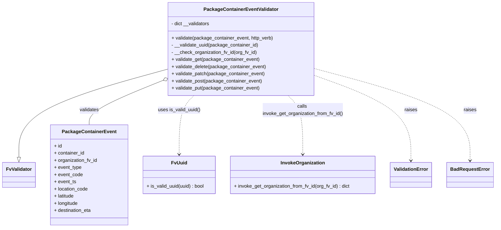

# Diagram: partview_core/partview_service/partview_service/api/package_container/event/handlers/validate/PackageContainerEventValidator.py

> Auto-generated by Obscura crawlers

## Mermaid

### SVG

<svg id="container" width="1640.625" xmlns="http://www.w3.org/2000/svg" class="classDiagram" height="762" viewBox="0 0 1640.625 762" role="graphics-document document" aria-roledescription="class"><g><defs><marker id="container_class-aggregationStart" class="marker aggregation class" refX="18" refY="7" markerWidth="190" markerHeight="240" orient="auto"><path d="M 18,7 L9,13 L1,7 L9,1 Z"></path></marker></defs><defs><marker id="container_class-aggregationEnd" class="marker aggregation class" refX="1" refY="7" markerWidth="20" markerHeight="28" orient="auto"><path d="M 18,7 L9,13 L1,7 L9,1 Z"></path></marker></defs><defs><marker id="container_class-extensionStart" class="marker extension class" refX="18" refY="7" markerWidth="190" markerHeight="240" orient="auto"><path d="M 1,7 L18,13 V 1 Z"></path></marker></defs><defs><marker id="container_class-extensionEnd" class="marker extension class" refX="1" refY="7" markerWidth="20" markerHeight="28" orient="auto"><path d="M 1,1 V 13 L18,7 Z"></path></marker></defs><defs><marker id="container_class-compositionStart" class="marker composition class" refX="18" refY="7" markerWidth="190" markerHeight="240" orient="auto"><path d="M 18,7 L9,13 L1,7 L9,1 Z"></path></marker></defs><defs><marker id="container_class-compositionEnd" class="marker composition class" refX="1" refY="7" markerWidth="20" markerHeight="28" orient="auto"><path d="M 18,7 L9,13 L1,7 L9,1 Z"></path></marker></defs><defs><marker id="container_class-dependencyStart" class="marker dependency class" refX="6" refY="7" markerWidth="190" markerHeight="240" orient="auto"><path d="M 5,7 L9,13 L1,7 L9,1 Z"></path></marker></defs><defs><marker id="container_class-dependencyEnd" class="marker dependency class" refX="13" refY="7" markerWidth="20" markerHeight="28" orient="auto"><path d="M 18,7 L9,13 L14,7 L9,1 Z"></path></marker></defs><defs><marker id="container_class-lollipopStart" class="marker lollipop class" refX="13" refY="7" markerWidth="190" markerHeight="240" orient="auto"><circle stroke="black" fill="transparent" cx="7" cy="7" r="6"></circle></marker></defs><defs><marker id="container_class-lollipopEnd" class="marker lollipop class" refX="1" refY="7" markerWidth="190" markerHeight="240" orient="auto"><circle stroke="black" fill="transparent" cx="7" cy="7" r="6"></circle></marker></defs><g class="root"><g class="clusters"></g><g class="edgePaths"><path d="M556.656,231.296L474.031,254.247C391.406,277.197,226.156,323.099,143.531,372.341C60.906,421.583,60.906,474.167,60.906,500.458L60.906,526.75" id="id_PackageContainerEventValidator_FvValidator_1" class="edge-thickness-normal edge-pattern-solid relation" style=";;;" data-edge="true" data-et="edge" data-id="id_PackageContainerEventValidator_FvValidator_1" data-points="W3sieCI6NTU2LjY1NjI1LCJ5IjoyMzEuMjk2MDM5ODg2OTQ0NjR9LHsieCI6NjAuOTA2MjUsInkiOjM2OX0seyJ4Ijo2MC45MDYyNSwieSI6NTQ0fV0=" marker-end="url(#container_class-extensionEnd)"></path><path d="M540.662,268.341L499.136,285.117C457.611,301.894,374.559,335.447,333.034,360.39C291.508,385.333,291.508,401.667,291.508,409.833L291.508,418" id="id_PackageContainerEventValidator_PackageContainerEvent_2" class="edge-thickness-normal edge-pattern-solid relation" style=";;;" data-edge="true" data-et="edge" data-id="id_PackageContainerEventValidator_PackageContainerEvent_2" data-points="W3sieCI6NTU2LjY1NjI1LCJ5IjoyNjEuODc5MjE0NzgwNjAwNX0seyJ4IjoyOTEuNTA3ODEyNSwieSI6MzY5fSx7IngiOjI5MS41MDc4MTI1LCJ5Ijo0MTh9XQ==" marker-start="url(#container_class-aggregationStart)"></path><path d="M640.932,320L632.661,328.167C624.39,336.333,607.847,352.667,599.576,385.5C591.305,418.333,591.305,467.667,591.305,492.333L591.305,517" id="id_PackageContainerEventValidator_FvUuid_3" class="edge-thickness-normal edge-pattern-dashed relation" style=";;;" data-edge="true" data-et="edge" data-id="id_PackageContainerEventValidator_FvUuid_3" data-points="W3sieCI6NjQwLjkzMjEyNjUyNDM5MDIsInkiOjMyMH0seyJ4Ijo1OTEuMzA0Njg3NSwieSI6MzY5fSx7IngiOjU5MS4zMDQ2ODc1LCJ5Ijo1MjN9XQ==" marker-end="url(#container_class-dependencyEnd)"></path><path d="M956.927,320L965.198,328.167C973.47,336.333,990.012,352.667,998.283,385.5C1006.555,418.333,1006.555,467.667,1006.555,492.333L1006.555,517" id="id_PackageContainerEventValidator_InvokeOrganization_4" class="edge-thickness-normal edge-pattern-dashed relation" style=";;;" data-edge="true" data-et="edge" data-id="id_PackageContainerEventValidator_InvokeOrganization_4" data-points="W3sieCI6OTU2LjkyNzI0ODQ3NTYwOTgsInkiOjMyMH0seyJ4IjoxMDA2LjU1NDY4NzUsInkiOjM2OX0seyJ4IjoxMDA2LjU1NDY4NzUsInkiOjUyM31d" marker-end="url(#container_class-dependencyEnd)"></path><path d="M1041.203,251.447L1095.483,271.04C1149.763,290.632,1258.323,329.816,1312.603,377.575C1366.883,425.333,1366.883,481.667,1366.883,509.833L1366.883,538" id="id_PackageContainerEventValidator_ValidationError_5" class="edge-thickness-normal edge-pattern-dashed relation" style=";;;" data-edge="true" data-et="edge" data-id="id_PackageContainerEventValidator_ValidationError_5" data-points="W3sieCI6MTA0MS4yMDMxMjUsInkiOjI1MS40NDc0NTM4NTAxNzQ3fSx7IngiOjEzNjYuODgyODEyNSwieSI6MzY5fSx7IngiOjEzNjYuODgyODEyNSwieSI6NTQ0fV0=" marker-end="url(#container_class-dependencyEnd)"></path><path d="M1041.203,229.4L1127.393,252.667C1213.583,275.934,1385.964,322.467,1472.154,373.9C1558.344,425.333,1558.344,481.667,1558.344,509.833L1558.344,538" id="id_PackageContainerEventValidator_BadRequestError_6" class="edge-thickness-normal edge-pattern-dashed relation" style=";;;" data-edge="true" data-et="edge" data-id="id_PackageContainerEventValidator_BadRequestError_6" data-points="W3sieCI6MTA0MS4yMDMxMjUsInkiOjIyOS40MDA0OTM4MDE3NTkxOH0seyJ4IjoxNTU4LjM0Mzc1LCJ5IjozNjl9LHsieCI6MTU1OC4zNDM3NSwieSI6NTQ0fV0=" marker-end="url(#container_class-dependencyEnd)"></path></g><g class="edgeLabels"><g class="edgeLabel"><g class="label" data-id="id_PackageContainerEventValidator_FvValidator_1" transform="translate(0, 0)"><foreignObject width="0" height="0">

</foreignObject></g></g><g class="edgeLabel" transform="translate(291.5078125, 369)"><g class="label" data-id="id_PackageContainerEventValidator_PackageContainerEvent_2" transform="translate(-32.6875, -12)"><foreignObject width="65.375" height="24">

validates

</foreignObject></g></g><g class="edgeLabel" transform="translate(591.3046875, 369)"><g class="label" data-id="id_PackageContainerEventValidator_FvUuid_3" transform="translate(-71.3671875, -12)"><foreignObject width="142.734375" height="24">

uses is_valid_uuid()

</foreignObject></g></g><g class="edgeLabel" transform="translate(1006.5546875, 369)"><g class="label" data-id="id_PackageContainerEventValidator_InvokeOrganization_4" transform="translate(-136.1953125, -24)"><foreignObject width="272.390625" height="48">

calls invoke_get_organization_from_fv_id()

</foreignObject></g></g><g class="edgeLabel" transform="translate(1366.8828125, 369)"><g class="label" data-id="id_PackageContainerEventValidator_ValidationError_5" transform="translate(-21.25, -12)"><foreignObject width="42.5" height="24">

raises

</foreignObject></g></g><g class="edgeLabel" transform="translate(1558.34375, 369)"><g class="label" data-id="id_PackageContainerEventValidator_BadRequestError_6" transform="translate(-21.25, -12)"><foreignObject width="42.5" height="24">

raises

</foreignObject></g></g></g><g class="nodes"><g class="node default" id="classId-PackageContainerEventValidator-0" transform="translate(798.9296875, 164)"><g class="basic label-container"><path d="M-242.2734375 -156 L242.2734375 -156 L242.2734375 156 L-242.2734375 156" stroke="none" stroke-width="0" fill="#ECECFF" style=""></path><path d="M-242.2734375 -156 C-57.15533535192273 -156, 127.96276679615454 -156, 242.2734375 -156 M-242.2734375 -156 C-76.4245338790225 -156, 89.42436974195499 -156, 242.2734375 -156 M242.2734375 -156 C242.2734375 -46.363839580542944, 242.2734375 63.27232083891411, 242.2734375 156 M242.2734375 -156 C242.2734375 -72.59523489478528, 242.2734375 10.809530210429443, 242.2734375 156 M242.2734375 156 C102.23066741881144 156, -37.81210266237713 156, -242.2734375 156 M242.2734375 156 C82.02673514966312 156, -78.21996720067375 156, -242.2734375 156 M-242.2734375 156 C-242.2734375 76.47318477372647, -242.2734375 -3.053630452547054, -242.2734375 -156 M-242.2734375 156 C-242.2734375 71.72377761501939, -242.2734375 -12.552444769961227, -242.2734375 -156" stroke="#9370DB" stroke-width="1.3" fill="none" stroke-dasharray="0 0" style=""></path></g><g class="annotation-group text" transform="translate(0, -132)"></g><g class="label-group text" transform="translate(-118.84375, -132)"><g class="label" style="font-weight: bolder" transform="translate(0,-12)"><foreignObject width="237.6875" height="24">

PackageContainerEventValidator

</foreignObject></g></g><g class="members-group text" transform="translate(-230.2734375, -84)"><g class="label" style="" transform="translate(0,-12)"><foreignObject width="130.359375" height="24">

- dict __validators

</foreignObject></g></g><g class="methods-group text" transform="translate(-230.2734375, -36)"><g class="label" style="" transform="translate(0,-12)"><foreignObject width="341.703125" height="24">

+ validate(package_container_event, http_verb)

</foreignObject></g><g class="label" style="" transform="translate(0,12)"><foreignObject width="292.3125" height="24">

- __validate_uuid(package_container_id)

</foreignObject></g><g class="label" style="" transform="translate(0,36)"><foreignObject width="287.125" height="24">

- __check_organization_fv_id(org_fv_id)

</foreignObject></g><g class="label" style="" transform="translate(0,60)"><foreignObject width="294.109375" height="24">

+ validate_get(package_container_event)

</foreignObject></g><g class="label" style="" transform="translate(0,84)"><foreignObject width="316.953125" height="24">

+ validate_delete(package_container_event)

</foreignObject></g><g class="label" style="" transform="translate(0,108)"><foreignObject width="312.015625" height="24">

+ validate_patch(package_container_event)

</foreignObject></g><g class="label" style="" transform="translate(0,132)"><foreignObject width="303.5" height="24">

+ validate_post(package_container_event)

</foreignObject></g><g class="label" style="" transform="translate(0,156)"><foreignObject width="296" height="24">

+ validate_put(package_container_event)

</foreignObject></g></g><g class="divider" style=""><path d="M-242.2734375 -108 C-56.14344307999721 -108, 129.98655134000558 -108, 242.2734375 -108 M-242.2734375 -108 C-139.6631331274092 -108, -37.052828754818364 -108, 242.2734375 -108" stroke="#9370DB" stroke-width="1.3" fill="none" stroke-dasharray="0 0" style=""></path></g><g class="divider" style=""><path d="M-242.2734375 -60 C-92.37391212369633 -60, 57.52561325260734 -60, 242.2734375 -60 M-242.2734375 -60 C-83.90356523089332 -60, 74.46630703821336 -60, 242.2734375 -60" stroke="#9370DB" stroke-width="1.3" fill="none" stroke-dasharray="0 0" style=""></path></g></g><g class="node default" id="classId-FvValidator-1" transform="translate(60.90625, 586)"><g class="basic label-container"><path d="M-52.90625 -42 L52.90625 -42 L52.90625 42 L-52.90625 42" stroke="none" stroke-width="0" fill="#ECECFF" style=""></path><path d="M-52.90625 -42 C-26.009440048796552 -42, 0.8873699024068955 -42, 52.90625 -42 M-52.90625 -42 C-11.173834572466973 -42, 30.558580855066054 -42, 52.90625 -42 M52.90625 -42 C52.90625 -12.106400024855773, 52.90625 17.787199950288453, 52.90625 42 M52.90625 -42 C52.90625 -11.61821890810949, 52.90625 18.76356218378102, 52.90625 42 M52.90625 42 C26.950978548634758 42, 0.9957070972695163 42, -52.90625 42 M52.90625 42 C19.726223061769083 42, -13.453803876461834 42, -52.90625 42 M-52.90625 42 C-52.90625 12.208520479310312, -52.90625 -17.582959041379375, -52.90625 -42 M-52.90625 42 C-52.90625 15.392594773909504, -52.90625 -11.214810452180991, -52.90625 -42" stroke="#9370DB" stroke-width="1.3" fill="none" stroke-dasharray="0 0" style=""></path></g><g class="annotation-group text" transform="translate(0, -18)"></g><g class="label-group text" transform="translate(-40.90625, -18)"><g class="label" style="font-weight: bolder" transform="translate(0,-12)"><foreignObject width="81.8125" height="24">

FvValidator

</foreignObject></g></g><g class="members-group text" transform="translate(-40.90625, 30)"></g><g class="methods-group text" transform="translate(-40.90625, 60)"></g><g class="divider" style=""><path d="M-52.90625 6 C-25.311954074338686 6, 2.2823418513226272 6, 52.90625 6 M-52.90625 6 C-31.622661392537047 6, -10.339072785074094 6, 52.90625 6" stroke="#9370DB" stroke-width="1.3" fill="none" stroke-dasharray="0 0" style=""></path></g><g class="divider" style=""><path d="M-52.90625 24 C-25.807622927132343 24, 1.2910041457353145 24, 52.90625 24 M-52.90625 24 C-20.27628279853444 24, 12.353684402931123 24, 52.90625 24" stroke="#9370DB" stroke-width="1.3" fill="none" stroke-dasharray="0 0" style=""></path></g></g><g class="node default" id="classId-PackageContainerEvent-2" transform="translate(291.5078125, 586)"><g class="basic label-container"><path d="M-127.6953125 -168 L127.6953125 -168 L127.6953125 168 L-127.6953125 168" stroke="none" stroke-width="0" fill="#ECECFF" style=""></path><path d="M-127.6953125 -168 C-64.465753178783 -168, -1.2361938575660076 -168, 127.6953125 -168 M-127.6953125 -168 C-42.674902408880186 -168, 42.34550768223963 -168, 127.6953125 -168 M127.6953125 -168 C127.6953125 -100.62261275941451, 127.6953125 -33.24522551882902, 127.6953125 168 M127.6953125 -168 C127.6953125 -57.69463037227689, 127.6953125 52.61073925544622, 127.6953125 168 M127.6953125 168 C29.318700530523287 168, -69.05791143895343 168, -127.6953125 168 M127.6953125 168 C55.18191610556323 168, -17.331480288873536 168, -127.6953125 168 M-127.6953125 168 C-127.6953125 43.86622212245746, -127.6953125 -80.26755575508508, -127.6953125 -168 M-127.6953125 168 C-127.6953125 97.20398975348081, -127.6953125 26.407979506961624, -127.6953125 -168" stroke="#9370DB" stroke-width="1.3" fill="none" stroke-dasharray="0 0" style=""></path></g><g class="annotation-group text" transform="translate(0, -144)"></g><g class="label-group text" transform="translate(-85.65625, -144)"><g class="label" style="font-weight: bolder" transform="translate(0,-12)"><foreignObject width="171.3125" height="24">

PackageContainerEvent

</foreignObject></g></g><g class="members-group text" transform="translate(-115.6953125, -96)"><g class="label" style="" transform="translate(0,-12)"><foreignObject width="26.3125" height="24">

+ id

</foreignObject></g><g class="label" style="" transform="translate(0,12)"><foreignObject width="102.546875" height="24">

+ container_id

</foreignObject></g><g class="label" style="" transform="translate(0,36)"><foreignObject width="145.734375" height="24">

+ organization_fv_id

</foreignObject></g><g class="label" style="" transform="translate(0,60)"><foreignObject width="92.359375" height="24">

+ event_type

</foreignObject></g><g class="label" style="" transform="translate(0,84)"><foreignObject width="95.53125" height="24">

+ event_code

</foreignObject></g><g class="label" style="" transform="translate(0,108)"><foreignObject width="73.8125" height="24">

+ event_ts

</foreignObject></g><g class="label" style="" transform="translate(0,132)"><foreignObject width="114.34375" height="24">

+ location_code

</foreignObject></g><g class="label" style="" transform="translate(0,156)"><foreignObject width="69.203125" height="24">

+ latitude

</foreignObject></g><g class="label" style="" transform="translate(0,180)"><foreignObject width="81.765625" height="24">

+ longitude

</foreignObject></g><g class="label" style="" transform="translate(0,204)"><foreignObject width="126.453125" height="24">

+ destination_eta

</foreignObject></g></g><g class="methods-group text" transform="translate(-115.6953125, 168)"></g><g class="divider" style=""><path d="M-127.6953125 -120 C-54.686891822460126 -120, 18.321528855079748 -120, 127.6953125 -120 M-127.6953125 -120 C-27.39583209521119 -120, 72.90364830957762 -120, 127.6953125 -120" stroke="#9370DB" stroke-width="1.3" fill="none" stroke-dasharray="0 0" style=""></path></g><g class="divider" style=""><path d="M-127.6953125 144 C-26.699078587923168 144, 74.29715532415366 144, 127.6953125 144 M-127.6953125 144 C-54.73011456447473 144, 18.235083371050536 144, 127.6953125 144" stroke="#9370DB" stroke-width="1.3" fill="none" stroke-dasharray="0 0" style=""></path></g></g><g class="node default" id="classId-FvUuid-3" transform="translate(591.3046875, 586)"><g class="basic label-container"><path d="M-122.1015625 -63 L122.1015625 -63 L122.1015625 63 L-122.1015625 63" stroke="none" stroke-width="0" fill="#ECECFF" style=""></path><path d="M-122.1015625 -63 C-47.12076425703388 -63, 27.860033985932233 -63, 122.1015625 -63 M-122.1015625 -63 C-65.92708709313499 -63, -9.752611686269958 -63, 122.1015625 -63 M122.1015625 -63 C122.1015625 -31.112393718881613, 122.1015625 0.7752125622367743, 122.1015625 63 M122.1015625 -63 C122.1015625 -32.591939102421655, 122.1015625 -2.1838782048433103, 122.1015625 63 M122.1015625 63 C65.32041069876954 63, 8.53925889753907 63, -122.1015625 63 M122.1015625 63 C39.160275993933595 63, -43.78101051213281 63, -122.1015625 63 M-122.1015625 63 C-122.1015625 22.77564512917781, -122.1015625 -17.44870974164438, -122.1015625 -63 M-122.1015625 63 C-122.1015625 27.70915387972999, -122.1015625 -7.581692240540022, -122.1015625 -63" stroke="#9370DB" stroke-width="1.3" fill="none" stroke-dasharray="0 0" style=""></path></g><g class="annotation-group text" transform="translate(0, -39)"></g><g class="label-group text" transform="translate(-24.5625, -39)"><g class="label" style="font-weight: bolder" transform="translate(0,-12)"><foreignObject width="49.125" height="24">

FvUuid

</foreignObject></g></g><g class="members-group text" transform="translate(-110.1015625, 9)"></g><g class="methods-group text" transform="translate(-110.1015625, 39)"><g class="label" style="" transform="translate(0,-12)"><foreignObject width="195.640625" height="24">

+ is_valid_uuid(uuid) : bool

</foreignObject></g></g><g class="divider" style=""><path d="M-122.1015625 -15 C-37.10964213326345 -15, 47.8822782334731 -15, 122.1015625 -15 M-122.1015625 -15 C-68.17262957199156 -15, -14.243696643983114 -15, 122.1015625 -15" stroke="#9370DB" stroke-width="1.3" fill="none" stroke-dasharray="0 0" style=""></path></g><g class="divider" style=""><path d="M-122.1015625 9 C-33.05479492322448 9, 55.991972653551045 9, 122.1015625 9 M-122.1015625 9 C-60.42231565415066 9, 1.2569311916986834 9, 122.1015625 9" stroke="#9370DB" stroke-width="1.3" fill="none" stroke-dasharray="0 0" style=""></path></g></g><g class="node default" id="classId-InvokeOrganization-4" transform="translate(1006.5546875, 586)"><g class="basic label-container"><path d="M-243.1484375 -63 L243.1484375 -63 L243.1484375 63 L-243.1484375 63" stroke="none" stroke-width="0" fill="#ECECFF" style=""></path><path d="M-243.1484375 -63 C-58.33106031696511 -63, 126.48631686606979 -63, 243.1484375 -63 M-243.1484375 -63 C-103.13561809123675 -63, 36.8772013175265 -63, 243.1484375 -63 M243.1484375 -63 C243.1484375 -21.447272703852065, 243.1484375 20.10545459229587, 243.1484375 63 M243.1484375 -63 C243.1484375 -13.956446936738423, 243.1484375 35.08710612652315, 243.1484375 63 M243.1484375 63 C111.6431848986783 63, -19.8620677026434 63, -243.1484375 63 M243.1484375 63 C105.2082452080661 63, -32.731947083867794 63, -243.1484375 63 M-243.1484375 63 C-243.1484375 17.362410322890234, -243.1484375 -28.27517935421953, -243.1484375 -63 M-243.1484375 63 C-243.1484375 36.82080616607662, -243.1484375 10.641612332153237, -243.1484375 -63" stroke="#9370DB" stroke-width="1.3" fill="none" stroke-dasharray="0 0" style=""></path></g><g class="annotation-group text" transform="translate(0, -39)"></g><g class="label-group text" transform="translate(-71.046875, -39)"><g class="label" style="font-weight: bolder" transform="translate(0,-12)"><foreignObject width="142.09375" height="24">

InvokeOrganization

</foreignObject></g></g><g class="members-group text" transform="translate(-231.1484375, 9)"></g><g class="methods-group text" transform="translate(-231.1484375, 39)"><g class="label" style="" transform="translate(0,-12)"><foreignObject width="391.25" height="24">

+ invoke_get_organization_from_fv_id(org_fv_id) : dict

</foreignObject></g></g><g class="divider" style=""><path d="M-243.1484375 -15 C-69.14908529968659 -15, 104.85026690062682 -15, 243.1484375 -15 M-243.1484375 -15 C-122.74258756486782 -15, -2.3367376297356373 -15, 243.1484375 -15" stroke="#9370DB" stroke-width="1.3" fill="none" stroke-dasharray="0 0" style=""></path></g><g class="divider" style=""><path d="M-243.1484375 9 C-77.97259187778988 9, 87.20325374442024 9, 243.1484375 9 M-243.1484375 9 C-132.76911838533545 9, -22.389799270670892 9, 243.1484375 9" stroke="#9370DB" stroke-width="1.3" fill="none" stroke-dasharray="0 0" style=""></path></g></g><g class="node default" id="classId-ValidationError-5" transform="translate(1366.8828125, 586)"><g class="basic label-container"><path d="M-67.1796875 -42 L67.1796875 -42 L67.1796875 42 L-67.1796875 42" stroke="none" stroke-width="0" fill="#ECECFF" style=""></path><path d="M-67.1796875 -42 C-27.69420805037646 -42, 11.79127139924708 -42, 67.1796875 -42 M-67.1796875 -42 C-20.257643367587455 -42, 26.66440076482509 -42, 67.1796875 -42 M67.1796875 -42 C67.1796875 -9.515790161469035, 67.1796875 22.96841967706193, 67.1796875 42 M67.1796875 -42 C67.1796875 -16.010945466741042, 67.1796875 9.978109066517916, 67.1796875 42 M67.1796875 42 C15.396666358248503 42, -36.386354783502995 42, -67.1796875 42 M67.1796875 42 C30.491908158144597 42, -6.195871183710807 42, -67.1796875 42 M-67.1796875 42 C-67.1796875 24.138870653719426, -67.1796875 6.277741307438852, -67.1796875 -42 M-67.1796875 42 C-67.1796875 20.030119817077523, -67.1796875 -1.939760365844954, -67.1796875 -42" stroke="#9370DB" stroke-width="1.3" fill="none" stroke-dasharray="0 0" style=""></path></g><g class="annotation-group text" transform="translate(0, -18)"></g><g class="label-group text" transform="translate(-55.1796875, -18)"><g class="label" style="font-weight: bolder" transform="translate(0,-12)"><foreignObject width="110.359375" height="24">

ValidationError

</foreignObject></g></g><g class="members-group text" transform="translate(-55.1796875, 30)"></g><g class="methods-group text" transform="translate(-55.1796875, 60)"></g><g class="divider" style=""><path d="M-67.1796875 6 C-35.03951623390943 6, -2.8993449678188625 6, 67.1796875 6 M-67.1796875 6 C-39.60620426523303 6, -12.032721030466071 6, 67.1796875 6" stroke="#9370DB" stroke-width="1.3" fill="none" stroke-dasharray="0 0" style=""></path></g><g class="divider" style=""><path d="M-67.1796875 24 C-17.83857243404578 24, 31.50254263190844 24, 67.1796875 24 M-67.1796875 24 C-15.122114463184587 24, 36.935458573630825 24, 67.1796875 24" stroke="#9370DB" stroke-width="1.3" fill="none" stroke-dasharray="0 0" style=""></path></g></g><g class="node default" id="classId-BadRequestError-6" transform="translate(1558.34375, 586)"><g class="basic label-container"><path d="M-74.28125 -42 L74.28125 -42 L74.28125 42 L-74.28125 42" stroke="none" stroke-width="0" fill="#ECECFF" style=""></path><path d="M-74.28125 -42 C-42.84313486289457 -42, -11.405019725789145 -42, 74.28125 -42 M-74.28125 -42 C-33.77580527826749 -42, 6.729639443465018 -42, 74.28125 -42 M74.28125 -42 C74.28125 -13.62292993602539, 74.28125 14.75414012794922, 74.28125 42 M74.28125 -42 C74.28125 -24.606741489065634, 74.28125 -7.2134829781312675, 74.28125 42 M74.28125 42 C44.18626936176243 42, 14.091288723524848 42, -74.28125 42 M74.28125 42 C42.01880080176482 42, 9.756351603529637 42, -74.28125 42 M-74.28125 42 C-74.28125 11.456012380341317, -74.28125 -19.087975239317366, -74.28125 -42 M-74.28125 42 C-74.28125 16.417980275114754, -74.28125 -9.164039449770492, -74.28125 -42" stroke="#9370DB" stroke-width="1.3" fill="none" stroke-dasharray="0 0" style=""></path></g><g class="annotation-group text" transform="translate(0, -18)"></g><g class="label-group text" transform="translate(-62.28125, -18)"><g class="label" style="font-weight: bolder" transform="translate(0,-12)"><foreignObject width="124.5625" height="24">

BadRequestError

</foreignObject></g></g><g class="members-group text" transform="translate(-62.28125, 30)"></g><g class="methods-group text" transform="translate(-62.28125, 60)"></g><g class="divider" style=""><path d="M-74.28125 6 C-25.83103082878926 6, 22.61918834242148 6, 74.28125 6 M-74.28125 6 C-15.115706297249325 6, 44.04983740550135 6, 74.28125 6" stroke="#9370DB" stroke-width="1.3" fill="none" stroke-dasharray="0 0" style=""></path></g><g class="divider" style=""><path d="M-74.28125 24 C-28.04972098149102 24, 18.18180803701796 24, 74.28125 24 M-74.28125 24 C-32.624058809387385 24, 9.03313238122523 24, 74.28125 24" stroke="#9370DB" stroke-width="1.3" fill="none" stroke-dasharray="0 0" style=""></path></g></g></g></g></g></svg>
