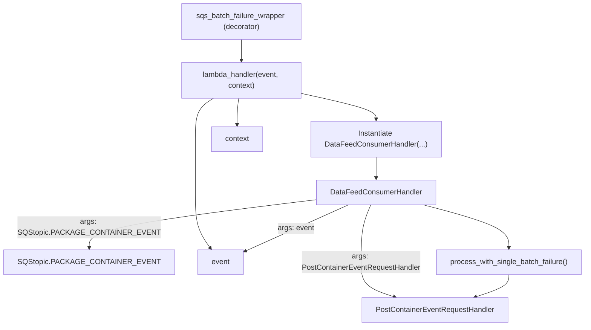

# Diagram: partview_core/partview_service/partview_service/api/package_container/event/package_container_event_consumer.py

> Auto-generated by Obscura crawlers

## Mermaid

### SVG

<svg id="container" width="1240.96875" xmlns="http://www.w3.org/2000/svg" class="flowchart" height="710" viewBox="0 0 1240.96875 710" role="graphics-document document" aria-roledescription="flowchart-v2"><g><marker id="container_flowchart-v2-pointEnd" class="marker flowchart-v2" viewBox="0 0 10 10" refX="5" refY="5" markerUnits="userSpaceOnUse" markerWidth="8" markerHeight="8" orient="auto"><path d="M 0 0 L 10 5 L 0 10 z" class="arrowMarkerPath" style="stroke-width: 1; stroke-dasharray: 1, 0;"></path></marker><marker id="container_flowchart-v2-pointStart" class="marker flowchart-v2" viewBox="0 0 10 10" refX="4.5" refY="5" markerUnits="userSpaceOnUse" markerWidth="8" markerHeight="8" orient="auto"><path d="M 0 5 L 10 10 L 10 0 z" class="arrowMarkerPath" style="stroke-width: 1; stroke-dasharray: 1, 0;"></path></marker><marker id="container_flowchart-v2-circleEnd" class="marker flowchart-v2" viewBox="0 0 10 10" refX="11" refY="5" markerUnits="userSpaceOnUse" markerWidth="11" markerHeight="11" orient="auto"><circle cx="5" cy="5" r="5" class="arrowMarkerPath" style="stroke-width: 1; stroke-dasharray: 1, 0;"></circle></marker><marker id="container_flowchart-v2-circleStart" class="marker flowchart-v2" viewBox="0 0 10 10" refX="-1" refY="5" markerUnits="userSpaceOnUse" markerWidth="11" markerHeight="11" orient="auto"><circle cx="5" cy="5" r="5" class="arrowMarkerPath" style="stroke-width: 1; stroke-dasharray: 1, 0;"></circle></marker><marker id="container_flowchart-v2-crossEnd" class="marker cross flowchart-v2" viewBox="0 0 11 11" refX="12" refY="5.2" markerUnits="userSpaceOnUse" markerWidth="11" markerHeight="11" orient="auto"><path d="M 1,1 l 9,9 M 10,1 l -9,9" class="arrowMarkerPath" style="stroke-width: 2; stroke-dasharray: 1, 0;"></path></marker><marker id="container_flowchart-v2-crossStart" class="marker cross flowchart-v2" viewBox="0 0 11 11" refX="-1" refY="5.2" markerUnits="userSpaceOnUse" markerWidth="11" markerHeight="11" orient="auto"><path d="M 1,1 l 9,9 M 10,1 l -9,9" class="arrowMarkerPath" style="stroke-width: 2; stroke-dasharray: 1, 0;"></path></marker><g class="root"><g class="clusters"></g><g class="edgePaths"><path d="M488.926,86L488.926,90.167C488.926,94.333,488.926,102.667,488.926,110.333C488.926,118,488.926,125,488.926,128.5L488.926,132" id="L_DECORATOR_LAMBDA_0" class="edge-thickness-normal edge-pattern-solid edge-thickness-normal edge-pattern-solid flowchart-link" style=";" data-edge="true" data-et="edge" data-id="L_DECORATOR_LAMBDA_0" data-points="W3sieCI6NDg4LjkyNTc4MTI1LCJ5Ijo4Nn0seyJ4Ijo0ODguOTI1NzgxMjUsInkiOjExMX0seyJ4Ijo0ODguOTI1NzgxMjUsInkiOjEzNn1d" marker-end="url(#container_flowchart-v2-pointEnd)"></path><path d="M427.369,214L420.793,218.167C414.216,222.333,401.063,230.667,394.487,245.5C387.91,260.333,387.91,281.667,387.91,303C387.91,324.333,387.91,345.667,387.91,365C387.91,384.333,387.91,401.667,387.91,423C387.91,444.333,387.91,469.667,393.439,489.96C398.967,510.254,410.024,525.508,415.553,533.134L421.081,540.761" id="L_LAMBDA_EVENT_0" class="edge-thickness-normal edge-pattern-solid edge-thickness-normal edge-pattern-solid flowchart-link" style=";" data-edge="true" data-et="edge" data-id="L_LAMBDA_EVENT_0" data-points="W3sieCI6NDI3LjM2OTM4NDc2NTYyNSwieSI6MjE0fSx7IngiOjM4Ny45MTAxNTYyNSwieSI6MjM5fSx7IngiOjM4Ny45MTAxNTYyNSwieSI6MzAzfSx7IngiOjM4Ny45MTAxNTYyNSwieSI6MzY3fSx7IngiOjM4Ny45MTAxNTYyNSwieSI6NDE5fSx7IngiOjM4Ny45MTAxNTYyNSwieSI6NDk1fSx7IngiOjQyMy40Mjg2MDgxNDE0NDc0LCJ5Ijo1NDR9XQ==" marker-end="url(#container_flowchart-v2-pointEnd)"></path><path d="M483.341,214L482.745,218.167C482.148,222.333,480.955,230.667,480.358,240.333C479.762,250,479.762,261,479.762,266.5L479.762,272" id="L_LAMBDA_CTX_0" class="edge-thickness-normal edge-pattern-solid edge-thickness-normal edge-pattern-solid flowchart-link" style=";" data-edge="true" data-et="edge" data-id="L_LAMBDA_CTX_0" data-points="W3sieCI6NDgzLjM0MTQzMDY2NDA2MjUsInkiOjIxNH0seyJ4Ijo0NzkuNzYxNzE4NzUsInkiOjIzOX0seyJ4Ijo0NzkuNzYxNzE4NzUsInkiOjI3Nn1d" marker-end="url(#container_flowchart-v2-pointEnd)"></path><path d="M618.926,203.408L646.071,209.34C673.216,215.272,727.507,227.136,754.652,236.568C781.797,246,781.797,253,781.797,256.5L781.797,260" id="L_LAMBDA_CREATE_0" class="edge-thickness-normal edge-pattern-solid edge-thickness-normal edge-pattern-solid flowchart-link" style=";" data-edge="true" data-et="edge" data-id="L_LAMBDA_CREATE_0" data-points="W3sieCI6NjE4LjkyNTc4MTI1LCJ5IjoyMDMuNDA4NDAyODAwOTMzNjN9LHsieCI6NzgxLjc5Njg3NSwieSI6MjM5fSx7IngiOjc4MS43OTY4NzUsInkiOjI2NH1d" marker-end="url(#container_flowchart-v2-pointEnd)"></path><path d="M781.797,342L781.797,346.167C781.797,350.333,781.797,358.667,781.797,366.333C781.797,374,781.797,381,781.797,384.5L781.797,388" id="L_CREATE_DCH_0" class="edge-thickness-normal edge-pattern-solid edge-thickness-normal edge-pattern-solid flowchart-link" style=";" data-edge="true" data-et="edge" data-id="L_CREATE_DCH_0" data-points="W3sieCI6NzgxLjc5Njg3NSwieSI6MzQyfSx7IngiOjc4MS43OTY4NzUsInkiOjM2N30seyJ4Ijo3ODEuNzk2ODc1LCJ5IjozOTJ9XQ==" marker-end="url(#container_flowchart-v2-pointEnd)"></path><path d="M652.641,435.188L573.103,445.156C493.565,455.125,334.49,475.063,254.952,492.531C175.414,510,175.414,525,175.414,532.5L175.414,540" id="L_DCH_SQ_0" class="edge-thickness-normal edge-pattern-solid edge-thickness-normal edge-pattern-solid flowchart-link" style=";" data-edge="true" data-et="edge" data-id="L_DCH_SQ_0" data-points="W3sieCI6NjUyLjY0MDYyNSwieSI6NDM1LjE4NzU4Nzc3MDcyMDN9LHsieCI6MTc1LjQxNDA2MjUsInkiOjQ5NX0seyJ4IjoxNzUuNDE0MDYyNSwieSI6NTQ0fV0=" marker-end="url(#container_flowchart-v2-pointEnd)"></path><path d="M721.616,446L703.413,454.167C685.21,462.333,648.804,478.667,611.339,495.476C573.873,512.284,535.347,529.569,516.084,538.211L496.821,546.853" id="L_DCH_EVENT_0" class="edge-thickness-normal edge-pattern-solid edge-thickness-normal edge-pattern-solid flowchart-link" style=";" data-edge="true" data-et="edge" data-id="L_DCH_EVENT_0" data-points="W3sieCI6NzIxLjYxNTg1MTE1MTMxNTgsInkiOjQ0Nn0seyJ4Ijo2MTIuMzk4NDM3NSwieSI6NDk1fSx7IngiOjQ5My4xNzE4NzUsInkiOjU0OC40OTA1Njg2NDgyNDk4fV0=" marker-end="url(#container_flowchart-v2-pointEnd)"></path><path d="M770.284,446L766.802,454.167C763.32,462.333,756.355,478.667,752.873,499.5C749.391,520.333,749.391,545.667,749.391,567C749.391,588.333,749.391,605.667,761.737,618.296C774.083,630.926,798.776,638.852,811.122,642.815L823.469,646.778" id="L_DCH_POST_0" class="edge-thickness-normal edge-pattern-solid edge-thickness-normal edge-pattern-solid flowchart-link" style=";" data-edge="true" data-et="edge" data-id="L_DCH_POST_0" data-points="W3sieCI6NzcwLjI4NDEyODI4OTQ3MzYsInkiOjQ0Nn0seyJ4Ijo3NDkuMzkwNjI1LCJ5Ijo0OTV9LHsieCI6NzQ5LjM5MDYyNSwieSI6NTcxfSx7IngiOjc0OS4zOTA2MjUsInkiOjYyM30seyJ4Ijo4MjcuMjc3MTE4Mzg5NDIzMSwieSI6NjQ4fV0=" marker-end="url(#container_flowchart-v2-pointEnd)"></path><path d="M885.392,446L916.727,454.167C948.061,462.333,1010.73,478.667,1042.064,494.333C1073.398,510,1073.398,525,1073.398,532.5L1073.398,540" id="L_DCH_PROCESS_0" class="edge-thickness-normal edge-pattern-solid edge-thickness-normal edge-pattern-solid flowchart-link" style=";" data-edge="true" data-et="edge" data-id="L_DCH_PROCESS_0" data-points="W3sieCI6ODg1LjM5MjE2Njk0MDc4OTUsInkiOjQ0Nn0seyJ4IjoxMDczLjM5ODQzNzUsInkiOjQ5NX0seyJ4IjoxMDczLjM5ODQzNzUsInkiOjU0NH1d" marker-end="url(#container_flowchart-v2-pointEnd)"></path><path d="M1073.398,598L1073.398,602.167C1073.398,606.333,1073.398,614.667,1061.052,622.796C1048.706,630.926,1024.013,638.852,1011.667,642.815L999.321,646.778" id="L_PROCESS_POST_0" class="edge-thickness-normal edge-pattern-solid edge-thickness-normal edge-pattern-solid flowchart-link" style=";" data-edge="true" data-et="edge" data-id="L_PROCESS_POST_0" data-points="W3sieCI6MTA3My4zOTg0Mzc1LCJ5Ijo1OTh9LHsieCI6MTA3My4zOTg0Mzc1LCJ5Ijo2MjN9LHsieCI6OTk1LjUxMTk0NDExMDU3NjksInkiOjY0OH1d" marker-end="url(#container_flowchart-v2-pointEnd)"></path></g><g class="edgeLabels"><g class="edgeLabel"><g class="label" data-id="L_DECORATOR_LAMBDA_0" transform="translate(0, 0)"><foreignObject width="0" height="0">

</foreignObject></g></g><g class="edgeLabel"><g class="label" data-id="L_LAMBDA_EVENT_0" transform="translate(0, 0)"><foreignObject width="0" height="0">

</foreignObject></g></g><g class="edgeLabel"><g class="label" data-id="L_LAMBDA_CTX_0" transform="translate(0, 0)"><foreignObject width="0" height="0">

</foreignObject></g></g><g class="edgeLabel"><g class="label" data-id="L_LAMBDA_CREATE_0" transform="translate(0, 0)"><foreignObject width="0" height="0">

</foreignObject></g></g><g class="edgeLabel"><g class="label" data-id="L_CREATE_DCH_0" transform="translate(0, 0)"><foreignObject width="0" height="0">

</foreignObject></g></g><g class="edgeLabel" transform="translate(175.4140625, 495)"><g class="label" data-id="L_DCH_SQ_0" transform="translate(-137.40625, -24)"><foreignObject width="274.8125" height="48">

args: SQStopic.PACKAGE_CONTAINER_EVENT

</foreignObject></g></g><g class="edgeLabel" transform="translate(612.3984375, 495)"><g class="label" data-id="L_DCH_EVENT_0" transform="translate(-39.375, -12)"><foreignObject width="78.75" height="24">

args: event

</foreignObject></g></g><g class="edgeLabel" transform="translate(749.390625, 571)"><g class="label" data-id="L_DCH_POST_0" transform="translate(-129.4375, -24)"><foreignObject width="258.875" height="48">

args: PostContainerEventRequestHandler

</foreignObject></g></g><g class="edgeLabel"><g class="label" data-id="L_DCH_PROCESS_0" transform="translate(0, 0)"><foreignObject width="0" height="0">

</foreignObject></g></g><g class="edgeLabel"><g class="label" data-id="L_PROCESS_POST_0" transform="translate(0, 0)"><foreignObject width="0" height="0">

</foreignObject></g></g></g><g class="nodes"><g class="node default" id="flowchart-LAMBDA-0" transform="translate(488.92578125, 175)"><rect class="basic label-container" style="" x="-130" y="-39" width="260" height="78"></rect><g class="label" style="" transform="translate(-100, -24)"><rect></rect><foreignObject width="200" height="48">

lambda_handler(event, context)

</foreignObject></g></g><g class="node default" id="flowchart-DECORATOR-1" transform="translate(488.92578125, 47)"><rect class="basic label-container" style="" x="-130" y="-39" width="260" height="78"></rect><g class="label" style="" transform="translate(-100, -24)"><rect></rect><foreignObject width="200" height="48">

sqs_batch_failure_wrapper (decorator)

</foreignObject></g></g><g class="node default" id="flowchart-CREATE-2" transform="translate(781.796875, 303)"><rect class="basic label-container" style="" x="-140.09375" y="-39" width="280.1875" height="78"></rect><g class="label" style="" transform="translate(-110.09375, -24)"><rect></rect><foreignObject width="220.1875" height="48">

Instantiate DataFeedConsumerHandler(...)

</foreignObject></g></g><g class="node default" id="flowchart-DCH-3" transform="translate(781.796875, 419)"><rect class="basic label-container" style="" x="-129.15625" y="-27" width="258.3125" height="54"></rect><g class="label" style="" transform="translate(-99.15625, -12)"><rect></rect><foreignObject width="198.3125" height="24">

DataFeedConsumerHandler

</foreignObject></g></g><g class="node default" id="flowchart-SQ-4" transform="translate(175.4140625, 571)"><rect class="basic label-container" style="" x="-167.4140625" y="-27" width="334.828125" height="54"></rect><g class="label" style="" transform="translate(-137.4140625, -12)"><rect></rect><foreignObject width="274.828125" height="24">

SQStopic.PACKAGE_CONTAINER_EVENT

</foreignObject></g></g><g class="node default" id="flowchart-EVENT-5" transform="translate(443, 571)"><rect class="basic label-container" style="" x="-50.171875" y="-27" width="100.34375" height="54"></rect><g class="label" style="" transform="translate(-20.171875, -12)"><rect></rect><foreignObject width="40.34375" height="24">

event

</foreignObject></g></g><g class="node default" id="flowchart-CTX-6" transform="translate(479.76171875, 303)"><rect class="basic label-container" style="" x="-56.8515625" y="-27" width="113.703125" height="54"></rect><g class="label" style="" transform="translate(-26.8515625, -12)"><rect></rect><foreignObject width="53.703125" height="24">

context

</foreignObject></g></g><g class="node default" id="flowchart-PROCESS-7" transform="translate(1073.3984375, 571)"><rect class="basic label-container" style="" x="-159.5703125" y="-27" width="319.140625" height="54"></rect><g class="label" style="" transform="translate(-129.5703125, -12)"><rect></rect><foreignObject width="259.140625" height="24">

process_with_single_batch_failure()

</foreignObject></g></g><g class="node default" id="flowchart-POST-8" transform="translate(911.39453125, 675)"><rect class="basic label-container" style="" x="-159.4453125" y="-27" width="318.890625" height="54"></rect><g class="label" style="" transform="translate(-129.4453125, -12)"><rect></rect><foreignObject width="258.890625" height="24">

PostContainerEventRequestHandler

</foreignObject></g></g></g></g></g></svg>
