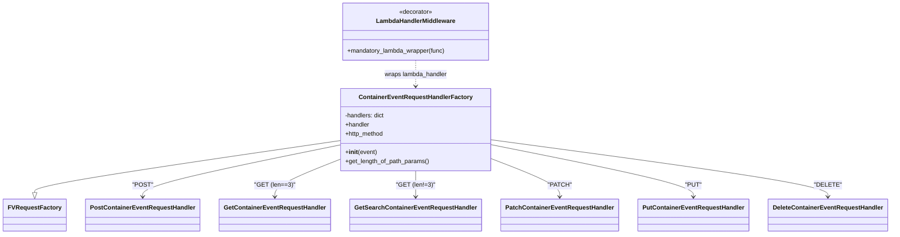

# Diagram: partview_core/partview_service/partview_service/api/package_container/event/package_container_event_handler.py


> Auto-generated by Obscura crawlers

## Diagram 1



### SVG

<svg id="container" width="2237.34375" xmlns="http://www.w3.org/2000/svg" class="classDiagram" height="614" viewBox="0 0 2237.34375 614" role="graphics-document document" aria-roledescription="class"><style>#container{font-family:"trebuchet ms",verdana,arial,sans-serif;font-size:16px;fill:#333;}@keyframes edge-animation-frame{from{stroke-dashoffset:0;}}@keyframes dash{to{stroke-dashoffset:0;}}#container .edge-animation-slow{stroke-dasharray:9,5!important;stroke-dashoffset:900;animation:dash 50s linear infinite;stroke-linecap:round;}#container .edge-animation-fast{stroke-dasharray:9,5!important;stroke-dashoffset:900;animation:dash 20s linear infinite;stroke-linecap:round;}#container .error-icon{fill:#552222;}#container .error-text{fill:#552222;stroke:#552222;}#container .edge-thickness-normal{stroke-width:1px;}#container .edge-thickness-thick{stroke-width:3.5px;}#container .edge-pattern-solid{stroke-dasharray:0;}#container .edge-thickness-invisible{stroke-width:0;fill:none;}#container .edge-pattern-dashed{stroke-dasharray:3;}#container .edge-pattern-dotted{stroke-dasharray:2;}#container .marker{fill:#333333;stroke:#333333;}#container .marker.cross{stroke:#333333;}#container svg{font-family:"trebuchet ms",verdana,arial,sans-serif;font-size:16px;}#container p{margin:0;}#container g.classGroup text{fill:#9370DB;stroke:none;font-family:"trebuchet ms",verdana,arial,sans-serif;font-size:10px;}#container g.classGroup text .title{font-weight:bolder;}#container .nodeLabel,#container .edgeLabel{color:#131300;}#container .edgeLabel .label rect{fill:#ECECFF;}#container .label text{fill:#131300;}#container .labelBkg{background:#ECECFF;}#container .edgeLabel .label span{background:#ECECFF;}#container .classTitle{font-weight:bolder;}#container .node rect,#container .node circle,#container .node ellipse,#container .node polygon,#container .node path{fill:#ECECFF;stroke:#9370DB;stroke-width:1px;}#container .divider{stroke:#9370DB;stroke-width:1;}#container g.clickable{cursor:pointer;}#container g.classGroup rect{fill:#ECECFF;stroke:#9370DB;}#container g.classGroup line{stroke:#9370DB;stroke-width:1;}#container .classLabel .box{stroke:none;stroke-width:0;fill:#ECECFF;opacity:0.5;}#container .classLabel .label{fill:#9370DB;font-size:10px;}#container .relation{stroke:#333333;stroke-width:1;fill:none;}#container .dashed-line{stroke-dasharray:3;}#container .dotted-line{stroke-dasharray:1 2;}#container #compositionStart,#container .composition{fill:#333333!important;stroke:#333333!important;stroke-width:1;}#container #compositionEnd,#container .composition{fill:#333333!important;stroke:#333333!important;stroke-width:1;}#container #dependencyStart,#container .dependency{fill:#333333!important;stroke:#333333!important;stroke-width:1;}#container #dependencyStart,#container .dependency{fill:#333333!important;stroke:#333333!important;stroke-width:1;}#container #extensionStart,#container .extension{fill:transparent!important;stroke:#333333!important;stroke-width:1;}#container #extensionEnd,#container .extension{fill:transparent!important;stroke:#333333!important;stroke-width:1;}#container #aggregationStart,#container .aggregation{fill:transparent!important;stroke:#333333!important;stroke-width:1;}#container #aggregationEnd,#container .aggregation{fill:transparent!important;stroke:#333333!important;stroke-width:1;}#container #lollipopStart,#container .lollipop{fill:#ECECFF!important;stroke:#333333!important;stroke-width:1;}#container #lollipopEnd,#container .lollipop{fill:#ECECFF!important;stroke:#333333!important;stroke-width:1;}#container .edgeTerminals{font-size:11px;line-height:initial;}#container .classTitleText{text-anchor:middle;font-size:18px;fill:#333;}#container .label-icon{display:inline-block;height:1em;overflow:visible;vertical-align:-0.125em;}#container .node .label-icon path{fill:currentColor;stroke:revert;stroke-width:revert;}#container :root{--mermaid-font-family:"trebuchet ms",verdana,arial,sans-serif;}</style><g><defs><marker id="container_class-aggregationStart" class="marker aggregation class" refX="18" refY="7" markerWidth="190" markerHeight="240" orient="auto"><path d="M 18,7 L9,13 L1,7 L9,1 Z"></path></marker></defs><defs><marker id="container_class-aggregationEnd" class="marker aggregation class" refX="1" refY="7" markerWidth="20" markerHeight="28" orient="auto"><path d="M 18,7 L9,13 L1,7 L9,1 Z"></path></marker></defs><defs><marker id="container_class-extensionStart" class="marker extension class" refX="18" refY="7" markerWidth="190" markerHeight="240" orient="auto"><path d="M 1,7 L18,13 V 1 Z"></path></marker></defs><defs><marker id="container_class-extensionEnd" class="marker extension class" refX="1" refY="7" markerWidth="20" markerHeight="28" orient="auto"><path d="M 1,1 V 13 L18,7 Z"></path></marker></defs><defs><marker id="container_class-compositionStart" class="marker composition class" refX="18" refY="7" markerWidth="190" markerHeight="240" orient="auto"><path d="M 18,7 L9,13 L1,7 L9,1 Z"></path></marker></defs><defs><marker id="container_class-compositionEnd" class="marker composition class" refX="1" refY="7" markerWidth="20" markerHeight="28" orient="auto"><path d="M 18,7 L9,13 L1,7 L9,1 Z"></path></marker></defs><defs><marker id="container_class-dependencyStart" class="marker dependency class" refX="6" refY="7" markerWidth="190" markerHeight="240" orient="auto"><path d="M 5,7 L9,13 L1,7 L9,1 Z"></path></marker></defs><defs><marker id="container_class-dependencyEnd" class="marker dependency class" refX="13" refY="7" markerWidth="20" markerHeight="28" orient="auto"><path d="M 18,7 L9,13 L14,7 L9,1 Z"></path></marker></defs><defs><marker id="container_class-lollipopStart" class="marker lollipop class" refX="13" refY="7" markerWidth="190" markerHeight="240" orient="auto"><circle stroke="black" fill="transparent" cx="7" cy="7" r="6"></circle></marker></defs><defs><marker id="container_class-lollipopEnd" class="marker lollipop class" refX="1" refY="7" markerWidth="190" markerHeight="240" orient="auto"><circle stroke="black" fill="transparent" cx="7" cy="7" r="6"></circle></marker></defs><g class="root"><g class="clusters"></g><g class="edgePaths"><path d="M848.355,369.285L721.136,388.57C593.917,407.856,339.478,446.428,212.258,469.006C85.039,491.583,85.039,498.167,85.039,501.458L85.039,504.75" id="id_ContainerEventRequestHandlerFactory_FVRequestFactory_1" class="edge-thickness-normal edge-pattern-solid relation" style=";;;" data-edge="true" data-et="edge" data-id="id_ContainerEventRequestHandlerFactory_FVRequestFactory_1" data-points="W3sieCI6ODQ4LjM1NTQ2ODc1LCJ5IjozNjkuMjg0NTk3MDM4MzMxOH0seyJ4Ijo4NS4wMzkwNjI1LCJ5Ijo0ODV9LHsieCI6ODUuMDM5MDYyNSwieSI6NTIyfV0=" marker-end="url(#container_class-extensionEnd)"></path><path d="M848.355,380.808L766.153,398.174C683.951,415.539,519.546,450.269,437.343,472.801C355.141,495.333,355.141,505.667,355.141,510.833L355.141,516" id="id_ContainerEventRequestHandlerFactory_PostContainerEventRequestHandler_2" class="edge-thickness-normal edge-pattern-solid relation" style=";;;" data-edge="true" data-et="edge" data-id="id_ContainerEventRequestHandlerFactory_PostContainerEventRequestHandler_2" data-points="W3sieCI6ODQ4LjM1NTQ2ODc1LCJ5IjozODAuODA4Mzc4MjkyMjQ0M30seyJ4IjozNTUuMTQwNjI1LCJ5Ijo0ODV9LHsieCI6MzU1LjE0MDYyNSwieSI6NTIyfV0=" marker-end="url(#container_class-dependencyEnd)"></path><path d="M848.355,419.173L821.587,430.144C794.818,441.115,741.28,463.058,714.511,479.195C687.742,495.333,687.742,505.667,687.742,510.833L687.742,516" id="id_ContainerEventRequestHandlerFactory_GetContainerEventRequestHandler_3" class="edge-thickness-normal edge-pattern-solid relation" style=";;;" data-edge="true" data-et="edge" data-id="id_ContainerEventRequestHandlerFactory_GetContainerEventRequestHandler_3" data-points="W3sieCI6ODQ4LjM1NTQ2ODc1LCJ5Ijo0MTkuMTcyODQ5NzI5NDkxfSx7IngiOjY4Ny43NDIxODc1LCJ5Ijo0ODV9LHsieCI6Njg3Ljc0MjE4NzUsInkiOjUyMn1d" marker-end="url(#container_class-dependencyEnd)"></path><path d="M1041.531,448L1041.531,454.167C1041.531,460.333,1041.531,472.667,1041.531,484C1041.531,495.333,1041.531,505.667,1041.531,510.833L1041.531,516" id="id_ContainerEventRequestHandlerFactory_GetSearchContainerEventRequestHandler_4" class="edge-thickness-normal edge-pattern-solid relation" style=";;;" data-edge="true" data-et="edge" data-id="id_ContainerEventRequestHandlerFactory_GetSearchContainerEventRequestHandler_4" data-points="W3sieCI6MTA0MS41MzEyNSwieSI6NDQ4fSx7IngiOjEwNDEuNTMxMjUsInkiOjQ4NX0seyJ4IjoxMDQxLjUzMTI1LCJ5Ijo1MjJ9XQ==" marker-end="url(#container_class-dependencyEnd)"></path><path d="M1234.707,417.529L1262.726,428.774C1290.745,440.02,1346.783,462.51,1374.801,478.922C1402.82,495.333,1402.82,505.667,1402.82,510.833L1402.82,516" id="id_ContainerEventRequestHandlerFactory_PatchContainerEventRequestHandler_5" class="edge-thickness-normal edge-pattern-solid relation" style=";;;" data-edge="true" data-et="edge" data-id="id_ContainerEventRequestHandlerFactory_PatchContainerEventRequestHandler_5" data-points="W3sieCI6MTIzNC43MDcwMzEyNSwieSI6NDE3LjUyOTMwMDQ2NDkxNTE0fSx7IngiOjE0MDIuODIwMzEyNSwieSI6NDg1fSx7IngiOjE0MDIuODIwMzEyNSwieSI6NTIyfV0=" marker-end="url(#container_class-dependencyEnd)"></path><path d="M1234.707,380.161L1318.755,397.634C1402.802,415.107,1570.897,450.054,1654.945,472.693C1738.992,495.333,1738.992,505.667,1738.992,510.833L1738.992,516" id="id_ContainerEventRequestHandlerFactory_PutContainerEventRequestHandler_6" class="edge-thickness-normal edge-pattern-solid relation" style=";;;" data-edge="true" data-et="edge" data-id="id_ContainerEventRequestHandlerFactory_PutContainerEventRequestHandler_6" data-points="W3sieCI6MTIzNC43MDcwMzEyNSwieSI6MzgwLjE2MDY1NTI3ODYzMzQ0fSx7IngiOjE3MzguOTkyMTg3NSwieSI6NDg1fSx7IngiOjE3MzguOTkyMTg3NSwieSI6NTIyfV0=" marker-end="url(#container_class-dependencyEnd)"></path><path d="M1234.707,367.006L1375.378,386.671C1516.049,406.337,1797.392,445.669,1938.063,470.501C2078.734,495.333,2078.734,505.667,2078.734,510.833L2078.734,516" id="id_ContainerEventRequestHandlerFactory_DeleteContainerEventRequestHandler_7" class="edge-thickness-normal edge-pattern-solid relation" style=";;;" data-edge="true" data-et="edge" data-id="id_ContainerEventRequestHandlerFactory_DeleteContainerEventRequestHandler_7" data-points="W3sieCI6MTIzNC43MDcwMzEyNSwieSI6MzY3LjAwNTc4ODU1Mzk1Mzd9LHsieCI6MjA3OC43MzQzNzUsInkiOjQ4NX0seyJ4IjoyMDc4LjczNDM3NSwieSI6NTIyfV0=" marker-end="url(#container_class-dependencyEnd)"></path><path d="M1041.531,158L1041.531,164.167C1041.531,170.333,1041.531,182.667,1041.531,194C1041.531,205.333,1041.531,215.667,1041.531,220.833L1041.531,226" id="id_LambdaHandlerMiddleware_ContainerEventRequestHandlerFactory_8" class="edge-thickness-normal edge-pattern-dashed relation" style=";;;" data-edge="true" data-et="edge" data-id="id_LambdaHandlerMiddleware_ContainerEventRequestHandlerFactory_8" data-points="W3sieCI6MTA0MS41MzEyNSwieSI6MTU4fSx7IngiOjEwNDEuNTMxMjUsInkiOjE5NX0seyJ4IjoxMDQxLjUzMTI1LCJ5IjoyMzJ9XQ==" marker-end="url(#container_class-dependencyEnd)"></path></g><g class="edgeLabels"><g class="edgeLabel"><g class="label" data-id="id_ContainerEventRequestHandlerFactory_FVRequestFactory_1" transform="translate(0, 0)"><foreignObject width="0" height="0"><div xmlns="http://www.w3.org/1999/xhtml" class="labelBkg" style="display: table-cell; white-space: nowrap; line-height: 1.5; max-width: 200px; text-align: center;"><span class="edgeLabel"></span></div></foreignObject></g></g><g class="edgeLabel" transform="translate(355.140625, 485)"><g class="label" data-id="id_ContainerEventRequestHandlerFactory_PostContainerEventRequestHandler_2" transform="translate(-24.96875, -12)"><foreignObject width="49.9375" height="24"><div xmlns="http://www.w3.org/1999/xhtml" class="labelBkg" style="display: table-cell; white-space: nowrap; line-height: 1.5; max-width: 200px; text-align: center;"><span class="edgeLabel"><p>"POST"</p></span></div></foreignObject></g></g><g class="edgeLabel" transform="translate(687.7421875, 485)"><g class="label" data-id="id_ContainerEventRequestHandlerFactory_GetContainerEventRequestHandler_3" transform="translate(-50.21875, -12)"><foreignObject width="100.4375" height="24"><div xmlns="http://www.w3.org/1999/xhtml" class="labelBkg" style="display: table-cell; white-space: nowrap; line-height: 1.5; max-width: 200px; text-align: center;"><span class="edgeLabel"><p>"GET (len==3)"</p></span></div></foreignObject></g></g><g class="edgeLabel" transform="translate(1041.53125, 485)"><g class="label" data-id="id_ContainerEventRequestHandlerFactory_GetSearchContainerEventRequestHandler_4" transform="translate(-48.1484375, -12)"><foreignObject width="96.296875" height="24"><div xmlns="http://www.w3.org/1999/xhtml" class="labelBkg" style="display: table-cell; white-space: nowrap; line-height: 1.5; max-width: 200px; text-align: center;"><span class="edgeLabel"><p>"GET (len!=3)"</p></span></div></foreignObject></g></g><g class="edgeLabel" transform="translate(1402.8203125, 485)"><g class="label" data-id="id_ContainerEventRequestHandlerFactory_PatchContainerEventRequestHandler_5" transform="translate(-28.515625, -12)"><foreignObject width="57.03125" height="24"><div xmlns="http://www.w3.org/1999/xhtml" class="labelBkg" style="display: table-cell; white-space: nowrap; line-height: 1.5; max-width: 200px; text-align: center;"><span class="edgeLabel"><p>"PATCH"</p></span></div></foreignObject></g></g><g class="edgeLabel" transform="translate(1738.9921875, 485)"><g class="label" data-id="id_ContainerEventRequestHandlerFactory_PutContainerEventRequestHandler_6" transform="translate(-20.546875, -12)"><foreignObject width="41.09375" height="24"><div xmlns="http://www.w3.org/1999/xhtml" class="labelBkg" style="display: table-cell; white-space: nowrap; line-height: 1.5; max-width: 200px; text-align: center;"><span class="edgeLabel"><p>"PUT"</p></span></div></foreignObject></g></g><g class="edgeLabel" transform="translate(2078.734375, 485)"><g class="label" data-id="id_ContainerEventRequestHandlerFactory_DeleteContainerEventRequestHandler_7" transform="translate(-32.5, -12)"><foreignObject width="65" height="24"><div xmlns="http://www.w3.org/1999/xhtml" class="labelBkg" style="display: table-cell; white-space: nowrap; line-height: 1.5; max-width: 200px; text-align: center;"><span class="edgeLabel"><p>"DELETE"</p></span></div></foreignObject></g></g><g class="edgeLabel" transform="translate(1041.53125, 195)"><g class="label" data-id="id_LambdaHandlerMiddleware_ContainerEventRequestHandlerFactory_8" transform="translate(-83.3359375, -12)"><foreignObject width="166.671875" height="24"><div xmlns="http://www.w3.org/1999/xhtml" class="labelBkg" style="display: table-cell; white-space: nowrap; line-height: 1.5; max-width: 200px; text-align: center;"><span class="edgeLabel"><p>wraps lambda_handler</p></span></div></foreignObject></g></g></g><g class="nodes"><g class="node default" id="classId-FVRequestFactory-0" transform="translate(85.0390625, 564)"><g class="basic label-container"><path d="M-77.0390625 -42 L77.0390625 -42 L77.0390625 42 L-77.0390625 42" stroke="none" stroke-width="0" fill="#ECECFF" style=""></path><path d="M-77.0390625 -42 C-35.72626266569918 -42, 5.586537168601637 -42, 77.0390625 -42 M-77.0390625 -42 C-25.107602490932507 -42, 26.823857518134986 -42, 77.0390625 -42 M77.0390625 -42 C77.0390625 -19.18888216691792, 77.0390625 3.6222356661641584, 77.0390625 42 M77.0390625 -42 C77.0390625 -12.076294294082842, 77.0390625 17.847411411834315, 77.0390625 42 M77.0390625 42 C34.52782827957498 42, -7.983405940850034 42, -77.0390625 42 M77.0390625 42 C19.621630643560238 42, -37.795801212879525 42, -77.0390625 42 M-77.0390625 42 C-77.0390625 22.837728548687195, -77.0390625 3.675457097374391, -77.0390625 -42 M-77.0390625 42 C-77.0390625 23.49788746228012, -77.0390625 4.995774924560237, -77.0390625 -42" stroke="#9370DB" stroke-width="1.3" fill="none" stroke-dasharray="0 0" style=""></path></g><g class="annotation-group text" transform="translate(0, -18)"></g><g class="label-group text" transform="translate(-65.0390625, -18)"><g class="label" style="font-weight: bolder" transform="translate(0,-12)"><foreignObject width="130.078125" height="24"><div xmlns="http://www.w3.org/1999/xhtml" style="display: table-cell; white-space: nowrap; line-height: 1.5; max-width: 178px; text-align: center;"><span class="nodeLabel markdown-node-label" style=""><p>FVRequestFactory</p></span></div></foreignObject></g></g><g class="members-group text" transform="translate(-65.0390625, 30)"></g><g class="methods-group text" transform="translate(-65.0390625, 60)"></g><g class="divider" style=""><path d="M-77.0390625 6 C-29.238727747417904 6, 18.56160700516419 6, 77.0390625 6 M-77.0390625 6 C-31.32655057300213 6, 14.38596135399574 6, 77.0390625 6" stroke="#9370DB" stroke-width="1.3" fill="none" stroke-dasharray="0 0" style=""></path></g><g class="divider" style=""><path d="M-77.0390625 24 C-39.075152561034834 24, -1.1112426220696676 24, 77.0390625 24 M-77.0390625 24 C-17.386990030833324 24, 42.26508243833335 24, 77.0390625 24" stroke="#9370DB" stroke-width="1.3" fill="none" stroke-dasharray="0 0" style=""></path></g></g><g class="node default" id="classId-ContainerEventRequestHandlerFactory-1" transform="translate(1041.53125, 340)"><g class="basic label-container"><path d="M-193.17578125 -108 L193.17578125 -108 L193.17578125 108 L-193.17578125 108" stroke="none" stroke-width="0" fill="#ECECFF" style=""></path><path d="M-193.17578125 -108 C-97.3410786384518 -108, -1.5063760269036095 -108, 193.17578125 -108 M-193.17578125 -108 C-93.49576649110729 -108, 6.184248267785421 -108, 193.17578125 -108 M193.17578125 -108 C193.17578125 -60.65677115755142, 193.17578125 -13.313542315102836, 193.17578125 108 M193.17578125 -108 C193.17578125 -64.32763454039605, 193.17578125 -20.65526908079211, 193.17578125 108 M193.17578125 108 C84.0122948606762 108, -25.151191528647587 108, -193.17578125 108 M193.17578125 108 C41.59588252834112 108, -109.98401619331776 108, -193.17578125 108 M-193.17578125 108 C-193.17578125 57.32705905806878, -193.17578125 6.654118116137553, -193.17578125 -108 M-193.17578125 108 C-193.17578125 44.988548222932266, -193.17578125 -18.022903554135468, -193.17578125 -108" stroke="#9370DB" stroke-width="1.3" fill="none" stroke-dasharray="0 0" style=""></path></g><g class="annotation-group text" transform="translate(0, -84)"></g><g class="label-group text" transform="translate(-141.4765625, -84)"><g class="label" style="font-weight: bolder" transform="translate(0,-12)"><foreignObject width="282.953125" height="24"><div xmlns="http://www.w3.org/1999/xhtml" style="display: table-cell; white-space: nowrap; line-height: 1.5; max-width: 330px; text-align: center;"><span class="nodeLabel markdown-node-label" style=""><p>ContainerEventRequestHandlerFactory</p></span></div></foreignObject></g></g><g class="members-group text" transform="translate(-181.17578125, -36)"><g class="label" style="" transform="translate(0,-12)"><foreignObject width="105.796875" height="24"><div xmlns="http://www.w3.org/1999/xhtml" style="display: table-cell; white-space: nowrap; line-height: 1.5; max-width: 163px; text-align: center;"><span class="nodeLabel markdown-node-label" style=""><p>-handlers: dict</p></span></div></foreignObject></g><g class="label" style="" transform="translate(0,12)"><foreignObject width="64.515625" height="24"><div xmlns="http://www.w3.org/1999/xhtml" style="display: table-cell; white-space: nowrap; line-height: 1.5; max-width: 123px; text-align: center;"><span class="nodeLabel markdown-node-label" style=""><p>+handler</p></span></div></foreignObject></g><g class="label" style="" transform="translate(0,36)"><foreignObject width="102.921875" height="24"><div xmlns="http://www.w3.org/1999/xhtml" style="display: table-cell; white-space: nowrap; line-height: 1.5; max-width: 160px; text-align: center;"><span class="nodeLabel markdown-node-label" style=""><p>+http_method</p></span></div></foreignObject></g></g><g class="methods-group text" transform="translate(-181.17578125, 60)"><g class="label" style="" transform="translate(0,-12)"><foreignObject width="83.140625" height="24"><div xmlns="http://www.w3.org/1999/xhtml" style="display: table-cell; white-space: nowrap; line-height: 1.5; max-width: 172px; text-align: center;"><span class="nodeLabel markdown-node-label" style=""><p>+<strong>init</strong>(event)</p></span></div></foreignObject></g><g class="label" style="" transform="translate(0,12)"><foreignObject width="220.875" height="24"><div xmlns="http://www.w3.org/1999/xhtml" style="display: table-cell; white-space: nowrap; line-height: 1.5; max-width: 278px; text-align: center;"><span class="nodeLabel markdown-node-label" style=""><p>+get_length_of_path_params()</p></span></div></foreignObject></g></g><g class="divider" style=""><path d="M-193.17578125 -60 C-77.32102837356578 -60, 38.53372450286844 -60, 193.17578125 -60 M-193.17578125 -60 C-102.20727486115963 -60, -11.238768472319265 -60, 193.17578125 -60" stroke="#9370DB" stroke-width="1.3" fill="none" stroke-dasharray="0 0" style=""></path></g><g class="divider" style=""><path d="M-193.17578125 36 C-78.42963719118438 36, 36.31650686763123 36, 193.17578125 36 M-193.17578125 36 C-94.02782236362 36, 5.120136522759992 36, 193.17578125 36" stroke="#9370DB" stroke-width="1.3" fill="none" stroke-dasharray="0 0" style=""></path></g></g><g class="node default" id="classId-PostContainerEventRequestHandler-2" transform="translate(355.140625, 564)"><g class="basic label-container"><path d="M-143.0625 -42 L143.0625 -42 L143.0625 42 L-143.0625 42" stroke="none" stroke-width="0" fill="#ECECFF" style=""></path><path d="M-143.0625 -42 C-60.14711311033783 -42, 22.768273779324346 -42, 143.0625 -42 M-143.0625 -42 C-63.92180499911349 -42, 15.218890001773019 -42, 143.0625 -42 M143.0625 -42 C143.0625 -22.10459328858388, 143.0625 -2.2091865771677632, 143.0625 42 M143.0625 -42 C143.0625 -11.622305302863396, 143.0625 18.75538939427321, 143.0625 42 M143.0625 42 C80.80748490761064 42, 18.5524698152213 42, -143.0625 42 M143.0625 42 C54.17538692327487 42, -34.71172615345026 42, -143.0625 42 M-143.0625 42 C-143.0625 10.27695195103437, -143.0625 -21.44609609793126, -143.0625 -42 M-143.0625 42 C-143.0625 11.189593912926046, -143.0625 -19.620812174147908, -143.0625 -42" stroke="#9370DB" stroke-width="1.3" fill="none" stroke-dasharray="0 0" style=""></path></g><g class="annotation-group text" transform="translate(0, -18)"></g><g class="label-group text" transform="translate(-131.0625, -18)"><g class="label" style="font-weight: bolder" transform="translate(0,-12)"><foreignObject width="262.125" height="24"><div xmlns="http://www.w3.org/1999/xhtml" style="display: table-cell; white-space: nowrap; line-height: 1.5; max-width: 310px; text-align: center;"><span class="nodeLabel markdown-node-label" style=""><p>PostContainerEventRequestHandler</p></span></div></foreignObject></g></g><g class="members-group text" transform="translate(-131.0625, 30)"></g><g class="methods-group text" transform="translate(-131.0625, 60)"></g><g class="divider" style=""><path d="M-143.0625 6 C-45.505251233871746 6, 52.05199753225651 6, 143.0625 6 M-143.0625 6 C-54.117194521285754 6, 34.82811095742849 6, 143.0625 6" stroke="#9370DB" stroke-width="1.3" fill="none" stroke-dasharray="0 0" style=""></path></g><g class="divider" style=""><path d="M-143.0625 24 C-45.954688382875474 24, 51.15312323424905 24, 143.0625 24 M-143.0625 24 C-62.71770085718008 24, 17.627098285639846 24, 143.0625 24" stroke="#9370DB" stroke-width="1.3" fill="none" stroke-dasharray="0 0" style=""></path></g></g><g class="node default" id="classId-GetContainerEventRequestHandler-3" transform="translate(687.7421875, 564)"><g class="basic label-container"><path d="M-139.5390625 -42 L139.5390625 -42 L139.5390625 42 L-139.5390625 42" stroke="none" stroke-width="0" fill="#ECECFF" style=""></path><path d="M-139.5390625 -42 C-38.76932375397554 -42, 62.00041499204892 -42, 139.5390625 -42 M-139.5390625 -42 C-63.30083596393186 -42, 12.93739057213628 -42, 139.5390625 -42 M139.5390625 -42 C139.5390625 -16.17375663170569, 139.5390625 9.65248673658862, 139.5390625 42 M139.5390625 -42 C139.5390625 -16.510750698801644, 139.5390625 8.978498602396712, 139.5390625 42 M139.5390625 42 C31.901612513710717 42, -75.73583747257857 42, -139.5390625 42 M139.5390625 42 C65.20218282246022 42, -9.134696855079568 42, -139.5390625 42 M-139.5390625 42 C-139.5390625 8.952352431914704, -139.5390625 -24.09529513617059, -139.5390625 -42 M-139.5390625 42 C-139.5390625 14.249310159968456, -139.5390625 -13.501379680063089, -139.5390625 -42" stroke="#9370DB" stroke-width="1.3" fill="none" stroke-dasharray="0 0" style=""></path></g><g class="annotation-group text" transform="translate(0, -18)"></g><g class="label-group text" transform="translate(-127.5390625, -18)"><g class="label" style="font-weight: bolder" transform="translate(0,-12)"><foreignObject width="255.078125" height="24"><div xmlns="http://www.w3.org/1999/xhtml" style="display: table-cell; white-space: nowrap; line-height: 1.5; max-width: 303px; text-align: center;"><span class="nodeLabel markdown-node-label" style=""><p>GetContainerEventRequestHandler</p></span></div></foreignObject></g></g><g class="members-group text" transform="translate(-127.5390625, 30)"></g><g class="methods-group text" transform="translate(-127.5390625, 60)"></g><g class="divider" style=""><path d="M-139.5390625 6 C-52.84141463619778 6, 33.856233227604434 6, 139.5390625 6 M-139.5390625 6 C-72.22749694625047 6, -4.915931392500937 6, 139.5390625 6" stroke="#9370DB" stroke-width="1.3" fill="none" stroke-dasharray="0 0" style=""></path></g><g class="divider" style=""><path d="M-139.5390625 24 C-67.16928648861922 24, 5.200489522761558 24, 139.5390625 24 M-139.5390625 24 C-47.272449999569346 24, 44.99416250086131 24, 139.5390625 24" stroke="#9370DB" stroke-width="1.3" fill="none" stroke-dasharray="0 0" style=""></path></g></g><g class="node default" id="classId-GetSearchContainerEventRequestHandler-4" transform="translate(1041.53125, 564)"><g class="basic label-container"><path d="M-164.25 -42 L164.25 -42 L164.25 42 L-164.25 42" stroke="none" stroke-width="0" fill="#ECECFF" style=""></path><path d="M-164.25 -42 C-50.17070273842856 -42, 63.90859452314288 -42, 164.25 -42 M-164.25 -42 C-35.84174282110703 -42, 92.56651435778593 -42, 164.25 -42 M164.25 -42 C164.25 -15.638986591972866, 164.25 10.722026816054267, 164.25 42 M164.25 -42 C164.25 -18.26166072068088, 164.25 5.476678558638241, 164.25 42 M164.25 42 C89.81674457362575 42, 15.38348914725151 42, -164.25 42 M164.25 42 C33.921862616506644 42, -96.40627476698671 42, -164.25 42 M-164.25 42 C-164.25 18.29500508513571, -164.25 -5.4099898297285804, -164.25 -42 M-164.25 42 C-164.25 17.7222450567993, -164.25 -6.555509886401403, -164.25 -42" stroke="#9370DB" stroke-width="1.3" fill="none" stroke-dasharray="0 0" style=""></path></g><g class="annotation-group text" transform="translate(0, -18)"></g><g class="label-group text" transform="translate(-152.25, -18)"><g class="label" style="font-weight: bolder" transform="translate(0,-12)"><foreignObject width="304.5" height="24"><div xmlns="http://www.w3.org/1999/xhtml" style="display: table-cell; white-space: nowrap; line-height: 1.5; max-width: 352px; text-align: center;"><span class="nodeLabel markdown-node-label" style=""><p>GetSearchContainerEventRequestHandler</p></span></div></foreignObject></g></g><g class="members-group text" transform="translate(-152.25, 30)"></g><g class="methods-group text" transform="translate(-152.25, 60)"></g><g class="divider" style=""><path d="M-164.25 6 C-61.12653668878272 6, 41.99692662243456 6, 164.25 6 M-164.25 6 C-48.83443218055315 6, 66.5811356388937 6, 164.25 6" stroke="#9370DB" stroke-width="1.3" fill="none" stroke-dasharray="0 0" style=""></path></g><g class="divider" style=""><path d="M-164.25 24 C-63.53166805393417 24, 37.18666389213166 24, 164.25 24 M-164.25 24 C-59.917988120325035 24, 44.41402375934993 24, 164.25 24" stroke="#9370DB" stroke-width="1.3" fill="none" stroke-dasharray="0 0" style=""></path></g></g><g class="node default" id="classId-PatchContainerEventRequestHandler-5" transform="translate(1402.8203125, 564)"><g class="basic label-container"><path d="M-147.0390625 -42 L147.0390625 -42 L147.0390625 42 L-147.0390625 42" stroke="none" stroke-width="0" fill="#ECECFF" style=""></path><path d="M-147.0390625 -42 C-77.35679752941904 -42, -7.674532558838081 -42, 147.0390625 -42 M-147.0390625 -42 C-57.730697624371686 -42, 31.577667251256628 -42, 147.0390625 -42 M147.0390625 -42 C147.0390625 -19.31131685309636, 147.0390625 3.3773662938072775, 147.0390625 42 M147.0390625 -42 C147.0390625 -12.058349393316899, 147.0390625 17.883301213366202, 147.0390625 42 M147.0390625 42 C33.1837340514917 42, -80.6715943970166 42, -147.0390625 42 M147.0390625 42 C39.76885840617187 42, -67.50134568765625 42, -147.0390625 42 M-147.0390625 42 C-147.0390625 9.168532424518965, -147.0390625 -23.66293515096207, -147.0390625 -42 M-147.0390625 42 C-147.0390625 21.090641887713048, -147.0390625 0.18128377542609542, -147.0390625 -42" stroke="#9370DB" stroke-width="1.3" fill="none" stroke-dasharray="0 0" style=""></path></g><g class="annotation-group text" transform="translate(0, -18)"></g><g class="label-group text" transform="translate(-135.0390625, -18)"><g class="label" style="font-weight: bolder" transform="translate(0,-12)"><foreignObject width="270.078125" height="24"><div xmlns="http://www.w3.org/1999/xhtml" style="display: table-cell; white-space: nowrap; line-height: 1.5; max-width: 318px; text-align: center;"><span class="nodeLabel markdown-node-label" style=""><p>PatchContainerEventRequestHandler</p></span></div></foreignObject></g></g><g class="members-group text" transform="translate(-135.0390625, 30)"></g><g class="methods-group text" transform="translate(-135.0390625, 60)"></g><g class="divider" style=""><path d="M-147.0390625 6 C-46.97776815346843 6, 53.083526193063136 6, 147.0390625 6 M-147.0390625 6 C-29.7782530771956 6, 87.4825563456088 6, 147.0390625 6" stroke="#9370DB" stroke-width="1.3" fill="none" stroke-dasharray="0 0" style=""></path></g><g class="divider" style=""><path d="M-147.0390625 24 C-30.150990457633597 24, 86.7370815847328 24, 147.0390625 24 M-147.0390625 24 C-83.53949893082606 24, -20.0399353616521 24, 147.0390625 24" stroke="#9370DB" stroke-width="1.3" fill="none" stroke-dasharray="0 0" style=""></path></g></g><g class="node default" id="classId-PutContainerEventRequestHandler-6" transform="translate(1738.9921875, 564)"><g class="basic label-container"><path d="M-139.1328125 -42 L139.1328125 -42 L139.1328125 42 L-139.1328125 42" stroke="none" stroke-width="0" fill="#ECECFF" style=""></path><path d="M-139.1328125 -42 C-31.955867721977953 -42, 75.2210770560441 -42, 139.1328125 -42 M-139.1328125 -42 C-82.90208823707414 -42, -26.671363974148278 -42, 139.1328125 -42 M139.1328125 -42 C139.1328125 -14.002163125078638, 139.1328125 13.995673749842723, 139.1328125 42 M139.1328125 -42 C139.1328125 -24.6918091283143, 139.1328125 -7.383618256628601, 139.1328125 42 M139.1328125 42 C83.04399153503446 42, 26.95517057006893 42, -139.1328125 42 M139.1328125 42 C45.172674606229194 42, -48.78746328754161 42, -139.1328125 42 M-139.1328125 42 C-139.1328125 18.01259135641602, -139.1328125 -5.974817287167959, -139.1328125 -42 M-139.1328125 42 C-139.1328125 16.475332468031286, -139.1328125 -9.049335063937427, -139.1328125 -42" stroke="#9370DB" stroke-width="1.3" fill="none" stroke-dasharray="0 0" style=""></path></g><g class="annotation-group text" transform="translate(0, -18)"></g><g class="label-group text" transform="translate(-127.1328125, -18)"><g class="label" style="font-weight: bolder" transform="translate(0,-12)"><foreignObject width="254.265625" height="24"><div xmlns="http://www.w3.org/1999/xhtml" style="display: table-cell; white-space: nowrap; line-height: 1.5; max-width: 302px; text-align: center;"><span class="nodeLabel markdown-node-label" style=""><p>PutContainerEventRequestHandler</p></span></div></foreignObject></g></g><g class="members-group text" transform="translate(-127.1328125, 30)"></g><g class="methods-group text" transform="translate(-127.1328125, 60)"></g><g class="divider" style=""><path d="M-139.1328125 6 C-48.8179024489429 6, 41.497007602114195 6, 139.1328125 6 M-139.1328125 6 C-60.61922303098031 6, 17.894366438039384 6, 139.1328125 6" stroke="#9370DB" stroke-width="1.3" fill="none" stroke-dasharray="0 0" style=""></path></g><g class="divider" style=""><path d="M-139.1328125 24 C-60.974017041985974 24, 17.184778416028053 24, 139.1328125 24 M-139.1328125 24 C-35.46459189274661 24, 68.20362871450678 24, 139.1328125 24" stroke="#9370DB" stroke-width="1.3" fill="none" stroke-dasharray="0 0" style=""></path></g></g><g class="node default" id="classId-DeleteContainerEventRequestHandler-7" transform="translate(2078.734375, 564)"><g class="basic label-container"><path d="M-150.609375 -42 L150.609375 -42 L150.609375 42 L-150.609375 42" stroke="none" stroke-width="0" fill="#ECECFF" style=""></path><path d="M-150.609375 -42 C-30.727666030924908 -42, 89.15404293815018 -42, 150.609375 -42 M-150.609375 -42 C-77.66001106086571 -42, -4.7106471217314265 -42, 150.609375 -42 M150.609375 -42 C150.609375 -12.557894025297376, 150.609375 16.88421194940525, 150.609375 42 M150.609375 -42 C150.609375 -24.029395376161364, 150.609375 -6.058790752322729, 150.609375 42 M150.609375 42 C40.16968763958111 42, -70.26999972083777 42, -150.609375 42 M150.609375 42 C77.30590293467345 42, 4.0024308693469095 42, -150.609375 42 M-150.609375 42 C-150.609375 17.257480734358648, -150.609375 -7.485038531282704, -150.609375 -42 M-150.609375 42 C-150.609375 24.460852338985703, -150.609375 6.921704677971405, -150.609375 -42" stroke="#9370DB" stroke-width="1.3" fill="none" stroke-dasharray="0 0" style=""></path></g><g class="annotation-group text" transform="translate(0, -18)"></g><g class="label-group text" transform="translate(-138.609375, -18)"><g class="label" style="font-weight: bolder" transform="translate(0,-12)"><foreignObject width="277.21875" height="24"><div xmlns="http://www.w3.org/1999/xhtml" style="display: table-cell; white-space: nowrap; line-height: 1.5; max-width: 325px; text-align: center;"><span class="nodeLabel markdown-node-label" style=""><p>DeleteContainerEventRequestHandler</p></span></div></foreignObject></g></g><g class="members-group text" transform="translate(-138.609375, 30)"></g><g class="methods-group text" transform="translate(-138.609375, 60)"></g><g class="divider" style=""><path d="M-150.609375 6 C-46.367301279589014 6, 57.87477244082197 6, 150.609375 6 M-150.609375 6 C-78.09899729908716 6, -5.5886195981743185 6, 150.609375 6" stroke="#9370DB" stroke-width="1.3" fill="none" stroke-dasharray="0 0" style=""></path></g><g class="divider" style=""><path d="M-150.609375 24 C-68.63490265155468 24, 13.339569696890635 24, 150.609375 24 M-150.609375 24 C-56.82806239931743 24, 36.95325020136514 24, 150.609375 24" stroke="#9370DB" stroke-width="1.3" fill="none" stroke-dasharray="0 0" style=""></path></g></g><g class="node default" id="classId-LambdaHandlerMiddleware-8" transform="translate(1041.53125, 83)"><g class="basic label-container"><path d="M-191.9921875 -75 L191.9921875 -75 L191.9921875 75 L-191.9921875 75" stroke="none" stroke-width="0" fill="#ECECFF" style=""></path><path d="M-191.9921875 -75 C-97.2662884496183 -75, -2.5403893992366022 -75, 191.9921875 -75 M-191.9921875 -75 C-94.471611781146 -75, 3.0489639377080096 -75, 191.9921875 -75 M191.9921875 -75 C191.9921875 -36.00858382470165, 191.9921875 2.982832350596695, 191.9921875 75 M191.9921875 -75 C191.9921875 -43.662215865012456, 191.9921875 -12.324431730024912, 191.9921875 75 M191.9921875 75 C56.20232356692708 75, -79.58754036614584 75, -191.9921875 75 M191.9921875 75 C71.1086052423678 75, -49.7749770152644 75, -191.9921875 75 M-191.9921875 75 C-191.9921875 21.51291778848617, -191.9921875 -31.97416442302766, -191.9921875 -75 M-191.9921875 75 C-191.9921875 40.52935069540097, -191.9921875 6.058701390801943, -191.9921875 -75" stroke="#9370DB" stroke-width="1.3" fill="none" stroke-dasharray="0 0" style=""></path></g><g class="annotation-group text" transform="translate(-44.0625, -51)"><g class="label" style="" transform="translate(0,-12)"><foreignObject width="88.125" height="24"><div xmlns="http://www.w3.org/1999/xhtml" style="display: table-cell; white-space: nowrap; line-height: 1.5; max-width: 138px; text-align: center;"><span class="nodeLabel markdown-node-label" style=""><p>«decorator»</p></span></div></foreignObject></g></g><g class="label-group text" transform="translate(-100.765625, -27)"><g class="label" style="font-weight: bolder" transform="translate(0,-12)"><foreignObject width="201.53125" height="24"><div xmlns="http://www.w3.org/1999/xhtml" style="display: table-cell; white-space: nowrap; line-height: 1.5; max-width: 250px; text-align: center;"><span class="nodeLabel markdown-node-label" style=""><p>LambdaHandlerMiddleware</p></span></div></foreignObject></g></g><g class="members-group text" transform="translate(-179.9921875, 21)"></g><g class="methods-group text" transform="translate(-179.9921875, 51)"><g class="label" style="" transform="translate(0,-12)"><foreignObject width="259.21875" height="24"><div xmlns="http://www.w3.org/1999/xhtml" style="display: table-cell; white-space: nowrap; line-height: 1.5; max-width: 317px; text-align: center;"><span class="nodeLabel markdown-node-label" style=""><p>+mandatory_lambda_wrapper(func)</p></span></div></foreignObject></g></g><g class="divider" style=""><path d="M-191.9921875 -3 C-54.34211085279537 -3, 83.30796579440926 -3, 191.9921875 -3 M-191.9921875 -3 C-62.61040739919471 -3, 66.77137270161057 -3, 191.9921875 -3" stroke="#9370DB" stroke-width="1.3" fill="none" stroke-dasharray="0 0" style=""></path></g><g class="divider" style=""><path d="M-191.9921875 21 C-90.22271881042657 21, 11.546749879146859 21, 191.9921875 21 M-191.9921875 21 C-109.53504331504934 21, -27.07789913009867 21, 191.9921875 21" stroke="#9370DB" stroke-width="1.3" fill="none" stroke-dasharray="0 0" style=""></path></g></g></g></g></g></svg>

## Diagram 2

```mermaid
flowchart TD
    Event[Incoming event] --> CreateFactory[Create ContainerEventRequestHandlerFactory(event)]
    CreateFactory --> GetHandler[request_handler = handler_factory.handler]
    CreateFactory --> MethodCheck{handler_factory.http_method == "GET"}
    MethodCheck -->|Yes| CallNew[request_handler.handle_request_with_new_mandatory_handler()]
    MethodCheck -->|No| CallProducer[request_handler.handle_request_producer(
    SQStopic.PACKAGE_CONTAINER_EVENT,
    SQSMessageIdentifier.PACKAGE_CONTAINER_EVENT,
    default=AcceptVersion.FIFO.value,
    is_fifo=True)]
    CallNew --> Return[Return response]
    CallProducer --> Return
```

> SVG rendering failed for this diagram.
