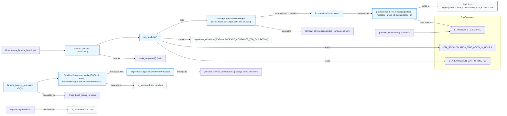

# Diagram: partview_core/partview_service/partview_service/api/package_container/event/watchers/check_for_expired_container_events.py

> Auto-generated by Obscura crawlers

## Mermaid

### SVG

<svg id="container" width="3828.546875" xmlns="http://www.w3.org/2000/svg" class="flowchart" height="871" viewBox="0 0 3828.546875 871" role="graphics-document document" aria-roledescription="flowchart-v2"><g><marker id="container_flowchart-v2-pointEnd" class="marker flowchart-v2" viewBox="0 0 10 10" refX="5" refY="5" markerUnits="userSpaceOnUse" markerWidth="8" markerHeight="8" orient="auto"><path d="M 0 0 L 10 5 L 0 10 z" class="arrowMarkerPath" style="stroke-width: 1; stroke-dasharray: 1, 0;"></path></marker><marker id="container_flowchart-v2-pointStart" class="marker flowchart-v2" viewBox="0 0 10 10" refX="4.5" refY="5" markerUnits="userSpaceOnUse" markerWidth="8" markerHeight="8" orient="auto"><path d="M 0 5 L 10 10 L 10 0 z" class="arrowMarkerPath" style="stroke-width: 1; stroke-dasharray: 1, 0;"></path></marker><marker id="container_flowchart-v2-circleEnd" class="marker flowchart-v2" viewBox="0 0 10 10" refX="11" refY="5" markerUnits="userSpaceOnUse" markerWidth="11" markerHeight="11" orient="auto"><circle cx="5" cy="5" r="5" class="arrowMarkerPath" style="stroke-width: 1; stroke-dasharray: 1, 0;"></circle></marker><marker id="container_flowchart-v2-circleStart" class="marker flowchart-v2" viewBox="0 0 10 10" refX="-1" refY="5" markerUnits="userSpaceOnUse" markerWidth="11" markerHeight="11" orient="auto"><circle cx="5" cy="5" r="5" class="arrowMarkerPath" style="stroke-width: 1; stroke-dasharray: 1, 0;"></circle></marker><marker id="container_flowchart-v2-crossEnd" class="marker cross flowchart-v2" viewBox="0 0 11 11" refX="12" refY="5.2" markerUnits="userSpaceOnUse" markerWidth="11" markerHeight="11" orient="auto"><path d="M 1,1 l 9,9 M 10,1 l -9,9" class="arrowMarkerPath" style="stroke-width: 2; stroke-dasharray: 1, 0;"></path></marker><marker id="container_flowchart-v2-crossStart" class="marker cross flowchart-v2" viewBox="0 0 11 11" refX="-1" refY="5.2" markerUnits="userSpaceOnUse" markerWidth="11" markerHeight="11" orient="auto"><path d="M 1,1 l 9,9 M 10,1 l -9,9" class="arrowMarkerPath" style="stroke-width: 2; stroke-dasharray: 1, 0;"></path></marker><g class="root"><g class="clusters"><g class="cluster" id="EnvConstants" data-look="classic"><rect style="" x="3307.5625" y="121" width="512.984375" height="404"></rect><g class="cluster-label" transform="translate(3515.3671875, 121)"><foreignObject width="97.375" height="24">

EnvConstants

</foreignObject></g></g></g><g class="edgePaths"><path d="M732.728,341L758.923,330.833C785.118,320.667,837.508,300.333,891.447,290.167C945.385,280,1000.872,280,1028.616,280L1056.359,280" id="L_LambdaScheduler_RunProducer_0" class="edge-thickness-normal edge-pattern-solid edge-thickness-normal edge-pattern-solid flowchart-link" style=";" data-edge="true" data-et="edge" data-id="L_LambdaScheduler_RunProducer_0" data-points="W3sieCI6NzMyLjcyODEyNSwieSI6MzQxfSx7IngiOjg4OS44OTg0Mzc1LCJ5IjoyODB9LHsieCI6MTA2MC4zNTkzNzUsInkiOjI4MH1d" marker-end="url(#container_flowchart-v2-pointEnd)"></path><path d="M1197.168,253L1228.428,236.833C1259.688,220.667,1322.207,188.333,1363.33,172.167C1404.453,156,1424.18,156,1434.043,156L1443.906,156" id="L_RunProducer_Helper_0" class="edge-thickness-normal edge-pattern-solid edge-thickness-normal edge-pattern-solid flowchart-link" style=";" data-edge="true" data-et="edge" data-id="L_RunProducer_Helper_0" data-points="W3sieCI6MTE5Ny4xNjc5Njg3NSwieSI6MjUzfSx7IngiOjEzODQuNzI2NTYyNSwieSI6MTU2fSx7IngiOjE0NDcuOTA2MjUsInkiOjE1Nn1d" marker-end="url(#container_flowchart-v2-pointEnd)"></path><path d="M1229.563,285.998L1255.423,287.832C1281.284,289.666,1333.005,293.333,1371.736,295.166C1410.466,297,1436.206,297,1449.076,297L1461.945,297" id="L_RunProducer_Producer_0" class="edge-thickness-normal edge-pattern-solid edge-thickness-normal edge-pattern-solid flowchart-link" style=";" data-edge="true" data-et="edge" data-id="L_RunProducer_Producer_0" data-points="W3sieCI6MTIyOS41NjI1LCJ5IjoyODUuOTk4NDY4NTU2NTMzMDZ9LHsieCI6MTM4NC43MjY1NjI1LCJ5IjoyOTd9LHsieCI6MTQ2NS45NDUzMTI1LCJ5IjoyOTd9XQ==" marker-end="url(#container_flowchart-v2-pointEnd)"></path><path d="M1967.514,129L2000.954,124.833C2034.395,120.667,2101.275,112.333,2165.737,108.167C2230.198,104,2292.24,104,2323.26,104L2354.281,104" id="L_Helper_ForLoop_0" class="edge-thickness-normal edge-pattern-solid edge-thickness-normal edge-pattern-solid flowchart-link" style=";" data-edge="true" data-et="edge" data-id="L_Helper_ForLoop_0" data-points="W3sieCI6MTk2Ny41MTM5NzIzNTU3NjkzLCJ5IjoxMjl9LHsieCI6MjE2OC4xNTYyNSwieSI6MTA0fSx7IngiOjIzNTguMjgxMjUsInkiOjEwNH1d" marker-end="url(#container_flowchart-v2-pointEnd)"></path><path d="M2611.25,104L2636.188,104C2661.125,104,2711,104,2747.591,104C2784.182,104,2807.49,104,2819.143,104L2830.797,104" id="L_ForLoop_Send_0" class="edge-thickness-normal edge-pattern-solid edge-thickness-normal edge-pattern-solid flowchart-link" style=";" data-edge="true" data-et="edge" data-id="L_ForLoop_Send_0" data-points="W3sieCI6MjYxMS4yNSwieSI6MTA0fSx7IngiOjI3NjAuODc1LCJ5IjoxMDR9LHsieCI6MjgzNC43OTY4NzUsInkiOjEwNH1d" marker-end="url(#container_flowchart-v2-pointEnd)"></path><path d="M3164.806,65L3177.247,62C3189.688,59,3214.571,53,3238.363,50C3262.156,47,3284.859,47,3299.711,47C3314.563,47,3321.563,47,3325.063,47L3328.563,47" id="L_Send_SQSTopic_0" class="edge-thickness-normal edge-pattern-solid edge-thickness-normal edge-pattern-solid flowchart-link" style=";" data-edge="true" data-et="edge" data-id="L_Send_SQSTopic_0" data-points="W3sieCI6MzE2NC44MDU5MjEwNTI2MzE3LCJ5Ijo2NX0seyJ4IjozMjM5LjQ1MzEyNSwieSI6NDd9LHsieCI6MzMwNy41NjI1LCJ5Ijo0N30seyJ4IjozMzMyLjU2MjUsInkiOjQ3fV0=" marker-end="url(#container_flowchart-v2-pointEnd)"></path><path d="M762.242,411.282L783.518,416.402C804.794,421.521,847.346,431.761,891.464,436.88C935.581,442,981.263,442,1004.104,442L1026.945,442" id="L_LambdaScheduler_Response_0" class="edge-thickness-normal edge-pattern-solid edge-thickness-normal edge-pattern-solid flowchart-link" style=";" data-edge="true" data-et="edge" data-id="L_LambdaScheduler_Response_0" data-points="W3sieCI6NzYyLjI0MjE4NzUsInkiOjQxMS4yODE5ODkwODQyOTM1fSx7IngiOjg4OS44OTg0Mzc1LCJ5Ijo0NDJ9LHsieCI6MTAzMC45NDUzMTI1LCJ5Ijo0NDJ9XQ==" marker-end="url(#container_flowchart-v2-pointEnd)"></path><path d="M3138.643,143L3155.445,147.833C3172.246,152.667,3205.85,162.333,3234.003,167.167C3262.156,172,3284.859,172,3318.409,177.02C3351.959,182.039,3396.355,192.079,3418.553,197.098L3440.752,202.118" id="L_Send_ETA_REASONS_0" class="edge-thickness-normal edge-pattern-solid edge-thickness-normal edge-pattern-solid flowchart-link" style=";" data-edge="true" data-et="edge" data-id="L_Send_ETA_REASONS_0" data-points="W3sieCI6MzEzOC42NDI4MDc5MDQ0MTE3LCJ5IjoxNDN9LHsieCI6MzIzOS40NTMxMjUsInkiOjE3Mn0seyJ4IjozMzA3LjU2MjUsInkiOjE3Mn0seyJ4IjozNDQ0LjY1MzE1MTkzOTY1NTMsInkiOjIwM31d" marker-end="url(#container_flowchart-v2-pointEnd)"></path><path d="M1226.906,307L1253.21,315.667C1279.513,324.333,1332.12,341.667,1419.439,350.333C1506.758,359,1628.789,359,1759.361,359C1889.932,359,2029.044,359,2151.368,359C2273.693,359,2379.229,359,2478.016,359C2576.802,359,2668.839,359,2755.223,359C2841.607,359,2922.339,359,3002.102,359C3081.865,359,3160.659,359,3211.408,359C3262.156,359,3284.859,359,3306.395,359C3327.93,359,3348.297,359,3358.48,359L3368.664,359" id="L_RunProducer_ETA_DELTA_0" class="edge-thickness-normal edge-pattern-solid edge-thickness-normal edge-pattern-solid flowchart-link" style=";" data-edge="true" data-et="edge" data-id="L_RunProducer_ETA_DELTA_0" data-points="W3sieCI6MTIyNi45MDYxNTExMDc1OTUsInkiOjMwN30seyJ4IjoxMzg0LjcyNjU2MjUsInkiOjM1OX0seyJ4IjoxNzUwLjgyMDMxMjUsInkiOjM1OX0seyJ4IjoyMTY4LjE1NjI1LCJ5IjozNTl9LHsieCI6MjQ4NC43NjU2MjUsInkiOjM1OX0seyJ4IjoyNzYwLjg3NSwieSI6MzU5fSx7IngiOjMwMDMuMDcwMzEyNSwieSI6MzU5fSx7IngiOjMyMzkuNDUzMTI1LCJ5IjozNTl9LHsieCI6MzMwNy41NjI1LCJ5IjozNTl9LHsieCI6MzM3Mi42NjQwNjI1LCJ5IjozNTl9XQ==" marker-end="url(#container_flowchart-v2-pointEnd)"></path><path d="M1180.336,307L1214.401,333C1248.466,359,1316.596,411,1411.677,437C1506.758,463,1628.789,463,1759.361,463C1889.932,463,2029.044,463,2151.368,463C2273.693,463,2379.229,463,2478.016,463C2576.802,463,2668.839,463,2755.223,463C2841.607,463,2922.339,463,3002.102,463C3081.865,463,3160.659,463,3211.408,463C3262.156,463,3284.859,463,3312.56,463C3340.26,463,3372.958,463,3389.307,463L3405.656,463" id="L_RunProducer_ETA_GAP_0" class="edge-thickness-normal edge-pattern-solid edge-thickness-normal edge-pattern-solid flowchart-link" style=";" data-edge="true" data-et="edge" data-id="L_RunProducer_ETA_GAP_0" data-points="W3sieCI6MTE4MC4zMzYxOTM2NDc1NDEsInkiOjMwN30seyJ4IjoxMzg0LjcyNjU2MjUsInkiOjQ2M30seyJ4IjoxNzUwLjgyMDMxMjUsInkiOjQ2M30seyJ4IjoyMTY4LjE1NjI1LCJ5Ijo0NjN9LHsieCI6MjQ4NC43NjU2MjUsInkiOjQ2M30seyJ4IjoyNzYwLjg3NSwieSI6NDYzfSx7IngiOjMwMDMuMDcwMzEyNSwieSI6NDYzfSx7IngiOjMyMzkuNDUzMTI1LCJ5Ijo0NjN9LHsieCI6MzMwNy41NjI1LCJ5Ijo0NjN9LHsieCI6MzQwOS42NTYyNSwieSI6NDYzfV0=" marker-end="url(#container_flowchart-v2-pointEnd)"></path><path d="M289.117,624.349L304.387,619.958C319.656,615.566,350.195,606.783,376.853,602.392C403.51,598,426.286,598,437.674,598L449.063,598" id="L_LambdaProcessor_ConsumerHandler_0" class="edge-thickness-normal edge-pattern-solid edge-thickness-normal edge-pattern-solid flowchart-link" style=";" data-edge="true" data-et="edge" data-id="L_LambdaProcessor_ConsumerHandler_0" data-points="W3sieCI6Mjg5LjExNzE4NzUsInkiOjYyNC4zNDkxMDgyNzEzMTAyfSx7IngiOjM4MC43MzQzNzUsInkiOjU5OH0seyJ4Ijo0NTMuMDYyNSwieSI6NTk4fV0=" marker-end="url(#container_flowchart-v2-pointEnd)"></path><path d="M811.422,561.838L824.501,559.198C837.581,556.559,863.74,551.279,889.232,548.64C914.724,546,939.549,546,951.962,546L964.375,546" id="L_ConsumerHandler_Processor_0" class="edge-thickness-normal edge-pattern-solid edge-thickness-normal edge-pattern-solid flowchart-link" style=";" data-edge="true" data-et="edge" data-id="L_ConsumerHandler_Processor_0" data-points="W3sieCI6ODExLjQyMTg3NSwieSI6NTYxLjgzODA4MzY4NzA4MzF9LHsieCI6ODg5Ljg5ODQzNzUsInkiOjU0Nn0seyJ4Ijo5NjguMzc1LCJ5Ijo1NDZ9XQ==" marker-end="url(#container_flowchart-v2-pointEnd)"></path><path d="M289.117,699.651L304.387,704.042C319.656,708.434,350.195,717.217,384.108,721.608C418.021,726,455.307,726,473.951,726L492.594,726" id="L_LambdaProcessor_BatchWrapper_0" class="edge-thickness-normal edge-pattern-solid edge-thickness-normal edge-pattern-solid flowchart-link" style=";" data-edge="true" data-et="edge" data-id="L_LambdaProcessor_BatchWrapper_0" data-points="W3sieCI6Mjg5LjExNzE4NzUsInkiOjY5OS42NTA4OTE3Mjg2ODk4fSx7IngiOjM4MC43MzQzNzUsInkiOjcyNn0seyJ4Ijo0OTYuNTkzNzUsInkiOjcyNn1d" marker-end="url(#container_flowchart-v2-pointEnd)"></path><path d="M308.406,380L320.461,380C332.516,380,356.625,380,388.264,380C419.904,380,459.073,380,478.658,380L498.242,380" id="L_mandatory_LambdaScheduler_0" class="edge-thickness-normal edge-pattern-solid edge-thickness-normal edge-pattern-solid flowchart-link" style=";" data-edge="true" data-et="edge" data-id="L_mandatory_LambdaScheduler_0" data-points="W3sieCI6MzA4LjQwNjI1LCJ5IjozODB9LHsieCI6MzgwLjczNDM3NSwieSI6MzgwfSx7IngiOjUwMi4yNDIxODc1LCJ5IjozODB9XQ==" marker-end="url(#container_flowchart-v2-pointEnd)"></path><path d="M264.211,836L283.632,836C303.052,836,341.893,836,384.124,836C426.354,836,471.974,836,494.784,836L517.594,836" id="L_SqsWrapper_AWS_0" class="edge-thickness-normal edge-pattern-solid edge-thickness-normal edge-pattern-solid flowchart-link" style=";" data-edge="true" data-et="edge" data-id="L_SqsWrapper_AWS_0" data-points="W3sieCI6MjY0LjIxMDkzNzUsInkiOjgzNn0seyJ4IjozODAuNzM0Mzc1LCJ5Ijo4MzZ9LHsieCI6NTIxLjU5Mzc1LCJ5Ijo4MzZ9XQ==" marker-end="url(#container_flowchart-v2-pointEnd)"></path><path d="M811.422,634.162L824.501,636.802C837.581,639.441,863.74,644.721,897.484,647.36C931.229,650,972.56,650,993.225,650L1013.891,650" id="L_ConsumerHandler_AWSHandlers_0" class="edge-thickness-normal edge-pattern-solid edge-thickness-normal edge-pattern-solid flowchart-link" style=";" data-edge="true" data-et="edge" data-id="L_ConsumerHandler_AWSHandlers_0" data-points="W3sieCI6ODExLjQyMTg3NSwieSI6NjM0LjE2MTkxNjMxMjkxNjl9LHsieCI6ODg5Ljg5ODQzNzUsInkiOjY1MH0seyJ4IjoxMDE3Ljg5MDYyNSwieSI6NjUwfV0=" marker-end="url(#container_flowchart-v2-pointEnd)"></path><path d="M1321.547,546L1332.077,546C1342.607,546,1363.667,546,1395.737,546C1427.807,546,1470.888,546,1492.428,546L1513.969,546" id="L_Processor_Business_0" class="edge-thickness-normal edge-pattern-solid edge-thickness-normal edge-pattern-solid flowchart-link" style=";" data-edge="true" data-et="edge" data-id="L_Processor_Business_0" data-points="W3sieCI6MTMyMS41NDY4NzUsInkiOjU0Nn0seyJ4IjoxMzg0LjcyNjU2MjUsInkiOjU0Nn0seyJ4IjoxNTE3Ljk2ODc1LCJ5Ijo1NDZ9XQ==" marker-end="url(#container_flowchart-v2-pointEnd)"></path><path d="M1886.58,183L1933.51,192.333C1980.439,201.667,2074.298,220.333,2139.631,229.667C2204.964,239,2241.771,239,2260.174,239L2278.578,239" id="L_Helper_HelpersModule_0" class="edge-thickness-normal edge-pattern-solid edge-thickness-normal edge-pattern-solid flowchart-link" style=";" data-edge="true" data-et="edge" data-id="L_Helper_HelpersModule_0" data-points="W3sieCI6MTg4Ni41ODAxOTU3ODMxMzI1LCJ5IjoxODN9LHsieCI6MjE2OC4xNTYyNSwieSI6MjM5fSx7IngiOjIyODIuNTc4MTI1LCJ5IjoyMzl9XQ==" marker-end="url(#container_flowchart-v2-pointEnd)"></path><path d="M3153.445,251L3167.78,251C3182.115,251,3210.784,251,3236.47,251C3262.156,251,3284.859,251,3318.084,249.209C3351.309,247.418,3395.056,243.837,3416.929,242.046L3438.802,240.255" id="L_ConstantsMod_ETA_REASONS_0" class="edge-thickness-normal edge-pattern-solid edge-thickness-normal edge-pattern-solid flowchart-link" style=";" data-edge="true" data-et="edge" data-id="L_ConstantsMod_ETA_REASONS_0" data-points="W3sieCI6MzE1My40NDUzMTI1LCJ5IjoyNTF9LHsieCI6MzIzOS40NTMxMjUsInkiOjI1MX0seyJ4IjozMzA3LjU2MjUsInkiOjI1MX0seyJ4IjozNDQyLjc4OTA2MjUsInkiOjIzOS45Mjg0ODIyMjcxNjMzNn1d" marker-end="url(#container_flowchart-v2-pointEnd)"></path></g><g class="edgeLabels"><g class="edgeLabel"><g class="label" data-id="L_LambdaScheduler_RunProducer_0" transform="translate(0, 0)"><foreignObject width="0" height="0">

</foreignObject></g></g><g class="edgeLabel" transform="translate(1384.7265625, 156)"><g class="label" data-id="L_RunProducer_Helper_0" transform="translate(-16.4453125, -12)"><foreignObject width="32.890625" height="24">

calls

</foreignObject></g></g><g class="edgeLabel" transform="translate(1384.7265625, 297)"><g class="label" data-id="L_RunProducer_Producer_0" transform="translate(-26.171875, -12)"><foreignObject width="52.34375" height="24">

creates

</foreignObject></g></g><g class="edgeLabel" transform="translate(2168.15625, 104)"><g class="label" data-id="L_Helper_ForLoop_0" transform="translate(-89.421875, -12)"><foreignObject width="178.84375" height="24">

returns list of containers

</foreignObject></g></g><g class="edgeLabel" transform="translate(2760.875, 104)"><g class="label" data-id="L_ForLoop_Send_0" transform="translate(-48.921875, -12)"><foreignObject width="97.84375" height="24">

per container

</foreignObject></g></g><g class="edgeLabel" transform="translate(3239.453125, 47)"><g class="label" data-id="L_Send_SQSTopic_0" transform="translate(-30.8671875, -12)"><foreignObject width="61.734375" height="24">

sends to

</foreignObject></g></g><g class="edgeLabel" transform="translate(889.8984375, 442)"><g class="label" data-id="L_LambdaScheduler_Response_0" transform="translate(-26.265625, -12)"><foreignObject width="52.53125" height="24">

returns

</foreignObject></g></g><g class="edgeLabel" transform="translate(3239.453125, 172)"><g class="label" data-id="L_Send_ETA_REASONS_0" transform="translate(-43.109375, -12)"><foreignObject width="86.21875" height="24">

uses reason

</foreignObject></g></g><g class="edgeLabel" transform="translate(2484.765625, 359)"><g class="label" data-id="L_RunProducer_ETA_DELTA_0" transform="translate(-20.0078125, -12)"><foreignObject width="40.015625" height="24">

reads

</foreignObject></g></g><g class="edgeLabel" transform="translate(2484.765625, 463)"><g class="label" data-id="L_RunProducer_ETA_GAP_0" transform="translate(-20.0078125, -12)"><foreignObject width="40.015625" height="24">

reads

</foreignObject></g></g><g class="edgeLabel"><g class="label" data-id="L_LambdaProcessor_ConsumerHandler_0" transform="translate(0, 0)"><foreignObject width="0" height="0">

</foreignObject></g></g><g class="edgeLabel" transform="translate(889.8984375, 546)"><g class="label" data-id="L_ConsumerHandler_Processor_0" transform="translate(-53.4765625, -12)"><foreignObject width="106.953125" height="24">

processes with

</foreignObject></g></g><g class="edgeLabel" transform="translate(380.734375, 726)"><g class="label" data-id="L_LambdaProcessor_BatchWrapper_0" transform="translate(-47.328125, -12)"><foreignObject width="94.65625" height="24">

decorated by

</foreignObject></g></g><g class="edgeLabel"><g class="label" data-id="L_mandatory_LambdaScheduler_0" transform="translate(0, 0)"><foreignObject width="0" height="0">

</foreignObject></g></g><g class="edgeLabel" transform="translate(380.734375, 836)"><g class="label" data-id="L_SqsWrapper_AWS_0" transform="translate(-42.9453125, -12)"><foreignObject width="85.890625" height="24">

depends on

</foreignObject></g></g><g class="edgeLabel" transform="translate(889.8984375, 650)"><g class="label" data-id="L_ConsumerHandler_AWSHandlers_0" transform="translate(-42.9453125, -12)"><foreignObject width="85.890625" height="24">

depends on

</foreignObject></g></g><g class="edgeLabel" transform="translate(1384.7265625, 546)"><g class="label" data-id="L_Processor_Business_0" transform="translate(-38.1796875, -12)"><foreignObject width="76.359375" height="24">

belongs to

</foreignObject></g></g><g class="edgeLabel" transform="translate(2168.15625, 239)"><g class="label" data-id="L_Helper_HelpersModule_0" transform="translate(-38.1796875, -12)"><foreignObject width="76.359375" height="24">

belongs to

</foreignObject></g></g><g class="edgeLabel"><g class="label" data-id="L_ConstantsMod_ETA_REASONS_0" transform="translate(0, 0)"><foreignObject width="0" height="0">

</foreignObject></g></g></g><g class="nodes"><g class="node default app" id="flowchart-LambdaScheduler-0" transform="translate(632.2421875, 380)"><rect class="basic label-container" style="fill:#e8f6ff !important;stroke:#0366d6 !important" x="-130" y="-39" width="260" height="78"></rect><g class="label" style="" transform="translate(-100, -24)"><rect></rect><foreignObject width="200" height="48">

lambda_handler (scheduled)

</foreignObject></g></g><g class="node default app" id="flowchart-RunProducer-1" transform="translate(1144.9609375, 280)"><rect class="basic label-container" style="fill:#e8f6ff !important;stroke:#0366d6 !important" x="-84.6015625" y="-27" width="169.203125" height="54"></rect><g class="label" style="" transform="translate(-54.6015625, -12)"><rect></rect><foreignObject width="109.203125" height="24">

run_producer()

</foreignObject></g></g><g class="node default app" id="flowchart-Helper-3" transform="translate(1750.8203125, 156)"><rect class="basic label-container" style="fill:#e8f6ff !important;stroke:#0366d6 !important" x="-302.9140625" y="-27" width="605.828125" height="54"></rect><g class="label" style="" transform="translate(-272.9140625, -12)"><rect></rect><foreignObject width="545.828125" height="24">

PackageContainerEventHelper\n.get_in_route_packages_with_eta_in_past()

</foreignObject></g></g><g class="node default infra" id="flowchart-Producer-5" transform="translate(1750.8203125, 297)"><rect class="basic label-container" style="fill:#f8f9fa !important;stroke:#222 !important" x="-284.875" y="-27" width="569.75" height="54"></rect><g class="label" style="" transform="translate(-254.875, -12)"><rect></rect><foreignObject width="509.75" height="24">

SqsMessageProducer(SQStopic.PACKAGE_CONTAINER_ETA_EXPIRATION)

</foreignObject></g></g><g class="node default app" id="flowchart-ForLoop-7" transform="translate(2484.765625, 104)"><rect class="basic label-container" style="fill:#e8f6ff !important;stroke:#0366d6 !important" x="-126.484375" y="-27" width="252.96875" height="54"></rect><g class="label" style="" transform="translate(-96.484375, -12)"><rect></rect><foreignObject width="192.96875" height="24">

for container in containers

</foreignObject></g></g><g class="node default app" id="flowchart-Send-9" transform="translate(3003.0703125, 104)"><rect class="basic label-container" style="fill:#e8f6ff !important;stroke:#0366d6 !important" x="-168.2734375" y="-39" width="336.546875" height="78"></rect><g class="label" style="" transform="translate(-138.2734375, -24)"><rect></rect><foreignObject width="276.546875" height="48">

producer.send_fifo_message(payload, message_group_id, deduplication_id)

</foreignObject></g></g><g class="node default infra" id="flowchart-SQSTopic-11" transform="translate(3564.0546875, 47)"><rect class="basic label-container" style="fill:#f8f9fa !important;stroke:#222 !important" x="-231.4921875" y="-39" width="462.984375" height="78"></rect><g class="label" style="" transform="translate(-201.4921875, -24)"><rect></rect><foreignObject width="402.984375" height="48">

SQS Topic\nSQStopic.PACKAGE_CONTAINER_ETA_EXPIRATION

</foreignObject></g></g><g class="node default" id="flowchart-Response-13" transform="translate(1144.9609375, 442)"><rect class="basic label-container" style="" x="-114.015625" y="-27" width="228.03125" height="54"></rect><g class="label" style="" transform="translate(-84.015625, -12)"><rect></rect><foreignObject width="168.03125" height="24">

make_response({}, 200)

</foreignObject></g></g><g class="node default" id="flowchart-ETA_DELTA-14" transform="translate(3564.0546875, 359)"><rect class="basic label-container" style="" x="-191.390625" y="-27" width="382.78125" height="54"></rect><g class="label" style="" transform="translate(-161.390625, -12)"><rect></rect><foreignObject width="322.78125" height="24">

ETA_RECALCULATION_TIME_DELTA_IN_HOURS

</foreignObject></g></g><g class="node default" id="flowchart-ETA_GAP-15" transform="translate(3564.0546875, 463)"><rect class="basic label-container" style="" x="-154.3984375" y="-27" width="308.796875" height="54"></rect><g class="label" style="" transform="translate(-124.3984375, -12)"><rect></rect><foreignObject width="248.796875" height="24">

ETA_EXPIRATION_GAP_IN_MINUTES

</foreignObject></g></g><g class="node default" id="flowchart-ETA_REASONS-16" transform="translate(3564.0546875, 230)"><rect class="basic label-container" style="" x="-121.265625" y="-27" width="242.53125" height="54"></rect><g class="label" style="" transform="translate(-91.265625, -12)"><rect></rect><foreignObject width="182.53125" height="24">

ETAReasons.ETA_EXPIRED

</foreignObject></g></g><g class="node default app" id="flowchart-LambdaProcessor-23" transform="translate(158.203125, 662)"><rect class="basic label-container" style="fill:#e8f6ff !important;stroke:#0366d6 !important" x="-130.9140625" y="-39" width="261.828125" height="78"></rect><g class="label" style="" transform="translate(-100.9140625, -24)"><rect></rect><foreignObject width="201.828125" height="48">

lambda_handler_processor (SQS)

</foreignObject></g></g><g class="node default app" id="flowchart-ConsumerHandler-24" transform="translate(632.2421875, 598)"><rect class="basic label-container" style="fill:#e8f6ff !important;stroke:#0366d6 !important" x="-179.1796875" y="-51" width="358.359375" height="102"></rect><g class="label" style="" transform="translate(-149.1796875, -36)"><rect></rect><foreignObject width="298.359375" height="72">

DataFeedConsumerHandler(SQStopic, event, ExpiredPackageContainerEventProcessor)

</foreignObject></g></g><g class="node default app" id="flowchart-Processor-26" transform="translate(1144.9609375, 546)"><rect class="basic label-container" style="fill:#e8f6ff !important;stroke:#0366d6 !important" x="-176.5859375" y="-27" width="353.171875" height="54"></rect><g class="label" style="" transform="translate(-146.5859375, -12)"><rect></rect><foreignObject width="293.171875" height="24">

ExpiredPackageContainerEventProcessor

</foreignObject></g></g><g class="node default" id="flowchart-BatchWrapper-28" transform="translate(632.2421875, 726)"><rect class="basic label-container" style="" x="-135.6484375" y="-27" width="271.296875" height="54"></rect><g class="label" style="" transform="translate(-105.6484375, -12)"><rect></rect><foreignObject width="211.296875" height="24">

@sqs_batch_failure_wrapper

</foreignObject></g></g><g class="node default" id="flowchart-mandatory-29" transform="translate(158.203125, 380)"><rect class="basic label-container" style="" x="-150.203125" y="-27" width="300.40625" height="54"></rect><g class="label" style="" transform="translate(-120.203125, -12)"><rect></rect><foreignObject width="240.40625" height="24">

@mandatory_lambda_handling()

</foreignObject></g></g><g class="node default" id="flowchart-SqsWrapper-31" transform="translate(158.203125, 836)"><rect class="basic label-container" style="" x="-106.0078125" y="-27" width="212.015625" height="54"></rect><g class="label" style="" transform="translate(-76.0078125, -12)"><rect></rect><foreignObject width="152.015625" height="24">

SqsMessageProducer

</foreignObject></g></g><g class="node default infra" id="flowchart-AWS-32" transform="translate(632.2421875, 836)"><rect class="basic label-container" style="fill:#f8f9fa !important;stroke:#222 !important" x="-110.6484375" y="-27" width="221.296875" height="54"></rect><g class="label" style="" transform="translate(-80.6484375, -12)"><rect></rect><foreignObject width="161.296875" height="24">

fv_framework.sqs.core

</foreignObject></g></g><g class="node default infra" id="flowchart-AWSHandlers-34" transform="translate(1144.9609375, 650)"><rect class="basic label-container" style="fill:#f8f9fa !important;stroke:#222 !important" x="-127.0703125" y="-27" width="254.140625" height="54"></rect><g class="label" style="" transform="translate(-97.0703125, -12)"><rect></rect><foreignObject width="194.140625" height="24">

fv_framework.sqs.handlers

</foreignObject></g></g><g class="node default" id="flowchart-Business-36" transform="translate(1750.8203125, 546)"><rect class="basic label-container" style="" x="-232.8515625" y="-27" width="465.703125" height="54"></rect><g class="label" style="" transform="translate(-202.8515625, -12)"><rect></rect><foreignObject width="405.703125" height="24">

partview_service.core.business.package_container.event

</foreignObject></g></g><g class="node default" id="flowchart-HelpersModule-38" transform="translate(2484.765625, 239)"><rect class="basic label-container" style="" x="-202.1875" y="-27" width="404.375" height="54"></rect><g class="label" style="" transform="translate(-172.1875, -12)"><rect></rect><foreignObject width="344.375" height="24">

partview_service.api.package_container.helpers

</foreignObject></g></g><g class="node default" id="flowchart-ConstantsMod-39" transform="translate(3003.0703125, 251)"><rect class="basic label-container" style="" x="-150.375" y="-27" width="300.75" height="54"></rect><g class="label" style="" transform="translate(-120.375, -12)"><rect></rect><foreignObject width="240.75" height="24">

partview_service.utility.constants

</foreignObject></g></g></g></g></g></svg>
