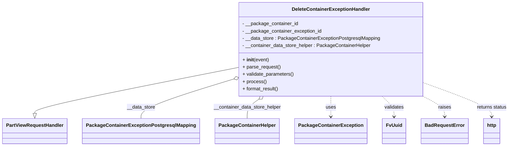
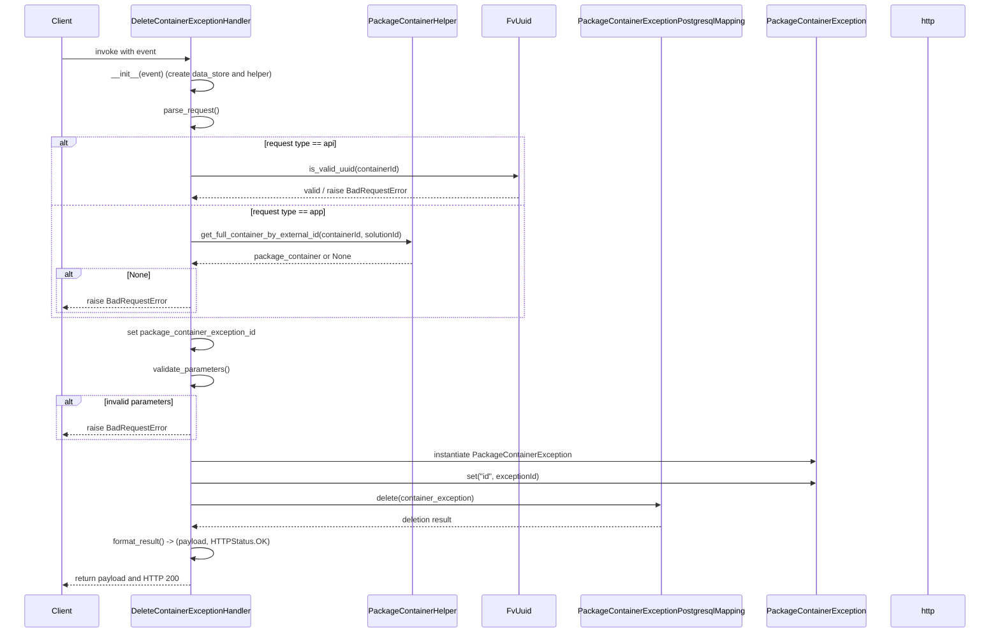

# Diagram: partview_core/partview_service/partview_service/api/package_container/exception/handlers/delete_package_container_exception.py

> Auto-generated by Obscura crawlers

## Diagram 1

### SVG

<svg id="container" width="1619.890625" xmlns="http://www.w3.org/2000/svg" class="classDiagram" height="486" viewBox="0 0 1619.890625 486" role="graphics-document document" aria-roledescription="class"><g><defs><marker id="container_class-aggregationStart" class="marker aggregation class" refX="18" refY="7" markerWidth="190" markerHeight="240" orient="auto"><path d="M 18,7 L9,13 L1,7 L9,1 Z"></path></marker></defs><defs><marker id="container_class-aggregationEnd" class="marker aggregation class" refX="1" refY="7" markerWidth="20" markerHeight="28" orient="auto"><path d="M 18,7 L9,13 L1,7 L9,1 Z"></path></marker></defs><defs><marker id="container_class-extensionStart" class="marker extension class" refX="18" refY="7" markerWidth="190" markerHeight="240" orient="auto"><path d="M 1,7 L18,13 V 1 Z"></path></marker></defs><defs><marker id="container_class-extensionEnd" class="marker extension class" refX="1" refY="7" markerWidth="20" markerHeight="28" orient="auto"><path d="M 1,1 V 13 L18,7 Z"></path></marker></defs><defs><marker id="container_class-compositionStart" class="marker composition class" refX="18" refY="7" markerWidth="190" markerHeight="240" orient="auto"><path d="M 18,7 L9,13 L1,7 L9,1 Z"></path></marker></defs><defs><marker id="container_class-compositionEnd" class="marker composition class" refX="1" refY="7" markerWidth="20" markerHeight="28" orient="auto"><path d="M 18,7 L9,13 L1,7 L9,1 Z"></path></marker></defs><defs><marker id="container_class-dependencyStart" class="marker dependency class" refX="6" refY="7" markerWidth="190" markerHeight="240" orient="auto"><path d="M 5,7 L9,13 L1,7 L9,1 Z"></path></marker></defs><defs><marker id="container_class-dependencyEnd" class="marker dependency class" refX="13" refY="7" markerWidth="20" markerHeight="28" orient="auto"><path d="M 18,7 L9,13 L14,7 L9,1 Z"></path></marker></defs><defs><marker id="container_class-lollipopStart" class="marker lollipop class" refX="13" refY="7" markerWidth="190" markerHeight="240" orient="auto"><circle stroke="black" fill="transparent" cx="7" cy="7" r="6"></circle></marker></defs><defs><marker id="container_class-lollipopEnd" class="marker lollipop class" refX="1" refY="7" markerWidth="190" markerHeight="240" orient="auto"><circle stroke="black" fill="transparent" cx="7" cy="7" r="6"></circle></marker></defs><g class="root"><g class="clusters"></g><g class="edgePaths"><path d="M747.734,225.997L641.672,247.831C535.609,269.665,323.484,313.332,217.422,338.458C111.359,363.583,111.359,370.167,111.359,373.458L111.359,376.75" id="id_DeleteContainerExceptionHandler_PartViewRequestHandler_1" class="edge-thickness-normal edge-pattern-solid relation" style=";;;" data-edge="true" data-et="edge" data-id="id_DeleteContainerExceptionHandler_PartViewRequestHandler_1" data-points="W3sieCI6NzQ3LjczNDM3NSwieSI6MjI1Ljk5NzA1ODQ1NTg5NzY3fSx7IngiOjExMS4zNTkzNzUsInkiOjM1N30seyJ4IjoxMTEuMzU5Mzc1LCJ5IjozOTR9XQ==" marker-end="url(#container_class-extensionEnd)"></path><path d="M731.311,266.05L684.137,281.208C636.963,296.366,542.614,326.683,495.44,348.008C448.266,369.333,448.266,381.667,448.266,387.833L448.266,394" id="id_DeleteContainerExceptionHandler_PackageContainerExceptionPostgresqlMapping_2" class="edge-thickness-normal edge-pattern-solid relation" style=";;;" data-edge="true" data-et="edge" data-id="id_DeleteContainerExceptionHandler_PackageContainerExceptionPostgresqlMapping_2" data-points="W3sieCI6NzQ3LjczNDM3NSwieSI6MjYwLjc3MjM3NTQ4OTM5Mjd9LHsieCI6NDQ4LjI2NTYyNSwieSI6MzU3fSx7IngiOjQ0OC4yNjU2MjUsInkiOjM5NH1d" marker-start="url(#container_class-aggregationStart)"></path><path d="M820.661,330.152L814.514,334.627C808.368,339.102,796.074,348.051,789.928,358.692C783.781,369.333,783.781,381.667,783.781,387.833L783.781,394" id="id_DeleteContainerExceptionHandler_PackageContainerHelper_3" class="edge-thickness-normal edge-pattern-solid relation" style=";;;" data-edge="true" data-et="edge" data-id="id_DeleteContainerExceptionHandler_PackageContainerHelper_3" data-points="W3sieCI6ODM0LjYwNjgyNDgwNTY5OTUsInkiOjMyMH0seyJ4Ijo3ODMuNzgxMjUsInkiOjM1N30seyJ4Ijo3ODMuNzgxMjUsInkiOjM5NH1d" marker-start="url(#container_class-aggregationStart)"></path><path d="M1048.898,320L1048.898,326.167C1048.898,332.333,1048.898,344.667,1048.898,356C1048.898,367.333,1048.898,377.667,1048.898,382.833L1048.898,388" id="id_DeleteContainerExceptionHandler_PackageContainerException_4" class="edge-thickness-normal edge-pattern-dashed relation" style=";;;" data-edge="true" data-et="edge" data-id="id_DeleteContainerExceptionHandler_PackageContainerException_4" data-points="W3sieCI6MTA0OC44OTg0Mzc1LCJ5IjozMjB9LHsieCI6MTA0OC44OTg0Mzc1LCJ5IjozNTd9LHsieCI6MTA0OC44OTg0Mzc1LCJ5IjozOTR9XQ==" marker-end="url(#container_class-dependencyEnd)"></path><path d="M1210.323,320L1216.704,326.167C1223.085,332.333,1235.847,344.667,1242.228,356C1248.609,367.333,1248.609,377.667,1248.609,382.833L1248.609,388" id="id_DeleteContainerExceptionHandler_FvUuid_5" class="edge-thickness-normal edge-pattern-dashed relation" style=";;;" data-edge="true" data-et="edge" data-id="id_DeleteContainerExceptionHandler_FvUuid_5" data-points="W3sieCI6MTIxMC4zMjI4MjIyMTUwMjYsInkiOjMyMH0seyJ4IjoxMjQ4LjYwOTM3NSwieSI6MzU3fSx7IngiOjEyNDguNjA5Mzc1LCJ5IjozOTR9XQ==" marker-end="url(#container_class-dependencyEnd)"></path><path d="M1340.331,320L1351.852,326.167C1363.372,332.333,1386.412,344.667,1397.933,356C1409.453,367.333,1409.453,377.667,1409.453,382.833L1409.453,388" id="id_DeleteContainerExceptionHandler_BadRequestError_6" class="edge-thickness-normal edge-pattern-dashed relation" style=";;;" data-edge="true" data-et="edge" data-id="id_DeleteContainerExceptionHandler_BadRequestError_6" data-points="W3sieCI6MTM0MC4zMzEyNDE5MDQxNDUxLCJ5IjozMjB9LHsieCI6MTQwOS40NTMxMjUsInkiOjM1N30seyJ4IjoxNDA5LjQ1MzEyNSwieSI6Mzk0fV0=" marker-end="url(#container_class-dependencyEnd)"></path><path d="M1350.063,277.435L1385.27,290.696C1420.477,303.956,1490.891,330.478,1526.098,348.906C1561.305,367.333,1561.305,377.667,1561.305,382.833L1561.305,388" id="id_DeleteContainerExceptionHandler_http_7" class="edge-thickness-normal edge-pattern-dashed relation" style=";;;" data-edge="true" data-et="edge" data-id="id_DeleteContainerExceptionHandler_http_7" data-points="W3sieCI6MTM1MC4wNjI1LCJ5IjoyNzcuNDM0NzI4OTEzODI1Njd9LHsieCI6MTU2MS4zMDQ2ODc1LCJ5IjozNTd9LHsieCI6MTU2MS4zMDQ2ODc1LCJ5IjozOTR9XQ==" marker-end="url(#container_class-dependencyEnd)"></path></g><g class="edgeLabels"><g class="edgeLabel"><g class="label" data-id="id_DeleteContainerExceptionHandler_PartViewRequestHandler_1" transform="translate(0, 0)"><foreignObject width="0" height="0">

</foreignObject></g></g><g class="edgeLabel" transform="translate(448.265625, 357)"><g class="label" data-id="id_DeleteContainerExceptionHandler_PackageContainerExceptionPostgresqlMapping_2" transform="translate(-46.9453125, -12)"><foreignObject width="93.890625" height="24">

__data_store

</foreignObject></g></g><g class="edgeLabel" transform="translate(783.78125, 357)"><g class="label" data-id="id_DeleteContainerExceptionHandler_PackageContainerHelper_3" transform="translate(-112.5, -12)"><foreignObject width="225" height="24">

__container_data_store_helper

</foreignObject></g></g><g class="edgeLabel" transform="translate(1048.8984375, 357)"><g class="label" data-id="id_DeleteContainerExceptionHandler_PackageContainerException_4" transform="translate(-16.4921875, -12)"><foreignObject width="32.984375" height="24">

uses

</foreignObject></g></g><g class="edgeLabel" transform="translate(1248.609375, 357)"><g class="label" data-id="id_DeleteContainerExceptionHandler_FvUuid_5" transform="translate(-32.6875, -12)"><foreignObject width="65.375" height="24">

validates

</foreignObject></g></g><g class="edgeLabel" transform="translate(1409.453125, 357)"><g class="label" data-id="id_DeleteContainerExceptionHandler_BadRequestError_6" transform="translate(-21.25, -12)"><foreignObject width="42.5" height="24">

raises

</foreignObject></g></g><g class="edgeLabel" transform="translate(1561.3046875, 357)"><g class="label" data-id="id_DeleteContainerExceptionHandler_http_7" transform="translate(-50.5859375, -12)"><foreignObject width="101.171875" height="24">

returns status

</foreignObject></g></g></g><g class="nodes"><g class="node default" id="classId-DeleteContainerExceptionHandler-0" transform="translate(1048.8984375, 164)"><g class="basic label-container"><path d="M-301.1640625 -156 L301.1640625 -156 L301.1640625 156 L-301.1640625 156" stroke="none" stroke-width="0" fill="#ECECFF" style=""></path><path d="M-301.1640625 -156 C-170.52345986078365 -156, -39.88285722156729 -156, 301.1640625 -156 M-301.1640625 -156 C-89.07562820052016 -156, 123.01280609895969 -156, 301.1640625 -156 M301.1640625 -156 C301.1640625 -35.35754866076928, 301.1640625 85.28490267846144, 301.1640625 156 M301.1640625 -156 C301.1640625 -40.27579389039859, 301.1640625 75.44841221920282, 301.1640625 156 M301.1640625 156 C78.06015623505618 156, -145.04375002988763 156, -301.1640625 156 M301.1640625 156 C79.1319376197907 156, -142.9001872604186 156, -301.1640625 156 M-301.1640625 156 C-301.1640625 73.77815343031999, -301.1640625 -8.443693139360022, -301.1640625 -156 M-301.1640625 156 C-301.1640625 82.06866375403294, -301.1640625 8.13732750806588, -301.1640625 -156" stroke="#9370DB" stroke-width="1.3" fill="none" stroke-dasharray="0 0" style=""></path></g><g class="annotation-group text" transform="translate(0, -132)"></g><g class="label-group text" transform="translate(-124.125, -132)"><g class="label" style="font-weight: bolder" transform="translate(0,-12)"><foreignObject width="248.25" height="24">

DeleteContainerExceptionHandler

</foreignObject></g></g><g class="members-group text" transform="translate(-289.1640625, -84)"><g class="label" style="" transform="translate(0,-12)"><foreignObject width="184.15625" height="24">

- __package_container_id

</foreignObject></g><g class="label" style="" transform="translate(0,12)"><foreignObject width="262.90625" height="24">

- __package_container_exception_id

</foreignObject></g><g class="label" style="" transform="translate(0,36)"><foreignObject width="454.203125" height="24">

- __data_store : PackageContainerExceptionPostgresqlMapping

</foreignObject></g><g class="label" style="" transform="translate(0,60)"><foreignObject width="425.25" height="24">

- __container_data_store_helper : PackageContainerHelper

</foreignObject></g></g><g class="methods-group text" transform="translate(-289.1640625, 36)"><g class="label" style="" transform="translate(0,-12)"><foreignObject width="87.390625" height="24">

+ <strong>init</strong>(event)

</foreignObject></g><g class="label" style="" transform="translate(0,12)"><foreignObject width="126.046875" height="24">

+ parse_request()

</foreignObject></g><g class="label" style="" transform="translate(0,36)"><foreignObject width="170.953125" height="24">

+ validate_parameters()

</foreignObject></g><g class="label" style="" transform="translate(0,60)"><foreignObject width="77.96875" height="24">

+ process()

</foreignObject></g><g class="label" style="" transform="translate(0,84)"><foreignObject width="121.5" height="24">

+ format_result()

</foreignObject></g></g><g class="divider" style=""><path d="M-301.1640625 -108 C-176.33637298313334 -108, -51.50868346626666 -108, 301.1640625 -108 M-301.1640625 -108 C-146.13678364089995 -108, 8.890495218200101 -108, 301.1640625 -108" stroke="#9370DB" stroke-width="1.3" fill="none" stroke-dasharray="0 0" style=""></path></g><g class="divider" style=""><path d="M-301.1640625 12 C-139.822889169372 12, 21.51828416125602 12, 301.1640625 12 M-301.1640625 12 C-158.10499720640303 12, -15.045931912806054 12, 301.1640625 12" stroke="#9370DB" stroke-width="1.3" fill="none" stroke-dasharray="0 0" style=""></path></g></g><g class="node default" id="classId-PartViewRequestHandler-1" transform="translate(111.359375, 436)"><g class="basic label-container"><path d="M-103.359375 -42 L103.359375 -42 L103.359375 42 L-103.359375 42" stroke="none" stroke-width="0" fill="#ECECFF" style=""></path><path d="M-103.359375 -42 C-51.65337408101276 -42, 0.05262683797448631 -42, 103.359375 -42 M-103.359375 -42 C-28.374332739922266 -42, 46.61070952015547 -42, 103.359375 -42 M103.359375 -42 C103.359375 -24.73564521475833, 103.359375 -7.471290429516657, 103.359375 42 M103.359375 -42 C103.359375 -13.25622104915492, 103.359375 15.48755790169016, 103.359375 42 M103.359375 42 C38.58309424815309 42, -26.193186503693823 42, -103.359375 42 M103.359375 42 C35.942838393018974 42, -31.473698213962052 42, -103.359375 42 M-103.359375 42 C-103.359375 18.500168089492686, -103.359375 -4.999663821014629, -103.359375 -42 M-103.359375 42 C-103.359375 21.174578619137634, -103.359375 0.3491572382752679, -103.359375 -42" stroke="#9370DB" stroke-width="1.3" fill="none" stroke-dasharray="0 0" style=""></path></g><g class="annotation-group text" transform="translate(0, -18)"></g><g class="label-group text" transform="translate(-91.359375, -18)"><g class="label" style="font-weight: bolder" transform="translate(0,-12)"><foreignObject width="182.71875" height="24">

PartViewRequestHandler

</foreignObject></g></g><g class="members-group text" transform="translate(-91.359375, 30)"></g><g class="methods-group text" transform="translate(-91.359375, 60)"></g><g class="divider" style=""><path d="M-103.359375 6 C-26.988265665674405 6, 49.38284366865119 6, 103.359375 6 M-103.359375 6 C-20.950871359601777 6, 61.457632280796446 6, 103.359375 6" stroke="#9370DB" stroke-width="1.3" fill="none" stroke-dasharray="0 0" style=""></path></g><g class="divider" style=""><path d="M-103.359375 24 C-41.485307138746926 24, 20.38876072250615 24, 103.359375 24 M-103.359375 24 C-54.30773975938296 24, -5.256104518765923 24, 103.359375 24" stroke="#9370DB" stroke-width="1.3" fill="none" stroke-dasharray="0 0" style=""></path></g></g><g class="node default" id="classId-PackageContainerExceptionPostgresqlMapping-2" transform="translate(448.265625, 436)"><g class="basic label-container"><path d="M-183.546875 -42 L183.546875 -42 L183.546875 42 L-183.546875 42" stroke="none" stroke-width="0" fill="#ECECFF" style=""></path><path d="M-183.546875 -42 C-59.21284049687549 -42, 65.12119400624903 -42, 183.546875 -42 M-183.546875 -42 C-49.35564901126375 -42, 84.8355769774725 -42, 183.546875 -42 M183.546875 -42 C183.546875 -23.014398168559612, 183.546875 -4.028796337119225, 183.546875 42 M183.546875 -42 C183.546875 -18.832564995778128, 183.546875 4.334870008443744, 183.546875 42 M183.546875 42 C92.44390996822257 42, 1.3409449364451405 42, -183.546875 42 M183.546875 42 C96.72851627893469 42, 9.910157557869383 42, -183.546875 42 M-183.546875 42 C-183.546875 11.00587349219257, -183.546875 -19.98825301561486, -183.546875 -42 M-183.546875 42 C-183.546875 21.68262436940421, -183.546875 1.3652487388084182, -183.546875 -42" stroke="#9370DB" stroke-width="1.3" fill="none" stroke-dasharray="0 0" style=""></path></g><g class="annotation-group text" transform="translate(0, -18)"></g><g class="label-group text" transform="translate(-171.546875, -18)"><g class="label" style="font-weight: bolder" transform="translate(0,-12)"><foreignObject width="343.09375" height="24">

PackageContainerExceptionPostgresqlMapping

</foreignObject></g></g><g class="members-group text" transform="translate(-171.546875, 30)"></g><g class="methods-group text" transform="translate(-171.546875, 60)"></g><g class="divider" style=""><path d="M-183.546875 6 C-56.02253639506712 6, 71.50180220986576 6, 183.546875 6 M-183.546875 6 C-62.61134959417298 6, 58.324175811654044 6, 183.546875 6" stroke="#9370DB" stroke-width="1.3" fill="none" stroke-dasharray="0 0" style=""></path></g><g class="divider" style=""><path d="M-183.546875 24 C-84.00558565486328 24, 15.535703690273436 24, 183.546875 24 M-183.546875 24 C-98.98036988115174 24, -14.41386476230349 24, 183.546875 24" stroke="#9370DB" stroke-width="1.3" fill="none" stroke-dasharray="0 0" style=""></path></g></g><g class="node default" id="classId-PackageContainerHelper-3" transform="translate(783.78125, 436)"><g class="basic label-container"><path d="M-101.96875 -42 L101.96875 -42 L101.96875 42 L-101.96875 42" stroke="none" stroke-width="0" fill="#ECECFF" style=""></path><path d="M-101.96875 -42 C-29.66153556174416 -42, 42.64567887651168 -42, 101.96875 -42 M-101.96875 -42 C-21.221963628409995 -42, 59.52482274318001 -42, 101.96875 -42 M101.96875 -42 C101.96875 -17.019290300542355, 101.96875 7.9614193989152895, 101.96875 42 M101.96875 -42 C101.96875 -12.39081967334285, 101.96875 17.2183606533143, 101.96875 42 M101.96875 42 C47.6425017266692 42, -6.683746546661595 42, -101.96875 42 M101.96875 42 C57.17467503716894 42, 12.380600074337877 42, -101.96875 42 M-101.96875 42 C-101.96875 14.345673086775193, -101.96875 -13.308653826449614, -101.96875 -42 M-101.96875 42 C-101.96875 12.520593087092955, -101.96875 -16.95881382581409, -101.96875 -42" stroke="#9370DB" stroke-width="1.3" fill="none" stroke-dasharray="0 0" style=""></path></g><g class="annotation-group text" transform="translate(0, -18)"></g><g class="label-group text" transform="translate(-89.96875, -18)"><g class="label" style="font-weight: bolder" transform="translate(0,-12)"><foreignObject width="179.9375" height="24">

PackageContainerHelper

</foreignObject></g></g><g class="members-group text" transform="translate(-89.96875, 30)"></g><g class="methods-group text" transform="translate(-89.96875, 60)"></g><g class="divider" style=""><path d="M-101.96875 6 C-24.630931320853165 6, 52.70688735829367 6, 101.96875 6 M-101.96875 6 C-46.095577136949096 6, 9.777595726101808 6, 101.96875 6" stroke="#9370DB" stroke-width="1.3" fill="none" stroke-dasharray="0 0" style=""></path></g><g class="divider" style=""><path d="M-101.96875 24 C-30.266615720413824 24, 41.43551855917235 24, 101.96875 24 M-101.96875 24 C-22.421868961355557 24, 57.125012077288886 24, 101.96875 24" stroke="#9370DB" stroke-width="1.3" fill="none" stroke-dasharray="0 0" style=""></path></g></g><g class="node default" id="classId-PackageContainerException-4" transform="translate(1048.8984375, 436)"><g class="basic label-container"><path d="M-113.1484375 -42 L113.1484375 -42 L113.1484375 42 L-113.1484375 42" stroke="none" stroke-width="0" fill="#ECECFF" style=""></path><path d="M-113.1484375 -42 C-28.386992141456545 -42, 56.37445321708691 -42, 113.1484375 -42 M-113.1484375 -42 C-56.13995434151038 -42, 0.8685288169792358 -42, 113.1484375 -42 M113.1484375 -42 C113.1484375 -9.842752194684223, 113.1484375 22.314495610631553, 113.1484375 42 M113.1484375 -42 C113.1484375 -16.835218518186466, 113.1484375 8.329562963627069, 113.1484375 42 M113.1484375 42 C36.08998591642336 42, -40.96846566715328 42, -113.1484375 42 M113.1484375 42 C56.027690841000855 42, -1.093055817998291 42, -113.1484375 42 M-113.1484375 42 C-113.1484375 24.298046024566737, -113.1484375 6.596092049133475, -113.1484375 -42 M-113.1484375 42 C-113.1484375 12.069305378969112, -113.1484375 -17.861389242061776, -113.1484375 -42" stroke="#9370DB" stroke-width="1.3" fill="none" stroke-dasharray="0 0" style=""></path></g><g class="annotation-group text" transform="translate(0, -18)"></g><g class="label-group text" transform="translate(-101.1484375, -18)"><g class="label" style="font-weight: bolder" transform="translate(0,-12)"><foreignObject width="202.296875" height="24">

PackageContainerException

</foreignObject></g></g><g class="members-group text" transform="translate(-101.1484375, 30)"></g><g class="methods-group text" transform="translate(-101.1484375, 60)"></g><g class="divider" style=""><path d="M-113.1484375 6 C-51.135074597057205 6, 10.87828830588559 6, 113.1484375 6 M-113.1484375 6 C-25.67835491094614 6, 61.79172767810772 6, 113.1484375 6" stroke="#9370DB" stroke-width="1.3" fill="none" stroke-dasharray="0 0" style=""></path></g><g class="divider" style=""><path d="M-113.1484375 24 C-63.66255755536333 24, -14.176677610726657 24, 113.1484375 24 M-113.1484375 24 C-36.62139686665964 24, 39.905643766680726 24, 113.1484375 24" stroke="#9370DB" stroke-width="1.3" fill="none" stroke-dasharray="0 0" style=""></path></g></g><g class="node default" id="classId-FvUuid-5" transform="translate(1248.609375, 436)"><g class="basic label-container"><path d="M-36.5625 -42 L36.5625 -42 L36.5625 42 L-36.5625 42" stroke="none" stroke-width="0" fill="#ECECFF" style=""></path><path d="M-36.5625 -42 C-14.867643135296944 -42, 6.827213729406111 -42, 36.5625 -42 M-36.5625 -42 C-9.634597965522243 -42, 17.293304068955514 -42, 36.5625 -42 M36.5625 -42 C36.5625 -17.060268569778568, 36.5625 7.879462860442864, 36.5625 42 M36.5625 -42 C36.5625 -13.515750494067593, 36.5625 14.968499011864814, 36.5625 42 M36.5625 42 C8.928145284309611 42, -18.706209431380778 42, -36.5625 42 M36.5625 42 C16.81241551490359 42, -2.937668970192817 42, -36.5625 42 M-36.5625 42 C-36.5625 16.19278906218055, -36.5625 -9.614421875638897, -36.5625 -42 M-36.5625 42 C-36.5625 10.486190510179433, -36.5625 -21.027618979641133, -36.5625 -42" stroke="#9370DB" stroke-width="1.3" fill="none" stroke-dasharray="0 0" style=""></path></g><g class="annotation-group text" transform="translate(0, -18)"></g><g class="label-group text" transform="translate(-24.5625, -18)"><g class="label" style="font-weight: bolder" transform="translate(0,-12)"><foreignObject width="49.125" height="24">

FvUuid

</foreignObject></g></g><g class="members-group text" transform="translate(-24.5625, 30)"></g><g class="methods-group text" transform="translate(-24.5625, 60)"></g><g class="divider" style=""><path d="M-36.5625 6 C-21.620904822497224 6, -6.679309644994444 6, 36.5625 6 M-36.5625 6 C-13.354362515268715 6, 9.85377496946257 6, 36.5625 6" stroke="#9370DB" stroke-width="1.3" fill="none" stroke-dasharray="0 0" style=""></path></g><g class="divider" style=""><path d="M-36.5625 24 C-20.178298027064873 24, -3.7940960541297457 24, 36.5625 24 M-36.5625 24 C-13.185986037380328 24, 10.190527925239344 24, 36.5625 24" stroke="#9370DB" stroke-width="1.3" fill="none" stroke-dasharray="0 0" style=""></path></g></g><g class="node default" id="classId-BadRequestError-6" transform="translate(1409.453125, 436)"><g class="basic label-container"><path d="M-74.28125 -42 L74.28125 -42 L74.28125 42 L-74.28125 42" stroke="none" stroke-width="0" fill="#ECECFF" style=""></path><path d="M-74.28125 -42 C-40.188326575680684 -42, -6.095403151361367 -42, 74.28125 -42 M-74.28125 -42 C-43.42987078531694 -42, -12.578491570633886 -42, 74.28125 -42 M74.28125 -42 C74.28125 -14.41267599673398, 74.28125 13.174648006532038, 74.28125 42 M74.28125 -42 C74.28125 -13.623379347792174, 74.28125 14.753241304415653, 74.28125 42 M74.28125 42 C27.99682897044748 42, -18.287592059105037 42, -74.28125 42 M74.28125 42 C26.64702801366498 42, -20.987193972670042 42, -74.28125 42 M-74.28125 42 C-74.28125 13.950203086243818, -74.28125 -14.099593827512365, -74.28125 -42 M-74.28125 42 C-74.28125 16.02116020979141, -74.28125 -9.957679580417178, -74.28125 -42" stroke="#9370DB" stroke-width="1.3" fill="none" stroke-dasharray="0 0" style=""></path></g><g class="annotation-group text" transform="translate(0, -18)"></g><g class="label-group text" transform="translate(-62.28125, -18)"><g class="label" style="font-weight: bolder" transform="translate(0,-12)"><foreignObject width="124.5625" height="24">

BadRequestError

</foreignObject></g></g><g class="members-group text" transform="translate(-62.28125, 30)"></g><g class="methods-group text" transform="translate(-62.28125, 60)"></g><g class="divider" style=""><path d="M-74.28125 6 C-43.53302875318852 6, -12.784807506377028 6, 74.28125 6 M-74.28125 6 C-18.413236893982607 6, 37.45477621203479 6, 74.28125 6" stroke="#9370DB" stroke-width="1.3" fill="none" stroke-dasharray="0 0" style=""></path></g><g class="divider" style=""><path d="M-74.28125 24 C-44.332201746546275 24, -14.38315349309255 24, 74.28125 24 M-74.28125 24 C-37.7139385197667 24, -1.1466270395333993 24, 74.28125 24" stroke="#9370DB" stroke-width="1.3" fill="none" stroke-dasharray="0 0" style=""></path></g></g><g class="node default" id="classId-http-7" transform="translate(1561.3046875, 436)"><g class="basic label-container"><path d="M-27.5703125 -42 L27.5703125 -42 L27.5703125 42 L-27.5703125 42" stroke="none" stroke-width="0" fill="#ECECFF" style=""></path><path d="M-27.5703125 -42 C-13.598829131817793 -42, 0.37265423636441497 -42, 27.5703125 -42 M-27.5703125 -42 C-12.978914362133029 -42, 1.612483775733942 -42, 27.5703125 -42 M27.5703125 -42 C27.5703125 -12.850143647647883, 27.5703125 16.299712704704234, 27.5703125 42 M27.5703125 -42 C27.5703125 -20.583676836213872, 27.5703125 0.832646327572256, 27.5703125 42 M27.5703125 42 C11.121279574490195 42, -5.327753351019609 42, -27.5703125 42 M27.5703125 42 C13.251709319847349 42, -1.0668938603053029 42, -27.5703125 42 M-27.5703125 42 C-27.5703125 23.863697254432804, -27.5703125 5.727394508865608, -27.5703125 -42 M-27.5703125 42 C-27.5703125 24.20365087325177, -27.5703125 6.407301746503542, -27.5703125 -42" stroke="#9370DB" stroke-width="1.3" fill="none" stroke-dasharray="0 0" style=""></path></g><g class="annotation-group text" transform="translate(0, -18)"></g><g class="label-group text" transform="translate(-15.5703125, -18)"><g class="label" style="font-weight: bolder" transform="translate(0,-12)"><foreignObject width="31.140625" height="24">

http

</foreignObject></g></g><g class="members-group text" transform="translate(-15.5703125, 30)"></g><g class="methods-group text" transform="translate(-15.5703125, 60)"></g><g class="divider" style=""><path d="M-27.5703125 6 C-14.178493645092402 6, -0.7866747901848044 6, 27.5703125 6 M-27.5703125 6 C-5.90585966027389 6, 15.75859317945222 6, 27.5703125 6" stroke="#9370DB" stroke-width="1.3" fill="none" stroke-dasharray="0 0" style=""></path></g><g class="divider" style=""><path d="M-27.5703125 24 C-15.42727671998336 24, -3.2842409399667183 24, 27.5703125 24 M-27.5703125 24 C-7.85249036915409 24, 11.86533176169182 24, 27.5703125 24" stroke="#9370DB" stroke-width="1.3" fill="none" stroke-dasharray="0 0" style=""></path></g></g></g></g></g></svg>

## Diagram 2

### SVG

<svg id="container" width="2123" xmlns="http://www.w3.org/2000/svg" height="1347" viewBox="-50 -10 2123 1347" role="graphics-document document" aria-roledescription="sequence"><g><rect x="1873" y="1261" fill="#eaeaea" stroke="#666" width="150" height="65" name="HTTP" rx="3" ry="3" class="actor actor-bottom"></rect><text x="1948" y="1293.5" dominant-baseline="central" alignment-baseline="central" class="actor actor-box" style="text-anchor: middle; font-size: 16px; font-weight: 400;"><tspan x="1948" dy="0">http</tspan></text></g><g><rect x="1604" y="1261" fill="#eaeaea" stroke="#666" width="219" height="65" name="Model" rx="3" ry="3" class="actor actor-bottom"></rect><text x="1713.5" y="1293.5" dominant-baseline="central" alignment-baseline="central" class="actor actor-box" style="text-anchor: middle; font-size: 16px; font-weight: 400;"><tspan x="1713.5" dy="0">PackageContainerException</tspan></text></g><g><rect x="1196" y="1261" fill="#eaeaea" stroke="#666" width="358" height="65" name="DataStore" rx="3" ry="3" class="actor actor-bottom"></rect><text x="1375" y="1293.5" dominant-baseline="central" alignment-baseline="central" class="actor actor-box" style="text-anchor: middle; font-size: 16px; font-weight: 400;"><tspan x="1375" dy="0">PackageContainerExceptionPostgresqlMapping</tspan></text></g><g><rect x="996" y="1261" fill="#eaeaea" stroke="#666" width="150" height="65" name="UUID" rx="3" ry="3" class="actor actor-bottom"></rect><text x="1071" y="1293.5" dominant-baseline="central" alignment-baseline="central" class="actor actor-box" style="text-anchor: middle; font-size: 16px; font-weight: 400;"><tspan x="1071" dy="0">FvUuid</tspan></text></g><g><rect x="748" y="1261" fill="#eaeaea" stroke="#666" width="198" height="65" name="Helper" rx="3" ry="3" class="actor actor-bottom"></rect><text x="847" y="1293.5" dominant-baseline="central" alignment-baseline="central" class="actor actor-box" style="text-anchor: middle; font-size: 16px; font-weight: 400;"><tspan x="847" dy="0">PackageContainerHelper</tspan></text></g><g><rect x="221.5" y="1261" fill="#eaeaea" stroke="#666" width="267" height="65" name="Handler" rx="3" ry="3" class="actor actor-bottom"></rect><text x="355" y="1293.5" dominant-baseline="central" alignment-baseline="central" class="actor actor-box" style="text-anchor: middle; font-size: 16px; font-weight: 400;"><tspan x="355" dy="0">DeleteContainerExceptionHandler</tspan></text></g><g><rect x="0" y="1261" fill="#eaeaea" stroke="#666" width="150" height="65" name="Client" rx="3" ry="3" class="actor actor-bottom"></rect><text x="75" y="1293.5" dominant-baseline="central" alignment-baseline="central" class="actor actor-box" style="text-anchor: middle; font-size: 16px; font-weight: 400;"><tspan x="75" dy="0">Client</tspan></text></g><g><line id="actor6" x1="1948" y1="65" x2="1948" y2="1261" class="actor-line 200" stroke-width="0.5px" stroke="#999" name="HTTP"></line><g id="root-6"><rect x="1873" y="0" fill="#eaeaea" stroke="#666" width="150" height="65" name="HTTP" rx="3" ry="3" class="actor actor-top"></rect><text x="1948" y="32.5" dominant-baseline="central" alignment-baseline="central" class="actor actor-box" style="text-anchor: middle; font-size: 16px; font-weight: 400;"><tspan x="1948" dy="0">http</tspan></text></g></g><g><line id="actor5" x1="1713.5" y1="65" x2="1713.5" y2="1261" class="actor-line 200" stroke-width="0.5px" stroke="#999" name="Model"></line><g id="root-5"><rect x="1604" y="0" fill="#eaeaea" stroke="#666" width="219" height="65" name="Model" rx="3" ry="3" class="actor actor-top"></rect><text x="1713.5" y="32.5" dominant-baseline="central" alignment-baseline="central" class="actor actor-box" style="text-anchor: middle; font-size: 16px; font-weight: 400;"><tspan x="1713.5" dy="0">PackageContainerException</tspan></text></g></g><g><line id="actor4" x1="1375" y1="65" x2="1375" y2="1261" class="actor-line 200" stroke-width="0.5px" stroke="#999" name="DataStore"></line><g id="root-4"><rect x="1196" y="0" fill="#eaeaea" stroke="#666" width="358" height="65" name="DataStore" rx="3" ry="3" class="actor actor-top"></rect><text x="1375" y="32.5" dominant-baseline="central" alignment-baseline="central" class="actor actor-box" style="text-anchor: middle; font-size: 16px; font-weight: 400;"><tspan x="1375" dy="0">PackageContainerExceptionPostgresqlMapping</tspan></text></g></g><g><line id="actor3" x1="1071" y1="65" x2="1071" y2="1261" class="actor-line 200" stroke-width="0.5px" stroke="#999" name="UUID"></line><g id="root-3"><rect x="996" y="0" fill="#eaeaea" stroke="#666" width="150" height="65" name="UUID" rx="3" ry="3" class="actor actor-top"></rect><text x="1071" y="32.5" dominant-baseline="central" alignment-baseline="central" class="actor actor-box" style="text-anchor: middle; font-size: 16px; font-weight: 400;"><tspan x="1071" dy="0">FvUuid</tspan></text></g></g><g><line id="actor2" x1="847" y1="65" x2="847" y2="1261" class="actor-line 200" stroke-width="0.5px" stroke="#999" name="Helper"></line><g id="root-2"><rect x="748" y="0" fill="#eaeaea" stroke="#666" width="198" height="65" name="Helper" rx="3" ry="3" class="actor actor-top"></rect><text x="847" y="32.5" dominant-baseline="central" alignment-baseline="central" class="actor actor-box" style="text-anchor: middle; font-size: 16px; font-weight: 400;"><tspan x="847" dy="0">PackageContainerHelper</tspan></text></g></g><g><line id="actor1" x1="355" y1="65" x2="355" y2="1261" class="actor-line 200" stroke-width="0.5px" stroke="#999" name="Handler"></line><g id="root-1"><rect x="221.5" y="0" fill="#eaeaea" stroke="#666" width="267" height="65" name="Handler" rx="3" ry="3" class="actor actor-top"></rect><text x="355" y="32.5" dominant-baseline="central" alignment-baseline="central" class="actor actor-box" style="text-anchor: middle; font-size: 16px; font-weight: 400;"><tspan x="355" dy="0">DeleteContainerExceptionHandler</tspan></text></g></g><g><line id="actor0" x1="75" y1="65" x2="75" y2="1261" class="actor-line 200" stroke-width="0.5px" stroke="#999" name="Client"></line><g id="root-0"><rect x="0" y="0" fill="#eaeaea" stroke="#666" width="150" height="65" name="Client" rx="3" ry="3" class="actor actor-top"></rect><text x="75" y="32.5" dominant-baseline="central" alignment-baseline="central" class="actor actor-box" style="text-anchor: middle; font-size: 16px; font-weight: 400;"><tspan x="75" dy="0">Client</tspan></text></g></g><g></g><defs><symbol id="computer" width="24" height="24"><path transform="scale(.5)" d="M2 2v13h20v-13h-20zm18 11h-16v-9h16v9zm-10.228 6l.466-1h3.524l.467 1h-4.457zm14.228 3h-24l2-6h2.104l-1.33 4h18.45l-1.297-4h2.073l2 6zm-5-10h-14v-7h14v7z"></path></symbol></defs><defs><symbol id="database" fill-rule="evenodd" clip-rule="evenodd"><path transform="scale(.5)" d="M12.258.001l.256.004.255.005.253.008.251.01.249.012.247.015.246.016.242.019.241.02.239.023.236.024.233.027.231.028.229.031.225.032.223.034.22.036.217.038.214.04.211.041.208.043.205.045.201.046.198.048.194.05.191.051.187.053.183.054.18.056.175.057.172.059.168.06.163.061.16.063.155.064.15.066.074.033.073.033.071.034.07.034.069.035.068.035.067.035.066.035.064.036.064.036.062.036.06.036.06.037.058.037.058.037.055.038.055.038.053.038.052.038.051.039.05.039.048.039.047.039.045.04.044.04.043.04.041.04.04.041.039.041.037.041.036.041.034.041.033.042.032.042.03.042.029.042.027.042.026.043.024.043.023.043.021.043.02.043.018.044.017.043.015.044.013.044.012.044.011.045.009.044.007.045.006.045.004.045.002.045.001.045v17l-.001.045-.002.045-.004.045-.006.045-.007.045-.009.044-.011.045-.012.044-.013.044-.015.044-.017.043-.018.044-.02.043-.021.043-.023.043-.024.043-.026.043-.027.042-.029.042-.03.042-.032.042-.033.042-.034.041-.036.041-.037.041-.039.041-.04.041-.041.04-.043.04-.044.04-.045.04-.047.039-.048.039-.05.039-.051.039-.052.038-.053.038-.055.038-.055.038-.058.037-.058.037-.06.037-.06.036-.062.036-.064.036-.064.036-.066.035-.067.035-.068.035-.069.035-.07.034-.071.034-.073.033-.074.033-.15.066-.155.064-.16.063-.163.061-.168.06-.172.059-.175.057-.18.056-.183.054-.187.053-.191.051-.194.05-.198.048-.201.046-.205.045-.208.043-.211.041-.214.04-.217.038-.22.036-.223.034-.225.032-.229.031-.231.028-.233.027-.236.024-.239.023-.241.02-.242.019-.246.016-.247.015-.249.012-.251.01-.253.008-.255.005-.256.004-.258.001-.258-.001-.256-.004-.255-.005-.253-.008-.251-.01-.249-.012-.247-.015-.245-.016-.243-.019-.241-.02-.238-.023-.236-.024-.234-.027-.231-.028-.228-.031-.226-.032-.223-.034-.22-.036-.217-.038-.214-.04-.211-.041-.208-.043-.204-.045-.201-.046-.198-.048-.195-.05-.19-.051-.187-.053-.184-.054-.179-.056-.176-.057-.172-.059-.167-.06-.164-.061-.159-.063-.155-.064-.151-.066-.074-.033-.072-.033-.072-.034-.07-.034-.069-.035-.068-.035-.067-.035-.066-.035-.064-.036-.063-.036-.062-.036-.061-.036-.06-.037-.058-.037-.057-.037-.056-.038-.055-.038-.053-.038-.052-.038-.051-.039-.049-.039-.049-.039-.046-.039-.046-.04-.044-.04-.043-.04-.041-.04-.04-.041-.039-.041-.037-.041-.036-.041-.034-.041-.033-.042-.032-.042-.03-.042-.029-.042-.027-.042-.026-.043-.024-.043-.023-.043-.021-.043-.02-.043-.018-.044-.017-.043-.015-.044-.013-.044-.012-.044-.011-.045-.009-.044-.007-.045-.006-.045-.004-.045-.002-.045-.001-.045v-17l.001-.045.002-.045.004-.045.006-.045.007-.045.009-.044.011-.045.012-.044.013-.044.015-.044.017-.043.018-.044.02-.043.021-.043.023-.043.024-.043.026-.043.027-.042.029-.042.03-.042.032-.042.033-.042.034-.041.036-.041.037-.041.039-.041.04-.041.041-.04.043-.04.044-.04.046-.04.046-.039.049-.039.049-.039.051-.039.052-.038.053-.038.055-.038.056-.038.057-.037.058-.037.06-.037.061-.036.062-.036.063-.036.064-.036.066-.035.067-.035.068-.035.069-.035.07-.034.072-.034.072-.033.074-.033.151-.066.155-.064.159-.063.164-.061.167-.06.172-.059.176-.057.179-.056.184-.054.187-.053.19-.051.195-.05.198-.048.201-.046.204-.045.208-.043.211-.041.214-.04.217-.038.22-.036.223-.034.226-.032.228-.031.231-.028.234-.027.236-.024.238-.023.241-.02.243-.019.245-.016.247-.015.249-.012.251-.01.253-.008.255-.005.256-.004.258-.001.258.001zm-9.258 20.499v.01l.001.021.003.021.004.022.005.021.006.022.007.022.009.023.01.022.011.023.012.023.013.023.015.023.016.024.017.023.018.024.019.024.021.024.022.025.023.024.024.025.052.049.056.05.061.051.066.051.07.051.075.051.079.052.084.052.088.052.092.052.097.052.102.051.105.052.11.052.114.051.119.051.123.051.127.05.131.05.135.05.139.048.144.049.147.047.152.047.155.047.16.045.163.045.167.043.171.043.176.041.178.041.183.039.187.039.19.037.194.035.197.035.202.033.204.031.209.03.212.029.216.027.219.025.222.024.226.021.23.02.233.018.236.016.24.015.243.012.246.01.249.008.253.005.256.004.259.001.26-.001.257-.004.254-.005.25-.008.247-.011.244-.012.241-.014.237-.016.233-.018.231-.021.226-.021.224-.024.22-.026.216-.027.212-.028.21-.031.205-.031.202-.034.198-.034.194-.036.191-.037.187-.039.183-.04.179-.04.175-.042.172-.043.168-.044.163-.045.16-.046.155-.046.152-.047.148-.048.143-.049.139-.049.136-.05.131-.05.126-.05.123-.051.118-.052.114-.051.11-.052.106-.052.101-.052.096-.052.092-.052.088-.053.083-.051.079-.052.074-.052.07-.051.065-.051.06-.051.056-.05.051-.05.023-.024.023-.025.021-.024.02-.024.019-.024.018-.024.017-.024.015-.023.014-.024.013-.023.012-.023.01-.023.01-.022.008-.022.006-.022.006-.022.004-.022.004-.021.001-.021.001-.021v-4.127l-.077.055-.08.053-.083.054-.085.053-.087.052-.09.052-.093.051-.095.05-.097.05-.1.049-.102.049-.105.048-.106.047-.109.047-.111.046-.114.045-.115.045-.118.044-.12.043-.122.042-.124.042-.126.041-.128.04-.13.04-.132.038-.134.038-.135.037-.138.037-.139.035-.142.035-.143.034-.144.033-.147.032-.148.031-.15.03-.151.03-.153.029-.154.027-.156.027-.158.026-.159.025-.161.024-.162.023-.163.022-.165.021-.166.02-.167.019-.169.018-.169.017-.171.016-.173.015-.173.014-.175.013-.175.012-.177.011-.178.01-.179.008-.179.008-.181.006-.182.005-.182.004-.184.003-.184.002h-.37l-.184-.002-.184-.003-.182-.004-.182-.005-.181-.006-.179-.008-.179-.008-.178-.01-.176-.011-.176-.012-.175-.013-.173-.014-.172-.015-.171-.016-.17-.017-.169-.018-.167-.019-.166-.02-.165-.021-.163-.022-.162-.023-.161-.024-.159-.025-.157-.026-.156-.027-.155-.027-.153-.029-.151-.03-.15-.03-.148-.031-.146-.032-.145-.033-.143-.034-.141-.035-.14-.035-.137-.037-.136-.037-.134-.038-.132-.038-.13-.04-.128-.04-.126-.041-.124-.042-.122-.042-.12-.044-.117-.043-.116-.045-.113-.045-.112-.046-.109-.047-.106-.047-.105-.048-.102-.049-.1-.049-.097-.05-.095-.05-.093-.052-.09-.051-.087-.052-.085-.053-.083-.054-.08-.054-.077-.054v4.127zm0-5.654v.011l.001.021.003.021.004.021.005.022.006.022.007.022.009.022.01.022.011.023.012.023.013.023.015.024.016.023.017.024.018.024.019.024.021.024.022.024.023.025.024.024.052.05.056.05.061.05.066.051.07.051.075.052.079.051.084.052.088.052.092.052.097.052.102.052.105.052.11.051.114.051.119.052.123.05.127.051.131.05.135.049.139.049.144.048.147.048.152.047.155.046.16.045.163.045.167.044.171.042.176.042.178.04.183.04.187.038.19.037.194.036.197.034.202.033.204.032.209.03.212.028.216.027.219.025.222.024.226.022.23.02.233.018.236.016.24.014.243.012.246.01.249.008.253.006.256.003.259.001.26-.001.257-.003.254-.006.25-.008.247-.01.244-.012.241-.015.237-.016.233-.018.231-.02.226-.022.224-.024.22-.025.216-.027.212-.029.21-.03.205-.032.202-.033.198-.035.194-.036.191-.037.187-.039.183-.039.179-.041.175-.042.172-.043.168-.044.163-.045.16-.045.155-.047.152-.047.148-.048.143-.048.139-.05.136-.049.131-.05.126-.051.123-.051.118-.051.114-.052.11-.052.106-.052.101-.052.096-.052.092-.052.088-.052.083-.052.079-.052.074-.051.07-.052.065-.051.06-.05.056-.051.051-.049.023-.025.023-.024.021-.025.02-.024.019-.024.018-.024.017-.024.015-.023.014-.023.013-.024.012-.022.01-.023.01-.023.008-.022.006-.022.006-.022.004-.021.004-.022.001-.021.001-.021v-4.139l-.077.054-.08.054-.083.054-.085.052-.087.053-.09.051-.093.051-.095.051-.097.05-.1.049-.102.049-.105.048-.106.047-.109.047-.111.046-.114.045-.115.044-.118.044-.12.044-.122.042-.124.042-.126.041-.128.04-.13.039-.132.039-.134.038-.135.037-.138.036-.139.036-.142.035-.143.033-.144.033-.147.033-.148.031-.15.03-.151.03-.153.028-.154.028-.156.027-.158.026-.159.025-.161.024-.162.023-.163.022-.165.021-.166.02-.167.019-.169.018-.169.017-.171.016-.173.015-.173.014-.175.013-.175.012-.177.011-.178.009-.179.009-.179.007-.181.007-.182.005-.182.004-.184.003-.184.002h-.37l-.184-.002-.184-.003-.182-.004-.182-.005-.181-.007-.179-.007-.179-.009-.178-.009-.176-.011-.176-.012-.175-.013-.173-.014-.172-.015-.171-.016-.17-.017-.169-.018-.167-.019-.166-.02-.165-.021-.163-.022-.162-.023-.161-.024-.159-.025-.157-.026-.156-.027-.155-.028-.153-.028-.151-.03-.15-.03-.148-.031-.146-.033-.145-.033-.143-.033-.141-.035-.14-.036-.137-.036-.136-.037-.134-.038-.132-.039-.13-.039-.128-.04-.126-.041-.124-.042-.122-.043-.12-.043-.117-.044-.116-.044-.113-.046-.112-.046-.109-.046-.106-.047-.105-.048-.102-.049-.1-.049-.097-.05-.095-.051-.093-.051-.09-.051-.087-.053-.085-.052-.083-.054-.08-.054-.077-.054v4.139zm0-5.666v.011l.001.02.003.022.004.021.005.022.006.021.007.022.009.023.01.022.011.023.012.023.013.023.015.023.016.024.017.024.018.023.019.024.021.025.022.024.023.024.024.025.052.05.056.05.061.05.066.051.07.051.075.052.079.051.084.052.088.052.092.052.097.052.102.052.105.051.11.052.114.051.119.051.123.051.127.05.131.05.135.05.139.049.144.048.147.048.152.047.155.046.16.045.163.045.167.043.171.043.176.042.178.04.183.04.187.038.19.037.194.036.197.034.202.033.204.032.209.03.212.028.216.027.219.025.222.024.226.021.23.02.233.018.236.017.24.014.243.012.246.01.249.008.253.006.256.003.259.001.26-.001.257-.003.254-.006.25-.008.247-.01.244-.013.241-.014.237-.016.233-.018.231-.02.226-.022.224-.024.22-.025.216-.027.212-.029.21-.03.205-.032.202-.033.198-.035.194-.036.191-.037.187-.039.183-.039.179-.041.175-.042.172-.043.168-.044.163-.045.16-.045.155-.047.152-.047.148-.048.143-.049.139-.049.136-.049.131-.051.126-.05.123-.051.118-.052.114-.051.11-.052.106-.052.101-.052.096-.052.092-.052.088-.052.083-.052.079-.052.074-.052.07-.051.065-.051.06-.051.056-.05.051-.049.023-.025.023-.025.021-.024.02-.024.019-.024.018-.024.017-.024.015-.023.014-.024.013-.023.012-.023.01-.022.01-.023.008-.022.006-.022.006-.022.004-.022.004-.021.001-.021.001-.021v-4.153l-.077.054-.08.054-.083.053-.085.053-.087.053-.09.051-.093.051-.095.051-.097.05-.1.049-.102.048-.105.048-.106.048-.109.046-.111.046-.114.046-.115.044-.118.044-.12.043-.122.043-.124.042-.126.041-.128.04-.13.039-.132.039-.134.038-.135.037-.138.036-.139.036-.142.034-.143.034-.144.033-.147.032-.148.032-.15.03-.151.03-.153.028-.154.028-.156.027-.158.026-.159.024-.161.024-.162.023-.163.023-.165.021-.166.02-.167.019-.169.018-.169.017-.171.016-.173.015-.173.014-.175.013-.175.012-.177.01-.178.01-.179.009-.179.007-.181.006-.182.006-.182.004-.184.003-.184.001-.185.001-.185-.001-.184-.001-.184-.003-.182-.004-.182-.006-.181-.006-.179-.007-.179-.009-.178-.01-.176-.01-.176-.012-.175-.013-.173-.014-.172-.015-.171-.016-.17-.017-.169-.018-.167-.019-.166-.02-.165-.021-.163-.023-.162-.023-.161-.024-.159-.024-.157-.026-.156-.027-.155-.028-.153-.028-.151-.03-.15-.03-.148-.032-.146-.032-.145-.033-.143-.034-.141-.034-.14-.036-.137-.036-.136-.037-.134-.038-.132-.039-.13-.039-.128-.041-.126-.041-.124-.041-.122-.043-.12-.043-.117-.044-.116-.044-.113-.046-.112-.046-.109-.046-.106-.048-.105-.048-.102-.048-.1-.05-.097-.049-.095-.051-.093-.051-.09-.052-.087-.052-.085-.053-.083-.053-.08-.054-.077-.054v4.153zm8.74-8.179l-.257.004-.254.005-.25.008-.247.011-.244.012-.241.014-.237.016-.233.018-.231.021-.226.022-.224.023-.22.026-.216.027-.212.028-.21.031-.205.032-.202.033-.198.034-.194.036-.191.038-.187.038-.183.04-.179.041-.175.042-.172.043-.168.043-.163.045-.16.046-.155.046-.152.048-.148.048-.143.048-.139.049-.136.05-.131.05-.126.051-.123.051-.118.051-.114.052-.11.052-.106.052-.101.052-.096.052-.092.052-.088.052-.083.052-.079.052-.074.051-.07.052-.065.051-.06.05-.056.05-.051.05-.023.025-.023.024-.021.024-.02.025-.019.024-.018.024-.017.023-.015.024-.014.023-.013.023-.012.023-.01.023-.01.022-.008.022-.006.023-.006.021-.004.022-.004.021-.001.021-.001.021.001.021.001.021.004.021.004.022.006.021.006.023.008.022.01.022.01.023.012.023.013.023.014.023.015.024.017.023.018.024.019.024.02.025.021.024.023.024.023.025.051.05.056.05.06.05.065.051.07.052.074.051.079.052.083.052.088.052.092.052.096.052.101.052.106.052.11.052.114.052.118.051.123.051.126.051.131.05.136.05.139.049.143.048.148.048.152.048.155.046.16.046.163.045.168.043.172.043.175.042.179.041.183.04.187.038.191.038.194.036.198.034.202.033.205.032.21.031.212.028.216.027.22.026.224.023.226.022.231.021.233.018.237.016.241.014.244.012.247.011.25.008.254.005.257.004.26.001.26-.001.257-.004.254-.005.25-.008.247-.011.244-.012.241-.014.237-.016.233-.018.231-.021.226-.022.224-.023.22-.026.216-.027.212-.028.21-.031.205-.032.202-.033.198-.034.194-.036.191-.038.187-.038.183-.04.179-.041.175-.042.172-.043.168-.043.163-.045.16-.046.155-.046.152-.048.148-.048.143-.048.139-.049.136-.05.131-.05.126-.051.123-.051.118-.051.114-.052.11-.052.106-.052.101-.052.096-.052.092-.052.088-.052.083-.052.079-.052.074-.051.07-.052.065-.051.06-.05.056-.05.051-.05.023-.025.023-.024.021-.024.02-.025.019-.024.018-.024.017-.023.015-.024.014-.023.013-.023.012-.023.01-.023.01-.022.008-.022.006-.023.006-.021.004-.022.004-.021.001-.021.001-.021-.001-.021-.001-.021-.004-.021-.004-.022-.006-.021-.006-.023-.008-.022-.01-.022-.01-.023-.012-.023-.013-.023-.014-.023-.015-.024-.017-.023-.018-.024-.019-.024-.02-.025-.021-.024-.023-.024-.023-.025-.051-.05-.056-.05-.06-.05-.065-.051-.07-.052-.074-.051-.079-.052-.083-.052-.088-.052-.092-.052-.096-.052-.101-.052-.106-.052-.11-.052-.114-.052-.118-.051-.123-.051-.126-.051-.131-.05-.136-.05-.139-.049-.143-.048-.148-.048-.152-.048-.155-.046-.16-.046-.163-.045-.168-.043-.172-.043-.175-.042-.179-.041-.183-.04-.187-.038-.191-.038-.194-.036-.198-.034-.202-.033-.205-.032-.21-.031-.212-.028-.216-.027-.22-.026-.224-.023-.226-.022-.231-.021-.233-.018-.237-.016-.241-.014-.244-.012-.247-.011-.25-.008-.254-.005-.257-.004-.26-.001-.26.001z"></path></symbol></defs><defs><symbol id="clock" width="24" height="24"><path transform="scale(.5)" d="M12 2c5.514 0 10 4.486 10 10s-4.486 10-10 10-10-4.486-10-10 4.486-10 10-10zm0-2c-6.627 0-12 5.373-12 12s5.373 12 12 12 12-5.373 12-12-5.373-12-12-12zm5.848 12.459c.202.038.202.333.001.372-1.907.361-6.045 1.111-6.547 1.111-.719 0-1.301-.582-1.301-1.301 0-.512.77-5.447 1.125-7.445.034-.192.312-.181.343.014l.985 6.238 5.394 1.011z"></path></symbol></defs><defs><marker id="arrowhead" refX="7.9" refY="5" markerUnits="userSpaceOnUse" markerWidth="12" markerHeight="12" orient="auto-start-reverse"><path d="M -1 0 L 10 5 L 0 10 z"></path></marker></defs><defs><marker id="crosshead" markerWidth="15" markerHeight="8" orient="auto" refX="4" refY="4.5"><path fill="none" stroke="#000000" stroke-width="1pt" d="M 1,2 L 6,7 M 6,2 L 1,7" style="stroke-dasharray: 0, 0;"></path></marker></defs><defs><marker id="filled-head" refX="15.5" refY="7" markerWidth="20" markerHeight="28" orient="auto"><path d="M 18,7 L9,13 L14,7 L9,1 Z"></path></marker></defs><defs><marker id="sequencenumber" refX="15" refY="15" markerWidth="60" markerHeight="40" orient="auto"><circle cx="15" cy="15" r="6"></circle></marker></defs><g><line x1="64" y1="561" x2="366" y2="561" class="loopLine"></line><line x1="366" y1="561" x2="366" y2="654" class="loopLine"></line><line x1="64" y1="654" x2="366" y2="654" class="loopLine"></line><line x1="64" y1="561" x2="64" y2="654" class="loopLine"></line><polygon points="64,561 114,561 114,574 105.6,581 64,581" class="labelBox"></polygon><text x="89" y="574" text-anchor="middle" dominant-baseline="middle" alignment-baseline="middle" class="labelText" style="font-size: 16px; font-weight: 400;">alt</text><text x="240" y="579" text-anchor="middle" class="loopText" style="font-size: 16px; font-weight: 400;"><tspan x="240">[None]</tspan></text></g><g><line x1="54" y1="279" x2="1082" y2="279" class="loopLine"></line><line x1="1082" y1="279" x2="1082" y2="664" class="loopLine"></line><line x1="54" y1="664" x2="1082" y2="664" class="loopLine"></line><line x1="54" y1="279" x2="54" y2="664" class="loopLine"></line><line x1="54" y1="425" x2="1082" y2="425" class="loopLine" style="stroke-dasharray: 3, 3;"></line><polygon points="54,279 104,279 104,292 95.6,299 54,299" class="labelBox"></polygon><text x="79" y="292" text-anchor="middle" dominant-baseline="middle" alignment-baseline="middle" class="labelText" style="font-size: 16px; font-weight: 400;">alt</text><text x="593" y="297" text-anchor="middle" class="loopText" style="font-size: 16px; font-weight: 400;"><tspan x="593">[request type == api]</tspan></text><text x="568" y="443" text-anchor="middle" class="loopText" style="font-size: 16px; font-weight: 400;">[request type == app]</text></g><g><line x1="64" y1="830" x2="366" y2="830" class="loopLine"></line><line x1="366" y1="830" x2="366" y2="923" class="loopLine"></line><line x1="64" y1="923" x2="366" y2="923" class="loopLine"></line><line x1="64" y1="830" x2="64" y2="923" class="loopLine"></line><polygon points="64,830 114,830 114,843 105.6,850 64,850" class="labelBox"></polygon><text x="89" y="843" text-anchor="middle" dominant-baseline="middle" alignment-baseline="middle" class="labelText" style="font-size: 16px; font-weight: 400;">alt</text><text x="240" y="848" text-anchor="middle" class="loopText" style="font-size: 16px; font-weight: 400;"><tspan x="240">[invalid parameters]</tspan></text></g><text x="214" y="80" text-anchor="middle" dominant-baseline="middle" alignment-baseline="middle" class="messageText" dy="1em" style="font-size: 16px; font-weight: 400;">invoke with event</text><line x1="76" y1="113" x2="351" y2="113" class="messageLine0" stroke-width="2" stroke="none" marker-end="url(#arrowhead)" style="fill: none;"></line><text x="356" y="128" text-anchor="middle" dominant-baseline="middle" alignment-baseline="middle" class="messageText" dy="1em" style="font-size: 16px; font-weight: 400;">__init__(event) (create data_store and helper)</text><path d="M 356,161 C 416,151 416,191 356,181" class="messageLine0" stroke-width="2" stroke="none" marker-end="url(#arrowhead)" style="fill: none;"></path><text x="356" y="206" text-anchor="middle" dominant-baseline="middle" alignment-baseline="middle" class="messageText" dy="1em" style="font-size: 16px; font-weight: 400;">parse_request()</text><path d="M 356,239 C 416,229 416,269 356,259" class="messageLine0" stroke-width="2" stroke="none" marker-end="url(#arrowhead)" style="fill: none;"></path><text x="712" y="329" text-anchor="middle" dominant-baseline="middle" alignment-baseline="middle" class="messageText" dy="1em" style="font-size: 16px; font-weight: 400;">is_valid_uuid(containerId)</text><line x1="356" y1="362" x2="1067" y2="362" class="messageLine0" stroke-width="2" stroke="none" marker-end="url(#arrowhead)" style="fill: none;"></line><text x="715" y="377" text-anchor="middle" dominant-baseline="middle" alignment-baseline="middle" class="messageText" dy="1em" style="font-size: 16px; font-weight: 400;">valid / raise BadRequestError</text><line x1="1070" y1="410" x2="359" y2="410" class="messageLine1" stroke-width="2" stroke="none" marker-end="url(#arrowhead)" style="stroke-dasharray: 3, 3; fill: none;"></line><text x="600" y="470" text-anchor="middle" dominant-baseline="middle" alignment-baseline="middle" class="messageText" dy="1em" style="font-size: 16px; font-weight: 400;">get_full_container_by_external_id(containerId, solutionId)</text><line x1="356" y1="503" x2="843" y2="503" class="messageLine0" stroke-width="2" stroke="none" marker-end="url(#arrowhead)" style="fill: none;"></line><text x="603" y="518" text-anchor="middle" dominant-baseline="middle" alignment-baseline="middle" class="messageText" dy="1em" style="font-size: 16px; font-weight: 400;">package_container or None</text><line x1="846" y1="551" x2="359" y2="551" class="messageLine1" stroke-width="2" stroke="none" marker-end="url(#arrowhead)" style="stroke-dasharray: 3, 3; fill: none;"></line><text x="217" y="611" text-anchor="middle" dominant-baseline="middle" alignment-baseline="middle" class="messageText" dy="1em" style="font-size: 16px; font-weight: 400;">raise BadRequestError</text><line x1="354" y1="644" x2="79" y2="644" class="messageLine1" stroke-width="2" stroke="none" marker-end="url(#arrowhead)" style="stroke-dasharray: 3, 3; fill: none;"></line><text x="356" y="679" text-anchor="middle" dominant-baseline="middle" alignment-baseline="middle" class="messageText" dy="1em" style="font-size: 16px; font-weight: 400;">set package_container_exception_id</text><path d="M 356,712 C 416,702 416,742 356,732" class="messageLine0" stroke-width="2" stroke="none" marker-end="url(#arrowhead)" style="fill: none;"></path><text x="356" y="757" text-anchor="middle" dominant-baseline="middle" alignment-baseline="middle" class="messageText" dy="1em" style="font-size: 16px; font-weight: 400;">validate_parameters()</text><path d="M 356,790 C 416,780 416,820 356,810" class="messageLine0" stroke-width="2" stroke="none" marker-end="url(#arrowhead)" style="fill: none;"></path><text x="217" y="880" text-anchor="middle" dominant-baseline="middle" alignment-baseline="middle" class="messageText" dy="1em" style="font-size: 16px; font-weight: 400;">raise BadRequestError</text><line x1="354" y1="913" x2="79" y2="913" class="messageLine1" stroke-width="2" stroke="none" marker-end="url(#arrowhead)" style="stroke-dasharray: 3, 3; fill: none;"></line><text x="1033" y="938" text-anchor="middle" dominant-baseline="middle" alignment-baseline="middle" class="messageText" dy="1em" style="font-size: 16px; font-weight: 400;">instantiate PackageContainerException</text><line x1="356" y1="971" x2="1709.5" y2="971" class="messageLine0" stroke-width="2" stroke="none" marker-end="url(#arrowhead)" style="fill: none;"></line><text x="1033" y="986" text-anchor="middle" dominant-baseline="middle" alignment-baseline="middle" class="messageText" dy="1em" style="font-size: 16px; font-weight: 400;">set("id", exceptionId)</text><line x1="356" y1="1019" x2="1709.5" y2="1019" class="messageLine0" stroke-width="2" stroke="none" marker-end="url(#arrowhead)" style="fill: none;"></line><text x="864" y="1034" text-anchor="middle" dominant-baseline="middle" alignment-baseline="middle" class="messageText" dy="1em" style="font-size: 16px; font-weight: 400;">delete(container_exception)</text><line x1="356" y1="1067" x2="1371" y2="1067" class="messageLine0" stroke-width="2" stroke="none" marker-end="url(#arrowhead)" style="fill: none;"></line><text x="867" y="1082" text-anchor="middle" dominant-baseline="middle" alignment-baseline="middle" class="messageText" dy="1em" style="font-size: 16px; font-weight: 400;">deletion result</text><line x1="1374" y1="1115" x2="359" y2="1115" class="messageLine1" stroke-width="2" stroke="none" marker-end="url(#arrowhead)" style="stroke-dasharray: 3, 3; fill: none;"></line><text x="356" y="1130" text-anchor="middle" dominant-baseline="middle" alignment-baseline="middle" class="messageText" dy="1em" style="font-size: 16px; font-weight: 400;">format_result() -&gt; (payload, HTTPStatus.OK)</text><path d="M 356,1163 C 416,1153 416,1193 356,1183" class="messageLine0" stroke-width="2" stroke="none" marker-end="url(#arrowhead)" style="fill: none;"></path><text x="217" y="1208" text-anchor="middle" dominant-baseline="middle" alignment-baseline="middle" class="messageText" dy="1em" style="font-size: 16px; font-weight: 400;">return payload and HTTP 200</text><line x1="354" y1="1241" x2="79" y2="1241" class="messageLine1" stroke-width="2" stroke="none" marker-end="url(#arrowhead)" style="stroke-dasharray: 3, 3; fill: none;"></line></svg>
