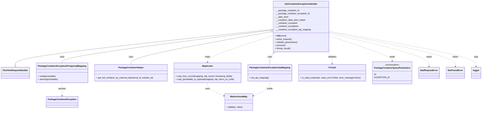

# Diagram: partview_core/partview_service/partview_service/api/package_container/exception/handlers/get_package_container_exceptions.py


> Auto-generated by Obscura crawlers

## Diagram 1



### SVG

<svg id="container" width="3550.6328125" xmlns="http://www.w3.org/2000/svg" class="classDiagram" height="842" viewBox="0 0 3550.6328125 842" role="graphics-document document" aria-roledescription="class"><style>#container{font-family:"trebuchet ms",verdana,arial,sans-serif;font-size:16px;fill:#333;}@keyframes edge-animation-frame{from{stroke-dashoffset:0;}}@keyframes dash{to{stroke-dashoffset:0;}}#container .edge-animation-slow{stroke-dasharray:9,5!important;stroke-dashoffset:900;animation:dash 50s linear infinite;stroke-linecap:round;}#container .edge-animation-fast{stroke-dasharray:9,5!important;stroke-dashoffset:900;animation:dash 20s linear infinite;stroke-linecap:round;}#container .error-icon{fill:#552222;}#container .error-text{fill:#552222;stroke:#552222;}#container .edge-thickness-normal{stroke-width:1px;}#container .edge-thickness-thick{stroke-width:3.5px;}#container .edge-pattern-solid{stroke-dasharray:0;}#container .edge-thickness-invisible{stroke-width:0;fill:none;}#container .edge-pattern-dashed{stroke-dasharray:3;}#container .edge-pattern-dotted{stroke-dasharray:2;}#container .marker{fill:#333333;stroke:#333333;}#container .marker.cross{stroke:#333333;}#container svg{font-family:"trebuchet ms",verdana,arial,sans-serif;font-size:16px;}#container p{margin:0;}#container g.classGroup text{fill:#9370DB;stroke:none;font-family:"trebuchet ms",verdana,arial,sans-serif;font-size:10px;}#container g.classGroup text .title{font-weight:bolder;}#container .nodeLabel,#container .edgeLabel{color:#131300;}#container .edgeLabel .label rect{fill:#ECECFF;}#container .label text{fill:#131300;}#container .labelBkg{background:#ECECFF;}#container .edgeLabel .label span{background:#ECECFF;}#container .classTitle{font-weight:bolder;}#container .node rect,#container .node circle,#container .node ellipse,#container .node polygon,#container .node path{fill:#ECECFF;stroke:#9370DB;stroke-width:1px;}#container .divider{stroke:#9370DB;stroke-width:1;}#container g.clickable{cursor:pointer;}#container g.classGroup rect{fill:#ECECFF;stroke:#9370DB;}#container g.classGroup line{stroke:#9370DB;stroke-width:1;}#container .classLabel .box{stroke:none;stroke-width:0;fill:#ECECFF;opacity:0.5;}#container .classLabel .label{fill:#9370DB;font-size:10px;}#container .relation{stroke:#333333;stroke-width:1;fill:none;}#container .dashed-line{stroke-dasharray:3;}#container .dotted-line{stroke-dasharray:1 2;}#container #compositionStart,#container .composition{fill:#333333!important;stroke:#333333!important;stroke-width:1;}#container #compositionEnd,#container .composition{fill:#333333!important;stroke:#333333!important;stroke-width:1;}#container #dependencyStart,#container .dependency{fill:#333333!important;stroke:#333333!important;stroke-width:1;}#container #dependencyStart,#container .dependency{fill:#333333!important;stroke:#333333!important;stroke-width:1;}#container #extensionStart,#container .extension{fill:transparent!important;stroke:#333333!important;stroke-width:1;}#container #extensionEnd,#container .extension{fill:transparent!important;stroke:#333333!important;stroke-width:1;}#container #aggregationStart,#container .aggregation{fill:transparent!important;stroke:#333333!important;stroke-width:1;}#container #aggregationEnd,#container .aggregation{fill:transparent!important;stroke:#333333!important;stroke-width:1;}#container #lollipopStart,#container .lollipop{fill:#ECECFF!important;stroke:#333333!important;stroke-width:1;}#container #lollipopEnd,#container .lollipop{fill:#ECECFF!important;stroke:#333333!important;stroke-width:1;}#container .edgeTerminals{font-size:11px;line-height:initial;}#container .classTitleText{text-anchor:middle;font-size:18px;fill:#333;}#container .label-icon{display:inline-block;height:1em;overflow:visible;vertical-align:-0.125em;}#container .node .label-icon path{fill:currentColor;stroke:revert;stroke-width:revert;}#container :root{--mermaid-font-family:"trebuchet ms",verdana,arial,sans-serif;}</style><g><defs><marker id="container_class-aggregationStart" class="marker aggregation class" refX="18" refY="7" markerWidth="190" markerHeight="240" orient="auto"><path d="M 18,7 L9,13 L1,7 L9,1 Z"></path></marker></defs><defs><marker id="container_class-aggregationEnd" class="marker aggregation class" refX="1" refY="7" markerWidth="20" markerHeight="28" orient="auto"><path d="M 18,7 L9,13 L1,7 L9,1 Z"></path></marker></defs><defs><marker id="container_class-extensionStart" class="marker extension class" refX="18" refY="7" markerWidth="190" markerHeight="240" orient="auto"><path d="M 1,7 L18,13 V 1 Z"></path></marker></defs><defs><marker id="container_class-extensionEnd" class="marker extension class" refX="1" refY="7" markerWidth="20" markerHeight="28" orient="auto"><path d="M 1,1 V 13 L18,7 Z"></path></marker></defs><defs><marker id="container_class-compositionStart" class="marker composition class" refX="18" refY="7" markerWidth="190" markerHeight="240" orient="auto"><path d="M 18,7 L9,13 L1,7 L9,1 Z"></path></marker></defs><defs><marker id="container_class-compositionEnd" class="marker composition class" refX="1" refY="7" markerWidth="20" markerHeight="28" orient="auto"><path d="M 18,7 L9,13 L1,7 L9,1 Z"></path></marker></defs><defs><marker id="container_class-dependencyStart" class="marker dependency class" refX="6" refY="7" markerWidth="190" markerHeight="240" orient="auto"><path d="M 5,7 L9,13 L1,7 L9,1 Z"></path></marker></defs><defs><marker id="container_class-dependencyEnd" class="marker dependency class" refX="13" refY="7" markerWidth="20" markerHeight="28" orient="auto"><path d="M 18,7 L9,13 L14,7 L9,1 Z"></path></marker></defs><defs><marker id="container_class-lollipopStart" class="marker lollipop class" refX="13" refY="7" markerWidth="190" markerHeight="240" orient="auto"><circle stroke="black" fill="transparent" cx="7" cy="7" r="6"></circle></marker></defs><defs><marker id="container_class-lollipopEnd" class="marker lollipop class" refX="1" refY="7" markerWidth="190" markerHeight="240" orient="auto"><circle stroke="black" fill="transparent" cx="7" cy="7" r="6"></circle></marker></defs><g class="root"><g class="clusters"></g><g class="edgePaths"><path d="M2026.133,222.493L1707.004,256.911C1387.875,291.329,749.617,360.164,430.488,404.874C111.359,449.583,111.359,470.167,111.359,480.458L111.359,490.75" id="id_GetContainerExceptionsHandler_PartViewRequestHandler_1" class="edge-thickness-normal edge-pattern-solid relation" style=";;;" data-edge="true" data-et="edge" data-id="id_GetContainerExceptionsHandler_PartViewRequestHandler_1" data-points="W3sieCI6MjAyNi4xMzI4MTI1LCJ5IjoyMjIuNDkyOTEwNzk1NzkwMDd9LHsieCI6MTExLjM1OTM3NSwieSI6NDI5fSx7IngiOjExMS4zNTkzNzUsInkiOjUwOH1d" marker-end="url(#container_class-extensionEnd)"></path><path d="M2009.023,228.928L1748.897,262.274C1488.77,295.619,968.518,362.309,708.392,403.321C448.266,444.333,448.266,459.667,448.266,467.333L448.266,475" id="id_GetContainerExceptionsHandler_PackageContainerExceptionPostgresqlMapping_2" class="edge-thickness-normal edge-pattern-solid relation" style=";;;" data-edge="true" data-et="edge" data-id="id_GetContainerExceptionsHandler_PackageContainerExceptionPostgresqlMapping_2" data-points="W3sieCI6MjAyNi4xMzI4MTI1LCJ5IjoyMjYuNzM0OTAxODc1MDM0MTV9LHsieCI6NDQ4LjI2NTYyNSwieSI6NDI5fSx7IngiOjQ0OC4yNjU2MjUsInkiOjQ3NX1d" marker-start="url(#container_class-aggregationStart)"></path><path d="M2009.154,240.482L1834.106,271.902C1659.058,303.321,1308.963,366.161,1133.915,407.247C958.867,448.333,958.867,467.667,958.867,477.333L958.867,487" id="id_GetContainerExceptionsHandler_PackageContainerHelper_3" class="edge-thickness-normal edge-pattern-solid relation" style=";;;" data-edge="true" data-et="edge" data-id="id_GetContainerExceptionsHandler_PackageContainerHelper_3" data-points="W3sieCI6MjAyNi4xMzI4MTI1LCJ5IjoyMzcuNDM0NTU5NzY2ODE3NDJ9LHsieCI6OTU4Ljg2NzE4NzUsInkiOjQyOX0seyJ4Ijo5NTguODY3MTg3NSwieSI6NDg3fV0=" marker-start="url(#container_class-aggregationStart)"></path><path d="M2031.423,404.226L2027.314,408.355C2023.204,412.484,2014.985,420.742,2010.875,434.538C2006.766,448.333,2006.766,467.667,2006.766,477.333L2006.766,487" id="id_GetContainerExceptionsHandler_PackageContainerExceptionApiMapping_4" class="edge-thickness-normal edge-pattern-solid relation" style=";;;" data-edge="true" data-et="edge" data-id="id_GetContainerExceptionsHandler_PackageContainerExceptionApiMapping_4" data-points="W3sieCI6MjA0My41OTIwNjEyNzE4MzQyLCJ5IjozOTJ9LHsieCI6MjAwNi43NjU2MjUsInkiOjQyOX0seyJ4IjoyMDA2Ljc2NTYyNSwieSI6NDg3fV0=" marker-start="url(#container_class-aggregationStart)"></path><path d="M2443.25,271.619L2519.634,297.849C2596.018,324.079,2748.786,376.54,2825.171,407.936C2901.555,439.333,2901.555,449.667,2901.555,454.833L2901.555,460" id="id_GetContainerExceptionsHandler_PackageContainerQueryParameters_5" class="edge-thickness-normal edge-pattern-dashed relation" style=";;;" data-edge="true" data-et="edge" data-id="id_GetContainerExceptionsHandler_PackageContainerQueryParameters_5" data-points="W3sieCI6MjQ0My4yNSwieSI6MjcxLjYxODc1NTAxNTYxMDY1fSx7IngiOjI5MDEuNTU0Njg3NSwieSI6NDI5fSx7IngiOjI5MDEuNTU0Njg3NSwieSI6NDY2fV0=" marker-end="url(#container_class-dependencyEnd)"></path><path d="M2425.791,392L2431.928,398.167C2438.066,404.333,2450.342,416.667,2456.479,431.5C2462.617,446.333,2462.617,463.667,2462.617,472.333L2462.617,481" id="id_GetContainerExceptionsHandler_FvUuid_6" class="edge-thickness-normal edge-pattern-dashed relation" style=";;;" data-edge="true" data-et="edge" data-id="id_GetContainerExceptionsHandler_FvUuid_6" data-points="W3sieCI6MjQyNS43OTA3NTEyMjgxNjYsInkiOjM5Mn0seyJ4IjoyNDYyLjYxNzE4NzUsInkiOjQyOX0seyJ4IjoyNDYyLjYxNzE4NzUsInkiOjQ4N31d" marker-end="url(#container_class-dependencyEnd)"></path><path d="M2026.133,268.992L1945.516,295.66C1864.9,322.328,1703.667,375.664,1623.05,408.999C1542.434,442.333,1542.434,455.667,1542.434,462.333L1542.434,469" id="id_GetContainerExceptionsHandler_MapAction_7" class="edge-thickness-normal edge-pattern-dashed relation" style=";;;" data-edge="true" data-et="edge" data-id="id_GetContainerExceptionsHandler_MapAction_7" data-points="W3sieCI6MjAyNi4xMzI4MTI1LCJ5IjoyNjguOTkxNTE4OTIwMTk5OTV9LHsieCI6MTU0Mi40MzM1OTM3NSwieSI6NDI5fSx7IngiOjE1NDIuNDMzNTkzNzUsInkiOjQ3NX1d" marker-end="url(#container_class-dependencyEnd)"></path><path d="M448.266,625L448.266,632.667C448.266,640.333,448.266,655.667,448.266,672C448.266,688.333,448.266,705.667,448.266,714.333L448.266,723" id="id_PackageContainerExceptionPostgresqlMapping_PackageContainerException_8" class="edge-thickness-normal edge-pattern-dashed relation" style=";;;" data-edge="true" data-et="edge" data-id="id_PackageContainerExceptionPostgresqlMapping_PackageContainerException_8" data-points="W3sieCI6NDQ4LjI2NTYyNSwieSI6NjI1fSx7IngiOjQ0OC4yNjU2MjUsInkiOjY3MX0seyJ4Ijo0NDguMjY1NjI1LCJ5Ijo3Mjl9XQ==" marker-end="url(#container_class-dependencyEnd)"></path><path d="M1542.434,625L1542.434,632.667C1542.434,640.333,1542.434,655.667,1562.912,672.154C1583.39,688.641,1624.347,706.282,1644.826,715.103L1665.304,723.923" id="id_MapAction_BidirectionalMap_9" class="edge-thickness-normal edge-pattern-dashed relation" style=";;;" data-edge="true" data-et="edge" data-id="id_MapAction_BidirectionalMap_9" data-points="W3sieCI6MTU0Mi40MzM1OTM3NSwieSI6NjI1fSx7IngiOjE1NDIuNDMzNTkzNzUsInkiOjY3MX0seyJ4IjoxNjcwLjgxNDQ1MzEyNSwieSI6NzI2LjI5NzAwNzYzMDI0ODV9XQ==" marker-end="url(#container_class-dependencyEnd)"></path><path d="M2006.766,613L2006.766,622.667C2006.766,632.333,2006.766,651.667,1986.287,670.154C1965.809,688.641,1924.852,706.282,1904.374,715.103L1883.895,723.923" id="id_PackageContainerExceptionApiMapping_BidirectionalMap_10" class="edge-thickness-normal edge-pattern-dashed relation" style=";;;" data-edge="true" data-et="edge" data-id="id_PackageContainerExceptionApiMapping_BidirectionalMap_10" data-points="W3sieCI6MjAwNi43NjU2MjUsInkiOjYxM30seyJ4IjoyMDA2Ljc2NTYyNSwieSI6NjcxfSx7IngiOjE4NzguMzg0NzY1NjI1LCJ5Ijo3MjYuMjk3MDA3NjMwMjQ4NX1d" marker-end="url(#container_class-dependencyEnd)"></path><path d="M2443.25,251.242L2563.832,280.868C2684.414,310.495,2925.578,369.747,3046.16,411.54C3166.742,453.333,3166.742,477.667,3166.742,489.833L3166.742,502" id="id_GetContainerExceptionsHandler_BadRequestError_11" class="edge-thickness-normal edge-pattern-dashed relation" style=";;;" data-edge="true" data-et="edge" data-id="id_GetContainerExceptionsHandler_BadRequestError_11" data-points="W3sieCI6MjQ0My4yNSwieSI6MjUxLjI0MTc1NTIwMjExMjI3fSx7IngiOjMxNjYuNzQyMTg3NSwieSI6NDI5fSx7IngiOjMxNjYuNzQyMTg3NSwieSI6NTA4fV0=" marker-end="url(#container_class-dependencyEnd)"></path><path d="M2443.25,242.572L2595.467,273.643C2747.685,304.715,3052.12,366.857,3204.337,410.095C3356.555,453.333,3356.555,477.667,3356.555,489.833L3356.555,502" id="id_GetContainerExceptionsHandler_NotFoundError_12" class="edge-thickness-normal edge-pattern-dashed relation" style=";;;" data-edge="true" data-et="edge" data-id="id_GetContainerExceptionsHandler_NotFoundError_12" data-points="W3sieCI6MjQ0My4yNSwieSI6MjQyLjU3MTk1OTMxNzEyMzh9LHsieCI6MzM1Ni41NTQ2ODc1LCJ5Ijo0Mjl9LHsieCI6MzM1Ni41NTQ2ODc1LCJ5Ijo1MDh9XQ==" marker-end="url(#container_class-dependencyEnd)"></path><path d="M2443.25,237.527L2620.602,269.439C2797.953,301.352,3152.656,365.176,3330.008,409.255C3507.359,453.333,3507.359,477.667,3507.359,489.833L3507.359,502" id="id_GetContainerExceptionsHandler_logger_13" class="edge-thickness-normal edge-pattern-dashed relation" style=";;;" data-edge="true" data-et="edge" data-id="id_GetContainerExceptionsHandler_logger_13" data-points="W3sieCI6MjQ0My4yNSwieSI6MjM3LjUyNzM5ODQ1ODU3NzcyfSx7IngiOjM1MDcuMzU5Mzc1LCJ5Ijo0Mjl9LHsieCI6MzUwNy4zNTkzNzUsInkiOjUwOH1d" marker-end="url(#container_class-dependencyEnd)"></path></g><g class="edgeLabels"><g class="edgeLabel"><g class="label" data-id="id_GetContainerExceptionsHandler_PartViewRequestHandler_1" transform="translate(0, 0)"><foreignObject width="0" height="0"><div xmlns="http://www.w3.org/1999/xhtml" class="labelBkg" style="display: table-cell; white-space: nowrap; line-height: 1.5; max-width: 200px; text-align: center;"><span class="edgeLabel"></span></div></foreignObject></g></g><g class="edgeLabel" transform="translate(448.265625, 429)"><g class="label" data-id="id_GetContainerExceptionsHandler_PackageContainerExceptionPostgresqlMapping_2" transform="translate(-16.4921875, -12)"><foreignObject width="32.984375" height="24"><div xmlns="http://www.w3.org/1999/xhtml" class="labelBkg" style="display: table-cell; white-space: nowrap; line-height: 1.5; max-width: 200px; text-align: center;"><span class="edgeLabel"><p>uses</p></span></div></foreignObject></g></g><g class="edgeLabel" transform="translate(958.8671875, 429)"><g class="label" data-id="id_GetContainerExceptionsHandler_PackageContainerHelper_3" transform="translate(-16.4921875, -12)"><foreignObject width="32.984375" height="24"><div xmlns="http://www.w3.org/1999/xhtml" class="labelBkg" style="display: table-cell; white-space: nowrap; line-height: 1.5; max-width: 200px; text-align: center;"><span class="edgeLabel"><p>uses</p></span></div></foreignObject></g></g><g class="edgeLabel" transform="translate(2006.765625, 429)"><g class="label" data-id="id_GetContainerExceptionsHandler_PackageContainerExceptionApiMapping_4" transform="translate(-16.4921875, -12)"><foreignObject width="32.984375" height="24"><div xmlns="http://www.w3.org/1999/xhtml" class="labelBkg" style="display: table-cell; white-space: nowrap; line-height: 1.5; max-width: 200px; text-align: center;"><span class="edgeLabel"><p>uses</p></span></div></foreignObject></g></g><g class="edgeLabel" transform="translate(2901.5546875, 429)"><g class="label" data-id="id_GetContainerExceptionsHandler_PackageContainerQueryParameters_5" transform="translate(-20.0078125, -12)"><foreignObject width="40.015625" height="24"><div xmlns="http://www.w3.org/1999/xhtml" class="labelBkg" style="display: table-cell; white-space: nowrap; line-height: 1.5; max-width: 200px; text-align: center;"><span class="edgeLabel"><p>reads</p></span></div></foreignObject></g></g><g class="edgeLabel" transform="translate(2462.6171875, 429)"><g class="label" data-id="id_GetContainerExceptionsHandler_FvUuid_6" transform="translate(-32.6875, -12)"><foreignObject width="65.375" height="24"><div xmlns="http://www.w3.org/1999/xhtml" class="labelBkg" style="display: table-cell; white-space: nowrap; line-height: 1.5; max-width: 200px; text-align: center;"><span class="edgeLabel"><p>validates</p></span></div></foreignObject></g></g><g class="edgeLabel" transform="translate(1542.43359375, 429)"><g class="label" data-id="id_GetContainerExceptionsHandler_MapAction_7" transform="translate(-19.703125, -12)"><foreignObject width="39.40625" height="24"><div xmlns="http://www.w3.org/1999/xhtml" class="labelBkg" style="display: table-cell; white-space: nowrap; line-height: 1.5; max-width: 200px; text-align: center;"><span class="edgeLabel"><p>maps</p></span></div></foreignObject></g></g><g class="edgeLabel" transform="translate(448.265625, 671)"><g class="label" data-id="id_PackageContainerExceptionPostgresqlMapping_PackageContainerException_8" transform="translate(-28.4375, -12)"><foreignObject width="56.875" height="24"><div xmlns="http://www.w3.org/1999/xhtml" class="labelBkg" style="display: table-cell; white-space: nowrap; line-height: 1.5; max-width: 200px; text-align: center;"><span class="edgeLabel"><p>persists</p></span></div></foreignObject></g></g><g class="edgeLabel" transform="translate(1542.43359375, 671)"><g class="label" data-id="id_MapAction_BidirectionalMap_9" transform="translate(-16.4921875, -12)"><foreignObject width="32.984375" height="24"><div xmlns="http://www.w3.org/1999/xhtml" class="labelBkg" style="display: table-cell; white-space: nowrap; line-height: 1.5; max-width: 200px; text-align: center;"><span class="edgeLabel"><p>uses</p></span></div></foreignObject></g></g><g class="edgeLabel" transform="translate(2006.765625, 671)"><g class="label" data-id="id_PackageContainerExceptionApiMapping_BidirectionalMap_10" transform="translate(-22.4921875, -12)"><foreignObject width="44.984375" height="24"><div xmlns="http://www.w3.org/1999/xhtml" class="labelBkg" style="display: table-cell; white-space: nowrap; line-height: 1.5; max-width: 200px; text-align: center;"><span class="edgeLabel"><p>builds</p></span></div></foreignObject></g></g><g class="edgeLabel" transform="translate(3166.7421875, 429)"><g class="label" data-id="id_GetContainerExceptionsHandler_BadRequestError_11" transform="translate(-21.25, -12)"><foreignObject width="42.5" height="24"><div xmlns="http://www.w3.org/1999/xhtml" class="labelBkg" style="display: table-cell; white-space: nowrap; line-height: 1.5; max-width: 200px; text-align: center;"><span class="edgeLabel"><p>raises</p></span></div></foreignObject></g></g><g class="edgeLabel" transform="translate(3356.5546875, 429)"><g class="label" data-id="id_GetContainerExceptionsHandler_NotFoundError_12" transform="translate(-21.25, -12)"><foreignObject width="42.5" height="24"><div xmlns="http://www.w3.org/1999/xhtml" class="labelBkg" style="display: table-cell; white-space: nowrap; line-height: 1.5; max-width: 200px; text-align: center;"><span class="edgeLabel"><p>raises</p></span></div></foreignObject></g></g><g class="edgeLabel" transform="translate(3507.359375, 429)"><g class="label" data-id="id_GetContainerExceptionsHandler_logger_13" transform="translate(-14.8203125, -12)"><foreignObject width="29.640625" height="24"><div xmlns="http://www.w3.org/1999/xhtml" class="labelBkg" style="display: table-cell; white-space: nowrap; line-height: 1.5; max-width: 200px; text-align: center;"><span class="edgeLabel"><p>logs</p></span></div></foreignObject></g></g></g><g class="nodes"><g class="node default" id="classId-GetContainerExceptionsHandler-0" transform="translate(2234.69140625, 200)"><g class="basic label-container"><path d="M-208.55859375 -192 L208.55859375 -192 L208.55859375 192 L-208.55859375 192" stroke="none" stroke-width="0" fill="#ECECFF" style=""></path><path d="M-208.55859375 -192 C-51.4013249498889 -192, 105.7559438502222 -192, 208.55859375 -192 M-208.55859375 -192 C-50.787554576276136 -192, 106.98348459744773 -192, 208.55859375 -192 M208.55859375 -192 C208.55859375 -108.23370637291245, 208.55859375 -24.467412745824902, 208.55859375 192 M208.55859375 -192 C208.55859375 -113.64866018739409, 208.55859375 -35.29732037478817, 208.55859375 192 M208.55859375 192 C92.50553947629247 192, -23.54751479741506 192, -208.55859375 192 M208.55859375 192 C89.3943960287394 192, -29.769801692521213 192, -208.55859375 192 M-208.55859375 192 C-208.55859375 38.80004631171346, -208.55859375 -114.39990737657308, -208.55859375 -192 M-208.55859375 192 C-208.55859375 92.33729137260437, -208.55859375 -7.325417254791262, -208.55859375 -192" stroke="#9370DB" stroke-width="1.3" fill="none" stroke-dasharray="0 0" style=""></path></g><g class="annotation-group text" transform="translate(0, -168)"></g><g class="label-group text" transform="translate(-116.9140625, -168)"><g class="label" style="font-weight: bolder" transform="translate(0,-12)"><foreignObject width="233.828125" height="24"><div xmlns="http://www.w3.org/1999/xhtml" style="display: table-cell; white-space: nowrap; line-height: 1.5; max-width: 282px; text-align: center;"><span class="nodeLabel markdown-node-label" style=""><p>GetContainerExceptionsHandler</p></span></div></foreignObject></g></g><g class="members-group text" transform="translate(-196.55859375, -120)"><g class="label" style="" transform="translate(0,-12)"><foreignObject width="184.15625" height="24"><div xmlns="http://www.w3.org/1999/xhtml" style="display: table-cell; white-space: nowrap; line-height: 1.5; max-width: 242px; text-align: center;"><span class="nodeLabel markdown-node-label" style=""><p>- __package_container_id</p></span></div></foreignObject></g><g class="label" style="" transform="translate(0,12)"><foreignObject width="262.90625" height="24"><div xmlns="http://www.w3.org/1999/xhtml" style="display: table-cell; white-space: nowrap; line-height: 1.5; max-width: 320px; text-align: center;"><span class="nodeLabel markdown-node-label" style=""><p>- __package_container_exception_id</p></span></div></foreignObject></g><g class="label" style="" transform="translate(0,36)"><foreignObject width="104.578125" height="24"><div xmlns="http://www.w3.org/1999/xhtml" style="display: table-cell; white-space: nowrap; line-height: 1.5; max-width: 162px; text-align: center;"><span class="nodeLabel markdown-node-label" style=""><p>- __data_store</p></span></div></foreignObject></g><g class="label" style="" transform="translate(0,60)"><foreignObject width="235.6875" height="24"><div xmlns="http://www.w3.org/1999/xhtml" style="display: table-cell; white-space: nowrap; line-height: 1.5; max-width: 294px; text-align: center;"><span class="nodeLabel markdown-node-label" style=""><p>- __container_data_store_helper</p></span></div></foreignObject></g><g class="label" style="" transform="translate(0,84)"><foreignObject width="173.53125" height="24"><div xmlns="http://www.w3.org/1999/xhtml" style="display: table-cell; white-space: nowrap; line-height: 1.5; max-width: 231px; text-align: center;"><span class="nodeLabel markdown-node-label" style=""><p>- __container_exception</p></span></div></foreignObject></g><g class="label" style="" transform="translate(0,108)"><foreignObject width="181" height="24"><div xmlns="http://www.w3.org/1999/xhtml" style="display: table-cell; white-space: nowrap; line-height: 1.5; max-width: 238px; text-align: center;"><span class="nodeLabel markdown-node-label" style=""><p>- __container_exceptions</p></span></div></foreignObject></g><g class="label" style="" transform="translate(0,132)"><foreignObject width="276.203125" height="24"><div xmlns="http://www.w3.org/1999/xhtml" style="display: table-cell; white-space: nowrap; line-height: 1.5; max-width: 334px; text-align: center;"><span class="nodeLabel markdown-node-label" style=""><p>- __container_exception_api_mapping</p></span></div></foreignObject></g></g><g class="methods-group text" transform="translate(-196.55859375, 72)"><g class="label" style="" transform="translate(0,-12)"><foreignObject width="87.390625" height="24"><div xmlns="http://www.w3.org/1999/xhtml" style="display: table-cell; white-space: nowrap; line-height: 1.5; max-width: 177px; text-align: center;"><span class="nodeLabel markdown-node-label" style=""><p>+ <strong>init</strong>(event)</p></span></div></foreignObject></g><g class="label" style="" transform="translate(0,12)"><foreignObject width="126.046875" height="24"><div xmlns="http://www.w3.org/1999/xhtml" style="display: table-cell; white-space: nowrap; line-height: 1.5; max-width: 183px; text-align: center;"><span class="nodeLabel markdown-node-label" style=""><p>+ parse_request()</p></span></div></foreignObject></g><g class="label" style="" transform="translate(0,36)"><foreignObject width="170.953125" height="24"><div xmlns="http://www.w3.org/1999/xhtml" style="display: table-cell; white-space: nowrap; line-height: 1.5; max-width: 228px; text-align: center;"><span class="nodeLabel markdown-node-label" style=""><p>+ validate_parameters()</p></span></div></foreignObject></g><g class="label" style="" transform="translate(0,60)"><foreignObject width="77.96875" height="24"><div xmlns="http://www.w3.org/1999/xhtml" style="display: table-cell; white-space: nowrap; line-height: 1.5; max-width: 135px; text-align: center;"><span class="nodeLabel markdown-node-label" style=""><p>+ process()</p></span></div></foreignObject></g><g class="label" style="" transform="translate(0,84)"><foreignObject width="121.5" height="24"><div xmlns="http://www.w3.org/1999/xhtml" style="display: table-cell; white-space: nowrap; line-height: 1.5; max-width: 179px; text-align: center;"><span class="nodeLabel markdown-node-label" style=""><p>+ format_result()</p></span></div></foreignObject></g></g><g class="divider" style=""><path d="M-208.55859375 -144 C-46.750226934977604 -144, 115.05813988004479 -144, 208.55859375 -144 M-208.55859375 -144 C-75.78144767384285 -144, 56.995698402314304 -144, 208.55859375 -144" stroke="#9370DB" stroke-width="1.3" fill="none" stroke-dasharray="0 0" style=""></path></g><g class="divider" style=""><path d="M-208.55859375 48 C-54.21632679382961 48, 100.12594016234078 48, 208.55859375 48 M-208.55859375 48 C-57.10795939806306 48, 94.34267495387388 48, 208.55859375 48" stroke="#9370DB" stroke-width="1.3" fill="none" stroke-dasharray="0 0" style=""></path></g></g><g class="node default" id="classId-PartViewRequestHandler-1" transform="translate(111.359375, 550)"><g class="basic label-container"><path d="M-103.359375 -42 L103.359375 -42 L103.359375 42 L-103.359375 42" stroke="none" stroke-width="0" fill="#ECECFF" style=""></path><path d="M-103.359375 -42 C-57.91541039783241 -42, -12.47144579566482 -42, 103.359375 -42 M-103.359375 -42 C-59.7259608300063 -42, -16.0925466600126 -42, 103.359375 -42 M103.359375 -42 C103.359375 -16.904300210081217, 103.359375 8.191399579837565, 103.359375 42 M103.359375 -42 C103.359375 -16.41783057405531, 103.359375 9.164338851889383, 103.359375 42 M103.359375 42 C42.266169406532086 42, -18.82703618693583 42, -103.359375 42 M103.359375 42 C44.23676963021072 42, -14.885835739578553 42, -103.359375 42 M-103.359375 42 C-103.359375 11.854860519148499, -103.359375 -18.290278961703002, -103.359375 -42 M-103.359375 42 C-103.359375 14.23599399471614, -103.359375 -13.528012010567721, -103.359375 -42" stroke="#9370DB" stroke-width="1.3" fill="none" stroke-dasharray="0 0" style=""></path></g><g class="annotation-group text" transform="translate(0, -18)"></g><g class="label-group text" transform="translate(-91.359375, -18)"><g class="label" style="font-weight: bolder" transform="translate(0,-12)"><foreignObject width="182.71875" height="24"><div xmlns="http://www.w3.org/1999/xhtml" style="display: table-cell; white-space: nowrap; line-height: 1.5; max-width: 231px; text-align: center;"><span class="nodeLabel markdown-node-label" style=""><p>PartViewRequestHandler</p></span></div></foreignObject></g></g><g class="members-group text" transform="translate(-91.359375, 30)"></g><g class="methods-group text" transform="translate(-91.359375, 60)"></g><g class="divider" style=""><path d="M-103.359375 6 C-45.21490145549587 6, 12.92957208900826 6, 103.359375 6 M-103.359375 6 C-60.9611926163418 6, -18.563010232683595 6, 103.359375 6" stroke="#9370DB" stroke-width="1.3" fill="none" stroke-dasharray="0 0" style=""></path></g><g class="divider" style=""><path d="M-103.359375 24 C-36.061456692615494 24, 31.236461614769013 24, 103.359375 24 M-103.359375 24 C-37.688693564581044 24, 27.981987870837912 24, 103.359375 24" stroke="#9370DB" stroke-width="1.3" fill="none" stroke-dasharray="0 0" style=""></path></g></g><g class="node default" id="classId-PackageContainerException-2" transform="translate(448.265625, 771)"><g class="basic label-container"><path d="M-113.1484375 -42 L113.1484375 -42 L113.1484375 42 L-113.1484375 42" stroke="none" stroke-width="0" fill="#ECECFF" style=""></path><path d="M-113.1484375 -42 C-64.02115432947507 -42, -14.893871158950134 -42, 113.1484375 -42 M-113.1484375 -42 C-45.5963023081397 -42, 21.955832883720603 -42, 113.1484375 -42 M113.1484375 -42 C113.1484375 -20.58328258125906, 113.1484375 0.8334348374818816, 113.1484375 42 M113.1484375 -42 C113.1484375 -20.18862119700198, 113.1484375 1.6227576059960427, 113.1484375 42 M113.1484375 42 C51.587972222776514 42, -9.972493054446971 42, -113.1484375 42 M113.1484375 42 C30.258552116623406 42, -52.63133326675319 42, -113.1484375 42 M-113.1484375 42 C-113.1484375 21.218044802175303, -113.1484375 0.43608960435060595, -113.1484375 -42 M-113.1484375 42 C-113.1484375 9.097971956748346, -113.1484375 -23.80405608650331, -113.1484375 -42" stroke="#9370DB" stroke-width="1.3" fill="none" stroke-dasharray="0 0" style=""></path></g><g class="annotation-group text" transform="translate(0, -18)"></g><g class="label-group text" transform="translate(-101.1484375, -18)"><g class="label" style="font-weight: bolder" transform="translate(0,-12)"><foreignObject width="202.296875" height="24"><div xmlns="http://www.w3.org/1999/xhtml" style="display: table-cell; white-space: nowrap; line-height: 1.5; max-width: 249px; text-align: center;"><span class="nodeLabel markdown-node-label" style=""><p>PackageContainerException</p></span></div></foreignObject></g></g><g class="members-group text" transform="translate(-101.1484375, 30)"></g><g class="methods-group text" transform="translate(-101.1484375, 60)"></g><g class="divider" style=""><path d="M-113.1484375 6 C-46.701849934059325 6, 19.74473763188135 6, 113.1484375 6 M-113.1484375 6 C-62.10956386891387 6, -11.070690237827733 6, 113.1484375 6" stroke="#9370DB" stroke-width="1.3" fill="none" stroke-dasharray="0 0" style=""></path></g><g class="divider" style=""><path d="M-113.1484375 24 C-46.454505290492094 24, 20.239426919015813 24, 113.1484375 24 M-113.1484375 24 C-50.20529718761497 24, 12.737843124770066 24, 113.1484375 24" stroke="#9370DB" stroke-width="1.3" fill="none" stroke-dasharray="0 0" style=""></path></g></g><g class="node default" id="classId-PackageContainerExceptionPostgresqlMapping-3" transform="translate(448.265625, 550)"><g class="basic label-container"><path d="M-183.546875 -75 L183.546875 -75 L183.546875 75 L-183.546875 75" stroke="none" stroke-width="0" fill="#ECECFF" style=""></path><path d="M-183.546875 -75 C-83.27170301776407 -75, 17.003468964471864 -75, 183.546875 -75 M-183.546875 -75 C-54.615667198119525 -75, 74.31554060376095 -75, 183.546875 -75 M183.546875 -75 C183.546875 -34.88569924856566, 183.546875 5.228601502868685, 183.546875 75 M183.546875 -75 C183.546875 -20.973111660064035, 183.546875 33.05377667987193, 183.546875 75 M183.546875 75 C52.45106949358717 75, -78.64473601282566 75, -183.546875 75 M183.546875 75 C41.831596131215775 75, -99.88368273756845 75, -183.546875 75 M-183.546875 75 C-183.546875 25.00415990354196, -183.546875 -24.99168019291608, -183.546875 -75 M-183.546875 75 C-183.546875 30.329298385451125, -183.546875 -14.34140322909775, -183.546875 -75" stroke="#9370DB" stroke-width="1.3" fill="none" stroke-dasharray="0 0" style=""></path></g><g class="annotation-group text" transform="translate(0, -51)"></g><g class="label-group text" transform="translate(-171.546875, -51)"><g class="label" style="font-weight: bolder" transform="translate(0,-12)"><foreignObject width="343.09375" height="24"><div xmlns="http://www.w3.org/1999/xhtml" style="display: table-cell; white-space: nowrap; line-height: 1.5; max-width: 388px; text-align: center;"><span class="nodeLabel markdown-node-label" style=""><p>PackageContainerExceptionPostgresqlMapping</p></span></div></foreignObject></g></g><g class="members-group text" transform="translate(-171.546875, -3)"></g><g class="methods-group text" transform="translate(-171.546875, 27)"><g class="label" style="" transform="translate(0,-12)"><foreignObject width="135.9375" height="24"><div xmlns="http://www.w3.org/1999/xhtml" style="display: table-cell; white-space: nowrap; line-height: 1.5; max-width: 193px; text-align: center;"><span class="nodeLabel markdown-node-label" style=""><p>+ read(persistable)</p></span></div></foreignObject></g><g class="label" style="" transform="translate(0,12)"><foreignObject width="150.875" height="24"><div xmlns="http://www.w3.org/1999/xhtml" style="display: table-cell; white-space: nowrap; line-height: 1.5; max-width: 208px; text-align: center;"><span class="nodeLabel markdown-node-label" style=""><p>+ search(persistable)</p></span></div></foreignObject></g></g><g class="divider" style=""><path d="M-183.546875 -27 C-50.85064822655269 -27, 81.84557854689461 -27, 183.546875 -27 M-183.546875 -27 C-72.64688089080825 -27, 38.253113218383504 -27, 183.546875 -27" stroke="#9370DB" stroke-width="1.3" fill="none" stroke-dasharray="0 0" style=""></path></g><g class="divider" style=""><path d="M-183.546875 -3 C-95.3148381280769 -3, -7.0828012561538 -3, 183.546875 -3 M-183.546875 -3 C-49.703576499211806 -3, 84.13972200157639 -3, 183.546875 -3" stroke="#9370DB" stroke-width="1.3" fill="none" stroke-dasharray="0 0" style=""></path></g></g><g class="node default" id="classId-PackageContainerHelper-4" transform="translate(958.8671875, 550)"><g class="basic label-container"><path d="M-277.0546875 -63 L277.0546875 -63 L277.0546875 63 L-277.0546875 63" stroke="none" stroke-width="0" fill="#ECECFF" style=""></path><path d="M-277.0546875 -63 C-65.92075539101671 -63, 145.21317671796658 -63, 277.0546875 -63 M-277.0546875 -63 C-68.65780260788941 -63, 139.73908228422118 -63, 277.0546875 -63 M277.0546875 -63 C277.0546875 -20.936455506238367, 277.0546875 21.127088987523265, 277.0546875 63 M277.0546875 -63 C277.0546875 -30.885009646174844, 277.0546875 1.2299807076503129, 277.0546875 63 M277.0546875 63 C67.54509835087009 63, -141.96449079825982 63, -277.0546875 63 M277.0546875 63 C130.8336954311303 63, -15.387296637739382 63, -277.0546875 63 M-277.0546875 63 C-277.0546875 30.577752810765183, -277.0546875 -1.8444943784696335, -277.0546875 -63 M-277.0546875 63 C-277.0546875 22.149979055316763, -277.0546875 -18.700041889366474, -277.0546875 -63" stroke="#9370DB" stroke-width="1.3" fill="none" stroke-dasharray="0 0" style=""></path></g><g class="annotation-group text" transform="translate(0, -39)"></g><g class="label-group text" transform="translate(-89.96875, -39)"><g class="label" style="font-weight: bolder" transform="translate(0,-12)"><foreignObject width="179.9375" height="24"><div xmlns="http://www.w3.org/1999/xhtml" style="display: table-cell; white-space: nowrap; line-height: 1.5; max-width: 228px; text-align: center;"><span class="nodeLabel markdown-node-label" style=""><p>PackageContainerHelper</p></span></div></foreignObject></g></g><g class="members-group text" transform="translate(-265.0546875, 9)"></g><g class="methods-group text" transform="translate(-265.0546875, 39)"><g class="label" style="" transform="translate(0,-12)"><foreignObject width="440.140625" height="24"><div xmlns="http://www.w3.org/1999/xhtml" style="display: table-cell; white-space: nowrap; line-height: 1.5; max-width: 498px; text-align: center;"><span class="nodeLabel markdown-node-label" style=""><p>+ get_full_container_by_external_id(external_id, solution_id)</p></span></div></foreignObject></g></g><g class="divider" style=""><path d="M-277.0546875 -15 C-100.47660169857573 -15, 76.10148410284853 -15, 277.0546875 -15 M-277.0546875 -15 C-129.2795151987048 -15, 18.495657102590428 -15, 277.0546875 -15" stroke="#9370DB" stroke-width="1.3" fill="none" stroke-dasharray="0 0" style=""></path></g><g class="divider" style=""><path d="M-277.0546875 9 C-99.95778089845467 9, 77.13912570309066 9, 277.0546875 9 M-277.0546875 9 C-87.04312088367485 9, 102.96844573265031 9, 277.0546875 9" stroke="#9370DB" stroke-width="1.3" fill="none" stroke-dasharray="0 0" style=""></path></g></g><g class="node default" id="classId-PackageContainerExceptionApiMapping-5" transform="translate(2006.765625, 550)"><g class="basic label-container"><path d="M-157.8203125 -63 L157.8203125 -63 L157.8203125 63 L-157.8203125 63" stroke="none" stroke-width="0" fill="#ECECFF" style=""></path><path d="M-157.8203125 -63 C-90.54290995820261 -63, -23.265507416405228 -63, 157.8203125 -63 M-157.8203125 -63 C-51.88981507770406 -63, 54.040682344591886 -63, 157.8203125 -63 M157.8203125 -63 C157.8203125 -19.496284155651686, 157.8203125 24.007431688696627, 157.8203125 63 M157.8203125 -63 C157.8203125 -21.016544133102784, 157.8203125 20.966911733794433, 157.8203125 63 M157.8203125 63 C78.03873841166703 63, -1.7428356766659476 63, -157.8203125 63 M157.8203125 63 C72.77663548763063 63, -12.267041524738744 63, -157.8203125 63 M-157.8203125 63 C-157.8203125 26.035373307163333, -157.8203125 -10.929253385673334, -157.8203125 -63 M-157.8203125 63 C-157.8203125 14.560851820184432, -157.8203125 -33.878296359631136, -157.8203125 -63" stroke="#9370DB" stroke-width="1.3" fill="none" stroke-dasharray="0 0" style=""></path></g><g class="annotation-group text" transform="translate(0, -39)"></g><g class="label-group text" transform="translate(-144.40625, -39)"><g class="label" style="font-weight: bolder" transform="translate(0,-12)"><foreignObject width="288.8125" height="24"><div xmlns="http://www.w3.org/1999/xhtml" style="display: table-cell; white-space: nowrap; line-height: 1.5; max-width: 336px; text-align: center;"><span class="nodeLabel markdown-node-label" style=""><p>PackageContainerExceptionApiMapping</p></span></div></foreignObject></g></g><g class="members-group text" transform="translate(-145.8203125, 9)"></g><g class="methods-group text" transform="translate(-145.8203125, 39)"><g class="label" style="" transform="translate(0,-12)"><foreignObject width="147.234375" height="24"><div xmlns="http://www.w3.org/1999/xhtml" style="display: table-cell; white-space: nowrap; line-height: 1.5; max-width: 205px; text-align: center;"><span class="nodeLabel markdown-node-label" style=""><p>+ set_api_mapping()</p></span></div></foreignObject></g></g><g class="divider" style=""><path d="M-157.8203125 -15 C-85.61798604110685 -15, -13.415659582213692 -15, 157.8203125 -15 M-157.8203125 -15 C-32.92594880524341 -15, 91.96841488951318 -15, 157.8203125 -15" stroke="#9370DB" stroke-width="1.3" fill="none" stroke-dasharray="0 0" style=""></path></g><g class="divider" style=""><path d="M-157.8203125 9 C-44.88944428120898 9, 68.04142393758204 9, 157.8203125 9 M-157.8203125 9 C-53.05636337932984 9, 51.707585741340324 9, 157.8203125 9" stroke="#9370DB" stroke-width="1.3" fill="none" stroke-dasharray="0 0" style=""></path></g></g><g class="node default" id="classId-MapAction-6" transform="translate(1542.43359375, 550)"><g class="basic label-container"><path d="M-256.51171875 -75 L256.51171875 -75 L256.51171875 75 L-256.51171875 75" stroke="none" stroke-width="0" fill="#ECECFF" style=""></path><path d="M-256.51171875 -75 C-89.42389744349506 -75, 77.66392386300987 -75, 256.51171875 -75 M-256.51171875 -75 C-65.64619385315652 -75, 125.21933104368696 -75, 256.51171875 -75 M256.51171875 -75 C256.51171875 -30.755294104851274, 256.51171875 13.489411790297453, 256.51171875 75 M256.51171875 -75 C256.51171875 -20.450239463249076, 256.51171875 34.09952107350185, 256.51171875 75 M256.51171875 75 C63.6886257281478 75, -129.1344672937044 75, -256.51171875 75 M256.51171875 75 C66.66638206808796 75, -123.17895461382409 75, -256.51171875 75 M-256.51171875 75 C-256.51171875 27.248811110042517, -256.51171875 -20.502377779914966, -256.51171875 -75 M-256.51171875 75 C-256.51171875 16.662049339609602, -256.51171875 -41.675901320780795, -256.51171875 -75" stroke="#9370DB" stroke-width="1.3" fill="none" stroke-dasharray="0 0" style=""></path></g><g class="annotation-group text" transform="translate(0, -51)"></g><g class="label-group text" transform="translate(-38.6328125, -51)"><g class="label" style="font-weight: bolder" transform="translate(0,-12)"><foreignObject width="77.265625" height="24"><div xmlns="http://www.w3.org/1999/xhtml" style="display: table-cell; white-space: nowrap; line-height: 1.5; max-width: 126px; text-align: center;"><span class="nodeLabel markdown-node-label" style=""><p>MapAction</p></span></div></foreignObject></g></g><g class="members-group text" transform="translate(-244.51171875, -3)"></g><g class="methods-group text" transform="translate(-244.51171875, 27)"><g class="label" style="" transform="translate(0,-12)"><foreignObject width="433.5625" height="24"><div xmlns="http://www.w3.org/1999/xhtml" style="display: table-cell; white-space: nowrap; line-height: 1.5; max-width: 491px; text-align: center;"><span class="nodeLabel markdown-node-label" style=""><p>+ map_from_record(mapping, obj, record, timestamp_fields)</p></span></div></foreignObject></g><g class="label" style="" transform="translate(0,12)"><foreignObject width="450.390625" height="24"><div xmlns="http://www.w3.org/1999/xhtml" style="display: table-cell; white-space: nowrap; line-height: 1.5; max-width: 508px; text-align: center;"><span class="nodeLabel markdown-node-label" style=""><p>+ map_persistable_to_payload(mapping, obj, return_no_nulls)</p></span></div></foreignObject></g></g><g class="divider" style=""><path d="M-256.51171875 -27 C-100.89583100733907 -27, 54.72005673532186 -27, 256.51171875 -27 M-256.51171875 -27 C-83.67823080456137 -27, 89.15525714087727 -27, 256.51171875 -27" stroke="#9370DB" stroke-width="1.3" fill="none" stroke-dasharray="0 0" style=""></path></g><g class="divider" style=""><path d="M-256.51171875 -3 C-131.3697612013356 -3, -6.227803652671184 -3, 256.51171875 -3 M-256.51171875 -3 C-137.10398622361936 -3, -17.696253697238745 -3, 256.51171875 -3" stroke="#9370DB" stroke-width="1.3" fill="none" stroke-dasharray="0 0" style=""></path></g></g><g class="node default" id="classId-BidirectionalMap-7" transform="translate(1774.599609375, 771)"><g class="basic label-container"><path d="M-103.78515625 -63 L103.78515625 -63 L103.78515625 63 L-103.78515625 63" stroke="none" stroke-width="0" fill="#ECECFF" style=""></path><path d="M-103.78515625 -63 C-55.17253567328473 -63, -6.559915096569455 -63, 103.78515625 -63 M-103.78515625 -63 C-43.31771383778785 -63, 17.1497285744243 -63, 103.78515625 -63 M103.78515625 -63 C103.78515625 -16.719208500503704, 103.78515625 29.56158299899259, 103.78515625 63 M103.78515625 -63 C103.78515625 -21.500028126031246, 103.78515625 19.999943747937508, 103.78515625 63 M103.78515625 63 C26.546809251782534 63, -50.69153774643493 63, -103.78515625 63 M103.78515625 63 C34.44685589268721 63, -34.89144446462558 63, -103.78515625 63 M-103.78515625 63 C-103.78515625 17.69823359276876, -103.78515625 -27.603532814462483, -103.78515625 -63 M-103.78515625 63 C-103.78515625 33.15992847281434, -103.78515625 3.319856945628679, -103.78515625 -63" stroke="#9370DB" stroke-width="1.3" fill="none" stroke-dasharray="0 0" style=""></path></g><g class="annotation-group text" transform="translate(0, -39)"></g><g class="label-group text" transform="translate(-62.2265625, -39)"><g class="label" style="font-weight: bolder" transform="translate(0,-12)"><foreignObject width="124.453125" height="24"><div xmlns="http://www.w3.org/1999/xhtml" style="display: table-cell; white-space: nowrap; line-height: 1.5; max-width: 173px; text-align: center;"><span class="nodeLabel markdown-node-label" style=""><p>BidirectionalMap</p></span></div></foreignObject></g></g><g class="members-group text" transform="translate(-91.78515625, 9)"></g><g class="methods-group text" transform="translate(-91.78515625, 39)"><g class="label" style="" transform="translate(0,-12)"><foreignObject width="121.34375" height="24"><div xmlns="http://www.w3.org/1999/xhtml" style="display: table-cell; white-space: nowrap; line-height: 1.5; max-width: 179px; text-align: center;"><span class="nodeLabel markdown-node-label" style=""><p>+ add(key, value)</p></span></div></foreignObject></g></g><g class="divider" style=""><path d="M-103.78515625 -15 C-48.215444551249774 -15, 7.354267147500451 -15, 103.78515625 -15 M-103.78515625 -15 C-27.551134899405767 -15, 48.682886451188466 -15, 103.78515625 -15" stroke="#9370DB" stroke-width="1.3" fill="none" stroke-dasharray="0 0" style=""></path></g><g class="divider" style=""><path d="M-103.78515625 9 C-42.5207550124605 9, 18.743646225079004 9, 103.78515625 9 M-103.78515625 9 C-55.284719010809695 9, -6.784281771619391 9, 103.78515625 9" stroke="#9370DB" stroke-width="1.3" fill="none" stroke-dasharray="0 0" style=""></path></g></g><g class="node default" id="classId-FvUuid-8" transform="translate(2462.6171875, 550)"><g class="basic label-container"><path d="M-248.03125 -63 L248.03125 -63 L248.03125 63 L-248.03125 63" stroke="none" stroke-width="0" fill="#ECECFF" style=""></path><path d="M-248.03125 -63 C-143.43449072629437 -63, -38.83773145258871 -63, 248.03125 -63 M-248.03125 -63 C-54.039261755476076 -63, 139.95272648904785 -63, 248.03125 -63 M248.03125 -63 C248.03125 -37.74571368796498, 248.03125 -12.491427375929952, 248.03125 63 M248.03125 -63 C248.03125 -30.83442342032025, 248.03125 1.331153159359502, 248.03125 63 M248.03125 63 C93.86001147593097 63, -60.31122704813805 63, -248.03125 63 M248.03125 63 C84.78431190063696 63, -78.46262619872607 63, -248.03125 63 M-248.03125 63 C-248.03125 34.51731447091403, -248.03125 6.034628941828053, -248.03125 -63 M-248.03125 63 C-248.03125 35.30883180216409, -248.03125 7.617663604328179, -248.03125 -63" stroke="#9370DB" stroke-width="1.3" fill="none" stroke-dasharray="0 0" style=""></path></g><g class="annotation-group text" transform="translate(0, -39)"></g><g class="label-group text" transform="translate(-24.5625, -39)"><g class="label" style="font-weight: bolder" transform="translate(0,-12)"><foreignObject width="49.125" height="24"><div xmlns="http://www.w3.org/1999/xhtml" style="display: table-cell; white-space: nowrap; line-height: 1.5; max-width: 99px; text-align: center;"><span class="nodeLabel markdown-node-label" style=""><p>FvUuid</p></span></div></foreignObject></g></g><g class="members-group text" transform="translate(-236.03125, 9)"></g><g class="methods-group text" transform="translate(-236.03125, 39)"><g class="label" style="" transform="translate(0,-12)"><foreignObject width="447.5" height="24"><div xmlns="http://www.w3.org/1999/xhtml" style="display: table-cell; white-space: nowrap; line-height: 1.5; max-width: 505px; text-align: center;"><span class="nodeLabel markdown-node-label" style=""><p>+ is_valid_uuid(value, raise_error=False, error_message=None)</p></span></div></foreignObject></g></g><g class="divider" style=""><path d="M-248.03125 -15 C-122.73823817690212 -15, 2.5547736461957697 -15, 248.03125 -15 M-248.03125 -15 C-83.6211868095692 -15, 80.78887638086161 -15, 248.03125 -15" stroke="#9370DB" stroke-width="1.3" fill="none" stroke-dasharray="0 0" style=""></path></g><g class="divider" style=""><path d="M-248.03125 9 C-116.01964376927452 9, 15.991962461450953 9, 248.03125 9 M-248.03125 9 C-51.32196780099633 9, 145.38731439800733 9, 248.03125 9" stroke="#9370DB" stroke-width="1.3" fill="none" stroke-dasharray="0 0" style=""></path></g></g><g class="node default" id="classId-PackageContainerQueryParameters-9" transform="translate(2901.5546875, 550)"><g class="basic label-container"><path d="M-140.90625 -84 L140.90625 -84 L140.90625 84 L-140.90625 84" stroke="none" stroke-width="0" fill="#ECECFF" style=""></path><path d="M-140.90625 -84 C-75.88852079558498 -84, -10.870791591169962 -84, 140.90625 -84 M-140.90625 -84 C-53.899163886261704 -84, 33.10792222747659 -84, 140.90625 -84 M140.90625 -84 C140.90625 -44.83323674740822, 140.90625 -5.666473494816444, 140.90625 84 M140.90625 -84 C140.90625 -37.43636321914672, 140.90625 9.12727356170656, 140.90625 84 M140.90625 84 C38.15184307981046 84, -64.60256384037908 84, -140.90625 84 M140.90625 84 C78.26960703796483 84, 15.632964075929664 84, -140.90625 84 M-140.90625 84 C-140.90625 33.83860837051849, -140.90625 -16.322783258963014, -140.90625 -84 M-140.90625 84 C-140.90625 47.835191636651935, -140.90625 11.67038327330387, -140.90625 -84" stroke="#9370DB" stroke-width="1.3" fill="none" stroke-dasharray="0 0" style=""></path></g><g class="annotation-group text" transform="translate(-55.5546875, -60)"><g class="label" style="" transform="translate(0,-12)"><foreignObject width="111.109375" height="24"><div xmlns="http://www.w3.org/1999/xhtml" style="display: table-cell; white-space: nowrap; line-height: 1.5; max-width: 161px; text-align: center;"><span class="nodeLabel markdown-node-label" style=""><p>«enumeration»</p></span></div></foreignObject></g></g><g class="label-group text" transform="translate(-128.90625, -36)"><g class="label" style="font-weight: bolder" transform="translate(0,-12)"><foreignObject width="257.8125" height="24"><div xmlns="http://www.w3.org/1999/xhtml" style="display: table-cell; white-space: nowrap; line-height: 1.5; max-width: 303px; text-align: center;"><span class="nodeLabel markdown-node-label" style=""><p>PackageContainerQueryParameters</p></span></div></foreignObject></g></g><g class="members-group text" transform="translate(-128.90625, 12)"><g class="label" style="" transform="translate(0,-12)"><foreignObject width="15.03125" height="24"><div xmlns="http://www.w3.org/1999/xhtml" style="display: table-cell; white-space: nowrap; line-height: 1.5; max-width: 65px; text-align: center;"><span class="nodeLabel markdown-node-label" style=""><p>ID</p></span></div></foreignObject></g><g class="label" style="" transform="translate(0,12)"><foreignObject width="101.734375" height="24"><div xmlns="http://www.w3.org/1999/xhtml" style="display: table-cell; white-space: nowrap; line-height: 1.5; max-width: 152px; text-align: center;"><span class="nodeLabel markdown-node-label" style=""><p>EXCEPTION_ID</p></span></div></foreignObject></g></g><g class="methods-group text" transform="translate(-128.90625, 84)"></g><g class="divider" style=""><path d="M-140.90625 -12 C-45.94407239545443 -12, 49.018105209091146 -12, 140.90625 -12 M-140.90625 -12 C-58.58569415833101 -12, 23.734861683337982 -12, 140.90625 -12" stroke="#9370DB" stroke-width="1.3" fill="none" stroke-dasharray="0 0" style=""></path></g><g class="divider" style=""><path d="M-140.90625 60 C-40.458003638934755 60, 59.99024272213049 60, 140.90625 60 M-140.90625 60 C-36.486180995198 60, 67.933888009604 60, 140.90625 60" stroke="#9370DB" stroke-width="1.3" fill="none" stroke-dasharray="0 0" style=""></path></g></g><g class="node default" id="classId-BadRequestError-10" transform="translate(3166.7421875, 550)"><g class="basic label-container"><path d="M-74.28125 -42 L74.28125 -42 L74.28125 42 L-74.28125 42" stroke="none" stroke-width="0" fill="#ECECFF" style=""></path><path d="M-74.28125 -42 C-20.08436683995275 -42, 34.1125163200945 -42, 74.28125 -42 M-74.28125 -42 C-21.712188975707342 -42, 30.856872048585316 -42, 74.28125 -42 M74.28125 -42 C74.28125 -18.45737734807413, 74.28125 5.0852453038517424, 74.28125 42 M74.28125 -42 C74.28125 -20.075997052257243, 74.28125 1.8480058954855139, 74.28125 42 M74.28125 42 C33.637838551517795 42, -7.005572896964409 42, -74.28125 42 M74.28125 42 C29.995077582440473 42, -14.291094835119054 42, -74.28125 42 M-74.28125 42 C-74.28125 24.277104239807468, -74.28125 6.554208479614935, -74.28125 -42 M-74.28125 42 C-74.28125 18.388384276373746, -74.28125 -5.223231447252509, -74.28125 -42" stroke="#9370DB" stroke-width="1.3" fill="none" stroke-dasharray="0 0" style=""></path></g><g class="annotation-group text" transform="translate(0, -18)"></g><g class="label-group text" transform="translate(-62.28125, -18)"><g class="label" style="font-weight: bolder" transform="translate(0,-12)"><foreignObject width="124.5625" height="24"><div xmlns="http://www.w3.org/1999/xhtml" style="display: table-cell; white-space: nowrap; line-height: 1.5; max-width: 174px; text-align: center;"><span class="nodeLabel markdown-node-label" style=""><p>BadRequestError</p></span></div></foreignObject></g></g><g class="members-group text" transform="translate(-62.28125, 30)"></g><g class="methods-group text" transform="translate(-62.28125, 60)"></g><g class="divider" style=""><path d="M-74.28125 6 C-31.137644286749506 6, 12.005961426500988 6, 74.28125 6 M-74.28125 6 C-28.378884486572822 6, 17.523481026854355 6, 74.28125 6" stroke="#9370DB" stroke-width="1.3" fill="none" stroke-dasharray="0 0" style=""></path></g><g class="divider" style=""><path d="M-74.28125 24 C-21.71344214730513 24, 30.85436570538974 24, 74.28125 24 M-74.28125 24 C-24.09914476391328 24, 26.08296047217344 24, 74.28125 24" stroke="#9370DB" stroke-width="1.3" fill="none" stroke-dasharray="0 0" style=""></path></g></g><g class="node default" id="classId-NotFoundError-11" transform="translate(3356.5546875, 550)"><g class="basic label-container"><path d="M-65.53125 -42 L65.53125 -42 L65.53125 42 L-65.53125 42" stroke="none" stroke-width="0" fill="#ECECFF" style=""></path><path d="M-65.53125 -42 C-30.60577653662026 -42, 4.319696926759477 -42, 65.53125 -42 M-65.53125 -42 C-18.536529008909262 -42, 28.458191982181475 -42, 65.53125 -42 M65.53125 -42 C65.53125 -19.25340059092572, 65.53125 3.4931988181485565, 65.53125 42 M65.53125 -42 C65.53125 -23.004927483801154, 65.53125 -4.009854967602308, 65.53125 42 M65.53125 42 C32.8801499940107 42, 0.22904998802140142 42, -65.53125 42 M65.53125 42 C36.912949312058586 42, 8.294648624117166 42, -65.53125 42 M-65.53125 42 C-65.53125 20.33534437528613, -65.53125 -1.3293112494277395, -65.53125 -42 M-65.53125 42 C-65.53125 20.898910866030583, -65.53125 -0.20217826793883376, -65.53125 -42" stroke="#9370DB" stroke-width="1.3" fill="none" stroke-dasharray="0 0" style=""></path></g><g class="annotation-group text" transform="translate(0, -18)"></g><g class="label-group text" transform="translate(-53.53125, -18)"><g class="label" style="font-weight: bolder" transform="translate(0,-12)"><foreignObject width="107.0625" height="24"><div xmlns="http://www.w3.org/1999/xhtml" style="display: table-cell; white-space: nowrap; line-height: 1.5; max-width: 158px; text-align: center;"><span class="nodeLabel markdown-node-label" style=""><p>NotFoundError</p></span></div></foreignObject></g></g><g class="members-group text" transform="translate(-53.53125, 30)"></g><g class="methods-group text" transform="translate(-53.53125, 60)"></g><g class="divider" style=""><path d="M-65.53125 6 C-15.908719894158438 6, 33.713810211683125 6, 65.53125 6 M-65.53125 6 C-33.784704937262646 6, -2.0381598745252845 6, 65.53125 6" stroke="#9370DB" stroke-width="1.3" fill="none" stroke-dasharray="0 0" style=""></path></g><g class="divider" style=""><path d="M-65.53125 24 C-27.660285235614495 24, 10.21067952877101 24, 65.53125 24 M-65.53125 24 C-37.47706884205806 24, -9.42288768411612 24, 65.53125 24" stroke="#9370DB" stroke-width="1.3" fill="none" stroke-dasharray="0 0" style=""></path></g></g><g class="node default" id="classId-logger-12" transform="translate(3507.359375, 550)"><g class="basic label-container"><path d="M-35.2734375 -42 L35.2734375 -42 L35.2734375 42 L-35.2734375 42" stroke="none" stroke-width="0" fill="#ECECFF" style=""></path><path d="M-35.2734375 -42 C-9.442973950763612 -42, 16.387489598472776 -42, 35.2734375 -42 M-35.2734375 -42 C-18.249922378598857 -42, -1.2264072571977138 -42, 35.2734375 -42 M35.2734375 -42 C35.2734375 -21.975909842469157, 35.2734375 -1.9518196849383145, 35.2734375 42 M35.2734375 -42 C35.2734375 -9.087175077482463, 35.2734375 23.825649845035073, 35.2734375 42 M35.2734375 42 C16.16869291514151 42, -2.9360516697169814 42, -35.2734375 42 M35.2734375 42 C12.61777802273491 42, -10.03788145453018 42, -35.2734375 42 M-35.2734375 42 C-35.2734375 22.281977845471392, -35.2734375 2.563955690942784, -35.2734375 -42 M-35.2734375 42 C-35.2734375 19.333976217069296, -35.2734375 -3.3320475658614086, -35.2734375 -42" stroke="#9370DB" stroke-width="1.3" fill="none" stroke-dasharray="0 0" style=""></path></g><g class="annotation-group text" transform="translate(0, -18)"></g><g class="label-group text" transform="translate(-23.2734375, -18)"><g class="label" style="font-weight: bolder" transform="translate(0,-12)"><foreignObject width="46.546875" height="24"><div xmlns="http://www.w3.org/1999/xhtml" style="display: table-cell; white-space: nowrap; line-height: 1.5; max-width: 96px; text-align: center;"><span class="nodeLabel markdown-node-label" style=""><p>logger</p></span></div></foreignObject></g></g><g class="members-group text" transform="translate(-23.2734375, 30)"></g><g class="methods-group text" transform="translate(-23.2734375, 60)"></g><g class="divider" style=""><path d="M-35.2734375 6 C-13.450845383152167 6, 8.371746733695666 6, 35.2734375 6 M-35.2734375 6 C-15.748597325254238 6, 3.776242849491524 6, 35.2734375 6" stroke="#9370DB" stroke-width="1.3" fill="none" stroke-dasharray="0 0" style=""></path></g><g class="divider" style=""><path d="M-35.2734375 24 C-9.348722448163567 24, 16.575992603672866 24, 35.2734375 24 M-35.2734375 24 C-13.183055122027692 24, 8.907327255944615 24, 35.2734375 24" stroke="#9370DB" stroke-width="1.3" fill="none" stroke-dasharray="0 0" style=""></path></g></g></g></g></g></svg>

## Diagram 2

```mermaid
flowchart LR
    Parse[parse_request()] --> Validate[validate_parameters()]
    Validate --> Process[process()]
    Process --> Decide{package_container_id and package_container_exception_id?}
    Decide -->|yes| ReadSingle[set id and data_store.read(...)]
    Decide -->|no, package_container_id only| SearchAll[set container_id and data_store.search(...)\nmap results into __container_exceptions]
    ReadSingle --> FormatSingle{__container_exception exists?}
    FormatSingle -->|yes| MapSingle[MapAction.map_persistable_to_payload(...)\nreturn payload, 200]
    FormatSingle -->|no| NotFound[raise NotFoundError]
    SearchAll --> FormatList[for each exception map to payload\npayload = {"data": [...]}, return payload, 200]
    Validate -->|invalid| BadReq[raise BadRequestError]
    Parse -->|app path param| ResolveExternal[get_full_container_by_external_id(...)\nconvert external id to internal id]
    ResolveExternal -->|not found| BadReqApp[raise BadRequestError]
```

> SVG rendering failed for this diagram.
