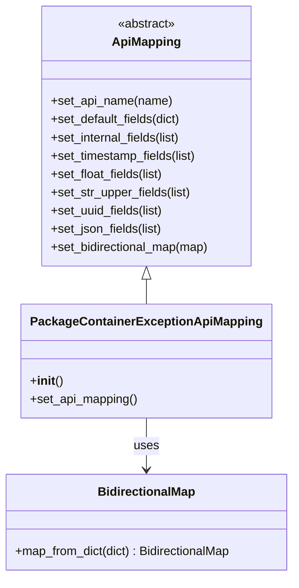

# Diagram: partview_core/partview_service/partview_service/api/package_container/exception/handlers/mapping/PackageContainerExceptionApiMapping.py


> Auto-generated by Obscura crawlers

## Diagram 1



### SVG

<svg id="container" width="392.9140625" xmlns="http://www.w3.org/2000/svg" class="classDiagram" height="758" viewBox="0 0 392.9140625 758" role="graphics-document document" aria-roledescription="class"><style>#container{font-family:"trebuchet ms",verdana,arial,sans-serif;font-size:16px;fill:#333;}@keyframes edge-animation-frame{from{stroke-dashoffset:0;}}@keyframes dash{to{stroke-dashoffset:0;}}#container .edge-animation-slow{stroke-dasharray:9,5!important;stroke-dashoffset:900;animation:dash 50s linear infinite;stroke-linecap:round;}#container .edge-animation-fast{stroke-dasharray:9,5!important;stroke-dashoffset:900;animation:dash 20s linear infinite;stroke-linecap:round;}#container .error-icon{fill:#552222;}#container .error-text{fill:#552222;stroke:#552222;}#container .edge-thickness-normal{stroke-width:1px;}#container .edge-thickness-thick{stroke-width:3.5px;}#container .edge-pattern-solid{stroke-dasharray:0;}#container .edge-thickness-invisible{stroke-width:0;fill:none;}#container .edge-pattern-dashed{stroke-dasharray:3;}#container .edge-pattern-dotted{stroke-dasharray:2;}#container .marker{fill:#333333;stroke:#333333;}#container .marker.cross{stroke:#333333;}#container svg{font-family:"trebuchet ms",verdana,arial,sans-serif;font-size:16px;}#container p{margin:0;}#container g.classGroup text{fill:#9370DB;stroke:none;font-family:"trebuchet ms",verdana,arial,sans-serif;font-size:10px;}#container g.classGroup text .title{font-weight:bolder;}#container .nodeLabel,#container .edgeLabel{color:#131300;}#container .edgeLabel .label rect{fill:#ECECFF;}#container .label text{fill:#131300;}#container .labelBkg{background:#ECECFF;}#container .edgeLabel .label span{background:#ECECFF;}#container .classTitle{font-weight:bolder;}#container .node rect,#container .node circle,#container .node ellipse,#container .node polygon,#container .node path{fill:#ECECFF;stroke:#9370DB;stroke-width:1px;}#container .divider{stroke:#9370DB;stroke-width:1;}#container g.clickable{cursor:pointer;}#container g.classGroup rect{fill:#ECECFF;stroke:#9370DB;}#container g.classGroup line{stroke:#9370DB;stroke-width:1;}#container .classLabel .box{stroke:none;stroke-width:0;fill:#ECECFF;opacity:0.5;}#container .classLabel .label{fill:#9370DB;font-size:10px;}#container .relation{stroke:#333333;stroke-width:1;fill:none;}#container .dashed-line{stroke-dasharray:3;}#container .dotted-line{stroke-dasharray:1 2;}#container #compositionStart,#container .composition{fill:#333333!important;stroke:#333333!important;stroke-width:1;}#container #compositionEnd,#container .composition{fill:#333333!important;stroke:#333333!important;stroke-width:1;}#container #dependencyStart,#container .dependency{fill:#333333!important;stroke:#333333!important;stroke-width:1;}#container #dependencyStart,#container .dependency{fill:#333333!important;stroke:#333333!important;stroke-width:1;}#container #extensionStart,#container .extension{fill:transparent!important;stroke:#333333!important;stroke-width:1;}#container #extensionEnd,#container .extension{fill:transparent!important;stroke:#333333!important;stroke-width:1;}#container #aggregationStart,#container .aggregation{fill:transparent!important;stroke:#333333!important;stroke-width:1;}#container #aggregationEnd,#container .aggregation{fill:transparent!important;stroke:#333333!important;stroke-width:1;}#container #lollipopStart,#container .lollipop{fill:#ECECFF!important;stroke:#333333!important;stroke-width:1;}#container #lollipopEnd,#container .lollipop{fill:#ECECFF!important;stroke:#333333!important;stroke-width:1;}#container .edgeTerminals{font-size:11px;line-height:initial;}#container .classTitleText{text-anchor:middle;font-size:18px;fill:#333;}#container .label-icon{display:inline-block;height:1em;overflow:visible;vertical-align:-0.125em;}#container .node .label-icon path{fill:currentColor;stroke:revert;stroke-width:revert;}#container :root{--mermaid-font-family:"trebuchet ms",verdana,arial,sans-serif;}</style><g><defs><marker id="container_class-aggregationStart" class="marker aggregation class" refX="18" refY="7" markerWidth="190" markerHeight="240" orient="auto"><path d="M 18,7 L9,13 L1,7 L9,1 Z"></path></marker></defs><defs><marker id="container_class-aggregationEnd" class="marker aggregation class" refX="1" refY="7" markerWidth="20" markerHeight="28" orient="auto"><path d="M 18,7 L9,13 L1,7 L9,1 Z"></path></marker></defs><defs><marker id="container_class-extensionStart" class="marker extension class" refX="18" refY="7" markerWidth="190" markerHeight="240" orient="auto"><path d="M 1,7 L18,13 V 1 Z"></path></marker></defs><defs><marker id="container_class-extensionEnd" class="marker extension class" refX="1" refY="7" markerWidth="20" markerHeight="28" orient="auto"><path d="M 1,1 V 13 L18,7 Z"></path></marker></defs><defs><marker id="container_class-compositionStart" class="marker composition class" refX="18" refY="7" markerWidth="190" markerHeight="240" orient="auto"><path d="M 18,7 L9,13 L1,7 L9,1 Z"></path></marker></defs><defs><marker id="container_class-compositionEnd" class="marker composition class" refX="1" refY="7" markerWidth="20" markerHeight="28" orient="auto"><path d="M 18,7 L9,13 L1,7 L9,1 Z"></path></marker></defs><defs><marker id="container_class-dependencyStart" class="marker dependency class" refX="6" refY="7" markerWidth="190" markerHeight="240" orient="auto"><path d="M 5,7 L9,13 L1,7 L9,1 Z"></path></marker></defs><defs><marker id="container_class-dependencyEnd" class="marker dependency class" refX="13" refY="7" markerWidth="20" markerHeight="28" orient="auto"><path d="M 18,7 L9,13 L14,7 L9,1 Z"></path></marker></defs><defs><marker id="container_class-lollipopStart" class="marker lollipop class" refX="13" refY="7" markerWidth="190" markerHeight="240" orient="auto"><circle stroke="black" fill="transparent" cx="7" cy="7" r="6"></circle></marker></defs><defs><marker id="container_class-lollipopEnd" class="marker lollipop class" refX="1" refY="7" markerWidth="190" markerHeight="240" orient="auto"><circle stroke="black" fill="transparent" cx="7" cy="7" r="6"></circle></marker></defs><g class="root"><g class="clusters"></g><g class="edgePaths"><path d="M196.457,367.25L196.457,368.542C196.457,369.833,196.457,372.417,196.457,377.875C196.457,383.333,196.457,391.667,196.457,395.833L196.457,400" id="id_ApiMapping_PackageContainerExceptionApiMapping_1" class="edge-thickness-normal edge-pattern-solid relation" style=";;;" data-edge="true" data-et="edge" data-id="id_ApiMapping_PackageContainerExceptionApiMapping_1" data-points="W3sieCI6MTk2LjQ1NzAzMTI1LCJ5IjozNTB9LHsieCI6MTk2LjQ1NzAzMTI1LCJ5IjozNzV9LHsieCI6MTk2LjQ1NzAzMTI1LCJ5Ijo0MDB9XQ==" marker-start="url(#container_class-extensionStart)"></path><path d="M196.457,550L196.457,556.167C196.457,562.333,196.457,574.667,196.457,586C196.457,597.333,196.457,607.667,196.457,612.833L196.457,618" id="id_PackageContainerExceptionApiMapping_BidirectionalMap_2" class="edge-thickness-normal edge-pattern-solid relation" style=";;;" data-edge="true" data-et="edge" data-id="id_PackageContainerExceptionApiMapping_BidirectionalMap_2" data-points="W3sieCI6MTk2LjQ1NzAzMTI1LCJ5Ijo1NTB9LHsieCI6MTk2LjQ1NzAzMTI1LCJ5Ijo1ODd9LHsieCI6MTk2LjQ1NzAzMTI1LCJ5Ijo2MjR9XQ==" marker-end="url(#container_class-dependencyEnd)"></path></g><g class="edgeLabels"><g class="edgeLabel"><g class="label" data-id="id_ApiMapping_PackageContainerExceptionApiMapping_1" transform="translate(0, 0)"><foreignObject width="0" height="0"><div xmlns="http://www.w3.org/1999/xhtml" class="labelBkg" style="display: table-cell; white-space: nowrap; line-height: 1.5; max-width: 200px; text-align: center;"><span class="edgeLabel"></span></div></foreignObject></g></g><g class="edgeLabel" transform="translate(196.45703125, 587)"><g class="label" data-id="id_PackageContainerExceptionApiMapping_BidirectionalMap_2" transform="translate(-16.4921875, -12)"><foreignObject width="32.984375" height="24"><div xmlns="http://www.w3.org/1999/xhtml" class="labelBkg" style="display: table-cell; white-space: nowrap; line-height: 1.5; max-width: 200px; text-align: center;"><span class="edgeLabel"><p>uses</p></span></div></foreignObject></g></g></g><g class="nodes"><g class="node default" id="classId-ApiMapping-0" transform="translate(196.45703125, 179)"><g class="basic label-container"><path d="M-140.23046875 -171 L140.23046875 -171 L140.23046875 171 L-140.23046875 171" stroke="none" stroke-width="0" fill="#ECECFF" style=""></path><path d="M-140.23046875 -171 C-68.44548673620282 -171, 3.3394952775943523 -171, 140.23046875 -171 M-140.23046875 -171 C-65.676689152372 -171, 8.877090445255988 -171, 140.23046875 -171 M140.23046875 -171 C140.23046875 -93.9806411522858, 140.23046875 -16.961282304571597, 140.23046875 171 M140.23046875 -171 C140.23046875 -67.4642009621335, 140.23046875 36.07159807573299, 140.23046875 171 M140.23046875 171 C39.13058873389973 171, -61.969291282200544 171, -140.23046875 171 M140.23046875 171 C63.886678291195 171, -12.457112167610006 171, -140.23046875 171 M-140.23046875 171 C-140.23046875 93.7376479336829, -140.23046875 16.475295867365787, -140.23046875 -171 M-140.23046875 171 C-140.23046875 38.7388599512573, -140.23046875 -93.5222800974854, -140.23046875 -171" stroke="#9370DB" stroke-width="1.3" fill="none" stroke-dasharray="0 0" style=""></path></g><g class="annotation-group text" transform="translate(-38.609375, -147)"><g class="label" style="" transform="translate(0,-12)"><foreignObject width="77.21875" height="24"><div xmlns="http://www.w3.org/1999/xhtml" style="display: table-cell; white-space: nowrap; line-height: 1.5; max-width: 127px; text-align: center;"><span class="nodeLabel markdown-node-label" style=""><p>«abstract»</p></span></div></foreignObject></g></g><g class="label-group text" transform="translate(-43.2578125, -123)"><g class="label" style="font-weight: bolder" transform="translate(0,-12)"><foreignObject width="86.515625" height="24"><div xmlns="http://www.w3.org/1999/xhtml" style="display: table-cell; white-space: nowrap; line-height: 1.5; max-width: 136px; text-align: center;"><span class="nodeLabel markdown-node-label" style=""><p>ApiMapping</p></span></div></foreignObject></g></g><g class="members-group text" transform="translate(-128.23046875, -75)"></g><g class="methods-group text" transform="translate(-128.23046875, -45)"><g class="label" style="" transform="translate(0,-12)"><foreignObject width="160.390625" height="24"><div xmlns="http://www.w3.org/1999/xhtml" style="display: table-cell; white-space: nowrap; line-height: 1.5; max-width: 218px; text-align: center;"><span class="nodeLabel markdown-node-label" style=""><p>+set_api_name(name)</p></span></div></foreignObject></g><g class="label" style="" transform="translate(0,12)"><foreignObject width="175.171875" height="24"><div xmlns="http://www.w3.org/1999/xhtml" style="display: table-cell; white-space: nowrap; line-height: 1.5; max-width: 233px; text-align: center;"><span class="nodeLabel markdown-node-label" style=""><p>+set_default_fields(dict)</p></span></div></foreignObject></g><g class="label" style="" transform="translate(0,36)"><foreignObject width="175.59375" height="24"><div xmlns="http://www.w3.org/1999/xhtml" style="display: table-cell; white-space: nowrap; line-height: 1.5; max-width: 233px; text-align: center;"><span class="nodeLabel markdown-node-label" style=""><p>+set_internal_fields(list)</p></span></div></foreignObject></g><g class="label" style="" transform="translate(0,60)"><foreignObject width="195.796875" height="24"><div xmlns="http://www.w3.org/1999/xhtml" style="display: table-cell; white-space: nowrap; line-height: 1.5; max-width: 253px; text-align: center;"><span class="nodeLabel markdown-node-label" style=""><p>+set_timestamp_fields(list)</p></span></div></foreignObject></g><g class="label" style="" transform="translate(0,84)"><foreignObject width="151.40625" height="24"><div xmlns="http://www.w3.org/1999/xhtml" style="display: table-cell; white-space: nowrap; line-height: 1.5; max-width: 209px; text-align: center;"><span class="nodeLabel markdown-node-label" style=""><p>+set_float_fields(list)</p></span></div></foreignObject></g><g class="label" style="" transform="translate(0,108)"><foreignObject width="186.75" height="24"><div xmlns="http://www.w3.org/1999/xhtml" style="display: table-cell; white-space: nowrap; line-height: 1.5; max-width: 244px; text-align: center;"><span class="nodeLabel markdown-node-label" style=""><p>+set_str_upper_fields(list)</p></span></div></foreignObject></g><g class="label" style="" transform="translate(0,132)"><foreignObject width="151.046875" height="24"><div xmlns="http://www.w3.org/1999/xhtml" style="display: table-cell; white-space: nowrap; line-height: 1.5; max-width: 208px; text-align: center;"><span class="nodeLabel markdown-node-label" style=""><p>+set_uuid_fields(list)</p></span></div></foreignObject></g><g class="label" style="" transform="translate(0,156)"><foreignObject width="149.90625" height="24"><div xmlns="http://www.w3.org/1999/xhtml" style="display: table-cell; white-space: nowrap; line-height: 1.5; max-width: 207px; text-align: center;"><span class="nodeLabel markdown-node-label" style=""><p>+set_json_fields(list)</p></span></div></foreignObject></g><g class="label" style="" transform="translate(0,180)"><foreignObject width="213.203125" height="24"><div xmlns="http://www.w3.org/1999/xhtml" style="display: table-cell; white-space: nowrap; line-height: 1.5; max-width: 271px; text-align: center;"><span class="nodeLabel markdown-node-label" style=""><p>+set_bidirectional_map(map)</p></span></div></foreignObject></g></g><g class="divider" style=""><path d="M-140.23046875 -99 C-76.94717311064215 -99, -13.663877471284323 -99, 140.23046875 -99 M-140.23046875 -99 C-45.04099629103095 -99, 50.1484761679381 -99, 140.23046875 -99" stroke="#9370DB" stroke-width="1.3" fill="none" stroke-dasharray="0 0" style=""></path></g><g class="divider" style=""><path d="M-140.23046875 -75 C-32.04623198868849 -75, 76.13800477262302 -75, 140.23046875 -75 M-140.23046875 -75 C-84.04752275344507 -75, -27.864576756890116 -75, 140.23046875 -75" stroke="#9370DB" stroke-width="1.3" fill="none" stroke-dasharray="0 0" style=""></path></g></g><g class="node default" id="classId-PackageContainerExceptionApiMapping-1" transform="translate(196.45703125, 475)"><g class="basic label-container"><path d="M-156.40625 -75 L156.40625 -75 L156.40625 75 L-156.40625 75" stroke="none" stroke-width="0" fill="#ECECFF" style=""></path><path d="M-156.40625 -75 C-72.14051024791509 -75, 12.125229504169823 -75, 156.40625 -75 M-156.40625 -75 C-48.043147018272606 -75, 60.31995596345479 -75, 156.40625 -75 M156.40625 -75 C156.40625 -33.767987898740195, 156.40625 7.46402420251961, 156.40625 75 M156.40625 -75 C156.40625 -23.470865285579094, 156.40625 28.05826942884181, 156.40625 75 M156.40625 75 C85.58043876744831 75, 14.754627534896628 75, -156.40625 75 M156.40625 75 C65.84462607325852 75, -24.71699785348295 75, -156.40625 75 M-156.40625 75 C-156.40625 16.160256859048467, -156.40625 -42.67948628190307, -156.40625 -75 M-156.40625 75 C-156.40625 25.25363949493336, -156.40625 -24.49272101013328, -156.40625 -75" stroke="#9370DB" stroke-width="1.3" fill="none" stroke-dasharray="0 0" style=""></path></g><g class="annotation-group text" transform="translate(0, -51)"></g><g class="label-group text" transform="translate(-144.40625, -51)"><g class="label" style="font-weight: bolder" transform="translate(0,-12)"><foreignObject width="288.8125" height="24"><div xmlns="http://www.w3.org/1999/xhtml" style="display: table-cell; white-space: nowrap; line-height: 1.5; max-width: 336px; text-align: center;"><span class="nodeLabel markdown-node-label" style=""><p>PackageContainerExceptionApiMapping</p></span></div></foreignObject></g></g><g class="members-group text" transform="translate(-144.40625, -3)"></g><g class="methods-group text" transform="translate(-144.40625, 27)"><g class="label" style="" transform="translate(0,-12)"><foreignObject width="42.796875" height="24"><div xmlns="http://www.w3.org/1999/xhtml" style="display: table-cell; white-space: nowrap; line-height: 1.5; max-width: 132px; text-align: center;"><span class="nodeLabel markdown-node-label" style=""><p>+<strong>init</strong>()</p></span></div></foreignObject></g><g class="label" style="" transform="translate(0,12)"><foreignObject width="143" height="24"><div xmlns="http://www.w3.org/1999/xhtml" style="display: table-cell; white-space: nowrap; line-height: 1.5; max-width: 200px; text-align: center;"><span class="nodeLabel markdown-node-label" style=""><p>+set_api_mapping()</p></span></div></foreignObject></g></g><g class="divider" style=""><path d="M-156.40625 -27 C-67.11266941473869 -27, 22.18091117052262 -27, 156.40625 -27 M-156.40625 -27 C-55.21448383563519 -27, 45.977282328729615 -27, 156.40625 -27" stroke="#9370DB" stroke-width="1.3" fill="none" stroke-dasharray="0 0" style=""></path></g><g class="divider" style=""><path d="M-156.40625 -3 C-35.7222813202244 -3, 84.9616873595512 -3, 156.40625 -3 M-156.40625 -3 C-39.92046618018145 -3, 76.5653176396371 -3, 156.40625 -3" stroke="#9370DB" stroke-width="1.3" fill="none" stroke-dasharray="0 0" style=""></path></g></g><g class="node default" id="classId-BidirectionalMap-2" transform="translate(196.45703125, 687)"><g class="basic label-container"><path d="M-188.45703125 -63 L188.45703125 -63 L188.45703125 63 L-188.45703125 63" stroke="none" stroke-width="0" fill="#ECECFF" style=""></path><path d="M-188.45703125 -63 C-67.44384214470745 -63, 53.56934696058511 -63, 188.45703125 -63 M-188.45703125 -63 C-43.29252337848703 -63, 101.87198449302593 -63, 188.45703125 -63 M188.45703125 -63 C188.45703125 -37.28973497326159, 188.45703125 -11.579469946523169, 188.45703125 63 M188.45703125 -63 C188.45703125 -19.793702872188767, 188.45703125 23.412594255622466, 188.45703125 63 M188.45703125 63 C103.77157088816087 63, 19.086110526321733 63, -188.45703125 63 M188.45703125 63 C108.48515919870118 63, 28.513287147402366 63, -188.45703125 63 M-188.45703125 63 C-188.45703125 29.104979214800792, -188.45703125 -4.790041570398415, -188.45703125 -63 M-188.45703125 63 C-188.45703125 16.325139683745455, -188.45703125 -30.34972063250909, -188.45703125 -63" stroke="#9370DB" stroke-width="1.3" fill="none" stroke-dasharray="0 0" style=""></path></g><g class="annotation-group text" transform="translate(0, -39)"></g><g class="label-group text" transform="translate(-62.2265625, -39)"><g class="label" style="font-weight: bolder" transform="translate(0,-12)"><foreignObject width="124.453125" height="24"><div xmlns="http://www.w3.org/1999/xhtml" style="display: table-cell; white-space: nowrap; line-height: 1.5; max-width: 173px; text-align: center;"><span class="nodeLabel markdown-node-label" style=""><p>BidirectionalMap</p></span></div></foreignObject></g></g><g class="members-group text" transform="translate(-176.45703125, 9)"></g><g class="methods-group text" transform="translate(-176.45703125, 39)"><g class="label" style="" transform="translate(0,-12)"><foreignObject width="290.6875" height="24"><div xmlns="http://www.w3.org/1999/xhtml" style="display: table-cell; white-space: nowrap; line-height: 1.5; max-width: 348px; text-align: center;"><span class="nodeLabel markdown-node-label" style=""><p>+map_from_dict(dict) : BidirectionalMap</p></span></div></foreignObject></g></g><g class="divider" style=""><path d="M-188.45703125 -15 C-90.41360317260157 -15, 7.6298249047968625 -15, 188.45703125 -15 M-188.45703125 -15 C-41.059663702437064 -15, 106.33770384512587 -15, 188.45703125 -15" stroke="#9370DB" stroke-width="1.3" fill="none" stroke-dasharray="0 0" style=""></path></g><g class="divider" style=""><path d="M-188.45703125 9 C-100.68375587674659 9, -12.910480503493176 9, 188.45703125 9 M-188.45703125 9 C-110.70289747958262 9, -32.948763709165235 9, 188.45703125 9" stroke="#9370DB" stroke-width="1.3" fill="none" stroke-dasharray="0 0" style=""></path></g></g></g></g></g></svg>

## Diagram 2

```mermaid
flowchart TD
    Start([set_api_mapping()])
    A[set_api_name("Package Container Exception")]
    B[set_default_fields({"latitude":0.0,"longitude":0.0})]
    C[set_internal_fields(["solution_id"])]
    D[set_timestamp_fields(["resolved_ts","activation_ts"])]
    E[set_float_fields(["latitude","longitude"])]
    F[set_str_upper_fields(["category"])]
    G[set_uuid_fields(["container_id","exception_type_id"])]
    H[set_json_fields(["location_detail"])]
    I[BidirectionalMap().map_from_dict({...})]
    J[set_bidirectional_map(...)]
    End([return self])

    Start --> A --> B --> C --> D --> E --> F --> G --> H --> I --> J --> End
```

> SVG rendering failed for this diagram.
