# Diagram: partview_core/partview_service/partview_service/api/package_container/exception/handlers/patch_package_container_exception.py

> Auto-generated by Obscura crawlers

## Mermaid

```mermaid
classDiagram
    class PatchContainerExceptionHandler {
        - __container_exception
        - __package_container_id
        - __package_container_exception_id
        - __hold_days:int
        - __data_store:PackageContainerExceptionPostgresqlMapping
        - __helper:PackageContainerHelper
        - __container_exception_helper:PackageContainerExceptionHelper
        - __container_exception_api_mapping:PackageContainerExceptionApiMapping
        + __init__(event)
        + parse_request()
        + validate_parameters()
        + process()
        + format_result()
        + container_exception_from_body()
    }

    class PartViewRequestHandler {
        + get_required_path_parameter(name)
        + get_request_type_path_param()
        + get_solution_id()
        + get_body()
        + set_message_group_id(id)
        + get_http_method()
    }

    class PackageContainerException {
        + id
        + container_id
        + exception_type_id
        + resolved_ts
        + get_dirty_fields()
    }

    class PackageContainerExceptionPostgresqlMapping {
        + read(pkgException):PackageContainerException
        + update(pkgException):PackageContainerException
    }

    class PackageContainerHelper {
        + get_full_container_by_external_id(external_id, solution_id)
    }

    class PackageContainerExceptionHelper {
        + get_exception_category_id(solution_id, category, exception_type_id)
        + get_reason_code_by_exception_type_id(exception_type_id)
    }

    class PackageContainerExceptionApiMapping {
        + set_api_mapping()
    }

    class MapAction {
        + map_persistable_to_payload(mapping, persistable, return_no_nulls)
        + map_request_to_persistable(mapping, request_body, persistable, http_method)
    }

    class FvUuid {
        + is_valid_uuid(value, raise_error=False, error_message=None)
    }

    class Datetime {
        + get_datetime()
    }

    class BadRequestError
    class NotFoundError

    PatchContainerExceptionHandler --|> PartViewRequestHandler
    PatchContainerExceptionHandler --> PackageContainerExceptionPostgresqlMapping : uses
    PatchContainerExceptionHandler --> PackageContainerHelper : uses
    PatchContainerExceptionHandler --> PackageContainerExceptionHelper : uses
    PatchContainerExceptionHandler --> PackageContainerExceptionApiMapping : uses
    PatchContainerExceptionHandler --> MapAction : uses
    PatchContainerExceptionHandler --> FvUuid : validates
    PatchContainerExceptionHandler --> Datetime : computes
    PatchContainerExceptionHandler --> BadRequestError : raises
    PatchContainerExceptionHandler --> NotFoundError : raises
    PackageContainerExceptionPostgresqlMapping --> PackageContainerException : persists
    PackageContainerExceptionHelper --> PackageContainerException : inspects
    PackageContainerExceptionApiMapping --> MapAction : provides mapping
```

### SVG

<svg id="container" width="3925.7265625" xmlns="http://www.w3.org/2000/svg" class="classDiagram" height="1058" viewBox="0 0 3925.7265625 1058" role="graphics-document document" aria-roledescription="class"><g><defs><marker id="container_class-aggregationStart" class="marker aggregation class" refX="18" refY="7" markerWidth="190" markerHeight="240" orient="auto"><path d="M 18,7 L9,13 L1,7 L9,1 Z"></path></marker></defs><defs><marker id="container_class-aggregationEnd" class="marker aggregation class" refX="1" refY="7" markerWidth="20" markerHeight="28" orient="auto"><path d="M 18,7 L9,13 L1,7 L9,1 Z"></path></marker></defs><defs><marker id="container_class-extensionStart" class="marker extension class" refX="18" refY="7" markerWidth="190" markerHeight="240" orient="auto"><path d="M 1,7 L18,13 V 1 Z"></path></marker></defs><defs><marker id="container_class-extensionEnd" class="marker extension class" refX="1" refY="7" markerWidth="20" markerHeight="28" orient="auto"><path d="M 1,1 V 13 L18,7 Z"></path></marker></defs><defs><marker id="container_class-compositionStart" class="marker composition class" refX="18" refY="7" markerWidth="190" markerHeight="240" orient="auto"><path d="M 18,7 L9,13 L1,7 L9,1 Z"></path></marker></defs><defs><marker id="container_class-compositionEnd" class="marker composition class" refX="1" refY="7" markerWidth="20" markerHeight="28" orient="auto"><path d="M 18,7 L9,13 L1,7 L9,1 Z"></path></marker></defs><defs><marker id="container_class-dependencyStart" class="marker dependency class" refX="6" refY="7" markerWidth="190" markerHeight="240" orient="auto"><path d="M 5,7 L9,13 L1,7 L9,1 Z"></path></marker></defs><defs><marker id="container_class-dependencyEnd" class="marker dependency class" refX="13" refY="7" markerWidth="20" markerHeight="28" orient="auto"><path d="M 18,7 L9,13 L14,7 L9,1 Z"></path></marker></defs><defs><marker id="container_class-lollipopStart" class="marker lollipop class" refX="13" refY="7" markerWidth="190" markerHeight="240" orient="auto"><circle stroke="black" fill="transparent" cx="7" cy="7" r="6"></circle></marker></defs><defs><marker id="container_class-lollipopEnd" class="marker lollipop class" refX="1" refY="7" markerWidth="190" markerHeight="240" orient="auto"><circle stroke="black" fill="transparent" cx="7" cy="7" r="6"></circle></marker></defs><g class="root"><g class="clusters"></g><g class="edgePaths"><path d="M2194.145,262.307L1862.805,298.089C1531.466,333.871,868.788,405.436,537.449,444.509C206.109,483.583,206.109,490.167,206.109,493.458L206.109,496.75" id="id_PatchContainerExceptionHandler_PartViewRequestHandler_1" class="edge-thickness-normal edge-pattern-solid relation" style=";;;" data-edge="true" data-et="edge" data-id="id_PatchContainerExceptionHandler_PartViewRequestHandler_1" data-points="W3sieCI6MjE5NC4xNDQ1MzEyNSwieSI6MjYyLjMwNjk4NzEzNjE5OTU1fSx7IngiOjIwNi4xMDkzNzUsInkiOjQ3N30seyJ4IjoyMDYuMTA5Mzc1LCJ5Ijo1MTR9XQ==" marker-end="url(#container_class-extensionEnd)"></path><path d="M2194.145,273.751L1952.623,307.626C1711.102,341.501,1228.059,409.25,986.537,456.292C745.016,503.333,745.016,529.667,745.016,542.833L745.016,556" id="id_PatchContainerExceptionHandler_PackageContainerExceptionPostgresqlMapping_2" class="edge-thickness-normal edge-pattern-solid relation" style=";;;" data-edge="true" data-et="edge" data-id="id_PatchContainerExceptionHandler_PackageContainerExceptionPostgresqlMapping_2" data-points="W3sieCI6MjE5NC4xNDQ1MzEyNSwieSI6MjczLjc1MTM0MzE1NzUzfSx7IngiOjc0NS4wMTU2MjUsInkiOjQ3N30seyJ4Ijo3NDUuMDE1NjI1LCJ5Ijo1NjJ9XQ==" marker-end="url(#container_class-dependencyEnd)"></path><path d="M2194.145,299.67L2055.598,329.225C1917.052,358.78,1639.96,417.89,1501.413,462.612C1362.867,507.333,1362.867,537.667,1362.867,552.833L1362.867,568" id="id_PatchContainerExceptionHandler_PackageContainerHelper_3" class="edge-thickness-normal edge-pattern-solid relation" style=";;;" data-edge="true" data-et="edge" data-id="id_PatchContainerExceptionHandler_PackageContainerHelper_3" data-points="W3sieCI6MjE5NC4xNDQ1MzEyNSwieSI6Mjk5LjY2OTU5NDcxNjk5MzZ9LHsieCI6MTM2Mi44NjcxODc1LCJ5Ijo0Nzd9LHsieCI6MTM2Mi44NjcxODc1LCJ5Ijo1NzR9XQ==" marker-end="url(#container_class-dependencyEnd)"></path><path d="M2194.145,393.297L2164.915,407.247C2135.685,421.198,2077.225,449.099,2047.995,476.216C2018.766,503.333,2018.766,529.667,2018.766,542.833L2018.766,556" id="id_PatchContainerExceptionHandler_PackageContainerExceptionHelper_4" class="edge-thickness-normal edge-pattern-solid relation" style=";;;" data-edge="true" data-et="edge" data-id="id_PatchContainerExceptionHandler_PackageContainerExceptionHelper_4" data-points="W3sieCI6MjE5NC4xNDQ1MzEyNSwieSI6MzkzLjI5NjgxMjkzOTgzMjc2fSx7IngiOjIwMTguNzY1NjI1LCJ5Ijo0Nzd9LHsieCI6MjAxOC43NjU2MjUsInkiOjU2Mn1d" marker-end="url(#container_class-dependencyEnd)"></path><path d="M2903.582,298.105L3046.303,327.92C3189.023,357.736,3474.465,417.368,3617.186,462.351C3759.906,507.333,3759.906,537.667,3759.906,552.833L3759.906,568" id="id_PatchContainerExceptionHandler_PackageContainerExceptionApiMapping_5" class="edge-thickness-normal edge-pattern-solid relation" style=";;;" data-edge="true" data-et="edge" data-id="id_PatchContainerExceptionHandler_PackageContainerExceptionApiMapping_5" data-points="W3sieCI6MjkwMy41ODIwMzEyNSwieSI6Mjk4LjEwNDU5MDg5MDQ3MDgzfSx7IngiOjM3NTkuOTA2MjUsInkiOjQ3N30seyJ4IjozNzU5LjkwNjI1LCJ5Ijo1NzR9XQ==" marker-end="url(#container_class-dependencyEnd)"></path><path d="M2421.003,440L2417.353,446.167C2413.703,452.333,2406.402,464.667,2402.752,497.5C2399.102,530.333,2399.102,583.667,2399.102,637C2399.102,690.333,2399.102,743.667,2456.957,782.663C2514.812,821.659,2630.523,846.318,2688.378,858.647L2746.233,870.977" id="id_PatchContainerExceptionHandler_MapAction_6" class="edge-thickness-normal edge-pattern-solid relation" style=";;;" data-edge="true" data-et="edge" data-id="id_PatchContainerExceptionHandler_MapAction_6" data-points="W3sieCI6MjQyMS4wMDM0NzM5Mzc3NDcsInkiOjQ0MH0seyJ4IjoyMzk5LjEwMTU2MjUsInkiOjQ3N30seyJ4IjoyMzk5LjEwMTU2MjUsInkiOjYzN30seyJ4IjoyMzk5LjEwMTU2MjUsInkiOjc5N30seyJ4IjoyNzUyLjEwMTU2MjUsInkiOjg3Mi4yMjc1NDgwMzg1NTcyfV0=" marker-end="url(#container_class-dependencyEnd)"></path><path d="M2676.723,440L2680.373,446.167C2684.024,452.333,2691.324,464.667,2694.975,486C2698.625,507.333,2698.625,537.667,2698.625,552.833L2698.625,568" id="id_PatchContainerExceptionHandler_FvUuid_7" class="edge-thickness-normal edge-pattern-solid relation" style=";;;" data-edge="true" data-et="edge" data-id="id_PatchContainerExceptionHandler_FvUuid_7" data-points="W3sieCI6MjY3Ni43MjMwODg1NjIyNTMsInkiOjQ0MH0seyJ4IjoyNjk4LjYyNSwieSI6NDc3fSx7IngiOjI2OTguNjI1LCJ5Ijo1NzR9XQ==" marker-end="url(#container_class-dependencyEnd)"></path><path d="M2903.582,391.528L2933.745,405.773C2963.908,420.019,3024.233,448.509,3054.396,477.921C3084.559,507.333,3084.559,537.667,3084.559,552.833L3084.559,568" id="id_PatchContainerExceptionHandler_Datetime_8" class="edge-thickness-normal edge-pattern-solid relation" style=";;;" data-edge="true" data-et="edge" data-id="id_PatchContainerExceptionHandler_Datetime_8" data-points="W3sieCI6MjkwMy41ODIwMzEyNSwieSI6MzkxLjUyNzc3NDk0MjAyOTE3fSx7IngiOjMwODQuNTU4NTkzNzUsInkiOjQ3N30seyJ4IjozMDg0LjU1ODU5Mzc1LCJ5Ijo1NzR9XQ==" marker-end="url(#container_class-dependencyEnd)"></path><path d="M2903.582,343.998L2969.109,366.165C3034.635,388.332,3165.689,432.666,3231.215,473.5C3296.742,514.333,3296.742,551.667,3296.742,570.333L3296.742,589" id="id_PatchContainerExceptionHandler_BadRequestError_9" class="edge-thickness-normal edge-pattern-solid relation" style=";;;" data-edge="true" data-et="edge" data-id="id_PatchContainerExceptionHandler_BadRequestError_9" data-points="W3sieCI6MjkwMy41ODIwMzEyNSwieSI6MzQzLjk5NzgyNzE4ODM1MDM2fSx7IngiOjMyOTYuNzQyMTg3NSwieSI6NDc3fSx7IngiOjMyOTYuNzQyMTg3NSwieSI6NTk1fV0=" marker-end="url(#container_class-dependencyEnd)"></path><path d="M2903.582,319.707L3000.744,345.923C3097.906,372.138,3292.23,424.569,3389.393,469.451C3486.555,514.333,3486.555,551.667,3486.555,570.333L3486.555,589" id="id_PatchContainerExceptionHandler_NotFoundError_10" class="edge-thickness-normal edge-pattern-solid relation" style=";;;" data-edge="true" data-et="edge" data-id="id_PatchContainerExceptionHandler_NotFoundError_10" data-points="W3sieCI6MjkwMy41ODIwMzEyNSwieSI6MzE5LjcwNzIyNjQ0MTI2ODIzfSx7IngiOjM0ODYuNTU0Njg3NSwieSI6NDc3fSx7IngiOjM0ODYuNTU0Njg3NSwieSI6NTk1fV0=" marker-end="url(#container_class-dependencyEnd)"></path><path d="M745.016,712L745.016,726.167C745.016,740.333,745.016,768.667,827.686,801.655C910.356,834.644,1075.696,872.287,1158.366,891.109L1241.036,909.931" id="id_PackageContainerExceptionPostgresqlMapping_PackageContainerException_11" class="edge-thickness-normal edge-pattern-solid relation" style=";;;" data-edge="true" data-et="edge" data-id="id_PackageContainerExceptionPostgresqlMapping_PackageContainerException_11" data-points="W3sieCI6NzQ1LjAxNTYyNSwieSI6NzEyfSx7IngiOjc0NS4wMTU2MjUsInkiOjc5N30seyJ4IjoxMjQ2Ljg4NjcxODc1LCJ5Ijo5MTEuMjYzMDk0OTQ2MDI1NX1d" marker-end="url(#container_class-dependencyEnd)"></path><path d="M2018.766,712L2018.766,726.167C2018.766,740.333,2018.766,768.667,1936.095,801.655C1853.425,834.644,1688.085,872.287,1605.415,891.109L1522.745,909.931" id="id_PackageContainerExceptionHelper_PackageContainerException_12" class="edge-thickness-normal edge-pattern-solid relation" style=";;;" data-edge="true" data-et="edge" data-id="id_PackageContainerExceptionHelper_PackageContainerException_12" data-points="W3sieCI6MjAxOC43NjU2MjUsInkiOjcxMn0seyJ4IjoyMDE4Ljc2NTYyNSwieSI6Nzk3fSx7IngiOjE1MTYuODk0NTMxMjUsInkiOjkxMS4yNjMwOTQ5NDYwMjU1fV0=" marker-end="url(#container_class-dependencyEnd)"></path><path d="M3759.906,700L3759.906,716.167C3759.906,732.333,3759.906,764.667,3702.051,793.163C3644.196,821.659,3528.485,846.318,3470.63,858.647L3412.774,870.977" id="id_PackageContainerExceptionApiMapping_MapAction_13" class="edge-thickness-normal edge-pattern-solid relation" style=";;;" data-edge="true" data-et="edge" data-id="id_PackageContainerExceptionApiMapping_MapAction_13" data-points="W3sieCI6Mzc1OS45MDYyNSwieSI6NzAwfSx7IngiOjM3NTkuOTA2MjUsInkiOjc5N30seyJ4IjozNDA2LjkwNjI1LCJ5Ijo4NzIuMjI3NTQ4MDM4NTU3Mn1d" marker-end="url(#container_class-dependencyEnd)"></path></g><g class="edgeLabels"><g class="edgeLabel"><g class="label" data-id="id_PatchContainerExceptionHandler_PartViewRequestHandler_1" transform="translate(0, 0)"><foreignObject width="0" height="0">

</foreignObject></g></g><g class="edgeLabel" transform="translate(745.015625, 477)"><g class="label" data-id="id_PatchContainerExceptionHandler_PackageContainerExceptionPostgresqlMapping_2" transform="translate(-16.4921875, -12)"><foreignObject width="32.984375" height="24">

uses

</foreignObject></g></g><g class="edgeLabel" transform="translate(1362.8671875, 477)"><g class="label" data-id="id_PatchContainerExceptionHandler_PackageContainerHelper_3" transform="translate(-16.4921875, -12)"><foreignObject width="32.984375" height="24">

uses

</foreignObject></g></g><g class="edgeLabel" transform="translate(2018.765625, 477)"><g class="label" data-id="id_PatchContainerExceptionHandler_PackageContainerExceptionHelper_4" transform="translate(-16.4921875, -12)"><foreignObject width="32.984375" height="24">

uses

</foreignObject></g></g><g class="edgeLabel" transform="translate(3759.90625, 477)"><g class="label" data-id="id_PatchContainerExceptionHandler_PackageContainerExceptionApiMapping_5" transform="translate(-16.4921875, -12)"><foreignObject width="32.984375" height="24">

uses

</foreignObject></g></g><g class="edgeLabel" transform="translate(2399.1015625, 637)"><g class="label" data-id="id_PatchContainerExceptionHandler_MapAction_6" transform="translate(-16.4921875, -12)"><foreignObject width="32.984375" height="24">

uses

</foreignObject></g></g><g class="edgeLabel" transform="translate(2698.625, 477)"><g class="label" data-id="id_PatchContainerExceptionHandler_FvUuid_7" transform="translate(-32.6875, -12)"><foreignObject width="65.375" height="24">

validates

</foreignObject></g></g><g class="edgeLabel" transform="translate(3084.55859375, 477)"><g class="label" data-id="id_PatchContainerExceptionHandler_Datetime_8" transform="translate(-35.46875, -12)"><foreignObject width="70.9375" height="24">

computes

</foreignObject></g></g><g class="edgeLabel" transform="translate(3296.7421875, 477)"><g class="label" data-id="id_PatchContainerExceptionHandler_BadRequestError_9" transform="translate(-21.25, -12)"><foreignObject width="42.5" height="24">

raises

</foreignObject></g></g><g class="edgeLabel" transform="translate(3486.5546875, 477)"><g class="label" data-id="id_PatchContainerExceptionHandler_NotFoundError_10" transform="translate(-21.25, -12)"><foreignObject width="42.5" height="24">

raises

</foreignObject></g></g><g class="edgeLabel" transform="translate(745.015625, 797)"><g class="label" data-id="id_PackageContainerExceptionPostgresqlMapping_PackageContainerException_11" transform="translate(-28.4375, -12)"><foreignObject width="56.875" height="24">

persists

</foreignObject></g></g><g class="edgeLabel" transform="translate(2018.765625, 797)"><g class="label" data-id="id_PackageContainerExceptionHelper_PackageContainerException_12" transform="translate(-30.2421875, -12)"><foreignObject width="60.484375" height="24">

inspects

</foreignObject></g></g><g class="edgeLabel" transform="translate(3759.90625, 797)"><g class="label" data-id="id_PackageContainerExceptionApiMapping_MapAction_13" transform="translate(-65.25, -12)"><foreignObject width="130.5" height="24">

provides mapping

</foreignObject></g></g></g><g class="nodes"><g class="node default" id="classId-PatchContainerExceptionHandler-0" transform="translate(2548.86328125, 224)"><g class="basic label-container"><path d="M-354.71875 -216 L354.71875 -216 L354.71875 216 L-354.71875 216" stroke="none" stroke-width="0" fill="#ECECFF" style=""></path><path d="M-354.71875 -216 C-76.20703689276326 -216, 202.3046762144735 -216, 354.71875 -216 M-354.71875 -216 C-166.61795791672307 -216, 21.482834166553857 -216, 354.71875 -216 M354.71875 -216 C354.71875 -113.02815670083325, 354.71875 -10.0563134016665, 354.71875 216 M354.71875 -216 C354.71875 -50.352886426825705, 354.71875 115.29422714634859, 354.71875 216 M354.71875 216 C161.27597780545403 216, -32.16679438909193 216, -354.71875 216 M354.71875 216 C200.41134192571187 216, 46.10393385142373 216, -354.71875 216 M-354.71875 216 C-354.71875 78.12753664347417, -354.71875 -59.744926713051655, -354.71875 -216 M-354.71875 216 C-354.71875 59.244736115866516, -354.71875 -97.51052776826697, -354.71875 -216" stroke="#9370DB" stroke-width="1.3" fill="none" stroke-dasharray="0 0" style=""></path></g><g class="annotation-group text" transform="translate(0, -192)"></g><g class="label-group text" transform="translate(-120.546875, -192)"><g class="label" style="font-weight: bolder" transform="translate(0,-12)"><foreignObject width="241.09375" height="24">

PatchContainerExceptionHandler

</foreignObject></g></g><g class="members-group text" transform="translate(-342.71875, -144)"><g class="label" style="" transform="translate(0,-12)"><foreignObject width="173.53125" height="24">

- __container_exception

</foreignObject></g><g class="label" style="" transform="translate(0,12)"><foreignObject width="184.15625" height="24">

- __package_container_id

</foreignObject></g><g class="label" style="" transform="translate(0,36)"><foreignObject width="262.90625" height="24">

- __package_container_exception_id

</foreignObject></g><g class="label" style="" transform="translate(0,60)"><foreignObject width="124.84375" height="24">

- __hold_days:int

</foreignObject></g><g class="label" style="" transform="translate(0,84)"><foreignObject width="445.71875" height="24">

- __data_store:PackageContainerExceptionPostgresqlMapping

</foreignObject></g><g class="label" style="" transform="translate(0,108)"><foreignObject width="255.609375" height="24">

- __helper:PackageContainerHelper

</foreignObject></g><g class="label" style="" transform="translate(0,132)"><foreignObject width="481.015625" height="24">

- __container_exception_helper:PackageContainerExceptionHelper

</foreignObject></g><g class="label" style="" transform="translate(0,156)"><foreignObject width="564.890625" height="24">

- __container_exception_api_mapping:PackageContainerExceptionApiMapping

</foreignObject></g></g><g class="methods-group text" transform="translate(-342.71875, 72)"><g class="label" style="" transform="translate(0,-12)"><foreignObject width="87.390625" height="24">

+ <strong>init</strong>(event)

</foreignObject></g><g class="label" style="" transform="translate(0,12)"><foreignObject width="126.046875" height="24">

+ parse_request()

</foreignObject></g><g class="label" style="" transform="translate(0,36)"><foreignObject width="170.953125" height="24">

+ validate_parameters()

</foreignObject></g><g class="label" style="" transform="translate(0,60)"><foreignObject width="77.96875" height="24">

+ process()

</foreignObject></g><g class="label" style="" transform="translate(0,84)"><foreignObject width="121.5" height="24">

+ format_result()

</foreignObject></g><g class="label" style="" transform="translate(0,108)"><foreignObject width="256" height="24">

+ container_exception_from_body()

</foreignObject></g></g><g class="divider" style=""><path d="M-354.71875 -168 C-87.6125745532064 -168, 179.4936008935872 -168, 354.71875 -168 M-354.71875 -168 C-150.15218593494635 -168, 54.41437813010731 -168, 354.71875 -168" stroke="#9370DB" stroke-width="1.3" fill="none" stroke-dasharray="0 0" style=""></path></g><g class="divider" style=""><path d="M-354.71875 48 C-103.0062785113868 48, 148.7061929772264 48, 354.71875 48 M-354.71875 48 C-196.85621342839178 48, -38.993676856783566 48, 354.71875 48" stroke="#9370DB" stroke-width="1.3" fill="none" stroke-dasharray="0 0" style=""></path></g></g><g class="node default" id="classId-PartViewRequestHandler-1" transform="translate(206.109375, 637)"><g class="basic label-container"><path d="M-198.109375 -123 L198.109375 -123 L198.109375 123 L-198.109375 123" stroke="none" stroke-width="0" fill="#ECECFF" style=""></path><path d="M-198.109375 -123 C-101.88666279429145 -123, -5.663950588582907 -123, 198.109375 -123 M-198.109375 -123 C-77.42354037679216 -123, 43.26229424641568 -123, 198.109375 -123 M198.109375 -123 C198.109375 -66.68931251557339, 198.109375 -10.378625031146768, 198.109375 123 M198.109375 -123 C198.109375 -32.28737251218074, 198.109375 58.42525497563852, 198.109375 123 M198.109375 123 C76.24312979754231 123, -45.62311540491538 123, -198.109375 123 M198.109375 123 C78.17902965686224 123, -41.75131568627552 123, -198.109375 123 M-198.109375 123 C-198.109375 28.676981667160092, -198.109375 -65.64603666567982, -198.109375 -123 M-198.109375 123 C-198.109375 49.23938591799012, -198.109375 -24.52122816401976, -198.109375 -123" stroke="#9370DB" stroke-width="1.3" fill="none" stroke-dasharray="0 0" style=""></path></g><g class="annotation-group text" transform="translate(0, -99)"></g><g class="label-group text" transform="translate(-91.359375, -99)"><g class="label" style="font-weight: bolder" transform="translate(0,-12)"><foreignObject width="182.71875" height="24">

PartViewRequestHandler

</foreignObject></g></g><g class="members-group text" transform="translate(-186.109375, -51)"></g><g class="methods-group text" transform="translate(-186.109375, -21)"><g class="label" style="" transform="translate(0,-12)"><foreignObject width="280.859375" height="24">

+ get_required_path_parameter(name)

</foreignObject></g><g class="label" style="" transform="translate(0,12)"><foreignObject width="244.140625" height="24">

+ get_request_type_path_param()

</foreignObject></g><g class="label" style="" transform="translate(0,36)"><foreignObject width="135.703125" height="24">

+ get_solution_id()

</foreignObject></g><g class="label" style="" transform="translate(0,60)"><foreignObject width="89.765625" height="24">

+ get_body()

</foreignObject></g><g class="label" style="" transform="translate(0,84)"><foreignObject width="201.75" height="24">

+ set_message_group_id(id)

</foreignObject></g><g class="label" style="" transform="translate(0,108)"><foreignObject width="148.40625" height="24">

+ get_http_method()

</foreignObject></g></g><g class="divider" style=""><path d="M-198.109375 -75 C-69.22373406396736 -75, 59.66190687206529 -75, 198.109375 -75 M-198.109375 -75 C-116.80834238511967 -75, -35.507309770239345 -75, 198.109375 -75" stroke="#9370DB" stroke-width="1.3" fill="none" stroke-dasharray="0 0" style=""></path></g><g class="divider" style=""><path d="M-198.109375 -51 C-99.86891108481161 -51, -1.6284471696232288 -51, 198.109375 -51 M-198.109375 -51 C-114.58987994875001 -51, -31.07038489750002 -51, 198.109375 -51" stroke="#9370DB" stroke-width="1.3" fill="none" stroke-dasharray="0 0" style=""></path></g></g><g class="node default" id="classId-PackageContainerException-2" transform="translate(1381.890625, 942)"><g class="basic label-container"><path d="M-135.00390625 -108 L135.00390625 -108 L135.00390625 108 L-135.00390625 108" stroke="none" stroke-width="0" fill="#ECECFF" style=""></path><path d="M-135.00390625 -108 C-64.64793667048012 -108, 5.708032909039758 -108, 135.00390625 -108 M-135.00390625 -108 C-28.696425200622983 -108, 77.61105584875403 -108, 135.00390625 -108 M135.00390625 -108 C135.00390625 -41.644014928649426, 135.00390625 24.711970142701148, 135.00390625 108 M135.00390625 -108 C135.00390625 -44.33593921572725, 135.00390625 19.328121568545498, 135.00390625 108 M135.00390625 108 C55.31622131084053 108, -24.371463628318935 108, -135.00390625 108 M135.00390625 108 C54.377833872052946 108, -26.248238505894108 108, -135.00390625 108 M-135.00390625 108 C-135.00390625 28.96617490207484, -135.00390625 -50.06765019585032, -135.00390625 -108 M-135.00390625 108 C-135.00390625 64.04521822645698, -135.00390625 20.090436452913963, -135.00390625 -108" stroke="#9370DB" stroke-width="1.3" fill="none" stroke-dasharray="0 0" style=""></path></g><g class="annotation-group text" transform="translate(0, -84)"></g><g class="label-group text" transform="translate(-101.1484375, -84)"><g class="label" style="font-weight: bolder" transform="translate(0,-12)"><foreignObject width="202.296875" height="24">

PackageContainerException

</foreignObject></g></g><g class="members-group text" transform="translate(-123.00390625, -36)"><g class="label" style="" transform="translate(0,-12)"><foreignObject width="26.3125" height="24">

+ id

</foreignObject></g><g class="label" style="" transform="translate(0,12)"><foreignObject width="102.546875" height="24">

+ container_id

</foreignObject></g><g class="label" style="" transform="translate(0,36)"><foreignObject width="144.859375" height="24">

+ exception_type_id

</foreignObject></g><g class="label" style="" transform="translate(0,60)"><foreignObject width="95.34375" height="24">

+ resolved_ts

</foreignObject></g></g><g class="methods-group text" transform="translate(-123.00390625, 84)"><g class="label" style="" transform="translate(0,-12)"><foreignObject width="134.078125" height="24">

+ get_dirty_fields()

</foreignObject></g></g><g class="divider" style=""><path d="M-135.00390625 -60 C-77.22513410423309 -60, -19.446361958466184 -60, 135.00390625 -60 M-135.00390625 -60 C-37.17386110434464 -60, 60.65618404131072 -60, 135.00390625 -60" stroke="#9370DB" stroke-width="1.3" fill="none" stroke-dasharray="0 0" style=""></path></g><g class="divider" style=""><path d="M-135.00390625 60 C-55.847560232109345 60, 23.30878578578131 60, 135.00390625 60 M-135.00390625 60 C-31.330017046019677 60, 72.34387215796065 60, 135.00390625 60" stroke="#9370DB" stroke-width="1.3" fill="none" stroke-dasharray="0 0" style=""></path></g></g><g class="node default" id="classId-PackageContainerExceptionPostgresqlMapping-3" transform="translate(745.015625, 637)"><g class="basic label-container"><path d="M-290.796875 -75 L290.796875 -75 L290.796875 75 L-290.796875 75" stroke="none" stroke-width="0" fill="#ECECFF" style=""></path><path d="M-290.796875 -75 C-90.98770185157241 -75, 108.82147129685518 -75, 290.796875 -75 M-290.796875 -75 C-104.50290267015043 -75, 81.79106965969913 -75, 290.796875 -75 M290.796875 -75 C290.796875 -44.55658747774433, 290.796875 -14.113174955488653, 290.796875 75 M290.796875 -75 C290.796875 -28.084981043645712, 290.796875 18.830037912708576, 290.796875 75 M290.796875 75 C74.35478717269001 75, -142.08730065461998 75, -290.796875 75 M290.796875 75 C100.341687257368 75, -90.11350048526401 75, -290.796875 75 M-290.796875 75 C-290.796875 38.93775824333212, -290.796875 2.875516486664239, -290.796875 -75 M-290.796875 75 C-290.796875 19.062482950419636, -290.796875 -36.87503409916073, -290.796875 -75" stroke="#9370DB" stroke-width="1.3" fill="none" stroke-dasharray="0 0" style=""></path></g><g class="annotation-group text" transform="translate(0, -51)"></g><g class="label-group text" transform="translate(-171.546875, -51)"><g class="label" style="font-weight: bolder" transform="translate(0,-12)"><foreignObject width="343.09375" height="24">

PackageContainerExceptionPostgresqlMapping

</foreignObject></g></g><g class="members-group text" transform="translate(-278.796875, -3)"></g><g class="methods-group text" transform="translate(-278.796875, 27)"><g class="label" style="" transform="translate(0,-12)"><foreignObject width="367.21875" height="24">

+ read(pkgException) : :PackageContainerException

</foreignObject></g><g class="label" style="" transform="translate(0,12)"><foreignObject width="386.046875" height="24">

+ update(pkgException) : :PackageContainerException

</foreignObject></g></g><g class="divider" style=""><path d="M-290.796875 -27 C-72.29475434035862 -27, 146.20736631928276 -27, 290.796875 -27 M-290.796875 -27 C-60.66407864349162 -27, 169.46871771301676 -27, 290.796875 -27" stroke="#9370DB" stroke-width="1.3" fill="none" stroke-dasharray="0 0" style=""></path></g><g class="divider" style=""><path d="M-290.796875 -3 C-96.64254385637531 -3, 97.51178728724938 -3, 290.796875 -3 M-290.796875 -3 C-159.55347575704434 -3, -28.310076514088678 -3, 290.796875 -3" stroke="#9370DB" stroke-width="1.3" fill="none" stroke-dasharray="0 0" style=""></path></g></g><g class="node default" id="classId-PackageContainerHelper-4" transform="translate(1362.8671875, 637)"><g class="basic label-container"><path d="M-277.0546875 -63 L277.0546875 -63 L277.0546875 63 L-277.0546875 63" stroke="none" stroke-width="0" fill="#ECECFF" style=""></path><path d="M-277.0546875 -63 C-153.5695584210539 -63, -30.084429342107796 -63, 277.0546875 -63 M-277.0546875 -63 C-107.11599959862224 -63, 62.82268830275552 -63, 277.0546875 -63 M277.0546875 -63 C277.0546875 -34.48951342827826, 277.0546875 -5.979026856556509, 277.0546875 63 M277.0546875 -63 C277.0546875 -23.5869273076842, 277.0546875 15.826145384631602, 277.0546875 63 M277.0546875 63 C118.40016122838955 63, -40.2543650432209 63, -277.0546875 63 M277.0546875 63 C147.29245628294882 63, 17.53022506589764 63, -277.0546875 63 M-277.0546875 63 C-277.0546875 35.53271103892361, -277.0546875 8.065422077847217, -277.0546875 -63 M-277.0546875 63 C-277.0546875 28.61047419709213, -277.0546875 -5.779051605815738, -277.0546875 -63" stroke="#9370DB" stroke-width="1.3" fill="none" stroke-dasharray="0 0" style=""></path></g><g class="annotation-group text" transform="translate(0, -39)"></g><g class="label-group text" transform="translate(-89.96875, -39)"><g class="label" style="font-weight: bolder" transform="translate(0,-12)"><foreignObject width="179.9375" height="24">

PackageContainerHelper

</foreignObject></g></g><g class="members-group text" transform="translate(-265.0546875, 9)"></g><g class="methods-group text" transform="translate(-265.0546875, 39)"><g class="label" style="" transform="translate(0,-12)"><foreignObject width="440.140625" height="24">

+ get_full_container_by_external_id(external_id, solution_id)

</foreignObject></g></g><g class="divider" style=""><path d="M-277.0546875 -15 C-86.6074733004518 -15, 103.8397408990964 -15, 277.0546875 -15 M-277.0546875 -15 C-124.2554220359624 -15, 28.543843428075206 -15, 277.0546875 -15" stroke="#9370DB" stroke-width="1.3" fill="none" stroke-dasharray="0 0" style=""></path></g><g class="divider" style=""><path d="M-277.0546875 9 C-56.55322452716197 9, 163.94823844567605 9, 277.0546875 9 M-277.0546875 9 C-74.69861840812226 9, 127.65745068375548 9, 277.0546875 9" stroke="#9370DB" stroke-width="1.3" fill="none" stroke-dasharray="0 0" style=""></path></g></g><g class="node default" id="classId-PackageContainerExceptionHelper-5" transform="translate(2018.765625, 637)"><g class="basic label-container"><path d="M-328.84375 -75 L328.84375 -75 L328.84375 75 L-328.84375 75" stroke="none" stroke-width="0" fill="#ECECFF" style=""></path><path d="M-328.84375 -75 C-91.98970761395495 -75, 144.8643347720901 -75, 328.84375 -75 M-328.84375 -75 C-156.53314563165014 -75, 15.777458736699714 -75, 328.84375 -75 M328.84375 -75 C328.84375 -17.211087648516063, 328.84375 40.577824702967874, 328.84375 75 M328.84375 -75 C328.84375 -26.046667510096377, 328.84375 22.906664979807246, 328.84375 75 M328.84375 75 C191.2095931122699 75, 53.57543622453983 75, -328.84375 75 M328.84375 75 C109.33263312079325 75, -110.1784837584135 75, -328.84375 75 M-328.84375 75 C-328.84375 19.45138349374006, -328.84375 -36.09723301251988, -328.84375 -75 M-328.84375 75 C-328.84375 30.571090367020012, -328.84375 -13.857819265959975, -328.84375 -75" stroke="#9370DB" stroke-width="1.3" fill="none" stroke-dasharray="0 0" style=""></path></g><g class="annotation-group text" transform="translate(0, -51)"></g><g class="label-group text" transform="translate(-125.671875, -51)"><g class="label" style="font-weight: bolder" transform="translate(0,-12)"><foreignObject width="251.34375" height="24">

PackageContainerExceptionHelper

</foreignObject></g></g><g class="members-group text" transform="translate(-316.84375, -3)"></g><g class="methods-group text" transform="translate(-316.84375, 27)"><g class="label" style="" transform="translate(0,-12)"><foreignObject width="508.015625" height="24">

+ get_exception_category_id(solution_id, category, exception_type_id)

</foreignObject></g><g class="label" style="" transform="translate(0,12)"><foreignObject width="443.515625" height="24">

+ get_reason_code_by_exception_type_id(exception_type_id)

</foreignObject></g></g><g class="divider" style=""><path d="M-328.84375 -27 C-167.30987855148106 -27, -5.776007102962126 -27, 328.84375 -27 M-328.84375 -27 C-156.4293355083188 -27, 15.985078983362428 -27, 328.84375 -27" stroke="#9370DB" stroke-width="1.3" fill="none" stroke-dasharray="0 0" style=""></path></g><g class="divider" style=""><path d="M-328.84375 -3 C-82.37193771866467 -3, 164.09987456267066 -3, 328.84375 -3 M-328.84375 -3 C-183.7584753024386 -3, -38.673200604877195 -3, 328.84375 -3" stroke="#9370DB" stroke-width="1.3" fill="none" stroke-dasharray="0 0" style=""></path></g></g><g class="node default" id="classId-PackageContainerExceptionApiMapping-6" transform="translate(3759.90625, 637)"><g class="basic label-container"><path d="M-157.8203125 -63 L157.8203125 -63 L157.8203125 63 L-157.8203125 63" stroke="none" stroke-width="0" fill="#ECECFF" style=""></path><path d="M-157.8203125 -63 C-67.04280482574796 -63, 23.73470284850407 -63, 157.8203125 -63 M-157.8203125 -63 C-44.38279264579788 -63, 69.05472720840424 -63, 157.8203125 -63 M157.8203125 -63 C157.8203125 -30.375871102645675, 157.8203125 2.2482577947086497, 157.8203125 63 M157.8203125 -63 C157.8203125 -25.976512445037564, 157.8203125 11.046975109924873, 157.8203125 63 M157.8203125 63 C36.82970134048169 63, -84.16090981903662 63, -157.8203125 63 M157.8203125 63 C89.28323654342525 63, 20.746160586850493 63, -157.8203125 63 M-157.8203125 63 C-157.8203125 19.22939541050153, -157.8203125 -24.541209178996937, -157.8203125 -63 M-157.8203125 63 C-157.8203125 29.541954152221827, -157.8203125 -3.9160916955563465, -157.8203125 -63" stroke="#9370DB" stroke-width="1.3" fill="none" stroke-dasharray="0 0" style=""></path></g><g class="annotation-group text" transform="translate(0, -39)"></g><g class="label-group text" transform="translate(-144.40625, -39)"><g class="label" style="font-weight: bolder" transform="translate(0,-12)"><foreignObject width="288.8125" height="24">

PackageContainerExceptionApiMapping

</foreignObject></g></g><g class="members-group text" transform="translate(-145.8203125, 9)"></g><g class="methods-group text" transform="translate(-145.8203125, 39)"><g class="label" style="" transform="translate(0,-12)"><foreignObject width="147.234375" height="24">

+ set_api_mapping()

</foreignObject></g></g><g class="divider" style=""><path d="M-157.8203125 -15 C-83.740003636964 -15, -9.65969477392801 -15, 157.8203125 -15 M-157.8203125 -15 C-80.72664015442598 -15, -3.6329678088519586 -15, 157.8203125 -15" stroke="#9370DB" stroke-width="1.3" fill="none" stroke-dasharray="0 0" style=""></path></g><g class="divider" style=""><path d="M-157.8203125 9 C-91.4113401084539 9, -25.0023677169078 9, 157.8203125 9 M-157.8203125 9 C-79.64749184892969 9, -1.4746711978593794 9, 157.8203125 9" stroke="#9370DB" stroke-width="1.3" fill="none" stroke-dasharray="0 0" style=""></path></g></g><g class="node default" id="classId-MapAction-7" transform="translate(3079.50390625, 942)"><g class="basic label-container"><path d="M-327.40234375 -75 L327.40234375 -75 L327.40234375 75 L-327.40234375 75" stroke="none" stroke-width="0" fill="#ECECFF" style=""></path><path d="M-327.40234375 -75 C-119.22560029199428 -75, 88.95114316601143 -75, 327.40234375 -75 M-327.40234375 -75 C-74.88258736756401 -75, 177.63716901487197 -75, 327.40234375 -75 M327.40234375 -75 C327.40234375 -27.226300283940404, 327.40234375 20.547399432119192, 327.40234375 75 M327.40234375 -75 C327.40234375 -16.478553417602015, 327.40234375 42.04289316479597, 327.40234375 75 M327.40234375 75 C69.89766303018547 75, -187.60701768962906 75, -327.40234375 75 M327.40234375 75 C115.37125749330525 75, -96.6598287633895 75, -327.40234375 75 M-327.40234375 75 C-327.40234375 33.185011498310736, -327.40234375 -8.629977003378528, -327.40234375 -75 M-327.40234375 75 C-327.40234375 37.3871620736566, -327.40234375 -0.22567585268680546, -327.40234375 -75" stroke="#9370DB" stroke-width="1.3" fill="none" stroke-dasharray="0 0" style=""></path></g><g class="annotation-group text" transform="translate(0, -51)"></g><g class="label-group text" transform="translate(-38.6328125, -51)"><g class="label" style="font-weight: bolder" transform="translate(0,-12)"><foreignObject width="77.265625" height="24">

MapAction

</foreignObject></g></g><g class="members-group text" transform="translate(-315.40234375, -3)"></g><g class="methods-group text" transform="translate(-315.40234375, 27)"><g class="label" style="" transform="translate(0,-12)"><foreignObject width="507.71875" height="24">

+ map_persistable_to_payload(mapping, persistable, return_no_nulls)

</foreignObject></g><g class="label" style="" transform="translate(0,12)"><foreignObject width="592.171875" height="24">

+ map_request_to_persistable(mapping, request_body, persistable, http_method)

</foreignObject></g></g><g class="divider" style=""><path d="M-327.40234375 -27 C-168.36526807269132 -27, -9.328192395382644 -27, 327.40234375 -27 M-327.40234375 -27 C-168.7625780640362 -27, -10.12281237807241 -27, 327.40234375 -27" stroke="#9370DB" stroke-width="1.3" fill="none" stroke-dasharray="0 0" style=""></path></g><g class="divider" style=""><path d="M-327.40234375 -3 C-72.006686619182 -3, 183.388970511636 -3, 327.40234375 -3 M-327.40234375 -3 C-139.06495924333728 -3, 49.27242526332543 -3, 327.40234375 -3" stroke="#9370DB" stroke-width="1.3" fill="none" stroke-dasharray="0 0" style=""></path></g></g><g class="node default" id="classId-FvUuid-8" transform="translate(2698.625, 637)"><g class="basic label-container"><path d="M-248.03125 -63 L248.03125 -63 L248.03125 63 L-248.03125 63" stroke="none" stroke-width="0" fill="#ECECFF" style=""></path><path d="M-248.03125 -63 C-54.73302897884432 -63, 138.56519204231137 -63, 248.03125 -63 M-248.03125 -63 C-143.83967722194012 -63, -39.64810444388024 -63, 248.03125 -63 M248.03125 -63 C248.03125 -34.75959809970962, 248.03125 -6.519196199419241, 248.03125 63 M248.03125 -63 C248.03125 -30.189353945060894, 248.03125 2.621292109878212, 248.03125 63 M248.03125 63 C135.73335379905876 63, 23.435457598117523 63, -248.03125 63 M248.03125 63 C102.491865944354 63, -43.04751811129199 63, -248.03125 63 M-248.03125 63 C-248.03125 17.716812009345134, -248.03125 -27.566375981309733, -248.03125 -63 M-248.03125 63 C-248.03125 34.83398064640198, -248.03125 6.667961292803973, -248.03125 -63" stroke="#9370DB" stroke-width="1.3" fill="none" stroke-dasharray="0 0" style=""></path></g><g class="annotation-group text" transform="translate(0, -39)"></g><g class="label-group text" transform="translate(-24.5625, -39)"><g class="label" style="font-weight: bolder" transform="translate(0,-12)"><foreignObject width="49.125" height="24">

FvUuid

</foreignObject></g></g><g class="members-group text" transform="translate(-236.03125, 9)"></g><g class="methods-group text" transform="translate(-236.03125, 39)"><g class="label" style="" transform="translate(0,-12)"><foreignObject width="447.5" height="24">

+ is_valid_uuid(value, raise_error=False, error_message=None)

</foreignObject></g></g><g class="divider" style=""><path d="M-248.03125 -15 C-105.14011182030927 -15, 37.751026359381456 -15, 248.03125 -15 M-248.03125 -15 C-81.94314746817105 -15, 84.1449550636579 -15, 248.03125 -15" stroke="#9370DB" stroke-width="1.3" fill="none" stroke-dasharray="0 0" style=""></path></g><g class="divider" style=""><path d="M-248.03125 9 C-54.28535570766459 9, 139.46053858467081 9, 248.03125 9 M-248.03125 9 C-94.45466082880793 9, 59.12192834238414 9, 248.03125 9" stroke="#9370DB" stroke-width="1.3" fill="none" stroke-dasharray="0 0" style=""></path></g></g><g class="node default" id="classId-Datetime-9" transform="translate(3084.55859375, 637)"><g class="basic label-container"><path d="M-87.90234375 -63 L87.90234375 -63 L87.90234375 63 L-87.90234375 63" stroke="none" stroke-width="0" fill="#ECECFF" style=""></path><path d="M-87.90234375 -63 C-28.36015619440436 -63, 31.182031361191278 -63, 87.90234375 -63 M-87.90234375 -63 C-40.423470063043695 -63, 7.0554036239126106 -63, 87.90234375 -63 M87.90234375 -63 C87.90234375 -35.29527128770911, 87.90234375 -7.590542575418226, 87.90234375 63 M87.90234375 -63 C87.90234375 -30.750808113566713, 87.90234375 1.4983837728665748, 87.90234375 63 M87.90234375 63 C28.133882093750152 63, -31.634579562499695 63, -87.90234375 63 M87.90234375 63 C23.375399652082848 63, -41.151544445834304 63, -87.90234375 63 M-87.90234375 63 C-87.90234375 30.39889688895878, -87.90234375 -2.202206222082438, -87.90234375 -63 M-87.90234375 63 C-87.90234375 15.062045116236447, -87.90234375 -32.875909767527105, -87.90234375 -63" stroke="#9370DB" stroke-width="1.3" fill="none" stroke-dasharray="0 0" style=""></path></g><g class="annotation-group text" transform="translate(0, -39)"></g><g class="label-group text" transform="translate(-33.3984375, -39)"><g class="label" style="font-weight: bolder" transform="translate(0,-12)"><foreignObject width="66.796875" height="24">

Datetime

</foreignObject></g></g><g class="members-group text" transform="translate(-75.90234375, 9)"></g><g class="methods-group text" transform="translate(-75.90234375, 39)"><g class="label" style="" transform="translate(0,-12)"><foreignObject width="118.40625" height="24">

+ get_datetime()

</foreignObject></g></g><g class="divider" style=""><path d="M-87.90234375 -15 C-33.70337112261621 -15, 20.495601504767578 -15, 87.90234375 -15 M-87.90234375 -15 C-46.20518555681273 -15, -4.508027363625459 -15, 87.90234375 -15" stroke="#9370DB" stroke-width="1.3" fill="none" stroke-dasharray="0 0" style=""></path></g><g class="divider" style=""><path d="M-87.90234375 9 C-43.05843117620116 9, 1.7854813975976782 9, 87.90234375 9 M-87.90234375 9 C-26.589959388219363 9, 34.722424973561274 9, 87.90234375 9" stroke="#9370DB" stroke-width="1.3" fill="none" stroke-dasharray="0 0" style=""></path></g></g><g class="node default" id="classId-BadRequestError-10" transform="translate(3296.7421875, 637)"><g class="basic label-container"><path d="M-74.28125 -42 L74.28125 -42 L74.28125 42 L-74.28125 42" stroke="none" stroke-width="0" fill="#ECECFF" style=""></path><path d="M-74.28125 -42 C-35.6381304002507 -42, 3.0049891994985956 -42, 74.28125 -42 M-74.28125 -42 C-43.79626823559229 -42, -13.311286471184573 -42, 74.28125 -42 M74.28125 -42 C74.28125 -8.854898955626766, 74.28125 24.29020208874647, 74.28125 42 M74.28125 -42 C74.28125 -11.205511191609261, 74.28125 19.588977616781477, 74.28125 42 M74.28125 42 C21.20112434319752 42, -31.87900131360496 42, -74.28125 42 M74.28125 42 C40.86878145116669 42, 7.45631290233338 42, -74.28125 42 M-74.28125 42 C-74.28125 21.70454662319624, -74.28125 1.4090932463924801, -74.28125 -42 M-74.28125 42 C-74.28125 16.929803509932675, -74.28125 -8.14039298013465, -74.28125 -42" stroke="#9370DB" stroke-width="1.3" fill="none" stroke-dasharray="0 0" style=""></path></g><g class="annotation-group text" transform="translate(0, -18)"></g><g class="label-group text" transform="translate(-62.28125, -18)"><g class="label" style="font-weight: bolder" transform="translate(0,-12)"><foreignObject width="124.5625" height="24">

BadRequestError

</foreignObject></g></g><g class="members-group text" transform="translate(-62.28125, 30)"></g><g class="methods-group text" transform="translate(-62.28125, 60)"></g><g class="divider" style=""><path d="M-74.28125 6 C-17.371182128968975 6, 39.53888574206205 6, 74.28125 6 M-74.28125 6 C-16.15725848046757 6, 41.96673303906486 6, 74.28125 6" stroke="#9370DB" stroke-width="1.3" fill="none" stroke-dasharray="0 0" style=""></path></g><g class="divider" style=""><path d="M-74.28125 24 C-36.74649044931732 24, 0.7882691013653584 24, 74.28125 24 M-74.28125 24 C-32.67463120626161 24, 8.931987587476783 24, 74.28125 24" stroke="#9370DB" stroke-width="1.3" fill="none" stroke-dasharray="0 0" style=""></path></g></g><g class="node default" id="classId-NotFoundError-11" transform="translate(3486.5546875, 637)"><g class="basic label-container"><path d="M-65.53125 -42 L65.53125 -42 L65.53125 42 L-65.53125 42" stroke="none" stroke-width="0" fill="#ECECFF" style=""></path><path d="M-65.53125 -42 C-29.56607437870887 -42, 6.399101242582262 -42, 65.53125 -42 M-65.53125 -42 C-31.235819518694704 -42, 3.0596109626105914 -42, 65.53125 -42 M65.53125 -42 C65.53125 -10.317276920805735, 65.53125 21.36544615838853, 65.53125 42 M65.53125 -42 C65.53125 -12.336006568278897, 65.53125 17.327986863442206, 65.53125 42 M65.53125 42 C22.02672630556161 42, -21.47779738887678 42, -65.53125 42 M65.53125 42 C33.23194087672416 42, 0.9326317534483195 42, -65.53125 42 M-65.53125 42 C-65.53125 22.915211915181253, -65.53125 3.8304238303625056, -65.53125 -42 M-65.53125 42 C-65.53125 16.99116226469665, -65.53125 -8.017675470606697, -65.53125 -42" stroke="#9370DB" stroke-width="1.3" fill="none" stroke-dasharray="0 0" style=""></path></g><g class="annotation-group text" transform="translate(0, -18)"></g><g class="label-group text" transform="translate(-53.53125, -18)"><g class="label" style="font-weight: bolder" transform="translate(0,-12)"><foreignObject width="107.0625" height="24">

NotFoundError

</foreignObject></g></g><g class="members-group text" transform="translate(-53.53125, 30)"></g><g class="methods-group text" transform="translate(-53.53125, 60)"></g><g class="divider" style=""><path d="M-65.53125 6 C-25.2082497806702 6, 15.114750438659598 6, 65.53125 6 M-65.53125 6 C-35.86189528945245 6, -6.192540578904897 6, 65.53125 6" stroke="#9370DB" stroke-width="1.3" fill="none" stroke-dasharray="0 0" style=""></path></g><g class="divider" style=""><path d="M-65.53125 24 C-17.766136928885743 24, 29.998976142228514 24, 65.53125 24 M-65.53125 24 C-25.378482542578922 24, 14.774284914842156 24, 65.53125 24" stroke="#9370DB" stroke-width="1.3" fill="none" stroke-dasharray="0 0" style=""></path></g></g></g></g></g></svg>
