# Diagram: partview_core/partview_service/partview_service/api/package_container/exception/handlers/put_package_container_exception.py

> Auto-generated by Obscura crawlers

## Mermaid

```mermaid
classDiagram
    class PutContainerExceptionHandler {
        -__container_exception: PackageContainerException
        -__package_container
        -__package_container_id
        -__event_ts
        -__hold_days: int
        -__reason_code: str
        -__category: str
        -__data_store: PackageContainerExceptionPostgresqlMapping
        -__helper: PackageContainerExceptionHelper
        -__container_data_store_helper: PackageContainerHelper
        -__container_exception_status: FVPackageContainerExceptionStatus
        -__container_exception_api_mapping: PackageContainerExceptionApiMapping
        -__package_container_event_bl: PackageContainerEventBusinessLogic
        +GetContainerExceptionHandler(event)
        +get_group_id()
        +parse_request()
        +validate_parameters()
        +process()
        +format_result()
        +container_exception_from_body()
    }

    class PartViewRequestHandler {
        +get_required_path_parameter(name)
        +set_message_group_id(id)
        +get_request_id()
        +get_solution_id()
        +get_application_name()
        +get_user_email()
        +get_path_parameter(name)
        +get_request_type_path_param()
        +get_body()
        +set_audit_keys(id, solution_id, exception_type_id)
    }

    class PackageContainerExceptionHelper {
        +get_exception_type_id_by_reason_code(solution_id, reason_code)
        +get_exception_category_id(solution_id, category_code, exception_type_id)
        +get_package_container_exception(container_id, exception_type_id, app_name, status)
        +package_container_exception_logic(...)
    }

    class PackageContainerHelper {
        +get_full_container_by_external_id_event(external_id, handler, create_if_not_found=False)
        +get_full_container_by_primary_id(primary_id)
    }

    class PackageContainerArchiveHelper {
        +insert_into_container_orchestrator(containers)
    }

    class PackageContainerExceptionPostgresqlMapping {
        +PackageContainerExceptionPostgresqlMapping(application_name)
        +persistence methods...
    }

    class PackageContainerEventBusinessLogic {
        +PackageContainerEventBusinessLogic(application_name, config, request_id)
    }

    class FVPackageContainerExceptionStatus {
        +FVPackageContainerExceptionStatus(application_name)
    }

    class PackageContainerException {
        +set(field, value)
        +id
        +container_id
        +solution_id
        +exception_type_id
        +exception_category_id
    }

    class PackageContainerExceptionApiMapping {
        +set_api_mapping()
    }

    class MapAction {
        +map_persistable_to_payload(mapping, persistable, return_no_nulls=True)
        +map_request_to_persistable(mapping, body, persistable, method, ignore_keys=[])
    }

    class FvUuid {
        +is_valid_uuid(value, raise_error=False, error_message=None)
    }

    class GeneralDataUtils {
        +remove_url_encoded_characters(value)
    }

    class Datetime {
        +Datetime(value)
        +get_datetime()
    }

    class BadRequestError {
        +BadRequestError(message, detail)
    }

    class PersistableStatus {
        <<enumeration>>
        +ACTIVE
    }

    PartViewRequestHandler <|-- PutContainerExceptionHandler
    PutContainerExceptionHandler --> PackageContainerExceptionPostgresqlMapping : uses
    PutContainerExceptionHandler --> PackageContainerExceptionHelper : uses
    PutContainerExceptionHandler --> PackageContainerHelper : uses
    PutContainerExceptionHandler --> PackageContainerEventBusinessLogic : uses
    PutContainerExceptionHandler --> FVPackageContainerExceptionStatus : uses
    PutContainerExceptionHandler --> PackageContainerExceptionApiMapping : uses
    PutContainerExceptionHandler --> PackageContainerArchiveHelper : uses
    PutContainerExceptionHandler --> MapAction : uses
    PutContainerExceptionHandler --> FvUuid : uses
    PutContainerExceptionHandler --> GeneralDataUtils : uses
    PutContainerExceptionHandler --> Datetime : uses
    PutContainerExceptionHandler --> BadRequestError : raises
    PutContainerExceptionHandler --> PackageContainerException : constructs
    PackageContainerExceptionHelper --> PackageContainerExceptionPostgresqlMapping : queries
    PackageContainerHelper --> PackageContainerArchiveHelper : may_call
    PackageContainerEventBusinessLogic --> MapAction : may_call
    PackageContainerExceptionPostgresqlMapping --> PersistableStatus : references
```

### SVG

<svg id="container" width="5483.390625" xmlns="http://www.w3.org/2000/svg" class="classDiagram" height="1740" viewBox="0 0 5483.390625 1740" role="graphics-document document" aria-roledescription="class"><g><defs><marker id="container_class-aggregationStart" class="marker aggregation class" refX="18" refY="7" markerWidth="190" markerHeight="240" orient="auto"><path d="M 18,7 L9,13 L1,7 L9,1 Z"></path></marker></defs><defs><marker id="container_class-aggregationEnd" class="marker aggregation class" refX="1" refY="7" markerWidth="20" markerHeight="28" orient="auto"><path d="M 18,7 L9,13 L1,7 L9,1 Z"></path></marker></defs><defs><marker id="container_class-extensionStart" class="marker extension class" refX="18" refY="7" markerWidth="190" markerHeight="240" orient="auto"><path d="M 1,7 L18,13 V 1 Z"></path></marker></defs><defs><marker id="container_class-extensionEnd" class="marker extension class" refX="1" refY="7" markerWidth="20" markerHeight="28" orient="auto"><path d="M 1,1 V 13 L18,7 Z"></path></marker></defs><defs><marker id="container_class-compositionStart" class="marker composition class" refX="18" refY="7" markerWidth="190" markerHeight="240" orient="auto"><path d="M 18,7 L9,13 L1,7 L9,1 Z"></path></marker></defs><defs><marker id="container_class-compositionEnd" class="marker composition class" refX="1" refY="7" markerWidth="20" markerHeight="28" orient="auto"><path d="M 18,7 L9,13 L1,7 L9,1 Z"></path></marker></defs><defs><marker id="container_class-dependencyStart" class="marker dependency class" refX="6" refY="7" markerWidth="190" markerHeight="240" orient="auto"><path d="M 5,7 L9,13 L1,7 L9,1 Z"></path></marker></defs><defs><marker id="container_class-dependencyEnd" class="marker dependency class" refX="13" refY="7" markerWidth="20" markerHeight="28" orient="auto"><path d="M 18,7 L9,13 L14,7 L9,1 Z"></path></marker></defs><defs><marker id="container_class-lollipopStart" class="marker lollipop class" refX="13" refY="7" markerWidth="190" markerHeight="240" orient="auto"><circle stroke="black" fill="transparent" cx="7" cy="7" r="6"></circle></marker></defs><defs><marker id="container_class-lollipopEnd" class="marker lollipop class" refX="1" refY="7" markerWidth="190" markerHeight="240" orient="auto"><circle stroke="black" fill="transparent" cx="7" cy="7" r="6"></circle></marker></defs><g class="root"><g class="clusters"></g><g class="edgePaths"><path d="M2530.242,367.25L2530.242,368.542C2530.242,369.833,2530.242,372.417,2530.242,377.875C2530.242,383.333,2530.242,391.667,2530.242,395.833L2530.242,400" id="id_PartViewRequestHandler_PutContainerExceptionHandler_1" class="edge-thickness-normal edge-pattern-solid relation" style=";;;" data-edge="true" data-et="edge" data-id="id_PartViewRequestHandler_PutContainerExceptionHandler_1" data-points="W3sieCI6MjUzMC4yNDIxODc1LCJ5IjozNTB9LHsieCI6MjUzMC4yNDIxODc1LCJ5IjozNzV9LHsieCI6MjUzMC4yNDIxODc1LCJ5Ijo0MDB9XQ==" marker-start="url(#container_class-extensionStart)"></path><path d="M2180.117,758.068L1967.803,800.556C1755.49,843.045,1330.862,928.023,1118.548,996.678C906.234,1065.333,906.234,1117.667,906.234,1170C906.234,1222.333,906.234,1274.667,1128.295,1315.642C1350.356,1356.618,1794.478,1386.237,2016.538,1401.046L2238.599,1415.855" id="id_PutContainerExceptionHandler_PackageContainerExceptionPostgresqlMapping_2" class="edge-thickness-normal edge-pattern-solid relation" style=";;;" data-edge="true" data-et="edge" data-id="id_PutContainerExceptionHandler_PackageContainerExceptionPostgresqlMapping_2" data-points="W3sieCI6MjE4MC4xMTcxODc1LCJ5Ijo3NTguMDY3NzgxNzcwNjAwM30seyJ4Ijo5MDYuMjM0Mzc1LCJ5IjoxMDEzfSx7IngiOjkwNi4yMzQzNzUsInkiOjExNzB9LHsieCI6OTA2LjIzNDM3NSwieSI6MTMyN30seyJ4IjoyMjQ0LjU4NTkzNzUsInkiOjE0MTYuMjU0MTUxODE5MzU3NX1d" marker-end="url(#container_class-dependencyEnd)"></path><path d="M2880.367,753.592L3111.152,796.826C3341.938,840.061,3803.508,926.531,4034.293,978.432C4265.078,1030.333,4265.078,1047.667,4265.078,1056.333L4265.078,1065" id="id_PutContainerExceptionHandler_PackageContainerExceptionHelper_3" class="edge-thickness-normal edge-pattern-solid relation" style=";;;" data-edge="true" data-et="edge" data-id="id_PutContainerExceptionHandler_PackageContainerExceptionHelper_3" data-points="W3sieCI6Mjg4MC4zNjcxODc1LCJ5Ijo3NTMuNTkxNTc3MDEzMzE2M30seyJ4Ijo0MjY1LjA3ODEyNSwieSI6MTAxM30seyJ4Ijo0MjY1LjA3ODEyNSwieSI6MTA3MX1d" marker-end="url(#container_class-dependencyEnd)"></path><path d="M2180.117,743.231L1895.096,788.193C1610.076,833.154,1040.034,923.077,755.013,980.705C469.992,1038.333,469.992,1063.667,469.992,1076.333L469.992,1089" id="id_PutContainerExceptionHandler_PackageContainerHelper_4" class="edge-thickness-normal edge-pattern-solid relation" style=";;;" data-edge="true" data-et="edge" data-id="id_PutContainerExceptionHandler_PackageContainerHelper_4" data-points="W3sieCI6MjE4MC4xMTcxODc1LCJ5Ijo3NDMuMjMxNDY0NjI4MDc5Mn0seyJ4Ijo0NjkuOTkyMTg3NSwieSI6MTAxM30seyJ4Ijo0NjkuOTkyMTg3NSwieSI6MTA5NX1d" marker-end="url(#container_class-dependencyEnd)"></path><path d="M2880.367,731.995L3253.089,778.829C3625.811,825.663,4371.255,919.332,4743.977,980.832C5116.699,1042.333,5116.699,1071.667,5116.699,1086.333L5116.699,1101" id="id_PutContainerExceptionHandler_PackageContainerEventBusinessLogic_5" class="edge-thickness-normal edge-pattern-solid relation" style=";;;" data-edge="true" data-et="edge" data-id="id_PutContainerExceptionHandler_PackageContainerEventBusinessLogic_5" data-points="W3sieCI6Mjg4MC4zNjcxODc1LCJ5Ijo3MzEuOTk0Nzg2NTQ1OTA1NH0seyJ4Ijo1MTE2LjY5OTIxODc1LCJ5IjoxMDEzfSx7IngiOjUxMTYuNjk5MjE4NzUsInkiOjExMDd9XQ==" marker-end="url(#container_class-dependencyEnd)"></path><path d="M2180.117,776.314L2023.726,815.762C1867.335,855.21,1554.552,934.105,1398.161,988.219C1241.77,1042.333,1241.77,1071.667,1241.77,1086.333L1241.77,1101" id="id_PutContainerExceptionHandler_FVPackageContainerExceptionStatus_6" class="edge-thickness-normal edge-pattern-solid relation" style=";;;" data-edge="true" data-et="edge" data-id="id_PutContainerExceptionHandler_FVPackageContainerExceptionStatus_6" data-points="W3sieCI6MjE4MC4xMTcxODc1LCJ5Ijo3NzYuMzE0MzQ5ODk5NDk5NX0seyJ4IjoxMjQxLjc2OTUzMTI1LCJ5IjoxMDEzfSx7IngiOjEyNDEuNzY5NTMxMjUsInkiOjExMDd9XQ==" marker-end="url(#container_class-dependencyEnd)"></path><path d="M2180.117,939.575L2163.086,951.813C2146.055,964.05,2111.992,988.525,2094.961,1015.429C2077.93,1042.333,2077.93,1071.667,2077.93,1086.333L2077.93,1101" id="id_PutContainerExceptionHandler_PackageContainerExceptionApiMapping_7" class="edge-thickness-normal edge-pattern-solid relation" style=";;;" data-edge="true" data-et="edge" data-id="id_PutContainerExceptionHandler_PackageContainerExceptionApiMapping_7" data-points="W3sieCI6MjE4MC4xMTcxODc1LCJ5Ijo5MzkuNTc1MjM4MzU4NDM1OX0seyJ4IjoyMDc3LjkyOTY4NzUsInkiOjEwMTN9LHsieCI6MjA3Ny45Mjk2ODc1LCJ5IjoxMTA3fV0=" marker-end="url(#container_class-dependencyEnd)"></path><path d="M2180.117,733.58L1822.389,780.15C1464.661,826.72,749.206,919.86,391.478,992.597C33.75,1065.333,33.75,1117.667,33.75,1170C33.75,1222.333,33.75,1274.667,48.765,1308.543C63.78,1342.42,93.81,1357.84,108.825,1365.549L123.84,1373.259" id="id_PutContainerExceptionHandler_PackageContainerArchiveHelper_8" class="edge-thickness-normal edge-pattern-solid relation" style=";;;" data-edge="true" data-et="edge" data-id="id_PutContainerExceptionHandler_PackageContainerArchiveHelper_8" data-points="W3sieCI6MjE4MC4xMTcxODc1LCJ5Ijo3MzMuNTgwMjA0NzI0NzU0NH0seyJ4IjozMy43NSwieSI6MTAxM30seyJ4IjozMy43NSwieSI6MTE3MH0seyJ4IjozMy43NSwieSI6MTMyN30seyJ4IjoxMjkuMTc3OTc4NTE1NjI1LCJ5IjoxMzc2fV0=" marker-end="url(#container_class-dependencyEnd)"></path><path d="M2880.367,740.287L3184.725,785.739C3489.083,831.191,4097.799,922.096,4402.158,993.714C4706.516,1065.333,4706.516,1117.667,4706.516,1170C4706.516,1222.333,4706.516,1274.667,4716.93,1306.521C4727.345,1338.375,4748.174,1349.75,4758.589,1355.437L4769.003,1361.124" id="id_PutContainerExceptionHandler_MapAction_9" class="edge-thickness-normal edge-pattern-solid relation" style=";;;" data-edge="true" data-et="edge" data-id="id_PutContainerExceptionHandler_MapAction_9" data-points="W3sieCI6Mjg4MC4zNjcxODc1LCJ5Ijo3NDAuMjg2OTE1MzQ3Njk1Mn0seyJ4Ijo0NzA2LjUxNTYyNSwieSI6MTAxM30seyJ4Ijo0NzA2LjUxNTYyNSwieSI6MTE3MH0seyJ4Ijo0NzA2LjUxNTYyNSwieSI6MTMyN30seyJ4Ijo0Nzc0LjI2OTE2NTAzOTA2MjUsInkiOjEzNjR9XQ==" marker-end="url(#container_class-dependencyEnd)"></path><path d="M2530.242,976L2530.242,982.167C2530.242,988.333,2530.242,1000.667,2530.242,1021.5C2530.242,1042.333,2530.242,1071.667,2530.242,1086.333L2530.242,1101" id="id_PutContainerExceptionHandler_FvUuid_10" class="edge-thickness-normal edge-pattern-solid relation" style=";;;" data-edge="true" data-et="edge" data-id="id_PutContainerExceptionHandler_FvUuid_10" data-points="W3sieCI6MjUzMC4yNDIxODc1LCJ5Ijo5NzZ9LHsieCI6MjUzMC4yNDIxODc1LCJ5IjoxMDEzfSx7IngiOjI1MzAuMjQyMTg3NSwieSI6MTEwN31d" marker-end="url(#container_class-dependencyEnd)"></path><path d="M2880.367,922.444L2902.907,937.537C2925.447,952.629,2970.526,982.815,2993.066,1012.574C3015.605,1042.333,3015.605,1071.667,3015.605,1086.333L3015.605,1101" id="id_PutContainerExceptionHandler_GeneralDataUtils_11" class="edge-thickness-normal edge-pattern-solid relation" style=";;;" data-edge="true" data-et="edge" data-id="id_PutContainerExceptionHandler_GeneralDataUtils_11" data-points="W3sieCI6Mjg4MC4zNjcxODc1LCJ5Ijo5MjIuNDQ0MjM4NzcwODk0OH0seyJ4IjozMDE1LjYwNTQ2ODc1LCJ5IjoxMDEzfSx7IngiOjMwMTUuNjA1NDY4NzUsInkiOjExMDd9XQ==" marker-end="url(#container_class-dependencyEnd)"></path><path d="M2880.367,827.612L2957.855,858.51C3035.342,889.408,3190.318,951.204,3267.805,994.769C3345.293,1038.333,3345.293,1063.667,3345.293,1076.333L3345.293,1089" id="id_PutContainerExceptionHandler_Datetime_12" class="edge-thickness-normal edge-pattern-solid relation" style=";;;" data-edge="true" data-et="edge" data-id="id_PutContainerExceptionHandler_Datetime_12" data-points="W3sieCI6Mjg4MC4zNjcxODc1LCJ5Ijo4MjcuNjExNjk5ODA3ODE0OH0seyJ4IjozMzQ1LjI5Mjk2ODc1LCJ5IjoxMDEzfSx7IngiOjMzNDUuMjkyOTY4NzUsInkiOjEwOTV9XQ==" marker-end="url(#container_class-dependencyEnd)"></path><path d="M2880.367,789.139L3009.527,826.45C3138.688,863.76,3397.008,938.38,3526.168,990.357C3655.328,1042.333,3655.328,1071.667,3655.328,1086.333L3655.328,1101" id="id_PutContainerExceptionHandler_BadRequestError_13" class="edge-thickness-normal edge-pattern-solid relation" style=";;;" data-edge="true" data-et="edge" data-id="id_PutContainerExceptionHandler_BadRequestError_13" data-points="W3sieCI6Mjg4MC4zNjcxODc1LCJ5Ijo3ODkuMTM5NDk2Mjg4NDc4fSx7IngiOjM2NTUuMzI4MTI1LCJ5IjoxMDEzfSx7IngiOjM2NTUuMzI4MTI1LCJ5IjoxMTA3fV0=" marker-end="url(#container_class-dependencyEnd)"></path><path d="M2180.117,829.079L2104.042,859.732C2027.967,890.386,1875.818,951.693,1799.743,987.513C1723.668,1023.333,1723.668,1033.667,1723.668,1038.833L1723.668,1044" id="id_PutContainerExceptionHandler_PackageContainerException_14" class="edge-thickness-normal edge-pattern-solid relation" style=";;;" data-edge="true" data-et="edge" data-id="id_PutContainerExceptionHandler_PackageContainerException_14" data-points="W3sieCI6MjE4MC4xMTcxODc1LCJ5Ijo4MjkuMDc4OTI2NTk0NDQxMn0seyJ4IjoxNzIzLjY2Nzk2ODc1LCJ5IjoxMDEzfSx7IngiOjE3MjMuNjY3OTY4NzUsInkiOjEwNTB9XQ==" marker-end="url(#container_class-dependencyEnd)"></path><path d="M4265.078,1269L4265.078,1278.667C4265.078,1288.333,4265.078,1307.667,4043.017,1332.142C3820.957,1356.618,3376.835,1386.237,3154.774,1401.046L2932.713,1415.855" id="id_PackageContainerExceptionHelper_PackageContainerExceptionPostgresqlMapping_15" class="edge-thickness-normal edge-pattern-solid relation" style=";;;" data-edge="true" data-et="edge" data-id="id_PackageContainerExceptionHelper_PackageContainerExceptionPostgresqlMapping_15" data-points="W3sieCI6NDI2NS4wNzgxMjUsInkiOjEyNjl9LHsieCI6NDI2NS4wNzgxMjUsInkiOjEzMjd9LHsieCI6MjkyNi43MjY1NjI1LCJ5IjoxNDE2LjI1NDE1MTgxOTM1NzV9XQ==" marker-end="url(#container_class-dependencyEnd)"></path><path d="M469.992,1245L469.992,1258.667C469.992,1272.333,469.992,1299.667,454.977,1321.043C439.962,1342.42,409.932,1357.84,394.917,1365.549L379.902,1373.259" id="id_PackageContainerHelper_PackageContainerArchiveHelper_16" class="edge-thickness-normal edge-pattern-solid relation" style=";;;" data-edge="true" data-et="edge" data-id="id_PackageContainerHelper_PackageContainerArchiveHelper_16" data-points="W3sieCI6NDY5Ljk5MjE4NzUsInkiOjEyNDV9LHsieCI6NDY5Ljk5MjE4NzUsInkiOjEzMjd9LHsieCI6Mzc0LjU2NDIwODk4NDM3NSwieSI6MTM3Nn1d" marker-end="url(#container_class-dependencyEnd)"></path><path d="M5116.699,1233L5116.699,1248.667C5116.699,1264.333,5116.699,1295.667,5106.285,1317.021C5095.87,1338.375,5075.041,1349.75,5064.626,1355.437L5054.212,1361.124" id="id_PackageContainerEventBusinessLogic_MapAction_17" class="edge-thickness-normal edge-pattern-solid relation" style=";;;" data-edge="true" data-et="edge" data-id="id_PackageContainerEventBusinessLogic_MapAction_17" data-points="W3sieCI6NTExNi42OTkyMTg3NSwieSI6MTIzM30seyJ4Ijo1MTE2LjY5OTIxODc1LCJ5IjoxMzI3fSx7IngiOjUwNDguOTQ1Njc4NzEwOTM3NSwieSI6MTM2NH1d" marker-end="url(#container_class-dependencyEnd)"></path><path d="M2585.656,1511L2585.656,1517.667C2585.656,1524.333,2585.656,1537.667,2585.656,1549.5C2585.656,1561.333,2585.656,1571.667,2585.656,1576.833L2585.656,1582" id="id_PackageContainerExceptionPostgresqlMapping_PersistableStatus_18" class="edge-thickness-normal edge-pattern-solid relation" style=";;;" data-edge="true" data-et="edge" data-id="id_PackageContainerExceptionPostgresqlMapping_PersistableStatus_18" data-points="W3sieCI6MjU4NS42NTYyNSwieSI6MTUxMX0seyJ4IjoyNTg1LjY1NjI1LCJ5IjoxNTUxfSx7IngiOjI1ODUuNjU2MjUsInkiOjE1ODh9XQ==" marker-end="url(#container_class-dependencyEnd)"></path></g><g class="edgeLabels"><g class="edgeLabel"><g class="label" data-id="id_PartViewRequestHandler_PutContainerExceptionHandler_1" transform="translate(0, 0)"><foreignObject width="0" height="0">

</foreignObject></g></g><g class="edgeLabel" transform="translate(906.234375, 1170)"><g class="label" data-id="id_PutContainerExceptionHandler_PackageContainerExceptionPostgresqlMapping_2" transform="translate(-16.4921875, -12)"><foreignObject width="32.984375" height="24">

uses

</foreignObject></g></g><g class="edgeLabel" transform="translate(4265.078125, 1013)"><g class="label" data-id="id_PutContainerExceptionHandler_PackageContainerExceptionHelper_3" transform="translate(-16.4921875, -12)"><foreignObject width="32.984375" height="24">

uses

</foreignObject></g></g><g class="edgeLabel" transform="translate(469.9921875, 1013)"><g class="label" data-id="id_PutContainerExceptionHandler_PackageContainerHelper_4" transform="translate(-16.4921875, -12)"><foreignObject width="32.984375" height="24">

uses

</foreignObject></g></g><g class="edgeLabel" transform="translate(5116.69921875, 1013)"><g class="label" data-id="id_PutContainerExceptionHandler_PackageContainerEventBusinessLogic_5" transform="translate(-16.4921875, -12)"><foreignObject width="32.984375" height="24">

uses

</foreignObject></g></g><g class="edgeLabel" transform="translate(1241.76953125, 1013)"><g class="label" data-id="id_PutContainerExceptionHandler_FVPackageContainerExceptionStatus_6" transform="translate(-16.4921875, -12)"><foreignObject width="32.984375" height="24">

uses

</foreignObject></g></g><g class="edgeLabel" transform="translate(2077.9296875, 1013)"><g class="label" data-id="id_PutContainerExceptionHandler_PackageContainerExceptionApiMapping_7" transform="translate(-16.4921875, -12)"><foreignObject width="32.984375" height="24">

uses

</foreignObject></g></g><g class="edgeLabel" transform="translate(33.75, 1170)"><g class="label" data-id="id_PutContainerExceptionHandler_PackageContainerArchiveHelper_8" transform="translate(-16.4921875, -12)"><foreignObject width="32.984375" height="24">

uses

</foreignObject></g></g><g class="edgeLabel" transform="translate(4706.515625, 1170)"><g class="label" data-id="id_PutContainerExceptionHandler_MapAction_9" transform="translate(-16.4921875, -12)"><foreignObject width="32.984375" height="24">

uses

</foreignObject></g></g><g class="edgeLabel" transform="translate(2530.2421875, 1013)"><g class="label" data-id="id_PutContainerExceptionHandler_FvUuid_10" transform="translate(-16.4921875, -12)"><foreignObject width="32.984375" height="24">

uses

</foreignObject></g></g><g class="edgeLabel" transform="translate(3015.60546875, 1013)"><g class="label" data-id="id_PutContainerExceptionHandler_GeneralDataUtils_11" transform="translate(-16.4921875, -12)"><foreignObject width="32.984375" height="24">

uses

</foreignObject></g></g><g class="edgeLabel" transform="translate(3345.29296875, 1013)"><g class="label" data-id="id_PutContainerExceptionHandler_Datetime_12" transform="translate(-16.4921875, -12)"><foreignObject width="32.984375" height="24">

uses

</foreignObject></g></g><g class="edgeLabel" transform="translate(3655.328125, 1013)"><g class="label" data-id="id_PutContainerExceptionHandler_BadRequestError_13" transform="translate(-21.25, -12)"><foreignObject width="42.5" height="24">

raises

</foreignObject></g></g><g class="edgeLabel" transform="translate(1723.66796875, 1013)"><g class="label" data-id="id_PutContainerExceptionHandler_PackageContainerException_14" transform="translate(-37.84375, -12)"><foreignObject width="75.6875" height="24">

constructs

</foreignObject></g></g><g class="edgeLabel" transform="translate(4265.078125, 1327)"><g class="label" data-id="id_PackageContainerExceptionHelper_PackageContainerExceptionPostgresqlMapping_15" transform="translate(-27.2421875, -12)"><foreignObject width="54.484375" height="24">

queries

</foreignObject></g></g><g class="edgeLabel" transform="translate(469.9921875, 1327)"><g class="label" data-id="id_PackageContainerHelper_PackageContainerArchiveHelper_16" transform="translate(-31.4921875, -12)"><foreignObject width="62.984375" height="24">

may_call

</foreignObject></g></g><g class="edgeLabel" transform="translate(5116.69921875, 1327)"><g class="label" data-id="id_PackageContainerEventBusinessLogic_MapAction_17" transform="translate(-31.4921875, -12)"><foreignObject width="62.984375" height="24">

may_call

</foreignObject></g></g><g class="edgeLabel" transform="translate(2585.65625, 1551)"><g class="label" data-id="id_PackageContainerExceptionPostgresqlMapping_PersistableStatus_18" transform="translate(-37.828125, -12)"><foreignObject width="75.65625" height="24">

references

</foreignObject></g></g></g><g class="nodes"><g class="node default" id="classId-PutContainerExceptionHandler-0" transform="translate(2530.2421875, 688)"><g class="basic label-container"><path d="M-350.125 -288 L350.125 -288 L350.125 288 L-350.125 288" stroke="none" stroke-width="0" fill="#ECECFF" style=""></path><path d="M-350.125 -288 C-99.58312532237997 -288, 150.95874935524006 -288, 350.125 -288 M-350.125 -288 C-107.50039523284741 -288, 135.12420953430518 -288, 350.125 -288 M350.125 -288 C350.125 -162.59903840654206, 350.125 -37.19807681308413, 350.125 288 M350.125 -288 C350.125 -107.61161710300536, 350.125 72.77676579398928, 350.125 288 M350.125 288 C166.7522063143851 288, -16.620587371229817 288, -350.125 288 M350.125 288 C175.92973201746298 288, 1.7344640349259635 288, -350.125 288 M-350.125 288 C-350.125 135.84405955786417, -350.125 -16.31188088427166, -350.125 -288 M-350.125 288 C-350.125 167.0575413498315, -350.125 46.11508269966299, -350.125 -288" stroke="#9370DB" stroke-width="1.3" fill="none" stroke-dasharray="0 0" style=""></path></g><g class="annotation-group text" transform="translate(0, -264)"></g><g class="label-group text" transform="translate(-112.640625, -264)"><g class="label" style="font-weight: bolder" transform="translate(0,-12)"><foreignObject width="225.28125" height="24">

PutContainerExceptionHandler

</foreignObject></g></g><g class="members-group text" transform="translate(-338.125, -216)"><g class="label" style="" transform="translate(0,-12)"><foreignObject width="375.390625" height="24">

-__container_exception: PackageContainerException

</foreignObject></g><g class="label" style="" transform="translate(0,12)"><foreignObject width="157.515625" height="24">

-__package_container

</foreignObject></g><g class="label" style="" transform="translate(0,36)"><foreignObject width="178.625" height="24">

-__package_container_id

</foreignObject></g><g class="label" style="" transform="translate(0,60)"><foreignObject width="82.921875" height="24">

-__event_ts

</foreignObject></g><g class="label" style="" transform="translate(0,84)"><foreignObject width="123.5625" height="24">

-__hold_days: int

</foreignObject></g><g class="label" style="" transform="translate(0,108)"><foreignObject width="141.109375" height="24">

-__reason_code: str

</foreignObject></g><g class="label" style="" transform="translate(0,132)"><foreignObject width="110.8125" height="24">

-__category: str

</foreignObject></g><g class="label" style="" transform="translate(0,156)"><foreignObject width="444.4375" height="24">

-__data_store: PackageContainerExceptionPostgresqlMapping

</foreignObject></g><g class="label" style="" transform="translate(0,180)"><foreignObject width="325.0625" height="24">

-__helper: PackageContainerExceptionHelper

</foreignObject></g><g class="label" style="" transform="translate(0,204)"><foreignObject width="415.65625" height="24">

-__container_data_store_helper: PackageContainerHelper

</foreignObject></g><g class="label" style="" transform="translate(0,228)"><foreignObject width="490.5" height="24">

-__container_exception_status: FVPackageContainerExceptionStatus

</foreignObject></g><g class="label" style="" transform="translate(0,252)"><foreignObject width="563.609375" height="24">

-__container_exception_api_mapping: PackageContainerExceptionApiMapping

</foreignObject></g><g class="label" style="" transform="translate(0,276)"><foreignObject width="505.09375" height="24">

-__package_container_event_bl: PackageContainerEventBusinessLogic

</foreignObject></g></g><g class="methods-group text" transform="translate(-338.125, 120)"><g class="label" style="" transform="translate(0,-12)"><foreignObject width="282.5625" height="24">

+GetContainerExceptionHandler(event)

</foreignObject></g><g class="label" style="" transform="translate(0,12)"><foreignObject width="113.640625" height="24">

+get_group_id()

</foreignObject></g><g class="label" style="" transform="translate(0,36)"><foreignObject width="121.796875" height="24">

+parse_request()

</foreignObject></g><g class="label" style="" transform="translate(0,60)"><foreignObject width="166.546875" height="24">

+validate_parameters()

</foreignObject></g><g class="label" style="" transform="translate(0,84)"><foreignObject width="73.734375" height="24">

+process()

</foreignObject></g><g class="label" style="" transform="translate(0,108)"><foreignObject width="117.015625" height="24">

+format_result()

</foreignObject></g><g class="label" style="" transform="translate(0,132)"><foreignObject width="251.75" height="24">

+container_exception_from_body()

</foreignObject></g></g><g class="divider" style=""><path d="M-350.125 -240 C-205.2528811919357 -240, -60.3807623838714 -240, 350.125 -240 M-350.125 -240 C-196.34660514593514 -240, -42.56821029187029 -240, 350.125 -240" stroke="#9370DB" stroke-width="1.3" fill="none" stroke-dasharray="0 0" style=""></path></g><g class="divider" style=""><path d="M-350.125 96 C-102.0986256781126 96, 145.9277486437748 96, 350.125 96 M-350.125 96 C-151.39036758971912 96, 47.34426482056176 96, 350.125 96" stroke="#9370DB" stroke-width="1.3" fill="none" stroke-dasharray="0 0" style=""></path></g></g><g class="node default" id="classId-PartViewRequestHandler-1" transform="translate(2530.2421875, 179)"><g class="basic label-container"><path d="M-243.453125 -171 L243.453125 -171 L243.453125 171 L-243.453125 171" stroke="none" stroke-width="0" fill="#ECECFF" style=""></path><path d="M-243.453125 -171 C-127.41921138306562 -171, -11.385297766131231 -171, 243.453125 -171 M-243.453125 -171 C-85.68056964229928 -171, 72.09198571540145 -171, 243.453125 -171 M243.453125 -171 C243.453125 -96.17675580084774, 243.453125 -21.353511601695487, 243.453125 171 M243.453125 -171 C243.453125 -49.07557424976628, 243.453125 72.84885150046745, 243.453125 171 M243.453125 171 C106.13105477874467 171, -31.19101544251066 171, -243.453125 171 M243.453125 171 C116.79258016911429 171, -9.867964661771424 171, -243.453125 171 M-243.453125 171 C-243.453125 38.70607500884731, -243.453125 -93.58784998230539, -243.453125 -171 M-243.453125 171 C-243.453125 48.76371359896115, -243.453125 -73.4725728020777, -243.453125 -171" stroke="#9370DB" stroke-width="1.3" fill="none" stroke-dasharray="0 0" style=""></path></g><g class="annotation-group text" transform="translate(0, -147)"></g><g class="label-group text" transform="translate(-91.359375, -147)"><g class="label" style="font-weight: bolder" transform="translate(0,-12)"><foreignObject width="182.71875" height="24">

PartViewRequestHandler

</foreignObject></g></g><g class="members-group text" transform="translate(-231.453125, -99)"></g><g class="methods-group text" transform="translate(-231.453125, -69)"><g class="label" style="" transform="translate(0,-12)"><foreignObject width="276.609375" height="24">

+get_required_path_parameter(name)

</foreignObject></g><g class="label" style="" transform="translate(0,12)"><foreignObject width="197.515625" height="24">

+set_message_group_id(id)

</foreignObject></g><g class="label" style="" transform="translate(0,36)"><foreignObject width="126.90625" height="24">

+get_request_id()

</foreignObject></g><g class="label" style="" transform="translate(0,60)"><foreignObject width="131.46875" height="24">

+get_solution_id()

</foreignObject></g><g class="label" style="" transform="translate(0,84)"><foreignObject width="179.859375" height="24">

+get_application_name()

</foreignObject></g><g class="label" style="" transform="translate(0,108)"><foreignObject width="127.65625" height="24">

+get_user_email()

</foreignObject></g><g class="label" style="" transform="translate(0,132)"><foreignObject width="206.5" height="24">

+get_path_parameter(name)

</foreignObject></g><g class="label" style="" transform="translate(0,156)"><foreignObject width="239.890625" height="24">

+get_request_type_path_param()

</foreignObject></g><g class="label" style="" transform="translate(0,180)"><foreignObject width="85.53125" height="24">

+get_body()

</foreignObject></g><g class="label" style="" transform="translate(0,204)"><foreignObject width="371.546875" height="24">

+set_audit_keys(id, solution_id, exception_type_id)

</foreignObject></g></g><g class="divider" style=""><path d="M-243.453125 -123 C-95.93604260927134 -123, 51.58103978145732 -123, 243.453125 -123 M-243.453125 -123 C-90.32071105645542 -123, 62.811702887089155 -123, 243.453125 -123" stroke="#9370DB" stroke-width="1.3" fill="none" stroke-dasharray="0 0" style=""></path></g><g class="divider" style=""><path d="M-243.453125 -99 C-124.77978683774005 -99, -6.106448675480095 -99, 243.453125 -99 M-243.453125 -99 C-69.57003915974863 -99, 104.31304668050274 -99, 243.453125 -99" stroke="#9370DB" stroke-width="1.3" fill="none" stroke-dasharray="0 0" style=""></path></g></g><g class="node default" id="classId-PackageContainerExceptionHelper-2" transform="translate(4265.078125, 1170)"><g class="basic label-container"><path d="M-389.9453125 -99 L389.9453125 -99 L389.9453125 99 L-389.9453125 99" stroke="none" stroke-width="0" fill="#ECECFF" style=""></path><path d="M-389.9453125 -99 C-97.10370133661115 -99, 195.7379098267777 -99, 389.9453125 -99 M-389.9453125 -99 C-223.83841296176675 -99, -57.7315134235335 -99, 389.9453125 -99 M389.9453125 -99 C389.9453125 -23.403862169860147, 389.9453125 52.192275660279705, 389.9453125 99 M389.9453125 -99 C389.9453125 -35.065364465063354, 389.9453125 28.869271069873292, 389.9453125 99 M389.9453125 99 C173.39658774112257 99, -43.15213701775485 99, -389.9453125 99 M389.9453125 99 C207.35596517832425 99, 24.76661785664851 99, -389.9453125 99 M-389.9453125 99 C-389.9453125 53.512105141225156, -389.9453125 8.024210282450312, -389.9453125 -99 M-389.9453125 99 C-389.9453125 53.41201002253674, -389.9453125 7.824020045073482, -389.9453125 -99" stroke="#9370DB" stroke-width="1.3" fill="none" stroke-dasharray="0 0" style=""></path></g><g class="annotation-group text" transform="translate(0, -75)"></g><g class="label-group text" transform="translate(-125.671875, -75)"><g class="label" style="font-weight: bolder" transform="translate(0,-12)"><foreignObject width="251.34375" height="24">

PackageContainerExceptionHelper

</foreignObject></g></g><g class="members-group text" transform="translate(-377.9453125, -27)"></g><g class="methods-group text" transform="translate(-377.9453125, 3)"><g class="label" style="" transform="translate(0,-12)"><foreignObject width="489.21875" height="24">

+get_exception_type_id_by_reason_code(solution_id, reason_code)

</foreignObject></g><g class="label" style="" transform="translate(0,12)"><foreignObject width="546.734375" height="24">

+get_exception_category_id(solution_id, category_code, exception_type_id)

</foreignObject></g><g class="label" style="" transform="translate(0,36)"><foreignObject width="630.21875" height="24">

+get_package_container_exception(container_id, exception_type_id, app_name, status)

</foreignObject></g><g class="label" style="" transform="translate(0,60)"><foreignObject width="285.796875" height="24">

+package_container_exception_logic(...)

</foreignObject></g></g><g class="divider" style=""><path d="M-389.9453125 -51 C-197.5017510686516 -51, -5.058189637303201 -51, 389.9453125 -51 M-389.9453125 -51 C-149.15394484485407 -51, 91.63742281029187 -51, 389.9453125 -51" stroke="#9370DB" stroke-width="1.3" fill="none" stroke-dasharray="0 0" style=""></path></g><g class="divider" style=""><path d="M-389.9453125 -27 C-129.08855536679278 -27, 131.76820176641445 -27, 389.9453125 -27 M-389.9453125 -27 C-93.48319529022285 -27, 202.9789219195543 -27, 389.9453125 -27" stroke="#9370DB" stroke-width="1.3" fill="none" stroke-dasharray="0 0" style=""></path></g></g><g class="node default" id="classId-PackageContainerHelper-3" transform="translate(469.9921875, 1170)"><g class="basic label-container"><path d="M-384.75 -75 L384.75 -75 L384.75 75 L-384.75 75" stroke="none" stroke-width="0" fill="#ECECFF" style=""></path><path d="M-384.75 -75 C-164.8811440694139 -75, 54.987711861172215 -75, 384.75 -75 M-384.75 -75 C-95.22416342756787 -75, 194.30167314486425 -75, 384.75 -75 M384.75 -75 C384.75 -28.48224010370773, 384.75 18.035519792584537, 384.75 75 M384.75 -75 C384.75 -31.95513301117679, 384.75 11.089733977646418, 384.75 75 M384.75 75 C93.94734217980141 75, -196.85531564039718 75, -384.75 75 M384.75 75 C91.51817661917983 75, -201.71364676164035 75, -384.75 75 M-384.75 75 C-384.75 33.234501491241744, -384.75 -8.530997017516512, -384.75 -75 M-384.75 75 C-384.75 29.320017639504925, -384.75 -16.35996472099015, -384.75 -75" stroke="#9370DB" stroke-width="1.3" fill="none" stroke-dasharray="0 0" style=""></path></g><g class="annotation-group text" transform="translate(0, -51)"></g><g class="label-group text" transform="translate(-89.96875, -51)"><g class="label" style="font-weight: bolder" transform="translate(0,-12)"><foreignObject width="179.9375" height="24">

PackageContainerHelper

</foreignObject></g></g><g class="members-group text" transform="translate(-372.75, -3)"></g><g class="methods-group text" transform="translate(-372.75, 27)"><g class="label" style="" transform="translate(0,-12)"><foreignObject width="655.53125" height="24">

+get_full_container_by_external_id_event(external_id, handler, create_if_not_found=False)

</foreignObject></g><g class="label" style="" transform="translate(0,12)"><foreignObject width="339.515625" height="24">

+get_full_container_by_primary_id(primary_id)

</foreignObject></g></g><g class="divider" style=""><path d="M-384.75 -27 C-202.44903106797622 -27, -20.148062135952443 -27, 384.75 -27 M-384.75 -27 C-114.94393889150177 -27, 154.86212221699645 -27, 384.75 -27" stroke="#9370DB" stroke-width="1.3" fill="none" stroke-dasharray="0 0" style=""></path></g><g class="divider" style=""><path d="M-384.75 -3 C-227.27641430366765 -3, -69.8028286073353 -3, 384.75 -3 M-384.75 -3 C-151.44811539975507 -3, 81.85376920048986 -3, 384.75 -3" stroke="#9370DB" stroke-width="1.3" fill="none" stroke-dasharray="0 0" style=""></path></g></g><g class="node default" id="classId-PackageContainerArchiveHelper-4" transform="translate(251.87109375, 1439)"><g class="basic label-container"><path d="M-243.87109375 -63 L243.87109375 -63 L243.87109375 63 L-243.87109375 63" stroke="none" stroke-width="0" fill="#ECECFF" style=""></path><path d="M-243.87109375 -63 C-119.73949647019273 -63, 4.392100809614533 -63, 243.87109375 -63 M-243.87109375 -63 C-95.04419207574409 -63, 53.782709598511815 -63, 243.87109375 -63 M243.87109375 -63 C243.87109375 -28.600165371552478, 243.87109375 5.799669256895044, 243.87109375 63 M243.87109375 -63 C243.87109375 -15.36174056171285, 243.87109375 32.2765188765743, 243.87109375 63 M243.87109375 63 C120.37337492149379 63, -3.124343907012417 63, -243.87109375 63 M243.87109375 63 C136.26229930765632 63, 28.65350486531264 63, -243.87109375 63 M-243.87109375 63 C-243.87109375 26.65189767608279, -243.87109375 -9.69620464783442, -243.87109375 -63 M-243.87109375 63 C-243.87109375 36.16511420495726, -243.87109375 9.330228409914518, -243.87109375 -63" stroke="#9370DB" stroke-width="1.3" fill="none" stroke-dasharray="0 0" style=""></path></g><g class="annotation-group text" transform="translate(0, -39)"></g><g class="label-group text" transform="translate(-116.8203125, -39)"><g class="label" style="font-weight: bolder" transform="translate(0,-12)"><foreignObject width="233.640625" height="24">

PackageContainerArchiveHelper

</foreignObject></g></g><g class="members-group text" transform="translate(-231.87109375, 9)"></g><g class="methods-group text" transform="translate(-231.87109375, 39)"><g class="label" style="" transform="translate(0,-12)"><foreignObject width="346.921875" height="24">

+insert_into_container_orchestrator(containers)

</foreignObject></g></g><g class="divider" style=""><path d="M-243.87109375 -15 C-54.069683544304866 -15, 135.73172666139027 -15, 243.87109375 -15 M-243.87109375 -15 C-84.9817479619928 -15, 73.90759782601441 -15, 243.87109375 -15" stroke="#9370DB" stroke-width="1.3" fill="none" stroke-dasharray="0 0" style=""></path></g><g class="divider" style=""><path d="M-243.87109375 9 C-53.94624036608866 9, 135.97861301782268 9, 243.87109375 9 M-243.87109375 9 C-87.97448516380948 9, 67.92212342238105 9, 243.87109375 9" stroke="#9370DB" stroke-width="1.3" fill="none" stroke-dasharray="0 0" style=""></path></g></g><g class="node default" id="classId-PackageContainerExceptionPostgresqlMapping-5" transform="translate(2585.65625, 1439)"><g class="basic label-container"><path d="M-341.0703125 -72 L341.0703125 -72 L341.0703125 72 L-341.0703125 72" stroke="none" stroke-width="0" fill="#ECECFF" style=""></path><path d="M-341.0703125 -72 C-109.800402818664 -72, 121.469506862672 -72, 341.0703125 -72 M-341.0703125 -72 C-132.69208910928864 -72, 75.68613428142271 -72, 341.0703125 -72 M341.0703125 -72 C341.0703125 -37.05736873144596, 341.0703125 -2.1147374628919238, 341.0703125 72 M341.0703125 -72 C341.0703125 -22.173377760053683, 341.0703125 27.653244479892635, 341.0703125 72 M341.0703125 72 C132.68294713912027 72, -75.70441822175945 72, -341.0703125 72 M341.0703125 72 C73.4445074100567 72, -194.1812976798866 72, -341.0703125 72 M-341.0703125 72 C-341.0703125 41.893499368437716, -341.0703125 11.786998736875432, -341.0703125 -72 M-341.0703125 72 C-341.0703125 27.268352118525534, -341.0703125 -17.46329576294893, -341.0703125 -72" stroke="#9370DB" stroke-width="1.3" fill="none" stroke-dasharray="0 0" style=""></path></g><g class="annotation-group text" transform="translate(0, -48)"></g><g class="label-group text" transform="translate(-171.546875, -48)"><g class="label" style="font-weight: bolder" transform="translate(0,-12)"><foreignObject width="343.09375" height="24">

PackageContainerExceptionPostgresqlMapping

</foreignObject></g></g><g class="members-group text" transform="translate(-329.0703125, 0)"><g class="label" style="" transform="translate(0,-12)"><foreignObject width="171.015625" height="24">

+persistence methods...

</foreignObject></g></g><g class="methods-group text" transform="translate(-329.0703125, 48)"><g class="label" style="" transform="translate(0,-12)"><foreignObject width="486.59375" height="24">

+PackageContainerExceptionPostgresqlMapping(application_name)

</foreignObject></g></g><g class="divider" style=""><path d="M-341.0703125 -24 C-78.64462140763317 -24, 183.78106968473367 -24, 341.0703125 -24 M-341.0703125 -24 C-126.54927173555964 -24, 87.97176902888071 -24, 341.0703125 -24" stroke="#9370DB" stroke-width="1.3" fill="none" stroke-dasharray="0 0" style=""></path></g><g class="divider" style=""><path d="M-341.0703125 24 C-199.4759650429997 24, -57.88161758599938 24, 341.0703125 24 M-341.0703125 24 C-179.42875202557173 24, -17.78719155114345 24, 341.0703125 24" stroke="#9370DB" stroke-width="1.3" fill="none" stroke-dasharray="0 0" style=""></path></g></g><g class="node default" id="classId-PackageContainerEventBusinessLogic-6" transform="translate(5116.69921875, 1170)"><g class="basic label-container"><path d="M-358.69140625 -63 L358.69140625 -63 L358.69140625 63 L-358.69140625 63" stroke="none" stroke-width="0" fill="#ECECFF" style=""></path><path d="M-358.69140625 -63 C-144.07651168549734 -63, 70.53838287900533 -63, 358.69140625 -63 M-358.69140625 -63 C-195.44300794371918 -63, -32.19460963743836 -63, 358.69140625 -63 M358.69140625 -63 C358.69140625 -26.137082706397614, 358.69140625 10.725834587204773, 358.69140625 63 M358.69140625 -63 C358.69140625 -28.46525171873084, 358.69140625 6.069496562538319, 358.69140625 63 M358.69140625 63 C134.82632838203713 63, -89.03874948592573 63, -358.69140625 63 M358.69140625 63 C129.8106946913839 63, -99.0700168672322 63, -358.69140625 63 M-358.69140625 63 C-358.69140625 35.482967450844995, -358.69140625 7.965934901689991, -358.69140625 -63 M-358.69140625 63 C-358.69140625 33.62554540086502, -358.69140625 4.251090801730051, -358.69140625 -63" stroke="#9370DB" stroke-width="1.3" fill="none" stroke-dasharray="0 0" style=""></path></g><g class="annotation-group text" transform="translate(0, -39)"></g><g class="label-group text" transform="translate(-137.0703125, -39)"><g class="label" style="font-weight: bolder" transform="translate(0,-12)"><foreignObject width="274.140625" height="24">

PackageContainerEventBusinessLogic

</foreignObject></g></g><g class="members-group text" transform="translate(-346.69140625, 9)"></g><g class="methods-group text" transform="translate(-346.69140625, 39)"><g class="label" style="" transform="translate(0,-12)"><foreignObject width="556.3125" height="24">

+PackageContainerEventBusinessLogic(application_name, config, request_id)

</foreignObject></g></g><g class="divider" style=""><path d="M-358.69140625 -15 C-96.94836514660244 -15, 164.79467595679512 -15, 358.69140625 -15 M-358.69140625 -15 C-171.19965981338754 -15, 16.292086623224918 -15, 358.69140625 -15" stroke="#9370DB" stroke-width="1.3" fill="none" stroke-dasharray="0 0" style=""></path></g><g class="divider" style=""><path d="M-358.69140625 9 C-78.33598622808813 9, 202.01943379382374 9, 358.69140625 9 M-358.69140625 9 C-171.28930329582334 9, 16.11279965835331 9, 358.69140625 9" stroke="#9370DB" stroke-width="1.3" fill="none" stroke-dasharray="0 0" style=""></path></g></g><g class="node default" id="classId-FVPackageContainerExceptionStatus-7" transform="translate(1241.76953125, 1170)"><g class="basic label-container"><path d="M-284.04296875 -63 L284.04296875 -63 L284.04296875 63 L-284.04296875 63" stroke="none" stroke-width="0" fill="#ECECFF" style=""></path><path d="M-284.04296875 -63 C-112.32715911706185 -63, 59.38865051587629 -63, 284.04296875 -63 M-284.04296875 -63 C-72.24473702497514 -63, 139.55349470004973 -63, 284.04296875 -63 M284.04296875 -63 C284.04296875 -34.33346293287891, 284.04296875 -5.666925865757818, 284.04296875 63 M284.04296875 -63 C284.04296875 -32.72169011963077, 284.04296875 -2.4433802392615434, 284.04296875 63 M284.04296875 63 C147.29707023433414 63, 10.551171718668286 63, -284.04296875 63 M284.04296875 63 C77.12244866677841 63, -129.79807141644318 63, -284.04296875 63 M-284.04296875 63 C-284.04296875 37.74226563521103, -284.04296875 12.484531270422046, -284.04296875 -63 M-284.04296875 63 C-284.04296875 36.344893659501366, -284.04296875 9.689787319002733, -284.04296875 -63" stroke="#9370DB" stroke-width="1.3" fill="none" stroke-dasharray="0 0" style=""></path></g><g class="annotation-group text" transform="translate(0, -39)"></g><g class="label-group text" transform="translate(-133.0859375, -39)"><g class="label" style="font-weight: bolder" transform="translate(0,-12)"><foreignObject width="266.171875" height="24">

FVPackageContainerExceptionStatus

</foreignObject></g></g><g class="members-group text" transform="translate(-272.04296875, 9)"></g><g class="methods-group text" transform="translate(-272.04296875, 39)"><g class="label" style="" transform="translate(0,-12)"><foreignObject width="411" height="24">

+FVPackageContainerExceptionStatus(application_name)

</foreignObject></g></g><g class="divider" style=""><path d="M-284.04296875 -15 C-77.30405345951283 -15, 129.43486183097434 -15, 284.04296875 -15 M-284.04296875 -15 C-109.94209453684567 -15, 64.15877967630865 -15, 284.04296875 -15" stroke="#9370DB" stroke-width="1.3" fill="none" stroke-dasharray="0 0" style=""></path></g><g class="divider" style=""><path d="M-284.04296875 9 C-143.63893068073645 9, -3.234892611472901 9, 284.04296875 9 M-284.04296875 9 C-117.78370233674852 9, 48.47556407650296 9, 284.04296875 9" stroke="#9370DB" stroke-width="1.3" fill="none" stroke-dasharray="0 0" style=""></path></g></g><g class="node default" id="classId-PackageContainerException-8" transform="translate(1723.66796875, 1170)"><g class="basic label-container"><path d="M-147.85546875 -120 L147.85546875 -120 L147.85546875 120 L-147.85546875 120" stroke="none" stroke-width="0" fill="#ECECFF" style=""></path><path d="M-147.85546875 -120 C-80.9375608833035 -120, -14.019653016607009 -120, 147.85546875 -120 M-147.85546875 -120 C-35.02907188875248 -120, 77.79732497249503 -120, 147.85546875 -120 M147.85546875 -120 C147.85546875 -34.366887230699234, 147.85546875 51.26622553860153, 147.85546875 120 M147.85546875 -120 C147.85546875 -52.62154085177869, 147.85546875 14.75691829644262, 147.85546875 120 M147.85546875 120 C40.628654990833624 120, -66.59815876833275 120, -147.85546875 120 M147.85546875 120 C70.77079992536366 120, -6.313868899272677 120, -147.85546875 120 M-147.85546875 120 C-147.85546875 46.028651201974796, -147.85546875 -27.942697596050408, -147.85546875 -120 M-147.85546875 120 C-147.85546875 48.14730811891296, -147.85546875 -23.70538376217408, -147.85546875 -120" stroke="#9370DB" stroke-width="1.3" fill="none" stroke-dasharray="0 0" style=""></path></g><g class="annotation-group text" transform="translate(0, -96)"></g><g class="label-group text" transform="translate(-101.1484375, -96)"><g class="label" style="font-weight: bolder" transform="translate(0,-12)"><foreignObject width="202.296875" height="24">

PackageContainerException

</foreignObject></g></g><g class="members-group text" transform="translate(-135.85546875, -48)"><g class="label" style="" transform="translate(0,-12)"><foreignObject width="22.078125" height="24">

+id

</foreignObject></g><g class="label" style="" transform="translate(0,12)"><foreignObject width="98.3125" height="24">

+container_id

</foreignObject></g><g class="label" style="" transform="translate(0,36)"><foreignObject width="90.21875" height="24">

+solution_id

</foreignObject></g><g class="label" style="" transform="translate(0,60)"><foreignObject width="140.609375" height="24">

+exception_type_id

</foreignObject></g><g class="label" style="" transform="translate(0,84)"><foreignObject width="170.5625" height="24">

+exception_category_id

</foreignObject></g></g><g class="methods-group text" transform="translate(-135.85546875, 96)"><g class="label" style="" transform="translate(0,-12)"><foreignObject width="119.390625" height="24">

+set(field, value)

</foreignObject></g></g><g class="divider" style=""><path d="M-147.85546875 -72 C-76.47369628257988 -72, -5.09192381515976 -72, 147.85546875 -72 M-147.85546875 -72 C-62.95465590330561 -72, 21.946156943388786 -72, 147.85546875 -72" stroke="#9370DB" stroke-width="1.3" fill="none" stroke-dasharray="0 0" style=""></path></g><g class="divider" style=""><path d="M-147.85546875 72 C-44.811482644648365 72, 58.23250346070327 72, 147.85546875 72 M-147.85546875 72 C-69.7975503790239 72, 8.260367991952194 72, 147.85546875 72" stroke="#9370DB" stroke-width="1.3" fill="none" stroke-dasharray="0 0" style=""></path></g></g><g class="node default" id="classId-PackageContainerExceptionApiMapping-9" transform="translate(2077.9296875, 1170)"><g class="basic label-container"><path d="M-156.40625 -63 L156.40625 -63 L156.40625 63 L-156.40625 63" stroke="none" stroke-width="0" fill="#ECECFF" style=""></path><path d="M-156.40625 -63 C-39.32738067093156 -63, 77.75148865813688 -63, 156.40625 -63 M-156.40625 -63 C-73.7791808544706 -63, 8.847888291058808 -63, 156.40625 -63 M156.40625 -63 C156.40625 -13.199270176467309, 156.40625 36.60145964706538, 156.40625 63 M156.40625 -63 C156.40625 -21.546775850013937, 156.40625 19.906448299972126, 156.40625 63 M156.40625 63 C91.66680451094273 63, 26.92735902188545 63, -156.40625 63 M156.40625 63 C39.124025559046146 63, -78.15819888190771 63, -156.40625 63 M-156.40625 63 C-156.40625 30.475156949514187, -156.40625 -2.049686100971627, -156.40625 -63 M-156.40625 63 C-156.40625 23.875318969019197, -156.40625 -15.249362061961605, -156.40625 -63" stroke="#9370DB" stroke-width="1.3" fill="none" stroke-dasharray="0 0" style=""></path></g><g class="annotation-group text" transform="translate(0, -39)"></g><g class="label-group text" transform="translate(-144.40625, -39)"><g class="label" style="font-weight: bolder" transform="translate(0,-12)"><foreignObject width="288.8125" height="24">

PackageContainerExceptionApiMapping

</foreignObject></g></g><g class="members-group text" transform="translate(-144.40625, 9)"></g><g class="methods-group text" transform="translate(-144.40625, 39)"><g class="label" style="" transform="translate(0,-12)"><foreignObject width="143" height="24">

+set_api_mapping()

</foreignObject></g></g><g class="divider" style=""><path d="M-156.40625 -15 C-88.77286472542427 -15, -21.13947945084854 -15, 156.40625 -15 M-156.40625 -15 C-81.55065926281544 -15, -6.695068525630887 -15, 156.40625 -15" stroke="#9370DB" stroke-width="1.3" fill="none" stroke-dasharray="0 0" style=""></path></g><g class="divider" style=""><path d="M-156.40625 9 C-46.79216189369289 9, 62.821926212614216 9, 156.40625 9 M-156.40625 9 C-58.70790482492404 9, 38.990440350151914 9, 156.40625 9" stroke="#9370DB" stroke-width="1.3" fill="none" stroke-dasharray="0 0" style=""></path></g></g><g class="node default" id="classId-MapAction-10" transform="translate(4911.607421875, 1439)"><g class="basic label-container"><path d="M-330.41796875 -75 L330.41796875 -75 L330.41796875 75 L-330.41796875 75" stroke="none" stroke-width="0" fill="#ECECFF" style=""></path><path d="M-330.41796875 -75 C-188.32874657907038 -75, -46.23952440814077 -75, 330.41796875 -75 M-330.41796875 -75 C-104.13347930946827 -75, 122.15101013106346 -75, 330.41796875 -75 M330.41796875 -75 C330.41796875 -17.286359368022957, 330.41796875 40.427281263954086, 330.41796875 75 M330.41796875 -75 C330.41796875 -42.203670950462175, 330.41796875 -9.40734190092435, 330.41796875 75 M330.41796875 75 C105.86736272859622 75, -118.68324329280756 75, -330.41796875 75 M330.41796875 75 C113.07537506719012 75, -104.26721861561975 75, -330.41796875 75 M-330.41796875 75 C-330.41796875 24.688516160629803, -330.41796875 -25.622967678740395, -330.41796875 -75 M-330.41796875 75 C-330.41796875 42.484570380042044, -330.41796875 9.969140760084088, -330.41796875 -75" stroke="#9370DB" stroke-width="1.3" fill="none" stroke-dasharray="0 0" style=""></path></g><g class="annotation-group text" transform="translate(0, -51)"></g><g class="label-group text" transform="translate(-38.6328125, -51)"><g class="label" style="font-weight: bolder" transform="translate(0,-12)"><foreignObject width="77.265625" height="24">

MapAction

</foreignObject></g></g><g class="members-group text" transform="translate(-318.41796875, -3)"></g><g class="methods-group text" transform="translate(-318.41796875, 27)"><g class="label" style="" transform="translate(0,-12)"><foreignObject width="543.484375" height="24">

+map_persistable_to_payload(mapping, persistable, return_no_nulls=True)

</foreignObject></g><g class="label" style="" transform="translate(0,12)"><foreignObject width="598.203125" height="24">

+map_request_to_persistable(mapping, body, persistable, method, ignore_keys=[])

</foreignObject></g></g><g class="divider" style=""><path d="M-330.41796875 -27 C-160.95967178500254 -27, 8.498625179994917 -27, 330.41796875 -27 M-330.41796875 -27 C-123.23692349906074 -27, 83.94412175187853 -27, 330.41796875 -27" stroke="#9370DB" stroke-width="1.3" fill="none" stroke-dasharray="0 0" style=""></path></g><g class="divider" style=""><path d="M-330.41796875 -3 C-181.45964533180063 -3, -32.50132191360126 -3, 330.41796875 -3 M-330.41796875 -3 C-75.08193129321458 -3, 180.25410616357084 -3, 330.41796875 -3" stroke="#9370DB" stroke-width="1.3" fill="none" stroke-dasharray="0 0" style=""></path></g></g><g class="node default" id="classId-FvUuid-11" transform="translate(2530.2421875, 1170)"><g class="basic label-container"><path d="M-245.90625 -63 L245.90625 -63 L245.90625 63 L-245.90625 63" stroke="none" stroke-width="0" fill="#ECECFF" style=""></path><path d="M-245.90625 -63 C-106.4886523422374 -63, 32.9289453155252 -63, 245.90625 -63 M-245.90625 -63 C-129.62107931629998 -63, -13.335908632599967 -63, 245.90625 -63 M245.90625 -63 C245.90625 -15.354547480085252, 245.90625 32.2909050398295, 245.90625 63 M245.90625 -63 C245.90625 -33.70968463134702, 245.90625 -4.41936926269404, 245.90625 63 M245.90625 63 C79.00900724177319 63, -87.88823551645362 63, -245.90625 63 M245.90625 63 C76.07611680053006 63, -93.75401639893988 63, -245.90625 63 M-245.90625 63 C-245.90625 14.632048050099506, -245.90625 -33.73590389980099, -245.90625 -63 M-245.90625 63 C-245.90625 37.751777721587466, -245.90625 12.503555443174932, -245.90625 -63" stroke="#9370DB" stroke-width="1.3" fill="none" stroke-dasharray="0 0" style=""></path></g><g class="annotation-group text" transform="translate(0, -39)"></g><g class="label-group text" transform="translate(-24.5625, -39)"><g class="label" style="font-weight: bolder" transform="translate(0,-12)"><foreignObject width="49.125" height="24">

FvUuid

</foreignObject></g></g><g class="members-group text" transform="translate(-233.90625, 9)"></g><g class="methods-group text" transform="translate(-233.90625, 39)"><g class="label" style="" transform="translate(0,-12)"><foreignObject width="443.25" height="24">

+is_valid_uuid(value, raise_error=False, error_message=None)

</foreignObject></g></g><g class="divider" style=""><path d="M-245.90625 -15 C-115.63856923771067 -15, 14.629111524578661 -15, 245.90625 -15 M-245.90625 -15 C-134.5781104805198 -15, -23.249970961039594 -15, 245.90625 -15" stroke="#9370DB" stroke-width="1.3" fill="none" stroke-dasharray="0 0" style=""></path></g><g class="divider" style=""><path d="M-245.90625 9 C-102.45806396093136 9, 40.99012207813729 9, 245.90625 9 M-245.90625 9 C-91.26455678763634 9, 63.377136424727325 9, 245.90625 9" stroke="#9370DB" stroke-width="1.3" fill="none" stroke-dasharray="0 0" style=""></path></g></g><g class="node default" id="classId-GeneralDataUtils-12" transform="translate(3015.60546875, 1170)"><g class="basic label-container"><path d="M-189.45703125 -63 L189.45703125 -63 L189.45703125 63 L-189.45703125 63" stroke="none" stroke-width="0" fill="#ECECFF" style=""></path><path d="M-189.45703125 -63 C-54.33996129858539 -63, 80.77710865282921 -63, 189.45703125 -63 M-189.45703125 -63 C-64.60169444496253 -63, 60.253642360074934 -63, 189.45703125 -63 M189.45703125 -63 C189.45703125 -21.85575976516153, 189.45703125 19.28848046967694, 189.45703125 63 M189.45703125 -63 C189.45703125 -14.738646046021941, 189.45703125 33.52270790795612, 189.45703125 63 M189.45703125 63 C97.63640288375105 63, 5.815774517502092 63, -189.45703125 63 M189.45703125 63 C83.28359223196263 63, -22.88984678607474 63, -189.45703125 63 M-189.45703125 63 C-189.45703125 14.481800894914905, -189.45703125 -34.03639821017019, -189.45703125 -63 M-189.45703125 63 C-189.45703125 26.208775311182144, -189.45703125 -10.582449377635712, -189.45703125 -63" stroke="#9370DB" stroke-width="1.3" fill="none" stroke-dasharray="0 0" style=""></path></g><g class="annotation-group text" transform="translate(0, -39)"></g><g class="label-group text" transform="translate(-61.8984375, -39)"><g class="label" style="font-weight: bolder" transform="translate(0,-12)"><foreignObject width="123.796875" height="24">

GeneralDataUtils

</foreignObject></g></g><g class="members-group text" transform="translate(-177.45703125, 9)"></g><g class="methods-group text" transform="translate(-177.45703125, 39)"><g class="label" style="" transform="translate(0,-12)"><foreignObject width="293.015625" height="24">

+remove_url_encoded_characters(value)

</foreignObject></g></g><g class="divider" style=""><path d="M-189.45703125 -15 C-107.57803849994377 -15, -25.699045749887546 -15, 189.45703125 -15 M-189.45703125 -15 C-43.825989787603646 -15, 101.80505167479271 -15, 189.45703125 -15" stroke="#9370DB" stroke-width="1.3" fill="none" stroke-dasharray="0 0" style=""></path></g><g class="divider" style=""><path d="M-189.45703125 9 C-69.56367431148246 9, 50.32968262703508 9, 189.45703125 9 M-189.45703125 9 C-48.40326670056905 9, 92.6504978488619 9, 189.45703125 9" stroke="#9370DB" stroke-width="1.3" fill="none" stroke-dasharray="0 0" style=""></path></g></g><g class="node default" id="classId-Datetime-13" transform="translate(3345.29296875, 1170)"><g class="basic label-container"><path d="M-90.23046875 -75 L90.23046875 -75 L90.23046875 75 L-90.23046875 75" stroke="none" stroke-width="0" fill="#ECECFF" style=""></path><path d="M-90.23046875 -75 C-18.22946005535026 -75, 53.77154863929948 -75, 90.23046875 -75 M-90.23046875 -75 C-20.92105008069821 -75, 48.38836858860358 -75, 90.23046875 -75 M90.23046875 -75 C90.23046875 -43.92066030297761, 90.23046875 -12.841320605955225, 90.23046875 75 M90.23046875 -75 C90.23046875 -21.70195565234041, 90.23046875 31.59608869531918, 90.23046875 75 M90.23046875 75 C22.16632104995145 75, -45.8978266500971 75, -90.23046875 75 M90.23046875 75 C28.967007761338046 75, -32.29645322732391 75, -90.23046875 75 M-90.23046875 75 C-90.23046875 34.43656596752185, -90.23046875 -6.126868064956298, -90.23046875 -75 M-90.23046875 75 C-90.23046875 38.550290184147336, -90.23046875 2.100580368294672, -90.23046875 -75" stroke="#9370DB" stroke-width="1.3" fill="none" stroke-dasharray="0 0" style=""></path></g><g class="annotation-group text" transform="translate(0, -51)"></g><g class="label-group text" transform="translate(-33.3984375, -51)"><g class="label" style="font-weight: bolder" transform="translate(0,-12)"><foreignObject width="66.796875" height="24">

Datetime

</foreignObject></g></g><g class="members-group text" transform="translate(-78.23046875, -3)"></g><g class="methods-group text" transform="translate(-78.23046875, 27)"><g class="label" style="" transform="translate(0,-12)"><foreignObject width="123.0625" height="24">

+Datetime(value)

</foreignObject></g><g class="label" style="" transform="translate(0,12)"><foreignObject width="114.171875" height="24">

+get_datetime()

</foreignObject></g></g><g class="divider" style=""><path d="M-90.23046875 -27 C-51.602393360740315 -27, -12.97431797148063 -27, 90.23046875 -27 M-90.23046875 -27 C-46.926562088147534 -27, -3.6226554262950685 -27, 90.23046875 -27" stroke="#9370DB" stroke-width="1.3" fill="none" stroke-dasharray="0 0" style=""></path></g><g class="divider" style=""><path d="M-90.23046875 -3 C-26.074127218451935 -3, 38.08221431309613 -3, 90.23046875 -3 M-90.23046875 -3 C-30.56363802335172 -3, 29.103192703296557 -3, 90.23046875 -3" stroke="#9370DB" stroke-width="1.3" fill="none" stroke-dasharray="0 0" style=""></path></g></g><g class="node default" id="classId-BadRequestError-14" transform="translate(3655.328125, 1170)"><g class="basic label-container"><path d="M-169.8046875 -63 L169.8046875 -63 L169.8046875 63 L-169.8046875 63" stroke="none" stroke-width="0" fill="#ECECFF" style=""></path><path d="M-169.8046875 -63 C-58.8210035396842 -63, 52.1626804206316 -63, 169.8046875 -63 M-169.8046875 -63 C-53.246789499019314 -63, 63.31110850196137 -63, 169.8046875 -63 M169.8046875 -63 C169.8046875 -23.595196205759677, 169.8046875 15.809607588480645, 169.8046875 63 M169.8046875 -63 C169.8046875 -33.98725701180591, 169.8046875 -4.974514023611825, 169.8046875 63 M169.8046875 63 C85.53751866553785 63, 1.2703498310756913 63, -169.8046875 63 M169.8046875 63 C34.4552535691746 63, -100.8941803616508 63, -169.8046875 63 M-169.8046875 63 C-169.8046875 31.836426726427764, -169.8046875 0.6728534528555272, -169.8046875 -63 M-169.8046875 63 C-169.8046875 13.068120515194217, -169.8046875 -36.86375896961157, -169.8046875 -63" stroke="#9370DB" stroke-width="1.3" fill="none" stroke-dasharray="0 0" style=""></path></g><g class="annotation-group text" transform="translate(0, -39)"></g><g class="label-group text" transform="translate(-62.28125, -39)"><g class="label" style="font-weight: bolder" transform="translate(0,-12)"><foreignObject width="124.5625" height="24">

BadRequestError

</foreignObject></g></g><g class="members-group text" transform="translate(-157.8046875, 9)"></g><g class="methods-group text" transform="translate(-157.8046875, 39)"><g class="label" style="" transform="translate(0,-12)"><foreignObject width="253.328125" height="24">

+BadRequestError(message, detail)

</foreignObject></g></g><g class="divider" style=""><path d="M-169.8046875 -15 C-85.90769753299672 -15, -2.0107075659934424 -15, 169.8046875 -15 M-169.8046875 -15 C-74.29233923717271 -15, 21.220009025654576 -15, 169.8046875 -15" stroke="#9370DB" stroke-width="1.3" fill="none" stroke-dasharray="0 0" style=""></path></g><g class="divider" style=""><path d="M-169.8046875 9 C-56.402582227287894 9, 56.99952304542421 9, 169.8046875 9 M-169.8046875 9 C-38.77874377922356 9, 92.24719994155288 9, 169.8046875 9" stroke="#9370DB" stroke-width="1.3" fill="none" stroke-dasharray="0 0" style=""></path></g></g><g class="node default" id="classId-PersistableStatus-15" transform="translate(2585.65625, 1660)"><g class="basic label-container"><path d="M-76.4609375 -72 L76.4609375 -72 L76.4609375 72 L-76.4609375 72" stroke="none" stroke-width="0" fill="#ECECFF" style=""></path><path d="M-76.4609375 -72 C-15.359724033885513 -72, 45.741489432228974 -72, 76.4609375 -72 M-76.4609375 -72 C-36.007669887034794 -72, 4.445597725930412 -72, 76.4609375 -72 M76.4609375 -72 C76.4609375 -26.29437320017127, 76.4609375 19.411253599657456, 76.4609375 72 M76.4609375 -72 C76.4609375 -42.22806343448545, 76.4609375 -12.456126868970905, 76.4609375 72 M76.4609375 72 C33.03926361949543 72, -10.382410261009142 72, -76.4609375 72 M76.4609375 72 C45.68691628619763 72, 14.912895072395251 72, -76.4609375 72 M-76.4609375 72 C-76.4609375 35.61435542494135, -76.4609375 -0.7712891501172976, -76.4609375 -72 M-76.4609375 72 C-76.4609375 40.845752144729516, -76.4609375 9.691504289459033, -76.4609375 -72" stroke="#9370DB" stroke-width="1.3" fill="none" stroke-dasharray="0 0" style=""></path></g><g class="annotation-group text" transform="translate(-55.5546875, -48)"><g class="label" style="" transform="translate(0,-12)"><foreignObject width="111.109375" height="24">

«enumeration»

</foreignObject></g></g><g class="label-group text" transform="translate(-64.4609375, -24)"><g class="label" style="font-weight: bolder" transform="translate(0,-12)"><foreignObject width="128.921875" height="24">

PersistableStatus

</foreignObject></g></g><g class="members-group text" transform="translate(-64.4609375, 24)"><g class="label" style="" transform="translate(0,-12)"><foreignObject width="56.09375" height="24">

+ACTIVE

</foreignObject></g></g><g class="methods-group text" transform="translate(-64.4609375, 72)"></g><g class="divider" style=""><path d="M-76.4609375 0 C-15.561984040614895 0, 45.33696941877021 0, 76.4609375 0 M-76.4609375 0 C-20.89162913703362 0, 34.67767922593276 0, 76.4609375 0" stroke="#9370DB" stroke-width="1.3" fill="none" stroke-dasharray="0 0" style=""></path></g><g class="divider" style=""><path d="M-76.4609375 48 C-38.771091419513695 48, -1.0812453390273902 48, 76.4609375 48 M-76.4609375 48 C-37.011340845587334 48, 2.438255808825332 48, 76.4609375 48" stroke="#9370DB" stroke-width="1.3" fill="none" stroke-dasharray="0 0" style=""></path></g></g></g></g></g></svg>
