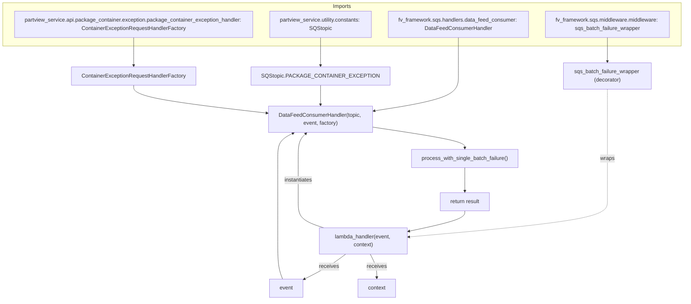

# Diagram: partview_core/partview_service/partview_service/api/package_container/exception/package_container_exception_consumer.py

> Auto-generated by Obscura crawlers

## Mermaid

### SVG

<svg id="container" width="2046.296875" xmlns="http://www.w3.org/2000/svg" class="flowchart" height="888" viewBox="0 0 2046.296875 888" role="graphics-document document" aria-roledescription="flowchart-v2"><g><marker id="container_flowchart-v2-pointEnd" class="marker flowchart-v2" viewBox="0 0 10 10" refX="5" refY="5" markerUnits="userSpaceOnUse" markerWidth="8" markerHeight="8" orient="auto"><path d="M 0 0 L 10 5 L 0 10 z" class="arrowMarkerPath" style="stroke-width: 1; stroke-dasharray: 1, 0;"></path></marker><marker id="container_flowchart-v2-pointStart" class="marker flowchart-v2" viewBox="0 0 10 10" refX="4.5" refY="5" markerUnits="userSpaceOnUse" markerWidth="8" markerHeight="8" orient="auto"><path d="M 0 5 L 10 10 L 10 0 z" class="arrowMarkerPath" style="stroke-width: 1; stroke-dasharray: 1, 0;"></path></marker><marker id="container_flowchart-v2-circleEnd" class="marker flowchart-v2" viewBox="0 0 10 10" refX="11" refY="5" markerUnits="userSpaceOnUse" markerWidth="11" markerHeight="11" orient="auto"><circle cx="5" cy="5" r="5" class="arrowMarkerPath" style="stroke-width: 1; stroke-dasharray: 1, 0;"></circle></marker><marker id="container_flowchart-v2-circleStart" class="marker flowchart-v2" viewBox="0 0 10 10" refX="-1" refY="5" markerUnits="userSpaceOnUse" markerWidth="11" markerHeight="11" orient="auto"><circle cx="5" cy="5" r="5" class="arrowMarkerPath" style="stroke-width: 1; stroke-dasharray: 1, 0;"></circle></marker><marker id="container_flowchart-v2-crossEnd" class="marker cross flowchart-v2" viewBox="0 0 11 11" refX="12" refY="5.2" markerUnits="userSpaceOnUse" markerWidth="11" markerHeight="11" orient="auto"><path d="M 1,1 l 9,9 M 10,1 l -9,9" class="arrowMarkerPath" style="stroke-width: 2; stroke-dasharray: 1, 0;"></path></marker><marker id="container_flowchart-v2-crossStart" class="marker cross flowchart-v2" viewBox="0 0 11 11" refX="-1" refY="5.2" markerUnits="userSpaceOnUse" markerWidth="11" markerHeight="11" orient="auto"><path d="M 1,1 l 9,9 M 10,1 l -9,9" class="arrowMarkerPath" style="stroke-width: 2; stroke-dasharray: 1, 0;"></path></marker><g class="root"><g class="clusters"><g class="cluster" id="Imports" data-look="classic"><rect style="" x="8" y="8" width="2030.296875" height="128"></rect><g class="cluster-label" transform="translate(994.7890625, 8)"><foreignObject width="56.71875" height="24">

Imports

</foreignObject></g></g></g><g class="edgePaths"><path d="M1817.141,111L1817.141,115.167C1817.141,119.333,1817.141,127.667,1817.141,136C1817.141,144.333,1817.141,152.667,1817.141,160.333C1817.141,168,1817.141,175,1817.141,178.5L1817.141,182" id="L_A2_Decorator_0" class="edge-thickness-normal edge-pattern-solid edge-thickness-normal edge-pattern-solid flowchart-link" style=";" data-edge="true" data-et="edge" data-id="L_A2_Decorator_0" data-points="W3sieCI6MTgxNy4xNDA2MjUsInkiOjExMX0seyJ4IjoxODE3LjE0MDYyNSwieSI6MTM2fSx7IngiOjE4MTcuMTQwNjI1LCJ5IjoxNjF9LHsieCI6MTgxNy4xNDA2MjUsInkiOjE4Nn1d" marker-end="url(#container_flowchart-v2-pointEnd)"></path><path d="M1817.141,264L1817.141,268.167C1817.141,272.333,1817.141,280.667,1817.141,295.5C1817.141,310.333,1817.141,331.667,1817.141,353C1817.141,374.333,1817.141,395.667,1817.141,415C1817.141,434.333,1817.141,451.667,1817.141,471C1817.141,490.333,1817.141,511.667,1817.141,533C1817.141,554.333,1817.141,575.667,1817.141,595C1817.141,614.333,1817.141,631.667,1717.776,649.043C1618.412,666.419,1419.683,683.837,1320.318,692.547L1220.953,701.256" id="L_Decorator_Lambda_0" class="edge-thickness-normal edge-pattern-dotted edge-thickness-normal edge-pattern-solid flowchart-link" style=";" data-edge="true" data-et="edge" data-id="L_Decorator_Lambda_0" data-points="W3sieCI6MTgxNy4xNDA2MjUsInkiOjI2NH0seyJ4IjoxODE3LjE0MDYyNSwieSI6Mjg5fSx7IngiOjE4MTcuMTQwNjI1LCJ5IjozNTN9LHsieCI6MTgxNy4xNDA2MjUsInkiOjQxN30seyJ4IjoxODE3LjE0MDYyNSwieSI6NDY5fSx7IngiOjE4MTcuMTQwNjI1LCJ5Ijo1MzN9LHsieCI6MTgxNy4xNDA2MjUsInkiOjU5N30seyJ4IjoxODE3LjE0MDYyNSwieSI6NjQ5fSx7IngiOjEyMTYuOTY4NzUsInkiOjcwMS42MDU0MjI1MjQ2NjI1fV0=" marker-end="url(#container_flowchart-v2-pointEnd)"></path><path d="M1033.602,752L1025.164,758.167C1016.726,764.333,999.849,776.667,978.913,789.046C957.976,801.426,932.98,813.852,920.482,820.065L907.984,826.278" id="L_Lambda_Event_0" class="edge-thickness-normal edge-pattern-solid edge-thickness-normal edge-pattern-solid flowchart-link" style=";" data-edge="true" data-et="edge" data-id="L_Lambda_Event_0" data-points="W3sieCI6MTAzMy42MDIzMzM0NzAzOTQ4LCJ5Ijo3NTJ9LHsieCI6OTgyLjk3MjY1NjI1LCJ5Ijo3ODl9LHsieCI6OTA0LjQwMjM0Mzc1LCJ5Ijo4MjguMDU4NjgwNzQ1MTkwOH1d" marker-end="url(#container_flowchart-v2-pointEnd)"></path><path d="M1107.234,752L1110.439,758.167C1113.643,764.333,1120.052,776.667,1123.257,788.333C1126.461,800,1126.461,811,1126.461,816.5L1126.461,822" id="L_Lambda_Context_0" class="edge-thickness-normal edge-pattern-solid edge-thickness-normal edge-pattern-solid flowchart-link" style=";" data-edge="true" data-et="edge" data-id="L_Lambda_Context_0" data-points="W3sieCI6MTEwNy4yMzQ0Nzc3OTYwNTI3LCJ5Ijo3NTJ9LHsieCI6MTEyNi40NjA5Mzc1LCJ5Ijo3ODl9LHsieCI6MTEyNi40NjA5Mzc1LCJ5Ijo4MjZ9XQ==" marker-end="url(#container_flowchart-v2-pointEnd)"></path><path d="M968.402,674L955.735,669.833C943.068,665.667,917.733,657.333,905.066,644.5C892.398,631.667,892.398,614.333,892.398,595C892.398,575.667,892.398,554.333,892.398,533C892.398,511.667,892.398,490.333,892.398,471C892.398,451.667,892.398,434.333,896.206,421.965C900.014,409.596,907.629,402.192,911.437,398.49L915.245,394.788" id="L_Lambda_Handler_0" class="edge-thickness-normal edge-pattern-solid edge-thickness-normal edge-pattern-solid flowchart-link" style=";" data-edge="true" data-et="edge" data-id="L_Lambda_Handler_0" data-points="W3sieCI6OTY4LjQwMjQ2NTgyMDMxMjUsInkiOjY3NH0seyJ4Ijo4OTIuMzk4NDM3NSwieSI6NjQ5fSx7IngiOjg5Mi4zOTg0Mzc1LCJ5Ijo1OTd9LHsieCI6ODkyLjM5ODQzNzUsInkiOjUzM30seyJ4Ijo4OTIuMzk4NDM3NSwieSI6NDY5fSx7IngiOjg5Mi4zOTg0Mzc1LCJ5Ijo0MTd9LHsieCI6OTE4LjExMjU0ODgyODEyNSwieSI6MzkyfV0=" marker-end="url(#container_flowchart-v2-pointEnd)"></path><path d="M1371.813,111L1371.813,115.167C1371.813,119.333,1371.813,127.667,1371.813,136C1371.813,144.333,1371.813,152.667,1371.813,167.5C1371.813,182.333,1371.813,203.667,1371.813,225C1371.813,246.333,1371.813,267.667,1329.23,284.923C1286.648,302.179,1201.484,315.357,1158.902,321.947L1116.32,328.536" id="L_A1_Handler_0" class="edge-thickness-normal edge-pattern-solid edge-thickness-normal edge-pattern-solid flowchart-link" style=";" data-edge="true" data-et="edge" data-id="L_A1_Handler_0" data-points="W3sieCI6MTM3MS44MTI1LCJ5IjoxMTF9LHsieCI6MTM3MS44MTI1LCJ5IjoxMzZ9LHsieCI6MTM3MS44MTI1LCJ5IjoxNjF9LHsieCI6MTM3MS44MTI1LCJ5IjoyMjV9LHsieCI6MTM3MS44MTI1LCJ5IjoyODl9LHsieCI6MTExMi4zNjcxODc1LCJ5IjozMjkuMTQ3NjQxNjI1MjY2ODN9XQ==" marker-end="url(#container_flowchart-v2-pointEnd)"></path><path d="M398.406,111L398.406,115.167C398.406,119.333,398.406,127.667,398.406,136C398.406,144.333,398.406,152.667,398.406,162.333C398.406,172,398.406,183,398.406,188.5L398.406,194" id="L_A3_Factory_0" class="edge-thickness-normal edge-pattern-solid edge-thickness-normal edge-pattern-solid flowchart-link" style=";" data-edge="true" data-et="edge" data-id="L_A3_Factory_0" data-points="W3sieCI6Mzk4LjQwNjI1LCJ5IjoxMTF9LHsieCI6Mzk4LjQwNjI1LCJ5IjoxMzZ9LHsieCI6Mzk4LjQwNjI1LCJ5IjoxNjF9LHsieCI6Mzk4LjQwNjI1LCJ5IjoxOTh9XQ==" marker-end="url(#container_flowchart-v2-pointEnd)"></path><path d="M958.227,111L958.227,115.167C958.227,119.333,958.227,127.667,958.227,136C958.227,144.333,958.227,152.667,958.227,162.333C958.227,172,958.227,183,958.227,188.5L958.227,194" id="L_A4_Topic_0" class="edge-thickness-normal edge-pattern-solid edge-thickness-normal edge-pattern-solid flowchart-link" style=";" data-edge="true" data-et="edge" data-id="L_A4_Topic_0" data-points="W3sieCI6OTU4LjIyNjU2MjUsInkiOjExMX0seyJ4Ijo5NTguMjI2NTYyNSwieSI6MTM2fSx7IngiOjk1OC4yMjY1NjI1LCJ5IjoxNjF9LHsieCI6OTU4LjIyNjU2MjUsInkiOjE5OH1d" marker-end="url(#container_flowchart-v2-pointEnd)"></path><path d="M958.227,252L958.227,258.167C958.227,264.333,958.227,276.667,958.227,286.333C958.227,296,958.227,303,958.227,306.5L958.227,310" id="L_Topic_Handler_0" class="edge-thickness-normal edge-pattern-solid edge-thickness-normal edge-pattern-solid flowchart-link" style=";" data-edge="true" data-et="edge" data-id="L_Topic_Handler_0" data-points="W3sieCI6OTU4LjIyNjU2MjUsInkiOjI1Mn0seyJ4Ijo5NTguMjI2NTYyNSwieSI6Mjg5fSx7IngiOjk1OC4yMjY1NjI1LCJ5IjozMTR9XQ==" marker-end="url(#container_flowchart-v2-pointEnd)"></path><path d="M843.791,826L841.406,819.833C839.022,813.667,834.253,801.333,831.869,782.5C829.484,763.667,829.484,738.333,829.484,715C829.484,691.667,829.484,670.333,829.484,651C829.484,631.667,829.484,614.333,829.484,595C829.484,575.667,829.484,554.333,829.484,533C829.484,511.667,829.484,490.333,829.484,471C829.484,451.667,829.484,434.333,837.269,421.797C845.054,409.26,860.623,401.52,868.408,397.65L876.192,393.781" id="L_Event_Handler_0" class="edge-thickness-normal edge-pattern-solid edge-thickness-normal edge-pattern-solid flowchart-link" style=";" data-edge="true" data-et="edge" data-id="L_Event_Handler_0" data-points="W3sieCI6ODQzLjc5MDcxMDQ0OTIxODgsInkiOjgyNn0seyJ4Ijo4MjkuNDg0Mzc1LCJ5Ijo3ODl9LHsieCI6ODI5LjQ4NDM3NSwieSI6NzEzfSx7IngiOjgyOS40ODQzNzUsInkiOjY0OX0seyJ4Ijo4MjkuNDg0Mzc1LCJ5Ijo1OTd9LHsieCI6ODI5LjQ4NDM3NSwieSI6NTMzfSx7IngiOjgyOS40ODQzNzUsInkiOjQ2OX0seyJ4Ijo4MjkuNDg0Mzc1LCJ5Ijo0MTd9LHsieCI6ODc5Ljc3NDI5MTk5MjE4NzUsInkiOjM5Mn1d" marker-end="url(#container_flowchart-v2-pointEnd)"></path><path d="M398.406,252L398.406,258.167C398.406,264.333,398.406,276.667,465.357,290.487C532.308,304.308,666.21,319.616,733.161,327.27L800.112,334.924" id="L_Factory_Handler_0" class="edge-thickness-normal edge-pattern-solid edge-thickness-normal edge-pattern-solid flowchart-link" style=";" data-edge="true" data-et="edge" data-id="L_Factory_Handler_0" data-points="W3sieCI6Mzk4LjQwNjI1LCJ5IjoyNTJ9LHsieCI6Mzk4LjQwNjI1LCJ5IjoyODl9LHsieCI6ODA0LjA4NTkzNzUsInkiOjMzNS4zNzgyNzQyNzg4NTYyfV0=" marker-end="url(#container_flowchart-v2-pointEnd)"></path><path d="M1112.367,375.792L1158.814,382.66C1205.26,389.528,1298.154,403.264,1344.6,413.632C1391.047,424,1391.047,431,1391.047,434.5L1391.047,438" id="L_Handler_Process_0" class="edge-thickness-normal edge-pattern-solid edge-thickness-normal edge-pattern-solid flowchart-link" style=";" data-edge="true" data-et="edge" data-id="L_Handler_Process_0" data-points="W3sieCI6MTExMi4zNjcxODc1LCJ5IjozNzUuNzkyMzY4MzY4ODAyfSx7IngiOjEzOTEuMDQ2ODc1LCJ5Ijo0MTd9LHsieCI6MTM5MS4wNDY4NzUsInkiOjQ0Mn1d" marker-end="url(#container_flowchart-v2-pointEnd)"></path><path d="M1391.047,496L1391.047,502.167C1391.047,508.333,1391.047,520.667,1391.047,532.333C1391.047,544,1391.047,555,1391.047,560.5L1391.047,566" id="L_Process_Return_0" class="edge-thickness-normal edge-pattern-solid edge-thickness-normal edge-pattern-solid flowchart-link" style=";" data-edge="true" data-et="edge" data-id="L_Process_Return_0" data-points="W3sieCI6MTM5MS4wNDY4NzUsInkiOjQ5Nn0seyJ4IjoxMzkxLjA0Njg3NSwieSI6NTMzfSx7IngiOjEzOTEuMDQ2ODc1LCJ5Ijo1NzB9XQ==" marker-end="url(#container_flowchart-v2-pointEnd)"></path><path d="M1391.047,624L1391.047,628.167C1391.047,632.333,1391.047,640.667,1362.686,650.802C1334.326,660.938,1277.604,672.877,1249.244,678.846L1220.883,684.815" id="L_Return_Lambda_0" class="edge-thickness-normal edge-pattern-solid edge-thickness-normal edge-pattern-solid flowchart-link" style=";" data-edge="true" data-et="edge" data-id="L_Return_Lambda_0" data-points="W3sieCI6MTM5MS4wNDY4NzUsInkiOjYyNH0seyJ4IjoxMzkxLjA0Njg3NSwieSI6NjQ5fSx7IngiOjEyMTYuOTY4NzUsInkiOjY4NS42Mzg2MTA1NTQ0NDIzfV0=" marker-end="url(#container_flowchart-v2-pointEnd)"></path></g><g class="edgeLabels"><g class="edgeLabel"><g class="label" data-id="L_A2_Decorator_0" transform="translate(0, 0)"><foreignObject width="0" height="0">

</foreignObject></g></g><g class="edgeLabel" transform="translate(1817.140625, 469)"><g class="label" data-id="L_Decorator_Lambda_0" transform="translate(-21.390625, -12)"><foreignObject width="42.78125" height="24">

wraps

</foreignObject></g></g><g class="edgeLabel" transform="translate(982.97265625, 789)"><g class="label" data-id="L_Lambda_Event_0" transform="translate(-29.4921875, -12)"><foreignObject width="58.984375" height="24">

receives

</foreignObject></g></g><g class="edgeLabel" transform="translate(1126.4609375, 789)"><g class="label" data-id="L_Lambda_Context_0" transform="translate(-29.4921875, -12)"><foreignObject width="58.984375" height="24">

receives

</foreignObject></g></g><g class="edgeLabel" transform="translate(892.3984375, 533)"><g class="label" data-id="L_Lambda_Handler_0" transform="translate(-42.9140625, -12)"><foreignObject width="85.828125" height="24">

instantiates

</foreignObject></g></g><g class="edgeLabel"><g class="label" data-id="L_A1_Handler_0" transform="translate(0, 0)"><foreignObject width="0" height="0">

</foreignObject></g></g><g class="edgeLabel"><g class="label" data-id="L_A3_Factory_0" transform="translate(0, 0)"><foreignObject width="0" height="0">

</foreignObject></g></g><g class="edgeLabel"><g class="label" data-id="L_A4_Topic_0" transform="translate(0, 0)"><foreignObject width="0" height="0">

</foreignObject></g></g><g class="edgeLabel"><g class="label" data-id="L_Topic_Handler_0" transform="translate(0, 0)"><foreignObject width="0" height="0">

</foreignObject></g></g><g class="edgeLabel"><g class="label" data-id="L_Event_Handler_0" transform="translate(0, 0)"><foreignObject width="0" height="0">

</foreignObject></g></g><g class="edgeLabel"><g class="label" data-id="L_Factory_Handler_0" transform="translate(0, 0)"><foreignObject width="0" height="0">

</foreignObject></g></g><g class="edgeLabel"><g class="label" data-id="L_Handler_Process_0" transform="translate(0, 0)"><foreignObject width="0" height="0">

</foreignObject></g></g><g class="edgeLabel"><g class="label" data-id="L_Process_Return_0" transform="translate(0, 0)"><foreignObject width="0" height="0">

</foreignObject></g></g><g class="edgeLabel"><g class="label" data-id="L_Return_Lambda_0" transform="translate(0, 0)"><foreignObject width="0" height="0">

</foreignObject></g></g></g><g class="nodes"><g class="node default" id="flowchart-A1-0" transform="translate(1371.8125, 72)"><rect class="basic label-container" style="" x="-209.171875" y="-39" width="418.34375" height="78"></rect><g class="label" style="" transform="translate(-179.171875, -24)"><rect></rect><foreignObject width="358.34375" height="48">

fv_framework.sqs.handlers.data_feed_consumer: DataFeedConsumerHandler

</foreignObject></g></g><g class="node default" id="flowchart-A2-1" transform="translate(1817.140625, 72)"><rect class="basic label-container" style="" x="-186.15625" y="-39" width="372.3125" height="78"></rect><g class="label" style="" transform="translate(-156.15625, -24)"><rect></rect><foreignObject width="312.3125" height="48">

fv_framework.sqs.middleware.middleware: sqs_batch_failure_wrapper

</foreignObject></g></g><g class="node default" id="flowchart-A3-2" transform="translate(398.40625, 72)"><rect class="basic label-container" style="" x="-355.40625" y="-39" width="710.8125" height="78"></rect><g class="label" style="" transform="translate(-325.40625, -24)"><rect></rect><foreignObject width="650.8125" height="48">

partview_service.api.package_container.exception.package_container_exception_handler: ContainerExceptionRequestHandlerFactory

</foreignObject></g></g><g class="node default" id="flowchart-A4-3" transform="translate(958.2265625, 72)"><rect class="basic label-container" style="" x="-154.4140625" y="-39" width="308.828125" height="78"></rect><g class="label" style="" transform="translate(-124.4140625, -24)"><rect></rect><foreignObject width="248.828125" height="48">

partview_service.utility.constants: SQStopic

</foreignObject></g></g><g class="node default" id="flowchart-Decorator-4" transform="translate(1817.140625, 225)"><rect class="basic label-container" style="" x="-130" y="-39" width="260" height="78"></rect><g class="label" style="" transform="translate(-100, -24)"><rect></rect><foreignObject width="200" height="48">

sqs_batch_failure_wrapper (decorator)

</foreignObject></g></g><g class="node default" id="flowchart-Lambda-5" transform="translate(1086.96875, 713)"><rect class="basic label-container" style="" x="-130" y="-39" width="260" height="78"></rect><g class="label" style="" transform="translate(-100, -24)"><rect></rect><foreignObject width="200" height="48">

lambda_handler(event, context)

</foreignObject></g></g><g class="node default" id="flowchart-Event-6" transform="translate(854.23046875, 853)"><rect class="basic label-container" style="" x="-50.171875" y="-27" width="100.34375" height="54"></rect><g class="label" style="" transform="translate(-20.171875, -12)"><rect></rect><foreignObject width="40.34375" height="24">

event

</foreignObject></g></g><g class="node default" id="flowchart-Context-7" transform="translate(1126.4609375, 853)"><rect class="basic label-container" style="" x="-56.8515625" y="-27" width="113.703125" height="54"></rect><g class="label" style="" transform="translate(-26.8515625, -12)"><rect></rect><foreignObject width="53.703125" height="24">

context

</foreignObject></g></g><g class="node default" id="flowchart-Topic-8" transform="translate(958.2265625, 225)"><rect class="basic label-container" style="" x="-184" y="-27" width="368" height="54"></rect><g class="label" style="" transform="translate(-154, -12)"><rect></rect><foreignObject width="308" height="24">

SQStopic.PACKAGE_CONTAINER_EXCEPTION

</foreignObject></g></g><g class="node default" id="flowchart-Factory-9" transform="translate(398.40625, 225)"><rect class="basic label-container" style="" x="-185.234375" y="-27" width="370.46875" height="54"></rect><g class="label" style="" transform="translate(-155.234375, -12)"><rect></rect><foreignObject width="310.46875" height="24">

ContainerExceptionRequestHandlerFactory

</foreignObject></g></g><g class="node default" id="flowchart-Handler-10" transform="translate(958.2265625, 353)"><rect class="basic label-container" style="" x="-154.140625" y="-39" width="308.28125" height="78"></rect><g class="label" style="" transform="translate(-124.140625, -24)"><rect></rect><foreignObject width="248.28125" height="48">

DataFeedConsumerHandler(topic, event, factory)

</foreignObject></g></g><g class="node default" id="flowchart-Process-11" transform="translate(1391.046875, 469)"><rect class="basic label-container" style="" x="-159.5703125" y="-27" width="319.140625" height="54"></rect><g class="label" style="" transform="translate(-129.5703125, -12)"><rect></rect><foreignObject width="259.140625" height="24">

process_with_single_batch_failure()

</foreignObject></g></g><g class="node default" id="flowchart-Return-12" transform="translate(1391.046875, 597)"><rect class="basic label-container" style="" x="-75.484375" y="-27" width="150.96875" height="54"></rect><g class="label" style="" transform="translate(-45.484375, -12)"><rect></rect><foreignObject width="90.96875" height="24">

return result

</foreignObject></g></g></g></g></g></svg>
