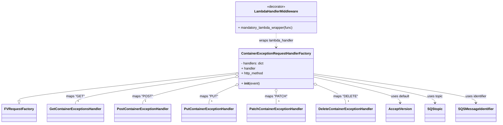

# Diagram: partview_core/partview_service/partview_service/api/package_container/exception/package_container_exception_handler.py


> Auto-generated by Obscura crawlers

## Diagram 1



### SVG

<svg id="container" width="2272.828125" xmlns="http://www.w3.org/2000/svg" class="classDiagram" height="590" viewBox="0 0 2272.828125 590" role="graphics-document document" aria-roledescription="class"><style>#container{font-family:"trebuchet ms",verdana,arial,sans-serif;font-size:16px;fill:#333;}@keyframes edge-animation-frame{from{stroke-dashoffset:0;}}@keyframes dash{to{stroke-dashoffset:0;}}#container .edge-animation-slow{stroke-dasharray:9,5!important;stroke-dashoffset:900;animation:dash 50s linear infinite;stroke-linecap:round;}#container .edge-animation-fast{stroke-dasharray:9,5!important;stroke-dashoffset:900;animation:dash 20s linear infinite;stroke-linecap:round;}#container .error-icon{fill:#552222;}#container .error-text{fill:#552222;stroke:#552222;}#container .edge-thickness-normal{stroke-width:1px;}#container .edge-thickness-thick{stroke-width:3.5px;}#container .edge-pattern-solid{stroke-dasharray:0;}#container .edge-thickness-invisible{stroke-width:0;fill:none;}#container .edge-pattern-dashed{stroke-dasharray:3;}#container .edge-pattern-dotted{stroke-dasharray:2;}#container .marker{fill:#333333;stroke:#333333;}#container .marker.cross{stroke:#333333;}#container svg{font-family:"trebuchet ms",verdana,arial,sans-serif;font-size:16px;}#container p{margin:0;}#container g.classGroup text{fill:#9370DB;stroke:none;font-family:"trebuchet ms",verdana,arial,sans-serif;font-size:10px;}#container g.classGroup text .title{font-weight:bolder;}#container .nodeLabel,#container .edgeLabel{color:#131300;}#container .edgeLabel .label rect{fill:#ECECFF;}#container .label text{fill:#131300;}#container .labelBkg{background:#ECECFF;}#container .edgeLabel .label span{background:#ECECFF;}#container .classTitle{font-weight:bolder;}#container .node rect,#container .node circle,#container .node ellipse,#container .node polygon,#container .node path{fill:#ECECFF;stroke:#9370DB;stroke-width:1px;}#container .divider{stroke:#9370DB;stroke-width:1;}#container g.clickable{cursor:pointer;}#container g.classGroup rect{fill:#ECECFF;stroke:#9370DB;}#container g.classGroup line{stroke:#9370DB;stroke-width:1;}#container .classLabel .box{stroke:none;stroke-width:0;fill:#ECECFF;opacity:0.5;}#container .classLabel .label{fill:#9370DB;font-size:10px;}#container .relation{stroke:#333333;stroke-width:1;fill:none;}#container .dashed-line{stroke-dasharray:3;}#container .dotted-line{stroke-dasharray:1 2;}#container #compositionStart,#container .composition{fill:#333333!important;stroke:#333333!important;stroke-width:1;}#container #compositionEnd,#container .composition{fill:#333333!important;stroke:#333333!important;stroke-width:1;}#container #dependencyStart,#container .dependency{fill:#333333!important;stroke:#333333!important;stroke-width:1;}#container #dependencyStart,#container .dependency{fill:#333333!important;stroke:#333333!important;stroke-width:1;}#container #extensionStart,#container .extension{fill:transparent!important;stroke:#333333!important;stroke-width:1;}#container #extensionEnd,#container .extension{fill:transparent!important;stroke:#333333!important;stroke-width:1;}#container #aggregationStart,#container .aggregation{fill:transparent!important;stroke:#333333!important;stroke-width:1;}#container #aggregationEnd,#container .aggregation{fill:transparent!important;stroke:#333333!important;stroke-width:1;}#container #lollipopStart,#container .lollipop{fill:#ECECFF!important;stroke:#333333!important;stroke-width:1;}#container #lollipopEnd,#container .lollipop{fill:#ECECFF!important;stroke:#333333!important;stroke-width:1;}#container .edgeTerminals{font-size:11px;line-height:initial;}#container .classTitleText{text-anchor:middle;font-size:18px;fill:#333;}#container .label-icon{display:inline-block;height:1em;overflow:visible;vertical-align:-0.125em;}#container .node .label-icon path{fill:currentColor;stroke:revert;stroke-width:revert;}#container :root{--mermaid-font-family:"trebuchet ms",verdana,arial,sans-serif;}</style><g><defs><marker id="container_class-aggregationStart" class="marker aggregation class" refX="18" refY="7" markerWidth="190" markerHeight="240" orient="auto"><path d="M 18,7 L9,13 L1,7 L9,1 Z"></path></marker></defs><defs><marker id="container_class-aggregationEnd" class="marker aggregation class" refX="1" refY="7" markerWidth="20" markerHeight="28" orient="auto"><path d="M 18,7 L9,13 L1,7 L9,1 Z"></path></marker></defs><defs><marker id="container_class-extensionStart" class="marker extension class" refX="18" refY="7" markerWidth="190" markerHeight="240" orient="auto"><path d="M 1,7 L18,13 V 1 Z"></path></marker></defs><defs><marker id="container_class-extensionEnd" class="marker extension class" refX="1" refY="7" markerWidth="20" markerHeight="28" orient="auto"><path d="M 1,1 V 13 L18,7 Z"></path></marker></defs><defs><marker id="container_class-compositionStart" class="marker composition class" refX="18" refY="7" markerWidth="190" markerHeight="240" orient="auto"><path d="M 18,7 L9,13 L1,7 L9,1 Z"></path></marker></defs><defs><marker id="container_class-compositionEnd" class="marker composition class" refX="1" refY="7" markerWidth="20" markerHeight="28" orient="auto"><path d="M 18,7 L9,13 L1,7 L9,1 Z"></path></marker></defs><defs><marker id="container_class-dependencyStart" class="marker dependency class" refX="6" refY="7" markerWidth="190" markerHeight="240" orient="auto"><path d="M 5,7 L9,13 L1,7 L9,1 Z"></path></marker></defs><defs><marker id="container_class-dependencyEnd" class="marker dependency class" refX="13" refY="7" markerWidth="20" markerHeight="28" orient="auto"><path d="M 18,7 L9,13 L14,7 L9,1 Z"></path></marker></defs><defs><marker id="container_class-lollipopStart" class="marker lollipop class" refX="13" refY="7" markerWidth="190" markerHeight="240" orient="auto"><circle stroke="black" fill="transparent" cx="7" cy="7" r="6"></circle></marker></defs><defs><marker id="container_class-lollipopEnd" class="marker lollipop class" refX="1" refY="7" markerWidth="190" markerHeight="240" orient="auto"><circle stroke="black" fill="transparent" cx="7" cy="7" r="6"></circle></marker></defs><g class="root"><g class="clusters"></g><g class="edgePaths"><path d="M1089.914,347.144L922.435,366.12C754.956,385.096,419.997,423.048,252.518,445.316C85.039,467.583,85.039,474.167,85.039,477.458L85.039,480.75" id="id_ContainerExceptionRequestHandlerFactory_FVRequestFactory_1" class="edge-thickness-normal edge-pattern-solid relation" style=";;;" data-edge="true" data-et="edge" data-id="id_ContainerExceptionRequestHandlerFactory_FVRequestFactory_1" data-points="W3sieCI6MTA4OS45MTQwNjI1LCJ5IjozNDcuMTQzOTA1ODY0MTg3M30seyJ4Ijo4NS4wMzkwNjI1LCJ5Ijo0NjF9LHsieCI6ODUuMDM5MDYyNSwieSI6NDk4fV0=" marker-end="url(#container_class-extensionEnd)"></path><path d="M1072.842,354.956L950.867,372.63C828.892,390.304,584.942,425.652,462.967,449.493C340.992,473.333,340.992,485.667,340.992,491.833L340.992,498" id="id_ContainerExceptionRequestHandlerFactory_GetContainerExceptionsHandler_2" class="edge-thickness-normal edge-pattern-solid relation" style=";;;" data-edge="true" data-et="edge" data-id="id_ContainerExceptionRequestHandlerFactory_GetContainerExceptionsHandler_2" data-points="W3sieCI6MTA4OS45MTQwNjI1LCJ5IjozNTIuNDgyMjE1MzU2MzMxMn0seyJ4IjozNDAuOTkyMTg3NSwieSI6NDYxfSx7IngiOjM0MC45OTIxODc1LCJ5Ijo0OTh9XQ==" marker-start="url(#container_class-aggregationStart)"></path><path d="M1073.06,368.487L1002.296,383.906C931.532,399.325,790.004,430.162,719.24,451.748C648.477,473.333,648.477,485.667,648.477,491.833L648.477,498" id="id_ContainerExceptionRequestHandlerFactory_PostContainerExceptionHandler_3" class="edge-thickness-normal edge-pattern-solid relation" style=";;;" data-edge="true" data-et="edge" data-id="id_ContainerExceptionRequestHandlerFactory_PostContainerExceptionHandler_3" data-points="W3sieCI6MTA4OS45MTQwNjI1LCJ5IjozNjQuODE0OTc3NDA5NzM0OX0seyJ4Ijo2NDguNDc2NTYyNSwieSI6NDYxfSx7IngiOjY0OC40NzY1NjI1LCJ5Ijo0OTh9XQ==" marker-start="url(#container_class-aggregationStart)"></path><path d="M1074.084,408.007L1053.685,416.839C1033.285,425.671,992.486,443.336,972.087,458.335C951.688,473.333,951.688,485.667,951.688,491.833L951.688,498" id="id_ContainerExceptionRequestHandlerFactory_PutContainerExceptionHandler_4" class="edge-thickness-normal edge-pattern-solid relation" style=";;;" data-edge="true" data-et="edge" data-id="id_ContainerExceptionRequestHandlerFactory_PutContainerExceptionHandler_4" data-points="W3sieCI6MTA4OS45MTQwNjI1LCJ5Ijo0MDEuMTUzMzgyNTAyNTQzMjV9LHsieCI6OTUxLjY4NzUsInkiOjQ2MX0seyJ4Ijo5NTEuNjg3NSwieSI6NDk4fV0=" marker-start="url(#container_class-aggregationStart)"></path><path d="M1258.875,441.25L1258.875,444.542C1258.875,447.833,1258.875,454.417,1258.875,463.875C1258.875,473.333,1258.875,485.667,1258.875,491.833L1258.875,498" id="id_ContainerExceptionRequestHandlerFactory_PatchContainerExceptionHandler_5" class="edge-thickness-normal edge-pattern-solid relation" style=";;;" data-edge="true" data-et="edge" data-id="id_ContainerExceptionRequestHandlerFactory_PatchContainerExceptionHandler_5" data-points="W3sieCI6MTI1OC44NzUsInkiOjQyNH0seyJ4IjoxMjU4Ljg3NSwieSI6NDYxfSx7IngiOjEyNTguODc1LCJ5Ijo0OTh9XQ==" marker-start="url(#container_class-aggregationStart)"></path><path d="M1443.755,405.161L1466.054,414.468C1488.352,423.774,1532.95,442.387,1555.248,457.86C1577.547,473.333,1577.547,485.667,1577.547,491.833L1577.547,498" id="id_ContainerExceptionRequestHandlerFactory_DeleteContainerExceptionHandler_6" class="edge-thickness-normal edge-pattern-solid relation" style=";;;" data-edge="true" data-et="edge" data-id="id_ContainerExceptionRequestHandlerFactory_DeleteContainerExceptionHandler_6" data-points="W3sieCI6MTQyNy44MzU5Mzc1LCJ5IjozOTguNTE3MDYzMDA1NjM4NjV9LHsieCI6MTU3Ny41NDY4NzUsInkiOjQ2MX0seyJ4IjoxNTc3LjU0Njg3NSwieSI6NDk4fV0=" marker-start="url(#container_class-aggregationStart)"></path><path d="M1258.875,158L1258.875,164.167C1258.875,170.333,1258.875,182.667,1258.875,194C1258.875,205.333,1258.875,215.667,1258.875,220.833L1258.875,226" id="id_LambdaHandlerMiddleware_ContainerExceptionRequestHandlerFactory_7" class="edge-thickness-normal edge-pattern-dashed relation" style=";;;" data-edge="true" data-et="edge" data-id="id_LambdaHandlerMiddleware_ContainerExceptionRequestHandlerFactory_7" data-points="W3sieCI6MTI1OC44NzUsInkiOjE1OH0seyJ4IjoxMjU4Ljg3NSwieSI6MTk1fSx7IngiOjEyNTguODc1LCJ5IjoyMzJ9XQ==" marker-end="url(#container_class-dependencyEnd)"></path><path d="M1427.836,367.533L1494.415,383.11C1560.995,398.688,1694.154,429.844,1760.733,450.589C1827.313,471.333,1827.313,481.667,1827.313,486.833L1827.313,492" id="id_ContainerExceptionRequestHandlerFactory_AcceptVersion_8" class="edge-thickness-normal edge-pattern-solid relation" style=";;;" data-edge="true" data-et="edge" data-id="id_ContainerExceptionRequestHandlerFactory_AcceptVersion_8" data-points="W3sieCI6MTQyNy44MzU5Mzc1LCJ5IjozNjcuNTMyNTg2NTg2MDM2M30seyJ4IjoxODI3LjMxMjUsInkiOjQ2MX0seyJ4IjoxODI3LjMxMjUsInkiOjQ5OH1d" marker-end="url(#container_class-dependencyEnd)"></path><path d="M1427.836,358.9L1520.882,375.917C1613.927,392.934,1800.018,426.967,1893.064,449.15C1986.109,471.333,1986.109,481.667,1986.109,486.833L1986.109,492" id="id_ContainerExceptionRequestHandlerFactory_SQStopic_9" class="edge-thickness-normal edge-pattern-solid relation" style=";;;" data-edge="true" data-et="edge" data-id="id_ContainerExceptionRequestHandlerFactory_SQStopic_9" data-points="W3sieCI6MTQyNy44MzU5Mzc1LCJ5IjozNTguOTAwMzYwOTU2NTM0OH0seyJ4IjoxOTg2LjEwOTM3NSwieSI6NDYxfSx7IngiOjE5ODYuMTA5Mzc1LCJ5Ijo0OTh9XQ==" marker-end="url(#container_class-dependencyEnd)"></path><path d="M1427.836,352.582L1552.038,370.651C1676.24,388.721,1924.643,424.861,2048.845,448.097C2173.047,471.333,2173.047,481.667,2173.047,486.833L2173.047,492" id="id_ContainerExceptionRequestHandlerFactory_SQSMessageIdentifier_10" class="edge-thickness-normal edge-pattern-solid relation" style=";;;" data-edge="true" data-et="edge" data-id="id_ContainerExceptionRequestHandlerFactory_SQSMessageIdentifier_10" data-points="W3sieCI6MTQyNy44MzU5Mzc1LCJ5IjozNTIuNTgxNTk3MDczODU0NH0seyJ4IjoyMTczLjA0Njg3NSwieSI6NDYxfSx7IngiOjIxNzMuMDQ2ODc1LCJ5Ijo0OTh9XQ==" marker-end="url(#container_class-dependencyEnd)"></path></g><g class="edgeLabels"><g class="edgeLabel"><g class="label" data-id="id_ContainerExceptionRequestHandlerFactory_FVRequestFactory_1" transform="translate(0, 0)"><foreignObject width="0" height="0"><div xmlns="http://www.w3.org/1999/xhtml" class="labelBkg" style="display: table-cell; white-space: nowrap; line-height: 1.5; max-width: 200px; text-align: center;"><span class="edgeLabel"></span></div></foreignObject></g></g><g class="edgeLabel" transform="translate(340.9921875, 461)"><g class="label" data-id="id_ContainerExceptionRequestHandlerFactory_GetContainerExceptionsHandler_2" transform="translate(-41.75, -12)"><foreignObject width="83.5" height="24"><div xmlns="http://www.w3.org/1999/xhtml" class="labelBkg" style="display: table-cell; white-space: nowrap; line-height: 1.5; max-width: 200px; text-align: center;"><span class="edgeLabel"><p>maps "GET"</p></span></div></foreignObject></g></g><g class="edgeLabel" transform="translate(648.4765625, 461)"><g class="label" data-id="id_ContainerExceptionRequestHandlerFactory_PostContainerExceptionHandler_3" transform="translate(-46.7890625, -12)"><foreignObject width="93.578125" height="24"><div xmlns="http://www.w3.org/1999/xhtml" class="labelBkg" style="display: table-cell; white-space: nowrap; line-height: 1.5; max-width: 200px; text-align: center;"><span class="edgeLabel"><p>maps "POST"</p></span></div></foreignObject></g></g><g class="edgeLabel" transform="translate(951.6875, 461)"><g class="label" data-id="id_ContainerExceptionRequestHandlerFactory_PutContainerExceptionHandler_4" transform="translate(-42.3671875, -12)"><foreignObject width="84.734375" height="24"><div xmlns="http://www.w3.org/1999/xhtml" class="labelBkg" style="display: table-cell; white-space: nowrap; line-height: 1.5; max-width: 200px; text-align: center;"><span class="edgeLabel"><p>maps "PUT"</p></span></div></foreignObject></g></g><g class="edgeLabel" transform="translate(1258.875, 461)"><g class="label" data-id="id_ContainerExceptionRequestHandlerFactory_PatchContainerExceptionHandler_5" transform="translate(-50.328125, -12)"><foreignObject width="100.65625" height="24"><div xmlns="http://www.w3.org/1999/xhtml" class="labelBkg" style="display: table-cell; white-space: nowrap; line-height: 1.5; max-width: 200px; text-align: center;"><span class="edgeLabel"><p>maps "PATCH"</p></span></div></foreignObject></g></g><g class="edgeLabel" transform="translate(1577.546875, 461)"><g class="label" data-id="id_ContainerExceptionRequestHandlerFactory_DeleteContainerExceptionHandler_6" transform="translate(-54.3125, -12)"><foreignObject width="108.625" height="24"><div xmlns="http://www.w3.org/1999/xhtml" class="labelBkg" style="display: table-cell; white-space: nowrap; line-height: 1.5; max-width: 200px; text-align: center;"><span class="edgeLabel"><p>maps "DELETE"</p></span></div></foreignObject></g></g><g class="edgeLabel" transform="translate(1258.875, 195)"><g class="label" data-id="id_LambdaHandlerMiddleware_ContainerExceptionRequestHandlerFactory_7" transform="translate(-83.3359375, -12)"><foreignObject width="166.671875" height="24"><div xmlns="http://www.w3.org/1999/xhtml" class="labelBkg" style="display: table-cell; white-space: nowrap; line-height: 1.5; max-width: 200px; text-align: center;"><span class="edgeLabel"><p>wraps lambda_handler</p></span></div></foreignObject></g></g><g class="edgeLabel" transform="translate(1827.3125, 461)"><g class="label" data-id="id_ContainerExceptionRequestHandlerFactory_AcceptVersion_8" transform="translate(-44.5, -12)"><foreignObject width="89" height="24"><div xmlns="http://www.w3.org/1999/xhtml" class="labelBkg" style="display: table-cell; white-space: nowrap; line-height: 1.5; max-width: 200px; text-align: center;"><span class="edgeLabel"><p>uses default</p></span></div></foreignObject></g></g><g class="edgeLabel" transform="translate(1986.109375, 461)"><g class="label" data-id="id_ContainerExceptionRequestHandlerFactory_SQStopic_9" transform="translate(-36.8828125, -12)"><foreignObject width="73.765625" height="24"><div xmlns="http://www.w3.org/1999/xhtml" class="labelBkg" style="display: table-cell; white-space: nowrap; line-height: 1.5; max-width: 200px; text-align: center;"><span class="edgeLabel"><p>uses topic</p></span></div></foreignObject></g></g><g class="edgeLabel" transform="translate(2173.046875, 461)"><g class="label" data-id="id_ContainerExceptionRequestHandlerFactory_SQSMessageIdentifier_10" transform="translate(-51.890625, -12)"><foreignObject width="103.78125" height="24"><div xmlns="http://www.w3.org/1999/xhtml" class="labelBkg" style="display: table-cell; white-space: nowrap; line-height: 1.5; max-width: 200px; text-align: center;"><span class="edgeLabel"><p>uses identifier</p></span></div></foreignObject></g></g><g class="edgeTerminals" transform="translate(350.9921887499999, 475.5000010714286)"><g class="inner" transform="translate(0, 0)"></g><foreignObject style="width: 9px; height: 12px;"><div xmlns="http://www.w3.org/1999/xhtml" style="display: inline-block; padding-right: 1px; white-space: nowrap;"><span class="edgeLabel">1</span></div></foreignObject></g><g class="edgeTerminals" transform="translate(658.47656125, 475.4999989285714)"><g class="inner" transform="translate(0, 0)"></g><foreignObject style="width: 9px; height: 12px;"><div xmlns="http://www.w3.org/1999/xhtml" style="display: inline-block; padding-right: 1px; white-space: nowrap;"><span class="edgeLabel">1</span></div></foreignObject></g><g class="edgeTerminals" transform="translate(961.6875, 475.5)"><g class="inner" transform="translate(0, 0)"></g><foreignObject style="width: 9px; height: 12px;"><div xmlns="http://www.w3.org/1999/xhtml" style="display: inline-block; padding-right: 1px; white-space: nowrap;"><span class="edgeLabel">1</span></div></foreignObject></g><g class="edgeTerminals" transform="translate(1268.875, 475.5)"><g class="inner" transform="translate(0, 0)"></g><foreignObject style="width: 9px; height: 12px;"><div xmlns="http://www.w3.org/1999/xhtml" style="display: inline-block; padding-right: 1px; white-space: nowrap;"><span class="edgeLabel">1</span></div></foreignObject></g><g class="edgeTerminals" transform="translate(1587.5468774999997, 475.50000214285717)"><g class="inner" transform="translate(0, 0)"></g><foreignObject style="width: 9px; height: 12px;"><div xmlns="http://www.w3.org/1999/xhtml" style="display: inline-block; padding-right: 1px; white-space: nowrap;"><span class="edgeLabel">1</span></div></foreignObject></g></g><g class="nodes"><g class="node default" id="classId-FVRequestFactory-0" transform="translate(85.0390625, 540)"><g class="basic label-container"><path d="M-77.0390625 -42 L77.0390625 -42 L77.0390625 42 L-77.0390625 42" stroke="none" stroke-width="0" fill="#ECECFF" style=""></path><path d="M-77.0390625 -42 C-39.5550631312799 -42, -2.0710637625598025 -42, 77.0390625 -42 M-77.0390625 -42 C-30.19049244208543 -42, 16.658077615829143 -42, 77.0390625 -42 M77.0390625 -42 C77.0390625 -14.690523589208865, 77.0390625 12.618952821582269, 77.0390625 42 M77.0390625 -42 C77.0390625 -19.880037983561966, 77.0390625 2.2399240328760683, 77.0390625 42 M77.0390625 42 C22.676727985719026 42, -31.685606528561948 42, -77.0390625 42 M77.0390625 42 C32.08909539424906 42, -12.860871711501886 42, -77.0390625 42 M-77.0390625 42 C-77.0390625 11.319222403124805, -77.0390625 -19.36155519375039, -77.0390625 -42 M-77.0390625 42 C-77.0390625 20.370617826223953, -77.0390625 -1.2587643475520949, -77.0390625 -42" stroke="#9370DB" stroke-width="1.3" fill="none" stroke-dasharray="0 0" style=""></path></g><g class="annotation-group text" transform="translate(0, -18)"></g><g class="label-group text" transform="translate(-65.0390625, -18)"><g class="label" style="font-weight: bolder" transform="translate(0,-12)"><foreignObject width="130.078125" height="24"><div xmlns="http://www.w3.org/1999/xhtml" style="display: table-cell; white-space: nowrap; line-height: 1.5; max-width: 178px; text-align: center;"><span class="nodeLabel markdown-node-label" style=""><p>FVRequestFactory</p></span></div></foreignObject></g></g><g class="members-group text" transform="translate(-65.0390625, 30)"></g><g class="methods-group text" transform="translate(-65.0390625, 60)"></g><g class="divider" style=""><path d="M-77.0390625 6 C-23.929634517971408 6, 29.179793464057184 6, 77.0390625 6 M-77.0390625 6 C-42.76222422814998 6, -8.485385956299965 6, 77.0390625 6" stroke="#9370DB" stroke-width="1.3" fill="none" stroke-dasharray="0 0" style=""></path></g><g class="divider" style=""><path d="M-77.0390625 24 C-21.002293735750364 24, 35.03447502849927 24, 77.0390625 24 M-77.0390625 24 C-39.681351227110184 24, -2.3236399542203685 24, 77.0390625 24" stroke="#9370DB" stroke-width="1.3" fill="none" stroke-dasharray="0 0" style=""></path></g></g><g class="node default" id="classId-ContainerExceptionRequestHandlerFactory-1" transform="translate(1258.875, 328)"><g class="basic label-container"><path d="M-168.9609375 -96 L168.9609375 -96 L168.9609375 96 L-168.9609375 96" stroke="none" stroke-width="0" fill="#ECECFF" style=""></path><path d="M-168.9609375 -96 C-41.9059101810913 -96, 85.1491171378174 -96, 168.9609375 -96 M-168.9609375 -96 C-62.555897739374686 -96, 43.84914202125063 -96, 168.9609375 -96 M168.9609375 -96 C168.9609375 -30.038395779087878, 168.9609375 35.923208441824244, 168.9609375 96 M168.9609375 -96 C168.9609375 -48.906584130561725, 168.9609375 -1.813168261123451, 168.9609375 96 M168.9609375 96 C36.206413541261554 96, -96.54811041747689 96, -168.9609375 96 M168.9609375 96 C92.26075485591537 96, 15.560572211830731 96, -168.9609375 96 M-168.9609375 96 C-168.9609375 56.7759466547631, -168.9609375 17.551893309526207, -168.9609375 -96 M-168.9609375 96 C-168.9609375 45.57402561736231, -168.9609375 -4.851948765275381, -168.9609375 -96" stroke="#9370DB" stroke-width="1.3" fill="none" stroke-dasharray="0 0" style=""></path></g><g class="annotation-group text" transform="translate(0, -72)"></g><g class="label-group text" transform="translate(-156.9609375, -72)"><g class="label" style="font-weight: bolder" transform="translate(0,-12)"><foreignObject width="313.921875" height="24"><div xmlns="http://www.w3.org/1999/xhtml" style="display: table-cell; white-space: nowrap; line-height: 1.5; max-width: 361px; text-align: center;"><span class="nodeLabel markdown-node-label" style=""><p>ContainerExceptionRequestHandlerFactory</p></span></div></foreignObject></g></g><g class="members-group text" transform="translate(-156.9609375, -24)"><g class="label" style="" transform="translate(0,-12)"><foreignObject width="110.046875" height="24"><div xmlns="http://www.w3.org/1999/xhtml" style="display: table-cell; white-space: nowrap; line-height: 1.5; max-width: 168px; text-align: center;"><span class="nodeLabel markdown-node-label" style=""><p>- handlers: dict</p></span></div></foreignObject></g><g class="label" style="" transform="translate(0,12)"><foreignObject width="68.765625" height="24"><div xmlns="http://www.w3.org/1999/xhtml" style="display: table-cell; white-space: nowrap; line-height: 1.5; max-width: 127px; text-align: center;"><span class="nodeLabel markdown-node-label" style=""><p>+ handler</p></span></div></foreignObject></g><g class="label" style="" transform="translate(0,36)"><foreignObject width="107.15625" height="24"><div xmlns="http://www.w3.org/1999/xhtml" style="display: table-cell; white-space: nowrap; line-height: 1.5; max-width: 165px; text-align: center;"><span class="nodeLabel markdown-node-label" style=""><p>+ http_method</p></span></div></foreignObject></g></g><g class="methods-group text" transform="translate(-156.9609375, 72)"><g class="label" style="" transform="translate(0,-12)"><foreignObject width="87.390625" height="24"><div xmlns="http://www.w3.org/1999/xhtml" style="display: table-cell; white-space: nowrap; line-height: 1.5; max-width: 177px; text-align: center;"><span class="nodeLabel markdown-node-label" style=""><p>+ <strong>init</strong>(event)</p></span></div></foreignObject></g></g><g class="divider" style=""><path d="M-168.9609375 -48 C-79.48421345653703 -48, 9.992510586925931 -48, 168.9609375 -48 M-168.9609375 -48 C-100.1539598618067 -48, -31.346982223613395 -48, 168.9609375 -48" stroke="#9370DB" stroke-width="1.3" fill="none" stroke-dasharray="0 0" style=""></path></g><g class="divider" style=""><path d="M-168.9609375 48 C-70.00467717272709 48, 28.95158315454583 48, 168.9609375 48 M-168.9609375 48 C-66.78064366922271 48, 35.399650161554575 48, 168.9609375 48" stroke="#9370DB" stroke-width="1.3" fill="none" stroke-dasharray="0 0" style=""></path></g></g><g class="node default" id="classId-GetContainerExceptionsHandler-2" transform="translate(340.9921875, 540)"><g class="basic label-container"><path d="M-128.9140625 -42 L128.9140625 -42 L128.9140625 42 L-128.9140625 42" stroke="none" stroke-width="0" fill="#ECECFF" style=""></path><path d="M-128.9140625 -42 C-33.043009997103255 -42, 62.82804250579349 -42, 128.9140625 -42 M-128.9140625 -42 C-71.99532566919149 -42, -15.076588838382975 -42, 128.9140625 -42 M128.9140625 -42 C128.9140625 -24.097604005932865, 128.9140625 -6.195208011865731, 128.9140625 42 M128.9140625 -42 C128.9140625 -16.903782147364712, 128.9140625 8.192435705270576, 128.9140625 42 M128.9140625 42 C67.6202236233797 42, 6.326384746759416 42, -128.9140625 42 M128.9140625 42 C59.13814714666921 42, -10.637768206661576 42, -128.9140625 42 M-128.9140625 42 C-128.9140625 14.35661145547379, -128.9140625 -13.286777089052421, -128.9140625 -42 M-128.9140625 42 C-128.9140625 20.50958395887025, -128.9140625 -0.9808320822594965, -128.9140625 -42" stroke="#9370DB" stroke-width="1.3" fill="none" stroke-dasharray="0 0" style=""></path></g><g class="annotation-group text" transform="translate(0, -18)"></g><g class="label-group text" transform="translate(-116.9140625, -18)"><g class="label" style="font-weight: bolder" transform="translate(0,-12)"><foreignObject width="233.828125" height="24"><div xmlns="http://www.w3.org/1999/xhtml" style="display: table-cell; white-space: nowrap; line-height: 1.5; max-width: 282px; text-align: center;"><span class="nodeLabel markdown-node-label" style=""><p>GetContainerExceptionsHandler</p></span></div></foreignObject></g></g><g class="members-group text" transform="translate(-116.9140625, 30)"></g><g class="methods-group text" transform="translate(-116.9140625, 60)"></g><g class="divider" style=""><path d="M-128.9140625 6 C-64.92266409334178 6, -0.9312656866835454 6, 128.9140625 6 M-128.9140625 6 C-31.518329633702336 6, 65.87740323259533 6, 128.9140625 6" stroke="#9370DB" stroke-width="1.3" fill="none" stroke-dasharray="0 0" style=""></path></g><g class="divider" style=""><path d="M-128.9140625 24 C-53.423100792558486 24, 22.067860914883028 24, 128.9140625 24 M-128.9140625 24 C-52.93299785227681 24, 23.048066795446374 24, 128.9140625 24" stroke="#9370DB" stroke-width="1.3" fill="none" stroke-dasharray="0 0" style=""></path></g></g><g class="node default" id="classId-PostContainerExceptionHandler-3" transform="translate(648.4765625, 540)"><g class="basic label-container"><path d="M-128.5703125 -42 L128.5703125 -42 L128.5703125 42 L-128.5703125 42" stroke="none" stroke-width="0" fill="#ECECFF" style=""></path><path d="M-128.5703125 -42 C-30.76042899623522 -42, 67.04945450752956 -42, 128.5703125 -42 M-128.5703125 -42 C-72.17482819421653 -42, -15.779343888433061 -42, 128.5703125 -42 M128.5703125 -42 C128.5703125 -11.064638337715564, 128.5703125 19.87072332456887, 128.5703125 42 M128.5703125 -42 C128.5703125 -22.650597590505257, 128.5703125 -3.301195181010513, 128.5703125 42 M128.5703125 42 C25.775746320592063 42, -77.01881985881587 42, -128.5703125 42 M128.5703125 42 C59.11557481581184 42, -10.33916286837632 42, -128.5703125 42 M-128.5703125 42 C-128.5703125 16.786303629064715, -128.5703125 -8.42739274187057, -128.5703125 -42 M-128.5703125 42 C-128.5703125 9.581622202895126, -128.5703125 -22.836755594209748, -128.5703125 -42" stroke="#9370DB" stroke-width="1.3" fill="none" stroke-dasharray="0 0" style=""></path></g><g class="annotation-group text" transform="translate(0, -18)"></g><g class="label-group text" transform="translate(-116.5703125, -18)"><g class="label" style="font-weight: bolder" transform="translate(0,-12)"><foreignObject width="233.140625" height="24"><div xmlns="http://www.w3.org/1999/xhtml" style="display: table-cell; white-space: nowrap; line-height: 1.5; max-width: 282px; text-align: center;"><span class="nodeLabel markdown-node-label" style=""><p>PostContainerExceptionHandler</p></span></div></foreignObject></g></g><g class="members-group text" transform="translate(-116.5703125, 30)"></g><g class="methods-group text" transform="translate(-116.5703125, 60)"></g><g class="divider" style=""><path d="M-128.5703125 6 C-58.14485036362149 6, 12.280611772757027 6, 128.5703125 6 M-128.5703125 6 C-45.81929631937466 6, 36.931719861250684 6, 128.5703125 6" stroke="#9370DB" stroke-width="1.3" fill="none" stroke-dasharray="0 0" style=""></path></g><g class="divider" style=""><path d="M-128.5703125 24 C-35.13726395262165 24, 58.2957845947567 24, 128.5703125 24 M-128.5703125 24 C-59.743270209378096 24, 9.083772081243808 24, 128.5703125 24" stroke="#9370DB" stroke-width="1.3" fill="none" stroke-dasharray="0 0" style=""></path></g></g><g class="node default" id="classId-PutContainerExceptionHandler-4" transform="translate(951.6875, 540)"><g class="basic label-container"><path d="M-124.640625 -42 L124.640625 -42 L124.640625 42 L-124.640625 42" stroke="none" stroke-width="0" fill="#ECECFF" style=""></path><path d="M-124.640625 -42 C-34.20363031200861 -42, 56.233364375982774 -42, 124.640625 -42 M-124.640625 -42 C-56.03888505147626 -42, 12.562854897047487 -42, 124.640625 -42 M124.640625 -42 C124.640625 -20.62910759271523, 124.640625 0.7417848145695416, 124.640625 42 M124.640625 -42 C124.640625 -10.553936368601434, 124.640625 20.892127262797132, 124.640625 42 M124.640625 42 C34.34939124922961 42, -55.941842501540776 42, -124.640625 42 M124.640625 42 C40.22580818197436 42, -44.189008636051284 42, -124.640625 42 M-124.640625 42 C-124.640625 15.321170278801013, -124.640625 -11.357659442397974, -124.640625 -42 M-124.640625 42 C-124.640625 24.218360141846137, -124.640625 6.436720283692274, -124.640625 -42" stroke="#9370DB" stroke-width="1.3" fill="none" stroke-dasharray="0 0" style=""></path></g><g class="annotation-group text" transform="translate(0, -18)"></g><g class="label-group text" transform="translate(-112.640625, -18)"><g class="label" style="font-weight: bolder" transform="translate(0,-12)"><foreignObject width="225.28125" height="24"><div xmlns="http://www.w3.org/1999/xhtml" style="display: table-cell; white-space: nowrap; line-height: 1.5; max-width: 274px; text-align: center;"><span class="nodeLabel markdown-node-label" style=""><p>PutContainerExceptionHandler</p></span></div></foreignObject></g></g><g class="members-group text" transform="translate(-112.640625, 30)"></g><g class="methods-group text" transform="translate(-112.640625, 60)"></g><g class="divider" style=""><path d="M-124.640625 6 C-32.3178387147731 6, 60.004947570453794 6, 124.640625 6 M-124.640625 6 C-52.82446760928693 6, 18.991689781426146 6, 124.640625 6" stroke="#9370DB" stroke-width="1.3" fill="none" stroke-dasharray="0 0" style=""></path></g><g class="divider" style=""><path d="M-124.640625 24 C-58.37368340462916 24, 7.893258190741676 24, 124.640625 24 M-124.640625 24 C-38.23451280045096 24, 48.171599399098085 24, 124.640625 24" stroke="#9370DB" stroke-width="1.3" fill="none" stroke-dasharray="0 0" style=""></path></g></g><g class="node default" id="classId-PatchContainerExceptionHandler-5" transform="translate(1258.875, 540)"><g class="basic label-container"><path d="M-132.546875 -42 L132.546875 -42 L132.546875 42 L-132.546875 42" stroke="none" stroke-width="0" fill="#ECECFF" style=""></path><path d="M-132.546875 -42 C-53.62771811394019 -42, 25.29143877211962 -42, 132.546875 -42 M-132.546875 -42 C-28.780122338992825 -42, 74.98663032201435 -42, 132.546875 -42 M132.546875 -42 C132.546875 -21.393415775217438, 132.546875 -0.7868315504348757, 132.546875 42 M132.546875 -42 C132.546875 -23.337039894059334, 132.546875 -4.674079788118668, 132.546875 42 M132.546875 42 C52.05578257033325 42, -28.4353098593335 42, -132.546875 42 M132.546875 42 C41.89503015340229 42, -48.75681469319542 42, -132.546875 42 M-132.546875 42 C-132.546875 12.380618580233818, -132.546875 -17.238762839532363, -132.546875 -42 M-132.546875 42 C-132.546875 15.103917752560761, -132.546875 -11.792164494878477, -132.546875 -42" stroke="#9370DB" stroke-width="1.3" fill="none" stroke-dasharray="0 0" style=""></path></g><g class="annotation-group text" transform="translate(0, -18)"></g><g class="label-group text" transform="translate(-120.546875, -18)"><g class="label" style="font-weight: bolder" transform="translate(0,-12)"><foreignObject width="241.09375" height="24"><div xmlns="http://www.w3.org/1999/xhtml" style="display: table-cell; white-space: nowrap; line-height: 1.5; max-width: 290px; text-align: center;"><span class="nodeLabel markdown-node-label" style=""><p>PatchContainerExceptionHandler</p></span></div></foreignObject></g></g><g class="members-group text" transform="translate(-120.546875, 30)"></g><g class="methods-group text" transform="translate(-120.546875, 60)"></g><g class="divider" style=""><path d="M-132.546875 6 C-72.81331719737685 6, -13.079759394753708 6, 132.546875 6 M-132.546875 6 C-52.75365480250434 6, 27.039565394991314 6, 132.546875 6" stroke="#9370DB" stroke-width="1.3" fill="none" stroke-dasharray="0 0" style=""></path></g><g class="divider" style=""><path d="M-132.546875 24 C-62.16139171935565 24, 8.224091561288702 24, 132.546875 24 M-132.546875 24 C-67.58469369351097 24, -2.622512387021942 24, 132.546875 24" stroke="#9370DB" stroke-width="1.3" fill="none" stroke-dasharray="0 0" style=""></path></g></g><g class="node default" id="classId-DeleteContainerExceptionHandler-6" transform="translate(1577.546875, 540)"><g class="basic label-container"><path d="M-136.125 -42 L136.125 -42 L136.125 42 L-136.125 42" stroke="none" stroke-width="0" fill="#ECECFF" style=""></path><path d="M-136.125 -42 C-37.616269564805464 -42, 60.89246087038907 -42, 136.125 -42 M-136.125 -42 C-59.07271259308607 -42, 17.979574813827867 -42, 136.125 -42 M136.125 -42 C136.125 -24.843006752686097, 136.125 -7.686013505372195, 136.125 42 M136.125 -42 C136.125 -8.686569715374596, 136.125 24.62686056925081, 136.125 42 M136.125 42 C37.41956803273153 42, -61.285863934536934 42, -136.125 42 M136.125 42 C62.858103335918955 42, -10.40879332816209 42, -136.125 42 M-136.125 42 C-136.125 15.111755671072299, -136.125 -11.776488657855403, -136.125 -42 M-136.125 42 C-136.125 21.887267569815364, -136.125 1.7745351396307285, -136.125 -42" stroke="#9370DB" stroke-width="1.3" fill="none" stroke-dasharray="0 0" style=""></path></g><g class="annotation-group text" transform="translate(0, -18)"></g><g class="label-group text" transform="translate(-124.125, -18)"><g class="label" style="font-weight: bolder" transform="translate(0,-12)"><foreignObject width="248.25" height="24"><div xmlns="http://www.w3.org/1999/xhtml" style="display: table-cell; white-space: nowrap; line-height: 1.5; max-width: 297px; text-align: center;"><span class="nodeLabel markdown-node-label" style=""><p>DeleteContainerExceptionHandler</p></span></div></foreignObject></g></g><g class="members-group text" transform="translate(-124.125, 30)"></g><g class="methods-group text" transform="translate(-124.125, 60)"></g><g class="divider" style=""><path d="M-136.125 6 C-61.229678747386885 6, 13.66564250522623 6, 136.125 6 M-136.125 6 C-80.45316394556316 6, -24.781327891126324 6, 136.125 6" stroke="#9370DB" stroke-width="1.3" fill="none" stroke-dasharray="0 0" style=""></path></g><g class="divider" style=""><path d="M-136.125 24 C-34.79321266051733 24, 66.53857467896535 24, 136.125 24 M-136.125 24 C-63.25875348388095 24, 9.607493032238096 24, 136.125 24" stroke="#9370DB" stroke-width="1.3" fill="none" stroke-dasharray="0 0" style=""></path></g></g><g class="node default" id="classId-LambdaHandlerMiddleware-7" transform="translate(1258.875, 83)"><g class="basic label-container"><path d="M-194.1171875 -75 L194.1171875 -75 L194.1171875 75 L-194.1171875 75" stroke="none" stroke-width="0" fill="#ECECFF" style=""></path><path d="M-194.1171875 -75 C-51.90129202116083 -75, 90.31460345767834 -75, 194.1171875 -75 M-194.1171875 -75 C-86.51224368149244 -75, 21.09270013701513 -75, 194.1171875 -75 M194.1171875 -75 C194.1171875 -29.250567135665776, 194.1171875 16.49886572866845, 194.1171875 75 M194.1171875 -75 C194.1171875 -29.09440233119856, 194.1171875 16.811195337602882, 194.1171875 75 M194.1171875 75 C84.27514750357697 75, -25.56689249284605 75, -194.1171875 75 M194.1171875 75 C114.69864075558053 75, 35.280094011161054 75, -194.1171875 75 M-194.1171875 75 C-194.1171875 18.91277126368876, -194.1171875 -37.17445747262248, -194.1171875 -75 M-194.1171875 75 C-194.1171875 15.180946273886889, -194.1171875 -44.63810745222622, -194.1171875 -75" stroke="#9370DB" stroke-width="1.3" fill="none" stroke-dasharray="0 0" style=""></path></g><g class="annotation-group text" transform="translate(-44.0625, -51)"><g class="label" style="" transform="translate(0,-12)"><foreignObject width="88.125" height="24"><div xmlns="http://www.w3.org/1999/xhtml" style="display: table-cell; white-space: nowrap; line-height: 1.5; max-width: 138px; text-align: center;"><span class="nodeLabel markdown-node-label" style=""><p>«decorator»</p></span></div></foreignObject></g></g><g class="label-group text" transform="translate(-100.765625, -27)"><g class="label" style="font-weight: bolder" transform="translate(0,-12)"><foreignObject width="201.53125" height="24"><div xmlns="http://www.w3.org/1999/xhtml" style="display: table-cell; white-space: nowrap; line-height: 1.5; max-width: 250px; text-align: center;"><span class="nodeLabel markdown-node-label" style=""><p>LambdaHandlerMiddleware</p></span></div></foreignObject></g></g><g class="members-group text" transform="translate(-182.1171875, 21)"></g><g class="methods-group text" transform="translate(-182.1171875, 51)"><g class="label" style="" transform="translate(0,-12)"><foreignObject width="263.46875" height="24"><div xmlns="http://www.w3.org/1999/xhtml" style="display: table-cell; white-space: nowrap; line-height: 1.5; max-width: 321px; text-align: center;"><span class="nodeLabel markdown-node-label" style=""><p>+ mandatory_lambda_wrapper(func)</p></span></div></foreignObject></g></g><g class="divider" style=""><path d="M-194.1171875 -3 C-74.54721146665943 -3, 45.02276456668113 -3, 194.1171875 -3 M-194.1171875 -3 C-94.23860087003456 -3, 5.63998575993088 -3, 194.1171875 -3" stroke="#9370DB" stroke-width="1.3" fill="none" stroke-dasharray="0 0" style=""></path></g><g class="divider" style=""><path d="M-194.1171875 21 C-82.66358614501893 21, 28.79001520996215 21, 194.1171875 21 M-194.1171875 21 C-62.104862978166466 21, 69.90746154366707 21, 194.1171875 21" stroke="#9370DB" stroke-width="1.3" fill="none" stroke-dasharray="0 0" style=""></path></g></g><g class="node default" id="classId-SQStopic-8" transform="translate(1986.109375, 540)"><g class="basic label-container"><path d="M-45.15625 -42 L45.15625 -42 L45.15625 42 L-45.15625 42" stroke="none" stroke-width="0" fill="#ECECFF" style=""></path><path d="M-45.15625 -42 C-19.032408801466502 -42, 7.0914323970669955 -42, 45.15625 -42 M-45.15625 -42 C-11.451402857603782 -42, 22.253444284792437 -42, 45.15625 -42 M45.15625 -42 C45.15625 -17.831679127268952, 45.15625 6.336641745462096, 45.15625 42 M45.15625 -42 C45.15625 -19.030162760365595, 45.15625 3.9396744792688096, 45.15625 42 M45.15625 42 C19.232505217172843 42, -6.691239565654314 42, -45.15625 42 M45.15625 42 C15.318304368143426 42, -14.519641263713147 42, -45.15625 42 M-45.15625 42 C-45.15625 21.949116274318094, -45.15625 1.8982325486361873, -45.15625 -42 M-45.15625 42 C-45.15625 23.00129484207739, -45.15625 4.002589684154778, -45.15625 -42" stroke="#9370DB" stroke-width="1.3" fill="none" stroke-dasharray="0 0" style=""></path></g><g class="annotation-group text" transform="translate(0, -18)"></g><g class="label-group text" transform="translate(-33.15625, -18)"><g class="label" style="font-weight: bolder" transform="translate(0,-12)"><foreignObject width="66.3125" height="24"><div xmlns="http://www.w3.org/1999/xhtml" style="display: table-cell; white-space: nowrap; line-height: 1.5; max-width: 115px; text-align: center;"><span class="nodeLabel markdown-node-label" style=""><p>SQStopic</p></span></div></foreignObject></g></g><g class="members-group text" transform="translate(-33.15625, 30)"></g><g class="methods-group text" transform="translate(-33.15625, 60)"></g><g class="divider" style=""><path d="M-45.15625 6 C-21.76151580762989 6, 1.6332183847402177 6, 45.15625 6 M-45.15625 6 C-18.33612544164381 6, 8.483999116712383 6, 45.15625 6" stroke="#9370DB" stroke-width="1.3" fill="none" stroke-dasharray="0 0" style=""></path></g><g class="divider" style=""><path d="M-45.15625 24 C-22.350254404961476 24, 0.45574119007704894 24, 45.15625 24 M-45.15625 24 C-25.552822610822336 24, -5.9493952216446715 24, 45.15625 24" stroke="#9370DB" stroke-width="1.3" fill="none" stroke-dasharray="0 0" style=""></path></g></g><g class="node default" id="classId-SQSMessageIdentifier-9" transform="translate(2173.046875, 540)"><g class="basic label-container"><path d="M-91.78125 -42 L91.78125 -42 L91.78125 42 L-91.78125 42" stroke="none" stroke-width="0" fill="#ECECFF" style=""></path><path d="M-91.78125 -42 C-32.39120227971852 -42, 26.99884544056296 -42, 91.78125 -42 M-91.78125 -42 C-39.61866574891435 -42, 12.543918502171294 -42, 91.78125 -42 M91.78125 -42 C91.78125 -15.772909834359147, 91.78125 10.454180331281705, 91.78125 42 M91.78125 -42 C91.78125 -9.541458137804156, 91.78125 22.917083724391688, 91.78125 42 M91.78125 42 C36.273763061772726 42, -19.233723876454548 42, -91.78125 42 M91.78125 42 C48.334837605281514 42, 4.888425210563028 42, -91.78125 42 M-91.78125 42 C-91.78125 14.975200401520159, -91.78125 -12.049599196959683, -91.78125 -42 M-91.78125 42 C-91.78125 20.363022616432946, -91.78125 -1.2739547671341072, -91.78125 -42" stroke="#9370DB" stroke-width="1.3" fill="none" stroke-dasharray="0 0" style=""></path></g><g class="annotation-group text" transform="translate(0, -18)"></g><g class="label-group text" transform="translate(-79.78125, -18)"><g class="label" style="font-weight: bolder" transform="translate(0,-12)"><foreignObject width="159.5625" height="24"><div xmlns="http://www.w3.org/1999/xhtml" style="display: table-cell; white-space: nowrap; line-height: 1.5; max-width: 207px; text-align: center;"><span class="nodeLabel markdown-node-label" style=""><p>SQSMessageIdentifier</p></span></div></foreignObject></g></g><g class="members-group text" transform="translate(-79.78125, 30)"></g><g class="methods-group text" transform="translate(-79.78125, 60)"></g><g class="divider" style=""><path d="M-91.78125 6 C-52.290556577626795 6, -12.79986315525359 6, 91.78125 6 M-91.78125 6 C-47.79522078164854 6, -3.8091915632970768 6, 91.78125 6" stroke="#9370DB" stroke-width="1.3" fill="none" stroke-dasharray="0 0" style=""></path></g><g class="divider" style=""><path d="M-91.78125 24 C-24.32170580213709 24, 43.13783839572582 24, 91.78125 24 M-91.78125 24 C-37.80926522369294 24, 16.16271955261412 24, 91.78125 24" stroke="#9370DB" stroke-width="1.3" fill="none" stroke-dasharray="0 0" style=""></path></g></g><g class="node default" id="classId-AcceptVersion-10" transform="translate(1827.3125, 540)"><g class="basic label-container"><path d="M-63.640625 -42 L63.640625 -42 L63.640625 42 L-63.640625 42" stroke="none" stroke-width="0" fill="#ECECFF" style=""></path><path d="M-63.640625 -42 C-31.936145347266418 -42, -0.23166569453283614 -42, 63.640625 -42 M-63.640625 -42 C-29.3151548608314 -42, 5.0103152783372025 -42, 63.640625 -42 M63.640625 -42 C63.640625 -24.318125994737894, 63.640625 -6.636251989475788, 63.640625 42 M63.640625 -42 C63.640625 -11.467557943186073, 63.640625 19.064884113627855, 63.640625 42 M63.640625 42 C35.11657847104756 42, 6.592531942095128 42, -63.640625 42 M63.640625 42 C26.738723833123885 42, -10.16317733375223 42, -63.640625 42 M-63.640625 42 C-63.640625 22.174599988878, -63.640625 2.349199977756001, -63.640625 -42 M-63.640625 42 C-63.640625 14.167920441642554, -63.640625 -13.664159116714892, -63.640625 -42" stroke="#9370DB" stroke-width="1.3" fill="none" stroke-dasharray="0 0" style=""></path></g><g class="annotation-group text" transform="translate(0, -18)"></g><g class="label-group text" transform="translate(-51.640625, -18)"><g class="label" style="font-weight: bolder" transform="translate(0,-12)"><foreignObject width="103.28125" height="24"><div xmlns="http://www.w3.org/1999/xhtml" style="display: table-cell; white-space: nowrap; line-height: 1.5; max-width: 152px; text-align: center;"><span class="nodeLabel markdown-node-label" style=""><p>AcceptVersion</p></span></div></foreignObject></g></g><g class="members-group text" transform="translate(-51.640625, 30)"></g><g class="methods-group text" transform="translate(-51.640625, 60)"></g><g class="divider" style=""><path d="M-63.640625 6 C-18.08675650554138 6, 27.46711198891724 6, 63.640625 6 M-63.640625 6 C-25.806467719885596 6, 12.027689560228808 6, 63.640625 6" stroke="#9370DB" stroke-width="1.3" fill="none" stroke-dasharray="0 0" style=""></path></g><g class="divider" style=""><path d="M-63.640625 24 C-27.129129225925936 24, 9.382366548148127 24, 63.640625 24 M-63.640625 24 C-18.0807471150992 24, 27.4791307698016 24, 63.640625 24" stroke="#9370DB" stroke-width="1.3" fill="none" stroke-dasharray="0 0" style=""></path></g></g></g></g></g></svg>

## Diagram 2

```mermaid
flowchart TD
    Start([lambda_handler invoked])
    A[Create ContainerExceptionRequestHandlerFactory(event)]
    B[handler_factory.handler -> request_handler]
    Decision{handler_factory.http_method == "GET"?}
    GETPath[/GET path/]
    POSTPath[/Non-GET path/]
    GHandle[request_handler.handle_request_with_new_mandatory_handler()]
    PHandle[request_handler.handle_request_producer(
      SQStopic.PACKAGE_CONTAINER_EXCEPTION,
      SQSMessageIdentifier.PACKAGE_CONTAINER_EXCEPTION,
      default=AcceptVersion.FIFO.value,
      is_fifo=True
    )]
    SendSQS[Send message to SQStopic.PACKAGE_CONTAINER_EXCEPTION]
    End([Return response])

    Start --> A --> B --> Decision
    Decision -- yes --> GETPath --> GHandle --> End
    Decision -- no --> POSTPath --> PHandle --> SendSQS --> End
```

> SVG rendering failed for this diagram.
