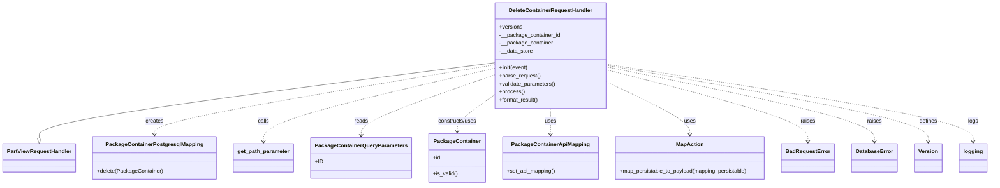

# Diagram: partview_core/partview_service/partview_service/api/package_container/handlers/delete_container.py

> Auto-generated by Obscura crawlers

## Mermaid

### SVG

<svg id="container" width="2845.7421875" xmlns="http://www.w3.org/2000/svg" class="classDiagram" height="546" viewBox="0 0 2845.7421875 546" role="graphics-document document" aria-roledescription="class"><g><defs><marker id="container_class-aggregationStart" class="marker aggregation class" refX="18" refY="7" markerWidth="190" markerHeight="240" orient="auto"><path d="M 18,7 L9,13 L1,7 L9,1 Z"></path></marker></defs><defs><marker id="container_class-aggregationEnd" class="marker aggregation class" refX="1" refY="7" markerWidth="20" markerHeight="28" orient="auto"><path d="M 18,7 L9,13 L1,7 L9,1 Z"></path></marker></defs><defs><marker id="container_class-extensionStart" class="marker extension class" refX="18" refY="7" markerWidth="190" markerHeight="240" orient="auto"><path d="M 1,7 L18,13 V 1 Z"></path></marker></defs><defs><marker id="container_class-extensionEnd" class="marker extension class" refX="1" refY="7" markerWidth="20" markerHeight="28" orient="auto"><path d="M 1,1 V 13 L18,7 Z"></path></marker></defs><defs><marker id="container_class-compositionStart" class="marker composition class" refX="18" refY="7" markerWidth="190" markerHeight="240" orient="auto"><path d="M 18,7 L9,13 L1,7 L9,1 Z"></path></marker></defs><defs><marker id="container_class-compositionEnd" class="marker composition class" refX="1" refY="7" markerWidth="20" markerHeight="28" orient="auto"><path d="M 18,7 L9,13 L1,7 L9,1 Z"></path></marker></defs><defs><marker id="container_class-dependencyStart" class="marker dependency class" refX="6" refY="7" markerWidth="190" markerHeight="240" orient="auto"><path d="M 5,7 L9,13 L1,7 L9,1 Z"></path></marker></defs><defs><marker id="container_class-dependencyEnd" class="marker dependency class" refX="13" refY="7" markerWidth="20" markerHeight="28" orient="auto"><path d="M 18,7 L9,13 L14,7 L9,1 Z"></path></marker></defs><defs><marker id="container_class-lollipopStart" class="marker lollipop class" refX="13" refY="7" markerWidth="190" markerHeight="240" orient="auto"><circle stroke="black" fill="transparent" cx="7" cy="7" r="6"></circle></marker></defs><defs><marker id="container_class-lollipopEnd" class="marker lollipop class" refX="1" refY="7" markerWidth="190" markerHeight="240" orient="auto"><circle stroke="black" fill="transparent" cx="7" cy="7" r="6"></circle></marker></defs><g class="root"><g class="clusters"></g><g class="edgePaths"><path d="M1412.723,185.192L1195.829,213.826C978.935,242.461,545.147,299.731,328.253,336.657C111.359,373.583,111.359,390.167,111.359,398.458L111.359,406.75" id="id_DeleteContainerRequestHandler_PartViewRequestHandler_1" class="edge-thickness-normal edge-pattern-solid relation" style=";;;" data-edge="true" data-et="edge" data-id="id_DeleteContainerRequestHandler_PartViewRequestHandler_1" data-points="W3sieCI6MTQxMi43MjI2NTYyNSwieSI6MTg1LjE5MTU3NDQxMzI3OTE0fSx7IngiOjExMS4zNTkzNzUsInkiOjM1N30seyJ4IjoxMTEuMzU5Mzc1LCJ5Ijo0MjR9XQ==" marker-end="url(#container_class-extensionEnd)"></path><path d="M1412.723,191.362L1250.776,218.969C1088.829,246.575,764.936,301.787,602.99,336.06C441.043,370.333,441.043,383.667,441.043,390.333L441.043,397" id="id_DeleteContainerRequestHandler_PackageContainerPostgresqlMapping_2" class="edge-thickness-normal edge-pattern-dashed relation" style=";;;" data-edge="true" data-et="edge" data-id="id_DeleteContainerRequestHandler_PackageContainerPostgresqlMapping_2" data-points="W3sieCI6MTQxMi43MjI2NTYyNSwieSI6MTkxLjM2MjM0MjI0MTYzNTF9LHsieCI6NDQxLjA0Mjk2ODc1LCJ5IjozNTd9LHsieCI6NDQxLjA0Mjk2ODc1LCJ5Ijo0MDN9XQ==" marker-end="url(#container_class-dependencyEnd)"></path><path d="M1412.723,201.831L1302.993,227.692C1193.263,253.554,973.803,305.277,864.074,341.305C754.344,377.333,754.344,397.667,754.344,407.833L754.344,418" id="id_DeleteContainerRequestHandler_get_path_parameter_3" class="edge-thickness-normal edge-pattern-dashed relation" style=";;;" data-edge="true" data-et="edge" data-id="id_DeleteContainerRequestHandler_get_path_parameter_3" data-points="W3sieCI6MTQxMi43MjI2NTYyNSwieSI6MjAxLjgzMDg5ODE3MTYwMTR9LHsieCI6NzU0LjM0Mzc1LCJ5IjozNTd9LHsieCI6NzU0LjM0Mzc1LCJ5Ijo0MjR9XQ==" marker-end="url(#container_class-dependencyEnd)"></path><path d="M1412.723,221.262L1349.307,243.885C1285.891,266.508,1159.059,311.754,1095.643,341.544C1032.227,371.333,1032.227,385.667,1032.227,392.833L1032.227,400" id="id_DeleteContainerRequestHandler_PackageContainerQueryParameters_4" class="edge-thickness-normal edge-pattern-dashed relation" style=";;;" data-edge="true" data-et="edge" data-id="id_DeleteContainerRequestHandler_PackageContainerQueryParameters_4" data-points="W3sieCI6MTQxMi43MjI2NTYyNSwieSI6MjIxLjI2MjE4OTYxODY5NzYyfSx7IngiOjEwMzIuMjI2NTYyNSwieSI6MzU3fSx7IngiOjEwMzIuMjI2NTYyNSwieSI6NDA2fV0=" marker-end="url(#container_class-dependencyEnd)"></path><path d="M1412.723,279.174L1394.645,292.145C1376.568,305.116,1340.413,331.058,1322.335,349.196C1304.258,367.333,1304.258,377.667,1304.258,382.833L1304.258,388" id="id_DeleteContainerRequestHandler_PackageContainer_5" class="edge-thickness-normal edge-pattern-dashed relation" style=";;;" data-edge="true" data-et="edge" data-id="id_DeleteContainerRequestHandler_PackageContainer_5" data-points="W3sieCI6MTQxMi43MjI2NTYyNSwieSI6Mjc5LjE3Mzg0ODAwODI0ODc0fSx7IngiOjEzMDQuMjU3ODEyNSwieSI6MzU3fSx7IngiOjEzMDQuMjU3ODEyNSwieSI6Mzk0fV0=" marker-end="url(#container_class-dependencyEnd)"></path><path d="M1573.238,320L1573.238,326.167C1573.238,332.333,1573.238,344.667,1573.238,357.5C1573.238,370.333,1573.238,383.667,1573.238,390.333L1573.238,397" id="id_DeleteContainerRequestHandler_PackageContainerApiMapping_6" class="edge-thickness-normal edge-pattern-dashed relation" style=";;;" data-edge="true" data-et="edge" data-id="id_DeleteContainerRequestHandler_PackageContainerApiMapping_6" data-points="W3sieCI6MTU3My4yMzgyODEyNSwieSI6MzIwfSx7IngiOjE1NzMuMjM4MjgxMjUsInkiOjM1N30seyJ4IjoxNTczLjIzODI4MTI1LCJ5Ijo0MDN9XQ==" marker-end="url(#container_class-dependencyEnd)"></path><path d="M1733.754,239.72L1775.19,259.267C1816.626,278.813,1899.499,317.907,1940.935,344.12C1982.371,370.333,1982.371,383.667,1982.371,390.333L1982.371,397" id="id_DeleteContainerRequestHandler_MapAction_7" class="edge-thickness-normal edge-pattern-dashed relation" style=";;;" data-edge="true" data-et="edge" data-id="id_DeleteContainerRequestHandler_MapAction_7" data-points="W3sieCI6MTczMy43NTM5MDYyNSwieSI6MjM5LjcxOTk0ODgyNDY4NjM2fSx7IngiOjE5ODIuMzcxMDkzNzUsInkiOjM1N30seyJ4IjoxOTgyLjM3MTA5Mzc1LCJ5Ijo0MDN9XQ==" marker-end="url(#container_class-dependencyEnd)"></path><path d="M1733.754,205.049L1832.783,230.374C1931.813,255.699,2129.871,306.35,2228.9,341.842C2327.93,377.333,2327.93,397.667,2327.93,407.833L2327.93,418" id="id_DeleteContainerRequestHandler_BadRequestError_8" class="edge-thickness-normal edge-pattern-dashed relation" style=";;;" data-edge="true" data-et="edge" data-id="id_DeleteContainerRequestHandler_BadRequestError_8" data-points="W3sieCI6MTczMy43NTM5MDYyNSwieSI6MjA1LjA0OTI0OTIyNzQ4ODQ3fSx7IngiOjIzMjcuOTI5Njg3NSwieSI6MzU3fSx7IngiOjIzMjcuOTI5Njg3NSwieSI6NDI0fV0=" marker-end="url(#container_class-dependencyEnd)"></path><path d="M1733.754,196.841L1864.223,223.534C1994.693,250.227,2255.632,303.614,2386.101,340.473C2516.57,377.333,2516.57,397.667,2516.57,407.833L2516.57,418" id="id_DeleteContainerRequestHandler_DatabaseError_9" class="edge-thickness-normal edge-pattern-dashed relation" style=";;;" data-edge="true" data-et="edge" data-id="id_DeleteContainerRequestHandler_DatabaseError_9" data-points="W3sieCI6MTczMy43NTM5MDYyNSwieSI6MTk2Ljg0MDUyMTI1NzM0NDkzfSx7IngiOjI1MTYuNTcwMzEyNSwieSI6MzU3fSx7IngiOjI1MTYuNTcwMzEyNSwieSI6NDI0fV0=" marker-end="url(#container_class-dependencyEnd)"></path><path d="M1733.754,192.241L1889.833,219.7C2045.911,247.16,2358.069,302.08,2514.148,339.707C2670.227,377.333,2670.227,397.667,2670.227,407.833L2670.227,418" id="id_DeleteContainerRequestHandler_Version_10" class="edge-thickness-normal edge-pattern-dashed relation" style=";;;" data-edge="true" data-et="edge" data-id="id_DeleteContainerRequestHandler_Version_10" data-points="W3sieCI6MTczMy43NTM5MDYyNSwieSI6MTkyLjI0MDUxNjQ3MDg3NzN9LHsieCI6MjY3MC4yMjY1NjI1LCJ5IjozNTd9LHsieCI6MjY3MC4yMjY1NjI1LCJ5Ijo0MjR9XQ==" marker-end="url(#container_class-dependencyEnd)"></path><path d="M1733.754,189.281L1911.234,217.234C2088.714,245.188,2443.673,301.094,2621.153,339.214C2798.633,377.333,2798.633,397.667,2798.633,407.833L2798.633,418" id="id_DeleteContainerRequestHandler_logging_11" class="edge-thickness-normal edge-pattern-dashed relation" style=";;;" data-edge="true" data-et="edge" data-id="id_DeleteContainerRequestHandler_logging_11" data-points="W3sieCI6MTczMy43NTM5MDYyNSwieSI6MTg5LjI4MTI1ODI2ODIyMzU1fSx7IngiOjI3OTguNjMyODEyNSwieSI6MzU3fSx7IngiOjI3OTguNjMyODEyNSwieSI6NDI0fV0=" marker-end="url(#container_class-dependencyEnd)"></path></g><g class="edgeLabels"><g class="edgeLabel"><g class="label" data-id="id_DeleteContainerRequestHandler_PartViewRequestHandler_1" transform="translate(0, 0)"><foreignObject width="0" height="0">

</foreignObject></g></g><g class="edgeLabel" transform="translate(441.04296875, 357)"><g class="label" data-id="id_DeleteContainerRequestHandler_PackageContainerPostgresqlMapping_2" transform="translate(-26.171875, -12)"><foreignObject width="52.34375" height="24">

creates

</foreignObject></g></g><g class="edgeLabel" transform="translate(754.34375, 357)"><g class="label" data-id="id_DeleteContainerRequestHandler_get_path_parameter_3" transform="translate(-16.4453125, -12)"><foreignObject width="32.890625" height="24">

calls

</foreignObject></g></g><g class="edgeLabel" transform="translate(1032.2265625, 357)"><g class="label" data-id="id_DeleteContainerRequestHandler_PackageContainerQueryParameters_4" transform="translate(-20.0078125, -12)"><foreignObject width="40.015625" height="24">

reads

</foreignObject></g></g><g class="edgeLabel" transform="translate(1304.2578125, 357)"><g class="label" data-id="id_DeleteContainerRequestHandler_PackageContainer_5" transform="translate(-58.25, -12)"><foreignObject width="116.5" height="24">

constructs/uses

</foreignObject></g></g><g class="edgeLabel" transform="translate(1573.23828125, 357)"><g class="label" data-id="id_DeleteContainerRequestHandler_PackageContainerApiMapping_6" transform="translate(-16.4921875, -12)"><foreignObject width="32.984375" height="24">

uses

</foreignObject></g></g><g class="edgeLabel" transform="translate(1982.37109375, 357)"><g class="label" data-id="id_DeleteContainerRequestHandler_MapAction_7" transform="translate(-16.4921875, -12)"><foreignObject width="32.984375" height="24">

uses

</foreignObject></g></g><g class="edgeLabel" transform="translate(2327.9296875, 357)"><g class="label" data-id="id_DeleteContainerRequestHandler_BadRequestError_8" transform="translate(-21.25, -12)"><foreignObject width="42.5" height="24">

raises

</foreignObject></g></g><g class="edgeLabel" transform="translate(2516.5703125, 357)"><g class="label" data-id="id_DeleteContainerRequestHandler_DatabaseError_9" transform="translate(-21.25, -12)"><foreignObject width="42.5" height="24">

raises

</foreignObject></g></g><g class="edgeLabel" transform="translate(2670.2265625, 357)"><g class="label" data-id="id_DeleteContainerRequestHandler_Version_10" transform="translate(-26.53125, -12)"><foreignObject width="53.0625" height="24">

defines

</foreignObject></g></g><g class="edgeLabel" transform="translate(2798.6328125, 357)"><g class="label" data-id="id_DeleteContainerRequestHandler_logging_11" transform="translate(-14.8203125, -12)"><foreignObject width="29.640625" height="24">

logs

</foreignObject></g></g></g><g class="nodes"><g class="node default" id="classId-DeleteContainerRequestHandler-0" transform="translate(1573.23828125, 164)"><g class="basic label-container"><path d="M-160.515625 -156 L160.515625 -156 L160.515625 156 L-160.515625 156" stroke="none" stroke-width="0" fill="#ECECFF" style=""></path><path d="M-160.515625 -156 C-69.35908516715185 -156, 21.797454665696307 -156, 160.515625 -156 M-160.515625 -156 C-92.49340794533434 -156, -24.47119089066868 -156, 160.515625 -156 M160.515625 -156 C160.515625 -35.47856610328114, 160.515625 85.04286779343772, 160.515625 156 M160.515625 -156 C160.515625 -82.63137922595917, 160.515625 -9.26275845191833, 160.515625 156 M160.515625 156 C82.27879703359837 156, 4.041969067196732 156, -160.515625 156 M160.515625 156 C45.80478076758659 156, -68.90606346482681 156, -160.515625 156 M-160.515625 156 C-160.515625 91.70625013435146, -160.515625 27.412500268702928, -160.515625 -156 M-160.515625 156 C-160.515625 87.41260774658144, -160.515625 18.825215493162887, -160.515625 -156" stroke="#9370DB" stroke-width="1.3" fill="none" stroke-dasharray="0 0" style=""></path></g><g class="annotation-group text" transform="translate(0, -132)"></g><g class="label-group text" transform="translate(-118.40625, -132)"><g class="label" style="font-weight: bolder" transform="translate(0,-12)"><foreignObject width="236.8125" height="24">

DeleteContainerRequestHandler

</foreignObject></g></g><g class="members-group text" transform="translate(-148.515625, -84)"><g class="label" style="" transform="translate(0,-12)"><foreignObject width="68.46875" height="24">

+versions

</foreignObject></g><g class="label" style="" transform="translate(0,12)"><foreignObject width="178.625" height="24">

-__package_container_id

</foreignObject></g><g class="label" style="" transform="translate(0,36)"><foreignObject width="157.515625" height="24">

-__package_container

</foreignObject></g><g class="label" style="" transform="translate(0,60)"><foreignObject width="99.0625" height="24">

-__data_store

</foreignObject></g></g><g class="methods-group text" transform="translate(-148.515625, 36)"><g class="label" style="" transform="translate(0,-12)"><foreignObject width="83.140625" height="24">

+<strong>init</strong>(event)

</foreignObject></g><g class="label" style="" transform="translate(0,12)"><foreignObject width="121.796875" height="24">

+parse_request()

</foreignObject></g><g class="label" style="" transform="translate(0,36)"><foreignObject width="166.546875" height="24">

+validate_parameters()

</foreignObject></g><g class="label" style="" transform="translate(0,60)"><foreignObject width="73.734375" height="24">

+process()

</foreignObject></g><g class="label" style="" transform="translate(0,84)"><foreignObject width="117.015625" height="24">

+format_result()

</foreignObject></g></g><g class="divider" style=""><path d="M-160.515625 -108 C-48.0944240524055 -108, 64.326776895189 -108, 160.515625 -108 M-160.515625 -108 C-44.68801585045064 -108, 71.13959329909872 -108, 160.515625 -108" stroke="#9370DB" stroke-width="1.3" fill="none" stroke-dasharray="0 0" style=""></path></g><g class="divider" style=""><path d="M-160.515625 12 C-83.92933913779865 12, -7.343053275597299 12, 160.515625 12 M-160.515625 12 C-52.11399460013803 12, 56.287635799723944 12, 160.515625 12" stroke="#9370DB" stroke-width="1.3" fill="none" stroke-dasharray="0 0" style=""></path></g></g><g class="node default" id="classId-PartViewRequestHandler-1" transform="translate(111.359375, 466)"><g class="basic label-container"><path d="M-103.359375 -42 L103.359375 -42 L103.359375 42 L-103.359375 42" stroke="none" stroke-width="0" fill="#ECECFF" style=""></path><path d="M-103.359375 -42 C-24.55200080037922 -42, 54.25537339924156 -42, 103.359375 -42 M-103.359375 -42 C-43.770108885022175 -42, 15.81915722995565 -42, 103.359375 -42 M103.359375 -42 C103.359375 -13.023357259693459, 103.359375 15.953285480613083, 103.359375 42 M103.359375 -42 C103.359375 -23.498230296454444, 103.359375 -4.996460592908889, 103.359375 42 M103.359375 42 C53.820159718042206 42, 4.280944436084411 42, -103.359375 42 M103.359375 42 C34.80822084655237 42, -33.74293330689525 42, -103.359375 42 M-103.359375 42 C-103.359375 23.872996145365406, -103.359375 5.745992290730811, -103.359375 -42 M-103.359375 42 C-103.359375 15.318337077993856, -103.359375 -11.363325844012287, -103.359375 -42" stroke="#9370DB" stroke-width="1.3" fill="none" stroke-dasharray="0 0" style=""></path></g><g class="annotation-group text" transform="translate(0, -18)"></g><g class="label-group text" transform="translate(-91.359375, -18)"><g class="label" style="font-weight: bolder" transform="translate(0,-12)"><foreignObject width="182.71875" height="24">

PartViewRequestHandler

</foreignObject></g></g><g class="members-group text" transform="translate(-91.359375, 30)"></g><g class="methods-group text" transform="translate(-91.359375, 60)"></g><g class="divider" style=""><path d="M-103.359375 6 C-51.21797241536171 6, 0.9234301692765854 6, 103.359375 6 M-103.359375 6 C-29.259969048523658 6, 44.839436902952684 6, 103.359375 6" stroke="#9370DB" stroke-width="1.3" fill="none" stroke-dasharray="0 0" style=""></path></g><g class="divider" style=""><path d="M-103.359375 24 C-29.39731912491105 24, 44.5647367501779 24, 103.359375 24 M-103.359375 24 C-38.49841623185469 24, 26.36254253629062 24, 103.359375 24" stroke="#9370DB" stroke-width="1.3" fill="none" stroke-dasharray="0 0" style=""></path></g></g><g class="node default" id="classId-PackageContainerPostgresqlMapping-2" transform="translate(441.04296875, 466)"><g class="basic label-container"><path d="M-176.32421875 -63 L176.32421875 -63 L176.32421875 63 L-176.32421875 63" stroke="none" stroke-width="0" fill="#ECECFF" style=""></path><path d="M-176.32421875 -63 C-72.32614098933406 -63, 31.671936771331872 -63, 176.32421875 -63 M-176.32421875 -63 C-68.48393959744098 -63, 39.35633955511804 -63, 176.32421875 -63 M176.32421875 -63 C176.32421875 -36.546050004988906, 176.32421875 -10.092100009977813, 176.32421875 63 M176.32421875 -63 C176.32421875 -19.230880081365825, 176.32421875 24.53823983726835, 176.32421875 63 M176.32421875 63 C95.4458565854748 63, 14.5674944209496 63, -176.32421875 63 M176.32421875 63 C89.21410688233772 63, 2.1039950146754336 63, -176.32421875 63 M-176.32421875 63 C-176.32421875 29.47318554138979, -176.32421875 -4.053628917220422, -176.32421875 -63 M-176.32421875 63 C-176.32421875 26.32323530843766, -176.32421875 -10.35352938312468, -176.32421875 -63" stroke="#9370DB" stroke-width="1.3" fill="none" stroke-dasharray="0 0" style=""></path></g><g class="annotation-group text" transform="translate(0, -39)"></g><g class="label-group text" transform="translate(-135.8515625, -39)"><g class="label" style="font-weight: bolder" transform="translate(0,-12)"><foreignObject width="271.703125" height="24">

PackageContainerPostgresqlMapping

</foreignObject></g></g><g class="members-group text" transform="translate(-164.32421875, 9)"></g><g class="methods-group text" transform="translate(-164.32421875, 39)"><g class="label" style="" transform="translate(0,-12)"><foreignObject width="192.796875" height="24">

+delete(PackageContainer)

</foreignObject></g></g><g class="divider" style=""><path d="M-176.32421875 -15 C-38.57871237146378 -15, 99.16679400707244 -15, 176.32421875 -15 M-176.32421875 -15 C-41.33701128044834 -15, 93.65019618910333 -15, 176.32421875 -15" stroke="#9370DB" stroke-width="1.3" fill="none" stroke-dasharray="0 0" style=""></path></g><g class="divider" style=""><path d="M-176.32421875 9 C-37.212330992309404 9, 101.89955676538119 9, 176.32421875 9 M-176.32421875 9 C-103.86922149063763 9, -31.414224231275256 9, 176.32421875 9" stroke="#9370DB" stroke-width="1.3" fill="none" stroke-dasharray="0 0" style=""></path></g></g><g class="node default" id="classId-PackageContainer-3" transform="translate(1304.2578125, 466)"><g class="basic label-container"><path d="M-81.125 -72 L81.125 -72 L81.125 72 L-81.125 72" stroke="none" stroke-width="0" fill="#ECECFF" style=""></path><path d="M-81.125 -72 C-35.259110018057775 -72, 10.606779963884449 -72, 81.125 -72 M-81.125 -72 C-34.53752308526153 -72, 12.049953829476934 -72, 81.125 -72 M81.125 -72 C81.125 -42.41488936770864, 81.125 -12.829778735417271, 81.125 72 M81.125 -72 C81.125 -15.722822748319551, 81.125 40.5543545033609, 81.125 72 M81.125 72 C46.58581207639129 72, 12.046624152782584 72, -81.125 72 M81.125 72 C21.970234038614457 72, -37.184531922771086 72, -81.125 72 M-81.125 72 C-81.125 18.810410320088437, -81.125 -34.37917935982313, -81.125 -72 M-81.125 72 C-81.125 26.236432913395674, -81.125 -19.52713417320865, -81.125 -72" stroke="#9370DB" stroke-width="1.3" fill="none" stroke-dasharray="0 0" style=""></path></g><g class="annotation-group text" transform="translate(0, -48)"></g><g class="label-group text" transform="translate(-65.453125, -48)"><g class="label" style="font-weight: bolder" transform="translate(0,-12)"><foreignObject width="130.90625" height="24">

PackageContainer

</foreignObject></g></g><g class="members-group text" transform="translate(-69.125, 0)"><g class="label" style="" transform="translate(0,-12)"><foreignObject width="22.078125" height="24">

+id

</foreignObject></g></g><g class="methods-group text" transform="translate(-69.125, 48)"><g class="label" style="" transform="translate(0,-12)"><foreignObject width="72.796875" height="24">

+is_valid()

</foreignObject></g></g><g class="divider" style=""><path d="M-81.125 -24 C-19.802791024078957 -24, 41.51941795184209 -24, 81.125 -24 M-81.125 -24 C-34.59055871574255 -24, 11.943882568514894 -24, 81.125 -24" stroke="#9370DB" stroke-width="1.3" fill="none" stroke-dasharray="0 0" style=""></path></g><g class="divider" style=""><path d="M-81.125 24 C-24.313614739352076 24, 32.49777052129585 24, 81.125 24 M-81.125 24 C-27.912062224374687 24, 25.300875551250627 24, 81.125 24" stroke="#9370DB" stroke-width="1.3" fill="none" stroke-dasharray="0 0" style=""></path></g></g><g class="node default" id="classId-PackageContainerApiMapping-4" transform="translate(1573.23828125, 466)"><g class="basic label-container"><path d="M-137.85546875 -63 L137.85546875 -63 L137.85546875 63 L-137.85546875 63" stroke="none" stroke-width="0" fill="#ECECFF" style=""></path><path d="M-137.85546875 -63 C-78.34248989133405 -63, -18.82951103266811 -63, 137.85546875 -63 M-137.85546875 -63 C-71.5013923815806 -63, -5.147316013161202 -63, 137.85546875 -63 M137.85546875 -63 C137.85546875 -27.13998902018757, 137.85546875 8.720021959624859, 137.85546875 63 M137.85546875 -63 C137.85546875 -35.24573021462991, 137.85546875 -7.491460429259817, 137.85546875 63 M137.85546875 63 C77.1750882102459 63, 16.494707670491806 63, -137.85546875 63 M137.85546875 63 C59.486554164120435 63, -18.88236042175913 63, -137.85546875 63 M-137.85546875 63 C-137.85546875 20.16824614426389, -137.85546875 -22.66350771147222, -137.85546875 -63 M-137.85546875 63 C-137.85546875 22.66041236143927, -137.85546875 -17.67917527712146, -137.85546875 -63" stroke="#9370DB" stroke-width="1.3" fill="none" stroke-dasharray="0 0" style=""></path></g><g class="annotation-group text" transform="translate(0, -39)"></g><g class="label-group text" transform="translate(-108.7109375, -39)"><g class="label" style="font-weight: bolder" transform="translate(0,-12)"><foreignObject width="217.421875" height="24">

PackageContainerApiMapping

</foreignObject></g></g><g class="members-group text" transform="translate(-125.85546875, 9)"></g><g class="methods-group text" transform="translate(-125.85546875, 39)"><g class="label" style="" transform="translate(0,-12)"><foreignObject width="143" height="24">

+set_api_mapping()

</foreignObject></g></g><g class="divider" style=""><path d="M-137.85546875 -15 C-58.709642896667745 -15, 20.43618295666451 -15, 137.85546875 -15 M-137.85546875 -15 C-74.06663278099958 -15, -10.277796811999167 -15, 137.85546875 -15" stroke="#9370DB" stroke-width="1.3" fill="none" stroke-dasharray="0 0" style=""></path></g><g class="divider" style=""><path d="M-137.85546875 9 C-29.14013072580852 9, 79.57520729838296 9, 137.85546875 9 M-137.85546875 9 C-65.10485060702784 9, 7.645767535944316 9, 137.85546875 9" stroke="#9370DB" stroke-width="1.3" fill="none" stroke-dasharray="0 0" style=""></path></g></g><g class="node default" id="classId-MapAction-5" transform="translate(1982.37109375, 466)"><g class="basic label-container"><path d="M-221.27734375 -63 L221.27734375 -63 L221.27734375 63 L-221.27734375 63" stroke="none" stroke-width="0" fill="#ECECFF" style=""></path><path d="M-221.27734375 -63 C-128.03071511737278 -63, -34.78408648474553 -63, 221.27734375 -63 M-221.27734375 -63 C-48.921259387397555 -63, 123.43482497520489 -63, 221.27734375 -63 M221.27734375 -63 C221.27734375 -35.61800995354178, 221.27734375 -8.23601990708356, 221.27734375 63 M221.27734375 -63 C221.27734375 -15.59322441248851, 221.27734375 31.81355117502298, 221.27734375 63 M221.27734375 63 C65.9295047931912 63, -89.4183341636176 63, -221.27734375 63 M221.27734375 63 C84.8709164466934 63, -51.5355108566132 63, -221.27734375 63 M-221.27734375 63 C-221.27734375 23.49316518875105, -221.27734375 -16.0136696224979, -221.27734375 -63 M-221.27734375 63 C-221.27734375 31.806975451493006, -221.27734375 0.6139509029860122, -221.27734375 -63" stroke="#9370DB" stroke-width="1.3" fill="none" stroke-dasharray="0 0" style=""></path></g><g class="annotation-group text" transform="translate(0, -39)"></g><g class="label-group text" transform="translate(-38.6328125, -39)"><g class="label" style="font-weight: bolder" transform="translate(0,-12)"><foreignObject width="77.265625" height="24">

MapAction

</foreignObject></g></g><g class="members-group text" transform="translate(-209.27734375, 9)"></g><g class="methods-group text" transform="translate(-209.27734375, 39)"><g class="label" style="" transform="translate(0,-12)"><foreignObject width="379.921875" height="24">

+map_persistable_to_payload(mapping, persistable)

</foreignObject></g></g><g class="divider" style=""><path d="M-221.27734375 -15 C-53.844173263702686 -15, 113.58899722259463 -15, 221.27734375 -15 M-221.27734375 -15 C-63.80805523694738 -15, 93.66123327610524 -15, 221.27734375 -15" stroke="#9370DB" stroke-width="1.3" fill="none" stroke-dasharray="0 0" style=""></path></g><g class="divider" style=""><path d="M-221.27734375 9 C-115.82600537761435 9, -10.374667005228702 9, 221.27734375 9 M-221.27734375 9 C-84.42519823245718 9, 52.426947285085646 9, 221.27734375 9" stroke="#9370DB" stroke-width="1.3" fill="none" stroke-dasharray="0 0" style=""></path></g></g><g class="node default" id="classId-get_path_parameter-6" transform="translate(754.34375, 466)"><g class="basic label-container"><path d="M-86.9765625 -42 L86.9765625 -42 L86.9765625 42 L-86.9765625 42" stroke="none" stroke-width="0" fill="#ECECFF" style=""></path><path d="M-86.9765625 -42 C-44.93929737255613 -42, -2.9020322451122667 -42, 86.9765625 -42 M-86.9765625 -42 C-25.60183412508583 -42, 35.77289424982834 -42, 86.9765625 -42 M86.9765625 -42 C86.9765625 -11.354116223890326, 86.9765625 19.291767552219348, 86.9765625 42 M86.9765625 -42 C86.9765625 -24.81777609232709, 86.9765625 -7.6355521846541805, 86.9765625 42 M86.9765625 42 C36.27518694146006 42, -14.426188617079873 42, -86.9765625 42 M86.9765625 42 C26.38642316167912 42, -34.20371617664176 42, -86.9765625 42 M-86.9765625 42 C-86.9765625 23.339170258774562, -86.9765625 4.678340517549124, -86.9765625 -42 M-86.9765625 42 C-86.9765625 11.672786198389907, -86.9765625 -18.654427603220185, -86.9765625 -42" stroke="#9370DB" stroke-width="1.3" fill="none" stroke-dasharray="0 0" style=""></path></g><g class="annotation-group text" transform="translate(0, -18)"></g><g class="label-group text" transform="translate(-74.9765625, -18)"><g class="label" style="font-weight: bolder" transform="translate(0,-12)"><foreignObject width="149.953125" height="24">

get_path_parameter

</foreignObject></g></g><g class="members-group text" transform="translate(-74.9765625, 30)"></g><g class="methods-group text" transform="translate(-74.9765625, 60)"></g><g class="divider" style=""><path d="M-86.9765625 6 C-27.39728357047133 6, 32.18199535905734 6, 86.9765625 6 M-86.9765625 6 C-18.138540942232552 6, 50.699480615534895 6, 86.9765625 6" stroke="#9370DB" stroke-width="1.3" fill="none" stroke-dasharray="0 0" style=""></path></g><g class="divider" style=""><path d="M-86.9765625 24 C-36.963376774619945 24, 13.04980895076011 24, 86.9765625 24 M-86.9765625 24 C-35.35075379288951 24, 16.275054914220974 24, 86.9765625 24" stroke="#9370DB" stroke-width="1.3" fill="none" stroke-dasharray="0 0" style=""></path></g></g><g class="node default" id="classId-PackageContainerQueryParameters-7" transform="translate(1032.2265625, 466)"><g class="basic label-container"><path d="M-140.90625 -60 L140.90625 -60 L140.90625 60 L-140.90625 60" stroke="none" stroke-width="0" fill="#ECECFF" style=""></path><path d="M-140.90625 -60 C-32.02870697138481 -60, 76.84883605723039 -60, 140.90625 -60 M-140.90625 -60 C-83.6004648884419 -60, -26.29467977688381 -60, 140.90625 -60 M140.90625 -60 C140.90625 -25.044976123528684, 140.90625 9.910047752942631, 140.90625 60 M140.90625 -60 C140.90625 -12.988784839363817, 140.90625 34.02243032127237, 140.90625 60 M140.90625 60 C31.01752702746026 60, -78.87119594507948 60, -140.90625 60 M140.90625 60 C83.37612120091956 60, 25.845992401839112 60, -140.90625 60 M-140.90625 60 C-140.90625 32.863957793512235, -140.90625 5.727915587024469, -140.90625 -60 M-140.90625 60 C-140.90625 27.930545991226403, -140.90625 -4.138908017547195, -140.90625 -60" stroke="#9370DB" stroke-width="1.3" fill="none" stroke-dasharray="0 0" style=""></path></g><g class="annotation-group text" transform="translate(0, -36)"></g><g class="label-group text" transform="translate(-128.90625, -36)"><g class="label" style="font-weight: bolder" transform="translate(0,-12)"><foreignObject width="257.8125" height="24">

PackageContainerQueryParameters

</foreignObject></g></g><g class="members-group text" transform="translate(-128.90625, 12)"><g class="label" style="" transform="translate(0,-12)"><foreignObject width="23.015625" height="24">

+ID

</foreignObject></g></g><g class="methods-group text" transform="translate(-128.90625, 60)"></g><g class="divider" style=""><path d="M-140.90625 -12 C-57.330160279123874 -12, 26.245929441752253 -12, 140.90625 -12 M-140.90625 -12 C-49.85774116116258 -12, 41.19076767767484 -12, 140.90625 -12" stroke="#9370DB" stroke-width="1.3" fill="none" stroke-dasharray="0 0" style=""></path></g><g class="divider" style=""><path d="M-140.90625 36 C-45.69794835288545 36, 49.510353294229105 36, 140.90625 36 M-140.90625 36 C-28.42281088015973 36, 84.06062823968054 36, 140.90625 36" stroke="#9370DB" stroke-width="1.3" fill="none" stroke-dasharray="0 0" style=""></path></g></g><g class="node default" id="classId-BadRequestError-8" transform="translate(2327.9296875, 466)"><g class="basic label-container"><path d="M-74.28125 -42 L74.28125 -42 L74.28125 42 L-74.28125 42" stroke="none" stroke-width="0" fill="#ECECFF" style=""></path><path d="M-74.28125 -42 C-41.47346910252082 -42, -8.665688205041647 -42, 74.28125 -42 M-74.28125 -42 C-30.070981906895064 -42, 14.139286186209873 -42, 74.28125 -42 M74.28125 -42 C74.28125 -23.403085388590828, 74.28125 -4.806170777181656, 74.28125 42 M74.28125 -42 C74.28125 -25.087625787504383, 74.28125 -8.175251575008765, 74.28125 42 M74.28125 42 C28.42715276323179 42, -17.426944473536423 42, -74.28125 42 M74.28125 42 C19.51141683548751 42, -35.25841632902498 42, -74.28125 42 M-74.28125 42 C-74.28125 13.006795039324512, -74.28125 -15.986409921350976, -74.28125 -42 M-74.28125 42 C-74.28125 24.434415592199816, -74.28125 6.868831184399632, -74.28125 -42" stroke="#9370DB" stroke-width="1.3" fill="none" stroke-dasharray="0 0" style=""></path></g><g class="annotation-group text" transform="translate(0, -18)"></g><g class="label-group text" transform="translate(-62.28125, -18)"><g class="label" style="font-weight: bolder" transform="translate(0,-12)"><foreignObject width="124.5625" height="24">

BadRequestError

</foreignObject></g></g><g class="members-group text" transform="translate(-62.28125, 30)"></g><g class="methods-group text" transform="translate(-62.28125, 60)"></g><g class="divider" style=""><path d="M-74.28125 6 C-34.1525121252259 6, 5.976225749548206 6, 74.28125 6 M-74.28125 6 C-20.20892863191135 6, 33.8633927361773 6, 74.28125 6" stroke="#9370DB" stroke-width="1.3" fill="none" stroke-dasharray="0 0" style=""></path></g><g class="divider" style=""><path d="M-74.28125 24 C-25.243616792548522 24, 23.794016414902956 24, 74.28125 24 M-74.28125 24 C-34.30688053598576 24, 5.667488928028476 24, 74.28125 24" stroke="#9370DB" stroke-width="1.3" fill="none" stroke-dasharray="0 0" style=""></path></g></g><g class="node default" id="classId-DatabaseError-9" transform="translate(2516.5703125, 466)"><g class="basic label-container"><path d="M-64.359375 -42 L64.359375 -42 L64.359375 42 L-64.359375 42" stroke="none" stroke-width="0" fill="#ECECFF" style=""></path><path d="M-64.359375 -42 C-18.893950362079728 -42, 26.571474275840544 -42, 64.359375 -42 M-64.359375 -42 C-21.072842786500857 -42, 22.213689426998286 -42, 64.359375 -42 M64.359375 -42 C64.359375 -12.511785707161017, 64.359375 16.976428585677965, 64.359375 42 M64.359375 -42 C64.359375 -12.292219677170543, 64.359375 17.415560645658914, 64.359375 42 M64.359375 42 C23.228670261247743 42, -17.902034477504515 42, -64.359375 42 M64.359375 42 C30.432944464823933 42, -3.4934860703521338 42, -64.359375 42 M-64.359375 42 C-64.359375 18.3589458402439, -64.359375 -5.282108319512197, -64.359375 -42 M-64.359375 42 C-64.359375 17.176961110425943, -64.359375 -7.646077779148115, -64.359375 -42" stroke="#9370DB" stroke-width="1.3" fill="none" stroke-dasharray="0 0" style=""></path></g><g class="annotation-group text" transform="translate(0, -18)"></g><g class="label-group text" transform="translate(-52.359375, -18)"><g class="label" style="font-weight: bolder" transform="translate(0,-12)"><foreignObject width="104.71875" height="24">

DatabaseError

</foreignObject></g></g><g class="members-group text" transform="translate(-52.359375, 30)"></g><g class="methods-group text" transform="translate(-52.359375, 60)"></g><g class="divider" style=""><path d="M-64.359375 6 C-19.716114227077725 6, 24.92714654584455 6, 64.359375 6 M-64.359375 6 C-38.31978269969389 6, -12.28019039938777 6, 64.359375 6" stroke="#9370DB" stroke-width="1.3" fill="none" stroke-dasharray="0 0" style=""></path></g><g class="divider" style=""><path d="M-64.359375 24 C-21.311557783268242 24, 21.736259433463516 24, 64.359375 24 M-64.359375 24 C-36.26789008387729 24, -8.17640516775458 24, 64.359375 24" stroke="#9370DB" stroke-width="1.3" fill="none" stroke-dasharray="0 0" style=""></path></g></g><g class="node default" id="classId-Version-10" transform="translate(2670.2265625, 466)"><g class="basic label-container"><path d="M-39.296875 -42 L39.296875 -42 L39.296875 42 L-39.296875 42" stroke="none" stroke-width="0" fill="#ECECFF" style=""></path><path d="M-39.296875 -42 C-17.19015084874958 -42, 4.9165733025008365 -42, 39.296875 -42 M-39.296875 -42 C-18.01922043717644 -42, 3.2584341256471205 -42, 39.296875 -42 M39.296875 -42 C39.296875 -12.06249929875451, 39.296875 17.87500140249098, 39.296875 42 M39.296875 -42 C39.296875 -11.968264162369362, 39.296875 18.063471675261276, 39.296875 42 M39.296875 42 C15.26920005920103 42, -8.758474881597941 42, -39.296875 42 M39.296875 42 C10.122714356021916 42, -19.051446287956168 42, -39.296875 42 M-39.296875 42 C-39.296875 24.729447168110863, -39.296875 7.458894336221725, -39.296875 -42 M-39.296875 42 C-39.296875 23.94967562412419, -39.296875 5.899351248248379, -39.296875 -42" stroke="#9370DB" stroke-width="1.3" fill="none" stroke-dasharray="0 0" style=""></path></g><g class="annotation-group text" transform="translate(0, -18)"></g><g class="label-group text" transform="translate(-27.296875, -18)"><g class="label" style="font-weight: bolder" transform="translate(0,-12)"><foreignObject width="54.59375" height="24">

Version

</foreignObject></g></g><g class="members-group text" transform="translate(-27.296875, 30)"></g><g class="methods-group text" transform="translate(-27.296875, 60)"></g><g class="divider" style=""><path d="M-39.296875 6 C-8.088916122834238 6, 23.119042754331524 6, 39.296875 6 M-39.296875 6 C-19.15455397566692 6, 0.9877670486661572 6, 39.296875 6" stroke="#9370DB" stroke-width="1.3" fill="none" stroke-dasharray="0 0" style=""></path></g><g class="divider" style=""><path d="M-39.296875 24 C-13.279141467600724 24, 12.738592064798553 24, 39.296875 24 M-39.296875 24 C-20.052392876633085 24, -0.8079107532661709 24, 39.296875 24" stroke="#9370DB" stroke-width="1.3" fill="none" stroke-dasharray="0 0" style=""></path></g></g><g class="node default" id="classId-logging-11" transform="translate(2798.6328125, 466)"><g class="basic label-container"><path d="M-39.109375 -42 L39.109375 -42 L39.109375 42 L-39.109375 42" stroke="none" stroke-width="0" fill="#ECECFF" style=""></path><path d="M-39.109375 -42 C-15.231341370240912 -42, 8.646692259518176 -42, 39.109375 -42 M-39.109375 -42 C-10.617923270416245 -42, 17.87352845916751 -42, 39.109375 -42 M39.109375 -42 C39.109375 -10.611524959557656, 39.109375 20.77695008088469, 39.109375 42 M39.109375 -42 C39.109375 -12.525303765300226, 39.109375 16.949392469399548, 39.109375 42 M39.109375 42 C8.182589784021598 42, -22.744195431956804 42, -39.109375 42 M39.109375 42 C15.182443022187154 42, -8.744488955625691 42, -39.109375 42 M-39.109375 42 C-39.109375 21.752379539405897, -39.109375 1.5047590788117944, -39.109375 -42 M-39.109375 42 C-39.109375 14.919317767387014, -39.109375 -12.161364465225972, -39.109375 -42" stroke="#9370DB" stroke-width="1.3" fill="none" stroke-dasharray="0 0" style=""></path></g><g class="annotation-group text" transform="translate(0, -18)"></g><g class="label-group text" transform="translate(-27.109375, -18)"><g class="label" style="font-weight: bolder" transform="translate(0,-12)"><foreignObject width="54.21875" height="24">

logging

</foreignObject></g></g><g class="members-group text" transform="translate(-27.109375, 30)"></g><g class="methods-group text" transform="translate(-27.109375, 60)"></g><g class="divider" style=""><path d="M-39.109375 6 C-10.263826367908003 6, 18.581722264183995 6, 39.109375 6 M-39.109375 6 C-16.704492691755007 6, 5.700389616489986 6, 39.109375 6" stroke="#9370DB" stroke-width="1.3" fill="none" stroke-dasharray="0 0" style=""></path></g><g class="divider" style=""><path d="M-39.109375 24 C-11.019066425698202 24, 17.071242148603595 24, 39.109375 24 M-39.109375 24 C-22.858646687061484 24, -6.607918374122967 24, 39.109375 24" stroke="#9370DB" stroke-width="1.3" fill="none" stroke-dasharray="0 0" style=""></path></g></g></g></g></g></svg>
