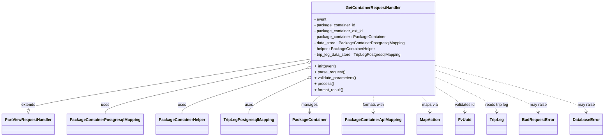

# Diagram: partview_core/partview_service/partview_service/api/package_container/handlers/get_container.py


> Auto-generated by Obscura crawlers

## Diagram 1



### SVG

<svg id="container" width="2367.375" xmlns="http://www.w3.org/2000/svg" class="classDiagram" height="558" viewBox="0 0 2367.375 558" role="graphics-document document" aria-roledescription="class"><style>#container{font-family:"trebuchet ms",verdana,arial,sans-serif;font-size:16px;fill:#333;}@keyframes edge-animation-frame{from{stroke-dashoffset:0;}}@keyframes dash{to{stroke-dashoffset:0;}}#container .edge-animation-slow{stroke-dasharray:9,5!important;stroke-dashoffset:900;animation:dash 50s linear infinite;stroke-linecap:round;}#container .edge-animation-fast{stroke-dasharray:9,5!important;stroke-dashoffset:900;animation:dash 20s linear infinite;stroke-linecap:round;}#container .error-icon{fill:#552222;}#container .error-text{fill:#552222;stroke:#552222;}#container .edge-thickness-normal{stroke-width:1px;}#container .edge-thickness-thick{stroke-width:3.5px;}#container .edge-pattern-solid{stroke-dasharray:0;}#container .edge-thickness-invisible{stroke-width:0;fill:none;}#container .edge-pattern-dashed{stroke-dasharray:3;}#container .edge-pattern-dotted{stroke-dasharray:2;}#container .marker{fill:#333333;stroke:#333333;}#container .marker.cross{stroke:#333333;}#container svg{font-family:"trebuchet ms",verdana,arial,sans-serif;font-size:16px;}#container p{margin:0;}#container g.classGroup text{fill:#9370DB;stroke:none;font-family:"trebuchet ms",verdana,arial,sans-serif;font-size:10px;}#container g.classGroup text .title{font-weight:bolder;}#container .nodeLabel,#container .edgeLabel{color:#131300;}#container .edgeLabel .label rect{fill:#ECECFF;}#container .label text{fill:#131300;}#container .labelBkg{background:#ECECFF;}#container .edgeLabel .label span{background:#ECECFF;}#container .classTitle{font-weight:bolder;}#container .node rect,#container .node circle,#container .node ellipse,#container .node polygon,#container .node path{fill:#ECECFF;stroke:#9370DB;stroke-width:1px;}#container .divider{stroke:#9370DB;stroke-width:1;}#container g.clickable{cursor:pointer;}#container g.classGroup rect{fill:#ECECFF;stroke:#9370DB;}#container g.classGroup line{stroke:#9370DB;stroke-width:1;}#container .classLabel .box{stroke:none;stroke-width:0;fill:#ECECFF;opacity:0.5;}#container .classLabel .label{fill:#9370DB;font-size:10px;}#container .relation{stroke:#333333;stroke-width:1;fill:none;}#container .dashed-line{stroke-dasharray:3;}#container .dotted-line{stroke-dasharray:1 2;}#container #compositionStart,#container .composition{fill:#333333!important;stroke:#333333!important;stroke-width:1;}#container #compositionEnd,#container .composition{fill:#333333!important;stroke:#333333!important;stroke-width:1;}#container #dependencyStart,#container .dependency{fill:#333333!important;stroke:#333333!important;stroke-width:1;}#container #dependencyStart,#container .dependency{fill:#333333!important;stroke:#333333!important;stroke-width:1;}#container #extensionStart,#container .extension{fill:transparent!important;stroke:#333333!important;stroke-width:1;}#container #extensionEnd,#container .extension{fill:transparent!important;stroke:#333333!important;stroke-width:1;}#container #aggregationStart,#container .aggregation{fill:transparent!important;stroke:#333333!important;stroke-width:1;}#container #aggregationEnd,#container .aggregation{fill:transparent!important;stroke:#333333!important;stroke-width:1;}#container #lollipopStart,#container .lollipop{fill:#ECECFF!important;stroke:#333333!important;stroke-width:1;}#container #lollipopEnd,#container .lollipop{fill:#ECECFF!important;stroke:#333333!important;stroke-width:1;}#container .edgeTerminals{font-size:11px;line-height:initial;}#container .classTitleText{text-anchor:middle;font-size:18px;fill:#333;}#container .label-icon{display:inline-block;height:1em;overflow:visible;vertical-align:-0.125em;}#container .node .label-icon path{fill:currentColor;stroke:revert;stroke-width:revert;}#container :root{--mermaid-font-family:"trebuchet ms",verdana,arial,sans-serif;}</style><g><defs><marker id="container_class-aggregationStart" class="marker aggregation class" refX="18" refY="7" markerWidth="190" markerHeight="240" orient="auto"><path d="M 18,7 L9,13 L1,7 L9,1 Z"></path></marker></defs><defs><marker id="container_class-aggregationEnd" class="marker aggregation class" refX="1" refY="7" markerWidth="20" markerHeight="28" orient="auto"><path d="M 18,7 L9,13 L1,7 L9,1 Z"></path></marker></defs><defs><marker id="container_class-extensionStart" class="marker extension class" refX="18" refY="7" markerWidth="190" markerHeight="240" orient="auto"><path d="M 1,7 L18,13 V 1 Z"></path></marker></defs><defs><marker id="container_class-extensionEnd" class="marker extension class" refX="1" refY="7" markerWidth="20" markerHeight="28" orient="auto"><path d="M 1,1 V 13 L18,7 Z"></path></marker></defs><defs><marker id="container_class-compositionStart" class="marker composition class" refX="18" refY="7" markerWidth="190" markerHeight="240" orient="auto"><path d="M 18,7 L9,13 L1,7 L9,1 Z"></path></marker></defs><defs><marker id="container_class-compositionEnd" class="marker composition class" refX="1" refY="7" markerWidth="20" markerHeight="28" orient="auto"><path d="M 18,7 L9,13 L1,7 L9,1 Z"></path></marker></defs><defs><marker id="container_class-dependencyStart" class="marker dependency class" refX="6" refY="7" markerWidth="190" markerHeight="240" orient="auto"><path d="M 5,7 L9,13 L1,7 L9,1 Z"></path></marker></defs><defs><marker id="container_class-dependencyEnd" class="marker dependency class" refX="13" refY="7" markerWidth="20" markerHeight="28" orient="auto"><path d="M 18,7 L9,13 L14,7 L9,1 Z"></path></marker></defs><defs><marker id="container_class-lollipopStart" class="marker lollipop class" refX="13" refY="7" markerWidth="190" markerHeight="240" orient="auto"><circle stroke="black" fill="transparent" cx="7" cy="7" r="6"></circle></marker></defs><defs><marker id="container_class-lollipopEnd" class="marker lollipop class" refX="1" refY="7" markerWidth="190" markerHeight="240" orient="auto"><circle stroke="black" fill="transparent" cx="7" cy="7" r="6"></circle></marker></defs><g class="root"><g class="clusters"></g><g class="edgePaths"><path d="M1209.566,242.369L1026.532,273.474C843.497,304.579,477.428,366.79,294.394,401.187C111.359,435.583,111.359,442.167,111.359,445.458L111.359,448.75" id="id_GetContainerRequestHandler_PartViewRequestHandler_1" class="edge-thickness-normal edge-pattern-solid relation" style=";;;" data-edge="true" data-et="edge" data-id="id_GetContainerRequestHandler_PartViewRequestHandler_1" data-points="W3sieCI6MTIwOS41NjY0MDYyNSwieSI6MjQyLjM2OTE3NTUxMjk0OTF9LHsieCI6MTExLjM1OTM3NSwieSI6NDI5fSx7IngiOjExMS4zNTkzNzUsInkiOjQ2Nn1d" marker-end="url(#container_class-extensionEnd)"></path><path d="M1192.715,258.254L1062.691,286.712C932.667,315.17,672.619,372.085,542.594,406.709C412.57,441.333,412.57,453.667,412.57,459.833L412.57,466" id="id_GetContainerRequestHandler_PackageContainerPostgresqlMapping_2" class="edge-thickness-normal edge-pattern-solid relation" style=";;;" data-edge="true" data-et="edge" data-id="id_GetContainerRequestHandler_PackageContainerPostgresqlMapping_2" data-points="W3sieCI6MTIwOS41NjY0MDYyNSwieSI6MjU0LjU2NjM1MjgxNjQzODY3fSx7IngiOjQxMi41NzAzMTI1LCJ5Ijo0Mjl9LHsieCI6NDEyLjU3MDMxMjUsInkiOjQ2Nn1d" marker-start="url(#container_class-aggregationStart)"></path><path d="M1193.075,281.541L1112.961,306.118C1032.847,330.694,872.619,379.847,792.505,410.59C712.391,441.333,712.391,453.667,712.391,459.833L712.391,466" id="id_GetContainerRequestHandler_PackageContainerHelper_3" class="edge-thickness-normal edge-pattern-solid relation" style=";;;" data-edge="true" data-et="edge" data-id="id_GetContainerRequestHandler_PackageContainerHelper_3" data-points="W3sieCI6MTIwOS41NjY0MDYyNSwieSI6Mjc2LjQ4MjMyMzU3NTg5MTR9LHsieCI6NzEyLjM5MDYyNSwieSI6NDI5fSx7IngiOjcxMi4zOTA2MjUsInkiOjQ2Nn1d" marker-start="url(#container_class-aggregationStart)"></path><path d="M1193.967,325.066L1157.275,342.388C1120.582,359.71,1047.197,394.355,1010.505,417.844C973.813,441.333,973.813,453.667,973.813,459.833L973.813,466" id="id_GetContainerRequestHandler_TripLegPostgresqlMapping_4" class="edge-thickness-normal edge-pattern-solid relation" style=";;;" data-edge="true" data-et="edge" data-id="id_GetContainerRequestHandler_TripLegPostgresqlMapping_4" data-points="W3sieCI6MTIwOS41NjY0MDYyNSwieSI6MzE3LjcwMTQwNDQzNTU2ODN9LHsieCI6OTczLjgxMjUsInkiOjQyOX0seyJ4Ijo5NzMuODEyNSwieSI6NDY2fV0=" marker-start="url(#container_class-aggregationStart)"></path><path d="M1250.815,392L1244.132,398.167C1237.45,404.333,1224.084,416.667,1217.401,428C1210.719,439.333,1210.719,449.667,1210.719,454.833L1210.719,460" id="id_GetContainerRequestHandler_PackageContainer_5" class="edge-thickness-normal edge-pattern-solid relation" style=";;;" data-edge="true" data-et="edge" data-id="id_GetContainerRequestHandler_PackageContainer_5" data-points="W3sieCI6MTI1MC44MTUxMjY5MTA0ODAzLCJ5IjozOTJ9LHsieCI6MTIxMC43MTg3NSwieSI6NDI5fSx7IngiOjEyMTAuNzE4NzUsInkiOjQ2Nn1d" marker-end="url(#container_class-dependencyEnd)"></path><path d="M1458.883,392L1458.883,398.167C1458.883,404.333,1458.883,416.667,1458.883,428C1458.883,439.333,1458.883,449.667,1458.883,454.833L1458.883,460" id="id_GetContainerRequestHandler_PackageContainerApiMapping_6" class="edge-thickness-normal edge-pattern-dashed relation" style=";;;" data-edge="true" data-et="edge" data-id="id_GetContainerRequestHandler_PackageContainerApiMapping_6" data-points="W3sieCI6MTQ1OC44ODI4MTI1LCJ5IjozOTJ9LHsieCI6MTQ1OC44ODI4MTI1LCJ5Ijo0Mjl9LHsieCI6MTQ1OC44ODI4MTI1LCJ5Ijo0NjZ9XQ==" marker-end="url(#container_class-dependencyEnd)"></path><path d="M1644.464,392L1650.424,398.167C1656.385,404.333,1668.306,416.667,1674.266,428C1680.227,439.333,1680.227,449.667,1680.227,454.833L1680.227,460" id="id_GetContainerRequestHandler_MapAction_7" class="edge-thickness-normal edge-pattern-dashed relation" style=";;;" data-edge="true" data-et="edge" data-id="id_GetContainerRequestHandler_MapAction_7" data-points="W3sieCI6MTY0NC40NjM1OTg1MjYyMDEsInkiOjM5Mn0seyJ4IjoxNjgwLjIyNjU2MjUsInkiOjQyOX0seyJ4IjoxNjgwLjIyNjU2MjUsInkiOjQ2Nn1d" marker-end="url(#container_class-dependencyEnd)"></path><path d="M1708.199,359.239L1726.403,370.866C1744.607,382.493,1781.014,405.746,1799.218,422.54C1817.422,439.333,1817.422,449.667,1817.422,454.833L1817.422,460" id="id_GetContainerRequestHandler_FvUuid_8" class="edge-thickness-normal edge-pattern-dashed relation" style=";;;" data-edge="true" data-et="edge" data-id="id_GetContainerRequestHandler_FvUuid_8" data-points="W3sieCI6MTcwOC4xOTkyMTg3NSwieSI6MzU5LjIzOTE1NDExOTM2NDU3fSx7IngiOjE4MTcuNDIxODc1LCJ5Ijo0Mjl9LHsieCI6MTgxNy40MjE4NzUsInkiOjQ2Nn1d" marker-end="url(#container_class-dependencyEnd)"></path><path d="M1708.199,317.924L1747.339,336.436C1786.479,354.949,1864.759,391.975,1903.899,415.654C1943.039,439.333,1943.039,449.667,1943.039,454.833L1943.039,460" id="id_GetContainerRequestHandler_TripLeg_9" class="edge-thickness-normal edge-pattern-dashed relation" style=";;;" data-edge="true" data-et="edge" data-id="id_GetContainerRequestHandler_TripLeg_9" data-points="W3sieCI6MTcwOC4xOTkyMTg3NSwieSI6MzE3LjkyMzYxODczMTAzOTh9LHsieCI6MTk0My4wMzkwNjI1LCJ5Ijo0Mjl9LHsieCI6MTk0My4wMzkwNjI1LCJ5Ijo0NjZ9XQ==" marker-end="url(#container_class-dependencyEnd)"></path><path d="M1708.199,288.176L1774.562,311.647C1840.924,335.118,1973.65,382.059,2040.012,410.696C2106.375,439.333,2106.375,449.667,2106.375,454.833L2106.375,460" id="id_GetContainerRequestHandler_BadRequestError_10" class="edge-thickness-normal edge-pattern-dashed relation" style=";;;" data-edge="true" data-et="edge" data-id="id_GetContainerRequestHandler_BadRequestError_10" data-points="W3sieCI6MTcwOC4xOTkyMTg3NSwieSI6Mjg4LjE3NjI4NzExNzM2Mzg3fSx7IngiOjIxMDYuMzc1LCJ5Ijo0Mjl9LHsieCI6MjEwNi4zNzUsInkiOjQ2Nn1d" marker-end="url(#container_class-dependencyEnd)"></path><path d="M1708.199,268.283L1806.002,295.069C1903.805,321.855,2099.41,375.428,2197.213,407.38C2295.016,439.333,2295.016,449.667,2295.016,454.833L2295.016,460" id="id_GetContainerRequestHandler_DatabaseError_11" class="edge-thickness-normal edge-pattern-dashed relation" style=";;;" data-edge="true" data-et="edge" data-id="id_GetContainerRequestHandler_DatabaseError_11" data-points="W3sieCI6MTcwOC4xOTkyMTg3NSwieSI6MjY4LjI4Mjc2MTAzNzE0MDg2fSx7IngiOjIyOTUuMDE1NjI1LCJ5Ijo0Mjl9LHsieCI6MjI5NS4wMTU2MjUsInkiOjQ2Nn1d" marker-end="url(#container_class-dependencyEnd)"></path></g><g class="edgeLabels"><g class="edgeLabel" transform="translate(111.359375, 429)"><g class="label" data-id="id_GetContainerRequestHandler_PartViewRequestHandler_1" transform="translate(-28.5078125, -12)"><foreignObject width="57.015625" height="24"><div xmlns="http://www.w3.org/1999/xhtml" class="labelBkg" style="display: table-cell; white-space: nowrap; line-height: 1.5; max-width: 200px; text-align: center;"><span class="edgeLabel"><p>extends</p></span></div></foreignObject></g></g><g class="edgeLabel" transform="translate(412.5703125, 429)"><g class="label" data-id="id_GetContainerRequestHandler_PackageContainerPostgresqlMapping_2" transform="translate(-16.4921875, -12)"><foreignObject width="32.984375" height="24"><div xmlns="http://www.w3.org/1999/xhtml" class="labelBkg" style="display: table-cell; white-space: nowrap; line-height: 1.5; max-width: 200px; text-align: center;"><span class="edgeLabel"><p>uses</p></span></div></foreignObject></g></g><g class="edgeLabel" transform="translate(712.390625, 429)"><g class="label" data-id="id_GetContainerRequestHandler_PackageContainerHelper_3" transform="translate(-16.4921875, -12)"><foreignObject width="32.984375" height="24"><div xmlns="http://www.w3.org/1999/xhtml" class="labelBkg" style="display: table-cell; white-space: nowrap; line-height: 1.5; max-width: 200px; text-align: center;"><span class="edgeLabel"><p>uses</p></span></div></foreignObject></g></g><g class="edgeLabel" transform="translate(973.8125, 429)"><g class="label" data-id="id_GetContainerRequestHandler_TripLegPostgresqlMapping_4" transform="translate(-16.4921875, -12)"><foreignObject width="32.984375" height="24"><div xmlns="http://www.w3.org/1999/xhtml" class="labelBkg" style="display: table-cell; white-space: nowrap; line-height: 1.5; max-width: 200px; text-align: center;"><span class="edgeLabel"><p>uses</p></span></div></foreignObject></g></g><g class="edgeLabel" transform="translate(1210.71875, 429)"><g class="label" data-id="id_GetContainerRequestHandler_PackageContainer_5" transform="translate(-32.296875, -12)"><foreignObject width="64.59375" height="24"><div xmlns="http://www.w3.org/1999/xhtml" class="labelBkg" style="display: table-cell; white-space: nowrap; line-height: 1.5; max-width: 200px; text-align: center;"><span class="edgeLabel"><p>manages</p></span></div></foreignObject></g></g><g class="edgeLabel" transform="translate(1458.8828125, 429)"><g class="label" data-id="id_GetContainerRequestHandler_PackageContainerApiMapping_6" transform="translate(-45.8828125, -12)"><foreignObject width="91.765625" height="24"><div xmlns="http://www.w3.org/1999/xhtml" class="labelBkg" style="display: table-cell; white-space: nowrap; line-height: 1.5; max-width: 200px; text-align: center;"><span class="edgeLabel"><p>formats with</p></span></div></foreignObject></g></g><g class="edgeLabel" transform="translate(1680.2265625, 429)"><g class="label" data-id="id_GetContainerRequestHandler_MapAction_7" transform="translate(-32.3671875, -12)"><foreignObject width="64.734375" height="24"><div xmlns="http://www.w3.org/1999/xhtml" class="labelBkg" style="display: table-cell; white-space: nowrap; line-height: 1.5; max-width: 200px; text-align: center;"><span class="edgeLabel"><p>maps via</p></span></div></foreignObject></g></g><g class="edgeLabel" transform="translate(1817.421875, 429)"><g class="label" data-id="id_GetContainerRequestHandler_FvUuid_8" transform="translate(-41.84375, -12)"><foreignObject width="83.6875" height="24"><div xmlns="http://www.w3.org/1999/xhtml" class="labelBkg" style="display: table-cell; white-space: nowrap; line-height: 1.5; max-width: 200px; text-align: center;"><span class="edgeLabel"><p>validates id</p></span></div></foreignObject></g></g><g class="edgeLabel" transform="translate(1943.0390625, 429)"><g class="label" data-id="id_GetContainerRequestHandler_TripLeg_9" transform="translate(-48.0546875, -12)"><foreignObject width="96.109375" height="24"><div xmlns="http://www.w3.org/1999/xhtml" class="labelBkg" style="display: table-cell; white-space: nowrap; line-height: 1.5; max-width: 200px; text-align: center;"><span class="edgeLabel"><p>reads trip leg</p></span></div></foreignObject></g></g><g class="edgeLabel" transform="translate(2106.375, 429)"><g class="label" data-id="id_GetContainerRequestHandler_BadRequestError_10" transform="translate(-34.65625, -12)"><foreignObject width="69.3125" height="24"><div xmlns="http://www.w3.org/1999/xhtml" class="labelBkg" style="display: table-cell; white-space: nowrap; line-height: 1.5; max-width: 200px; text-align: center;"><span class="edgeLabel"><p>may raise</p></span></div></foreignObject></g></g><g class="edgeLabel" transform="translate(2295.015625, 429)"><g class="label" data-id="id_GetContainerRequestHandler_DatabaseError_11" transform="translate(-34.65625, -12)"><foreignObject width="69.3125" height="24"><div xmlns="http://www.w3.org/1999/xhtml" class="labelBkg" style="display: table-cell; white-space: nowrap; line-height: 1.5; max-width: 200px; text-align: center;"><span class="edgeLabel"><p>may raise</p></span></div></foreignObject></g></g></g><g class="nodes"><g class="node default" id="classId-GetContainerRequestHandler-0" transform="translate(1458.8828125, 200)"><g class="basic label-container"><path d="M-249.31640625 -192 L249.31640625 -192 L249.31640625 192 L-249.31640625 192" stroke="none" stroke-width="0" fill="#ECECFF" style=""></path><path d="M-249.31640625 -192 C-75.50878999501279 -192, 98.29882625997442 -192, 249.31640625 -192 M-249.31640625 -192 C-90.5992026563635 -192, 68.118000937273 -192, 249.31640625 -192 M249.31640625 -192 C249.31640625 -68.14311057691329, 249.31640625 55.713778846173426, 249.31640625 192 M249.31640625 -192 C249.31640625 -59.04387095898488, 249.31640625 73.91225808203023, 249.31640625 192 M249.31640625 192 C60.03017156408441 192, -129.25606312183118 192, -249.31640625 192 M249.31640625 192 C102.84195508577022 192, -43.63249607845955 192, -249.31640625 192 M-249.31640625 192 C-249.31640625 44.144819720361426, -249.31640625 -103.71036055927715, -249.31640625 -192 M-249.31640625 192 C-249.31640625 101.14129045026361, -249.31640625 10.282580900527222, -249.31640625 -192" stroke="#9370DB" stroke-width="1.3" fill="none" stroke-dasharray="0 0" style=""></path></g><g class="annotation-group text" transform="translate(0, -168)"></g><g class="label-group text" transform="translate(-107.3359375, -168)"><g class="label" style="font-weight: bolder" transform="translate(0,-12)"><foreignObject width="214.671875" height="24"><div xmlns="http://www.w3.org/1999/xhtml" style="display: table-cell; white-space: nowrap; line-height: 1.5; max-width: 263px; text-align: center;"><span class="nodeLabel markdown-node-label" style=""><p>GetContainerRequestHandler</p></span></div></foreignObject></g></g><g class="members-group text" transform="translate(-237.31640625, -120)"><g class="label" style="" transform="translate(0,-12)"><foreignObject width="51.03125" height="24"><div xmlns="http://www.w3.org/1999/xhtml" style="display: table-cell; white-space: nowrap; line-height: 1.5; max-width: 109px; text-align: center;"><span class="nodeLabel markdown-node-label" style=""><p>- event</p></span></div></foreignObject></g><g class="label" style="" transform="translate(0,12)"><foreignObject width="167.671875" height="24"><div xmlns="http://www.w3.org/1999/xhtml" style="display: table-cell; white-space: nowrap; line-height: 1.5; max-width: 225px; text-align: center;"><span class="nodeLabel markdown-node-label" style=""><p>- package_container_id</p></span></div></foreignObject></g><g class="label" style="" transform="translate(0,36)"><foreignObject width="197.78125" height="24"><div xmlns="http://www.w3.org/1999/xhtml" style="display: table-cell; white-space: nowrap; line-height: 1.5; max-width: 255px; text-align: center;"><span class="nodeLabel markdown-node-label" style=""><p>- package_container_ext_id</p></span></div></foreignObject></g><g class="label" style="" transform="translate(0,60)"><foreignObject width="287.4375" height="24"><div xmlns="http://www.w3.org/1999/xhtml" style="display: table-cell; white-space: nowrap; line-height: 1.5; max-width: 346px; text-align: center;"><span class="nodeLabel markdown-node-label" style=""><p>- package_container : PackageContainer</p></span></div></foreignObject></g><g class="label" style="" transform="translate(0,84)"><foreignObject width="367.296875" height="24"><div xmlns="http://www.w3.org/1999/xhtml" style="display: table-cell; white-space: nowrap; line-height: 1.5; max-width: 425px; text-align: center;"><span class="nodeLabel markdown-node-label" style=""><p>- data_store : PackageContainerPostgresqlMapping</p></span></div></foreignObject></g><g class="label" style="" transform="translate(0,108)"><foreignObject width="247.453125" height="24"><div xmlns="http://www.w3.org/1999/xhtml" style="display: table-cell; white-space: nowrap; line-height: 1.5; max-width: 306px; text-align: center;"><span class="nodeLabel markdown-node-label" style=""><p>- helper : PackageContainerHelper</p></span></div></foreignObject></g><g class="label" style="" transform="translate(0,132)"><foreignObject width="354.859375" height="24"><div xmlns="http://www.w3.org/1999/xhtml" style="display: table-cell; white-space: nowrap; line-height: 1.5; max-width: 413px; text-align: center;"><span class="nodeLabel markdown-node-label" style=""><p>- trip_leg_data_store : TripLegPostgresqlMapping</p></span></div></foreignObject></g></g><g class="methods-group text" transform="translate(-237.31640625, 72)"><g class="label" style="" transform="translate(0,-12)"><foreignObject width="87.390625" height="24"><div xmlns="http://www.w3.org/1999/xhtml" style="display: table-cell; white-space: nowrap; line-height: 1.5; max-width: 177px; text-align: center;"><span class="nodeLabel markdown-node-label" style=""><p>+ <strong>init</strong>(event)</p></span></div></foreignObject></g><g class="label" style="" transform="translate(0,12)"><foreignObject width="126.046875" height="24"><div xmlns="http://www.w3.org/1999/xhtml" style="display: table-cell; white-space: nowrap; line-height: 1.5; max-width: 183px; text-align: center;"><span class="nodeLabel markdown-node-label" style=""><p>+ parse_request()</p></span></div></foreignObject></g><g class="label" style="" transform="translate(0,36)"><foreignObject width="170.953125" height="24"><div xmlns="http://www.w3.org/1999/xhtml" style="display: table-cell; white-space: nowrap; line-height: 1.5; max-width: 228px; text-align: center;"><span class="nodeLabel markdown-node-label" style=""><p>+ validate_parameters()</p></span></div></foreignObject></g><g class="label" style="" transform="translate(0,60)"><foreignObject width="77.96875" height="24"><div xmlns="http://www.w3.org/1999/xhtml" style="display: table-cell; white-space: nowrap; line-height: 1.5; max-width: 135px; text-align: center;"><span class="nodeLabel markdown-node-label" style=""><p>+ process()</p></span></div></foreignObject></g><g class="label" style="" transform="translate(0,84)"><foreignObject width="121.5" height="24"><div xmlns="http://www.w3.org/1999/xhtml" style="display: table-cell; white-space: nowrap; line-height: 1.5; max-width: 179px; text-align: center;"><span class="nodeLabel markdown-node-label" style=""><p>+ format_result()</p></span></div></foreignObject></g></g><g class="divider" style=""><path d="M-249.31640625 -144 C-119.64261652911404 -144, 10.031173191771927 -144, 249.31640625 -144 M-249.31640625 -144 C-63.44408845808772 -144, 122.42822933382456 -144, 249.31640625 -144" stroke="#9370DB" stroke-width="1.3" fill="none" stroke-dasharray="0 0" style=""></path></g><g class="divider" style=""><path d="M-249.31640625 48 C-69.64448905054934 48, 110.02742814890132 48, 249.31640625 48 M-249.31640625 48 C-67.98158536413217 48, 113.35323552173566 48, 249.31640625 48" stroke="#9370DB" stroke-width="1.3" fill="none" stroke-dasharray="0 0" style=""></path></g></g><g class="node default" id="classId-PartViewRequestHandler-1" transform="translate(111.359375, 508)"><g class="basic label-container"><path d="M-103.359375 -42 L103.359375 -42 L103.359375 42 L-103.359375 42" stroke="none" stroke-width="0" fill="#ECECFF" style=""></path><path d="M-103.359375 -42 C-43.03605615916014 -42, 17.28726268167972 -42, 103.359375 -42 M-103.359375 -42 C-31.037678519423466 -42, 41.28401796115307 -42, 103.359375 -42 M103.359375 -42 C103.359375 -23.85681928677986, 103.359375 -5.71363857355972, 103.359375 42 M103.359375 -42 C103.359375 -9.688481755758886, 103.359375 22.623036488482228, 103.359375 42 M103.359375 42 C24.298596966810194 42, -54.76218106637961 42, -103.359375 42 M103.359375 42 C49.333098475430305 42, -4.693178049139391 42, -103.359375 42 M-103.359375 42 C-103.359375 19.340992108085295, -103.359375 -3.3180157838294093, -103.359375 -42 M-103.359375 42 C-103.359375 21.911933943239088, -103.359375 1.823867886478176, -103.359375 -42" stroke="#9370DB" stroke-width="1.3" fill="none" stroke-dasharray="0 0" style=""></path></g><g class="annotation-group text" transform="translate(0, -18)"></g><g class="label-group text" transform="translate(-91.359375, -18)"><g class="label" style="font-weight: bolder" transform="translate(0,-12)"><foreignObject width="182.71875" height="24"><div xmlns="http://www.w3.org/1999/xhtml" style="display: table-cell; white-space: nowrap; line-height: 1.5; max-width: 231px; text-align: center;"><span class="nodeLabel markdown-node-label" style=""><p>PartViewRequestHandler</p></span></div></foreignObject></g></g><g class="members-group text" transform="translate(-91.359375, 30)"></g><g class="methods-group text" transform="translate(-91.359375, 60)"></g><g class="divider" style=""><path d="M-103.359375 6 C-38.81441077849806 6, 25.730553443003885 6, 103.359375 6 M-103.359375 6 C-30.420085666476595 6, 42.51920366704681 6, 103.359375 6" stroke="#9370DB" stroke-width="1.3" fill="none" stroke-dasharray="0 0" style=""></path></g><g class="divider" style=""><path d="M-103.359375 24 C-48.51645623556008 24, 6.326462528879844 24, 103.359375 24 M-103.359375 24 C-33.38136869570961 24, 36.59663760858078 24, 103.359375 24" stroke="#9370DB" stroke-width="1.3" fill="none" stroke-dasharray="0 0" style=""></path></g></g><g class="node default" id="classId-PackageContainerPostgresqlMapping-2" transform="translate(412.5703125, 508)"><g class="basic label-container"><path d="M-147.8515625 -42 L147.8515625 -42 L147.8515625 42 L-147.8515625 42" stroke="none" stroke-width="0" fill="#ECECFF" style=""></path><path d="M-147.8515625 -42 C-74.25585248060091 -42, -0.660142461201815 -42, 147.8515625 -42 M-147.8515625 -42 C-48.87728551251257 -42, 50.09699147497486 -42, 147.8515625 -42 M147.8515625 -42 C147.8515625 -17.519269852083475, 147.8515625 6.961460295833049, 147.8515625 42 M147.8515625 -42 C147.8515625 -10.195178844483948, 147.8515625 21.609642311032104, 147.8515625 42 M147.8515625 42 C33.590353050110934 42, -80.67085639977813 42, -147.8515625 42 M147.8515625 42 C46.035319707259816 42, -55.78092308548037 42, -147.8515625 42 M-147.8515625 42 C-147.8515625 16.41260464344529, -147.8515625 -9.174790713109417, -147.8515625 -42 M-147.8515625 42 C-147.8515625 24.912665963945066, -147.8515625 7.825331927890133, -147.8515625 -42" stroke="#9370DB" stroke-width="1.3" fill="none" stroke-dasharray="0 0" style=""></path></g><g class="annotation-group text" transform="translate(0, -18)"></g><g class="label-group text" transform="translate(-135.8515625, -18)"><g class="label" style="font-weight: bolder" transform="translate(0,-12)"><foreignObject width="271.703125" height="24"><div xmlns="http://www.w3.org/1999/xhtml" style="display: table-cell; white-space: nowrap; line-height: 1.5; max-width: 317px; text-align: center;"><span class="nodeLabel markdown-node-label" style=""><p>PackageContainerPostgresqlMapping</p></span></div></foreignObject></g></g><g class="members-group text" transform="translate(-135.8515625, 30)"></g><g class="methods-group text" transform="translate(-135.8515625, 60)"></g><g class="divider" style=""><path d="M-147.8515625 6 C-80.04293341740313 6, -12.234304334806268 6, 147.8515625 6 M-147.8515625 6 C-51.753789519945016 6, 44.34398346010997 6, 147.8515625 6" stroke="#9370DB" stroke-width="1.3" fill="none" stroke-dasharray="0 0" style=""></path></g><g class="divider" style=""><path d="M-147.8515625 24 C-66.48331645136852 24, 14.884929597262953 24, 147.8515625 24 M-147.8515625 24 C-40.325923787801926 24, 67.19971492439615 24, 147.8515625 24" stroke="#9370DB" stroke-width="1.3" fill="none" stroke-dasharray="0 0" style=""></path></g></g><g class="node default" id="classId-PackageContainerHelper-3" transform="translate(712.390625, 508)"><g class="basic label-container"><path d="M-101.96875 -42 L101.96875 -42 L101.96875 42 L-101.96875 42" stroke="none" stroke-width="0" fill="#ECECFF" style=""></path><path d="M-101.96875 -42 C-37.40539741747561 -42, 27.157955165048776 -42, 101.96875 -42 M-101.96875 -42 C-46.81251428011147 -42, 8.343721439777056 -42, 101.96875 -42 M101.96875 -42 C101.96875 -19.300695885587867, 101.96875 3.3986082288242656, 101.96875 42 M101.96875 -42 C101.96875 -13.789537478784752, 101.96875 14.420925042430497, 101.96875 42 M101.96875 42 C27.206707379084975 42, -47.55533524183005 42, -101.96875 42 M101.96875 42 C54.181448427239864 42, 6.394146854479729 42, -101.96875 42 M-101.96875 42 C-101.96875 12.730111179041291, -101.96875 -16.539777641917418, -101.96875 -42 M-101.96875 42 C-101.96875 8.606049318434202, -101.96875 -24.787901363131596, -101.96875 -42" stroke="#9370DB" stroke-width="1.3" fill="none" stroke-dasharray="0 0" style=""></path></g><g class="annotation-group text" transform="translate(0, -18)"></g><g class="label-group text" transform="translate(-89.96875, -18)"><g class="label" style="font-weight: bolder" transform="translate(0,-12)"><foreignObject width="179.9375" height="24"><div xmlns="http://www.w3.org/1999/xhtml" style="display: table-cell; white-space: nowrap; line-height: 1.5; max-width: 228px; text-align: center;"><span class="nodeLabel markdown-node-label" style=""><p>PackageContainerHelper</p></span></div></foreignObject></g></g><g class="members-group text" transform="translate(-89.96875, 30)"></g><g class="methods-group text" transform="translate(-89.96875, 60)"></g><g class="divider" style=""><path d="M-101.96875 6 C-60.626354027827794 6, -19.28395805565559 6, 101.96875 6 M-101.96875 6 C-32.98313035418958 6, 36.00248929162083 6, 101.96875 6" stroke="#9370DB" stroke-width="1.3" fill="none" stroke-dasharray="0 0" style=""></path></g><g class="divider" style=""><path d="M-101.96875 24 C-56.37536125299608 24, -10.781972505992158 24, 101.96875 24 M-101.96875 24 C-34.15521238819113 24, 33.65832522361774 24, 101.96875 24" stroke="#9370DB" stroke-width="1.3" fill="none" stroke-dasharray="0 0" style=""></path></g></g><g class="node default" id="classId-TripLegPostgresqlMapping-4" transform="translate(973.8125, 508)"><g class="basic label-container"><path d="M-109.453125 -42 L109.453125 -42 L109.453125 42 L-109.453125 42" stroke="none" stroke-width="0" fill="#ECECFF" style=""></path><path d="M-109.453125 -42 C-39.40363572040519 -42, 30.645853559189618 -42, 109.453125 -42 M-109.453125 -42 C-42.60872095178786 -42, 24.23568309642428 -42, 109.453125 -42 M109.453125 -42 C109.453125 -20.26633576231818, 109.453125 1.4673284753636366, 109.453125 42 M109.453125 -42 C109.453125 -13.775043440296844, 109.453125 14.449913119406311, 109.453125 42 M109.453125 42 C31.607397443715143 42, -46.23833011256971 42, -109.453125 42 M109.453125 42 C63.4364119038691 42, 17.4196988077382 42, -109.453125 42 M-109.453125 42 C-109.453125 9.616558018074649, -109.453125 -22.766883963850702, -109.453125 -42 M-109.453125 42 C-109.453125 13.843948018250476, -109.453125 -14.312103963499048, -109.453125 -42" stroke="#9370DB" stroke-width="1.3" fill="none" stroke-dasharray="0 0" style=""></path></g><g class="annotation-group text" transform="translate(0, -18)"></g><g class="label-group text" transform="translate(-97.453125, -18)"><g class="label" style="font-weight: bolder" transform="translate(0,-12)"><foreignObject width="194.90625" height="24"><div xmlns="http://www.w3.org/1999/xhtml" style="display: table-cell; white-space: nowrap; line-height: 1.5; max-width: 241px; text-align: center;"><span class="nodeLabel markdown-node-label" style=""><p>TripLegPostgresqlMapping</p></span></div></foreignObject></g></g><g class="members-group text" transform="translate(-97.453125, 30)"></g><g class="methods-group text" transform="translate(-97.453125, 60)"></g><g class="divider" style=""><path d="M-109.453125 6 C-63.59244645518859 6, -17.731767910377187 6, 109.453125 6 M-109.453125 6 C-48.72645423614587 6, 12.000216527708261 6, 109.453125 6" stroke="#9370DB" stroke-width="1.3" fill="none" stroke-dasharray="0 0" style=""></path></g><g class="divider" style=""><path d="M-109.453125 24 C-38.63385038962504 24, 32.18542422074992 24, 109.453125 24 M-109.453125 24 C-41.90421963616501 24, 25.64468572766998 24, 109.453125 24" stroke="#9370DB" stroke-width="1.3" fill="none" stroke-dasharray="0 0" style=""></path></g></g><g class="node default" id="classId-PackageContainer-5" transform="translate(1210.71875, 508)"><g class="basic label-container"><path d="M-77.453125 -42 L77.453125 -42 L77.453125 42 L-77.453125 42" stroke="none" stroke-width="0" fill="#ECECFF" style=""></path><path d="M-77.453125 -42 C-44.90697725636488 -42, -12.360829512729765 -42, 77.453125 -42 M-77.453125 -42 C-32.55332578032545 -42, 12.346473439349097 -42, 77.453125 -42 M77.453125 -42 C77.453125 -11.639607385002659, 77.453125 18.720785229994682, 77.453125 42 M77.453125 -42 C77.453125 -12.59496809123548, 77.453125 16.81006381752904, 77.453125 42 M77.453125 42 C38.39896384073599 42, -0.6551973185280247 42, -77.453125 42 M77.453125 42 C22.775658212281726 42, -31.901808575436547 42, -77.453125 42 M-77.453125 42 C-77.453125 19.891008285099122, -77.453125 -2.2179834298017553, -77.453125 -42 M-77.453125 42 C-77.453125 8.610203886881685, -77.453125 -24.77959222623663, -77.453125 -42" stroke="#9370DB" stroke-width="1.3" fill="none" stroke-dasharray="0 0" style=""></path></g><g class="annotation-group text" transform="translate(0, -18)"></g><g class="label-group text" transform="translate(-65.453125, -18)"><g class="label" style="font-weight: bolder" transform="translate(0,-12)"><foreignObject width="130.90625" height="24"><div xmlns="http://www.w3.org/1999/xhtml" style="display: table-cell; white-space: nowrap; line-height: 1.5; max-width: 179px; text-align: center;"><span class="nodeLabel markdown-node-label" style=""><p>PackageContainer</p></span></div></foreignObject></g></g><g class="members-group text" transform="translate(-65.453125, 30)"></g><g class="methods-group text" transform="translate(-65.453125, 60)"></g><g class="divider" style=""><path d="M-77.453125 6 C-45.07497876553364 6, -12.696832531067287 6, 77.453125 6 M-77.453125 6 C-35.99149179787626 6, 5.470141404247485 6, 77.453125 6" stroke="#9370DB" stroke-width="1.3" fill="none" stroke-dasharray="0 0" style=""></path></g><g class="divider" style=""><path d="M-77.453125 24 C-31.499150737188238 24, 14.454823525623524 24, 77.453125 24 M-77.453125 24 C-28.78649982453804 24, 19.88012535092392 24, 77.453125 24" stroke="#9370DB" stroke-width="1.3" fill="none" stroke-dasharray="0 0" style=""></path></g></g><g class="node default" id="classId-PackageContainerApiMapping-6" transform="translate(1458.8828125, 508)"><g class="basic label-container"><path d="M-120.7109375 -42 L120.7109375 -42 L120.7109375 42 L-120.7109375 42" stroke="none" stroke-width="0" fill="#ECECFF" style=""></path><path d="M-120.7109375 -42 C-37.02335647151827 -42, 46.66422455696346 -42, 120.7109375 -42 M-120.7109375 -42 C-58.7325662740071 -42, 3.2458049519858037 -42, 120.7109375 -42 M120.7109375 -42 C120.7109375 -8.714489228431276, 120.7109375 24.571021543137448, 120.7109375 42 M120.7109375 -42 C120.7109375 -19.516645193562052, 120.7109375 2.9667096128758956, 120.7109375 42 M120.7109375 42 C37.540187438306404 42, -45.63056262338719 42, -120.7109375 42 M120.7109375 42 C67.3877490887868 42, 14.06456067757361 42, -120.7109375 42 M-120.7109375 42 C-120.7109375 9.2536717806626, -120.7109375 -23.4926564386748, -120.7109375 -42 M-120.7109375 42 C-120.7109375 12.954136095967907, -120.7109375 -16.091727808064185, -120.7109375 -42" stroke="#9370DB" stroke-width="1.3" fill="none" stroke-dasharray="0 0" style=""></path></g><g class="annotation-group text" transform="translate(0, -18)"></g><g class="label-group text" transform="translate(-108.7109375, -18)"><g class="label" style="font-weight: bolder" transform="translate(0,-12)"><foreignObject width="217.421875" height="24"><div xmlns="http://www.w3.org/1999/xhtml" style="display: table-cell; white-space: nowrap; line-height: 1.5; max-width: 265px; text-align: center;"><span class="nodeLabel markdown-node-label" style=""><p>PackageContainerApiMapping</p></span></div></foreignObject></g></g><g class="members-group text" transform="translate(-108.7109375, 30)"></g><g class="methods-group text" transform="translate(-108.7109375, 60)"></g><g class="divider" style=""><path d="M-120.7109375 6 C-53.99385166482449 6, 12.72323417035102 6, 120.7109375 6 M-120.7109375 6 C-69.61183779803281 6, -18.51273809606562 6, 120.7109375 6" stroke="#9370DB" stroke-width="1.3" fill="none" stroke-dasharray="0 0" style=""></path></g><g class="divider" style=""><path d="M-120.7109375 24 C-28.484173597940455 24, 63.74259030411909 24, 120.7109375 24 M-120.7109375 24 C-35.13174289410361 24, 50.44745171179278 24, 120.7109375 24" stroke="#9370DB" stroke-width="1.3" fill="none" stroke-dasharray="0 0" style=""></path></g></g><g class="node default" id="classId-MapAction-7" transform="translate(1680.2265625, 508)"><g class="basic label-container"><path d="M-50.6328125 -42 L50.6328125 -42 L50.6328125 42 L-50.6328125 42" stroke="none" stroke-width="0" fill="#ECECFF" style=""></path><path d="M-50.6328125 -42 C-14.90641501633165 -42, 20.8199824673367 -42, 50.6328125 -42 M-50.6328125 -42 C-17.06489246292154 -42, 16.503027574156917 -42, 50.6328125 -42 M50.6328125 -42 C50.6328125 -23.436714662640977, 50.6328125 -4.873429325281954, 50.6328125 42 M50.6328125 -42 C50.6328125 -8.408690423001232, 50.6328125 25.182619153997535, 50.6328125 42 M50.6328125 42 C23.243718694368635 42, -4.14537511126273 42, -50.6328125 42 M50.6328125 42 C21.197495141015494 42, -8.237822217969011 42, -50.6328125 42 M-50.6328125 42 C-50.6328125 17.879262512702645, -50.6328125 -6.241474974594709, -50.6328125 -42 M-50.6328125 42 C-50.6328125 8.666476888682404, -50.6328125 -24.667046222635193, -50.6328125 -42" stroke="#9370DB" stroke-width="1.3" fill="none" stroke-dasharray="0 0" style=""></path></g><g class="annotation-group text" transform="translate(0, -18)"></g><g class="label-group text" transform="translate(-38.6328125, -18)"><g class="label" style="font-weight: bolder" transform="translate(0,-12)"><foreignObject width="77.265625" height="24"><div xmlns="http://www.w3.org/1999/xhtml" style="display: table-cell; white-space: nowrap; line-height: 1.5; max-width: 126px; text-align: center;"><span class="nodeLabel markdown-node-label" style=""><p>MapAction</p></span></div></foreignObject></g></g><g class="members-group text" transform="translate(-38.6328125, 30)"></g><g class="methods-group text" transform="translate(-38.6328125, 60)"></g><g class="divider" style=""><path d="M-50.6328125 6 C-22.69360906311974 6, 5.245594373760518 6, 50.6328125 6 M-50.6328125 6 C-13.333145734746587 6, 23.966521030506826 6, 50.6328125 6" stroke="#9370DB" stroke-width="1.3" fill="none" stroke-dasharray="0 0" style=""></path></g><g class="divider" style=""><path d="M-50.6328125 24 C-10.977704165533318 24, 28.677404168933364 24, 50.6328125 24 M-50.6328125 24 C-24.994107875323742 24, 0.644596749352516 24, 50.6328125 24" stroke="#9370DB" stroke-width="1.3" fill="none" stroke-dasharray="0 0" style=""></path></g></g><g class="node default" id="classId-FvUuid-8" transform="translate(1817.421875, 508)"><g class="basic label-container"><path d="M-36.5625 -42 L36.5625 -42 L36.5625 42 L-36.5625 42" stroke="none" stroke-width="0" fill="#ECECFF" style=""></path><path d="M-36.5625 -42 C-18.69240377342903 -42, -0.8223075468580632 -42, 36.5625 -42 M-36.5625 -42 C-15.65778253489389 -42, 5.24693493021222 -42, 36.5625 -42 M36.5625 -42 C36.5625 -21.306775321406153, 36.5625 -0.6135506428123065, 36.5625 42 M36.5625 -42 C36.5625 -15.680750804214899, 36.5625 10.638498391570202, 36.5625 42 M36.5625 42 C13.976357937046885 42, -8.60978412590623 42, -36.5625 42 M36.5625 42 C9.155399134342286 42, -18.25170173131543 42, -36.5625 42 M-36.5625 42 C-36.5625 10.35166978943619, -36.5625 -21.29666042112762, -36.5625 -42 M-36.5625 42 C-36.5625 18.622931037499722, -36.5625 -4.754137925000556, -36.5625 -42" stroke="#9370DB" stroke-width="1.3" fill="none" stroke-dasharray="0 0" style=""></path></g><g class="annotation-group text" transform="translate(0, -18)"></g><g class="label-group text" transform="translate(-24.5625, -18)"><g class="label" style="font-weight: bolder" transform="translate(0,-12)"><foreignObject width="49.125" height="24"><div xmlns="http://www.w3.org/1999/xhtml" style="display: table-cell; white-space: nowrap; line-height: 1.5; max-width: 99px; text-align: center;"><span class="nodeLabel markdown-node-label" style=""><p>FvUuid</p></span></div></foreignObject></g></g><g class="members-group text" transform="translate(-24.5625, 30)"></g><g class="methods-group text" transform="translate(-24.5625, 60)"></g><g class="divider" style=""><path d="M-36.5625 6 C-17.525425439785504 6, 1.5116491204289915 6, 36.5625 6 M-36.5625 6 C-9.311014944032141 6, 17.940470111935717 6, 36.5625 6" stroke="#9370DB" stroke-width="1.3" fill="none" stroke-dasharray="0 0" style=""></path></g><g class="divider" style=""><path d="M-36.5625 24 C-14.908961821075852 24, 6.744576357848295 24, 36.5625 24 M-36.5625 24 C-18.607155495195823 24, -0.6518109903916454 24, 36.5625 24" stroke="#9370DB" stroke-width="1.3" fill="none" stroke-dasharray="0 0" style=""></path></g></g><g class="node default" id="classId-TripLeg-9" transform="translate(1943.0390625, 508)"><g class="basic label-container"><path d="M-39.0546875 -42 L39.0546875 -42 L39.0546875 42 L-39.0546875 42" stroke="none" stroke-width="0" fill="#ECECFF" style=""></path><path d="M-39.0546875 -42 C-12.350599351753413 -42, 14.353488796493174 -42, 39.0546875 -42 M-39.0546875 -42 C-16.177585108867635 -42, 6.699517282264729 -42, 39.0546875 -42 M39.0546875 -42 C39.0546875 -24.113463939279594, 39.0546875 -6.226927878559188, 39.0546875 42 M39.0546875 -42 C39.0546875 -20.367747840043478, 39.0546875 1.2645043199130441, 39.0546875 42 M39.0546875 42 C9.055721422387453 42, -20.943244655225094 42, -39.0546875 42 M39.0546875 42 C17.784148894333896 42, -3.486389711332208 42, -39.0546875 42 M-39.0546875 42 C-39.0546875 24.292491325445184, -39.0546875 6.5849826508903675, -39.0546875 -42 M-39.0546875 42 C-39.0546875 12.393579165495272, -39.0546875 -17.212841669009457, -39.0546875 -42" stroke="#9370DB" stroke-width="1.3" fill="none" stroke-dasharray="0 0" style=""></path></g><g class="annotation-group text" transform="translate(0, -18)"></g><g class="label-group text" transform="translate(-27.0546875, -18)"><g class="label" style="font-weight: bolder" transform="translate(0,-12)"><foreignObject width="54.109375" height="24"><div xmlns="http://www.w3.org/1999/xhtml" style="display: table-cell; white-space: nowrap; line-height: 1.5; max-width: 103px; text-align: center;"><span class="nodeLabel markdown-node-label" style=""><p>TripLeg</p></span></div></foreignObject></g></g><g class="members-group text" transform="translate(-27.0546875, 30)"></g><g class="methods-group text" transform="translate(-27.0546875, 60)"></g><g class="divider" style=""><path d="M-39.0546875 6 C-9.385134959109358 6, 20.284417581781284 6, 39.0546875 6 M-39.0546875 6 C-8.48740651573085 6, 22.0798744685383 6, 39.0546875 6" stroke="#9370DB" stroke-width="1.3" fill="none" stroke-dasharray="0 0" style=""></path></g><g class="divider" style=""><path d="M-39.0546875 24 C-14.50621217024937 24, 10.04226315950126 24, 39.0546875 24 M-39.0546875 24 C-14.648146710653137 24, 9.758394078693726 24, 39.0546875 24" stroke="#9370DB" stroke-width="1.3" fill="none" stroke-dasharray="0 0" style=""></path></g></g><g class="node default" id="classId-BadRequestError-10" transform="translate(2106.375, 508)"><g class="basic label-container"><path d="M-74.28125 -42 L74.28125 -42 L74.28125 42 L-74.28125 42" stroke="none" stroke-width="0" fill="#ECECFF" style=""></path><path d="M-74.28125 -42 C-26.34704544350371 -42, 21.58715911299258 -42, 74.28125 -42 M-74.28125 -42 C-24.767032447028512 -42, 24.747185105942975 -42, 74.28125 -42 M74.28125 -42 C74.28125 -18.29305399687648, 74.28125 5.413892006247039, 74.28125 42 M74.28125 -42 C74.28125 -22.03307739818464, 74.28125 -2.0661547963692826, 74.28125 42 M74.28125 42 C38.27456789915317 42, 2.267885798306338 42, -74.28125 42 M74.28125 42 C20.593524298686845 42, -33.09420140262631 42, -74.28125 42 M-74.28125 42 C-74.28125 17.743025466845996, -74.28125 -6.513949066308008, -74.28125 -42 M-74.28125 42 C-74.28125 13.345012494606365, -74.28125 -15.30997501078727, -74.28125 -42" stroke="#9370DB" stroke-width="1.3" fill="none" stroke-dasharray="0 0" style=""></path></g><g class="annotation-group text" transform="translate(0, -18)"></g><g class="label-group text" transform="translate(-62.28125, -18)"><g class="label" style="font-weight: bolder" transform="translate(0,-12)"><foreignObject width="124.5625" height="24"><div xmlns="http://www.w3.org/1999/xhtml" style="display: table-cell; white-space: nowrap; line-height: 1.5; max-width: 174px; text-align: center;"><span class="nodeLabel markdown-node-label" style=""><p>BadRequestError</p></span></div></foreignObject></g></g><g class="members-group text" transform="translate(-62.28125, 30)"></g><g class="methods-group text" transform="translate(-62.28125, 60)"></g><g class="divider" style=""><path d="M-74.28125 6 C-18.836311353465895 6, 36.60862729306821 6, 74.28125 6 M-74.28125 6 C-44.261327385295644 6, -14.24140477059128 6, 74.28125 6" stroke="#9370DB" stroke-width="1.3" fill="none" stroke-dasharray="0 0" style=""></path></g><g class="divider" style=""><path d="M-74.28125 24 C-21.077998992453907 24, 32.12525201509219 24, 74.28125 24 M-74.28125 24 C-15.796350445468235 24, 42.68854910906353 24, 74.28125 24" stroke="#9370DB" stroke-width="1.3" fill="none" stroke-dasharray="0 0" style=""></path></g></g><g class="node default" id="classId-DatabaseError-11" transform="translate(2295.015625, 508)"><g class="basic label-container"><path d="M-64.359375 -42 L64.359375 -42 L64.359375 42 L-64.359375 42" stroke="none" stroke-width="0" fill="#ECECFF" style=""></path><path d="M-64.359375 -42 C-36.807570991213275 -42, -9.25576698242655 -42, 64.359375 -42 M-64.359375 -42 C-38.59370520753825 -42, -12.828035415076492 -42, 64.359375 -42 M64.359375 -42 C64.359375 -9.654000605606186, 64.359375 22.69199878878763, 64.359375 42 M64.359375 -42 C64.359375 -18.100805336924303, 64.359375 5.798389326151394, 64.359375 42 M64.359375 42 C29.577694982743274 42, -5.203985034513451 42, -64.359375 42 M64.359375 42 C25.632155807554525 42, -13.095063384890949 42, -64.359375 42 M-64.359375 42 C-64.359375 22.260986133391086, -64.359375 2.5219722667821713, -64.359375 -42 M-64.359375 42 C-64.359375 16.67292796030706, -64.359375 -8.65414407938588, -64.359375 -42" stroke="#9370DB" stroke-width="1.3" fill="none" stroke-dasharray="0 0" style=""></path></g><g class="annotation-group text" transform="translate(0, -18)"></g><g class="label-group text" transform="translate(-52.359375, -18)"><g class="label" style="font-weight: bolder" transform="translate(0,-12)"><foreignObject width="104.71875" height="24"><div xmlns="http://www.w3.org/1999/xhtml" style="display: table-cell; white-space: nowrap; line-height: 1.5; max-width: 154px; text-align: center;"><span class="nodeLabel markdown-node-label" style=""><p>DatabaseError</p></span></div></foreignObject></g></g><g class="members-group text" transform="translate(-52.359375, 30)"></g><g class="methods-group text" transform="translate(-52.359375, 60)"></g><g class="divider" style=""><path d="M-64.359375 6 C-36.357048525626176 6, -8.354722051252352 6, 64.359375 6 M-64.359375 6 C-31.264344770321415 6, 1.83068545935717 6, 64.359375 6" stroke="#9370DB" stroke-width="1.3" fill="none" stroke-dasharray="0 0" style=""></path></g><g class="divider" style=""><path d="M-64.359375 24 C-33.39756735544509 24, -2.4357597108901885 24, 64.359375 24 M-64.359375 24 C-22.975306415773694 24, 18.40876216845261 24, 64.359375 24" stroke="#9370DB" stroke-width="1.3" fill="none" stroke-dasharray="0 0" style=""></path></g></g></g></g></g></svg>

## Diagram 2

```mermaid
flowchart TD
    A[Incoming Request] --> B[parse_request()]
    B --> |type == "app"| C1[set package_container_ext_id]
    B --> |type == "api"| C2[validate FvUuid -> set package_container_id]
    C1 --> D[validate_parameters()]
    C2 --> D
    D --> E[process()]
    E --> |has package_container_ext_id| F1[search by tracking_number & solution_id]
    E --> |has package_container_id| F2[read by id & solution_id]
    F1 --> G{found?}
    F2 --> G
    G --> |no| H[raise BadRequestError: "Container not found"]
    G --> |yes| I{container.is_valid()?}
    I --> |no| J[raise DatabaseError]
    I --> |yes| K[format_result()]
    K --> L{version == "DEST_TRIP_DETAIL" and destination_planned_trip_leg_id?}
    L --> |yes| M[map persistable to payload (ignore some keys)]
    M --> N[read TripLeg and get_trip_detail -> include destinationTrip]
    N --> O[return payload, HTTP 200]
    L --> |no| P[map persistable to payload]
    P --> O
```

> SVG rendering failed for this diagram.
