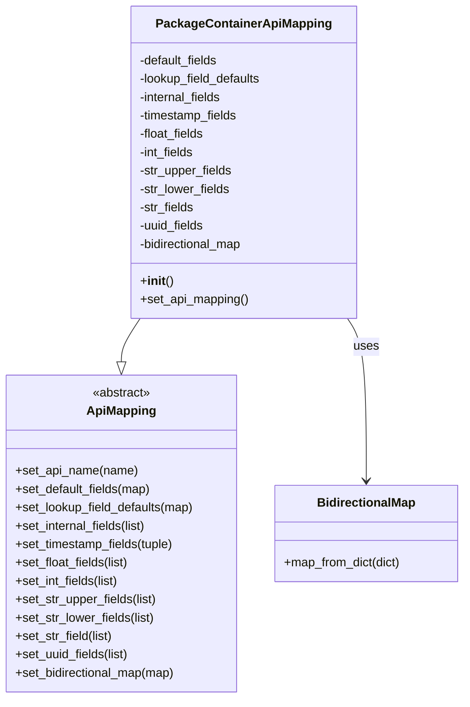

# Diagram: partview_core/partview_service/partview_service/api/package_container/handlers/mapping/PackageContainerApiMapping.py

> Auto-generated by Obscura crawlers

## Mermaid

### SVG

<svg id="container" width="612.1875" xmlns="http://www.w3.org/2000/svg" class="classDiagram" height="912" viewBox="0 0 612.1875 912" role="graphics-document document" aria-roledescription="class"><g><defs><marker id="container_class-aggregationStart" class="marker aggregation class" refX="18" refY="7" markerWidth="190" markerHeight="240" orient="auto"><path d="M 18,7 L9,13 L1,7 L9,1 Z"></path></marker></defs><defs><marker id="container_class-aggregationEnd" class="marker aggregation class" refX="1" refY="7" markerWidth="20" markerHeight="28" orient="auto"><path d="M 18,7 L9,13 L1,7 L9,1 Z"></path></marker></defs><defs><marker id="container_class-extensionStart" class="marker extension class" refX="18" refY="7" markerWidth="190" markerHeight="240" orient="auto"><path d="M 1,7 L18,13 V 1 Z"></path></marker></defs><defs><marker id="container_class-extensionEnd" class="marker extension class" refX="1" refY="7" markerWidth="20" markerHeight="28" orient="auto"><path d="M 1,1 V 13 L18,7 Z"></path></marker></defs><defs><marker id="container_class-compositionStart" class="marker composition class" refX="18" refY="7" markerWidth="190" markerHeight="240" orient="auto"><path d="M 18,7 L9,13 L1,7 L9,1 Z"></path></marker></defs><defs><marker id="container_class-compositionEnd" class="marker composition class" refX="1" refY="7" markerWidth="20" markerHeight="28" orient="auto"><path d="M 18,7 L9,13 L1,7 L9,1 Z"></path></marker></defs><defs><marker id="container_class-dependencyStart" class="marker dependency class" refX="6" refY="7" markerWidth="190" markerHeight="240" orient="auto"><path d="M 5,7 L9,13 L1,7 L9,1 Z"></path></marker></defs><defs><marker id="container_class-dependencyEnd" class="marker dependency class" refX="13" refY="7" markerWidth="20" markerHeight="28" orient="auto"><path d="M 18,7 L9,13 L14,7 L9,1 Z"></path></marker></defs><defs><marker id="container_class-lollipopStart" class="marker lollipop class" refX="13" refY="7" markerWidth="190" markerHeight="240" orient="auto"><circle stroke="black" fill="transparent" cx="7" cy="7" r="6"></circle></marker></defs><defs><marker id="container_class-lollipopEnd" class="marker lollipop class" refX="1" refY="7" markerWidth="190" markerHeight="240" orient="auto"><circle stroke="black" fill="transparent" cx="7" cy="7" r="6"></circle></marker></defs><g class="root"><g class="clusters"></g><g class="edgePaths"><path d="M185.243,416L181.11,422.167C176.976,428.333,168.709,440.667,164.575,450.125C160.441,459.583,160.441,466.167,160.441,469.458L160.441,472.75" id="id_PackageContainerApiMapping_ApiMapping_1" class="edge-thickness-normal edge-pattern-solid relation" style=";;;" data-edge="true" data-et="edge" data-id="id_PackageContainerApiMapping_ApiMapping_1" data-points="W3sieCI6MTg1LjI0MzIwODYzNTg5MjEsInkiOjQxNn0seyJ4IjoxNjAuNDQxNDA2MjUsInkiOjQ1M30seyJ4IjoxNjAuNDQxNDA2MjUsInkiOjQ5MH1d" marker-end="url(#container_class-extensionEnd)"></path><path d="M458.733,416L462.867,422.167C467.001,428.333,475.268,440.667,479.402,476C483.535,511.333,483.535,569.667,483.535,598.833L483.535,628" id="id_PackageContainerApiMapping_BidirectionalMap_2" class="edge-thickness-normal edge-pattern-solid relation" style=";;;" data-edge="true" data-et="edge" data-id="id_PackageContainerApiMapping_BidirectionalMap_2" data-points="W3sieCI6NDU4LjczMzM1Mzg2NDEwNzksInkiOjQxNn0seyJ4Ijo0ODMuNTM1MTU2MjUsInkiOjQ1M30seyJ4Ijo0ODMuNTM1MTU2MjUsInkiOjYzNH1d" marker-end="url(#container_class-dependencyEnd)"></path></g><g class="edgeLabels"><g class="edgeLabel"><g class="label" data-id="id_PackageContainerApiMapping_ApiMapping_1" transform="translate(0, 0)"><foreignObject width="0" height="0">

</foreignObject></g></g><g class="edgeLabel" transform="translate(483.53515625, 453)"><g class="label" data-id="id_PackageContainerApiMapping_BidirectionalMap_2" transform="translate(-16.4921875, -12)"><foreignObject width="32.984375" height="24">

uses

</foreignObject></g></g></g><g class="nodes"><g class="node default" id="classId-ApiMapping-0" transform="translate(160.44140625, 697)"><g class="basic label-container"><path d="M-152.44140625 -207 L152.44140625 -207 L152.44140625 207 L-152.44140625 207" stroke="none" stroke-width="0" fill="#ECECFF" style=""></path><path d="M-152.44140625 -207 C-90.37021510028873 -207, -28.29902395057745 -207, 152.44140625 -207 M-152.44140625 -207 C-62.01042250331318 -207, 28.42056124337364 -207, 152.44140625 -207 M152.44140625 -207 C152.44140625 -48.70293790180472, 152.44140625 109.59412419639057, 152.44140625 207 M152.44140625 -207 C152.44140625 -84.409900891727, 152.44140625 38.18019821654599, 152.44140625 207 M152.44140625 207 C60.73486808404502 207, -30.971670081909963 207, -152.44140625 207 M152.44140625 207 C60.28642586933833 207, -31.86855451132334 207, -152.44140625 207 M-152.44140625 207 C-152.44140625 95.83753348924373, -152.44140625 -15.32493302151255, -152.44140625 -207 M-152.44140625 207 C-152.44140625 123.11839883111935, -152.44140625 39.2367976622387, -152.44140625 -207" stroke="#9370DB" stroke-width="1.3" fill="none" stroke-dasharray="0 0" style=""></path></g><g class="annotation-group text" transform="translate(-38.609375, -183)"><g class="label" style="" transform="translate(0,-12)"><foreignObject width="77.21875" height="24">

«abstract»

</foreignObject></g></g><g class="label-group text" transform="translate(-43.2578125, -159)"><g class="label" style="font-weight: bolder" transform="translate(0,-12)"><foreignObject width="86.515625" height="24">

ApiMapping

</foreignObject></g></g><g class="members-group text" transform="translate(-140.44140625, -111)"></g><g class="methods-group text" transform="translate(-140.44140625, -81)"><g class="label" style="" transform="translate(0,-12)"><foreignObject width="160.390625" height="24">

+set_api_name(name)

</foreignObject></g><g class="label" style="" transform="translate(0,12)"><foreignObject width="179.59375" height="24">

+set_default_fields(map)

</foreignObject></g><g class="label" style="" transform="translate(0,36)"><foreignObject width="237.625" height="24">

+set_lookup_field_defaults(map)

</foreignObject></g><g class="label" style="" transform="translate(0,60)"><foreignObject width="175.59375" height="24">

+set_internal_fields(list)

</foreignObject></g><g class="label" style="" transform="translate(0,84)"><foreignObject width="211.265625" height="24">

+set_timestamp_fields(tuple)

</foreignObject></g><g class="label" style="" transform="translate(0,108)"><foreignObject width="151.40625" height="24">

+set_float_fields(list)

</foreignObject></g><g class="label" style="" transform="translate(0,132)"><foreignObject width="138.328125" height="24">

+set_int_fields(list)

</foreignObject></g><g class="label" style="" transform="translate(0,156)"><foreignObject width="186.75" height="24">

+set_str_upper_fields(list)

</foreignObject></g><g class="label" style="" transform="translate(0,180)"><foreignObject width="184.015625" height="24">

+set_str_lower_fields(list)

</foreignObject></g><g class="label" style="" transform="translate(0,204)"><foreignObject width="129.34375" height="24">

+set_str_field(list)

</foreignObject></g><g class="label" style="" transform="translate(0,228)"><foreignObject width="151.046875" height="24">

+set_uuid_fields(list)

</foreignObject></g><g class="label" style="" transform="translate(0,252)"><foreignObject width="213.203125" height="24">

+set_bidirectional_map(map)

</foreignObject></g></g><g class="divider" style=""><path d="M-152.44140625 -135 C-71.0634473708005 -135, 10.314511508398994 -135, 152.44140625 -135 M-152.44140625 -135 C-33.19809171262743 -135, 86.04522282474514 -135, 152.44140625 -135" stroke="#9370DB" stroke-width="1.3" fill="none" stroke-dasharray="0 0" style=""></path></g><g class="divider" style=""><path d="M-152.44140625 -111 C-66.85779003192867 -111, 18.725826186142655 -111, 152.44140625 -111 M-152.44140625 -111 C-53.13162743243319 -111, 46.17815138513362 -111, 152.44140625 -111" stroke="#9370DB" stroke-width="1.3" fill="none" stroke-dasharray="0 0" style=""></path></g></g><g class="node default" id="classId-BidirectionalMap-1" transform="translate(483.53515625, 697)"><g class="basic label-container"><path d="M-120.65234375 -63 L120.65234375 -63 L120.65234375 63 L-120.65234375 63" stroke="none" stroke-width="0" fill="#ECECFF" style=""></path><path d="M-120.65234375 -63 C-43.03966642330808 -63, 34.573010903383846 -63, 120.65234375 -63 M-120.65234375 -63 C-58.16335459683093 -63, 4.325634556338144 -63, 120.65234375 -63 M120.65234375 -63 C120.65234375 -18.269211211132315, 120.65234375 26.46157757773537, 120.65234375 63 M120.65234375 -63 C120.65234375 -28.123807834272817, 120.65234375 6.7523843314543655, 120.65234375 63 M120.65234375 63 C35.268218258010705 63, -50.11590723397859 63, -120.65234375 63 M120.65234375 63 C63.79201681572511 63, 6.931689881450225 63, -120.65234375 63 M-120.65234375 63 C-120.65234375 19.872525219507892, -120.65234375 -23.254949560984215, -120.65234375 -63 M-120.65234375 63 C-120.65234375 19.196304018688053, -120.65234375 -24.607391962623893, -120.65234375 -63" stroke="#9370DB" stroke-width="1.3" fill="none" stroke-dasharray="0 0" style=""></path></g><g class="annotation-group text" transform="translate(0, -39)"></g><g class="label-group text" transform="translate(-62.2265625, -39)"><g class="label" style="font-weight: bolder" transform="translate(0,-12)"><foreignObject width="124.453125" height="24">

BidirectionalMap

</foreignObject></g></g><g class="members-group text" transform="translate(-108.65234375, 9)"></g><g class="methods-group text" transform="translate(-108.65234375, 39)"><g class="label" style="" transform="translate(0,-12)"><foreignObject width="155.078125" height="24">

+map_from_dict(dict)

</foreignObject></g></g><g class="divider" style=""><path d="M-120.65234375 -15 C-65.8984714973418 -15, -11.144599244683619 -15, 120.65234375 -15 M-120.65234375 -15 C-57.402450480861276 -15, 5.847442788277448 -15, 120.65234375 -15" stroke="#9370DB" stroke-width="1.3" fill="none" stroke-dasharray="0 0" style=""></path></g><g class="divider" style=""><path d="M-120.65234375 9 C-58.33957877508859 9, 3.9731861998228197 9, 120.65234375 9 M-120.65234375 9 C-68.00687157387145 9, -15.361399397742915 9, 120.65234375 9" stroke="#9370DB" stroke-width="1.3" fill="none" stroke-dasharray="0 0" style=""></path></g></g><g class="node default" id="classId-PackageContainerApiMapping-2" transform="translate(321.98828125, 212)"><g class="basic label-container"><path d="M-148.19140625 -204 L148.19140625 -204 L148.19140625 204 L-148.19140625 204" stroke="none" stroke-width="0" fill="#ECECFF" style=""></path><path d="M-148.19140625 -204 C-51.75540827626587 -204, 44.680589697468264 -204, 148.19140625 -204 M-148.19140625 -204 C-34.561970364112 -204, 79.067465521776 -204, 148.19140625 -204 M148.19140625 -204 C148.19140625 -48.850021797042956, 148.19140625 106.29995640591409, 148.19140625 204 M148.19140625 -204 C148.19140625 -96.37075913484631, 148.19140625 11.25848173030738, 148.19140625 204 M148.19140625 204 C54.64003269832308 204, -38.911340853353835 204, -148.19140625 204 M148.19140625 204 C48.479726414555515 204, -51.23195342088897 204, -148.19140625 204 M-148.19140625 204 C-148.19140625 56.27574250204745, -148.19140625 -91.4485149959051, -148.19140625 -204 M-148.19140625 204 C-148.19140625 47.04932154113209, -148.19140625 -109.90135691773582, -148.19140625 -204" stroke="#9370DB" stroke-width="1.3" fill="none" stroke-dasharray="0 0" style=""></path></g><g class="annotation-group text" transform="translate(0, -180)"></g><g class="label-group text" transform="translate(-108.7109375, -180)"><g class="label" style="font-weight: bolder" transform="translate(0,-12)"><foreignObject width="217.421875" height="24">

PackageContainerApiMapping

</foreignObject></g></g><g class="members-group text" transform="translate(-136.19140625, -132)"><g class="label" style="" transform="translate(0,-12)"><foreignObject width="105.796875" height="24">

-default_fields

</foreignObject></g><g class="label" style="" transform="translate(0,12)"><foreignObject width="163.671875" height="24">

-lookup_field_defaults

</foreignObject></g><g class="label" style="" transform="translate(0,36)"><foreignObject width="110.953125" height="24">

-internal_fields

</foreignObject></g><g class="label" style="" transform="translate(0,60)"><foreignObject width="131.40625" height="24">

-timestamp_fields

</foreignObject></g><g class="label" style="" transform="translate(0,84)"><foreignObject width="86.84375" height="24">

-float_fields

</foreignObject></g><g class="label" style="" transform="translate(0,108)"><foreignObject width="73.6875" height="24">

-int_fields

</foreignObject></g><g class="label" style="" transform="translate(0,132)"><foreignObject width="122.109375" height="24">

-str_upper_fields

</foreignObject></g><g class="label" style="" transform="translate(0,156)"><foreignObject width="119.375" height="24">

-str_lower_fields

</foreignObject></g><g class="label" style="" transform="translate(0,180)"><foreignObject width="72.171875" height="24">

-str_fields

</foreignObject></g><g class="label" style="" transform="translate(0,204)"><foreignObject width="86.734375" height="24">

-uuid_fields

</foreignObject></g><g class="label" style="" transform="translate(0,228)"><foreignObject width="139.09375" height="24">

-bidirectional_map

</foreignObject></g></g><g class="methods-group text" transform="translate(-136.19140625, 156)"><g class="label" style="" transform="translate(0,-12)"><foreignObject width="42.796875" height="24">

+<strong>init</strong>()

</foreignObject></g><g class="label" style="" transform="translate(0,12)"><foreignObject width="143" height="24">

+set_api_mapping()

</foreignObject></g></g><g class="divider" style=""><path d="M-148.19140625 -156 C-38.915643465169865 -156, 70.36011931966027 -156, 148.19140625 -156 M-148.19140625 -156 C-39.543345995780925 -156, 69.10471425843815 -156, 148.19140625 -156" stroke="#9370DB" stroke-width="1.3" fill="none" stroke-dasharray="0 0" style=""></path></g><g class="divider" style=""><path d="M-148.19140625 132 C-76.28862925245808 132, -4.385852254916159 132, 148.19140625 132 M-148.19140625 132 C-36.95436468510415 132, 74.2826768797917 132, 148.19140625 132" stroke="#9370DB" stroke-width="1.3" fill="none" stroke-dasharray="0 0" style=""></path></g></g></g></g></g></svg>
