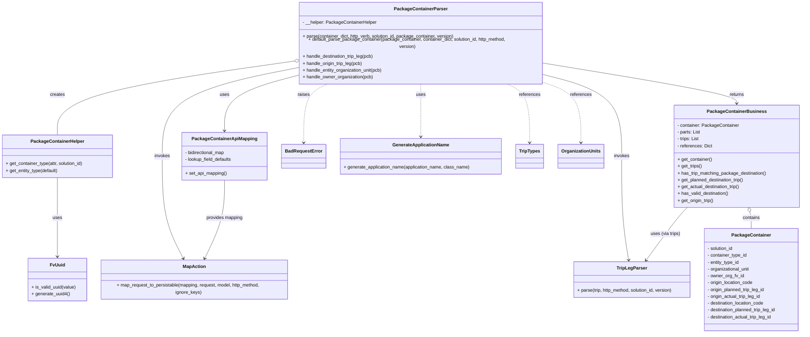

# Diagram: partview_core/partview_service/partview_service/api/package_container/handlers/parse/PackageContainerParser.py

> Auto-generated by Obscura crawlers

## Mermaid

### SVG

<svg id="container" width="2817.505859375" xmlns="http://www.w3.org/2000/svg" class="classDiagram" height="1148" viewBox="0 0 2817.505859375 1148" role="graphics-document document" aria-roledescription="class"><g><defs><marker id="container_class-aggregationStart" class="marker aggregation class" refX="18" refY="7" markerWidth="190" markerHeight="240" orient="auto"><path d="M 18,7 L9,13 L1,7 L9,1 Z"></path></marker></defs><defs><marker id="container_class-aggregationEnd" class="marker aggregation class" refX="1" refY="7" markerWidth="20" markerHeight="28" orient="auto"><path d="M 18,7 L9,13 L1,7 L9,1 Z"></path></marker></defs><defs><marker id="container_class-extensionStart" class="marker extension class" refX="18" refY="7" markerWidth="190" markerHeight="240" orient="auto"><path d="M 1,7 L18,13 V 1 Z"></path></marker></defs><defs><marker id="container_class-extensionEnd" class="marker extension class" refX="1" refY="7" markerWidth="20" markerHeight="28" orient="auto"><path d="M 1,1 V 13 L18,7 Z"></path></marker></defs><defs><marker id="container_class-compositionStart" class="marker composition class" refX="18" refY="7" markerWidth="190" markerHeight="240" orient="auto"><path d="M 18,7 L9,13 L1,7 L9,1 Z"></path></marker></defs><defs><marker id="container_class-compositionEnd" class="marker composition class" refX="1" refY="7" markerWidth="20" markerHeight="28" orient="auto"><path d="M 18,7 L9,13 L1,7 L9,1 Z"></path></marker></defs><defs><marker id="container_class-dependencyStart" class="marker dependency class" refX="6" refY="7" markerWidth="190" markerHeight="240" orient="auto"><path d="M 5,7 L9,13 L1,7 L9,1 Z"></path></marker></defs><defs><marker id="container_class-dependencyEnd" class="marker dependency class" refX="13" refY="7" markerWidth="20" markerHeight="28" orient="auto"><path d="M 18,7 L9,13 L14,7 L9,1 Z"></path></marker></defs><defs><marker id="container_class-lollipopStart" class="marker lollipop class" refX="13" refY="7" markerWidth="190" markerHeight="240" orient="auto"><circle stroke="black" fill="transparent" cx="7" cy="7" r="6"></circle></marker></defs><defs><marker id="container_class-lollipopEnd" class="marker lollipop class" refX="1" refY="7" markerWidth="190" markerHeight="240" orient="auto"><circle stroke="black" fill="transparent" cx="7" cy="7" r="6"></circle></marker></defs><g class="root"><g class="clusters"></g><g class="edgePaths"><path d="M1022.714,200.52L886.119,218.6C749.525,236.68,476.337,272.84,339.743,314.587C203.148,356.333,203.148,403.667,203.148,427.333L203.148,451" id="id_PackageContainerParser_PackageContainerHelper_1" class="edge-thickness-normal edge-pattern-solid relation" style=";;;" data-edge="true" data-et="edge" data-id="id_PackageContainerParser_PackageContainerHelper_1" data-points="W3sieCI6MTAzOS44MTQ0NTMxMjUsInkiOjE5OC4yNTY2NDIzNzk5ODI4NX0seyJ4IjoyMDMuMTQ4NDM3NSwieSI6MzA5fSx7IngiOjIwMy4xNDg0Mzc1LCJ5Ijo0NTF9XQ==" marker-start="url(#container_class-aggregationStart)"></path><path d="M1039.814,248.968L999.402,258.973C958.99,268.979,878.166,288.989,837.754,320.161C797.342,351.333,797.342,393.667,797.342,414.833L797.342,436" id="id_PackageContainerParser_PackageContainerApiMapping_2" class="edge-thickness-normal edge-pattern-solid relation" style=";;;" data-edge="true" data-et="edge" data-id="id_PackageContainerParser_PackageContainerApiMapping_2" data-points="W3sieCI6MTAzOS44MTQ0NTMxMjUsInkiOjI0OC45NjgwODUxMDYzODI5N30seyJ4Ijo3OTcuMzQxNzk2ODc1LCJ5IjozMDl9LHsieCI6Nzk3LjM0MTc5Njg3NSwieSI6NDQyfV0=" marker-end="url(#container_class-dependencyEnd)"></path><path d="M1039.814,222.276L962.493,236.73C885.173,251.184,730.531,280.092,653.21,330.713C575.889,381.333,575.889,453.667,575.889,526C575.889,598.333,575.889,670.667,589.023,731.616C602.158,792.566,628.427,842.132,641.561,866.915L654.696,891.699" id="id_PackageContainerParser_MapAction_3" class="edge-thickness-normal edge-pattern-solid relation" style=";;;" data-edge="true" data-et="edge" data-id="id_PackageContainerParser_MapAction_3" data-points="W3sieCI6MTAzOS44MTQ0NTMxMjUsInkiOjIyMi4yNzU3NTg1MTg0ODAxM30seyJ4Ijo1NzUuODg4NjcxODc1LCJ5IjozMDl9LHsieCI6NTc1Ljg4ODY3MTg3NSwieSI6NTI2fSx7IngiOjU3NS44ODg2NzE4NzUsInkiOjc0M30seyJ4Ijo2NTcuNTA1NzMzMzY2OTM1NSwieSI6ODk3fV0=" marker-end="url(#container_class-dependencyEnd)"></path><path d="M1920.072,246.745L1962.854,257.121C2005.635,267.497,2091.197,288.248,2133.979,334.791C2176.76,381.333,2176.76,453.667,2176.76,526C2176.76,598.333,2176.76,670.667,2180.921,731.514C2185.083,792.361,2193.406,841.722,2197.568,866.403L2201.729,891.084" id="id_PackageContainerParser_TripLegParser_4" class="edge-thickness-normal edge-pattern-solid relation" style=";;;" data-edge="true" data-et="edge" data-id="id_PackageContainerParser_TripLegParser_4" data-points="W3sieCI6MTkyMC4wNzIyNjU2MjUsInkiOjI0Ni43NDUxNjkxNTY1OTk1fSx7IngiOjIxNzYuNzU5NzY1NjI1LCJ5IjozMDl9LHsieCI6MjE3Ni43NTk3NjU2MjUsInkiOjUyNn0seyJ4IjoyMTc2Ljc1OTc2NTYyNSwieSI6NzQzfSx7IngiOjIyMDIuNzI2NzUxNTEyMDk2NiwieSI6ODk3fV0=" marker-end="url(#container_class-dependencyEnd)"></path><path d="M1920.072,207.081L2031.524,224.067C2142.976,241.054,2365.88,275.027,2477.331,297.18C2588.783,319.333,2588.783,329.667,2588.783,334.833L2588.783,340" id="id_PackageContainerParser_PackageContainerBusiness_5" class="edge-thickness-normal edge-pattern-solid relation" style=";;;" data-edge="true" data-et="edge" data-id="id_PackageContainerParser_PackageContainerBusiness_5" data-points="W3sieCI6MTkyMC4wNzIyNjU2MjUsInkiOjIwNy4wODA3MjkwODQxMDA0M30seyJ4IjoyNTg4Ljc4MzIwMzEyNSwieSI6MzA5fSx7IngiOjI1ODguNzgzMjAzMTI1LCJ5IjozNDZ9XQ==" marker-end="url(#container_class-dependencyEnd)"></path><path d="M2635.968,722.774L2636.777,726.145C2637.585,729.516,2639.202,736.258,2640.01,745.796C2640.818,755.333,2640.818,767.667,2640.818,773.833L2640.818,780" id="id_PackageContainerBusiness_PackageContainer_6" class="edge-thickness-normal edge-pattern-solid relation" style=";;;" data-edge="true" data-et="edge" data-id="id_PackageContainerBusiness_PackageContainer_6" data-points="W3sieCI6MjYzMS45NDYwMDU1NDQzNTQ2LCJ5Ijo3MDZ9LHsieCI6MjY0MC44MTgzNTkzNzUsInkiOjc0M30seyJ4IjoyNjQwLjgxODM1OTM3NSwieSI6NzgwfV0=" marker-start="url(#container_class-aggregationStart)"></path><path d="M2411.492,706L2405.418,712.167C2399.344,718.333,2387.197,730.667,2362.594,761.698C2337.992,792.73,2300.936,842.459,2282.408,867.324L2263.88,892.189" id="id_PackageContainerBusiness_TripLegParser_7" class="edge-thickness-normal edge-pattern-solid relation" style=";;;" data-edge="true" data-et="edge" data-id="id_PackageContainerBusiness_TripLegParser_7" data-points="W3sieCI6MjQxMS40OTIwMTY0ODkwNTU1LCJ5Ijo3MDZ9LHsieCI6MjM3NS4wNDg4MjgxMjUsInkiOjc0M30seyJ4IjoyMjYwLjI5NDU0Mzg1MDgwNjMsInkiOjg5N31d" marker-end="url(#container_class-dependencyEnd)"></path><path d="M797.342,610L797.342,632.167C797.342,654.333,797.342,698.667,785.192,745.602C773.042,792.538,748.741,842.075,736.591,866.844L724.441,891.613" id="id_PackageContainerApiMapping_MapAction_8" class="edge-thickness-normal edge-pattern-solid relation" style=";;;" data-edge="true" data-et="edge" data-id="id_PackageContainerApiMapping_MapAction_8" data-points="W3sieCI6Nzk3LjM0MTc5Njg3NSwieSI6NjEwfSx7IngiOjc5Ny4zNDE3OTY4NzUsInkiOjc0M30seyJ4Ijo3MjEuNzk4NTc2MTA4ODcxLCJ5Ijo4OTd9XQ==" marker-end="url(#container_class-dependencyEnd)"></path><path d="M203.148,601L203.148,624.667C203.148,648.333,203.148,695.667,203.148,742C203.148,788.333,203.148,833.667,203.148,856.333L203.148,879" id="id_PackageContainerHelper_FvUuid_9" class="edge-thickness-normal edge-pattern-solid relation" style=";;;" data-edge="true" data-et="edge" data-id="id_PackageContainerHelper_FvUuid_9" data-points="W3sieCI6MjAzLjE0ODQzNzUsInkiOjYwMX0seyJ4IjoyMDMuMTQ4NDM3NSwieSI6NzQzfSx7IngiOjIwMy4xNDg0Mzc1LCJ5Ijo4ODV9XQ==" marker-end="url(#container_class-dependencyEnd)"></path><path d="M1161.26,272L1146.372,278.167C1131.484,284.333,1101.708,296.667,1086.82,331C1071.932,365.333,1071.932,421.667,1071.932,449.833L1071.932,478" id="id_PackageContainerParser_BadRequestError_10" class="edge-thickness-normal edge-pattern-dashed relation" style=";;;" data-edge="true" data-et="edge" data-id="id_PackageContainerParser_BadRequestError_10" data-points="W3sieCI6MTE2MS4yNTk2NTAwNTU0NzM1LCJ5IjoyNzJ9LHsieCI6MTA3MS45MzE2NDA2MjUsInkiOjMwOX0seyJ4IjoxMDcxLjkzMTY0MDYyNSwieSI6NDg0fV0=" marker-end="url(#container_class-dependencyEnd)"></path><path d="M1479.943,272L1479.943,278.167C1479.943,284.333,1479.943,296.667,1479.943,327.5C1479.943,358.333,1479.943,407.667,1479.943,432.333L1479.943,457" id="id_PackageContainerParser_GenerateApplicationName_11" class="edge-thickness-normal edge-pattern-dashed relation" style=";;;" data-edge="true" data-et="edge" data-id="id_PackageContainerParser_GenerateApplicationName_11" data-points="W3sieCI6MTQ3OS45NDMzNTkzNzUsInkiOjI3Mn0seyJ4IjoxNDc5Ljk0MzM1OTM3NSwieSI6MzA5fSx7IngiOjE0NzkuOTQzMzU5Mzc1LCJ5Ijo0NjN9XQ==" marker-end="url(#container_class-dependencyEnd)"></path><path d="M1777.727,272L1791.639,278.167C1805.551,284.333,1833.374,296.667,1847.286,331C1861.197,365.333,1861.197,421.667,1861.197,449.833L1861.197,478" id="id_PackageContainerParser_TripTypes_12" class="edge-thickness-normal edge-pattern-dashed relation" style=";;;" data-edge="true" data-et="edge" data-id="id_PackageContainerParser_TripTypes_12" data-points="W3sieCI6MTc3Ny43Mjc0NzU0OTkyNjA0LCJ5IjoyNzJ9LHsieCI6MTg2MS4xOTcyNjU2MjUsInkiOjMwOX0seyJ4IjoxODYxLjE5NzI2NTYyNSwieSI6NDg0fV0=" marker-end="url(#container_class-dependencyEnd)"></path><path d="M1914.609,272L1934.915,278.167C1955.222,284.333,1995.835,296.667,2016.141,331C2036.447,365.333,2036.447,421.667,2036.447,449.833L2036.447,478" id="id_PackageContainerParser_OrganizationUnits_13" class="edge-thickness-normal edge-pattern-dashed relation" style=";;;" data-edge="true" data-et="edge" data-id="id_PackageContainerParser_OrganizationUnits_13" data-points="W3sieCI6MTkxNC42MDkxMzIzMDM5OTQsInkiOjI3Mn0seyJ4IjoyMDM2LjQ0NzI2NTYyNSwieSI6MzA5fSx7IngiOjIwMzYuNDQ3MjY1NjI1LCJ5Ijo0ODR9XQ==" marker-end="url(#container_class-dependencyEnd)"></path></g><g class="edgeLabels"><g class="edgeLabel" transform="translate(203.1484375, 309)"><g class="label" data-id="id_PackageContainerParser_PackageContainerHelper_1" transform="translate(-26.171875, -12)"><foreignObject width="52.34375" height="24">

creates

</foreignObject></g></g><g class="edgeLabel" transform="translate(797.341796875, 309)"><g class="label" data-id="id_PackageContainerParser_PackageContainerApiMapping_2" transform="translate(-16.4921875, -12)"><foreignObject width="32.984375" height="24">

uses

</foreignObject></g></g><g class="edgeLabel" transform="translate(575.888671875, 526)"><g class="label" data-id="id_PackageContainerParser_MapAction_3" transform="translate(-27.5859375, -12)"><foreignObject width="55.171875" height="24">

invokes

</foreignObject></g></g><g class="edgeLabel" transform="translate(2176.759765625, 526)"><g class="label" data-id="id_PackageContainerParser_TripLegParser_4" transform="translate(-27.5859375, -12)"><foreignObject width="55.171875" height="24">

invokes

</foreignObject></g></g><g class="edgeLabel" transform="translate(2588.783203125, 309)"><g class="label" data-id="id_PackageContainerParser_PackageContainerBusiness_5" transform="translate(-26.265625, -12)"><foreignObject width="52.53125" height="24">

returns

</foreignObject></g></g><g class="edgeLabel" transform="translate(2640.818359375, 743)"><g class="label" data-id="id_PackageContainerBusiness_PackageContainer_6" transform="translate(-30.890625, -12)"><foreignObject width="61.78125" height="24">

contains

</foreignObject></g></g><g class="edgeLabel" transform="translate(2333.18718, 799.17824)"><g class="label" data-id="id_PackageContainerBusiness_TripLegParser_7" transform="translate(-53.1796875, -12)"><foreignObject width="106.359375" height="24">

uses (via trips)

</foreignObject></g></g><g class="edgeLabel" transform="translate(797.341796875, 743)"><g class="label" data-id="id_PackageContainerApiMapping_MapAction_8" transform="translate(-65.25, -12)"><foreignObject width="130.5" height="24">

provides mapping

</foreignObject></g></g><g class="edgeLabel" transform="translate(203.1484375, 743)"><g class="label" data-id="id_PackageContainerHelper_FvUuid_9" transform="translate(-16.4921875, -12)"><foreignObject width="32.984375" height="24">

uses

</foreignObject></g></g><g class="edgeLabel" transform="translate(1071.931640625, 309)"><g class="label" data-id="id_PackageContainerParser_BadRequestError_10" transform="translate(-21.25, -12)"><foreignObject width="42.5" height="24">

raises

</foreignObject></g></g><g class="edgeLabel" transform="translate(1479.943359375, 309)"><g class="label" data-id="id_PackageContainerParser_GenerateApplicationName_11" transform="translate(-16.4921875, -12)"><foreignObject width="32.984375" height="24">

uses

</foreignObject></g></g><g class="edgeLabel" transform="translate(1861.197265625, 309)"><g class="label" data-id="id_PackageContainerParser_TripTypes_12" transform="translate(-37.828125, -12)"><foreignObject width="75.65625" height="24">

references

</foreignObject></g></g><g class="edgeLabel" transform="translate(2036.447265625, 309)"><g class="label" data-id="id_PackageContainerParser_OrganizationUnits_13" transform="translate(-37.828125, -12)"><foreignObject width="75.65625" height="24">

references

</foreignObject></g></g></g><g class="nodes"><g class="node default" id="classId-PackageContainerParser-0" transform="translate(1479.943359375, 140)"><g class="basic label-container"><path d="M-440.12890625 -132 L440.12890625 -132 L440.12890625 132 L-440.12890625 132" stroke="none" stroke-width="0" fill="#ECECFF" style=""></path><path d="M-440.12890625 -132 C-214.24712710529798 -132, 11.634652039404045 -132, 440.12890625 -132 M-440.12890625 -132 C-259.2382708720031 -132, -78.34763549400617 -132, 440.12890625 -132 M440.12890625 -132 C440.12890625 -54.47299735653587, 440.12890625 23.05400528692826, 440.12890625 132 M440.12890625 -132 C440.12890625 -29.201117847574906, 440.12890625 73.59776430485019, 440.12890625 132 M440.12890625 132 C255.09261801018124 132, 70.05632977036248 132, -440.12890625 132 M440.12890625 132 C256.373709734627 132, 72.618513219254 132, -440.12890625 132 M-440.12890625 132 C-440.12890625 57.308371578440614, -440.12890625 -17.383256843118772, -440.12890625 -132 M-440.12890625 132 C-440.12890625 37.621631190911415, -440.12890625 -56.75673761817717, -440.12890625 -132" stroke="#9370DB" stroke-width="1.3" fill="none" stroke-dasharray="0 0" style=""></path></g><g class="annotation-group text" transform="translate(0, -108)"></g><g class="label-group text" transform="translate(-88.8203125, -108)"><g class="label" style="font-weight: bolder" transform="translate(0,-12)"><foreignObject width="177.640625" height="24">

PackageContainerParser

</foreignObject></g></g><g class="members-group text" transform="translate(-428.12890625, -60)"><g class="label" style="" transform="translate(0,-12)"><foreignObject width="259.84375" height="24">

- __helper: PackageContainerHelper

</foreignObject></g></g><g class="methods-group text" transform="translate(-428.12890625, -12)"><g class="label" style="" transform="translate(0,-12)"><foreignObject width="538.546875" height="24">

+ parse(container_dict, http_verb, solution_id, package_container, version)

</foreignObject></g><g class="label" style="" transform="translate(0,12)"><foreignObject width="767.4375" height="24">

+ default_parse_package_container(package_container, container_dict, solution_id, http_method, version)

</foreignObject></g><g class="label" style="" transform="translate(0,36)"><foreignObject width="253.875" height="24">

+ handle_destination_trip_leg(pcb)

</foreignObject></g><g class="label" style="" transform="translate(0,60)"><foreignObject width="212.984375" height="24">

+ handle_origin_trip_leg(pcb)

</foreignObject></g><g class="label" style="" transform="translate(0,84)"><foreignObject width="284.09375" height="24">

+ handle_entity_organization_unit(pcb)

</foreignObject></g><g class="label" style="" transform="translate(0,108)"><foreignObject width="249.453125" height="24">

+ handle_owner_organization(pcb)

</foreignObject></g></g><g class="divider" style=""><path d="M-440.12890625 -84 C-174.8291937963843 -84, 90.47051865723142 -84, 440.12890625 -84 M-440.12890625 -84 C-244.3468774875162 -84, -48.56484872503239 -84, 440.12890625 -84" stroke="#9370DB" stroke-width="1.3" fill="none" stroke-dasharray="0 0" style=""></path></g><g class="divider" style=""><path d="M-440.12890625 -36 C-214.46327579493231 -36, 11.20235466013537 -36, 440.12890625 -36 M-440.12890625 -36 C-217.43385066917259 -36, 5.261204911654829 -36, 440.12890625 -36" stroke="#9370DB" stroke-width="1.3" fill="none" stroke-dasharray="0 0" style=""></path></g></g><g class="node default" id="classId-PackageContainerHelper-1" transform="translate(203.1484375, 526)"><g class="basic label-container"><path d="M-195.1484375 -75 L195.1484375 -75 L195.1484375 75 L-195.1484375 75" stroke="none" stroke-width="0" fill="#ECECFF" style=""></path><path d="M-195.1484375 -75 C-61.06087707535366 -75, 73.02668334929268 -75, 195.1484375 -75 M-195.1484375 -75 C-82.11962401013837 -75, 30.909189479723267 -75, 195.1484375 -75 M195.1484375 -75 C195.1484375 -18.549694044748136, 195.1484375 37.90061191050373, 195.1484375 75 M195.1484375 -75 C195.1484375 -39.43534463781884, 195.1484375 -3.870689275637673, 195.1484375 75 M195.1484375 75 C81.28609717488295 75, -32.57624315023409 75, -195.1484375 75 M195.1484375 75 C43.55995247853713 75, -108.02853254292575 75, -195.1484375 75 M-195.1484375 75 C-195.1484375 35.768737146428215, -195.1484375 -3.4625257071435698, -195.1484375 -75 M-195.1484375 75 C-195.1484375 22.139739935488144, -195.1484375 -30.72052012902371, -195.1484375 -75" stroke="#9370DB" stroke-width="1.3" fill="none" stroke-dasharray="0 0" style=""></path></g><g class="annotation-group text" transform="translate(0, -51)"></g><g class="label-group text" transform="translate(-89.96875, -51)"><g class="label" style="font-weight: bolder" transform="translate(0,-12)"><foreignObject width="179.9375" height="24">

PackageContainerHelper

</foreignObject></g></g><g class="members-group text" transform="translate(-183.1484375, -3)"></g><g class="methods-group text" transform="translate(-183.1484375, 27)"><g class="label" style="" transform="translate(0,-12)"><foreignObject width="276.328125" height="24">

+ get_container_type(attr, solution_id)

</foreignObject></g><g class="label" style="" transform="translate(0,12)"><foreignObject width="186.203125" height="24">

+ get_entity_type(default)

</foreignObject></g></g><g class="divider" style=""><path d="M-195.1484375 -27 C-41.57807802567663 -27, 111.99228144864674 -27, 195.1484375 -27 M-195.1484375 -27 C-79.46842894111454 -27, 36.21157961777092 -27, 195.1484375 -27" stroke="#9370DB" stroke-width="1.3" fill="none" stroke-dasharray="0 0" style=""></path></g><g class="divider" style=""><path d="M-195.1484375 -3 C-73.36333532126459 -3, 48.42176685747083 -3, 195.1484375 -3 M-195.1484375 -3 C-106.20388779764448 -3, -17.259338095288967 -3, 195.1484375 -3" stroke="#9370DB" stroke-width="1.3" fill="none" stroke-dasharray="0 0" style=""></path></g></g><g class="node default" id="classId-PackageContainerBusiness-2" transform="translate(2588.783203125, 526)"><g class="basic label-container"><path d="M-218.39453125 -180 L218.39453125 -180 L218.39453125 180 L-218.39453125 180" stroke="none" stroke-width="0" fill="#ECECFF" style=""></path><path d="M-218.39453125 -180 C-44.32124011510183 -180, 129.75205101979634 -180, 218.39453125 -180 M-218.39453125 -180 C-100.65744959767605 -180, 17.079632054647902 -180, 218.39453125 -180 M218.39453125 -180 C218.39453125 -55.9007002831861, 218.39453125 68.1985994336278, 218.39453125 180 M218.39453125 -180 C218.39453125 -45.9166668534923, 218.39453125 88.1666662930154, 218.39453125 180 M218.39453125 180 C124.90811036989184 180, 31.421689489783688 180, -218.39453125 180 M218.39453125 180 C108.00837817686727 180, -2.377774896265464 180, -218.39453125 180 M-218.39453125 180 C-218.39453125 107.5534855092225, -218.39453125 35.106971018444995, -218.39453125 -180 M-218.39453125 180 C-218.39453125 98.58007541743964, -218.39453125 17.16015083487929, -218.39453125 -180" stroke="#9370DB" stroke-width="1.3" fill="none" stroke-dasharray="0 0" style=""></path></g><g class="annotation-group text" transform="translate(0, -156)"></g><g class="label-group text" transform="translate(-97.7890625, -156)"><g class="label" style="font-weight: bolder" transform="translate(0,-12)"><foreignObject width="195.578125" height="24">

PackageContainerBusiness

</foreignObject></g></g><g class="members-group text" transform="translate(-206.39453125, -108)"><g class="label" style="" transform="translate(0,-12)"><foreignObject width="216.703125" height="24">

- container: PackageContainer

</foreignObject></g><g class="label" style="" transform="translate(0,12)"><foreignObject width="81.96875" height="24">

- parts: List

</foreignObject></g><g class="label" style="" transform="translate(0,36)"><foreignObject width="77.9375" height="24">

- trips: List

</foreignObject></g><g class="label" style="" transform="translate(0,60)"><foreignObject width="122.65625" height="24">

- references: Dict

</foreignObject></g></g><g class="methods-group text" transform="translate(-206.39453125, 12)"><g class="label" style="" transform="translate(0,-12)"><foreignObject width="122.359375" height="24">

+ get_container()

</foreignObject></g><g class="label" style="" transform="translate(0,12)"><foreignObject width="86.59375" height="24">

+ get_trips()

</foreignObject></g><g class="label" style="" transform="translate(0,36)"><foreignObject width="315" height="24">

+ has_trip_matching_package_destination()

</foreignObject></g><g class="label" style="" transform="translate(0,60)"><foreignObject width="238.4375" height="24">

+ get_planned_destination_trip()

</foreignObject></g><g class="label" style="" transform="translate(0,84)"><foreignObject width="222.9375" height="24">

+ get_actual_destination_trip()

</foreignObject></g><g class="label" style="" transform="translate(0,108)"><foreignObject width="181.578125" height="24">

+ has_valid_destination()

</foreignObject></g><g class="label" style="" transform="translate(0,132)"><foreignObject width="129.375" height="24">

+ get_origin_trip()

</foreignObject></g></g><g class="divider" style=""><path d="M-218.39453125 -132 C-91.94514764029552 -132, 34.50423596940897 -132, 218.39453125 -132 M-218.39453125 -132 C-54.71016533969461 -132, 108.97420057061078 -132, 218.39453125 -132" stroke="#9370DB" stroke-width="1.3" fill="none" stroke-dasharray="0 0" style=""></path></g><g class="divider" style=""><path d="M-218.39453125 -12 C-95.87232264828634 -12, 26.649885953427315 -12, 218.39453125 -12 M-218.39453125 -12 C-123.64356023546878 -12, -28.892589220937566 -12, 218.39453125 -12" stroke="#9370DB" stroke-width="1.3" fill="none" stroke-dasharray="0 0" style=""></path></g></g><g class="node default" id="classId-PackageContainer-3" transform="translate(2640.818359375, 960)"><g class="basic label-container"><path d="M-168.6875 -180 L168.6875 -180 L168.6875 180 L-168.6875 180" stroke="none" stroke-width="0" fill="#ECECFF" style=""></path><path d="M-168.6875 -180 C-80.43581124112826 -180, 7.815877517743473 -180, 168.6875 -180 M-168.6875 -180 C-46.096271946431415 -180, 76.49495610713717 -180, 168.6875 -180 M168.6875 -180 C168.6875 -60.564261069393865, 168.6875 58.87147786121227, 168.6875 180 M168.6875 -180 C168.6875 -49.634914818097684, 168.6875 80.73017036380463, 168.6875 180 M168.6875 180 C64.28296056893561 180, -40.121578862128786 180, -168.6875 180 M168.6875 180 C96.26290232084827 180, 23.83830464169654 180, -168.6875 180 M-168.6875 180 C-168.6875 57.50543969188672, -168.6875 -64.98912061622656, -168.6875 -180 M-168.6875 180 C-168.6875 46.30798357173609, -168.6875 -87.38403285652782, -168.6875 -180" stroke="#9370DB" stroke-width="1.3" fill="none" stroke-dasharray="0 0" style=""></path></g><g class="annotation-group text" transform="translate(0, -156)"></g><g class="label-group text" transform="translate(-65.453125, -156)"><g class="label" style="font-weight: bolder" transform="translate(0,-12)"><foreignObject width="130.90625" height="24">

PackageContainer

</foreignObject></g></g><g class="members-group text" transform="translate(-156.6875, -108)"><g class="label" style="" transform="translate(0,-12)"><foreignObject width="92.921875" height="24">

- solution_id

</foreignObject></g><g class="label" style="" transform="translate(0,12)"><foreignObject width="140.484375" height="24">

- container_type_id

</foreignObject></g><g class="label" style="" transform="translate(0,36)"><foreignObject width="114.046875" height="24">

- entity_type_id

</foreignObject></g><g class="label" style="" transform="translate(0,60)"><foreignObject width="151.25" height="24">

- organizational_unit

</foreignObject></g><g class="label" style="" transform="translate(0,84)"><foreignObject width="129.3125" height="24">

- owner_org_fv_id

</foreignObject></g><g class="label" style="" transform="translate(0,108)"><foreignObject width="163.203125" height="24">

- origin_location_code

</foreignObject></g><g class="label" style="" transform="translate(0,132)"><foreignObject width="207.03125" height="24">

- origin_planned_trip_leg_id

</foreignObject></g><g class="label" style="" transform="translate(0,156)"><foreignObject width="191.53125" height="24">

- origin_actual_trip_leg_id

</foreignObject></g><g class="label" style="" transform="translate(0,180)"><foreignObject width="204.109375" height="24">

- destination_location_code

</foreignObject></g><g class="label" style="" transform="translate(0,204)"><foreignObject width="247.921875" height="24">

- destination_planned_trip_leg_id

</foreignObject></g><g class="label" style="" transform="translate(0,228)"><foreignObject width="232.421875" height="24">

- destination_actual_trip_leg_id

</foreignObject></g></g><g class="methods-group text" transform="translate(-156.6875, 180)"></g><g class="divider" style=""><path d="M-168.6875 -132 C-60.799806715396116 -132, 47.08788656920777 -132, 168.6875 -132 M-168.6875 -132 C-59.32711873958961 -132, 50.033262520820784 -132, 168.6875 -132" stroke="#9370DB" stroke-width="1.3" fill="none" stroke-dasharray="0 0" style=""></path></g><g class="divider" style=""><path d="M-168.6875 156 C-85.73048481702531 156, -2.7734696340506275 156, 168.6875 156 M-168.6875 156 C-91.32989215242038 156, -13.97228430484077 156, 168.6875 156" stroke="#9370DB" stroke-width="1.3" fill="none" stroke-dasharray="0 0" style=""></path></g></g><g class="node default" id="classId-TripLegParser-4" transform="translate(2213.349609375, 960)"><g class="basic label-container"><path d="M-208.78125 -63 L208.78125 -63 L208.78125 63 L-208.78125 63" stroke="none" stroke-width="0" fill="#ECECFF" style=""></path><path d="M-208.78125 -63 C-121.88715302287578 -63, -34.99305604575156 -63, 208.78125 -63 M-208.78125 -63 C-103.37970952141644 -63, 2.0218309571671114 -63, 208.78125 -63 M208.78125 -63 C208.78125 -19.914471205014053, 208.78125 23.171057589971895, 208.78125 63 M208.78125 -63 C208.78125 -24.549801198638647, 208.78125 13.900397602722705, 208.78125 63 M208.78125 63 C42.03258845770773 63, -124.71607308458454 63, -208.78125 63 M208.78125 63 C112.8622370412427 63, 16.943224082485386 63, -208.78125 63 M-208.78125 63 C-208.78125 25.802899975686053, -208.78125 -11.394200048627894, -208.78125 -63 M-208.78125 63 C-208.78125 17.725244265717528, -208.78125 -27.549511468564944, -208.78125 -63" stroke="#9370DB" stroke-width="1.3" fill="none" stroke-dasharray="0 0" style=""></path></g><g class="annotation-group text" transform="translate(0, -39)"></g><g class="label-group text" transform="translate(-50.421875, -39)"><g class="label" style="font-weight: bolder" transform="translate(0,-12)"><foreignObject width="100.84375" height="24">

TripLegParser

</foreignObject></g></g><g class="members-group text" transform="translate(-196.78125, 9)"></g><g class="methods-group text" transform="translate(-196.78125, 39)"><g class="label" style="" transform="translate(0,-12)"><foreignObject width="343.140625" height="24">

+ parse(trip, http_method, solution_id, version)

</foreignObject></g></g><g class="divider" style=""><path d="M-208.78125 -15 C-92.54155507962558 -15, 23.698139840748837 -15, 208.78125 -15 M-208.78125 -15 C-87.67186439145485 -15, 33.43752121709031 -15, 208.78125 -15" stroke="#9370DB" stroke-width="1.3" fill="none" stroke-dasharray="0 0" style=""></path></g><g class="divider" style=""><path d="M-208.78125 9 C-93.06196877110459 9, 22.657312457790823 9, 208.78125 9 M-208.78125 9 C-44.52570547876809 9, 119.72983904246382 9, 208.78125 9" stroke="#9370DB" stroke-width="1.3" fill="none" stroke-dasharray="0 0" style=""></path></g></g><g class="node default" id="classId-PackageContainerApiMapping-5" transform="translate(797.341796875, 526)"><g class="basic label-container"><path d="M-150.30859375 -84 L150.30859375 -84 L150.30859375 84 L-150.30859375 84" stroke="none" stroke-width="0" fill="#ECECFF" style=""></path><path d="M-150.30859375 -84 C-75.59420046576237 -84, -0.8798071815247397 -84, 150.30859375 -84 M-150.30859375 -84 C-90.1608843721505 -84, -30.01317499430101 -84, 150.30859375 -84 M150.30859375 -84 C150.30859375 -27.863009188430084, 150.30859375 28.273981623139832, 150.30859375 84 M150.30859375 -84 C150.30859375 -43.80788523700119, 150.30859375 -3.6157704740023746, 150.30859375 84 M150.30859375 84 C50.22035443132481 84, -49.867884887350385 84, -150.30859375 84 M150.30859375 84 C88.54305927154391 84, 26.777524793087835 84, -150.30859375 84 M-150.30859375 84 C-150.30859375 49.46345676340159, -150.30859375 14.926913526803176, -150.30859375 -84 M-150.30859375 84 C-150.30859375 40.32981699147922, -150.30859375 -3.3403660170415606, -150.30859375 -84" stroke="#9370DB" stroke-width="1.3" fill="none" stroke-dasharray="0 0" style=""></path></g><g class="annotation-group text" transform="translate(0, -60)"></g><g class="label-group text" transform="translate(-108.7109375, -60)"><g class="label" style="font-weight: bolder" transform="translate(0,-12)"><foreignObject width="217.421875" height="24">

PackageContainerApiMapping

</foreignObject></g></g><g class="members-group text" transform="translate(-138.30859375, -12)"><g class="label" style="" transform="translate(0,-12)"><foreignObject width="143.34375" height="24">

- bidirectional_map

</foreignObject></g><g class="label" style="" transform="translate(0,12)"><foreignObject width="167.90625" height="24">

- lookup_field_defaults

</foreignObject></g></g><g class="methods-group text" transform="translate(-138.30859375, 60)"><g class="label" style="" transform="translate(0,-12)"><foreignObject width="147.234375" height="24">

+ set_api_mapping()

</foreignObject></g></g><g class="divider" style=""><path d="M-150.30859375 -36 C-56.40175903153933 -36, 37.505075686921344 -36, 150.30859375 -36 M-150.30859375 -36 C-72.67911870535127 -36, 4.950356339297457 -36, 150.30859375 -36" stroke="#9370DB" stroke-width="1.3" fill="none" stroke-dasharray="0 0" style=""></path></g><g class="divider" style=""><path d="M-150.30859375 36 C-46.01807600827968 36, 58.272441733440644 36, 150.30859375 36 M-150.30859375 36 C-49.17226280011194 36, 51.964068149776125 36, 150.30859375 36" stroke="#9370DB" stroke-width="1.3" fill="none" stroke-dasharray="0 0" style=""></path></g></g><g class="node default" id="classId-MapAction-6" transform="translate(690.89453125, 960)"><g class="basic label-container"><path d="M-335.16015625 -63 L335.16015625 -63 L335.16015625 63 L-335.16015625 63" stroke="none" stroke-width="0" fill="#ECECFF" style=""></path><path d="M-335.16015625 -63 C-183.1733269257063 -63, -31.18649760141261 -63, 335.16015625 -63 M-335.16015625 -63 C-137.42122848517053 -63, 60.31769927965894 -63, 335.16015625 -63 M335.16015625 -63 C335.16015625 -36.558365131047786, 335.16015625 -10.116730262095572, 335.16015625 63 M335.16015625 -63 C335.16015625 -23.75136597711102, 335.16015625 15.497268045777957, 335.16015625 63 M335.16015625 63 C196.7398693880411 63, 58.31958252608217 63, -335.16015625 63 M335.16015625 63 C175.75702858818417 63, 16.35390092636834 63, -335.16015625 63 M-335.16015625 63 C-335.16015625 35.85021226222065, -335.16015625 8.700424524441296, -335.16015625 -63 M-335.16015625 63 C-335.16015625 21.428783210261223, -335.16015625 -20.142433579477554, -335.16015625 -63" stroke="#9370DB" stroke-width="1.3" fill="none" stroke-dasharray="0 0" style=""></path></g><g class="annotation-group text" transform="translate(0, -39)"></g><g class="label-group text" transform="translate(-38.6328125, -39)"><g class="label" style="font-weight: bolder" transform="translate(0,-12)"><foreignObject width="77.265625" height="24">

MapAction

</foreignObject></g></g><g class="members-group text" transform="translate(-323.16015625, 9)"></g><g class="methods-group text" transform="translate(-323.16015625, 39)"><g class="label" style="" transform="translate(0,-12)"><foreignObject width="607.6875" height="24">

+ map_request_to_persistable(mapping, request, model, http_method, ignore_keys)

</foreignObject></g></g><g class="divider" style=""><path d="M-335.16015625 -15 C-71.03436120516642 -15, 193.09143383966716 -15, 335.16015625 -15 M-335.16015625 -15 C-135.747920840737 -15, 63.66431456852598 -15, 335.16015625 -15" stroke="#9370DB" stroke-width="1.3" fill="none" stroke-dasharray="0 0" style=""></path></g><g class="divider" style=""><path d="M-335.16015625 9 C-97.89418564578563 9, 139.37178495842875 9, 335.16015625 9 M-335.16015625 9 C-141.73643271297135 9, 51.6872908240573 9, 335.16015625 9" stroke="#9370DB" stroke-width="1.3" fill="none" stroke-dasharray="0 0" style=""></path></g></g><g class="node default" id="classId-FvUuid-7" transform="translate(203.1484375, 960)"><g class="basic label-container"><path d="M-102.5859375 -75 L102.5859375 -75 L102.5859375 75 L-102.5859375 75" stroke="none" stroke-width="0" fill="#ECECFF" style=""></path><path d="M-102.5859375 -75 C-56.8801767548491 -75, -11.174416009698206 -75, 102.5859375 -75 M-102.5859375 -75 C-55.090381512103086 -75, -7.594825524206172 -75, 102.5859375 -75 M102.5859375 -75 C102.5859375 -21.440817239011977, 102.5859375 32.118365521976045, 102.5859375 75 M102.5859375 -75 C102.5859375 -42.903577822035246, 102.5859375 -10.807155644070491, 102.5859375 75 M102.5859375 75 C58.518579655027864 75, 14.451221810055728 75, -102.5859375 75 M102.5859375 75 C38.53812649951101 75, -25.509684500977983 75, -102.5859375 75 M-102.5859375 75 C-102.5859375 33.39017779754714, -102.5859375 -8.219644404905722, -102.5859375 -75 M-102.5859375 75 C-102.5859375 24.255461703141236, -102.5859375 -26.489076593717527, -102.5859375 -75" stroke="#9370DB" stroke-width="1.3" fill="none" stroke-dasharray="0 0" style=""></path></g><g class="annotation-group text" transform="translate(0, -51)"></g><g class="label-group text" transform="translate(-24.5625, -51)"><g class="label" style="font-weight: bolder" transform="translate(0,-12)"><foreignObject width="49.125" height="24">

FvUuid

</foreignObject></g></g><g class="members-group text" transform="translate(-90.5859375, -3)"></g><g class="methods-group text" transform="translate(-90.5859375, 27)"><g class="label" style="" transform="translate(0,-12)"><foreignObject width="156.609375" height="24">

+ is_valid_uuid(value)

</foreignObject></g><g class="label" style="" transform="translate(0,12)"><foreignObject width="134.953125" height="24">

+ generate_uuid4()

</foreignObject></g></g><g class="divider" style=""><path d="M-102.5859375 -27 C-57.7412057443704 -27, -12.896473988740794 -27, 102.5859375 -27 M-102.5859375 -27 C-50.588436386291555 -27, 1.4090647274168902 -27, 102.5859375 -27" stroke="#9370DB" stroke-width="1.3" fill="none" stroke-dasharray="0 0" style=""></path></g><g class="divider" style=""><path d="M-102.5859375 -3 C-60.942935424108946 -3, -19.29993334821789 -3, 102.5859375 -3 M-102.5859375 -3 C-29.54733360121297 -3, 43.49127029757406 -3, 102.5859375 -3" stroke="#9370DB" stroke-width="1.3" fill="none" stroke-dasharray="0 0" style=""></path></g></g><g class="node default" id="classId-BadRequestError-8" transform="translate(1071.931640625, 526)"><g class="basic label-container"><path d="M-74.28125 -42 L74.28125 -42 L74.28125 42 L-74.28125 42" stroke="none" stroke-width="0" fill="#ECECFF" style=""></path><path d="M-74.28125 -42 C-31.376455919735115 -42, 11.52833816052977 -42, 74.28125 -42 M-74.28125 -42 C-23.998465685888135 -42, 26.28431862822373 -42, 74.28125 -42 M74.28125 -42 C74.28125 -16.314711756961568, 74.28125 9.370576486076864, 74.28125 42 M74.28125 -42 C74.28125 -8.69254568833071, 74.28125 24.61490862333858, 74.28125 42 M74.28125 42 C35.823929960301626 42, -2.6333900793967473 42, -74.28125 42 M74.28125 42 C39.97985654176385 42, 5.678463083527703 42, -74.28125 42 M-74.28125 42 C-74.28125 13.118223710404944, -74.28125 -15.763552579190112, -74.28125 -42 M-74.28125 42 C-74.28125 19.219128637382923, -74.28125 -3.5617427252341542, -74.28125 -42" stroke="#9370DB" stroke-width="1.3" fill="none" stroke-dasharray="0 0" style=""></path></g><g class="annotation-group text" transform="translate(0, -18)"></g><g class="label-group text" transform="translate(-62.28125, -18)"><g class="label" style="font-weight: bolder" transform="translate(0,-12)"><foreignObject width="124.5625" height="24">

BadRequestError

</foreignObject></g></g><g class="members-group text" transform="translate(-62.28125, 30)"></g><g class="methods-group text" transform="translate(-62.28125, 60)"></g><g class="divider" style=""><path d="M-74.28125 6 C-28.74936950599895 6, 16.7825109880021 6, 74.28125 6 M-74.28125 6 C-20.269714055119046 6, 33.74182188976191 6, 74.28125 6" stroke="#9370DB" stroke-width="1.3" fill="none" stroke-dasharray="0 0" style=""></path></g><g class="divider" style=""><path d="M-74.28125 24 C-43.37573336406098 24, -12.470216728121947 24, 74.28125 24 M-74.28125 24 C-24.95758502213902 24, 24.366079955721958 24, 74.28125 24" stroke="#9370DB" stroke-width="1.3" fill="none" stroke-dasharray="0 0" style=""></path></g></g><g class="node default" id="classId-GenerateApplicationName-9" transform="translate(1479.943359375, 526)"><g class="basic label-container"><path d="M-283.73046875 -63 L283.73046875 -63 L283.73046875 63 L-283.73046875 63" stroke="none" stroke-width="0" fill="#ECECFF" style=""></path><path d="M-283.73046875 -63 C-82.85767486768086 -63, 118.01511901463829 -63, 283.73046875 -63 M-283.73046875 -63 C-99.88004790847037 -63, 83.97037293305925 -63, 283.73046875 -63 M283.73046875 -63 C283.73046875 -19.16973886507497, 283.73046875 24.660522269850063, 283.73046875 63 M283.73046875 -63 C283.73046875 -16.69464394978054, 283.73046875 29.610712100438917, 283.73046875 63 M283.73046875 63 C153.94713075773132 63, 24.16379276546263 63, -283.73046875 63 M283.73046875 63 C135.07340751747955 63, -13.583653715040896 63, -283.73046875 63 M-283.73046875 63 C-283.73046875 30.735383569975433, -283.73046875 -1.5292328600491345, -283.73046875 -63 M-283.73046875 63 C-283.73046875 20.13911074769753, -283.73046875 -22.72177850460494, -283.73046875 -63" stroke="#9370DB" stroke-width="1.3" fill="none" stroke-dasharray="0 0" style=""></path></g><g class="annotation-group text" transform="translate(0, -39)"></g><g class="label-group text" transform="translate(-95.8203125, -39)"><g class="label" style="font-weight: bolder" transform="translate(0,-12)"><foreignObject width="191.640625" height="24">

GenerateApplicationName

</foreignObject></g></g><g class="members-group text" transform="translate(-271.73046875, 9)"></g><g class="methods-group text" transform="translate(-271.73046875, 39)"><g class="label" style="" transform="translate(0,-12)"><foreignObject width="447.640625" height="24">

+ generate_application_name(application_name, class_name)

</foreignObject></g></g><g class="divider" style=""><path d="M-283.73046875 -15 C-141.92540070505058 -15, -0.1203326601011554 -15, 283.73046875 -15 M-283.73046875 -15 C-89.8032938287634 -15, 104.1238810924732 -15, 283.73046875 -15" stroke="#9370DB" stroke-width="1.3" fill="none" stroke-dasharray="0 0" style=""></path></g><g class="divider" style=""><path d="M-283.73046875 9 C-122.78575321312641 9, 38.158962323747176 9, 283.73046875 9 M-283.73046875 9 C-110.7253014500809 9, 62.27986584983819 9, 283.73046875 9" stroke="#9370DB" stroke-width="1.3" fill="none" stroke-dasharray="0 0" style=""></path></g></g><g class="node default" id="classId-TripTypes-10" transform="translate(1861.197265625, 526)"><g class="basic label-container"><path d="M-47.5234375 -42 L47.5234375 -42 L47.5234375 42 L-47.5234375 42" stroke="none" stroke-width="0" fill="#ECECFF" style=""></path><path d="M-47.5234375 -42 C-10.300846791228771 -42, 26.921743917542457 -42, 47.5234375 -42 M-47.5234375 -42 C-12.433741673475772 -42, 22.655954153048455 -42, 47.5234375 -42 M47.5234375 -42 C47.5234375 -11.593435081280429, 47.5234375 18.813129837439142, 47.5234375 42 M47.5234375 -42 C47.5234375 -22.100284808143567, 47.5234375 -2.200569616287133, 47.5234375 42 M47.5234375 42 C21.443397041014677 42, -4.636643417970646 42, -47.5234375 42 M47.5234375 42 C27.826333460657665 42, 8.12922942131533 42, -47.5234375 42 M-47.5234375 42 C-47.5234375 12.195193072852927, -47.5234375 -17.609613854294146, -47.5234375 -42 M-47.5234375 42 C-47.5234375 20.622279619323006, -47.5234375 -0.755440761353988, -47.5234375 -42" stroke="#9370DB" stroke-width="1.3" fill="none" stroke-dasharray="0 0" style=""></path></g><g class="annotation-group text" transform="translate(0, -18)"></g><g class="label-group text" transform="translate(-35.5234375, -18)"><g class="label" style="font-weight: bolder" transform="translate(0,-12)"><foreignObject width="71.046875" height="24">

TripTypes

</foreignObject></g></g><g class="members-group text" transform="translate(-35.5234375, 30)"></g><g class="methods-group text" transform="translate(-35.5234375, 60)"></g><g class="divider" style=""><path d="M-47.5234375 6 C-24.028034882747747 6, -0.5326322654954936 6, 47.5234375 6 M-47.5234375 6 C-22.582002175469885 6, 2.35943314906023 6, 47.5234375 6" stroke="#9370DB" stroke-width="1.3" fill="none" stroke-dasharray="0 0" style=""></path></g><g class="divider" style=""><path d="M-47.5234375 24 C-14.034525644132898 24, 19.454386211734203 24, 47.5234375 24 M-47.5234375 24 C-21.687180529252515 24, 4.1490764414949695 24, 47.5234375 24" stroke="#9370DB" stroke-width="1.3" fill="none" stroke-dasharray="0 0" style=""></path></g></g><g class="node default" id="classId-OrganizationUnits-11" transform="translate(2036.447265625, 526)"><g class="basic label-container"><path d="M-77.7265625 -42 L77.7265625 -42 L77.7265625 42 L-77.7265625 42" stroke="none" stroke-width="0" fill="#ECECFF" style=""></path><path d="M-77.7265625 -42 C-45.65280413147814 -42, -13.579045762956284 -42, 77.7265625 -42 M-77.7265625 -42 C-26.28258525450213 -42, 25.16139199099574 -42, 77.7265625 -42 M77.7265625 -42 C77.7265625 -13.78078443670734, 77.7265625 14.438431126585321, 77.7265625 42 M77.7265625 -42 C77.7265625 -12.626488976923078, 77.7265625 16.747022046153845, 77.7265625 42 M77.7265625 42 C41.19102576244284 42, 4.655489024885682 42, -77.7265625 42 M77.7265625 42 C27.439156760512695 42, -22.84824897897461 42, -77.7265625 42 M-77.7265625 42 C-77.7265625 11.347816578763531, -77.7265625 -19.304366842472938, -77.7265625 -42 M-77.7265625 42 C-77.7265625 13.020728957352695, -77.7265625 -15.95854208529461, -77.7265625 -42" stroke="#9370DB" stroke-width="1.3" fill="none" stroke-dasharray="0 0" style=""></path></g><g class="annotation-group text" transform="translate(0, -18)"></g><g class="label-group text" transform="translate(-65.7265625, -18)"><g class="label" style="font-weight: bolder" transform="translate(0,-12)"><foreignObject width="131.453125" height="24">

OrganizationUnits

</foreignObject></g></g><g class="members-group text" transform="translate(-65.7265625, 30)"></g><g class="methods-group text" transform="translate(-65.7265625, 60)"></g><g class="divider" style=""><path d="M-77.7265625 6 C-30.7091925870117 6, 16.3081773259766 6, 77.7265625 6 M-77.7265625 6 C-42.7968613996456 6, -7.8671602992912 6, 77.7265625 6" stroke="#9370DB" stroke-width="1.3" fill="none" stroke-dasharray="0 0" style=""></path></g><g class="divider" style=""><path d="M-77.7265625 24 C-31.66291239118967 24, 14.400737717620657 24, 77.7265625 24 M-77.7265625 24 C-32.38863499141749 24, 12.94929251716502 24, 77.7265625 24" stroke="#9370DB" stroke-width="1.3" fill="none" stroke-dasharray="0 0" style=""></path></g></g></g></g></g></svg>
