# Diagram: partview_core/partview_service/partview_service/api/package_container/handlers/patch_container.py


> Auto-generated by Obscura crawlers

## Diagram 1

```mermaid
classDiagram
    class PatchContainerRequestHandler {
        -MAX_DICT: int
        -__package_container_id
        -__package_container_list
        -__data_store
        -__data_store_helper
        -__parser
        -__old_lifecycle_state
        -__notify
        -__failed_packages
        +get_group_id()
        +parse_request()
        +validate_parameters()
        +process()
        +format_result()
    }
    class PackageContainer {
        +id
        +tracking_number
        +lifecycle_state
        +last_milestone_id
        +is_empty()
        +clear_fields()
    }
    class PackageContainerParser {
        +parse(body, method, solution_id, package_container, version)
    }
    class PackageContainerPostgresqlMapping {
        +read(PackageContainer)
        +update_batch(list)
    }
    class PackageContainerHelper {
        +get_full_container_by_external_id(external_id, solution_id)
        +set_lifecycle_state(package_container, new_state, changed_by, changed_event_id, reason)
    }
    class PackageContainerValidator {
        +validate(package_container, http_method)
    }
    class OpenSearchDataSyncProducer {
        +produce_batch_containers(containers)
    }
    class PackageContainerApiMapping {
        +set_api_mapping()
    }
    class MapAction {
        +map_persistable_to_payload(mapping, package_container)
    }
    class InvokeNotification {
        +invoke_create_notification(event, user_email, text)
    }
    class FvUuid {
        +is_valid_uuid(uuid, raise_error, error_message)
    }
    class BadRequestError
    class ValidationError

    PatchContainerRequestHandler --> PackageContainerParser : uses
    PatchContainerRequestHandler --> PackageContainerPostgresqlMapping : uses
    PatchContainerRequestHandler --> PackageContainerHelper : uses
    PatchContainerRequestHandler --> PackageContainerValidator : uses
    PatchContainerRequestHandler --> OpenSearchDataSyncProducer : uses
    PatchContainerRequestHandler --> PackageContainerApiMapping : uses
    PatchContainerRequestHandler --> MapAction : uses
    PatchContainerRequestHandler --> InvokeNotification : uses
    PatchContainerRequestHandler --> FvUuid : validates
    PatchContainerRequestHandler --> BadRequestError : raises
    PatchContainerRequestHandler --> ValidationError : raises
    PatchContainerRequestHandler --> PackageContainer : manipulates
    PackageContainerPostgresqlMapping --> PackageContainer : persists
    PackageContainerHelper --> PackageContainer : retrieves/updates
    PackageContainerApiMapping --> MapAction : provides mapping
```



### SVG

<svg id="container" width="4600.123046875" xmlns="http://www.w3.org/2000/svg" class="classDiagram" height="986" viewBox="0 0 4600.123046875 986" role="graphics-document document" aria-roledescription="class"><style>#container{font-family:"trebuchet ms",verdana,arial,sans-serif;font-size:16px;fill:#333;}@keyframes edge-animation-frame{from{stroke-dashoffset:0;}}@keyframes dash{to{stroke-dashoffset:0;}}#container .edge-animation-slow{stroke-dasharray:9,5!important;stroke-dashoffset:900;animation:dash 50s linear infinite;stroke-linecap:round;}#container .edge-animation-fast{stroke-dasharray:9,5!important;stroke-dashoffset:900;animation:dash 20s linear infinite;stroke-linecap:round;}#container .error-icon{fill:#552222;}#container .error-text{fill:#552222;stroke:#552222;}#container .edge-thickness-normal{stroke-width:1px;}#container .edge-thickness-thick{stroke-width:3.5px;}#container .edge-pattern-solid{stroke-dasharray:0;}#container .edge-thickness-invisible{stroke-width:0;fill:none;}#container .edge-pattern-dashed{stroke-dasharray:3;}#container .edge-pattern-dotted{stroke-dasharray:2;}#container .marker{fill:#333333;stroke:#333333;}#container .marker.cross{stroke:#333333;}#container svg{font-family:"trebuchet ms",verdana,arial,sans-serif;font-size:16px;}#container p{margin:0;}#container g.classGroup text{fill:#9370DB;stroke:none;font-family:"trebuchet ms",verdana,arial,sans-serif;font-size:10px;}#container g.classGroup text .title{font-weight:bolder;}#container .nodeLabel,#container .edgeLabel{color:#131300;}#container .edgeLabel .label rect{fill:#ECECFF;}#container .label text{fill:#131300;}#container .labelBkg{background:#ECECFF;}#container .edgeLabel .label span{background:#ECECFF;}#container .classTitle{font-weight:bolder;}#container .node rect,#container .node circle,#container .node ellipse,#container .node polygon,#container .node path{fill:#ECECFF;stroke:#9370DB;stroke-width:1px;}#container .divider{stroke:#9370DB;stroke-width:1;}#container g.clickable{cursor:pointer;}#container g.classGroup rect{fill:#ECECFF;stroke:#9370DB;}#container g.classGroup line{stroke:#9370DB;stroke-width:1;}#container .classLabel .box{stroke:none;stroke-width:0;fill:#ECECFF;opacity:0.5;}#container .classLabel .label{fill:#9370DB;font-size:10px;}#container .relation{stroke:#333333;stroke-width:1;fill:none;}#container .dashed-line{stroke-dasharray:3;}#container .dotted-line{stroke-dasharray:1 2;}#container #compositionStart,#container .composition{fill:#333333!important;stroke:#333333!important;stroke-width:1;}#container #compositionEnd,#container .composition{fill:#333333!important;stroke:#333333!important;stroke-width:1;}#container #dependencyStart,#container .dependency{fill:#333333!important;stroke:#333333!important;stroke-width:1;}#container #dependencyStart,#container .dependency{fill:#333333!important;stroke:#333333!important;stroke-width:1;}#container #extensionStart,#container .extension{fill:transparent!important;stroke:#333333!important;stroke-width:1;}#container #extensionEnd,#container .extension{fill:transparent!important;stroke:#333333!important;stroke-width:1;}#container #aggregationStart,#container .aggregation{fill:transparent!important;stroke:#333333!important;stroke-width:1;}#container #aggregationEnd,#container .aggregation{fill:transparent!important;stroke:#333333!important;stroke-width:1;}#container #lollipopStart,#container .lollipop{fill:#ECECFF!important;stroke:#333333!important;stroke-width:1;}#container #lollipopEnd,#container .lollipop{fill:#ECECFF!important;stroke:#333333!important;stroke-width:1;}#container .edgeTerminals{font-size:11px;line-height:initial;}#container .classTitleText{text-anchor:middle;font-size:18px;fill:#333;}#container .label-icon{display:inline-block;height:1em;overflow:visible;vertical-align:-0.125em;}#container .node .label-icon path{fill:currentColor;stroke:revert;stroke-width:revert;}#container :root{--mermaid-font-family:"trebuchet ms",verdana,arial,sans-serif;}</style><g><defs><marker id="container_class-aggregationStart" class="marker aggregation class" refX="18" refY="7" markerWidth="190" markerHeight="240" orient="auto"><path d="M 18,7 L9,13 L1,7 L9,1 Z"></path></marker></defs><defs><marker id="container_class-aggregationEnd" class="marker aggregation class" refX="1" refY="7" markerWidth="20" markerHeight="28" orient="auto"><path d="M 18,7 L9,13 L1,7 L9,1 Z"></path></marker></defs><defs><marker id="container_class-extensionStart" class="marker extension class" refX="18" refY="7" markerWidth="190" markerHeight="240" orient="auto"><path d="M 1,7 L18,13 V 1 Z"></path></marker></defs><defs><marker id="container_class-extensionEnd" class="marker extension class" refX="1" refY="7" markerWidth="20" markerHeight="28" orient="auto"><path d="M 1,1 V 13 L18,7 Z"></path></marker></defs><defs><marker id="container_class-compositionStart" class="marker composition class" refX="18" refY="7" markerWidth="190" markerHeight="240" orient="auto"><path d="M 18,7 L9,13 L1,7 L9,1 Z"></path></marker></defs><defs><marker id="container_class-compositionEnd" class="marker composition class" refX="1" refY="7" markerWidth="20" markerHeight="28" orient="auto"><path d="M 18,7 L9,13 L1,7 L9,1 Z"></path></marker></defs><defs><marker id="container_class-dependencyStart" class="marker dependency class" refX="6" refY="7" markerWidth="190" markerHeight="240" orient="auto"><path d="M 5,7 L9,13 L1,7 L9,1 Z"></path></marker></defs><defs><marker id="container_class-dependencyEnd" class="marker dependency class" refX="13" refY="7" markerWidth="20" markerHeight="28" orient="auto"><path d="M 18,7 L9,13 L14,7 L9,1 Z"></path></marker></defs><defs><marker id="container_class-lollipopStart" class="marker lollipop class" refX="13" refY="7" markerWidth="190" markerHeight="240" orient="auto"><circle stroke="black" fill="transparent" cx="7" cy="7" r="6"></circle></marker></defs><defs><marker id="container_class-lollipopEnd" class="marker lollipop class" refX="1" refY="7" markerWidth="190" markerHeight="240" orient="auto"><circle stroke="black" fill="transparent" cx="7" cy="7" r="6"></circle></marker></defs><g class="root"><g class="clusters"></g><g class="edgePaths"><path d="M2640.676,240.396L2249.046,279.83C1857.415,319.264,1074.155,398.132,682.525,444.733C290.895,491.333,290.895,505.667,290.895,512.833L290.895,520" id="id_PatchContainerRequestHandler_PackageContainerParser_1" class="edge-thickness-normal edge-pattern-solid relation" style=";;;" data-edge="true" data-et="edge" data-id="id_PatchContainerRequestHandler_PackageContainerParser_1" data-points="W3sieCI6MjY0MC42NzU3ODEyNSwieSI6MjQwLjM5NjI0NzA2NTU5MDg0fSx7IngiOjI5MC44OTQ1MzEyNSwieSI6NDc3fSx7IngiOjI5MC44OTQ1MzEyNSwieSI6NTI2fV0=" marker-end="url(#container_class-dependencyEnd)"></path><path d="M2640.676,245.684L2351.165,284.237C2061.655,322.789,1482.634,399.895,1193.124,443.614C903.613,487.333,903.613,497.667,903.613,502.833L903.613,508" id="id_PatchContainerRequestHandler_PackageContainerPostgresqlMapping_2" class="edge-thickness-normal edge-pattern-solid relation" style=";;;" data-edge="true" data-et="edge" data-id="id_PatchContainerRequestHandler_PackageContainerPostgresqlMapping_2" data-points="W3sieCI6MjY0MC42NzU3ODEyNSwieSI6MjQ1LjY4NDA0OTcyMzA1MjYyfSx7IngiOjkwMy42MTMyODEyNSwieSI6NDc3fSx7IngiOjkwMy42MTMyODEyNSwieSI6NTE0fV0=" marker-end="url(#container_class-dependencyEnd)"></path><path d="M2640.676,347.125L2612.049,368.771C2583.422,390.417,2526.168,433.708,2497.541,460.521C2468.914,487.333,2468.914,497.667,2468.914,502.833L2468.914,508" id="id_PatchContainerRequestHandler_PackageContainerHelper_3" class="edge-thickness-normal edge-pattern-solid relation" style=";;;" data-edge="true" data-et="edge" data-id="id_PatchContainerRequestHandler_PackageContainerHelper_3" data-points="W3sieCI6MjY0MC42NzU3ODEyNSwieSI6MzQ3LjEyNTQ2NTUxOTQ1NTV9LHsieCI6MjQ2OC45MTQwNjI1LCJ5Ijo0Nzd9LHsieCI6MjQ2OC45MTQwNjI1LCJ5Ijo1MTR9XQ==" marker-end="url(#container_class-dependencyEnd)"></path><path d="M2640.676,252.177L2424.133,289.648C2207.59,327.118,1774.504,402.059,1557.961,446.696C1341.418,491.333,1341.418,505.667,1341.418,512.833L1341.418,520" id="id_PatchContainerRequestHandler_PackageContainerValidator_4" class="edge-thickness-normal edge-pattern-solid relation" style=";;;" data-edge="true" data-et="edge" data-id="id_PatchContainerRequestHandler_PackageContainerValidator_4" data-points="W3sieCI6MjY0MC42NzU3ODEyNSwieSI6MjUyLjE3NzA1MjM4NjM0NjY1fSx7IngiOjEzNDEuNDE3OTY4NzUsInkiOjQ3N30seyJ4IjoxMzQxLjQxNzk2ODc1LCJ5Ijo1MjZ9XQ==" marker-end="url(#container_class-dependencyEnd)"></path><path d="M2640.676,265.918L2504.014,301.099C2367.353,336.279,2094.03,406.639,1957.368,448.986C1820.707,491.333,1820.707,505.667,1820.707,512.833L1820.707,520" id="id_PatchContainerRequestHandler_OpenSearchDataSyncProducer_5" class="edge-thickness-normal edge-pattern-solid relation" style=";;;" data-edge="true" data-et="edge" data-id="id_PatchContainerRequestHandler_OpenSearchDataSyncProducer_5" data-points="W3sieCI6MjY0MC42NzU3ODEyNSwieSI6MjY1LjkxODI5MDI4ODQ3NjA0fSx7IngiOjE4MjAuNzA3MDMxMjUsInkiOjQ3N30seyJ4IjoxODIwLjcwNzAzMTI1LCJ5Ijo1MjZ9XQ==" marker-end="url(#container_class-dependencyEnd)"></path><path d="M2966.348,249.205L3211.622,287.171C3456.897,325.137,3947.447,401.068,4192.721,446.201C4437.996,491.333,4437.996,505.667,4437.996,512.833L4437.996,520" id="id_PatchContainerRequestHandler_PackageContainerApiMapping_6" class="edge-thickness-normal edge-pattern-solid relation" style=";;;" data-edge="true" data-et="edge" data-id="id_PatchContainerRequestHandler_PackageContainerApiMapping_6" data-points="W3sieCI6Mjk2Ni4zNDc2NTYyNSwieSI6MjQ5LjIwNTE5MTgxMzE2NzM3fSx7IngiOjQ0MzcuOTk2MDkzNzUsInkiOjQ3N30seyJ4Ijo0NDM3Ljk5NjA5Mzc1LCJ5Ijo1MjZ9XQ==" marker-end="url(#container_class-dependencyEnd)"></path><path d="M2966.348,252.508L3180.064,289.923C3393.781,327.338,3821.215,402.169,4034.932,458.251C4248.648,514.333,4248.648,551.667,4248.648,589C4248.648,626.333,4248.648,663.667,4257.579,697.144C4266.51,730.621,4284.372,760.241,4293.303,775.052L4302.234,789.862" id="id_PatchContainerRequestHandler_MapAction_7" class="edge-thickness-normal edge-pattern-solid relation" style=";;;" data-edge="true" data-et="edge" data-id="id_PatchContainerRequestHandler_MapAction_7" data-points="W3sieCI6Mjk2Ni4zNDc2NTYyNSwieSI6MjUyLjUwNzY3Nzk2MDgzMzA2fSx7IngiOjQyNDguNjQ4NDM3NSwieSI6NDc3fSx7IngiOjQyNDguNjQ4NDM3NSwieSI6NTg5fSx7IngiOjQyNDguNjQ4NDM3NSwieSI6NzAxfSx7IngiOjQzMDUuMzMyMTMwNzcyMjkzLCJ5Ijo3OTV9XQ==" marker-end="url(#container_class-dependencyEnd)"></path><path d="M2966.348,347.125L2994.975,368.771C3023.602,390.417,3080.855,433.708,3109.482,462.521C3138.109,491.333,3138.109,505.667,3138.109,512.833L3138.109,520" id="id_PatchContainerRequestHandler_InvokeNotification_8" class="edge-thickness-normal edge-pattern-solid relation" style=";;;" data-edge="true" data-et="edge" data-id="id_PatchContainerRequestHandler_InvokeNotification_8" data-points="W3sieCI6Mjk2Ni4zNDc2NTYyNSwieSI6MzQ3LjEyNTQ2NTUxOTQ1NTV9LHsieCI6MzEzOC4xMDkzNzUsInkiOjQ3N30seyJ4IjozMTM4LjEwOTM3NSwieSI6NTI2fV0=" marker-end="url(#container_class-dependencyEnd)"></path><path d="M2966.348,274.628L3074.829,308.357C3183.31,342.086,3400.272,409.543,3508.753,450.438C3617.234,491.333,3617.234,505.667,3617.234,512.833L3617.234,520" id="id_PatchContainerRequestHandler_FvUuid_9" class="edge-thickness-normal edge-pattern-solid relation" style=";;;" data-edge="true" data-et="edge" data-id="id_PatchContainerRequestHandler_FvUuid_9" data-points="W3sieCI6Mjk2Ni4zNDc2NTYyNSwieSI6Mjc0LjYyODQxOTczMzc2Nn0seyJ4IjozNjE3LjIzNDM3NSwieSI6NDc3fSx7IngiOjM2MTcuMjM0Mzc1LCJ5Ijo1MjZ9XQ==" marker-end="url(#container_class-dependencyEnd)"></path><path d="M2966.348,260.297L3128.376,296.414C3290.404,332.531,3614.46,404.766,3776.488,451.55C3938.516,498.333,3938.516,519.667,3938.516,530.333L3938.516,541" id="id_PatchContainerRequestHandler_BadRequestError_10" class="edge-thickness-normal edge-pattern-solid relation" style=";;;" data-edge="true" data-et="edge" data-id="id_PatchContainerRequestHandler_BadRequestError_10" data-points="W3sieCI6Mjk2Ni4zNDc2NTYyNSwieSI6MjYwLjI5NzIyNTAyMzMxNjk3fSx7IngiOjM5MzguNTE1NjI1LCJ5Ijo0Nzd9LHsieCI6MzkzOC41MTU2MjUsInkiOjU0N31d" marker-end="url(#container_class-dependencyEnd)"></path><path d="M2966.348,255.058L3160.286,292.048C3354.224,329.039,3742.1,403.019,3936.038,450.676C4129.977,498.333,4129.977,519.667,4129.977,530.333L4129.977,541" id="id_PatchContainerRequestHandler_ValidationError_11" class="edge-thickness-normal edge-pattern-solid relation" style=";;;" data-edge="true" data-et="edge" data-id="id_PatchContainerRequestHandler_ValidationError_11" data-points="W3sieCI6Mjk2Ni4zNDc2NTYyNSwieSI6MjU1LjA1ODExMDg3Mzg4NjQ4fSx7IngiOjQxMjkuOTc2NTYyNSwieSI6NDc3fSx7IngiOjQxMjkuOTc2NTYyNSwieSI6NTQ3fV0=" marker-end="url(#container_class-dependencyEnd)"></path><path d="M2640.676,243.165L2309.542,282.137C1978.409,321.11,1316.142,399.055,985.008,456.694C653.875,514.333,653.875,551.667,653.875,589C653.875,626.333,653.875,663.667,675.797,696.115C697.72,728.563,741.564,756.126,763.486,769.908L785.409,783.69" id="id_PatchContainerRequestHandler_PackageContainer_12" class="edge-thickness-normal edge-pattern-solid relation" style=";;;" data-edge="true" data-et="edge" data-id="id_PatchContainerRequestHandler_PackageContainer_12" data-points="W3sieCI6MjY0MC42NzU3ODEyNSwieSI6MjQzLjE2NDg2MjUyMjE5MjE1fSx7IngiOjY1My44NzUsInkiOjQ3N30seyJ4Ijo2NTMuODc1LCJ5Ijo1ODl9LHsieCI6NjUzLjg3NSwieSI6NzAxfSx7IngiOjc5MC40ODgyODEyNSwieSI6Nzg2Ljg4MzA0OTQ0MjM4NX1d" marker-end="url(#container_class-dependencyEnd)"></path><path d="M903.613,664L903.613,670.167C903.613,676.333,903.613,688.667,903.613,700C903.613,711.333,903.613,721.667,903.613,726.833L903.613,732" id="id_PackageContainerPostgresqlMapping_PackageContainer_13" class="edge-thickness-normal edge-pattern-solid relation" style=";;;" data-edge="true" data-et="edge" data-id="id_PackageContainerPostgresqlMapping_PackageContainer_13" data-points="W3sieCI6OTAzLjYxMzI4MTI1LCJ5Ijo2NjR9LHsieCI6OTAzLjYxMzI4MTI1LCJ5Ijo3MDF9LHsieCI6OTAzLjYxMzI4MTI1LCJ5Ijo3Mzh9XQ==" marker-end="url(#container_class-dependencyEnd)"></path><path d="M2468.914,664L2468.914,670.167C2468.914,676.333,2468.914,688.667,2227.88,719.009C1986.845,749.352,1504.777,797.703,1263.743,821.879L1022.708,846.055" id="id_PackageContainerHelper_PackageContainer_14" class="edge-thickness-normal edge-pattern-solid relation" style=";;;" data-edge="true" data-et="edge" data-id="id_PackageContainerHelper_PackageContainer_14" data-points="W3sieCI6MjQ2OC45MTQwNjI1LCJ5Ijo2NjR9LHsieCI6MjQ2OC45MTQwNjI1LCJ5Ijo3MDF9LHsieCI6MTAxNi43MzgyODEyNSwieSI6ODQ2LjY1MzUzODUzMjE4MTF9XQ==" marker-end="url(#container_class-dependencyEnd)"></path><path d="M4437.996,652L4437.996,660.167C4437.996,668.333,4437.996,684.667,4429.065,707.644C4420.134,730.621,4402.273,760.241,4393.342,775.052L4384.411,789.862" id="id_PackageContainerApiMapping_MapAction_15" class="edge-thickness-normal edge-pattern-solid relation" style=";;;" data-edge="true" data-et="edge" data-id="id_PackageContainerApiMapping_MapAction_15" data-points="W3sieCI6NDQzNy45OTYwOTM3NSwieSI6NjUyfSx7IngiOjQ0MzcuOTk2MDkzNzUsInkiOjcwMX0seyJ4Ijo0MzgxLjMxMjQwMDQ3NzcwNywieSI6Nzk1fV0=" marker-end="url(#container_class-dependencyEnd)"></path></g><g class="edgeLabels"><g class="edgeLabel" transform="translate(290.89453125, 477)"><g class="label" data-id="id_PatchContainerRequestHandler_PackageContainerParser_1" transform="translate(-16.4921875, -12)"><foreignObject width="32.984375" height="24"><div xmlns="http://www.w3.org/1999/xhtml" class="labelBkg" style="display: table-cell; white-space: nowrap; line-height: 1.5; max-width: 200px; text-align: center;"><span class="edgeLabel"><p>uses</p></span></div></foreignObject></g></g><g class="edgeLabel" transform="translate(903.61328125, 477)"><g class="label" data-id="id_PatchContainerRequestHandler_PackageContainerPostgresqlMapping_2" transform="translate(-16.4921875, -12)"><foreignObject width="32.984375" height="24"><div xmlns="http://www.w3.org/1999/xhtml" class="labelBkg" style="display: table-cell; white-space: nowrap; line-height: 1.5; max-width: 200px; text-align: center;"><span class="edgeLabel"><p>uses</p></span></div></foreignObject></g></g><g class="edgeLabel" transform="translate(2468.9140625, 477)"><g class="label" data-id="id_PatchContainerRequestHandler_PackageContainerHelper_3" transform="translate(-16.4921875, -12)"><foreignObject width="32.984375" height="24"><div xmlns="http://www.w3.org/1999/xhtml" class="labelBkg" style="display: table-cell; white-space: nowrap; line-height: 1.5; max-width: 200px; text-align: center;"><span class="edgeLabel"><p>uses</p></span></div></foreignObject></g></g><g class="edgeLabel" transform="translate(1341.41796875, 477)"><g class="label" data-id="id_PatchContainerRequestHandler_PackageContainerValidator_4" transform="translate(-16.4921875, -12)"><foreignObject width="32.984375" height="24"><div xmlns="http://www.w3.org/1999/xhtml" class="labelBkg" style="display: table-cell; white-space: nowrap; line-height: 1.5; max-width: 200px; text-align: center;"><span class="edgeLabel"><p>uses</p></span></div></foreignObject></g></g><g class="edgeLabel" transform="translate(1820.70703125, 477)"><g class="label" data-id="id_PatchContainerRequestHandler_OpenSearchDataSyncProducer_5" transform="translate(-16.4921875, -12)"><foreignObject width="32.984375" height="24"><div xmlns="http://www.w3.org/1999/xhtml" class="labelBkg" style="display: table-cell; white-space: nowrap; line-height: 1.5; max-width: 200px; text-align: center;"><span class="edgeLabel"><p>uses</p></span></div></foreignObject></g></g><g class="edgeLabel" transform="translate(4437.99609375, 477)"><g class="label" data-id="id_PatchContainerRequestHandler_PackageContainerApiMapping_6" transform="translate(-16.4921875, -12)"><foreignObject width="32.984375" height="24"><div xmlns="http://www.w3.org/1999/xhtml" class="labelBkg" style="display: table-cell; white-space: nowrap; line-height: 1.5; max-width: 200px; text-align: center;"><span class="edgeLabel"><p>uses</p></span></div></foreignObject></g></g><g class="edgeLabel" transform="translate(4248.6484375, 589)"><g class="label" data-id="id_PatchContainerRequestHandler_MapAction_7" transform="translate(-16.4921875, -12)"><foreignObject width="32.984375" height="24"><div xmlns="http://www.w3.org/1999/xhtml" class="labelBkg" style="display: table-cell; white-space: nowrap; line-height: 1.5; max-width: 200px; text-align: center;"><span class="edgeLabel"><p>uses</p></span></div></foreignObject></g></g><g class="edgeLabel" transform="translate(3138.109375, 477)"><g class="label" data-id="id_PatchContainerRequestHandler_InvokeNotification_8" transform="translate(-16.4921875, -12)"><foreignObject width="32.984375" height="24"><div xmlns="http://www.w3.org/1999/xhtml" class="labelBkg" style="display: table-cell; white-space: nowrap; line-height: 1.5; max-width: 200px; text-align: center;"><span class="edgeLabel"><p>uses</p></span></div></foreignObject></g></g><g class="edgeLabel" transform="translate(3617.234375, 477)"><g class="label" data-id="id_PatchContainerRequestHandler_FvUuid_9" transform="translate(-32.6875, -12)"><foreignObject width="65.375" height="24"><div xmlns="http://www.w3.org/1999/xhtml" class="labelBkg" style="display: table-cell; white-space: nowrap; line-height: 1.5; max-width: 200px; text-align: center;"><span class="edgeLabel"><p>validates</p></span></div></foreignObject></g></g><g class="edgeLabel" transform="translate(3938.515625, 477)"><g class="label" data-id="id_PatchContainerRequestHandler_BadRequestError_10" transform="translate(-21.25, -12)"><foreignObject width="42.5" height="24"><div xmlns="http://www.w3.org/1999/xhtml" class="labelBkg" style="display: table-cell; white-space: nowrap; line-height: 1.5; max-width: 200px; text-align: center;"><span class="edgeLabel"><p>raises</p></span></div></foreignObject></g></g><g class="edgeLabel" transform="translate(4129.9765625, 477)"><g class="label" data-id="id_PatchContainerRequestHandler_ValidationError_11" transform="translate(-21.25, -12)"><foreignObject width="42.5" height="24"><div xmlns="http://www.w3.org/1999/xhtml" class="labelBkg" style="display: table-cell; white-space: nowrap; line-height: 1.5; max-width: 200px; text-align: center;"><span class="edgeLabel"><p>raises</p></span></div></foreignObject></g></g><g class="edgeLabel" transform="translate(653.875, 589)"><g class="label" data-id="id_PatchContainerRequestHandler_PackageContainer_12" transform="translate(-45.0859375, -12)"><foreignObject width="90.171875" height="24"><div xmlns="http://www.w3.org/1999/xhtml" class="labelBkg" style="display: table-cell; white-space: nowrap; line-height: 1.5; max-width: 200px; text-align: center;"><span class="edgeLabel"><p>manipulates</p></span></div></foreignObject></g></g><g class="edgeLabel" transform="translate(903.61328125, 701)"><g class="label" data-id="id_PackageContainerPostgresqlMapping_PackageContainer_13" transform="translate(-28.4375, -12)"><foreignObject width="56.875" height="24"><div xmlns="http://www.w3.org/1999/xhtml" class="labelBkg" style="display: table-cell; white-space: nowrap; line-height: 1.5; max-width: 200px; text-align: center;"><span class="edgeLabel"><p>persists</p></span></div></foreignObject></g></g><g class="edgeLabel" transform="translate(2468.9140625, 701)"><g class="label" data-id="id_PackageContainerHelper_PackageContainer_14" transform="translate(-65.1015625, -12)"><foreignObject width="130.203125" height="24"><div xmlns="http://www.w3.org/1999/xhtml" class="labelBkg" style="display: table-cell; white-space: nowrap; line-height: 1.5; max-width: 200px; text-align: center;"><span class="edgeLabel"><p>retrieves/updates</p></span></div></foreignObject></g></g><g class="edgeLabel" transform="translate(4437.99609375, 701)"><g class="label" data-id="id_PackageContainerApiMapping_MapAction_15" transform="translate(-65.25, -12)"><foreignObject width="130.5" height="24"><div xmlns="http://www.w3.org/1999/xhtml" class="labelBkg" style="display: table-cell; white-space: nowrap; line-height: 1.5; max-width: 200px; text-align: center;"><span class="edgeLabel"><p>provides mapping</p></span></div></foreignObject></g></g></g><g class="nodes"><g class="node default" id="classId-PatchContainerRequestHandler-0" transform="translate(2803.51171875, 224)"><g class="basic label-container"><path d="M-162.8359375 -216 L162.8359375 -216 L162.8359375 216 L-162.8359375 216" stroke="none" stroke-width="0" fill="#ECECFF" style=""></path><path d="M-162.8359375 -216 C-57.76703432877049 -216, 47.301868842459015 -216, 162.8359375 -216 M-162.8359375 -216 C-39.209278958421734 -216, 84.41737958315653 -216, 162.8359375 -216 M162.8359375 -216 C162.8359375 -124.1735729474816, 162.8359375 -32.347145894963205, 162.8359375 216 M162.8359375 -216 C162.8359375 -105.41352066511841, 162.8359375 5.172958669763176, 162.8359375 216 M162.8359375 216 C65.7919161839758 216, -31.2521051320484 216, -162.8359375 216 M162.8359375 216 C42.73371752463122 216, -77.36850245073757 216, -162.8359375 216 M-162.8359375 216 C-162.8359375 59.947184255821554, -162.8359375 -96.10563148835689, -162.8359375 -216 M-162.8359375 216 C-162.8359375 48.376662874184746, -162.8359375 -119.24667425163051, -162.8359375 -216" stroke="#9370DB" stroke-width="1.3" fill="none" stroke-dasharray="0 0" style=""></path></g><g class="annotation-group text" transform="translate(0, -192)"></g><g class="label-group text" transform="translate(-114.828125, -192)"><g class="label" style="font-weight: bolder" transform="translate(0,-12)"><foreignObject width="229.65625" height="24"><div xmlns="http://www.w3.org/1999/xhtml" style="display: table-cell; white-space: nowrap; line-height: 1.5; max-width: 278px; text-align: center;"><span class="nodeLabel markdown-node-label" style=""><p>PatchContainerRequestHandler</p></span></div></foreignObject></g></g><g class="members-group text" transform="translate(-150.8359375, -144)"><g class="label" style="" transform="translate(0,-12)"><foreignObject width="104.234375" height="24"><div xmlns="http://www.w3.org/1999/xhtml" style="display: table-cell; white-space: nowrap; line-height: 1.5; max-width: 162px; text-align: center;"><span class="nodeLabel markdown-node-label" style=""><p>-MAX_DICT: int</p></span></div></foreignObject></g><g class="label" style="" transform="translate(0,12)"><foreignObject width="178.625" height="24"><div xmlns="http://www.w3.org/1999/xhtml" style="display: table-cell; white-space: nowrap; line-height: 1.5; max-width: 236px; text-align: center;"><span class="nodeLabel markdown-node-label" style=""><p>-__package_container_id</p></span></div></foreignObject></g><g class="label" style="" transform="translate(0,36)"><foreignObject width="186.84375" height="24"><div xmlns="http://www.w3.org/1999/xhtml" style="display: table-cell; white-space: nowrap; line-height: 1.5; max-width: 244px; text-align: center;"><span class="nodeLabel markdown-node-label" style=""><p>-__package_container_list</p></span></div></foreignObject></g><g class="label" style="" transform="translate(0,60)"><foreignObject width="99.0625" height="24"><div xmlns="http://www.w3.org/1999/xhtml" style="display: table-cell; white-space: nowrap; line-height: 1.5; max-width: 156px; text-align: center;"><span class="nodeLabel markdown-node-label" style=""><p>-__data_store</p></span></div></foreignObject></g><g class="label" style="" transform="translate(0,84)"><foreignObject width="154.25" height="24"><div xmlns="http://www.w3.org/1999/xhtml" style="display: table-cell; white-space: nowrap; line-height: 1.5; max-width: 212px; text-align: center;"><span class="nodeLabel markdown-node-label" style=""><p>-__data_store_helper</p></span></div></foreignObject></g><g class="label" style="" transform="translate(0,108)"><foreignObject width="68.015625" height="24"><div xmlns="http://www.w3.org/1999/xhtml" style="display: table-cell; white-space: nowrap; line-height: 1.5; max-width: 126px; text-align: center;"><span class="nodeLabel markdown-node-label" style=""><p>-__parser</p></span></div></foreignObject></g><g class="label" style="" transform="translate(0,132)"><foreignObject width="156.671875" height="24"><div xmlns="http://www.w3.org/1999/xhtml" style="display: table-cell; white-space: nowrap; line-height: 1.5; max-width: 214px; text-align: center;"><span class="nodeLabel markdown-node-label" style=""><p>-__old_lifecycle_state</p></span></div></foreignObject></g><g class="label" style="" transform="translate(0,156)"><foreignObject width="63.890625" height="24"><div xmlns="http://www.w3.org/1999/xhtml" style="display: table-cell; white-space: nowrap; line-height: 1.5; max-width: 121px; text-align: center;"><span class="nodeLabel markdown-node-label" style=""><p>-__notify</p></span></div></foreignObject></g><g class="label" style="" transform="translate(0,180)"><foreignObject width="137.21875" height="24"><div xmlns="http://www.w3.org/1999/xhtml" style="display: table-cell; white-space: nowrap; line-height: 1.5; max-width: 195px; text-align: center;"><span class="nodeLabel markdown-node-label" style=""><p>-__failed_packages</p></span></div></foreignObject></g></g><g class="methods-group text" transform="translate(-150.8359375, 96)"><g class="label" style="" transform="translate(0,-12)"><foreignObject width="113.640625" height="24"><div xmlns="http://www.w3.org/1999/xhtml" style="display: table-cell; white-space: nowrap; line-height: 1.5; max-width: 171px; text-align: center;"><span class="nodeLabel markdown-node-label" style=""><p>+get_group_id()</p></span></div></foreignObject></g><g class="label" style="" transform="translate(0,12)"><foreignObject width="121.796875" height="24"><div xmlns="http://www.w3.org/1999/xhtml" style="display: table-cell; white-space: nowrap; line-height: 1.5; max-width: 179px; text-align: center;"><span class="nodeLabel markdown-node-label" style=""><p>+parse_request()</p></span></div></foreignObject></g><g class="label" style="" transform="translate(0,36)"><foreignObject width="166.546875" height="24"><div xmlns="http://www.w3.org/1999/xhtml" style="display: table-cell; white-space: nowrap; line-height: 1.5; max-width: 224px; text-align: center;"><span class="nodeLabel markdown-node-label" style=""><p>+validate_parameters()</p></span></div></foreignObject></g><g class="label" style="" transform="translate(0,60)"><foreignObject width="73.734375" height="24"><div xmlns="http://www.w3.org/1999/xhtml" style="display: table-cell; white-space: nowrap; line-height: 1.5; max-width: 131px; text-align: center;"><span class="nodeLabel markdown-node-label" style=""><p>+process()</p></span></div></foreignObject></g><g class="label" style="" transform="translate(0,84)"><foreignObject width="117.015625" height="24"><div xmlns="http://www.w3.org/1999/xhtml" style="display: table-cell; white-space: nowrap; line-height: 1.5; max-width: 174px; text-align: center;"><span class="nodeLabel markdown-node-label" style=""><p>+format_result()</p></span></div></foreignObject></g></g><g class="divider" style=""><path d="M-162.8359375 -168 C-97.66902457479807 -168, -32.502111649596145 -168, 162.8359375 -168 M-162.8359375 -168 C-57.96324010703988 -168, 46.90945728592024 -168, 162.8359375 -168" stroke="#9370DB" stroke-width="1.3" fill="none" stroke-dasharray="0 0" style=""></path></g><g class="divider" style=""><path d="M-162.8359375 72 C-45.39628430730944 72, 72.04336888538111 72, 162.8359375 72 M-162.8359375 72 C-36.012447854844496 72, 90.81104179031101 72, 162.8359375 72" stroke="#9370DB" stroke-width="1.3" fill="none" stroke-dasharray="0 0" style=""></path></g></g><g class="node default" id="classId-PackageContainer-1" transform="translate(903.61328125, 858)"><g class="basic label-container"><path d="M-113.125 -120 L113.125 -120 L113.125 120 L-113.125 120" stroke="none" stroke-width="0" fill="#ECECFF" style=""></path><path d="M-113.125 -120 C-66.03047826046355 -120, -18.935956520927107 -120, 113.125 -120 M-113.125 -120 C-49.30933554189044 -120, 14.506328916219118 -120, 113.125 -120 M113.125 -120 C113.125 -38.219992299515425, 113.125 43.56001540096915, 113.125 120 M113.125 -120 C113.125 -59.92889027326044, 113.125 0.14221945347911458, 113.125 120 M113.125 120 C44.41243229532756 120, -24.300135409344875 120, -113.125 120 M113.125 120 C42.21624593091282 120, -28.69250813817436 120, -113.125 120 M-113.125 120 C-113.125 66.73287602278137, -113.125 13.465752045562738, -113.125 -120 M-113.125 120 C-113.125 27.85465030847675, -113.125 -64.2906993830465, -113.125 -120" stroke="#9370DB" stroke-width="1.3" fill="none" stroke-dasharray="0 0" style=""></path></g><g class="annotation-group text" transform="translate(0, -96)"></g><g class="label-group text" transform="translate(-65.453125, -96)"><g class="label" style="font-weight: bolder" transform="translate(0,-12)"><foreignObject width="130.90625" height="24"><div xmlns="http://www.w3.org/1999/xhtml" style="display: table-cell; white-space: nowrap; line-height: 1.5; max-width: 179px; text-align: center;"><span class="nodeLabel markdown-node-label" style=""><p>PackageContainer</p></span></div></foreignObject></g></g><g class="members-group text" transform="translate(-101.125, -48)"><g class="label" style="" transform="translate(0,-12)"><foreignObject width="22.078125" height="24"><div xmlns="http://www.w3.org/1999/xhtml" style="display: table-cell; white-space: nowrap; line-height: 1.5; max-width: 79px; text-align: center;"><span class="nodeLabel markdown-node-label" style=""><p>+id</p></span></div></foreignObject></g><g class="label" style="" transform="translate(0,12)"><foreignObject width="131.234375" height="24"><div xmlns="http://www.w3.org/1999/xhtml" style="display: table-cell; white-space: nowrap; line-height: 1.5; max-width: 189px; text-align: center;"><span class="nodeLabel markdown-node-label" style=""><p>+tracking_number</p></span></div></foreignObject></g><g class="label" style="" transform="translate(0,36)"><foreignObject width="111.640625" height="24"><div xmlns="http://www.w3.org/1999/xhtml" style="display: table-cell; white-space: nowrap; line-height: 1.5; max-width: 169px; text-align: center;"><span class="nodeLabel markdown-node-label" style=""><p>+lifecycle_state</p></span></div></foreignObject></g><g class="label" style="" transform="translate(0,60)"><foreignObject width="136.796875" height="24"><div xmlns="http://www.w3.org/1999/xhtml" style="display: table-cell; white-space: nowrap; line-height: 1.5; max-width: 194px; text-align: center;"><span class="nodeLabel markdown-node-label" style=""><p>+last_milestone_id</p></span></div></foreignObject></g></g><g class="methods-group text" transform="translate(-101.125, 72)"><g class="label" style="" transform="translate(0,-12)"><foreignObject width="83.53125" height="24"><div xmlns="http://www.w3.org/1999/xhtml" style="display: table-cell; white-space: nowrap; line-height: 1.5; max-width: 141px; text-align: center;"><span class="nodeLabel markdown-node-label" style=""><p>+is_empty()</p></span></div></foreignObject></g><g class="label" style="" transform="translate(0,12)"><foreignObject width="100.34375" height="24"><div xmlns="http://www.w3.org/1999/xhtml" style="display: table-cell; white-space: nowrap; line-height: 1.5; max-width: 158px; text-align: center;"><span class="nodeLabel markdown-node-label" style=""><p>+clear_fields()</p></span></div></foreignObject></g></g><g class="divider" style=""><path d="M-113.125 -72 C-41.067190246248344 -72, 30.99061950750331 -72, 113.125 -72 M-113.125 -72 C-31.497089085247183 -72, 50.130821829505635 -72, 113.125 -72" stroke="#9370DB" stroke-width="1.3" fill="none" stroke-dasharray="0 0" style=""></path></g><g class="divider" style=""><path d="M-113.125 48 C-33.589104942144786 48, 45.94679011571043 48, 113.125 48 M-113.125 48 C-62.73724879214562 48, -12.349497584291242 48, 113.125 48" stroke="#9370DB" stroke-width="1.3" fill="none" stroke-dasharray="0 0" style=""></path></g></g><g class="node default" id="classId-PackageContainerParser-2" transform="translate(290.89453125, 589)"><g class="basic label-container"><path d="M-282.89453125 -63 L282.89453125 -63 L282.89453125 63 L-282.89453125 63" stroke="none" stroke-width="0" fill="#ECECFF" style=""></path><path d="M-282.89453125 -63 C-94.40878172248568 -63, 94.07696780502863 -63, 282.89453125 -63 M-282.89453125 -63 C-109.80006593238 -63, 63.29439938524001 -63, 282.89453125 -63 M282.89453125 -63 C282.89453125 -25.293940637713533, 282.89453125 12.412118724572935, 282.89453125 63 M282.89453125 -63 C282.89453125 -16.091031299473542, 282.89453125 30.817937401052916, 282.89453125 63 M282.89453125 63 C131.20242057898142 63, -20.489690092037165 63, -282.89453125 63 M282.89453125 63 C165.35527539081264 63, 47.81601953162527 63, -282.89453125 63 M-282.89453125 63 C-282.89453125 25.81744989255897, -282.89453125 -11.365100214882062, -282.89453125 -63 M-282.89453125 63 C-282.89453125 20.214641962060632, -282.89453125 -22.570716075878735, -282.89453125 -63" stroke="#9370DB" stroke-width="1.3" fill="none" stroke-dasharray="0 0" style=""></path></g><g class="annotation-group text" transform="translate(0, -39)"></g><g class="label-group text" transform="translate(-88.8203125, -39)"><g class="label" style="font-weight: bolder" transform="translate(0,-12)"><foreignObject width="177.640625" height="24"><div xmlns="http://www.w3.org/1999/xhtml" style="display: table-cell; white-space: nowrap; line-height: 1.5; max-width: 225px; text-align: center;"><span class="nodeLabel markdown-node-label" style=""><p>PackageContainerParser</p></span></div></foreignObject></g></g><g class="members-group text" transform="translate(-270.89453125, 9)"></g><g class="methods-group text" transform="translate(-270.89453125, 39)"><g class="label" style="" transform="translate(0,-12)"><foreignObject width="452.96875" height="24"><div xmlns="http://www.w3.org/1999/xhtml" style="display: table-cell; white-space: nowrap; line-height: 1.5; max-width: 510px; text-align: center;"><span class="nodeLabel markdown-node-label" style=""><p>+parse(body, method, solution_id, package_container, version)</p></span></div></foreignObject></g></g><g class="divider" style=""><path d="M-282.89453125 -15 C-136.64314015317325 -15, 9.608250943653502 -15, 282.89453125 -15 M-282.89453125 -15 C-57.463951469539126 -15, 167.96662831092175 -15, 282.89453125 -15" stroke="#9370DB" stroke-width="1.3" fill="none" stroke-dasharray="0 0" style=""></path></g><g class="divider" style=""><path d="M-282.89453125 9 C-145.08989779714966 9, -7.285264344299321 9, 282.89453125 9 M-282.89453125 9 C-116.93183769759167 9, 49.03085585481665 9, 282.89453125 9" stroke="#9370DB" stroke-width="1.3" fill="none" stroke-dasharray="0 0" style=""></path></g></g><g class="node default" id="classId-PackageContainerPostgresqlMapping-3" transform="translate(903.61328125, 589)"><g class="basic label-container"><path d="M-169.65234375 -75 L169.65234375 -75 L169.65234375 75 L-169.65234375 75" stroke="none" stroke-width="0" fill="#ECECFF" style=""></path><path d="M-169.65234375 -75 C-64.28839601656014 -75, 41.075551716879716 -75, 169.65234375 -75 M-169.65234375 -75 C-91.79131084441197 -75, -13.930277938823934 -75, 169.65234375 -75 M169.65234375 -75 C169.65234375 -40.6938218585678, 169.65234375 -6.387643717135603, 169.65234375 75 M169.65234375 -75 C169.65234375 -43.307379415077264, 169.65234375 -11.614758830154528, 169.65234375 75 M169.65234375 75 C50.01893215804442 75, -69.61447943391116 75, -169.65234375 75 M169.65234375 75 C62.24705045091004 75, -45.158242848179924 75, -169.65234375 75 M-169.65234375 75 C-169.65234375 32.78979286234201, -169.65234375 -9.420414275315977, -169.65234375 -75 M-169.65234375 75 C-169.65234375 37.84820008628385, -169.65234375 0.6964001725677065, -169.65234375 -75" stroke="#9370DB" stroke-width="1.3" fill="none" stroke-dasharray="0 0" style=""></path></g><g class="annotation-group text" transform="translate(0, -51)"></g><g class="label-group text" transform="translate(-135.8515625, -51)"><g class="label" style="font-weight: bolder" transform="translate(0,-12)"><foreignObject width="271.703125" height="24"><div xmlns="http://www.w3.org/1999/xhtml" style="display: table-cell; white-space: nowrap; line-height: 1.5; max-width: 317px; text-align: center;"><span class="nodeLabel markdown-node-label" style=""><p>PackageContainerPostgresqlMapping</p></span></div></foreignObject></g></g><g class="members-group text" transform="translate(-157.65234375, -3)"></g><g class="methods-group text" transform="translate(-157.65234375, 27)"><g class="label" style="" transform="translate(0,-12)"><foreignObject width="179.453125" height="24"><div xmlns="http://www.w3.org/1999/xhtml" style="display: table-cell; white-space: nowrap; line-height: 1.5; max-width: 237px; text-align: center;"><span class="nodeLabel markdown-node-label" style=""><p>+read(PackageContainer)</p></span></div></foreignObject></g><g class="label" style="" transform="translate(0,12)"><foreignObject width="140.765625" height="24"><div xmlns="http://www.w3.org/1999/xhtml" style="display: table-cell; white-space: nowrap; line-height: 1.5; max-width: 198px; text-align: center;"><span class="nodeLabel markdown-node-label" style=""><p>+update_batch(list)</p></span></div></foreignObject></g></g><g class="divider" style=""><path d="M-169.65234375 -27 C-93.29887168547471 -27, -16.945399620949416 -27, 169.65234375 -27 M-169.65234375 -27 C-73.2119644209322 -27, 23.22841490813559 -27, 169.65234375 -27" stroke="#9370DB" stroke-width="1.3" fill="none" stroke-dasharray="0 0" style=""></path></g><g class="divider" style=""><path d="M-169.65234375 -3 C-70.70433536469413 -3, 28.243673020611737 -3, 169.65234375 -3 M-169.65234375 -3 C-40.3954319205547 -3, 88.8614799088906 -3, 169.65234375 -3" stroke="#9370DB" stroke-width="1.3" fill="none" stroke-dasharray="0 0" style=""></path></g></g><g class="node default" id="classId-PackageContainerHelper-4" transform="translate(2468.9140625, 589)"><g class="basic label-container"><path d="M-387.0703125 -75 L387.0703125 -75 L387.0703125 75 L-387.0703125 75" stroke="none" stroke-width="0" fill="#ECECFF" style=""></path><path d="M-387.0703125 -75 C-202.9215810633171 -75, -18.772849626634184 -75, 387.0703125 -75 M-387.0703125 -75 C-196.44528102696273 -75, -5.820249553925464 -75, 387.0703125 -75 M387.0703125 -75 C387.0703125 -28.551183771264633, 387.0703125 17.897632457470735, 387.0703125 75 M387.0703125 -75 C387.0703125 -38.45327684715298, 387.0703125 -1.9065536943059556, 387.0703125 75 M387.0703125 75 C97.6629164320097 75, -191.7444796359806 75, -387.0703125 75 M387.0703125 75 C143.08011705958296 75, -100.91007838083408 75, -387.0703125 75 M-387.0703125 75 C-387.0703125 25.75246363561299, -387.0703125 -23.49507272877402, -387.0703125 -75 M-387.0703125 75 C-387.0703125 18.601153090897725, -387.0703125 -37.79769381820455, -387.0703125 -75" stroke="#9370DB" stroke-width="1.3" fill="none" stroke-dasharray="0 0" style=""></path></g><g class="annotation-group text" transform="translate(0, -51)"></g><g class="label-group text" transform="translate(-89.96875, -51)"><g class="label" style="font-weight: bolder" transform="translate(0,-12)"><foreignObject width="179.9375" height="24"><div xmlns="http://www.w3.org/1999/xhtml" style="display: table-cell; white-space: nowrap; line-height: 1.5; max-width: 228px; text-align: center;"><span class="nodeLabel markdown-node-label" style=""><p>PackageContainerHelper</p></span></div></foreignObject></g></g><g class="members-group text" transform="translate(-375.0703125, -3)"></g><g class="methods-group text" transform="translate(-375.0703125, 27)"><g class="label" style="" transform="translate(0,-12)"><foreignObject width="435.890625" height="24"><div xmlns="http://www.w3.org/1999/xhtml" style="display: table-cell; white-space: nowrap; line-height: 1.5; max-width: 493px; text-align: center;"><span class="nodeLabel markdown-node-label" style=""><p>+get_full_container_by_external_id(external_id, solution_id)</p></span></div></foreignObject></g><g class="label" style="" transform="translate(0,12)"><foreignObject width="660.171875" height="24"><div xmlns="http://www.w3.org/1999/xhtml" style="display: table-cell; white-space: nowrap; line-height: 1.5; max-width: 718px; text-align: center;"><span class="nodeLabel markdown-node-label" style=""><p>+set_lifecycle_state(package_container, new_state, changed_by, changed_event_id, reason)</p></span></div></foreignObject></g></g><g class="divider" style=""><path d="M-387.0703125 -27 C-176.04768952237367 -27, 34.97493345525265 -27, 387.0703125 -27 M-387.0703125 -27 C-186.25805171247956 -27, 14.554209075040887 -27, 387.0703125 -27" stroke="#9370DB" stroke-width="1.3" fill="none" stroke-dasharray="0 0" style=""></path></g><g class="divider" style=""><path d="M-387.0703125 -3 C-187.20180058630038 -3, 12.666711327399241 -3, 387.0703125 -3 M-387.0703125 -3 C-119.67719761771491 -3, 147.71591726457018 -3, 387.0703125 -3" stroke="#9370DB" stroke-width="1.3" fill="none" stroke-dasharray="0 0" style=""></path></g></g><g class="node default" id="classId-PackageContainerValidator-5" transform="translate(1341.41796875, 589)"><g class="basic label-container"><path d="M-218.15234375 -63 L218.15234375 -63 L218.15234375 63 L-218.15234375 63" stroke="none" stroke-width="0" fill="#ECECFF" style=""></path><path d="M-218.15234375 -63 C-117.68682733326733 -63, -17.221310916534662 -63, 218.15234375 -63 M-218.15234375 -63 C-77.46052103757839 -63, 63.23130167484322 -63, 218.15234375 -63 M218.15234375 -63 C218.15234375 -24.12662392401318, 218.15234375 14.746752151973638, 218.15234375 63 M218.15234375 -63 C218.15234375 -18.48748128906358, 218.15234375 26.025037421872838, 218.15234375 63 M218.15234375 63 C72.75090268115423 63, -72.65053838769154 63, -218.15234375 63 M218.15234375 63 C80.59657663696657 63, -56.95919047606685 63, -218.15234375 63 M-218.15234375 63 C-218.15234375 27.54911425516697, -218.15234375 -7.901771489666061, -218.15234375 -63 M-218.15234375 63 C-218.15234375 25.129591100573897, -218.15234375 -12.740817798852206, -218.15234375 -63" stroke="#9370DB" stroke-width="1.3" fill="none" stroke-dasharray="0 0" style=""></path></g><g class="annotation-group text" transform="translate(0, -39)"></g><g class="label-group text" transform="translate(-98.6328125, -39)"><g class="label" style="font-weight: bolder" transform="translate(0,-12)"><foreignObject width="197.265625" height="24"><div xmlns="http://www.w3.org/1999/xhtml" style="display: table-cell; white-space: nowrap; line-height: 1.5; max-width: 245px; text-align: center;"><span class="nodeLabel markdown-node-label" style=""><p>PackageContainerValidator</p></span></div></foreignObject></g></g><g class="members-group text" transform="translate(-206.15234375, 9)"></g><g class="methods-group text" transform="translate(-206.15234375, 39)"><g class="label" style="" transform="translate(0,-12)"><foreignObject width="313.671875" height="24"><div xmlns="http://www.w3.org/1999/xhtml" style="display: table-cell; white-space: nowrap; line-height: 1.5; max-width: 371px; text-align: center;"><span class="nodeLabel markdown-node-label" style=""><p>+validate(package_container, http_method)</p></span></div></foreignObject></g></g><g class="divider" style=""><path d="M-218.15234375 -15 C-97.74271447147791 -15, 22.66691480704418 -15, 218.15234375 -15 M-218.15234375 -15 C-103.45669603253288 -15, 11.23895168493425 -15, 218.15234375 -15" stroke="#9370DB" stroke-width="1.3" fill="none" stroke-dasharray="0 0" style=""></path></g><g class="divider" style=""><path d="M-218.15234375 9 C-89.83119311975238 9, 38.48995751049523 9, 218.15234375 9 M-218.15234375 9 C-110.40191016712289 9, -2.651476584245785 9, 218.15234375 9" stroke="#9370DB" stroke-width="1.3" fill="none" stroke-dasharray="0 0" style=""></path></g></g><g class="node default" id="classId-OpenSearchDataSyncProducer-6" transform="translate(1820.70703125, 589)"><g class="basic label-container"><path d="M-211.13671875 -63 L211.13671875 -63 L211.13671875 63 L-211.13671875 63" stroke="none" stroke-width="0" fill="#ECECFF" style=""></path><path d="M-211.13671875 -63 C-108.63566371567903 -63, -6.13460868135806 -63, 211.13671875 -63 M-211.13671875 -63 C-113.7059856506237 -63, -16.275252551247405 -63, 211.13671875 -63 M211.13671875 -63 C211.13671875 -32.58579483274146, 211.13671875 -2.1715896654829265, 211.13671875 63 M211.13671875 -63 C211.13671875 -16.620526964504514, 211.13671875 29.758946070990973, 211.13671875 63 M211.13671875 63 C72.56266592760912 63, -66.01138689478177 63, -211.13671875 63 M211.13671875 63 C119.0702789114484 63, 27.003839072896795 63, -211.13671875 63 M-211.13671875 63 C-211.13671875 32.74118849281429, -211.13671875 2.4823769856285693, -211.13671875 -63 M-211.13671875 63 C-211.13671875 29.042145099540768, -211.13671875 -4.915709800918464, -211.13671875 -63" stroke="#9370DB" stroke-width="1.3" fill="none" stroke-dasharray="0 0" style=""></path></g><g class="annotation-group text" transform="translate(0, -39)"></g><g class="label-group text" transform="translate(-110.9765625, -39)"><g class="label" style="font-weight: bolder" transform="translate(0,-12)"><foreignObject width="221.953125" height="24"><div xmlns="http://www.w3.org/1999/xhtml" style="display: table-cell; white-space: nowrap; line-height: 1.5; max-width: 270px; text-align: center;"><span class="nodeLabel markdown-node-label" style=""><p>OpenSearchDataSyncProducer</p></span></div></foreignObject></g></g><g class="members-group text" transform="translate(-199.13671875, 9)"></g><g class="methods-group text" transform="translate(-199.13671875, 39)"><g class="label" style="" transform="translate(0,-12)"><foreignObject width="287.296875" height="24"><div xmlns="http://www.w3.org/1999/xhtml" style="display: table-cell; white-space: nowrap; line-height: 1.5; max-width: 345px; text-align: center;"><span class="nodeLabel markdown-node-label" style=""><p>+produce_batch_containers(containers)</p></span></div></foreignObject></g></g><g class="divider" style=""><path d="M-211.13671875 -15 C-82.47791848531983 -15, 46.180881779360334 -15, 211.13671875 -15 M-211.13671875 -15 C-66.86001283544974 -15, 77.41669307910053 -15, 211.13671875 -15" stroke="#9370DB" stroke-width="1.3" fill="none" stroke-dasharray="0 0" style=""></path></g><g class="divider" style=""><path d="M-211.13671875 9 C-90.94046216243692 9, 29.25579442512617 9, 211.13671875 9 M-211.13671875 9 C-73.80400614504111 9, 63.52870645991777 9, 211.13671875 9" stroke="#9370DB" stroke-width="1.3" fill="none" stroke-dasharray="0 0" style=""></path></g></g><g class="node default" id="classId-PackageContainerApiMapping-7" transform="translate(4437.99609375, 589)"><g class="basic label-container"><path d="M-137.85546875 -63 L137.85546875 -63 L137.85546875 63 L-137.85546875 63" stroke="none" stroke-width="0" fill="#ECECFF" style=""></path><path d="M-137.85546875 -63 C-63.501258214819686 -63, 10.852952320360629 -63, 137.85546875 -63 M-137.85546875 -63 C-65.28722309309124 -63, 7.2810225638175154 -63, 137.85546875 -63 M137.85546875 -63 C137.85546875 -30.529775763734627, 137.85546875 1.940448472530747, 137.85546875 63 M137.85546875 -63 C137.85546875 -30.29759734053694, 137.85546875 2.4048053189261225, 137.85546875 63 M137.85546875 63 C70.76653789432314 63, 3.677607038646272 63, -137.85546875 63 M137.85546875 63 C66.54572675903054 63, -4.764015231938913 63, -137.85546875 63 M-137.85546875 63 C-137.85546875 23.827916139752944, -137.85546875 -15.344167720494113, -137.85546875 -63 M-137.85546875 63 C-137.85546875 27.626297071751353, -137.85546875 -7.747405856497295, -137.85546875 -63" stroke="#9370DB" stroke-width="1.3" fill="none" stroke-dasharray="0 0" style=""></path></g><g class="annotation-group text" transform="translate(0, -39)"></g><g class="label-group text" transform="translate(-108.7109375, -39)"><g class="label" style="font-weight: bolder" transform="translate(0,-12)"><foreignObject width="217.421875" height="24"><div xmlns="http://www.w3.org/1999/xhtml" style="display: table-cell; white-space: nowrap; line-height: 1.5; max-width: 265px; text-align: center;"><span class="nodeLabel markdown-node-label" style=""><p>PackageContainerApiMapping</p></span></div></foreignObject></g></g><g class="members-group text" transform="translate(-125.85546875, 9)"></g><g class="methods-group text" transform="translate(-125.85546875, 39)"><g class="label" style="" transform="translate(0,-12)"><foreignObject width="143" height="24"><div xmlns="http://www.w3.org/1999/xhtml" style="display: table-cell; white-space: nowrap; line-height: 1.5; max-width: 200px; text-align: center;"><span class="nodeLabel markdown-node-label" style=""><p>+set_api_mapping()</p></span></div></foreignObject></g></g><g class="divider" style=""><path d="M-137.85546875 -15 C-38.431566479864344 -15, 60.99233579027131 -15, 137.85546875 -15 M-137.85546875 -15 C-79.22424525980153 -15, -20.59302176960307 -15, 137.85546875 -15" stroke="#9370DB" stroke-width="1.3" fill="none" stroke-dasharray="0 0" style=""></path></g><g class="divider" style=""><path d="M-137.85546875 9 C-46.57522334248324 9, 44.70502206503352 9, 137.85546875 9 M-137.85546875 9 C-81.0814391089763 9, -24.307409467952596 9, 137.85546875 9" stroke="#9370DB" stroke-width="1.3" fill="none" stroke-dasharray="0 0" style=""></path></g></g><g class="node default" id="classId-MapAction-8" transform="translate(4343.322265625, 858)"><g class="basic label-container"><path d="M-248.80078125 -63 L248.80078125 -63 L248.80078125 63 L-248.80078125 63" stroke="none" stroke-width="0" fill="#ECECFF" style=""></path><path d="M-248.80078125 -63 C-123.40249256716749 -63, 1.99579611566503 -63, 248.80078125 -63 M-248.80078125 -63 C-146.2861498613652 -63, -43.771518472730406 -63, 248.80078125 -63 M248.80078125 -63 C248.80078125 -28.056962520637875, 248.80078125 6.886074958724251, 248.80078125 63 M248.80078125 -63 C248.80078125 -30.35005429509271, 248.80078125 2.2998914098145775, 248.80078125 63 M248.80078125 63 C97.84400021308167 63, -53.11278082383666 63, -248.80078125 63 M248.80078125 63 C69.42975278443166 63, -109.94127568113669 63, -248.80078125 63 M-248.80078125 63 C-248.80078125 26.546429085664492, -248.80078125 -9.907141828671016, -248.80078125 -63 M-248.80078125 63 C-248.80078125 32.21652967500605, -248.80078125 1.4330593500121012, -248.80078125 -63" stroke="#9370DB" stroke-width="1.3" fill="none" stroke-dasharray="0 0" style=""></path></g><g class="annotation-group text" transform="translate(0, -39)"></g><g class="label-group text" transform="translate(-38.6328125, -39)"><g class="label" style="font-weight: bolder" transform="translate(0,-12)"><foreignObject width="77.265625" height="24"><div xmlns="http://www.w3.org/1999/xhtml" style="display: table-cell; white-space: nowrap; line-height: 1.5; max-width: 126px; text-align: center;"><span class="nodeLabel markdown-node-label" style=""><p>MapAction</p></span></div></foreignObject></g></g><g class="members-group text" transform="translate(-236.80078125, 9)"></g><g class="methods-group text" transform="translate(-236.80078125, 39)"><g class="label" style="" transform="translate(0,-12)"><foreignObject width="434.96875" height="24"><div xmlns="http://www.w3.org/1999/xhtml" style="display: table-cell; white-space: nowrap; line-height: 1.5; max-width: 492px; text-align: center;"><span class="nodeLabel markdown-node-label" style=""><p>+map_persistable_to_payload(mapping, package_container)</p></span></div></foreignObject></g></g><g class="divider" style=""><path d="M-248.80078125 -15 C-72.34334744723526 -15, 104.11408635552948 -15, 248.80078125 -15 M-248.80078125 -15 C-63.65699091706804 -15, 121.48679941586391 -15, 248.80078125 -15" stroke="#9370DB" stroke-width="1.3" fill="none" stroke-dasharray="0 0" style=""></path></g><g class="divider" style=""><path d="M-248.80078125 9 C-73.5378850031116 9, 101.7250112437768 9, 248.80078125 9 M-248.80078125 9 C-133.8872570034302 9, -18.973732756860386 9, 248.80078125 9" stroke="#9370DB" stroke-width="1.3" fill="none" stroke-dasharray="0 0" style=""></path></g></g><g class="node default" id="classId-InvokeNotification-9" transform="translate(3138.109375, 589)"><g class="basic label-container"><path d="M-232.125 -63 L232.125 -63 L232.125 63 L-232.125 63" stroke="none" stroke-width="0" fill="#ECECFF" style=""></path><path d="M-232.125 -63 C-121.98718343255668 -63, -11.849366865113353 -63, 232.125 -63 M-232.125 -63 C-104.11555212833875 -63, 23.893895743322503 -63, 232.125 -63 M232.125 -63 C232.125 -37.66477187745872, 232.125 -12.329543754917438, 232.125 63 M232.125 -63 C232.125 -22.329865642413978, 232.125 18.340268715172044, 232.125 63 M232.125 63 C71.75871585717454 63, -88.60756828565093 63, -232.125 63 M232.125 63 C98.45689652530814 63, -35.21120694938372 63, -232.125 63 M-232.125 63 C-232.125 13.977339941026756, -232.125 -35.04532011794649, -232.125 -63 M-232.125 63 C-232.125 13.657466385321428, -232.125 -35.685067229357145, -232.125 -63" stroke="#9370DB" stroke-width="1.3" fill="none" stroke-dasharray="0 0" style=""></path></g><g class="annotation-group text" transform="translate(0, -39)"></g><g class="label-group text" transform="translate(-67.234375, -39)"><g class="label" style="font-weight: bolder" transform="translate(0,-12)"><foreignObject width="134.46875" height="24"><div xmlns="http://www.w3.org/1999/xhtml" style="display: table-cell; white-space: nowrap; line-height: 1.5; max-width: 183px; text-align: center;"><span class="nodeLabel markdown-node-label" style=""><p>InvokeNotification</p></span></div></foreignObject></g></g><g class="members-group text" transform="translate(-220.125, 9)"></g><g class="methods-group text" transform="translate(-220.125, 39)"><g class="label" style="" transform="translate(0,-12)"><foreignObject width="373.015625" height="24"><div xmlns="http://www.w3.org/1999/xhtml" style="display: table-cell; white-space: nowrap; line-height: 1.5; max-width: 430px; text-align: center;"><span class="nodeLabel markdown-node-label" style=""><p>+invoke_create_notification(event, user_email, text)</p></span></div></foreignObject></g></g><g class="divider" style=""><path d="M-232.125 -15 C-117.30259340057383 -15, -2.480186801147653 -15, 232.125 -15 M-232.125 -15 C-85.30045215818575 -15, 61.5240956836285 -15, 232.125 -15" stroke="#9370DB" stroke-width="1.3" fill="none" stroke-dasharray="0 0" style=""></path></g><g class="divider" style=""><path d="M-232.125 9 C-113.43533129322383 9, 5.254337413552349 9, 232.125 9 M-232.125 9 C-125.78388971123871 9, -19.44277942247743 9, 232.125 9" stroke="#9370DB" stroke-width="1.3" fill="none" stroke-dasharray="0 0" style=""></path></g></g><g class="node default" id="classId-FvUuid-10" transform="translate(3617.234375, 589)"><g class="basic label-container"><path d="M-197 -63 L197 -63 L197 63 L-197 63" stroke="none" stroke-width="0" fill="#ECECFF" style=""></path><path d="M-197 -63 C-92.03841064647173 -63, 12.923178707056536 -63, 197 -63 M-197 -63 C-87.36004589234726 -63, 22.279908215305483 -63, 197 -63 M197 -63 C197 -35.84500697795676, 197 -8.690013955913507, 197 63 M197 -63 C197 -36.025499056330965, 197 -9.05099811266193, 197 63 M197 63 C78.03606756528954 63, -40.927864869420915 63, -197 63 M197 63 C67.75901343763553 63, -61.48197312472894 63, -197 63 M-197 63 C-197 20.532035249812623, -197 -21.935929500374755, -197 -63 M-197 63 C-197 20.97498687453149, -197 -21.050026250937023, -197 -63" stroke="#9370DB" stroke-width="1.3" fill="none" stroke-dasharray="0 0" style=""></path></g><g class="annotation-group text" transform="translate(0, -39)"></g><g class="label-group text" transform="translate(-24.5625, -39)"><g class="label" style="font-weight: bolder" transform="translate(0,-12)"><foreignObject width="49.125" height="24"><div xmlns="http://www.w3.org/1999/xhtml" style="display: table-cell; white-space: nowrap; line-height: 1.5; max-width: 99px; text-align: center;"><span class="nodeLabel markdown-node-label" style=""><p>FvUuid</p></span></div></foreignObject></g></g><g class="members-group text" transform="translate(-185, 9)"></g><g class="methods-group text" transform="translate(-185, 39)"><g class="label" style="" transform="translate(0,-12)"><foreignObject width="345.4375" height="24"><div xmlns="http://www.w3.org/1999/xhtml" style="display: table-cell; white-space: nowrap; line-height: 1.5; max-width: 403px; text-align: center;"><span class="nodeLabel markdown-node-label" style=""><p>+is_valid_uuid(uuid, raise_error, error_message)</p></span></div></foreignObject></g></g><g class="divider" style=""><path d="M-197 -15 C-103.50128311890388 -15, -10.00256623780777 -15, 197 -15 M-197 -15 C-87.85424586478996 -15, 21.29150827042008 -15, 197 -15" stroke="#9370DB" stroke-width="1.3" fill="none" stroke-dasharray="0 0" style=""></path></g><g class="divider" style=""><path d="M-197 9 C-69.81049500017674 9, 57.37900999964651 9, 197 9 M-197 9 C-53.88535153905195 9, 89.2292969218961 9, 197 9" stroke="#9370DB" stroke-width="1.3" fill="none" stroke-dasharray="0 0" style=""></path></g></g><g class="node default" id="classId-BadRequestError-11" transform="translate(3938.515625, 589)"><g class="basic label-container"><path d="M-74.28125 -42 L74.28125 -42 L74.28125 42 L-74.28125 42" stroke="none" stroke-width="0" fill="#ECECFF" style=""></path><path d="M-74.28125 -42 C-25.57758577297593 -42, 23.12607845404814 -42, 74.28125 -42 M-74.28125 -42 C-41.68401045974632 -42, -9.086770919492636 -42, 74.28125 -42 M74.28125 -42 C74.28125 -24.343311887822498, 74.28125 -6.686623775644996, 74.28125 42 M74.28125 -42 C74.28125 -24.44603385764919, 74.28125 -6.892067715298381, 74.28125 42 M74.28125 42 C17.765132247510515 42, -38.75098550497897 42, -74.28125 42 M74.28125 42 C25.173322880390145 42, -23.93460423921971 42, -74.28125 42 M-74.28125 42 C-74.28125 17.901242839720773, -74.28125 -6.197514320558454, -74.28125 -42 M-74.28125 42 C-74.28125 13.383923491802822, -74.28125 -15.232153016394356, -74.28125 -42" stroke="#9370DB" stroke-width="1.3" fill="none" stroke-dasharray="0 0" style=""></path></g><g class="annotation-group text" transform="translate(0, -18)"></g><g class="label-group text" transform="translate(-62.28125, -18)"><g class="label" style="font-weight: bolder" transform="translate(0,-12)"><foreignObject width="124.5625" height="24"><div xmlns="http://www.w3.org/1999/xhtml" style="display: table-cell; white-space: nowrap; line-height: 1.5; max-width: 174px; text-align: center;"><span class="nodeLabel markdown-node-label" style=""><p>BadRequestError</p></span></div></foreignObject></g></g><g class="members-group text" transform="translate(-62.28125, 30)"></g><g class="methods-group text" transform="translate(-62.28125, 60)"></g><g class="divider" style=""><path d="M-74.28125 6 C-33.158725772996846 6, 7.963798454006309 6, 74.28125 6 M-74.28125 6 C-22.619247929771667 6, 29.042754140456665 6, 74.28125 6" stroke="#9370DB" stroke-width="1.3" fill="none" stroke-dasharray="0 0" style=""></path></g><g class="divider" style=""><path d="M-74.28125 24 C-21.85007779474271 24, 30.58109441051458 24, 74.28125 24 M-74.28125 24 C-30.037119268919042 24, 14.207011462161915 24, 74.28125 24" stroke="#9370DB" stroke-width="1.3" fill="none" stroke-dasharray="0 0" style=""></path></g></g><g class="node default" id="classId-ValidationError-12" transform="translate(4129.9765625, 589)"><g class="basic label-container"><path d="M-67.1796875 -42 L67.1796875 -42 L67.1796875 42 L-67.1796875 42" stroke="none" stroke-width="0" fill="#ECECFF" style=""></path><path d="M-67.1796875 -42 C-15.037076193282111 -42, 37.10553511343578 -42, 67.1796875 -42 M-67.1796875 -42 C-28.004334124122764 -42, 11.171019251754473 -42, 67.1796875 -42 M67.1796875 -42 C67.1796875 -17.469298901366844, 67.1796875 7.061402197266311, 67.1796875 42 M67.1796875 -42 C67.1796875 -10.023405580336007, 67.1796875 21.953188839327986, 67.1796875 42 M67.1796875 42 C24.689644262553138 42, -17.800398974893724 42, -67.1796875 42 M67.1796875 42 C17.573743152286895 42, -32.03220119542621 42, -67.1796875 42 M-67.1796875 42 C-67.1796875 22.84536091296026, -67.1796875 3.6907218259205194, -67.1796875 -42 M-67.1796875 42 C-67.1796875 14.684770407238368, -67.1796875 -12.630459185523264, -67.1796875 -42" stroke="#9370DB" stroke-width="1.3" fill="none" stroke-dasharray="0 0" style=""></path></g><g class="annotation-group text" transform="translate(0, -18)"></g><g class="label-group text" transform="translate(-55.1796875, -18)"><g class="label" style="font-weight: bolder" transform="translate(0,-12)"><foreignObject width="110.359375" height="24"><div xmlns="http://www.w3.org/1999/xhtml" style="display: table-cell; white-space: nowrap; line-height: 1.5; max-width: 160px; text-align: center;"><span class="nodeLabel markdown-node-label" style=""><p>ValidationError</p></span></div></foreignObject></g></g><g class="members-group text" transform="translate(-55.1796875, 30)"></g><g class="methods-group text" transform="translate(-55.1796875, 60)"></g><g class="divider" style=""><path d="M-67.1796875 6 C-32.20784101947034 6, 2.7640054610593268 6, 67.1796875 6 M-67.1796875 6 C-36.01094083817888 6, -4.842194176357765 6, 67.1796875 6" stroke="#9370DB" stroke-width="1.3" fill="none" stroke-dasharray="0 0" style=""></path></g><g class="divider" style=""><path d="M-67.1796875 24 C-36.39283706402979 24, -5.60598662805959 24, 67.1796875 24 M-67.1796875 24 C-30.436946351709246 24, 6.305794796581509 24, 67.1796875 24" stroke="#9370DB" stroke-width="1.3" fill="none" stroke-dasharray="0 0" style=""></path></g></g></g></g></g></svg>

## Diagram 2

```mermaid
flowchart TD
    A[Incoming PATCH request] --> B{Body type}
    B --> |dict| C[Single or API/App path handling]
    B --> |list| D[Batch entries loop]
    C --> E{request_type == "api" or "app"}
    E --> |api| F[FvUuid.is_valid_uuid -> data_store.read()]
    E --> |app| G[data_store_helper.get_full_container_by_external_id()]
    F & G --> H[package_container.clear_fields() then parser.parse()]
    H --> I[append to package_container_list; record old lifecycle state]
    D --> J{len(body) > MAX_DICT?}
    J --> |yes| K[raise BadRequestError]
    J --> |no| L[for each entry get external id -> get_full_container_by_external_id]
    L --> M{container found?}
    M --> |no & notify| N[record failed_packages and continue]
    M --> |no & not notify| O[raise BadRequestError]
    M --> |yes| P[clear_fields() -> parser.parse() -> append -> record old state]
    I & P --> Q[validate_parameters -> for each container call validator.validate()]
    Q --> R[process -> data_store.update_batch()]
    R --> S[OpenSearchDataSyncProducer.produce_batch_containers(updated_containers)]
    R --> T[for each container if lifecycle changed -> data_store_helper.set_lifecycle_state(...)]
    S & T --> U{notify?}
    U --> |true| V[send result email via InvokeNotification]
    U --> |false| W[skip email]
    V & W --> X[container_api_mapping = PackageContainerApiMapping().set_api_mapping()]
    X --> Y[MapAction.map_persistable_to_payload(...) for each container -> payload]
    Y --> Z[Return payload, HTTP 200]
```

> SVG rendering failed for this diagram.
