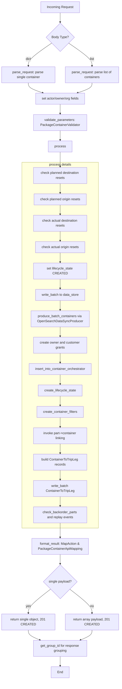

# Diagram: partview_core/partview_service/partview_service/api/package_container/handlers/post_container.py

> Auto-generated by Obscura crawlers

## Diagram 1

```mermaid
classDiagram
    class PostContainerRequestHandler {
        - MAX_DICT: int
        - __application_name
        - __package_container_list
        - __package_container_list_of_dict
        - __data_store: PackageContainerPostgresqlMapping
        - __parser: PackageContainerParser
        - __helper: PackageContainerHelper
        - __trip_leg_data_store: TripLegPostgresqlMapping
        - __business_layer: PackageContainerBusinessLogic
        - __filter_value_list: PackageContainerFilterValueList
        - __package_container_exception_business_logic: PackageContainerExceptionBusinessLogic
        + __init__(event)
        + parse_request()
        + validate_parameters()
        + process()
        + format_result()
        + get_group_id()
    }
    class PackageContainerParser
    class PackageContainerHelper
    class PackageContainerPostgresqlMapping
    class TripLegPostgresqlMapping
    class PackageContainerBusinessLogic
    class PackageContainerFilterValueList
    class PackageContainerExceptionBusinessLogic
    class OpenSearchDataSyncProducer
    class PackageContainerArchiveHelper
    class MapAction
    class PackageContainerApiMapping
    class InvokePartViewCrudApi
    class InvokeReferences
    class InvokePackageContainerEventReplay
    class ContainerToTripLegPostgressMapping
    class ContainerToTripLeg
    class PackageContainer
    class TripLeg
    PostContainerRequestHandler --> PackageContainerParser : uses
    PostContainerRequestHandler --> PackageContainerHelper : uses
    PostContainerRequestHandler --> PackageContainerPostgresqlMapping : uses
    PostContainerRequestHandler --> TripLegPostgresqlMapping : uses
    PostContainerRequestHandler --> PackageContainerBusinessLogic : uses
    PostContainerRequestHandler --> PackageContainerFilterValueList : creates
    PostContainerRequestHandler --> PackageContainerExceptionBusinessLogic : uses
    PostContainerRequestHandler --> OpenSearchDataSyncProducer : creates
    PostContainerRequestHandler --> PackageContainerArchiveHelper : calls
    PostContainerRequestHandler --> MapAction : uses
    PostContainerRequestHandler --> PackageContainerApiMapping : uses
    PostContainerRequestHandler --> InvokePartViewCrudApi : invokes
    PostContainerRequestHandler --> InvokeReferences : invokes
    PostContainerRequestHandler --> InvokePackageContainerEventReplay : invokes
    PostContainerRequestHandler --> ContainerToTripLegPostgressMapping : writes
    ContainerToTripLegPostgressMapping --> ContainerToTripLeg
    ContainerToTripLeg --> PackageContainer
    PackageContainerPostgresqlMapping --> PackageContainer
    TripLegPostgresqlMapping --> TripLeg
    PackageContainerBusinessLogic --> PackageContainer
    PackageContainerFilterValueList --> PackageContainer
    PackageContainerArchiveHelper --> PackageContainer
    MapAction --> PackageContainer
    PackageContainerApiMapping --> MapAction
```

### SVG

<svg id="container" width="3715.46875" xmlns="http://www.w3.org/2000/svg" class="classDiagram" height="946" viewBox="0 0 3715.46875 946" role="graphics-document document" aria-roledescription="class"><g><defs><marker id="container_class-aggregationStart" class="marker aggregation class" refX="18" refY="7" markerWidth="190" markerHeight="240" orient="auto"><path d="M 18,7 L9,13 L1,7 L9,1 Z"></path></marker></defs><defs><marker id="container_class-aggregationEnd" class="marker aggregation class" refX="1" refY="7" markerWidth="20" markerHeight="28" orient="auto"><path d="M 18,7 L9,13 L1,7 L9,1 Z"></path></marker></defs><defs><marker id="container_class-extensionStart" class="marker extension class" refX="18" refY="7" markerWidth="190" markerHeight="240" orient="auto"><path d="M 1,7 L18,13 V 1 Z"></path></marker></defs><defs><marker id="container_class-extensionEnd" class="marker extension class" refX="1" refY="7" markerWidth="20" markerHeight="28" orient="auto"><path d="M 1,1 V 13 L18,7 Z"></path></marker></defs><defs><marker id="container_class-compositionStart" class="marker composition class" refX="18" refY="7" markerWidth="190" markerHeight="240" orient="auto"><path d="M 18,7 L9,13 L1,7 L9,1 Z"></path></marker></defs><defs><marker id="container_class-compositionEnd" class="marker composition class" refX="1" refY="7" markerWidth="20" markerHeight="28" orient="auto"><path d="M 18,7 L9,13 L1,7 L9,1 Z"></path></marker></defs><defs><marker id="container_class-dependencyStart" class="marker dependency class" refX="6" refY="7" markerWidth="190" markerHeight="240" orient="auto"><path d="M 5,7 L9,13 L1,7 L9,1 Z"></path></marker></defs><defs><marker id="container_class-dependencyEnd" class="marker dependency class" refX="13" refY="7" markerWidth="20" markerHeight="28" orient="auto"><path d="M 18,7 L9,13 L14,7 L9,1 Z"></path></marker></defs><defs><marker id="container_class-lollipopStart" class="marker lollipop class" refX="13" refY="7" markerWidth="190" markerHeight="240" orient="auto"><circle stroke="black" fill="transparent" cx="7" cy="7" r="6"></circle></marker></defs><defs><marker id="container_class-lollipopEnd" class="marker lollipop class" refX="1" refY="7" markerWidth="190" markerHeight="240" orient="auto"><circle stroke="black" fill="transparent" cx="7" cy="7" r="6"></circle></marker></defs><g class="root"><g class="clusters"></g><g class="edgePaths"><path d="M1514.605,323.915L1280.308,361.429C1046.01,398.943,577.415,473.972,343.118,516.652C108.82,559.333,108.82,569.667,108.82,574.833L108.82,580" id="id_PostContainerRequestHandler_PackageContainerParser_1" class="edge-thickness-normal edge-pattern-solid relation" style=";;;" data-edge="true" data-et="edge" data-id="id_PostContainerRequestHandler_PackageContainerParser_1" data-points="W3sieCI6MTUxNC42MDU0Njg3NSwieSI6MzIzLjkxNDcxMjQyNTc2OTE1fSx7IngiOjEwOC44MjAzMTI1LCJ5Ijo1NDl9LHsieCI6MTA4LjgyMDMxMjUsInkiOjU4Nn1d" marker-end="url(#container_class-dependencyEnd)"></path><path d="M1514.605,334.324L1322.439,370.103C1130.273,405.883,745.941,477.441,553.775,518.387C361.609,559.333,361.609,569.667,361.609,574.833L361.609,580" id="id_PostContainerRequestHandler_PackageContainerHelper_2" class="edge-thickness-normal edge-pattern-solid relation" style=";;;" data-edge="true" data-et="edge" data-id="id_PostContainerRequestHandler_PackageContainerHelper_2" data-points="W3sieCI6MTUxNC42MDU0Njg3NSwieSI6MzM0LjMyMzkwNjkwNTEwODIzfSx7IngiOjM2MS42MDkzNzUsInkiOjU0OX0seyJ4IjozNjEuNjA5Mzc1LCJ5Ijo1ODZ9XQ==" marker-end="url(#container_class-dependencyEnd)"></path><path d="M1588.38,512L1580.417,518.167C1572.454,524.333,1556.528,536.667,1548.565,556C1540.602,575.333,1540.602,601.667,1540.602,626C1540.602,650.333,1540.602,672.667,1540.602,687C1540.602,701.333,1540.602,707.667,1540.602,710.833L1540.602,714" id="id_PostContainerRequestHandler_PackageContainerPostgresqlMapping_3" class="edge-thickness-normal edge-pattern-solid relation" style=";;;" data-edge="true" data-et="edge" data-id="id_PostContainerRequestHandler_PackageContainerPostgresqlMapping_3" data-points="W3sieCI6MTU4OC4zNzk4OTI5NDk4MjcsInkiOjUxMn0seyJ4IjoxNTQwLjYwMTU2MjUsInkiOjU0OX0seyJ4IjoxNTQwLjYwMTU2MjUsInkiOjYyOH0seyJ4IjoxNTQwLjYwMTU2MjUsInkiOjY5NX0seyJ4IjoxNTQwLjYwMTU2MjUsInkiOjcyMH1d" marker-end="url(#container_class-dependencyEnd)"></path><path d="M2312.973,328.497L2527.146,365.247C2741.32,401.998,3169.668,475.499,3383.842,517.416C3598.016,559.333,3598.016,569.667,3598.016,574.833L3598.016,580" id="id_PostContainerRequestHandler_TripLegPostgresqlMapping_4" class="edge-thickness-normal edge-pattern-solid relation" style=";;;" data-edge="true" data-et="edge" data-id="id_PostContainerRequestHandler_TripLegPostgresqlMapping_4" data-points="W3sieCI6MjMxMi45NzI2NTYyNSwieSI6MzI4LjQ5Njc1NzU5OTIzMTg0fSx7IngiOjM1OTguMDE1NjI1LCJ5Ijo1NDl9LHsieCI6MzU5OC4wMTU2MjUsInkiOjU4Nn1d" marker-end="url(#container_class-dependencyEnd)"></path><path d="M2312.973,504.545L2325.067,511.954C2337.161,519.363,2361.35,534.182,2373.445,554.757C2385.539,575.333,2385.539,601.667,2385.539,626C2385.539,650.333,2385.539,672.667,2385.539,687C2385.539,701.333,2385.539,707.667,2385.539,710.833L2385.539,714" id="id_PostContainerRequestHandler_PackageContainerBusinessLogic_5" class="edge-thickness-normal edge-pattern-solid relation" style=";;;" data-edge="true" data-et="edge" data-id="id_PostContainerRequestHandler_PackageContainerBusinessLogic_5" data-points="W3sieCI6MjMxMi45NzI2NTYyNSwieSI6NTA0LjU0NDkwNDI3OTI3OTN9LHsieCI6MjM4NS41MzkwNjI1LCJ5Ijo1NDl9LHsieCI6MjM4NS41MzkwNjI1LCJ5Ijo2Mjh9LHsieCI6MjM4NS41MzkwNjI1LCJ5Ijo2OTV9LHsieCI6MjM4NS41MzkwNjI1LCJ5Ijo3MjB9XQ==" marker-end="url(#container_class-dependencyEnd)"></path><path d="M2312.973,407.874L2376.467,431.395C2439.961,454.916,2566.949,501.958,2630.443,538.646C2693.938,575.333,2693.938,601.667,2693.938,626C2693.938,650.333,2693.938,672.667,2693.938,687C2693.938,701.333,2693.938,707.667,2693.938,710.833L2693.938,714" id="id_PostContainerRequestHandler_PackageContainerFilterValueList_6" class="edge-thickness-normal edge-pattern-solid relation" style=";;;" data-edge="true" data-et="edge" data-id="id_PostContainerRequestHandler_PackageContainerFilterValueList_6" data-points="W3sieCI6MjMxMi45NzI2NTYyNSwieSI6NDA3Ljg3NDQ5ODA0MjIzOTU3fSx7IngiOjI2OTMuOTM3NSwieSI6NTQ5fSx7IngiOjI2OTMuOTM3NSwieSI6NjI4fSx7IngiOjI2OTMuOTM3NSwieSI6Njk1fSx7IngiOjI2OTMuOTM3NSwieSI6NzIwfV0=" marker-end="url(#container_class-dependencyEnd)"></path><path d="M1514.605,390.327L1433.605,416.773C1352.604,443.218,1190.603,496.109,1109.602,527.721C1028.602,559.333,1028.602,569.667,1028.602,574.833L1028.602,580" id="id_PostContainerRequestHandler_PackageContainerExceptionBusinessLogic_7" class="edge-thickness-normal edge-pattern-solid relation" style=";;;" data-edge="true" data-et="edge" data-id="id_PostContainerRequestHandler_PackageContainerExceptionBusinessLogic_7" data-points="W3sieCI6MTUxNC42MDU0Njg3NSwieSI6MzkwLjMyNzI1Njc2MDU3MzMzfSx7IngiOjEwMjguNjAxNTYyNSwieSI6NTQ5fSx7IngiOjEwMjguNjAxNTYyNSwieSI6NTg2fV0=" marker-end="url(#container_class-dependencyEnd)"></path><path d="M1514.605,470.65L1489.86,483.709C1465.115,496.767,1415.624,522.883,1390.878,541.108C1366.133,559.333,1366.133,569.667,1366.133,574.833L1366.133,580" id="id_PostContainerRequestHandler_OpenSearchDataSyncProducer_8" class="edge-thickness-normal edge-pattern-solid relation" style=";;;" data-edge="true" data-et="edge" data-id="id_PostContainerRequestHandler_OpenSearchDataSyncProducer_8" data-points="W3sieCI6MTUxNC42MDU0Njg3NSwieSI6NDcwLjY1MDQ5MjE1NDA2NTY2fSx7IngiOjEzNjYuMTMyODEyNSwieSI6NTQ5fSx7IngiOjEzNjYuMTMyODEyNSwieSI6NTg2fV0=" marker-end="url(#container_class-dependencyEnd)"></path><path d="M2312.973,365.984L2427.86,396.486C2542.747,426.989,2772.522,487.995,2887.41,531.664C3002.297,575.333,3002.297,601.667,3002.297,626C3002.297,650.333,3002.297,672.667,3002.297,687C3002.297,701.333,3002.297,707.667,3002.297,710.833L3002.297,714" id="id_PostContainerRequestHandler_PackageContainerArchiveHelper_9" class="edge-thickness-normal edge-pattern-solid relation" style=";;;" data-edge="true" data-et="edge" data-id="id_PostContainerRequestHandler_PackageContainerArchiveHelper_9" data-points="W3sieCI6MjMxMi45NzI2NTYyNSwieSI6MzY1Ljk4MzY3NTMyOTYxNTV9LHsieCI6MzAwMi4yOTY4NzUsInkiOjU0OX0seyJ4IjozMDAyLjI5Njg3NSwieSI6NjI4fSx7IngiOjMwMDIuMjk2ODc1LCJ5Ijo2OTV9LHsieCI6MzAwMi4yOTY4NzUsInkiOjcyMH1d" marker-end="url(#container_class-dependencyEnd)"></path><path d="M2312.973,353.815L2451.393,386.345C2589.813,418.876,2866.652,483.938,3005.072,529.636C3143.492,575.333,3143.492,601.667,3143.492,626C3143.492,650.333,3143.492,672.667,3148.967,687.989C3154.441,703.312,3165.39,711.623,3170.864,715.779L3176.338,719.935" id="id_PostContainerRequestHandler_MapAction_10" class="edge-thickness-normal edge-pattern-solid relation" style=";;;" data-edge="true" data-et="edge" data-id="id_PostContainerRequestHandler_MapAction_10" data-points="W3sieCI6MjMxMi45NzI2NTYyNSwieSI6MzUzLjgxNDU2MDgwNjA4ODl9LHsieCI6MzE0My40OTIxODc1LCJ5Ijo1NDl9LHsieCI6MzE0My40OTIxODc1LCJ5Ijo2Mjh9LHsieCI6MzE0My40OTIxODc1LCJ5Ijo2OTV9LHsieCI6MzE4MS4xMTcxODc1LCJ5Ijo3MjMuNTYyNjI3MjQ2MTcxNn1d" marker-end="url(#container_class-dependencyEnd)"></path><path d="M2312.973,342.164L2480.452,376.637C2647.932,411.11,2982.892,480.055,3150.372,519.694C3317.852,559.333,3317.852,569.667,3317.852,574.833L3317.852,580" id="id_PostContainerRequestHandler_PackageContainerApiMapping_11" class="edge-thickness-normal edge-pattern-solid relation" style=";;;" data-edge="true" data-et="edge" data-id="id_PostContainerRequestHandler_PackageContainerApiMapping_11" data-points="W3sieCI6MjMxMi45NzI2NTYyNSwieSI6MzQyLjE2NDQ3NTI5NDkwMzJ9LHsieCI6MzMxNy44NTE1NjI1LCJ5Ijo1NDl9LHsieCI6MzMxNy44NTE1NjI1LCJ5Ijo1ODZ9XQ==" marker-end="url(#container_class-dependencyEnd)"></path><path d="M1718.283,512L1713.499,518.167C1708.715,524.333,1699.147,536.667,1694.362,548C1689.578,559.333,1689.578,569.667,1689.578,574.833L1689.578,580" id="id_PostContainerRequestHandler_InvokePartViewCrudApi_12" class="edge-thickness-normal edge-pattern-solid relation" style=";;;" data-edge="true" data-et="edge" data-id="id_PostContainerRequestHandler_InvokePartViewCrudApi_12" data-points="W3sieCI6MTcxOC4yODMzMzE1MzExNDE4LCJ5Ijo1MTJ9LHsieCI6MTY4OS41NzgxMjUsInkiOjU0OX0seyJ4IjoxNjg5LjU3ODEyNSwieSI6NTg2fV0=" marker-end="url(#container_class-dependencyEnd)"></path><path d="M1913.789,512L1913.789,518.167C1913.789,524.333,1913.789,536.667,1913.789,548C1913.789,559.333,1913.789,569.667,1913.789,574.833L1913.789,580" id="id_PostContainerRequestHandler_InvokeReferences_13" class="edge-thickness-normal edge-pattern-solid relation" style=";;;" data-edge="true" data-et="edge" data-id="id_PostContainerRequestHandler_InvokeReferences_13" data-points="W3sieCI6MTkxMy43ODkwNjI1LCJ5Ijo1MTJ9LHsieCI6MTkxMy43ODkwNjI1LCJ5Ijo1NDl9LHsieCI6MTkxMy43ODkwNjI1LCJ5Ijo1ODZ9XQ==" marker-end="url(#container_class-dependencyEnd)"></path><path d="M2152.267,512L2158.102,518.167C2163.938,524.333,2175.61,536.667,2181.445,548C2187.281,559.333,2187.281,569.667,2187.281,574.833L2187.281,580" id="id_PostContainerRequestHandler_InvokePackageContainerEventReplay_14" class="edge-thickness-normal edge-pattern-solid relation" style=";;;" data-edge="true" data-et="edge" data-id="id_PostContainerRequestHandler_InvokePackageContainerEventReplay_14" data-points="W3sieCI6MjE1Mi4yNjY2NzkyODIwMDcsInkiOjUxMn0seyJ4IjoyMTg3LjI4MTI1LCJ5Ijo1NDl9LHsieCI6MjE4Ny4yODEyNSwieSI6NTg2fV0=" marker-end="url(#container_class-dependencyEnd)"></path><path d="M1514.605,352.293L1372.807,385.077C1231.008,417.862,947.41,483.431,805.611,521.382C663.813,559.333,663.813,569.667,663.813,574.833L663.813,580" id="id_PostContainerRequestHandler_ContainerToTripLegPostgressMapping_15" class="edge-thickness-normal edge-pattern-solid relation" style=";;;" data-edge="true" data-et="edge" data-id="id_PostContainerRequestHandler_ContainerToTripLegPostgressMapping_15" data-points="W3sieCI6MTUxNC42MDU0Njg3NSwieSI6MzUyLjI5Mjk3NzM2ODMyNTY0fSx7IngiOjY2My44MTI1LCJ5Ijo1NDl9LHsieCI6NjYzLjgxMjUsInkiOjU4Nn1d" marker-end="url(#container_class-dependencyEnd)"></path><path d="M663.813,670L663.813,674.167C663.813,678.333,663.813,686.667,663.813,694C663.813,701.333,663.813,707.667,663.813,710.833L663.813,714" id="id_ContainerToTripLegPostgressMapping_ContainerToTripLeg_16" class="edge-thickness-normal edge-pattern-solid relation" style=";;;" data-edge="true" data-et="edge" data-id="id_ContainerToTripLegPostgressMapping_ContainerToTripLeg_16" data-points="W3sieCI6NjYzLjgxMjUsInkiOjY3MH0seyJ4Ijo2NjMuODEyNSwieSI6Njk1fSx7IngiOjY2My44MTI1LCJ5Ijo3MjB9XQ==" marker-end="url(#container_class-dependencyEnd)"></path><path d="M663.813,804L663.813,808.167C663.813,812.333,663.813,820.667,962.559,835.503C1261.305,850.34,1858.797,871.68,2157.543,882.35L2456.289,893.02" id="id_ContainerToTripLeg_PackageContainer_17" class="edge-thickness-normal edge-pattern-solid relation" style=";;;" data-edge="true" data-et="edge" data-id="id_ContainerToTripLeg_PackageContainer_17" data-points="W3sieCI6NjYzLjgxMjUsInkiOjgwNH0seyJ4Ijo2NjMuODEyNSwieSI6ODI5fSx7IngiOjI0NjIuMjg1MTU2MjUsInkiOjg5My4yMzM3MDc1MjM1NzY5fV0=" marker-end="url(#container_class-dependencyEnd)"></path><path d="M1540.602,804L1540.602,808.167C1540.602,812.333,1540.602,820.667,1693.218,835.067C1845.834,849.468,2151.066,869.936,2303.682,880.171L2456.299,890.405" id="id_PackageContainerPostgresqlMapping_PackageContainer_18" class="edge-thickness-normal edge-pattern-solid relation" style=";;;" data-edge="true" data-et="edge" data-id="id_PackageContainerPostgresqlMapping_PackageContainer_18" data-points="W3sieCI6MTU0MC42MDE1NjI1LCJ5Ijo4MDR9LHsieCI6MTU0MC42MDE1NjI1LCJ5Ijo4Mjl9LHsieCI6MjQ2Mi4yODUxNTYyNSwieSI6ODkwLjgwNjE1Njg3NzYxN31d" marker-end="url(#container_class-dependencyEnd)"></path><path d="M3598.016,670L3598.016,674.167C3598.016,678.333,3598.016,686.667,3598.016,694C3598.016,701.333,3598.016,707.667,3598.016,710.833L3598.016,714" id="id_TripLegPostgresqlMapping_TripLeg_19" class="edge-thickness-normal edge-pattern-solid relation" style=";;;" data-edge="true" data-et="edge" data-id="id_TripLegPostgresqlMapping_TripLeg_19" data-points="W3sieCI6MzU5OC4wMTU2MjUsInkiOjY3MH0seyJ4IjozNTk4LjAxNTYyNSwieSI6Njk1fSx7IngiOjM1OTguMDE1NjI1LCJ5Ijo3MjB9XQ==" marker-end="url(#container_class-dependencyEnd)"></path><path d="M2385.539,804L2385.539,808.167C2385.539,812.333,2385.539,820.667,2397.413,829.993C2409.287,839.318,2433.034,849.637,2444.908,854.796L2456.782,859.955" id="id_PackageContainerBusinessLogic_PackageContainer_20" class="edge-thickness-normal edge-pattern-solid relation" style=";;;" data-edge="true" data-et="edge" data-id="id_PackageContainerBusinessLogic_PackageContainer_20" data-points="W3sieCI6MjM4NS41MzkwNjI1LCJ5Ijo4MDR9LHsieCI6MjM4NS41MzkwNjI1LCJ5Ijo4Mjl9LHsieCI6MjQ2Mi4yODUxNTYyNSwieSI6ODYyLjM0NjM5NjQ1MzQ1MTZ9XQ==" marker-end="url(#container_class-dependencyEnd)"></path><path d="M2693.938,804L2693.938,808.167C2693.938,812.333,2693.938,820.667,2682.064,829.993C2670.19,839.318,2646.442,849.637,2634.568,854.796L2622.694,859.955" id="id_PackageContainerFilterValueList_PackageContainer_21" class="edge-thickness-normal edge-pattern-solid relation" style=";;;" data-edge="true" data-et="edge" data-id="id_PackageContainerFilterValueList_PackageContainer_21" data-points="W3sieCI6MjY5My45Mzc1LCJ5Ijo4MDR9LHsieCI6MjY5My45Mzc1LCJ5Ijo4Mjl9LHsieCI6MjYxNy4xOTE0MDYyNSwieSI6ODYyLjM0NjM5NjQ1MzQ1MTZ9XQ==" marker-end="url(#container_class-dependencyEnd)"></path><path d="M3002.297,804L3002.297,808.167C3002.297,812.333,3002.297,820.667,2939.102,833.987C2875.908,847.307,2749.519,865.614,2686.324,874.768L2623.129,883.921" id="id_PackageContainerArchiveHelper_PackageContainer_22" class="edge-thickness-normal edge-pattern-solid relation" style=";;;" data-edge="true" data-et="edge" data-id="id_PackageContainerArchiveHelper_PackageContainer_22" data-points="W3sieCI6MzAwMi4yOTY4NzUsInkiOjgwNH0seyJ4IjozMDAyLjI5Njg3NSwieSI6ODI5fSx7IngiOjI2MTcuMTkxNDA2MjUsInkiOjg4NC43ODExODQ4MTYxMTI4fV0=" marker-end="url(#container_class-dependencyEnd)"></path><path d="M3231.75,804L3231.75,808.167C3231.75,812.333,3231.75,820.667,3130.319,834.654C3028.888,848.641,2826.026,868.282,2724.595,878.102L2623.163,887.923" id="id_MapAction_PackageContainer_23" class="edge-thickness-normal edge-pattern-solid relation" style=";;;" data-edge="true" data-et="edge" data-id="id_MapAction_PackageContainer_23" data-points="W3sieCI6MzIzMS43NSwieSI6ODA0fSx7IngiOjMyMzEuNzUsInkiOjgyOX0seyJ4IjoyNjE3LjE5MTQwNjI1LCJ5Ijo4ODguNTAxMDUyNzUwNDE2M31d" marker-end="url(#container_class-dependencyEnd)"></path><path d="M3317.852,670L3317.852,674.167C3317.852,678.333,3317.852,686.667,3312.729,694.819C3307.607,702.972,3297.363,710.944,3292.24,714.929L3287.118,718.915" id="id_PackageContainerApiMapping_MapAction_24" class="edge-thickness-normal edge-pattern-solid relation" style=";;;" data-edge="true" data-et="edge" data-id="id_PackageContainerApiMapping_MapAction_24" data-points="W3sieCI6MzMxNy44NTE1NjI1LCJ5Ijo2NzB9LHsieCI6MzMxNy44NTE1NjI1LCJ5Ijo2OTV9LHsieCI6MzI4Mi4zODI4MTI1LCJ5Ijo3MjIuNjAwMDM2Mjk0MzQ3Mn1d" marker-end="url(#container_class-dependencyEnd)"></path></g><g class="edgeLabels"><g class="edgeLabel" transform="translate(108.8203125, 549)"><g class="label" data-id="id_PostContainerRequestHandler_PackageContainerParser_1" transform="translate(-16.4921875, -12)"><foreignObject width="32.984375" height="24">

uses

</foreignObject></g></g><g class="edgeLabel" transform="translate(361.609375, 549)"><g class="label" data-id="id_PostContainerRequestHandler_PackageContainerHelper_2" transform="translate(-16.4921875, -12)"><foreignObject width="32.984375" height="24">

uses

</foreignObject></g></g><g class="edgeLabel" transform="translate(1540.6015625, 628)"><g class="label" data-id="id_PostContainerRequestHandler_PackageContainerPostgresqlMapping_3" transform="translate(-16.4921875, -12)"><foreignObject width="32.984375" height="24">

uses

</foreignObject></g></g><g class="edgeLabel" transform="translate(3598.015625, 549)"><g class="label" data-id="id_PostContainerRequestHandler_TripLegPostgresqlMapping_4" transform="translate(-16.4921875, -12)"><foreignObject width="32.984375" height="24">

uses

</foreignObject></g></g><g class="edgeLabel" transform="translate(2385.5390625, 628)"><g class="label" data-id="id_PostContainerRequestHandler_PackageContainerBusinessLogic_5" transform="translate(-16.4921875, -12)"><foreignObject width="32.984375" height="24">

uses

</foreignObject></g></g><g class="edgeLabel" transform="translate(2693.9375, 628)"><g class="label" data-id="id_PostContainerRequestHandler_PackageContainerFilterValueList_6" transform="translate(-26.171875, -12)"><foreignObject width="52.34375" height="24">

creates

</foreignObject></g></g><g class="edgeLabel" transform="translate(1028.6015625, 549)"><g class="label" data-id="id_PostContainerRequestHandler_PackageContainerExceptionBusinessLogic_7" transform="translate(-16.4921875, -12)"><foreignObject width="32.984375" height="24">

uses

</foreignObject></g></g><g class="edgeLabel" transform="translate(1366.1328125, 549)"><g class="label" data-id="id_PostContainerRequestHandler_OpenSearchDataSyncProducer_8" transform="translate(-26.171875, -12)"><foreignObject width="52.34375" height="24">

creates

</foreignObject></g></g><g class="edgeLabel" transform="translate(3002.296875, 628)"><g class="label" data-id="id_PostContainerRequestHandler_PackageContainerArchiveHelper_9" transform="translate(-16.4453125, -12)"><foreignObject width="32.890625" height="24">

calls

</foreignObject></g></g><g class="edgeLabel" transform="translate(3143.4921875, 628)"><g class="label" data-id="id_PostContainerRequestHandler_MapAction_10" transform="translate(-16.4921875, -12)"><foreignObject width="32.984375" height="24">

uses

</foreignObject></g></g><g class="edgeLabel" transform="translate(3317.8515625, 549)"><g class="label" data-id="id_PostContainerRequestHandler_PackageContainerApiMapping_11" transform="translate(-16.4921875, -12)"><foreignObject width="32.984375" height="24">

uses

</foreignObject></g></g><g class="edgeLabel" transform="translate(1689.578125, 549)"><g class="label" data-id="id_PostContainerRequestHandler_InvokePartViewCrudApi_12" transform="translate(-27.5859375, -12)"><foreignObject width="55.171875" height="24">

invokes

</foreignObject></g></g><g class="edgeLabel" transform="translate(1913.7890625, 549)"><g class="label" data-id="id_PostContainerRequestHandler_InvokeReferences_13" transform="translate(-27.5859375, -12)"><foreignObject width="55.171875" height="24">

invokes

</foreignObject></g></g><g class="edgeLabel" transform="translate(2187.28125, 549)"><g class="label" data-id="id_PostContainerRequestHandler_InvokePackageContainerEventReplay_14" transform="translate(-27.5859375, -12)"><foreignObject width="55.171875" height="24">

invokes

</foreignObject></g></g><g class="edgeLabel" transform="translate(663.8125, 549)"><g class="label" data-id="id_PostContainerRequestHandler_ContainerToTripLegPostgressMapping_15" transform="translate(-21.9453125, -12)"><foreignObject width="43.890625" height="24">

writes

</foreignObject></g></g><g class="edgeLabel"><g class="label" data-id="id_ContainerToTripLegPostgressMapping_ContainerToTripLeg_16" transform="translate(0, 0)"><foreignObject width="0" height="0">

</foreignObject></g></g><g class="edgeLabel"><g class="label" data-id="id_ContainerToTripLeg_PackageContainer_17" transform="translate(0, 0)"><foreignObject width="0" height="0">

</foreignObject></g></g><g class="edgeLabel"><g class="label" data-id="id_PackageContainerPostgresqlMapping_PackageContainer_18" transform="translate(0, 0)"><foreignObject width="0" height="0">

</foreignObject></g></g><g class="edgeLabel"><g class="label" data-id="id_TripLegPostgresqlMapping_TripLeg_19" transform="translate(0, 0)"><foreignObject width="0" height="0">

</foreignObject></g></g><g class="edgeLabel"><g class="label" data-id="id_PackageContainerBusinessLogic_PackageContainer_20" transform="translate(0, 0)"><foreignObject width="0" height="0">

</foreignObject></g></g><g class="edgeLabel"><g class="label" data-id="id_PackageContainerFilterValueList_PackageContainer_21" transform="translate(0, 0)"><foreignObject width="0" height="0">

</foreignObject></g></g><g class="edgeLabel"><g class="label" data-id="id_PackageContainerArchiveHelper_PackageContainer_22" transform="translate(0, 0)"><foreignObject width="0" height="0">

</foreignObject></g></g><g class="edgeLabel"><g class="label" data-id="id_MapAction_PackageContainer_23" transform="translate(0, 0)"><foreignObject width="0" height="0">

</foreignObject></g></g><g class="edgeLabel"><g class="label" data-id="id_PackageContainerApiMapping_MapAction_24" transform="translate(0, 0)"><foreignObject width="0" height="0">

</foreignObject></g></g></g><g class="nodes"><g class="node default" id="classId-PostContainerRequestHandler-0" transform="translate(1913.7890625, 260)"><g class="basic label-container"><path d="M-399.18359375 -252 L399.18359375 -252 L399.18359375 252 L-399.18359375 252" stroke="none" stroke-width="0" fill="#ECECFF" style=""></path><path d="M-399.18359375 -252 C-236.1789352382014 -252, -73.17427672640281 -252, 399.18359375 -252 M-399.18359375 -252 C-222.291097456776 -252, -45.39860116355197 -252, 399.18359375 -252 M399.18359375 -252 C399.18359375 -108.57637290048973, 399.18359375 34.84725419902054, 399.18359375 252 M399.18359375 -252 C399.18359375 -127.71160700309301, 399.18359375 -3.423214006186015, 399.18359375 252 M399.18359375 252 C115.35559402548745 252, -168.4724056990251 252, -399.18359375 252 M399.18359375 252 C154.1705545558607 252, -90.84248463827862 252, -399.18359375 252 M-399.18359375 252 C-399.18359375 133.6587760889107, -399.18359375 15.317552177821455, -399.18359375 -252 M-399.18359375 252 C-399.18359375 73.64187997582474, -399.18359375 -104.71624004835053, -399.18359375 -252" stroke="#9370DB" stroke-width="1.3" fill="none" stroke-dasharray="0 0" style=""></path></g><g class="annotation-group text" transform="translate(0, -228)"></g><g class="label-group text" transform="translate(-110.8515625, -228)"><g class="label" style="font-weight: bolder" transform="translate(0,-12)"><foreignObject width="221.703125" height="24">

PostContainerRequestHandler

</foreignObject></g></g><g class="members-group text" transform="translate(-387.18359375, -180)"><g class="label" style="" transform="translate(0,-12)"><foreignObject width="108.46875" height="24">

- MAX_DICT: int

</foreignObject></g><g class="label" style="" transform="translate(0,12)"><foreignObject width="157.796875" height="24">

- __application_name

</foreignObject></g><g class="label" style="" transform="translate(0,36)"><foreignObject width="192.359375" height="24">

- __package_container_list

</foreignObject></g><g class="label" style="" transform="translate(0,60)"><foreignObject width="250.09375" height="24">

- __package_container_list_of_dict

</foreignObject></g><g class="label" style="" transform="translate(0,84)"><foreignObject width="379.21875" height="24">

- __data_store: PackageContainerPostgresqlMapping

</foreignObject></g><g class="label" style="" transform="translate(0,108)"><foreignObject width="255.75" height="24">

- __parser: PackageContainerParser

</foreignObject></g><g class="label" style="" transform="translate(0,132)"><foreignObject width="259.84375" height="24">

- __helper: PackageContainerHelper

</foreignObject></g><g class="label" style="" transform="translate(0,156)"><foreignObject width="366.78125" height="24">

- __trip_leg_data_store: TripLegPostgresqlMapping

</foreignObject></g><g class="label" style="" transform="translate(0,180)"><foreignObject width="372.5625" height="24">

- __business_layer: PackageContainerBusinessLogic

</foreignObject></g><g class="label" style="" transform="translate(0,204)"><foreignObject width="375.78125" height="24">

- __filter_value_list: PackageContainerFilterValueList

</foreignObject></g><g class="label" style="" transform="translate(0,228)"><foreignObject width="663.515625" height="24">

- __package_container_exception_business_logic: PackageContainerExceptionBusinessLogic

</foreignObject></g></g><g class="methods-group text" transform="translate(-387.18359375, 108)"><g class="label" style="" transform="translate(0,-12)"><foreignObject width="87.390625" height="24">

+ <strong>init</strong>(event)

</foreignObject></g><g class="label" style="" transform="translate(0,12)"><foreignObject width="126.046875" height="24">

+ parse_request()

</foreignObject></g><g class="label" style="" transform="translate(0,36)"><foreignObject width="170.953125" height="24">

+ validate_parameters()

</foreignObject></g><g class="label" style="" transform="translate(0,60)"><foreignObject width="77.96875" height="24">

+ process()

</foreignObject></g><g class="label" style="" transform="translate(0,84)"><foreignObject width="121.5" height="24">

+ format_result()

</foreignObject></g><g class="label" style="" transform="translate(0,108)"><foreignObject width="117.875" height="24">

+ get_group_id()

</foreignObject></g></g><g class="divider" style=""><path d="M-399.18359375 -204 C-182.37338301100246 -204, 34.43682772799508 -204, 399.18359375 -204 M-399.18359375 -204 C-208.71349851138353 -204, -18.24340327276707 -204, 399.18359375 -204" stroke="#9370DB" stroke-width="1.3" fill="none" stroke-dasharray="0 0" style=""></path></g><g class="divider" style=""><path d="M-399.18359375 84 C-113.03289605855991 84, 173.11780163288017 84, 399.18359375 84 M-399.18359375 84 C-179.6115868768457 84, 39.96041999630859 84, 399.18359375 84" stroke="#9370DB" stroke-width="1.3" fill="none" stroke-dasharray="0 0" style=""></path></g></g><g class="node default" id="classId-PackageContainerParser-1" transform="translate(108.8203125, 628)"><g class="basic label-container"><path d="M-100.8203125 -42 L100.8203125 -42 L100.8203125 42 L-100.8203125 42" stroke="none" stroke-width="0" fill="#ECECFF" style=""></path><path d="M-100.8203125 -42 C-58.346333122332915 -42, -15.87235374466583 -42, 100.8203125 -42 M-100.8203125 -42 C-44.92152370025615 -42, 10.977265099487695 -42, 100.8203125 -42 M100.8203125 -42 C100.8203125 -23.425580543778132, 100.8203125 -4.851161087556264, 100.8203125 42 M100.8203125 -42 C100.8203125 -22.702430120084014, 100.8203125 -3.404860240168027, 100.8203125 42 M100.8203125 42 C43.03660411186083 42, -14.747104276278336 42, -100.8203125 42 M100.8203125 42 C37.33376026483975 42, -26.152791970320493 42, -100.8203125 42 M-100.8203125 42 C-100.8203125 23.235852941721873, -100.8203125 4.471705883443747, -100.8203125 -42 M-100.8203125 42 C-100.8203125 14.660462504052955, -100.8203125 -12.67907499189409, -100.8203125 -42" stroke="#9370DB" stroke-width="1.3" fill="none" stroke-dasharray="0 0" style=""></path></g><g class="annotation-group text" transform="translate(0, -18)"></g><g class="label-group text" transform="translate(-88.8203125, -18)"><g class="label" style="font-weight: bolder" transform="translate(0,-12)"><foreignObject width="177.640625" height="24">

PackageContainerParser

</foreignObject></g></g><g class="members-group text" transform="translate(-88.8203125, 30)"></g><g class="methods-group text" transform="translate(-88.8203125, 60)"></g><g class="divider" style=""><path d="M-100.8203125 6 C-28.013901241773112 6, 44.792510016453775 6, 100.8203125 6 M-100.8203125 6 C-37.092725877375656 6, 26.634860745248687 6, 100.8203125 6" stroke="#9370DB" stroke-width="1.3" fill="none" stroke-dasharray="0 0" style=""></path></g><g class="divider" style=""><path d="M-100.8203125 24 C-20.954913313502345 24, 58.91048587299531 24, 100.8203125 24 M-100.8203125 24 C-25.64140970903975 24, 49.5374930819205 24, 100.8203125 24" stroke="#9370DB" stroke-width="1.3" fill="none" stroke-dasharray="0 0" style=""></path></g></g><g class="node default" id="classId-PackageContainerHelper-2" transform="translate(361.609375, 628)"><g class="basic label-container"><path d="M-101.96875 -42 L101.96875 -42 L101.96875 42 L-101.96875 42" stroke="none" stroke-width="0" fill="#ECECFF" style=""></path><path d="M-101.96875 -42 C-49.307278217453685 -42, 3.354193565092629 -42, 101.96875 -42 M-101.96875 -42 C-45.49224258856377 -42, 10.984264822872461 -42, 101.96875 -42 M101.96875 -42 C101.96875 -9.441361256339576, 101.96875 23.117277487320848, 101.96875 42 M101.96875 -42 C101.96875 -12.112727120829174, 101.96875 17.774545758341652, 101.96875 42 M101.96875 42 C30.56039225740703 42, -40.84796548518594 42, -101.96875 42 M101.96875 42 C46.5913941440571 42, -8.785961711885804 42, -101.96875 42 M-101.96875 42 C-101.96875 16.18015998814223, -101.96875 -9.639680023715542, -101.96875 -42 M-101.96875 42 C-101.96875 19.546949298605384, -101.96875 -2.9061014027892327, -101.96875 -42" stroke="#9370DB" stroke-width="1.3" fill="none" stroke-dasharray="0 0" style=""></path></g><g class="annotation-group text" transform="translate(0, -18)"></g><g class="label-group text" transform="translate(-89.96875, -18)"><g class="label" style="font-weight: bolder" transform="translate(0,-12)"><foreignObject width="179.9375" height="24">

PackageContainerHelper

</foreignObject></g></g><g class="members-group text" transform="translate(-89.96875, 30)"></g><g class="methods-group text" transform="translate(-89.96875, 60)"></g><g class="divider" style=""><path d="M-101.96875 6 C-34.140700259548765 6, 33.68734948090247 6, 101.96875 6 M-101.96875 6 C-26.023897151983107 6, 49.920955696033786 6, 101.96875 6" stroke="#9370DB" stroke-width="1.3" fill="none" stroke-dasharray="0 0" style=""></path></g><g class="divider" style=""><path d="M-101.96875 24 C-25.178063105582694 24, 51.61262378883461 24, 101.96875 24 M-101.96875 24 C-49.34503789603068 24, 3.2786742079386357 24, 101.96875 24" stroke="#9370DB" stroke-width="1.3" fill="none" stroke-dasharray="0 0" style=""></path></g></g><g class="node default" id="classId-PackageContainerPostgresqlMapping-3" transform="translate(1540.6015625, 762)"><g class="basic label-container"><path d="M-147.8515625 -42 L147.8515625 -42 L147.8515625 42 L-147.8515625 42" stroke="none" stroke-width="0" fill="#ECECFF" style=""></path><path d="M-147.8515625 -42 C-31.53160313636245 -42, 84.7883562272751 -42, 147.8515625 -42 M-147.8515625 -42 C-38.77601825412158 -42, 70.29952599175684 -42, 147.8515625 -42 M147.8515625 -42 C147.8515625 -10.51525233415662, 147.8515625 20.96949533168676, 147.8515625 42 M147.8515625 -42 C147.8515625 -11.971677972459254, 147.8515625 18.05664405508149, 147.8515625 42 M147.8515625 42 C64.50305104090765 42, -18.8454604181847 42, -147.8515625 42 M147.8515625 42 C65.12346923540659 42, -17.604624029186823 42, -147.8515625 42 M-147.8515625 42 C-147.8515625 9.892113727655918, -147.8515625 -22.215772544688164, -147.8515625 -42 M-147.8515625 42 C-147.8515625 9.129362558663708, -147.8515625 -23.741274882672585, -147.8515625 -42" stroke="#9370DB" stroke-width="1.3" fill="none" stroke-dasharray="0 0" style=""></path></g><g class="annotation-group text" transform="translate(0, -18)"></g><g class="label-group text" transform="translate(-135.8515625, -18)"><g class="label" style="font-weight: bolder" transform="translate(0,-12)"><foreignObject width="271.703125" height="24">

PackageContainerPostgresqlMapping

</foreignObject></g></g><g class="members-group text" transform="translate(-135.8515625, 30)"></g><g class="methods-group text" transform="translate(-135.8515625, 60)"></g><g class="divider" style=""><path d="M-147.8515625 6 C-39.17855813310497 6, 69.49444623379006 6, 147.8515625 6 M-147.8515625 6 C-57.96946726324214 6, 31.912627973515725 6, 147.8515625 6" stroke="#9370DB" stroke-width="1.3" fill="none" stroke-dasharray="0 0" style=""></path></g><g class="divider" style=""><path d="M-147.8515625 24 C-44.803562125450654 24, 58.24443824909869 24, 147.8515625 24 M-147.8515625 24 C-42.54801960589427 24, 62.755523288211464 24, 147.8515625 24" stroke="#9370DB" stroke-width="1.3" fill="none" stroke-dasharray="0 0" style=""></path></g></g><g class="node default" id="classId-TripLegPostgresqlMapping-4" transform="translate(3598.015625, 628)"><g class="basic label-container"><path d="M-109.453125 -42 L109.453125 -42 L109.453125 42 L-109.453125 42" stroke="none" stroke-width="0" fill="#ECECFF" style=""></path><path d="M-109.453125 -42 C-25.67414124542124 -42, 58.10484250915752 -42, 109.453125 -42 M-109.453125 -42 C-30.00850183809645 -42, 49.4361213238071 -42, 109.453125 -42 M109.453125 -42 C109.453125 -11.303190053857556, 109.453125 19.39361989228489, 109.453125 42 M109.453125 -42 C109.453125 -16.373021397142292, 109.453125 9.253957205715416, 109.453125 42 M109.453125 42 C39.74649524609255 42, -29.9601345078149 42, -109.453125 42 M109.453125 42 C23.688465663520176 42, -62.07619367295965 42, -109.453125 42 M-109.453125 42 C-109.453125 19.571507811457806, -109.453125 -2.8569843770843875, -109.453125 -42 M-109.453125 42 C-109.453125 12.34859017926744, -109.453125 -17.30281964146512, -109.453125 -42" stroke="#9370DB" stroke-width="1.3" fill="none" stroke-dasharray="0 0" style=""></path></g><g class="annotation-group text" transform="translate(0, -18)"></g><g class="label-group text" transform="translate(-97.453125, -18)"><g class="label" style="font-weight: bolder" transform="translate(0,-12)"><foreignObject width="194.90625" height="24">

TripLegPostgresqlMapping

</foreignObject></g></g><g class="members-group text" transform="translate(-97.453125, 30)"></g><g class="methods-group text" transform="translate(-97.453125, 60)"></g><g class="divider" style=""><path d="M-109.453125 6 C-65.13339281239693 6, -20.81366062479387 6, 109.453125 6 M-109.453125 6 C-59.093964851887655 6, -8.73480470377531 6, 109.453125 6" stroke="#9370DB" stroke-width="1.3" fill="none" stroke-dasharray="0 0" style=""></path></g><g class="divider" style=""><path d="M-109.453125 24 C-38.02096329279996 24, 33.411198414400076 24, 109.453125 24 M-109.453125 24 C-40.03132205672681 24, 29.390480886546385 24, 109.453125 24" stroke="#9370DB" stroke-width="1.3" fill="none" stroke-dasharray="0 0" style=""></path></g></g><g class="node default" id="classId-PackageContainerBusinessLogic-5" transform="translate(2385.5390625, 762)"><g class="basic label-container"><path d="M-128.859375 -42 L128.859375 -42 L128.859375 42 L-128.859375 42" stroke="none" stroke-width="0" fill="#ECECFF" style=""></path><path d="M-128.859375 -42 C-51.23646352283684 -42, 26.386447954326314 -42, 128.859375 -42 M-128.859375 -42 C-41.03646830474179 -42, 46.78643839051642 -42, 128.859375 -42 M128.859375 -42 C128.859375 -19.846506637917784, 128.859375 2.3069867241644317, 128.859375 42 M128.859375 -42 C128.859375 -18.798648301243627, 128.859375 4.402703397512745, 128.859375 42 M128.859375 42 C77.27996538870988 42, 25.70055577741978 42, -128.859375 42 M128.859375 42 C54.11862001027929 42, -20.622134979441427 42, -128.859375 42 M-128.859375 42 C-128.859375 8.878899454440614, -128.859375 -24.242201091118773, -128.859375 -42 M-128.859375 42 C-128.859375 14.7014144109534, -128.859375 -12.597171178093198, -128.859375 -42" stroke="#9370DB" stroke-width="1.3" fill="none" stroke-dasharray="0 0" style=""></path></g><g class="annotation-group text" transform="translate(0, -18)"></g><g class="label-group text" transform="translate(-116.859375, -18)"><g class="label" style="font-weight: bolder" transform="translate(0,-12)"><foreignObject width="233.71875" height="24">

PackageContainerBusinessLogic

</foreignObject></g></g><g class="members-group text" transform="translate(-116.859375, 30)"></g><g class="methods-group text" transform="translate(-116.859375, 60)"></g><g class="divider" style=""><path d="M-128.859375 6 C-47.29341425732429 6, 34.27254648535143 6, 128.859375 6 M-128.859375 6 C-41.629014565638315 6, 45.60134586872337 6, 128.859375 6" stroke="#9370DB" stroke-width="1.3" fill="none" stroke-dasharray="0 0" style=""></path></g><g class="divider" style=""><path d="M-128.859375 24 C-46.989200249045524 24, 34.88097450190895 24, 128.859375 24 M-128.859375 24 C-53.457175374486425 24, 21.94502425102715 24, 128.859375 24" stroke="#9370DB" stroke-width="1.3" fill="none" stroke-dasharray="0 0" style=""></path></g></g><g class="node default" id="classId-PackageContainerFilterValueList-6" transform="translate(2693.9375, 762)"><g class="basic label-container"><path d="M-129.5390625 -42 L129.5390625 -42 L129.5390625 42 L-129.5390625 42" stroke="none" stroke-width="0" fill="#ECECFF" style=""></path><path d="M-129.5390625 -42 C-49.33117815195621 -42, 30.876706196087582 -42, 129.5390625 -42 M-129.5390625 -42 C-67.07194456907177 -42, -4.60482663814355 -42, 129.5390625 -42 M129.5390625 -42 C129.5390625 -20.1333856764895, 129.5390625 1.7332286470210008, 129.5390625 42 M129.5390625 -42 C129.5390625 -16.134040818566397, 129.5390625 9.731918362867205, 129.5390625 42 M129.5390625 42 C42.580014749471786 42, -44.37903300105643 42, -129.5390625 42 M129.5390625 42 C64.69495659363407 42, -0.14914931273185061 42, -129.5390625 42 M-129.5390625 42 C-129.5390625 13.836772720719303, -129.5390625 -14.326454558561394, -129.5390625 -42 M-129.5390625 42 C-129.5390625 10.87759024073111, -129.5390625 -20.24481951853778, -129.5390625 -42" stroke="#9370DB" stroke-width="1.3" fill="none" stroke-dasharray="0 0" style=""></path></g><g class="annotation-group text" transform="translate(0, -18)"></g><g class="label-group text" transform="translate(-117.5390625, -18)"><g class="label" style="font-weight: bolder" transform="translate(0,-12)"><foreignObject width="235.078125" height="24">

PackageContainerFilterValueList

</foreignObject></g></g><g class="members-group text" transform="translate(-117.5390625, 30)"></g><g class="methods-group text" transform="translate(-117.5390625, 60)"></g><g class="divider" style=""><path d="M-129.5390625 6 C-35.91746037353202 6, 57.70414175293595 6, 129.5390625 6 M-129.5390625 6 C-45.92843162475957 6, 37.68219925048086 6, 129.5390625 6" stroke="#9370DB" stroke-width="1.3" fill="none" stroke-dasharray="0 0" style=""></path></g><g class="divider" style=""><path d="M-129.5390625 24 C-64.62233703039024 24, 0.2943884392195173 24, 129.5390625 24 M-129.5390625 24 C-64.94026935883817 24, -0.3414762176763304 24, 129.5390625 24" stroke="#9370DB" stroke-width="1.3" fill="none" stroke-dasharray="0 0" style=""></path></g></g><g class="node default" id="classId-PackageContainerExceptionBusinessLogic-7" transform="translate(1028.6015625, 628)"><g class="basic label-container"><path d="M-164.5546875 -42 L164.5546875 -42 L164.5546875 42 L-164.5546875 42" stroke="none" stroke-width="0" fill="#ECECFF" style=""></path><path d="M-164.5546875 -42 C-92.69715900833222 -42, -20.839630516664442 -42, 164.5546875 -42 M-164.5546875 -42 C-71.57568714731048 -42, 21.40331320537905 -42, 164.5546875 -42 M164.5546875 -42 C164.5546875 -23.241452841525046, 164.5546875 -4.482905683050092, 164.5546875 42 M164.5546875 -42 C164.5546875 -13.721372434093304, 164.5546875 14.557255131813392, 164.5546875 42 M164.5546875 42 C57.786841944257006 42, -48.98100361148599 42, -164.5546875 42 M164.5546875 42 C80.64822240724345 42, -3.258242685513096 42, -164.5546875 42 M-164.5546875 42 C-164.5546875 22.530347217072116, -164.5546875 3.0606944341442315, -164.5546875 -42 M-164.5546875 42 C-164.5546875 14.702389460309991, -164.5546875 -12.595221079380018, -164.5546875 -42" stroke="#9370DB" stroke-width="1.3" fill="none" stroke-dasharray="0 0" style=""></path></g><g class="annotation-group text" transform="translate(0, -18)"></g><g class="label-group text" transform="translate(-152.5546875, -18)"><g class="label" style="font-weight: bolder" transform="translate(0,-12)"><foreignObject width="305.109375" height="24">

PackageContainerExceptionBusinessLogic

</foreignObject></g></g><g class="members-group text" transform="translate(-152.5546875, 30)"></g><g class="methods-group text" transform="translate(-152.5546875, 60)"></g><g class="divider" style=""><path d="M-164.5546875 6 C-44.70678767153822 6, 75.14111215692355 6, 164.5546875 6 M-164.5546875 6 C-80.15959117818699 6, 4.235505143626028 6, 164.5546875 6" stroke="#9370DB" stroke-width="1.3" fill="none" stroke-dasharray="0 0" style=""></path></g><g class="divider" style=""><path d="M-164.5546875 24 C-48.136751510124384 24, 68.28118447975123 24, 164.5546875 24 M-164.5546875 24 C-34.36121362037994 24, 95.83226025924012 24, 164.5546875 24" stroke="#9370DB" stroke-width="1.3" fill="none" stroke-dasharray="0 0" style=""></path></g></g><g class="node default" id="classId-OpenSearchDataSyncProducer-8" transform="translate(1366.1328125, 628)"><g class="basic label-container"><path d="M-122.9765625 -42 L122.9765625 -42 L122.9765625 42 L-122.9765625 42" stroke="none" stroke-width="0" fill="#ECECFF" style=""></path><path d="M-122.9765625 -42 C-37.44559074316915 -42, 48.0853810136617 -42, 122.9765625 -42 M-122.9765625 -42 C-29.13986534958569 -42, 64.69683180082862 -42, 122.9765625 -42 M122.9765625 -42 C122.9765625 -24.02249460516314, 122.9765625 -6.044989210326278, 122.9765625 42 M122.9765625 -42 C122.9765625 -21.438749340586984, 122.9765625 -0.877498681173968, 122.9765625 42 M122.9765625 42 C72.47129041287837 42, 21.966018325756764 42, -122.9765625 42 M122.9765625 42 C46.09985683302472 42, -30.776848833950567 42, -122.9765625 42 M-122.9765625 42 C-122.9765625 18.668437548299917, -122.9765625 -4.663124903400167, -122.9765625 -42 M-122.9765625 42 C-122.9765625 18.817175976160865, -122.9765625 -4.36564804767827, -122.9765625 -42" stroke="#9370DB" stroke-width="1.3" fill="none" stroke-dasharray="0 0" style=""></path></g><g class="annotation-group text" transform="translate(0, -18)"></g><g class="label-group text" transform="translate(-110.9765625, -18)"><g class="label" style="font-weight: bolder" transform="translate(0,-12)"><foreignObject width="221.953125" height="24">

OpenSearchDataSyncProducer

</foreignObject></g></g><g class="members-group text" transform="translate(-110.9765625, 30)"></g><g class="methods-group text" transform="translate(-110.9765625, 60)"></g><g class="divider" style=""><path d="M-122.9765625 6 C-45.22082849719182 6, 32.534905505616365 6, 122.9765625 6 M-122.9765625 6 C-50.79385146886352 6, 21.388859562272955 6, 122.9765625 6" stroke="#9370DB" stroke-width="1.3" fill="none" stroke-dasharray="0 0" style=""></path></g><g class="divider" style=""><path d="M-122.9765625 24 C-60.91112335457805 24, 1.1543157908438957 24, 122.9765625 24 M-122.9765625 24 C-68.5855294096873 24, -14.194496319374593 24, 122.9765625 24" stroke="#9370DB" stroke-width="1.3" fill="none" stroke-dasharray="0 0" style=""></path></g></g><g class="node default" id="classId-PackageContainerArchiveHelper-9" transform="translate(3002.296875, 762)"><g class="basic label-container"><path d="M-128.8203125 -42 L128.8203125 -42 L128.8203125 42 L-128.8203125 42" stroke="none" stroke-width="0" fill="#ECECFF" style=""></path><path d="M-128.8203125 -42 C-64.81565449179966 -42, -0.8109964835993253 -42, 128.8203125 -42 M-128.8203125 -42 C-26.520547788678385 -42, 75.77921692264323 -42, 128.8203125 -42 M128.8203125 -42 C128.8203125 -15.5903838430803, 128.8203125 10.8192323138394, 128.8203125 42 M128.8203125 -42 C128.8203125 -12.849013089387139, 128.8203125 16.301973821225722, 128.8203125 42 M128.8203125 42 C48.45326844202657 42, -31.91377561594686 42, -128.8203125 42 M128.8203125 42 C64.85236012952046 42, 0.8844077590409256 42, -128.8203125 42 M-128.8203125 42 C-128.8203125 14.284062877399958, -128.8203125 -13.431874245200085, -128.8203125 -42 M-128.8203125 42 C-128.8203125 20.79550849559181, -128.8203125 -0.40898300881637795, -128.8203125 -42" stroke="#9370DB" stroke-width="1.3" fill="none" stroke-dasharray="0 0" style=""></path></g><g class="annotation-group text" transform="translate(0, -18)"></g><g class="label-group text" transform="translate(-116.8203125, -18)"><g class="label" style="font-weight: bolder" transform="translate(0,-12)"><foreignObject width="233.640625" height="24">

PackageContainerArchiveHelper

</foreignObject></g></g><g class="members-group text" transform="translate(-116.8203125, 30)"></g><g class="methods-group text" transform="translate(-116.8203125, 60)"></g><g class="divider" style=""><path d="M-128.8203125 6 C-69.90815401175499 6, -10.995995523509976 6, 128.8203125 6 M-128.8203125 6 C-54.7444553227385 6, 19.331401854522994 6, 128.8203125 6" stroke="#9370DB" stroke-width="1.3" fill="none" stroke-dasharray="0 0" style=""></path></g><g class="divider" style=""><path d="M-128.8203125 24 C-39.09321031938491 24, 50.63389186123018 24, 128.8203125 24 M-128.8203125 24 C-72.07833845808221 24, -15.336364416164415 24, 128.8203125 24" stroke="#9370DB" stroke-width="1.3" fill="none" stroke-dasharray="0 0" style=""></path></g></g><g class="node default" id="classId-MapAction-10" transform="translate(3231.75, 762)"><g class="basic label-container"><path d="M-50.6328125 -42 L50.6328125 -42 L50.6328125 42 L-50.6328125 42" stroke="none" stroke-width="0" fill="#ECECFF" style=""></path><path d="M-50.6328125 -42 C-25.23875626881027 -42, 0.1552999623794591 -42, 50.6328125 -42 M-50.6328125 -42 C-20.930122762863395 -42, 8.77256697427321 -42, 50.6328125 -42 M50.6328125 -42 C50.6328125 -23.31709618162343, 50.6328125 -4.634192363246861, 50.6328125 42 M50.6328125 -42 C50.6328125 -11.789476392620024, 50.6328125 18.42104721475995, 50.6328125 42 M50.6328125 42 C13.007182290492942 42, -24.618447919014116 42, -50.6328125 42 M50.6328125 42 C26.48443108907071 42, 2.3360496781414213 42, -50.6328125 42 M-50.6328125 42 C-50.6328125 18.55644978968396, -50.6328125 -4.8871004206320805, -50.6328125 -42 M-50.6328125 42 C-50.6328125 20.976350849556464, -50.6328125 -0.04729830088707132, -50.6328125 -42" stroke="#9370DB" stroke-width="1.3" fill="none" stroke-dasharray="0 0" style=""></path></g><g class="annotation-group text" transform="translate(0, -18)"></g><g class="label-group text" transform="translate(-38.6328125, -18)"><g class="label" style="font-weight: bolder" transform="translate(0,-12)"><foreignObject width="77.265625" height="24">

MapAction

</foreignObject></g></g><g class="members-group text" transform="translate(-38.6328125, 30)"></g><g class="methods-group text" transform="translate(-38.6328125, 60)"></g><g class="divider" style=""><path d="M-50.6328125 6 C-17.05265538974303 6, 16.52750172051394 6, 50.6328125 6 M-50.6328125 6 C-15.024220261379227 6, 20.584371977241545 6, 50.6328125 6" stroke="#9370DB" stroke-width="1.3" fill="none" stroke-dasharray="0 0" style=""></path></g><g class="divider" style=""><path d="M-50.6328125 24 C-17.5333794603876 24, 15.5660535792248 24, 50.6328125 24 M-50.6328125 24 C-10.944830366565583 24, 28.743151766868834 24, 50.6328125 24" stroke="#9370DB" stroke-width="1.3" fill="none" stroke-dasharray="0 0" style=""></path></g></g><g class="node default" id="classId-PackageContainerApiMapping-11" transform="translate(3317.8515625, 628)"><g class="basic label-container"><path d="M-120.7109375 -42 L120.7109375 -42 L120.7109375 42 L-120.7109375 42" stroke="none" stroke-width="0" fill="#ECECFF" style=""></path><path d="M-120.7109375 -42 C-60.94798315455749 -42, -1.185028809114982 -42, 120.7109375 -42 M-120.7109375 -42 C-30.503968316262416 -42, 59.70300086747517 -42, 120.7109375 -42 M120.7109375 -42 C120.7109375 -14.1059871339449, 120.7109375 13.7880257321102, 120.7109375 42 M120.7109375 -42 C120.7109375 -9.831746290254038, 120.7109375 22.336507419491923, 120.7109375 42 M120.7109375 42 C37.88112921799825 42, -44.9486790640035 42, -120.7109375 42 M120.7109375 42 C54.824825497925644 42, -11.061286504148711 42, -120.7109375 42 M-120.7109375 42 C-120.7109375 23.508049240882894, -120.7109375 5.016098481765788, -120.7109375 -42 M-120.7109375 42 C-120.7109375 21.808460101771775, -120.7109375 1.6169202035435504, -120.7109375 -42" stroke="#9370DB" stroke-width="1.3" fill="none" stroke-dasharray="0 0" style=""></path></g><g class="annotation-group text" transform="translate(0, -18)"></g><g class="label-group text" transform="translate(-108.7109375, -18)"><g class="label" style="font-weight: bolder" transform="translate(0,-12)"><foreignObject width="217.421875" height="24">

PackageContainerApiMapping

</foreignObject></g></g><g class="members-group text" transform="translate(-108.7109375, 30)"></g><g class="methods-group text" transform="translate(-108.7109375, 60)"></g><g class="divider" style=""><path d="M-120.7109375 6 C-37.04703356526403 6, 46.61687036947194 6, 120.7109375 6 M-120.7109375 6 C-36.20776953603857 6, 48.29539842792286 6, 120.7109375 6" stroke="#9370DB" stroke-width="1.3" fill="none" stroke-dasharray="0 0" style=""></path></g><g class="divider" style=""><path d="M-120.7109375 24 C-60.03112622156823 24, 0.6486850568635418 24, 120.7109375 24 M-120.7109375 24 C-34.13738125437291 24, 52.43617499125418 24, 120.7109375 24" stroke="#9370DB" stroke-width="1.3" fill="none" stroke-dasharray="0 0" style=""></path></g></g><g class="node default" id="classId-InvokePartViewCrudApi-12" transform="translate(1689.578125, 628)"><g class="basic label-container"><path d="M-97.484375 -42 L97.484375 -42 L97.484375 42 L-97.484375 42" stroke="none" stroke-width="0" fill="#ECECFF" style=""></path><path d="M-97.484375 -42 C-32.4145039756345 -42, 32.655367048730994 -42, 97.484375 -42 M-97.484375 -42 C-48.47709334649875 -42, 0.5301883070025042 -42, 97.484375 -42 M97.484375 -42 C97.484375 -8.625099123455747, 97.484375 24.749801753088505, 97.484375 42 M97.484375 -42 C97.484375 -22.703017253725164, 97.484375 -3.406034507450329, 97.484375 42 M97.484375 42 C31.014062181206484 42, -35.45625063758703 42, -97.484375 42 M97.484375 42 C44.4492006764787 42, -8.585973647042593 42, -97.484375 42 M-97.484375 42 C-97.484375 22.415465799453408, -97.484375 2.8309315989068153, -97.484375 -42 M-97.484375 42 C-97.484375 13.447182328017984, -97.484375 -15.105635343964032, -97.484375 -42" stroke="#9370DB" stroke-width="1.3" fill="none" stroke-dasharray="0 0" style=""></path></g><g class="annotation-group text" transform="translate(0, -18)"></g><g class="label-group text" transform="translate(-85.484375, -18)"><g class="label" style="font-weight: bolder" transform="translate(0,-12)"><foreignObject width="170.96875" height="24">

InvokePartViewCrudApi

</foreignObject></g></g><g class="members-group text" transform="translate(-85.484375, 30)"></g><g class="methods-group text" transform="translate(-85.484375, 60)"></g><g class="divider" style=""><path d="M-97.484375 6 C-28.82173056934741 6, 39.84091386130518 6, 97.484375 6 M-97.484375 6 C-54.84961445649727 6, -12.214853912994542 6, 97.484375 6" stroke="#9370DB" stroke-width="1.3" fill="none" stroke-dasharray="0 0" style=""></path></g><g class="divider" style=""><path d="M-97.484375 24 C-29.30334786532252 24, 38.87767926935496 24, 97.484375 24 M-97.484375 24 C-32.69266977510516 24, 32.09903544978968 24, 97.484375 24" stroke="#9370DB" stroke-width="1.3" fill="none" stroke-dasharray="0 0" style=""></path></g></g><g class="node default" id="classId-InvokeReferences-13" transform="translate(1913.7890625, 628)"><g class="basic label-container"><path d="M-76.7265625 -42 L76.7265625 -42 L76.7265625 42 L-76.7265625 42" stroke="none" stroke-width="0" fill="#ECECFF" style=""></path><path d="M-76.7265625 -42 C-24.638334342215757 -42, 27.449893815568487 -42, 76.7265625 -42 M-76.7265625 -42 C-44.88303429639174 -42, -13.03950609278349 -42, 76.7265625 -42 M76.7265625 -42 C76.7265625 -11.988866566393739, 76.7265625 18.022266867212522, 76.7265625 42 M76.7265625 -42 C76.7265625 -17.557787859256297, 76.7265625 6.884424281487405, 76.7265625 42 M76.7265625 42 C23.932423241272915 42, -28.86171601745417 42, -76.7265625 42 M76.7265625 42 C23.86771160851216 42, -28.99113928297568 42, -76.7265625 42 M-76.7265625 42 C-76.7265625 19.01585938420261, -76.7265625 -3.96828123159478, -76.7265625 -42 M-76.7265625 42 C-76.7265625 22.56186117732091, -76.7265625 3.1237223546418207, -76.7265625 -42" stroke="#9370DB" stroke-width="1.3" fill="none" stroke-dasharray="0 0" style=""></path></g><g class="annotation-group text" transform="translate(0, -18)"></g><g class="label-group text" transform="translate(-64.7265625, -18)"><g class="label" style="font-weight: bolder" transform="translate(0,-12)"><foreignObject width="129.453125" height="24">

InvokeReferences

</foreignObject></g></g><g class="members-group text" transform="translate(-64.7265625, 30)"></g><g class="methods-group text" transform="translate(-64.7265625, 60)"></g><g class="divider" style=""><path d="M-76.7265625 6 C-22.634620666268027 6, 31.457321167463945 6, 76.7265625 6 M-76.7265625 6 C-41.392225266732474 6, -6.057888033464948 6, 76.7265625 6" stroke="#9370DB" stroke-width="1.3" fill="none" stroke-dasharray="0 0" style=""></path></g><g class="divider" style=""><path d="M-76.7265625 24 C-28.640066371738392 24, 19.446429756523216 24, 76.7265625 24 M-76.7265625 24 C-28.278202268307595 24, 20.17015796338481 24, 76.7265625 24" stroke="#9370DB" stroke-width="1.3" fill="none" stroke-dasharray="0 0" style=""></path></g></g><g class="node default" id="classId-InvokePackageContainerEventReplay-14" transform="translate(2187.28125, 628)"><g class="basic label-container"><path d="M-146.765625 -42 L146.765625 -42 L146.765625 42 L-146.765625 42" stroke="none" stroke-width="0" fill="#ECECFF" style=""></path><path d="M-146.765625 -42 C-44.90769469688564 -42, 56.950235606228716 -42, 146.765625 -42 M-146.765625 -42 C-73.42686714607215 -42, -0.08810929214430985 -42, 146.765625 -42 M146.765625 -42 C146.765625 -9.842012298276039, 146.765625 22.315975403447922, 146.765625 42 M146.765625 -42 C146.765625 -20.62330618957858, 146.765625 0.7533876208428367, 146.765625 42 M146.765625 42 C46.22401334622336 42, -54.31759830755328 42, -146.765625 42 M146.765625 42 C82.75694216055045 42, 18.748259321100903 42, -146.765625 42 M-146.765625 42 C-146.765625 23.863820959409523, -146.765625 5.727641918819046, -146.765625 -42 M-146.765625 42 C-146.765625 25.13251378224979, -146.765625 8.265027564499583, -146.765625 -42" stroke="#9370DB" stroke-width="1.3" fill="none" stroke-dasharray="0 0" style=""></path></g><g class="annotation-group text" transform="translate(0, -18)"></g><g class="label-group text" transform="translate(-134.765625, -18)"><g class="label" style="font-weight: bolder" transform="translate(0,-12)"><foreignObject width="269.53125" height="24">

InvokePackageContainerEventReplay

</foreignObject></g></g><g class="members-group text" transform="translate(-134.765625, 30)"></g><g class="methods-group text" transform="translate(-134.765625, 60)"></g><g class="divider" style=""><path d="M-146.765625 6 C-43.776711054582805 6, 59.21220289083439 6, 146.765625 6 M-146.765625 6 C-44.4331387710001 6, 57.899347457999795 6, 146.765625 6" stroke="#9370DB" stroke-width="1.3" fill="none" stroke-dasharray="0 0" style=""></path></g><g class="divider" style=""><path d="M-146.765625 24 C-72.55456213385763 24, 1.6565007322847407 24, 146.765625 24 M-146.765625 24 C-82.82034534119688 24, -18.87506568239378 24, 146.765625 24" stroke="#9370DB" stroke-width="1.3" fill="none" stroke-dasharray="0 0" style=""></path></g></g><g class="node default" id="classId-ContainerToTripLegPostgressMapping-15" transform="translate(663.8125, 628)"><g class="basic label-container"><path d="M-150.234375 -42 L150.234375 -42 L150.234375 42 L-150.234375 42" stroke="none" stroke-width="0" fill="#ECECFF" style=""></path><path d="M-150.234375 -42 C-81.81087799064419 -42, -13.387380981288374 -42, 150.234375 -42 M-150.234375 -42 C-35.655315898035326 -42, 78.92374320392935 -42, 150.234375 -42 M150.234375 -42 C150.234375 -17.378925427653314, 150.234375 7.2421491446933715, 150.234375 42 M150.234375 -42 C150.234375 -17.199733718500976, 150.234375 7.600532562998048, 150.234375 42 M150.234375 42 C88.2329827562106 42, 26.231590512421207 42, -150.234375 42 M150.234375 42 C31.46680963431244 42, -87.30075573137512 42, -150.234375 42 M-150.234375 42 C-150.234375 16.61538794414456, -150.234375 -8.769224111710876, -150.234375 -42 M-150.234375 42 C-150.234375 22.43822993888709, -150.234375 2.876459877774181, -150.234375 -42" stroke="#9370DB" stroke-width="1.3" fill="none" stroke-dasharray="0 0" style=""></path></g><g class="annotation-group text" transform="translate(0, -18)"></g><g class="label-group text" transform="translate(-138.234375, -18)"><g class="label" style="font-weight: bolder" transform="translate(0,-12)"><foreignObject width="276.46875" height="24">

ContainerToTripLegPostgressMapping

</foreignObject></g></g><g class="members-group text" transform="translate(-138.234375, 30)"></g><g class="methods-group text" transform="translate(-138.234375, 60)"></g><g class="divider" style=""><path d="M-150.234375 6 C-76.7984339242534 6, -3.362492848506804 6, 150.234375 6 M-150.234375 6 C-83.97804983384451 6, -17.721724667689017 6, 150.234375 6" stroke="#9370DB" stroke-width="1.3" fill="none" stroke-dasharray="0 0" style=""></path></g><g class="divider" style=""><path d="M-150.234375 24 C-41.823910572107536 24, 66.58655385578493 24, 150.234375 24 M-150.234375 24 C-87.05161066793329 24, -23.868846335866564 24, 150.234375 24" stroke="#9370DB" stroke-width="1.3" fill="none" stroke-dasharray="0 0" style=""></path></g></g><g class="node default" id="classId-ContainerToTripLeg-16" transform="translate(663.8125, 762)"><g class="basic label-container"><path d="M-83.203125 -42 L83.203125 -42 L83.203125 42 L-83.203125 42" stroke="none" stroke-width="0" fill="#ECECFF" style=""></path><path d="M-83.203125 -42 C-35.219483084014136 -42, 12.764158831971727 -42, 83.203125 -42 M-83.203125 -42 C-48.201159951554395 -42, -13.19919490310879 -42, 83.203125 -42 M83.203125 -42 C83.203125 -24.483108005557067, 83.203125 -6.966216011114135, 83.203125 42 M83.203125 -42 C83.203125 -20.94864385870835, 83.203125 0.10271228258329756, 83.203125 42 M83.203125 42 C37.95759101755142 42, -7.287942964897155 42, -83.203125 42 M83.203125 42 C42.00095525492388 42, 0.798785509847761 42, -83.203125 42 M-83.203125 42 C-83.203125 22.572041280522434, -83.203125 3.1440825610448684, -83.203125 -42 M-83.203125 42 C-83.203125 13.569244429176287, -83.203125 -14.861511141647426, -83.203125 -42" stroke="#9370DB" stroke-width="1.3" fill="none" stroke-dasharray="0 0" style=""></path></g><g class="annotation-group text" transform="translate(0, -18)"></g><g class="label-group text" transform="translate(-71.203125, -18)"><g class="label" style="font-weight: bolder" transform="translate(0,-12)"><foreignObject width="142.40625" height="24">

ContainerToTripLeg

</foreignObject></g></g><g class="members-group text" transform="translate(-71.203125, 30)"></g><g class="methods-group text" transform="translate(-71.203125, 60)"></g><g class="divider" style=""><path d="M-83.203125 6 C-40.258517504366075 6, 2.686089991267849 6, 83.203125 6 M-83.203125 6 C-20.615201032026498 6, 41.972722935947004 6, 83.203125 6" stroke="#9370DB" stroke-width="1.3" fill="none" stroke-dasharray="0 0" style=""></path></g><g class="divider" style=""><path d="M-83.203125 24 C-35.729727941389214 24, 11.743669117221572 24, 83.203125 24 M-83.203125 24 C-32.68236430133519 24, 17.838396397329618 24, 83.203125 24" stroke="#9370DB" stroke-width="1.3" fill="none" stroke-dasharray="0 0" style=""></path></g></g><g class="node default" id="classId-PackageContainer-17" transform="translate(2539.73828125, 896)"><g class="basic label-container"><path d="M-77.453125 -42 L77.453125 -42 L77.453125 42 L-77.453125 42" stroke="none" stroke-width="0" fill="#ECECFF" style=""></path><path d="M-77.453125 -42 C-36.74018916962513 -42, 3.972746660749735 -42, 77.453125 -42 M-77.453125 -42 C-37.066621763893195 -42, 3.319881472213609 -42, 77.453125 -42 M77.453125 -42 C77.453125 -20.907366975553153, 77.453125 0.1852660488936948, 77.453125 42 M77.453125 -42 C77.453125 -24.633760058245212, 77.453125 -7.267520116490424, 77.453125 42 M77.453125 42 C22.79622419495054 42, -31.86067661009892 42, -77.453125 42 M77.453125 42 C36.002449701142325 42, -5.44822559771535 42, -77.453125 42 M-77.453125 42 C-77.453125 17.597308573385522, -77.453125 -6.805382853228956, -77.453125 -42 M-77.453125 42 C-77.453125 24.149983261805662, -77.453125 6.2999665236113245, -77.453125 -42" stroke="#9370DB" stroke-width="1.3" fill="none" stroke-dasharray="0 0" style=""></path></g><g class="annotation-group text" transform="translate(0, -18)"></g><g class="label-group text" transform="translate(-65.453125, -18)"><g class="label" style="font-weight: bolder" transform="translate(0,-12)"><foreignObject width="130.90625" height="24">

PackageContainer

</foreignObject></g></g><g class="members-group text" transform="translate(-65.453125, 30)"></g><g class="methods-group text" transform="translate(-65.453125, 60)"></g><g class="divider" style=""><path d="M-77.453125 6 C-24.33608879829334 6, 28.78094740341332 6, 77.453125 6 M-77.453125 6 C-37.19590629565231 6, 3.061312408695386 6, 77.453125 6" stroke="#9370DB" stroke-width="1.3" fill="none" stroke-dasharray="0 0" style=""></path></g><g class="divider" style=""><path d="M-77.453125 24 C-37.841039054581294 24, 1.771046890837411 24, 77.453125 24 M-77.453125 24 C-46.18996032643929 24, -14.926795652878582 24, 77.453125 24" stroke="#9370DB" stroke-width="1.3" fill="none" stroke-dasharray="0 0" style=""></path></g></g><g class="node default" id="classId-TripLeg-18" transform="translate(3598.015625, 762)"><g class="basic label-container"><path d="M-39.0546875 -42 L39.0546875 -42 L39.0546875 42 L-39.0546875 42" stroke="none" stroke-width="0" fill="#ECECFF" style=""></path><path d="M-39.0546875 -42 C-12.742966825467267 -42, 13.568753849065466 -42, 39.0546875 -42 M-39.0546875 -42 C-19.895739291070335 -42, -0.7367910821406696 -42, 39.0546875 -42 M39.0546875 -42 C39.0546875 -12.511613060281654, 39.0546875 16.976773879436692, 39.0546875 42 M39.0546875 -42 C39.0546875 -11.079301880091037, 39.0546875 19.841396239817925, 39.0546875 42 M39.0546875 42 C12.019112357904675 42, -15.01646278419065 42, -39.0546875 42 M39.0546875 42 C10.83996785747053 42, -17.37475178505894 42, -39.0546875 42 M-39.0546875 42 C-39.0546875 12.106830107075481, -39.0546875 -17.786339785849037, -39.0546875 -42 M-39.0546875 42 C-39.0546875 13.545957085150835, -39.0546875 -14.90808582969833, -39.0546875 -42" stroke="#9370DB" stroke-width="1.3" fill="none" stroke-dasharray="0 0" style=""></path></g><g class="annotation-group text" transform="translate(0, -18)"></g><g class="label-group text" transform="translate(-27.0546875, -18)"><g class="label" style="font-weight: bolder" transform="translate(0,-12)"><foreignObject width="54.109375" height="24">

TripLeg

</foreignObject></g></g><g class="members-group text" transform="translate(-27.0546875, 30)"></g><g class="methods-group text" transform="translate(-27.0546875, 60)"></g><g class="divider" style=""><path d="M-39.0546875 6 C-16.95583773673608 6, 5.143012026527842 6, 39.0546875 6 M-39.0546875 6 C-15.8334153037571 6, 7.3878568924858 6, 39.0546875 6" stroke="#9370DB" stroke-width="1.3" fill="none" stroke-dasharray="0 0" style=""></path></g><g class="divider" style=""><path d="M-39.0546875 24 C-22.109269973193342 24, -5.163852446386684 24, 39.0546875 24 M-39.0546875 24 C-21.277150834065306 24, -3.4996141681306128 24, 39.0546875 24" stroke="#9370DB" stroke-width="1.3" fill="none" stroke-dasharray="0 0" style=""></path></g></g></g></g></g></svg>

## Diagram 2

### SVG

<svg id="container" width="586" xmlns="http://www.w3.org/2000/svg" class="flowchart" height="3321.53125" viewBox="0 0 586 3321.53125" role="graphics-document document" aria-roledescription="flowchart-v2"><g><marker id="container_flowchart-v2-pointEnd" class="marker flowchart-v2" viewBox="0 0 10 10" refX="5" refY="5" markerUnits="userSpaceOnUse" markerWidth="8" markerHeight="8" orient="auto"><path d="M 0 0 L 10 5 L 0 10 z" class="arrowMarkerPath" style="stroke-width: 1; stroke-dasharray: 1, 0;"></path></marker><marker id="container_flowchart-v2-pointStart" class="marker flowchart-v2" viewBox="0 0 10 10" refX="4.5" refY="5" markerUnits="userSpaceOnUse" markerWidth="8" markerHeight="8" orient="auto"><path d="M 0 5 L 10 10 L 10 0 z" class="arrowMarkerPath" style="stroke-width: 1; stroke-dasharray: 1, 0;"></path></marker><marker id="container_flowchart-v2-circleEnd" class="marker flowchart-v2" viewBox="0 0 10 10" refX="11" refY="5" markerUnits="userSpaceOnUse" markerWidth="11" markerHeight="11" orient="auto"><circle cx="5" cy="5" r="5" class="arrowMarkerPath" style="stroke-width: 1; stroke-dasharray: 1, 0;"></circle></marker><marker id="container_flowchart-v2-circleStart" class="marker flowchart-v2" viewBox="0 0 10 10" refX="-1" refY="5" markerUnits="userSpaceOnUse" markerWidth="11" markerHeight="11" orient="auto"><circle cx="5" cy="5" r="5" class="arrowMarkerPath" style="stroke-width: 1; stroke-dasharray: 1, 0;"></circle></marker><marker id="container_flowchart-v2-crossEnd" class="marker cross flowchart-v2" viewBox="0 0 11 11" refX="12" refY="5.2" markerUnits="userSpaceOnUse" markerWidth="11" markerHeight="11" orient="auto"><path d="M 1,1 l 9,9 M 10,1 l -9,9" class="arrowMarkerPath" style="stroke-width: 2; stroke-dasharray: 1, 0;"></path></marker><marker id="container_flowchart-v2-crossStart" class="marker cross flowchart-v2" viewBox="0 0 11 11" refX="-1" refY="5.2" markerUnits="userSpaceOnUse" markerWidth="11" markerHeight="11" orient="auto"><path d="M 1,1 l 9,9 M 10,1 l -9,9" class="arrowMarkerPath" style="stroke-width: 2; stroke-dasharray: 1, 0;"></path></marker><g class="root"><g class="clusters"><g class="cluster" id="PROCESS_DETAIL" data-look="classic"><rect style="" x="101.9296875" y="785.1875" width="382.140625" height="1800"></rect><g class="cluster-label" transform="translate(238.5234375, 785.1875)"><foreignObject width="108.953125" height="24">

process details

</foreignObject></g></g></g><g class="edgePaths"><path d="M293,62L293,66.167C293,70.333,293,78.667,293,86.333C293,94,293,101,293,104.5L293,108" id="L_A_B_0" class="edge-thickness-normal edge-pattern-solid edge-thickness-normal edge-pattern-solid flowchart-link" style=";" data-edge="true" data-et="edge" data-id="L_A_B_0" data-points="W3sieCI6MjkzLCJ5Ijo2Mn0seyJ4IjoyOTMsInkiOjg3fSx7IngiOjI5MywieSI6MTEyfV0=" marker-end="url(#container_flowchart-v2-pointEnd)"></path><path d="M252.641,206.828L233.534,219.721C214.427,232.615,176.214,258.401,157.107,276.794C138,295.188,138,306.188,138,311.688L138,317.188" id="L_B_C_0" class="edge-thickness-normal edge-pattern-solid edge-thickness-normal edge-pattern-solid flowchart-link" style=";" data-edge="true" data-et="edge" data-id="L_B_C_0" data-points="W3sieCI6MjUyLjY0MDY2NDQ5OTgxOTQyLCJ5IjoyMDYuODI4MTY0NDk5ODE5NDJ9LHsieCI6MTM4LCJ5IjoyODQuMTg3NX0seyJ4IjoxMzgsInkiOjMyMS4xODc1fV0=" marker-end="url(#container_flowchart-v2-pointEnd)"></path><path d="M333.359,206.828L352.466,219.721C371.573,232.615,409.786,258.401,428.893,276.794C448,295.188,448,306.188,448,311.688L448,317.188" id="L_B_D_0" class="edge-thickness-normal edge-pattern-solid edge-thickness-normal edge-pattern-solid flowchart-link" style=";" data-edge="true" data-et="edge" data-id="L_B_D_0" data-points="W3sieCI6MzMzLjM1OTMzNTUwMDE4MDYsInkiOjIwNi44MjgxNjQ0OTk4MTk0Mn0seyJ4Ijo0NDgsInkiOjI4NC4xODc1fSx7IngiOjQ0OCwieSI6MzIxLjE4NzV9XQ==" marker-end="url(#container_flowchart-v2-pointEnd)"></path><path d="M138,399.188L138,403.354C138,407.521,138,415.854,149.788,423.975C161.576,432.097,185.151,440.006,196.939,443.961L208.727,447.915" id="L_C_E_0" class="edge-thickness-normal edge-pattern-solid edge-thickness-normal edge-pattern-solid flowchart-link" style=";" data-edge="true" data-et="edge" data-id="L_C_E_0" data-points="W3sieCI6MTM4LCJ5IjozOTkuMTg3NX0seyJ4IjoxMzgsInkiOjQyNC4xODc1fSx7IngiOjIxMi41MTkyMzA3NjkyMzA3NywieSI6NDQ5LjE4NzV9XQ==" marker-end="url(#container_flowchart-v2-pointEnd)"></path><path d="M448,399.188L448,403.354C448,407.521,448,415.854,436.212,423.975C424.424,432.097,400.849,440.006,389.061,443.961L377.273,447.915" id="L_D_E_0" class="edge-thickness-normal edge-pattern-solid edge-thickness-normal edge-pattern-solid flowchart-link" style=";" data-edge="true" data-et="edge" data-id="L_D_E_0" data-points="W3sieCI6NDQ4LCJ5IjozOTkuMTg3NX0seyJ4Ijo0NDgsInkiOjQyNC4xODc1fSx7IngiOjM3My40ODA3NjkyMzA3NjkyLCJ5Ijo0NDkuMTg3NX1d" marker-end="url(#container_flowchart-v2-pointEnd)"></path><path d="M293,503.188L293,507.354C293,511.521,293,519.854,293,527.521C293,535.188,293,542.188,293,545.688L293,549.188" id="L_E_F_0" class="edge-thickness-normal edge-pattern-solid edge-thickness-normal edge-pattern-solid flowchart-link" style=";" data-edge="true" data-et="edge" data-id="L_E_F_0" data-points="W3sieCI6MjkzLCJ5Ijo1MDMuMTg3NX0seyJ4IjoyOTMsInkiOjUyOC4xODc1fSx7IngiOjI5MywieSI6NTUzLjE4NzV9XQ==" marker-end="url(#container_flowchart-v2-pointEnd)"></path><path d="M293,631.188L293,635.354C293,639.521,293,647.854,293,655.521C293,663.188,293,670.188,293,673.688L293,677.188" id="L_F_G_0" class="edge-thickness-normal edge-pattern-solid edge-thickness-normal edge-pattern-solid flowchart-link" style=";" data-edge="true" data-et="edge" data-id="L_F_G_0" data-points="W3sieCI6MjkzLCJ5Ijo2MzEuMTg3NX0seyJ4IjoyOTMsInkiOjY1Ni4xODc1fSx7IngiOjI5MywieSI6NjgxLjE4NzV9XQ==" marker-end="url(#container_flowchart-v2-pointEnd)"></path><path d="M293,735.188L293,739.354C293,743.521,293,751.854,293,760.188C293,768.521,293,776.854,293,784.521C293,792.188,293,799.188,293,802.688L293,806.188" id="L_G_G1_0" class="edge-thickness-normal edge-pattern-solid edge-thickness-normal edge-pattern-solid flowchart-link" style=";" data-edge="true" data-et="edge" data-id="L_G_G1_0" data-points="W3sieCI6MjkzLCJ5Ijo3MzUuMTg3NX0seyJ4IjoyOTMsInkiOjc2MC4xODc1fSx7IngiOjI5MywieSI6Nzg1LjE4NzV9LHsieCI6MjkzLCJ5Ijo4MTAuMTg3NX1d" marker-end="url(#container_flowchart-v2-pointEnd)"></path><path d="M293,888.188L293,892.354C293,896.521,293,904.854,293,912.521C293,920.188,293,927.188,293,930.688L293,934.188" id="L_G1_G2_0" class="edge-thickness-normal edge-pattern-solid edge-thickness-normal edge-pattern-solid flowchart-link" style=";" data-edge="true" data-et="edge" data-id="L_G1_G2_0" data-points="W3sieCI6MjkzLCJ5Ijo4ODguMTg3NX0seyJ4IjoyOTMsInkiOjkxMy4xODc1fSx7IngiOjI5MywieSI6OTM4LjE4NzV9XQ==" marker-end="url(#container_flowchart-v2-pointEnd)"></path><path d="M293,1016.188L293,1020.354C293,1024.521,293,1032.854,293,1040.521C293,1048.188,293,1055.188,293,1058.688L293,1062.188" id="L_G2_G3_0" class="edge-thickness-normal edge-pattern-solid edge-thickness-normal edge-pattern-solid flowchart-link" style=";" data-edge="true" data-et="edge" data-id="L_G2_G3_0" data-points="W3sieCI6MjkzLCJ5IjoxMDE2LjE4NzV9LHsieCI6MjkzLCJ5IjoxMDQxLjE4NzV9LHsieCI6MjkzLCJ5IjoxMDY2LjE4NzV9XQ==" marker-end="url(#container_flowchart-v2-pointEnd)"></path><path d="M293,1144.188L293,1148.354C293,1152.521,293,1160.854,293,1168.521C293,1176.188,293,1183.188,293,1186.688L293,1190.188" id="L_G3_G4_0" class="edge-thickness-normal edge-pattern-solid edge-thickness-normal edge-pattern-solid flowchart-link" style=";" data-edge="true" data-et="edge" data-id="L_G3_G4_0" data-points="W3sieCI6MjkzLCJ5IjoxMTQ0LjE4NzV9LHsieCI6MjkzLCJ5IjoxMTY5LjE4NzV9LHsieCI6MjkzLCJ5IjoxMTk0LjE4NzV9XQ==" marker-end="url(#container_flowchart-v2-pointEnd)"></path><path d="M293,1248.188L293,1252.354C293,1256.521,293,1264.854,293,1272.521C293,1280.188,293,1287.188,293,1290.688L293,1294.188" id="L_G4_G5_0" class="edge-thickness-normal edge-pattern-solid edge-thickness-normal edge-pattern-solid flowchart-link" style=";" data-edge="true" data-et="edge" data-id="L_G4_G5_0" data-points="W3sieCI6MjkzLCJ5IjoxMjQ4LjE4NzV9LHsieCI6MjkzLCJ5IjoxMjczLjE4NzV9LHsieCI6MjkzLCJ5IjoxMjk4LjE4NzV9XQ==" marker-end="url(#container_flowchart-v2-pointEnd)"></path><path d="M293,1352.188L293,1356.354C293,1360.521,293,1368.854,293,1376.521C293,1384.188,293,1391.188,293,1394.688L293,1398.188" id="L_G5_G6_0" class="edge-thickness-normal edge-pattern-solid edge-thickness-normal edge-pattern-solid flowchart-link" style=";" data-edge="true" data-et="edge" data-id="L_G5_G6_0" data-points="W3sieCI6MjkzLCJ5IjoxMzUyLjE4NzV9LHsieCI6MjkzLCJ5IjoxMzc3LjE4NzV9LHsieCI6MjkzLCJ5IjoxNDAyLjE4NzV9XQ==" marker-end="url(#container_flowchart-v2-pointEnd)"></path><path d="M293,1456.188L293,1460.354C293,1464.521,293,1472.854,293,1480.521C293,1488.188,293,1495.188,293,1498.688L293,1502.188" id="L_G6_G7_0" class="edge-thickness-normal edge-pattern-solid edge-thickness-normal edge-pattern-solid flowchart-link" style=";" data-edge="true" data-et="edge" data-id="L_G6_G7_0" data-points="W3sieCI6MjkzLCJ5IjoxNDU2LjE4NzV9LHsieCI6MjkzLCJ5IjoxNDgxLjE4NzV9LHsieCI6MjkzLCJ5IjoxNTA2LjE4NzV9XQ==" marker-end="url(#container_flowchart-v2-pointEnd)"></path><path d="M293,1608.188L293,1612.354C293,1616.521,293,1624.854,293,1632.521C293,1640.188,293,1647.188,293,1650.688L293,1654.188" id="L_G7_G8_0" class="edge-thickness-normal edge-pattern-solid edge-thickness-normal edge-pattern-solid flowchart-link" style=";" data-edge="true" data-et="edge" data-id="L_G7_G8_0" data-points="W3sieCI6MjkzLCJ5IjoxNjA4LjE4NzV9LHsieCI6MjkzLCJ5IjoxNjMzLjE4NzV9LHsieCI6MjkzLCJ5IjoxNjU4LjE4NzV9XQ==" marker-end="url(#container_flowchart-v2-pointEnd)"></path><path d="M293,1736.188L293,1740.354C293,1744.521,293,1752.854,293,1760.521C293,1768.188,293,1775.188,293,1778.688L293,1782.188" id="L_G8_G9_0" class="edge-thickness-normal edge-pattern-solid edge-thickness-normal edge-pattern-solid flowchart-link" style=";" data-edge="true" data-et="edge" data-id="L_G8_G9_0" data-points="W3sieCI6MjkzLCJ5IjoxNzM2LjE4NzV9LHsieCI6MjkzLCJ5IjoxNzYxLjE4NzV9LHsieCI6MjkzLCJ5IjoxNzg2LjE4NzV9XQ==" marker-end="url(#container_flowchart-v2-pointEnd)"></path><path d="M293,1840.188L293,1844.354C293,1848.521,293,1856.854,293,1864.521C293,1872.188,293,1879.188,293,1882.688L293,1886.188" id="L_G9_G10_0" class="edge-thickness-normal edge-pattern-solid edge-thickness-normal edge-pattern-solid flowchart-link" style=";" data-edge="true" data-et="edge" data-id="L_G9_G10_0" data-points="W3sieCI6MjkzLCJ5IjoxODQwLjE4NzV9LHsieCI6MjkzLCJ5IjoxODY1LjE4NzV9LHsieCI6MjkzLCJ5IjoxODkwLjE4NzV9XQ==" marker-end="url(#container_flowchart-v2-pointEnd)"></path><path d="M293,1944.188L293,1948.354C293,1952.521,293,1960.854,293,1968.521C293,1976.188,293,1983.188,293,1986.688L293,1990.188" id="L_G10_G11_0" class="edge-thickness-normal edge-pattern-solid edge-thickness-normal edge-pattern-solid flowchart-link" style=";" data-edge="true" data-et="edge" data-id="L_G10_G11_0" data-points="W3sieCI6MjkzLCJ5IjoxOTQ0LjE4NzV9LHsieCI6MjkzLCJ5IjoxOTY5LjE4NzV9LHsieCI6MjkzLCJ5IjoxOTk0LjE4NzV9XQ==" marker-end="url(#container_flowchart-v2-pointEnd)"></path><path d="M293,2048.188L293,2052.354C293,2056.521,293,2064.854,293,2072.521C293,2080.188,293,2087.188,293,2090.688L293,2094.188" id="L_G11_G12_0" class="edge-thickness-normal edge-pattern-solid edge-thickness-normal edge-pattern-solid flowchart-link" style=";" data-edge="true" data-et="edge" data-id="L_G11_G12_0" data-points="W3sieCI6MjkzLCJ5IjoyMDQ4LjE4NzV9LHsieCI6MjkzLCJ5IjoyMDczLjE4NzV9LHsieCI6MjkzLCJ5IjoyMDk4LjE4NzV9XQ==" marker-end="url(#container_flowchart-v2-pointEnd)"></path><path d="M293,2176.188L293,2180.354C293,2184.521,293,2192.854,293,2200.521C293,2208.188,293,2215.188,293,2218.688L293,2222.188" id="L_G12_G13_0" class="edge-thickness-normal edge-pattern-solid edge-thickness-normal edge-pattern-solid flowchart-link" style=";" data-edge="true" data-et="edge" data-id="L_G12_G13_0" data-points="W3sieCI6MjkzLCJ5IjoyMTc2LjE4NzV9LHsieCI6MjkzLCJ5IjoyMjAxLjE4NzV9LHsieCI6MjkzLCJ5IjoyMjI2LjE4NzV9XQ==" marker-end="url(#container_flowchart-v2-pointEnd)"></path><path d="M293,2304.188L293,2308.354C293,2312.521,293,2320.854,293,2328.521C293,2336.188,293,2343.188,293,2346.688L293,2350.188" id="L_G13_G14_0" class="edge-thickness-normal edge-pattern-solid edge-thickness-normal edge-pattern-solid flowchart-link" style=";" data-edge="true" data-et="edge" data-id="L_G13_G14_0" data-points="W3sieCI6MjkzLCJ5IjoyMzA0LjE4NzV9LHsieCI6MjkzLCJ5IjoyMzI5LjE4NzV9LHsieCI6MjkzLCJ5IjoyMzU0LjE4NzV9XQ==" marker-end="url(#container_flowchart-v2-pointEnd)"></path><path d="M293,2432.188L293,2436.354C293,2440.521,293,2448.854,293,2456.521C293,2464.188,293,2471.188,293,2474.688L293,2478.188" id="L_G14_G15_0" class="edge-thickness-normal edge-pattern-solid edge-thickness-normal edge-pattern-solid flowchart-link" style=";" data-edge="true" data-et="edge" data-id="L_G14_G15_0" data-points="W3sieCI6MjkzLCJ5IjoyNDMyLjE4NzV9LHsieCI6MjkzLCJ5IjoyNDU3LjE4NzV9LHsieCI6MjkzLCJ5IjoyNDgyLjE4NzV9XQ==" marker-end="url(#container_flowchart-v2-pointEnd)"></path><path d="M293,2560.188L293,2564.354C293,2568.521,293,2576.854,293,2585.188C293,2593.521,293,2601.854,293,2609.521C293,2617.188,293,2624.188,293,2627.688L293,2631.188" id="L_G15_H_0" class="edge-thickness-normal edge-pattern-solid edge-thickness-normal edge-pattern-solid flowchart-link" style=";" data-edge="true" data-et="edge" data-id="L_G15_H_0" data-points="W3sieCI6MjkzLCJ5IjoyNTYwLjE4NzV9LHsieCI6MjkzLCJ5IjoyNTg1LjE4NzV9LHsieCI6MjkzLCJ5IjoyNjEwLjE4NzV9LHsieCI6MjkzLCJ5IjoyNjM1LjE4NzV9XQ==" marker-end="url(#container_flowchart-v2-pointEnd)"></path><path d="M293,2713.188L293,2717.354C293,2721.521,293,2729.854,293,2737.521C293,2745.188,293,2752.188,293,2755.688L293,2759.188" id="L_H_I_0" class="edge-thickness-normal edge-pattern-solid edge-thickness-normal edge-pattern-solid flowchart-link" style=";" data-edge="true" data-et="edge" data-id="L_H_I_0" data-points="W3sieCI6MjkzLCJ5IjoyNzEzLjE4NzV9LHsieCI6MjkzLCJ5IjoyNzM4LjE4NzV9LHsieCI6MjkzLCJ5IjoyNzYzLjE4NzV9XQ==" marker-end="url(#container_flowchart-v2-pointEnd)"></path><path d="M246.151,2882.682L228.125,2896.657C210.1,2910.632,174.05,2938.581,156.025,2958.056C138,2977.531,138,2988.531,138,2994.031L138,2999.531" id="L_I_J_0" class="edge-thickness-normal edge-pattern-solid edge-thickness-normal edge-pattern-solid flowchart-link" style=";" data-edge="true" data-et="edge" data-id="L_I_J_0" data-points="W3sieCI6MjQ2LjE1MDU4NzcwMDg2ODc4LCJ5IjoyODgyLjY4MTgzNzcwMDg2OX0seyJ4IjoxMzgsInkiOjI5NjYuNTMxMjV9LHsieCI6MTM4LCJ5IjozMDAzLjUzMTI1fV0=" marker-end="url(#container_flowchart-v2-pointEnd)"></path><path d="M339.849,2882.682L357.875,2896.657C375.9,2910.632,411.95,2938.581,429.975,2958.056C448,2977.531,448,2988.531,448,2994.031L448,2999.531" id="L_I_K_0" class="edge-thickness-normal edge-pattern-solid edge-thickness-normal edge-pattern-solid flowchart-link" style=";" data-edge="true" data-et="edge" data-id="L_I_K_0" data-points="W3sieCI6MzM5Ljg0OTQxMjI5OTEzMTI1LCJ5IjoyODgyLjY4MTgzNzcwMDg2OX0seyJ4Ijo0NDgsInkiOjI5NjYuNTMxMjV9LHsieCI6NDQ4LCJ5IjozMDAzLjUzMTI1fV0=" marker-end="url(#container_flowchart-v2-pointEnd)"></path><path d="M138,3081.531L138,3085.698C138,3089.865,138,3098.198,147.475,3106.277C156.95,3114.356,175.9,3122.18,185.375,3126.092L194.85,3130.005" id="L_J_L_0" class="edge-thickness-normal edge-pattern-solid edge-thickness-normal edge-pattern-solid flowchart-link" style=";" data-edge="true" data-et="edge" data-id="L_J_L_0" data-points="W3sieCI6MTM4LCJ5IjozMDgxLjUzMTI1fSx7IngiOjEzOCwieSI6MzEwNi41MzEyNX0seyJ4IjoxOTguNTQ2ODc1LCJ5IjozMTMxLjUzMTI1fV0=" marker-end="url(#container_flowchart-v2-pointEnd)"></path><path d="M448,3081.531L448,3085.698C448,3089.865,448,3098.198,438.525,3106.277C429.05,3114.356,410.1,3122.18,400.625,3126.092L391.15,3130.005" id="L_K_L_0" class="edge-thickness-normal edge-pattern-solid edge-thickness-normal edge-pattern-solid flowchart-link" style=";" data-edge="true" data-et="edge" data-id="L_K_L_0" data-points="W3sieCI6NDQ4LCJ5IjozMDgxLjUzMTI1fSx7IngiOjQ0OCwieSI6MzEwNi41MzEyNX0seyJ4IjozODcuNDUzMTI1LCJ5IjozMTMxLjUzMTI1fV0=" marker-end="url(#container_flowchart-v2-pointEnd)"></path><path d="M293,3209.531L293,3213.698C293,3217.865,293,3226.198,293,3233.865C293,3241.531,293,3248.531,293,3252.031L293,3255.531" id="L_L_M_0" class="edge-thickness-normal edge-pattern-solid edge-thickness-normal edge-pattern-solid flowchart-link" style=";" data-edge="true" data-et="edge" data-id="L_L_M_0" data-points="W3sieCI6MjkzLCJ5IjozMjA5LjUzMTI1fSx7IngiOjI5MywieSI6MzIzNC41MzEyNX0seyJ4IjoyOTMsInkiOjMyNTkuNTMxMjV9XQ==" marker-end="url(#container_flowchart-v2-pointEnd)"></path></g><g class="edgeLabels"><g class="edgeLabel"><g class="label" data-id="L_A_B_0" transform="translate(0, 0)"><foreignObject width="0" height="0">

</foreignObject></g></g><g class="edgeLabel" transform="translate(138, 284.1875)"><g class="label" data-id="L_B_C_0" transform="translate(-13.7578125, -12)"><foreignObject width="27.515625" height="24">

dict

</foreignObject></g></g><g class="edgeLabel" transform="translate(448, 284.1875)"><g class="label" data-id="L_B_D_0" transform="translate(-11.2265625, -12)"><foreignObject width="22.453125" height="24">

list

</foreignObject></g></g><g class="edgeLabel"><g class="label" data-id="L_C_E_0" transform="translate(0, 0)"><foreignObject width="0" height="0">

</foreignObject></g></g><g class="edgeLabel"><g class="label" data-id="L_D_E_0" transform="translate(0, 0)"><foreignObject width="0" height="0">

</foreignObject></g></g><g class="edgeLabel"><g class="label" data-id="L_E_F_0" transform="translate(0, 0)"><foreignObject width="0" height="0">

</foreignObject></g></g><g class="edgeLabel"><g class="label" data-id="L_F_G_0" transform="translate(0, 0)"><foreignObject width="0" height="0">

</foreignObject></g></g><g class="edgeLabel"><g class="label" data-id="L_G_G1_0" transform="translate(0, 0)"><foreignObject width="0" height="0">

</foreignObject></g></g><g class="edgeLabel"><g class="label" data-id="L_G1_G2_0" transform="translate(0, 0)"><foreignObject width="0" height="0">

</foreignObject></g></g><g class="edgeLabel"><g class="label" data-id="L_G2_G3_0" transform="translate(0, 0)"><foreignObject width="0" height="0">

</foreignObject></g></g><g class="edgeLabel"><g class="label" data-id="L_G3_G4_0" transform="translate(0, 0)"><foreignObject width="0" height="0">

</foreignObject></g></g><g class="edgeLabel"><g class="label" data-id="L_G4_G5_0" transform="translate(0, 0)"><foreignObject width="0" height="0">

</foreignObject></g></g><g class="edgeLabel"><g class="label" data-id="L_G5_G6_0" transform="translate(0, 0)"><foreignObject width="0" height="0">

</foreignObject></g></g><g class="edgeLabel"><g class="label" data-id="L_G6_G7_0" transform="translate(0, 0)"><foreignObject width="0" height="0">

</foreignObject></g></g><g class="edgeLabel"><g class="label" data-id="L_G7_G8_0" transform="translate(0, 0)"><foreignObject width="0" height="0">

</foreignObject></g></g><g class="edgeLabel"><g class="label" data-id="L_G8_G9_0" transform="translate(0, 0)"><foreignObject width="0" height="0">

</foreignObject></g></g><g class="edgeLabel"><g class="label" data-id="L_G9_G10_0" transform="translate(0, 0)"><foreignObject width="0" height="0">

</foreignObject></g></g><g class="edgeLabel"><g class="label" data-id="L_G10_G11_0" transform="translate(0, 0)"><foreignObject width="0" height="0">

</foreignObject></g></g><g class="edgeLabel"><g class="label" data-id="L_G11_G12_0" transform="translate(0, 0)"><foreignObject width="0" height="0">

</foreignObject></g></g><g class="edgeLabel"><g class="label" data-id="L_G12_G13_0" transform="translate(0, 0)"><foreignObject width="0" height="0">

</foreignObject></g></g><g class="edgeLabel"><g class="label" data-id="L_G13_G14_0" transform="translate(0, 0)"><foreignObject width="0" height="0">

</foreignObject></g></g><g class="edgeLabel"><g class="label" data-id="L_G14_G15_0" transform="translate(0, 0)"><foreignObject width="0" height="0">

</foreignObject></g></g><g class="edgeLabel"><g class="label" data-id="L_G15_H_0" transform="translate(0, 0)"><foreignObject width="0" height="0">

</foreignObject></g></g><g class="edgeLabel"><g class="label" data-id="L_H_I_0" transform="translate(0, 0)"><foreignObject width="0" height="0">

</foreignObject></g></g><g class="edgeLabel" transform="translate(138, 2966.53125)"><g class="label" data-id="L_I_J_0" transform="translate(-12.0078125, -12)"><foreignObject width="24.015625" height="24">

yes

</foreignObject></g></g><g class="edgeLabel" transform="translate(448, 2966.53125)"><g class="label" data-id="L_I_K_0" transform="translate(-9.3671875, -12)"><foreignObject width="18.734375" height="24">

no

</foreignObject></g></g><g class="edgeLabel"><g class="label" data-id="L_J_L_0" transform="translate(0, 0)"><foreignObject width="0" height="0">

</foreignObject></g></g><g class="edgeLabel"><g class="label" data-id="L_K_L_0" transform="translate(0, 0)"><foreignObject width="0" height="0">

</foreignObject></g></g><g class="edgeLabel"><g class="label" data-id="L_L_M_0" transform="translate(0, 0)"><foreignObject width="0" height="0">

</foreignObject></g></g></g><g class="nodes"><g class="node default" id="flowchart-A-0" transform="translate(293, 35)"><rect class="basic label-container" style="" x="-94.96875" y="-27" width="189.9375" height="54"></rect><g class="label" style="" transform="translate(-64.96875, -12)"><rect></rect><foreignObject width="129.9375" height="24">

Incoming Request

</foreignObject></g></g><g class="node default" id="flowchart-B-1" transform="translate(293, 179.59375)"><polygon points="67.59375,0 135.1875,-67.59375 67.59375,-135.1875 0,-67.59375" class="label-container" transform="translate(-67.09375, 67.59375)"></polygon><g class="label" style="" transform="translate(-40.59375, -12)"><rect></rect><foreignObject width="81.1875" height="24">

Body Type?

</foreignObject></g></g><g class="node default" id="flowchart-C-3" transform="translate(138, 360.1875)"><rect class="basic label-container" style="" x="-130" y="-39" width="260" height="78"></rect><g class="label" style="" transform="translate(-100, -24)"><rect></rect><foreignObject width="200" height="48">

parse_request: parse single container

</foreignObject></g></g><g class="node default" id="flowchart-D-5" transform="translate(448, 360.1875)"><rect class="basic label-container" style="" x="-130" y="-39" width="260" height="78"></rect><g class="label" style="" transform="translate(-100, -24)"><rect></rect><foreignObject width="200" height="48">

parse_request: parse list of containers

</foreignObject></g></g><g class="node default" id="flowchart-E-7" transform="translate(293, 476.1875)"><rect class="basic label-container" style="" x="-124.6171875" y="-27" width="249.234375" height="54"></rect><g class="label" style="" transform="translate(-94.6171875, -12)"><rect></rect><foreignObject width="189.234375" height="24">

set actor/owner/org fields

</foreignObject></g></g><g class="node default" id="flowchart-F-11" transform="translate(293, 592.1875)"><rect class="basic label-container" style="" x="-130" y="-39" width="260" height="78"></rect><g class="label" style="" transform="translate(-100, -24)"><rect></rect><foreignObject width="200" height="48">

validate_parameters: PackageContainerValidator

</foreignObject></g></g><g class="node default" id="flowchart-G-13" transform="translate(293, 708.1875)"><rect class="basic label-container" style="" x="-57.6953125" y="-27" width="115.390625" height="54"></rect><g class="label" style="" transform="translate(-27.6953125, -12)"><rect></rect><foreignObject width="55.390625" height="24">

process

</foreignObject></g></g><g class="node default" id="flowchart-G1-14" transform="translate(293, 849.1875)"><rect class="basic label-container" style="" x="-130" y="-39" width="260" height="78"></rect><g class="label" style="" transform="translate(-100, -24)"><rect></rect><foreignObject width="200" height="48">

check planned destination resets

</foreignObject></g></g><g class="node default" id="flowchart-G2-15" transform="translate(293, 977.1875)"><rect class="basic label-container" style="" x="-130" y="-39" width="260" height="78"></rect><g class="label" style="" transform="translate(-100, -24)"><rect></rect><foreignObject width="200" height="48">

check planned origin resets

</foreignObject></g></g><g class="node default" id="flowchart-G3-16" transform="translate(293, 1105.1875)"><rect class="basic label-container" style="" x="-130" y="-39" width="260" height="78"></rect><g class="label" style="" transform="translate(-100, -24)"><rect></rect><foreignObject width="200" height="48">

check actual destination resets

</foreignObject></g></g><g class="node default" id="flowchart-G4-17" transform="translate(293, 1221.1875)"><rect class="basic label-container" style="" x="-122.5390625" y="-27" width="245.078125" height="54"></rect><g class="label" style="" transform="translate(-92.5390625, -12)"><rect></rect><foreignObject width="185.078125" height="24">

check actual origin resets

</foreignObject></g></g><g class="node default" id="flowchart-G5-18" transform="translate(293, 1325.1875)"><rect class="basic label-container" style="" x="-128.40625" y="-27" width="256.8125" height="54"></rect><g class="label" style="" transform="translate(-98.40625, -12)"><rect></rect><foreignObject width="196.8125" height="24">

set lifecycle_state CREATED

</foreignObject></g></g><g class="node default" id="flowchart-G6-19" transform="translate(293, 1429.1875)"><rect class="basic label-container" style="" x="-123.0625" y="-27" width="246.125" height="54"></rect><g class="label" style="" transform="translate(-93.0625, -12)"><rect></rect><foreignObject width="186.125" height="24">

write_batch to data_store

</foreignObject></g></g><g class="node default" id="flowchart-G7-20" transform="translate(293, 1557.1875)"><rect class="basic label-container" style="" x="-139.578125" y="-51" width="279.15625" height="102"></rect><g class="label" style="" transform="translate(-109.578125, -36)"><rect></rect><foreignObject width="219.15625" height="72">

produce_batch_containers via OpenSearchDataSyncProducer

</foreignObject></g></g><g class="node default" id="flowchart-G8-21" transform="translate(293, 1697.1875)"><rect class="basic label-container" style="" x="-130" y="-39" width="260" height="78"></rect><g class="label" style="" transform="translate(-100, -24)"><rect></rect><foreignObject width="200" height="48">

create owner and customer grants

</foreignObject></g></g><g class="node default" id="flowchart-G9-22" transform="translate(293, 1813.1875)"><rect class="basic label-container" style="" x="-156.0703125" y="-27" width="312.140625" height="54"></rect><g class="label" style="" transform="translate(-126.0703125, -12)"><rect></rect><foreignObject width="252.140625" height="24">

insert_into_container_orchestrator

</foreignObject></g></g><g class="node default" id="flowchart-G10-23" transform="translate(293, 1917.1875)"><rect class="basic label-container" style="" x="-108.1796875" y="-27" width="216.359375" height="54"></rect><g class="label" style="" transform="translate(-78.1796875, -12)"><rect></rect><foreignObject width="156.359375" height="24">

create_lifecycle_state

</foreignObject></g></g><g class="node default" id="flowchart-G11-24" transform="translate(293, 2021.1875)"><rect class="basic label-container" style="" x="-115.015625" y="-27" width="230.03125" height="54"></rect><g class="label" style="" transform="translate(-85.015625, -12)"><rect></rect><foreignObject width="170.03125" height="24">

create_container_filters

</foreignObject></g></g><g class="node default" id="flowchart-G12-25" transform="translate(293, 2137.1875)"><rect class="basic label-container" style="" x="-130" y="-39" width="260" height="78"></rect><g class="label" style="" transform="translate(-100, -24)"><rect></rect><foreignObject width="200" height="48">

invoke part-&gt;container linking

</foreignObject></g></g><g class="node default" id="flowchart-G13-26" transform="translate(293, 2265.1875)"><rect class="basic label-container" style="" x="-130" y="-39" width="260" height="78"></rect><g class="label" style="" transform="translate(-100, -24)"><rect></rect><foreignObject width="200" height="48">

build ContainerToTripLeg records

</foreignObject></g></g><g class="node default" id="flowchart-G14-27" transform="translate(293, 2393.1875)"><rect class="basic label-container" style="" x="-130" y="-39" width="260" height="78"></rect><g class="label" style="" transform="translate(-100, -24)"><rect></rect><foreignObject width="200" height="48">

write_batch ContainerToTripLeg

</foreignObject></g></g><g class="node default" id="flowchart-G15-28" transform="translate(293, 2521.1875)"><rect class="basic label-container" style="" x="-130" y="-39" width="260" height="78"></rect><g class="label" style="" transform="translate(-100, -24)"><rect></rect><foreignObject width="200" height="48">

check_backorder_parts and replay events

</foreignObject></g></g><g class="node default" id="flowchart-H-46" transform="translate(293, 2674.1875)"><rect class="basic label-container" style="" x="-137.0546875" y="-39" width="274.109375" height="78"></rect><g class="label" style="" transform="translate(-107.0546875, -24)"><rect></rect><foreignObject width="214.109375" height="48">

format_result: MapAction &amp; PackageContainerApiMapping

</foreignObject></g></g><g class="node default" id="flowchart-I-48" transform="translate(293, 2846.359375)"><polygon points="83.171875,0 166.34375,-83.171875 83.171875,-166.34375 0,-83.171875" class="label-container" transform="translate(-82.671875, 83.171875)"></polygon><g class="label" style="" transform="translate(-56.171875, -12)"><rect></rect><foreignObject width="112.34375" height="24">

single payload?

</foreignObject></g></g><g class="node default" id="flowchart-J-50" transform="translate(138, 3042.53125)"><rect class="basic label-container" style="" x="-130" y="-39" width="260" height="78"></rect><g class="label" style="" transform="translate(-100, -24)"><rect></rect><foreignObject width="200" height="48">

return single object, 201 CREATED

</foreignObject></g></g><g class="node default" id="flowchart-K-52" transform="translate(448, 3042.53125)"><rect class="basic label-container" style="" x="-130" y="-39" width="260" height="78"></rect><g class="label" style="" transform="translate(-100, -24)"><rect></rect><foreignObject width="200" height="48">

return array payload, 201 CREATED

</foreignObject></g></g><g class="node default" id="flowchart-L-54" transform="translate(293, 3170.53125)"><rect class="basic label-container" style="" x="-130" y="-39" width="260" height="78"></rect><g class="label" style="" transform="translate(-100, -24)"><rect></rect><foreignObject width="200" height="48">

get_group_id for response grouping

</foreignObject></g></g><g class="node default" id="flowchart-M-58" transform="translate(293, 3286.53125)"><rect class="basic label-container" style="" x="-43.6796875" y="-27" width="87.359375" height="54"></rect><g class="label" style="" transform="translate(-13.6796875, -12)"><rect></rect><foreignObject width="27.359375" height="24">

End

</foreignObject></g></g></g></g></g></svg>
