# Diagram: partview_core/partview_service/partview_service/api/package_container/handlers/put_container.py

> Auto-generated by Obscura crawlers

## Mermaid

```mermaid
classDiagram
    class PutContainerRequestHandler {
        -MAX_DICT: int
        -__application_name: str
        -__parser: PackageContainerParser
        -__data_store: PackageContainerPostgresqlMapping
        -__helper: PackageContainerHelper
        -__package_container_list: list
        -__package_container_list_of_dict: list
        -__trip_leg_data_store: TripLegPostgresqlMapping
        -__business_layer: PackageContainerBusinessLogic
        -__filter_value_list: PackageContainerFilterValueList
        -__package_container_exception_business_logic: PackageContainerExceptionBusinessLogic
        +parse_request()
        +validate_parameters()
        +reconcile_od_legs()
        +process()
        +grant_owner_visibility(containers)
        +grant_visibility_to_multiple_locations()
        +format_result()
        +get_group_id()
    }

    class PackageContainerParser
    class PackageContainerPostgresqlMapping
    class PackageContainerHelper
    class TripLegPostgresqlMapping
    class PackageContainerBusinessLogic
    class PackageContainerFilterValueList
    class PackageContainerExceptionBusinessLogic
    class PackageContainer
    class TripLeg
    class ContainerToTripLeg
    class ContainerToTripLegPostgressMapping
    class PackageContainerArchiveHelper
    class OpenSearchDataSyncProducer
    class InvokePartViewCrudApi
    class InvokeReferences
    class InvokePackageContainerEventReplay
    class PackageContainerApiMapping
    class TripLegApiMapping
    class PackageContainerValidator
    class MapAction
    class FvUuid

    PutContainerRequestHandler --> PackageContainerParser : uses
    PutContainerRequestHandler --> PackageContainerPostgresqlMapping : persists
    PutContainerRequestHandler --> PackageContainerHelper : delegates checks
    PutContainerRequestHandler --> TripLegPostgresqlMapping : reads TripLegs
    PutContainerRequestHandler --> PackageContainerBusinessLogic : visibility & grants
    PutContainerRequestHandler --> PackageContainerFilterValueList : creates filters
    PutContainerRequestHandler --> PackageContainerExceptionBusinessLogic : evaluates exceptions
    PutContainerRequestHandler --> ContainerToTripLegPostgressMapping : writes links
    PutContainerRequestHandler --> PackageContainerArchiveHelper : archives
    PutContainerRequestHandler --> OpenSearchDataSyncProducer : produces sync events
    PutContainerRequestHandler --> InvokePartViewCrudApi : invokes part API
    PutContainerRequestHandler --> InvokeReferences : invokes references
    PutContainerRequestHandler --> InvokePackageContainerEventReplay : replays events
    PutContainerRequestHandler --> PackageContainerValidator : validates payloads
    PutContainerRequestHandler --> MapAction : maps persistable to payload
    PutContainerRequestHandler --> FvUuid : validates uuid

    PackageContainerPostgresqlMapping --> PackageContainer : maps to DB
    TripLegPostgresqlMapping --> TripLeg : maps to DB
    ContainerToTripLegPostgressMapping --> ContainerToTripLeg : maps to DB

    PackageContainerParser --> PackageContainer : parses into
    PackageContainerHelper --> TripLeg : checks planned/actual legs
    PackageContainerBusinessLogic --> PackageContainer : grants visibility
    PackageContainerExceptionBusinessLogic --> TripLeg : inspects trip-related exceptions

    PackageContainerApiMapping --> MapAction : mapping config
    TripLegApiMapping --> MapAction : mapping config

    ContainerToTripLeg "1" o-- "1" PackageContainer : links
    ContainerToTripLeg "1" o-- "1" TripLeg : links

    %% High-level flow relations
    PutContainerRequestHandler ..> PackageContainer : creates/updates
    PutContainerRequestHandler ..> TripLeg : reads for reconciliation
    PutContainerRequestHandler ..> ContainerToTripLeg : creates linking records
    PutContainerRequestHandler ..> OpenSearchDataSyncProducer : triggers indexing
    PutContainerRequestHandler ..> PackageContainerArchiveHelper : triggers archive insertion
```

### SVG

<svg id="container" width="4883.22265625" xmlns="http://www.w3.org/2000/svg" class="classDiagram" height="1090" viewBox="0 0 4883.22265625 1090" role="graphics-document document" aria-roledescription="class"><g><defs><marker id="container_class-aggregationStart" class="marker aggregation class" refX="18" refY="7" markerWidth="190" markerHeight="240" orient="auto"><path d="M 18,7 L9,13 L1,7 L9,1 Z"></path></marker></defs><defs><marker id="container_class-aggregationEnd" class="marker aggregation class" refX="1" refY="7" markerWidth="20" markerHeight="28" orient="auto"><path d="M 18,7 L9,13 L1,7 L9,1 Z"></path></marker></defs><defs><marker id="container_class-extensionStart" class="marker extension class" refX="18" refY="7" markerWidth="190" markerHeight="240" orient="auto"><path d="M 1,7 L18,13 V 1 Z"></path></marker></defs><defs><marker id="container_class-extensionEnd" class="marker extension class" refX="1" refY="7" markerWidth="20" markerHeight="28" orient="auto"><path d="M 1,1 V 13 L18,7 Z"></path></marker></defs><defs><marker id="container_class-compositionStart" class="marker composition class" refX="18" refY="7" markerWidth="190" markerHeight="240" orient="auto"><path d="M 18,7 L9,13 L1,7 L9,1 Z"></path></marker></defs><defs><marker id="container_class-compositionEnd" class="marker composition class" refX="1" refY="7" markerWidth="20" markerHeight="28" orient="auto"><path d="M 18,7 L9,13 L1,7 L9,1 Z"></path></marker></defs><defs><marker id="container_class-dependencyStart" class="marker dependency class" refX="6" refY="7" markerWidth="190" markerHeight="240" orient="auto"><path d="M 5,7 L9,13 L1,7 L9,1 Z"></path></marker></defs><defs><marker id="container_class-dependencyEnd" class="marker dependency class" refX="13" refY="7" markerWidth="20" markerHeight="28" orient="auto"><path d="M 18,7 L9,13 L14,7 L9,1 Z"></path></marker></defs><defs><marker id="container_class-lollipopStart" class="marker lollipop class" refX="13" refY="7" markerWidth="190" markerHeight="240" orient="auto"><circle stroke="black" fill="transparent" cx="7" cy="7" r="6"></circle></marker></defs><defs><marker id="container_class-lollipopEnd" class="marker lollipop class" refX="1" refY="7" markerWidth="190" markerHeight="240" orient="auto"><circle stroke="black" fill="transparent" cx="7" cy="7" r="6"></circle></marker></defs><g class="root"><g class="clusters"></g><g class="edgePaths"><path d="M2543.25,438.154L2616.112,466.629C2688.974,495.103,2834.698,552.051,2907.56,595.692C2980.422,639.333,2980.422,669.667,2980.422,698C2980.422,726.333,2980.422,752.667,2980.422,771C2980.422,789.333,2980.422,799.667,2980.422,804.833L2980.422,810" id="id_PutContainerRequestHandler_PackageContainerParser_1" class="edge-thickness-normal edge-pattern-solid relation" style=";;;" data-edge="true" data-et="edge" data-id="id_PutContainerRequestHandler_PackageContainerParser_1" data-points="W3sieCI6MjU0My4yNSwieSI6NDM4LjE1NDMzNjgxODU3MDR9LHsieCI6Mjk4MC40MjE4NzUsInkiOjYwOX0seyJ4IjoyOTgwLjQyMTg3NSwieSI6NzAwfSx7IngiOjI5ODAuNDIxODc1LCJ5Ijo3Nzl9LHsieCI6Mjk4MC40MjE4NzUsInkiOjgxNn1d" marker-end="url(#container_class-dependencyEnd)"></path><path d="M1754.328,354.506L1517.026,396.922C1279.724,439.338,805.12,524.169,567.818,581.751C330.516,639.333,330.516,669.667,330.516,698C330.516,726.333,330.516,752.667,330.516,771C330.516,789.333,330.516,799.667,330.516,804.833L330.516,810" id="id_PutContainerRequestHandler_PackageContainerPostgresqlMapping_2" class="edge-thickness-normal edge-pattern-solid relation" style=";;;" data-edge="true" data-et="edge" data-id="id_PutContainerRequestHandler_PackageContainerPostgresqlMapping_2" data-points="W3sieCI6MTc1NC4zMjgxMjUsInkiOjM1NC41MDYzMzk3MTk2MDAxfSx7IngiOjMzMC41MTU2MjUsInkiOjYwOX0seyJ4IjozMzAuNTE1NjI1LCJ5Ijo3MDB9LHsieCI6MzMwLjUxNTYyNSwieSI6Nzc5fSx7IngiOjMzMC41MTU2MjUsInkiOjgxNn1d" marker-end="url(#container_class-dependencyEnd)"></path><path d="M2543.25,344.301L2831.837,388.418C3120.423,432.534,3697.596,520.767,3986.183,580.05C4274.77,639.333,4274.77,669.667,4274.77,698C4274.77,726.333,4274.77,752.667,4274.77,771C4274.77,789.333,4274.77,799.667,4274.77,804.833L4274.77,810" id="id_PutContainerRequestHandler_PackageContainerHelper_3" class="edge-thickness-normal edge-pattern-solid relation" style=";;;" data-edge="true" data-et="edge" data-id="id_PutContainerRequestHandler_PackageContainerHelper_3" data-points="W3sieCI6MjU0My4yNSwieSI6MzQ0LjMwMTQ5NjkxOTYxOTh9LHsieCI6NDI3NC43Njk1MzEyNSwieSI6NjA5fSx7IngiOjQyNzQuNzY5NTMxMjUsInkiOjcwMH0seyJ4Ijo0Mjc0Ljc2OTUzMTI1LCJ5Ijo3Nzl9LHsieCI6NDI3NC43Njk1MzEyNSwieSI6ODE2fV0=" marker-end="url(#container_class-dependencyEnd)"></path><path d="M2543.25,374.305L2714.111,413.421C2884.971,452.537,3226.693,530.768,3397.553,585.051C3568.414,639.333,3568.414,669.667,3568.414,698C3568.414,726.333,3568.414,752.667,3568.414,771C3568.414,789.333,3568.414,799.667,3568.414,804.833L3568.414,810" id="id_PutContainerRequestHandler_TripLegPostgresqlMapping_4" class="edge-thickness-normal edge-pattern-solid relation" style=";;;" data-edge="true" data-et="edge" data-id="id_PutContainerRequestHandler_TripLegPostgresqlMapping_4" data-points="W3sieCI6MjU0My4yNSwieSI6Mzc0LjMwNTQwMDg1NDA5ODh9LHsieCI6MzU2OC40MTQwNjI1LCJ5Ijo2MDl9LHsieCI6MzU2OC40MTQwNjI1LCJ5Ijo3MDB9LHsieCI6MzU2OC40MTQwNjI1LCJ5Ijo3Nzl9LHsieCI6MzU2OC40MTQwNjI1LCJ5Ijo4MTZ9XQ==" marker-end="url(#container_class-dependencyEnd)"></path><path d="M2543.25,399.359L2662.725,434.299C2782.201,469.239,3021.151,539.12,3140.626,589.226C3260.102,639.333,3260.102,669.667,3260.102,698C3260.102,726.333,3260.102,752.667,3260.102,771C3260.102,789.333,3260.102,799.667,3260.102,804.833L3260.102,810" id="id_PutContainerRequestHandler_PackageContainerBusinessLogic_5" class="edge-thickness-normal edge-pattern-solid relation" style=";;;" data-edge="true" data-et="edge" data-id="id_PutContainerRequestHandler_PackageContainerBusinessLogic_5" data-points="W3sieCI6MjU0My4yNSwieSI6Mzk5LjM1ODkxNTQxNTMzMDk2fSx7IngiOjMyNjAuMTAxNTYyNSwieSI6NjA5fSx7IngiOjMyNjAuMTAxNTYyNSwieSI6NzAwfSx7IngiOjMyNjAuMTAxNTYyNSwieSI6Nzc5fSx7IngiOjMyNjAuMTAxNTYyNSwieSI6ODE2fV0=" marker-end="url(#container_class-dependencyEnd)"></path><path d="M1754.328,347.741L1484.863,391.284C1215.398,434.828,676.469,521.914,407.004,572.624C137.539,623.333,137.539,637.667,137.539,644.833L137.539,652" id="id_PutContainerRequestHandler_PackageContainerFilterValueList_6" class="edge-thickness-normal edge-pattern-solid relation" style=";;;" data-edge="true" data-et="edge" data-id="id_PutContainerRequestHandler_PackageContainerFilterValueList_6" data-points="W3sieCI6MTc1NC4zMjgxMjUsInkiOjM0Ny43NDEzNTcyMDk0NDY4NX0seyJ4IjoxMzcuNTM5MDYyNSwieSI6NjA5fSx7IngiOjEzNy41MzkwNjI1LCJ5Ijo2NTh9XQ==" marker-end="url(#container_class-dependencyEnd)"></path><path d="M2543.25,336.487L2884.59,381.906C3225.931,427.325,3908.612,518.162,4249.952,578.748C4591.293,639.333,4591.293,669.667,4591.293,698C4591.293,726.333,4591.293,752.667,4591.293,771C4591.293,789.333,4591.293,799.667,4591.293,804.833L4591.293,810" id="id_PutContainerRequestHandler_PackageContainerExceptionBusinessLogic_7" class="edge-thickness-normal edge-pattern-solid relation" style=";;;" data-edge="true" data-et="edge" data-id="id_PutContainerRequestHandler_PackageContainerExceptionBusinessLogic_7" data-points="W3sieCI6MjU0My4yNSwieSI6MzM2LjQ4NzA0MTgyNTk5NTA1fSx7IngiOjQ1OTEuMjkyOTY4NzUsInkiOjYwOX0seyJ4Ijo0NTkxLjI5Mjk2ODc1LCJ5Ijo3MDB9LHsieCI6NDU5MS4yOTI5Njg3NSwieSI6Nzc5fSx7IngiOjQ1OTEuMjkyOTY4NzUsInkiOjgxNn1d" marker-end="url(#container_class-dependencyEnd)"></path><path d="M2543.25,361.246L2754.11,402.539C2964.97,443.831,3386.69,526.415,3597.55,574.874C3808.41,623.333,3808.41,637.667,3808.41,644.833L3808.41,652" id="id_PutContainerRequestHandler_ContainerToTripLegPostgressMapping_8" class="edge-thickness-normal edge-pattern-solid relation" style=";;;" data-edge="true" data-et="edge" data-id="id_PutContainerRequestHandler_ContainerToTripLegPostgressMapping_8" data-points="W3sieCI6MjU0My4yNSwieSI6MzYxLjI0NjQzMDAyNTY3ODl9LHsieCI6MzgwOC40MTAxNTYyNSwieSI6NjA5fSx7IngiOjM4MDguNDEwMTU2MjUsInkiOjY1OH1d" marker-end="url(#container_class-dependencyEnd)"></path><path d="M1754.328,359.538L1537.212,401.115C1320.095,442.692,885.862,525.846,674.514,574.802C463.167,623.758,474.704,638.515,480.473,645.894L486.242,653.273" id="id_PutContainerRequestHandler_PackageContainerArchiveHelper_9" class="edge-thickness-normal edge-pattern-solid relation" style=";;;" data-edge="true" data-et="edge" data-id="id_PutContainerRequestHandler_PackageContainerArchiveHelper_9" data-points="W3sieCI6MTc1NC4zMjgxMjUsInkiOjM1OS41Mzc4MzU0OTI2NTQzfSx7IngiOjQ1MS42Mjg5MDYyNSwieSI6NjA5fSx7IngiOjQ4OS45Mzc1LCJ5Ijo2NTh9XQ==" marker-end="url(#container_class-dependencyEnd)"></path><path d="M1754.328,377.75L1592.16,416.291C1429.992,454.833,1105.656,531.917,949.934,577.87C794.213,623.824,807.105,638.648,813.551,646.061L819.997,653.473" id="id_PutContainerRequestHandler_OpenSearchDataSyncProducer_10" class="edge-thickness-normal edge-pattern-solid relation" style=";;;" data-edge="true" data-et="edge" data-id="id_PutContainerRequestHandler_OpenSearchDataSyncProducer_10" data-points="W3sieCI6MTc1NC4zMjgxMjUsInkiOjM3Ny43NDk3MTQzNDQ0Nzc3fSx7IngiOjc4MS4zMjAzMTI1LCJ5Ijo2MDl9LHsieCI6ODIzLjkzNDQ5NTE5MjMwNzcsInkiOjY1OH1d" marker-end="url(#container_class-dependencyEnd)"></path><path d="M1754.328,411.633L1652.665,444.527C1551.001,477.422,1347.674,543.211,1246.011,583.272C1144.348,623.333,1144.348,637.667,1144.348,644.833L1144.348,652" id="id_PutContainerRequestHandler_InvokePartViewCrudApi_11" class="edge-thickness-normal edge-pattern-solid relation" style=";;;" data-edge="true" data-et="edge" data-id="id_PutContainerRequestHandler_InvokePartViewCrudApi_11" data-points="W3sieCI6MTc1NC4zMjgxMjUsInkiOjQxMS42MzI5MzQ5NzI0MDc3fSx7IngiOjExNDQuMzQ3NjU2MjUsInkiOjYwOX0seyJ4IjoxMTQ0LjM0NzY1NjI1LCJ5Ijo2NTh9XQ==" marker-end="url(#container_class-dependencyEnd)"></path><path d="M1754.328,448.31L1690.033,475.092C1625.738,501.873,1497.148,555.437,1432.854,589.385C1368.559,623.333,1368.559,637.667,1368.559,644.833L1368.559,652" id="id_PutContainerRequestHandler_InvokeReferences_12" class="edge-thickness-normal edge-pattern-solid relation" style=";;;" data-edge="true" data-et="edge" data-id="id_PutContainerRequestHandler_InvokeReferences_12" data-points="W3sieCI6MTc1NC4zMjgxMjUsInkiOjQ0OC4zMTAxNzQ3NzgwODU0fSx7IngiOjEzNjguNTU4NTkzNzUsInkiOjYwOX0seyJ4IjoxMzY4LjU1ODU5Mzc1LCJ5Ijo2NTh9XQ==" marker-end="url(#container_class-dependencyEnd)"></path><path d="M1754.328,536.99L1735.615,548.992C1716.902,560.993,1679.477,584.997,1660.764,604.165C1642.051,623.333,1642.051,637.667,1642.051,644.833L1642.051,652" id="id_PutContainerRequestHandler_InvokePackageContainerEventReplay_13" class="edge-thickness-normal edge-pattern-solid relation" style=";;;" data-edge="true" data-et="edge" data-id="id_PutContainerRequestHandler_InvokePackageContainerEventReplay_13" data-points="W3sieCI6MTc1NC4zMjgxMjUsInkiOjUzNi45OTAxNzE1MTY2Njk5fSx7IngiOjE2NDIuMDUwNzgxMjUsInkiOjYwOX0seyJ4IjoxNjQyLjA1MDc4MTI1LCJ5Ijo2NTh9XQ==" marker-end="url(#container_class-dependencyEnd)"></path><path d="M1979.504,560L1974.494,568.167C1969.485,576.333,1959.467,592.667,1954.458,608C1949.449,623.333,1949.449,637.667,1949.449,644.833L1949.449,652" id="id_PutContainerRequestHandler_PackageContainerValidator_14" class="edge-thickness-normal edge-pattern-solid relation" style=";;;" data-edge="true" data-et="edge" data-id="id_PutContainerRequestHandler_PackageContainerValidator_14" data-points="W3sieCI6MTk3OS41MDM1MzM2NTM4NDYzLCJ5Ijo1NjB9LHsieCI6MTk0OS40NDkyMTg3NSwieSI6NjA5fSx7IngiOjE5NDkuNDQ5MjE4NzUsInkiOjY1OH1d" marker-end="url(#container_class-dependencyEnd)"></path><path d="M2138.661,560L2138.362,568.167C2138.062,576.333,2137.463,592.667,2183.237,613.429C2229.012,634.192,2321.161,659.384,2367.236,671.98L2413.31,684.576" id="id_PutContainerRequestHandler_MapAction_15" class="edge-thickness-normal edge-pattern-solid relation" style=";;;" data-edge="true" data-et="edge" data-id="id_PutContainerRequestHandler_MapAction_15" data-points="W3sieCI6MjEzOC42NjEzMjIxMTUzODUsInkiOjU2MH0seyJ4IjoyMTM2Ljg2MzI4MTI1LCJ5Ijo2MDl9LHsieCI6MjQxOS4wOTc2NTYyNSwieSI6Njg2LjE1Nzg4NDg1NDYwMTN9XQ==" marker-end="url(#container_class-dependencyEnd)"></path><path d="M2543.25,456.409L2601.436,481.841C2659.622,507.273,2775.995,558.136,2834.181,590.735C2892.367,623.333,2892.367,637.667,2892.367,644.833L2892.367,652" id="id_PutContainerRequestHandler_FvUuid_16" class="edge-thickness-normal edge-pattern-solid relation" style=";;;" data-edge="true" data-et="edge" data-id="id_PutContainerRequestHandler_FvUuid_16" data-points="W3sieCI6MjU0My4yNSwieSI6NDU2LjQwOTMyNzc4NTgzMjgzfSx7IngiOjI4OTIuMzY3MTg3NSwieSI6NjA5fSx7IngiOjI4OTIuMzY3MTg3NSwieSI6NjU4fV0=" marker-end="url(#container_class-dependencyEnd)"></path><path d="M330.516,900L330.516,908.167C330.516,916.333,330.516,932.667,735.638,955.497C1140.76,978.327,1951.005,1007.653,2356.128,1022.316L2761.25,1036.98" id="id_PackageContainerPostgresqlMapping_PackageContainer_17" class="edge-thickness-normal edge-pattern-solid relation" style=";;;" data-edge="true" data-et="edge" data-id="id_PackageContainerPostgresqlMapping_PackageContainer_17" data-points="W3sieCI6MzMwLjUxNTYyNSwieSI6OTAwfSx7IngiOjMzMC41MTU2MjUsInkiOjk0OX0seyJ4IjoyNzY3LjI0NjA5Mzc1LCJ5IjoxMDM3LjE5NjYxMTEwMTcwMjd9XQ==" marker-end="url(#container_class-dependencyEnd)"></path><path d="M3568.414,900L3568.414,908.167C3568.414,916.333,3568.414,932.667,3683.36,955.071C3798.307,977.475,4028.2,1005.95,4143.146,1020.188L4258.092,1034.425" id="id_TripLegPostgresqlMapping_TripLeg_18" class="edge-thickness-normal edge-pattern-solid relation" style=";;;" data-edge="true" data-et="edge" data-id="id_TripLegPostgresqlMapping_TripLeg_18" data-points="W3sieCI6MzU2OC40MTQwNjI1LCJ5Ijo5MDB9LHsieCI6MzU2OC40MTQwNjI1LCJ5Ijo5NDl9LHsieCI6NDI2NC4wNDY4NzUsInkiOjEwMzUuMTYyNjAxMDIwODQyMn1d" marker-end="url(#container_class-dependencyEnd)"></path><path d="M3808.41,742L3808.41,748.167C3808.41,754.333,3808.41,766.667,3817.972,778.491C3827.534,790.315,3846.658,801.63,3856.221,807.287L3865.783,812.945" id="id_ContainerToTripLegPostgressMapping_ContainerToTripLeg_19" class="edge-thickness-normal edge-pattern-solid relation" style=";;;" data-edge="true" data-et="edge" data-id="id_ContainerToTripLegPostgressMapping_ContainerToTripLeg_19" data-points="W3sieCI6MzgwOC40MTAxNTYyNSwieSI6NzQyfSx7IngiOjM4MDguNDEwMTU2MjUsInkiOjc3OX0seyJ4IjozODcwLjk0NjQ0OTc2MjY1OCwieSI6ODE2fV0=" marker-end="url(#container_class-dependencyEnd)"></path><path d="M2980.422,900L2980.422,908.167C2980.422,916.333,2980.422,932.667,2969.072,948.443C2957.723,964.22,2935.023,979.439,2923.674,987.049L2912.324,994.659" id="id_PackageContainerParser_PackageContainer_20" class="edge-thickness-normal edge-pattern-solid relation" style=";;;" data-edge="true" data-et="edge" data-id="id_PackageContainerParser_PackageContainer_20" data-points="W3sieCI6Mjk4MC40MjE4NzUsInkiOjkwMH0seyJ4IjoyOTgwLjQyMTg3NSwieSI6OTQ5fSx7IngiOjI5MDcuMzQwNDQ0NzExNTM4NiwieSI6OTk4fV0=" marker-end="url(#container_class-dependencyEnd)"></path><path d="M4251.877,900L4247.425,908.167C4242.974,916.333,4234.071,932.667,4235.963,948.24C4237.855,963.814,4250.542,978.629,4256.886,986.036L4263.229,993.443" id="id_PackageContainerHelper_TripLeg_21" class="edge-thickness-normal edge-pattern-solid relation" style=";;;" data-edge="true" data-et="edge" data-id="id_PackageContainerHelper_TripLeg_21" data-points="W3sieCI6NDI1MS44NzY1MDI0MDM4NDYsInkiOjkwMH0seyJ4Ijo0MjI1LjE2Nzk2ODc1LCJ5Ijo5NDl9LHsieCI6NDI2Ny4xMzIyMTE1Mzg0NjIsInkiOjk5OH1d" marker-end="url(#container_class-dependencyEnd)"></path><path d="M3260.102,900L3260.102,908.167C3260.102,916.333,3260.102,932.667,3204.754,952.958C3149.405,973.25,3038.709,997.499,2983.361,1009.624L2928.013,1021.749" id="id_PackageContainerBusinessLogic_PackageContainer_22" class="edge-thickness-normal edge-pattern-solid relation" style=";;;" data-edge="true" data-et="edge" data-id="id_PackageContainerBusinessLogic_PackageContainer_22" data-points="W3sieCI6MzI2MC4xMDE1NjI1LCJ5Ijo5MDB9LHsieCI6MzI2MC4xMDE1NjI1LCJ5Ijo5NDl9LHsieCI6MjkyMi4xNTIzNDM3NSwieSI6MTAyMy4wMzI3NTI1MDgzOTI2fV0=" marker-end="url(#container_class-dependencyEnd)"></path><path d="M4545.954,900L4537.138,908.167C4528.322,916.333,4510.69,932.667,4477.626,952.45C4444.562,972.233,4396.064,995.466,4371.816,1007.082L4347.567,1018.698" id="id_PackageContainerExceptionBusinessLogic_TripLeg_23" class="edge-thickness-normal edge-pattern-solid relation" style=";;;" data-edge="true" data-et="edge" data-id="id_PackageContainerExceptionBusinessLogic_TripLeg_23" data-points="W3sieCI6NDU0NS45NTQwMjY0NDIzMDgsInkiOjkwMH0seyJ4Ijo0NDkzLjA1ODU5Mzc1LCJ5Ijo5NDl9LHsieCI6NDM0Mi4xNTYyNSwieSI6MTAyMS4yOTA2MjkwNDg1MTAxfV0=" marker-end="url(#container_class-dependencyEnd)"></path><path d="M2720.654,326L2685.097,373.167C2649.54,420.333,2578.426,514.667,2539.878,569.076C2501.33,623.485,2495.348,637.97,2492.357,645.212L2489.366,652.454" id="id_PackageContainerApiMapping_MapAction_24" class="edge-thickness-normal edge-pattern-solid relation" style=";;;" data-edge="true" data-et="edge" data-id="id_PackageContainerApiMapping_MapAction_24" data-points="W3sieCI6MjcyMC42NTQzNjI5ODA3NjkzLCJ5IjozMjZ9LHsieCI6MjUwNy4zMTI1LCJ5Ijo2MDl9LHsieCI6MjQ4Ny4wNzYwMjE2MzQ2MTUyLCJ5Ijo2NTh9XQ==" marker-end="url(#container_class-dependencyEnd)"></path><path d="M2973.67,326L2938.113,373.167C2902.556,420.333,2831.442,514.667,2756.845,574.059C2682.248,633.45,2604.169,657.901,2565.129,670.126L2526.089,682.351" id="id_TripLegApiMapping_MapAction_25" class="edge-thickness-normal edge-pattern-solid relation" style=";;;" data-edge="true" data-et="edge" data-id="id_TripLegApiMapping_MapAction_25" data-points="W3sieCI6Mjk3My42Njk5ODc5ODA3NjkzLCJ5IjozMjZ9LHsieCI6Mjc2MC4zMjgxMjUsInkiOjYwOX0seyJ4IjoyNTIwLjM2MzI4MTI1LCJ5Ijo2ODQuMTQ0NDQ5MDc0NTA5N31d" marker-end="url(#container_class-dependencyEnd)"></path><path d="M3841.695,873.94L3763.028,886.45C3684.361,898.96,3527.028,923.98,3373.771,949.419C3220.514,974.858,3071.333,1000.716,2996.743,1013.646L2922.152,1026.575" id="id_ContainerToTripLeg_PackageContainer_26" class="edge-thickness-normal edge-pattern-solid relation" style=";;;" data-edge="true" data-et="edge" data-id="id_ContainerToTripLeg_PackageContainer_26" data-points="W3sieCI6Mzg1OC43MzA0Njg3NSwieSI6ODcxLjIzMTM0ODkzODE3NDV9LHsieCI6MzM2OS42OTUzMTI1LCJ5Ijo5NDl9LHsieCI6MjkyMi4xNTIzNDM3NSwieSI6MTAyNi41NzQ2OTE3NzU5ODA1fV0=" marker-start="url(#container_class-aggregationStart)"></path><path d="M4042.238,871.263L4140.222,884.219C4238.207,897.175,4434.176,923.088,4484.162,949.399C4534.148,975.711,4438.152,1002.422,4390.154,1015.777L4342.156,1029.133" id="id_ContainerToTripLeg_TripLeg_27" class="edge-thickness-normal edge-pattern-solid relation" style=";;;" data-edge="true" data-et="edge" data-id="id_ContainerToTripLeg_TripLeg_27" data-points="W3sieCI6NDAyNS4xMzY3MTg3NSwieSI6ODY5LjAwMTY5MTQzMjcyM30seyJ4Ijo0NjMwLjE0NDUzMTI1LCJ5Ijo5NDl9LHsieCI6NDM0Mi4xNTYyNSwieSI6MTAyOS4xMzI5OTgxMDA4ODAzfV0=" marker-start="url(#container_class-aggregationStart)"></path><path d="M2543.25,384.535L2690.035,421.946C2836.82,459.357,3130.391,534.178,3277.176,586.756C3423.961,639.333,3423.961,669.667,3423.961,698C3423.961,726.333,3423.961,752.667,3423.961,779C3423.961,805.333,3423.961,831.667,3423.961,860C3423.961,888.333,3423.961,918.667,3341.314,946.817C3258.667,974.967,3093.373,1000.934,3010.727,1013.918L2928.08,1026.901" id="id_PutContainerRequestHandler_PackageContainer_28" class="edge-thickness-normal edge-pattern-dashed relation" style=";;;" data-edge="true" data-et="edge" data-id="id_PutContainerRequestHandler_PackageContainer_28" data-points="W3sieCI6MjU0My4yNSwieSI6Mzg0LjUzNTMxMzg2NzAwMzJ9LHsieCI6MzQyMy45NjA5Mzc1LCJ5Ijo2MDl9LHsieCI6MzQyMy45NjA5Mzc1LCJ5Ijo3MDB9LHsieCI6MzQyMy45NjA5Mzc1LCJ5Ijo3Nzl9LHsieCI6MzQyMy45NjA5Mzc1LCJ5Ijo4NTh9LHsieCI6MzQyMy45NjA5Mzc1LCJ5Ijo5NDl9LHsieCI6MjkyMi4xNTIzNDM3NSwieSI6MTAyNy44MzIzODM2MjQwOTA0fV0=" marker-end="url(#container_class-dependencyEnd)"></path><path d="M2543.25,332.523L2917.85,378.602C3292.449,424.682,4041.648,516.841,4416.248,578.087C4790.848,639.333,4790.848,669.667,4790.848,698C4790.848,726.333,4790.848,752.667,4790.848,779C4790.848,805.333,4790.848,831.667,4790.848,860C4790.848,888.333,4790.848,918.667,4717.049,947.602C4643.25,976.538,4495.652,1004.075,4421.853,1017.844L4348.054,1031.613" id="id_PutContainerRequestHandler_TripLeg_29" class="edge-thickness-normal edge-pattern-dashed relation" style=";;;" data-edge="true" data-et="edge" data-id="id_PutContainerRequestHandler_TripLeg_29" data-points="W3sieCI6MjU0My4yNSwieSI6MzMyLjUyMjY5NTUxODg1Mjl9LHsieCI6NDc5MC44NDc2NTYyNSwieSI6NjA5fSx7IngiOjQ3OTAuODQ3NjU2MjUsInkiOjcwMH0seyJ4Ijo0NzkwLjg0NzY1NjI1LCJ5Ijo3Nzl9LHsieCI6NDc5MC44NDc2NTYyNSwieSI6ODU4fSx7IngiOjQ3OTAuODQ3NjU2MjUsInkiOjk0OX0seyJ4Ijo0MzQyLjE1NjI1LCJ5IjoxMDMyLjcxMzQ2OTk2MzA3OTR9XQ==" marker-end="url(#container_class-dependencyEnd)"></path><path d="M2543.25,350.54L2798.618,393.616C3053.986,436.693,3564.721,522.847,3820.089,581.09C4075.457,639.333,4075.457,669.667,4075.457,698C4075.457,726.333,4075.457,752.667,4065.895,771.491C4056.333,790.315,4037.209,801.63,4027.647,807.287L4018.085,812.945" id="id_PutContainerRequestHandler_ContainerToTripLeg_30" class="edge-thickness-normal edge-pattern-dashed relation" style=";;;" data-edge="true" data-et="edge" data-id="id_PutContainerRequestHandler_ContainerToTripLeg_30" data-points="W3sieCI6MjU0My4yNSwieSI6MzUwLjUzOTY0NjA0NTMzMDF9LHsieCI6NDA3NS40NTcwMzEyNSwieSI6NjA5fSx7IngiOjQwNzUuNDU3MDMxMjUsInkiOjcwMH0seyJ4Ijo0MDc1LjQ1NzAzMTI1LCJ5Ijo3Nzl9LHsieCI6NDAxMi45MjA3Mzc3MzczNDIsInkiOjgxNn1d" marker-end="url(#container_class-dependencyEnd)"></path><path d="M1754.328,390.021L1618.54,426.518C1482.753,463.014,1211.177,536.007,1068.943,579.916C926.709,623.824,913.817,638.648,907.371,646.061L900.925,653.473" id="id_PutContainerRequestHandler_OpenSearchDataSyncProducer_31" class="edge-thickness-normal edge-pattern-dashed relation" style=";;;" data-edge="true" data-et="edge" data-id="id_PutContainerRequestHandler_OpenSearchDataSyncProducer_31" data-points="W3sieCI6MTc1NC4zMjgxMjUsInkiOjM5MC4wMjE0NDM4OTMxMX0seyJ4Ijo5MzkuNjAxNTYyNSwieSI6NjA5fSx7IngiOjg5Ni45ODczNzk4MDc2OTIzLCJ5Ijo2NTh9XQ==" marker-end="url(#container_class-dependencyEnd)"></path><path d="M1754.328,366.405L1560.783,406.837C1367.237,447.27,980.146,528.135,780.904,575.943C581.663,623.75,570.271,638.501,564.574,645.876L558.878,653.251" id="id_PutContainerRequestHandler_PackageContainerArchiveHelper_32" class="edge-thickness-normal edge-pattern-dashed relation" style=";;;" data-edge="true" data-et="edge" data-id="id_PutContainerRequestHandler_PackageContainerArchiveHelper_32" data-points="W3sieCI6MTc1NC4zMjgxMjUsInkiOjM2Ni40MDQ2ODcyOTU5OTE2Nn0seyJ4Ijo1OTMuMDU0Njg3NSwieSI6NjA5fSx7IngiOjU1NS4yMTA5Mzc1LCJ5Ijo2NTh9XQ==" marker-end="url(#container_class-dependencyEnd)"></path></g><g class="edgeLabels"><g class="edgeLabel" transform="translate(2980.421875, 700)"><g class="label" data-id="id_PutContainerRequestHandler_PackageContainerParser_1" transform="translate(-16.4921875, -12)"><foreignObject width="32.984375" height="24">

uses

</foreignObject></g></g><g class="edgeLabel" transform="translate(330.515625, 700)"><g class="label" data-id="id_PutContainerRequestHandler_PackageContainerPostgresqlMapping_2" transform="translate(-28.4375, -12)"><foreignObject width="56.875" height="24">

persists

</foreignObject></g></g><g class="edgeLabel" transform="translate(4274.76953125, 700)"><g class="label" data-id="id_PutContainerRequestHandler_PackageContainerHelper_3" transform="translate(-61.640625, -12)"><foreignObject width="123.28125" height="24">

delegates checks

</foreignObject></g></g><g class="edgeLabel" transform="translate(3568.4140625, 700)"><g class="label" data-id="id_PutContainerRequestHandler_TripLegPostgresqlMapping_4" transform="translate(-52.1015625, -12)"><foreignObject width="104.203125" height="24">

reads TripLegs

</foreignObject></g></g><g class="edgeLabel" transform="translate(3260.1015625, 700)"><g class="label" data-id="id_PutContainerRequestHandler_PackageContainerBusinessLogic_5" transform="translate(-63.28125, -12)"><foreignObject width="126.5625" height="24">

visibility &amp; grants

</foreignObject></g></g><g class="edgeLabel" transform="translate(137.5390625, 609)"><g class="label" data-id="id_PutContainerRequestHandler_PackageContainerFilterValueList_6" transform="translate(-49.0703125, -12)"><foreignObject width="98.140625" height="24">

creates filters

</foreignObject></g></g><g class="edgeLabel" transform="translate(4591.29296875, 700)"><g class="label" data-id="id_PutContainerRequestHandler_PackageContainerExceptionBusinessLogic_7" transform="translate(-75.859375, -12)"><foreignObject width="151.71875" height="24">

evaluates exceptions

</foreignObject></g></g><g class="edgeLabel" transform="translate(3808.41015625, 609)"><g class="label" data-id="id_PutContainerRequestHandler_ContainerToTripLegPostgressMapping_8" transform="translate(-41.1484375, -12)"><foreignObject width="82.296875" height="24">

writes links

</foreignObject></g></g><g class="edgeLabel" transform="translate(1072.43468, 490.11795)"><g class="label" data-id="id_PutContainerRequestHandler_PackageContainerArchiveHelper_9" transform="translate(-29.96875, -12)"><foreignObject width="59.9375" height="24">

archives

</foreignObject></g></g><g class="edgeLabel" transform="translate(1236.23502, 500.88252)"><g class="label" data-id="id_PutContainerRequestHandler_OpenSearchDataSyncProducer_10" transform="translate(-77.671875, -12)"><foreignObject width="155.34375" height="24">

produces sync events

</foreignObject></g></g><g class="edgeLabel" transform="translate(1144.34765625, 609)"><g class="label" data-id="id_PutContainerRequestHandler_InvokePartViewCrudApi_11" transform="translate(-58.421875, -12)"><foreignObject width="116.84375" height="24">

invokes part API

</foreignObject></g></g><g class="edgeLabel" transform="translate(1368.55859375, 609)"><g class="label" data-id="id_PutContainerRequestHandler_InvokeReferences_12" transform="translate(-67.53125, -12)"><foreignObject width="135.0625" height="24">

invokes references

</foreignObject></g></g><g class="edgeLabel" transform="translate(1642.05078125, 609)"><g class="label" data-id="id_PutContainerRequestHandler_InvokePackageContainerEventReplay_13" transform="translate(-52.140625, -12)"><foreignObject width="104.28125" height="24">

replays events

</foreignObject></g></g><g class="edgeLabel" transform="translate(1949.44921875, 609)"><g class="label" data-id="id_PutContainerRequestHandler_PackageContainerValidator_14" transform="translate(-67.4140625, -12)"><foreignObject width="134.828125" height="24">

validates payloads

</foreignObject></g></g><g class="edgeLabel" transform="translate(2136.86328125, 609)"><g class="label" data-id="id_PutContainerRequestHandler_MapAction_15" transform="translate(-100, -24)"><foreignObject width="200" height="48">

maps persistable to payload

</foreignObject></g></g><g class="edgeLabel" transform="translate(2892.3671875, 609)"><g class="label" data-id="id_PutContainerRequestHandler_FvUuid_16" transform="translate(-51.15625, -12)"><foreignObject width="102.3125" height="24">

validates uuid

</foreignObject></g></g><g class="edgeLabel" transform="translate(330.515625, 949)"><g class="label" data-id="id_PackageContainerPostgresqlMapping_PackageContainer_17" transform="translate(-41.3984375, -12)"><foreignObject width="82.796875" height="24">

maps to DB

</foreignObject></g></g><g class="edgeLabel" transform="translate(3568.4140625, 949)"><g class="label" data-id="id_TripLegPostgresqlMapping_TripLeg_18" transform="translate(-41.3984375, -12)"><foreignObject width="82.796875" height="24">

maps to DB

</foreignObject></g></g><g class="edgeLabel" transform="translate(3808.41015625, 779)"><g class="label" data-id="id_ContainerToTripLegPostgressMapping_ContainerToTripLeg_19" transform="translate(-41.3984375, -12)"><foreignObject width="82.796875" height="24">

maps to DB

</foreignObject></g></g><g class="edgeLabel" transform="translate(2980.421875, 949)"><g class="label" data-id="id_PackageContainerParser_PackageContainer_20" transform="translate(-40.328125, -12)"><foreignObject width="80.65625" height="24">

parses into

</foreignObject></g></g><g class="edgeLabel" transform="translate(4227.99987, 952.3067)"><g class="label" data-id="id_PackageContainerHelper_TripLeg_21" transform="translate(-99.2578125, -12)"><foreignObject width="198.515625" height="24">

checks planned/actual legs

</foreignObject></g></g><g class="edgeLabel" transform="translate(3260.1015625, 949)"><g class="label" data-id="id_PackageContainerBusinessLogic_PackageContainer_22" transform="translate(-55.328125, -12)"><foreignObject width="110.65625" height="24">

grants visibility

</foreignObject></g></g><g class="edgeLabel" transform="translate(4450.12091, 969.56954)"><g class="label" data-id="id_PackageContainerExceptionBusinessLogic_TripLeg_23" transform="translate(-100, -24)"><foreignObject width="200" height="48">

inspects trip-related exceptions

</foreignObject></g></g><g class="edgeLabel" transform="translate(2598.02693, 488.66645)"><g class="label" data-id="id_PackageContainerApiMapping_MapAction_24" transform="translate(-55.7265625, -12)"><foreignObject width="111.453125" height="24">

mapping config

</foreignObject></g></g><g class="edgeLabel" transform="translate(2791.31477, 567.89593)"><g class="label" data-id="id_TripLegApiMapping_MapAction_25" transform="translate(-55.7265625, -12)"><foreignObject width="111.453125" height="24">

mapping config

</foreignObject></g></g><g class="edgeLabel" transform="translate(3369.6953125, 949)"><g class="label" data-id="id_ContainerToTripLeg_PackageContainer_26" transform="translate(-17.0859375, -12)"><foreignObject width="34.171875" height="24">

links

</foreignObject></g></g><g class="edgeLabel" transform="translate(4630.14453125, 949)"><g class="label" data-id="id_ContainerToTripLeg_TripLeg_27" transform="translate(-17.0859375, -12)"><foreignObject width="34.171875" height="24">

links

</foreignObject></g></g><g class="edgeLabel" transform="translate(3423.9609375, 779)"><g class="label" data-id="id_PutContainerRequestHandler_PackageContainer_28" transform="translate(-59.5, -12)"><foreignObject width="119" height="24">

creates/updates

</foreignObject></g></g><g class="edgeLabel" transform="translate(4790.84765625, 779)"><g class="label" data-id="id_PutContainerRequestHandler_TripLeg_29" transform="translate(-84.375, -12)"><foreignObject width="168.75" height="24">

reads for reconciliation

</foreignObject></g></g><g class="edgeLabel" transform="translate(4075.45703125, 700)"><g class="label" data-id="id_PutContainerRequestHandler_ContainerToTripLeg_30" transform="translate(-81.8125, -12)"><foreignObject width="163.625" height="24">

creates linking records

</foreignObject></g></g><g class="edgeLabel" transform="translate(1315.60859, 507.93851)"><g class="label" data-id="id_PutContainerRequestHandler_OpenSearchDataSyncProducer_31" transform="translate(-60.609375, -12)"><foreignObject width="121.21875" height="24">

triggers indexing

</foreignObject></g></g><g class="edgeLabel" transform="translate(1143.38934, 494.03258)"><g class="label" data-id="id_PutContainerRequestHandler_PackageContainerArchiveHelper_32" transform="translate(-90.59375, -12)"><foreignObject width="181.1875" height="24">

triggers archive insertion

</foreignObject></g></g><g class="edgeTerminals" transform="translate(3839.091866938721, 859.1658874498581)"><g class="inner" transform="translate(0, 0)"><foreignObject style="width: 9px; height: 12px;">
1
</foreignObject></g></g><g class="edgeTerminals" transform="translate(4040.51941976867, 886.1662607757007)"><g class="inner" transform="translate(0, 0)"><foreignObject style="width: 9px; height: 12px;">
1
</foreignObject></g></g><g class="edgeTerminals" transform="translate(2936.957052377387, 1033.3655177880844)"><g class="inner" transform="translate(0, 0)"></g><foreignObject style="width: 9px; height: 12px;">
1
</foreignObject></g><g class="edgeTerminals" transform="translate(4358.036761179161, 1033.8928277978328)"><g class="inner" transform="translate(0, 0)"></g><foreignObject style="width: 9px; height: 12px;">
1
</foreignObject></g></g><g class="nodes"><g class="node default" id="classId-PutContainerRequestHandler-0" transform="translate(2148.7890625, 284)"><g class="basic label-container"><path d="M-394.4609375 -276 L394.4609375 -276 L394.4609375 276 L-394.4609375 276" stroke="none" stroke-width="0" fill="#ECECFF" style=""></path><path d="M-394.4609375 -276 C-85.29242618146606 -276, 223.8760851370679 -276, 394.4609375 -276 M-394.4609375 -276 C-151.07090126354097 -276, 92.31913497291805 -276, 394.4609375 -276 M394.4609375 -276 C394.4609375 -160.51291684758644, 394.4609375 -45.02583369517285, 394.4609375 276 M394.4609375 -276 C394.4609375 -156.04365617249738, 394.4609375 -36.08731234499476, 394.4609375 276 M394.4609375 276 C229.92579832266 276, 65.39065914532 276, -394.4609375 276 M394.4609375 276 C200.88499544448933 276, 7.309053388978668 276, -394.4609375 276 M-394.4609375 276 C-394.4609375 145.86085135384732, -394.4609375 15.721702707694647, -394.4609375 -276 M-394.4609375 276 C-394.4609375 133.7340266249772, -394.4609375 -8.53194675004562, -394.4609375 -276" stroke="#9370DB" stroke-width="1.3" fill="none" stroke-dasharray="0 0" style=""></path></g><g class="annotation-group text" transform="translate(0, -252)"></g><g class="label-group text" transform="translate(-106.921875, -252)"><g class="label" style="font-weight: bolder" transform="translate(0,-12)"><foreignObject width="213.84375" height="24">

PutContainerRequestHandler

</foreignObject></g></g><g class="members-group text" transform="translate(-382.4609375, -204)"><g class="label" style="" transform="translate(0,-12)"><foreignObject width="104.234375" height="24">

-MAX_DICT: int

</foreignObject></g><g class="label" style="" transform="translate(0,12)"><foreignObject width="179.78125" height="24">

-__application_name: str

</foreignObject></g><g class="label" style="" transform="translate(0,36)"><foreignObject width="250.234375" height="24">

-__parser: PackageContainerParser

</foreignObject></g><g class="label" style="" transform="translate(0,60)"><foreignObject width="373.703125" height="24">

-__data_store: PackageContainerPostgresqlMapping

</foreignObject></g><g class="label" style="" transform="translate(0,84)"><foreignObject width="254.328125" height="24">

-__helper: PackageContainerHelper

</foreignObject></g><g class="label" style="" transform="translate(0,108)"><foreignObject width="217.4375" height="24">

-__package_container_list: list

</foreignObject></g><g class="label" style="" transform="translate(0,132)"><foreignObject width="275.15625" height="24">

-__package_container_list_of_dict: list

</foreignObject></g><g class="label" style="" transform="translate(0,156)"><foreignObject width="361.25" height="24">

-__trip_leg_data_store: TripLegPostgresqlMapping

</foreignObject></g><g class="label" style="" transform="translate(0,180)"><foreignObject width="367.046875" height="24">

-__business_layer: PackageContainerBusinessLogic

</foreignObject></g><g class="label" style="" transform="translate(0,204)"><foreignObject width="370.265625" height="24">

-__filter_value_list: PackageContainerFilterValueList

</foreignObject></g><g class="label" style="" transform="translate(0,228)"><foreignObject width="658" height="24">

-__package_container_exception_business_logic: PackageContainerExceptionBusinessLogic

</foreignObject></g></g><g class="methods-group text" transform="translate(-382.4609375, 84)"><g class="label" style="" transform="translate(0,-12)"><foreignObject width="121.796875" height="24">

+parse_request()

</foreignObject></g><g class="label" style="" transform="translate(0,12)"><foreignObject width="166.546875" height="24">

+validate_parameters()

</foreignObject></g><g class="label" style="" transform="translate(0,36)"><foreignObject width="148.078125" height="24">

+reconcile_od_legs()

</foreignObject></g><g class="label" style="" transform="translate(0,60)"><foreignObject width="73.734375" height="24">

+process()

</foreignObject></g><g class="label" style="" transform="translate(0,84)"><foreignObject width="253.390625" height="24">

+grant_owner_visibility(containers)

</foreignObject></g><g class="label" style="" transform="translate(0,108)"><foreignObject width="290.84375" height="24">

+grant_visibility_to_multiple_locations()

</foreignObject></g><g class="label" style="" transform="translate(0,132)"><foreignObject width="117.015625" height="24">

+format_result()

</foreignObject></g><g class="label" style="" transform="translate(0,156)"><foreignObject width="113.640625" height="24">

+get_group_id()

</foreignObject></g></g><g class="divider" style=""><path d="M-394.4609375 -228 C-110.29849623539258 -228, 173.86394502921485 -228, 394.4609375 -228 M-394.4609375 -228 C-87.33583724579199 -228, 219.78926300841601 -228, 394.4609375 -228" stroke="#9370DB" stroke-width="1.3" fill="none" stroke-dasharray="0 0" style=""></path></g><g class="divider" style=""><path d="M-394.4609375 60 C-148.5316118113625 60, 97.39771387727501 60, 394.4609375 60 M-394.4609375 60 C-115.31115923087356 60, 163.8386190382529 60, 394.4609375 60" stroke="#9370DB" stroke-width="1.3" fill="none" stroke-dasharray="0 0" style=""></path></g></g><g class="node default" id="classId-PackageContainerParser-1" transform="translate(2980.421875, 858)"><g class="basic label-container"><path d="M-100.8203125 -42 L100.8203125 -42 L100.8203125 42 L-100.8203125 42" stroke="none" stroke-width="0" fill="#ECECFF" style=""></path><path d="M-100.8203125 -42 C-45.69313414490549 -42, 9.434044210189015 -42, 100.8203125 -42 M-100.8203125 -42 C-45.33808705986564 -42, 10.144138380268714 -42, 100.8203125 -42 M100.8203125 -42 C100.8203125 -22.314373205109053, 100.8203125 -2.628746410218106, 100.8203125 42 M100.8203125 -42 C100.8203125 -16.591957905038814, 100.8203125 8.816084189922371, 100.8203125 42 M100.8203125 42 C38.98198219598459 42, -22.856348108030815 42, -100.8203125 42 M100.8203125 42 C55.76479260098092 42, 10.709272701961837 42, -100.8203125 42 M-100.8203125 42 C-100.8203125 18.413623843181234, -100.8203125 -5.172752313637531, -100.8203125 -42 M-100.8203125 42 C-100.8203125 10.130671374497275, -100.8203125 -21.73865725100545, -100.8203125 -42" stroke="#9370DB" stroke-width="1.3" fill="none" stroke-dasharray="0 0" style=""></path></g><g class="annotation-group text" transform="translate(0, -18)"></g><g class="label-group text" transform="translate(-88.8203125, -18)"><g class="label" style="font-weight: bolder" transform="translate(0,-12)"><foreignObject width="177.640625" height="24">

PackageContainerParser

</foreignObject></g></g><g class="members-group text" transform="translate(-88.8203125, 30)"></g><g class="methods-group text" transform="translate(-88.8203125, 60)"></g><g class="divider" style=""><path d="M-100.8203125 6 C-30.78142370057438 6, 39.25746509885124 6, 100.8203125 6 M-100.8203125 6 C-52.81830278720251 6, -4.816293074405024 6, 100.8203125 6" stroke="#9370DB" stroke-width="1.3" fill="none" stroke-dasharray="0 0" style=""></path></g><g class="divider" style=""><path d="M-100.8203125 24 C-23.150155813445622 24, 54.520000873108756 24, 100.8203125 24 M-100.8203125 24 C-34.68818673761963 24, 31.443939024760738 24, 100.8203125 24" stroke="#9370DB" stroke-width="1.3" fill="none" stroke-dasharray="0 0" style=""></path></g></g><g class="node default" id="classId-PackageContainerPostgresqlMapping-2" transform="translate(330.515625, 858)"><g class="basic label-container"><path d="M-147.8515625 -42 L147.8515625 -42 L147.8515625 42 L-147.8515625 42" stroke="none" stroke-width="0" fill="#ECECFF" style=""></path><path d="M-147.8515625 -42 C-37.33413269085783 -42, 73.18329711828434 -42, 147.8515625 -42 M-147.8515625 -42 C-43.64347618160768 -42, 60.56461013678464 -42, 147.8515625 -42 M147.8515625 -42 C147.8515625 -22.455926055251318, 147.8515625 -2.911852110502636, 147.8515625 42 M147.8515625 -42 C147.8515625 -21.674303229647865, 147.8515625 -1.3486064592957305, 147.8515625 42 M147.8515625 42 C65.02073853158531 42, -17.810085436829382 42, -147.8515625 42 M147.8515625 42 C50.58137018462962 42, -46.68882213074076 42, -147.8515625 42 M-147.8515625 42 C-147.8515625 18.00873181546299, -147.8515625 -5.982536369074019, -147.8515625 -42 M-147.8515625 42 C-147.8515625 14.142045586575911, -147.8515625 -13.715908826848178, -147.8515625 -42" stroke="#9370DB" stroke-width="1.3" fill="none" stroke-dasharray="0 0" style=""></path></g><g class="annotation-group text" transform="translate(0, -18)"></g><g class="label-group text" transform="translate(-135.8515625, -18)"><g class="label" style="font-weight: bolder" transform="translate(0,-12)"><foreignObject width="271.703125" height="24">

PackageContainerPostgresqlMapping

</foreignObject></g></g><g class="members-group text" transform="translate(-135.8515625, 30)"></g><g class="methods-group text" transform="translate(-135.8515625, 60)"></g><g class="divider" style=""><path d="M-147.8515625 6 C-75.83566841708053 6, -3.8197743341610533 6, 147.8515625 6 M-147.8515625 6 C-76.23603292851442 6, -4.620503357028838 6, 147.8515625 6" stroke="#9370DB" stroke-width="1.3" fill="none" stroke-dasharray="0 0" style=""></path></g><g class="divider" style=""><path d="M-147.8515625 24 C-74.56516863748215 24, -1.2787747749642904 24, 147.8515625 24 M-147.8515625 24 C-54.95337676712312 24, 37.944808965753765 24, 147.8515625 24" stroke="#9370DB" stroke-width="1.3" fill="none" stroke-dasharray="0 0" style=""></path></g></g><g class="node default" id="classId-PackageContainerHelper-3" transform="translate(4274.76953125, 858)"><g class="basic label-container"><path d="M-101.96875 -42 L101.96875 -42 L101.96875 42 L-101.96875 42" stroke="none" stroke-width="0" fill="#ECECFF" style=""></path><path d="M-101.96875 -42 C-42.993294254120336 -42, 15.982161491759328 -42, 101.96875 -42 M-101.96875 -42 C-60.298172722614595 -42, -18.62759544522919 -42, 101.96875 -42 M101.96875 -42 C101.96875 -10.285278290326634, 101.96875 21.429443419346732, 101.96875 42 M101.96875 -42 C101.96875 -20.110106987595348, 101.96875 1.7797860248093045, 101.96875 42 M101.96875 42 C57.70211468176965 42, 13.4354793635393 42, -101.96875 42 M101.96875 42 C27.739538077968007 42, -46.48967384406399 42, -101.96875 42 M-101.96875 42 C-101.96875 8.496910093433272, -101.96875 -25.006179813133457, -101.96875 -42 M-101.96875 42 C-101.96875 23.95981007045879, -101.96875 5.91962014091758, -101.96875 -42" stroke="#9370DB" stroke-width="1.3" fill="none" stroke-dasharray="0 0" style=""></path></g><g class="annotation-group text" transform="translate(0, -18)"></g><g class="label-group text" transform="translate(-89.96875, -18)"><g class="label" style="font-weight: bolder" transform="translate(0,-12)"><foreignObject width="179.9375" height="24">

PackageContainerHelper

</foreignObject></g></g><g class="members-group text" transform="translate(-89.96875, 30)"></g><g class="methods-group text" transform="translate(-89.96875, 60)"></g><g class="divider" style=""><path d="M-101.96875 6 C-54.9515986279152 6, -7.934447255830406 6, 101.96875 6 M-101.96875 6 C-28.25389870557113 6, 45.46095258885774 6, 101.96875 6" stroke="#9370DB" stroke-width="1.3" fill="none" stroke-dasharray="0 0" style=""></path></g><g class="divider" style=""><path d="M-101.96875 24 C-32.032873339904626 24, 37.90300332019075 24, 101.96875 24 M-101.96875 24 C-61.02347128090925 24, -20.078192561818497 24, 101.96875 24" stroke="#9370DB" stroke-width="1.3" fill="none" stroke-dasharray="0 0" style=""></path></g></g><g class="node default" id="classId-TripLegPostgresqlMapping-4" transform="translate(3568.4140625, 858)"><g class="basic label-container"><path d="M-109.453125 -42 L109.453125 -42 L109.453125 42 L-109.453125 42" stroke="none" stroke-width="0" fill="#ECECFF" style=""></path><path d="M-109.453125 -42 C-39.23036945697726 -42, 30.992386086045485 -42, 109.453125 -42 M-109.453125 -42 C-49.353049759220184 -42, 10.747025481559632 -42, 109.453125 -42 M109.453125 -42 C109.453125 -23.9144407644912, 109.453125 -5.8288815289824, 109.453125 42 M109.453125 -42 C109.453125 -24.64097905137119, 109.453125 -7.281958102742379, 109.453125 42 M109.453125 42 C31.54775516698102 42, -46.35761466603796 42, -109.453125 42 M109.453125 42 C54.69227539867112 42, -0.06857420265775716 42, -109.453125 42 M-109.453125 42 C-109.453125 14.433648208883284, -109.453125 -13.132703582233432, -109.453125 -42 M-109.453125 42 C-109.453125 24.365679428511005, -109.453125 6.731358857022009, -109.453125 -42" stroke="#9370DB" stroke-width="1.3" fill="none" stroke-dasharray="0 0" style=""></path></g><g class="annotation-group text" transform="translate(0, -18)"></g><g class="label-group text" transform="translate(-97.453125, -18)"><g class="label" style="font-weight: bolder" transform="translate(0,-12)"><foreignObject width="194.90625" height="24">

TripLegPostgresqlMapping

</foreignObject></g></g><g class="members-group text" transform="translate(-97.453125, 30)"></g><g class="methods-group text" transform="translate(-97.453125, 60)"></g><g class="divider" style=""><path d="M-109.453125 6 C-23.243231732796474 6, 62.96666153440705 6, 109.453125 6 M-109.453125 6 C-61.24634438275108 6, -13.039563765502166 6, 109.453125 6" stroke="#9370DB" stroke-width="1.3" fill="none" stroke-dasharray="0 0" style=""></path></g><g class="divider" style=""><path d="M-109.453125 24 C-43.75855490698315 24, 21.9360151860337 24, 109.453125 24 M-109.453125 24 C-30.63372411017521 24, 48.18567677964958 24, 109.453125 24" stroke="#9370DB" stroke-width="1.3" fill="none" stroke-dasharray="0 0" style=""></path></g></g><g class="node default" id="classId-PackageContainerBusinessLogic-5" transform="translate(3260.1015625, 858)"><g class="basic label-container"><path d="M-128.859375 -42 L128.859375 -42 L128.859375 42 L-128.859375 42" stroke="none" stroke-width="0" fill="#ECECFF" style=""></path><path d="M-128.859375 -42 C-58.82338209969804 -42, 11.212610800603926 -42, 128.859375 -42 M-128.859375 -42 C-35.152919239183916 -42, 58.55353652163217 -42, 128.859375 -42 M128.859375 -42 C128.859375 -18.273461836221593, 128.859375 5.453076327556815, 128.859375 42 M128.859375 -42 C128.859375 -23.414813043281377, 128.859375 -4.8296260865627545, 128.859375 42 M128.859375 42 C63.114912361666214 42, -2.6295502766675725 42, -128.859375 42 M128.859375 42 C65.68810091483566 42, 2.5168268296713165 42, -128.859375 42 M-128.859375 42 C-128.859375 15.408372773183721, -128.859375 -11.183254453632557, -128.859375 -42 M-128.859375 42 C-128.859375 23.074624305701754, -128.859375 4.149248611403507, -128.859375 -42" stroke="#9370DB" stroke-width="1.3" fill="none" stroke-dasharray="0 0" style=""></path></g><g class="annotation-group text" transform="translate(0, -18)"></g><g class="label-group text" transform="translate(-116.859375, -18)"><g class="label" style="font-weight: bolder" transform="translate(0,-12)"><foreignObject width="233.71875" height="24">

PackageContainerBusinessLogic

</foreignObject></g></g><g class="members-group text" transform="translate(-116.859375, 30)"></g><g class="methods-group text" transform="translate(-116.859375, 60)"></g><g class="divider" style=""><path d="M-128.859375 6 C-71.05678745544216 6, -13.25419991088431 6, 128.859375 6 M-128.859375 6 C-43.878679458569096 6, 41.10201608286181 6, 128.859375 6" stroke="#9370DB" stroke-width="1.3" fill="none" stroke-dasharray="0 0" style=""></path></g><g class="divider" style=""><path d="M-128.859375 24 C-47.88275283455248 24, 33.093869330895046 24, 128.859375 24 M-128.859375 24 C-43.11684835827835 24, 42.62567828344331 24, 128.859375 24" stroke="#9370DB" stroke-width="1.3" fill="none" stroke-dasharray="0 0" style=""></path></g></g><g class="node default" id="classId-PackageContainerFilterValueList-6" transform="translate(137.5390625, 700)"><g class="basic label-container"><path d="M-129.5390625 -42 L129.5390625 -42 L129.5390625 42 L-129.5390625 42" stroke="none" stroke-width="0" fill="#ECECFF" style=""></path><path d="M-129.5390625 -42 C-54.08795207968615 -42, 21.363158340627706 -42, 129.5390625 -42 M-129.5390625 -42 C-49.98479284725104 -42, 29.569476805497914 -42, 129.5390625 -42 M129.5390625 -42 C129.5390625 -23.985771088117893, 129.5390625 -5.971542176235786, 129.5390625 42 M129.5390625 -42 C129.5390625 -15.731509103606715, 129.5390625 10.53698179278657, 129.5390625 42 M129.5390625 42 C48.52846573800636 42, -32.48213102398728 42, -129.5390625 42 M129.5390625 42 C37.40857955564613 42, -54.721903388707744 42, -129.5390625 42 M-129.5390625 42 C-129.5390625 9.22917821182834, -129.5390625 -23.54164357634332, -129.5390625 -42 M-129.5390625 42 C-129.5390625 9.441335507972688, -129.5390625 -23.117328984054623, -129.5390625 -42" stroke="#9370DB" stroke-width="1.3" fill="none" stroke-dasharray="0 0" style=""></path></g><g class="annotation-group text" transform="translate(0, -18)"></g><g class="label-group text" transform="translate(-117.5390625, -18)"><g class="label" style="font-weight: bolder" transform="translate(0,-12)"><foreignObject width="235.078125" height="24">

PackageContainerFilterValueList

</foreignObject></g></g><g class="members-group text" transform="translate(-117.5390625, 30)"></g><g class="methods-group text" transform="translate(-117.5390625, 60)"></g><g class="divider" style=""><path d="M-129.5390625 6 C-60.26773307018102 6, 9.003596359637953 6, 129.5390625 6 M-129.5390625 6 C-36.808145001629455 6, 55.92277249674109 6, 129.5390625 6" stroke="#9370DB" stroke-width="1.3" fill="none" stroke-dasharray="0 0" style=""></path></g><g class="divider" style=""><path d="M-129.5390625 24 C-65.20152310145224 24, -0.863983702904477 24, 129.5390625 24 M-129.5390625 24 C-37.375634404998124 24, 54.78779369000375 24, 129.5390625 24" stroke="#9370DB" stroke-width="1.3" fill="none" stroke-dasharray="0 0" style=""></path></g></g><g class="node default" id="classId-PackageContainerExceptionBusinessLogic-7" transform="translate(4591.29296875, 858)"><g class="basic label-container"><path d="M-164.5546875 -42 L164.5546875 -42 L164.5546875 42 L-164.5546875 42" stroke="none" stroke-width="0" fill="#ECECFF" style=""></path><path d="M-164.5546875 -42 C-92.74124720699227 -42, -20.92780691398454 -42, 164.5546875 -42 M-164.5546875 -42 C-96.94797485136372 -42, -29.34126220272745 -42, 164.5546875 -42 M164.5546875 -42 C164.5546875 -15.053470492651343, 164.5546875 11.893059014697315, 164.5546875 42 M164.5546875 -42 C164.5546875 -18.371442742408814, 164.5546875 5.257114515182373, 164.5546875 42 M164.5546875 42 C97.83398032492478 42, 31.11327314984956 42, -164.5546875 42 M164.5546875 42 C54.289540615937355 42, -55.97560626812529 42, -164.5546875 42 M-164.5546875 42 C-164.5546875 13.430165807956293, -164.5546875 -15.139668384087415, -164.5546875 -42 M-164.5546875 42 C-164.5546875 24.45317505650186, -164.5546875 6.906350113003718, -164.5546875 -42" stroke="#9370DB" stroke-width="1.3" fill="none" stroke-dasharray="0 0" style=""></path></g><g class="annotation-group text" transform="translate(0, -18)"></g><g class="label-group text" transform="translate(-152.5546875, -18)"><g class="label" style="font-weight: bolder" transform="translate(0,-12)"><foreignObject width="305.109375" height="24">

PackageContainerExceptionBusinessLogic

</foreignObject></g></g><g class="members-group text" transform="translate(-152.5546875, 30)"></g><g class="methods-group text" transform="translate(-152.5546875, 60)"></g><g class="divider" style=""><path d="M-164.5546875 6 C-36.66793049824969 6, 91.21882650350062 6, 164.5546875 6 M-164.5546875 6 C-76.72654082203728 6, 11.101605855925442 6, 164.5546875 6" stroke="#9370DB" stroke-width="1.3" fill="none" stroke-dasharray="0 0" style=""></path></g><g class="divider" style=""><path d="M-164.5546875 24 C-58.5790093845506 24, 47.396668730898796 24, 164.5546875 24 M-164.5546875 24 C-80.44085259759414 24, 3.672982304811711 24, 164.5546875 24" stroke="#9370DB" stroke-width="1.3" fill="none" stroke-dasharray="0 0" style=""></path></g></g><g class="node default" id="classId-PackageContainer-8" transform="translate(2844.69921875, 1040)"><g class="basic label-container"><path d="M-77.453125 -42 L77.453125 -42 L77.453125 42 L-77.453125 42" stroke="none" stroke-width="0" fill="#ECECFF" style=""></path><path d="M-77.453125 -42 C-33.736572080486305 -42, 9.979980839027391 -42, 77.453125 -42 M-77.453125 -42 C-25.287920629744583 -42, 26.877283740510833 -42, 77.453125 -42 M77.453125 -42 C77.453125 -11.060998360861888, 77.453125 19.878003278276225, 77.453125 42 M77.453125 -42 C77.453125 -21.936917509699217, 77.453125 -1.8738350193984346, 77.453125 42 M77.453125 42 C37.09857259226817 42, -3.255979815463661 42, -77.453125 42 M77.453125 42 C26.145464775141384 42, -25.16219544971723 42, -77.453125 42 M-77.453125 42 C-77.453125 18.985403662273242, -77.453125 -4.0291926754535154, -77.453125 -42 M-77.453125 42 C-77.453125 19.381923438415292, -77.453125 -3.236153123169416, -77.453125 -42" stroke="#9370DB" stroke-width="1.3" fill="none" stroke-dasharray="0 0" style=""></path></g><g class="annotation-group text" transform="translate(0, -18)"></g><g class="label-group text" transform="translate(-65.453125, -18)"><g class="label" style="font-weight: bolder" transform="translate(0,-12)"><foreignObject width="130.90625" height="24">

PackageContainer

</foreignObject></g></g><g class="members-group text" transform="translate(-65.453125, 30)"></g><g class="methods-group text" transform="translate(-65.453125, 60)"></g><g class="divider" style=""><path d="M-77.453125 6 C-39.050291029576165 6, -0.6474570591523303 6, 77.453125 6 M-77.453125 6 C-39.22313656733202 6, -0.9931481346640396 6, 77.453125 6" stroke="#9370DB" stroke-width="1.3" fill="none" stroke-dasharray="0 0" style=""></path></g><g class="divider" style=""><path d="M-77.453125 24 C-44.508696823842634 24, -11.564268647685267 24, 77.453125 24 M-77.453125 24 C-45.29814628691047 24, -13.143167573820946 24, 77.453125 24" stroke="#9370DB" stroke-width="1.3" fill="none" stroke-dasharray="0 0" style=""></path></g></g><g class="node default" id="classId-TripLeg-9" transform="translate(4303.1015625, 1040)"><g class="basic label-container"><path d="M-39.0546875 -42 L39.0546875 -42 L39.0546875 42 L-39.0546875 42" stroke="none" stroke-width="0" fill="#ECECFF" style=""></path><path d="M-39.0546875 -42 C-20.51292848161634 -42, -1.9711694632326768 -42, 39.0546875 -42 M-39.0546875 -42 C-10.636793635964317 -42, 17.781100228071367 -42, 39.0546875 -42 M39.0546875 -42 C39.0546875 -11.92333927479659, 39.0546875 18.15332145040682, 39.0546875 42 M39.0546875 -42 C39.0546875 -20.098918634634387, 39.0546875 1.8021627307312258, 39.0546875 42 M39.0546875 42 C17.517512936058324 42, -4.019661627883352 42, -39.0546875 42 M39.0546875 42 C12.741908977429365 42, -13.57086954514127 42, -39.0546875 42 M-39.0546875 42 C-39.0546875 12.1936496004612, -39.0546875 -17.6127007990776, -39.0546875 -42 M-39.0546875 42 C-39.0546875 23.677955579300907, -39.0546875 5.355911158601813, -39.0546875 -42" stroke="#9370DB" stroke-width="1.3" fill="none" stroke-dasharray="0 0" style=""></path></g><g class="annotation-group text" transform="translate(0, -18)"></g><g class="label-group text" transform="translate(-27.0546875, -18)"><g class="label" style="font-weight: bolder" transform="translate(0,-12)"><foreignObject width="54.109375" height="24">

TripLeg

</foreignObject></g></g><g class="members-group text" transform="translate(-27.0546875, 30)"></g><g class="methods-group text" transform="translate(-27.0546875, 60)"></g><g class="divider" style=""><path d="M-39.0546875 6 C-20.40899359869482 6, -1.763299697389641 6, 39.0546875 6 M-39.0546875 6 C-22.549839487053447 6, -6.044991474106894 6, 39.0546875 6" stroke="#9370DB" stroke-width="1.3" fill="none" stroke-dasharray="0 0" style=""></path></g><g class="divider" style=""><path d="M-39.0546875 24 C-12.812677295355702 24, 13.429332909288597 24, 39.0546875 24 M-39.0546875 24 C-12.475696805148534 24, 14.103293889702933 24, 39.0546875 24" stroke="#9370DB" stroke-width="1.3" fill="none" stroke-dasharray="0 0" style=""></path></g></g><g class="node default" id="classId-ContainerToTripLeg-10" transform="translate(3941.93359375, 858)"><g class="basic label-container"><path d="M-83.203125 -42 L83.203125 -42 L83.203125 42 L-83.203125 42" stroke="none" stroke-width="0" fill="#ECECFF" style=""></path><path d="M-83.203125 -42 C-21.05550354732125 -42, 41.0921179053575 -42, 83.203125 -42 M-83.203125 -42 C-23.16488752882843 -42, 36.87334994234314 -42, 83.203125 -42 M83.203125 -42 C83.203125 -16.52868520797622, 83.203125 8.942629584047559, 83.203125 42 M83.203125 -42 C83.203125 -20.55027006597737, 83.203125 0.8994598680452626, 83.203125 42 M83.203125 42 C49.701551983200154 42, 16.19997896640031 42, -83.203125 42 M83.203125 42 C40.68572797247812 42, -1.8316690550437613 42, -83.203125 42 M-83.203125 42 C-83.203125 22.0782732423253, -83.203125 2.1565464846505975, -83.203125 -42 M-83.203125 42 C-83.203125 20.905083692213687, -83.203125 -0.18983261557262665, -83.203125 -42" stroke="#9370DB" stroke-width="1.3" fill="none" stroke-dasharray="0 0" style=""></path></g><g class="annotation-group text" transform="translate(0, -18)"></g><g class="label-group text" transform="translate(-71.203125, -18)"><g class="label" style="font-weight: bolder" transform="translate(0,-12)"><foreignObject width="142.40625" height="24">

ContainerToTripLeg

</foreignObject></g></g><g class="members-group text" transform="translate(-71.203125, 30)"></g><g class="methods-group text" transform="translate(-71.203125, 60)"></g><g class="divider" style=""><path d="M-83.203125 6 C-34.15595122796986 6, 14.891222544060284 6, 83.203125 6 M-83.203125 6 C-29.719741710972606 6, 23.763641578054788 6, 83.203125 6" stroke="#9370DB" stroke-width="1.3" fill="none" stroke-dasharray="0 0" style=""></path></g><g class="divider" style=""><path d="M-83.203125 24 C-39.54862862603188 24, 4.105867747936244 24, 83.203125 24 M-83.203125 24 C-27.108954681416 24, 28.985215637167997 24, 83.203125 24" stroke="#9370DB" stroke-width="1.3" fill="none" stroke-dasharray="0 0" style=""></path></g></g><g class="node default" id="classId-ContainerToTripLegPostgressMapping-11" transform="translate(3808.41015625, 700)"><g class="basic label-container"><path d="M-150.234375 -42 L150.234375 -42 L150.234375 42 L-150.234375 42" stroke="none" stroke-width="0" fill="#ECECFF" style=""></path><path d="M-150.234375 -42 C-75.03738368455741 -42, 0.15960763088517638 -42, 150.234375 -42 M-150.234375 -42 C-84.7430938425428 -42, -19.25181268508561 -42, 150.234375 -42 M150.234375 -42 C150.234375 -16.181479019935647, 150.234375 9.637041960128705, 150.234375 42 M150.234375 -42 C150.234375 -11.127320967197093, 150.234375 19.745358065605814, 150.234375 42 M150.234375 42 C38.2778152990125 42, -73.678744401975 42, -150.234375 42 M150.234375 42 C33.81864546557989 42, -82.59708406884022 42, -150.234375 42 M-150.234375 42 C-150.234375 24.45650542573074, -150.234375 6.913010851461479, -150.234375 -42 M-150.234375 42 C-150.234375 13.343100123668425, -150.234375 -15.31379975266315, -150.234375 -42" stroke="#9370DB" stroke-width="1.3" fill="none" stroke-dasharray="0 0" style=""></path></g><g class="annotation-group text" transform="translate(0, -18)"></g><g class="label-group text" transform="translate(-138.234375, -18)"><g class="label" style="font-weight: bolder" transform="translate(0,-12)"><foreignObject width="276.46875" height="24">

ContainerToTripLegPostgressMapping

</foreignObject></g></g><g class="members-group text" transform="translate(-138.234375, 30)"></g><g class="methods-group text" transform="translate(-138.234375, 60)"></g><g class="divider" style=""><path d="M-150.234375 6 C-83.41739743044226 6, -16.60041986088453 6, 150.234375 6 M-150.234375 6 C-55.53472982965283 6, 39.164915340694336 6, 150.234375 6" stroke="#9370DB" stroke-width="1.3" fill="none" stroke-dasharray="0 0" style=""></path></g><g class="divider" style=""><path d="M-150.234375 24 C-57.908935491032906 24, 34.41650401793419 24, 150.234375 24 M-150.234375 24 C-89.1465759108676 24, -28.05877682173518 24, 150.234375 24" stroke="#9370DB" stroke-width="1.3" fill="none" stroke-dasharray="0 0" style=""></path></g></g><g class="node default" id="classId-PackageContainerArchiveHelper-12" transform="translate(522.7734375, 700)"><g class="basic label-container"><path d="M-128.8203125 -42 L128.8203125 -42 L128.8203125 42 L-128.8203125 42" stroke="none" stroke-width="0" fill="#ECECFF" style=""></path><path d="M-128.8203125 -42 C-27.228635559662038 -42, 74.36304138067592 -42, 128.8203125 -42 M-128.8203125 -42 C-26.617860019252248 -42, 75.5845924614955 -42, 128.8203125 -42 M128.8203125 -42 C128.8203125 -17.942073637290935, 128.8203125 6.115852725418129, 128.8203125 42 M128.8203125 -42 C128.8203125 -16.290077712549618, 128.8203125 9.419844574900765, 128.8203125 42 M128.8203125 42 C67.41304737652078 42, 6.005782253041559 42, -128.8203125 42 M128.8203125 42 C70.72127724511259 42, 12.622241990225177 42, -128.8203125 42 M-128.8203125 42 C-128.8203125 19.895509503925787, -128.8203125 -2.208980992148426, -128.8203125 -42 M-128.8203125 42 C-128.8203125 17.599153192970558, -128.8203125 -6.801693614058884, -128.8203125 -42" stroke="#9370DB" stroke-width="1.3" fill="none" stroke-dasharray="0 0" style=""></path></g><g class="annotation-group text" transform="translate(0, -18)"></g><g class="label-group text" transform="translate(-116.8203125, -18)"><g class="label" style="font-weight: bolder" transform="translate(0,-12)"><foreignObject width="233.640625" height="24">

PackageContainerArchiveHelper

</foreignObject></g></g><g class="members-group text" transform="translate(-116.8203125, 30)"></g><g class="methods-group text" transform="translate(-116.8203125, 60)"></g><g class="divider" style=""><path d="M-128.8203125 6 C-26.044020225116924 6, 76.73227204976615 6, 128.8203125 6 M-128.8203125 6 C-51.41011110640734 6, 26.000090287185316 6, 128.8203125 6" stroke="#9370DB" stroke-width="1.3" fill="none" stroke-dasharray="0 0" style=""></path></g><g class="divider" style=""><path d="M-128.8203125 24 C-63.57599824088469 24, 1.6683160182306267 24, 128.8203125 24 M-128.8203125 24 C-54.655345060356254 24, 19.509622379287492 24, 128.8203125 24" stroke="#9370DB" stroke-width="1.3" fill="none" stroke-dasharray="0 0" style=""></path></g></g><g class="node default" id="classId-OpenSearchDataSyncProducer-13" transform="translate(860.4609375, 700)"><g class="basic label-container"><path d="M-122.9765625 -42 L122.9765625 -42 L122.9765625 42 L-122.9765625 42" stroke="none" stroke-width="0" fill="#ECECFF" style=""></path><path d="M-122.9765625 -42 C-38.218490872902535 -42, 46.53958075419493 -42, 122.9765625 -42 M-122.9765625 -42 C-40.914887400887466 -42, 41.14678769822507 -42, 122.9765625 -42 M122.9765625 -42 C122.9765625 -17.38438822067576, 122.9765625 7.23122355864848, 122.9765625 42 M122.9765625 -42 C122.9765625 -13.054705983983059, 122.9765625 15.890588032033882, 122.9765625 42 M122.9765625 42 C64.31537471845479 42, 5.654186936909596 42, -122.9765625 42 M122.9765625 42 C49.09895880458281 42, -24.778644890834386 42, -122.9765625 42 M-122.9765625 42 C-122.9765625 24.209283915550127, -122.9765625 6.418567831100255, -122.9765625 -42 M-122.9765625 42 C-122.9765625 22.316356174331773, -122.9765625 2.6327123486635458, -122.9765625 -42" stroke="#9370DB" stroke-width="1.3" fill="none" stroke-dasharray="0 0" style=""></path></g><g class="annotation-group text" transform="translate(0, -18)"></g><g class="label-group text" transform="translate(-110.9765625, -18)"><g class="label" style="font-weight: bolder" transform="translate(0,-12)"><foreignObject width="221.953125" height="24">

OpenSearchDataSyncProducer

</foreignObject></g></g><g class="members-group text" transform="translate(-110.9765625, 30)"></g><g class="methods-group text" transform="translate(-110.9765625, 60)"></g><g class="divider" style=""><path d="M-122.9765625 6 C-67.60990062493605 6, -12.243238749872106 6, 122.9765625 6 M-122.9765625 6 C-70.85759756733935 6, -18.73863263467871 6, 122.9765625 6" stroke="#9370DB" stroke-width="1.3" fill="none" stroke-dasharray="0 0" style=""></path></g><g class="divider" style=""><path d="M-122.9765625 24 C-62.19591941191969 24, -1.4152763238393788 24, 122.9765625 24 M-122.9765625 24 C-69.72303124597696 24, -16.46949999195391 24, 122.9765625 24" stroke="#9370DB" stroke-width="1.3" fill="none" stroke-dasharray="0 0" style=""></path></g></g><g class="node default" id="classId-InvokePartViewCrudApi-14" transform="translate(1144.34765625, 700)"><g class="basic label-container"><path d="M-97.484375 -42 L97.484375 -42 L97.484375 42 L-97.484375 42" stroke="none" stroke-width="0" fill="#ECECFF" style=""></path><path d="M-97.484375 -42 C-52.61014477623437 -42, -7.735914552468742 -42, 97.484375 -42 M-97.484375 -42 C-43.34820724293017 -42, 10.787960514139655 -42, 97.484375 -42 M97.484375 -42 C97.484375 -10.010977529675138, 97.484375 21.978044940649724, 97.484375 42 M97.484375 -42 C97.484375 -20.526654129561045, 97.484375 0.9466917408779096, 97.484375 42 M97.484375 42 C53.50300308131089 42, 9.521631162621773 42, -97.484375 42 M97.484375 42 C58.11067336687544 42, 18.736971733750877 42, -97.484375 42 M-97.484375 42 C-97.484375 17.778784374004303, -97.484375 -6.442431251991394, -97.484375 -42 M-97.484375 42 C-97.484375 14.206851371891588, -97.484375 -13.586297256216824, -97.484375 -42" stroke="#9370DB" stroke-width="1.3" fill="none" stroke-dasharray="0 0" style=""></path></g><g class="annotation-group text" transform="translate(0, -18)"></g><g class="label-group text" transform="translate(-85.484375, -18)"><g class="label" style="font-weight: bolder" transform="translate(0,-12)"><foreignObject width="170.96875" height="24">

InvokePartViewCrudApi

</foreignObject></g></g><g class="members-group text" transform="translate(-85.484375, 30)"></g><g class="methods-group text" transform="translate(-85.484375, 60)"></g><g class="divider" style=""><path d="M-97.484375 6 C-54.04919623802135 6, -10.614017476042704 6, 97.484375 6 M-97.484375 6 C-40.83829279348431 6, 15.807789413031387 6, 97.484375 6" stroke="#9370DB" stroke-width="1.3" fill="none" stroke-dasharray="0 0" style=""></path></g><g class="divider" style=""><path d="M-97.484375 24 C-58.35182507264848 24, -19.21927514529696 24, 97.484375 24 M-97.484375 24 C-20.672603592880876 24, 56.13916781423825 24, 97.484375 24" stroke="#9370DB" stroke-width="1.3" fill="none" stroke-dasharray="0 0" style=""></path></g></g><g class="node default" id="classId-InvokeReferences-15" transform="translate(1368.55859375, 700)"><g class="basic label-container"><path d="M-76.7265625 -42 L76.7265625 -42 L76.7265625 42 L-76.7265625 42" stroke="none" stroke-width="0" fill="#ECECFF" style=""></path><path d="M-76.7265625 -42 C-24.72886706216145 -42, 27.268828375677103 -42, 76.7265625 -42 M-76.7265625 -42 C-30.114398418930065 -42, 16.49776566213987 -42, 76.7265625 -42 M76.7265625 -42 C76.7265625 -11.718718546785958, 76.7265625 18.562562906428084, 76.7265625 42 M76.7265625 -42 C76.7265625 -11.743307568560422, 76.7265625 18.513384862879157, 76.7265625 42 M76.7265625 42 C22.193710146440466 42, -32.33914220711907 42, -76.7265625 42 M76.7265625 42 C26.54867205510964 42, -23.629218389780718 42, -76.7265625 42 M-76.7265625 42 C-76.7265625 16.14858106602108, -76.7265625 -9.70283786795784, -76.7265625 -42 M-76.7265625 42 C-76.7265625 13.553409153123276, -76.7265625 -14.893181693753448, -76.7265625 -42" stroke="#9370DB" stroke-width="1.3" fill="none" stroke-dasharray="0 0" style=""></path></g><g class="annotation-group text" transform="translate(0, -18)"></g><g class="label-group text" transform="translate(-64.7265625, -18)"><g class="label" style="font-weight: bolder" transform="translate(0,-12)"><foreignObject width="129.453125" height="24">

InvokeReferences

</foreignObject></g></g><g class="members-group text" transform="translate(-64.7265625, 30)"></g><g class="methods-group text" transform="translate(-64.7265625, 60)"></g><g class="divider" style=""><path d="M-76.7265625 6 C-17.985782747308924 6, 40.75499700538215 6, 76.7265625 6 M-76.7265625 6 C-43.89736114508281 6, -11.068159790165623 6, 76.7265625 6" stroke="#9370DB" stroke-width="1.3" fill="none" stroke-dasharray="0 0" style=""></path></g><g class="divider" style=""><path d="M-76.7265625 24 C-21.67359857678492 24, 33.37936534643016 24, 76.7265625 24 M-76.7265625 24 C-37.82142547900513 24, 1.083711541989743 24, 76.7265625 24" stroke="#9370DB" stroke-width="1.3" fill="none" stroke-dasharray="0 0" style=""></path></g></g><g class="node default" id="classId-InvokePackageContainerEventReplay-16" transform="translate(1642.05078125, 700)"><g class="basic label-container"><path d="M-146.765625 -42 L146.765625 -42 L146.765625 42 L-146.765625 42" stroke="none" stroke-width="0" fill="#ECECFF" style=""></path><path d="M-146.765625 -42 C-63.60837455603503 -42, 19.54887588792994 -42, 146.765625 -42 M-146.765625 -42 C-70.57413084758004 -42, 5.617363304839927 -42, 146.765625 -42 M146.765625 -42 C146.765625 -17.404101193311394, 146.765625 7.1917976133772115, 146.765625 42 M146.765625 -42 C146.765625 -25.010696135393783, 146.765625 -8.021392270787565, 146.765625 42 M146.765625 42 C47.9675489506227 42, -50.8305270987546 42, -146.765625 42 M146.765625 42 C72.25681705719968 42, -2.251990885600634 42, -146.765625 42 M-146.765625 42 C-146.765625 14.482093325194239, -146.765625 -13.035813349611523, -146.765625 -42 M-146.765625 42 C-146.765625 23.821947113253046, -146.765625 5.643894226506092, -146.765625 -42" stroke="#9370DB" stroke-width="1.3" fill="none" stroke-dasharray="0 0" style=""></path></g><g class="annotation-group text" transform="translate(0, -18)"></g><g class="label-group text" transform="translate(-134.765625, -18)"><g class="label" style="font-weight: bolder" transform="translate(0,-12)"><foreignObject width="269.53125" height="24">

InvokePackageContainerEventReplay

</foreignObject></g></g><g class="members-group text" transform="translate(-134.765625, 30)"></g><g class="methods-group text" transform="translate(-134.765625, 60)"></g><g class="divider" style=""><path d="M-146.765625 6 C-31.89536692889351 6, 82.97489114221298 6, 146.765625 6 M-146.765625 6 C-65.10127139614157 6, 16.56308220771686 6, 146.765625 6" stroke="#9370DB" stroke-width="1.3" fill="none" stroke-dasharray="0 0" style=""></path></g><g class="divider" style=""><path d="M-146.765625 24 C-69.05922873863122 24, 8.647167522737561 24, 146.765625 24 M-146.765625 24 C-47.80642403422412 24, 51.152776931551756 24, 146.765625 24" stroke="#9370DB" stroke-width="1.3" fill="none" stroke-dasharray="0 0" style=""></path></g></g><g class="node default" id="classId-PackageContainerApiMapping-17" transform="translate(2752.31640625, 284)"><g class="basic label-container"><path d="M-120.7109375 -42 L120.7109375 -42 L120.7109375 42 L-120.7109375 42" stroke="none" stroke-width="0" fill="#ECECFF" style=""></path><path d="M-120.7109375 -42 C-28.478962788939313 -42, 63.753011922121374 -42, 120.7109375 -42 M-120.7109375 -42 C-41.947286879712436 -42, 36.81636374057513 -42, 120.7109375 -42 M120.7109375 -42 C120.7109375 -13.425157722574664, 120.7109375 15.149684554850673, 120.7109375 42 M120.7109375 -42 C120.7109375 -22.02612350431706, 120.7109375 -2.0522470086341187, 120.7109375 42 M120.7109375 42 C28.64497837972162 42, -63.42098074055676 42, -120.7109375 42 M120.7109375 42 C49.94536742608922 42, -20.82020264782156 42, -120.7109375 42 M-120.7109375 42 C-120.7109375 16.584471860447664, -120.7109375 -8.831056279104672, -120.7109375 -42 M-120.7109375 42 C-120.7109375 12.432756357407662, -120.7109375 -17.134487285184676, -120.7109375 -42" stroke="#9370DB" stroke-width="1.3" fill="none" stroke-dasharray="0 0" style=""></path></g><g class="annotation-group text" transform="translate(0, -18)"></g><g class="label-group text" transform="translate(-108.7109375, -18)"><g class="label" style="font-weight: bolder" transform="translate(0,-12)"><foreignObject width="217.421875" height="24">

PackageContainerApiMapping

</foreignObject></g></g><g class="members-group text" transform="translate(-108.7109375, 30)"></g><g class="methods-group text" transform="translate(-108.7109375, 60)"></g><g class="divider" style=""><path d="M-120.7109375 6 C-43.032711599022136 6, 34.64551430195573 6, 120.7109375 6 M-120.7109375 6 C-27.528789843640325 6, 65.65335781271935 6, 120.7109375 6" stroke="#9370DB" stroke-width="1.3" fill="none" stroke-dasharray="0 0" style=""></path></g><g class="divider" style=""><path d="M-120.7109375 24 C-32.19387109914014 24, 56.32319530171972 24, 120.7109375 24 M-120.7109375 24 C-57.05063387198517 24, 6.6096697560296604 24, 120.7109375 24" stroke="#9370DB" stroke-width="1.3" fill="none" stroke-dasharray="0 0" style=""></path></g></g><g class="node default" id="classId-TripLegApiMapping-18" transform="translate(3005.33203125, 284)"><g class="basic label-container"><path d="M-82.3046875 -42 L82.3046875 -42 L82.3046875 42 L-82.3046875 42" stroke="none" stroke-width="0" fill="#ECECFF" style=""></path><path d="M-82.3046875 -42 C-37.19656765817523 -42, 7.911552183649533 -42, 82.3046875 -42 M-82.3046875 -42 C-25.400352482691915 -42, 31.50398253461617 -42, 82.3046875 -42 M82.3046875 -42 C82.3046875 -11.787640147749833, 82.3046875 18.424719704500333, 82.3046875 42 M82.3046875 -42 C82.3046875 -10.49867802821128, 82.3046875 21.00264394357744, 82.3046875 42 M82.3046875 42 C20.127255002593564 42, -42.05017749481287 42, -82.3046875 42 M82.3046875 42 C35.474457766757105 42, -11.35577196648579 42, -82.3046875 42 M-82.3046875 42 C-82.3046875 14.674227601865258, -82.3046875 -12.651544796269484, -82.3046875 -42 M-82.3046875 42 C-82.3046875 22.726082234415056, -82.3046875 3.4521644688301123, -82.3046875 -42" stroke="#9370DB" stroke-width="1.3" fill="none" stroke-dasharray="0 0" style=""></path></g><g class="annotation-group text" transform="translate(0, -18)"></g><g class="label-group text" transform="translate(-70.3046875, -18)"><g class="label" style="font-weight: bolder" transform="translate(0,-12)"><foreignObject width="140.609375" height="24">

TripLegApiMapping

</foreignObject></g></g><g class="members-group text" transform="translate(-70.3046875, 30)"></g><g class="methods-group text" transform="translate(-70.3046875, 60)"></g><g class="divider" style=""><path d="M-82.3046875 6 C-29.037315675188573 6, 24.230056149622854 6, 82.3046875 6 M-82.3046875 6 C-28.161078533562666 6, 25.98253043287467 6, 82.3046875 6" stroke="#9370DB" stroke-width="1.3" fill="none" stroke-dasharray="0 0" style=""></path></g><g class="divider" style=""><path d="M-82.3046875 24 C-38.53607788813278 24, 5.232531723734439 24, 82.3046875 24 M-82.3046875 24 C-42.738457753822466 24, -3.1722280076449323 24, 82.3046875 24" stroke="#9370DB" stroke-width="1.3" fill="none" stroke-dasharray="0 0" style=""></path></g></g><g class="node default" id="classId-PackageContainerValidator-19" transform="translate(1949.44921875, 700)"><g class="basic label-container"><path d="M-110.6328125 -42 L110.6328125 -42 L110.6328125 42 L-110.6328125 42" stroke="none" stroke-width="0" fill="#ECECFF" style=""></path><path d="M-110.6328125 -42 C-54.63296885862773 -42, 1.3668747827445458 -42, 110.6328125 -42 M-110.6328125 -42 C-58.97967992189238 -42, -7.326547343784753 -42, 110.6328125 -42 M110.6328125 -42 C110.6328125 -8.818459505296772, 110.6328125 24.363080989406456, 110.6328125 42 M110.6328125 -42 C110.6328125 -24.374961220959293, 110.6328125 -6.749922441918585, 110.6328125 42 M110.6328125 42 C35.70510196128025 42, -39.2226085774395 42, -110.6328125 42 M110.6328125 42 C46.28690306113653 42, -18.059006377726945 42, -110.6328125 42 M-110.6328125 42 C-110.6328125 23.571429376921316, -110.6328125 5.142858753842631, -110.6328125 -42 M-110.6328125 42 C-110.6328125 16.914586706601856, -110.6328125 -8.170826586796288, -110.6328125 -42" stroke="#9370DB" stroke-width="1.3" fill="none" stroke-dasharray="0 0" style=""></path></g><g class="annotation-group text" transform="translate(0, -18)"></g><g class="label-group text" transform="translate(-98.6328125, -18)"><g class="label" style="font-weight: bolder" transform="translate(0,-12)"><foreignObject width="197.265625" height="24">

PackageContainerValidator

</foreignObject></g></g><g class="members-group text" transform="translate(-98.6328125, 30)"></g><g class="methods-group text" transform="translate(-98.6328125, 60)"></g><g class="divider" style=""><path d="M-110.6328125 6 C-54.85758852011646 6, 0.9176354597670837 6, 110.6328125 6 M-110.6328125 6 C-57.305729318691846 6, -3.9786461373836914 6, 110.6328125 6" stroke="#9370DB" stroke-width="1.3" fill="none" stroke-dasharray="0 0" style=""></path></g><g class="divider" style=""><path d="M-110.6328125 24 C-25.37069524489543 24, 59.89142201020914 24, 110.6328125 24 M-110.6328125 24 C-63.40902035808319 24, -16.18522821616638 24, 110.6328125 24" stroke="#9370DB" stroke-width="1.3" fill="none" stroke-dasharray="0 0" style=""></path></g></g><g class="node default" id="classId-MapAction-20" transform="translate(2469.73046875, 700)"><g class="basic label-container"><path d="M-50.6328125 -42 L50.6328125 -42 L50.6328125 42 L-50.6328125 42" stroke="none" stroke-width="0" fill="#ECECFF" style=""></path><path d="M-50.6328125 -42 C-25.435784302006144 -42, -0.23875610401228897 -42, 50.6328125 -42 M-50.6328125 -42 C-28.174776761437784 -42, -5.716741022875567 -42, 50.6328125 -42 M50.6328125 -42 C50.6328125 -15.018658085758933, 50.6328125 11.962683828482135, 50.6328125 42 M50.6328125 -42 C50.6328125 -21.022043277700416, 50.6328125 -0.04408655540083117, 50.6328125 42 M50.6328125 42 C15.685398279863875 42, -19.26201594027225 42, -50.6328125 42 M50.6328125 42 C27.62045686492738 42, 4.608101229854761 42, -50.6328125 42 M-50.6328125 42 C-50.6328125 10.315225404030809, -50.6328125 -21.369549191938383, -50.6328125 -42 M-50.6328125 42 C-50.6328125 21.19922960457274, -50.6328125 0.3984592091454786, -50.6328125 -42" stroke="#9370DB" stroke-width="1.3" fill="none" stroke-dasharray="0 0" style=""></path></g><g class="annotation-group text" transform="translate(0, -18)"></g><g class="label-group text" transform="translate(-38.6328125, -18)"><g class="label" style="font-weight: bolder" transform="translate(0,-12)"><foreignObject width="77.265625" height="24">

MapAction

</foreignObject></g></g><g class="members-group text" transform="translate(-38.6328125, 30)"></g><g class="methods-group text" transform="translate(-38.6328125, 60)"></g><g class="divider" style=""><path d="M-50.6328125 6 C-20.716657994270033 6, 9.199496511459934 6, 50.6328125 6 M-50.6328125 6 C-18.106101343868964 6, 14.420609812262072 6, 50.6328125 6" stroke="#9370DB" stroke-width="1.3" fill="none" stroke-dasharray="0 0" style=""></path></g><g class="divider" style=""><path d="M-50.6328125 24 C-27.173584775519327 24, -3.714357051038654 24, 50.6328125 24 M-50.6328125 24 C-10.837022457270486 24, 28.95876758545903 24, 50.6328125 24" stroke="#9370DB" stroke-width="1.3" fill="none" stroke-dasharray="0 0" style=""></path></g></g><g class="node default" id="classId-FvUuid-21" transform="translate(2892.3671875, 700)"><g class="basic label-container"><path d="M-36.5625 -42 L36.5625 -42 L36.5625 42 L-36.5625 42" stroke="none" stroke-width="0" fill="#ECECFF" style=""></path><path d="M-36.5625 -42 C-15.40189924240915 -42, 5.7587015151816985 -42, 36.5625 -42 M-36.5625 -42 C-21.913389854649765 -42, -7.264279709299533 -42, 36.5625 -42 M36.5625 -42 C36.5625 -22.29141974313858, 36.5625 -2.582839486277159, 36.5625 42 M36.5625 -42 C36.5625 -20.211366012336505, 36.5625 1.5772679753269898, 36.5625 42 M36.5625 42 C11.03511675336793 42, -14.49226649326414 42, -36.5625 42 M36.5625 42 C16.51515370077335 42, -3.5321925984532996 42, -36.5625 42 M-36.5625 42 C-36.5625 23.38967103806575, -36.5625 4.779342076131499, -36.5625 -42 M-36.5625 42 C-36.5625 20.291950340173468, -36.5625 -1.416099319653064, -36.5625 -42" stroke="#9370DB" stroke-width="1.3" fill="none" stroke-dasharray="0 0" style=""></path></g><g class="annotation-group text" transform="translate(0, -18)"></g><g class="label-group text" transform="translate(-24.5625, -18)"><g class="label" style="font-weight: bolder" transform="translate(0,-12)"><foreignObject width="49.125" height="24">

FvUuid

</foreignObject></g></g><g class="members-group text" transform="translate(-24.5625, 30)"></g><g class="methods-group text" transform="translate(-24.5625, 60)"></g><g class="divider" style=""><path d="M-36.5625 6 C-14.540252017091156 6, 7.481995965817688 6, 36.5625 6 M-36.5625 6 C-21.060672019011363 6, -5.55884403802273 6, 36.5625 6" stroke="#9370DB" stroke-width="1.3" fill="none" stroke-dasharray="0 0" style=""></path></g><g class="divider" style=""><path d="M-36.5625 24 C-10.121621315287342 24, 16.319257369425316 24, 36.5625 24 M-36.5625 24 C-21.570321152245256 24, -6.578142304490509 24, 36.5625 24" stroke="#9370DB" stroke-width="1.3" fill="none" stroke-dasharray="0 0" style=""></path></g></g></g></g></g></svg>
