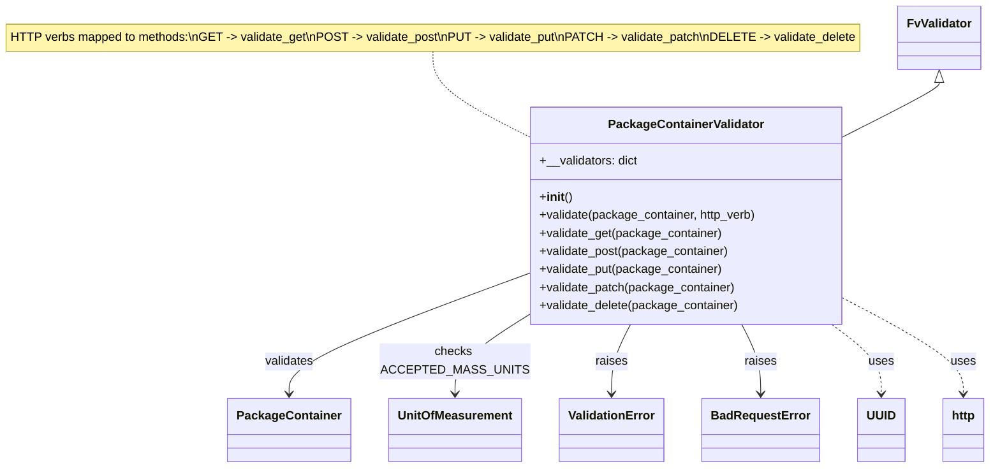

# Diagram: partview_core/partview_service/partview_service/api/package_container/handlers/validate/PackageContainerValidator.py

> Auto-generated by Obscura crawlers

## Mermaid

### SVG

<svg id="container" width="1302.984375" xmlns="http://www.w3.org/2000/svg" class="classDiagram" height="620" viewBox="0 0 1302.984375 620" role="graphics-document document" aria-roledescription="class"><g><defs><marker id="container_class-aggregationStart" class="marker aggregation class" refX="18" refY="7" markerWidth="190" markerHeight="240" orient="auto"><path d="M 18,7 L9,13 L1,7 L9,1 Z"></path></marker></defs><defs><marker id="container_class-aggregationEnd" class="marker aggregation class" refX="1" refY="7" markerWidth="20" markerHeight="28" orient="auto"><path d="M 18,7 L9,13 L1,7 L9,1 Z"></path></marker></defs><defs><marker id="container_class-extensionStart" class="marker extension class" refX="18" refY="7" markerWidth="190" markerHeight="240" orient="auto"><path d="M 1,7 L18,13 V 1 Z"></path></marker></defs><defs><marker id="container_class-extensionEnd" class="marker extension class" refX="1" refY="7" markerWidth="20" markerHeight="28" orient="auto"><path d="M 1,1 V 13 L18,7 Z"></path></marker></defs><defs><marker id="container_class-compositionStart" class="marker composition class" refX="18" refY="7" markerWidth="190" markerHeight="240" orient="auto"><path d="M 18,7 L9,13 L1,7 L9,1 Z"></path></marker></defs><defs><marker id="container_class-compositionEnd" class="marker composition class" refX="1" refY="7" markerWidth="20" markerHeight="28" orient="auto"><path d="M 18,7 L9,13 L1,7 L9,1 Z"></path></marker></defs><defs><marker id="container_class-dependencyStart" class="marker dependency class" refX="6" refY="7" markerWidth="190" markerHeight="240" orient="auto"><path d="M 5,7 L9,13 L1,7 L9,1 Z"></path></marker></defs><defs><marker id="container_class-dependencyEnd" class="marker dependency class" refX="13" refY="7" markerWidth="20" markerHeight="28" orient="auto"><path d="M 18,7 L9,13 L14,7 L9,1 Z"></path></marker></defs><defs><marker id="container_class-lollipopStart" class="marker lollipop class" refX="13" refY="7" markerWidth="190" markerHeight="240" orient="auto"><circle stroke="black" fill="transparent" cx="7" cy="7" r="6"></circle></marker></defs><defs><marker id="container_class-lollipopEnd" class="marker lollipop class" refX="1" refY="7" markerWidth="190" markerHeight="240" orient="auto"><circle stroke="black" fill="transparent" cx="7" cy="7" r="6"></circle></marker></defs><g class="root"><g class="clusters"></g><g class="edgePaths"><path d="M573.586,68L573.586,76.167C573.586,84.333,573.586,100.667,594.999,119.66C616.411,138.653,659.237,160.306,680.65,171.133L702.063,181.96" id="edgeNote1" class="edge-thickness-normal edge-pattern-dotted relation" style="fill: none;;;fill: none" data-edge="true" data-et="edge" data-id="edgeNote1" data-points="W3sieCI6NTczLjU4NTkzNzUsInkiOjY4fSx7IngiOjU3My41ODU5Mzc1LCJ5IjoxMTd9LHsieCI6NzAyLjA2MjUsInkiOjE4MS45NTk3MzkxNTE3NzU4fV0="></path><path d="M1242.078,109.25L1242.078,110.542C1242.078,111.833,1242.078,114.417,1220.665,126.535C1199.253,138.653,1156.427,160.306,1135.014,171.133L1113.602,181.96" id="id_FvValidator_PackageContainerValidator_1" class="edge-thickness-normal edge-pattern-solid relation" style=";;;" data-edge="true" data-et="edge" data-id="id_FvValidator_PackageContainerValidator_1" data-points="W3sieCI6MTI0Mi4wNzgxMjUsInkiOjkyfSx7IngiOjEyNDIuMDc4MTI1LCJ5IjoxMTd9LHsieCI6MTExMy42MDE1NjI1LCJ5IjoxODEuOTU5NzM5MTUxNzc1OH1d" marker-start="url(#container_class-extensionStart)"></path><path d="M702.063,363.759L651.237,382.966C600.411,402.173,498.76,440.586,447.935,466.96C397.109,493.333,397.109,507.667,397.109,514.833L397.109,522" id="id_PackageContainerValidator_PackageContainer_2" class="edge-thickness-normal edge-pattern-solid relation" style=";;;" data-edge="true" data-et="edge" data-id="id_PackageContainerValidator_PackageContainer_2" data-points="W3sieCI6NzAyLjA2MjUsInkiOjM2My43NTk0NjMwNzY5ODE5fSx7IngiOjM5Ny4xMDkzNzUsInkiOjQ3OX0seyJ4IjozOTcuMTA5Mzc1LCJ5Ijo1Mjh9XQ==" marker-end="url(#container_class-dependencyEnd)"></path><path d="M702.063,419.227L686.676,429.189C671.289,439.151,640.516,459.076,625.129,476.204C609.742,493.333,609.742,507.667,609.742,514.833L609.742,522" id="id_PackageContainerValidator_UnitOfMeasurement_3" class="edge-thickness-normal edge-pattern-solid relation" style=";;;" data-edge="true" data-et="edge" data-id="id_PackageContainerValidator_UnitOfMeasurement_3" data-points="W3sieCI6NzAyLjA2MjUsInkiOjQxOS4yMjY2Nzc2NzQyNTR9LHsieCI6NjA5Ljc0MjE4NzUsInkiOjQ3OX0seyJ4Ijo2MDkuNzQyMTg3NSwieSI6NTI4fV0=" marker-end="url(#container_class-dependencyEnd)"></path><path d="M836.406,430L832.355,438.167C828.305,446.333,820.203,462.667,816.152,478C812.102,493.333,812.102,507.667,812.102,514.833L812.102,522" id="id_PackageContainerValidator_ValidationError_4" class="edge-thickness-normal edge-pattern-solid relation" style=";;;" data-edge="true" data-et="edge" data-id="id_PackageContainerValidator_ValidationError_4" data-points="W3sieCI6ODM2LjQwNjE4OTI4MTA4ODEsInkiOjQzMH0seyJ4Ijo4MTIuMTAxNTYyNSwieSI6NDc5fSx7IngiOjgxMi4xMDE1NjI1LCJ5Ijo1Mjh9XQ==" marker-end="url(#container_class-dependencyEnd)"></path><path d="M979.258,430L983.309,438.167C987.359,446.333,995.461,462.667,999.512,478C1003.563,493.333,1003.563,507.667,1003.563,514.833L1003.563,522" id="id_PackageContainerValidator_BadRequestError_5" class="edge-thickness-normal edge-pattern-solid relation" style=";;;" data-edge="true" data-et="edge" data-id="id_PackageContainerValidator_BadRequestError_5" data-points="W3sieCI6OTc5LjI1Nzg3MzIxODkxMTksInkiOjQzMH0seyJ4IjoxMDAzLjU2MjUsInkiOjQ3OX0seyJ4IjoxMDAzLjU2MjUsInkiOjUyOH1d" marker-end="url(#container_class-dependencyEnd)"></path><path d="M1094.346,430L1104.924,438.167C1115.501,446.333,1136.657,462.667,1147.235,478C1157.813,493.333,1157.813,507.667,1157.813,514.833L1157.813,522" id="id_PackageContainerValidator_UUID_6" class="edge-thickness-normal edge-pattern-dashed relation" style=";;;" data-edge="true" data-et="edge" data-id="id_PackageContainerValidator_UUID_6" data-points="W3sieCI6MTA5NC4zNDU5NTYxMjA0NjYzLCJ5Ijo0MzB9LHsieCI6MTE1Ny44MTI1LCJ5Ijo0Nzl9LHsieCI6MTE1Ny44MTI1LCJ5Ijo1Mjh9XQ==" marker-end="url(#container_class-dependencyEnd)"></path><path d="M1113.602,397.081L1138.893,410.734C1164.185,424.387,1214.768,451.694,1240.06,472.513C1265.352,493.333,1265.352,507.667,1265.352,514.833L1265.352,522" id="id_PackageContainerValidator_http_7" class="edge-thickness-normal edge-pattern-dashed relation" style=";;;" data-edge="true" data-et="edge" data-id="id_PackageContainerValidator_http_7" data-points="W3sieCI6MTExMy42MDE1NjI1LCJ5IjozOTcuMDgwNjk5MjYyNDk2Nn0seyJ4IjoxMjY1LjM1MTU2MjUsInkiOjQ3OX0seyJ4IjoxMjY1LjM1MTU2MjUsInkiOjUyOH1d" marker-end="url(#container_class-dependencyEnd)"></path></g><g class="edgeLabels"><g class="edgeLabel"><g class="label" data-id="edgeNote1" transform="translate(0, 0)"><foreignObject width="0" height="0">

</foreignObject></g></g><g class="edgeLabel"><g class="label" data-id="id_FvValidator_PackageContainerValidator_1" transform="translate(0, 0)"><foreignObject width="0" height="0">

</foreignObject></g></g><g class="edgeLabel" transform="translate(397.109375, 479)"><g class="label" data-id="id_PackageContainerValidator_PackageContainer_2" transform="translate(-32.6875, -12)"><foreignObject width="65.375" height="24">

validates

</foreignObject></g></g><g class="edgeLabel" transform="translate(609.7421875, 479)"><g class="label" data-id="id_PackageContainerValidator_UnitOfMeasurement_3" transform="translate(-100, -24)"><foreignObject width="200" height="48">

checks ACCEPTED_MASS_UNITS

</foreignObject></g></g><g class="edgeLabel" transform="translate(812.1015625, 479)"><g class="label" data-id="id_PackageContainerValidator_ValidationError_4" transform="translate(-21.25, -12)"><foreignObject width="42.5" height="24">

raises

</foreignObject></g></g><g class="edgeLabel" transform="translate(1003.5625, 479)"><g class="label" data-id="id_PackageContainerValidator_BadRequestError_5" transform="translate(-21.25, -12)"><foreignObject width="42.5" height="24">

raises

</foreignObject></g></g><g class="edgeLabel" transform="translate(1157.8125, 479)"><g class="label" data-id="id_PackageContainerValidator_UUID_6" transform="translate(-16.4921875, -12)"><foreignObject width="32.984375" height="24">

uses

</foreignObject></g></g><g class="edgeLabel" transform="translate(1265.3515625, 479)"><g class="label" data-id="id_PackageContainerValidator_http_7" transform="translate(-16.4921875, -12)"><foreignObject width="32.984375" height="24">

uses

</foreignObject></g></g></g><g class="nodes"><g class="node default" id="classId-FvValidator-0" transform="translate(1242.078125, 50)"><g class="basic label-container"><path d="M-52.90625 -42 L52.90625 -42 L52.90625 42 L-52.90625 42" stroke="none" stroke-width="0" fill="#ECECFF" style=""></path><path d="M-52.90625 -42 C-22.12626843344397 -42, 8.653713133112063 -42, 52.90625 -42 M-52.90625 -42 C-15.338963192510398 -42, 22.228323614979203 -42, 52.90625 -42 M52.90625 -42 C52.90625 -15.810209241672958, 52.90625 10.379581516654085, 52.90625 42 M52.90625 -42 C52.90625 -19.730338153220604, 52.90625 2.539323693558792, 52.90625 42 M52.90625 42 C28.522533460104324 42, 4.138816920208647 42, -52.90625 42 M52.90625 42 C10.859236660947317 42, -31.187776678105365 42, -52.90625 42 M-52.90625 42 C-52.90625 16.88220331525236, -52.90625 -8.235593369495277, -52.90625 -42 M-52.90625 42 C-52.90625 16.535571760333507, -52.90625 -8.928856479332985, -52.90625 -42" stroke="#9370DB" stroke-width="1.3" fill="none" stroke-dasharray="0 0" style=""></path></g><g class="annotation-group text" transform="translate(0, -18)"></g><g class="label-group text" transform="translate(-40.90625, -18)"><g class="label" style="font-weight: bolder" transform="translate(0,-12)"><foreignObject width="81.8125" height="24">

FvValidator

</foreignObject></g></g><g class="members-group text" transform="translate(-40.90625, 30)"></g><g class="methods-group text" transform="translate(-40.90625, 60)"></g><g class="divider" style=""><path d="M-52.90625 6 C-23.213361035725285 6, 6.47952792854943 6, 52.90625 6 M-52.90625 6 C-21.07317685029084 6, 10.759896299418322 6, 52.90625 6" stroke="#9370DB" stroke-width="1.3" fill="none" stroke-dasharray="0 0" style=""></path></g><g class="divider" style=""><path d="M-52.90625 24 C-19.534402715842596 24, 13.837444568314808 24, 52.90625 24 M-52.90625 24 C-29.010358494169097 24, -5.114466988338194 24, 52.90625 24" stroke="#9370DB" stroke-width="1.3" fill="none" stroke-dasharray="0 0" style=""></path></g></g><g class="node default" id="classId-PackageContainer-1" transform="translate(397.109375, 570)"><g class="basic label-container"><path d="M-77.453125 -42 L77.453125 -42 L77.453125 42 L-77.453125 42" stroke="none" stroke-width="0" fill="#ECECFF" style=""></path><path d="M-77.453125 -42 C-35.9196449468206 -42, 5.613835106358806 -42, 77.453125 -42 M-77.453125 -42 C-31.69290911127272 -42, 14.067306777454561 -42, 77.453125 -42 M77.453125 -42 C77.453125 -8.504166283502002, 77.453125 24.991667432995996, 77.453125 42 M77.453125 -42 C77.453125 -16.811812688201996, 77.453125 8.376374623596007, 77.453125 42 M77.453125 42 C44.109218437631284 42, 10.765311875262569 42, -77.453125 42 M77.453125 42 C30.695040192259718 42, -16.063044615480564 42, -77.453125 42 M-77.453125 42 C-77.453125 10.887967360637518, -77.453125 -20.224065278724964, -77.453125 -42 M-77.453125 42 C-77.453125 23.61760146444334, -77.453125 5.235202928886679, -77.453125 -42" stroke="#9370DB" stroke-width="1.3" fill="none" stroke-dasharray="0 0" style=""></path></g><g class="annotation-group text" transform="translate(0, -18)"></g><g class="label-group text" transform="translate(-65.453125, -18)"><g class="label" style="font-weight: bolder" transform="translate(0,-12)"><foreignObject width="130.90625" height="24">

PackageContainer

</foreignObject></g></g><g class="members-group text" transform="translate(-65.453125, 30)"></g><g class="methods-group text" transform="translate(-65.453125, 60)"></g><g class="divider" style=""><path d="M-77.453125 6 C-22.63016264016175 6, 32.1927997196765 6, 77.453125 6 M-77.453125 6 C-25.92559878467562 6, 25.601927430648757 6, 77.453125 6" stroke="#9370DB" stroke-width="1.3" fill="none" stroke-dasharray="0 0" style=""></path></g><g class="divider" style=""><path d="M-77.453125 24 C-40.856490943005625 24, -4.259856886011249 24, 77.453125 24 M-77.453125 24 C-37.29871184675781 24, 2.8557013064843773 24, 77.453125 24" stroke="#9370DB" stroke-width="1.3" fill="none" stroke-dasharray="0 0" style=""></path></g></g><g class="node default" id="classId-UnitOfMeasurement-2" transform="translate(609.7421875, 570)"><g class="basic label-container"><path d="M-85.1796875 -42 L85.1796875 -42 L85.1796875 42 L-85.1796875 42" stroke="none" stroke-width="0" fill="#ECECFF" style=""></path><path d="M-85.1796875 -42 C-19.246219552104264 -42, 46.68724839579147 -42, 85.1796875 -42 M-85.1796875 -42 C-22.89385086938301 -42, 39.39198576123398 -42, 85.1796875 -42 M85.1796875 -42 C85.1796875 -19.69912006801931, 85.1796875 2.6017598639613766, 85.1796875 42 M85.1796875 -42 C85.1796875 -9.825159040431522, 85.1796875 22.349681919136955, 85.1796875 42 M85.1796875 42 C21.70345292066915 42, -41.7727816586617 42, -85.1796875 42 M85.1796875 42 C24.135328869828456 42, -36.90902976034309 42, -85.1796875 42 M-85.1796875 42 C-85.1796875 17.956657465344975, -85.1796875 -6.08668506931005, -85.1796875 -42 M-85.1796875 42 C-85.1796875 15.547750122595282, -85.1796875 -10.904499754809436, -85.1796875 -42" stroke="#9370DB" stroke-width="1.3" fill="none" stroke-dasharray="0 0" style=""></path></g><g class="annotation-group text" transform="translate(0, -18)"></g><g class="label-group text" transform="translate(-73.1796875, -18)"><g class="label" style="font-weight: bolder" transform="translate(0,-12)"><foreignObject width="146.359375" height="24">

UnitOfMeasurement

</foreignObject></g></g><g class="members-group text" transform="translate(-73.1796875, 30)"></g><g class="methods-group text" transform="translate(-73.1796875, 60)"></g><g class="divider" style=""><path d="M-85.1796875 6 C-33.727223989893645 6, 17.72523952021271 6, 85.1796875 6 M-85.1796875 6 C-21.532300612083766 6, 42.11508627583247 6, 85.1796875 6" stroke="#9370DB" stroke-width="1.3" fill="none" stroke-dasharray="0 0" style=""></path></g><g class="divider" style=""><path d="M-85.1796875 24 C-18.296048129037203 24, 48.587591241925594 24, 85.1796875 24 M-85.1796875 24 C-42.77594491638466 24, -0.37220233276931936 24, 85.1796875 24" stroke="#9370DB" stroke-width="1.3" fill="none" stroke-dasharray="0 0" style=""></path></g></g><g class="node default" id="classId-ValidationError-3" transform="translate(812.1015625, 570)"><g class="basic label-container"><path d="M-67.1796875 -42 L67.1796875 -42 L67.1796875 42 L-67.1796875 42" stroke="none" stroke-width="0" fill="#ECECFF" style=""></path><path d="M-67.1796875 -42 C-38.9669683090902 -42, -10.754249118180397 -42, 67.1796875 -42 M-67.1796875 -42 C-39.04617041960729 -42, -10.912653339214593 -42, 67.1796875 -42 M67.1796875 -42 C67.1796875 -12.530490655285995, 67.1796875 16.93901868942801, 67.1796875 42 M67.1796875 -42 C67.1796875 -9.191879467897827, 67.1796875 23.616241064204345, 67.1796875 42 M67.1796875 42 C35.17448471792695 42, 3.1692819358539026 42, -67.1796875 42 M67.1796875 42 C26.23944091072 42, -14.700805678560002 42, -67.1796875 42 M-67.1796875 42 C-67.1796875 21.419685637128246, -67.1796875 0.8393712742564929, -67.1796875 -42 M-67.1796875 42 C-67.1796875 21.761354391840094, -67.1796875 1.5227087836801871, -67.1796875 -42" stroke="#9370DB" stroke-width="1.3" fill="none" stroke-dasharray="0 0" style=""></path></g><g class="annotation-group text" transform="translate(0, -18)"></g><g class="label-group text" transform="translate(-55.1796875, -18)"><g class="label" style="font-weight: bolder" transform="translate(0,-12)"><foreignObject width="110.359375" height="24">

ValidationError

</foreignObject></g></g><g class="members-group text" transform="translate(-55.1796875, 30)"></g><g class="methods-group text" transform="translate(-55.1796875, 60)"></g><g class="divider" style=""><path d="M-67.1796875 6 C-14.631622273074775 6, 37.91644295385045 6, 67.1796875 6 M-67.1796875 6 C-31.230233117745605 6, 4.719221264508789 6, 67.1796875 6" stroke="#9370DB" stroke-width="1.3" fill="none" stroke-dasharray="0 0" style=""></path></g><g class="divider" style=""><path d="M-67.1796875 24 C-38.6598153172708 24, -10.13994313454159 24, 67.1796875 24 M-67.1796875 24 C-17.34079315876121 24, 32.49810118247758 24, 67.1796875 24" stroke="#9370DB" stroke-width="1.3" fill="none" stroke-dasharray="0 0" style=""></path></g></g><g class="node default" id="classId-BadRequestError-4" transform="translate(1003.5625, 570)"><g class="basic label-container"><path d="M-74.28125 -42 L74.28125 -42 L74.28125 42 L-74.28125 42" stroke="none" stroke-width="0" fill="#ECECFF" style=""></path><path d="M-74.28125 -42 C-30.787185681184994 -42, 12.706878637630012 -42, 74.28125 -42 M-74.28125 -42 C-43.68927960067166 -42, -13.097309201343322 -42, 74.28125 -42 M74.28125 -42 C74.28125 -19.255786701103375, 74.28125 3.48842659779325, 74.28125 42 M74.28125 -42 C74.28125 -22.90516029685381, 74.28125 -3.8103205937076225, 74.28125 42 M74.28125 42 C20.115178848513672 42, -34.050892302972656 42, -74.28125 42 M74.28125 42 C22.260538530692116 42, -29.760172938615767 42, -74.28125 42 M-74.28125 42 C-74.28125 19.825547002136325, -74.28125 -2.3489059957273497, -74.28125 -42 M-74.28125 42 C-74.28125 18.322765916947866, -74.28125 -5.354468166104269, -74.28125 -42" stroke="#9370DB" stroke-width="1.3" fill="none" stroke-dasharray="0 0" style=""></path></g><g class="annotation-group text" transform="translate(0, -18)"></g><g class="label-group text" transform="translate(-62.28125, -18)"><g class="label" style="font-weight: bolder" transform="translate(0,-12)"><foreignObject width="124.5625" height="24">

BadRequestError

</foreignObject></g></g><g class="members-group text" transform="translate(-62.28125, 30)"></g><g class="methods-group text" transform="translate(-62.28125, 60)"></g><g class="divider" style=""><path d="M-74.28125 6 C-44.01305102224672 6, -13.744852044493442 6, 74.28125 6 M-74.28125 6 C-27.911748184631577 6, 18.457753630736846 6, 74.28125 6" stroke="#9370DB" stroke-width="1.3" fill="none" stroke-dasharray="0 0" style=""></path></g><g class="divider" style=""><path d="M-74.28125 24 C-25.80804207846721 24, 22.66516584306558 24, 74.28125 24 M-74.28125 24 C-34.854547073458995 24, 4.572155853082009 24, 74.28125 24" stroke="#9370DB" stroke-width="1.3" fill="none" stroke-dasharray="0 0" style=""></path></g></g><g class="node default" id="classId-PackageContainerValidator-5" transform="translate(907.83203125, 286)"><g class="basic label-container"><path d="M-205.76953125 -144 L205.76953125 -144 L205.76953125 144 L-205.76953125 144" stroke="none" stroke-width="0" fill="#ECECFF" style=""></path><path d="M-205.76953125 -144 C-101.84538048709933 -144, 2.0787702758013324 -144, 205.76953125 -144 M-205.76953125 -144 C-51.55808014266688 -144, 102.65337096466624 -144, 205.76953125 -144 M205.76953125 -144 C205.76953125 -84.00828370172376, 205.76953125 -24.01656740344751, 205.76953125 144 M205.76953125 -144 C205.76953125 -48.83528815406973, 205.76953125 46.32942369186054, 205.76953125 144 M205.76953125 144 C106.09737554532062 144, 6.425219840641233 144, -205.76953125 144 M205.76953125 144 C92.31633247536739 144, -21.136866299265222 144, -205.76953125 144 M-205.76953125 144 C-205.76953125 83.69318010351573, -205.76953125 23.38636020703146, -205.76953125 -144 M-205.76953125 144 C-205.76953125 61.469424014709276, -205.76953125 -21.06115197058145, -205.76953125 -144" stroke="#9370DB" stroke-width="1.3" fill="none" stroke-dasharray="0 0" style=""></path></g><g class="annotation-group text" transform="translate(0, -120)"></g><g class="label-group text" transform="translate(-98.6328125, -120)"><g class="label" style="font-weight: bolder" transform="translate(0,-12)"><foreignObject width="197.265625" height="24">

PackageContainerValidator

</foreignObject></g></g><g class="members-group text" transform="translate(-193.76953125, -72)"><g class="label" style="" transform="translate(0,-12)"><foreignObject width="130.21875" height="24">

+__validators: dict

</foreignObject></g></g><g class="methods-group text" transform="translate(-193.76953125, -24)"><g class="label" style="" transform="translate(0,-12)"><foreignObject width="42.796875" height="24">

+<strong>init</strong>()

</foreignObject></g><g class="label" style="" transform="translate(0,12)"><foreignObject width="288.90625" height="24">

+validate(package_container, http_verb)

</foreignObject></g><g class="label" style="" transform="translate(0,36)"><foreignObject width="242.640625" height="24">

+validate_get(package_container)

</foreignObject></g><g class="label" style="" transform="translate(0,60)"><foreignObject width="252.046875" height="24">

+validate_post(package_container)

</foreignObject></g><g class="label" style="" transform="translate(0,84)"><foreignObject width="244.53125" height="24">

+validate_put(package_container)

</foreignObject></g><g class="label" style="" transform="translate(0,108)"><foreignObject width="260.546875" height="24">

+validate_patch(package_container)

</foreignObject></g><g class="label" style="" transform="translate(0,132)"><foreignObject width="265.5" height="24">

+validate_delete(package_container)

</foreignObject></g></g><g class="divider" style=""><path d="M-205.76953125 -96 C-77.97683027015584 -96, 49.81587070968831 -96, 205.76953125 -96 M-205.76953125 -96 C-117.61324783508381 -96, -29.456964420167623 -96, 205.76953125 -96" stroke="#9370DB" stroke-width="1.3" fill="none" stroke-dasharray="0 0" style=""></path></g><g class="divider" style=""><path d="M-205.76953125 -48 C-108.02478625948422 -48, -10.280041268968432 -48, 205.76953125 -48 M-205.76953125 -48 C-63.413498505328505 -48, 78.94253423934299 -48, 205.76953125 -48" stroke="#9370DB" stroke-width="1.3" fill="none" stroke-dasharray="0 0" style=""></path></g></g><g class="node default" id="classId-UUID-6" transform="translate(1157.8125, 570)"><g class="basic label-container"><path d="M-29.96875 -42 L29.96875 -42 L29.96875 42 L-29.96875 42" stroke="none" stroke-width="0" fill="#ECECFF" style=""></path><path d="M-29.96875 -42 C-6.13244771832699 -42, 17.70385456334602 -42, 29.96875 -42 M-29.96875 -42 C-11.377233255206075 -42, 7.214283489587849 -42, 29.96875 -42 M29.96875 -42 C29.96875 -13.172963673109614, 29.96875 15.654072653780773, 29.96875 42 M29.96875 -42 C29.96875 -15.110346368673806, 29.96875 11.779307262652388, 29.96875 42 M29.96875 42 C15.240240098504746 42, 0.5117301970094914 42, -29.96875 42 M29.96875 42 C10.561827408112094 42, -8.845095183775811 42, -29.96875 42 M-29.96875 42 C-29.96875 14.160469501902636, -29.96875 -13.679060996194728, -29.96875 -42 M-29.96875 42 C-29.96875 12.397915533515253, -29.96875 -17.204168932969495, -29.96875 -42" stroke="#9370DB" stroke-width="1.3" fill="none" stroke-dasharray="0 0" style=""></path></g><g class="annotation-group text" transform="translate(0, -18)"></g><g class="label-group text" transform="translate(-17.96875, -18)"><g class="label" style="font-weight: bolder" transform="translate(0,-12)"><foreignObject width="35.9375" height="24">

UUID

</foreignObject></g></g><g class="members-group text" transform="translate(-17.96875, 30)"></g><g class="methods-group text" transform="translate(-17.96875, 60)"></g><g class="divider" style=""><path d="M-29.96875 6 C-16.272339125636954 6, -2.575928251273904 6, 29.96875 6 M-29.96875 6 C-8.5270669926687 6, 12.914616014662599 6, 29.96875 6" stroke="#9370DB" stroke-width="1.3" fill="none" stroke-dasharray="0 0" style=""></path></g><g class="divider" style=""><path d="M-29.96875 24 C-7.053233736135532 24, 15.862282527728937 24, 29.96875 24 M-29.96875 24 C-11.236874229103865 24, 7.49500154179227 24, 29.96875 24" stroke="#9370DB" stroke-width="1.3" fill="none" stroke-dasharray="0 0" style=""></path></g></g><g class="node default" id="classId-http-7" transform="translate(1265.3515625, 570)"><g class="basic label-container"><path d="M-27.5703125 -42 L27.5703125 -42 L27.5703125 42 L-27.5703125 42" stroke="none" stroke-width="0" fill="#ECECFF" style=""></path><path d="M-27.5703125 -42 C-8.471413097692501 -42, 10.627486304614997 -42, 27.5703125 -42 M-27.5703125 -42 C-15.53605074943201 -42, -3.5017889988640185 -42, 27.5703125 -42 M27.5703125 -42 C27.5703125 -13.13721406948374, 27.5703125 15.72557186103252, 27.5703125 42 M27.5703125 -42 C27.5703125 -21.66942664553792, 27.5703125 -1.3388532910758428, 27.5703125 42 M27.5703125 42 C11.96932139127287 42, -3.6316697174542583 42, -27.5703125 42 M27.5703125 42 C13.117412980256894 42, -1.3354865394862117 42, -27.5703125 42 M-27.5703125 42 C-27.5703125 17.401390236407565, -27.5703125 -7.1972195271848705, -27.5703125 -42 M-27.5703125 42 C-27.5703125 16.361343150735824, -27.5703125 -9.277313698528353, -27.5703125 -42" stroke="#9370DB" stroke-width="1.3" fill="none" stroke-dasharray="0 0" style=""></path></g><g class="annotation-group text" transform="translate(0, -18)"></g><g class="label-group text" transform="translate(-15.5703125, -18)"><g class="label" style="font-weight: bolder" transform="translate(0,-12)"><foreignObject width="31.140625" height="24">

http

</foreignObject></g></g><g class="members-group text" transform="translate(-15.5703125, 30)"></g><g class="methods-group text" transform="translate(-15.5703125, 60)"></g><g class="divider" style=""><path d="M-27.5703125 6 C-16.144979456556285 6, -4.719646413112574 6, 27.5703125 6 M-27.5703125 6 C-8.867116526714184 6, 9.836079446571631 6, 27.5703125 6" stroke="#9370DB" stroke-width="1.3" fill="none" stroke-dasharray="0 0" style=""></path></g><g class="divider" style=""><path d="M-27.5703125 24 C-9.790678944113427 24, 7.988954611773146 24, 27.5703125 24 M-27.5703125 24 C-14.579222853439052 24, -1.5881332068781049 24, 27.5703125 24" stroke="#9370DB" stroke-width="1.3" fill="none" stroke-dasharray="0 0" style=""></path></g></g><g class="node undefined" id="note0" transform="translate(573.5859375, 50)"><g class="basic label-container"><path d="M-565.5859375 -18 L565.5859375 -18 L565.5859375 18 L-565.5859375 18" stroke="none" stroke-width="0" fill="#fff5ad" style="fill:#fff5ad !important;stroke:#aaaa33 !important"></path><path d="M-565.5859375 -18 C-320.03130456060273 -18, -74.47667162120553 -18, 565.5859375 -18 M-565.5859375 -18 C-170.52566550628399 -18, 224.53460648743203 -18, 565.5859375 -18 M565.5859375 -18 C565.5859375 -8.85677781967118, 565.5859375 0.2864443606576401, 565.5859375 18 M565.5859375 -18 C565.5859375 -4.173590161992271, 565.5859375 9.652819676015458, 565.5859375 18 M565.5859375 18 C139.49363290190098 18, -286.59867169619804 18, -565.5859375 18 M565.5859375 18 C120.46515581073294 18, -324.6556258785341 18, -565.5859375 18 M-565.5859375 18 C-565.5859375 8.736965930833524, -565.5859375 -0.5260681383329526, -565.5859375 -18 M-565.5859375 18 C-565.5859375 3.717856745989847, -565.5859375 -10.564286508020306, -565.5859375 -18" stroke="#aaaa33" stroke-width="1.3" fill="none" stroke-dasharray="0 0" style="fill:#fff5ad !important;stroke:#aaaa33 !important"></path></g><g class="label" style="text-align:left !important;white-space:nowrap !important" transform="translate(-559.5859375, -12)"><rect></rect><foreignObject width="1119.171875" height="24">

HTTP verbs mapped to methods:\nGET -&gt; validate_get\nPOST -&gt; validate_post\nPUT -&gt; validate_put\nPATCH -&gt; validate_patch\nDELETE -&gt; validate_delete

</foreignObject></g></g></g></g></g></svg>
