# Diagram: partview_core/partview_service/partview_service/api/package_container/helpers/PackageContainerArchiveHelper.py


> Auto-generated by Obscura crawlers

## Diagram 1

```mermaid
classDiagram
    class PackageContainerArchiveHelper {
        <<static>>
        +insert_into_container_orchestrator(containers) : List<ContainerArchiveOrchestrator>
        +update_container_orchestrator_with_delta(containers, timedelta) : ContainerArchiveOrchestrator
        +set_container_status_based_on_archive_dates(package_container, active_until, soft_archive_until)
        +upsert_container_orchestrator_with_new_active_until_ts(container, active_until, soft_archive_until, reason, event_type=None) : ContainerArchiveOrchestrator
    }
    class ContainerArchiveOrchestratorPostgresqlMapping {
        +write_batch(records)
        +write(record)
        +update(record)
        +search(record) : List<ContainerArchiveOrchestrator>
        +get_record_by_container_id(container_id) : ContainerArchiveOrchestrator
    }
    class ContainerArchiveOrchestrator {
        +id
        +container_id
        +active_until : datetime
        +soft_archived_until : datetime
        +status
        +reason
        +is_valid() : bool
    }
    class PackageContainer {
        +id
        +lifecycle_state
        +status
        +effective_destination_eta
        +STATE_ACTIVE
        +STATE_ARCHIVED
    }
    class Datetime {
        +Datetime(value)
        +get_datetime() : datetime
    }
    class NormalizeTime {
        +is_naive(dt) : bool
        +make_aware(dt) : datetime
    }
    class ArchiveDays {
        <<enum>>
        +HARD_ARCHIVE_DAYS
        +DELIVERED_SOFT_ARCHIVE_DAYS
        +NO_EVENT_SOFT_ARCHIVE_DAYS
    }
    class ArchiveReasons {
        <<enum>>
        +DELIVERED
        +NO_ACTIVITY_NO_ACTIVE_EXCEPTION
    }
    class PackageContainerStatus {
        <<enum>>
        +DELIVERED_STATE
        +DELAYED_STATE
        +ACTIVE
    }
    class EventType {
        <<enum>>
        +SHIPMENT
    }

    PackageContainerArchiveHelper --> ContainerArchiveOrchestratorPostgresqlMapping : uses
    PackageContainerArchiveHelper --> ContainerArchiveOrchestrator : creates/updates
    PackageContainerArchiveHelper --> PackageContainer : reads/updates
    PackageContainerArchiveHelper --> Datetime : uses
    PackageContainerArchiveHelper --> NormalizeTime : uses
    PackageContainerArchiveHelper --> ArchiveDays : reads
    PackageContainerArchiveHelper --> ArchiveReasons : reads
    PackageContainerArchiveHelper --> PackageContainerStatus : reads/writes
    PackageContainerArchiveHelper --> EventType : checks
```



### SVG

<svg id="container" width="3399.234375" xmlns="http://www.w3.org/2000/svg" class="classDiagram" height="576" viewBox="0 0 3399.234375 576" role="graphics-document document" aria-roledescription="class"><style>#container{font-family:"trebuchet ms",verdana,arial,sans-serif;font-size:16px;fill:#333;}@keyframes edge-animation-frame{from{stroke-dashoffset:0;}}@keyframes dash{to{stroke-dashoffset:0;}}#container .edge-animation-slow{stroke-dasharray:9,5!important;stroke-dashoffset:900;animation:dash 50s linear infinite;stroke-linecap:round;}#container .edge-animation-fast{stroke-dasharray:9,5!important;stroke-dashoffset:900;animation:dash 20s linear infinite;stroke-linecap:round;}#container .error-icon{fill:#552222;}#container .error-text{fill:#552222;stroke:#552222;}#container .edge-thickness-normal{stroke-width:1px;}#container .edge-thickness-thick{stroke-width:3.5px;}#container .edge-pattern-solid{stroke-dasharray:0;}#container .edge-thickness-invisible{stroke-width:0;fill:none;}#container .edge-pattern-dashed{stroke-dasharray:3;}#container .edge-pattern-dotted{stroke-dasharray:2;}#container .marker{fill:#333333;stroke:#333333;}#container .marker.cross{stroke:#333333;}#container svg{font-family:"trebuchet ms",verdana,arial,sans-serif;font-size:16px;}#container p{margin:0;}#container g.classGroup text{fill:#9370DB;stroke:none;font-family:"trebuchet ms",verdana,arial,sans-serif;font-size:10px;}#container g.classGroup text .title{font-weight:bolder;}#container .nodeLabel,#container .edgeLabel{color:#131300;}#container .edgeLabel .label rect{fill:#ECECFF;}#container .label text{fill:#131300;}#container .labelBkg{background:#ECECFF;}#container .edgeLabel .label span{background:#ECECFF;}#container .classTitle{font-weight:bolder;}#container .node rect,#container .node circle,#container .node ellipse,#container .node polygon,#container .node path{fill:#ECECFF;stroke:#9370DB;stroke-width:1px;}#container .divider{stroke:#9370DB;stroke-width:1;}#container g.clickable{cursor:pointer;}#container g.classGroup rect{fill:#ECECFF;stroke:#9370DB;}#container g.classGroup line{stroke:#9370DB;stroke-width:1;}#container .classLabel .box{stroke:none;stroke-width:0;fill:#ECECFF;opacity:0.5;}#container .classLabel .label{fill:#9370DB;font-size:10px;}#container .relation{stroke:#333333;stroke-width:1;fill:none;}#container .dashed-line{stroke-dasharray:3;}#container .dotted-line{stroke-dasharray:1 2;}#container #compositionStart,#container .composition{fill:#333333!important;stroke:#333333!important;stroke-width:1;}#container #compositionEnd,#container .composition{fill:#333333!important;stroke:#333333!important;stroke-width:1;}#container #dependencyStart,#container .dependency{fill:#333333!important;stroke:#333333!important;stroke-width:1;}#container #dependencyStart,#container .dependency{fill:#333333!important;stroke:#333333!important;stroke-width:1;}#container #extensionStart,#container .extension{fill:transparent!important;stroke:#333333!important;stroke-width:1;}#container #extensionEnd,#container .extension{fill:transparent!important;stroke:#333333!important;stroke-width:1;}#container #aggregationStart,#container .aggregation{fill:transparent!important;stroke:#333333!important;stroke-width:1;}#container #aggregationEnd,#container .aggregation{fill:transparent!important;stroke:#333333!important;stroke-width:1;}#container #lollipopStart,#container .lollipop{fill:#ECECFF!important;stroke:#333333!important;stroke-width:1;}#container #lollipopEnd,#container .lollipop{fill:#ECECFF!important;stroke:#333333!important;stroke-width:1;}#container .edgeTerminals{font-size:11px;line-height:initial;}#container .classTitleText{text-anchor:middle;font-size:18px;fill:#333;}#container .label-icon{display:inline-block;height:1em;overflow:visible;vertical-align:-0.125em;}#container .node .label-icon path{fill:currentColor;stroke:revert;stroke-width:revert;}#container :root{--mermaid-font-family:"trebuchet ms",verdana,arial,sans-serif;}</style><g><defs><marker id="container_class-aggregationStart" class="marker aggregation class" refX="18" refY="7" markerWidth="190" markerHeight="240" orient="auto"><path d="M 18,7 L9,13 L1,7 L9,1 Z"></path></marker></defs><defs><marker id="container_class-aggregationEnd" class="marker aggregation class" refX="1" refY="7" markerWidth="20" markerHeight="28" orient="auto"><path d="M 18,7 L9,13 L1,7 L9,1 Z"></path></marker></defs><defs><marker id="container_class-extensionStart" class="marker extension class" refX="18" refY="7" markerWidth="190" markerHeight="240" orient="auto"><path d="M 1,7 L18,13 V 1 Z"></path></marker></defs><defs><marker id="container_class-extensionEnd" class="marker extension class" refX="1" refY="7" markerWidth="20" markerHeight="28" orient="auto"><path d="M 1,1 V 13 L18,7 Z"></path></marker></defs><defs><marker id="container_class-compositionStart" class="marker composition class" refX="18" refY="7" markerWidth="190" markerHeight="240" orient="auto"><path d="M 18,7 L9,13 L1,7 L9,1 Z"></path></marker></defs><defs><marker id="container_class-compositionEnd" class="marker composition class" refX="1" refY="7" markerWidth="20" markerHeight="28" orient="auto"><path d="M 18,7 L9,13 L1,7 L9,1 Z"></path></marker></defs><defs><marker id="container_class-dependencyStart" class="marker dependency class" refX="6" refY="7" markerWidth="190" markerHeight="240" orient="auto"><path d="M 5,7 L9,13 L1,7 L9,1 Z"></path></marker></defs><defs><marker id="container_class-dependencyEnd" class="marker dependency class" refX="13" refY="7" markerWidth="20" markerHeight="28" orient="auto"><path d="M 18,7 L9,13 L14,7 L9,1 Z"></path></marker></defs><defs><marker id="container_class-lollipopStart" class="marker lollipop class" refX="13" refY="7" markerWidth="190" markerHeight="240" orient="auto"><circle stroke="black" fill="transparent" cx="7" cy="7" r="6"></circle></marker></defs><defs><marker id="container_class-lollipopEnd" class="marker lollipop class" refX="1" refY="7" markerWidth="190" markerHeight="240" orient="auto"><circle stroke="black" fill="transparent" cx="7" cy="7" r="6"></circle></marker></defs><g class="root"><g class="clusters"></g><g class="edgePaths"><path d="M1349.844,178.284L1188.508,193.07C1027.172,207.856,704.5,237.428,543.164,260.881C381.828,284.333,381.828,301.667,381.828,310.333L381.828,319" id="id_PackageContainerArchiveHelper_ContainerArchiveOrchestratorPostgresqlMapping_1" class="edge-thickness-normal edge-pattern-solid relation" style=";;;" data-edge="true" data-et="edge" data-id="id_PackageContainerArchiveHelper_ContainerArchiveOrchestratorPostgresqlMapping_1" data-points="W3sieCI6MTM0OS44NDM3NSwieSI6MTc4LjI4NDQxNTM0MjUyNjczfSx7IngiOjM4MS44MjgxMjUsInkiOjI2N30seyJ4IjozODEuODI4MTI1LCJ5IjozMjV9XQ==" marker-end="url(#container_class-dependencyEnd)"></path><path d="M1349.844,213.601L1288.988,222.501C1228.132,231.401,1106.419,249.2,1045.563,263.267C984.707,277.333,984.707,287.667,984.707,292.833L984.707,298" id="id_PackageContainerArchiveHelper_ContainerArchiveOrchestrator_2" class="edge-thickness-normal edge-pattern-solid relation" style=";;;" data-edge="true" data-et="edge" data-id="id_PackageContainerArchiveHelper_ContainerArchiveOrchestrator_2" data-points="W3sieCI6MTM0OS44NDM3NSwieSI6MjEzLjYwMTM4MzM3Nzg1MDV9LHsieCI6OTg0LjcwNzAzMTI1LCJ5IjoyNjd9LHsieCI6OTg0LjcwNzAzMTI1LCJ5IjozMDR9XQ==" marker-end="url(#container_class-dependencyEnd)"></path><path d="M1515.179,230L1488.426,236.167C1461.674,242.333,1408.169,254.667,1381.417,268C1354.664,281.333,1354.664,295.667,1354.664,302.833L1354.664,310" id="id_PackageContainerArchiveHelper_PackageContainer_3" class="edge-thickness-normal edge-pattern-solid relation" style=";;;" data-edge="true" data-et="edge" data-id="id_PackageContainerArchiveHelper_PackageContainer_3" data-points="W3sieCI6MTUxNS4xNzg3MTA5Mzc1LCJ5IjoyMzB9LHsieCI6MTM1NC42NjQwNjI1LCJ5IjoyNjd9LHsieCI6MTM1NC42NjQwNjI1LCJ5IjozMTZ9XQ==" marker-end="url(#container_class-dependencyEnd)"></path><path d="M1754.813,230L1741.373,236.167C1727.934,242.333,1701.055,254.667,1687.615,275.5C1674.176,296.333,1674.176,325.667,1674.176,340.333L1674.176,355" id="id_PackageContainerArchiveHelper_Datetime_4" class="edge-thickness-normal edge-pattern-solid relation" style=";;;" data-edge="true" data-et="edge" data-id="id_PackageContainerArchiveHelper_Datetime_4" data-points="W3sieCI6MTc1NC44MTI1LCJ5IjoyMzB9LHsieCI6MTY3NC4xNzU3ODEyNSwieSI6MjY3fSx7IngiOjE2NzQuMTc1NzgxMjUsInkiOjM2MX1d" marker-end="url(#container_class-dependencyEnd)"></path><path d="M1996.723,230L1996.723,236.167C1996.723,242.333,1996.723,254.667,1996.723,275.5C1996.723,296.333,1996.723,325.667,1996.723,340.333L1996.723,355" id="id_PackageContainerArchiveHelper_NormalizeTime_5" class="edge-thickness-normal edge-pattern-solid relation" style=";;;" data-edge="true" data-et="edge" data-id="id_PackageContainerArchiveHelper_NormalizeTime_5" data-points="W3sieCI6MTk5Ni43MjI2NTYyNSwieSI6MjMwfSx7IngiOjE5OTYuNzIyNjU2MjUsInkiOjI2N30seyJ4IjoxOTk2LjcyMjY1NjI1LCJ5IjozNjF9XQ==" marker-end="url(#container_class-dependencyEnd)"></path><path d="M2258.162,230L2272.687,236.167C2287.211,242.333,2316.26,254.667,2330.784,272C2345.309,289.333,2345.309,311.667,2345.309,322.833L2345.309,334" id="id_PackageContainerArchiveHelper_ArchiveDays_6" class="edge-thickness-normal edge-pattern-solid relation" style=";;;" data-edge="true" data-et="edge" data-id="id_PackageContainerArchiveHelper_ArchiveDays_6" data-points="W3sieCI6MjI1OC4xNjIxMDkzNzUsInkiOjIzMH0seyJ4IjoyMzQ1LjMwODU5Mzc1LCJ5IjoyNjd9LHsieCI6MjM0NS4zMDg1OTM3NSwieSI6MzQwfV0=" marker-end="url(#container_class-dependencyEnd)"></path><path d="M2543.707,230L2574.095,236.167C2604.483,242.333,2665.259,254.667,2695.647,274C2726.035,293.333,2726.035,319.667,2726.035,332.833L2726.035,346" id="id_PackageContainerArchiveHelper_ArchiveReasons_7" class="edge-thickness-normal edge-pattern-solid relation" style=";;;" data-edge="true" data-et="edge" data-id="id_PackageContainerArchiveHelper_ArchiveReasons_7" data-points="W3sieCI6MjU0My43MDcwMzEyNSwieSI6MjMwfSx7IngiOjI3MjYuMDM1MTU2MjUsInkiOjI2N30seyJ4IjoyNzI2LjAzNTE1NjI1LCJ5IjozNTJ9XQ==" marker-end="url(#container_class-dependencyEnd)"></path><path d="M2643.602,207.743L2715.593,217.619C2787.585,227.495,2931.568,247.248,3003.559,268.29C3075.551,289.333,3075.551,311.667,3075.551,322.833L3075.551,334" id="id_PackageContainerArchiveHelper_PackageContainerStatus_8" class="edge-thickness-normal edge-pattern-solid relation" style=";;;" data-edge="true" data-et="edge" data-id="id_PackageContainerArchiveHelper_PackageContainerStatus_8" data-points="W3sieCI6MjY0My42MDE1NjI1LCJ5IjoyMDcuNzQyNjYwNTgzNjc3MzJ9LHsieCI6MzA3NS41NTA3ODEyNSwieSI6MjY3fSx7IngiOjMwNzUuNTUwNzgxMjUsInkiOjM0MH1d" marker-end="url(#container_class-dependencyEnd)"></path><path d="M2643.602,191.343L2756.353,203.953C2869.104,216.562,3094.607,241.781,3207.358,269.557C3320.109,297.333,3320.109,327.667,3320.109,342.833L3320.109,358" id="id_PackageContainerArchiveHelper_EventType_9" class="edge-thickness-normal edge-pattern-solid relation" style=";;;" data-edge="true" data-et="edge" data-id="id_PackageContainerArchiveHelper_EventType_9" data-points="W3sieCI6MjY0My42MDE1NjI1LCJ5IjoxOTEuMzQzMjM2MzEwNzIwM30seyJ4IjozMzIwLjEwOTM3NSwieSI6MjY3fSx7IngiOjMzMjAuMTA5Mzc1LCJ5IjozNjR9XQ==" marker-end="url(#container_class-dependencyEnd)"></path></g><g class="edgeLabels"><g class="edgeLabel" transform="translate(381.828125, 267)"><g class="label" data-id="id_PackageContainerArchiveHelper_ContainerArchiveOrchestratorPostgresqlMapping_1" transform="translate(-16.4921875, -12)"><foreignObject width="32.984375" height="24"><div xmlns="http://www.w3.org/1999/xhtml" class="labelBkg" style="display: table-cell; white-space: nowrap; line-height: 1.5; max-width: 200px; text-align: center;"><span class="edgeLabel"><p>uses</p></span></div></foreignObject></g></g><g class="edgeLabel" transform="translate(984.70703125, 267)"><g class="label" data-id="id_PackageContainerArchiveHelper_ContainerArchiveOrchestrator_2" transform="translate(-59.5, -12)"><foreignObject width="119" height="24"><div xmlns="http://www.w3.org/1999/xhtml" class="labelBkg" style="display: table-cell; white-space: nowrap; line-height: 1.5; max-width: 200px; text-align: center;"><span class="edgeLabel"><p>creates/updates</p></span></div></foreignObject></g></g><g class="edgeLabel" transform="translate(1354.6640625, 267)"><g class="label" data-id="id_PackageContainerArchiveHelper_PackageContainer_3" transform="translate(-53.328125, -12)"><foreignObject width="106.65625" height="24"><div xmlns="http://www.w3.org/1999/xhtml" class="labelBkg" style="display: table-cell; white-space: nowrap; line-height: 1.5; max-width: 200px; text-align: center;"><span class="edgeLabel"><p>reads/updates</p></span></div></foreignObject></g></g><g class="edgeLabel" transform="translate(1674.17578125, 267)"><g class="label" data-id="id_PackageContainerArchiveHelper_Datetime_4" transform="translate(-16.4921875, -12)"><foreignObject width="32.984375" height="24"><div xmlns="http://www.w3.org/1999/xhtml" class="labelBkg" style="display: table-cell; white-space: nowrap; line-height: 1.5; max-width: 200px; text-align: center;"><span class="edgeLabel"><p>uses</p></span></div></foreignObject></g></g><g class="edgeLabel" transform="translate(1996.72265625, 267)"><g class="label" data-id="id_PackageContainerArchiveHelper_NormalizeTime_5" transform="translate(-16.4921875, -12)"><foreignObject width="32.984375" height="24"><div xmlns="http://www.w3.org/1999/xhtml" class="labelBkg" style="display: table-cell; white-space: nowrap; line-height: 1.5; max-width: 200px; text-align: center;"><span class="edgeLabel"><p>uses</p></span></div></foreignObject></g></g><g class="edgeLabel" transform="translate(2345.30859375, 267)"><g class="label" data-id="id_PackageContainerArchiveHelper_ArchiveDays_6" transform="translate(-20.0078125, -12)"><foreignObject width="40.015625" height="24"><div xmlns="http://www.w3.org/1999/xhtml" class="labelBkg" style="display: table-cell; white-space: nowrap; line-height: 1.5; max-width: 200px; text-align: center;"><span class="edgeLabel"><p>reads</p></span></div></foreignObject></g></g><g class="edgeLabel" transform="translate(2726.03515625, 267)"><g class="label" data-id="id_PackageContainerArchiveHelper_ArchiveReasons_7" transform="translate(-20.0078125, -12)"><foreignObject width="40.015625" height="24"><div xmlns="http://www.w3.org/1999/xhtml" class="labelBkg" style="display: table-cell; white-space: nowrap; line-height: 1.5; max-width: 200px; text-align: center;"><span class="edgeLabel"><p>reads</p></span></div></foreignObject></g></g><g class="edgeLabel" transform="translate(3075.55078125, 267)"><g class="label" data-id="id_PackageContainerArchiveHelper_PackageContainerStatus_8" transform="translate(-45.9453125, -12)"><foreignObject width="91.890625" height="24"><div xmlns="http://www.w3.org/1999/xhtml" class="labelBkg" style="display: table-cell; white-space: nowrap; line-height: 1.5; max-width: 200px; text-align: center;"><span class="edgeLabel"><p>reads/writes</p></span></div></foreignObject></g></g><g class="edgeLabel" transform="translate(3320.109375, 267)"><g class="label" data-id="id_PackageContainerArchiveHelper_EventType_9" transform="translate(-24.4921875, -12)"><foreignObject width="48.984375" height="24"><div xmlns="http://www.w3.org/1999/xhtml" class="labelBkg" style="display: table-cell; white-space: nowrap; line-height: 1.5; max-width: 200px; text-align: center;"><span class="edgeLabel"><p>checks</p></span></div></foreignObject></g></g></g><g class="nodes"><g class="node default" id="classId-PackageContainerArchiveHelper-0" transform="translate(1996.72265625, 119)"><g class="basic label-container"><path d="M-646.87890625 -111 L646.87890625 -111 L646.87890625 111 L-646.87890625 111" stroke="none" stroke-width="0" fill="#ECECFF" style=""></path><path d="M-646.87890625 -111 C-342.20645859244286 -111, -37.534010934885714 -111, 646.87890625 -111 M-646.87890625 -111 C-176.66482196030125 -111, 293.5492623293975 -111, 646.87890625 -111 M646.87890625 -111 C646.87890625 -59.34993775880587, 646.87890625 -7.699875517611744, 646.87890625 111 M646.87890625 -111 C646.87890625 -52.47607538401241, 646.87890625 6.047849231975178, 646.87890625 111 M646.87890625 111 C318.2199650825363 111, -10.43897608492739 111, -646.87890625 111 M646.87890625 111 C349.00925663681835 111, 51.1396070236367 111, -646.87890625 111 M-646.87890625 111 C-646.87890625 41.76128264602782, -646.87890625 -27.477434707944354, -646.87890625 -111 M-646.87890625 111 C-646.87890625 29.84343606643465, -646.87890625 -51.3131278671307, -646.87890625 -111" stroke="#9370DB" stroke-width="1.3" fill="none" stroke-dasharray="0 0" style=""></path></g><g class="annotation-group text" transform="translate(-29.0234375, -87)"><g class="label" style="" transform="translate(0,-12)"><foreignObject width="58.046875" height="24"><div xmlns="http://www.w3.org/1999/xhtml" style="display: table-cell; white-space: nowrap; line-height: 1.5; max-width: 108px; text-align: center;"><span class="nodeLabel markdown-node-label" style=""><p>«static»</p></span></div></foreignObject></g></g><g class="label-group text" transform="translate(-116.8203125, -63)"><g class="label" style="font-weight: bolder" transform="translate(0,-12)"><foreignObject width="233.640625" height="24"><div xmlns="http://www.w3.org/1999/xhtml" style="display: table-cell; white-space: nowrap; line-height: 1.5; max-width: 281px; text-align: center;"><span class="nodeLabel markdown-node-label" style=""><p>PackageContainerArchiveHelper</p></span></div></foreignObject></g></g><g class="members-group text" transform="translate(-634.87890625, -15)"></g><g class="methods-group text" transform="translate(-634.87890625, 15)"><g class="label" style="" transform="translate(0,-12)"><foreignObject width="393.046875" height="24"><div xmlns="http://www.w3.org/1999/xhtml" style="display: table-cell; white-space: nowrap; line-height: 1.5; max-width: 451px; text-align: center;"><span class="nodeLabel markdown-node-label" style=""><p>+insert_into_container_orchestrator(containers) : : List</p></span></div></foreignObject></g><g class="label" style="" transform="translate(0,12)"><foreignObject width="715.46875" height="24"><div xmlns="http://www.w3.org/1999/xhtml" style="display: table-cell; white-space: nowrap; line-height: 1.5; max-width: 774px; text-align: center;"><span class="nodeLabel markdown-node-label" style=""><p>+update_container_orchestrator_with_delta(containers, timedelta) : : ContainerArchiveOrchestrator</p></span></div></foreignObject></g><g class="label" style="" transform="translate(0,36)"><foreignObject width="720.546875" height="24"><div xmlns="http://www.w3.org/1999/xhtml" style="display: table-cell; white-space: nowrap; line-height: 1.5; max-width: 778px; text-align: center;"><span class="nodeLabel markdown-node-label" style=""><p>+set_container_status_based_on_archive_dates(package_container, active_until, soft_archive_until)</p></span></div></foreignObject></g><g class="label" style="" transform="translate(0,60)"><foreignObject width="1152.9375" height="24"><div xmlns="http://www.w3.org/1999/xhtml" style="display: table-cell; white-space: nowrap; line-height: 1.5; max-width: 1211px; text-align: center;"><span class="nodeLabel markdown-node-label" style=""><p>+upsert_container_orchestrator_with_new_active_until_ts(container, active_until, soft_archive_until, reason, event_type=None) : : ContainerArchiveOrchestrator</p></span></div></foreignObject></g></g><g class="divider" style=""><path d="M-646.87890625 -39 C-171.54323192055426 -39, 303.7924424088915 -39, 646.87890625 -39 M-646.87890625 -39 C-290.6052418690279 -39, 65.66842251194419 -39, 646.87890625 -39" stroke="#9370DB" stroke-width="1.3" fill="none" stroke-dasharray="0 0" style=""></path></g><g class="divider" style=""><path d="M-646.87890625 -15 C-263.04907836457465 -15, 120.78074952085069 -15, 646.87890625 -15 M-646.87890625 -15 C-308.0822030073292 -15, 30.714500235341575 -15, 646.87890625 -15" stroke="#9370DB" stroke-width="1.3" fill="none" stroke-dasharray="0 0" style=""></path></g></g><g class="node default" id="classId-ContainerArchiveOrchestratorPostgresqlMapping-1" transform="translate(381.828125, 436)"><g class="basic label-container"><path d="M-373.828125 -111 L373.828125 -111 L373.828125 111 L-373.828125 111" stroke="none" stroke-width="0" fill="#ECECFF" style=""></path><path d="M-373.828125 -111 C-76.32011765824245 -111, 221.1878896835151 -111, 373.828125 -111 M-373.828125 -111 C-164.45697393118567 -111, 44.914177137628656 -111, 373.828125 -111 M373.828125 -111 C373.828125 -36.78821689784945, 373.828125 37.423566204301096, 373.828125 111 M373.828125 -111 C373.828125 -28.523537489938178, 373.828125 53.952925020123644, 373.828125 111 M373.828125 111 C174.0633290736939 111, -25.701466852612214 111, -373.828125 111 M373.828125 111 C121.71615067356043 111, -130.39582365287913 111, -373.828125 111 M-373.828125 111 C-373.828125 24.870561546896127, -373.828125 -61.258876906207746, -373.828125 -111 M-373.828125 111 C-373.828125 41.47237489681254, -373.828125 -28.05525020637492, -373.828125 -111" stroke="#9370DB" stroke-width="1.3" fill="none" stroke-dasharray="0 0" style=""></path></g><g class="annotation-group text" transform="translate(0, -87)"></g><g class="label-group text" transform="translate(-179.296875, -87)"><g class="label" style="font-weight: bolder" transform="translate(0,-12)"><foreignObject width="358.59375" height="24"><div xmlns="http://www.w3.org/1999/xhtml" style="display: table-cell; white-space: nowrap; line-height: 1.5; max-width: 403px; text-align: center;"><span class="nodeLabel markdown-node-label" style=""><p>ContainerArchiveOrchestratorPostgresqlMapping</p></span></div></foreignObject></g></g><g class="members-group text" transform="translate(-361.828125, -39)"></g><g class="methods-group text" transform="translate(-361.828125, -9)"><g class="label" style="" transform="translate(0,-12)"><foreignObject width="157.203125" height="24"><div xmlns="http://www.w3.org/1999/xhtml" style="display: table-cell; white-space: nowrap; line-height: 1.5; max-width: 215px; text-align: center;"><span class="nodeLabel markdown-node-label" style=""><p>+write_batch(records)</p></span></div></foreignObject></g><g class="label" style="" transform="translate(0,12)"><foreignObject width="101.125" height="24"><div xmlns="http://www.w3.org/1999/xhtml" style="display: table-cell; white-space: nowrap; line-height: 1.5; max-width: 158px; text-align: center;"><span class="nodeLabel markdown-node-label" style=""><p>+write(record)</p></span></div></foreignObject></g><g class="label" style="" transform="translate(0,36)"><foreignObject width="116.0625" height="24"><div xmlns="http://www.w3.org/1999/xhtml" style="display: table-cell; white-space: nowrap; line-height: 1.5; max-width: 173px; text-align: center;"><span class="nodeLabel markdown-node-label" style=""><p>+update(record)</p></span></div></foreignObject></g><g class="label" style="" transform="translate(0,60)"><foreignObject width="158.296875" height="24"><div xmlns="http://www.w3.org/1999/xhtml" style="display: table-cell; white-space: nowrap; line-height: 1.5; max-width: 216px; text-align: center;"><span class="nodeLabel markdown-node-label" style=""><p>+search(record) : : List</p></span></div></foreignObject></g><g class="label" style="" transform="translate(0,84)"><foreignObject width="544.359375" height="24"><div xmlns="http://www.w3.org/1999/xhtml" style="display: table-cell; white-space: nowrap; line-height: 1.5; max-width: 603px; text-align: center;"><span class="nodeLabel markdown-node-label" style=""><p>+get_record_by_container_id(container_id) : : ContainerArchiveOrchestrator</p></span></div></foreignObject></g></g><g class="divider" style=""><path d="M-373.828125 -63 C-79.41727248525001 -63, 214.99358002949998 -63, 373.828125 -63 M-373.828125 -63 C-82.53847398039 -63, 208.75117703922 -63, 373.828125 -63" stroke="#9370DB" stroke-width="1.3" fill="none" stroke-dasharray="0 0" style=""></path></g><g class="divider" style=""><path d="M-373.828125 -39 C-158.56583594141216 -39, 56.69645311717568 -39, 373.828125 -39 M-373.828125 -39 C-218.84712587193368 -39, -63.86612674386737 -39, 373.828125 -39" stroke="#9370DB" stroke-width="1.3" fill="none" stroke-dasharray="0 0" style=""></path></g></g><g class="node default" id="classId-ContainerArchiveOrchestrator-2" transform="translate(984.70703125, 436)"><g class="basic label-container"><path d="M-179.05078125 -132 L179.05078125 -132 L179.05078125 132 L-179.05078125 132" stroke="none" stroke-width="0" fill="#ECECFF" style=""></path><path d="M-179.05078125 -132 C-54.75505988536064 -132, 69.54066147927873 -132, 179.05078125 -132 M-179.05078125 -132 C-44.855154933344494 -132, 89.34047138331101 -132, 179.05078125 -132 M179.05078125 -132 C179.05078125 -49.97971178428206, 179.05078125 32.04057643143588, 179.05078125 132 M179.05078125 -132 C179.05078125 -66.48380964522079, 179.05078125 -0.9676192904415757, 179.05078125 132 M179.05078125 132 C91.90348084623629 132, 4.7561804424725835 132, -179.05078125 132 M179.05078125 132 C99.1358277413609 132, 19.220874232721798 132, -179.05078125 132 M-179.05078125 132 C-179.05078125 51.14330636083096, -179.05078125 -29.713387278338075, -179.05078125 -132 M-179.05078125 132 C-179.05078125 69.72852856114487, -179.05078125 7.45705712228974, -179.05078125 -132" stroke="#9370DB" stroke-width="1.3" fill="none" stroke-dasharray="0 0" style=""></path></g><g class="annotation-group text" transform="translate(0, -108)"></g><g class="label-group text" transform="translate(-108.8984375, -108)"><g class="label" style="font-weight: bolder" transform="translate(0,-12)"><foreignObject width="217.796875" height="24"><div xmlns="http://www.w3.org/1999/xhtml" style="display: table-cell; white-space: nowrap; line-height: 1.5; max-width: 265px; text-align: center;"><span class="nodeLabel markdown-node-label" style=""><p>ContainerArchiveOrchestrator</p></span></div></foreignObject></g></g><g class="members-group text" transform="translate(-167.05078125, -60)"><g class="label" style="" transform="translate(0,-12)"><foreignObject width="22.078125" height="24"><div xmlns="http://www.w3.org/1999/xhtml" style="display: table-cell; white-space: nowrap; line-height: 1.5; max-width: 79px; text-align: center;"><span class="nodeLabel markdown-node-label" style=""><p>+id</p></span></div></foreignObject></g><g class="label" style="" transform="translate(0,12)"><foreignObject width="98.3125" height="24"><div xmlns="http://www.w3.org/1999/xhtml" style="display: table-cell; white-space: nowrap; line-height: 1.5; max-width: 156px; text-align: center;"><span class="nodeLabel markdown-node-label" style=""><p>+container_id</p></span></div></foreignObject></g><g class="label" style="" transform="translate(0,36)"><foreignObject width="169.828125" height="24"><div xmlns="http://www.w3.org/1999/xhtml" style="display: table-cell; white-space: nowrap; line-height: 1.5; max-width: 227px; text-align: center;"><span class="nodeLabel markdown-node-label" style=""><p>+active_until : datetime</p></span></div></foreignObject></g><g class="label" style="" transform="translate(0,60)"><foreignObject width="225.203125" height="24"><div xmlns="http://www.w3.org/1999/xhtml" style="display: table-cell; white-space: nowrap; line-height: 1.5; max-width: 283px; text-align: center;"><span class="nodeLabel markdown-node-label" style=""><p>+soft_archived_until : datetime</p></span></div></foreignObject></g><g class="label" style="" transform="translate(0,84)"><foreignObject width="52.390625" height="24"><div xmlns="http://www.w3.org/1999/xhtml" style="display: table-cell; white-space: nowrap; line-height: 1.5; max-width: 110px; text-align: center;"><span class="nodeLabel markdown-node-label" style=""><p>+status</p></span></div></foreignObject></g><g class="label" style="" transform="translate(0,108)"><foreignObject width="56.984375" height="24"><div xmlns="http://www.w3.org/1999/xhtml" style="display: table-cell; white-space: nowrap; line-height: 1.5; max-width: 114px; text-align: center;"><span class="nodeLabel markdown-node-label" style=""><p>+reason</p></span></div></foreignObject></g></g><g class="methods-group text" transform="translate(-167.05078125, 108)"><g class="label" style="" transform="translate(0,-12)"><foreignObject width="126.078125" height="24"><div xmlns="http://www.w3.org/1999/xhtml" style="display: table-cell; white-space: nowrap; line-height: 1.5; max-width: 184px; text-align: center;"><span class="nodeLabel markdown-node-label" style=""><p>+is_valid() : : bool</p></span></div></foreignObject></g></g><g class="divider" style=""><path d="M-179.05078125 -84 C-98.51012290284066 -84, -17.969464555681327 -84, 179.05078125 -84 M-179.05078125 -84 C-45.29104218665742 -84, 88.46869687668516 -84, 179.05078125 -84" stroke="#9370DB" stroke-width="1.3" fill="none" stroke-dasharray="0 0" style=""></path></g><g class="divider" style=""><path d="M-179.05078125 84 C-44.124063649739156 84, 90.80265395052169 84, 179.05078125 84 M-179.05078125 84 C-96.07542597026519 84, -13.100070690530373 84, 179.05078125 84" stroke="#9370DB" stroke-width="1.3" fill="none" stroke-dasharray="0 0" style=""></path></g></g><g class="node default" id="classId-PackageContainer-3" transform="translate(1354.6640625, 436)"><g class="basic label-container"><path d="M-140.90625 -120 L140.90625 -120 L140.90625 120 L-140.90625 120" stroke="none" stroke-width="0" fill="#ECECFF" style=""></path><path d="M-140.90625 -120 C-56.967140630043076 -120, 26.971968739913848 -120, 140.90625 -120 M-140.90625 -120 C-55.63621471027504 -120, 29.633820579449917 -120, 140.90625 -120 M140.90625 -120 C140.90625 -34.22434420478581, 140.90625 51.551311590428384, 140.90625 120 M140.90625 -120 C140.90625 -54.442030722315295, 140.90625 11.11593855536941, 140.90625 120 M140.90625 120 C44.61340203129696 120, -51.679445937406086 120, -140.90625 120 M140.90625 120 C49.49929724499704 120, -41.907655510005924 120, -140.90625 120 M-140.90625 120 C-140.90625 27.823093391821246, -140.90625 -64.35381321635751, -140.90625 -120 M-140.90625 120 C-140.90625 29.888753344198705, -140.90625 -60.22249331160259, -140.90625 -120" stroke="#9370DB" stroke-width="1.3" fill="none" stroke-dasharray="0 0" style=""></path></g><g class="annotation-group text" transform="translate(0, -96)"></g><g class="label-group text" transform="translate(-65.453125, -96)"><g class="label" style="font-weight: bolder" transform="translate(0,-12)"><foreignObject width="130.90625" height="24"><div xmlns="http://www.w3.org/1999/xhtml" style="display: table-cell; white-space: nowrap; line-height: 1.5; max-width: 179px; text-align: center;"><span class="nodeLabel markdown-node-label" style=""><p>PackageContainer</p></span></div></foreignObject></g></g><g class="members-group text" transform="translate(-128.90625, -48)"><g class="label" style="" transform="translate(0,-12)"><foreignObject width="22.078125" height="24"><div xmlns="http://www.w3.org/1999/xhtml" style="display: table-cell; white-space: nowrap; line-height: 1.5; max-width: 79px; text-align: center;"><span class="nodeLabel markdown-node-label" style=""><p>+id</p></span></div></foreignObject></g><g class="label" style="" transform="translate(0,12)"><foreignObject width="111.640625" height="24"><div xmlns="http://www.w3.org/1999/xhtml" style="display: table-cell; white-space: nowrap; line-height: 1.5; max-width: 169px; text-align: center;"><span class="nodeLabel markdown-node-label" style=""><p>+lifecycle_state</p></span></div></foreignObject></g><g class="label" style="" transform="translate(0,36)"><foreignObject width="52.390625" height="24"><div xmlns="http://www.w3.org/1999/xhtml" style="display: table-cell; white-space: nowrap; line-height: 1.5; max-width: 110px; text-align: center;"><span class="nodeLabel markdown-node-label" style=""><p>+status</p></span></div></foreignObject></g><g class="label" style="" transform="translate(0,60)"><foreignObject width="192.359375" height="24"><div xmlns="http://www.w3.org/1999/xhtml" style="display: table-cell; white-space: nowrap; line-height: 1.5; max-width: 250px; text-align: center;"><span class="nodeLabel markdown-node-label" style=""><p>+effective_destination_eta</p></span></div></foreignObject></g><g class="label" style="" transform="translate(0,84)"><foreignObject width="104.96875" height="24"><div xmlns="http://www.w3.org/1999/xhtml" style="display: table-cell; white-space: nowrap; line-height: 1.5; max-width: 162px; text-align: center;"><span class="nodeLabel markdown-node-label" style=""><p>+STATE_ACTIVE</p></span></div></foreignObject></g><g class="label" style="" transform="translate(0,108)"><foreignObject width="127.734375" height="24"><div xmlns="http://www.w3.org/1999/xhtml" style="display: table-cell; white-space: nowrap; line-height: 1.5; max-width: 185px; text-align: center;"><span class="nodeLabel markdown-node-label" style=""><p>+STATE_ARCHIVED</p></span></div></foreignObject></g></g><g class="methods-group text" transform="translate(-128.90625, 120)"></g><g class="divider" style=""><path d="M-140.90625 -72 C-70.63207003680189 -72, -0.3578900736037838 -72, 140.90625 -72 M-140.90625 -72 C-64.84833253322779 -72, 11.20958493354442 -72, 140.90625 -72" stroke="#9370DB" stroke-width="1.3" fill="none" stroke-dasharray="0 0" style=""></path></g><g class="divider" style=""><path d="M-140.90625 96 C-58.21699836875882 96, 24.472253262482354 96, 140.90625 96 M-140.90625 96 C-79.49407580856872 96, -18.081901617137447 96, 140.90625 96" stroke="#9370DB" stroke-width="1.3" fill="none" stroke-dasharray="0 0" style=""></path></g></g><g class="node default" id="classId-Datetime-4" transform="translate(1674.17578125, 436)"><g class="basic label-container"><path d="M-128.60546875 -75 L128.60546875 -75 L128.60546875 75 L-128.60546875 75" stroke="none" stroke-width="0" fill="#ECECFF" style=""></path><path d="M-128.60546875 -75 C-65.6025870006412 -75, -2.599705251282387 -75, 128.60546875 -75 M-128.60546875 -75 C-33.45964905946751 -75, 61.68617063106498 -75, 128.60546875 -75 M128.60546875 -75 C128.60546875 -25.87809640727012, 128.60546875 23.243807185459758, 128.60546875 75 M128.60546875 -75 C128.60546875 -20.45716313802918, 128.60546875 34.08567372394164, 128.60546875 75 M128.60546875 75 C62.77977213104394 75, -3.0459244879121172 75, -128.60546875 75 M128.60546875 75 C40.95730765953721 75, -46.690853430925586 75, -128.60546875 75 M-128.60546875 75 C-128.60546875 39.76464259833699, -128.60546875 4.529285196673982, -128.60546875 -75 M-128.60546875 75 C-128.60546875 44.888737124444546, -128.60546875 14.777474248889092, -128.60546875 -75" stroke="#9370DB" stroke-width="1.3" fill="none" stroke-dasharray="0 0" style=""></path></g><g class="annotation-group text" transform="translate(0, -51)"></g><g class="label-group text" transform="translate(-33.3984375, -51)"><g class="label" style="font-weight: bolder" transform="translate(0,-12)"><foreignObject width="66.796875" height="24"><div xmlns="http://www.w3.org/1999/xhtml" style="display: table-cell; white-space: nowrap; line-height: 1.5; max-width: 116px; text-align: center;"><span class="nodeLabel markdown-node-label" style=""><p>Datetime</p></span></div></foreignObject></g></g><g class="members-group text" transform="translate(-116.60546875, -3)"></g><g class="methods-group text" transform="translate(-116.60546875, 27)"><g class="label" style="" transform="translate(0,-12)"><foreignObject width="123.0625" height="24"><div xmlns="http://www.w3.org/1999/xhtml" style="display: table-cell; white-space: nowrap; line-height: 1.5; max-width: 180px; text-align: center;"><span class="nodeLabel markdown-node-label" style=""><p>+Datetime(value)</p></span></div></foreignObject></g><g class="label" style="" transform="translate(0,12)"><foreignObject width="199.8125" height="24"><div xmlns="http://www.w3.org/1999/xhtml" style="display: table-cell; white-space: nowrap; line-height: 1.5; max-width: 257px; text-align: center;"><span class="nodeLabel markdown-node-label" style=""><p>+get_datetime() : : datetime</p></span></div></foreignObject></g></g><g class="divider" style=""><path d="M-128.60546875 -27 C-39.11958375264936 -27, 50.366301244701276 -27, 128.60546875 -27 M-128.60546875 -27 C-55.46044123704419 -27, 17.684586275911613 -27, 128.60546875 -27" stroke="#9370DB" stroke-width="1.3" fill="none" stroke-dasharray="0 0" style=""></path></g><g class="divider" style=""><path d="M-128.60546875 -3 C-51.4401254159302 -3, 25.725217918139606 -3, 128.60546875 -3 M-128.60546875 -3 C-72.86856144524626 -3, -17.13165414049253 -3, 128.60546875 -3" stroke="#9370DB" stroke-width="1.3" fill="none" stroke-dasharray="0 0" style=""></path></g></g><g class="node default" id="classId-NormalizeTime-5" transform="translate(1996.72265625, 436)"><g class="basic label-container"><path d="M-143.94140625 -75 L143.94140625 -75 L143.94140625 75 L-143.94140625 75" stroke="none" stroke-width="0" fill="#ECECFF" style=""></path><path d="M-143.94140625 -75 C-51.00006754941279 -75, 41.94127115117442 -75, 143.94140625 -75 M-143.94140625 -75 C-39.00091306634826 -75, 65.93958011730348 -75, 143.94140625 -75 M143.94140625 -75 C143.94140625 -40.732529384615255, 143.94140625 -6.4650587692305095, 143.94140625 75 M143.94140625 -75 C143.94140625 -24.19064351043479, 143.94140625 26.61871297913042, 143.94140625 75 M143.94140625 75 C57.64624530250923 75, -28.648915644981543 75, -143.94140625 75 M143.94140625 75 C51.54943387020694 75, -40.84253850958612 75, -143.94140625 75 M-143.94140625 75 C-143.94140625 44.95308801349555, -143.94140625 14.906176026991105, -143.94140625 -75 M-143.94140625 75 C-143.94140625 35.58363308250365, -143.94140625 -3.8327338349926947, -143.94140625 -75" stroke="#9370DB" stroke-width="1.3" fill="none" stroke-dasharray="0 0" style=""></path></g><g class="annotation-group text" transform="translate(0, -51)"></g><g class="label-group text" transform="translate(-54.6484375, -51)"><g class="label" style="font-weight: bolder" transform="translate(0,-12)"><foreignObject width="109.296875" height="24"><div xmlns="http://www.w3.org/1999/xhtml" style="display: table-cell; white-space: nowrap; line-height: 1.5; max-width: 159px; text-align: center;"><span class="nodeLabel markdown-node-label" style=""><p>NormalizeTime</p></span></div></foreignObject></g></g><g class="members-group text" transform="translate(-131.94140625, -3)"></g><g class="methods-group text" transform="translate(-131.94140625, 27)"><g class="label" style="" transform="translate(0,-12)"><foreignObject width="146.09375" height="24"><div xmlns="http://www.w3.org/1999/xhtml" style="display: table-cell; white-space: nowrap; line-height: 1.5; max-width: 204px; text-align: center;"><span class="nodeLabel markdown-node-label" style=""><p>+is_naive(dt) : : bool</p></span></div></foreignObject></g><g class="label" style="" transform="translate(0,12)"><foreignObject width="209.234375" height="24"><div xmlns="http://www.w3.org/1999/xhtml" style="display: table-cell; white-space: nowrap; line-height: 1.5; max-width: 267px; text-align: center;"><span class="nodeLabel markdown-node-label" style=""><p>+make_aware(dt) : : datetime</p></span></div></foreignObject></g></g><g class="divider" style=""><path d="M-143.94140625 -27 C-83.78291148256707 -27, -23.62441671513416 -27, 143.94140625 -27 M-143.94140625 -27 C-77.98550637618922 -27, -12.029606502378442 -27, 143.94140625 -27" stroke="#9370DB" stroke-width="1.3" fill="none" stroke-dasharray="0 0" style=""></path></g><g class="divider" style=""><path d="M-143.94140625 -3 C-77.48047783769411 -3, -11.01954942538822 -3, 143.94140625 -3 M-143.94140625 -3 C-31.19743726784627 -3, 81.54653171430746 -3, 143.94140625 -3" stroke="#9370DB" stroke-width="1.3" fill="none" stroke-dasharray="0 0" style=""></path></g></g><g class="node default" id="classId-ArchiveDays-6" transform="translate(2345.30859375, 436)"><g class="basic label-container"><path d="M-154.64453125 -96 L154.64453125 -96 L154.64453125 96 L-154.64453125 96" stroke="none" stroke-width="0" fill="#ECECFF" style=""></path><path d="M-154.64453125 -96 C-71.1735618004 -96, 12.29740764920001 -96, 154.64453125 -96 M-154.64453125 -96 C-65.59918219708396 -96, 23.446166855832075 -96, 154.64453125 -96 M154.64453125 -96 C154.64453125 -52.41281211033912, 154.64453125 -8.825624220678236, 154.64453125 96 M154.64453125 -96 C154.64453125 -27.175429937946518, 154.64453125 41.649140124106964, 154.64453125 96 M154.64453125 96 C82.18352893645746 96, 9.722526622914927 96, -154.64453125 96 M154.64453125 96 C44.24324706583799 96, -66.15803711832402 96, -154.64453125 96 M-154.64453125 96 C-154.64453125 19.62656377621022, -154.64453125 -56.74687244757956, -154.64453125 -96 M-154.64453125 96 C-154.64453125 53.53597516735708, -154.64453125 11.07195033471416, -154.64453125 -96" stroke="#9370DB" stroke-width="1.3" fill="none" stroke-dasharray="0 0" style=""></path></g><g class="annotation-group text" transform="translate(-29.53125, -72)"><g class="label" style="" transform="translate(0,-12)"><foreignObject width="59.0625" height="24"><div xmlns="http://www.w3.org/1999/xhtml" style="display: table-cell; white-space: nowrap; line-height: 1.5; max-width: 109px; text-align: center;"><span class="nodeLabel markdown-node-label" style=""><p>«enum»</p></span></div></foreignObject></g></g><g class="label-group text" transform="translate(-44.1796875, -48)"><g class="label" style="font-weight: bolder" transform="translate(0,-12)"><foreignObject width="88.359375" height="24"><div xmlns="http://www.w3.org/1999/xhtml" style="display: table-cell; white-space: nowrap; line-height: 1.5; max-width: 137px; text-align: center;"><span class="nodeLabel markdown-node-label" style=""><p>ArchiveDays</p></span></div></foreignObject></g></g><g class="members-group text" transform="translate(-142.64453125, 0)"><g class="label" style="" transform="translate(0,-12)"><foreignObject width="160.46875" height="24"><div xmlns="http://www.w3.org/1999/xhtml" style="display: table-cell; white-space: nowrap; line-height: 1.5; max-width: 218px; text-align: center;"><span class="nodeLabel markdown-node-label" style=""><p>+HARD_ARCHIVE_DAYS</p></span></div></foreignObject></g><g class="label" style="" transform="translate(0,12)"><foreignObject width="241.109375" height="24"><div xmlns="http://www.w3.org/1999/xhtml" style="display: table-cell; white-space: nowrap; line-height: 1.5; max-width: 299px; text-align: center;"><span class="nodeLabel markdown-node-label" style=""><p>+DELIVERED_SOFT_ARCHIVE_DAYS</p></span></div></foreignObject></g><g class="label" style="" transform="translate(0,36)"><foreignObject width="238.296875" height="24"><div xmlns="http://www.w3.org/1999/xhtml" style="display: table-cell; white-space: nowrap; line-height: 1.5; max-width: 296px; text-align: center;"><span class="nodeLabel markdown-node-label" style=""><p>+NO_EVENT_SOFT_ARCHIVE_DAYS</p></span></div></foreignObject></g></g><g class="methods-group text" transform="translate(-142.64453125, 96)"></g><g class="divider" style=""><path d="M-154.64453125 -24 C-68.806363590113 -24, 17.03180406977401 -24, 154.64453125 -24 M-154.64453125 -24 C-68.0496637565371 -24, 18.5452037369258 -24, 154.64453125 -24" stroke="#9370DB" stroke-width="1.3" fill="none" stroke-dasharray="0 0" style=""></path></g><g class="divider" style=""><path d="M-154.64453125 72 C-88.61862730143083 72, -22.592723352861668 72, 154.64453125 72 M-154.64453125 72 C-42.89100860450651 72, 68.86251404098698 72, 154.64453125 72" stroke="#9370DB" stroke-width="1.3" fill="none" stroke-dasharray="0 0" style=""></path></g></g><g class="node default" id="classId-ArchiveReasons-7" transform="translate(2726.03515625, 436)"><g class="basic label-container"><path d="M-176.08203125 -84 L176.08203125 -84 L176.08203125 84 L-176.08203125 84" stroke="none" stroke-width="0" fill="#ECECFF" style=""></path><path d="M-176.08203125 -84 C-52.13543505486736 -84, 71.81116114026528 -84, 176.08203125 -84 M-176.08203125 -84 C-105.31997783314384 -84, -34.557924416287676 -84, 176.08203125 -84 M176.08203125 -84 C176.08203125 -29.297976266445623, 176.08203125 25.404047467108754, 176.08203125 84 M176.08203125 -84 C176.08203125 -28.367180724128552, 176.08203125 27.265638551742896, 176.08203125 84 M176.08203125 84 C82.94935049858336 84, -10.183330252833287 84, -176.08203125 84 M176.08203125 84 C64.757034213194 84, -46.56796282361199 84, -176.08203125 84 M-176.08203125 84 C-176.08203125 26.522222817936274, -176.08203125 -30.95555436412745, -176.08203125 -84 M-176.08203125 84 C-176.08203125 38.32065576244952, -176.08203125 -7.358688475100962, -176.08203125 -84" stroke="#9370DB" stroke-width="1.3" fill="none" stroke-dasharray="0 0" style=""></path></g><g class="annotation-group text" transform="translate(-29.53125, -60)"><g class="label" style="" transform="translate(0,-12)"><foreignObject width="59.0625" height="24"><div xmlns="http://www.w3.org/1999/xhtml" style="display: table-cell; white-space: nowrap; line-height: 1.5; max-width: 109px; text-align: center;"><span class="nodeLabel markdown-node-label" style=""><p>«enum»</p></span></div></foreignObject></g></g><g class="label-group text" transform="translate(-57.3203125, -36)"><g class="label" style="font-weight: bolder" transform="translate(0,-12)"><foreignObject width="114.640625" height="24"><div xmlns="http://www.w3.org/1999/xhtml" style="display: table-cell; white-space: nowrap; line-height: 1.5; max-width: 163px; text-align: center;"><span class="nodeLabel markdown-node-label" style=""><p>ArchiveReasons</p></span></div></foreignObject></g></g><g class="members-group text" transform="translate(-164.08203125, 12)"><g class="label" style="" transform="translate(0,-12)"><foreignObject width="85.546875" height="24"><div xmlns="http://www.w3.org/1999/xhtml" style="display: table-cell; white-space: nowrap; line-height: 1.5; max-width: 143px; text-align: center;"><span class="nodeLabel markdown-node-label" style=""><p>+DELIVERED</p></span></div></foreignObject></g><g class="label" style="" transform="translate(0,12)"><foreignObject width="270.84375" height="24"><div xmlns="http://www.w3.org/1999/xhtml" style="display: table-cell; white-space: nowrap; line-height: 1.5; max-width: 328px; text-align: center;"><span class="nodeLabel markdown-node-label" style=""><p>+NO_ACTIVITY_NO_ACTIVE_EXCEPTION</p></span></div></foreignObject></g></g><g class="methods-group text" transform="translate(-164.08203125, 84)"></g><g class="divider" style=""><path d="M-176.08203125 -12 C-86.82918107053395 -12, 2.4236691089321027 -12, 176.08203125 -12 M-176.08203125 -12 C-97.77828596436078 -12, -19.474540678721553 -12, 176.08203125 -12" stroke="#9370DB" stroke-width="1.3" fill="none" stroke-dasharray="0 0" style=""></path></g><g class="divider" style=""><path d="M-176.08203125 60 C-36.48858789610472 60, 103.10485545779056 60, 176.08203125 60 M-176.08203125 60 C-47.20935033251706 60, 81.66333058496588 60, 176.08203125 60" stroke="#9370DB" stroke-width="1.3" fill="none" stroke-dasharray="0 0" style=""></path></g></g><g class="node default" id="classId-PackageContainerStatus-8" transform="translate(3075.55078125, 436)"><g class="basic label-container"><path d="M-123.43359375 -96 L123.43359375 -96 L123.43359375 96 L-123.43359375 96" stroke="none" stroke-width="0" fill="#ECECFF" style=""></path><path d="M-123.43359375 -96 C-48.484890035516074 -96, 26.463813678967853 -96, 123.43359375 -96 M-123.43359375 -96 C-39.87756873517088 -96, 43.678456279658235 -96, 123.43359375 -96 M123.43359375 -96 C123.43359375 -45.02569376029819, 123.43359375 5.9486124794036215, 123.43359375 96 M123.43359375 -96 C123.43359375 -55.6610391751909, 123.43359375 -15.322078350381801, 123.43359375 96 M123.43359375 96 C30.175806311795156 96, -63.08198112640969 96, -123.43359375 96 M123.43359375 96 C30.493904452473856 96, -62.44578484505229 96, -123.43359375 96 M-123.43359375 96 C-123.43359375 28.570697426703646, -123.43359375 -38.85860514659271, -123.43359375 -96 M-123.43359375 96 C-123.43359375 49.967046889308435, -123.43359375 3.9340937786168695, -123.43359375 -96" stroke="#9370DB" stroke-width="1.3" fill="none" stroke-dasharray="0 0" style=""></path></g><g class="annotation-group text" transform="translate(-29.53125, -72)"><g class="label" style="" transform="translate(0,-12)"><foreignObject width="59.0625" height="24"><div xmlns="http://www.w3.org/1999/xhtml" style="display: table-cell; white-space: nowrap; line-height: 1.5; max-width: 109px; text-align: center;"><span class="nodeLabel markdown-node-label" style=""><p>«enum»</p></span></div></foreignObject></g></g><g class="label-group text" transform="translate(-88.9296875, -48)"><g class="label" style="font-weight: bolder" transform="translate(0,-12)"><foreignObject width="177.859375" height="24"><div xmlns="http://www.w3.org/1999/xhtml" style="display: table-cell; white-space: nowrap; line-height: 1.5; max-width: 224px; text-align: center;"><span class="nodeLabel markdown-node-label" style=""><p>PackageContainerStatus</p></span></div></foreignObject></g></g><g class="members-group text" transform="translate(-111.43359375, 0)"><g class="label" style="" transform="translate(0,-12)"><foreignObject width="133.9375" height="24"><div xmlns="http://www.w3.org/1999/xhtml" style="display: table-cell; white-space: nowrap; line-height: 1.5; max-width: 191px; text-align: center;"><span class="nodeLabel markdown-node-label" style=""><p>+DELIVERED_STATE</p></span></div></foreignObject></g><g class="label" style="" transform="translate(0,12)"><foreignObject width="119.265625" height="24"><div xmlns="http://www.w3.org/1999/xhtml" style="display: table-cell; white-space: nowrap; line-height: 1.5; max-width: 177px; text-align: center;"><span class="nodeLabel markdown-node-label" style=""><p>+DELAYED_STATE</p></span></div></foreignObject></g><g class="label" style="" transform="translate(0,36)"><foreignObject width="56.09375" height="24"><div xmlns="http://www.w3.org/1999/xhtml" style="display: table-cell; white-space: nowrap; line-height: 1.5; max-width: 113px; text-align: center;"><span class="nodeLabel markdown-node-label" style=""><p>+ACTIVE</p></span></div></foreignObject></g></g><g class="methods-group text" transform="translate(-111.43359375, 96)"></g><g class="divider" style=""><path d="M-123.43359375 -24 C-26.026873787972917 -24, 71.37984617405417 -24, 123.43359375 -24 M-123.43359375 -24 C-57.92923832914744 -24, 7.575117091705124 -24, 123.43359375 -24" stroke="#9370DB" stroke-width="1.3" fill="none" stroke-dasharray="0 0" style=""></path></g><g class="divider" style=""><path d="M-123.43359375 72 C-49.62950423550507 72, 24.174585278989866 72, 123.43359375 72 M-123.43359375 72 C-37.384537615848885 72, 48.66451851830223 72, 123.43359375 72" stroke="#9370DB" stroke-width="1.3" fill="none" stroke-dasharray="0 0" style=""></path></g></g><g class="node default" id="classId-EventType-9" transform="translate(3320.109375, 436)"><g class="basic label-container"><path d="M-71.125 -72 L71.125 -72 L71.125 72 L-71.125 72" stroke="none" stroke-width="0" fill="#ECECFF" style=""></path><path d="M-71.125 -72 C-34.80850542420649 -72, 1.5079891515870258 -72, 71.125 -72 M-71.125 -72 C-19.609215019124612 -72, 31.906569961750776 -72, 71.125 -72 M71.125 -72 C71.125 -32.312029310115626, 71.125 7.375941379768747, 71.125 72 M71.125 -72 C71.125 -43.01757151795625, 71.125 -14.035143035912498, 71.125 72 M71.125 72 C17.700610401483665 72, -35.72377919703267 72, -71.125 72 M71.125 72 C19.032933925217492 72, -33.059132149565016 72, -71.125 72 M-71.125 72 C-71.125 39.96137247055504, -71.125 7.922744941110082, -71.125 -72 M-71.125 72 C-71.125 16.228420099407785, -71.125 -39.54315980118443, -71.125 -72" stroke="#9370DB" stroke-width="1.3" fill="none" stroke-dasharray="0 0" style=""></path></g><g class="annotation-group text" transform="translate(-29.53125, -48)"><g class="label" style="" transform="translate(0,-12)"><foreignObject width="59.0625" height="24"><div xmlns="http://www.w3.org/1999/xhtml" style="display: table-cell; white-space: nowrap; line-height: 1.5; max-width: 109px; text-align: center;"><span class="nodeLabel markdown-node-label" style=""><p>«enum»</p></span></div></foreignObject></g></g><g class="label-group text" transform="translate(-37.546875, -24)"><g class="label" style="font-weight: bolder" transform="translate(0,-12)"><foreignObject width="75.09375" height="24"><div xmlns="http://www.w3.org/1999/xhtml" style="display: table-cell; white-space: nowrap; line-height: 1.5; max-width: 124px; text-align: center;"><span class="nodeLabel markdown-node-label" style=""><p>EventType</p></span></div></foreignObject></g></g><g class="members-group text" transform="translate(-59.125, 24)"><g class="label" style="" transform="translate(0,-12)"><foreignObject width="80.703125" height="24"><div xmlns="http://www.w3.org/1999/xhtml" style="display: table-cell; white-space: nowrap; line-height: 1.5; max-width: 139px; text-align: center;"><span class="nodeLabel markdown-node-label" style=""><p>+SHIPMENT</p></span></div></foreignObject></g></g><g class="methods-group text" transform="translate(-59.125, 72)"></g><g class="divider" style=""><path d="M-71.125 0 C-17.711445149838596 0, 35.70210970032281 0, 71.125 0 M-71.125 0 C-22.535690985638254 0, 26.05361802872349 0, 71.125 0" stroke="#9370DB" stroke-width="1.3" fill="none" stroke-dasharray="0 0" style=""></path></g><g class="divider" style=""><path d="M-71.125 48 C-39.78409887160197 48, -8.443197743203946 48, 71.125 48 M-71.125 48 C-18.48512405105953 48, 34.15475189788094 48, 71.125 48" stroke="#9370DB" stroke-width="1.3" fill="none" stroke-dasharray="0 0" style=""></path></g></g></g></g></g></svg>

## Diagram 2

```mermaid
flowchart LR
    subgraph Insert Flow
        A[Input: containers list] --> B{containers empty?}
        B -- yes --> C[Return empty list]
        B -- no --> D[for each container -> build ContainerArchiveOrchestrator]
        D --> E[set container_id, active_until = Datetime.now + HARD_ARCHIVE_DAYS]
        E --> F{lifecycle_state == DELIVERED_STATE?}
        F -- yes --> G[NO_OF_SOFT_ARCHIVE_DAYS = DELIVERED_SOFT_ARCHIVE_DAYS; reason = DELIVERED]
        F -- no --> H[NO_OF_SOFT_ARCHIVE_DAYS = NO_EVENT_SOFT_ARCHIVE_DAYS; reason = NO_ACTIVITY_NO_ACTIVE_EXCEPTION]
        G --> I[soft_archived_until = Datetime.now + NO_OF_SOFT_ARCHIVE_DAYS]
        H --> I
        I --> J[status = ACTIVE; append record if is_valid()]
        J --> K{any records?}
        K -- yes --> L[write_batch(valid records)]
        K -- no --> C
        L --> M[return records]
    end

    subgraph Update Flow
        U1[Input: containers, timedelta] --> U2{timedelta present?}
        U2 -- no --> U3[continue/skip]
        U2 -- yes --> U4[ensure containers list]
        U4 --> U5[for each container -> search existing orchestrator by container_id]
        U5 --> U6{found?}
        U6 -- no --> U3
        U6 -- yes --> U7[active_until += timedelta]
        U7 --> U8{is_valid?}
        U8 -- yes --> U9[update(record)]
        U8 -- no --> U3
        U9 --> U10[return last container_orchestrator]
    end

    subgraph Upsert Flow
        V1[Input: container, active_until, soft_archive_until, reason, event_type] --> V2[get_record_by_container_id(container.id)]
        V2 --> V3{record exists?}
        V3 -- no --> V4[create new ContainerArchiveOrchestrator with container_id]
        V3 -- yes --> V5[if reason == DELIVERED and event_type == SHIPMENT -> return existing record]
        V4 --> V6[set active_until, soft_archived_until, status, reason]
        V5 --> V6
        V6 --> V7{is_valid?}
        V7 -- yes --> V8{has id?}
        V8 -- no --> V9[write(record)]
        V8 -- yes --> V10[update(record)]
        V9 --> V11[return record]
        V10 --> V11
    end

    subgraph Status Decision
        S1[current_time] --> S2[compare with soft_archive_until and active_until]
        S2 --> S3{current_time < soft_archive_until and current_time < active_until?}
        S3 -- yes --> S4[package_container.status = STATE_ACTIVE]
        S3 -- no --> S5{lifecycle_state != DELIVERED_STATE?}
        S5 -- yes --> S6[lifecycle_state = DELAYED_STATE; effective_destination_eta = None]
        S5 --> S7[package_container.status = STATE_ARCHIVED]
        S6 --> S7
    end
```

> SVG rendering failed for this diagram.
