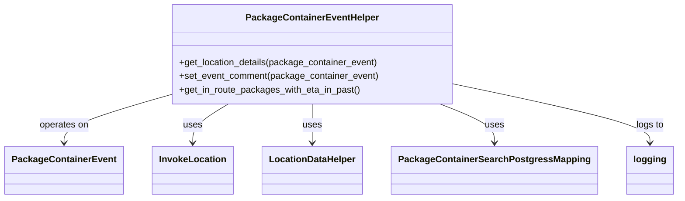

# Diagram: partview_core/partview_service/partview_service/api/package_container/helpers/PackageContainerEventHelper.py


> Auto-generated by Obscura crawlers

## Diagram 1



### SVG

<svg id="container" width="1132.84375" xmlns="http://www.w3.org/2000/svg" class="classDiagram" height="348" viewBox="0 0 1132.84375 348" role="graphics-document document" aria-roledescription="class"><style>#container{font-family:"trebuchet ms",verdana,arial,sans-serif;font-size:16px;fill:#333;}@keyframes edge-animation-frame{from{stroke-dashoffset:0;}}@keyframes dash{to{stroke-dashoffset:0;}}#container .edge-animation-slow{stroke-dasharray:9,5!important;stroke-dashoffset:900;animation:dash 50s linear infinite;stroke-linecap:round;}#container .edge-animation-fast{stroke-dasharray:9,5!important;stroke-dashoffset:900;animation:dash 20s linear infinite;stroke-linecap:round;}#container .error-icon{fill:#552222;}#container .error-text{fill:#552222;stroke:#552222;}#container .edge-thickness-normal{stroke-width:1px;}#container .edge-thickness-thick{stroke-width:3.5px;}#container .edge-pattern-solid{stroke-dasharray:0;}#container .edge-thickness-invisible{stroke-width:0;fill:none;}#container .edge-pattern-dashed{stroke-dasharray:3;}#container .edge-pattern-dotted{stroke-dasharray:2;}#container .marker{fill:#333333;stroke:#333333;}#container .marker.cross{stroke:#333333;}#container svg{font-family:"trebuchet ms",verdana,arial,sans-serif;font-size:16px;}#container p{margin:0;}#container g.classGroup text{fill:#9370DB;stroke:none;font-family:"trebuchet ms",verdana,arial,sans-serif;font-size:10px;}#container g.classGroup text .title{font-weight:bolder;}#container .nodeLabel,#container .edgeLabel{color:#131300;}#container .edgeLabel .label rect{fill:#ECECFF;}#container .label text{fill:#131300;}#container .labelBkg{background:#ECECFF;}#container .edgeLabel .label span{background:#ECECFF;}#container .classTitle{font-weight:bolder;}#container .node rect,#container .node circle,#container .node ellipse,#container .node polygon,#container .node path{fill:#ECECFF;stroke:#9370DB;stroke-width:1px;}#container .divider{stroke:#9370DB;stroke-width:1;}#container g.clickable{cursor:pointer;}#container g.classGroup rect{fill:#ECECFF;stroke:#9370DB;}#container g.classGroup line{stroke:#9370DB;stroke-width:1;}#container .classLabel .box{stroke:none;stroke-width:0;fill:#ECECFF;opacity:0.5;}#container .classLabel .label{fill:#9370DB;font-size:10px;}#container .relation{stroke:#333333;stroke-width:1;fill:none;}#container .dashed-line{stroke-dasharray:3;}#container .dotted-line{stroke-dasharray:1 2;}#container #compositionStart,#container .composition{fill:#333333!important;stroke:#333333!important;stroke-width:1;}#container #compositionEnd,#container .composition{fill:#333333!important;stroke:#333333!important;stroke-width:1;}#container #dependencyStart,#container .dependency{fill:#333333!important;stroke:#333333!important;stroke-width:1;}#container #dependencyStart,#container .dependency{fill:#333333!important;stroke:#333333!important;stroke-width:1;}#container #extensionStart,#container .extension{fill:transparent!important;stroke:#333333!important;stroke-width:1;}#container #extensionEnd,#container .extension{fill:transparent!important;stroke:#333333!important;stroke-width:1;}#container #aggregationStart,#container .aggregation{fill:transparent!important;stroke:#333333!important;stroke-width:1;}#container #aggregationEnd,#container .aggregation{fill:transparent!important;stroke:#333333!important;stroke-width:1;}#container #lollipopStart,#container .lollipop{fill:#ECECFF!important;stroke:#333333!important;stroke-width:1;}#container #lollipopEnd,#container .lollipop{fill:#ECECFF!important;stroke:#333333!important;stroke-width:1;}#container .edgeTerminals{font-size:11px;line-height:initial;}#container .classTitleText{text-anchor:middle;font-size:18px;fill:#333;}#container .label-icon{display:inline-block;height:1em;overflow:visible;vertical-align:-0.125em;}#container .node .label-icon path{fill:currentColor;stroke:revert;stroke-width:revert;}#container :root{--mermaid-font-family:"trebuchet ms",verdana,arial,sans-serif;}</style><g><defs><marker id="container_class-aggregationStart" class="marker aggregation class" refX="18" refY="7" markerWidth="190" markerHeight="240" orient="auto"><path d="M 18,7 L9,13 L1,7 L9,1 Z"></path></marker></defs><defs><marker id="container_class-aggregationEnd" class="marker aggregation class" refX="1" refY="7" markerWidth="20" markerHeight="28" orient="auto"><path d="M 18,7 L9,13 L1,7 L9,1 Z"></path></marker></defs><defs><marker id="container_class-extensionStart" class="marker extension class" refX="18" refY="7" markerWidth="190" markerHeight="240" orient="auto"><path d="M 1,7 L18,13 V 1 Z"></path></marker></defs><defs><marker id="container_class-extensionEnd" class="marker extension class" refX="1" refY="7" markerWidth="20" markerHeight="28" orient="auto"><path d="M 1,1 V 13 L18,7 Z"></path></marker></defs><defs><marker id="container_class-compositionStart" class="marker composition class" refX="18" refY="7" markerWidth="190" markerHeight="240" orient="auto"><path d="M 18,7 L9,13 L1,7 L9,1 Z"></path></marker></defs><defs><marker id="container_class-compositionEnd" class="marker composition class" refX="1" refY="7" markerWidth="20" markerHeight="28" orient="auto"><path d="M 18,7 L9,13 L1,7 L9,1 Z"></path></marker></defs><defs><marker id="container_class-dependencyStart" class="marker dependency class" refX="6" refY="7" markerWidth="190" markerHeight="240" orient="auto"><path d="M 5,7 L9,13 L1,7 L9,1 Z"></path></marker></defs><defs><marker id="container_class-dependencyEnd" class="marker dependency class" refX="13" refY="7" markerWidth="20" markerHeight="28" orient="auto"><path d="M 18,7 L9,13 L14,7 L9,1 Z"></path></marker></defs><defs><marker id="container_class-lollipopStart" class="marker lollipop class" refX="13" refY="7" markerWidth="190" markerHeight="240" orient="auto"><circle stroke="black" fill="transparent" cx="7" cy="7" r="6"></circle></marker></defs><defs><marker id="container_class-lollipopEnd" class="marker lollipop class" refX="1" refY="7" markerWidth="190" markerHeight="240" orient="auto"><circle stroke="black" fill="transparent" cx="7" cy="7" r="6"></circle></marker></defs><g class="root"><g class="clusters"></g><g class="edgePaths"><path d="M282.152,166.62L252.736,175.35C223.32,184.08,164.488,201.54,135.072,215.437C105.656,229.333,105.656,239.667,105.656,244.833L105.656,250" id="id_PackageContainerEventHelper_PackageContainerEvent_1" class="edge-thickness-normal edge-pattern-solid relation" style=";;;" data-edge="true" data-et="edge" data-id="id_PackageContainerEventHelper_PackageContainerEvent_1" data-points="W3sieCI6MjgyLjE1MjM0Mzc1LCJ5IjoxNjYuNjE5NzkwMjA1ODY3NX0seyJ4IjoxMDUuNjU2MjUsInkiOjIxOX0seyJ4IjoxMDUuNjU2MjUsInkiOjI1Nn1d" marker-end="url(#container_class-dependencyEnd)"></path><path d="M381.427,182L371.359,188.167C361.29,194.333,341.153,206.667,331.084,218C321.016,229.333,321.016,239.667,321.016,244.833L321.016,250" id="id_PackageContainerEventHelper_InvokeLocation_2" class="edge-thickness-normal edge-pattern-solid relation" style=";;;" data-edge="true" data-et="edge" data-id="id_PackageContainerEventHelper_InvokeLocation_2" data-points="W3sieCI6MzgxLjQyNzM1NjM1MDgwNjQ2LCJ5IjoxODJ9LHsieCI6MzIxLjAxNTYyNSwieSI6MjE5fSx7IngiOjMyMS4wMTU2MjUsInkiOjI1Nn1d" marker-end="url(#container_class-dependencyEnd)"></path><path d="M523.477,182L523.477,188.167C523.477,194.333,523.477,206.667,523.477,218C523.477,229.333,523.477,239.667,523.477,244.833L523.477,250" id="id_PackageContainerEventHelper_LocationDataHelper_3" class="edge-thickness-normal edge-pattern-solid relation" style=";;;" data-edge="true" data-et="edge" data-id="id_PackageContainerEventHelper_LocationDataHelper_3" data-points="W3sieCI6NTIzLjQ3NjU2MjUsInkiOjE4Mn0seyJ4Ijo1MjMuNDc2NTYyNSwieSI6MjE5fSx7IngiOjUyMy40NzY1NjI1LCJ5IjoyNTZ9XQ==" marker-end="url(#container_class-dependencyEnd)"></path><path d="M736.734,182L751.85,188.167C766.966,194.333,797.198,206.667,812.314,218C827.43,229.333,827.43,239.667,827.43,244.833L827.43,250" id="id_PackageContainerEventHelper_PackageContainerSearchPostgressMapping_4" class="edge-thickness-normal edge-pattern-solid relation" style=";;;" data-edge="true" data-et="edge" data-id="id_PackageContainerEventHelper_PackageContainerSearchPostgressMapping_4" data-points="W3sieCI6NzM2LjczMzk5Njk3NTgwNjUsInkiOjE4Mn0seyJ4Ijo4MjcuNDI5Njg3NSwieSI6MjE5fSx7IngiOjgyNy40Mjk2ODc1LCJ5IjoyNTZ9XQ==" marker-end="url(#container_class-dependencyEnd)"></path><path d="M764.801,148.221L818.29,160.018C871.779,171.814,978.757,195.407,1032.245,212.37C1085.734,229.333,1085.734,239.667,1085.734,244.833L1085.734,250" id="id_PackageContainerEventHelper_logging_5" class="edge-thickness-normal edge-pattern-solid relation" style=";;;" data-edge="true" data-et="edge" data-id="id_PackageContainerEventHelper_logging_5" data-points="W3sieCI6NzY0LjgwMDc4MTI1LCJ5IjoxNDguMjIxNDk4MTQ1MDM0Njd9LHsieCI6MTA4NS43MzQzNzUsInkiOjIxOX0seyJ4IjoxMDg1LjczNDM3NSwieSI6MjU2fV0=" marker-end="url(#container_class-dependencyEnd)"></path></g><g class="edgeLabels"><g class="edgeLabel" transform="translate(105.65625, 219)"><g class="label" data-id="id_PackageContainerEventHelper_PackageContainerEvent_1" transform="translate(-43.2890625, -12)"><foreignObject width="86.578125" height="24"><div xmlns="http://www.w3.org/1999/xhtml" class="labelBkg" style="display: table-cell; white-space: nowrap; line-height: 1.5; max-width: 200px; text-align: center;"><span class="edgeLabel"><p>operates on</p></span></div></foreignObject></g></g><g class="edgeLabel" transform="translate(321.015625, 219)"><g class="label" data-id="id_PackageContainerEventHelper_InvokeLocation_2" transform="translate(-16.4921875, -12)"><foreignObject width="32.984375" height="24"><div xmlns="http://www.w3.org/1999/xhtml" class="labelBkg" style="display: table-cell; white-space: nowrap; line-height: 1.5; max-width: 200px; text-align: center;"><span class="edgeLabel"><p>uses</p></span></div></foreignObject></g></g><g class="edgeLabel" transform="translate(523.4765625, 219)"><g class="label" data-id="id_PackageContainerEventHelper_LocationDataHelper_3" transform="translate(-16.4921875, -12)"><foreignObject width="32.984375" height="24"><div xmlns="http://www.w3.org/1999/xhtml" class="labelBkg" style="display: table-cell; white-space: nowrap; line-height: 1.5; max-width: 200px; text-align: center;"><span class="edgeLabel"><p>uses</p></span></div></foreignObject></g></g><g class="edgeLabel" transform="translate(827.4296875, 219)"><g class="label" data-id="id_PackageContainerEventHelper_PackageContainerSearchPostgressMapping_4" transform="translate(-16.4921875, -12)"><foreignObject width="32.984375" height="24"><div xmlns="http://www.w3.org/1999/xhtml" class="labelBkg" style="display: table-cell; white-space: nowrap; line-height: 1.5; max-width: 200px; text-align: center;"><span class="edgeLabel"><p>uses</p></span></div></foreignObject></g></g><g class="edgeLabel" transform="translate(1085.734375, 219)"><g class="label" data-id="id_PackageContainerEventHelper_logging_5" transform="translate(-24.3828125, -12)"><foreignObject width="48.765625" height="24"><div xmlns="http://www.w3.org/1999/xhtml" class="labelBkg" style="display: table-cell; white-space: nowrap; line-height: 1.5; max-width: 200px; text-align: center;"><span class="edgeLabel"><p>logs to</p></span></div></foreignObject></g></g></g><g class="nodes"><g class="node default" id="classId-PackageContainerEventHelper-0" transform="translate(523.4765625, 95)"><g class="basic label-container"><path d="M-241.32421875 -87 L241.32421875 -87 L241.32421875 87 L-241.32421875 87" stroke="none" stroke-width="0" fill="#ECECFF" style=""></path><path d="M-241.32421875 -87 C-98.91504801404503 -87, 43.494122721909946 -87, 241.32421875 -87 M-241.32421875 -87 C-74.61734752479285 -87, 92.0895237004143 -87, 241.32421875 -87 M241.32421875 -87 C241.32421875 -31.591558463464516, 241.32421875 23.81688307307097, 241.32421875 87 M241.32421875 -87 C241.32421875 -24.064200686624147, 241.32421875 38.871598626751705, 241.32421875 87 M241.32421875 87 C110.32855758858122 87, -20.66710357283756 87, -241.32421875 87 M241.32421875 87 C133.94137944360725 87, 26.558540137214493 87, -241.32421875 87 M-241.32421875 87 C-241.32421875 34.0448197716789, -241.32421875 -18.910360456642195, -241.32421875 -87 M-241.32421875 87 C-241.32421875 47.77129537078951, -241.32421875 8.54259074157902, -241.32421875 -87" stroke="#9370DB" stroke-width="1.3" fill="none" stroke-dasharray="0 0" style=""></path></g><g class="annotation-group text" transform="translate(0, -63)"></g><g class="label-group text" transform="translate(-110.1796875, -63)"><g class="label" style="font-weight: bolder" transform="translate(0,-12)"><foreignObject width="220.359375" height="24"><div xmlns="http://www.w3.org/1999/xhtml" style="display: table-cell; white-space: nowrap; line-height: 1.5; max-width: 268px; text-align: center;"><span class="nodeLabel markdown-node-label" style=""><p>PackageContainerEventHelper</p></span></div></foreignObject></g></g><g class="members-group text" transform="translate(-229.32421875, -15)"></g><g class="methods-group text" transform="translate(-229.32421875, 15)"><g class="label" style="" transform="translate(0,-12)"><foreignObject width="348.46875" height="24"><div xmlns="http://www.w3.org/1999/xhtml" style="display: table-cell; white-space: nowrap; line-height: 1.5; max-width: 406px; text-align: center;"><span class="nodeLabel markdown-node-label" style=""><p>+get_location_details(package_container_event)</p></span></div></foreignObject></g><g class="label" style="" transform="translate(0,12)"><foreignObject width="347.546875" height="24"><div xmlns="http://www.w3.org/1999/xhtml" style="display: table-cell; white-space: nowrap; line-height: 1.5; max-width: 405px; text-align: center;"><span class="nodeLabel markdown-node-label" style=""><p>+set_event_comment(package_container_event)</p></span></div></foreignObject></g><g class="label" style="" transform="translate(0,36)"><foreignObject width="316.078125" height="24"><div xmlns="http://www.w3.org/1999/xhtml" style="display: table-cell; white-space: nowrap; line-height: 1.5; max-width: 373px; text-align: center;"><span class="nodeLabel markdown-node-label" style=""><p>+get_in_route_packages_with_eta_in_past()</p></span></div></foreignObject></g></g><g class="divider" style=""><path d="M-241.32421875 -39 C-114.48688353522085 -39, 12.35045167955829 -39, 241.32421875 -39 M-241.32421875 -39 C-121.76031593299767 -39, -2.196413115995341 -39, 241.32421875 -39" stroke="#9370DB" stroke-width="1.3" fill="none" stroke-dasharray="0 0" style=""></path></g><g class="divider" style=""><path d="M-241.32421875 -15 C-63.50697695258131 -15, 114.31026484483738 -15, 241.32421875 -15 M-241.32421875 -15 C-57.96164140627317 -15, 125.40093593745365 -15, 241.32421875 -15" stroke="#9370DB" stroke-width="1.3" fill="none" stroke-dasharray="0 0" style=""></path></g></g><g class="node default" id="classId-InvokeLocation-1" transform="translate(321.015625, 298)"><g class="basic label-container"><path d="M-67.703125 -42 L67.703125 -42 L67.703125 42 L-67.703125 42" stroke="none" stroke-width="0" fill="#ECECFF" style=""></path><path d="M-67.703125 -42 C-27.406010741840056 -42, 12.891103516319887 -42, 67.703125 -42 M-67.703125 -42 C-29.201419563671358 -42, 9.300285872657284 -42, 67.703125 -42 M67.703125 -42 C67.703125 -22.238768741597312, 67.703125 -2.4775374831946237, 67.703125 42 M67.703125 -42 C67.703125 -10.19711122113063, 67.703125 21.60577755773874, 67.703125 42 M67.703125 42 C20.17919511795428 42, -27.34473476409144 42, -67.703125 42 M67.703125 42 C32.2404353733506 42, -3.2222542532988 42, -67.703125 42 M-67.703125 42 C-67.703125 12.253116556537123, -67.703125 -17.493766886925755, -67.703125 -42 M-67.703125 42 C-67.703125 17.182649045347347, -67.703125 -7.634701909305306, -67.703125 -42" stroke="#9370DB" stroke-width="1.3" fill="none" stroke-dasharray="0 0" style=""></path></g><g class="annotation-group text" transform="translate(0, -18)"></g><g class="label-group text" transform="translate(-55.703125, -18)"><g class="label" style="font-weight: bolder" transform="translate(0,-12)"><foreignObject width="111.40625" height="24"><div xmlns="http://www.w3.org/1999/xhtml" style="display: table-cell; white-space: nowrap; line-height: 1.5; max-width: 160px; text-align: center;"><span class="nodeLabel markdown-node-label" style=""><p>InvokeLocation</p></span></div></foreignObject></g></g><g class="members-group text" transform="translate(-55.703125, 30)"></g><g class="methods-group text" transform="translate(-55.703125, 60)"></g><g class="divider" style=""><path d="M-67.703125 6 C-32.8579653447438 6, 1.9871943105123933 6, 67.703125 6 M-67.703125 6 C-27.415558334483002 6, 12.872008331033996 6, 67.703125 6" stroke="#9370DB" stroke-width="1.3" fill="none" stroke-dasharray="0 0" style=""></path></g><g class="divider" style=""><path d="M-67.703125 24 C-21.27591960563869 24, 25.151285788722618 24, 67.703125 24 M-67.703125 24 C-14.814991140644466 24, 38.07314271871107 24, 67.703125 24" stroke="#9370DB" stroke-width="1.3" fill="none" stroke-dasharray="0 0" style=""></path></g></g><g class="node default" id="classId-LocationDataHelper-2" transform="translate(523.4765625, 298)"><g class="basic label-container"><path d="M-84.7578125 -42 L84.7578125 -42 L84.7578125 42 L-84.7578125 42" stroke="none" stroke-width="0" fill="#ECECFF" style=""></path><path d="M-84.7578125 -42 C-48.2402046040422 -42, -11.722596708084396 -42, 84.7578125 -42 M-84.7578125 -42 C-28.703815662111147 -42, 27.350181175777706 -42, 84.7578125 -42 M84.7578125 -42 C84.7578125 -15.35021610062374, 84.7578125 11.29956779875252, 84.7578125 42 M84.7578125 -42 C84.7578125 -22.769014346140978, 84.7578125 -3.538028692281955, 84.7578125 42 M84.7578125 42 C21.492842509191888 42, -41.772127481616224 42, -84.7578125 42 M84.7578125 42 C19.65861757214256 42, -45.44057735571488 42, -84.7578125 42 M-84.7578125 42 C-84.7578125 14.39837771554842, -84.7578125 -13.203244568903159, -84.7578125 -42 M-84.7578125 42 C-84.7578125 25.118294421863183, -84.7578125 8.236588843726366, -84.7578125 -42" stroke="#9370DB" stroke-width="1.3" fill="none" stroke-dasharray="0 0" style=""></path></g><g class="annotation-group text" transform="translate(0, -18)"></g><g class="label-group text" transform="translate(-72.7578125, -18)"><g class="label" style="font-weight: bolder" transform="translate(0,-12)"><foreignObject width="145.515625" height="24"><div xmlns="http://www.w3.org/1999/xhtml" style="display: table-cell; white-space: nowrap; line-height: 1.5; max-width: 195px; text-align: center;"><span class="nodeLabel markdown-node-label" style=""><p>LocationDataHelper</p></span></div></foreignObject></g></g><g class="members-group text" transform="translate(-72.7578125, 30)"></g><g class="methods-group text" transform="translate(-72.7578125, 60)"></g><g class="divider" style=""><path d="M-84.7578125 6 C-29.632311983846186 6, 25.493188532307627 6, 84.7578125 6 M-84.7578125 6 C-28.10078078654761 6, 28.55625092690478 6, 84.7578125 6" stroke="#9370DB" stroke-width="1.3" fill="none" stroke-dasharray="0 0" style=""></path></g><g class="divider" style=""><path d="M-84.7578125 24 C-38.58700607490628 24, 7.583800350187445 24, 84.7578125 24 M-84.7578125 24 C-27.542741271002804 24, 29.672329957994393 24, 84.7578125 24" stroke="#9370DB" stroke-width="1.3" fill="none" stroke-dasharray="0 0" style=""></path></g></g><g class="node default" id="classId-PackageContainerEvent-3" transform="translate(105.65625, 298)"><g class="basic label-container"><path d="M-97.65625 -42 L97.65625 -42 L97.65625 42 L-97.65625 42" stroke="none" stroke-width="0" fill="#ECECFF" style=""></path><path d="M-97.65625 -42 C-29.54259612518122 -42, 38.57105774963756 -42, 97.65625 -42 M-97.65625 -42 C-29.55599022091353 -42, 38.54426955817294 -42, 97.65625 -42 M97.65625 -42 C97.65625 -17.981063765030655, 97.65625 6.037872469938691, 97.65625 42 M97.65625 -42 C97.65625 -13.785488889440263, 97.65625 14.429022221119475, 97.65625 42 M97.65625 42 C43.733340240178286 42, -10.189569519643427 42, -97.65625 42 M97.65625 42 C39.422165657228696 42, -18.811918685542608 42, -97.65625 42 M-97.65625 42 C-97.65625 20.368532569518134, -97.65625 -1.2629348609637319, -97.65625 -42 M-97.65625 42 C-97.65625 19.731312292234364, -97.65625 -2.5373754155312724, -97.65625 -42" stroke="#9370DB" stroke-width="1.3" fill="none" stroke-dasharray="0 0" style=""></path></g><g class="annotation-group text" transform="translate(0, -18)"></g><g class="label-group text" transform="translate(-85.65625, -18)"><g class="label" style="font-weight: bolder" transform="translate(0,-12)"><foreignObject width="171.3125" height="24"><div xmlns="http://www.w3.org/1999/xhtml" style="display: table-cell; white-space: nowrap; line-height: 1.5; max-width: 219px; text-align: center;"><span class="nodeLabel markdown-node-label" style=""><p>PackageContainerEvent</p></span></div></foreignObject></g></g><g class="members-group text" transform="translate(-85.65625, 30)"></g><g class="methods-group text" transform="translate(-85.65625, 60)"></g><g class="divider" style=""><path d="M-97.65625 6 C-26.59346069104103 6, 44.46932861791794 6, 97.65625 6 M-97.65625 6 C-47.66806544474253 6, 2.3201191105149377 6, 97.65625 6" stroke="#9370DB" stroke-width="1.3" fill="none" stroke-dasharray="0 0" style=""></path></g><g class="divider" style=""><path d="M-97.65625 24 C-26.60061470359399 24, 44.45502059281202 24, 97.65625 24 M-97.65625 24 C-54.33290878782849 24, -11.009567575656973 24, 97.65625 24" stroke="#9370DB" stroke-width="1.3" fill="none" stroke-dasharray="0 0" style=""></path></g></g><g class="node default" id="classId-PackageContainerSearchPostgressMapping-4" transform="translate(827.4296875, 298)"><g class="basic label-container"><path d="M-169.1953125 -42 L169.1953125 -42 L169.1953125 42 L-169.1953125 42" stroke="none" stroke-width="0" fill="#ECECFF" style=""></path><path d="M-169.1953125 -42 C-72.81739963425962 -42, 23.56051323148077 -42, 169.1953125 -42 M-169.1953125 -42 C-71.37135759885362 -42, 26.45259730229276 -42, 169.1953125 -42 M169.1953125 -42 C169.1953125 -15.665535347903944, 169.1953125 10.668929304192112, 169.1953125 42 M169.1953125 -42 C169.1953125 -21.32809095258832, 169.1953125 -0.6561819051766378, 169.1953125 42 M169.1953125 42 C53.752152107971256 42, -61.69100828405749 42, -169.1953125 42 M169.1953125 42 C70.91822803818003 42, -27.358856423639935 42, -169.1953125 42 M-169.1953125 42 C-169.1953125 24.955098711849157, -169.1953125 7.910197423698314, -169.1953125 -42 M-169.1953125 42 C-169.1953125 23.230805080102044, -169.1953125 4.4616101602040885, -169.1953125 -42" stroke="#9370DB" stroke-width="1.3" fill="none" stroke-dasharray="0 0" style=""></path></g><g class="annotation-group text" transform="translate(0, -18)"></g><g class="label-group text" transform="translate(-157.1953125, -18)"><g class="label" style="font-weight: bolder" transform="translate(0,-12)"><foreignObject width="314.390625" height="24"><div xmlns="http://www.w3.org/1999/xhtml" style="display: table-cell; white-space: nowrap; line-height: 1.5; max-width: 359px; text-align: center;"><span class="nodeLabel markdown-node-label" style=""><p>PackageContainerSearchPostgressMapping</p></span></div></foreignObject></g></g><g class="members-group text" transform="translate(-157.1953125, 30)"></g><g class="methods-group text" transform="translate(-157.1953125, 60)"></g><g class="divider" style=""><path d="M-169.1953125 6 C-49.95538343826972 6, 69.28454562346056 6, 169.1953125 6 M-169.1953125 6 C-53.03358077877486 6, 63.128150942450276 6, 169.1953125 6" stroke="#9370DB" stroke-width="1.3" fill="none" stroke-dasharray="0 0" style=""></path></g><g class="divider" style=""><path d="M-169.1953125 24 C-85.37968374554836 24, -1.5640549910967252 24, 169.1953125 24 M-169.1953125 24 C-78.11853916467255 24, 12.95823417065489 24, 169.1953125 24" stroke="#9370DB" stroke-width="1.3" fill="none" stroke-dasharray="0 0" style=""></path></g></g><g class="node default" id="classId-logging-5" transform="translate(1085.734375, 298)"><g class="basic label-container"><path d="M-39.109375 -42 L39.109375 -42 L39.109375 42 L-39.109375 42" stroke="none" stroke-width="0" fill="#ECECFF" style=""></path><path d="M-39.109375 -42 C-14.054561297470531 -42, 11.000252405058937 -42, 39.109375 -42 M-39.109375 -42 C-11.697173563322693 -42, 15.715027873354614 -42, 39.109375 -42 M39.109375 -42 C39.109375 -13.665908596999923, 39.109375 14.668182806000154, 39.109375 42 M39.109375 -42 C39.109375 -18.77124048155238, 39.109375 4.457519036895242, 39.109375 42 M39.109375 42 C11.433579692450014 42, -16.242215615099973 42, -39.109375 42 M39.109375 42 C14.586509748679521 42, -9.936355502640957 42, -39.109375 42 M-39.109375 42 C-39.109375 18.62948452320185, -39.109375 -4.741030953596301, -39.109375 -42 M-39.109375 42 C-39.109375 10.34049898368454, -39.109375 -21.31900203263092, -39.109375 -42" stroke="#9370DB" stroke-width="1.3" fill="none" stroke-dasharray="0 0" style=""></path></g><g class="annotation-group text" transform="translate(0, -18)"></g><g class="label-group text" transform="translate(-27.109375, -18)"><g class="label" style="font-weight: bolder" transform="translate(0,-12)"><foreignObject width="54.21875" height="24"><div xmlns="http://www.w3.org/1999/xhtml" style="display: table-cell; white-space: nowrap; line-height: 1.5; max-width: 103px; text-align: center;"><span class="nodeLabel markdown-node-label" style=""><p>logging</p></span></div></foreignObject></g></g><g class="members-group text" transform="translate(-27.109375, 30)"></g><g class="methods-group text" transform="translate(-27.109375, 60)"></g><g class="divider" style=""><path d="M-39.109375 6 C-14.628238962875521 6, 9.852897074248958 6, 39.109375 6 M-39.109375 6 C-12.872419301050044 6, 13.364536397899911 6, 39.109375 6" stroke="#9370DB" stroke-width="1.3" fill="none" stroke-dasharray="0 0" style=""></path></g><g class="divider" style=""><path d="M-39.109375 24 C-8.977867387205134 24, 21.153640225589733 24, 39.109375 24 M-39.109375 24 C-12.282256739396036 24, 14.544861521207928 24, 39.109375 24" stroke="#9370DB" stroke-width="1.3" fill="none" stroke-dasharray="0 0" style=""></path></g></g></g></g></g></svg>

## Diagram 2

```mermaid
flowchart TD
    subgraph get_location_details
        A[Start: get_location_details(event)] --> B{event.location_detail exists?}
        B -- yes --> End1[Return (no action)]
        B -- no --> C{event.location_code exists?}
        C -- no --> End1
        C -- yes --> D[logging.info: Getting location details]
        D --> E[location = InvokeLocation.invoke_get_location(org_id, location_code)]
        E --> F{location found?}
        F -- no --> End1
        F -- yes --> G[parsed = LocationDataHelper.parse_location_details(location)]
        G --> H[event.reset_field("location_detail", parsed)]
        H --> I[logging.info: Location details set]
        I --> End1
    end

    subgraph set_event_comment
        S1[Start: set_event_comment(event)] --> S2[details = event.get("details") or {}]
        S2 --> S3{event.event_type in ["milestone","dealer"] AND event.location_detail?}
        S3 -- yes --> S4[compose source and details["comments"] with location name or org id and code]
        S4 --> S5[event.set("details", details)]
        S5 --> End2[Return]
        S3 -- no --> S6{event.event_type == "shipment" AND event.details AND event.location_detail?}
        S6 -- yes --> S7[details["updateDescription"] = details.get("updateDescription").replace("|locationName|", location_name)]
        S7 --> S8[event.set("details", details)]
        S8 --> End2
        S6 -- no --> End2
    end

    subgraph get_in_route_packages_with_eta_in_past
        G1[Start: get_in_route_packages_with_eta_in_past()] --> G2[Instantiate PackageContainerSearchPostgressMapping("NoApplicationNameProvided")]
        G2 --> G3[Run SQL query: select container_id, event_id, owner_org_fv_id from package_container where status='ACTIVE' AND lifecycle_state='In Route' ... limit 50000]
        G3 --> G4[result = search_query_adapter.read(query)]
        G4 --> G5[return result]
    end
```

> SVG rendering failed for this diagram.
