# Diagram: partview_core/partview_service/partview_service/api/package_container/helpers/PackageContainerExceptionHelper.py


> Auto-generated by Obscura crawlers

## Diagram 1

```mermaid
classDiagram
    class PackageContainerExceptionHelper {
        - RO_EVENT_CODES: list
        - __exception_type_data_store: PackageContainerExceptionTypePostgresqlMapping | None
        - __exception_category_data_store: PackageContainerExceptionCategoryPostgresqlMapping | None
        + __get_exception_type_data_store()
        + __get_exception_category_data_store()
        + get_exception_type_id_by_reason_code(solution_id, reason_code)
        + get_reason_code_by_exception_type_id(exception_type_id)
        + get_exception_name_by_exception_type_id(exception_type_id)
        + get_exception_category_id(solution_id, code, exception_type_id)
        + get_package_container_exception(container_id, exception_type_id, application_name, status)
        + get_location_details(organization_id, package_container_exception)
        + clear_recycle_or_lost_exception(application_name, current_exception_code, event_ts, solution_id, package_id)
        + write_container_exception_safely(data_store, container_exception, reason_code, tracking_number)
        + package_container_exception_logic(organization_fv_id, container_exception, hold_days, event_ts, package_container, package_container_event_bl, reason_code, data_store, application_name, solution_id, user_email, container_exception_status, is_update=False)
        + get_filtered_active_exceptions(record, codes_to_filter)
    }

    class ContainerExceptionType
    class PackageContainerException
    class PackageContainerExceptionCategory
    class PackageContainerExceptionPostgresqlMapping
    class PackageContainerExceptionCategoryPostgresqlMapping
    class PackageContainerExceptionTypePostgresqlMapping
    class PackageContainerReopenBusinessLogic
    class OpenSearchDataSyncProducer
    class InvokeEventScheduler
    class InvokeContainerEvent
    class InvokeLocation
    class NormalizeTime
    class Datetime
    class PackageContainerStatus
    class ExceptionCodes
    class ETAReasons
    class InvocationTypes
    class PackageEventCodes

    PackageContainerExceptionHelper --> PackageContainerExceptionTypePostgresqlMapping : uses
    PackageContainerExceptionHelper --> PackageContainerExceptionCategoryPostgresqlMapping : uses
    PackageContainerExceptionHelper --> PackageContainerExceptionPostgresqlMapping : uses
    PackageContainerExceptionHelper --> ContainerExceptionType : reads/writes
    PackageContainerExceptionHelper --> PackageContainerExceptionCategory : reads/writes
    PackageContainerExceptionHelper --> PackageContainerException : reads/writes
    PackageContainerExceptionHelper --> PackageContainerReopenBusinessLogic : uses
    PackageContainerExceptionHelper --> InvokeEventScheduler : schedules
    PackageContainerExceptionHelper --> InvokeContainerEvent : invokes
    PackageContainerExceptionHelper --> InvokeLocation : fetches
    PackageContainerExceptionHelper --> NormalizeTime : normalizes timestamps
    PackageContainerExceptionHelper --> Datetime : obtains current time
    PackageContainerExceptionHelper --> OpenSearchDataSyncProducer : syncs
    PackageContainerExceptionHelper --> ExceptionCodes : references
    PackageContainerExceptionHelper --> ETAReasons : references
    PackageContainerExceptionHelper --> InvocationTypes : references
    PackageContainerExceptionHelper --> PackageEventCodes : references
    PackageContainerExceptionHelper --> PackageContainerStatus : references
```



### SVG

<svg id="container" width="4856.0625" xmlns="http://www.w3.org/2000/svg" class="classDiagram" height="630" viewBox="0 0 4856.0625 630" role="graphics-document document" aria-roledescription="class"><style>#container{font-family:"trebuchet ms",verdana,arial,sans-serif;font-size:16px;fill:#333;}@keyframes edge-animation-frame{from{stroke-dashoffset:0;}}@keyframes dash{to{stroke-dashoffset:0;}}#container .edge-animation-slow{stroke-dasharray:9,5!important;stroke-dashoffset:900;animation:dash 50s linear infinite;stroke-linecap:round;}#container .edge-animation-fast{stroke-dasharray:9,5!important;stroke-dashoffset:900;animation:dash 20s linear infinite;stroke-linecap:round;}#container .error-icon{fill:#552222;}#container .error-text{fill:#552222;stroke:#552222;}#container .edge-thickness-normal{stroke-width:1px;}#container .edge-thickness-thick{stroke-width:3.5px;}#container .edge-pattern-solid{stroke-dasharray:0;}#container .edge-thickness-invisible{stroke-width:0;fill:none;}#container .edge-pattern-dashed{stroke-dasharray:3;}#container .edge-pattern-dotted{stroke-dasharray:2;}#container .marker{fill:#333333;stroke:#333333;}#container .marker.cross{stroke:#333333;}#container svg{font-family:"trebuchet ms",verdana,arial,sans-serif;font-size:16px;}#container p{margin:0;}#container g.classGroup text{fill:#9370DB;stroke:none;font-family:"trebuchet ms",verdana,arial,sans-serif;font-size:10px;}#container g.classGroup text .title{font-weight:bolder;}#container .nodeLabel,#container .edgeLabel{color:#131300;}#container .edgeLabel .label rect{fill:#ECECFF;}#container .label text{fill:#131300;}#container .labelBkg{background:#ECECFF;}#container .edgeLabel .label span{background:#ECECFF;}#container .classTitle{font-weight:bolder;}#container .node rect,#container .node circle,#container .node ellipse,#container .node polygon,#container .node path{fill:#ECECFF;stroke:#9370DB;stroke-width:1px;}#container .divider{stroke:#9370DB;stroke-width:1;}#container g.clickable{cursor:pointer;}#container g.classGroup rect{fill:#ECECFF;stroke:#9370DB;}#container g.classGroup line{stroke:#9370DB;stroke-width:1;}#container .classLabel .box{stroke:none;stroke-width:0;fill:#ECECFF;opacity:0.5;}#container .classLabel .label{fill:#9370DB;font-size:10px;}#container .relation{stroke:#333333;stroke-width:1;fill:none;}#container .dashed-line{stroke-dasharray:3;}#container .dotted-line{stroke-dasharray:1 2;}#container #compositionStart,#container .composition{fill:#333333!important;stroke:#333333!important;stroke-width:1;}#container #compositionEnd,#container .composition{fill:#333333!important;stroke:#333333!important;stroke-width:1;}#container #dependencyStart,#container .dependency{fill:#333333!important;stroke:#333333!important;stroke-width:1;}#container #dependencyStart,#container .dependency{fill:#333333!important;stroke:#333333!important;stroke-width:1;}#container #extensionStart,#container .extension{fill:transparent!important;stroke:#333333!important;stroke-width:1;}#container #extensionEnd,#container .extension{fill:transparent!important;stroke:#333333!important;stroke-width:1;}#container #aggregationStart,#container .aggregation{fill:transparent!important;stroke:#333333!important;stroke-width:1;}#container #aggregationEnd,#container .aggregation{fill:transparent!important;stroke:#333333!important;stroke-width:1;}#container #lollipopStart,#container .lollipop{fill:#ECECFF!important;stroke:#333333!important;stroke-width:1;}#container #lollipopEnd,#container .lollipop{fill:#ECECFF!important;stroke:#333333!important;stroke-width:1;}#container .edgeTerminals{font-size:11px;line-height:initial;}#container .classTitleText{text-anchor:middle;font-size:18px;fill:#333;}#container .label-icon{display:inline-block;height:1em;overflow:visible;vertical-align:-0.125em;}#container .node .label-icon path{fill:currentColor;stroke:revert;stroke-width:revert;}#container :root{--mermaid-font-family:"trebuchet ms",verdana,arial,sans-serif;}</style><g><defs><marker id="container_class-aggregationStart" class="marker aggregation class" refX="18" refY="7" markerWidth="190" markerHeight="240" orient="auto"><path d="M 18,7 L9,13 L1,7 L9,1 Z"></path></marker></defs><defs><marker id="container_class-aggregationEnd" class="marker aggregation class" refX="1" refY="7" markerWidth="20" markerHeight="28" orient="auto"><path d="M 18,7 L9,13 L1,7 L9,1 Z"></path></marker></defs><defs><marker id="container_class-extensionStart" class="marker extension class" refX="18" refY="7" markerWidth="190" markerHeight="240" orient="auto"><path d="M 1,7 L18,13 V 1 Z"></path></marker></defs><defs><marker id="container_class-extensionEnd" class="marker extension class" refX="1" refY="7" markerWidth="20" markerHeight="28" orient="auto"><path d="M 1,1 V 13 L18,7 Z"></path></marker></defs><defs><marker id="container_class-compositionStart" class="marker composition class" refX="18" refY="7" markerWidth="190" markerHeight="240" orient="auto"><path d="M 18,7 L9,13 L1,7 L9,1 Z"></path></marker></defs><defs><marker id="container_class-compositionEnd" class="marker composition class" refX="1" refY="7" markerWidth="20" markerHeight="28" orient="auto"><path d="M 18,7 L9,13 L1,7 L9,1 Z"></path></marker></defs><defs><marker id="container_class-dependencyStart" class="marker dependency class" refX="6" refY="7" markerWidth="190" markerHeight="240" orient="auto"><path d="M 5,7 L9,13 L1,7 L9,1 Z"></path></marker></defs><defs><marker id="container_class-dependencyEnd" class="marker dependency class" refX="13" refY="7" markerWidth="20" markerHeight="28" orient="auto"><path d="M 18,7 L9,13 L14,7 L9,1 Z"></path></marker></defs><defs><marker id="container_class-lollipopStart" class="marker lollipop class" refX="13" refY="7" markerWidth="190" markerHeight="240" orient="auto"><circle stroke="black" fill="transparent" cx="7" cy="7" r="6"></circle></marker></defs><defs><marker id="container_class-lollipopEnd" class="marker lollipop class" refX="1" refY="7" markerWidth="190" markerHeight="240" orient="auto"><circle stroke="black" fill="transparent" cx="7" cy="7" r="6"></circle></marker></defs><g class="root"><g class="clusters"></g><g class="edgePaths"><path d="M1996.316,332.79L1698.411,360.825C1400.505,388.86,804.694,444.93,506.788,478.132C208.883,511.333,208.883,521.667,208.883,526.833L208.883,532" id="id_PackageContainerExceptionHelper_PackageContainerExceptionTypePostgresqlMapping_1" class="edge-thickness-normal edge-pattern-solid relation" style=";;;" data-edge="true" data-et="edge" data-id="id_PackageContainerExceptionHelper_PackageContainerExceptionTypePostgresqlMapping_1" data-points="W3sieCI6MTk5Ni4zMTY0MDYyNSwieSI6MzMyLjc5MDMyNTE5ODQwMjV9LHsieCI6MjA4Ljg4MjgxMjUsInkiOjUwMX0seyJ4IjoyMDguODgyODEyNSwieSI6NTM4fV0=" marker-end="url(#container_class-dependencyEnd)"></path><path d="M1996.316,352.031L1776.236,376.859C1556.156,401.687,1115.996,451.344,895.916,481.339C675.836,511.333,675.836,521.667,675.836,526.833L675.836,532" id="id_PackageContainerExceptionHelper_PackageContainerExceptionCategoryPostgresqlMapping_2" class="edge-thickness-normal edge-pattern-solid relation" style=";;;" data-edge="true" data-et="edge" data-id="id_PackageContainerExceptionHelper_PackageContainerExceptionCategoryPostgresqlMapping_2" data-points="W3sieCI6MTk5Ni4zMTY0MDYyNSwieSI6MzUyLjAzMTExNzAxNjQxMTZ9LHsieCI6Njc1LjgzNTkzNzUsInkiOjUwMX0seyJ4Ijo2NzUuODM1OTM3NSwieSI6NTM4fV0=" marker-end="url(#container_class-dependencyEnd)"></path><path d="M1996.316,379.498L1851.173,399.748C1706.029,419.999,1415.741,460.499,1270.597,485.916C1125.453,511.333,1125.453,521.667,1125.453,526.833L1125.453,532" id="id_PackageContainerExceptionHelper_PackageContainerExceptionPostgresqlMapping_3" class="edge-thickness-normal edge-pattern-solid relation" style=";;;" data-edge="true" data-et="edge" data-id="id_PackageContainerExceptionHelper_PackageContainerExceptionPostgresqlMapping_3" data-points="W3sieCI6MTk5Ni4zMTY0MDYyNSwieSI6Mzc5LjQ5Nzc3MTY4MTEyMTF9LHsieCI6MTEyNS40NTMxMjUsInkiOjUwMX0seyJ4IjoxMTI1LjQ1MzEyNSwieSI6NTM4fV0=" marker-end="url(#container_class-dependencyEnd)"></path><path d="M1996.316,410.135L1906.869,425.28C1817.422,440.424,1638.527,470.712,1549.08,491.023C1459.633,511.333,1459.633,521.667,1459.633,526.833L1459.633,532" id="id_PackageContainerExceptionHelper_ContainerExceptionType_4" class="edge-thickness-normal edge-pattern-solid relation" style=";;;" data-edge="true" data-et="edge" data-id="id_PackageContainerExceptionHelper_ContainerExceptionType_4" data-points="W3sieCI6MTk5Ni4zMTY0MDYyNSwieSI6NDEwLjEzNTQzMTA0Mjg3MzQ1fSx7IngiOjE0NTkuNjMyODEyNSwieSI6NTAxfSx7IngiOjE0NTkuNjMyODEyNSwieSI6NTM4fV0=" marker-end="url(#container_class-dependencyEnd)"></path><path d="M1996.316,450.798L1956.253,459.165C1916.19,467.532,1836.064,484.266,1796.001,497.8C1755.938,511.333,1755.938,521.667,1755.938,526.833L1755.938,532" id="id_PackageContainerExceptionHelper_PackageContainerExceptionCategory_5" class="edge-thickness-normal edge-pattern-solid relation" style=";;;" data-edge="true" data-et="edge" data-id="id_PackageContainerExceptionHelper_PackageContainerExceptionCategory_5" data-points="W3sieCI6MTk5Ni4zMTY0MDYyNSwieSI6NDUwLjc5ODQ5ODkzOTQ2ODF9LHsieCI6MTc1NS45Mzc1LCJ5Ijo1MDF9LHsieCI6MTc1NS45Mzc1LCJ5Ijo1Mzh9XQ==" marker-end="url(#container_class-dependencyEnd)"></path><path d="M2198.806,464L2176.465,470.167C2154.123,476.333,2109.441,488.667,2087.099,500C2064.758,511.333,2064.758,521.667,2064.758,526.833L2064.758,532" id="id_PackageContainerExceptionHelper_PackageContainerException_6" class="edge-thickness-normal edge-pattern-solid relation" style=";;;" data-edge="true" data-et="edge" data-id="id_PackageContainerExceptionHelper_PackageContainerException_6" data-points="W3sieCI6MjE5OC44MDU5MTA5NjY5ODEsInkiOjQ2NH0seyJ4IjoyMDY0Ljc1NzgxMjUsInkiOjUwMX0seyJ4IjoyMDY0Ljc1NzgxMjUsInkiOjUzOH1d" marker-end="url(#container_class-dependencyEnd)"></path><path d="M2473.885,464L2458.983,470.167C2444.082,476.333,2414.279,488.667,2399.378,500C2384.477,511.333,2384.477,521.667,2384.477,526.833L2384.477,532" id="id_PackageContainerExceptionHelper_PackageContainerReopenBusinessLogic_7" class="edge-thickness-normal edge-pattern-solid relation" style=";;;" data-edge="true" data-et="edge" data-id="id_PackageContainerExceptionHelper_PackageContainerReopenBusinessLogic_7" data-points="W3sieCI6MjQ3My44ODQ2ODQ1NTE4ODcsInkiOjQ2NH0seyJ4IjoyMzg0LjQ3NjU2MjUsInkiOjUwMX0seyJ4IjoyMzg0LjQ3NjU2MjUsInkiOjUzOH1d" marker-end="url(#container_class-dependencyEnd)"></path><path d="M2731.924,464L2724.002,470.167C2716.08,476.333,2700.235,488.667,2692.313,500C2684.391,511.333,2684.391,521.667,2684.391,526.833L2684.391,532" id="id_PackageContainerExceptionHelper_InvokeEventScheduler_8" class="edge-thickness-normal edge-pattern-solid relation" style=";;;" data-edge="true" data-et="edge" data-id="id_PackageContainerExceptionHelper_InvokeEventScheduler_8" data-points="W3sieCI6MjczMS45MjM5NTM0MTk4MTE0LCJ5Ijo0NjR9LHsieCI6MjY4NC4zOTA2MjUsInkiOjUwMX0seyJ4IjoyNjg0LjM5MDYyNSwieSI6NTM4fV0=" marker-end="url(#container_class-dependencyEnd)"></path><path d="M2934.55,464L2932.108,470.167C2929.666,476.333,2924.782,488.667,2922.34,500C2919.898,511.333,2919.898,521.667,2919.898,526.833L2919.898,532" id="id_PackageContainerExceptionHelper_InvokeContainerEvent_9" class="edge-thickness-normal edge-pattern-solid relation" style=";;;" data-edge="true" data-et="edge" data-id="id_PackageContainerExceptionHelper_InvokeContainerEvent_9" data-points="W3sieCI6MjkzNC41NDk1NDMwNDI0NTMsInkiOjQ2NH0seyJ4IjoyOTE5Ljg5ODQzNzUsInkiOjUwMX0seyJ4IjoyOTE5Ljg5ODQzNzUsInkiOjUzOH1d" marker-end="url(#container_class-dependencyEnd)"></path><path d="M3115.115,464L3117.556,470.167C3119.998,476.333,3124.882,488.667,3127.324,500C3129.766,511.333,3129.766,521.667,3129.766,526.833L3129.766,532" id="id_PackageContainerExceptionHelper_InvokeLocation_10" class="edge-thickness-normal edge-pattern-solid relation" style=";;;" data-edge="true" data-et="edge" data-id="id_PackageContainerExceptionHelper_InvokeLocation_10" data-points="W3sieCI6MzExNS4xMTQ1MTk0NTc1NDcsInkiOjQ2NH0seyJ4IjozMTI5Ljc2NTYyNSwieSI6NTAxfSx7IngiOjMxMjkuNzY1NjI1LCJ5Ijo1Mzh9XQ==" marker-end="url(#container_class-dependencyEnd)"></path><path d="M3273.726,464L3280.458,470.167C3287.19,476.333,3300.654,488.667,3307.385,500C3314.117,511.333,3314.117,521.667,3314.117,526.833L3314.117,532" id="id_PackageContainerExceptionHelper_NormalizeTime_11" class="edge-thickness-normal edge-pattern-solid relation" style=";;;" data-edge="true" data-et="edge" data-id="id_PackageContainerExceptionHelper_NormalizeTime_11" data-points="W3sieCI6MzI3My43MjY0Mjk4MzQ5MDU1LCJ5Ijo0NjR9LHsieCI6MzMxNC4xMTcxODc1LCJ5Ijo1MDF9LHsieCI6MzMxNC4xMTcxODc1LCJ5Ijo1Mzh9XQ==" marker-end="url(#container_class-dependencyEnd)"></path><path d="M3427.411,464L3438.3,470.167C3449.188,476.333,3470.965,488.667,3481.854,500C3492.742,511.333,3492.742,521.667,3492.742,526.833L3492.742,532" id="id_PackageContainerExceptionHelper_Datetime_12" class="edge-thickness-normal edge-pattern-solid relation" style=";;;" data-edge="true" data-et="edge" data-id="id_PackageContainerExceptionHelper_Datetime_12" data-points="W3sieCI6MzQyNy40MTEzMzU0OTUyODMsInkiOjQ2NH0seyJ4IjozNDkyLjc0MjE4NzUsInkiOjUwMX0seyJ4IjozNDkyLjc0MjE4NzUsInkiOjUzOH1d" marker-end="url(#container_class-dependencyEnd)"></path><path d="M3615.296,464L3631.266,470.167C3647.237,476.333,3679.177,488.667,3695.147,500C3711.117,511.333,3711.117,521.667,3711.117,526.833L3711.117,532" id="id_PackageContainerExceptionHelper_OpenSearchDataSyncProducer_13" class="edge-thickness-normal edge-pattern-solid relation" style=";;;" data-edge="true" data-et="edge" data-id="id_PackageContainerExceptionHelper_OpenSearchDataSyncProducer_13" data-points="W3sieCI6MzYxNS4yOTYyNDExNTU2NjA1LCJ5Ijo0NjR9LHsieCI6MzcxMS4xMTcxODc1LCJ5Ijo1MDF9LHsieCI6MzcxMS4xMTcxODc1LCJ5Ijo1Mzh9XQ==" marker-end="url(#container_class-dependencyEnd)"></path><path d="M3824.254,464L3845.875,470.167C3867.497,476.333,3910.741,488.667,3932.363,500C3953.984,511.333,3953.984,521.667,3953.984,526.833L3953.984,532" id="id_PackageContainerExceptionHelper_ExceptionCodes_14" class="edge-thickness-normal edge-pattern-solid relation" style=";;;" data-edge="true" data-et="edge" data-id="id_PackageContainerExceptionHelper_ExceptionCodes_14" data-points="W3sieCI6MzgyNC4yNTM2NzA0MDA5NDM1LCJ5Ijo0NjR9LHsieCI6Mzk1My45ODQzNzUsInkiOjUwMX0seyJ4IjozOTUzLjk4NDM3NSwieSI6NTM4fV0=" marker-end="url(#container_class-dependencyEnd)"></path><path d="M3975.001,464L4000.7,470.167C4026.399,476.333,4077.797,488.667,4103.496,500C4129.195,511.333,4129.195,521.667,4129.195,526.833L4129.195,532" id="id_PackageContainerExceptionHelper_ETAReasons_15" class="edge-thickness-normal edge-pattern-solid relation" style=";;;" data-edge="true" data-et="edge" data-id="id_PackageContainerExceptionHelper_ETAReasons_15" data-points="W3sieCI6Mzk3NS4wMDExOTM5ODU4NDksInkiOjQ2NH0seyJ4Ijo0MTI5LjE5NTMxMjUsInkiOjUwMX0seyJ4Ijo0MTI5LjE5NTMxMjUsInkiOjUzOH1d" marker-end="url(#container_class-dependencyEnd)"></path><path d="M4053.348,448.723L4095.475,457.435C4137.602,466.148,4221.855,483.574,4263.982,497.454C4306.109,511.333,4306.109,521.667,4306.109,526.833L4306.109,532" id="id_PackageContainerExceptionHelper_InvocationTypes_16" class="edge-thickness-normal edge-pattern-solid relation" style=";;;" data-edge="true" data-et="edge" data-id="id_PackageContainerExceptionHelper_InvocationTypes_16" data-points="W3sieCI6NDA1My4zNDc2NTYyNSwieSI6NDQ4LjcyMjU5NDMzNDg3N30seyJ4Ijo0MzA2LjEwOTM3NSwieSI6NTAxfSx7IngiOjQzMDYuMTA5Mzc1LCJ5Ijo1Mzh9XQ==" marker-end="url(#container_class-dependencyEnd)"></path><path d="M4053.348,419.278L4129.782,432.898C4206.216,446.519,4359.085,473.759,4435.519,492.546C4511.953,511.333,4511.953,521.667,4511.953,526.833L4511.953,532" id="id_PackageContainerExceptionHelper_PackageEventCodes_17" class="edge-thickness-normal edge-pattern-solid relation" style=";;;" data-edge="true" data-et="edge" data-id="id_PackageContainerExceptionHelper_PackageEventCodes_17" data-points="W3sieCI6NDA1My4zNDc2NTYyNSwieSI6NDE5LjI3ODA0MDg4NzUxNn0seyJ4Ijo0NTExLjk1MzEyNSwieSI6NTAxfSx7IngiOjQ1MTEuOTUzMTI1LCJ5Ijo1Mzh9XQ==" marker-end="url(#container_class-dependencyEnd)"></path><path d="M4053.348,394.251L4168.979,412.043C4284.609,429.834,4515.871,465.417,4631.502,488.375C4747.133,511.333,4747.133,521.667,4747.133,526.833L4747.133,532" id="id_PackageContainerExceptionHelper_PackageContainerStatus_18" class="edge-thickness-normal edge-pattern-solid relation" style=";;;" data-edge="true" data-et="edge" data-id="id_PackageContainerExceptionHelper_PackageContainerStatus_18" data-points="W3sieCI6NDA1My4zNDc2NTYyNSwieSI6Mzk0LjI1MTQ3NTkyODEzOTM3fSx7IngiOjQ3NDcuMTMyODEyNSwieSI6NTAxfSx7IngiOjQ3NDcuMTMyODEyNSwieSI6NTM4fV0=" marker-end="url(#container_class-dependencyEnd)"></path></g><g class="edgeLabels"><g class="edgeLabel" transform="translate(208.8828125, 501)"><g class="label" data-id="id_PackageContainerExceptionHelper_PackageContainerExceptionTypePostgresqlMapping_1" transform="translate(-16.4921875, -12)"><foreignObject width="32.984375" height="24"><div xmlns="http://www.w3.org/1999/xhtml" class="labelBkg" style="display: table-cell; white-space: nowrap; line-height: 1.5; max-width: 200px; text-align: center;"><span class="edgeLabel"><p>uses</p></span></div></foreignObject></g></g><g class="edgeLabel" transform="translate(675.8359375, 501)"><g class="label" data-id="id_PackageContainerExceptionHelper_PackageContainerExceptionCategoryPostgresqlMapping_2" transform="translate(-16.4921875, -12)"><foreignObject width="32.984375" height="24"><div xmlns="http://www.w3.org/1999/xhtml" class="labelBkg" style="display: table-cell; white-space: nowrap; line-height: 1.5; max-width: 200px; text-align: center;"><span class="edgeLabel"><p>uses</p></span></div></foreignObject></g></g><g class="edgeLabel" transform="translate(1125.453125, 501)"><g class="label" data-id="id_PackageContainerExceptionHelper_PackageContainerExceptionPostgresqlMapping_3" transform="translate(-16.4921875, -12)"><foreignObject width="32.984375" height="24"><div xmlns="http://www.w3.org/1999/xhtml" class="labelBkg" style="display: table-cell; white-space: nowrap; line-height: 1.5; max-width: 200px; text-align: center;"><span class="edgeLabel"><p>uses</p></span></div></foreignObject></g></g><g class="edgeLabel" transform="translate(1459.6328125, 501)"><g class="label" data-id="id_PackageContainerExceptionHelper_ContainerExceptionType_4" transform="translate(-45.9453125, -12)"><foreignObject width="91.890625" height="24"><div xmlns="http://www.w3.org/1999/xhtml" class="labelBkg" style="display: table-cell; white-space: nowrap; line-height: 1.5; max-width: 200px; text-align: center;"><span class="edgeLabel"><p>reads/writes</p></span></div></foreignObject></g></g><g class="edgeLabel" transform="translate(1755.9375, 501)"><g class="label" data-id="id_PackageContainerExceptionHelper_PackageContainerExceptionCategory_5" transform="translate(-45.9453125, -12)"><foreignObject width="91.890625" height="24"><div xmlns="http://www.w3.org/1999/xhtml" class="labelBkg" style="display: table-cell; white-space: nowrap; line-height: 1.5; max-width: 200px; text-align: center;"><span class="edgeLabel"><p>reads/writes</p></span></div></foreignObject></g></g><g class="edgeLabel" transform="translate(2064.7578125, 501)"><g class="label" data-id="id_PackageContainerExceptionHelper_PackageContainerException_6" transform="translate(-45.9453125, -12)"><foreignObject width="91.890625" height="24"><div xmlns="http://www.w3.org/1999/xhtml" class="labelBkg" style="display: table-cell; white-space: nowrap; line-height: 1.5; max-width: 200px; text-align: center;"><span class="edgeLabel"><p>reads/writes</p></span></div></foreignObject></g></g><g class="edgeLabel" transform="translate(2384.4765625, 501)"><g class="label" data-id="id_PackageContainerExceptionHelper_PackageContainerReopenBusinessLogic_7" transform="translate(-16.4921875, -12)"><foreignObject width="32.984375" height="24"><div xmlns="http://www.w3.org/1999/xhtml" class="labelBkg" style="display: table-cell; white-space: nowrap; line-height: 1.5; max-width: 200px; text-align: center;"><span class="edgeLabel"><p>uses</p></span></div></foreignObject></g></g><g class="edgeLabel" transform="translate(2684.390625, 501)"><g class="label" data-id="id_PackageContainerExceptionHelper_InvokeEventScheduler_8" transform="translate(-36.453125, -12)"><foreignObject width="72.90625" height="24"><div xmlns="http://www.w3.org/1999/xhtml" class="labelBkg" style="display: table-cell; white-space: nowrap; line-height: 1.5; max-width: 200px; text-align: center;"><span class="edgeLabel"><p>schedules</p></span></div></foreignObject></g></g><g class="edgeLabel" transform="translate(2919.8984375, 501)"><g class="label" data-id="id_PackageContainerExceptionHelper_InvokeContainerEvent_9" transform="translate(-27.5859375, -12)"><foreignObject width="55.171875" height="24"><div xmlns="http://www.w3.org/1999/xhtml" class="labelBkg" style="display: table-cell; white-space: nowrap; line-height: 1.5; max-width: 200px; text-align: center;"><span class="edgeLabel"><p>invokes</p></span></div></foreignObject></g></g><g class="edgeLabel" transform="translate(3129.765625, 501)"><g class="label" data-id="id_PackageContainerExceptionHelper_InvokeLocation_10" transform="translate(-26.34375, -12)"><foreignObject width="52.6875" height="24"><div xmlns="http://www.w3.org/1999/xhtml" class="labelBkg" style="display: table-cell; white-space: nowrap; line-height: 1.5; max-width: 200px; text-align: center;"><span class="edgeLabel"><p>fetches</p></span></div></foreignObject></g></g><g class="edgeLabel" transform="translate(3314.1171875, 501)"><g class="label" data-id="id_PackageContainerExceptionHelper_NormalizeTime_11" transform="translate(-84.4609375, -12)"><foreignObject width="168.921875" height="24"><div xmlns="http://www.w3.org/1999/xhtml" class="labelBkg" style="display: table-cell; white-space: nowrap; line-height: 1.5; max-width: 200px; text-align: center;"><span class="edgeLabel"><p>normalizes timestamps</p></span></div></foreignObject></g></g><g class="edgeLabel" transform="translate(3492.7421875, 501)"><g class="label" data-id="id_PackageContainerExceptionHelper_Datetime_12" transform="translate(-74.1640625, -12)"><foreignObject width="148.328125" height="24"><div xmlns="http://www.w3.org/1999/xhtml" class="labelBkg" style="display: table-cell; white-space: nowrap; line-height: 1.5; max-width: 200px; text-align: center;"><span class="edgeLabel"><p>obtains current time</p></span></div></foreignObject></g></g><g class="edgeLabel" transform="translate(3711.1171875, 501)"><g class="label" data-id="id_PackageContainerExceptionHelper_OpenSearchDataSyncProducer_13" transform="translate(-19.7890625, -12)"><foreignObject width="39.578125" height="24"><div xmlns="http://www.w3.org/1999/xhtml" class="labelBkg" style="display: table-cell; white-space: nowrap; line-height: 1.5; max-width: 200px; text-align: center;"><span class="edgeLabel"><p>syncs</p></span></div></foreignObject></g></g><g class="edgeLabel" transform="translate(3953.984375, 501)"><g class="label" data-id="id_PackageContainerExceptionHelper_ExceptionCodes_14" transform="translate(-37.828125, -12)"><foreignObject width="75.65625" height="24"><div xmlns="http://www.w3.org/1999/xhtml" class="labelBkg" style="display: table-cell; white-space: nowrap; line-height: 1.5; max-width: 200px; text-align: center;"><span class="edgeLabel"><p>references</p></span></div></foreignObject></g></g><g class="edgeLabel" transform="translate(4129.1953125, 501)"><g class="label" data-id="id_PackageContainerExceptionHelper_ETAReasons_15" transform="translate(-37.828125, -12)"><foreignObject width="75.65625" height="24"><div xmlns="http://www.w3.org/1999/xhtml" class="labelBkg" style="display: table-cell; white-space: nowrap; line-height: 1.5; max-width: 200px; text-align: center;"><span class="edgeLabel"><p>references</p></span></div></foreignObject></g></g><g class="edgeLabel" transform="translate(4306.109375, 501)"><g class="label" data-id="id_PackageContainerExceptionHelper_InvocationTypes_16" transform="translate(-37.828125, -12)"><foreignObject width="75.65625" height="24"><div xmlns="http://www.w3.org/1999/xhtml" class="labelBkg" style="display: table-cell; white-space: nowrap; line-height: 1.5; max-width: 200px; text-align: center;"><span class="edgeLabel"><p>references</p></span></div></foreignObject></g></g><g class="edgeLabel" transform="translate(4511.953125, 501)"><g class="label" data-id="id_PackageContainerExceptionHelper_PackageEventCodes_17" transform="translate(-37.828125, -12)"><foreignObject width="75.65625" height="24"><div xmlns="http://www.w3.org/1999/xhtml" class="labelBkg" style="display: table-cell; white-space: nowrap; line-height: 1.5; max-width: 200px; text-align: center;"><span class="edgeLabel"><p>references</p></span></div></foreignObject></g></g><g class="edgeLabel" transform="translate(4747.1328125, 501)"><g class="label" data-id="id_PackageContainerExceptionHelper_PackageContainerStatus_18" transform="translate(-37.828125, -12)"><foreignObject width="75.65625" height="24"><div xmlns="http://www.w3.org/1999/xhtml" class="labelBkg" style="display: table-cell; white-space: nowrap; line-height: 1.5; max-width: 200px; text-align: center;"><span class="edgeLabel"><p>references</p></span></div></foreignObject></g></g></g><g class="nodes"><g class="node default" id="classId-PackageContainerExceptionHelper-0" transform="translate(3024.83203125, 236)"><g class="basic label-container"><path d="M-1028.515625 -228 L1028.515625 -228 L1028.515625 228 L-1028.515625 228" stroke="none" stroke-width="0" fill="#ECECFF" style=""></path><path d="M-1028.515625 -228 C-445.2372530184847 -228, 138.0411189630306 -228, 1028.515625 -228 M-1028.515625 -228 C-563.4712805628092 -228, -98.42693612561834 -228, 1028.515625 -228 M1028.515625 -228 C1028.515625 -119.89126051805496, 1028.515625 -11.782521036109927, 1028.515625 228 M1028.515625 -228 C1028.515625 -119.92203159870985, 1028.515625 -11.8440631974197, 1028.515625 228 M1028.515625 228 C328.23571221188433 228, -372.04420057623133 228, -1028.515625 228 M1028.515625 228 C351.2439950606648 228, -326.02763487867037 228, -1028.515625 228 M-1028.515625 228 C-1028.515625 48.27426650959586, -1028.515625 -131.45146698080828, -1028.515625 -228 M-1028.515625 228 C-1028.515625 60.71420979624236, -1028.515625 -106.57158040751528, -1028.515625 -228" stroke="#9370DB" stroke-width="1.3" fill="none" stroke-dasharray="0 0" style=""></path></g><g class="annotation-group text" transform="translate(0, -204)"></g><g class="label-group text" transform="translate(-125.671875, -204)"><g class="label" style="font-weight: bolder" transform="translate(0,-12)"><foreignObject width="251.34375" height="24"><div xmlns="http://www.w3.org/1999/xhtml" style="display: table-cell; white-space: nowrap; line-height: 1.5; max-width: 299px; text-align: center;"><span class="nodeLabel markdown-node-label" style=""><p>PackageContainerExceptionHelper</p></span></div></foreignObject></g></g><g class="members-group text" transform="translate(-1016.515625, -156)"><g class="label" style="" transform="translate(0,-12)"><foreignObject width="168.75" height="24"><div xmlns="http://www.w3.org/1999/xhtml" style="display: table-cell; white-space: nowrap; line-height: 1.5; max-width: 226px; text-align: center;"><span class="nodeLabel markdown-node-label" style=""><p>- RO_EVENT_CODES: list</p></span></div></foreignObject></g><g class="label" style="" transform="translate(0,12)"><foreignObject width="655.203125" height="24"><div xmlns="http://www.w3.org/1999/xhtml" style="display: table-cell; white-space: nowrap; line-height: 1.5; max-width: 713px; text-align: center;"><span class="nodeLabel markdown-node-label" style=""><p>- __exception_type_data_store: PackageContainerExceptionTypePostgresqlMapping | None</p></span></div></foreignObject></g><g class="label" style="" transform="translate(0,36)"><foreignObject width="714.65625" height="24"><div xmlns="http://www.w3.org/1999/xhtml" style="display: table-cell; white-space: nowrap; line-height: 1.5; max-width: 772px; text-align: center;"><span class="nodeLabel markdown-node-label" style=""><p>- __exception_category_data_store: PackageContainerExceptionCategoryPostgresqlMapping | None</p></span></div></foreignObject></g></g><g class="methods-group text" transform="translate(-1016.515625, -60)"><g class="label" style="" transform="translate(0,-12)"><foreignObject width="265.734375" height="24"><div xmlns="http://www.w3.org/1999/xhtml" style="display: table-cell; white-space: nowrap; line-height: 1.5; max-width: 323px; text-align: center;"><span class="nodeLabel markdown-node-label" style=""><p>+ __get_exception_type_data_store()</p></span></div></foreignObject></g><g class="label" style="" transform="translate(0,12)"><foreignObject width="295.6875" height="24"><div xmlns="http://www.w3.org/1999/xhtml" style="display: table-cell; white-space: nowrap; line-height: 1.5; max-width: 353px; text-align: center;"><span class="nodeLabel markdown-node-label" style=""><p>+ __get_exception_category_data_store()</p></span></div></foreignObject></g><g class="label" style="" transform="translate(0,36)"><foreignObject width="493.46875" height="24"><div xmlns="http://www.w3.org/1999/xhtml" style="display: table-cell; white-space: nowrap; line-height: 1.5; max-width: 551px; text-align: center;"><span class="nodeLabel markdown-node-label" style=""><p>+ get_exception_type_id_by_reason_code(solution_id, reason_code)</p></span></div></foreignObject></g><g class="label" style="" transform="translate(0,60)"><foreignObject width="443.515625" height="24"><div xmlns="http://www.w3.org/1999/xhtml" style="display: table-cell; white-space: nowrap; line-height: 1.5; max-width: 501px; text-align: center;"><span class="nodeLabel markdown-node-label" style=""><p>+ get_reason_code_by_exception_type_id(exception_type_id)</p></span></div></foreignObject></g><g class="label" style="" transform="translate(0,84)"><foreignObject width="470.828125" height="24"><div xmlns="http://www.w3.org/1999/xhtml" style="display: table-cell; white-space: nowrap; line-height: 1.5; max-width: 528px; text-align: center;"><span class="nodeLabel markdown-node-label" style=""><p>+ get_exception_name_by_exception_type_id(exception_type_id)</p></span></div></foreignObject></g><g class="label" style="" transform="translate(0,108)"><foreignObject width="481.546875" height="24"><div xmlns="http://www.w3.org/1999/xhtml" style="display: table-cell; white-space: nowrap; line-height: 1.5; max-width: 539px; text-align: center;"><span class="nodeLabel markdown-node-label" style=""><p>+ get_exception_category_id(solution_id, code, exception_type_id)</p></span></div></foreignObject></g><g class="label" style="" transform="translate(0,132)"><foreignObject width="689.171875" height="24"><div xmlns="http://www.w3.org/1999/xhtml" style="display: table-cell; white-space: nowrap; line-height: 1.5; max-width: 747px; text-align: center;"><span class="nodeLabel markdown-node-label" style=""><p>+ get_package_container_exception(container_id, exception_type_id, application_name, status)</p></span></div></foreignObject></g><g class="label" style="" transform="translate(0,156)"><foreignObject width="503.953125" height="24"><div xmlns="http://www.w3.org/1999/xhtml" style="display: table-cell; white-space: nowrap; line-height: 1.5; max-width: 561px; text-align: center;"><span class="nodeLabel markdown-node-label" style=""><p>+ get_location_details(organization_id, package_container_exception)</p></span></div></foreignObject></g><g class="label" style="" transform="translate(0,180)"><foreignObject width="814.28125" height="24"><div xmlns="http://www.w3.org/1999/xhtml" style="display: table-cell; white-space: nowrap; line-height: 1.5; max-width: 872px; text-align: center;"><span class="nodeLabel markdown-node-label" style=""><p>+ clear_recycle_or_lost_exception(application_name, current_exception_code, event_ts, solution_id, package_id)</p></span></div></foreignObject></g><g class="label" style="" transform="translate(0,204)"><foreignObject width="727.625" height="24"><div xmlns="http://www.w3.org/1999/xhtml" style="display: table-cell; white-space: nowrap; line-height: 1.5; max-width: 785px; text-align: center;"><span class="nodeLabel markdown-node-label" style=""><p>+ write_container_exception_safely(data_store, container_exception, reason_code, tracking_number)</p></span></div></foreignObject></g><g class="label" style="" transform="translate(0,228)"><foreignObject width="1907.359375" height="24"><div xmlns="http://www.w3.org/1999/xhtml" style="display: table-cell; white-space: nowrap; line-height: 1.5; max-width: 1965px; text-align: center;"><span class="nodeLabel markdown-node-label" style=""><p>+ package_container_exception_logic(organization_fv_id, container_exception, hold_days, event_ts, package_container, package_container_event_bl, reason_code, data_store, application_name, solution_id, user_email, container_exception_status, is_update=False)</p></span></div></foreignObject></g><g class="label" style="" transform="translate(0,252)"><foreignObject width="403.78125" height="24"><div xmlns="http://www.w3.org/1999/xhtml" style="display: table-cell; white-space: nowrap; line-height: 1.5; max-width: 461px; text-align: center;"><span class="nodeLabel markdown-node-label" style=""><p>+ get_filtered_active_exceptions(record, codes_to_filter)</p></span></div></foreignObject></g></g><g class="divider" style=""><path d="M-1028.515625 -180 C-298.0208558946339 -180, 432.47391321073223 -180, 1028.515625 -180 M-1028.515625 -180 C-226.76860399857583 -180, 574.9784170028483 -180, 1028.515625 -180" stroke="#9370DB" stroke-width="1.3" fill="none" stroke-dasharray="0 0" style=""></path></g><g class="divider" style=""><path d="M-1028.515625 -84 C-292.22036012945875 -84, 444.0749047410825 -84, 1028.515625 -84 M-1028.515625 -84 C-310.7742444875437 -84, 406.96713602491263 -84, 1028.515625 -84" stroke="#9370DB" stroke-width="1.3" fill="none" stroke-dasharray="0 0" style=""></path></g></g><g class="node default" id="classId-ContainerExceptionType-1" transform="translate(1459.6328125, 580)"><g class="basic label-container"><path d="M-100.6328125 -42 L100.6328125 -42 L100.6328125 42 L-100.6328125 42" stroke="none" stroke-width="0" fill="#ECECFF" style=""></path><path d="M-100.6328125 -42 C-24.280098201645046 -42, 52.07261609670991 -42, 100.6328125 -42 M-100.6328125 -42 C-37.48625342443716 -42, 25.660305651125682 -42, 100.6328125 -42 M100.6328125 -42 C100.6328125 -21.424947235740675, 100.6328125 -0.849894471481349, 100.6328125 42 M100.6328125 -42 C100.6328125 -19.866747080540993, 100.6328125 2.2665058389180146, 100.6328125 42 M100.6328125 42 C35.35745590111894 42, -29.91790069776212 42, -100.6328125 42 M100.6328125 42 C44.04638223454963 42, -12.540048030900735 42, -100.6328125 42 M-100.6328125 42 C-100.6328125 23.2066386702641, -100.6328125 4.413277340528197, -100.6328125 -42 M-100.6328125 42 C-100.6328125 17.090733940712315, -100.6328125 -7.818532118575369, -100.6328125 -42" stroke="#9370DB" stroke-width="1.3" fill="none" stroke-dasharray="0 0" style=""></path></g><g class="annotation-group text" transform="translate(0, -18)"></g><g class="label-group text" transform="translate(-88.6328125, -18)"><g class="label" style="font-weight: bolder" transform="translate(0,-12)"><foreignObject width="177.265625" height="24"><div xmlns="http://www.w3.org/1999/xhtml" style="display: table-cell; white-space: nowrap; line-height: 1.5; max-width: 225px; text-align: center;"><span class="nodeLabel markdown-node-label" style=""><p>ContainerExceptionType</p></span></div></foreignObject></g></g><g class="members-group text" transform="translate(-88.6328125, 30)"></g><g class="methods-group text" transform="translate(-88.6328125, 60)"></g><g class="divider" style=""><path d="M-100.6328125 6 C-60.121179661631565 6, -19.60954682326313 6, 100.6328125 6 M-100.6328125 6 C-36.10461735183141 6, 28.423577796337185 6, 100.6328125 6" stroke="#9370DB" stroke-width="1.3" fill="none" stroke-dasharray="0 0" style=""></path></g><g class="divider" style=""><path d="M-100.6328125 24 C-43.651215132290645 24, 13.33038223541871 24, 100.6328125 24 M-100.6328125 24 C-33.117820053608625 24, 34.39717239278275 24, 100.6328125 24" stroke="#9370DB" stroke-width="1.3" fill="none" stroke-dasharray="0 0" style=""></path></g></g><g class="node default" id="classId-PackageContainerException-2" transform="translate(2064.7578125, 580)"><g class="basic label-container"><path d="M-113.1484375 -42 L113.1484375 -42 L113.1484375 42 L-113.1484375 42" stroke="none" stroke-width="0" fill="#ECECFF" style=""></path><path d="M-113.1484375 -42 C-60.24417587640426 -42, -7.339914252808526 -42, 113.1484375 -42 M-113.1484375 -42 C-37.5124925158312 -42, 38.123452468337604 -42, 113.1484375 -42 M113.1484375 -42 C113.1484375 -16.949629336369963, 113.1484375 8.100741327260074, 113.1484375 42 M113.1484375 -42 C113.1484375 -10.707152980242444, 113.1484375 20.58569403951511, 113.1484375 42 M113.1484375 42 C27.499494824603318 42, -58.149447850793365 42, -113.1484375 42 M113.1484375 42 C25.9252871976517 42, -61.2978631046966 42, -113.1484375 42 M-113.1484375 42 C-113.1484375 14.450915514607033, -113.1484375 -13.098168970785935, -113.1484375 -42 M-113.1484375 42 C-113.1484375 11.322199467195652, -113.1484375 -19.355601065608695, -113.1484375 -42" stroke="#9370DB" stroke-width="1.3" fill="none" stroke-dasharray="0 0" style=""></path></g><g class="annotation-group text" transform="translate(0, -18)"></g><g class="label-group text" transform="translate(-101.1484375, -18)"><g class="label" style="font-weight: bolder" transform="translate(0,-12)"><foreignObject width="202.296875" height="24"><div xmlns="http://www.w3.org/1999/xhtml" style="display: table-cell; white-space: nowrap; line-height: 1.5; max-width: 249px; text-align: center;"><span class="nodeLabel markdown-node-label" style=""><p>PackageContainerException</p></span></div></foreignObject></g></g><g class="members-group text" transform="translate(-101.1484375, 30)"></g><g class="methods-group text" transform="translate(-101.1484375, 60)"></g><g class="divider" style=""><path d="M-113.1484375 6 C-31.563792301961954 6, 50.02085289607609 6, 113.1484375 6 M-113.1484375 6 C-41.538317713956104 6, 30.07180207208779 6, 113.1484375 6" stroke="#9370DB" stroke-width="1.3" fill="none" stroke-dasharray="0 0" style=""></path></g><g class="divider" style=""><path d="M-113.1484375 24 C-40.77672582985173 24, 31.594985840296545 24, 113.1484375 24 M-113.1484375 24 C-31.020597702252417 24, 51.10724209549517 24, 113.1484375 24" stroke="#9370DB" stroke-width="1.3" fill="none" stroke-dasharray="0 0" style=""></path></g></g><g class="node default" id="classId-PackageContainerExceptionCategory-3" transform="translate(1755.9375, 580)"><g class="basic label-container"><path d="M-145.671875 -42 L145.671875 -42 L145.671875 42 L-145.671875 42" stroke="none" stroke-width="0" fill="#ECECFF" style=""></path><path d="M-145.671875 -42 C-63.342099699116815 -42, 18.98767560176637 -42, 145.671875 -42 M-145.671875 -42 C-56.03961490251602 -42, 33.59264519496796 -42, 145.671875 -42 M145.671875 -42 C145.671875 -10.628467307143186, 145.671875 20.743065385713628, 145.671875 42 M145.671875 -42 C145.671875 -8.535375580218385, 145.671875 24.92924883956323, 145.671875 42 M145.671875 42 C46.30731860609559 42, -53.057237787808816 42, -145.671875 42 M145.671875 42 C67.55997886295067 42, -10.551917274098656 42, -145.671875 42 M-145.671875 42 C-145.671875 20.570352526339356, -145.671875 -0.8592949473212883, -145.671875 -42 M-145.671875 42 C-145.671875 13.756966296444883, -145.671875 -14.486067407110234, -145.671875 -42" stroke="#9370DB" stroke-width="1.3" fill="none" stroke-dasharray="0 0" style=""></path></g><g class="annotation-group text" transform="translate(0, -18)"></g><g class="label-group text" transform="translate(-133.671875, -18)"><g class="label" style="font-weight: bolder" transform="translate(0,-12)"><foreignObject width="267.34375" height="24"><div xmlns="http://www.w3.org/1999/xhtml" style="display: table-cell; white-space: nowrap; line-height: 1.5; max-width: 313px; text-align: center;"><span class="nodeLabel markdown-node-label" style=""><p>PackageContainerExceptionCategory</p></span></div></foreignObject></g></g><g class="members-group text" transform="translate(-133.671875, 30)"></g><g class="methods-group text" transform="translate(-133.671875, 60)"></g><g class="divider" style=""><path d="M-145.671875 6 C-59.63275588571588 6, 26.40636322856824 6, 145.671875 6 M-145.671875 6 C-83.89926037600176 6, -22.126645752003526 6, 145.671875 6" stroke="#9370DB" stroke-width="1.3" fill="none" stroke-dasharray="0 0" style=""></path></g><g class="divider" style=""><path d="M-145.671875 24 C-73.71228231711665 24, -1.7526896342332918 24, 145.671875 24 M-145.671875 24 C-82.60053375782465 24, -19.529192515649314 24, 145.671875 24" stroke="#9370DB" stroke-width="1.3" fill="none" stroke-dasharray="0 0" style=""></path></g></g><g class="node default" id="classId-PackageContainerExceptionPostgresqlMapping-4" transform="translate(1125.453125, 580)"><g class="basic label-container"><path d="M-183.546875 -42 L183.546875 -42 L183.546875 42 L-183.546875 42" stroke="none" stroke-width="0" fill="#ECECFF" style=""></path><path d="M-183.546875 -42 C-57.41876215640187 -42, 68.70935068719626 -42, 183.546875 -42 M-183.546875 -42 C-42.32052217266664 -42, 98.90583065466672 -42, 183.546875 -42 M183.546875 -42 C183.546875 -12.492063984424824, 183.546875 17.01587203115035, 183.546875 42 M183.546875 -42 C183.546875 -11.50226405753153, 183.546875 18.99547188493694, 183.546875 42 M183.546875 42 C90.3734220014515 42, -2.8000309970969965 42, -183.546875 42 M183.546875 42 C46.877646946608024 42, -89.79158110678395 42, -183.546875 42 M-183.546875 42 C-183.546875 17.23699339711595, -183.546875 -7.526013205768102, -183.546875 -42 M-183.546875 42 C-183.546875 17.196158518530208, -183.546875 -7.607682962939585, -183.546875 -42" stroke="#9370DB" stroke-width="1.3" fill="none" stroke-dasharray="0 0" style=""></path></g><g class="annotation-group text" transform="translate(0, -18)"></g><g class="label-group text" transform="translate(-171.546875, -18)"><g class="label" style="font-weight: bolder" transform="translate(0,-12)"><foreignObject width="343.09375" height="24"><div xmlns="http://www.w3.org/1999/xhtml" style="display: table-cell; white-space: nowrap; line-height: 1.5; max-width: 388px; text-align: center;"><span class="nodeLabel markdown-node-label" style=""><p>PackageContainerExceptionPostgresqlMapping</p></span></div></foreignObject></g></g><g class="members-group text" transform="translate(-171.546875, 30)"></g><g class="methods-group text" transform="translate(-171.546875, 60)"></g><g class="divider" style=""><path d="M-183.546875 6 C-100.51876111515159 6, -17.490647230303182 6, 183.546875 6 M-183.546875 6 C-64.60067516521028 6, 54.34552466957945 6, 183.546875 6" stroke="#9370DB" stroke-width="1.3" fill="none" stroke-dasharray="0 0" style=""></path></g><g class="divider" style=""><path d="M-183.546875 24 C-99.12331456585336 24, -14.699754131706726 24, 183.546875 24 M-183.546875 24 C-55.27422409401947 24, 72.99842681196105 24, 183.546875 24" stroke="#9370DB" stroke-width="1.3" fill="none" stroke-dasharray="0 0" style=""></path></g></g><g class="node default" id="classId-PackageContainerExceptionCategoryPostgresqlMapping-5" transform="translate(675.8359375, 580)"><g class="basic label-container"><path d="M-216.0703125 -42 L216.0703125 -42 L216.0703125 42 L-216.0703125 42" stroke="none" stroke-width="0" fill="#ECECFF" style=""></path><path d="M-216.0703125 -42 C-44.83186379215144 -42, 126.40658491569712 -42, 216.0703125 -42 M-216.0703125 -42 C-58.44938996415601 -42, 99.17153257168798 -42, 216.0703125 -42 M216.0703125 -42 C216.0703125 -16.3872250818502, 216.0703125 9.2255498362996, 216.0703125 42 M216.0703125 -42 C216.0703125 -19.429988941025204, 216.0703125 3.1400221179495915, 216.0703125 42 M216.0703125 42 C122.59611389447247 42, 29.121915288944933 42, -216.0703125 42 M216.0703125 42 C126.6074469076607 42, 37.1445813153214 42, -216.0703125 42 M-216.0703125 42 C-216.0703125 20.122354998343823, -216.0703125 -1.7552900033123535, -216.0703125 -42 M-216.0703125 42 C-216.0703125 13.699106444663858, -216.0703125 -14.601787110672284, -216.0703125 -42" stroke="#9370DB" stroke-width="1.3" fill="none" stroke-dasharray="0 0" style=""></path></g><g class="annotation-group text" transform="translate(0, -18)"></g><g class="label-group text" transform="translate(-204.0703125, -18)"><g class="label" style="font-weight: bolder" transform="translate(0,-12)"><foreignObject width="408.140625" height="24"><div xmlns="http://www.w3.org/1999/xhtml" style="display: table-cell; white-space: nowrap; line-height: 1.5; max-width: 451px; text-align: center;"><span class="nodeLabel markdown-node-label" style=""><p>PackageContainerExceptionCategoryPostgresqlMapping</p></span></div></foreignObject></g></g><g class="members-group text" transform="translate(-204.0703125, 30)"></g><g class="methods-group text" transform="translate(-204.0703125, 60)"></g><g class="divider" style=""><path d="M-216.0703125 6 C-110.85071999521688 6, -5.631127490433755 6, 216.0703125 6 M-216.0703125 6 C-129.6189211432481 6, -43.167529786496175 6, 216.0703125 6" stroke="#9370DB" stroke-width="1.3" fill="none" stroke-dasharray="0 0" style=""></path></g><g class="divider" style=""><path d="M-216.0703125 24 C-53.94742264072508 24, 108.17546721854984 24, 216.0703125 24 M-216.0703125 24 C-119.01725966520223 24, -21.964206830404464 24, 216.0703125 24" stroke="#9370DB" stroke-width="1.3" fill="none" stroke-dasharray="0 0" style=""></path></g></g><g class="node default" id="classId-PackageContainerExceptionTypePostgresqlMapping-6" transform="translate(208.8828125, 580)"><g class="basic label-container"><path d="M-200.8828125 -42 L200.8828125 -42 L200.8828125 42 L-200.8828125 42" stroke="none" stroke-width="0" fill="#ECECFF" style=""></path><path d="M-200.8828125 -42 C-96.46199010871221 -42, 7.958832282575571 -42, 200.8828125 -42 M-200.8828125 -42 C-69.18742089387425 -42, 62.507970712251506 -42, 200.8828125 -42 M200.8828125 -42 C200.8828125 -19.89389906924186, 200.8828125 2.2122018615162773, 200.8828125 42 M200.8828125 -42 C200.8828125 -21.296711607835324, 200.8828125 -0.5934232156706472, 200.8828125 42 M200.8828125 42 C112.74914355399508 42, 24.615474607990166 42, -200.8828125 42 M200.8828125 42 C66.61284003707073 42, -67.65713242585855 42, -200.8828125 42 M-200.8828125 42 C-200.8828125 22.153618301519842, -200.8828125 2.3072366030396836, -200.8828125 -42 M-200.8828125 42 C-200.8828125 17.815347040999658, -200.8828125 -6.369305918000684, -200.8828125 -42" stroke="#9370DB" stroke-width="1.3" fill="none" stroke-dasharray="0 0" style=""></path></g><g class="annotation-group text" transform="translate(0, -18)"></g><g class="label-group text" transform="translate(-188.8828125, -18)"><g class="label" style="font-weight: bolder" transform="translate(0,-12)"><foreignObject width="377.765625" height="24"><div xmlns="http://www.w3.org/1999/xhtml" style="display: table-cell; white-space: nowrap; line-height: 1.5; max-width: 422px; text-align: center;"><span class="nodeLabel markdown-node-label" style=""><p>PackageContainerExceptionTypePostgresqlMapping</p></span></div></foreignObject></g></g><g class="members-group text" transform="translate(-188.8828125, 30)"></g><g class="methods-group text" transform="translate(-188.8828125, 60)"></g><g class="divider" style=""><path d="M-200.8828125 6 C-93.20057053358455 6, 14.481671432830893 6, 200.8828125 6 M-200.8828125 6 C-115.39177072977594 6, -29.900728959551884 6, 200.8828125 6" stroke="#9370DB" stroke-width="1.3" fill="none" stroke-dasharray="0 0" style=""></path></g><g class="divider" style=""><path d="M-200.8828125 24 C-117.44163504907145 24, -34.0004575981429 24, 200.8828125 24 M-200.8828125 24 C-53.841030998399816 24, 93.20075050320037 24, 200.8828125 24" stroke="#9370DB" stroke-width="1.3" fill="none" stroke-dasharray="0 0" style=""></path></g></g><g class="node default" id="classId-PackageContainerReopenBusinessLogic-7" transform="translate(2384.4765625, 580)"><g class="basic label-container"><path d="M-156.5703125 -42 L156.5703125 -42 L156.5703125 42 L-156.5703125 42" stroke="none" stroke-width="0" fill="#ECECFF" style=""></path><path d="M-156.5703125 -42 C-81.3622732928759 -42, -6.154234085751796 -42, 156.5703125 -42 M-156.5703125 -42 C-73.07359873836138 -42, 10.423115023277234 -42, 156.5703125 -42 M156.5703125 -42 C156.5703125 -21.321612445640795, 156.5703125 -0.6432248912815908, 156.5703125 42 M156.5703125 -42 C156.5703125 -9.896114299906408, 156.5703125 22.207771400187184, 156.5703125 42 M156.5703125 42 C93.8688171424591 42, 31.167321784918187 42, -156.5703125 42 M156.5703125 42 C65.94448567994203 42, -24.681341140115933 42, -156.5703125 42 M-156.5703125 42 C-156.5703125 10.602185341814437, -156.5703125 -20.795629316371127, -156.5703125 -42 M-156.5703125 42 C-156.5703125 23.344480161472944, -156.5703125 4.6889603229458885, -156.5703125 -42" stroke="#9370DB" stroke-width="1.3" fill="none" stroke-dasharray="0 0" style=""></path></g><g class="annotation-group text" transform="translate(0, -18)"></g><g class="label-group text" transform="translate(-144.5703125, -18)"><g class="label" style="font-weight: bolder" transform="translate(0,-12)"><foreignObject width="289.140625" height="24"><div xmlns="http://www.w3.org/1999/xhtml" style="display: table-cell; white-space: nowrap; line-height: 1.5; max-width: 335px; text-align: center;"><span class="nodeLabel markdown-node-label" style=""><p>PackageContainerReopenBusinessLogic</p></span></div></foreignObject></g></g><g class="members-group text" transform="translate(-144.5703125, 30)"></g><g class="methods-group text" transform="translate(-144.5703125, 60)"></g><g class="divider" style=""><path d="M-156.5703125 6 C-62.94664181709153 6, 30.677028865816936 6, 156.5703125 6 M-156.5703125 6 C-64.33999886283776 6, 27.89031477432448 6, 156.5703125 6" stroke="#9370DB" stroke-width="1.3" fill="none" stroke-dasharray="0 0" style=""></path></g><g class="divider" style=""><path d="M-156.5703125 24 C-49.81717314461997 24, 56.93596621076006 24, 156.5703125 24 M-156.5703125 24 C-51.89791292348143 24, 52.774486653037144 24, 156.5703125 24" stroke="#9370DB" stroke-width="1.3" fill="none" stroke-dasharray="0 0" style=""></path></g></g><g class="node default" id="classId-OpenSearchDataSyncProducer-8" transform="translate(3711.1171875, 580)"><g class="basic label-container"><path d="M-122.9765625 -42 L122.9765625 -42 L122.9765625 42 L-122.9765625 42" stroke="none" stroke-width="0" fill="#ECECFF" style=""></path><path d="M-122.9765625 -42 C-63.860080666783944 -42, -4.743598833567887 -42, 122.9765625 -42 M-122.9765625 -42 C-73.70997853618132 -42, -24.44339457236265 -42, 122.9765625 -42 M122.9765625 -42 C122.9765625 -9.79113458813859, 122.9765625 22.41773082372282, 122.9765625 42 M122.9765625 -42 C122.9765625 -19.568521989122964, 122.9765625 2.862956021754073, 122.9765625 42 M122.9765625 42 C40.142532506254824 42, -42.69149748749035 42, -122.9765625 42 M122.9765625 42 C46.01673862459781 42, -30.943085250804387 42, -122.9765625 42 M-122.9765625 42 C-122.9765625 8.735223034195698, -122.9765625 -24.529553931608604, -122.9765625 -42 M-122.9765625 42 C-122.9765625 15.030163276709697, -122.9765625 -11.939673446580606, -122.9765625 -42" stroke="#9370DB" stroke-width="1.3" fill="none" stroke-dasharray="0 0" style=""></path></g><g class="annotation-group text" transform="translate(0, -18)"></g><g class="label-group text" transform="translate(-110.9765625, -18)"><g class="label" style="font-weight: bolder" transform="translate(0,-12)"><foreignObject width="221.953125" height="24"><div xmlns="http://www.w3.org/1999/xhtml" style="display: table-cell; white-space: nowrap; line-height: 1.5; max-width: 270px; text-align: center;"><span class="nodeLabel markdown-node-label" style=""><p>OpenSearchDataSyncProducer</p></span></div></foreignObject></g></g><g class="members-group text" transform="translate(-110.9765625, 30)"></g><g class="methods-group text" transform="translate(-110.9765625, 60)"></g><g class="divider" style=""><path d="M-122.9765625 6 C-52.06478979625017 6, 18.846982907499665 6, 122.9765625 6 M-122.9765625 6 C-28.29067956869227 6, 66.39520336261546 6, 122.9765625 6" stroke="#9370DB" stroke-width="1.3" fill="none" stroke-dasharray="0 0" style=""></path></g><g class="divider" style=""><path d="M-122.9765625 24 C-44.57295378364026 24, 33.83065493271948 24, 122.9765625 24 M-122.9765625 24 C-73.53173066403852 24, -24.086898828077025 24, 122.9765625 24" stroke="#9370DB" stroke-width="1.3" fill="none" stroke-dasharray="0 0" style=""></path></g></g><g class="node default" id="classId-InvokeEventScheduler-9" transform="translate(2684.390625, 580)"><g class="basic label-container"><path d="M-93.34375 -42 L93.34375 -42 L93.34375 42 L-93.34375 42" stroke="none" stroke-width="0" fill="#ECECFF" style=""></path><path d="M-93.34375 -42 C-44.084504023753304 -42, 5.174741952493392 -42, 93.34375 -42 M-93.34375 -42 C-22.00780332396603 -42, 49.32814335206794 -42, 93.34375 -42 M93.34375 -42 C93.34375 -12.860784771571627, 93.34375 16.278430456856746, 93.34375 42 M93.34375 -42 C93.34375 -18.78668627484166, 93.34375 4.42662745031668, 93.34375 42 M93.34375 42 C50.40216972538279 42, 7.460589450765582 42, -93.34375 42 M93.34375 42 C23.88619248385703 42, -45.57136503228594 42, -93.34375 42 M-93.34375 42 C-93.34375 22.33605074615093, -93.34375 2.672101492301863, -93.34375 -42 M-93.34375 42 C-93.34375 18.25023129331924, -93.34375 -5.499537413361523, -93.34375 -42" stroke="#9370DB" stroke-width="1.3" fill="none" stroke-dasharray="0 0" style=""></path></g><g class="annotation-group text" transform="translate(0, -18)"></g><g class="label-group text" transform="translate(-81.34375, -18)"><g class="label" style="font-weight: bolder" transform="translate(0,-12)"><foreignObject width="162.6875" height="24"><div xmlns="http://www.w3.org/1999/xhtml" style="display: table-cell; white-space: nowrap; line-height: 1.5; max-width: 211px; text-align: center;"><span class="nodeLabel markdown-node-label" style=""><p>InvokeEventScheduler</p></span></div></foreignObject></g></g><g class="members-group text" transform="translate(-81.34375, 30)"></g><g class="methods-group text" transform="translate(-81.34375, 60)"></g><g class="divider" style=""><path d="M-93.34375 6 C-55.74680538618659 6, -18.149860772373174 6, 93.34375 6 M-93.34375 6 C-48.23218728646595 6, -3.120624572931902 6, 93.34375 6" stroke="#9370DB" stroke-width="1.3" fill="none" stroke-dasharray="0 0" style=""></path></g><g class="divider" style=""><path d="M-93.34375 24 C-33.97590141238608 24, 25.39194717522784 24, 93.34375 24 M-93.34375 24 C-40.58736234180842 24, 12.169025316383156 24, 93.34375 24" stroke="#9370DB" stroke-width="1.3" fill="none" stroke-dasharray="0 0" style=""></path></g></g><g class="node default" id="classId-InvokeContainerEvent-10" transform="translate(2919.8984375, 580)"><g class="basic label-container"><path d="M-92.1640625 -42 L92.1640625 -42 L92.1640625 42 L-92.1640625 42" stroke="none" stroke-width="0" fill="#ECECFF" style=""></path><path d="M-92.1640625 -42 C-33.10697732684511 -42, 25.950107846309777 -42, 92.1640625 -42 M-92.1640625 -42 C-51.06710567400023 -42, -9.970148848000463 -42, 92.1640625 -42 M92.1640625 -42 C92.1640625 -11.948992172586077, 92.1640625 18.102015654827845, 92.1640625 42 M92.1640625 -42 C92.1640625 -12.86146263949728, 92.1640625 16.27707472100544, 92.1640625 42 M92.1640625 42 C31.263685694914926 42, -29.636691110170148 42, -92.1640625 42 M92.1640625 42 C24.12172023664624 42, -43.92062202670752 42, -92.1640625 42 M-92.1640625 42 C-92.1640625 13.806670700580767, -92.1640625 -14.386658598838466, -92.1640625 -42 M-92.1640625 42 C-92.1640625 13.99438605149092, -92.1640625 -14.01122789701816, -92.1640625 -42" stroke="#9370DB" stroke-width="1.3" fill="none" stroke-dasharray="0 0" style=""></path></g><g class="annotation-group text" transform="translate(0, -18)"></g><g class="label-group text" transform="translate(-80.1640625, -18)"><g class="label" style="font-weight: bolder" transform="translate(0,-12)"><foreignObject width="160.328125" height="24"><div xmlns="http://www.w3.org/1999/xhtml" style="display: table-cell; white-space: nowrap; line-height: 1.5; max-width: 209px; text-align: center;"><span class="nodeLabel markdown-node-label" style=""><p>InvokeContainerEvent</p></span></div></foreignObject></g></g><g class="members-group text" transform="translate(-80.1640625, 30)"></g><g class="methods-group text" transform="translate(-80.1640625, 60)"></g><g class="divider" style=""><path d="M-92.1640625 6 C-37.06600153780463 6, 18.032059424390738 6, 92.1640625 6 M-92.1640625 6 C-31.26843076635496 6, 29.62720096729008 6, 92.1640625 6" stroke="#9370DB" stroke-width="1.3" fill="none" stroke-dasharray="0 0" style=""></path></g><g class="divider" style=""><path d="M-92.1640625 24 C-49.115023847340964 24, -6.065985194681929 24, 92.1640625 24 M-92.1640625 24 C-40.998798042674565 24, 10.16646641465087 24, 92.1640625 24" stroke="#9370DB" stroke-width="1.3" fill="none" stroke-dasharray="0 0" style=""></path></g></g><g class="node default" id="classId-InvokeLocation-11" transform="translate(3129.765625, 580)"><g class="basic label-container"><path d="M-67.703125 -42 L67.703125 -42 L67.703125 42 L-67.703125 42" stroke="none" stroke-width="0" fill="#ECECFF" style=""></path><path d="M-67.703125 -42 C-27.74565916709708 -42, 12.211806665805838 -42, 67.703125 -42 M-67.703125 -42 C-21.831102484400034 -42, 24.04092003119993 -42, 67.703125 -42 M67.703125 -42 C67.703125 -12.819318349249912, 67.703125 16.361363301500177, 67.703125 42 M67.703125 -42 C67.703125 -19.231348353989716, 67.703125 3.5373032920205674, 67.703125 42 M67.703125 42 C15.344855014993648 42, -37.013414970012704 42, -67.703125 42 M67.703125 42 C21.351976883271576 42, -24.99917123345685 42, -67.703125 42 M-67.703125 42 C-67.703125 23.977607921743857, -67.703125 5.955215843487714, -67.703125 -42 M-67.703125 42 C-67.703125 18.271924307603772, -67.703125 -5.456151384792456, -67.703125 -42" stroke="#9370DB" stroke-width="1.3" fill="none" stroke-dasharray="0 0" style=""></path></g><g class="annotation-group text" transform="translate(0, -18)"></g><g class="label-group text" transform="translate(-55.703125, -18)"><g class="label" style="font-weight: bolder" transform="translate(0,-12)"><foreignObject width="111.40625" height="24"><div xmlns="http://www.w3.org/1999/xhtml" style="display: table-cell; white-space: nowrap; line-height: 1.5; max-width: 160px; text-align: center;"><span class="nodeLabel markdown-node-label" style=""><p>InvokeLocation</p></span></div></foreignObject></g></g><g class="members-group text" transform="translate(-55.703125, 30)"></g><g class="methods-group text" transform="translate(-55.703125, 60)"></g><g class="divider" style=""><path d="M-67.703125 6 C-30.02577733328488 6, 7.651570333430243 6, 67.703125 6 M-67.703125 6 C-37.91745858678365 6, -8.131792173567298 6, 67.703125 6" stroke="#9370DB" stroke-width="1.3" fill="none" stroke-dasharray="0 0" style=""></path></g><g class="divider" style=""><path d="M-67.703125 24 C-15.366802687216229 24, 36.96951962556754 24, 67.703125 24 M-67.703125 24 C-18.748787258939927 24, 30.205550482120145 24, 67.703125 24" stroke="#9370DB" stroke-width="1.3" fill="none" stroke-dasharray="0 0" style=""></path></g></g><g class="node default" id="classId-NormalizeTime-12" transform="translate(3314.1171875, 580)"><g class="basic label-container"><path d="M-66.6484375 -42 L66.6484375 -42 L66.6484375 42 L-66.6484375 42" stroke="none" stroke-width="0" fill="#ECECFF" style=""></path><path d="M-66.6484375 -42 C-23.4914483600878 -42, 19.665540779824397 -42, 66.6484375 -42 M-66.6484375 -42 C-36.49384652104378 -42, -6.339255542087557 -42, 66.6484375 -42 M66.6484375 -42 C66.6484375 -10.831861971942065, 66.6484375 20.33627605611587, 66.6484375 42 M66.6484375 -42 C66.6484375 -15.891297209704824, 66.6484375 10.217405580590352, 66.6484375 42 M66.6484375 42 C37.42223947065115 42, 8.196041441302292 42, -66.6484375 42 M66.6484375 42 C15.680192011924099 42, -35.2880534761518 42, -66.6484375 42 M-66.6484375 42 C-66.6484375 9.497421470137965, -66.6484375 -23.00515705972407, -66.6484375 -42 M-66.6484375 42 C-66.6484375 13.837885452190775, -66.6484375 -14.324229095618449, -66.6484375 -42" stroke="#9370DB" stroke-width="1.3" fill="none" stroke-dasharray="0 0" style=""></path></g><g class="annotation-group text" transform="translate(0, -18)"></g><g class="label-group text" transform="translate(-54.6484375, -18)"><g class="label" style="font-weight: bolder" transform="translate(0,-12)"><foreignObject width="109.296875" height="24"><div xmlns="http://www.w3.org/1999/xhtml" style="display: table-cell; white-space: nowrap; line-height: 1.5; max-width: 159px; text-align: center;"><span class="nodeLabel markdown-node-label" style=""><p>NormalizeTime</p></span></div></foreignObject></g></g><g class="members-group text" transform="translate(-54.6484375, 30)"></g><g class="methods-group text" transform="translate(-54.6484375, 60)"></g><g class="divider" style=""><path d="M-66.6484375 6 C-20.43561877335536 6, 25.777199953289283 6, 66.6484375 6 M-66.6484375 6 C-30.904408890611776 6, 4.839619718776447 6, 66.6484375 6" stroke="#9370DB" stroke-width="1.3" fill="none" stroke-dasharray="0 0" style=""></path></g><g class="divider" style=""><path d="M-66.6484375 24 C-15.496015932432819 24, 35.65640563513436 24, 66.6484375 24 M-66.6484375 24 C-16.845149105924364 24, 32.95813928815127 24, 66.6484375 24" stroke="#9370DB" stroke-width="1.3" fill="none" stroke-dasharray="0 0" style=""></path></g></g><g class="node default" id="classId-Datetime-13" transform="translate(3492.7421875, 580)"><g class="basic label-container"><path d="M-45.3984375 -42 L45.3984375 -42 L45.3984375 42 L-45.3984375 42" stroke="none" stroke-width="0" fill="#ECECFF" style=""></path><path d="M-45.3984375 -42 C-15.061455428195345 -42, 15.275526643609311 -42, 45.3984375 -42 M-45.3984375 -42 C-25.860830578182846 -42, -6.323223656365691 -42, 45.3984375 -42 M45.3984375 -42 C45.3984375 -12.195771157811048, 45.3984375 17.608457684377903, 45.3984375 42 M45.3984375 -42 C45.3984375 -18.63987330511125, 45.3984375 4.720253389777497, 45.3984375 42 M45.3984375 42 C17.30832402427961 42, -10.78178945144078 42, -45.3984375 42 M45.3984375 42 C26.75711589423848 42, 8.115794288476962 42, -45.3984375 42 M-45.3984375 42 C-45.3984375 10.965975092382845, -45.3984375 -20.06804981523431, -45.3984375 -42 M-45.3984375 42 C-45.3984375 8.834522662109897, -45.3984375 -24.330954675780205, -45.3984375 -42" stroke="#9370DB" stroke-width="1.3" fill="none" stroke-dasharray="0 0" style=""></path></g><g class="annotation-group text" transform="translate(0, -18)"></g><g class="label-group text" transform="translate(-33.3984375, -18)"><g class="label" style="font-weight: bolder" transform="translate(0,-12)"><foreignObject width="66.796875" height="24"><div xmlns="http://www.w3.org/1999/xhtml" style="display: table-cell; white-space: nowrap; line-height: 1.5; max-width: 116px; text-align: center;"><span class="nodeLabel markdown-node-label" style=""><p>Datetime</p></span></div></foreignObject></g></g><g class="members-group text" transform="translate(-33.3984375, 30)"></g><g class="methods-group text" transform="translate(-33.3984375, 60)"></g><g class="divider" style=""><path d="M-45.3984375 6 C-9.458302848072655 6, 26.48183180385469 6, 45.3984375 6 M-45.3984375 6 C-15.870954536447897 6, 13.656528427104206 6, 45.3984375 6" stroke="#9370DB" stroke-width="1.3" fill="none" stroke-dasharray="0 0" style=""></path></g><g class="divider" style=""><path d="M-45.3984375 24 C-20.94105179305279 24, 3.516333913894421 24, 45.3984375 24 M-45.3984375 24 C-14.669548481482295 24, 16.05934053703541 24, 45.3984375 24" stroke="#9370DB" stroke-width="1.3" fill="none" stroke-dasharray="0 0" style=""></path></g></g><g class="node default" id="classId-PackageContainerStatus-14" transform="translate(4747.1328125, 580)"><g class="basic label-container"><path d="M-100.9296875 -42 L100.9296875 -42 L100.9296875 42 L-100.9296875 42" stroke="none" stroke-width="0" fill="#ECECFF" style=""></path><path d="M-100.9296875 -42 C-26.21845877048628 -42, 48.49276995902744 -42, 100.9296875 -42 M-100.9296875 -42 C-39.668330406777095 -42, 21.59302668644581 -42, 100.9296875 -42 M100.9296875 -42 C100.9296875 -9.362690156869235, 100.9296875 23.27461968626153, 100.9296875 42 M100.9296875 -42 C100.9296875 -12.178886734095311, 100.9296875 17.642226531809378, 100.9296875 42 M100.9296875 42 C28.543205673993853 42, -43.843276152012294 42, -100.9296875 42 M100.9296875 42 C36.64775433327523 42, -27.63417883344954 42, -100.9296875 42 M-100.9296875 42 C-100.9296875 12.398888439455714, -100.9296875 -17.202223121088572, -100.9296875 -42 M-100.9296875 42 C-100.9296875 13.468722042044686, -100.9296875 -15.062555915910629, -100.9296875 -42" stroke="#9370DB" stroke-width="1.3" fill="none" stroke-dasharray="0 0" style=""></path></g><g class="annotation-group text" transform="translate(0, -18)"></g><g class="label-group text" transform="translate(-88.9296875, -18)"><g class="label" style="font-weight: bolder" transform="translate(0,-12)"><foreignObject width="177.859375" height="24"><div xmlns="http://www.w3.org/1999/xhtml" style="display: table-cell; white-space: nowrap; line-height: 1.5; max-width: 224px; text-align: center;"><span class="nodeLabel markdown-node-label" style=""><p>PackageContainerStatus</p></span></div></foreignObject></g></g><g class="members-group text" transform="translate(-88.9296875, 30)"></g><g class="methods-group text" transform="translate(-88.9296875, 60)"></g><g class="divider" style=""><path d="M-100.9296875 6 C-50.92063374675154 6, -0.9115799935030822 6, 100.9296875 6 M-100.9296875 6 C-48.178652254128416 6, 4.572382991743169 6, 100.9296875 6" stroke="#9370DB" stroke-width="1.3" fill="none" stroke-dasharray="0 0" style=""></path></g><g class="divider" style=""><path d="M-100.9296875 24 C-58.91555362265032 24, -16.901419745300643 24, 100.9296875 24 M-100.9296875 24 C-42.81829951583042 24, 15.293088468339164 24, 100.9296875 24" stroke="#9370DB" stroke-width="1.3" fill="none" stroke-dasharray="0 0" style=""></path></g></g><g class="node default" id="classId-ExceptionCodes-15" transform="translate(3953.984375, 580)"><g class="basic label-container"><path d="M-69.890625 -42 L69.890625 -42 L69.890625 42 L-69.890625 42" stroke="none" stroke-width="0" fill="#ECECFF" style=""></path><path d="M-69.890625 -42 C-14.599591136700802 -42, 40.691442726598396 -42, 69.890625 -42 M-69.890625 -42 C-19.391221467005195 -42, 31.10818206598961 -42, 69.890625 -42 M69.890625 -42 C69.890625 -12.148023169947113, 69.890625 17.703953660105775, 69.890625 42 M69.890625 -42 C69.890625 -14.475654914133852, 69.890625 13.048690171732297, 69.890625 42 M69.890625 42 C24.501505710458495 42, -20.88761357908301 42, -69.890625 42 M69.890625 42 C38.09097208781557 42, 6.291319175631152 42, -69.890625 42 M-69.890625 42 C-69.890625 15.521100316927388, -69.890625 -10.957799366145224, -69.890625 -42 M-69.890625 42 C-69.890625 20.324610477832675, -69.890625 -1.3507790443346508, -69.890625 -42" stroke="#9370DB" stroke-width="1.3" fill="none" stroke-dasharray="0 0" style=""></path></g><g class="annotation-group text" transform="translate(0, -18)"></g><g class="label-group text" transform="translate(-57.890625, -18)"><g class="label" style="font-weight: bolder" transform="translate(0,-12)"><foreignObject width="115.78125" height="24"><div xmlns="http://www.w3.org/1999/xhtml" style="display: table-cell; white-space: nowrap; line-height: 1.5; max-width: 164px; text-align: center;"><span class="nodeLabel markdown-node-label" style=""><p>ExceptionCodes</p></span></div></foreignObject></g></g><g class="members-group text" transform="translate(-57.890625, 30)"></g><g class="methods-group text" transform="translate(-57.890625, 60)"></g><g class="divider" style=""><path d="M-69.890625 6 C-28.41039198095148 6, 13.069841038097039 6, 69.890625 6 M-69.890625 6 C-41.45708814604038 6, -13.02355129208076 6, 69.890625 6" stroke="#9370DB" stroke-width="1.3" fill="none" stroke-dasharray="0 0" style=""></path></g><g class="divider" style=""><path d="M-69.890625 24 C-41.093728380965615 24, -12.296831761931237 24, 69.890625 24 M-69.890625 24 C-39.96470830300149 24, -10.038791606002967 24, 69.890625 24" stroke="#9370DB" stroke-width="1.3" fill="none" stroke-dasharray="0 0" style=""></path></g></g><g class="node default" id="classId-ETAReasons-16" transform="translate(4129.1953125, 580)"><g class="basic label-container"><path d="M-55.3203125 -42 L55.3203125 -42 L55.3203125 42 L-55.3203125 42" stroke="none" stroke-width="0" fill="#ECECFF" style=""></path><path d="M-55.3203125 -42 C-32.589554459261926 -42, -9.858796418523852 -42, 55.3203125 -42 M-55.3203125 -42 C-13.581787015096637 -42, 28.156738469806726 -42, 55.3203125 -42 M55.3203125 -42 C55.3203125 -20.08171397293434, 55.3203125 1.8365720541313166, 55.3203125 42 M55.3203125 -42 C55.3203125 -8.897508881410474, 55.3203125 24.204982237179053, 55.3203125 42 M55.3203125 42 C29.233734336660444 42, 3.1471561733208873 42, -55.3203125 42 M55.3203125 42 C13.109625383985637 42, -29.101061732028725 42, -55.3203125 42 M-55.3203125 42 C-55.3203125 19.504600351409643, -55.3203125 -2.9907992971807147, -55.3203125 -42 M-55.3203125 42 C-55.3203125 21.353298595417005, -55.3203125 0.7065971908340103, -55.3203125 -42" stroke="#9370DB" stroke-width="1.3" fill="none" stroke-dasharray="0 0" style=""></path></g><g class="annotation-group text" transform="translate(0, -18)"></g><g class="label-group text" transform="translate(-43.3203125, -18)"><g class="label" style="font-weight: bolder" transform="translate(0,-12)"><foreignObject width="86.640625" height="24"><div xmlns="http://www.w3.org/1999/xhtml" style="display: table-cell; white-space: nowrap; line-height: 1.5; max-width: 135px; text-align: center;"><span class="nodeLabel markdown-node-label" style=""><p>ETAReasons</p></span></div></foreignObject></g></g><g class="members-group text" transform="translate(-43.3203125, 30)"></g><g class="methods-group text" transform="translate(-43.3203125, 60)"></g><g class="divider" style=""><path d="M-55.3203125 6 C-15.090689628457177 6, 25.138933243085646 6, 55.3203125 6 M-55.3203125 6 C-25.265792581187643 6, 4.788727337624714 6, 55.3203125 6" stroke="#9370DB" stroke-width="1.3" fill="none" stroke-dasharray="0 0" style=""></path></g><g class="divider" style=""><path d="M-55.3203125 24 C-29.183876975654474 24, -3.0474414513089485 24, 55.3203125 24 M-55.3203125 24 C-28.738625020327785 24, -2.1569375406555693 24, 55.3203125 24" stroke="#9370DB" stroke-width="1.3" fill="none" stroke-dasharray="0 0" style=""></path></g></g><g class="node default" id="classId-InvocationTypes-17" transform="translate(4306.109375, 580)"><g class="basic label-container"><path d="M-71.59375 -42 L71.59375 -42 L71.59375 42 L-71.59375 42" stroke="none" stroke-width="0" fill="#ECECFF" style=""></path><path d="M-71.59375 -42 C-30.78246143524124 -42, 10.028827129517524 -42, 71.59375 -42 M-71.59375 -42 C-34.51232324952297 -42, 2.569103500954057 -42, 71.59375 -42 M71.59375 -42 C71.59375 -8.406045326066334, 71.59375 25.187909347867333, 71.59375 42 M71.59375 -42 C71.59375 -24.68637715238852, 71.59375 -7.37275430477704, 71.59375 42 M71.59375 42 C27.463805101055854 42, -16.66613979788829 42, -71.59375 42 M71.59375 42 C31.22585824271478 42, -9.142033514570443 42, -71.59375 42 M-71.59375 42 C-71.59375 20.99481630985671, -71.59375 -0.010367380286581351, -71.59375 -42 M-71.59375 42 C-71.59375 9.459085305331492, -71.59375 -23.081829389337017, -71.59375 -42" stroke="#9370DB" stroke-width="1.3" fill="none" stroke-dasharray="0 0" style=""></path></g><g class="annotation-group text" transform="translate(0, -18)"></g><g class="label-group text" transform="translate(-59.59375, -18)"><g class="label" style="font-weight: bolder" transform="translate(0,-12)"><foreignObject width="119.1875" height="24"><div xmlns="http://www.w3.org/1999/xhtml" style="display: table-cell; white-space: nowrap; line-height: 1.5; max-width: 168px; text-align: center;"><span class="nodeLabel markdown-node-label" style=""><p>InvocationTypes</p></span></div></foreignObject></g></g><g class="members-group text" transform="translate(-59.59375, 30)"></g><g class="methods-group text" transform="translate(-59.59375, 60)"></g><g class="divider" style=""><path d="M-71.59375 6 C-38.50275035703112 6, -5.4117507140622365 6, 71.59375 6 M-71.59375 6 C-30.67377683753341 6, 10.24619632493318 6, 71.59375 6" stroke="#9370DB" stroke-width="1.3" fill="none" stroke-dasharray="0 0" style=""></path></g><g class="divider" style=""><path d="M-71.59375 24 C-37.66278498277036 24, -3.7318199655407227 24, 71.59375 24 M-71.59375 24 C-40.86406883118809 24, -10.134387662376191 24, 71.59375 24" stroke="#9370DB" stroke-width="1.3" fill="none" stroke-dasharray="0 0" style=""></path></g></g><g class="node default" id="classId-PackageEventCodes-18" transform="translate(4511.953125, 580)"><g class="basic label-container"><path d="M-84.25 -42 L84.25 -42 L84.25 42 L-84.25 42" stroke="none" stroke-width="0" fill="#ECECFF" style=""></path><path d="M-84.25 -42 C-34.98689421232916 -42, 14.276211575341677 -42, 84.25 -42 M-84.25 -42 C-37.4415781991337 -42, 9.366843601732597 -42, 84.25 -42 M84.25 -42 C84.25 -20.138679211492764, 84.25 1.7226415770144712, 84.25 42 M84.25 -42 C84.25 -15.971281942883238, 84.25 10.057436114233525, 84.25 42 M84.25 42 C49.82630870249169 42, 15.402617404983374 42, -84.25 42 M84.25 42 C32.47051985888992 42, -19.308960282220156 42, -84.25 42 M-84.25 42 C-84.25 15.47266811815567, -84.25 -11.054663763688659, -84.25 -42 M-84.25 42 C-84.25 17.491930822387083, -84.25 -7.016138355225834, -84.25 -42" stroke="#9370DB" stroke-width="1.3" fill="none" stroke-dasharray="0 0" style=""></path></g><g class="annotation-group text" transform="translate(0, -18)"></g><g class="label-group text" transform="translate(-72.25, -18)"><g class="label" style="font-weight: bolder" transform="translate(0,-12)"><foreignObject width="144.5" height="24"><div xmlns="http://www.w3.org/1999/xhtml" style="display: table-cell; white-space: nowrap; line-height: 1.5; max-width: 192px; text-align: center;"><span class="nodeLabel markdown-node-label" style=""><p>PackageEventCodes</p></span></div></foreignObject></g></g><g class="members-group text" transform="translate(-72.25, 30)"></g><g class="methods-group text" transform="translate(-72.25, 60)"></g><g class="divider" style=""><path d="M-84.25 6 C-25.32013060946894 6, 33.60973878106212 6, 84.25 6 M-84.25 6 C-30.754402123829166 6, 22.741195752341667 6, 84.25 6" stroke="#9370DB" stroke-width="1.3" fill="none" stroke-dasharray="0 0" style=""></path></g><g class="divider" style=""><path d="M-84.25 24 C-25.09739953534556 24, 34.05520092930888 24, 84.25 24 M-84.25 24 C-26.94452180157787 24, 30.36095639684426 24, 84.25 24" stroke="#9370DB" stroke-width="1.3" fill="none" stroke-dasharray="0 0" style=""></path></g></g></g></g></g></svg>

## Diagram 2

```mermaid
flowchart TD
    A[Start: package_container_exception_logic] --> B{has container_exception}
    B -->|no| Z[Return None]
    B -->|yes| C[get_location_details]
    C --> D{location_code changed and category == Shipper}
    D -->|yes| E[reset location_code on container_exception]
    D -->|no| F[continue]
    F --> G{hold_days and event_ts present}
    G -->|yes| H[set resolved_ts = event_ts + hold_days]
    H --> I{package_container not delivered and has last_milestone_id}
    I -->|yes| J[InvokeEventScheduler.put ETA recalculation]
    G -->|no| K[skip hold scheduling]
    K --> L[Normalize activation_ts to latest_exception_time]
    L --> M{latest_exception_time > now}
    M -->|yes| N[Schedule OpenSearchDataSync for future activation]
    M -->|no| O[continue]
    O --> P{package_container is DELIVERED or ARCHIVED}
    P -->|no| Q[clear recycle/lost conflicts]
    P -->|yes| R[get_delivery_event]
    R --> S[compute delivered_event_time]
    S --> T[create PackageContainerReopenBusinessLogic]
    T --> U[invoke_ro_event = is_exception_for_reopen(latest_exception_time, delivered_event_time)]
    U --> V{latest_exception_time <= delivered_event_time}
    V -->|yes and reason_code in RO_EVENT_CODES| W[set resolved_ts = delivered_event_time and write/update exception then RETURN]
    V -->|no| X{invoke_ro_event true}
    X -->|yes| Y[post RO event via InvokeContainerEvent and reset package fields]
    X -->|no| Q
    Q --> AA[clear_recycle_or_lost_exception]
    AA --> AB{is_update and container_exception.id}
    AB -->|yes| AC[update container_exception in datastore]
    AB -->|no| AD[write_container_exception_safely]
    AD --> AE[handle_new_package_container_exception -> container_exception_status.handle_new_package_container_exception]
    AE --> AF{package_container.get_dirty_fields()}
    AF -->|yes| AG[persist_container via package_container_event_bl]
    AF -->|no| AH[OpenSearchDataSyncProducer.send_batch_container_ids]
    AG --> AI[Return container_exception]
    AH --> AI
```

> SVG rendering failed for this diagram.
