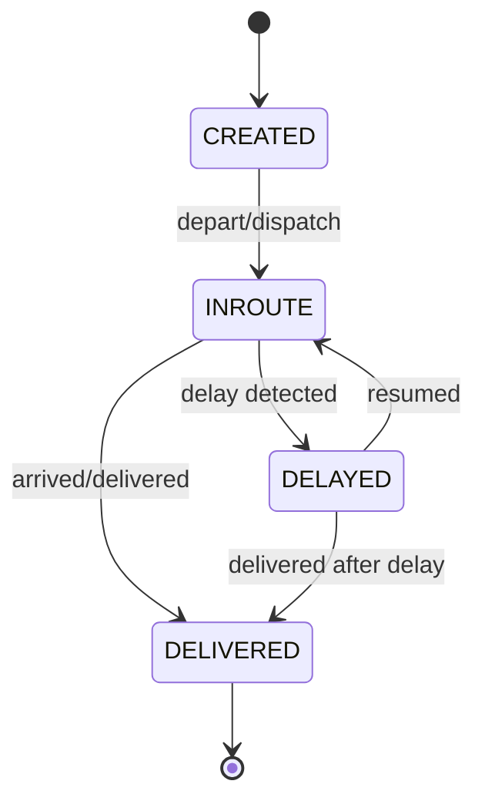

# Diagram: partview_core/partview_service/partview_service/api/package_container/helpers/PackageContainerHelper.py

> Auto-generated by Obscura crawlers

## Diagram 1

```mermaid
classDiagram
    class PackageContainerHelper {
        - __crud_adapter
        - __search_query_adapter
        - __container_type
        - __entity_type_adapter
        - __lifecycle_state_helper
        - __event_codes_mapping
        - __system_config
        + get_system_config()
        + get_container_type(container_type_name, solution_id)
        + get_container_type_name(container_type_id)
        + get_entity_type(entity_type_name)
        + get_container_by_external_id(external_id, solution_id)
        + get_full_container_by_external_id(external_id, solution_id, create_if_not_found=False)
        + get_full_package_container_by_external_id(external_id)
        + get_full_container_by_external_id_event(external_id, package_container_handler, create_if_not_found=False)
        + get_full_container_by_primary_id(container_uuid)
        + update_container(container)
        + convert_container_external_id_list_to_uuid(solution_id, container_tracking_numbers)
        + check_planned_destination_needs_reset(containers, new_destination_trip_leg)
        + check_planned_origin_needs_reset(containers, new_planned_origin_trip_leg)
        + check_actual_origin_needs_reset(containers, actual_origin_trip_leg)
        + check_actual_destination_needs_reset(containers, new_destination_trip_leg)
        + get_trip_detail(trip_leg_destination)
        + get_milestone_codes(solution_id)
        + create_lifecycle_state(package_container_list, changed_by, reason=None)
        + set_lifecycle_state(package_container, new_state, changed_by, changed_event_id, reason="", allow_duplicates=False)
        + check_backorder_parts(event, package_container_business_list, solution_id)
        + get_backorder_part_list(solution_id)
    }
    class PackageContainerPostgresqlMapping {
        + search(...)
        + read(...)
        + write(...)
        + update(...)
    }
    class PackageContainerSearchPostgressMapping {
        + check_od_needs_reset(...)
        + search(...)
    }
    class PackageContainerTypePostgressMapping {
        + search(...)
    }
    class EntityTypePostgressMapping {
        + search(...)
    }
    class FVLifecycleStateMachine {
        + write_batch(...)
        + change_lifecycle(...)
    }
    class PackageContainerEventCodeLookupPostgresqlMapping {
        + get_event_codes(solution_id, source_type)
    }
    class PackageContainer {
        + id
        + tracking_number
        + solution_id
        + lifecycle_state
        + destination_eta
        + owner_org_fv_id
        + set(...)
        + reset_field(...)
        + get_parts()
        + has_valid_destination()
    }
    class TripLeg {
        + id
        + sequence_number
        + window
        + scheduled_destination_delivery_window
        + scheduled_origin_pickup_window
        + code
        + tracking_number
    }
    class PackageContainerLifecycleHistory {
        + set(...)
    }
    class BackorderPartPostgressMapping {
        + search(...)
    }
    class BackorderPart {
        + external_id
        + solution_id
    }
    class InvokeContainerEvent {
        + post_container_event(event, owner_org_fv_id, container_id, code)
    }

    PackageContainerHelper --> PackageContainerPostgresqlMapping : uses
    PackageContainerHelper --> PackageContainerSearchPostgressMapping : uses
    PackageContainerHelper --> PackageContainerTypePostgressMapping : uses
    PackageContainerHelper --> EntityTypePostgressMapping : uses
    PackageContainerHelper --> FVLifecycleStateMachine : uses
    PackageContainerHelper --> PackageContainerEventCodeLookupPostgresqlMapping : uses
    PackageContainerHelper --> BackorderPartPostgressMapping : uses
    PackageContainerHelper --> InvokeContainerEvent : uses
    PackageContainerHelper --> PackageContainer : manipulates
    PackageContainerHelper --> TripLeg : reads
    PackageContainerHelper --> PackageContainerLifecycleHistory : creates
```

### SVG

<svg id="container" width="4322.046875" xmlns="http://www.w3.org/2000/svg" class="classDiagram" height="1194" viewBox="0 0 4322.046875 1194" role="graphics-document document" aria-roledescription="class"><g><defs><marker id="container_class-aggregationStart" class="marker aggregation class" refX="18" refY="7" markerWidth="190" markerHeight="240" orient="auto"><path d="M 18,7 L9,13 L1,7 L9,1 Z"></path></marker></defs><defs><marker id="container_class-aggregationEnd" class="marker aggregation class" refX="1" refY="7" markerWidth="20" markerHeight="28" orient="auto"><path d="M 18,7 L9,13 L1,7 L9,1 Z"></path></marker></defs><defs><marker id="container_class-extensionStart" class="marker extension class" refX="18" refY="7" markerWidth="190" markerHeight="240" orient="auto"><path d="M 1,7 L18,13 V 1 Z"></path></marker></defs><defs><marker id="container_class-extensionEnd" class="marker extension class" refX="1" refY="7" markerWidth="20" markerHeight="28" orient="auto"><path d="M 1,1 V 13 L18,7 Z"></path></marker></defs><defs><marker id="container_class-compositionStart" class="marker composition class" refX="18" refY="7" markerWidth="190" markerHeight="240" orient="auto"><path d="M 18,7 L9,13 L1,7 L9,1 Z"></path></marker></defs><defs><marker id="container_class-compositionEnd" class="marker composition class" refX="1" refY="7" markerWidth="20" markerHeight="28" orient="auto"><path d="M 18,7 L9,13 L1,7 L9,1 Z"></path></marker></defs><defs><marker id="container_class-dependencyStart" class="marker dependency class" refX="6" refY="7" markerWidth="190" markerHeight="240" orient="auto"><path d="M 5,7 L9,13 L1,7 L9,1 Z"></path></marker></defs><defs><marker id="container_class-dependencyEnd" class="marker dependency class" refX="13" refY="7" markerWidth="20" markerHeight="28" orient="auto"><path d="M 18,7 L9,13 L14,7 L9,1 Z"></path></marker></defs><defs><marker id="container_class-lollipopStart" class="marker lollipop class" refX="13" refY="7" markerWidth="190" markerHeight="240" orient="auto"><circle stroke="black" fill="transparent" cx="7" cy="7" r="6"></circle></marker></defs><defs><marker id="container_class-lollipopEnd" class="marker lollipop class" refX="1" refY="7" markerWidth="190" markerHeight="240" orient="auto"><circle stroke="black" fill="transparent" cx="7" cy="7" r="6"></circle></marker></defs><g class="root"><g class="clusters"></g><g class="edgePaths"><path d="M1548.199,500.911L1316.141,552.925C1084.083,604.94,619.967,708.97,387.91,777.652C155.852,846.333,155.852,879.667,155.852,896.333L155.852,913" id="id_PackageContainerHelper_PackageContainerPostgresqlMapping_1" class="edge-thickness-normal edge-pattern-solid relation" style=";;;" data-edge="true" data-et="edge" data-id="id_PackageContainerHelper_PackageContainerPostgresqlMapping_1" data-points="W3sieCI6MTU0OC4xOTkyMTg3NSwieSI6NTAwLjkxMDU0NDA4MTE1OTg2fSx7IngiOjE1NS44NTE1NjI1LCJ5Ijo4MTN9LHsieCI6MTU1Ljg1MTU2MjUsInkiOjkxOX1d" marker-end="url(#container_class-dependencyEnd)"></path><path d="M1548.199,529.27L1380.814,576.558C1213.428,623.847,878.658,718.423,711.272,786.378C543.887,854.333,543.887,895.667,543.887,916.333L543.887,937" id="id_PackageContainerHelper_PackageContainerSearchPostgressMapping_2" class="edge-thickness-normal edge-pattern-solid relation" style=";;;" data-edge="true" data-et="edge" data-id="id_PackageContainerHelper_PackageContainerSearchPostgressMapping_2" data-points="W3sieCI6MTU0OC4xOTkyMTg3NSwieSI6NTI5LjI2OTg0NTc2MzQ3Nn0seyJ4Ijo1NDMuODg2NzE4NzUsInkiOjgxM30seyJ4Ijo1NDMuODg2NzE4NzUsInkiOjk0M31d" marker-end="url(#container_class-dependencyEnd)"></path><path d="M1548.199,579.98L1447.814,618.817C1347.43,657.653,1146.66,735.327,1046.275,796.83C945.891,858.333,945.891,903.667,945.891,926.333L945.891,949" id="id_PackageContainerHelper_PackageContainerTypePostgressMapping_3" class="edge-thickness-normal edge-pattern-solid relation" style=";;;" data-edge="true" data-et="edge" data-id="id_PackageContainerHelper_PackageContainerTypePostgressMapping_3" data-points="W3sieCI6MTU0OC4xOTkyMTg3NSwieSI6NTc5Ljk4MDI0MjU4ODI3ODN9LHsieCI6OTQ1Ljg5MDYyNSwieSI6ODEzfSx7IngiOjk0NS44OTA2MjUsInkiOjk1NX1d" marker-end="url(#container_class-dependencyEnd)"></path><path d="M1548.199,661.608L1502.726,686.84C1457.253,712.072,1366.306,762.536,1320.833,810.435C1275.359,858.333,1275.359,903.667,1275.359,926.333L1275.359,949" id="id_PackageContainerHelper_EntityTypePostgressMapping_4" class="edge-thickness-normal edge-pattern-solid relation" style=";;;" data-edge="true" data-et="edge" data-id="id_PackageContainerHelper_EntityTypePostgressMapping_4" data-points="W3sieCI6MTU0OC4xOTkyMTg3NSwieSI6NjYxLjYwODE5NjI1NzExMTJ9LHsieCI6MTI3NS4zNTkzNzUsInkiOjgxM30seyJ4IjoxMjc1LjM1OTM3NSwieSI6OTU1fV0=" marker-end="url(#container_class-dependencyEnd)"></path><path d="M1617.008,776L1610.31,782.167C1603.612,788.333,1590.216,800.667,1583.518,827.5C1576.82,854.333,1576.82,895.667,1576.82,916.333L1576.82,937" id="id_PackageContainerHelper_FVLifecycleStateMachine_5" class="edge-thickness-normal edge-pattern-solid relation" style=";;;" data-edge="true" data-et="edge" data-id="id_PackageContainerHelper_FVLifecycleStateMachine_5" data-points="W3sieCI6MTYxNy4wMDc4OTYwMDY1MzIsInkiOjc3Nn0seyJ4IjoxNTc2LjgyMDMxMjUsInkiOjgxM30seyJ4IjoxNTc2LjgyMDMxMjUsInkiOjk0M31d" marker-end="url(#container_class-dependencyEnd)"></path><path d="M2034.09,776L2034.09,782.167C2034.09,788.333,2034.09,800.667,2034.09,829.5C2034.09,858.333,2034.09,903.667,2034.09,926.333L2034.09,949" id="id_PackageContainerHelper_PackageContainerEventCodeLookupPostgresqlMapping_6" class="edge-thickness-normal edge-pattern-solid relation" style=";;;" data-edge="true" data-et="edge" data-id="id_PackageContainerHelper_PackageContainerEventCodeLookupPostgresqlMapping_6" data-points="W3sieCI6MjAzNC4wODk4NDM3NSwieSI6Nzc2fSx7IngiOjIwMzQuMDg5ODQzNzUsInkiOjgxM30seyJ4IjoyMDM0LjA4OTg0Mzc1LCJ5Ijo5NTV9XQ==" marker-end="url(#container_class-dependencyEnd)"></path><path d="M2449.177,776L2455.842,782.167C2462.508,788.333,2475.84,800.667,2482.506,829.5C2489.172,858.333,2489.172,903.667,2489.172,926.333L2489.172,949" id="id_PackageContainerHelper_BackorderPartPostgressMapping_7" class="edge-thickness-normal edge-pattern-solid relation" style=";;;" data-edge="true" data-et="edge" data-id="id_PackageContainerHelper_BackorderPartPostgressMapping_7" data-points="W3sieCI6MjQ0OS4xNzY1NDIwODcyOTIsInkiOjc3Nn0seyJ4IjoyNDg5LjE3MTg3NSwieSI6ODEzfSx7IngiOjI0ODkuMTcxODc1LCJ5Ijo5NTV9XQ==" marker-end="url(#container_class-dependencyEnd)"></path><path d="M2519.98,611.358L2594.422,644.965C2668.863,678.572,2817.746,745.786,2892.188,802.06C2966.629,858.333,2966.629,903.667,2966.629,926.333L2966.629,949" id="id_PackageContainerHelper_InvokeContainerEvent_8" class="edge-thickness-normal edge-pattern-solid relation" style=";;;" data-edge="true" data-et="edge" data-id="id_PackageContainerHelper_InvokeContainerEvent_8" data-points="W3sieCI6MjUxOS45ODA0Njg3NSwieSI6NjExLjM1ODA1MzAzMDYyMDN9LHsieCI6Mjk2Ni42Mjg5MDYyNSwieSI6ODEzfSx7IngiOjI5NjYuNjI4OTA2MjUsInkiOjk1NX1d" marker-end="url(#container_class-dependencyEnd)"></path><path d="M2519.98,536.679L2674.646,582.733C2829.313,628.786,3138.645,720.893,3293.311,772.113C3447.977,823.333,3447.977,833.667,3447.977,838.833L3447.977,844" id="id_PackageContainerHelper_PackageContainer_9" class="edge-thickness-normal edge-pattern-solid relation" style=";;;" data-edge="true" data-et="edge" data-id="id_PackageContainerHelper_PackageContainer_9" data-points="W3sieCI6MjUxOS45ODA0Njg3NSwieSI6NTM2LjY3OTE2NzI5OTgwMjR9LHsieCI6MzQ0Ny45NzY1NjI1LCJ5Ijo4MTN9LHsieCI6MzQ0Ny45NzY1NjI1LCJ5Ijo4NTB9XQ==" marker-end="url(#container_class-dependencyEnd)"></path><path d="M2519.98,507.001L2735.461,558C2950.941,609,3381.902,711,3597.383,773.167C3812.863,835.333,3812.863,857.667,3812.863,868.833L3812.863,880" id="id_PackageContainerHelper_TripLeg_10" class="edge-thickness-normal edge-pattern-solid relation" style=";;;" data-edge="true" data-et="edge" data-id="id_PackageContainerHelper_TripLeg_10" data-points="W3sieCI6MjUxOS45ODA0Njg3NSwieSI6NTA3LjAwMDU2NjU3NzIxNDg0fSx7IngiOjM4MTIuODYzMjgxMjUsInkiOjgxM30seyJ4IjozODEyLjg2MzI4MTI1LCJ5Ijo4ODZ9XQ==" marker-end="url(#container_class-dependencyEnd)"></path><path d="M2519.98,487.408L2796.34,541.673C3072.701,595.939,3625.421,704.469,3901.781,781.401C4178.141,858.333,4178.141,903.667,4178.141,926.333L4178.141,949" id="id_PackageContainerHelper_PackageContainerLifecycleHistory_11" class="edge-thickness-normal edge-pattern-solid relation" style=";;;" data-edge="true" data-et="edge" data-id="id_PackageContainerHelper_PackageContainerLifecycleHistory_11" data-points="W3sieCI6MjUxOS45ODA0Njg3NSwieSI6NDg3LjQwODE2NjEyODI5NDd9LHsieCI6NDE3OC4xNDA2MjUsInkiOjgxM30seyJ4Ijo0MTc4LjE0MDYyNSwieSI6OTU1fV0=" marker-end="url(#container_class-dependencyEnd)"></path></g><g class="edgeLabels"><g class="edgeLabel" transform="translate(155.8515625, 813)"><g class="label" data-id="id_PackageContainerHelper_PackageContainerPostgresqlMapping_1" transform="translate(-16.4921875, -12)"><foreignObject width="32.984375" height="24">

uses

</foreignObject></g></g><g class="edgeLabel" transform="translate(543.88671875, 813)"><g class="label" data-id="id_PackageContainerHelper_PackageContainerSearchPostgressMapping_2" transform="translate(-16.4921875, -12)"><foreignObject width="32.984375" height="24">

uses

</foreignObject></g></g><g class="edgeLabel" transform="translate(945.890625, 813)"><g class="label" data-id="id_PackageContainerHelper_PackageContainerTypePostgressMapping_3" transform="translate(-16.4921875, -12)"><foreignObject width="32.984375" height="24">

uses

</foreignObject></g></g><g class="edgeLabel" transform="translate(1275.359375, 813)"><g class="label" data-id="id_PackageContainerHelper_EntityTypePostgressMapping_4" transform="translate(-16.4921875, -12)"><foreignObject width="32.984375" height="24">

uses

</foreignObject></g></g><g class="edgeLabel" transform="translate(1576.8203125, 813)"><g class="label" data-id="id_PackageContainerHelper_FVLifecycleStateMachine_5" transform="translate(-16.4921875, -12)"><foreignObject width="32.984375" height="24">

uses

</foreignObject></g></g><g class="edgeLabel" transform="translate(2034.08984375, 813)"><g class="label" data-id="id_PackageContainerHelper_PackageContainerEventCodeLookupPostgresqlMapping_6" transform="translate(-16.4921875, -12)"><foreignObject width="32.984375" height="24">

uses

</foreignObject></g></g><g class="edgeLabel" transform="translate(2489.171875, 813)"><g class="label" data-id="id_PackageContainerHelper_BackorderPartPostgressMapping_7" transform="translate(-16.4921875, -12)"><foreignObject width="32.984375" height="24">

uses

</foreignObject></g></g><g class="edgeLabel" transform="translate(2966.62890625, 813)"><g class="label" data-id="id_PackageContainerHelper_InvokeContainerEvent_8" transform="translate(-16.4921875, -12)"><foreignObject width="32.984375" height="24">

uses

</foreignObject></g></g><g class="edgeLabel" transform="translate(3447.9765625, 813)"><g class="label" data-id="id_PackageContainerHelper_PackageContainer_9" transform="translate(-45.0859375, -12)"><foreignObject width="90.171875" height="24">

manipulates

</foreignObject></g></g><g class="edgeLabel" transform="translate(3812.86328125, 813)"><g class="label" data-id="id_PackageContainerHelper_TripLeg_10" transform="translate(-20.0078125, -12)"><foreignObject width="40.015625" height="24">

reads

</foreignObject></g></g><g class="edgeLabel" transform="translate(4178.140625, 813)"><g class="label" data-id="id_PackageContainerHelper_PackageContainerLifecycleHistory_11" transform="translate(-26.171875, -12)"><foreignObject width="52.34375" height="24">

creates

</foreignObject></g></g></g><g class="nodes"><g class="node default" id="classId-PackageContainerHelper-0" transform="translate(2034.08984375, 392)"><g class="basic label-container"><path d="M-485.890625 -384 L485.890625 -384 L485.890625 384 L-485.890625 384" stroke="none" stroke-width="0" fill="#ECECFF" style=""></path><path d="M-485.890625 -384 C-106.95854713386296 -384, 271.97353073227407 -384, 485.890625 -384 M-485.890625 -384 C-126.34816383924988 -384, 233.19429732150024 -384, 485.890625 -384 M485.890625 -384 C485.890625 -217.17747173221676, 485.890625 -50.35494346443352, 485.890625 384 M485.890625 -384 C485.890625 -150.85193410401843, 485.890625 82.29613179196315, 485.890625 384 M485.890625 384 C178.7533392832159 384, -128.3839464335682 384, -485.890625 384 M485.890625 384 C142.2812148578505 384, -201.328195284299 384, -485.890625 384 M-485.890625 384 C-485.890625 104.57313598645771, -485.890625 -174.85372802708457, -485.890625 -384 M-485.890625 384 C-485.890625 185.87474798136614, -485.890625 -12.250504037267717, -485.890625 -384" stroke="#9370DB" stroke-width="1.3" fill="none" stroke-dasharray="0 0" style=""></path></g><g class="annotation-group text" transform="translate(0, -360)"></g><g class="label-group text" transform="translate(-89.96875, -360)"><g class="label" style="font-weight: bolder" transform="translate(0,-12)"><foreignObject width="179.9375" height="24">

PackageContainerHelper

</foreignObject></g></g><g class="members-group text" transform="translate(-473.890625, -312)"><g class="label" style="" transform="translate(0,-12)"><foreignObject width="124.46875" height="24">

- __crud_adapter

</foreignObject></g><g class="label" style="" transform="translate(0,12)"><foreignObject width="188.71875" height="24">

- __search_query_adapter

</foreignObject></g><g class="label" style="" transform="translate(0,36)"><foreignObject width="134.5625" height="24">

- __container_type

</foreignObject></g><g class="label" style="" transform="translate(0,60)"><foreignObject width="172.71875" height="24">

- __entity_type_adapter

</foreignObject></g><g class="label" style="" transform="translate(0,84)"><foreignObject width="185.84375" height="24">

- __lifecycle_state_helper

</foreignObject></g><g class="label" style="" transform="translate(0,108)"><foreignObject width="189.25" height="24">

- __event_codes_mapping

</foreignObject></g><g class="label" style="" transform="translate(0,132)"><foreignObject width="129.140625" height="24">

- __system_config

</foreignObject></g></g><g class="methods-group text" transform="translate(-473.890625, -120)"><g class="label" style="" transform="translate(0,-12)"><foreignObject width="155.453125" height="24">

+ get_system_config()

</foreignObject></g><g class="label" style="" transform="translate(0,12)"><foreignObject width="407.234375" height="24">

+ get_container_type(container_type_name, solution_id)

</foreignObject></g><g class="label" style="" transform="translate(0,36)"><foreignObject width="339.171875" height="24">

+ get_container_type_name(container_type_id)

</foreignObject></g><g class="label" style="" transform="translate(0,60)"><foreignObject width="264.203125" height="24">

+ get_entity_type(entity_type_name)

</foreignObject></g><g class="label" style="" transform="translate(0,84)"><foreignObject width="408.09375" height="24">

+ get_container_by_external_id(external_id, solution_id)

</foreignObject></g><g class="label" style="" transform="translate(0,108)"><foreignObject width="638.40625" height="24">

+ get_full_container_by_external_id(external_id, solution_id, create_if_not_found=False)

</foreignObject></g><g class="label" style="" transform="translate(0,132)"><foreignObject width="416.8125" height="24">

+ get_full_package_container_by_external_id(external_id)

</foreignObject></g><g class="label" style="" transform="translate(0,156)"><foreignObject width="802.671875" height="24">

+ get_full_container_by_external_id_event(external_id, package_container_handler, create_if_not_found=False)

</foreignObject></g><g class="label" style="" transform="translate(0,180)"><foreignObject width="373.796875" height="24">

+ get_full_container_by_primary_id(container_uuid)

</foreignObject></g><g class="label" style="" transform="translate(0,204)"><foreignObject width="220.03125" height="24">

+ update_container(container)

</foreignObject></g><g class="label" style="" transform="translate(0,228)"><foreignObject width="633.375" height="24">

+ convert_container_external_id_list_to_uuid(solution_id, container_tracking_numbers)

</foreignObject></g><g class="label" style="" transform="translate(0,252)"><foreignObject width="588.40625" height="24">

+ check_planned_destination_needs_reset(containers, new_destination_trip_leg)

</foreignObject></g><g class="label" style="" transform="translate(0,276)"><foreignObject width="574.796875" height="24">

+ check_planned_origin_needs_reset(containers, new_planned_origin_trip_leg)

</foreignObject></g><g class="label" style="" transform="translate(0,300)"><foreignObject width="506.53125" height="24">

+ check_actual_origin_needs_reset(containers, actual_origin_trip_leg)

</foreignObject></g><g class="label" style="" transform="translate(0,324)"><foreignObject width="572.90625" height="24">

+ check_actual_destination_needs_reset(containers, new_destination_trip_leg)

</foreignObject></g><g class="label" style="" transform="translate(0,348)"><foreignObject width="275.328125" height="24">

+ get_trip_detail(trip_leg_destination)

</foreignObject></g><g class="label" style="" transform="translate(0,372)"><foreignObject width="257.8125" height="24">

+ get_milestone_codes(solution_id)

</foreignObject></g><g class="label" style="" transform="translate(0,396)"><foreignObject width="542.171875" height="24">

+ create_lifecycle_state(package_container_list, changed_by, reason=None)

</foreignObject></g><g class="label" style="" transform="translate(0,420)"><foreignObject width="857.8125" height="24">

+ set_lifecycle_state(package_container, new_state, changed_by, changed_event_id, reason="", allow_duplicates=False)

</foreignObject></g><g class="label" style="" transform="translate(0,444)"><foreignObject width="565.984375" height="24">

+ check_backorder_parts(event, package_container_business_list, solution_id)

</foreignObject></g><g class="label" style="" transform="translate(0,468)"><foreignObject width="276.59375" height="24">

+ get_backorder_part_list(solution_id)

</foreignObject></g></g><g class="divider" style=""><path d="M-485.890625 -336 C-113.61651366524484 -336, 258.6575976695103 -336, 485.890625 -336 M-485.890625 -336 C-169.89839610973314 -336, 146.09383278053372 -336, 485.890625 -336" stroke="#9370DB" stroke-width="1.3" fill="none" stroke-dasharray="0 0" style=""></path></g><g class="divider" style=""><path d="M-485.890625 -144 C-224.23085552238524 -144, 37.42891395522952 -144, 485.890625 -144 M-485.890625 -144 C-280.49281998415915 -144, -75.09501496831825 -144, 485.890625 -144" stroke="#9370DB" stroke-width="1.3" fill="none" stroke-dasharray="0 0" style=""></path></g></g><g class="node default" id="classId-PackageContainerPostgresqlMapping-1" transform="translate(155.8515625, 1018)"><g class="basic label-container"><path d="M-147.8515625 -99 L147.8515625 -99 L147.8515625 99 L-147.8515625 99" stroke="none" stroke-width="0" fill="#ECECFF" style=""></path><path d="M-147.8515625 -99 C-82.1414993540865 -99, -16.43143620817301 -99, 147.8515625 -99 M-147.8515625 -99 C-76.63332084122882 -99, -5.415079182457646 -99, 147.8515625 -99 M147.8515625 -99 C147.8515625 -38.396452944115, 147.8515625 22.207094111770004, 147.8515625 99 M147.8515625 -99 C147.8515625 -32.8745944159147, 147.8515625 33.2508111681706, 147.8515625 99 M147.8515625 99 C63.500726467638955 99, -20.85010956472209 99, -147.8515625 99 M147.8515625 99 C57.67003980399036 99, -32.51148289201927 99, -147.8515625 99 M-147.8515625 99 C-147.8515625 57.96846178681955, -147.8515625 16.936923573639106, -147.8515625 -99 M-147.8515625 99 C-147.8515625 22.529346480628192, -147.8515625 -53.941307038743616, -147.8515625 -99" stroke="#9370DB" stroke-width="1.3" fill="none" stroke-dasharray="0 0" style=""></path></g><g class="annotation-group text" transform="translate(0, -75)"></g><g class="label-group text" transform="translate(-135.8515625, -75)"><g class="label" style="font-weight: bolder" transform="translate(0,-12)"><foreignObject width="271.703125" height="24">

PackageContainerPostgresqlMapping

</foreignObject></g></g><g class="members-group text" transform="translate(-135.8515625, -27)"></g><g class="methods-group text" transform="translate(-135.8515625, 3)"><g class="label" style="" transform="translate(0,-12)"><foreignObject width="81.578125" height="24">

+ search(...)

</foreignObject></g><g class="label" style="" transform="translate(0,12)"><foreignObject width="66.640625" height="24">

+ read(...)

</foreignObject></g><g class="label" style="" transform="translate(0,36)"><foreignObject width="70.53125" height="24">

+ write(...)

</foreignObject></g><g class="label" style="" transform="translate(0,60)"><foreignObject width="85.46875" height="24">

+ update(...)

</foreignObject></g></g><g class="divider" style=""><path d="M-147.8515625 -51 C-38.3151629999127 -51, 71.2212365001746 -51, 147.8515625 -51 M-147.8515625 -51 C-62.099187991889494 -51, 23.653186516221012 -51, 147.8515625 -51" stroke="#9370DB" stroke-width="1.3" fill="none" stroke-dasharray="0 0" style=""></path></g><g class="divider" style=""><path d="M-147.8515625 -27 C-52.17274331738666 -27, 43.50607586522668 -27, 147.8515625 -27 M-147.8515625 -27 C-42.66965558908716 -27, 62.51225132182569 -27, 147.8515625 -27" stroke="#9370DB" stroke-width="1.3" fill="none" stroke-dasharray="0 0" style=""></path></g></g><g class="node default" id="classId-PackageContainerSearchPostgressMapping-2" transform="translate(543.88671875, 1018)"><g class="basic label-container"><path d="M-190.18359375 -75 L190.18359375 -75 L190.18359375 75 L-190.18359375 75" stroke="none" stroke-width="0" fill="#ECECFF" style=""></path><path d="M-190.18359375 -75 C-74.19603021796003 -75, 41.79153331407994 -75, 190.18359375 -75 M-190.18359375 -75 C-102.31585730300793 -75, -14.448120856015862 -75, 190.18359375 -75 M190.18359375 -75 C190.18359375 -15.391629419538013, 190.18359375 44.21674116092397, 190.18359375 75 M190.18359375 -75 C190.18359375 -36.21953404773386, 190.18359375 2.560931904532282, 190.18359375 75 M190.18359375 75 C76.32204581409576 75, -37.53950212180848 75, -190.18359375 75 M190.18359375 75 C38.43128409753626 75, -113.32102555492747 75, -190.18359375 75 M-190.18359375 75 C-190.18359375 28.4302745271998, -190.18359375 -18.1394509456004, -190.18359375 -75 M-190.18359375 75 C-190.18359375 19.566698514983628, -190.18359375 -35.866602970032744, -190.18359375 -75" stroke="#9370DB" stroke-width="1.3" fill="none" stroke-dasharray="0 0" style=""></path></g><g class="annotation-group text" transform="translate(0, -51)"></g><g class="label-group text" transform="translate(-157.1953125, -51)"><g class="label" style="font-weight: bolder" transform="translate(0,-12)"><foreignObject width="314.390625" height="24">

PackageContainerSearchPostgressMapping

</foreignObject></g></g><g class="members-group text" transform="translate(-178.18359375, -3)"></g><g class="methods-group text" transform="translate(-178.18359375, 27)"><g class="label" style="" transform="translate(0,-12)"><foreignObject width="199.171875" height="24">

+ check_od_needs_reset(...)

</foreignObject></g><g class="label" style="" transform="translate(0,12)"><foreignObject width="81.578125" height="24">

+ search(...)

</foreignObject></g></g><g class="divider" style=""><path d="M-190.18359375 -27 C-56.11683567165164 -27, 77.94992240669671 -27, 190.18359375 -27 M-190.18359375 -27 C-83.48394608227333 -27, 23.21570158545333 -27, 190.18359375 -27" stroke="#9370DB" stroke-width="1.3" fill="none" stroke-dasharray="0 0" style=""></path></g><g class="divider" style=""><path d="M-190.18359375 -3 C-75.43051567822073 -3, 39.32256239355854 -3, 190.18359375 -3 M-190.18359375 -3 C-98.13980495593158 -3, -6.096016161863162 -3, 190.18359375 -3" stroke="#9370DB" stroke-width="1.3" fill="none" stroke-dasharray="0 0" style=""></path></g></g><g class="node default" id="classId-PackageContainerTypePostgressMapping-3" transform="translate(945.890625, 1018)"><g class="basic label-container"><path d="M-161.8203125 -63 L161.8203125 -63 L161.8203125 63 L-161.8203125 63" stroke="none" stroke-width="0" fill="#ECECFF" style=""></path><path d="M-161.8203125 -63 C-59.24938722421466 -63, 43.321538051570684 -63, 161.8203125 -63 M-161.8203125 -63 C-58.477116514443296 -63, 44.86607947111341 -63, 161.8203125 -63 M161.8203125 -63 C161.8203125 -29.575077374075256, 161.8203125 3.8498452518494872, 161.8203125 63 M161.8203125 -63 C161.8203125 -30.58827973824581, 161.8203125 1.8234405235083813, 161.8203125 63 M161.8203125 63 C68.1543551218968 63, -25.5116022562064 63, -161.8203125 63 M161.8203125 63 C74.85438795341639 63, -12.111536593167216 63, -161.8203125 63 M-161.8203125 63 C-161.8203125 36.89819413711278, -161.8203125 10.796388274225563, -161.8203125 -63 M-161.8203125 63 C-161.8203125 25.014367120054224, -161.8203125 -12.971265759891551, -161.8203125 -63" stroke="#9370DB" stroke-width="1.3" fill="none" stroke-dasharray="0 0" style=""></path></g><g class="annotation-group text" transform="translate(0, -39)"></g><g class="label-group text" transform="translate(-149.8203125, -39)"><g class="label" style="font-weight: bolder" transform="translate(0,-12)"><foreignObject width="299.640625" height="24">

PackageContainerTypePostgressMapping

</foreignObject></g></g><g class="members-group text" transform="translate(-149.8203125, 9)"></g><g class="methods-group text" transform="translate(-149.8203125, 39)"><g class="label" style="" transform="translate(0,-12)"><foreignObject width="81.578125" height="24">

+ search(...)

</foreignObject></g></g><g class="divider" style=""><path d="M-161.8203125 -15 C-72.02333973148444 -15, 17.773633037031118 -15, 161.8203125 -15 M-161.8203125 -15 C-46.685840814926394 -15, 68.44863087014721 -15, 161.8203125 -15" stroke="#9370DB" stroke-width="1.3" fill="none" stroke-dasharray="0 0" style=""></path></g><g class="divider" style=""><path d="M-161.8203125 9 C-36.31242421454483 9, 89.19546407091033 9, 161.8203125 9 M-161.8203125 9 C-45.32757395691897 9, 71.16516458616206 9, 161.8203125 9" stroke="#9370DB" stroke-width="1.3" fill="none" stroke-dasharray="0 0" style=""></path></g></g><g class="node default" id="classId-EntityTypePostgressMapping-4" transform="translate(1275.359375, 1018)"><g class="basic label-container"><path d="M-117.6484375 -63 L117.6484375 -63 L117.6484375 63 L-117.6484375 63" stroke="none" stroke-width="0" fill="#ECECFF" style=""></path><path d="M-117.6484375 -63 C-60.714383542854705 -63, -3.78032958570941 -63, 117.6484375 -63 M-117.6484375 -63 C-41.114043874520846 -63, 35.42034975095831 -63, 117.6484375 -63 M117.6484375 -63 C117.6484375 -31.835595431569654, 117.6484375 -0.6711908631393086, 117.6484375 63 M117.6484375 -63 C117.6484375 -17.37678055156124, 117.6484375 28.24643889687752, 117.6484375 63 M117.6484375 63 C26.388890087799425 63, -64.87065732440115 63, -117.6484375 63 M117.6484375 63 C33.55070363692607 63, -50.547030226147854 63, -117.6484375 63 M-117.6484375 63 C-117.6484375 22.424488738141235, -117.6484375 -18.15102252371753, -117.6484375 -63 M-117.6484375 63 C-117.6484375 26.05930901468573, -117.6484375 -10.881381970628539, -117.6484375 -63" stroke="#9370DB" stroke-width="1.3" fill="none" stroke-dasharray="0 0" style=""></path></g><g class="annotation-group text" transform="translate(0, -39)"></g><g class="label-group text" transform="translate(-105.6484375, -39)"><g class="label" style="font-weight: bolder" transform="translate(0,-12)"><foreignObject width="211.296875" height="24">

EntityTypePostgressMapping

</foreignObject></g></g><g class="members-group text" transform="translate(-105.6484375, 9)"></g><g class="methods-group text" transform="translate(-105.6484375, 39)"><g class="label" style="" transform="translate(0,-12)"><foreignObject width="81.578125" height="24">

+ search(...)

</foreignObject></g></g><g class="divider" style=""><path d="M-117.6484375 -15 C-56.2339223356649 -15, 5.1805928286702 -15, 117.6484375 -15 M-117.6484375 -15 C-29.503470552087464 -15, 58.64149639582507 -15, 117.6484375 -15" stroke="#9370DB" stroke-width="1.3" fill="none" stroke-dasharray="0 0" style=""></path></g><g class="divider" style=""><path d="M-117.6484375 9 C-70.29962435035252 9, -22.950811200705033 9, 117.6484375 9 M-117.6484375 9 C-23.91041571515612 9, 69.82760606968776 9, 117.6484375 9" stroke="#9370DB" stroke-width="1.3" fill="none" stroke-dasharray="0 0" style=""></path></g></g><g class="node default" id="classId-FVLifecycleStateMachine-5" transform="translate(1576.8203125, 1018)"><g class="basic label-container"><path d="M-133.8125 -75 L133.8125 -75 L133.8125 75 L-133.8125 75" stroke="none" stroke-width="0" fill="#ECECFF" style=""></path><path d="M-133.8125 -75 C-73.5379434649505 -75, -13.263386929901017 -75, 133.8125 -75 M-133.8125 -75 C-35.22783771422927 -75, 63.356824571541466 -75, 133.8125 -75 M133.8125 -75 C133.8125 -24.15433839938752, 133.8125 26.69132320122496, 133.8125 75 M133.8125 -75 C133.8125 -18.073741743369744, 133.8125 38.85251651326051, 133.8125 75 M133.8125 75 C44.81135987052352 75, -44.189780258952965 75, -133.8125 75 M133.8125 75 C44.3714816994908 75, -45.0695366010184 75, -133.8125 75 M-133.8125 75 C-133.8125 16.356529806914928, -133.8125 -42.286940386170144, -133.8125 -75 M-133.8125 75 C-133.8125 29.62270041608801, -133.8125 -15.754599167823983, -133.8125 -75" stroke="#9370DB" stroke-width="1.3" fill="none" stroke-dasharray="0 0" style=""></path></g><g class="annotation-group text" transform="translate(0, -51)"></g><g class="label-group text" transform="translate(-90.21875, -51)"><g class="label" style="font-weight: bolder" transform="translate(0,-12)"><foreignObject width="180.4375" height="24">

FVLifecycleStateMachine

</foreignObject></g></g><g class="members-group text" transform="translate(-121.8125, -3)"></g><g class="methods-group text" transform="translate(-121.8125, 27)"><g class="label" style="" transform="translate(0,-12)"><foreignObject width="119.140625" height="24">

+ write_batch(...)

</foreignObject></g><g class="label" style="" transform="translate(0,12)"><foreignObject width="153.40625" height="24">

+ change_lifecycle(...)

</foreignObject></g></g><g class="divider" style=""><path d="M-133.8125 -27 C-55.63602451476085 -27, 22.540450970478304 -27, 133.8125 -27 M-133.8125 -27 C-55.35133917945883 -27, 23.109821641082334 -27, 133.8125 -27" stroke="#9370DB" stroke-width="1.3" fill="none" stroke-dasharray="0 0" style=""></path></g><g class="divider" style=""><path d="M-133.8125 -3 C-73.7482513165144 -3, -13.684002633028811 -3, 133.8125 -3 M-133.8125 -3 C-75.4859154730114 -3, -17.15933094602282 -3, 133.8125 -3" stroke="#9370DB" stroke-width="1.3" fill="none" stroke-dasharray="0 0" style=""></path></g></g><g class="node default" id="classId-PackageContainerEventCodeLookupPostgresqlMapping-6" transform="translate(2034.08984375, 1018)"><g class="basic label-container"><path d="M-273.45703125 -63 L273.45703125 -63 L273.45703125 63 L-273.45703125 63" stroke="none" stroke-width="0" fill="#ECECFF" style=""></path><path d="M-273.45703125 -63 C-142.28029904687784 -63, -11.103566843755686 -63, 273.45703125 -63 M-273.45703125 -63 C-109.83194279088218 -63, 53.79314566823564 -63, 273.45703125 -63 M273.45703125 -63 C273.45703125 -23.7139031923898, 273.45703125 15.5721936152204, 273.45703125 63 M273.45703125 -63 C273.45703125 -13.806072372868172, 273.45703125 35.387855254263656, 273.45703125 63 M273.45703125 63 C149.23956538859613 63, 25.02209952719224 63, -273.45703125 63 M273.45703125 63 C134.76513016281 63, -3.92677092437998 63, -273.45703125 63 M-273.45703125 63 C-273.45703125 20.5911108279723, -273.45703125 -21.817778344055398, -273.45703125 -63 M-273.45703125 63 C-273.45703125 25.684170720807387, -273.45703125 -11.631658558385226, -273.45703125 -63" stroke="#9370DB" stroke-width="1.3" fill="none" stroke-dasharray="0 0" style=""></path></g><g class="annotation-group text" transform="translate(0, -39)"></g><g class="label-group text" transform="translate(-201.3359375, -39)"><g class="label" style="font-weight: bolder" transform="translate(0,-12)"><foreignObject width="402.671875" height="24">

PackageContainerEventCodeLookupPostgresqlMapping

</foreignObject></g></g><g class="members-group text" transform="translate(-261.45703125, 9)"></g><g class="methods-group text" transform="translate(-261.45703125, 39)"><g class="label" style="" transform="translate(0,-12)"><foreignObject width="321.578125" height="24">

+ get_event_codes(solution_id, source_type)

</foreignObject></g></g><g class="divider" style=""><path d="M-273.45703125 -15 C-134.73021686906958 -15, 3.9965975118608412 -15, 273.45703125 -15 M-273.45703125 -15 C-139.4876065087756 -15, -5.518181767551198 -15, 273.45703125 -15" stroke="#9370DB" stroke-width="1.3" fill="none" stroke-dasharray="0 0" style=""></path></g><g class="divider" style=""><path d="M-273.45703125 9 C-67.7337865243174 9, 137.9894582013652 9, 273.45703125 9 M-273.45703125 9 C-60.84677990962231 9, 151.76347143075537 9, 273.45703125 9" stroke="#9370DB" stroke-width="1.3" fill="none" stroke-dasharray="0 0" style=""></path></g></g><g class="node default" id="classId-PackageContainer-7" transform="translate(3447.9765625, 1018)"><g class="basic label-container"><path d="M-135.515625 -168 L135.515625 -168 L135.515625 168 L-135.515625 168" stroke="none" stroke-width="0" fill="#ECECFF" style=""></path><path d="M-135.515625 -168 C-74.66851982143083 -168, -13.821414642861654 -168, 135.515625 -168 M-135.515625 -168 C-53.67108133832494 -168, 28.173462323350122 -168, 135.515625 -168 M135.515625 -168 C135.515625 -95.99220556398434, 135.515625 -23.984411127968684, 135.515625 168 M135.515625 -168 C135.515625 -97.77810952879251, 135.515625 -27.556219057585025, 135.515625 168 M135.515625 168 C47.92553494293408 168, -39.66455511413184 168, -135.515625 168 M135.515625 168 C45.913998040994485 168, -43.68762891801103 168, -135.515625 168 M-135.515625 168 C-135.515625 43.632550112621686, -135.515625 -80.73489977475663, -135.515625 -168 M-135.515625 168 C-135.515625 53.89921817069384, -135.515625 -60.201563658612315, -135.515625 -168" stroke="#9370DB" stroke-width="1.3" fill="none" stroke-dasharray="0 0" style=""></path></g><g class="annotation-group text" transform="translate(0, -144)"></g><g class="label-group text" transform="translate(-65.453125, -144)"><g class="label" style="font-weight: bolder" transform="translate(0,-12)"><foreignObject width="130.90625" height="24">

PackageContainer

</foreignObject></g></g><g class="members-group text" transform="translate(-123.515625, -96)"><g class="label" style="" transform="translate(0,-12)"><foreignObject width="26.3125" height="24">

+ id

</foreignObject></g><g class="label" style="" transform="translate(0,12)"><foreignObject width="135.5625" height="24">

+ tracking_number

</foreignObject></g><g class="label" style="" transform="translate(0,36)"><foreignObject width="94.453125" height="24">

+ solution_id

</foreignObject></g><g class="label" style="" transform="translate(0,60)"><foreignObject width="115.875" height="24">

+ lifecycle_state

</foreignObject></g><g class="label" style="" transform="translate(0,84)"><foreignObject width="126.453125" height="24">

+ destination_eta

</foreignObject></g><g class="label" style="" transform="translate(0,108)"><foreignObject width="130.859375" height="24">

+ owner_org_fv_id

</foreignObject></g></g><g class="methods-group text" transform="translate(-123.515625, 72)"><g class="label" style="" transform="translate(0,-12)"><foreignObject width="56.09375" height="24">

+ set(...)

</foreignObject></g><g class="label" style="" transform="translate(0,12)"><foreignObject width="110.59375" height="24">

+ reset_field(...)

</foreignObject></g><g class="label" style="" transform="translate(0,36)"><foreignObject width="90.953125" height="24">

+ get_parts()

</foreignObject></g><g class="label" style="" transform="translate(0,60)"><foreignObject width="181.578125" height="24">

+ has_valid_destination()

</foreignObject></g></g><g class="divider" style=""><path d="M-135.515625 -120 C-65.26382312812497 -120, 4.9879787437500624 -120, 135.515625 -120 M-135.515625 -120 C-62.75796201210464 -120, 9.999700975790716 -120, 135.515625 -120" stroke="#9370DB" stroke-width="1.3" fill="none" stroke-dasharray="0 0" style=""></path></g><g class="divider" style=""><path d="M-135.515625 48 C-68.50668538613397 48, -1.4977457722679333 48, 135.515625 48 M-135.515625 48 C-57.64731434551682 48, 20.220996308966363 48, 135.515625 48" stroke="#9370DB" stroke-width="1.3" fill="none" stroke-dasharray="0 0" style=""></path></g></g><g class="node default" id="classId-TripLeg-8" transform="translate(3812.86328125, 1018)"><g class="basic label-container"><path d="M-179.37109375 -132 L179.37109375 -132 L179.37109375 132 L-179.37109375 132" stroke="none" stroke-width="0" fill="#ECECFF" style=""></path><path d="M-179.37109375 -132 C-43.37959555057418 -132, 92.61190264885164 -132, 179.37109375 -132 M-179.37109375 -132 C-99.42687517410977 -132, -19.482656598219535 -132, 179.37109375 -132 M179.37109375 -132 C179.37109375 -58.88130194669495, 179.37109375 14.237396106610106, 179.37109375 132 M179.37109375 -132 C179.37109375 -61.440597478580415, 179.37109375 9.11880504283917, 179.37109375 132 M179.37109375 132 C101.00741586335178 132, 22.643737976703562 132, -179.37109375 132 M179.37109375 132 C42.40256931275408 132, -94.56595512449184 132, -179.37109375 132 M-179.37109375 132 C-179.37109375 64.41452792986956, -179.37109375 -3.170944140260872, -179.37109375 -132 M-179.37109375 132 C-179.37109375 33.083622971042914, -179.37109375 -65.83275405791417, -179.37109375 -132" stroke="#9370DB" stroke-width="1.3" fill="none" stroke-dasharray="0 0" style=""></path></g><g class="annotation-group text" transform="translate(0, -108)"></g><g class="label-group text" transform="translate(-27.0546875, -108)"><g class="label" style="font-weight: bolder" transform="translate(0,-12)"><foreignObject width="54.109375" height="24">

TripLeg

</foreignObject></g></g><g class="members-group text" transform="translate(-167.37109375, -60)"><g class="label" style="" transform="translate(0,-12)"><foreignObject width="26.3125" height="24">

+ id

</foreignObject></g><g class="label" style="" transform="translate(0,12)"><foreignObject width="146.25" height="24">

+ sequence_number

</foreignObject></g><g class="label" style="" transform="translate(0,36)"><foreignObject width="67.96875" height="24">

+ window

</foreignObject></g><g class="label" style="" transform="translate(0,60)"><foreignObject width="307.6875" height="24">

+ scheduled_destination_delivery_window

</foreignObject></g><g class="label" style="" transform="translate(0,84)"><foreignObject width="257.765625" height="24">

+ scheduled_origin_pickup_window

</foreignObject></g><g class="label" style="" transform="translate(0,108)"><foreignObject width="47.1875" height="24">

+ code

</foreignObject></g><g class="label" style="" transform="translate(0,132)"><foreignObject width="135.5625" height="24">

+ tracking_number

</foreignObject></g></g><g class="methods-group text" transform="translate(-167.37109375, 132)"></g><g class="divider" style=""><path d="M-179.37109375 -84 C-41.83353008497244 -84, 95.70403358005512 -84, 179.37109375 -84 M-179.37109375 -84 C-46.87277750035034 -84, 85.62553874929932 -84, 179.37109375 -84" stroke="#9370DB" stroke-width="1.3" fill="none" stroke-dasharray="0 0" style=""></path></g><g class="divider" style=""><path d="M-179.37109375 108 C-107.167859778619 108, -34.96462580723801 108, 179.37109375 108 M-179.37109375 108 C-82.04173988962081 108, 15.287613970758372 108, 179.37109375 108" stroke="#9370DB" stroke-width="1.3" fill="none" stroke-dasharray="0 0" style=""></path></g></g><g class="node default" id="classId-PackageContainerLifecycleHistory-9" transform="translate(4178.140625, 1018)"><g class="basic label-container"><path d="M-135.90625 -63 L135.90625 -63 L135.90625 63 L-135.90625 63" stroke="none" stroke-width="0" fill="#ECECFF" style=""></path><path d="M-135.90625 -63 C-39.043589791547646 -63, 57.81907041690471 -63, 135.90625 -63 M-135.90625 -63 C-49.99087003785476 -63, 35.924509924290476 -63, 135.90625 -63 M135.90625 -63 C135.90625 -33.14988365653606, 135.90625 -3.299767313072131, 135.90625 63 M135.90625 -63 C135.90625 -34.90175217253133, 135.90625 -6.803504345062663, 135.90625 63 M135.90625 63 C56.83108901450542 63, -22.244071970989154 63, -135.90625 63 M135.90625 63 C28.813933236397162 63, -78.27838352720568 63, -135.90625 63 M-135.90625 63 C-135.90625 15.239534854562102, -135.90625 -32.520930290875796, -135.90625 -63 M-135.90625 63 C-135.90625 15.886361559619552, -135.90625 -31.227276880760897, -135.90625 -63" stroke="#9370DB" stroke-width="1.3" fill="none" stroke-dasharray="0 0" style=""></path></g><g class="annotation-group text" transform="translate(0, -39)"></g><g class="label-group text" transform="translate(-123.90625, -39)"><g class="label" style="font-weight: bolder" transform="translate(0,-12)"><foreignObject width="247.8125" height="24">

PackageContainerLifecycleHistory

</foreignObject></g></g><g class="members-group text" transform="translate(-123.90625, 9)"></g><g class="methods-group text" transform="translate(-123.90625, 39)"><g class="label" style="" transform="translate(0,-12)"><foreignObject width="56.09375" height="24">

+ set(...)

</foreignObject></g></g><g class="divider" style=""><path d="M-135.90625 -15 C-44.14004406382858 -15, 47.626161872342834 -15, 135.90625 -15 M-135.90625 -15 C-55.54542305319946 -15, 24.815403893601086 -15, 135.90625 -15" stroke="#9370DB" stroke-width="1.3" fill="none" stroke-dasharray="0 0" style=""></path></g><g class="divider" style=""><path d="M-135.90625 9 C-65.42278706834449 9, 5.060675863311019 9, 135.90625 9 M-135.90625 9 C-37.12517016775419 9, 61.65590966449162 9, 135.90625 9" stroke="#9370DB" stroke-width="1.3" fill="none" stroke-dasharray="0 0" style=""></path></g></g><g class="node default" id="classId-BackorderPartPostgressMapping-10" transform="translate(2489.171875, 1018)"><g class="basic label-container"><path d="M-131.625 -63 L131.625 -63 L131.625 63 L-131.625 63" stroke="none" stroke-width="0" fill="#ECECFF" style=""></path><path d="M-131.625 -63 C-71.53554341327123 -63, -11.446086826542455 -63, 131.625 -63 M-131.625 -63 C-47.02453543127095 -63, 37.575929137458104 -63, 131.625 -63 M131.625 -63 C131.625 -34.881697832711694, 131.625 -6.763395665423388, 131.625 63 M131.625 -63 C131.625 -33.64588216425557, 131.625 -4.291764328511142, 131.625 63 M131.625 63 C27.68121228191778 63, -76.26257543616444 63, -131.625 63 M131.625 63 C47.71186825477869 63, -36.201263490442614 63, -131.625 63 M-131.625 63 C-131.625 21.745756078997715, -131.625 -19.50848784200457, -131.625 -63 M-131.625 63 C-131.625 32.28819772768028, -131.625 1.5763954553605544, -131.625 -63" stroke="#9370DB" stroke-width="1.3" fill="none" stroke-dasharray="0 0" style=""></path></g><g class="annotation-group text" transform="translate(0, -39)"></g><g class="label-group text" transform="translate(-119.625, -39)"><g class="label" style="font-weight: bolder" transform="translate(0,-12)"><foreignObject width="239.25" height="24">

BackorderPartPostgressMapping

</foreignObject></g></g><g class="members-group text" transform="translate(-119.625, 9)"></g><g class="methods-group text" transform="translate(-119.625, 39)"><g class="label" style="" transform="translate(0,-12)"><foreignObject width="81.578125" height="24">

+ search(...)

</foreignObject></g></g><g class="divider" style=""><path d="M-131.625 -15 C-65.45311130309722 -15, 0.718777393805567 -15, 131.625 -15 M-131.625 -15 C-69.14557902003368 -15, -6.666158040067359 -15, 131.625 -15" stroke="#9370DB" stroke-width="1.3" fill="none" stroke-dasharray="0 0" style=""></path></g><g class="divider" style=""><path d="M-131.625 9 C-66.1750994566199 9, -0.725198913239808 9, 131.625 9 M-131.625 9 C-38.44237017167539 9, 54.740259656649215 9, 131.625 9" stroke="#9370DB" stroke-width="1.3" fill="none" stroke-dasharray="0 0" style=""></path></g></g><g class="node default" id="classId-BackorderPart-11" transform="translate(2655.50390625, 392)"><g class="basic label-container"><path d="M-85.5234375 -72 L85.5234375 -72 L85.5234375 72 L-85.5234375 72" stroke="none" stroke-width="0" fill="#ECECFF" style=""></path><path d="M-85.5234375 -72 C-31.24143147097172 -72, 23.040574558056562 -72, 85.5234375 -72 M-85.5234375 -72 C-44.251285553882326 -72, -2.979133607764652 -72, 85.5234375 -72 M85.5234375 -72 C85.5234375 -35.28941136215789, 85.5234375 1.4211772756842151, 85.5234375 72 M85.5234375 -72 C85.5234375 -42.37401121794366, 85.5234375 -12.748022435887329, 85.5234375 72 M85.5234375 72 C50.515506970043795 72, 15.50757644008759 72, -85.5234375 72 M85.5234375 72 C37.71136683199492 72, -10.100703836010155 72, -85.5234375 72 M-85.5234375 72 C-85.5234375 27.3175537916769, -85.5234375 -17.3648924166462, -85.5234375 -72 M-85.5234375 72 C-85.5234375 29.15527010051386, -85.5234375 -13.68945979897228, -85.5234375 -72" stroke="#9370DB" stroke-width="1.3" fill="none" stroke-dasharray="0 0" style=""></path></g><g class="annotation-group text" transform="translate(0, -48)"></g><g class="label-group text" transform="translate(-52.59375, -48)"><g class="label" style="font-weight: bolder" transform="translate(0,-12)"><foreignObject width="105.1875" height="24">

BackorderPart

</foreignObject></g></g><g class="members-group text" transform="translate(-73.5234375, 0)"><g class="label" style="" transform="translate(0,-12)"><foreignObject width="94.015625" height="24">

+ external_id

</foreignObject></g><g class="label" style="" transform="translate(0,12)"><foreignObject width="94.453125" height="24">

+ solution_id

</foreignObject></g></g><g class="methods-group text" transform="translate(-73.5234375, 72)"></g><g class="divider" style=""><path d="M-85.5234375 -24 C-33.63351637133752 -24, 18.256404757324958 -24, 85.5234375 -24 M-85.5234375 -24 C-39.87907572459469 -24, 5.765286050810616 -24, 85.5234375 -24" stroke="#9370DB" stroke-width="1.3" fill="none" stroke-dasharray="0 0" style=""></path></g><g class="divider" style=""><path d="M-85.5234375 48 C-30.776893554297843 48, 23.969650391404315 48, 85.5234375 48 M-85.5234375 48 C-41.39591605221657 48, 2.7316053955668593 48, 85.5234375 48" stroke="#9370DB" stroke-width="1.3" fill="none" stroke-dasharray="0 0" style=""></path></g></g><g class="node default" id="classId-InvokeContainerEvent-12" transform="translate(2966.62890625, 1018)"><g class="basic label-container"><path d="M-295.83203125 -63 L295.83203125 -63 L295.83203125 63 L-295.83203125 63" stroke="none" stroke-width="0" fill="#ECECFF" style=""></path><path d="M-295.83203125 -63 C-124.638766824817 -63, 46.554497600366005 -63, 295.83203125 -63 M-295.83203125 -63 C-90.59334056827225 -63, 114.64535011345549 -63, 295.83203125 -63 M295.83203125 -63 C295.83203125 -36.686283594091, 295.83203125 -10.372567188182003, 295.83203125 63 M295.83203125 -63 C295.83203125 -27.65436079756183, 295.83203125 7.691278404876343, 295.83203125 63 M295.83203125 63 C85.6981581261231 63, -124.43571499775379 63, -295.83203125 63 M295.83203125 63 C131.29854433371113 63, -33.23494258257773 63, -295.83203125 63 M-295.83203125 63 C-295.83203125 23.694185860310228, -295.83203125 -15.611628279379545, -295.83203125 -63 M-295.83203125 63 C-295.83203125 27.78411323539911, -295.83203125 -7.431773529201777, -295.83203125 -63" stroke="#9370DB" stroke-width="1.3" fill="none" stroke-dasharray="0 0" style=""></path></g><g class="annotation-group text" transform="translate(0, -39)"></g><g class="label-group text" transform="translate(-80.1640625, -39)"><g class="label" style="font-weight: bolder" transform="translate(0,-12)"><foreignObject width="160.328125" height="24">

InvokeContainerEvent

</foreignObject></g></g><g class="members-group text" transform="translate(-283.83203125, 9)"></g><g class="methods-group text" transform="translate(-283.83203125, 39)"><g class="label" style="" transform="translate(0,-12)"><foreignObject width="487.5" height="24">

+ post_container_event(event, owner_org_fv_id, container_id, code)

</foreignObject></g></g><g class="divider" style=""><path d="M-295.83203125 -15 C-121.32738924196724 -15, 53.17725276606552 -15, 295.83203125 -15 M-295.83203125 -15 C-70.52650501406146 -15, 154.7790212218771 -15, 295.83203125 -15" stroke="#9370DB" stroke-width="1.3" fill="none" stroke-dasharray="0 0" style=""></path></g><g class="divider" style=""><path d="M-295.83203125 9 C-67.13886204511334 9, 161.55430715977332 9, 295.83203125 9 M-295.83203125 9 C-76.13792063238401 9, 143.55618998523198 9, 295.83203125 9" stroke="#9370DB" stroke-width="1.3" fill="none" stroke-dasharray="0 0" style=""></path></g></g></g></g></g></svg>

## Diagram 2

### SVG

<svg id="container" width="322.44140625" xmlns="http://www.w3.org/2000/svg" class="statediagram" height="526" viewBox="0 0 322.44140625 526" role="graphics-document document" aria-roledescription="stateDiagram"><g><defs><marker id="container_stateDiagram-barbEnd" refX="19" refY="7" markerWidth="20" markerHeight="14" markerUnits="userSpaceOnUse" orient="auto"><path d="M 19,7 L9,13 L14,7 L9,1 Z"></path></marker></defs><g class="root"><g class="clusters"></g><g class="edgePaths"><path d="M177.488,22L177.488,26.167C177.488,30.333,177.488,38.667,177.572,47.083C177.655,55.5,177.822,64,177.905,68.25L177.988,72.5" id="edge0" class="edge-thickness-normal edge-pattern-solid transition" style="fill:none;;;fill:none" data-edge="true" data-et="edge" data-id="edge0" data-points="W3sieCI6MTc3LjQ4ODI4MTI1LCJ5IjoyMn0seyJ4IjoxNzcuNDg4MjgxMjUsInkiOjQ3fSx7IngiOjE3Ny45ODgyODEyNSwieSI6NzIuNX1d" marker-end="url(#container_stateDiagram-barbEnd)"></path><path d="M177.988,112.5L177.905,118.583C177.822,124.667,177.655,136.833,177.655,149.167C177.655,161.5,177.822,174,177.905,180.25L177.988,186.5" id="edge1" class="edge-thickness-normal edge-pattern-solid transition" style="fill:none;;;fill:none" data-edge="true" data-et="edge" data-id="edge1" data-points="W3sieCI6MTc3Ljk4ODI4MTI1LCJ5IjoxMTIuNX0seyJ4IjoxNzcuNDg4MjgxMjUsInkiOjE0OX0seyJ4IjoxNzcuOTg4MjgxMjUsInkiOjE4Ni41fV0=" marker-end="url(#container_stateDiagram-barbEnd)"></path><path d="M141.414,226.187L129.777,232.323C118.14,238.458,94.867,250.729,83.23,266.365C71.594,282,71.594,301,71.594,320C71.594,339,71.594,358,81.365,373.75C91.137,389.5,110.68,402,120.452,408.25L130.223,414.5" id="edge2" class="edge-thickness-normal edge-pattern-solid transition" style="fill:none;;;fill:none" data-edge="true" data-et="edge" data-id="edge2" data-points="W3sieCI6MTQxLjQxMzUzNTc0OTE5NDA3LCJ5IjoyMjYuMTg3MTQwMjk4MzQyMjl9LHsieCI6NzEuNTkzNzUsInkiOjI2M30seyJ4Ijo3MS41OTM3NSwieSI6MzIwfSx7IngiOjcxLjU5Mzc1LCJ5IjozNzd9LHsieCI6MTMwLjIyMzIwNDQ5NTYxNDAzLCJ5Ijo0MTQuNX1d" marker-end="url(#container_stateDiagram-barbEnd)"></path><path d="M177.988,226.5L177.905,232.583C177.822,238.667,177.655,250.833,183.354,263.167C189.053,275.5,200.617,288,206.399,294.25L212.181,300.5" id="edge3" class="edge-thickness-normal edge-pattern-solid transition" style="fill:none;;;fill:none" data-edge="true" data-et="edge" data-id="edge3" data-points="W3sieCI6MTc3Ljk4ODI4MTI1LCJ5IjoyMjYuNX0seyJ4IjoxNzcuNDg4MjgxMjUsInkiOjI2M30seyJ4IjoyMTIuMTgxMzMyMjM2ODQyMSwieSI6MzAwLjV9XQ==" marker-end="url(#container_stateDiagram-barbEnd)"></path><path d="M249.147,300.5L254.762,294.25C260.378,288,271.609,275.5,265.827,263.122C260.045,250.743,237.249,238.486,225.852,232.358L214.454,226.23" id="edge4" class="edge-thickness-normal edge-pattern-solid transition" style="fill:none;;;fill:none" data-edge="true" data-et="edge" data-id="edge4" data-points="W3sieCI6MjQ5LjE0Njc5Mjc2MzE1NzksInkiOjMwMC41fSx7IngiOjI4Mi44Mzk4NDM3NSwieSI6MjYzfSx7IngiOjIxNC40NTM5MDk4NDcyMDc2MywieSI6MjI2LjIyOTU2ODEzMDkwMjk4fV0=" marker-end="url(#container_stateDiagram-barbEnd)"></path><path d="M230.664,340.5L230.581,346.583C230.497,352.667,230.331,364.833,222.864,377.167C215.397,389.5,200.629,402,193.246,408.25L185.862,414.5" id="edge5" class="edge-thickness-normal edge-pattern-solid transition" style="fill:none;;;fill:none" data-edge="true" data-et="edge" data-id="edge5" data-points="W3sieCI6MjMwLjY2NDA2MjUsInkiOjM0MC41fSx7IngiOjIzMC4xNjQwNjI1LCJ5IjozNzd9LHsieCI6MTg1Ljg2MTkxMDYzNTk2NDksInkiOjQxNC41fV0=" marker-end="url(#container_stateDiagram-barbEnd)"></path><path d="M161.645,454.5L161.561,458.583C161.478,462.667,161.311,470.833,161.228,479.083C161.145,487.333,161.145,495.667,161.145,499.833L161.145,504" id="edge6" class="edge-thickness-normal edge-pattern-solid transition" style="fill:none;;;fill:none" data-edge="true" data-et="edge" data-id="edge6" data-points="W3sieCI6MTYxLjY0NDUzMTI1LCJ5Ijo0NTQuNX0seyJ4IjoxNjEuMTQ0NTMxMjUsInkiOjQ3OX0seyJ4IjoxNjEuMTQ0NTMxMjUsInkiOjUwNH1d" marker-end="url(#container_stateDiagram-barbEnd)"></path></g><g class="edgeLabels"><g class="edgeLabel"><g class="label" data-id="edge0" transform="translate(0, 0)"><foreignObject width="0" height="0">

</foreignObject></g></g><g class="edgeLabel" transform="translate(177.48828125, 149)"><g class="label" data-id="edge1" transform="translate(-58.984375, -12)"><foreignObject width="117.96875" height="24">

depart/dispatch

</foreignObject></g></g><g class="edgeLabel" transform="translate(71.59375, 320)"><g class="label" data-id="edge2" transform="translate(-63.59375, -12)"><foreignObject width="127.1875" height="24">

arrived/delivered

</foreignObject></g></g><g class="edgeLabel" transform="translate(177.48828125, 263)"><g class="label" data-id="edge3" transform="translate(-53.75, -12)"><foreignObject width="107.5" height="24">

delay detected

</foreignObject></g></g><g class="edgeLabel" transform="translate(282.83984375, 263)"><g class="label" data-id="edge4" transform="translate(-31.6015625, -12)"><foreignObject width="63.203125" height="24">

resumed

</foreignObject></g></g><g class="edgeLabel" transform="translate(230.1640625, 377)"><g class="label" data-id="edge5" transform="translate(-75.109375, -12)"><foreignObject width="150.21875" height="24">

delivered after delay

</foreignObject></g></g><g class="edgeLabel"><g class="label" data-id="edge6" transform="translate(0, 0)"><foreignObject width="0" height="0">

</foreignObject></g></g></g><g class="nodes"><g class="node default" id="state-root_start-0" transform="translate(177.48828125, 15)"><circle class="state-start" r="7" width="14" height="14"></circle></g><g class="node  statediagram-state" id="state-CREATED-1" transform="translate(177.48828125, 92)"><g class="basic label-container outer-path"><path d="M-34.359375 -20 C-14.04292600036457 -20, 6.27352299927086 -20, 34.359375 -20 C34.359375 -20, 34.359375 -20, 34.359375 -20 C34.510315077707716 -19.993757072206908, 34.66125515541544 -19.987514144413815, 34.77227172736166 -19.982922465033347 C34.862260291509976 -19.97170540221016, 34.95224885565829 -19.960488339386966, 35.18234795140367 -19.931806517013612 C35.27626529247706 -19.912114121425965, 35.37018263355045 -19.892421725838318, 35.586802435703994 -19.847001329696653 C35.6773275883497 -19.82005082407337, 35.7678527409954 -19.79310031845009, 35.98287234602342 -19.729086208503173 C36.11450662289198 -19.67772235428123, 36.24614089976054 -19.626358500059286, 36.367852123264846 -19.578866633275286 C36.488953930610734 -19.519663567169754, 36.61005573795662 -19.460460501064222, 36.739111965185366 -19.397368756032446 C36.83591259529942 -19.33968810041614, 36.93271322541347 -19.282007444799834, 37.094115790612136 -19.185832391312644 C37.21616803268125 -19.098688765440656, 37.33822027475038 -19.01154513956867, 37.43043856344834 -18.94570254698197 C37.5080835695611 -18.879940581340662, 37.58572857567386 -18.814178615699355, 37.745782858128706 -18.678619553365657 C37.818882055722 -18.605520355772367, 37.891981253315286 -18.532421158179076, 38.03799455336566 -18.386407858128706 C38.13528771472431 -18.27153403958096, 38.23258087608297 -18.156660221033214, 38.30507754698197 -18.07106356344834 C38.392569342322616 -17.948523679697512, 38.48006113766327 -17.825983795946687, 38.545207391312644 -17.734740790612136 C38.605233336483764 -17.634004256783403, 38.665259281654876 -17.53326772295467, 38.75674375603245 -17.37973696518537 C38.799445572024396 -17.292389004450385, 38.84214738801635 -17.205041043715404, 38.93824163327529 -17.008477123264846 C38.99827970738657 -16.85461272601634, 39.05831778149785 -16.700748328767833, 39.088461208503176 -16.623497346023417 C39.13259899502835 -16.475241134489362, 39.17673678155352 -16.32698492295531, 39.20637632969665 -16.227427435703994 C39.22975636363497 -16.115922940889266, 39.253136397573286 -16.004418446074542, 39.29118151701361 -15.82297295140367 C39.31127456374521 -15.661777061424086, 39.331367610476796 -15.500581171444503, 39.34229746503335 -15.412896727361662 C39.34689292878322 -15.301788657799168, 39.35148839253309 -15.190680588236672, 39.359375 -15 C39.359375 -15, 39.359375 -15, 39.359375 -15 C39.359375 -8.78170247443908, 39.359375 -2.5634049488781567, 39.359375 15 C39.359375 15, 39.359375 15, 39.359375 15 C39.35255587737996 15.164871184207078, 39.34573675475993 15.329742368414156, 39.34229746503335 15.412896727361662 C39.324192862181675 15.558140383457575, 39.30608825933 15.703384039553487, 39.29118151701361 15.822972951403669 C39.26822561388388 15.932454673639398, 39.245269710754144 16.041936395875126, 39.20637632969665 16.227427435703994 C39.16651961388336 16.361303784199578, 39.12666289807007 16.49518013269516, 39.088461208503176 16.623497346023417 C39.03021770960363 16.77276264116283, 38.97197421070409 16.922027936302246, 38.93824163327529 17.008477123264846 C38.895821213351184 17.095249479142893, 38.85340079342708 17.18202183502094, 38.75674375603245 17.379736965185366 C38.705442853690315 17.465830987853412, 38.65414195134818 17.551925010521455, 38.545207391312644 17.734740790612133 C38.49113046600391 17.810480236981174, 38.437053540695175 17.88621968335022, 38.30507754698197 18.07106356344834 C38.244127273904056 18.14302741488675, 38.18317700082615 18.214991266325157, 38.03799455336566 18.386407858128706 C37.95072893921557 18.47367347227879, 37.86346332506549 18.560939086428874, 37.745782858128706 18.678619553365657 C37.634653280416124 18.77274150450125, 37.523523702703535 18.866863455636846, 37.43043856344834 18.94570254698197 C37.31348773430193 19.029203834035606, 37.19653690515552 19.112705121089242, 37.094115790612136 19.185832391312644 C36.98704727269319 19.24963138003983, 36.87997875477425 19.313430368767015, 36.739111965185366 19.397368756032446 C36.607816515344624 19.46155519029495, 36.47652106550388 19.52574162455745, 36.367852123264846 19.578866633275286 C36.22436045514337 19.634857255921503, 36.080868787021885 19.690847878567723, 35.98287234602342 19.729086208503173 C35.89214871581267 19.756095803457725, 35.80142508560192 19.783105398412275, 35.586802435703994 19.847001329696653 C35.45265918236837 19.87512821212228, 35.31851592903275 19.903255094547912, 35.18234795140367 19.931806517013612 C35.07015325940692 19.945791570786465, 34.957958567410174 19.959776624559318, 34.77227172736166 19.982922465033347 C34.65353716870421 19.98783336270546, 34.534802610046754 19.99274426037757, 34.359375 20 C34.359375 20, 34.359375 20, 34.359375 20 C7.2715245437214655 20, -19.81632591255707 20, -34.359375 20 C-34.359375 20, -34.359375 20, -34.359375 20 C-34.451867626817645 19.996174476657327, -34.54436025363529 19.99234895331465, -34.77227172736166 19.982922465033347 C-34.894195683891425 19.967724659701194, -35.01611964042118 19.952526854369037, -35.18234795140367 19.931806517013612 C-35.33530388278823 19.899735030812273, -35.48825981417279 19.867663544610934, -35.586802435703994 19.847001329696653 C-35.70312151129743 19.812371640496956, -35.81944058689086 19.77774195129726, -35.98287234602342 19.729086208503173 C-36.062615415375156 19.69797036628616, -36.142358484726884 19.666854524069144, -36.367852123264846 19.578866633275286 C-36.476194403929576 19.525901319670197, -36.584536684594305 19.472936006065105, -36.739111965185366 19.397368756032446 C-36.84589512930883 19.33373980126048, -36.952678293432285 19.270110846488514, -37.094115790612136 19.185832391312644 C-37.19657386825861 19.112678729940892, -37.29903194590509 19.039525068569137, -37.43043856344834 18.94570254698197 C-37.49712821821037 18.889219290625185, -37.5638178729724 18.832736034268397, -37.745782858128706 18.67861955336566 C-37.83829652069826 18.58610589079611, -37.9308101832678 18.49359222822656, -38.03799455336566 18.386407858128706 C-38.09295522235294 18.321515918876838, -38.147915891340226 18.25662397962497, -38.30507754698197 18.07106356344834 C-38.38209158023796 17.963198698570125, -38.45910561349395 17.855333833691905, -38.545207391312644 17.734740790612133 C-38.61658479964361 17.61495404359061, -38.687962207974586 17.495167296569093, -38.75674375603244 17.37973696518537 C-38.80877645683778 17.273302374494033, -38.860809157643125 17.166867783802697, -38.93824163327528 17.00847712326485 C-38.983886814529946 16.891498549168183, -39.029531995784616 16.774519975071517, -39.088461208503176 16.623497346023417 C-39.12680485329204 16.494703313509753, -39.1651484980809 16.36590928099609, -39.20637632969665 16.227427435703994 C-39.223385814770516 16.146305481594613, -39.24039529984438 16.06518352748523, -39.29118151701361 15.82297295140367 C-39.30348510161454 15.724267797517433, -39.31578868621546 15.625562643631197, -39.34229746503335 15.412896727361664 C-39.34586113012997 15.326735249216137, -39.3494247952266 15.240573771070608, -39.359375 15 C-39.359375 15, -39.359375 15, -39.359375 15 C-39.359375 5.328416658997737, -39.359375 -4.343166682004526, -39.359375 -15 C-39.359375 -15, -39.359375 -15, -39.359375 -15 C-39.35331758348969 -15.146454828419719, -39.34726016697938 -15.292909656839438, -39.34229746503335 -15.41289672736166 C-39.328977976431005 -15.51975194190468, -39.315658487828664 -15.626607156447701, -39.29118151701361 -15.822972951403669 C-39.25975075282714 -15.972873139380317, -39.228319988640656 -16.122773327356963, -39.20637632969665 -16.227427435703994 C-39.17585722608438 -16.329939297697575, -39.14533812247211 -16.432451159691155, -39.088461208503176 -16.623497346023417 C-39.04920859818596 -16.724093164864875, -39.00995598786875 -16.824688983706334, -38.93824163327529 -17.008477123264846 C-38.897064963929864 -17.09270534667014, -38.85588829458444 -17.17693357007543, -38.75674375603245 -17.379736965185366 C-38.67836783956328 -17.511268724297985, -38.5999919230941 -17.642800483410607, -38.545207391312644 -17.734740790612133 C-38.48761024581997 -17.815410612114494, -38.4300131003273 -17.896080433616856, -38.30507754698197 -18.07106356344834 C-38.22893692834222 -18.160962622000795, -38.152796309702474 -18.25086168055325, -38.03799455336566 -18.386407858128706 C-37.97483362129224 -18.44956879020212, -37.911672689218825 -18.51272972227554, -37.745782858128706 -18.678619553365657 C-37.68108317920146 -18.73341738616431, -37.61638350027421 -18.788215218962957, -37.43043856344834 -18.945702546981966 C-37.35112026956097 -19.002334720305015, -37.27180197567361 -19.058966893628064, -37.094115790612136 -19.185832391312644 C-37.01801037150619 -19.231181377830733, -36.94190495240025 -19.27653036434882, -36.739111965185366 -19.397368756032446 C-36.636462768139225 -19.447550890647868, -36.53381357109309 -19.49773302526329, -36.367852123264846 -19.578866633275286 C-36.22439961623389 -19.634841975216563, -36.080947109202924 -19.690817317157844, -35.98287234602342 -19.729086208503173 C-35.88065426449009 -19.759517849882965, -35.77843618295675 -19.78994949126276, -35.586802435703994 -19.847001329696653 C-35.43880169769582 -19.878033821106765, -35.29080095968765 -19.909066312516877, -35.18234795140367 -19.931806517013612 C-35.076117424065686 -19.945048138437052, -34.96988689672771 -19.958289759860488, -34.77227172736166 -19.982922465033347 C-34.610890084505584 -19.989597259155502, -34.449508441649506 -19.996272053277657, -34.359375 -20 C-34.359375 -20, -34.359375 -20, -34.359375 -20" stroke="none" stroke-width="0" fill="#ECECFF" style=""></path><path d="M-34.359375 -20 C-17.99699003894772 -20, -1.6346050778954435 -20, 34.359375 -20 M-34.359375 -20 C-11.933459589139197 -20, 10.492455821721606 -20, 34.359375 -20 M34.359375 -20 C34.359375 -20, 34.359375 -20, 34.359375 -20 M34.359375 -20 C34.359375 -20, 34.359375 -20, 34.359375 -20 M34.359375 -20 C34.49600668975333 -19.994348871510258, 34.632638379506666 -19.988697743020513, 34.77227172736166 -19.982922465033347 M34.359375 -20 C34.46332577973509 -19.995700563947114, 34.56727655947017 -19.991401127894232, 34.77227172736166 -19.982922465033347 M34.77227172736166 -19.982922465033347 C34.88990414827916 -19.96825959905739, 35.00753656919665 -19.953596733081433, 35.18234795140367 -19.931806517013612 M34.77227172736166 -19.982922465033347 C34.887607133665 -19.96854592163045, 35.00294253996834 -19.95416937822755, 35.18234795140367 -19.931806517013612 M35.18234795140367 -19.931806517013612 C35.32600418450379 -19.901684972488326, 35.4696604176039 -19.87156342796304, 35.586802435703994 -19.847001329696653 M35.18234795140367 -19.931806517013612 C35.29948638100034 -19.90724517117727, 35.41662481059701 -19.882683825340926, 35.586802435703994 -19.847001329696653 M35.586802435703994 -19.847001329696653 C35.724950745315105 -19.805872795955395, 35.863099054926224 -19.76474426221414, 35.98287234602342 -19.729086208503173 M35.586802435703994 -19.847001329696653 C35.7313983172149 -19.803953270633833, 35.8759941987258 -19.760905211571014, 35.98287234602342 -19.729086208503173 M35.98287234602342 -19.729086208503173 C36.129210783321255 -19.671984773077366, 36.275549220619084 -19.614883337651555, 36.367852123264846 -19.578866633275286 M35.98287234602342 -19.729086208503173 C36.08523407206279 -19.689144539059107, 36.18759579810216 -19.649202869615042, 36.367852123264846 -19.578866633275286 M36.367852123264846 -19.578866633275286 C36.51178701473958 -19.508501152514683, 36.65572190621432 -19.43813567175408, 36.739111965185366 -19.397368756032446 M36.367852123264846 -19.578866633275286 C36.45941428997467 -19.53410461751936, 36.550976456684495 -19.48934260176344, 36.739111965185366 -19.397368756032446 M36.739111965185366 -19.397368756032446 C36.85585324167991 -19.327806054242632, 36.97259451817445 -19.25824335245282, 37.094115790612136 -19.185832391312644 M36.739111965185366 -19.397368756032446 C36.86822602162109 -19.32043347765958, 36.99734007805682 -19.243498199286712, 37.094115790612136 -19.185832391312644 M37.094115790612136 -19.185832391312644 C37.18832565491345 -19.11856784107624, 37.28253551921476 -19.05130329083983, 37.43043856344834 -18.94570254698197 M37.094115790612136 -19.185832391312644 C37.17777052046624 -19.126104062219767, 37.261425250320336 -19.06637573312689, 37.43043856344834 -18.94570254698197 M37.43043856344834 -18.94570254698197 C37.51431840743525 -18.874659943028092, 37.598198251422154 -18.803617339074215, 37.745782858128706 -18.678619553365657 M37.43043856344834 -18.94570254698197 C37.50249882819547 -18.884670615996964, 37.5745590929426 -18.82363868501196, 37.745782858128706 -18.678619553365657 M37.745782858128706 -18.678619553365657 C37.815685334544945 -18.608717076949418, 37.885587810961184 -18.538814600533183, 38.03799455336566 -18.386407858128706 M37.745782858128706 -18.678619553365657 C37.83030548274482 -18.594096928749543, 37.91482810736093 -18.509574304133427, 38.03799455336566 -18.386407858128706 M38.03799455336566 -18.386407858128706 C38.10999247163107 -18.30140007666555, 38.18199038989648 -18.216392295202397, 38.30507754698197 -18.07106356344834 M38.03799455336566 -18.386407858128706 C38.122447071806114 -18.286694958026033, 38.20689959024657 -18.186982057923355, 38.30507754698197 -18.07106356344834 M38.30507754698197 -18.07106356344834 C38.37502356846812 -17.97309806498789, 38.44496958995428 -17.87513256652744, 38.545207391312644 -17.734740790612136 M38.30507754698197 -18.07106356344834 C38.368180527912834 -17.982682339614822, 38.43128350884369 -17.8943011157813, 38.545207391312644 -17.734740790612136 M38.545207391312644 -17.734740790612136 C38.61757613521555 -17.61329036784018, 38.689944879118464 -17.491839945068225, 38.75674375603245 -17.37973696518537 M38.545207391312644 -17.734740790612136 C38.6175412762587 -17.613348868718035, 38.68987516120475 -17.491956946823937, 38.75674375603245 -17.37973696518537 M38.75674375603245 -17.37973696518537 C38.79669065559183 -17.298024276084394, 38.83663755515121 -17.21631158698342, 38.93824163327529 -17.008477123264846 M38.75674375603245 -17.37973696518537 C38.80446319984512 -17.28212528269323, 38.85218264365778 -17.184513600201093, 38.93824163327529 -17.008477123264846 M38.93824163327529 -17.008477123264846 C38.990687447333016 -16.87407002097768, 39.04313326139074 -16.739662918690513, 39.088461208503176 -16.623497346023417 M38.93824163327529 -17.008477123264846 C38.982124840834146 -16.896014100752517, 39.026008048392995 -16.783551078240183, 39.088461208503176 -16.623497346023417 M39.088461208503176 -16.623497346023417 C39.133031523846306 -16.473788295799935, 39.177601839189435 -16.32407924557645, 39.20637632969665 -16.227427435703994 M39.088461208503176 -16.623497346023417 C39.11602740872349 -16.53090411168163, 39.14359360894381 -16.438310877339838, 39.20637632969665 -16.227427435703994 M39.20637632969665 -16.227427435703994 C39.239145635882664 -16.071143448206765, 39.27191494206868 -15.914859460709534, 39.29118151701361 -15.82297295140367 M39.20637632969665 -16.227427435703994 C39.23348960348572 -16.09811830362148, 39.26060287727479 -15.968809171538968, 39.29118151701361 -15.82297295140367 M39.29118151701361 -15.82297295140367 C39.30679014406111 -15.697753189468578, 39.32239877110861 -15.572533427533488, 39.34229746503335 -15.412896727361662 M39.29118151701361 -15.82297295140367 C39.31047393954735 -15.668200046043397, 39.329766362081095 -15.513427140683126, 39.34229746503335 -15.412896727361662 M39.34229746503335 -15.412896727361662 C39.34796043790939 -15.275978666750248, 39.35362341078544 -15.139060606138834, 39.359375 -15 M39.34229746503335 -15.412896727361662 C39.346814866470034 -15.30367603052046, 39.35133226790673 -15.194455333679256, 39.359375 -15 M39.359375 -15 C39.359375 -15, 39.359375 -15, 39.359375 -15 M39.359375 -15 C39.359375 -15, 39.359375 -15, 39.359375 -15 M39.359375 -15 C39.359375 -6.051075014812691, 39.359375 2.8978499703746188, 39.359375 15 M39.359375 -15 C39.359375 -5.047973647310274, 39.359375 4.904052705379453, 39.359375 15 M39.359375 15 C39.359375 15, 39.359375 15, 39.359375 15 M39.359375 15 C39.359375 15, 39.359375 15, 39.359375 15 M39.359375 15 C39.35502606623591 15.105147524055056, 39.35067713247181 15.21029504811011, 39.34229746503335 15.412896727361662 M39.359375 15 C39.35490674628057 15.108032414594854, 39.35043849256113 15.216064829189708, 39.34229746503335 15.412896727361662 M39.34229746503335 15.412896727361662 C39.3281123032895 15.526696779805118, 39.31392714154565 15.640496832248575, 39.29118151701361 15.822972951403669 M39.34229746503335 15.412896727361662 C39.33046218436686 15.507844926391785, 39.31862690370037 15.602793125421906, 39.29118151701361 15.822972951403669 M39.29118151701361 15.822972951403669 C39.27220502020295 15.91347601465023, 39.25322852339229 16.00397907789679, 39.20637632969665 16.227427435703994 M39.29118151701361 15.822972951403669 C39.262978505891354 15.957479279142046, 39.234775494769096 16.09198560688042, 39.20637632969665 16.227427435703994 M39.20637632969665 16.227427435703994 C39.17223156371344 16.342117682925632, 39.138086797730224 16.45680793014727, 39.088461208503176 16.623497346023417 M39.20637632969665 16.227427435703994 C39.17614098511056 16.328986167930058, 39.14590564052446 16.430544900156118, 39.088461208503176 16.623497346023417 M39.088461208503176 16.623497346023417 C39.03243168076414 16.76708871935272, 38.9764021530251 16.910680092682025, 38.93824163327529 17.008477123264846 M39.088461208503176 16.623497346023417 C39.03701659475953 16.75533859180816, 38.98557198101589 16.88717983759291, 38.93824163327529 17.008477123264846 M38.93824163327529 17.008477123264846 C38.900023637837045 17.086653282460016, 38.8618056423988 17.164829441655183, 38.75674375603245 17.379736965185366 M38.93824163327529 17.008477123264846 C38.89965428885919 17.08740879786998, 38.86106694444309 17.166340472475113, 38.75674375603245 17.379736965185366 M38.75674375603245 17.379736965185366 C38.71221872030716 17.45445961644525, 38.66769368458187 17.529182267705128, 38.545207391312644 17.734740790612133 M38.75674375603245 17.379736965185366 C38.70829352107601 17.461046950705562, 38.65984328611957 17.542356936225755, 38.545207391312644 17.734740790612133 M38.545207391312644 17.734740790612133 C38.488018780025726 17.814838424358072, 38.43083016873881 17.894936058104015, 38.30507754698197 18.07106356344834 M38.545207391312644 17.734740790612133 C38.496139591913234 17.8034645196304, 38.447071792513825 17.872188248648666, 38.30507754698197 18.07106356344834 M38.30507754698197 18.07106356344834 C38.213867784351585 18.17875472669014, 38.1226580217212 18.28644588993194, 38.03799455336566 18.386407858128706 M38.30507754698197 18.07106356344834 C38.23632156488112 18.152243598115, 38.16756558278028 18.233423632781655, 38.03799455336566 18.386407858128706 M38.03799455336566 18.386407858128706 C37.955460344404536 18.468942067089827, 37.872926135443414 18.551476276050945, 37.745782858128706 18.678619553365657 M38.03799455336566 18.386407858128706 C37.937440050052764 18.4869623614416, 37.83688554673987 18.587516864754495, 37.745782858128706 18.678619553365657 M37.745782858128706 18.678619553365657 C37.629925855850736 18.776745428866832, 37.51406885357277 18.874871304368007, 37.43043856344834 18.94570254698197 M37.745782858128706 18.678619553365657 C37.6405235481018 18.76776964138761, 37.53526423807489 18.856919729409558, 37.43043856344834 18.94570254698197 M37.43043856344834 18.94570254698197 C37.35347305309314 19.000654865151116, 37.276507542737946 19.055607183320262, 37.094115790612136 19.185832391312644 M37.43043856344834 18.94570254698197 C37.29652153527555 19.04131746730739, 37.16260450710276 19.13693238763281, 37.094115790612136 19.185832391312644 M37.094115790612136 19.185832391312644 C36.9946215192119 19.24511810874724, 36.895127247811665 19.304403826181833, 36.739111965185366 19.397368756032446 M37.094115790612136 19.185832391312644 C37.01316067834822 19.234071167706688, 36.9322055660843 19.282309944100735, 36.739111965185366 19.397368756032446 M36.739111965185366 19.397368756032446 C36.657500773348914 19.437266036602708, 36.57588958151246 19.47716331717297, 36.367852123264846 19.578866633275286 M36.739111965185366 19.397368756032446 C36.626370897922854 19.452484505369586, 36.51362983066034 19.507600254706727, 36.367852123264846 19.578866633275286 M36.367852123264846 19.578866633275286 C36.25708073207719 19.622089764242958, 36.14630934088954 19.66531289521063, 35.98287234602342 19.729086208503173 M36.367852123264846 19.578866633275286 C36.262381414808175 19.62002143142306, 36.1569107063515 19.66117622957083, 35.98287234602342 19.729086208503173 M35.98287234602342 19.729086208503173 C35.877186900749614 19.760550128793906, 35.7715014554758 19.79201404908464, 35.586802435703994 19.847001329696653 M35.98287234602342 19.729086208503173 C35.86574828110319 19.763955553408987, 35.74862421618295 19.7988248983148, 35.586802435703994 19.847001329696653 M35.586802435703994 19.847001329696653 C35.457246758894726 19.87416629847872, 35.32769108208546 19.901331267260787, 35.18234795140367 19.931806517013612 M35.586802435703994 19.847001329696653 C35.43424740002492 19.87898875690812, 35.28169236434585 19.91097618411959, 35.18234795140367 19.931806517013612 M35.18234795140367 19.931806517013612 C35.02777954475989 19.951073448808927, 34.873211138116105 19.970340380604238, 34.77227172736166 19.982922465033347 M35.18234795140367 19.931806517013612 C35.0843655984874 19.94402000456759, 34.98638324557113 19.95623349212157, 34.77227172736166 19.982922465033347 M34.77227172736166 19.982922465033347 C34.687138309318065 19.986443609249626, 34.602004891274476 19.989964753465905, 34.359375 20 M34.77227172736166 19.982922465033347 C34.61179501240928 19.98955983106055, 34.4513182974569 19.99619719708775, 34.359375 20 M34.359375 20 C34.359375 20, 34.359375 20, 34.359375 20 M34.359375 20 C34.359375 20, 34.359375 20, 34.359375 20 M34.359375 20 C9.570476924011643 20, -15.218421151976713 20, -34.359375 20 M34.359375 20 C7.334649929584334 20, -19.690075140831333 20, -34.359375 20 M-34.359375 20 C-34.359375 20, -34.359375 20, -34.359375 20 M-34.359375 20 C-34.359375 20, -34.359375 20, -34.359375 20 M-34.359375 20 C-34.45969661300452 19.995850667393412, -34.560018226009035 19.99170133478682, -34.77227172736166 19.982922465033347 M-34.359375 20 C-34.4939252990208 19.994434958467743, -34.6284755980416 19.98886991693548, -34.77227172736166 19.982922465033347 M-34.77227172736166 19.982922465033347 C-34.88251717561053 19.96918038424028, -34.9927626238594 19.955438303447213, -35.18234795140367 19.931806517013612 M-34.77227172736166 19.982922465033347 C-34.89074749684354 19.96815447576847, -35.00922326632542 19.953386486503593, -35.18234795140367 19.931806517013612 M-35.18234795140367 19.931806517013612 C-35.2913259721958 19.90895622897021, -35.40030399298793 19.886105940926807, -35.586802435703994 19.847001329696653 M-35.18234795140367 19.931806517013612 C-35.28257711520623 19.91079067137253, -35.38280627900879 19.889774825731454, -35.586802435703994 19.847001329696653 M-35.586802435703994 19.847001329696653 C-35.69087940428632 19.816016273664655, -35.794956372868654 19.78503121763266, -35.98287234602342 19.729086208503173 M-35.586802435703994 19.847001329696653 C-35.68013363847 19.819215426757417, -35.773464841236006 19.791429523818184, -35.98287234602342 19.729086208503173 M-35.98287234602342 19.729086208503173 C-36.07062854102217 19.694843634956094, -36.15838473602091 19.660601061409018, -36.367852123264846 19.578866633275286 M-35.98287234602342 19.729086208503173 C-36.083812487496786 19.68969924307807, -36.18475262897016 19.650312277652965, -36.367852123264846 19.578866633275286 M-36.367852123264846 19.578866633275286 C-36.497618912184095 19.51542751579997, -36.627385701103336 19.451988398324655, -36.739111965185366 19.397368756032446 M-36.367852123264846 19.578866633275286 C-36.46524273098187 19.531255266334572, -36.56263333869889 19.483643899393858, -36.739111965185366 19.397368756032446 M-36.739111965185366 19.397368756032446 C-36.833721699931516 19.34099359069093, -36.92833143467767 19.284618425349407, -37.094115790612136 19.185832391312644 M-36.739111965185366 19.397368756032446 C-36.875308678619255 19.316213130140376, -37.01150539205314 19.235057504248303, -37.094115790612136 19.185832391312644 M-37.094115790612136 19.185832391312644 C-37.19931323106441 19.110722862490785, -37.304510671516674 19.035613333668923, -37.43043856344834 18.94570254698197 M-37.094115790612136 19.185832391312644 C-37.228074539837145 19.090187682728494, -37.36203328906215 18.99454297414434, -37.43043856344834 18.94570254698197 M-37.43043856344834 18.94570254698197 C-37.53807050255292 18.854542944637117, -37.645702441657505 18.763383342292265, -37.745782858128706 18.67861955336566 M-37.43043856344834 18.94570254698197 C-37.4973394964946 18.889040347046407, -37.564240429540845 18.832378147110845, -37.745782858128706 18.67861955336566 M-37.745782858128706 18.67861955336566 C-37.857802037375905 18.566600374118465, -37.969821216623096 18.454581194871267, -38.03799455336566 18.386407858128706 M-37.745782858128706 18.67861955336566 C-37.86233446841732 18.562067943077043, -37.97888607870594 18.445516332788422, -38.03799455336566 18.386407858128706 M-38.03799455336566 18.386407858128706 C-38.10842773024911 18.303247563324174, -38.17886090713256 18.22008726851964, -38.30507754698197 18.07106356344834 M-38.03799455336566 18.386407858128706 C-38.10259194773829 18.310137858714626, -38.16718934211092 18.233867859300542, -38.30507754698197 18.07106356344834 M-38.30507754698197 18.07106356344834 C-38.3858703578647 17.957906191206465, -38.466663168747424 17.84474881896459, -38.545207391312644 17.734740790612133 M-38.30507754698197 18.07106356344834 C-38.36105292899563 17.99266516302512, -38.4170283110093 17.9142667626019, -38.545207391312644 17.734740790612133 M-38.545207391312644 17.734740790612133 C-38.62247531925655 17.605068476165297, -38.69974324720046 17.47539616171846, -38.75674375603244 17.37973696518537 M-38.545207391312644 17.734740790612133 C-38.62975684413704 17.592848500697063, -38.71430629696144 17.450956210781996, -38.75674375603244 17.37973696518537 M-38.75674375603244 17.37973696518537 C-38.821340822121996 17.2476015545169, -38.88593788821156 17.115466143848433, -38.93824163327528 17.00847712326485 M-38.75674375603244 17.37973696518537 C-38.82798066539248 17.234019538019393, -38.89921757475251 17.088302110853416, -38.93824163327528 17.00847712326485 M-38.93824163327528 17.00847712326485 C-38.99376065036662 16.86619407659759, -39.04927966745795 16.723911029930335, -39.088461208503176 16.623497346023417 M-38.93824163327528 17.00847712326485 C-38.9813402825695 16.898024751265254, -39.024438931863706 16.787572379265658, -39.088461208503176 16.623497346023417 M-39.088461208503176 16.623497346023417 C-39.12794208114682 16.49088343248095, -39.167422953790464 16.35826951893848, -39.20637632969665 16.227427435703994 M-39.088461208503176 16.623497346023417 C-39.11479609511979 16.53504002117022, -39.14113098173641 16.446582696317027, -39.20637632969665 16.227427435703994 M-39.20637632969665 16.227427435703994 C-39.22867815189462 16.121065168472335, -39.250979974092594 16.014702901240675, -39.29118151701361 15.82297295140367 M-39.20637632969665 16.227427435703994 C-39.238556268667544 16.073954269343993, -39.27073620763843 15.920481102983992, -39.29118151701361 15.82297295140367 M-39.29118151701361 15.82297295140367 C-39.30989436476594 15.672849668071764, -39.32860721251826 15.52272638473986, -39.34229746503335 15.412896727361664 M-39.29118151701361 15.82297295140367 C-39.307479980794156 15.692218994101896, -39.32377844457471 15.561465036800122, -39.34229746503335 15.412896727361664 M-39.34229746503335 15.412896727361664 C-39.346688980728246 15.306719667140657, -39.351080496423144 15.200542606919651, -39.359375 15 M-39.34229746503335 15.412896727361664 C-39.3480289020122 15.274323357360009, -39.353760338991066 15.135749987358352, -39.359375 15 M-39.359375 15 C-39.359375 15, -39.359375 15, -39.359375 15 M-39.359375 15 C-39.359375 15, -39.359375 15, -39.359375 15 M-39.359375 15 C-39.359375 7.753887259390284, -39.359375 0.5077745187805682, -39.359375 -15 M-39.359375 15 C-39.359375 5.4776699286550965, -39.359375 -4.044660142689807, -39.359375 -15 M-39.359375 -15 C-39.359375 -15, -39.359375 -15, -39.359375 -15 M-39.359375 -15 C-39.359375 -15, -39.359375 -15, -39.359375 -15 M-39.359375 -15 C-39.35294839226419 -15.155381049275343, -39.34652178452837 -15.310762098550686, -39.34229746503335 -15.41289672736166 M-39.359375 -15 C-39.35428200416526 -15.123137286308385, -39.34918900833052 -15.246274572616771, -39.34229746503335 -15.41289672736166 M-39.34229746503335 -15.41289672736166 C-39.32530976154587 -15.549180090405258, -39.30832205805839 -15.685463453448854, -39.29118151701361 -15.822972951403669 M-39.34229746503335 -15.41289672736166 C-39.32363993112627 -15.562576256959654, -39.3049823972192 -15.712255786557646, -39.29118151701361 -15.822972951403669 M-39.29118151701361 -15.822972951403669 C-39.25902744988885 -15.9763227292716, -39.22687338276409 -16.129672507139528, -39.20637632969665 -16.227427435703994 M-39.29118151701361 -15.822972951403669 C-39.265391317328586 -15.945972053741887, -39.23960111764356 -16.068971156080103, -39.20637632969665 -16.227427435703994 M-39.20637632969665 -16.227427435703994 C-39.16351532821963 -16.371395001859902, -39.12065432674262 -16.51536256801581, -39.088461208503176 -16.623497346023417 M-39.20637632969665 -16.227427435703994 C-39.17276750530074 -16.340317486867058, -39.13915868090483 -16.453207538030117, -39.088461208503176 -16.623497346023417 M-39.088461208503176 -16.623497346023417 C-39.03964125549013 -16.748612162833325, -38.99082130247709 -16.873726979643234, -38.93824163327529 -17.008477123264846 M-39.088461208503176 -16.623497346023417 C-39.039995976450136 -16.747703090923366, -38.991530744397096 -16.87190883582332, -38.93824163327529 -17.008477123264846 M-38.93824163327529 -17.008477123264846 C-38.88520819985058 -17.116958745247768, -38.832174766425865 -17.22544036723069, -38.75674375603245 -17.379736965185366 M-38.93824163327529 -17.008477123264846 C-38.8705956381948 -17.146849217868123, -38.8029496431143 -17.285221312471396, -38.75674375603245 -17.379736965185366 M-38.75674375603245 -17.379736965185366 C-38.71247995770989 -17.45402120351594, -38.66821615938732 -17.52830544184651, -38.545207391312644 -17.734740790612133 M-38.75674375603245 -17.379736965185366 C-38.674187390647596 -17.51828442279991, -38.59163102526275 -17.65683188041445, -38.545207391312644 -17.734740790612133 M-38.545207391312644 -17.734740790612133 C-38.47357575508736 -17.835067139405776, -38.401944118862076 -17.93539348819942, -38.30507754698197 -18.07106356344834 M-38.545207391312644 -17.734740790612133 C-38.49509424318255 -17.804928621623493, -38.444981095052455 -17.875116452634852, -38.30507754698197 -18.07106356344834 M-38.30507754698197 -18.07106356344834 C-38.21373574237714 -18.17891062835477, -38.12239393777231 -18.286757693261197, -38.03799455336566 -18.386407858128706 M-38.30507754698197 -18.07106356344834 C-38.22636986799947 -18.163993544420176, -38.14766218901697 -18.25692352539201, -38.03799455336566 -18.386407858128706 M-38.03799455336566 -18.386407858128706 C-37.94955648962165 -18.474845921872713, -37.86111842587764 -18.563283985616717, -37.745782858128706 -18.678619553365657 M-38.03799455336566 -18.386407858128706 C-37.93867422381744 -18.485728187676916, -37.83935389426924 -18.585048517225125, -37.745782858128706 -18.678619553365657 M-37.745782858128706 -18.678619553365657 C-37.628063269078496 -18.778322959392646, -37.51034368002829 -18.878026365419636, -37.43043856344834 -18.945702546981966 M-37.745782858128706 -18.678619553365657 C-37.66452162742823 -18.747444304999192, -37.58326039672775 -18.81626905663273, -37.43043856344834 -18.945702546981966 M-37.43043856344834 -18.945702546981966 C-37.30441372653962 -19.03568255105213, -37.1783888896309 -19.12566255512229, -37.094115790612136 -19.185832391312644 M-37.43043856344834 -18.945702546981966 C-37.32258572758651 -19.02270799168534, -37.21473289172468 -19.099713436388715, -37.094115790612136 -19.185832391312644 M-37.094115790612136 -19.185832391312644 C-36.96870203128255 -19.26056277119667, -36.84328827195296 -19.335293151080702, -36.739111965185366 -19.397368756032446 M-37.094115790612136 -19.185832391312644 C-36.983766126598034 -19.25158651873798, -36.87341646258394 -19.31734064616332, -36.739111965185366 -19.397368756032446 M-36.739111965185366 -19.397368756032446 C-36.6541259260458 -19.43891589891576, -36.569139886906235 -19.480463041799073, -36.367852123264846 -19.578866633275286 M-36.739111965185366 -19.397368756032446 C-36.59314545814907 -19.46872743312123, -36.447178951112775 -19.540086110210016, -36.367852123264846 -19.578866633275286 M-36.367852123264846 -19.578866633275286 C-36.28257669311386 -19.61214120937496, -36.197301262962874 -19.64541578547464, -35.98287234602342 -19.729086208503173 M-36.367852123264846 -19.578866633275286 C-36.25971336418752 -19.621062508005817, -36.1515746051102 -19.663258382736345, -35.98287234602342 -19.729086208503173 M-35.98287234602342 -19.729086208503173 C-35.8819710798594 -19.75912581696197, -35.78106981369538 -19.789165425420766, -35.586802435703994 -19.847001329696653 M-35.98287234602342 -19.729086208503173 C-35.88270000529442 -19.758908806457583, -35.78252766456541 -19.78873140441199, -35.586802435703994 -19.847001329696653 M-35.586802435703994 -19.847001329696653 C-35.47411374653301 -19.87062966308052, -35.36142505736202 -19.894257996464386, -35.18234795140367 -19.931806517013612 M-35.586802435703994 -19.847001329696653 C-35.45937144532185 -19.87372079858334, -35.331940454939705 -19.900440267470024, -35.18234795140367 -19.931806517013612 M-35.18234795140367 -19.931806517013612 C-35.029706851524 -19.950833210271316, -34.87706575164433 -19.96985990352902, -34.77227172736166 -19.982922465033347 M-35.18234795140367 -19.931806517013612 C-35.09184439654596 -19.943087773361786, -35.00134084168824 -19.954369029709955, -34.77227172736166 -19.982922465033347 M-34.77227172736166 -19.982922465033347 C-34.63880396619071 -19.98844273246894, -34.50533620501976 -19.993962999904536, -34.359375 -20 M-34.77227172736166 -19.982922465033347 C-34.62148695594982 -19.989158969310527, -34.470702184537984 -19.995395473587706, -34.359375 -20 M-34.359375 -20 C-34.359375 -20, -34.359375 -20, -34.359375 -20 M-34.359375 -20 C-34.359375 -20, -34.359375 -20, -34.359375 -20" stroke="#9370DB" stroke-width="1.3" fill="none" stroke-dasharray="0 0" style=""></path></g><g class="label" style="" transform="translate(-31.359375, -12)"><rect></rect><foreignObject width="62.71875" height="24">

CREATED

</foreignObject></g></g><g class="node  statediagram-state" id="state-INROUTE-4" transform="translate(177.48828125, 206)"><g class="basic label-container outer-path"><path d="M-34.84375 -20 C-16.534009310308637 -20, 1.7757313793827265 -20, 34.84375 -20 C34.84375 -20, 34.84375 -20, 34.84375 -20 C34.932613751905414 -19.996324568033927, 35.02147750381083 -19.99264913606785, 35.25664672736166 -19.982922465033347 C35.40837099753876 -19.964010054478887, 35.56009526771586 -19.94509764392443, 35.66672295140367 -19.931806517013612 C35.82584882025872 -19.898441330969078, 35.98497468911378 -19.865076144924544, 36.071177435703994 -19.847001329696653 C36.18917490612562 -19.811871960707048, 36.30717237654725 -19.776742591717444, 36.46724734602342 -19.729086208503173 C36.611411301977526 -19.67283325833063, 36.75557525793164 -19.61658030815809, 36.852227123264846 -19.578866633275286 C36.935991438666804 -19.53791675473332, 37.01975575406876 -19.496966876191355, 37.223486965185366 -19.397368756032446 C37.345809464500505 -19.32448036730182, 37.468131963815644 -19.2515919785712, 37.578490790612136 -19.185832391312644 C37.71032582550767 -19.09170398561527, 37.8421608604032 -18.997575579917893, 37.91481356344834 -18.94570254698197 C38.0135958022664 -18.862038258441753, 38.11237804108446 -18.77837396990154, 38.230157858128706 -18.678619553365657 C38.312278886146714 -18.59649852534765, 38.39439991416472 -18.51437749732964, 38.52236955336566 -18.386407858128706 C38.60630782453228 -18.287302128634924, 38.6902460956989 -18.188196399141138, 38.78945254698197 -18.07106356344834 C38.85424107968874 -17.980321577467105, 38.91902961239551 -17.88957959148587, 39.029582391312644 -17.734740790612136 C39.079120484633584 -17.651605143194843, 39.128658577954525 -17.56846949577755, 39.24111875603245 -17.37973696518537 C39.2949954150161 -17.26953049775262, 39.34887207399975 -17.159324030319866, 39.42261663327529 -17.008477123264846 C39.46331112729405 -16.90418607319012, 39.504005621312814 -16.799895023115397, 39.572836208503176 -16.623497346023417 C39.59741189919959 -16.54094905610396, 39.62198758989601 -16.4584007661845, 39.69075132969665 -16.227427435703994 C39.71449822999338 -16.114173274996258, 39.73824513029011 -16.000919114288518, 39.77555651701361 -15.82297295140367 C39.791314930764734 -15.696551529943262, 39.80707334451586 -15.570130108482855, 39.82667246503335 -15.412896727361662 C39.830666140507965 -15.31633855682743, 39.83465981598258 -15.219780386293197, 39.84375 -15 C39.84375 -15, 39.84375 -15, 39.84375 -15 C39.84375 -5.236832857942588, 39.84375 4.526334284114824, 39.84375 15 C39.84375 15, 39.84375 15, 39.84375 15 C39.84014829512166 15.087081195271743, 39.83654659024331 15.174162390543488, 39.82667246503335 15.412896727361662 C39.80632682670654 15.57611902615501, 39.78598118837973 15.73934132494836, 39.77555651701361 15.822972951403669 C39.75818679240908 15.905812966615342, 39.74081706780454 15.988652981827014, 39.69075132969665 16.227427435703994 C39.657057544787826 16.340602864199422, 39.62336375987899 16.45377829269485, 39.572836208503176 16.623497346023417 C39.53549214219787 16.719201985752942, 39.49814807589256 16.814906625482465, 39.42261663327529 17.008477123264846 C39.37492255222839 17.10603692539038, 39.32722847118149 17.20359672751592, 39.24111875603245 17.379736965185366 C39.163199937760986 17.510501614543614, 39.085281119489515 17.64126626390186, 39.029582391312644 17.734740790612133 C38.940718082305224 17.85920299935947, 38.8518537732978 17.983665208106807, 38.78945254698197 18.07106356344834 C38.68845361037836 18.190312782559932, 38.58745467377476 18.309562001671523, 38.52236955336566 18.386407858128706 C38.445411387142656 18.46336602435171, 38.36845322091965 18.54032419057471, 38.230157858128706 18.678619553365657 C38.15368620287416 18.74338774152292, 38.07721454761962 18.808155929680186, 37.91481356344834 18.94570254698197 C37.82616257628999 19.008998135224708, 37.737511589131636 19.072293723467443, 37.578490790612136 19.185832391312644 C37.47007325614301 19.250435219425587, 37.361655721673884 19.31503804753853, 37.223486965185366 19.397368756032446 C37.12981971768451 19.443159883078778, 37.036152470183666 19.488951010125113, 36.852227123264846 19.578866633275286 C36.74963787925399 19.618897080507313, 36.64704863524314 19.65892752773934, 36.46724734602342 19.729086208503173 C36.36159823430958 19.760539311824438, 36.255949122595744 19.791992415145703, 36.071177435703994 19.847001329696653 C35.930348576065946 19.876530036349266, 35.7895197164279 19.906058743001882, 35.66672295140367 19.931806517013612 C35.510949524502166 19.951223654427405, 35.35517609760066 19.9706407918412, 35.25664672736166 19.982922465033347 C35.160860523059654 19.98688421174842, 35.06507431875764 19.9908459584635, 34.84375 20 C34.84375 20, 34.84375 20, 34.84375 20 C17.02931653938207 20, -0.7851169212358613 20, -34.84375 20 C-34.84375 20, -34.84375 20, -34.84375 20 C-34.989722468822514 19.993962534030207, -35.13569493764502 19.987925068060413, -35.25664672736166 19.982922465033347 C-35.339078092114676 19.972647406132396, -35.42150945686769 19.962372347231447, -35.66672295140367 19.931806517013612 C-35.766896390148865 19.910802355688347, -35.86706982889407 19.889798194363085, -36.071177435703994 19.847001329696653 C-36.17364383904271 19.816495759712303, -36.27611024238142 19.785990189727954, -36.46724734602342 19.729086208503173 C-36.56440732340704 19.691174267683056, -36.66156730079066 19.65326232686294, -36.852227123264846 19.578866633275286 C-36.94850792903086 19.53179781544849, -37.044788734796875 19.484728997621694, -37.223486965185366 19.397368756032446 C-37.35506264108865 19.31896667083612, -37.486638316991936 19.240564585639788, -37.578490790612136 19.185832391312644 C-37.69212165357473 19.1047015145532, -37.80575251653733 19.023570637793757, -37.91481356344834 18.94570254698197 C-38.0270247800272 18.850664494457234, -38.13923599660605 18.7556264419325, -38.230157858128706 18.67861955336566 C-38.30670124595359 18.602076165540772, -38.38324463377848 18.525532777715885, -38.52236955336566 18.386407858128706 C-38.59353074848675 18.302387993815255, -38.66469194360784 18.21836812950181, -38.78945254698197 18.07106356344834 C-38.86985342282095 17.95845513038998, -38.95025429865993 17.845846697331616, -39.029582391312644 17.734740790612133 C-39.077950109781646 17.653569285625725, -39.12631782825064 17.572397780639317, -39.24111875603244 17.37973696518537 C-39.302272936066345 17.254644090507902, -39.36342711610025 17.129551215830432, -39.42261663327528 17.00847712326485 C-39.45940539955668 16.9141955955311, -39.496194165838084 16.819914067797356, -39.572836208503176 16.623497346023417 C-39.5974962218985 16.540665821151077, -39.62215623529383 16.45783429627874, -39.69075132969665 16.227427435703994 C-39.720670578860336 16.08473599342321, -39.75058982802401 15.942044551142423, -39.77555651701361 15.82297295140367 C-39.79234310400168 15.688303039697, -39.80912969098975 15.55363312799033, -39.82667246503335 15.412896727361664 C-39.8328146113408 15.264393321321077, -39.83895675764826 15.115889915280489, -39.84375 15 C-39.84375 15, -39.84375 15, -39.84375 15 C-39.84375 3.849964816382526, -39.84375 -7.300070367234948, -39.84375 -15 C-39.84375 -15, -39.84375 -15, -39.84375 -15 C-39.83977167627954 -15.096186999339896, -39.83579335255907 -15.19237399867979, -39.82667246503335 -15.41289672736166 C-39.81606233074963 -15.4980162247437, -39.80545219646591 -15.583135722125741, -39.77555651701361 -15.822972951403669 C-39.745036458767565 -15.968529783588766, -39.71451640052152 -16.114086615773864, -39.69075132969665 -16.227427435703994 C-39.64883314851771 -16.368228124303183, -39.60691496733876 -16.509028812902372, -39.572836208503176 -16.623497346023417 C-39.51541546007725 -16.77065411240699, -39.457994711651324 -16.917810878790565, -39.42261663327529 -17.008477123264846 C-39.369074257890375 -17.117999802667075, -39.31553188250546 -17.227522482069304, -39.24111875603245 -17.379736965185366 C-39.1612555528829 -17.5137647134001, -39.08139234973334 -17.647792461614834, -39.029582391312644 -17.734740790612133 C-38.9697332127908 -17.818564780622793, -38.909884034268956 -17.902388770633454, -38.78945254698197 -18.07106356344834 C-38.711036611358566 -18.163649083686998, -38.632620675735154 -18.256234603925655, -38.52236955336566 -18.386407858128706 C-38.42358787198743 -18.485189539506933, -38.3248061906092 -18.58397122088516, -38.230157858128706 -18.678619553365657 C-38.140350410261284 -18.75468258171308, -38.05054296239387 -18.830745610060504, -37.91481356344834 -18.945702546981966 C-37.81106770383356 -19.019775667006414, -37.70732184421877 -19.09384878703086, -37.578490790612136 -19.185832391312644 C-37.48528168148526 -19.241372964938204, -37.39207257235839 -19.29691353856376, -37.223486965185366 -19.397368756032446 C-37.128885562287934 -19.44361656382458, -37.03428415939051 -19.48986437161671, -36.852227123264846 -19.578866633275286 C-36.7166963045267 -19.631750922852827, -36.58116548578855 -19.684635212430365, -36.46724734602342 -19.729086208503173 C-36.32866113384641 -19.770345111486783, -36.19007492166941 -19.811604014470397, -36.071177435703994 -19.847001329696653 C-35.94316077270567 -19.873843601217132, -35.81514410970733 -19.900685872737615, -35.66672295140367 -19.931806517013612 C-35.515779329802285 -19.950621619824588, -35.3648357082009 -19.969436722635564, -35.25664672736166 -19.982922465033347 C-35.171132617402115 -19.98645935478374, -35.08561850744257 -19.989996244534133, -34.84375 -20 C-34.84375 -20, -34.84375 -20, -34.84375 -20" stroke="none" stroke-width="0" fill="#ECECFF" style=""></path><path d="M-34.84375 -20 C-7.048061721527162 -20, 20.747626556945676 -20, 34.84375 -20 M-34.84375 -20 C-8.98258791977987 -20, 16.87857416044026 -20, 34.84375 -20 M34.84375 -20 C34.84375 -20, 34.84375 -20, 34.84375 -20 M34.84375 -20 C34.84375 -20, 34.84375 -20, 34.84375 -20 M34.84375 -20 C34.98336645952484 -19.994225420519335, 35.122982919049676 -19.988450841038674, 35.25664672736166 -19.982922465033347 M34.84375 -20 C34.98820162041848 -19.994025436785492, 35.132653240836966 -19.98805087357098, 35.25664672736166 -19.982922465033347 M35.25664672736166 -19.982922465033347 C35.33912135581787 -19.97264201331742, 35.421595984274084 -19.962361561601487, 35.66672295140367 -19.931806517013612 M35.25664672736166 -19.982922465033347 C35.34344882174935 -19.972102595251602, 35.43025091613703 -19.961282725469854, 35.66672295140367 -19.931806517013612 M35.66672295140367 -19.931806517013612 C35.772056416411694 -19.90972041195731, 35.877389881419724 -19.887634306901006, 36.071177435703994 -19.847001329696653 M35.66672295140367 -19.931806517013612 C35.80851671542292 -19.902075491187972, 35.95031047944217 -19.87234446536233, 36.071177435703994 -19.847001329696653 M36.071177435703994 -19.847001329696653 C36.16453670788432 -19.81920707013071, 36.257895980064646 -19.791412810564765, 36.46724734602342 -19.729086208503173 M36.071177435703994 -19.847001329696653 C36.178919912089874 -19.814925004710286, 36.28666238847575 -19.782848679723923, 36.46724734602342 -19.729086208503173 M36.46724734602342 -19.729086208503173 C36.555058124552346 -19.694822336396527, 36.64286890308127 -19.66055846428988, 36.852227123264846 -19.578866633275286 M36.46724734602342 -19.729086208503173 C36.62076910256065 -19.669181833212313, 36.774290859097874 -19.609277457921458, 36.852227123264846 -19.578866633275286 M36.852227123264846 -19.578866633275286 C36.95975194509594 -19.52630095094265, 37.06727676692703 -19.473735268610017, 37.223486965185366 -19.397368756032446 M36.852227123264846 -19.578866633275286 C36.976308208507895 -19.51820708695564, 37.10038929375095 -19.457547540635996, 37.223486965185366 -19.397368756032446 M37.223486965185366 -19.397368756032446 C37.31761304561835 -19.341281786107036, 37.41173912605134 -19.285194816181622, 37.578490790612136 -19.185832391312644 M37.223486965185366 -19.397368756032446 C37.355138566833595 -19.318921428912162, 37.48679016848182 -19.240474101791882, 37.578490790612136 -19.185832391312644 M37.578490790612136 -19.185832391312644 C37.685512435363925 -19.109420405655115, 37.79253408011572 -19.033008419997586, 37.91481356344834 -18.94570254698197 M37.578490790612136 -19.185832391312644 C37.65246408127108 -19.133016476943354, 37.72643737193002 -19.080200562574063, 37.91481356344834 -18.94570254698197 M37.91481356344834 -18.94570254698197 C37.999374639858736 -18.874082968597023, 38.08393571626913 -18.802463390212075, 38.230157858128706 -18.678619553365657 M37.91481356344834 -18.94570254698197 C38.01882365837368 -18.857610490180583, 38.12283375329901 -18.7695184333792, 38.230157858128706 -18.678619553365657 M38.230157858128706 -18.678619553365657 C38.33173944126614 -18.577037970228226, 38.43332102440357 -18.47545638709079, 38.52236955336566 -18.386407858128706 M38.230157858128706 -18.678619553365657 C38.317590200786675 -18.591187210707687, 38.405022543444645 -18.503754868049718, 38.52236955336566 -18.386407858128706 M38.52236955336566 -18.386407858128706 C38.61431592595924 -18.277846981146798, 38.706262298552815 -18.16928610416489, 38.78945254698197 -18.07106356344834 M38.52236955336566 -18.386407858128706 C38.609629567998056 -18.28338015353594, 38.69688958263046 -18.180352448943175, 38.78945254698197 -18.07106356344834 M38.78945254698197 -18.07106356344834 C38.84791566162893 -17.989180876681463, 38.9063787762759 -17.907298189914584, 39.029582391312644 -17.734740790612136 M38.78945254698197 -18.07106356344834 C38.878226680319734 -17.946727653584617, 38.9670008136575 -17.822391743720896, 39.029582391312644 -17.734740790612136 M39.029582391312644 -17.734740790612136 C39.0799525541697 -17.65020875033949, 39.13032271702675 -17.565676710066846, 39.24111875603245 -17.37973696518537 M39.029582391312644 -17.734740790612136 C39.08988386949913 -17.63354185272055, 39.15018534768562 -17.532342914828963, 39.24111875603245 -17.37973696518537 M39.24111875603245 -17.37973696518537 C39.28839880820511 -17.283024072658645, 39.33567886037777 -17.186311180131916, 39.42261663327529 -17.008477123264846 M39.24111875603245 -17.37973696518537 C39.29563375551469 -17.26822475139239, 39.35014875499694 -17.156712537599407, 39.42261663327529 -17.008477123264846 M39.42261663327529 -17.008477123264846 C39.479439466291936 -16.86285268274975, 39.53626229930859 -16.71722824223465, 39.572836208503176 -16.623497346023417 M39.42261663327529 -17.008477123264846 C39.48036579236658 -16.86047871247773, 39.53811495145786 -16.712480301690615, 39.572836208503176 -16.623497346023417 M39.572836208503176 -16.623497346023417 C39.6040438510474 -16.518672722525878, 39.63525149359163 -16.41384809902834, 39.69075132969665 -16.227427435703994 M39.572836208503176 -16.623497346023417 C39.60066457384659 -16.530023514555964, 39.62849293919001 -16.436549683088515, 39.69075132969665 -16.227427435703994 M39.69075132969665 -16.227427435703994 C39.72334741627229 -16.07196957040993, 39.75594350284793 -15.916511705115864, 39.77555651701361 -15.82297295140367 M39.69075132969665 -16.227427435703994 C39.70834239753506 -16.14353178620458, 39.72593346537347 -16.05963613670517, 39.77555651701361 -15.82297295140367 M39.77555651701361 -15.82297295140367 C39.78726980262628 -15.729003454187017, 39.79898308823894 -15.635033956970366, 39.82667246503335 -15.412896727361662 M39.77555651701361 -15.82297295140367 C39.792083802204196 -15.690383280915654, 39.80861108739477 -15.557793610427638, 39.82667246503335 -15.412896727361662 M39.82667246503335 -15.412896727361662 C39.8316122469974 -15.293463810912042, 39.83655202896146 -15.17403089446242, 39.84375 -15 M39.82667246503335 -15.412896727361662 C39.833386211441464 -15.250573305060964, 39.84009995784958 -15.088249882760264, 39.84375 -15 M39.84375 -15 C39.84375 -15, 39.84375 -15, 39.84375 -15 M39.84375 -15 C39.84375 -15, 39.84375 -15, 39.84375 -15 M39.84375 -15 C39.84375 -4.458619834012444, 39.84375 6.082760331975113, 39.84375 15 M39.84375 -15 C39.84375 -3.1477829132860826, 39.84375 8.704434173427835, 39.84375 15 M39.84375 15 C39.84375 15, 39.84375 15, 39.84375 15 M39.84375 15 C39.84375 15, 39.84375 15, 39.84375 15 M39.84375 15 C39.8373504320493 15.154727287546732, 39.83095086409859 15.309454575093465, 39.82667246503335 15.412896727361662 M39.84375 15 C39.8403117736078 15.083128649892325, 39.8368735472156 15.166257299784652, 39.82667246503335 15.412896727361662 M39.82667246503335 15.412896727361662 C39.81184954374711 15.531813187406305, 39.79702662246087 15.650729647450948, 39.77555651701361 15.822972951403669 M39.82667246503335 15.412896727361662 C39.813606802394034 15.517715630410606, 39.80054113975473 15.622534533459552, 39.77555651701361 15.822972951403669 M39.77555651701361 15.822972951403669 C39.75291851532081 15.930938532165062, 39.730280513627996 16.038904112926453, 39.69075132969665 16.227427435703994 M39.77555651701361 15.822972951403669 C39.75419336669514 15.92485848716452, 39.73283021637667 16.026744022925374, 39.69075132969665 16.227427435703994 M39.69075132969665 16.227427435703994 C39.65915839266571 16.333546240569074, 39.627565455634766 16.439665045434154, 39.572836208503176 16.623497346023417 M39.69075132969665 16.227427435703994 C39.65070061044711 16.361955430254977, 39.61064989119757 16.49648342480596, 39.572836208503176 16.623497346023417 M39.572836208503176 16.623497346023417 C39.52662015475825 16.7419389409268, 39.48040410101333 16.86038053583018, 39.42261663327529 17.008477123264846 M39.572836208503176 16.623497346023417 C39.52089717312854 16.756605685854154, 39.4689581377539 16.889714025684892, 39.42261663327529 17.008477123264846 M39.42261663327529 17.008477123264846 C39.352703938389766 17.151485826428402, 39.28279124350424 17.29449452959196, 39.24111875603245 17.379736965185366 M39.42261663327529 17.008477123264846 C39.3557293589256 17.14529722980711, 39.28884208457591 17.282117336349376, 39.24111875603245 17.379736965185366 M39.24111875603245 17.379736965185366 C39.18839229972627 17.4682233760901, 39.13566584342009 17.55670978699484, 39.029582391312644 17.734740790612133 M39.24111875603245 17.379736965185366 C39.16326388913354 17.510394290292634, 39.08540902223463 17.641051615399903, 39.029582391312644 17.734740790612133 M39.029582391312644 17.734740790612133 C38.950339213790365 17.84572776629161, 38.87109603626808 17.95671474197109, 38.78945254698197 18.07106356344834 M39.029582391312644 17.734740790612133 C38.97330601485045 17.81356075999034, 38.917029638388264 17.892380729368554, 38.78945254698197 18.07106356344834 M38.78945254698197 18.07106356344834 C38.72063493160194 18.15231636839022, 38.651817316221916 18.233569173332103, 38.52236955336566 18.386407858128706 M38.78945254698197 18.07106356344834 C38.70826641782737 18.16691984500877, 38.627080288672765 18.2627761265692, 38.52236955336566 18.386407858128706 M38.52236955336566 18.386407858128706 C38.45948474099178 18.449292670502576, 38.39659992861792 18.512177482876446, 38.230157858128706 18.678619553365657 M38.52236955336566 18.386407858128706 C38.462726919431915 18.44605049206245, 38.40308428549817 18.505693125996196, 38.230157858128706 18.678619553365657 M38.230157858128706 18.678619553365657 C38.16521201688388 18.733625875012226, 38.10026617563905 18.788632196658796, 37.91481356344834 18.94570254698197 M38.230157858128706 18.678619553365657 C38.123525936213646 18.76893218435523, 38.016894014298586 18.859244815344802, 37.91481356344834 18.94570254698197 M37.91481356344834 18.94570254698197 C37.804893172735376 19.02418419747528, 37.69497278202241 19.102665847968584, 37.578490790612136 19.185832391312644 M37.91481356344834 18.94570254698197 C37.81690469860608 19.015608132841944, 37.71899583376381 19.085513718701915, 37.578490790612136 19.185832391312644 M37.578490790612136 19.185832391312644 C37.439935861289136 19.268393208869362, 37.30138093196613 19.350954026426084, 37.223486965185366 19.397368756032446 M37.578490790612136 19.185832391312644 C37.49229866149432 19.23719175241002, 37.4061065323765 19.288551113507395, 37.223486965185366 19.397368756032446 M37.223486965185366 19.397368756032446 C37.11220745446523 19.45176999391438, 37.0009279437451 19.50617123179631, 36.852227123264846 19.578866633275286 M37.223486965185366 19.397368756032446 C37.12785427560681 19.444120729161952, 37.03222158602824 19.490872702291455, 36.852227123264846 19.578866633275286 M36.852227123264846 19.578866633275286 C36.72956639112065 19.62672899948027, 36.60690565897645 19.67459136568526, 36.46724734602342 19.729086208503173 M36.852227123264846 19.578866633275286 C36.77082626131628 19.610629348170903, 36.689425399367714 19.64239206306652, 36.46724734602342 19.729086208503173 M36.46724734602342 19.729086208503173 C36.35613665054991 19.76216529575846, 36.2450259550764 19.795244383013753, 36.071177435703994 19.847001329696653 M36.46724734602342 19.729086208503173 C36.32948924081814 19.77009857335958, 36.19173113561287 19.811110938215986, 36.071177435703994 19.847001329696653 M36.071177435703994 19.847001329696653 C35.927788376762955 19.877066853691854, 35.78439931782191 19.907132377687052, 35.66672295140367 19.931806517013612 M36.071177435703994 19.847001329696653 C35.92838264600352 19.876942248535478, 35.78558785630305 19.9068831673743, 35.66672295140367 19.931806517013612 M35.66672295140367 19.931806517013612 C35.54012176420137 19.94758733854109, 35.41352057699907 19.96336816006857, 35.25664672736166 19.982922465033347 M35.66672295140367 19.931806517013612 C35.50328704138567 19.952178781951808, 35.33985113136766 19.972551046890004, 35.25664672736166 19.982922465033347 M35.25664672736166 19.982922465033347 C35.15645918891891 19.987066252275042, 35.056271650476155 19.991210039516737, 34.84375 20 M35.25664672736166 19.982922465033347 C35.10207137544506 19.989315748879907, 34.94749602352846 19.995709032726467, 34.84375 20 M34.84375 20 C34.84375 20, 34.84375 20, 34.84375 20 M34.84375 20 C34.84375 20, 34.84375 20, 34.84375 20 M34.84375 20 C9.640354498723013 20, -15.563041002553973 20, -34.84375 20 M34.84375 20 C10.670507419988486 20, -13.502735160023029 20, -34.84375 20 M-34.84375 20 C-34.84375 20, -34.84375 20, -34.84375 20 M-34.84375 20 C-34.84375 20, -34.84375 20, -34.84375 20 M-34.84375 20 C-34.926707547599634 19.996568850450977, -35.00966509519926 19.99313770090195, -35.25664672736166 19.982922465033347 M-34.84375 20 C-34.97491079613008 19.994575149344296, -35.10607159226017 19.989150298688592, -35.25664672736166 19.982922465033347 M-35.25664672736166 19.982922465033347 C-35.369045107099296 19.96891202161007, -35.48144348683692 19.954901578186796, -35.66672295140367 19.931806517013612 M-35.25664672736166 19.982922465033347 C-35.36592683304021 19.969300714066183, -35.47520693871876 19.955678963099015, -35.66672295140367 19.931806517013612 M-35.66672295140367 19.931806517013612 C-35.77402123175562 19.90930843350299, -35.88131951210757 19.886810349992366, -36.071177435703994 19.847001329696653 M-35.66672295140367 19.931806517013612 C-35.78772628548255 19.90643478592677, -35.90872961956143 19.881063054839924, -36.071177435703994 19.847001329696653 M-36.071177435703994 19.847001329696653 C-36.158340419331566 19.821051785158566, -36.24550340295913 19.79510224062048, -36.46724734602342 19.729086208503173 M-36.071177435703994 19.847001329696653 C-36.18281593748643 19.81376510769504, -36.294454439268875 19.78052888569343, -36.46724734602342 19.729086208503173 M-36.46724734602342 19.729086208503173 C-36.55909916098442 19.69324551908769, -36.65095097594542 19.657404829672206, -36.852227123264846 19.578866633275286 M-36.46724734602342 19.729086208503173 C-36.547414359162396 19.697804942907048, -36.62758137230137 19.666523677310927, -36.852227123264846 19.578866633275286 M-36.852227123264846 19.578866633275286 C-36.95790649420452 19.527203136909268, -37.06358586514419 19.47553964054325, -37.223486965185366 19.397368756032446 M-36.852227123264846 19.578866633275286 C-36.9610796994741 19.525651851379692, -37.06993227568335 19.472437069484098, -37.223486965185366 19.397368756032446 M-37.223486965185366 19.397368756032446 C-37.32531614290199 19.336691736423752, -37.42714532061862 19.276014716815055, -37.578490790612136 19.185832391312644 M-37.223486965185366 19.397368756032446 C-37.364583632808085 19.31329339119065, -37.50568030043081 19.229218026348853, -37.578490790612136 19.185832391312644 M-37.578490790612136 19.185832391312644 C-37.66982286957757 19.120622540313207, -37.76115494854301 19.05541268931377, -37.91481356344834 18.94570254698197 M-37.578490790612136 19.185832391312644 C-37.673413116975844 19.11805915294105, -37.76833544333956 19.050285914569457, -37.91481356344834 18.94570254698197 M-37.91481356344834 18.94570254698197 C-38.036473719963475 18.842661650558505, -38.1581338764786 18.739620754135043, -38.230157858128706 18.67861955336566 M-37.91481356344834 18.94570254698197 C-38.03466386431009 18.844194520104814, -38.15451416517185 18.74268649322766, -38.230157858128706 18.67861955336566 M-38.230157858128706 18.67861955336566 C-38.30862021542116 18.60015719607321, -38.3870825727136 18.52169483878076, -38.52236955336566 18.386407858128706 M-38.230157858128706 18.67861955336566 C-38.30173926331801 18.607038148176354, -38.37332066850732 18.535456742987048, -38.52236955336566 18.386407858128706 M-38.52236955336566 18.386407858128706 C-38.59351542113679 18.302406090783155, -38.66466128890793 18.2184043234376, -38.78945254698197 18.07106356344834 M-38.52236955336566 18.386407858128706 C-38.59110087399875 18.305256941202007, -38.65983219463183 18.224106024275308, -38.78945254698197 18.07106356344834 M-38.78945254698197 18.07106356344834 C-38.83928966547703 18.001262335995143, -38.889126783972095 17.931461108541942, -39.029582391312644 17.734740790612133 M-38.78945254698197 18.07106356344834 C-38.8588050037532 17.973929404096687, -38.92815746052443 17.876795244745033, -39.029582391312644 17.734740790612133 M-39.029582391312644 17.734740790612133 C-39.10154128760729 17.61397818087397, -39.173500183901936 17.493215571135806, -39.24111875603244 17.37973696518537 M-39.029582391312644 17.734740790612133 C-39.09512342333248 17.624748746831486, -39.16066445535231 17.514756703050836, -39.24111875603244 17.37973696518537 M-39.24111875603244 17.37973696518537 C-39.29169892635163 17.276273573093523, -39.342279096670815 17.172810181001676, -39.42261663327528 17.00847712326485 M-39.24111875603244 17.37973696518537 C-39.29781647965333 17.263759917803274, -39.354514203274206 17.14778287042118, -39.42261663327528 17.00847712326485 M-39.42261663327528 17.00847712326485 C-39.47168923006655 16.88271483594177, -39.52076182685782 16.75695254861869, -39.572836208503176 16.623497346023417 M-39.42261663327528 17.00847712326485 C-39.4708986045519 16.88474103548368, -39.519180575828514 16.761004947702514, -39.572836208503176 16.623497346023417 M-39.572836208503176 16.623497346023417 C-39.615587281573774 16.479899022875795, -39.65833835464438 16.336300699728174, -39.69075132969665 16.227427435703994 M-39.572836208503176 16.623497346023417 C-39.60379317068522 16.51951474301962, -39.634750132867275 16.41553214001582, -39.69075132969665 16.227427435703994 M-39.69075132969665 16.227427435703994 C-39.71178335645218 16.12712110062801, -39.7328153832077 16.02681476555202, -39.77555651701361 15.82297295140367 M-39.69075132969665 16.227427435703994 C-39.70807366781686 16.144813416999, -39.725396005937064 16.062199398294005, -39.77555651701361 15.82297295140367 M-39.77555651701361 15.82297295140367 C-39.79482586417803 15.668385167530657, -39.81409521134245 15.513797383657643, -39.82667246503335 15.412896727361664 M-39.77555651701361 15.82297295140367 C-39.78734466480701 15.728402874493469, -39.7991328126004 15.633832797583267, -39.82667246503335 15.412896727361664 M-39.82667246503335 15.412896727361664 C-39.83298279668676 15.260326974563798, -39.83929312834017 15.107757221765931, -39.84375 15 M-39.82667246503335 15.412896727361664 C-39.83337360929893 15.250877996775447, -39.84007475356452 15.088859266189228, -39.84375 15 M-39.84375 15 C-39.84375 15, -39.84375 15, -39.84375 15 M-39.84375 15 C-39.84375 15, -39.84375 15, -39.84375 15 M-39.84375 15 C-39.84375 8.241847479753329, -39.84375 1.4836949595066589, -39.84375 -15 M-39.84375 15 C-39.84375 5.831235301397662, -39.84375 -3.3375293972046762, -39.84375 -15 M-39.84375 -15 C-39.84375 -15, -39.84375 -15, -39.84375 -15 M-39.84375 -15 C-39.84375 -15, -39.84375 -15, -39.84375 -15 M-39.84375 -15 C-39.83786313766075 -15.142331208751914, -39.831976275321495 -15.284662417503828, -39.82667246503335 -15.41289672736166 M-39.84375 -15 C-39.836926213601735 -15.16498394396851, -39.83010242720347 -15.329967887937018, -39.82667246503335 -15.41289672736166 M-39.82667246503335 -15.41289672736166 C-39.80789377221969 -15.563548250805853, -39.789115079406045 -15.714199774250048, -39.77555651701361 -15.822972951403669 M-39.82667246503335 -15.41289672736166 C-39.81380919837777 -15.516091914447493, -39.80094593172218 -15.619287101533326, -39.77555651701361 -15.822972951403669 M-39.77555651701361 -15.822972951403669 C-39.74471769602408 -15.970050032822453, -39.713878875034546 -16.117127114241235, -39.69075132969665 -16.227427435703994 M-39.77555651701361 -15.822972951403669 C-39.743194033144704 -15.97731671430293, -39.7108315492758 -16.13166047720219, -39.69075132969665 -16.227427435703994 M-39.69075132969665 -16.227427435703994 C-39.65597583760303 -16.34423625458512, -39.62120034550941 -16.461045073466245, -39.572836208503176 -16.623497346023417 M-39.69075132969665 -16.227427435703994 C-39.66631730984886 -16.30949986163128, -39.64188329000107 -16.391572287558567, -39.572836208503176 -16.623497346023417 M-39.572836208503176 -16.623497346023417 C-39.527178327315966 -16.7405084672578, -39.481520446128755 -16.85751958849218, -39.42261663327529 -17.008477123264846 M-39.572836208503176 -16.623497346023417 C-39.52981454208294 -16.73375242782545, -39.4867928756627 -16.844007509627485, -39.42261663327529 -17.008477123264846 M-39.42261663327529 -17.008477123264846 C-39.35777169139018 -17.14111957197735, -39.29292674950507 -17.273762020689848, -39.24111875603245 -17.379736965185366 M-39.42261663327529 -17.008477123264846 C-39.35900122660545 -17.138604517495217, -39.29538581993561 -17.268731911725585, -39.24111875603245 -17.379736965185366 M-39.24111875603245 -17.379736965185366 C-39.16584123218814 -17.506068950557157, -39.09056370834383 -17.632400935928946, -39.029582391312644 -17.734740790612133 M-39.24111875603245 -17.379736965185366 C-39.16132690060389 -17.513644976474865, -39.08153504517532 -17.647552987764367, -39.029582391312644 -17.734740790612133 M-39.029582391312644 -17.734740790612133 C-38.974508781208726 -17.811876180891833, -38.91943517110481 -17.889011571171533, -38.78945254698197 -18.07106356344834 M-39.029582391312644 -17.734740790612133 C-38.93435035417756 -17.868121557510925, -38.83911831704247 -18.001502324409717, -38.78945254698197 -18.07106356344834 M-38.78945254698197 -18.07106356344834 C-38.701944052099826 -18.174384648117595, -38.61443555721769 -18.27770573278685, -38.52236955336566 -18.386407858128706 M-38.78945254698197 -18.07106356344834 C-38.68379582019086 -18.19581222504243, -38.578139093399756 -18.32056088663652, -38.52236955336566 -18.386407858128706 M-38.52236955336566 -18.386407858128706 C-38.447372312618434 -18.461405098875932, -38.372375071871204 -18.53640233962316, -38.230157858128706 -18.678619553365657 M-38.52236955336566 -18.386407858128706 C-38.42640265178256 -18.482374759711803, -38.33043575019946 -18.5783416612949, -38.230157858128706 -18.678619553365657 M-38.230157858128706 -18.678619553365657 C-38.116357587844256 -18.77500346572635, -38.0025573175598 -18.871387378087043, -37.91481356344834 -18.945702546981966 M-38.230157858128706 -18.678619553365657 C-38.14093030034454 -18.75419143986585, -38.05170274256037 -18.829763326366038, -37.91481356344834 -18.945702546981966 M-37.91481356344834 -18.945702546981966 C-37.835059111511974 -19.00264613116645, -37.75530465957561 -19.05958971535094, -37.578490790612136 -19.185832391312644 M-37.91481356344834 -18.945702546981966 C-37.845405767805495 -18.99525876056364, -37.77599797216265 -19.044814974145314, -37.578490790612136 -19.185832391312644 M-37.578490790612136 -19.185832391312644 C-37.46465251511413 -19.25366527997482, -37.35081423961613 -19.32149816863699, -37.223486965185366 -19.397368756032446 M-37.578490790612136 -19.185832391312644 C-37.43752161472493 -19.26983178756951, -37.296552438837715 -19.353831183826376, -37.223486965185366 -19.397368756032446 M-37.223486965185366 -19.397368756032446 C-37.14654432209454 -19.43498372219253, -37.06960167900372 -19.472598688352612, -36.852227123264846 -19.578866633275286 M-37.223486965185366 -19.397368756032446 C-37.10106840505231 -19.457215543350834, -36.97864984491925 -19.51706233066922, -36.852227123264846 -19.578866633275286 M-36.852227123264846 -19.578866633275286 C-36.7047744615378 -19.63640284042252, -36.55732179981076 -19.69393904756975, -36.46724734602342 -19.729086208503173 M-36.852227123264846 -19.578866633275286 C-36.71673361453563 -19.631736364442165, -36.581240105806415 -19.68460609560904, -36.46724734602342 -19.729086208503173 M-36.46724734602342 -19.729086208503173 C-36.31682927475419 -19.77386760855726, -36.16641120348497 -19.818649008611345, -36.071177435703994 -19.847001329696653 M-36.46724734602342 -19.729086208503173 C-36.32277166074435 -19.772098483597368, -36.17829597546529 -19.815110758691564, -36.071177435703994 -19.847001329696653 M-36.071177435703994 -19.847001329696653 C-35.91113723783199 -19.880558230375495, -35.75109703995999 -19.914115131054338, -35.66672295140367 -19.931806517013612 M-36.071177435703994 -19.847001329696653 C-35.97735295074877 -19.866674255403755, -35.88352846579354 -19.88634718111086, -35.66672295140367 -19.931806517013612 M-35.66672295140367 -19.931806517013612 C-35.512442831091995 -19.951037513955104, -35.35816271078032 -19.970268510896595, -35.25664672736166 -19.982922465033347 M-35.66672295140367 -19.931806517013612 C-35.51901543506431 -19.950218239724347, -35.37130791872495 -19.968629962435084, -35.25664672736166 -19.982922465033347 M-35.25664672736166 -19.982922465033347 C-35.10210561007281 -19.98931433292523, -34.94756449278397 -19.99570620081711, -34.84375 -20 M-35.25664672736166 -19.982922465033347 C-35.093451283422965 -19.989672278523198, -34.930255839484275 -19.996422092013052, -34.84375 -20 M-34.84375 -20 C-34.84375 -20, -34.84375 -20, -34.84375 -20 M-34.84375 -20 C-34.84375 -20, -34.84375 -20, -34.84375 -20" stroke="#9370DB" stroke-width="1.3" fill="none" stroke-dasharray="0 0" style=""></path></g><g class="label" style="" transform="translate(-31.84375, -12)"><rect></rect><foreignObject width="63.6875" height="24">

INROUTE

</foreignObject></g></g><g class="node  statediagram-state" id="state-DELIVERED-6" transform="translate(161.14453125, 434)"><g class="basic label-container outer-path"><path d="M-41.78125 -20 C-13.414635952190135 -20, 14.95197809561973 -20, 41.78125 -20 C41.78125 -20, 41.78125 -20, 41.78125 -20 C41.87237771475853 -19.996230929837676, 41.963505429517056 -19.992461859675352, 42.19414672736166 -19.982922465033347 C42.323257517410106 -19.96682882183733, 42.452368307458556 -19.950735178641306, 42.60422295140367 -19.931806517013612 C42.69551976221782 -19.912663588839806, 42.78681657303197 -19.893520660666, 43.008677435703994 -19.847001329696653 C43.08798351517054 -19.823390886873224, 43.16728959463709 -19.799780444049794, 43.40474734602342 -19.729086208503173 C43.5550556497427 -19.67043572639285, 43.70536395346198 -19.611785244282526, 43.789727123264846 -19.578866633275286 C43.8738341764693 -19.537749200431506, 43.95794122967376 -19.49663176758773, 44.160986965185366 -19.397368756032446 C44.23839930256777 -19.35124101525486, 44.315811639950184 -19.305113274477275, 44.515990790612136 -19.185832391312644 C44.60196260261067 -19.124449697366764, 44.68793441460921 -19.063067003420887, 44.85231356344834 -18.94570254698197 C44.926650461330496 -18.88274240609012, 45.00098735921266 -18.81978226519827, 45.167657858128706 -18.678619553365657 C45.28306241977484 -18.56321499171952, 45.39846698142098 -18.447810430073385, 45.45986955336566 -18.386407858128706 C45.551464773325264 -18.27826158627828, 45.64305999328487 -18.170115314427857, 45.72695254698197 -18.07106356344834 C45.8035557307869 -17.963774129029368, 45.880158914591824 -17.856484694610394, 45.967082391312644 -17.734740790612136 C46.041320544679024 -17.610153093964364, 46.115558698045405 -17.485565397316588, 46.17861875603245 -17.37973696518537 C46.237834718324265 -17.2586087782688, 46.29705068061608 -17.137480591352233, 46.36011663327529 -17.008477123264846 C46.39694979747222 -16.914081813425106, 46.433782961669145 -16.81968650358537, 46.510336208503176 -16.623497346023417 C46.54976887575222 -16.49104535154717, 46.58920154300126 -16.35859335707093, 46.62825132969665 -16.227427435703994 C46.645936795319074 -16.14308158252884, 46.663622260941494 -16.058735729353685, 46.71305651701361 -15.82297295140367 C46.72355341699968 -15.73876187292048, 46.734050316985744 -15.654550794437288, 46.76417246503335 -15.412896727361662 C46.768739539250596 -15.3024750534139, 46.773306613467845 -15.19205337946614, 46.78125 -15 C46.78125 -15, 46.78125 -15, 46.78125 -15 C46.78125 -3.6108590938872105, 46.78125 7.778281812225579, 46.78125 15 C46.78125 15, 46.78125 15, 46.78125 15 C46.77466887713162 15.159116880745797, 46.76808775426323 15.318233761491594, 46.76417246503335 15.412896727361662 C46.74480085932768 15.568304877443154, 46.725429253622025 15.723713027524648, 46.71305651701361 15.822972951403669 C46.692318916097136 15.921875105265459, 46.67158131518066 16.020777259127247, 46.62825132969665 16.227427435703994 C46.597158370574085 16.331866844378602, 46.56606541145151 16.43630625305321, 46.510336208503176 16.623497346023417 C46.47966588547483 16.702098647547963, 46.44899556244648 16.78069994907251, 46.36011663327529 17.008477123264846 C46.301792891620366 17.127780243697753, 46.24346914996545 17.247083364130656, 46.17861875603245 17.379736965185366 C46.0948748531794 17.520277367817222, 46.01113095032635 17.660817770449082, 45.967082391312644 17.734740790612133 C45.8729700489222 17.866553327446493, 45.778857706531745 17.998365864280853, 45.72695254698197 18.07106356344834 C45.6537639770751 18.157477144648126, 45.58057540716824 18.243890725847912, 45.45986955336566 18.386407858128706 C45.36475474919723 18.481522662297134, 45.2696399450288 18.576637466465563, 45.167657858128706 18.678619553365657 C45.103720088791114 18.732772081659036, 45.03978231945352 18.78692460995241, 44.85231356344834 18.94570254698197 C44.75664559548668 19.0140081632218, 44.66097762752503 19.082313779461625, 44.515990790612136 19.185832391312644 C44.385878994986875 19.263362193197587, 44.25576719936161 19.34089199508253, 44.160986965185366 19.397368756032446 C44.0156110280925 19.468438721068395, 43.870235090999635 19.539508686104345, 43.789727123264846 19.578866633275286 C43.691048631357816 19.617371100301114, 43.592370139450786 19.655875567326937, 43.40474734602342 19.729086208503173 C43.25141353665981 19.77473566139796, 43.098079727296195 19.82038511429274, 43.008677435703994 19.847001329696653 C42.91548614329902 19.86654148888758, 42.82229485089405 19.88608164807851, 42.60422295140367 19.931806517013612 C42.46844202597667 19.948731591717497, 42.33266110054967 19.96565666642138, 42.19414672736166 19.982922465033347 C42.09705982643849 19.986938008958614, 41.99997292551532 19.99095355288388, 41.78125 20 C41.78125 20, 41.78125 20, 41.78125 20 C11.33771840465042 20, -19.10581319069916 20, -41.78125 20 C-41.78125 20, -41.78125 20, -41.78125 20 C-41.875183989199805 19.996114861468225, -41.9691179783996 19.99222972293645, -42.19414672736166 19.982922465033347 C-42.278729066470014 19.972379287458615, -42.36331140557836 19.961836109883887, -42.60422295140367 19.931806517013612 C-42.74262632754953 19.902786380768482, -42.88102970369539 19.873766244523352, -43.008677435703994 19.847001329696653 C-43.10251602225401 19.819064372060193, -43.19635460880402 19.791127414423737, -43.40474734602342 19.729086208503173 C-43.5562340908032 19.66997589726414, -43.70772083558298 19.61086558602511, -43.789727123264846 19.578866633275286 C-43.88676358426859 19.531428398113004, -43.98380004527234 19.48399016295072, -44.160986965185366 19.397368756032446 C-44.285907556244716 19.32293224065243, -44.410828147304066 19.248495725272416, -44.515990790612136 19.185832391312644 C-44.583289544370835 19.137782004693136, -44.65058829812953 19.08973161807363, -44.85231356344834 18.94570254698197 C-44.926022948979906 18.88327388194034, -44.99973233451147 18.82084521689871, -45.167657858128706 18.67861955336566 C-45.2515075376998 18.59476987379457, -45.33535721727089 18.510920194223473, -45.45986955336566 18.386407858128706 C-45.52072816311597 18.314552233376684, -45.58158677286629 18.242696608624662, -45.72695254698197 18.07106356344834 C-45.77868864780309 17.998602645762784, -45.830424748624196 17.926141728077223, -45.967082391312644 17.734740790612133 C-46.01407448107461 17.655877888470496, -46.06106657083657 17.57701498632886, -46.17861875603244 17.37973696518537 C-46.23165781047689 17.27124384522279, -46.284696864921344 17.162750725260217, -46.36011663327528 17.00847712326485 C-46.41061462544209 16.87906186066659, -46.4611126176089 16.749646598068324, -46.510336208503176 16.623497346023417 C-46.54940976428787 16.49225158569287, -46.58848332007258 16.361005825362323, -46.62825132969665 16.227427435703994 C-46.65393042253539 16.104958226213615, -46.679609515374125 15.982489016723235, -46.71305651701361 15.82297295140367 C-46.727902360543325 15.7038725983195, -46.74274820407304 15.58477224523533, -46.76417246503335 15.412896727361664 C-46.77011405314276 15.269242371478423, -46.77605564125218 15.125588015595183, -46.78125 15 C-46.78125 15, -46.78125 15, -46.78125 15 C-46.78125 4.228340937582351, -46.78125 -6.543318124835299, -46.78125 -15 C-46.78125 -15, -46.78125 -15, -46.78125 -15 C-46.77493635118394 -15.152649954396445, -46.76862270236787 -15.305299908792888, -46.76417246503335 -15.41289672736166 C-46.74471008391064 -15.569033120617755, -46.725247702787925 -15.72516951387385, -46.71305651701361 -15.822972951403669 C-46.693965675369135 -15.914021350168674, -46.67487483372466 -16.00506974893368, -46.62825132969665 -16.227427435703994 C-46.59069495679137 -16.353577068575177, -46.55313858388609 -16.479726701446356, -46.510336208503176 -16.623497346023417 C-46.477168266817365 -16.70849949559273, -46.44400032513156 -16.793501645162042, -46.36011663327529 -17.008477123264846 C-46.31159137218063 -17.107737131353268, -46.26306611108597 -17.206997139441693, -46.17861875603245 -17.379736965185366 C-46.106029306180424 -17.50155778033092, -46.0334398563284 -17.623378595476474, -45.967082391312644 -17.734740790612133 C-45.890270155759765 -17.8423230202217, -45.813457920206886 -17.949905249831264, -45.72695254698197 -18.07106356344834 C-45.67220840135898 -18.135699854047065, -45.61746425573599 -18.200336144645785, -45.45986955336566 -18.386407858128706 C-45.352418276513966 -18.493859134980397, -45.244966999662275 -18.601310411832085, -45.167657858128706 -18.678619553365657 C-45.064580071890376 -18.76592198498815, -44.96150228565204 -18.853224416610644, -44.85231356344834 -18.945702546981966 C-44.746966270956996 -19.020919068103257, -44.641618978465644 -19.09613558922455, -44.515990790612136 -19.185832391312644 C-44.442442637549725 -19.22965757801866, -44.36889448448731 -19.273482764724672, -44.160986965185366 -19.397368756032446 C-44.079153499794415 -19.437374699522188, -43.997320034403465 -19.47738064301193, -43.789727123264846 -19.578866633275286 C-43.67437148286403 -19.623878543836717, -43.55901584246321 -19.668890454398152, -43.40474734602342 -19.729086208503173 C-43.257443850602314 -19.772940359152475, -43.1101403551812 -19.816794509801774, -43.008677435703994 -19.847001329696653 C-42.87708452834182 -19.87459346080564, -42.745491620979635 -19.90218559191463, -42.60422295140367 -19.931806517013612 C-42.496248330036934 -19.945265539531015, -42.3882737086702 -19.958724562048417, -42.19414672736166 -19.982922465033347 C-42.05688984734519 -19.988599451583646, -41.919632967328724 -19.994276438133948, -41.78125 -20 C-41.78125 -20, -41.78125 -20, -41.78125 -20" stroke="none" stroke-width="0" fill="#ECECFF" style=""></path><path d="M-41.78125 -20 C-16.115659453114205 -20, 9.54993109377159 -20, 41.78125 -20 M-41.78125 -20 C-11.534439731709362 -20, 18.712370536581275 -20, 41.78125 -20 M41.78125 -20 C41.78125 -20, 41.78125 -20, 41.78125 -20 M41.78125 -20 C41.78125 -20, 41.78125 -20, 41.78125 -20 M41.78125 -20 C41.9440990491864 -19.99326451350308, 42.106948098372804 -19.98652902700616, 42.19414672736166 -19.982922465033347 M41.78125 -20 C41.895233424728175 -19.99528561068078, 42.00921684945635 -19.990571221361563, 42.19414672736166 -19.982922465033347 M42.19414672736166 -19.982922465033347 C42.29797707810564 -19.969980025310345, 42.40180742884962 -19.957037585587344, 42.60422295140367 -19.931806517013612 M42.19414672736166 -19.982922465033347 C42.28753115817681 -19.971282107871577, 42.380915588991954 -19.959641750709803, 42.60422295140367 -19.931806517013612 M42.60422295140367 -19.931806517013612 C42.73923095213104 -19.903498316127227, 42.87423895285841 -19.87519011524084, 43.008677435703994 -19.847001329696653 M42.60422295140367 -19.931806517013612 C42.70519892054683 -19.910634082759334, 42.80617488968998 -19.889461648505055, 43.008677435703994 -19.847001329696653 M43.008677435703994 -19.847001329696653 C43.127783383242935 -19.81154195277102, 43.24688933078187 -19.776082575845386, 43.40474734602342 -19.729086208503173 M43.008677435703994 -19.847001329696653 C43.11467260934814 -19.815445199274897, 43.22066778299229 -19.78388906885314, 43.40474734602342 -19.729086208503173 M43.40474734602342 -19.729086208503173 C43.54299580407215 -19.67514149277602, 43.68124426212088 -19.621196777048873, 43.789727123264846 -19.578866633275286 M43.40474734602342 -19.729086208503173 C43.49217259247799 -19.694972771478756, 43.57959783893256 -19.660859334454344, 43.789727123264846 -19.578866633275286 M43.789727123264846 -19.578866633275286 C43.90743619115603 -19.52132217642273, 44.025145259047214 -19.463777719570167, 44.160986965185366 -19.397368756032446 M43.789727123264846 -19.578866633275286 C43.929311675337225 -19.510627903856086, 44.0688962274096 -19.442389174436887, 44.160986965185366 -19.397368756032446 M44.160986965185366 -19.397368756032446 C44.28358976495974 -19.324313344481418, 44.40619256473412 -19.251257932930393, 44.515990790612136 -19.185832391312644 M44.160986965185366 -19.397368756032446 C44.26410351616748 -19.335924628462895, 44.367220067149596 -19.274480500893343, 44.515990790612136 -19.185832391312644 M44.515990790612136 -19.185832391312644 C44.59572799800581 -19.128901119494984, 44.6754652053995 -19.071969847677327, 44.85231356344834 -18.94570254698197 M44.515990790612136 -19.185832391312644 C44.6368125381544 -19.099567321646326, 44.757634285696675 -19.013302251980008, 44.85231356344834 -18.94570254698197 M44.85231356344834 -18.94570254698197 C44.94505539144917 -18.867154225437044, 45.037797219450006 -18.788605903892115, 45.167657858128706 -18.678619553365657 M44.85231356344834 -18.94570254698197 C44.95975360426934 -18.854705474192638, 45.06719364509033 -18.763708401403303, 45.167657858128706 -18.678619553365657 M45.167657858128706 -18.678619553365657 C45.25127442375875 -18.595002987735615, 45.33489098938879 -18.51138642210557, 45.45986955336566 -18.386407858128706 M45.167657858128706 -18.678619553365657 C45.27666796580844 -18.56960944568592, 45.38567807348818 -18.460599338006183, 45.45986955336566 -18.386407858128706 M45.45986955336566 -18.386407858128706 C45.5509529472263 -18.278865898211404, 45.64203634108694 -18.1713239382941, 45.72695254698197 -18.07106356344834 M45.45986955336566 -18.386407858128706 C45.519091214094445 -18.316484975434243, 45.57831287482323 -18.246562092739783, 45.72695254698197 -18.07106356344834 M45.72695254698197 -18.07106356344834 C45.815094512234204 -17.947613060077995, 45.903236477486445 -17.82416255670765, 45.967082391312644 -17.734740790612136 M45.72695254698197 -18.07106356344834 C45.79725853516492 -17.972593900260126, 45.86756452334787 -17.87412423707191, 45.967082391312644 -17.734740790612136 M45.967082391312644 -17.734740790612136 C46.034048852535506 -17.622356567970805, 46.10101531375837 -17.50997234532947, 46.17861875603245 -17.37973696518537 M45.967082391312644 -17.734740790612136 C46.02725237531951 -17.63376252842729, 46.08742235932638 -17.532784266242448, 46.17861875603245 -17.37973696518537 M46.17861875603245 -17.37973696518537 C46.21742915871734 -17.30034901759861, 46.256239561402225 -17.220961070011846, 46.36011663327529 -17.008477123264846 M46.17861875603245 -17.37973696518537 C46.22155191050155 -17.291915794031826, 46.26448506497065 -17.204094622878284, 46.36011663327529 -17.008477123264846 M46.36011663327529 -17.008477123264846 C46.41621132980651 -16.864718736634778, 46.47230602633773 -16.720960350004706, 46.510336208503176 -16.623497346023417 M46.36011663327529 -17.008477123264846 C46.39042060739496 -16.930814693528767, 46.42072458151463 -16.853152263792683, 46.510336208503176 -16.623497346023417 M46.510336208503176 -16.623497346023417 C46.539883258797545 -16.524250553569285, 46.569430309091906 -16.425003761115153, 46.62825132969665 -16.227427435703994 M46.510336208503176 -16.623497346023417 C46.54379414386123 -16.51111412220436, 46.577252079219285 -16.398730898385306, 46.62825132969665 -16.227427435703994 M46.62825132969665 -16.227427435703994 C46.65503864511534 -16.099672870373432, 46.68182596053403 -15.971918305042866, 46.71305651701361 -15.82297295140367 M46.62825132969665 -16.227427435703994 C46.65505622246975 -16.099589040126254, 46.68186111524285 -15.971750644548514, 46.71305651701361 -15.82297295140367 M46.71305651701361 -15.82297295140367 C46.729561573526546 -15.690561609843314, 46.74606663003947 -15.558150268282956, 46.76417246503335 -15.412896727361662 M46.71305651701361 -15.82297295140367 C46.72992212681303 -15.687669081463866, 46.746787736612454 -15.552365211524062, 46.76417246503335 -15.412896727361662 M46.76417246503335 -15.412896727361662 C46.770988066340145 -15.248110680659176, 46.77780366764694 -15.083324633956689, 46.78125 -15 M46.76417246503335 -15.412896727361662 C46.77032875407977 -15.264051381418962, 46.77648504312619 -15.115206035476263, 46.78125 -15 M46.78125 -15 C46.78125 -15, 46.78125 -15, 46.78125 -15 M46.78125 -15 C46.78125 -15, 46.78125 -15, 46.78125 -15 M46.78125 -15 C46.78125 -3.473885061868218, 46.78125 8.052229876263564, 46.78125 15 M46.78125 -15 C46.78125 -7.154569183809972, 46.78125 0.6908616323800558, 46.78125 15 M46.78125 15 C46.78125 15, 46.78125 15, 46.78125 15 M46.78125 15 C46.78125 15, 46.78125 15, 46.78125 15 M46.78125 15 C46.775738952671425 15.13324483953609, 46.77022790534285 15.266489679072178, 46.76417246503335 15.412896727361662 M46.78125 15 C46.7760098003407 15.126696346649064, 46.7707696006814 15.253392693298128, 46.76417246503335 15.412896727361662 M46.76417246503335 15.412896727361662 C46.75012654806487 15.525579692596246, 46.73608063109639 15.638262657830827, 46.71305651701361 15.822972951403669 M46.76417246503335 15.412896727361662 C46.745702318551814 15.561072946723268, 46.72723217207029 15.709249166084872, 46.71305651701361 15.822972951403669 M46.71305651701361 15.822972951403669 C46.682619939158414 15.968131647348535, 46.65218336130322 16.1132903432934, 46.62825132969665 16.227427435703994 M46.71305651701361 15.822972951403669 C46.69363047284493 15.915620004311808, 46.67420442867625 16.00826705721995, 46.62825132969665 16.227427435703994 M46.62825132969665 16.227427435703994 C46.59069293174497 16.35358387058615, 46.553134533793276 16.4797403054683, 46.510336208503176 16.623497346023417 M46.62825132969665 16.227427435703994 C46.60443403637638 16.3074283137418, 46.580616743056105 16.387429191779603, 46.510336208503176 16.623497346023417 M46.510336208503176 16.623497346023417 C46.46576408287252 16.737725914240553, 46.42119195724186 16.85195448245769, 46.36011663327529 17.008477123264846 M46.510336208503176 16.623497346023417 C46.46903843844792 16.729334460076778, 46.42774066839266 16.835171574130143, 46.36011663327529 17.008477123264846 M46.36011663327529 17.008477123264846 C46.299890270284045 17.131672117846854, 46.2396639072928 17.254867112428858, 46.17861875603245 17.379736965185366 M46.36011663327529 17.008477123264846 C46.30599472631444 17.11918525345327, 46.251872819353586 17.2298933836417, 46.17861875603245 17.379736965185366 M46.17861875603245 17.379736965185366 C46.12446062118335 17.470626042696335, 46.07030248633426 17.561515120207307, 45.967082391312644 17.734740790612133 M46.17861875603245 17.379736965185366 C46.122188328986844 17.474439441037173, 46.06575790194123 17.569141916888984, 45.967082391312644 17.734740790612133 M45.967082391312644 17.734740790612133 C45.89211753698619 17.83973560182609, 45.81715268265973 17.944730413040045, 45.72695254698197 18.07106356344834 M45.967082391312644 17.734740790612133 C45.909049356375796 17.816021113266174, 45.85101632143894 17.897301435920216, 45.72695254698197 18.07106356344834 M45.72695254698197 18.07106356344834 C45.661996553707525 18.147756959785735, 45.59704056043307 18.224450356123125, 45.45986955336566 18.386407858128706 M45.72695254698197 18.07106356344834 C45.64065337958365 18.172956797855555, 45.554354212185316 18.274850032262773, 45.45986955336566 18.386407858128706 M45.45986955336566 18.386407858128706 C45.39462285708576 18.45165455440861, 45.32937616080585 18.516901250688512, 45.167657858128706 18.678619553365657 M45.45986955336566 18.386407858128706 C45.34758391254758 18.498693498946785, 45.2352982717295 18.610979139764865, 45.167657858128706 18.678619553365657 M45.167657858128706 18.678619553365657 C45.10358212765571 18.732888928780316, 45.03950639718272 18.78715830419497, 44.85231356344834 18.94570254698197 M45.167657858128706 18.678619553365657 C45.1043416390178 18.732245655470177, 45.041025419906894 18.785871757574697, 44.85231356344834 18.94570254698197 M44.85231356344834 18.94570254698197 C44.75839026427407 19.0127624936503, 44.664466965099805 19.07982244031863, 44.515990790612136 19.185832391312644 M44.85231356344834 18.94570254698197 C44.77931766424177 18.99782061726735, 44.7063217650352 19.04993868755273, 44.515990790612136 19.185832391312644 M44.515990790612136 19.185832391312644 C44.407240350272616 19.250633588267196, 44.298489909933096 19.31543478522175, 44.160986965185366 19.397368756032446 M44.515990790612136 19.185832391312644 C44.44418282926885 19.228620648825753, 44.37237486792556 19.271408906338863, 44.160986965185366 19.397368756032446 M44.160986965185366 19.397368756032446 C44.06178407916687 19.445866091848732, 43.962581193148374 19.494363427665014, 43.789727123264846 19.578866633275286 M44.160986965185366 19.397368756032446 C44.084238143646765 19.434888968609403, 44.007489322108164 19.47240918118636, 43.789727123264846 19.578866633275286 M43.789727123264846 19.578866633275286 C43.67804046063479 19.622446904268028, 43.56635379800474 19.66602717526077, 43.40474734602342 19.729086208503173 M43.789727123264846 19.578866633275286 C43.672041110116254 19.624787858104607, 43.554355096967655 19.67070908293393, 43.40474734602342 19.729086208503173 M43.40474734602342 19.729086208503173 C43.300975500824954 19.759980425368017, 43.19720365562649 19.790874642232865, 43.008677435703994 19.847001329696653 M43.40474734602342 19.729086208503173 C43.313103902669724 19.756369643695017, 43.22146045931602 19.78365307888686, 43.008677435703994 19.847001329696653 M43.008677435703994 19.847001329696653 C42.91284986402931 19.867094258521657, 42.817022292354636 19.88718718734666, 42.60422295140367 19.931806517013612 M43.008677435703994 19.847001329696653 C42.859232700503846 19.87833659547843, 42.70978796530369 19.909671861260207, 42.60422295140367 19.931806517013612 M42.60422295140367 19.931806517013612 C42.4728771868616 19.94817874948973, 42.34153142231954 19.96455098196585, 42.19414672736166 19.982922465033347 M42.60422295140367 19.931806517013612 C42.48073488897292 19.947199287943004, 42.357246826542166 19.962592058872392, 42.19414672736166 19.982922465033347 M42.19414672736166 19.982922465033347 C42.0587520367184 19.988522430861448, 41.92335734607514 19.994122396689548, 41.78125 20 M42.19414672736166 19.982922465033347 C42.072575696017275 19.98795068008359, 41.95100466467289 19.99297889513383, 41.78125 20 M41.78125 20 C41.78125 20, 41.78125 20, 41.78125 20 M41.78125 20 C41.78125 20, 41.78125 20, 41.78125 20 M41.78125 20 C18.53360602895204 20, -4.714037942095921 20, -41.78125 20 M41.78125 20 C8.553004932838839 20, -24.675240134322323 20, -41.78125 20 M-41.78125 20 C-41.78125 20, -41.78125 20, -41.78125 20 M-41.78125 20 C-41.78125 20, -41.78125 20, -41.78125 20 M-41.78125 20 C-41.87426851898245 19.996152725596495, -41.967287037964894 19.992305451192994, -42.19414672736166 19.982922465033347 M-41.78125 20 C-41.903899159974465 19.99492719321977, -42.02654831994893 19.989854386439543, -42.19414672736166 19.982922465033347 M-42.19414672736166 19.982922465033347 C-42.33951254946904 19.964802634204222, -42.48487837157643 19.9466828033751, -42.60422295140367 19.931806517013612 M-42.19414672736166 19.982922465033347 C-42.32537235239389 19.966565207931513, -42.45659797742613 19.95020795082968, -42.60422295140367 19.931806517013612 M-42.60422295140367 19.931806517013612 C-42.71426200298552 19.90873375420886, -42.82430105456737 19.88566099140411, -43.008677435703994 19.847001329696653 M-42.60422295140367 19.931806517013612 C-42.70086935736599 19.91154189669342, -42.7975157633283 19.891277276373227, -43.008677435703994 19.847001329696653 M-43.008677435703994 19.847001329696653 C-43.15223047993301 19.804263736744172, -43.29578352416202 19.76152614379169, -43.40474734602342 19.729086208503173 M-43.008677435703994 19.847001329696653 C-43.15859268124335 19.80236962734828, -43.3085079267827 19.75773792499991, -43.40474734602342 19.729086208503173 M-43.40474734602342 19.729086208503173 C-43.55233862591136 19.671495912381715, -43.6999299057993 19.613905616260258, -43.789727123264846 19.578866633275286 M-43.40474734602342 19.729086208503173 C-43.543528325133195 19.674933702413206, -43.68230930424298 19.620781196323236, -43.789727123264846 19.578866633275286 M-43.789727123264846 19.578866633275286 C-43.88020752921447 19.534633458130415, -43.9706879351641 19.49040028298554, -44.160986965185366 19.397368756032446 M-43.789727123264846 19.578866633275286 C-43.904138571691036 19.522934284346263, -44.018550020117225 19.46700193541724, -44.160986965185366 19.397368756032446 M-44.160986965185366 19.397368756032446 C-44.27883890052666 19.327144245219582, -44.39669083586795 19.25691973440672, -44.515990790612136 19.185832391312644 M-44.160986965185366 19.397368756032446 C-44.28989135466278 19.320558412048978, -44.41879574414018 19.243748068065514, -44.515990790612136 19.185832391312644 M-44.515990790612136 19.185832391312644 C-44.61703272453694 19.113689837123932, -44.718074658461745 19.04154728293522, -44.85231356344834 18.94570254698197 M-44.515990790612136 19.185832391312644 C-44.59030295505651 19.13277452571104, -44.66461511950089 19.07971666010943, -44.85231356344834 18.94570254698197 M-44.85231356344834 18.94570254698197 C-44.94205435105022 18.869695976999502, -45.0317951386521 18.793689407017034, -45.167657858128706 18.67861955336566 M-44.85231356344834 18.94570254698197 C-44.94935863862442 18.863509560994963, -45.04640371380049 18.781316575007956, -45.167657858128706 18.67861955336566 M-45.167657858128706 18.67861955336566 C-45.27935423819377 18.566923173300598, -45.39105061825883 18.455226793235532, -45.45986955336566 18.386407858128706 M-45.167657858128706 18.67861955336566 C-45.26536301579663 18.580914395697736, -45.363068173464555 18.48320923802981, -45.45986955336566 18.386407858128706 M-45.45986955336566 18.386407858128706 C-45.52324179189299 18.311584397487753, -45.58661403042032 18.236760936846803, -45.72695254698197 18.07106356344834 M-45.45986955336566 18.386407858128706 C-45.53292306514035 18.30015373976425, -45.60597657691504 18.213899621399797, -45.72695254698197 18.07106356344834 M-45.72695254698197 18.07106356344834 C-45.81625823809655 17.945983160596175, -45.90556392921113 17.820902757744005, -45.967082391312644 17.734740790612133 M-45.72695254698197 18.07106356344834 C-45.792965087115086 17.97860724840173, -45.8589776272482 17.886150933355115, -45.967082391312644 17.734740790612133 M-45.967082391312644 17.734740790612133 C-46.03956508891554 17.61309912885642, -46.11204778651843 17.49145746710071, -46.17861875603244 17.37973696518537 M-45.967082391312644 17.734740790612133 C-46.033840291668106 17.622706578267415, -46.10059819202356 17.5106723659227, -46.17861875603244 17.37973696518537 M-46.17861875603244 17.37973696518537 C-46.237941616873734 17.258390113790828, -46.29726447771503 17.137043262396286, -46.36011663327528 17.00847712326485 M-46.17861875603244 17.37973696518537 C-46.21623351239589 17.30279475124042, -46.25384826875934 17.225852537295474, -46.36011663327528 17.00847712326485 M-46.36011663327528 17.00847712326485 C-46.40830014796251 16.88499335809739, -46.45648366264973 16.761509592929926, -46.510336208503176 16.623497346023417 M-46.36011663327528 17.00847712326485 C-46.418765271344725 16.858173545417323, -46.477413909414174 16.707869967569795, -46.510336208503176 16.623497346023417 M-46.510336208503176 16.623497346023417 C-46.53462430439063 16.541915070038737, -46.55891240027808 16.460332794054057, -46.62825132969665 16.227427435703994 M-46.510336208503176 16.623497346023417 C-46.556442136643504 16.46863026333797, -46.60254806478384 16.31376318065253, -46.62825132969665 16.227427435703994 M-46.62825132969665 16.227427435703994 C-46.65827010994639 16.084261307907415, -46.68828889019613 15.941095180110835, -46.71305651701361 15.82297295140367 M-46.62825132969665 16.227427435703994 C-46.65027486725987 16.122392368753363, -46.672298404823074 16.017357301802733, -46.71305651701361 15.82297295140367 M-46.71305651701361 15.82297295140367 C-46.72771516870575 15.705374339456984, -46.742373820397894 15.5877757275103, -46.76417246503335 15.412896727361664 M-46.71305651701361 15.82297295140367 C-46.73158297824649 15.67434494856771, -46.750109439479374 15.525716945731746, -46.76417246503335 15.412896727361664 M-46.76417246503335 15.412896727361664 C-46.76820810444794 15.315323962302092, -46.77224374386254 15.217751197242519, -46.78125 15 M-46.76417246503335 15.412896727361664 C-46.76989851109502 15.274453697720372, -46.7756245571567 15.136010668079077, -46.78125 15 M-46.78125 15 C-46.78125 15, -46.78125 15, -46.78125 15 M-46.78125 15 C-46.78125 15, -46.78125 15, -46.78125 15 M-46.78125 15 C-46.78125 4.7986752235307755, -46.78125 -5.402649552938449, -46.78125 -15 M-46.78125 15 C-46.78125 8.404672485176478, -46.78125 1.8093449703529565, -46.78125 -15 M-46.78125 -15 C-46.78125 -15, -46.78125 -15, -46.78125 -15 M-46.78125 -15 C-46.78125 -15, -46.78125 -15, -46.78125 -15 M-46.78125 -15 C-46.775253150686716 -15.144990448608217, -46.769256301373424 -15.289980897216433, -46.76417246503335 -15.41289672736166 M-46.78125 -15 C-46.77746799608903 -15.091440423969749, -46.77368599217806 -15.182880847939497, -46.76417246503335 -15.41289672736166 M-46.76417246503335 -15.41289672736166 C-46.74440531682938 -15.57147810576887, -46.72463816862542 -15.73005948417608, -46.71305651701361 -15.822972951403669 M-46.76417246503335 -15.41289672736166 C-46.75194394748892 -15.510999657944417, -46.73971542994448 -15.609102588527174, -46.71305651701361 -15.822972951403669 M-46.71305651701361 -15.822972951403669 C-46.69403321608282 -15.913699233734668, -46.67500991515204 -16.004425516065666, -46.62825132969665 -16.227427435703994 M-46.71305651701361 -15.822972951403669 C-46.681188434665266 -15.974958805331077, -46.64932035231691 -16.126944659258488, -46.62825132969665 -16.227427435703994 M-46.62825132969665 -16.227427435703994 C-46.594581993626015 -16.340520741999544, -46.560912657555384 -16.45361404829509, -46.510336208503176 -16.623497346023417 M-46.62825132969665 -16.227427435703994 C-46.60234175149778 -16.314456174764537, -46.57643217329892 -16.401484913825083, -46.510336208503176 -16.623497346023417 M-46.510336208503176 -16.623497346023417 C-46.456278658550474 -16.76203497340944, -46.40222110859778 -16.90057260079546, -46.36011663327529 -17.008477123264846 M-46.510336208503176 -16.623497346023417 C-46.459976520887274 -16.752558164434785, -46.409616833271365 -16.88161898284615, -46.36011663327529 -17.008477123264846 M-46.36011663327529 -17.008477123264846 C-46.32351597940088 -17.083344957412685, -46.286915325526465 -17.158212791560523, -46.17861875603245 -17.379736965185366 M-46.36011663327529 -17.008477123264846 C-46.29382781129421 -17.144073075920897, -46.227538989313125 -17.279669028576944, -46.17861875603245 -17.379736965185366 M-46.17861875603245 -17.379736965185366 C-46.09807260669102 -17.51491084499312, -46.01752645734958 -17.650084724800877, -45.967082391312644 -17.734740790612133 M-46.17861875603245 -17.379736965185366 C-46.1245152897164 -17.470534297060134, -46.07041182340035 -17.561331628934898, -45.967082391312644 -17.734740790612133 M-45.967082391312644 -17.734740790612133 C-45.892209965801065 -17.839606147216248, -45.817337540289486 -17.944471503820363, -45.72695254698197 -18.07106356344834 M-45.967082391312644 -17.734740790612133 C-45.9125127436644 -17.811170337555406, -45.85794309601616 -17.887599884498677, -45.72695254698197 -18.07106356344834 M-45.72695254698197 -18.07106356344834 C-45.644643366534986 -18.16824582916407, -45.562334186088 -18.265428094879802, -45.45986955336566 -18.386407858128706 M-45.72695254698197 -18.07106356344834 C-45.6663097966347 -18.142664323484784, -45.60566704628744 -18.214265083521227, -45.45986955336566 -18.386407858128706 M-45.45986955336566 -18.386407858128706 C-45.39998195152056 -18.4462954599738, -45.34009434967547 -18.5061830618189, -45.167657858128706 -18.678619553365657 M-45.45986955336566 -18.386407858128706 C-45.35629206848678 -18.489985343007582, -45.252714583607904 -18.59356282788646, -45.167657858128706 -18.678619553365657 M-45.167657858128706 -18.678619553365657 C-45.06362714098465 -18.766729076295345, -44.9595964238406 -18.85483859922503, -44.85231356344834 -18.945702546981966 M-45.167657858128706 -18.678619553365657 C-45.08457139473775 -18.748990198231585, -45.001484931346795 -18.81936084309751, -44.85231356344834 -18.945702546981966 M-44.85231356344834 -18.945702546981966 C-44.785031307989314 -18.99374115404192, -44.71774905253029 -19.041779761101875, -44.515990790612136 -19.185832391312644 M-44.85231356344834 -18.945702546981966 C-44.72778115582546 -19.034616977023166, -44.603248748202574 -19.123531407064366, -44.515990790612136 -19.185832391312644 M-44.515990790612136 -19.185832391312644 C-44.43358453892976 -19.234935859113644, -44.35117828724738 -19.284039326914648, -44.160986965185366 -19.397368756032446 M-44.515990790612136 -19.185832391312644 C-44.43522814488346 -19.233956482544784, -44.35446549915479 -19.282080573776923, -44.160986965185366 -19.397368756032446 M-44.160986965185366 -19.397368756032446 C-44.02411357137226 -19.464282080941473, -43.88724017755916 -19.5311954058505, -43.789727123264846 -19.578866633275286 M-44.160986965185366 -19.397368756032446 C-44.025310510587204 -19.463696933014948, -43.88963405598905 -19.530025109997453, -43.789727123264846 -19.578866633275286 M-43.789727123264846 -19.578866633275286 C-43.69849740096551 -19.614464581380936, -43.60726767866617 -19.650062529486583, -43.40474734602342 -19.729086208503173 M-43.789727123264846 -19.578866633275286 C-43.69067780702273 -19.61751579640567, -43.591628490780614 -19.656164959536056, -43.40474734602342 -19.729086208503173 M-43.40474734602342 -19.729086208503173 C-43.324921097917006 -19.752851512240326, -43.245094849810584 -19.776616815977484, -43.008677435703994 -19.847001329696653 M-43.40474734602342 -19.729086208503173 C-43.26864802703063 -19.7696047313075, -43.13254870803784 -19.810123254111826, -43.008677435703994 -19.847001329696653 M-43.008677435703994 -19.847001329696653 C-42.897664732654434 -19.870278245745602, -42.78665202960487 -19.893555161794552, -42.60422295140367 -19.931806517013612 M-43.008677435703994 -19.847001329696653 C-42.86532800249479 -19.877058545049614, -42.72197856928559 -19.90711576040258, -42.60422295140367 -19.931806517013612 M-42.60422295140367 -19.931806517013612 C-42.47374680035952 -19.948070352280258, -42.34327064931537 -19.964334187546907, -42.19414672736166 -19.982922465033347 M-42.60422295140367 -19.931806517013612 C-42.502562605662504 -19.9444784658951, -42.40090225992134 -19.95715041477659, -42.19414672736166 -19.982922465033347 M-42.19414672736166 -19.982922465033347 C-42.06001966265543 -19.98847000146487, -41.92589259794919 -19.994017537896394, -41.78125 -20 M-42.19414672736166 -19.982922465033347 C-42.10843079422673 -19.98646770225202, -42.0227148610918 -19.990012939470695, -41.78125 -20 M-41.78125 -20 C-41.78125 -20, -41.78125 -20, -41.78125 -20 M-41.78125 -20 C-41.78125 -20, -41.78125 -20, -41.78125 -20" stroke="#9370DB" stroke-width="1.3" fill="none" stroke-dasharray="0 0" style=""></path></g><g class="label" style="" transform="translate(-38.78125, -12)"><rect></rect><foreignObject width="77.5625" height="24">

DELIVERED

</foreignObject></g></g><g class="node  statediagram-state" id="state-DELAYED-5" transform="translate(230.1640625, 320)"><g class="basic label-container outer-path"><path d="M-34.4453125 -20 C-17.12003570708581 -20, 0.20524108582838352 -20, 34.4453125 -20 C34.4453125 -20, 34.4453125 -20, 34.4453125 -20 C34.59793177122208 -19.993687620249418, 34.75055104244416 -19.98737524049883, 34.85820922736166 -19.982922465033347 C34.97843152347269 -19.967936771451182, 35.098653819583724 -19.952951077869017, 35.26828545140367 -19.931806517013612 C35.37650703051419 -19.90911483811164, 35.48472860962471 -19.886423159209674, 35.672739935703994 -19.847001329696653 C35.75647499360572 -19.82207232286384, 35.84021005150745 -19.797143316031026, 36.06880984602342 -19.729086208503173 C36.186993162027 -19.682970935497686, 36.305176478030575 -19.636855662492195, 36.453789623264846 -19.578866633275286 C36.60039907247764 -19.507193640909037, 36.74700852169044 -19.435520648542784, 36.825049465185366 -19.397368756032446 C36.95228947767244 -19.321550165469205, 37.0795294901595 -19.245731574905964, 37.180053290612136 -19.185832391312644 C37.290330981376115 -19.107095633486267, 37.40060867214009 -19.02835887565989, 37.51637606344834 -18.94570254698197 C37.624611198887514 -18.854032063401913, 37.73284633432668 -18.76236157982186, 37.831720358128706 -18.678619553365657 C37.89860890201908 -18.611731009475285, 37.96549744590945 -18.544842465584917, 38.12393205336566 -18.386407858128706 C38.21990059745822 -18.27309801223172, 38.31586914155078 -18.159788166334735, 38.39101504698197 -18.07106356344834 C38.444190337025795 -17.99658693583982, 38.49736562706961 -17.922110308231296, 38.631144891312644 -17.734740790612136 C38.675667841025785 -17.660021640132342, 38.720190790738926 -17.585302489652545, 38.84268125603245 -17.37973696518537 C38.884884927622004 -17.29340797511217, 38.92708859921156 -17.207078985038972, 39.02417913327529 -17.008477123264846 C39.054592068294475 -16.930535450675364, 39.085005003313654 -16.852593778085883, 39.174398708503176 -16.623497346023417 C39.21995448886295 -16.470478177158537, 39.26551026922272 -16.31745900829366, 39.29231382969665 -16.227427435703994 C39.31937249808909 -16.098378728699632, 39.34643116648152 -15.96933002169527, 39.37711901701361 -15.82297295140367 C39.395493144077136 -15.675567045063639, 39.41386727114067 -15.52816113872361, 39.42823496503335 -15.412896727361662 C39.432280786152674 -15.315077791378084, 39.436326607272 -15.217258855394505, 39.4453125 -15 C39.4453125 -15, 39.4453125 -15, 39.4453125 -15 C39.4453125 -5.301787673023901, 39.4453125 4.396424653952199, 39.4453125 15 C39.4453125 15, 39.4453125 15, 39.4453125 15 C39.440253315888604 15.122319794208812, 39.43519413177721 15.244639588417622, 39.42823496503335 15.412896727361662 C39.41047654884018 15.555363110938268, 39.392718132647005 15.697829494514876, 39.37711901701361 15.822972951403669 C39.35949377793155 15.90703157103698, 39.341868538849475 15.991090190670288, 39.29231382969665 16.227427435703994 C39.261227615188396 16.33184418961848, 39.23014140068014 16.436260943532965, 39.174398708503176 16.623497346023417 C39.1435011400241 16.70268102772622, 39.11260357154503 16.78186470942903, 39.02417913327529 17.008477123264846 C38.968691185472764 17.121979534657218, 38.913203237670245 17.235481946049585, 38.84268125603245 17.379736965185366 C38.77837349404378 17.487659314805267, 38.7140657320551 17.595581664425165, 38.631144891312644 17.734740790612133 C38.54109205322352 17.860867637911454, 38.451039215134394 17.986994485210772, 38.39101504698197 18.07106356344834 C38.3157758865976 18.159898272249894, 38.24053672621323 18.248732981051443, 38.12393205336566 18.386407858128706 C38.011325255302204 18.49901465619216, 37.89871845723875 18.611621454255616, 37.831720358128706 18.678619553365657 C37.75118131829547 18.746832640535814, 37.67064227846223 18.815045727705975, 37.51637606344834 18.94570254698197 C37.41367126221462 19.019032365609142, 37.3109664609809 19.092362184236315, 37.180053290612136 19.185832391312644 C37.10686363645198 19.229443959040193, 37.03367398229182 19.273055526767745, 36.825049465185366 19.397368756032446 C36.750442248762035 19.433842001664896, 36.6758350323387 19.470315247297346, 36.453789623264846 19.578866633275286 C36.348885006397126 19.619800541799602, 36.24398038952941 19.660734450323922, 36.06880984602342 19.729086208503173 C35.98065143841444 19.755332103600463, 35.89249303080546 19.781577998697756, 35.672739935703994 19.847001329696653 C35.54732543005703 19.87329798619696, 35.42191092441006 19.89959464269727, 35.26828545140367 19.931806517013612 C35.117701489576426 19.950576788280493, 34.96711752774918 19.969347059547378, 34.85820922736166 19.982922465033347 C34.76367663512953 19.98683236196968, 34.6691440428974 19.99074225890601, 34.4453125 20 C34.4453125 20, 34.4453125 20, 34.4453125 20 C19.27208401608619 20, 4.098855532172376 20, -34.4453125 20 C-34.4453125 20, -34.4453125 20, -34.4453125 20 C-34.56629508286519 19.994996123358888, -34.68727766573038 19.98999224671778, -34.85820922736166 19.982922465033347 C-34.95153573836552 19.971289327568524, -35.04486224936938 19.9596561901037, -35.26828545140367 19.931806517013612 C-35.35880810333557 19.912825912887556, -35.449330755267475 19.8938453087615, -35.672739935703994 19.847001329696653 C-35.77056247504162 19.81787829792646, -35.86838501437925 19.788755266156265, -36.06880984602342 19.729086208503173 C-36.17754597794567 19.686657238165232, -36.28628210986792 19.64422826782729, -36.453789623264846 19.578866633275286 C-36.559558202791656 19.527159525488454, -36.665326782318466 19.47545241770162, -36.825049465185366 19.397368756032446 C-36.93512574695941 19.33177752906366, -37.045202028733456 19.266186302094876, -37.180053290612136 19.185832391312644 C-37.30859334653462 19.09405655538388, -37.43713340245711 19.002280719455115, -37.51637606344834 18.94570254698197 C-37.63672454419603 18.843772583264542, -37.75707302494372 18.74184261954711, -37.831720358128706 18.67861955336566 C-37.94396863417332 18.56637127732104, -38.05621691021794 18.454123001276418, -38.12393205336566 18.386407858128706 C-38.19192464467007 18.306129157272217, -38.25991723597448 18.225850456415724, -38.39101504698197 18.07106356344834 C-38.45102483580022 17.987014624721354, -38.511034624618475 17.90296568599437, -38.631144891312644 17.734740790612133 C-38.69536236133747 17.626969970459104, -38.7595798313623 17.51919915030608, -38.84268125603244 17.37973696518537 C-38.89434258624995 17.2740620251733, -38.946003916467454 17.168387085161232, -39.02417913327528 17.00847712326485 C-39.07689698678456 16.873372843613822, -39.12961484029384 16.73826856396279, -39.174398708503176 16.623497346023417 C-39.215049866999095 16.486952511595927, -39.25570102549502 16.35040767716844, -39.29231382969665 16.227427435703994 C-39.3240290964744 16.076170392651925, -39.35574436325214 15.924913349599851, -39.37711901701361 15.82297295140367 C-39.387593292809726 15.738943374834202, -39.39806756860584 15.654913798264733, -39.42823496503335 15.412896727361664 C-39.433195421841646 15.292963939265292, -39.43815587864994 15.173031151168919, -39.4453125 15 C-39.4453125 15, -39.4453125 15, -39.4453125 15 C-39.4453125 8.71279193109839, -39.4453125 2.425583862196783, -39.4453125 -15 C-39.4453125 -15, -39.4453125 -15, -39.4453125 -15 C-39.440463639803816 -15.117234630779421, -39.43561477960763 -15.234469261558841, -39.42823496503335 -15.41289672736166 C-39.41078517679764 -15.552887152018767, -39.39333538856192 -15.692877576675876, -39.37711901701361 -15.822972951403669 C-39.3508629056621 -15.948194088369256, -39.32460679431058 -16.07341522533484, -39.29231382969665 -16.227427435703994 C-39.24811579337496 -16.375886022737166, -39.20391775705326 -16.524344609770335, -39.174398708503176 -16.623497346023417 C-39.14316643967475 -16.703538791208388, -39.11193417084632 -16.78358023639336, -39.02417913327529 -17.008477123264846 C-38.97417702050601 -17.110758079738932, -38.924174907736734 -17.213039036213015, -38.84268125603245 -17.379736965185366 C-38.769107559611925 -17.50320955919855, -38.6955338631914 -17.626682153211735, -38.631144891312644 -17.734740790612133 C-38.577658033956084 -17.809653795393334, -38.52417117659952 -17.884566800174536, -38.39101504698197 -18.07106356344834 C-38.287007554975304 -18.19386497721201, -38.18300006296864 -18.316666390975676, -38.12393205336566 -18.386407858128706 C-38.02433236522061 -18.486007546273754, -37.92473267707556 -18.585607234418802, -37.831720358128706 -18.678619553365657 C-37.7446258206796 -18.752384863796, -37.6575312832305 -18.82615017422634, -37.51637606344834 -18.945702546981966 C-37.40820073089164 -19.02293824989974, -37.30002539833494 -19.10017395281752, -37.180053290612136 -19.185832391312644 C-37.06136050361771 -19.256557940957293, -36.94266771662329 -19.327283490601946, -36.825049465185366 -19.397368756032446 C-36.679734203593966 -19.468409058623195, -36.53441894200256 -19.539449361213943, -36.453789623264846 -19.578866633275286 C-36.36803175357175 -19.61232945786845, -36.282273883878645 -19.645792282461617, -36.06880984602342 -19.729086208503173 C-35.94947367863272 -19.764614124848272, -35.83013751124202 -19.80014204119337, -35.672739935703994 -19.847001329696653 C-35.5804036991882 -19.86636220252122, -35.48806746267241 -19.885723075345787, -35.26828545140367 -19.931806517013612 C-35.132675896184075 -19.94871023044342, -34.99706634096449 -19.96561394387323, -34.85820922736166 -19.982922465033347 C-34.69350068626232 -19.989734860684685, -34.52879214516298 -19.996547256336022, -34.4453125 -20 C-34.4453125 -20, -34.4453125 -20, -34.4453125 -20" stroke="none" stroke-width="0" fill="#ECECFF" style=""></path><path d="M-34.4453125 -20 C-7.650900087811248 -20, 19.143512324377504 -20, 34.4453125 -20 M-34.4453125 -20 C-15.480064154722392 -20, 3.4851841905552163 -20, 34.4453125 -20 M34.4453125 -20 C34.4453125 -20, 34.4453125 -20, 34.4453125 -20 M34.4453125 -20 C34.4453125 -20, 34.4453125 -20, 34.4453125 -20 M34.4453125 -20 C34.60312906977085 -19.99347265839136, 34.76094563954171 -19.98694531678272, 34.85820922736166 -19.982922465033347 M34.4453125 -20 C34.56559861815839 -19.99502492935224, 34.68588473631678 -19.99004985870448, 34.85820922736166 -19.982922465033347 M34.85820922736166 -19.982922465033347 C34.95924109615692 -19.97032885572147, 35.06027296495219 -19.95773524640959, 35.26828545140367 -19.931806517013612 M34.85820922736166 -19.982922465033347 C34.944140718181565 -19.97221111587315, 35.03007220900147 -19.961499766712958, 35.26828545140367 -19.931806517013612 M35.26828545140367 -19.931806517013612 C35.40536153098698 -19.903064685591353, 35.54243761057029 -19.874322854169094, 35.672739935703994 -19.847001329696653 M35.26828545140367 -19.931806517013612 C35.38289944572114 -19.907774489592647, 35.4975134400386 -19.883742462171682, 35.672739935703994 -19.847001329696653 M35.672739935703994 -19.847001329696653 C35.79351418085043 -19.811045279053957, 35.91428842599686 -19.775089228411264, 36.06880984602342 -19.729086208503173 M35.672739935703994 -19.847001329696653 C35.818825618264306 -19.803509737644536, 35.96491130082461 -19.76001814559242, 36.06880984602342 -19.729086208503173 M36.06880984602342 -19.729086208503173 C36.189387759247346 -19.682036560762835, 36.30996567247127 -19.634986913022498, 36.453789623264846 -19.578866633275286 M36.06880984602342 -19.729086208503173 C36.18538141011668 -19.68359984304466, 36.30195297420994 -19.63811347758615, 36.453789623264846 -19.578866633275286 M36.453789623264846 -19.578866633275286 C36.533438200315814 -19.539928816609248, 36.61308677736679 -19.50099099994321, 36.825049465185366 -19.397368756032446 M36.453789623264846 -19.578866633275286 C36.539058962622065 -19.537180993354802, 36.624328301979276 -19.495495353434322, 36.825049465185366 -19.397368756032446 M36.825049465185366 -19.397368756032446 C36.9416026088379 -19.327918157083882, 37.05815575249042 -19.25846755813532, 37.180053290612136 -19.185832391312644 M36.825049465185366 -19.397368756032446 C36.948057394537344 -19.32407193965153, 37.07106532388933 -19.250775123270618, 37.180053290612136 -19.185832391312644 M37.180053290612136 -19.185832391312644 C37.31324533463707 -19.090735099719584, 37.446437378662 -18.995637808126524, 37.51637606344834 -18.94570254698197 M37.180053290612136 -19.185832391312644 C37.27951160436122 -19.114820520196826, 37.37896991811031 -19.043808649081008, 37.51637606344834 -18.94570254698197 M37.51637606344834 -18.94570254698197 C37.613809188082094 -18.863180899869405, 37.71124231271584 -18.78065925275684, 37.831720358128706 -18.678619553365657 M37.51637606344834 -18.94570254698197 C37.58149714274714 -18.890547806274586, 37.64661822204594 -18.835393065567207, 37.831720358128706 -18.678619553365657 M37.831720358128706 -18.678619553365657 C37.929247660109155 -18.581092251385208, 38.026774962089604 -18.483564949404762, 38.12393205336566 -18.386407858128706 M37.831720358128706 -18.678619553365657 C37.8918207662396 -18.618519145254762, 37.951921174350495 -18.558418737143867, 38.12393205336566 -18.386407858128706 M38.12393205336566 -18.386407858128706 C38.188492711610905 -18.310181232978266, 38.253053369856154 -18.23395460782783, 38.39101504698197 -18.07106356344834 M38.12393205336566 -18.386407858128706 C38.20341664604762 -18.29256057688526, 38.28290123872959 -18.19871329564182, 38.39101504698197 -18.07106356344834 M38.39101504698197 -18.07106356344834 C38.476966515603124 -17.950681041498243, 38.562917984224285 -17.83029851954814, 38.631144891312644 -17.734740790612136 M38.39101504698197 -18.07106356344834 C38.46844489652663 -17.962616311621996, 38.545874746071284 -17.85416905979565, 38.631144891312644 -17.734740790612136 M38.631144891312644 -17.734740790612136 C38.71180814288711 -17.5993703879004, 38.79247139446157 -17.46399998518866, 38.84268125603245 -17.37973696518537 M38.631144891312644 -17.734740790612136 C38.694309213424546 -17.628737380702376, 38.75747353553645 -17.522733970792615, 38.84268125603245 -17.37973696518537 M38.84268125603245 -17.37973696518537 C38.90811234123152 -17.24589554116037, 38.973543426430595 -17.112054117135365, 39.02417913327529 -17.008477123264846 M38.84268125603245 -17.37973696518537 C38.8800990460969 -17.303197652244773, 38.917516836161354 -17.22665833930418, 39.02417913327529 -17.008477123264846 M39.02417913327529 -17.008477123264846 C39.06391018827446 -16.906655155788606, 39.103641243273636 -16.80483318831237, 39.174398708503176 -16.623497346023417 M39.02417913327529 -17.008477123264846 C39.05948149918755 -16.918004913205817, 39.0947838650998 -16.82753270314679, 39.174398708503176 -16.623497346023417 M39.174398708503176 -16.623497346023417 C39.220163385744875 -16.46977650490096, 39.265928062986575 -16.316055663778506, 39.29231382969665 -16.227427435703994 M39.174398708503176 -16.623497346023417 C39.19828980872777 -16.543248554964123, 39.22218090895236 -16.46299976390483, 39.29231382969665 -16.227427435703994 M39.29231382969665 -16.227427435703994 C39.31641372539023 -16.1124897627524, 39.3405136210838 -15.997552089800806, 39.37711901701361 -15.82297295140367 M39.29231382969665 -16.227427435703994 C39.32325497596562 -16.07986234265014, 39.35419612223459 -15.932297249596285, 39.37711901701361 -15.82297295140367 M39.37711901701361 -15.82297295140367 C39.39303174218038 -15.695313571045759, 39.40894446734715 -15.567654190687845, 39.42823496503335 -15.412896727361662 M39.37711901701361 -15.82297295140367 C39.38892323153332 -15.728273979643328, 39.40072744605303 -15.633575007882987, 39.42823496503335 -15.412896727361662 M39.42823496503335 -15.412896727361662 C39.43459032846508 -15.259238206545904, 39.44094569189681 -15.105579685730147, 39.4453125 -15 M39.42823496503335 -15.412896727361662 C39.43259348648644 -15.30751739435884, 39.43695200793954 -15.202138061356017, 39.4453125 -15 M39.4453125 -15 C39.4453125 -15, 39.4453125 -15, 39.4453125 -15 M39.4453125 -15 C39.4453125 -15, 39.4453125 -15, 39.4453125 -15 M39.4453125 -15 C39.4453125 -8.759723384440942, 39.4453125 -2.5194467688818847, 39.4453125 15 M39.4453125 -15 C39.4453125 -4.906138849407887, 39.4453125 5.187722301184227, 39.4453125 15 M39.4453125 15 C39.4453125 15, 39.4453125 15, 39.4453125 15 M39.4453125 15 C39.4453125 15, 39.4453125 15, 39.4453125 15 M39.4453125 15 C39.43871669948759 15.159471753459881, 39.43212089897518 15.318943506919764, 39.42823496503335 15.412896727361662 M39.4453125 15 C39.44059495034182 15.11405983467945, 39.43587740068364 15.228119669358902, 39.42823496503335 15.412896727361662 M39.42823496503335 15.412896727361662 C39.41757978913608 15.498377569794037, 39.40692461323881 15.583858412226414, 39.37711901701361 15.822972951403669 M39.42823496503335 15.412896727361662 C39.41159066286521 15.546425163189344, 39.39494636069707 15.679953599017027, 39.37711901701361 15.822972951403669 M39.37711901701361 15.822972951403669 C39.35737166437019 15.917152394694561, 39.33762431172677 16.011331837985452, 39.29231382969665 16.227427435703994 M39.37711901701361 15.822972951403669 C39.358209812406784 15.91315508341405, 39.33930060779996 16.00333721542443, 39.29231382969665 16.227427435703994 M39.29231382969665 16.227427435703994 C39.260571460808094 16.33404817333093, 39.22882909191953 16.440668910957868, 39.174398708503176 16.623497346023417 M39.29231382969665 16.227427435703994 C39.25230184727681 16.36182531553763, 39.21228986485697 16.496223195371268, 39.174398708503176 16.623497346023417 M39.174398708503176 16.623497346023417 C39.12531120960885 16.74929782416354, 39.07622371071454 16.875098302303666, 39.02417913327529 17.008477123264846 M39.174398708503176 16.623497346023417 C39.137564771907286 16.717894635352053, 39.10073083531139 16.812291924680686, 39.02417913327529 17.008477123264846 M39.02417913327529 17.008477123264846 C38.980593091878994 17.097633795973906, 38.937007050482705 17.186790468682965, 38.84268125603245 17.379736965185366 M39.02417913327529 17.008477123264846 C38.95832123376848 17.143191609910886, 38.89246333426167 17.277906096556926, 38.84268125603245 17.379736965185366 M38.84268125603245 17.379736965185366 C38.75956372515463 17.519226180010147, 38.67644619427681 17.658715394834932, 38.631144891312644 17.734740790612133 M38.84268125603245 17.379736965185366 C38.764900339325024 17.510270185858374, 38.6871194226176 17.640803406531383, 38.631144891312644 17.734740790612133 M38.631144891312644 17.734740790612133 C38.56307199907859 17.830082808323226, 38.49499910684453 17.925424826034323, 38.39101504698197 18.07106356344834 M38.631144891312644 17.734740790612133 C38.56768486281371 17.823622090679265, 38.50422483431476 17.912503390746398, 38.39101504698197 18.07106356344834 M38.39101504698197 18.07106356344834 C38.290655032556856 18.18955840856927, 38.19029501813174 18.3080532536902, 38.12393205336566 18.386407858128706 M38.39101504698197 18.07106356344834 C38.325822667646925 18.148036060280088, 38.26063028831187 18.225008557111835, 38.12393205336566 18.386407858128706 M38.12393205336566 18.386407858128706 C38.06375102175286 18.446588889741502, 38.003569990140065 18.506769921354298, 37.831720358128706 18.678619553365657 M38.12393205336566 18.386407858128706 C38.045085857659465 18.465254053834894, 37.96623966195328 18.54410024954108, 37.831720358128706 18.678619553365657 M37.831720358128706 18.678619553365657 C37.71327880674499 18.778934430297827, 37.59483725536127 18.87924930723, 37.51637606344834 18.94570254698197 M37.831720358128706 18.678619553365657 C37.757168695076366 18.741761591078042, 37.682617032024034 18.804903628790427, 37.51637606344834 18.94570254698197 M37.51637606344834 18.94570254698197 C37.387383938124465 19.03780115425942, 37.25839181280059 19.129899761536873, 37.180053290612136 19.185832391312644 M37.51637606344834 18.94570254698197 C37.43282579178027 19.00535629436354, 37.34927552011219 19.065010041745115, 37.180053290612136 19.185832391312644 M37.180053290612136 19.185832391312644 C37.063363011747946 19.25536470511066, 36.94667273288376 19.324897018908676, 36.825049465185366 19.397368756032446 M37.180053290612136 19.185832391312644 C37.076795361625194 19.24736076188762, 36.97353743263825 19.308889132462596, 36.825049465185366 19.397368756032446 M36.825049465185366 19.397368756032446 C36.72657603352603 19.445509483342278, 36.6281026018667 19.49365021065211, 36.453789623264846 19.578866633275286 M36.825049465185366 19.397368756032446 C36.688975075421226 19.463891471663494, 36.55290068565708 19.530414187294543, 36.453789623264846 19.578866633275286 M36.453789623264846 19.578866633275286 C36.32730607378558 19.62822066743323, 36.20082252430631 19.677574701591173, 36.06880984602342 19.729086208503173 M36.453789623264846 19.578866633275286 C36.36326858769358 19.614188050961538, 36.27274755212231 19.649509468647786, 36.06880984602342 19.729086208503173 M36.06880984602342 19.729086208503173 C35.97234777375388 19.757804211678582, 35.87588570148434 19.78652221485399, 35.672739935703994 19.847001329696653 M36.06880984602342 19.729086208503173 C35.93195874648334 19.76982854607362, 35.79510764694325 19.810570883644065, 35.672739935703994 19.847001329696653 M35.672739935703994 19.847001329696653 C35.54415281199844 19.873963214249034, 35.41556568829287 19.90092509880142, 35.26828545140367 19.931806517013612 M35.672739935703994 19.847001329696653 C35.57224975409772 19.868071905015846, 35.47175957249145 19.88914248033504, 35.26828545140367 19.931806517013612 M35.26828545140367 19.931806517013612 C35.107389517171114 19.95186217430033, 34.94649358293855 19.97191783158705, 34.85820922736166 19.982922465033347 M35.26828545140367 19.931806517013612 C35.11249599798147 19.95122565213113, 34.95670654455926 19.970644787248645, 34.85820922736166 19.982922465033347 M34.85820922736166 19.982922465033347 C34.701427939676925 19.989406987058167, 34.54464665199219 19.995891509082988, 34.4453125 20 M34.85820922736166 19.982922465033347 C34.746995953564976 19.98752228006253, 34.63578267976829 19.992122095091712, 34.4453125 20 M34.4453125 20 C34.4453125 20, 34.4453125 20, 34.4453125 20 M34.4453125 20 C34.4453125 20, 34.4453125 20, 34.4453125 20 M34.4453125 20 C16.671846884199088 20, -1.1016187316018247 20, -34.4453125 20 M34.4453125 20 C19.80119678248152 20, 5.157081064963034 20, -34.4453125 20 M-34.4453125 20 C-34.4453125 20, -34.4453125 20, -34.4453125 20 M-34.4453125 20 C-34.4453125 20, -34.4453125 20, -34.4453125 20 M-34.4453125 20 C-34.55836784395938 19.99532399638532, -34.67142318791876 19.990647992770636, -34.85820922736166 19.982922465033347 M-34.4453125 20 C-34.55257543411529 19.99556357222862, -34.65983836823059 19.991127144457238, -34.85820922736166 19.982922465033347 M-34.85820922736166 19.982922465033347 C-34.9597669891303 19.9702633032307, -35.06132475089894 19.957604141428053, -35.26828545140367 19.931806517013612 M-34.85820922736166 19.982922465033347 C-34.98904712504 19.96661353809577, -35.11988502271834 19.9503046111582, -35.26828545140367 19.931806517013612 M-35.26828545140367 19.931806517013612 C-35.37689529148887 19.909033428346234, -35.485505131574065 19.886260339678856, -35.672739935703994 19.847001329696653 M-35.26828545140367 19.931806517013612 C-35.383953472486134 19.907553483420845, -35.499621493568604 19.88330044982808, -35.672739935703994 19.847001329696653 M-35.672739935703994 19.847001329696653 C-35.764966969189764 19.819544152194783, -35.857194002675534 19.792086974692918, -36.06880984602342 19.729086208503173 M-35.672739935703994 19.847001329696653 C-35.7591553435441 19.821274348113445, -35.845570751384216 19.795547366530236, -36.06880984602342 19.729086208503173 M-36.06880984602342 19.729086208503173 C-36.20147940139698 19.677318387355022, -36.334148956770534 19.625550566206876, -36.453789623264846 19.578866633275286 M-36.06880984602342 19.729086208503173 C-36.18610589012723 19.683317150067317, -36.30340193423104 19.63754809163146, -36.453789623264846 19.578866633275286 M-36.453789623264846 19.578866633275286 C-36.583795155404985 19.515310801351205, -36.71380068754513 19.451754969427125, -36.825049465185366 19.397368756032446 M-36.453789623264846 19.578866633275286 C-36.56650709568968 19.523762418751417, -36.67922456811451 19.468658204227552, -36.825049465185366 19.397368756032446 M-36.825049465185366 19.397368756032446 C-36.92574193064799 19.337369069907847, -37.02643439611061 19.277369383783252, -37.180053290612136 19.185832391312644 M-36.825049465185366 19.397368756032446 C-36.96574595781514 19.313531843728896, -37.106442450444916 19.229694931425346, -37.180053290612136 19.185832391312644 M-37.180053290612136 19.185832391312644 C-37.29358656860726 19.104771188880783, -37.40711984660239 19.023709986448917, -37.51637606344834 18.94570254698197 M-37.180053290612136 19.185832391312644 C-37.25446130498123 19.13270609018017, -37.32886931935032 19.0795797890477, -37.51637606344834 18.94570254698197 M-37.51637606344834 18.94570254698197 C-37.60308178083451 18.872266550346545, -37.689787498220674 18.798830553711124, -37.831720358128706 18.67861955336566 M-37.51637606344834 18.94570254698197 C-37.63159963805586 18.848113157351367, -37.74682321266339 18.750523767720768, -37.831720358128706 18.67861955336566 M-37.831720358128706 18.67861955336566 C-37.90238370442793 18.60795620706643, -37.97304705072717 18.5372928607672, -38.12393205336566 18.386407858128706 M-37.831720358128706 18.67861955336566 C-37.90060474469315 18.60973516680122, -37.96948913125759 18.540850780236777, -38.12393205336566 18.386407858128706 M-38.12393205336566 18.386407858128706 C-38.202153945190084 18.294051444970584, -38.2803758370145 18.20169503181246, -38.39101504698197 18.07106356344834 M-38.12393205336566 18.386407858128706 C-38.2045030077118 18.291277912092124, -38.28507396205794 18.19614796605554, -38.39101504698197 18.07106356344834 M-38.39101504698197 18.07106356344834 C-38.46099504456516 17.973050478503186, -38.53097504214835 17.87503739355803, -38.631144891312644 17.734740790612133 M-38.39101504698197 18.07106356344834 C-38.48560735943511 17.938578786714725, -38.58019967188824 17.806094009981106, -38.631144891312644 17.734740790612133 M-38.631144891312644 17.734740790612133 C-38.67359556799362 17.66349936300387, -38.716046244674594 17.592257935395605, -38.84268125603244 17.37973696518537 M-38.631144891312644 17.734740790612133 C-38.688187346175155 17.63901119955696, -38.74522980103766 17.543281608501786, -38.84268125603244 17.37973696518537 M-38.84268125603244 17.37973696518537 C-38.90816340016145 17.24579109844983, -38.97364554429046 17.111845231714288, -39.02417913327528 17.00847712326485 M-38.84268125603244 17.37973696518537 C-38.90507724666282 17.252103926332175, -38.96747323729319 17.124470887478985, -39.02417913327528 17.00847712326485 M-39.02417913327528 17.00847712326485 C-39.06760543251094 16.89718505643002, -39.11103173174659 16.785892989595183, -39.174398708503176 16.623497346023417 M-39.02417913327528 17.00847712326485 C-39.0746442352502 16.879146151004445, -39.12510933722511 16.74981517874404, -39.174398708503176 16.623497346023417 M-39.174398708503176 16.623497346023417 C-39.20544106586121 16.51922790567974, -39.23648342321925 16.414958465336063, -39.29231382969665 16.227427435703994 M-39.174398708503176 16.623497346023417 C-39.21675924482252 16.481210812699533, -39.25911978114186 16.338924279375654, -39.29231382969665 16.227427435703994 M-39.29231382969665 16.227427435703994 C-39.32195259808578 16.086073667575185, -39.35159136647491 15.944719899446374, -39.37711901701361 15.82297295140367 M-39.29231382969665 16.227427435703994 C-39.31258193067584 16.130764429717754, -39.33285003165503 16.03410142373151, -39.37711901701361 15.82297295140367 M-39.37711901701361 15.82297295140367 C-39.39471545504355 15.681806032986717, -39.41231189307349 15.540639114569762, -39.42823496503335 15.412896727361664 M-39.37711901701361 15.82297295140367 C-39.39381508368471 15.689029236338609, -39.4105111503558 15.555085521273549, -39.42823496503335 15.412896727361664 M-39.42823496503335 15.412896727361664 C-39.433917125777086 15.275514746881754, -39.43959928652083 15.138132766401844, -39.4453125 15 M-39.42823496503335 15.412896727361664 C-39.43388788540699 15.276221713850099, -39.439540805780624 15.139546700338535, -39.4453125 15 M-39.4453125 15 C-39.4453125 15, -39.4453125 15, -39.4453125 15 M-39.4453125 15 C-39.4453125 15, -39.4453125 15, -39.4453125 15 M-39.4453125 15 C-39.4453125 6.617675864551927, -39.4453125 -1.7646482708961457, -39.4453125 -15 M-39.4453125 15 C-39.4453125 6.0376183389142355, -39.4453125 -2.924763322171529, -39.4453125 -15 M-39.4453125 -15 C-39.4453125 -15, -39.4453125 -15, -39.4453125 -15 M-39.4453125 -15 C-39.4453125 -15, -39.4453125 -15, -39.4453125 -15 M-39.4453125 -15 C-39.43887215140992 -15.155713272501256, -39.43243180281984 -15.31142654500251, -39.42823496503335 -15.41289672736166 M-39.4453125 -15 C-39.43975293330168 -15.134417929740302, -39.43419336660336 -15.268835859480603, -39.42823496503335 -15.41289672736166 M-39.42823496503335 -15.41289672736166 C-39.40942576266949 -15.56379301279558, -39.39061656030564 -15.714689298229501, -39.37711901701361 -15.822972951403669 M-39.42823496503335 -15.41289672736166 C-39.41718696600262 -15.50152898209345, -39.40613896697189 -15.59016123682524, -39.37711901701361 -15.822972951403669 M-39.37711901701361 -15.822972951403669 C-39.35890650721456 -15.909832393516064, -39.34069399741552 -15.99669183562846, -39.29231382969665 -16.227427435703994 M-39.37711901701361 -15.822972951403669 C-39.35906361021432 -15.909083134953471, -39.341008203415036 -15.995193318503272, -39.29231382969665 -16.227427435703994 M-39.29231382969665 -16.227427435703994 C-39.25549103538656 -16.351113021509203, -39.21866824107647 -16.474798607314415, -39.174398708503176 -16.623497346023417 M-39.29231382969665 -16.227427435703994 C-39.263507303339395 -16.32418685209989, -39.234700776982145 -16.42094626849578, -39.174398708503176 -16.623497346023417 M-39.174398708503176 -16.623497346023417 C-39.13532925859216 -16.72362376497296, -39.09625980868113 -16.823750183922503, -39.02417913327529 -17.008477123264846 M-39.174398708503176 -16.623497346023417 C-39.142527946974795 -16.705175107760514, -39.110657185446414 -16.786852869497615, -39.02417913327529 -17.008477123264846 M-39.02417913327529 -17.008477123264846 C-38.976256359969085 -17.106504722883816, -38.92833358666288 -17.204532322502782, -38.84268125603245 -17.379736965185366 M-39.02417913327529 -17.008477123264846 C-38.97244775856757 -17.11429534157173, -38.920716383859855 -17.220113559878612, -38.84268125603245 -17.379736965185366 M-38.84268125603245 -17.379736965185366 C-38.758901130077604 -17.52033815802567, -38.67512100412276 -17.660939350865977, -38.631144891312644 -17.734740790612133 M-38.84268125603245 -17.379736965185366 C-38.75944857893434 -17.519419420301197, -38.67621590183623 -17.65910187541703, -38.631144891312644 -17.734740790612133 M-38.631144891312644 -17.734740790612133 C-38.5645847388072 -17.82796408450727, -38.49802458630175 -17.921187378402408, -38.39101504698197 -18.07106356344834 M-38.631144891312644 -17.734740790612133 C-38.57163503547882 -17.81808952962832, -38.512125179645 -17.901438268644505, -38.39101504698197 -18.07106356344834 M-38.39101504698197 -18.07106356344834 C-38.336474282487146 -18.135459722402796, -38.28193351799232 -18.19985588135725, -38.12393205336566 -18.386407858128706 M-38.39101504698197 -18.07106356344834 C-38.32692394665814 -18.146735782608577, -38.26283284633432 -18.222408001768812, -38.12393205336566 -18.386407858128706 M-38.12393205336566 -18.386407858128706 C-38.01945691480957 -18.4908829966848, -37.91498177625347 -18.59535813524089, -37.831720358128706 -18.678619553365657 M-38.12393205336566 -18.386407858128706 C-38.06216932570031 -18.448170585794053, -38.000406598034964 -18.5099333134594, -37.831720358128706 -18.678619553365657 M-37.831720358128706 -18.678619553365657 C-37.713099433772484 -18.779086351455998, -37.59447850941626 -18.87955314954634, -37.51637606344834 -18.945702546981966 M-37.831720358128706 -18.678619553365657 C-37.7278079762863 -18.766628851407347, -37.623895594443894 -18.854638149449038, -37.51637606344834 -18.945702546981966 M-37.51637606344834 -18.945702546981966 C-37.43080348144731 -19.006800196188397, -37.345230899446285 -19.06789784539483, -37.180053290612136 -19.185832391312644 M-37.51637606344834 -18.945702546981966 C-37.419253650246326 -19.015046617163556, -37.32213123704431 -19.08439068734514, -37.180053290612136 -19.185832391312644 M-37.180053290612136 -19.185832391312644 C-37.04041291644232 -19.269039993609564, -36.9007725422725 -19.352247595906487, -36.825049465185366 -19.397368756032446 M-37.180053290612136 -19.185832391312644 C-37.0477826593168 -19.264648580038983, -36.91551202802147 -19.34346476876532, -36.825049465185366 -19.397368756032446 M-36.825049465185366 -19.397368756032446 C-36.74515874846821 -19.43642494756818, -36.66526803175104 -19.475481139103913, -36.453789623264846 -19.578866633275286 M-36.825049465185366 -19.397368756032446 C-36.74063107863331 -19.43863839047555, -36.656212692081255 -19.47990802491865, -36.453789623264846 -19.578866633275286 M-36.453789623264846 -19.578866633275286 C-36.33198321184034 -19.626395642501006, -36.21017680041582 -19.673924651726725, -36.06880984602342 -19.729086208503173 M-36.453789623264846 -19.578866633275286 C-36.35487979676921 -19.617461367337693, -36.255969970273576 -19.656056101400104, -36.06880984602342 -19.729086208503173 M-36.06880984602342 -19.729086208503173 C-35.92308553592364 -19.77247021531246, -35.77736122582387 -19.815854222121747, -35.672739935703994 -19.847001329696653 M-36.06880984602342 -19.729086208503173 C-35.91740160513889 -19.774162394823897, -35.765993364254356 -19.81923858114462, -35.672739935703994 -19.847001329696653 M-35.672739935703994 -19.847001329696653 C-35.53381947673459 -19.876129886808435, -35.39489901776519 -19.905258443920218, -35.26828545140367 -19.931806517013612 M-35.672739935703994 -19.847001329696653 C-35.57048988618355 -19.868440910513144, -35.468239836663116 -19.889880491329635, -35.26828545140367 -19.931806517013612 M-35.26828545140367 -19.931806517013612 C-35.12449587751114 -19.949729868707657, -34.980706303618604 -19.9676532204017, -34.85820922736166 -19.982922465033347 M-35.26828545140367 -19.931806517013612 C-35.12881867043441 -19.949191033131704, -34.989351889465155 -19.966575549249796, -34.85820922736166 -19.982922465033347 M-34.85820922736166 -19.982922465033347 C-34.748119891605356 -19.98747579364132, -34.63803055584905 -19.992029122249292, -34.4453125 -20 M-34.85820922736166 -19.982922465033347 C-34.75633631147164 -19.98713596000189, -34.65446339558163 -19.991349454970436, -34.4453125 -20 M-34.4453125 -20 C-34.4453125 -20, -34.4453125 -20, -34.4453125 -20 M-34.4453125 -20 C-34.4453125 -20, -34.4453125 -20, -34.4453125 -20" stroke="#9370DB" stroke-width="1.3" fill="none" stroke-dasharray="0 0" style=""></path></g><g class="label" style="" transform="translate(-31.4453125, -12)"><rect></rect><foreignObject width="62.890625" height="24">

DELAYED

</foreignObject></g></g><g class="node default" id="state-root_end-6" transform="translate(161.14453125, 511)"><g><path d="M7 0 C7 0.40517908122283747, 6.964012880168563 0.816513743121899, 6.893654271085456 1.2155372436685123 C6.823295662002349 1.6145607442151257, 6.716427752933756 2.013397210557766, 6.5778483455013586 2.394141003279681 C6.439268938068961 2.7748847960015954, 6.26476736710249 3.149104622578984, 6.062177826491071 3.4999999999999996 C5.859588285879653 3.8508953774210153, 5.622755194947063 4.189128084166967, 5.362311101832846 4.499513267805774 C5.10186700871863 4.809898451444582, 4.809898451444583 5.10186700871863, 4.499513267805775 5.362311101832846 C4.189128084166968 5.622755194947063, 3.8508953774210166 5.859588285879652, 3.500000000000001 6.06217782649107 C3.149104622578985 6.264767367102489, 2.7748847960015963 6.439268938068961, 2.3941410032796817 6.5778483455013586 C2.013397210557767 6.716427752933756, 1.6145607442151264 6.823295662002349, 1.2155372436685128 6.893654271085456 C0.8165137431218992 6.964012880168563, 0.4051790812228379 7, 4.286263797015736e-16 7 C-0.405179081222837 7, -0.8165137431218985 6.964012880168563, -1.2155372436685121 6.893654271085456 C-1.6145607442151257 6.823295662002349, -2.0133972105577667 6.716427752933756, -2.394141003279681 6.5778483455013586 C-2.774884796001595 6.439268938068961, -3.149104622578983 6.26476736710249, -3.4999999999999982 6.062177826491071 C-3.8508953774210135 5.859588285879653, -4.189128084166966 5.6227551949470636, -4.499513267805773 5.362311101832848 C-4.809898451444581 5.101867008718632, -5.101867008718628 4.809898451444586, -5.3623111018328435 4.499513267805779 C-5.622755194947059 4.189128084166971, -5.859588285879649 3.8508953774210206, -6.062177826491068 3.5000000000000053 C-6.264767367102486 3.14910462257899, -6.439268938068958 2.774884796001602, -6.577848345501356 2.394141003279688 C-6.716427752933754 2.0133972105577738, -6.823295662002347 1.614560744215134, -6.893654271085454 1.215537243668521 C-6.9640128801685615 0.816513743121908, -6.999999999999999 0.4051790812228472, -7 1.0183126166254463e-14 C-7.000000000000001 -0.40517908122282686, -6.964012880168565 -0.8165137431218878, -6.893654271085459 -1.215537243668501 C-6.823295662002352 -1.6145607442151142, -6.716427752933759 -2.0133972105577542, -6.577848345501363 -2.394141003279669 C-6.439268938068967 -2.7748847960015834, -6.264767367102496 -3.149104622578972, -6.062177826491078 -3.4999999999999876 C-5.859588285879661 -3.8508953774210033, -5.6227551949470715 -4.1891280841669545, -5.362311101832856 -4.499513267805763 C-5.10186700871864 -4.809898451444571, -4.809898451444594 -5.10186700871862, -4.499513267805787 -5.362311101832836 C-4.189128084166979 -5.622755194947053, -3.850895377421028 -5.859588285879643, -3.5000000000000133 -6.062177826491062 C-3.1491046225789985 -6.264767367102482, -2.774884796001611 -6.439268938068954, -2.3941410032796973 -6.577848345501353 C-2.0133972105577835 -6.716427752933752, -1.6145607442151435 -6.823295662002345, -1.2155372436685306 -6.893654271085453 C-0.8165137431219176 -6.9640128801685615, -0.40517908122285695 -6.999999999999999, -1.9937625952807352e-14 -7 C0.4051790812228171 -7.000000000000001, 0.8165137431218781 -6.964012880168565, 1.2155372436684913 -6.89365427108546 C1.6145607442151044 -6.823295662002354, 2.013397210557745 -6.716427752933763, 2.3941410032796595 -6.5778483455013665 C2.774884796001574 -6.43926893806897, 3.149104622578963 -6.2647673671025, 3.499999999999979 -6.062177826491083 C3.8508953774209953 -5.859588285879665, 4.189128084166947 -5.622755194947077, 4.499513267805756 -5.362311101832862 C4.809898451444564 -5.1018670087186475, 5.101867008718613 -4.809898451444602, 5.362311101832829 -4.499513267805796 C5.622755194947046 -4.189128084166989, 5.859588285879637 -3.8508953774210393, 6.062177826491056 -3.500000000000025 C6.2647673671024755 -3.1491046225790105, 6.439268938068949 -2.774884796001623, 6.577848345501348 -2.3941410032797092 C6.716427752933747 -2.0133972105577955, 6.823295662002342 -1.6145607442151562, 6.893654271085451 -1.2155372436685434 C6.96401288016856 -0.8165137431219307, 6.982275711847575 -0.2025895406114567, 7 -3.2800750208310675e-14 C7.017724288152425 0.2025895406113911, 7.017724288152424 -0.2025895406114242, 7 0" stroke="none" stroke-width="0" fill="#ECECFF" style=""></path><path d="M7 0 C7 0.40517908122283747, 6.964012880168563 0.816513743121899, 6.893654271085456 1.2155372436685123 C6.823295662002349 1.6145607442151257, 6.716427752933756 2.013397210557766, 6.5778483455013586 2.394141003279681 C6.439268938068961 2.7748847960015954, 6.26476736710249 3.149104622578984, 6.062177826491071 3.4999999999999996 C5.859588285879653 3.8508953774210153, 5.622755194947063 4.189128084166967, 5.362311101832846 4.499513267805774 C5.10186700871863 4.809898451444582, 4.809898451444583 5.10186700871863, 4.499513267805775 5.362311101832846 C4.189128084166968 5.622755194947063, 3.8508953774210166 5.859588285879652, 3.500000000000001 6.06217782649107 C3.149104622578985 6.264767367102489, 2.7748847960015963 6.439268938068961, 2.3941410032796817 6.5778483455013586 C2.013397210557767 6.716427752933756, 1.6145607442151264 6.823295662002349, 1.2155372436685128 6.893654271085456 C0.8165137431218992 6.964012880168563, 0.4051790812228379 7, 4.286263797015736e-16 7 C-0.405179081222837 7, -0.8165137431218985 6.964012880168563, -1.2155372436685121 6.893654271085456 C-1.6145607442151257 6.823295662002349, -2.0133972105577667 6.716427752933756, -2.394141003279681 6.5778483455013586 C-2.774884796001595 6.439268938068961, -3.149104622578983 6.26476736710249, -3.4999999999999982 6.062177826491071 C-3.8508953774210135 5.859588285879653, -4.189128084166966 5.6227551949470636, -4.499513267805773 5.362311101832848 C-4.809898451444581 5.101867008718632, -5.101867008718628 4.809898451444586, -5.3623111018328435 4.499513267805779 C-5.622755194947059 4.189128084166971, -5.859588285879649 3.8508953774210206, -6.062177826491068 3.5000000000000053 C-6.264767367102486 3.14910462257899, -6.439268938068958 2.774884796001602, -6.577848345501356 2.394141003279688 C-6.716427752933754 2.0133972105577738, -6.823295662002347 1.614560744215134, -6.893654271085454 1.215537243668521 C-6.9640128801685615 0.816513743121908, -6.999999999999999 0.4051790812228472, -7 1.0183126166254463e-14 C-7.000000000000001 -0.40517908122282686, -6.964012880168565 -0.8165137431218878, -6.893654271085459 -1.215537243668501 C-6.823295662002352 -1.6145607442151142, -6.716427752933759 -2.0133972105577542, -6.577848345501363 -2.394141003279669 C-6.439268938068967 -2.7748847960015834, -6.264767367102496 -3.149104622578972, -6.062177826491078 -3.4999999999999876 C-5.859588285879661 -3.8508953774210033, -5.6227551949470715 -4.1891280841669545, -5.362311101832856 -4.499513267805763 C-5.10186700871864 -4.809898451444571, -4.809898451444594 -5.10186700871862, -4.499513267805787 -5.362311101832836 C-4.189128084166979 -5.622755194947053, -3.850895377421028 -5.859588285879643, -3.5000000000000133 -6.062177826491062 C-3.1491046225789985 -6.264767367102482, -2.774884796001611 -6.439268938068954, -2.3941410032796973 -6.577848345501353 C-2.0133972105577835 -6.716427752933752, -1.6145607442151435 -6.823295662002345, -1.2155372436685306 -6.893654271085453 C-0.8165137431219176 -6.9640128801685615, -0.40517908122285695 -6.999999999999999, -1.9937625952807352e-14 -7 C0.4051790812228171 -7.000000000000001, 0.8165137431218781 -6.964012880168565, 1.2155372436684913 -6.89365427108546 C1.6145607442151044 -6.823295662002354, 2.013397210557745 -6.716427752933763, 2.3941410032796595 -6.5778483455013665 C2.774884796001574 -6.43926893806897, 3.149104622578963 -6.2647673671025, 3.499999999999979 -6.062177826491083 C3.8508953774209953 -5.859588285879665, 4.189128084166947 -5.622755194947077, 4.499513267805756 -5.362311101832862 C4.809898451444564 -5.1018670087186475, 5.101867008718613 -4.809898451444602, 5.362311101832829 -4.499513267805796 C5.622755194947046 -4.189128084166989, 5.859588285879637 -3.8508953774210393, 6.062177826491056 -3.500000000000025 C6.2647673671024755 -3.1491046225790105, 6.439268938068949 -2.774884796001623, 6.577848345501348 -2.3941410032797092 C6.716427752933747 -2.0133972105577955, 6.823295662002342 -1.6145607442151562, 6.893654271085451 -1.2155372436685434 C6.96401288016856 -0.8165137431219307, 6.982275711847575 -0.2025895406114567, 7 -3.2800750208310675e-14 C7.017724288152425 0.2025895406113911, 7.017724288152424 -0.2025895406114242, 7 0" stroke="#333333" stroke-width="2" fill="none" stroke-dasharray="0 0" style=""></path><g><path d="M2.5 0 C2.5 0.14470681472244193, 2.487147457203058 0.29161205111496386, 2.46201938253052 0.4341204441673258 C2.436891307857982 0.5766288372196877, 2.3987241974763416 0.7190704323420595, 2.3492315519647713 0.8550503583141718 C2.299738906453201 0.991030284286284, 2.2374169168223177 1.124680222349637, 2.165063509461097 1.2499999999999998 C2.092710102099876 1.3753197776503625, 2.0081268553382365 1.496117172916774, 1.915111107797445 1.6069690242163481 C1.8220953602566536 1.7178208755159223, 1.7178208755159226 1.8220953602566536, 1.6069690242163484 1.915111107797445 C1.4961171729167742 2.0081268553382365, 1.375319777650363 2.0927101020998755, 1.2500000000000002 2.1650635094610964 C1.1246802223496375 2.2374169168223172, 0.9910302842862845 2.2997389064532, 0.8550503583141721 2.349231551964771 C0.7190704323420597 2.3987241974763416, 0.576628837219688 2.436891307857982, 0.43412044416732604 2.46201938253052 C0.291612051114964 2.487147457203058, 0.14470681472244212 2.5, 1.5308084989341916e-16 2.5 C-0.1447068147224418 2.5, -0.2916120511149638 2.487147457203058, -0.43412044416732576 2.46201938253052 C-0.5766288372196877 2.436891307857982, -0.7190704323420595 2.3987241974763416, -0.8550503583141718 2.3492315519647713 C-0.991030284286284 2.299738906453201, -1.124680222349637 2.2374169168223177, -1.2499999999999996 2.165063509461097 C-1.375319777650362 2.092710102099876, -1.4961171729167733 2.008126855338237, -1.6069690242163475 1.9151111077974459 C-1.7178208755159217 1.8220953602566548, -1.822095360256653 1.7178208755159234, -1.9151111077974443 1.6069690242163495 C-2.0081268553382357 1.4961171729167755, -2.0927101020998746 1.3753197776503645, -2.1650635094610955 1.250000000000002 C-2.2374169168223164 1.1246802223496395, -2.2997389064531992 0.9910302842862865, -2.34923155196477 0.8550503583141743 C-2.3987241974763407 0.7190704323420621, -2.436891307857981 0.5766288372196907, -2.4620193825305194 0.434120444167329 C-2.487147457203058 0.29161205111496724, -2.5 0.14470681472244545, -2.5 3.636830773662308e-15 C-2.5 -0.14470681472243818, -2.4871474572030587 -0.2916120511149599, -2.4620193825305208 -0.4341204441673218 C-2.436891307857983 -0.5766288372196837, -2.398724197476343 -0.7190704323420553, -2.3492315519647726 -0.8550503583141675 C-2.2997389064532023 -0.9910302842862798, -2.23741691682232 -1.1246802223496328, -2.165063509461099 -1.2499999999999956 C-2.092710102099878 -1.3753197776503583, -2.00812685533824 -1.4961171729167695, -1.9151111077974488 -1.606969024216344 C-1.8220953602566576 -1.7178208755159183, -1.7178208755159263 -1.82209536025665, -1.6069690242163523 -1.9151111077974416 C-1.4961171729167784 -2.0081268553382334, -1.3753197776503672 -2.0927101020998724, -1.2500000000000047 -2.1650635094610937 C-1.1246802223496422 -2.237416916822315, -0.9910302842862897 -2.299738906453198, -0.8550503583141776 -2.3492315519647686 C-0.7190704323420656 -2.3987241974763394, -0.5766288372196942 -2.4368913078579806, -0.43412044416733236 -2.462019382530519 C-0.29161205111497057 -2.4871474572030574, -0.1447068147224489 -2.4999999999999996, -7.120580697431198e-15 -2.5 C0.14470681472243463 -2.5000000000000004, 0.29161205111495647 -2.487147457203059, 0.4341204441673183 -2.4620193825305217 C0.5766288372196802 -2.436891307857984, 0.7190704323420518 -2.3987241974763442, 0.8550503583141642 -2.349231551964774 C0.9910302842862766 -2.2997389064532037, 1.1246802223496295 -2.2374169168223212, 1.2499999999999925 -2.165063509461101 C1.3753197776503554 -2.0927101020998804, 1.4961171729167668 -2.008126855338242, 1.6069690242163412 -1.915111107797451 C1.7178208755159157 -1.82209536025666, 1.8220953602566472 -1.7178208755159294, 1.915111107797439 -1.6069690242163557 C2.0081268553382308 -1.496117172916782, 2.09271010209987 -1.3753197776503712, 2.1650635094610915 -1.2500000000000089 C2.237416916822313 -1.1246802223496466, 2.299738906453196 -0.9910302842862939, 2.3492315519647673 -0.855050358314182 C2.3987241974763385 -0.71907043234207, 2.4368913078579792 -0.5766288372196986, 2.462019382530518 -0.4341204441673369 C2.487147457203057 -0.29161205111497523, 2.4936698970884197 -0.07235340736123454, 2.5 -1.1714553645825241e-14 C2.5063301029115803 0.07235340736121111, 2.50633010291158 -0.07235340736122292, 2.5 0" stroke="none" stroke-width="0" fill="#9370DB" style=""></path><path d="M2.5 0 C2.5 0.14470681472244193, 2.487147457203058 0.29161205111496386, 2.46201938253052 0.4341204441673258 C2.436891307857982 0.5766288372196877, 2.3987241974763416 0.7190704323420595, 2.3492315519647713 0.8550503583141718 C2.299738906453201 0.991030284286284, 2.2374169168223177 1.124680222349637, 2.165063509461097 1.2499999999999998 C2.092710102099876 1.3753197776503625, 2.0081268553382365 1.496117172916774, 1.915111107797445 1.6069690242163481 C1.8220953602566536 1.7178208755159223, 1.7178208755159226 1.8220953602566536, 1.6069690242163484 1.915111107797445 C1.4961171729167742 2.0081268553382365, 1.375319777650363 2.0927101020998755, 1.2500000000000002 2.1650635094610964 C1.1246802223496375 2.2374169168223172, 0.9910302842862845 2.2997389064532, 0.8550503583141721 2.349231551964771 C0.7190704323420597 2.3987241974763416, 0.576628837219688 2.436891307857982, 0.43412044416732604 2.46201938253052 C0.291612051114964 2.487147457203058, 0.14470681472244212 2.5, 1.5308084989341916e-16 2.5 C-0.1447068147224418 2.5, -0.2916120511149638 2.487147457203058, -0.43412044416732576 2.46201938253052 C-0.5766288372196877 2.436891307857982, -0.7190704323420595 2.3987241974763416, -0.8550503583141718 2.3492315519647713 C-0.991030284286284 2.299738906453201, -1.124680222349637 2.2374169168223177, -1.2499999999999996 2.165063509461097 C-1.375319777650362 2.092710102099876, -1.4961171729167733 2.008126855338237, -1.6069690242163475 1.9151111077974459 C-1.7178208755159217 1.8220953602566548, -1.822095360256653 1.7178208755159234, -1.9151111077974443 1.6069690242163495 C-2.0081268553382357 1.4961171729167755, -2.0927101020998746 1.3753197776503645, -2.1650635094610955 1.250000000000002 C-2.2374169168223164 1.1246802223496395, -2.2997389064531992 0.9910302842862865, -2.34923155196477 0.8550503583141743 C-2.3987241974763407 0.7190704323420621, -2.436891307857981 0.5766288372196907, -2.4620193825305194 0.434120444167329 C-2.487147457203058 0.29161205111496724, -2.5 0.14470681472244545, -2.5 3.636830773662308e-15 C-2.5 -0.14470681472243818, -2.4871474572030587 -0.2916120511149599, -2.4620193825305208 -0.4341204441673218 C-2.436891307857983 -0.5766288372196837, -2.398724197476343 -0.7190704323420553, -2.3492315519647726 -0.8550503583141675 C-2.2997389064532023 -0.9910302842862798, -2.23741691682232 -1.1246802223496328, -2.165063509461099 -1.2499999999999956 C-2.092710102099878 -1.3753197776503583, -2.00812685533824 -1.4961171729167695, -1.9151111077974488 -1.606969024216344 C-1.8220953602566576 -1.7178208755159183, -1.7178208755159263 -1.82209536025665, -1.6069690242163523 -1.9151111077974416 C-1.4961171729167784 -2.0081268553382334, -1.3753197776503672 -2.0927101020998724, -1.2500000000000047 -2.1650635094610937 C-1.1246802223496422 -2.237416916822315, -0.9910302842862897 -2.299738906453198, -0.8550503583141776 -2.3492315519647686 C-0.7190704323420656 -2.3987241974763394, -0.5766288372196942 -2.4368913078579806, -0.43412044416733236 -2.462019382530519 C-0.29161205111497057 -2.4871474572030574, -0.1447068147224489 -2.4999999999999996, -7.120580697431198e-15 -2.5 C0.14470681472243463 -2.5000000000000004, 0.29161205111495647 -2.487147457203059, 0.4341204441673183 -2.4620193825305217 C0.5766288372196802 -2.436891307857984, 0.7190704323420518 -2.3987241974763442, 0.8550503583141642 -2.349231551964774 C0.9910302842862766 -2.2997389064532037, 1.1246802223496295 -2.2374169168223212, 1.2499999999999925 -2.165063509461101 C1.3753197776503554 -2.0927101020998804, 1.4961171729167668 -2.008126855338242, 1.6069690242163412 -1.915111107797451 C1.7178208755159157 -1.82209536025666, 1.8220953602566472 -1.7178208755159294, 1.915111107797439 -1.6069690242163557 C2.0081268553382308 -1.496117172916782, 2.09271010209987 -1.3753197776503712, 2.1650635094610915 -1.2500000000000089 C2.237416916822313 -1.1246802223496466, 2.299738906453196 -0.9910302842862939, 2.3492315519647673 -0.855050358314182 C2.3987241974763385 -0.71907043234207, 2.4368913078579792 -0.5766288372196986, 2.462019382530518 -0.4341204441673369 C2.487147457203057 -0.29161205111497523, 2.4936698970884197 -0.07235340736123454, 2.5 -1.1714553645825241e-14 C2.5063301029115803 0.07235340736121111, 2.50633010291158 -0.07235340736122292, 2.5 0" stroke="#9370DB" stroke-width="2" fill="none" stroke-dasharray="0 0" style=""></path></g></g></g></g></g></g></svg>
