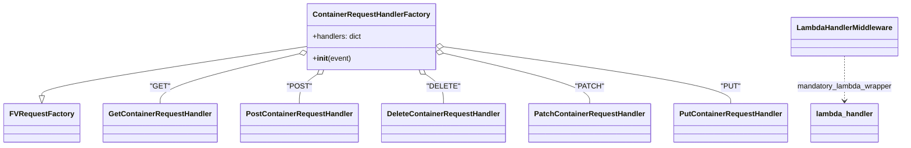
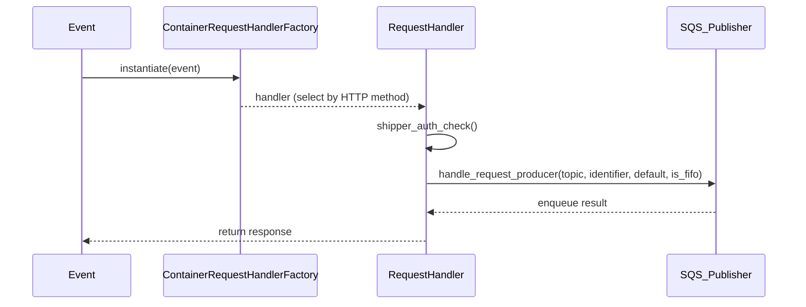

# Diagram: partview_core/partview_service/partview_service/api/package_container/package_container.py

> Auto-generated by Obscura crawlers

## Diagram 1

### SVG

<svg id="container" width="1891.5078125" xmlns="http://www.w3.org/2000/svg" class="classDiagram" height="318" viewBox="0 0 1891.5078125 318" role="graphics-document document" aria-roledescription="class"><g><defs><marker id="container_class-aggregationStart" class="marker aggregation class" refX="18" refY="7" markerWidth="190" markerHeight="240" orient="auto"><path d="M 18,7 L9,13 L1,7 L9,1 Z"></path></marker></defs><defs><marker id="container_class-aggregationEnd" class="marker aggregation class" refX="1" refY="7" markerWidth="20" markerHeight="28" orient="auto"><path d="M 18,7 L9,13 L1,7 L9,1 Z"></path></marker></defs><defs><marker id="container_class-extensionStart" class="marker extension class" refX="18" refY="7" markerWidth="190" markerHeight="240" orient="auto"><path d="M 1,7 L18,13 V 1 Z"></path></marker></defs><defs><marker id="container_class-extensionEnd" class="marker extension class" refX="1" refY="7" markerWidth="20" markerHeight="28" orient="auto"><path d="M 1,1 V 13 L18,7 Z"></path></marker></defs><defs><marker id="container_class-compositionStart" class="marker composition class" refX="18" refY="7" markerWidth="190" markerHeight="240" orient="auto"><path d="M 18,7 L9,13 L1,7 L9,1 Z"></path></marker></defs><defs><marker id="container_class-compositionEnd" class="marker composition class" refX="1" refY="7" markerWidth="20" markerHeight="28" orient="auto"><path d="M 18,7 L9,13 L1,7 L9,1 Z"></path></marker></defs><defs><marker id="container_class-dependencyStart" class="marker dependency class" refX="6" refY="7" markerWidth="190" markerHeight="240" orient="auto"><path d="M 5,7 L9,13 L1,7 L9,1 Z"></path></marker></defs><defs><marker id="container_class-dependencyEnd" class="marker dependency class" refX="13" refY="7" markerWidth="20" markerHeight="28" orient="auto"><path d="M 18,7 L9,13 L14,7 L9,1 Z"></path></marker></defs><defs><marker id="container_class-lollipopStart" class="marker lollipop class" refX="13" refY="7" markerWidth="190" markerHeight="240" orient="auto"><circle stroke="black" fill="transparent" cx="7" cy="7" r="6"></circle></marker></defs><defs><marker id="container_class-lollipopEnd" class="marker lollipop class" refX="1" refY="7" markerWidth="190" markerHeight="240" orient="auto"><circle stroke="black" fill="transparent" cx="7" cy="7" r="6"></circle></marker></defs><g class="root"><g class="clusters"></g><g class="edgePaths"><path d="M641.965,101.046L549.144,115.705C456.323,130.364,270.681,159.682,177.86,177.633C85.039,195.583,85.039,202.167,85.039,205.458L85.039,208.75" id="id_ContainerRequestHandlerFactory_FVRequestFactory_1" class="edge-thickness-normal edge-pattern-solid relation" style=";;;" data-edge="true" data-et="edge" data-id="id_ContainerRequestHandlerFactory_FVRequestFactory_1" data-points="W3sieCI6NjQxLjk2NDg0Mzc1LCJ5IjoxMDEuMDQ2MjY3NzM1OTY1NDZ9LHsieCI6ODUuMDM5MDYyNSwieSI6MTg5fSx7IngiOjg1LjAzOTA2MjUsInkiOjIyNn1d" marker-end="url(#container_class-extensionEnd)"></path><path d="M625.213,116.844L576.246,128.87C527.28,140.896,429.347,164.948,380.38,183.141C331.414,201.333,331.414,213.667,331.414,219.833L331.414,226" id="id_ContainerRequestHandlerFactory_GetContainerRequestHandler_2" class="edge-thickness-normal edge-pattern-solid relation" style=";;;" data-edge="true" data-et="edge" data-id="id_ContainerRequestHandlerFactory_GetContainerRequestHandler_2" data-points="W3sieCI6NjQxLjk2NDg0Mzc1LCJ5IjoxMTIuNzI5NjQ0MzMxMzk0MDd9LHsieCI6MzMxLjQxNDA2MjUsInkiOjE4OX0seyJ4IjozMzEuNDE0MDYyNSwieSI6MjI2fV0=" marker-start="url(#container_class-aggregationStart)"></path><path d="M661.065,162.069L654.821,166.557C648.577,171.046,636.09,180.023,629.846,190.678C623.602,201.333,623.602,213.667,623.602,219.833L623.602,226" id="id_ContainerRequestHandlerFactory_PostContainerRequestHandler_3" class="edge-thickness-normal edge-pattern-solid relation" style=";;;" data-edge="true" data-et="edge" data-id="id_ContainerRequestHandlerFactory_PostContainerRequestHandler_3" data-points="W3sieCI6Njc1LjA3MTkyNTE3MjAxODQsInkiOjE1Mn0seyJ4Ijo2MjMuNjAxNTYyNSwieSI6MTg5fSx7IngiOjYyMy42MDE1NjI1LCJ5IjoyMjZ9XQ==" marker-start="url(#container_class-aggregationStart)"></path><path d="M889.396,162.069L895.64,166.557C901.883,171.046,914.371,180.023,920.615,190.678C926.859,201.333,926.859,213.667,926.859,219.833L926.859,226" id="id_ContainerRequestHandlerFactory_DeleteContainerRequestHandler_4" class="edge-thickness-normal edge-pattern-solid relation" style=";;;" data-edge="true" data-et="edge" data-id="id_ContainerRequestHandlerFactory_DeleteContainerRequestHandler_4" data-points="W3sieCI6ODc1LjM4OTAxMjMyNzk4MTYsInkiOjE1Mn0seyJ4Ijo5MjYuODU5Mzc1LCJ5IjoxODl9LHsieCI6OTI2Ljg1OTM3NSwieSI6MjI2fV0=" marker-start="url(#container_class-aggregationStart)"></path><path d="M925.279,115.643L976.748,127.869C1028.217,140.095,1131.156,164.548,1182.625,182.941C1234.094,201.333,1234.094,213.667,1234.094,219.833L1234.094,226" id="id_ContainerRequestHandlerFactory_PatchContainerRequestHandler_5" class="edge-thickness-normal edge-pattern-solid relation" style=";;;" data-edge="true" data-et="edge" data-id="id_ContainerRequestHandlerFactory_PatchContainerRequestHandler_5" data-points="W3sieCI6OTA4LjQ5NjA5Mzc1LCJ5IjoxMTEuNjU2Mzg1OTQwMTIwMzd9LHsieCI6MTIzNC4wOTM3NSwieSI6MTg5fSx7IngiOjEyMzQuMDkzNzUsInkiOjIyNn1d" marker-start="url(#container_class-aggregationStart)"></path><path d="M925.569,101.716L1026.281,116.263C1126.994,130.81,1328.419,159.905,1429.131,180.619C1529.844,201.333,1529.844,213.667,1529.844,219.833L1529.844,226" id="id_ContainerRequestHandlerFactory_PutContainerRequestHandler_6" class="edge-thickness-normal edge-pattern-solid relation" style=";;;" data-edge="true" data-et="edge" data-id="id_ContainerRequestHandlerFactory_PutContainerRequestHandler_6" data-points="W3sieCI6OTA4LjQ5NjA5Mzc1LCJ5Ijo5OS4yNDk1MzI4MjE1NTA3N30seyJ4IjoxNTI5Ljg0Mzc1LCJ5IjoxODl9LHsieCI6MTUyOS44NDM3NSwieSI6MjI2fV0=" marker-start="url(#container_class-aggregationStart)"></path><path d="M1770.742,122L1770.742,133.167C1770.742,144.333,1770.742,166.667,1770.742,183C1770.742,199.333,1770.742,209.667,1770.742,214.833L1770.742,220" id="id_LambdaHandlerMiddleware_lambda_handler_7" class="edge-thickness-normal edge-pattern-dashed relation" style=";;;" data-edge="true" data-et="edge" data-id="id_LambdaHandlerMiddleware_lambda_handler_7" data-points="W3sieCI6MTc3MC43NDIxODc1LCJ5IjoxMjJ9LHsieCI6MTc3MC43NDIxODc1LCJ5IjoxODl9LHsieCI6MTc3MC43NDIxODc1LCJ5IjoyMjZ9XQ==" marker-end="url(#container_class-dependencyEnd)"></path></g><g class="edgeLabels"><g class="edgeLabel"><g class="label" data-id="id_ContainerRequestHandlerFactory_FVRequestFactory_1" transform="translate(0, 0)"><foreignObject width="0" height="0">

</foreignObject></g></g><g class="edgeLabel" transform="translate(331.4140625, 189)"><g class="label" data-id="id_ContainerRequestHandlerFactory_GetContainerRequestHandler_2" transform="translate(-19.9296875, -12)"><foreignObject width="39.859375" height="24">

"GET"

</foreignObject></g></g><g class="edgeLabel" transform="translate(623.6015625, 189)"><g class="label" data-id="id_ContainerRequestHandlerFactory_PostContainerRequestHandler_3" transform="translate(-24.96875, -12)"><foreignObject width="49.9375" height="24">

"POST"

</foreignObject></g></g><g class="edgeLabel" transform="translate(926.859375, 189)"><g class="label" data-id="id_ContainerRequestHandlerFactory_DeleteContainerRequestHandler_4" transform="translate(-32.5, -12)"><foreignObject width="65" height="24">

"DELETE"

</foreignObject></g></g><g class="edgeLabel" transform="translate(1234.09375, 189)"><g class="label" data-id="id_ContainerRequestHandlerFactory_PatchContainerRequestHandler_5" transform="translate(-28.515625, -12)"><foreignObject width="57.03125" height="24">

"PATCH"

</foreignObject></g></g><g class="edgeLabel" transform="translate(1529.84375, 189)"><g class="label" data-id="id_ContainerRequestHandlerFactory_PutContainerRequestHandler_6" transform="translate(-20.546875, -12)"><foreignObject width="41.09375" height="24">

"PUT"

</foreignObject></g></g><g class="edgeLabel" transform="translate(1770.7421875, 189)"><g class="label" data-id="id_LambdaHandlerMiddleware_lambda_handler_7" transform="translate(-104.5859375, -12)"><foreignObject width="209.171875" height="24">

mandatory_lambda_wrapper

</foreignObject></g></g></g><g class="nodes"><g class="node default" id="classId-ContainerRequestHandlerFactory-0" transform="translate(775.23046875, 80)"><g class="basic label-container"><path d="M-133.265625 -72 L133.265625 -72 L133.265625 72 L-133.265625 72" stroke="none" stroke-width="0" fill="#ECECFF" style=""></path><path d="M-133.265625 -72 C-66.92357525337574 -72, -0.5815255067514897 -72, 133.265625 -72 M-133.265625 -72 C-62.54197841467369 -72, 8.181668170652614 -72, 133.265625 -72 M133.265625 -72 C133.265625 -34.891863658000084, 133.265625 2.216272683999833, 133.265625 72 M133.265625 -72 C133.265625 -19.872163256339356, 133.265625 32.25567348732129, 133.265625 72 M133.265625 72 C34.49559767233414 72, -64.27442965533172 72, -133.265625 72 M133.265625 72 C56.45466883172723 72, -20.356287336545535 72, -133.265625 72 M-133.265625 72 C-133.265625 22.183174493881282, -133.265625 -27.633651012237436, -133.265625 -72 M-133.265625 72 C-133.265625 20.1397532259492, -133.265625 -31.7204935481016, -133.265625 -72" stroke="#9370DB" stroke-width="1.3" fill="none" stroke-dasharray="0 0" style=""></path></g><g class="annotation-group text" transform="translate(0, -48)"></g><g class="label-group text" transform="translate(-121.265625, -48)"><g class="label" style="font-weight: bolder" transform="translate(0,-12)"><foreignObject width="242.53125" height="24">

ContainerRequestHandlerFactory

</foreignObject></g></g><g class="members-group text" transform="translate(-121.265625, 0)"><g class="label" style="" transform="translate(0,-12)"><foreignObject width="107.34375" height="24">

+handlers: dict

</foreignObject></g></g><g class="methods-group text" transform="translate(-121.265625, 48)"><g class="label" style="" transform="translate(0,-12)"><foreignObject width="83.140625" height="24">

+<strong>init</strong>(event)

</foreignObject></g></g><g class="divider" style=""><path d="M-133.265625 -24 C-33.01234432831262 -24, 67.24093634337476 -24, 133.265625 -24 M-133.265625 -24 C-64.26150525504647 -24, 4.742614489907055 -24, 133.265625 -24" stroke="#9370DB" stroke-width="1.3" fill="none" stroke-dasharray="0 0" style=""></path></g><g class="divider" style=""><path d="M-133.265625 24 C-40.238062409144106 24, 52.78950018171179 24, 133.265625 24 M-133.265625 24 C-27.832349445516954 24, 77.60092610896609 24, 133.265625 24" stroke="#9370DB" stroke-width="1.3" fill="none" stroke-dasharray="0 0" style=""></path></g></g><g class="node default" id="classId-FVRequestFactory-1" transform="translate(85.0390625, 268)"><g class="basic label-container"><path d="M-77.0390625 -42 L77.0390625 -42 L77.0390625 42 L-77.0390625 42" stroke="none" stroke-width="0" fill="#ECECFF" style=""></path><path d="M-77.0390625 -42 C-43.50541802982863 -42, -9.971773559657265 -42, 77.0390625 -42 M-77.0390625 -42 C-28.39556225361497 -42, 20.247937992770062 -42, 77.0390625 -42 M77.0390625 -42 C77.0390625 -14.370196293060598, 77.0390625 13.259607413878804, 77.0390625 42 M77.0390625 -42 C77.0390625 -14.888360123262625, 77.0390625 12.223279753474749, 77.0390625 42 M77.0390625 42 C17.48308374930054 42, -42.07289500139892 42, -77.0390625 42 M77.0390625 42 C22.16601413367995 42, -32.7070342326401 42, -77.0390625 42 M-77.0390625 42 C-77.0390625 15.042785006741202, -77.0390625 -11.914429986517597, -77.0390625 -42 M-77.0390625 42 C-77.0390625 14.497197979411443, -77.0390625 -13.005604041177115, -77.0390625 -42" stroke="#9370DB" stroke-width="1.3" fill="none" stroke-dasharray="0 0" style=""></path></g><g class="annotation-group text" transform="translate(0, -18)"></g><g class="label-group text" transform="translate(-65.0390625, -18)"><g class="label" style="font-weight: bolder" transform="translate(0,-12)"><foreignObject width="130.078125" height="24">

FVRequestFactory

</foreignObject></g></g><g class="members-group text" transform="translate(-65.0390625, 30)"></g><g class="methods-group text" transform="translate(-65.0390625, 60)"></g><g class="divider" style=""><path d="M-77.0390625 6 C-33.66489127333857 6, 9.709279953322863 6, 77.0390625 6 M-77.0390625 6 C-17.707311484853008 6, 41.624439530293984 6, 77.0390625 6" stroke="#9370DB" stroke-width="1.3" fill="none" stroke-dasharray="0 0" style=""></path></g><g class="divider" style=""><path d="M-77.0390625 24 C-21.180760586836087 24, 34.67754132632783 24, 77.0390625 24 M-77.0390625 24 C-24.644248657608394 24, 27.750565184783213 24, 77.0390625 24" stroke="#9370DB" stroke-width="1.3" fill="none" stroke-dasharray="0 0" style=""></path></g></g><g class="node default" id="classId-GetContainerRequestHandler-2" transform="translate(331.4140625, 268)"><g class="basic label-container"><path d="M-119.3359375 -42 L119.3359375 -42 L119.3359375 42 L-119.3359375 42" stroke="none" stroke-width="0" fill="#ECECFF" style=""></path><path d="M-119.3359375 -42 C-44.393319792202675 -42, 30.54929791559465 -42, 119.3359375 -42 M-119.3359375 -42 C-44.841449365056036 -42, 29.653038769887928 -42, 119.3359375 -42 M119.3359375 -42 C119.3359375 -14.030079510174044, 119.3359375 13.939840979651912, 119.3359375 42 M119.3359375 -42 C119.3359375 -21.585190110964387, 119.3359375 -1.1703802219287738, 119.3359375 42 M119.3359375 42 C25.18474920995375 42, -68.9664390800925 42, -119.3359375 42 M119.3359375 42 C55.580031222298956 42, -8.175875055402088 42, -119.3359375 42 M-119.3359375 42 C-119.3359375 23.83358106618739, -119.3359375 5.667162132374777, -119.3359375 -42 M-119.3359375 42 C-119.3359375 21.130994908699925, -119.3359375 0.2619898173998507, -119.3359375 -42" stroke="#9370DB" stroke-width="1.3" fill="none" stroke-dasharray="0 0" style=""></path></g><g class="annotation-group text" transform="translate(0, -18)"></g><g class="label-group text" transform="translate(-107.3359375, -18)"><g class="label" style="font-weight: bolder" transform="translate(0,-12)"><foreignObject width="214.671875" height="24">

GetContainerRequestHandler

</foreignObject></g></g><g class="members-group text" transform="translate(-107.3359375, 30)"></g><g class="methods-group text" transform="translate(-107.3359375, 60)"></g><g class="divider" style=""><path d="M-119.3359375 6 C-58.808084262598015 6, 1.7197689748039693 6, 119.3359375 6 M-119.3359375 6 C-26.917214481109824 6, 65.50150853778035 6, 119.3359375 6" stroke="#9370DB" stroke-width="1.3" fill="none" stroke-dasharray="0 0" style=""></path></g><g class="divider" style=""><path d="M-119.3359375 24 C-27.945503678520097 24, 63.444930142959805 24, 119.3359375 24 M-119.3359375 24 C-36.66268334048152 24, 46.01057081903696 24, 119.3359375 24" stroke="#9370DB" stroke-width="1.3" fill="none" stroke-dasharray="0 0" style=""></path></g></g><g class="node default" id="classId-PostContainerRequestHandler-3" transform="translate(623.6015625, 268)"><g class="basic label-container"><path d="M-122.8515625 -42 L122.8515625 -42 L122.8515625 42 L-122.8515625 42" stroke="none" stroke-width="0" fill="#ECECFF" style=""></path><path d="M-122.8515625 -42 C-42.756919057211746 -42, 37.33772438557651 -42, 122.8515625 -42 M-122.8515625 -42 C-46.098734144213935 -42, 30.65409421157213 -42, 122.8515625 -42 M122.8515625 -42 C122.8515625 -23.169587141467154, 122.8515625 -4.339174282934309, 122.8515625 42 M122.8515625 -42 C122.8515625 -17.090994671077436, 122.8515625 7.818010657845129, 122.8515625 42 M122.8515625 42 C66.72448974143617 42, 10.597416982872332 42, -122.8515625 42 M122.8515625 42 C61.31263315092513 42, -0.22629619814973978 42, -122.8515625 42 M-122.8515625 42 C-122.8515625 12.587094987514469, -122.8515625 -16.825810024971062, -122.8515625 -42 M-122.8515625 42 C-122.8515625 17.649433889223108, -122.8515625 -6.7011322215537845, -122.8515625 -42" stroke="#9370DB" stroke-width="1.3" fill="none" stroke-dasharray="0 0" style=""></path></g><g class="annotation-group text" transform="translate(0, -18)"></g><g class="label-group text" transform="translate(-110.8515625, -18)"><g class="label" style="font-weight: bolder" transform="translate(0,-12)"><foreignObject width="221.703125" height="24">

PostContainerRequestHandler

</foreignObject></g></g><g class="members-group text" transform="translate(-110.8515625, 30)"></g><g class="methods-group text" transform="translate(-110.8515625, 60)"></g><g class="divider" style=""><path d="M-122.8515625 6 C-30.43771865007656 6, 61.97612519984688 6, 122.8515625 6 M-122.8515625 6 C-59.74748081266614 6, 3.35660087466772 6, 122.8515625 6" stroke="#9370DB" stroke-width="1.3" fill="none" stroke-dasharray="0 0" style=""></path></g><g class="divider" style=""><path d="M-122.8515625 24 C-52.17491781531005 24, 18.501726869379894 24, 122.8515625 24 M-122.8515625 24 C-27.35478588064386 24, 68.14199073871228 24, 122.8515625 24" stroke="#9370DB" stroke-width="1.3" fill="none" stroke-dasharray="0 0" style=""></path></g></g><g class="node default" id="classId-DeleteContainerRequestHandler-4" transform="translate(926.859375, 268)"><g class="basic label-container"><path d="M-130.40625 -42 L130.40625 -42 L130.40625 42 L-130.40625 42" stroke="none" stroke-width="0" fill="#ECECFF" style=""></path><path d="M-130.40625 -42 C-57.178115958076845 -42, 16.05001808384631 -42, 130.40625 -42 M-130.40625 -42 C-63.442208610361746 -42, 3.521832779276508 -42, 130.40625 -42 M130.40625 -42 C130.40625 -16.268095540299772, 130.40625 9.463808919400456, 130.40625 42 M130.40625 -42 C130.40625 -17.99567259756433, 130.40625 6.008654804871341, 130.40625 42 M130.40625 42 C50.185410738937065 42, -30.03542852212587 42, -130.40625 42 M130.40625 42 C65.99996198900264 42, 1.5936739780052847 42, -130.40625 42 M-130.40625 42 C-130.40625 11.974144154583609, -130.40625 -18.051711690832782, -130.40625 -42 M-130.40625 42 C-130.40625 11.174918060115044, -130.40625 -19.650163879769913, -130.40625 -42" stroke="#9370DB" stroke-width="1.3" fill="none" stroke-dasharray="0 0" style=""></path></g><g class="annotation-group text" transform="translate(0, -18)"></g><g class="label-group text" transform="translate(-118.40625, -18)"><g class="label" style="font-weight: bolder" transform="translate(0,-12)"><foreignObject width="236.8125" height="24">

DeleteContainerRequestHandler

</foreignObject></g></g><g class="members-group text" transform="translate(-118.40625, 30)"></g><g class="methods-group text" transform="translate(-118.40625, 60)"></g><g class="divider" style=""><path d="M-130.40625 6 C-27.866251157236363 6, 74.67374768552727 6, 130.40625 6 M-130.40625 6 C-45.25508281919193 6, 39.89608436161615 6, 130.40625 6" stroke="#9370DB" stroke-width="1.3" fill="none" stroke-dasharray="0 0" style=""></path></g><g class="divider" style=""><path d="M-130.40625 24 C-32.73996876003842 24, 64.92631247992315 24, 130.40625 24 M-130.40625 24 C-48.48985915169018 24, 33.426531696619634 24, 130.40625 24" stroke="#9370DB" stroke-width="1.3" fill="none" stroke-dasharray="0 0" style=""></path></g></g><g class="node default" id="classId-PatchContainerRequestHandler-5" transform="translate(1234.09375, 268)"><g class="basic label-container"><path d="M-126.828125 -42 L126.828125 -42 L126.828125 42 L-126.828125 42" stroke="none" stroke-width="0" fill="#ECECFF" style=""></path><path d="M-126.828125 -42 C-58.657604250036286 -42, 9.512916499927428 -42, 126.828125 -42 M-126.828125 -42 C-26.17932363105443 -42, 74.46947773789114 -42, 126.828125 -42 M126.828125 -42 C126.828125 -11.873826543552447, 126.828125 18.252346912895106, 126.828125 42 M126.828125 -42 C126.828125 -15.605962803958725, 126.828125 10.78807439208255, 126.828125 42 M126.828125 42 C71.50721542389496 42, 16.186305847789924 42, -126.828125 42 M126.828125 42 C36.09373152103426 42, -54.640661957931485 42, -126.828125 42 M-126.828125 42 C-126.828125 19.253410103145292, -126.828125 -3.493179793709416, -126.828125 -42 M-126.828125 42 C-126.828125 19.03728510162459, -126.828125 -3.9254297967508194, -126.828125 -42" stroke="#9370DB" stroke-width="1.3" fill="none" stroke-dasharray="0 0" style=""></path></g><g class="annotation-group text" transform="translate(0, -18)"></g><g class="label-group text" transform="translate(-114.828125, -18)"><g class="label" style="font-weight: bolder" transform="translate(0,-12)"><foreignObject width="229.65625" height="24">

PatchContainerRequestHandler

</foreignObject></g></g><g class="members-group text" transform="translate(-114.828125, 30)"></g><g class="methods-group text" transform="translate(-114.828125, 60)"></g><g class="divider" style=""><path d="M-126.828125 6 C-60.53279628612698 6, 5.762532427746038 6, 126.828125 6 M-126.828125 6 C-32.22397952841153 6, 62.380165943176934 6, 126.828125 6" stroke="#9370DB" stroke-width="1.3" fill="none" stroke-dasharray="0 0" style=""></path></g><g class="divider" style=""><path d="M-126.828125 24 C-30.007247020749418 24, 66.81363095850116 24, 126.828125 24 M-126.828125 24 C-54.50103886555121 24, 17.826047268897582 24, 126.828125 24" stroke="#9370DB" stroke-width="1.3" fill="none" stroke-dasharray="0 0" style=""></path></g></g><g class="node default" id="classId-PutContainerRequestHandler-6" transform="translate(1529.84375, 268)"><g class="basic label-container"><path d="M-118.921875 -42 L118.921875 -42 L118.921875 42 L-118.921875 42" stroke="none" stroke-width="0" fill="#ECECFF" style=""></path><path d="M-118.921875 -42 C-32.77660920349831 -42, 53.36865659300338 -42, 118.921875 -42 M-118.921875 -42 C-46.25638550621417 -42, 26.409103987571655 -42, 118.921875 -42 M118.921875 -42 C118.921875 -15.3299913362758, 118.921875 11.3400173274484, 118.921875 42 M118.921875 -42 C118.921875 -8.473462287044576, 118.921875 25.053075425910848, 118.921875 42 M118.921875 42 C62.291867372833664 42, 5.6618597456673285 42, -118.921875 42 M118.921875 42 C60.92504798190663 42, 2.92822096381326 42, -118.921875 42 M-118.921875 42 C-118.921875 19.819945960182487, -118.921875 -2.360108079635026, -118.921875 -42 M-118.921875 42 C-118.921875 11.853823208592242, -118.921875 -18.292353582815515, -118.921875 -42" stroke="#9370DB" stroke-width="1.3" fill="none" stroke-dasharray="0 0" style=""></path></g><g class="annotation-group text" transform="translate(0, -18)"></g><g class="label-group text" transform="translate(-106.921875, -18)"><g class="label" style="font-weight: bolder" transform="translate(0,-12)"><foreignObject width="213.84375" height="24">

PutContainerRequestHandler

</foreignObject></g></g><g class="members-group text" transform="translate(-106.921875, 30)"></g><g class="methods-group text" transform="translate(-106.921875, 60)"></g><g class="divider" style=""><path d="M-118.921875 6 C-26.490852759535173 6, 65.94016948092965 6, 118.921875 6 M-118.921875 6 C-64.16672977476995 6, -9.411584549539882 6, 118.921875 6" stroke="#9370DB" stroke-width="1.3" fill="none" stroke-dasharray="0 0" style=""></path></g><g class="divider" style=""><path d="M-118.921875 24 C-32.02389863274219 24, 54.87407773451562 24, 118.921875 24 M-118.921875 24 C-45.30655389715798 24, 28.308767205684035 24, 118.921875 24" stroke="#9370DB" stroke-width="1.3" fill="none" stroke-dasharray="0 0" style=""></path></g></g><g class="node default" id="classId-LambdaHandlerMiddleware-7" transform="translate(1770.7421875, 80)"><g class="basic label-container"><path d="M-112.765625 -42 L112.765625 -42 L112.765625 42 L-112.765625 42" stroke="none" stroke-width="0" fill="#ECECFF" style=""></path><path d="M-112.765625 -42 C-42.64901862574018 -42, 27.467587748519634 -42, 112.765625 -42 M-112.765625 -42 C-46.34068250309075 -42, 20.084259993818506 -42, 112.765625 -42 M112.765625 -42 C112.765625 -17.788747799367638, 112.765625 6.4225044012647245, 112.765625 42 M112.765625 -42 C112.765625 -13.644284863901905, 112.765625 14.71143027219619, 112.765625 42 M112.765625 42 C46.56946693316799 42, -19.626691133664025 42, -112.765625 42 M112.765625 42 C29.318345969970892 42, -54.128933060058216 42, -112.765625 42 M-112.765625 42 C-112.765625 21.31407496089366, -112.765625 0.628149921787319, -112.765625 -42 M-112.765625 42 C-112.765625 17.097228381410602, -112.765625 -7.805543237178796, -112.765625 -42" stroke="#9370DB" stroke-width="1.3" fill="none" stroke-dasharray="0 0" style=""></path></g><g class="annotation-group text" transform="translate(0, -18)"></g><g class="label-group text" transform="translate(-100.765625, -18)"><g class="label" style="font-weight: bolder" transform="translate(0,-12)"><foreignObject width="201.53125" height="24">

LambdaHandlerMiddleware

</foreignObject></g></g><g class="members-group text" transform="translate(-100.765625, 30)"></g><g class="methods-group text" transform="translate(-100.765625, 60)"></g><g class="divider" style=""><path d="M-112.765625 6 C-39.12722027631993 6, 34.51118444736014 6, 112.765625 6 M-112.765625 6 C-48.320601120436365 6, 16.12442275912727 6, 112.765625 6" stroke="#9370DB" stroke-width="1.3" fill="none" stroke-dasharray="0 0" style=""></path></g><g class="divider" style=""><path d="M-112.765625 24 C-61.6359576931188 24, -10.506290386237595 24, 112.765625 24 M-112.765625 24 C-32.81212752719273 24, 47.14136994561454 24, 112.765625 24" stroke="#9370DB" stroke-width="1.3" fill="none" stroke-dasharray="0 0" style=""></path></g></g><g class="node default" id="classId-lambda_handler-8" transform="translate(1770.7421875, 268)"><g class="basic label-container"><path d="M-71.9765625 -42 L71.9765625 -42 L71.9765625 42 L-71.9765625 42" stroke="none" stroke-width="0" fill="#ECECFF" style=""></path><path d="M-71.9765625 -42 C-41.234201974025666 -42, -10.491841448051325 -42, 71.9765625 -42 M-71.9765625 -42 C-35.81462031482074 -42, 0.34732187035851325 -42, 71.9765625 -42 M71.9765625 -42 C71.9765625 -9.291783383016927, 71.9765625 23.416433233966146, 71.9765625 42 M71.9765625 -42 C71.9765625 -10.070996367816047, 71.9765625 21.858007264367906, 71.9765625 42 M71.9765625 42 C23.1278622065455 42, -25.720838086908998 42, -71.9765625 42 M71.9765625 42 C26.003397808180253 42, -19.969766883639494 42, -71.9765625 42 M-71.9765625 42 C-71.9765625 9.416683238259445, -71.9765625 -23.16663352348111, -71.9765625 -42 M-71.9765625 42 C-71.9765625 21.890703520274513, -71.9765625 1.781407040549027, -71.9765625 -42" stroke="#9370DB" stroke-width="1.3" fill="none" stroke-dasharray="0 0" style=""></path></g><g class="annotation-group text" transform="translate(0, -18)"></g><g class="label-group text" transform="translate(-59.9765625, -18)"><g class="label" style="font-weight: bolder" transform="translate(0,-12)"><foreignObject width="119.953125" height="24">

lambda_handler

</foreignObject></g></g><g class="members-group text" transform="translate(-59.9765625, 30)"></g><g class="methods-group text" transform="translate(-59.9765625, 60)"></g><g class="divider" style=""><path d="M-71.9765625 6 C-24.991080594479506 6, 21.99440131104099 6, 71.9765625 6 M-71.9765625 6 C-20.578396983906295 6, 30.81976853218741 6, 71.9765625 6" stroke="#9370DB" stroke-width="1.3" fill="none" stroke-dasharray="0 0" style=""></path></g><g class="divider" style=""><path d="M-71.9765625 24 C-31.5802779292261 24, 8.816006641547801 24, 71.9765625 24 M-71.9765625 24 C-36.98352572298365 24, -1.9904889459673 24, 71.9765625 24" stroke="#9370DB" stroke-width="1.3" fill="none" stroke-dasharray="0 0" style=""></path></g></g></g></g></g></svg>

## Diagram 2

### SVG

<svg id="container" width="1301" xmlns="http://www.w3.org/2000/svg" height="489" viewBox="-50 -10 1301 489" role="graphics-document document" aria-roledescription="sequence"><g><rect x="1051" y="403" fill="#eaeaea" stroke="#666" width="150" height="65" name="SQS" rx="3" ry="3" class="actor actor-bottom"></rect><text x="1126" y="435.5" dominant-baseline="central" alignment-baseline="central" class="actor actor-box" style="text-anchor: middle; font-size: 16px; font-weight: 400;"><tspan x="1126" dy="0">SQS_Publisher</tspan></text></g><g><rect x="562" y="403" fill="#eaeaea" stroke="#666" width="150" height="65" name="Handler" rx="3" ry="3" class="actor actor-bottom"></rect><text x="637" y="435.5" dominant-baseline="central" alignment-baseline="central" class="actor actor-box" style="text-anchor: middle; font-size: 16px; font-weight: 400;"><tspan x="637" dy="0">RequestHandler</tspan></text></g><g><rect x="200" y="403" fill="#eaeaea" stroke="#666" width="260" height="65" name="Factory" rx="3" ry="3" class="actor actor-bottom"></rect><text x="330" y="435.5" dominant-baseline="central" alignment-baseline="central" class="actor actor-box" style="text-anchor: middle; font-size: 16px; font-weight: 400;"><tspan x="330" dy="0">ContainerRequestHandlerFactory</tspan></text></g><g><rect x="0" y="403" fill="#eaeaea" stroke="#666" width="150" height="65" name="Event" rx="3" ry="3" class="actor actor-bottom"></rect><text x="75" y="435.5" dominant-baseline="central" alignment-baseline="central" class="actor actor-box" style="text-anchor: middle; font-size: 16px; font-weight: 400;"><tspan x="75" dy="0">Event</tspan></text></g><g><line id="actor3" x1="1126" y1="65" x2="1126" y2="403" class="actor-line 200" stroke-width="0.5px" stroke="#999" name="SQS"></line><g id="root-3"><rect x="1051" y="0" fill="#eaeaea" stroke="#666" width="150" height="65" name="SQS" rx="3" ry="3" class="actor actor-top"></rect><text x="1126" y="32.5" dominant-baseline="central" alignment-baseline="central" class="actor actor-box" style="text-anchor: middle; font-size: 16px; font-weight: 400;"><tspan x="1126" dy="0">SQS_Publisher</tspan></text></g></g><g><line id="actor2" x1="637" y1="65" x2="637" y2="403" class="actor-line 200" stroke-width="0.5px" stroke="#999" name="Handler"></line><g id="root-2"><rect x="562" y="0" fill="#eaeaea" stroke="#666" width="150" height="65" name="Handler" rx="3" ry="3" class="actor actor-top"></rect><text x="637" y="32.5" dominant-baseline="central" alignment-baseline="central" class="actor actor-box" style="text-anchor: middle; font-size: 16px; font-weight: 400;"><tspan x="637" dy="0">RequestHandler</tspan></text></g></g><g><line id="actor1" x1="330" y1="65" x2="330" y2="403" class="actor-line 200" stroke-width="0.5px" stroke="#999" name="Factory"></line><g id="root-1"><rect x="200" y="0" fill="#eaeaea" stroke="#666" width="260" height="65" name="Factory" rx="3" ry="3" class="actor actor-top"></rect><text x="330" y="32.5" dominant-baseline="central" alignment-baseline="central" class="actor actor-box" style="text-anchor: middle; font-size: 16px; font-weight: 400;"><tspan x="330" dy="0">ContainerRequestHandlerFactory</tspan></text></g></g><g><line id="actor0" x1="75" y1="65" x2="75" y2="403" class="actor-line 200" stroke-width="0.5px" stroke="#999" name="Event"></line><g id="root-0"><rect x="0" y="0" fill="#eaeaea" stroke="#666" width="150" height="65" name="Event" rx="3" ry="3" class="actor actor-top"></rect><text x="75" y="32.5" dominant-baseline="central" alignment-baseline="central" class="actor actor-box" style="text-anchor: middle; font-size: 16px; font-weight: 400;"><tspan x="75" dy="0">Event</tspan></text></g></g><g></g><defs><symbol id="computer" width="24" height="24"><path transform="scale(.5)" d="M2 2v13h20v-13h-20zm18 11h-16v-9h16v9zm-10.228 6l.466-1h3.524l.467 1h-4.457zm14.228 3h-24l2-6h2.104l-1.33 4h18.45l-1.297-4h2.073l2 6zm-5-10h-14v-7h14v7z"></path></symbol></defs><defs><symbol id="database" fill-rule="evenodd" clip-rule="evenodd"><path transform="scale(.5)" d="M12.258.001l.256.004.255.005.253.008.251.01.249.012.247.015.246.016.242.019.241.02.239.023.236.024.233.027.231.028.229.031.225.032.223.034.22.036.217.038.214.04.211.041.208.043.205.045.201.046.198.048.194.05.191.051.187.053.183.054.18.056.175.057.172.059.168.06.163.061.16.063.155.064.15.066.074.033.073.033.071.034.07.034.069.035.068.035.067.035.066.035.064.036.064.036.062.036.06.036.06.037.058.037.058.037.055.038.055.038.053.038.052.038.051.039.05.039.048.039.047.039.045.04.044.04.043.04.041.04.04.041.039.041.037.041.036.041.034.041.033.042.032.042.03.042.029.042.027.042.026.043.024.043.023.043.021.043.02.043.018.044.017.043.015.044.013.044.012.044.011.045.009.044.007.045.006.045.004.045.002.045.001.045v17l-.001.045-.002.045-.004.045-.006.045-.007.045-.009.044-.011.045-.012.044-.013.044-.015.044-.017.043-.018.044-.02.043-.021.043-.023.043-.024.043-.026.043-.027.042-.029.042-.03.042-.032.042-.033.042-.034.041-.036.041-.037.041-.039.041-.04.041-.041.04-.043.04-.044.04-.045.04-.047.039-.048.039-.05.039-.051.039-.052.038-.053.038-.055.038-.055.038-.058.037-.058.037-.06.037-.06.036-.062.036-.064.036-.064.036-.066.035-.067.035-.068.035-.069.035-.07.034-.071.034-.073.033-.074.033-.15.066-.155.064-.16.063-.163.061-.168.06-.172.059-.175.057-.18.056-.183.054-.187.053-.191.051-.194.05-.198.048-.201.046-.205.045-.208.043-.211.041-.214.04-.217.038-.22.036-.223.034-.225.032-.229.031-.231.028-.233.027-.236.024-.239.023-.241.02-.242.019-.246.016-.247.015-.249.012-.251.01-.253.008-.255.005-.256.004-.258.001-.258-.001-.256-.004-.255-.005-.253-.008-.251-.01-.249-.012-.247-.015-.245-.016-.243-.019-.241-.02-.238-.023-.236-.024-.234-.027-.231-.028-.228-.031-.226-.032-.223-.034-.22-.036-.217-.038-.214-.04-.211-.041-.208-.043-.204-.045-.201-.046-.198-.048-.195-.05-.19-.051-.187-.053-.184-.054-.179-.056-.176-.057-.172-.059-.167-.06-.164-.061-.159-.063-.155-.064-.151-.066-.074-.033-.072-.033-.072-.034-.07-.034-.069-.035-.068-.035-.067-.035-.066-.035-.064-.036-.063-.036-.062-.036-.061-.036-.06-.037-.058-.037-.057-.037-.056-.038-.055-.038-.053-.038-.052-.038-.051-.039-.049-.039-.049-.039-.046-.039-.046-.04-.044-.04-.043-.04-.041-.04-.04-.041-.039-.041-.037-.041-.036-.041-.034-.041-.033-.042-.032-.042-.03-.042-.029-.042-.027-.042-.026-.043-.024-.043-.023-.043-.021-.043-.02-.043-.018-.044-.017-.043-.015-.044-.013-.044-.012-.044-.011-.045-.009-.044-.007-.045-.006-.045-.004-.045-.002-.045-.001-.045v-17l.001-.045.002-.045.004-.045.006-.045.007-.045.009-.044.011-.045.012-.044.013-.044.015-.044.017-.043.018-.044.02-.043.021-.043.023-.043.024-.043.026-.043.027-.042.029-.042.03-.042.032-.042.033-.042.034-.041.036-.041.037-.041.039-.041.04-.041.041-.04.043-.04.044-.04.046-.04.046-.039.049-.039.049-.039.051-.039.052-.038.053-.038.055-.038.056-.038.057-.037.058-.037.06-.037.061-.036.062-.036.063-.036.064-.036.066-.035.067-.035.068-.035.069-.035.07-.034.072-.034.072-.033.074-.033.151-.066.155-.064.159-.063.164-.061.167-.06.172-.059.176-.057.179-.056.184-.054.187-.053.19-.051.195-.05.198-.048.201-.046.204-.045.208-.043.211-.041.214-.04.217-.038.22-.036.223-.034.226-.032.228-.031.231-.028.234-.027.236-.024.238-.023.241-.02.243-.019.245-.016.247-.015.249-.012.251-.01.253-.008.255-.005.256-.004.258-.001.258.001zm-9.258 20.499v.01l.001.021.003.021.004.022.005.021.006.022.007.022.009.023.01.022.011.023.012.023.013.023.015.023.016.024.017.023.018.024.019.024.021.024.022.025.023.024.024.025.052.049.056.05.061.051.066.051.07.051.075.051.079.052.084.052.088.052.092.052.097.052.102.051.105.052.11.052.114.051.119.051.123.051.127.05.131.05.135.05.139.048.144.049.147.047.152.047.155.047.16.045.163.045.167.043.171.043.176.041.178.041.183.039.187.039.19.037.194.035.197.035.202.033.204.031.209.03.212.029.216.027.219.025.222.024.226.021.23.02.233.018.236.016.24.015.243.012.246.01.249.008.253.005.256.004.259.001.26-.001.257-.004.254-.005.25-.008.247-.011.244-.012.241-.014.237-.016.233-.018.231-.021.226-.021.224-.024.22-.026.216-.027.212-.028.21-.031.205-.031.202-.034.198-.034.194-.036.191-.037.187-.039.183-.04.179-.04.175-.042.172-.043.168-.044.163-.045.16-.046.155-.046.152-.047.148-.048.143-.049.139-.049.136-.05.131-.05.126-.05.123-.051.118-.052.114-.051.11-.052.106-.052.101-.052.096-.052.092-.052.088-.053.083-.051.079-.052.074-.052.07-.051.065-.051.06-.051.056-.05.051-.05.023-.024.023-.025.021-.024.02-.024.019-.024.018-.024.017-.024.015-.023.014-.024.013-.023.012-.023.01-.023.01-.022.008-.022.006-.022.006-.022.004-.022.004-.021.001-.021.001-.021v-4.127l-.077.055-.08.053-.083.054-.085.053-.087.052-.09.052-.093.051-.095.05-.097.05-.1.049-.102.049-.105.048-.106.047-.109.047-.111.046-.114.045-.115.045-.118.044-.12.043-.122.042-.124.042-.126.041-.128.04-.13.04-.132.038-.134.038-.135.037-.138.037-.139.035-.142.035-.143.034-.144.033-.147.032-.148.031-.15.03-.151.03-.153.029-.154.027-.156.027-.158.026-.159.025-.161.024-.162.023-.163.022-.165.021-.166.02-.167.019-.169.018-.169.017-.171.016-.173.015-.173.014-.175.013-.175.012-.177.011-.178.01-.179.008-.179.008-.181.006-.182.005-.182.004-.184.003-.184.002h-.37l-.184-.002-.184-.003-.182-.004-.182-.005-.181-.006-.179-.008-.179-.008-.178-.01-.176-.011-.176-.012-.175-.013-.173-.014-.172-.015-.171-.016-.17-.017-.169-.018-.167-.019-.166-.02-.165-.021-.163-.022-.162-.023-.161-.024-.159-.025-.157-.026-.156-.027-.155-.027-.153-.029-.151-.03-.15-.03-.148-.031-.146-.032-.145-.033-.143-.034-.141-.035-.14-.035-.137-.037-.136-.037-.134-.038-.132-.038-.13-.04-.128-.04-.126-.041-.124-.042-.122-.042-.12-.044-.117-.043-.116-.045-.113-.045-.112-.046-.109-.047-.106-.047-.105-.048-.102-.049-.1-.049-.097-.05-.095-.05-.093-.052-.09-.051-.087-.052-.085-.053-.083-.054-.08-.054-.077-.054v4.127zm0-5.654v.011l.001.021.003.021.004.021.005.022.006.022.007.022.009.022.01.022.011.023.012.023.013.023.015.024.016.023.017.024.018.024.019.024.021.024.022.024.023.025.024.024.052.05.056.05.061.05.066.051.07.051.075.052.079.051.084.052.088.052.092.052.097.052.102.052.105.052.11.051.114.051.119.052.123.05.127.051.131.05.135.049.139.049.144.048.147.048.152.047.155.046.16.045.163.045.167.044.171.042.176.042.178.04.183.04.187.038.19.037.194.036.197.034.202.033.204.032.209.03.212.028.216.027.219.025.222.024.226.022.23.02.233.018.236.016.24.014.243.012.246.01.249.008.253.006.256.003.259.001.26-.001.257-.003.254-.006.25-.008.247-.01.244-.012.241-.015.237-.016.233-.018.231-.02.226-.022.224-.024.22-.025.216-.027.212-.029.21-.03.205-.032.202-.033.198-.035.194-.036.191-.037.187-.039.183-.039.179-.041.175-.042.172-.043.168-.044.163-.045.16-.045.155-.047.152-.047.148-.048.143-.048.139-.05.136-.049.131-.05.126-.051.123-.051.118-.051.114-.052.11-.052.106-.052.101-.052.096-.052.092-.052.088-.052.083-.052.079-.052.074-.051.07-.052.065-.051.06-.05.056-.051.051-.049.023-.025.023-.024.021-.025.02-.024.019-.024.018-.024.017-.024.015-.023.014-.023.013-.024.012-.022.01-.023.01-.023.008-.022.006-.022.006-.022.004-.021.004-.022.001-.021.001-.021v-4.139l-.077.054-.08.054-.083.054-.085.052-.087.053-.09.051-.093.051-.095.051-.097.05-.1.049-.102.049-.105.048-.106.047-.109.047-.111.046-.114.045-.115.044-.118.044-.12.044-.122.042-.124.042-.126.041-.128.04-.13.039-.132.039-.134.038-.135.037-.138.036-.139.036-.142.035-.143.033-.144.033-.147.033-.148.031-.15.03-.151.03-.153.028-.154.028-.156.027-.158.026-.159.025-.161.024-.162.023-.163.022-.165.021-.166.02-.167.019-.169.018-.169.017-.171.016-.173.015-.173.014-.175.013-.175.012-.177.011-.178.009-.179.009-.179.007-.181.007-.182.005-.182.004-.184.003-.184.002h-.37l-.184-.002-.184-.003-.182-.004-.182-.005-.181-.007-.179-.007-.179-.009-.178-.009-.176-.011-.176-.012-.175-.013-.173-.014-.172-.015-.171-.016-.17-.017-.169-.018-.167-.019-.166-.02-.165-.021-.163-.022-.162-.023-.161-.024-.159-.025-.157-.026-.156-.027-.155-.028-.153-.028-.151-.03-.15-.03-.148-.031-.146-.033-.145-.033-.143-.033-.141-.035-.14-.036-.137-.036-.136-.037-.134-.038-.132-.039-.13-.039-.128-.04-.126-.041-.124-.042-.122-.043-.12-.043-.117-.044-.116-.044-.113-.046-.112-.046-.109-.046-.106-.047-.105-.048-.102-.049-.1-.049-.097-.05-.095-.051-.093-.051-.09-.051-.087-.053-.085-.052-.083-.054-.08-.054-.077-.054v4.139zm0-5.666v.011l.001.02.003.022.004.021.005.022.006.021.007.022.009.023.01.022.011.023.012.023.013.023.015.023.016.024.017.024.018.023.019.024.021.025.022.024.023.024.024.025.052.05.056.05.061.05.066.051.07.051.075.052.079.051.084.052.088.052.092.052.097.052.102.052.105.051.11.052.114.051.119.051.123.051.127.05.131.05.135.05.139.049.144.048.147.048.152.047.155.046.16.045.163.045.167.043.171.043.176.042.178.04.183.04.187.038.19.037.194.036.197.034.202.033.204.032.209.03.212.028.216.027.219.025.222.024.226.021.23.02.233.018.236.017.24.014.243.012.246.01.249.008.253.006.256.003.259.001.26-.001.257-.003.254-.006.25-.008.247-.01.244-.013.241-.014.237-.016.233-.018.231-.02.226-.022.224-.024.22-.025.216-.027.212-.029.21-.03.205-.032.202-.033.198-.035.194-.036.191-.037.187-.039.183-.039.179-.041.175-.042.172-.043.168-.044.163-.045.16-.045.155-.047.152-.047.148-.048.143-.049.139-.049.136-.049.131-.051.126-.05.123-.051.118-.052.114-.051.11-.052.106-.052.101-.052.096-.052.092-.052.088-.052.083-.052.079-.052.074-.052.07-.051.065-.051.06-.051.056-.05.051-.049.023-.025.023-.025.021-.024.02-.024.019-.024.018-.024.017-.024.015-.023.014-.024.013-.023.012-.023.01-.022.01-.023.008-.022.006-.022.006-.022.004-.022.004-.021.001-.021.001-.021v-4.153l-.077.054-.08.054-.083.053-.085.053-.087.053-.09.051-.093.051-.095.051-.097.05-.1.049-.102.048-.105.048-.106.048-.109.046-.111.046-.114.046-.115.044-.118.044-.12.043-.122.043-.124.042-.126.041-.128.04-.13.039-.132.039-.134.038-.135.037-.138.036-.139.036-.142.034-.143.034-.144.033-.147.032-.148.032-.15.03-.151.03-.153.028-.154.028-.156.027-.158.026-.159.024-.161.024-.162.023-.163.023-.165.021-.166.02-.167.019-.169.018-.169.017-.171.016-.173.015-.173.014-.175.013-.175.012-.177.01-.178.01-.179.009-.179.007-.181.006-.182.006-.182.004-.184.003-.184.001-.185.001-.185-.001-.184-.001-.184-.003-.182-.004-.182-.006-.181-.006-.179-.007-.179-.009-.178-.01-.176-.01-.176-.012-.175-.013-.173-.014-.172-.015-.171-.016-.17-.017-.169-.018-.167-.019-.166-.02-.165-.021-.163-.023-.162-.023-.161-.024-.159-.024-.157-.026-.156-.027-.155-.028-.153-.028-.151-.03-.15-.03-.148-.032-.146-.032-.145-.033-.143-.034-.141-.034-.14-.036-.137-.036-.136-.037-.134-.038-.132-.039-.13-.039-.128-.041-.126-.041-.124-.041-.122-.043-.12-.043-.117-.044-.116-.044-.113-.046-.112-.046-.109-.046-.106-.048-.105-.048-.102-.048-.1-.05-.097-.049-.095-.051-.093-.051-.09-.052-.087-.052-.085-.053-.083-.053-.08-.054-.077-.054v4.153zm8.74-8.179l-.257.004-.254.005-.25.008-.247.011-.244.012-.241.014-.237.016-.233.018-.231.021-.226.022-.224.023-.22.026-.216.027-.212.028-.21.031-.205.032-.202.033-.198.034-.194.036-.191.038-.187.038-.183.04-.179.041-.175.042-.172.043-.168.043-.163.045-.16.046-.155.046-.152.048-.148.048-.143.048-.139.049-.136.05-.131.05-.126.051-.123.051-.118.051-.114.052-.11.052-.106.052-.101.052-.096.052-.092.052-.088.052-.083.052-.079.052-.074.051-.07.052-.065.051-.06.05-.056.05-.051.05-.023.025-.023.024-.021.024-.02.025-.019.024-.018.024-.017.023-.015.024-.014.023-.013.023-.012.023-.01.023-.01.022-.008.022-.006.023-.006.021-.004.022-.004.021-.001.021-.001.021.001.021.001.021.004.021.004.022.006.021.006.023.008.022.01.022.01.023.012.023.013.023.014.023.015.024.017.023.018.024.019.024.02.025.021.024.023.024.023.025.051.05.056.05.06.05.065.051.07.052.074.051.079.052.083.052.088.052.092.052.096.052.101.052.106.052.11.052.114.052.118.051.123.051.126.051.131.05.136.05.139.049.143.048.148.048.152.048.155.046.16.046.163.045.168.043.172.043.175.042.179.041.183.04.187.038.191.038.194.036.198.034.202.033.205.032.21.031.212.028.216.027.22.026.224.023.226.022.231.021.233.018.237.016.241.014.244.012.247.011.25.008.254.005.257.004.26.001.26-.001.257-.004.254-.005.25-.008.247-.011.244-.012.241-.014.237-.016.233-.018.231-.021.226-.022.224-.023.22-.026.216-.027.212-.028.21-.031.205-.032.202-.033.198-.034.194-.036.191-.038.187-.038.183-.04.179-.041.175-.042.172-.043.168-.043.163-.045.16-.046.155-.046.152-.048.148-.048.143-.048.139-.049.136-.05.131-.05.126-.051.123-.051.118-.051.114-.052.11-.052.106-.052.101-.052.096-.052.092-.052.088-.052.083-.052.079-.052.074-.051.07-.052.065-.051.06-.05.056-.05.051-.05.023-.025.023-.024.021-.024.02-.025.019-.024.018-.024.017-.023.015-.024.014-.023.013-.023.012-.023.01-.023.01-.022.008-.022.006-.023.006-.021.004-.022.004-.021.001-.021.001-.021-.001-.021-.001-.021-.004-.021-.004-.022-.006-.021-.006-.023-.008-.022-.01-.022-.01-.023-.012-.023-.013-.023-.014-.023-.015-.024-.017-.023-.018-.024-.019-.024-.02-.025-.021-.024-.023-.024-.023-.025-.051-.05-.056-.05-.06-.05-.065-.051-.07-.052-.074-.051-.079-.052-.083-.052-.088-.052-.092-.052-.096-.052-.101-.052-.106-.052-.11-.052-.114-.052-.118-.051-.123-.051-.126-.051-.131-.05-.136-.05-.139-.049-.143-.048-.148-.048-.152-.048-.155-.046-.16-.046-.163-.045-.168-.043-.172-.043-.175-.042-.179-.041-.183-.04-.187-.038-.191-.038-.194-.036-.198-.034-.202-.033-.205-.032-.21-.031-.212-.028-.216-.027-.22-.026-.224-.023-.226-.022-.231-.021-.233-.018-.237-.016-.241-.014-.244-.012-.247-.011-.25-.008-.254-.005-.257-.004-.26-.001-.26.001z"></path></symbol></defs><defs><symbol id="clock" width="24" height="24"><path transform="scale(.5)" d="M12 2c5.514 0 10 4.486 10 10s-4.486 10-10 10-10-4.486-10-10 4.486-10 10-10zm0-2c-6.627 0-12 5.373-12 12s5.373 12 12 12 12-5.373 12-12-5.373-12-12-12zm5.848 12.459c.202.038.202.333.001.372-1.907.361-6.045 1.111-6.547 1.111-.719 0-1.301-.582-1.301-1.301 0-.512.77-5.447 1.125-7.445.034-.192.312-.181.343.014l.985 6.238 5.394 1.011z"></path></symbol></defs><defs><marker id="arrowhead" refX="7.9" refY="5" markerUnits="userSpaceOnUse" markerWidth="12" markerHeight="12" orient="auto-start-reverse"><path d="M -1 0 L 10 5 L 0 10 z"></path></marker></defs><defs><marker id="crosshead" markerWidth="15" markerHeight="8" orient="auto" refX="4" refY="4.5"><path fill="none" stroke="#000000" stroke-width="1pt" d="M 1,2 L 6,7 M 6,2 L 1,7" style="stroke-dasharray: 0, 0;"></path></marker></defs><defs><marker id="filled-head" refX="15.5" refY="7" markerWidth="20" markerHeight="28" orient="auto"><path d="M 18,7 L9,13 L14,7 L9,1 Z"></path></marker></defs><defs><marker id="sequencenumber" refX="15" refY="15" markerWidth="60" markerHeight="40" orient="auto"><circle cx="15" cy="15" r="6"></circle></marker></defs><text x="201" y="80" text-anchor="middle" dominant-baseline="middle" alignment-baseline="middle" class="messageText" dy="1em" style="font-size: 16px; font-weight: 400;">instantiate(event)</text><line x1="76" y1="113" x2="326" y2="113" class="messageLine0" stroke-width="2" stroke="none" marker-end="url(#arrowhead)" style="fill: none;"></line><text x="482" y="128" text-anchor="middle" dominant-baseline="middle" alignment-baseline="middle" class="messageText" dy="1em" style="font-size: 16px; font-weight: 400;">handler (select by HTTP method)</text><line x1="331" y1="161" x2="633" y2="161" class="messageLine1" stroke-width="2" stroke="none" marker-end="url(#arrowhead)" style="stroke-dasharray: 3, 3; fill: none;"></line><text x="638" y="176" text-anchor="middle" dominant-baseline="middle" alignment-baseline="middle" class="messageText" dy="1em" style="font-size: 16px; font-weight: 400;">shipper_auth_check()</text><path d="M 638,209 C 698,199 698,239 638,229" class="messageLine0" stroke-width="2" stroke="none" marker-end="url(#arrowhead)" style="fill: none;"></path><text x="880" y="254" text-anchor="middle" dominant-baseline="middle" alignment-baseline="middle" class="messageText" dy="1em" style="font-size: 16px; font-weight: 400;">handle_request_producer(topic, identifier, default, is_fifo)</text><line x1="638" y1="287" x2="1122" y2="287" class="messageLine0" stroke-width="2" stroke="none" marker-end="url(#arrowhead)" style="fill: none;"></line><text x="883" y="302" text-anchor="middle" dominant-baseline="middle" alignment-baseline="middle" class="messageText" dy="1em" style="font-size: 16px; font-weight: 400;">enqueue result</text><line x1="1125" y1="335" x2="641" y2="335" class="messageLine1" stroke-width="2" stroke="none" marker-end="url(#arrowhead)" style="stroke-dasharray: 3, 3; fill: none;"></line><text x="358" y="350" text-anchor="middle" dominant-baseline="middle" alignment-baseline="middle" class="messageText" dy="1em" style="font-size: 16px; font-weight: 400;">return response</text><line x1="636" y1="383" x2="79" y2="383" class="messageLine1" stroke-width="2" stroke="none" marker-end="url(#arrowhead)" style="stroke-dasharray: 3, 3; fill: none;"></line></svg>
