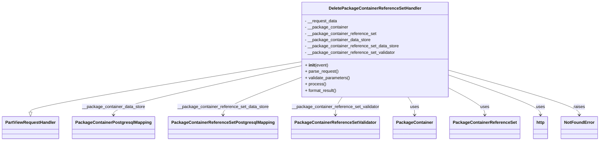

# Diagram: partview_core/partview_service/partview_service/api/package_container/reference/handler/DeletePackageContainerReferenceSetHandler.py


> Auto-generated by Obscura crawlers

## Diagram 1



### SVG

<svg id="container" width="2172.921875" xmlns="http://www.w3.org/2000/svg" class="classDiagram" height="534" viewBox="0 0 2172.921875 534" role="graphics-document document" aria-roledescription="class"><style>#container{font-family:"trebuchet ms",verdana,arial,sans-serif;font-size:16px;fill:#333;}@keyframes edge-animation-frame{from{stroke-dashoffset:0;}}@keyframes dash{to{stroke-dashoffset:0;}}#container .edge-animation-slow{stroke-dasharray:9,5!important;stroke-dashoffset:900;animation:dash 50s linear infinite;stroke-linecap:round;}#container .edge-animation-fast{stroke-dasharray:9,5!important;stroke-dashoffset:900;animation:dash 20s linear infinite;stroke-linecap:round;}#container .error-icon{fill:#552222;}#container .error-text{fill:#552222;stroke:#552222;}#container .edge-thickness-normal{stroke-width:1px;}#container .edge-thickness-thick{stroke-width:3.5px;}#container .edge-pattern-solid{stroke-dasharray:0;}#container .edge-thickness-invisible{stroke-width:0;fill:none;}#container .edge-pattern-dashed{stroke-dasharray:3;}#container .edge-pattern-dotted{stroke-dasharray:2;}#container .marker{fill:#333333;stroke:#333333;}#container .marker.cross{stroke:#333333;}#container svg{font-family:"trebuchet ms",verdana,arial,sans-serif;font-size:16px;}#container p{margin:0;}#container g.classGroup text{fill:#9370DB;stroke:none;font-family:"trebuchet ms",verdana,arial,sans-serif;font-size:10px;}#container g.classGroup text .title{font-weight:bolder;}#container .nodeLabel,#container .edgeLabel{color:#131300;}#container .edgeLabel .label rect{fill:#ECECFF;}#container .label text{fill:#131300;}#container .labelBkg{background:#ECECFF;}#container .edgeLabel .label span{background:#ECECFF;}#container .classTitle{font-weight:bolder;}#container .node rect,#container .node circle,#container .node ellipse,#container .node polygon,#container .node path{fill:#ECECFF;stroke:#9370DB;stroke-width:1px;}#container .divider{stroke:#9370DB;stroke-width:1;}#container g.clickable{cursor:pointer;}#container g.classGroup rect{fill:#ECECFF;stroke:#9370DB;}#container g.classGroup line{stroke:#9370DB;stroke-width:1;}#container .classLabel .box{stroke:none;stroke-width:0;fill:#ECECFF;opacity:0.5;}#container .classLabel .label{fill:#9370DB;font-size:10px;}#container .relation{stroke:#333333;stroke-width:1;fill:none;}#container .dashed-line{stroke-dasharray:3;}#container .dotted-line{stroke-dasharray:1 2;}#container #compositionStart,#container .composition{fill:#333333!important;stroke:#333333!important;stroke-width:1;}#container #compositionEnd,#container .composition{fill:#333333!important;stroke:#333333!important;stroke-width:1;}#container #dependencyStart,#container .dependency{fill:#333333!important;stroke:#333333!important;stroke-width:1;}#container #dependencyStart,#container .dependency{fill:#333333!important;stroke:#333333!important;stroke-width:1;}#container #extensionStart,#container .extension{fill:transparent!important;stroke:#333333!important;stroke-width:1;}#container #extensionEnd,#container .extension{fill:transparent!important;stroke:#333333!important;stroke-width:1;}#container #aggregationStart,#container .aggregation{fill:transparent!important;stroke:#333333!important;stroke-width:1;}#container #aggregationEnd,#container .aggregation{fill:transparent!important;stroke:#333333!important;stroke-width:1;}#container #lollipopStart,#container .lollipop{fill:#ECECFF!important;stroke:#333333!important;stroke-width:1;}#container #lollipopEnd,#container .lollipop{fill:#ECECFF!important;stroke:#333333!important;stroke-width:1;}#container .edgeTerminals{font-size:11px;line-height:initial;}#container .classTitleText{text-anchor:middle;font-size:18px;fill:#333;}#container .label-icon{display:inline-block;height:1em;overflow:visible;vertical-align:-0.125em;}#container .node .label-icon path{fill:currentColor;stroke:revert;stroke-width:revert;}#container :root{--mermaid-font-family:"trebuchet ms",verdana,arial,sans-serif;}</style><g><defs><marker id="container_class-aggregationStart" class="marker aggregation class" refX="18" refY="7" markerWidth="190" markerHeight="240" orient="auto"><path d="M 18,7 L9,13 L1,7 L9,1 Z"></path></marker></defs><defs><marker id="container_class-aggregationEnd" class="marker aggregation class" refX="1" refY="7" markerWidth="20" markerHeight="28" orient="auto"><path d="M 18,7 L9,13 L1,7 L9,1 Z"></path></marker></defs><defs><marker id="container_class-extensionStart" class="marker extension class" refX="18" refY="7" markerWidth="190" markerHeight="240" orient="auto"><path d="M 1,7 L18,13 V 1 Z"></path></marker></defs><defs><marker id="container_class-extensionEnd" class="marker extension class" refX="1" refY="7" markerWidth="20" markerHeight="28" orient="auto"><path d="M 1,1 V 13 L18,7 Z"></path></marker></defs><defs><marker id="container_class-compositionStart" class="marker composition class" refX="18" refY="7" markerWidth="190" markerHeight="240" orient="auto"><path d="M 18,7 L9,13 L1,7 L9,1 Z"></path></marker></defs><defs><marker id="container_class-compositionEnd" class="marker composition class" refX="1" refY="7" markerWidth="20" markerHeight="28" orient="auto"><path d="M 18,7 L9,13 L1,7 L9,1 Z"></path></marker></defs><defs><marker id="container_class-dependencyStart" class="marker dependency class" refX="6" refY="7" markerWidth="190" markerHeight="240" orient="auto"><path d="M 5,7 L9,13 L1,7 L9,1 Z"></path></marker></defs><defs><marker id="container_class-dependencyEnd" class="marker dependency class" refX="13" refY="7" markerWidth="20" markerHeight="28" orient="auto"><path d="M 18,7 L9,13 L14,7 L9,1 Z"></path></marker></defs><defs><marker id="container_class-lollipopStart" class="marker lollipop class" refX="13" refY="7" markerWidth="190" markerHeight="240" orient="auto"><circle stroke="black" fill="transparent" cx="7" cy="7" r="6"></circle></marker></defs><defs><marker id="container_class-lollipopEnd" class="marker lollipop class" refX="1" refY="7" markerWidth="190" markerHeight="240" orient="auto"><circle stroke="black" fill="transparent" cx="7" cy="7" r="6"></circle></marker></defs><g class="root"><g class="clusters"></g><g class="edgePaths"><path d="M1083.453,235.498L921.438,263.748C759.422,291.998,435.391,348.499,273.375,380.041C111.359,411.583,111.359,418.167,111.359,421.458L111.359,424.75" id="id_DeletePackageContainerReferenceSetHandler_PartViewRequestHandler_1" class="edge-thickness-normal edge-pattern-solid relation" style=";;;" data-edge="true" data-et="edge" data-id="id_DeletePackageContainerReferenceSetHandler_PartViewRequestHandler_1" data-points="W3sieCI6MTA4My40NTMxMjUsInkiOjIzNS40OTc2NTUyOTM2Mzc2fSx7IngiOjExMS4zNTkzNzUsInkiOjQwNX0seyJ4IjoxMTEuMzU5Mzc1LCJ5Ijo0NDJ9XQ==" marker-end="url(#container_class-extensionEnd)"></path><path d="M1083.453,250.665L971.639,276.387C859.826,302.11,636.198,353.555,524.384,384.444C412.57,415.333,412.57,425.667,412.57,430.833L412.57,436" id="id_DeletePackageContainerReferenceSetHandler_PackageContainerPostgresqlMapping_2" class="edge-thickness-normal edge-pattern-solid relation" style=";;;" data-edge="true" data-et="edge" data-id="id_DeletePackageContainerReferenceSetHandler_PackageContainerPostgresqlMapping_2" data-points="W3sieCI6MTA4My40NTMxMjUsInkiOjI1MC42NjQ3MjU4NTcyMTM4NX0seyJ4Ijo0MTIuNTcwMzEyNSwieSI6NDA1fSx7IngiOjQxMi41NzAzMTI1LCJ5Ijo0NDJ9XQ==" marker-end="url(#container_class-dependencyEnd)"></path><path d="M1083.453,295.671L1037.354,313.892C991.255,332.114,899.057,368.557,852.958,391.945C806.859,415.333,806.859,425.667,806.859,430.833L806.859,436" id="id_DeletePackageContainerReferenceSetHandler_PackageContainerReferenceSetPostgresqlMapping_3" class="edge-thickness-normal edge-pattern-solid relation" style=";;;" data-edge="true" data-et="edge" data-id="id_DeletePackageContainerReferenceSetHandler_PackageContainerReferenceSetPostgresqlMapping_3" data-points="W3sieCI6MTA4My40NTMxMjUsInkiOjI5NS42NzA4NTk5NTY0NTQzfSx7IngiOjgwNi44NTkzNzUsInkiOjQwNX0seyJ4Ijo4MDYuODU5Mzc1LCJ5Ijo0NDJ9XQ==" marker-end="url(#container_class-dependencyEnd)"></path><path d="M1236.955,368L1232.882,374.167C1228.809,380.333,1220.662,392.667,1216.589,404C1212.516,415.333,1212.516,425.667,1212.516,430.833L1212.516,436" id="id_DeletePackageContainerReferenceSetHandler_PackageContainerReferenceSetValidator_4" class="edge-thickness-normal edge-pattern-solid relation" style=";;;" data-edge="true" data-et="edge" data-id="id_DeletePackageContainerReferenceSetHandler_PackageContainerReferenceSetValidator_4" data-points="W3sieCI6MTIzNi45NTUzOTMxNDUxNjEyLCJ5IjozNjh9LHsieCI6MTIxMi41MTU2MjUsInkiOjQwNX0seyJ4IjoxMjEyLjUxNTYyNSwieSI6NDQyfV0=" marker-end="url(#container_class-dependencyEnd)"></path><path d="M1474.748,368L1478.821,374.167C1482.894,380.333,1491.041,392.667,1495.114,404C1499.188,415.333,1499.188,425.667,1499.188,430.833L1499.188,436" id="id_DeletePackageContainerReferenceSetHandler_PackageContainer_5" class="edge-thickness-normal edge-pattern-solid relation" style=";;;" data-edge="true" data-et="edge" data-id="id_DeletePackageContainerReferenceSetHandler_PackageContainer_5" data-points="W3sieCI6MTQ3NC43NDc3MzE4NTQ4Mzg4LCJ5IjozNjh9LHsieCI6MTQ5OS4xODc1LCJ5Ijo0MDV9LHsieCI6MTQ5OS4xODc1LCJ5Ijo0NDJ9XQ==" marker-end="url(#container_class-dependencyEnd)"></path><path d="M1628.25,336.957L1648.988,348.298C1669.727,359.638,1711.203,382.319,1731.941,398.826C1752.68,415.333,1752.68,425.667,1752.68,430.833L1752.68,436" id="id_DeletePackageContainerReferenceSetHandler_PackageContainerReferenceSet_6" class="edge-thickness-normal edge-pattern-solid relation" style=";;;" data-edge="true" data-et="edge" data-id="id_DeletePackageContainerReferenceSetHandler_PackageContainerReferenceSet_6" data-points="W3sieCI6MTYyOC4yNSwieSI6MzM2Ljk1NzMzNzQ4MDgwNDh9LHsieCI6MTc1Mi42Nzk2ODc1LCJ5Ijo0MDV9LHsieCI6MTc1Mi42Nzk2ODc1LCJ5Ijo0NDJ9XQ==" marker-end="url(#container_class-dependencyEnd)"></path><path d="M1628.25,286.446L1682.923,306.205C1737.596,325.964,1846.943,365.482,1901.616,390.408C1956.289,415.333,1956.289,425.667,1956.289,430.833L1956.289,436" id="id_DeletePackageContainerReferenceSetHandler_http_7" class="edge-thickness-normal edge-pattern-solid relation" style=";;;" data-edge="true" data-et="edge" data-id="id_DeletePackageContainerReferenceSetHandler_http_7" data-points="W3sieCI6MTYyOC4yNSwieSI6Mjg2LjQ0NTY1MTYwODIwMjM1fSx7IngiOjE5NTYuMjg5MDYyNSwieSI6NDA1fSx7IngiOjE5NTYuMjg5MDYyNSwieSI6NDQyfV0=" marker-end="url(#container_class-dependencyEnd)"></path><path d="M1628.25,267.499L1706.773,290.416C1785.297,313.333,1942.344,359.166,2020.867,387.25C2099.391,415.333,2099.391,425.667,2099.391,430.833L2099.391,436" id="id_DeletePackageContainerReferenceSetHandler_NotFoundError_8" class="edge-thickness-normal edge-pattern-solid relation" style=";;;" data-edge="true" data-et="edge" data-id="id_DeletePackageContainerReferenceSetHandler_NotFoundError_8" data-points="W3sieCI6MTYyOC4yNSwieSI6MjY3LjQ5ODc5NjkyNzcwMDF9LHsieCI6MjA5OS4zOTA2MjUsInkiOjQwNX0seyJ4IjoyMDk5LjM5MDYyNSwieSI6NDQyfV0=" marker-end="url(#container_class-dependencyEnd)"></path></g><g class="edgeLabels"><g class="edgeLabel"><g class="label" data-id="id_DeletePackageContainerReferenceSetHandler_PartViewRequestHandler_1" transform="translate(0, 0)"><foreignObject width="0" height="0"><div xmlns="http://www.w3.org/1999/xhtml" class="labelBkg" style="display: table-cell; white-space: nowrap; line-height: 1.5; max-width: 200px; text-align: center;"><span class="edgeLabel"></span></div></foreignObject></g></g><g class="edgeLabel" transform="translate(412.5703125, 405)"><g class="label" data-id="id_DeletePackageContainerReferenceSetHandler_PackageContainerPostgresqlMapping_2" transform="translate(-118.3984375, -12)"><foreignObject width="236.796875" height="24"><div xmlns="http://www.w3.org/1999/xhtml" class="labelBkg" style="display: table; white-space: break-spaces; line-height: 1.5; max-width: 200px; text-align: center; width: 200px;"><span class="edgeLabel"><p>__package_container_data_store</p></span></div></foreignObject></g></g><g class="edgeLabel" transform="translate(806.859375, 405)"><g class="label" data-id="id_DeletePackageContainerReferenceSetHandler_PackageContainerReferenceSetPostgresqlMapping_3" transform="translate(-171.625, -12)"><foreignObject width="343.25" height="24"><div xmlns="http://www.w3.org/1999/xhtml" class="labelBkg" style="display: table; white-space: break-spaces; line-height: 1.5; max-width: 200px; text-align: center; width: 200px;"><span class="edgeLabel"><p>__package_container_reference_set_data_store</p></span></div></foreignObject></g></g><g class="edgeLabel" transform="translate(1212.515625, 405)"><g class="label" data-id="id_DeletePackageContainerReferenceSetHandler_PackageContainerReferenceSetValidator_4" transform="translate(-165.03125, -12)"><foreignObject width="330.0625" height="24"><div xmlns="http://www.w3.org/1999/xhtml" class="labelBkg" style="display: table; white-space: break-spaces; line-height: 1.5; max-width: 200px; text-align: center; width: 200px;"><span class="edgeLabel"><p>__package_container_reference_set_validator</p></span></div></foreignObject></g></g><g class="edgeLabel" transform="translate(1499.1875, 405)"><g class="label" data-id="id_DeletePackageContainerReferenceSetHandler_PackageContainer_5" transform="translate(-16.4921875, -12)"><foreignObject width="32.984375" height="24"><div xmlns="http://www.w3.org/1999/xhtml" class="labelBkg" style="display: table-cell; white-space: nowrap; line-height: 1.5; max-width: 200px; text-align: center;"><span class="edgeLabel"><p>uses</p></span></div></foreignObject></g></g><g class="edgeLabel" transform="translate(1752.6796875, 405)"><g class="label" data-id="id_DeletePackageContainerReferenceSetHandler_PackageContainerReferenceSet_6" transform="translate(-16.4921875, -12)"><foreignObject width="32.984375" height="24"><div xmlns="http://www.w3.org/1999/xhtml" class="labelBkg" style="display: table-cell; white-space: nowrap; line-height: 1.5; max-width: 200px; text-align: center;"><span class="edgeLabel"><p>uses</p></span></div></foreignObject></g></g><g class="edgeLabel" transform="translate(1956.2890625, 405)"><g class="label" data-id="id_DeletePackageContainerReferenceSetHandler_http_7" transform="translate(-16.4921875, -12)"><foreignObject width="32.984375" height="24"><div xmlns="http://www.w3.org/1999/xhtml" class="labelBkg" style="display: table-cell; white-space: nowrap; line-height: 1.5; max-width: 200px; text-align: center;"><span class="edgeLabel"><p>uses</p></span></div></foreignObject></g></g><g class="edgeLabel" transform="translate(2099.390625, 405)"><g class="label" data-id="id_DeletePackageContainerReferenceSetHandler_NotFoundError_8" transform="translate(-21.25, -12)"><foreignObject width="42.5" height="24"><div xmlns="http://www.w3.org/1999/xhtml" class="labelBkg" style="display: table-cell; white-space: nowrap; line-height: 1.5; max-width: 200px; text-align: center;"><span class="edgeLabel"><p>raises</p></span></div></foreignObject></g></g></g><g class="nodes"><g class="node default" id="classId-DeletePackageContainerReferenceSetHandler-0" transform="translate(1355.8515625, 188)"><g class="basic label-container"><path d="M-272.3984375 -180 L272.3984375 -180 L272.3984375 180 L-272.3984375 180" stroke="none" stroke-width="0" fill="#ECECFF" style=""></path><path d="M-272.3984375 -180 C-84.12774242128657 -180, 104.14295265742686 -180, 272.3984375 -180 M-272.3984375 -180 C-139.45135190039343 -180, -6.504266300786867 -180, 272.3984375 -180 M272.3984375 -180 C272.3984375 -78.04109646767827, 272.3984375 23.917807064643455, 272.3984375 180 M272.3984375 -180 C272.3984375 -101.80426337004549, 272.3984375 -23.60852674009098, 272.3984375 180 M272.3984375 180 C138.05773176419055 180, 3.717026028381099 180, -272.3984375 180 M272.3984375 180 C60.18226246900514 180, -152.03391256198972 180, -272.3984375 180 M-272.3984375 180 C-272.3984375 79.74519176488297, -272.3984375 -20.50961647023405, -272.3984375 -180 M-272.3984375 180 C-272.3984375 85.70367292228656, -272.3984375 -8.592654155426885, -272.3984375 -180" stroke="#9370DB" stroke-width="1.3" fill="none" stroke-dasharray="0 0" style=""></path></g><g class="annotation-group text" transform="translate(0, -156)"></g><g class="label-group text" transform="translate(-166.859375, -156)"><g class="label" style="font-weight: bolder" transform="translate(0,-12)"><foreignObject width="333.71875" height="24"><div xmlns="http://www.w3.org/1999/xhtml" style="display: table-cell; white-space: nowrap; line-height: 1.5; max-width: 379px; text-align: center;"><span class="nodeLabel markdown-node-label" style=""><p>DeletePackageContainerReferenceSetHandler</p></span></div></foreignObject></g></g><g class="members-group text" transform="translate(-260.3984375, -108)"><g class="label" style="" transform="translate(0,-12)"><foreignObject width="123.078125" height="24"><div xmlns="http://www.w3.org/1999/xhtml" style="display: table-cell; white-space: nowrap; line-height: 1.5; max-width: 180px; text-align: center;"><span class="nodeLabel markdown-node-label" style=""><p>- __request_data</p></span></div></foreignObject></g><g class="label" style="" transform="translate(0,12)"><foreignObject width="163.03125" height="24"><div xmlns="http://www.w3.org/1999/xhtml" style="display: table-cell; white-space: nowrap; line-height: 1.5; max-width: 221px; text-align: center;"><span class="nodeLabel markdown-node-label" style=""><p>- __package_container</p></span></div></foreignObject></g><g class="label" style="" transform="translate(0,36)"><foreignObject width="268.21875" height="24"><div xmlns="http://www.w3.org/1999/xhtml" style="display: table-cell; white-space: nowrap; line-height: 1.5; max-width: 326px; text-align: center;"><span class="nodeLabel markdown-node-label" style=""><p>- __package_container_reference_set</p></span></div></foreignObject></g><g class="label" style="" transform="translate(0,60)"><foreignObject width="247.484375" height="24"><div xmlns="http://www.w3.org/1999/xhtml" style="display: table-cell; white-space: nowrap; line-height: 1.5; max-width: 305px; text-align: center;"><span class="nodeLabel markdown-node-label" style=""><p>- __package_container_data_store</p></span></div></foreignObject></g><g class="label" style="" transform="translate(0,84)"><foreignObject width="353.9375" height="24"><div xmlns="http://www.w3.org/1999/xhtml" style="display: table-cell; white-space: nowrap; line-height: 1.5; max-width: 411px; text-align: center;"><span class="nodeLabel markdown-node-label" style=""><p>- __package_container_reference_set_data_store</p></span></div></foreignObject></g><g class="label" style="" transform="translate(0,108)"><foreignObject width="340.75" height="24"><div xmlns="http://www.w3.org/1999/xhtml" style="display: table-cell; white-space: nowrap; line-height: 1.5; max-width: 399px; text-align: center;"><span class="nodeLabel markdown-node-label" style=""><p>- __package_container_reference_set_validator</p></span></div></foreignObject></g></g><g class="methods-group text" transform="translate(-260.3984375, 60)"><g class="label" style="" transform="translate(0,-12)"><foreignObject width="87.390625" height="24"><div xmlns="http://www.w3.org/1999/xhtml" style="display: table-cell; white-space: nowrap; line-height: 1.5; max-width: 177px; text-align: center;"><span class="nodeLabel markdown-node-label" style=""><p>+ <strong>init</strong>(event)</p></span></div></foreignObject></g><g class="label" style="" transform="translate(0,12)"><foreignObject width="126.046875" height="24"><div xmlns="http://www.w3.org/1999/xhtml" style="display: table-cell; white-space: nowrap; line-height: 1.5; max-width: 183px; text-align: center;"><span class="nodeLabel markdown-node-label" style=""><p>+ parse_request()</p></span></div></foreignObject></g><g class="label" style="" transform="translate(0,36)"><foreignObject width="170.953125" height="24"><div xmlns="http://www.w3.org/1999/xhtml" style="display: table-cell; white-space: nowrap; line-height: 1.5; max-width: 228px; text-align: center;"><span class="nodeLabel markdown-node-label" style=""><p>+ validate_parameters()</p></span></div></foreignObject></g><g class="label" style="" transform="translate(0,60)"><foreignObject width="77.96875" height="24"><div xmlns="http://www.w3.org/1999/xhtml" style="display: table-cell; white-space: nowrap; line-height: 1.5; max-width: 135px; text-align: center;"><span class="nodeLabel markdown-node-label" style=""><p>+ process()</p></span></div></foreignObject></g><g class="label" style="" transform="translate(0,84)"><foreignObject width="121.5" height="24"><div xmlns="http://www.w3.org/1999/xhtml" style="display: table-cell; white-space: nowrap; line-height: 1.5; max-width: 179px; text-align: center;"><span class="nodeLabel markdown-node-label" style=""><p>+ format_result()</p></span></div></foreignObject></g></g><g class="divider" style=""><path d="M-272.3984375 -132 C-90.46550419099142 -132, 91.46742911801715 -132, 272.3984375 -132 M-272.3984375 -132 C-140.6661003824247 -132, -8.933763264849404 -132, 272.3984375 -132" stroke="#9370DB" stroke-width="1.3" fill="none" stroke-dasharray="0 0" style=""></path></g><g class="divider" style=""><path d="M-272.3984375 36 C-55.706259994127436 36, 160.98591751174513 36, 272.3984375 36 M-272.3984375 36 C-127.0556766061446 36, 18.287084287710798 36, 272.3984375 36" stroke="#9370DB" stroke-width="1.3" fill="none" stroke-dasharray="0 0" style=""></path></g></g><g class="node default" id="classId-PartViewRequestHandler-1" transform="translate(111.359375, 484)"><g class="basic label-container"><path d="M-103.359375 -42 L103.359375 -42 L103.359375 42 L-103.359375 42" stroke="none" stroke-width="0" fill="#ECECFF" style=""></path><path d="M-103.359375 -42 C-60.019329615621395 -42, -16.67928423124279 -42, 103.359375 -42 M-103.359375 -42 C-48.415901404852114 -42, 6.527572190295771 -42, 103.359375 -42 M103.359375 -42 C103.359375 -13.393650251312987, 103.359375 15.212699497374025, 103.359375 42 M103.359375 -42 C103.359375 -22.012512661778892, 103.359375 -2.0250253235577844, 103.359375 42 M103.359375 42 C30.60568680428419 42, -42.14800139143162 42, -103.359375 42 M103.359375 42 C62.01536564504989 42, 20.67135629009978 42, -103.359375 42 M-103.359375 42 C-103.359375 15.696461273951694, -103.359375 -10.607077452096611, -103.359375 -42 M-103.359375 42 C-103.359375 25.007267980931594, -103.359375 8.014535961863189, -103.359375 -42" stroke="#9370DB" stroke-width="1.3" fill="none" stroke-dasharray="0 0" style=""></path></g><g class="annotation-group text" transform="translate(0, -18)"></g><g class="label-group text" transform="translate(-91.359375, -18)"><g class="label" style="font-weight: bolder" transform="translate(0,-12)"><foreignObject width="182.71875" height="24"><div xmlns="http://www.w3.org/1999/xhtml" style="display: table-cell; white-space: nowrap; line-height: 1.5; max-width: 231px; text-align: center;"><span class="nodeLabel markdown-node-label" style=""><p>PartViewRequestHandler</p></span></div></foreignObject></g></g><g class="members-group text" transform="translate(-91.359375, 30)"></g><g class="methods-group text" transform="translate(-91.359375, 60)"></g><g class="divider" style=""><path d="M-103.359375 6 C-55.73877652906639 6, -8.118178058132784 6, 103.359375 6 M-103.359375 6 C-57.790959257653604 6, -12.222543515307208 6, 103.359375 6" stroke="#9370DB" stroke-width="1.3" fill="none" stroke-dasharray="0 0" style=""></path></g><g class="divider" style=""><path d="M-103.359375 24 C-28.789255349803383 24, 45.78086430039323 24, 103.359375 24 M-103.359375 24 C-31.635531224019132 24, 40.088312551961735 24, 103.359375 24" stroke="#9370DB" stroke-width="1.3" fill="none" stroke-dasharray="0 0" style=""></path></g></g><g class="node default" id="classId-PackageContainer-2" transform="translate(1499.1875, 484)"><g class="basic label-container"><path d="M-77.453125 -42 L77.453125 -42 L77.453125 42 L-77.453125 42" stroke="none" stroke-width="0" fill="#ECECFF" style=""></path><path d="M-77.453125 -42 C-29.202257683478926 -42, 19.048609633042147 -42, 77.453125 -42 M-77.453125 -42 C-26.00058258155167 -42, 25.451959836896663 -42, 77.453125 -42 M77.453125 -42 C77.453125 -16.948741324612907, 77.453125 8.102517350774185, 77.453125 42 M77.453125 -42 C77.453125 -16.872338099434987, 77.453125 8.255323801130025, 77.453125 42 M77.453125 42 C23.38937464970308 42, -30.674375700593842 42, -77.453125 42 M77.453125 42 C30.276259829963173 42, -16.900605340073653 42, -77.453125 42 M-77.453125 42 C-77.453125 23.493155666866215, -77.453125 4.986311333732431, -77.453125 -42 M-77.453125 42 C-77.453125 15.113611651912148, -77.453125 -11.772776696175704, -77.453125 -42" stroke="#9370DB" stroke-width="1.3" fill="none" stroke-dasharray="0 0" style=""></path></g><g class="annotation-group text" transform="translate(0, -18)"></g><g class="label-group text" transform="translate(-65.453125, -18)"><g class="label" style="font-weight: bolder" transform="translate(0,-12)"><foreignObject width="130.90625" height="24"><div xmlns="http://www.w3.org/1999/xhtml" style="display: table-cell; white-space: nowrap; line-height: 1.5; max-width: 179px; text-align: center;"><span class="nodeLabel markdown-node-label" style=""><p>PackageContainer</p></span></div></foreignObject></g></g><g class="members-group text" transform="translate(-65.453125, 30)"></g><g class="methods-group text" transform="translate(-65.453125, 60)"></g><g class="divider" style=""><path d="M-77.453125 6 C-42.396471234915744 6, -7.3398174698314875 6, 77.453125 6 M-77.453125 6 C-33.18411044664676 6, 11.084904106706475 6, 77.453125 6" stroke="#9370DB" stroke-width="1.3" fill="none" stroke-dasharray="0 0" style=""></path></g><g class="divider" style=""><path d="M-77.453125 24 C-35.39123443885724 24, 6.670656122285521 24, 77.453125 24 M-77.453125 24 C-37.79348406739223 24, 1.8661568652155438 24, 77.453125 24" stroke="#9370DB" stroke-width="1.3" fill="none" stroke-dasharray="0 0" style=""></path></g></g><g class="node default" id="classId-PackageContainerReferenceSet-3" transform="translate(1752.6796875, 484)"><g class="basic label-container"><path d="M-126.0390625 -42 L126.0390625 -42 L126.0390625 42 L-126.0390625 42" stroke="none" stroke-width="0" fill="#ECECFF" style=""></path><path d="M-126.0390625 -42 C-42.12221721562577 -42, 41.794628068748466 -42, 126.0390625 -42 M-126.0390625 -42 C-26.457308628027846 -42, 73.12444524394431 -42, 126.0390625 -42 M126.0390625 -42 C126.0390625 -21.33323132466542, 126.0390625 -0.666462649330839, 126.0390625 42 M126.0390625 -42 C126.0390625 -21.853346470729946, 126.0390625 -1.7066929414598917, 126.0390625 42 M126.0390625 42 C56.98878399594582 42, -12.061494508108353 42, -126.0390625 42 M126.0390625 42 C44.37987244633385 42, -37.2793176073323 42, -126.0390625 42 M-126.0390625 42 C-126.0390625 19.100529395608977, -126.0390625 -3.798941208782047, -126.0390625 -42 M-126.0390625 42 C-126.0390625 22.78104941266096, -126.0390625 3.562098825321918, -126.0390625 -42" stroke="#9370DB" stroke-width="1.3" fill="none" stroke-dasharray="0 0" style=""></path></g><g class="annotation-group text" transform="translate(0, -18)"></g><g class="label-group text" transform="translate(-114.0390625, -18)"><g class="label" style="font-weight: bolder" transform="translate(0,-12)"><foreignObject width="228.078125" height="24"><div xmlns="http://www.w3.org/1999/xhtml" style="display: table-cell; white-space: nowrap; line-height: 1.5; max-width: 274px; text-align: center;"><span class="nodeLabel markdown-node-label" style=""><p>PackageContainerReferenceSet</p></span></div></foreignObject></g></g><g class="members-group text" transform="translate(-114.0390625, 30)"></g><g class="methods-group text" transform="translate(-114.0390625, 60)"></g><g class="divider" style=""><path d="M-126.0390625 6 C-54.38665345558174 6, 17.265755588836527 6, 126.0390625 6 M-126.0390625 6 C-58.951602521014024 6, 8.135857457971952 6, 126.0390625 6" stroke="#9370DB" stroke-width="1.3" fill="none" stroke-dasharray="0 0" style=""></path></g><g class="divider" style=""><path d="M-126.0390625 24 C-44.22366733359553 24, 37.59172783280894 24, 126.0390625 24 M-126.0390625 24 C-67.10123637512964 24, -8.16341025025929 24, 126.0390625 24" stroke="#9370DB" stroke-width="1.3" fill="none" stroke-dasharray="0 0" style=""></path></g></g><g class="node default" id="classId-PackageContainerPostgresqlMapping-4" transform="translate(412.5703125, 484)"><g class="basic label-container"><path d="M-147.8515625 -42 L147.8515625 -42 L147.8515625 42 L-147.8515625 42" stroke="none" stroke-width="0" fill="#ECECFF" style=""></path><path d="M-147.8515625 -42 C-57.7912889271837 -42, 32.2689846456326 -42, 147.8515625 -42 M-147.8515625 -42 C-34.370738811222296 -42, 79.11008487755541 -42, 147.8515625 -42 M147.8515625 -42 C147.8515625 -12.979574915369327, 147.8515625 16.040850169261347, 147.8515625 42 M147.8515625 -42 C147.8515625 -9.66240854972532, 147.8515625 22.67518290054936, 147.8515625 42 M147.8515625 42 C44.21400131922526 42, -59.42355986154948 42, -147.8515625 42 M147.8515625 42 C43.25107355760504 42, -61.34941538478992 42, -147.8515625 42 M-147.8515625 42 C-147.8515625 22.92247481454108, -147.8515625 3.8449496290821585, -147.8515625 -42 M-147.8515625 42 C-147.8515625 20.285068588694934, -147.8515625 -1.4298628226101329, -147.8515625 -42" stroke="#9370DB" stroke-width="1.3" fill="none" stroke-dasharray="0 0" style=""></path></g><g class="annotation-group text" transform="translate(0, -18)"></g><g class="label-group text" transform="translate(-135.8515625, -18)"><g class="label" style="font-weight: bolder" transform="translate(0,-12)"><foreignObject width="271.703125" height="24"><div xmlns="http://www.w3.org/1999/xhtml" style="display: table-cell; white-space: nowrap; line-height: 1.5; max-width: 317px; text-align: center;"><span class="nodeLabel markdown-node-label" style=""><p>PackageContainerPostgresqlMapping</p></span></div></foreignObject></g></g><g class="members-group text" transform="translate(-135.8515625, 30)"></g><g class="methods-group text" transform="translate(-135.8515625, 60)"></g><g class="divider" style=""><path d="M-147.8515625 6 C-39.84155102206452 6, 68.16846045587096 6, 147.8515625 6 M-147.8515625 6 C-61.25032268722387 6, 25.350917125552257 6, 147.8515625 6" stroke="#9370DB" stroke-width="1.3" fill="none" stroke-dasharray="0 0" style=""></path></g><g class="divider" style=""><path d="M-147.8515625 24 C-31.039755964134457 24, 85.77205057173109 24, 147.8515625 24 M-147.8515625 24 C-75.57213677268841 24, -3.2927110453768194 24, 147.8515625 24" stroke="#9370DB" stroke-width="1.3" fill="none" stroke-dasharray="0 0" style=""></path></g></g><g class="node default" id="classId-PackageContainerReferenceSetPostgresqlMapping-5" transform="translate(806.859375, 484)"><g class="basic label-container"><path d="M-196.4375 -42 L196.4375 -42 L196.4375 42 L-196.4375 42" stroke="none" stroke-width="0" fill="#ECECFF" style=""></path><path d="M-196.4375 -42 C-96.3652277522651 -42, 3.707044495469802 -42, 196.4375 -42 M-196.4375 -42 C-102.49242133852746 -42, -8.547342677054928 -42, 196.4375 -42 M196.4375 -42 C196.4375 -9.80092240071589, 196.4375 22.39815519856822, 196.4375 42 M196.4375 -42 C196.4375 -11.272238426789002, 196.4375 19.455523146421996, 196.4375 42 M196.4375 42 C94.52867866958813 42, -7.380142660823736 42, -196.4375 42 M196.4375 42 C82.56895677729302 42, -31.29958644541395 42, -196.4375 42 M-196.4375 42 C-196.4375 11.427673847025932, -196.4375 -19.144652305948135, -196.4375 -42 M-196.4375 42 C-196.4375 11.979296755662997, -196.4375 -18.041406488674006, -196.4375 -42" stroke="#9370DB" stroke-width="1.3" fill="none" stroke-dasharray="0 0" style=""></path></g><g class="annotation-group text" transform="translate(0, -18)"></g><g class="label-group text" transform="translate(-184.4375, -18)"><g class="label" style="font-weight: bolder" transform="translate(0,-12)"><foreignObject width="368.875" height="24"><div xmlns="http://www.w3.org/1999/xhtml" style="display: table-cell; white-space: nowrap; line-height: 1.5; max-width: 412px; text-align: center;"><span class="nodeLabel markdown-node-label" style=""><p>PackageContainerReferenceSetPostgresqlMapping</p></span></div></foreignObject></g></g><g class="members-group text" transform="translate(-184.4375, 30)"></g><g class="methods-group text" transform="translate(-184.4375, 60)"></g><g class="divider" style=""><path d="M-196.4375 6 C-47.750393641184985 6, 100.93671271763003 6, 196.4375 6 M-196.4375 6 C-76.85295817355305 6, 42.7315836528939 6, 196.4375 6" stroke="#9370DB" stroke-width="1.3" fill="none" stroke-dasharray="0 0" style=""></path></g><g class="divider" style=""><path d="M-196.4375 24 C-114.93077552687045 24, -33.4240510537409 24, 196.4375 24 M-196.4375 24 C-61.28457330363392 24, 73.86835339273216 24, 196.4375 24" stroke="#9370DB" stroke-width="1.3" fill="none" stroke-dasharray="0 0" style=""></path></g></g><g class="node default" id="classId-PackageContainerReferenceSetValidator-6" transform="translate(1212.515625, 484)"><g class="basic label-container"><path d="M-159.21875 -42 L159.21875 -42 L159.21875 42 L-159.21875 42" stroke="none" stroke-width="0" fill="#ECECFF" style=""></path><path d="M-159.21875 -42 C-83.81827338079862 -42, -8.41779676159723 -42, 159.21875 -42 M-159.21875 -42 C-95.07687497672394 -42, -30.934999953447885 -42, 159.21875 -42 M159.21875 -42 C159.21875 -9.315132932528911, 159.21875 23.369734134942178, 159.21875 42 M159.21875 -42 C159.21875 -23.977795322017336, 159.21875 -5.955590644034672, 159.21875 42 M159.21875 42 C88.51061568031676 42, 17.80248136063352 42, -159.21875 42 M159.21875 42 C54.858955177080475 42, -49.50083964583905 42, -159.21875 42 M-159.21875 42 C-159.21875 10.655035488251773, -159.21875 -20.689929023496454, -159.21875 -42 M-159.21875 42 C-159.21875 11.768874654267115, -159.21875 -18.46225069146577, -159.21875 -42" stroke="#9370DB" stroke-width="1.3" fill="none" stroke-dasharray="0 0" style=""></path></g><g class="annotation-group text" transform="translate(0, -18)"></g><g class="label-group text" transform="translate(-147.21875, -18)"><g class="label" style="font-weight: bolder" transform="translate(0,-12)"><foreignObject width="294.4375" height="24"><div xmlns="http://www.w3.org/1999/xhtml" style="display: table-cell; white-space: nowrap; line-height: 1.5; max-width: 340px; text-align: center;"><span class="nodeLabel markdown-node-label" style=""><p>PackageContainerReferenceSetValidator</p></span></div></foreignObject></g></g><g class="members-group text" transform="translate(-147.21875, 30)"></g><g class="methods-group text" transform="translate(-147.21875, 60)"></g><g class="divider" style=""><path d="M-159.21875 6 C-44.92773884746087 6, 69.36327230507825 6, 159.21875 6 M-159.21875 6 C-56.45550550825327 6, 46.307738983493465 6, 159.21875 6" stroke="#9370DB" stroke-width="1.3" fill="none" stroke-dasharray="0 0" style=""></path></g><g class="divider" style=""><path d="M-159.21875 24 C-81.58109084227824 24, -3.9434316845564865 24, 159.21875 24 M-159.21875 24 C-88.72015896394558 24, -18.221567927891158 24, 159.21875 24" stroke="#9370DB" stroke-width="1.3" fill="none" stroke-dasharray="0 0" style=""></path></g></g><g class="node default" id="classId-NotFoundError-7" transform="translate(2099.390625, 484)"><g class="basic label-container"><path d="M-65.53125 -42 L65.53125 -42 L65.53125 42 L-65.53125 42" stroke="none" stroke-width="0" fill="#ECECFF" style=""></path><path d="M-65.53125 -42 C-16.713986069263207 -42, 32.103277861473586 -42, 65.53125 -42 M-65.53125 -42 C-36.8142347169064 -42, -8.097219433812796 -42, 65.53125 -42 M65.53125 -42 C65.53125 -9.394594908761391, 65.53125 23.210810182477218, 65.53125 42 M65.53125 -42 C65.53125 -13.568513579459772, 65.53125 14.862972841080456, 65.53125 42 M65.53125 42 C36.5349370479114 42, 7.53862409582279 42, -65.53125 42 M65.53125 42 C16.552129879913544 42, -32.42699024017291 42, -65.53125 42 M-65.53125 42 C-65.53125 14.011499682417607, -65.53125 -13.977000635164785, -65.53125 -42 M-65.53125 42 C-65.53125 10.445470418160166, -65.53125 -21.109059163679667, -65.53125 -42" stroke="#9370DB" stroke-width="1.3" fill="none" stroke-dasharray="0 0" style=""></path></g><g class="annotation-group text" transform="translate(0, -18)"></g><g class="label-group text" transform="translate(-53.53125, -18)"><g class="label" style="font-weight: bolder" transform="translate(0,-12)"><foreignObject width="107.0625" height="24"><div xmlns="http://www.w3.org/1999/xhtml" style="display: table-cell; white-space: nowrap; line-height: 1.5; max-width: 158px; text-align: center;"><span class="nodeLabel markdown-node-label" style=""><p>NotFoundError</p></span></div></foreignObject></g></g><g class="members-group text" transform="translate(-53.53125, 30)"></g><g class="methods-group text" transform="translate(-53.53125, 60)"></g><g class="divider" style=""><path d="M-65.53125 6 C-22.525462678762096 6, 20.480324642475807 6, 65.53125 6 M-65.53125 6 C-16.879625403458498 6, 31.771999193083005 6, 65.53125 6" stroke="#9370DB" stroke-width="1.3" fill="none" stroke-dasharray="0 0" style=""></path></g><g class="divider" style=""><path d="M-65.53125 24 C-39.25405830488635 24, -12.9768666097727 24, 65.53125 24 M-65.53125 24 C-36.32420635084447 24, -7.11716270168894 24, 65.53125 24" stroke="#9370DB" stroke-width="1.3" fill="none" stroke-dasharray="0 0" style=""></path></g></g><g class="node default" id="classId-http-8" transform="translate(1956.2890625, 484)"><g class="basic label-container"><path d="M-27.5703125 -42 L27.5703125 -42 L27.5703125 42 L-27.5703125 42" stroke="none" stroke-width="0" fill="#ECECFF" style=""></path><path d="M-27.5703125 -42 C-15.684613166410985 -42, -3.7989138328219703 -42, 27.5703125 -42 M-27.5703125 -42 C-8.942443481014632 -42, 9.685425537970737 -42, 27.5703125 -42 M27.5703125 -42 C27.5703125 -17.825569517687917, 27.5703125 6.348860964624166, 27.5703125 42 M27.5703125 -42 C27.5703125 -12.501924844364343, 27.5703125 16.996150311271315, 27.5703125 42 M27.5703125 42 C14.002229525458027 42, 0.43414655091605425 42, -27.5703125 42 M27.5703125 42 C11.740128027809584 42, -4.090056444380831 42, -27.5703125 42 M-27.5703125 42 C-27.5703125 12.825727565391173, -27.5703125 -16.348544869217655, -27.5703125 -42 M-27.5703125 42 C-27.5703125 14.749596655096827, -27.5703125 -12.500806689806346, -27.5703125 -42" stroke="#9370DB" stroke-width="1.3" fill="none" stroke-dasharray="0 0" style=""></path></g><g class="annotation-group text" transform="translate(0, -18)"></g><g class="label-group text" transform="translate(-15.5703125, -18)"><g class="label" style="font-weight: bolder" transform="translate(0,-12)"><foreignObject width="31.140625" height="24"><div xmlns="http://www.w3.org/1999/xhtml" style="display: table-cell; white-space: nowrap; line-height: 1.5; max-width: 80px; text-align: center;"><span class="nodeLabel markdown-node-label" style=""><p>http</p></span></div></foreignObject></g></g><g class="members-group text" transform="translate(-15.5703125, 30)"></g><g class="methods-group text" transform="translate(-15.5703125, 60)"></g><g class="divider" style=""><path d="M-27.5703125 6 C-11.529251204679227 6, 4.511810090641546 6, 27.5703125 6 M-27.5703125 6 C-10.305795043541572 6, 6.958722412916856 6, 27.5703125 6" stroke="#9370DB" stroke-width="1.3" fill="none" stroke-dasharray="0 0" style=""></path></g><g class="divider" style=""><path d="M-27.5703125 24 C-15.86575585384957 24, -4.161199207699141 24, 27.5703125 24 M-27.5703125 24 C-12.74086653972852 24, 2.0885794205429598 24, 27.5703125 24" stroke="#9370DB" stroke-width="1.3" fill="none" stroke-dasharray="0 0" style=""></path></g></g></g></g></g></svg>

## Diagram 2

```mermaid
flowchart LR
    A[parse_request] --> B[validate_parameters]
    B --> C[process]
    C --> D{pathParameters.type == "app"}
    D -->|yes| E[search PackageContainer by tracking_number & solution_id]
    D --> F{pathParameters.type == "api"}
    F -->|yes| G[read PackageContainer by id & solution_id]
    E --> H[set __package_container]
    G --> H
    H --> I{__package_container exists?}
    I -->|no| J[raise NotFoundError("Invalid package_container")]
    I -->|yes| K[set container_id & solution_id on PackageContainerReferenceSet]
    K --> L[search PackageContainerReferenceSet]
    L --> M{reference set found?}
    M -->|no| N[raise NotFoundError("This package does not contain references.")]
    M -->|yes| O[hard_delete(reference set)]
    O --> P[format_result -> {"status":"deleted"}, HTTP 200]
    J --> Q[stop]
    N --> Q
```

> SVG rendering failed for this diagram.
