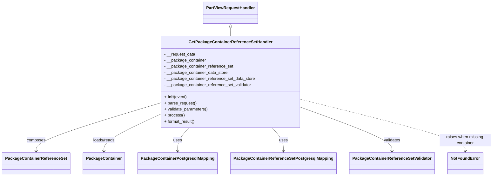

# Diagram: partview_core/partview_service/partview_service/api/package_container/reference/handler/GetPackageContainerReferenceSetHandler.py

> Auto-generated by Obscura crawlers

## Mermaid

### SVG

<svg id="container" width="1845.53125" xmlns="http://www.w3.org/2000/svg" class="classDiagram" height="692" viewBox="0 0 1845.53125 692" role="graphics-document document" aria-roledescription="class"><g><defs><marker id="container_class-aggregationStart" class="marker aggregation class" refX="18" refY="7" markerWidth="190" markerHeight="240" orient="auto"><path d="M 18,7 L9,13 L1,7 L9,1 Z"></path></marker></defs><defs><marker id="container_class-aggregationEnd" class="marker aggregation class" refX="1" refY="7" markerWidth="20" markerHeight="28" orient="auto"><path d="M 18,7 L9,13 L1,7 L9,1 Z"></path></marker></defs><defs><marker id="container_class-extensionStart" class="marker extension class" refX="18" refY="7" markerWidth="190" markerHeight="240" orient="auto"><path d="M 1,7 L18,13 V 1 Z"></path></marker></defs><defs><marker id="container_class-extensionEnd" class="marker extension class" refX="1" refY="7" markerWidth="20" markerHeight="28" orient="auto"><path d="M 1,1 V 13 L18,7 Z"></path></marker></defs><defs><marker id="container_class-compositionStart" class="marker composition class" refX="18" refY="7" markerWidth="190" markerHeight="240" orient="auto"><path d="M 18,7 L9,13 L1,7 L9,1 Z"></path></marker></defs><defs><marker id="container_class-compositionEnd" class="marker composition class" refX="1" refY="7" markerWidth="20" markerHeight="28" orient="auto"><path d="M 18,7 L9,13 L1,7 L9,1 Z"></path></marker></defs><defs><marker id="container_class-dependencyStart" class="marker dependency class" refX="6" refY="7" markerWidth="190" markerHeight="240" orient="auto"><path d="M 5,7 L9,13 L1,7 L9,1 Z"></path></marker></defs><defs><marker id="container_class-dependencyEnd" class="marker dependency class" refX="13" refY="7" markerWidth="20" markerHeight="28" orient="auto"><path d="M 18,7 L9,13 L14,7 L9,1 Z"></path></marker></defs><defs><marker id="container_class-lollipopStart" class="marker lollipop class" refX="13" refY="7" markerWidth="190" markerHeight="240" orient="auto"><circle stroke="black" fill="transparent" cx="7" cy="7" r="6"></circle></marker></defs><defs><marker id="container_class-lollipopEnd" class="marker lollipop class" refX="1" refY="7" markerWidth="190" markerHeight="240" orient="auto"><circle stroke="black" fill="transparent" cx="7" cy="7" r="6"></circle></marker></defs><g class="root"><g class="clusters"></g><g class="edgePaths"><path d="M859.98,109.25L859.98,110.542C859.98,111.833,859.98,114.417,859.98,119.875C859.98,125.333,859.98,133.667,859.98,137.833L859.98,142" id="id_PartViewRequestHandler_GetPackageContainerReferenceSetHandler_1" class="edge-thickness-normal edge-pattern-solid relation" style=";;;" data-edge="true" data-et="edge" data-id="id_PartViewRequestHandler_GetPackageContainerReferenceSetHandler_1" data-points="W3sieCI6ODU5Ljk4MDQ2ODc1LCJ5Ijo5Mn0seyJ4Ijo4NTkuOTgwNDY4NzUsInkiOjExN30seyJ4Ijo4NTkuOTgwNDY4NzUsInkiOjE0Mn1d" marker-start="url(#container_class-extensionStart)"></path><path d="M593.117,406.183L516.604,430.319C440.091,454.455,287.065,502.728,210.552,534.03C134.039,565.333,134.039,579.667,134.039,586.833L134.039,594" id="id_GetPackageContainerReferenceSetHandler_PackageContainerReferenceSet_2" class="edge-thickness-normal edge-pattern-solid relation" style=";;;" data-edge="true" data-et="edge" data-id="id_GetPackageContainerReferenceSetHandler_PackageContainerReferenceSet_2" data-points="W3sieCI6NTkzLjExNzE4NzUsInkiOjQwNi4xODI2Nzc2NjUzMTYxfSx7IngiOjEzNC4wMzkwNjI1LCJ5Ijo1NTF9LHsieCI6MTM0LjAzOTA2MjUsInkiOjYwMH1d" marker-end="url(#container_class-dependencyEnd)"></path><path d="M593.117,451.351L558.853,467.959C524.589,484.567,456.06,517.784,421.796,541.558C387.531,565.333,387.531,579.667,387.531,586.833L387.531,594" id="id_GetPackageContainerReferenceSetHandler_PackageContainer_3" class="edge-thickness-normal edge-pattern-solid relation" style=";;;" data-edge="true" data-et="edge" data-id="id_GetPackageContainerReferenceSetHandler_PackageContainer_3" data-points="W3sieCI6NTkzLjExNzE4NzUsInkiOjQ1MS4zNTA4MTQ4MTk3MTQ0fSx7IngiOjM4Ny41MzEyNSwieSI6NTUxfSx7IngiOjM4Ny41MzEyNSwieSI6NjAwfV0=" marker-end="url(#container_class-dependencyEnd)"></path><path d="M705.02,502L697.989,510.167C690.958,518.333,676.897,534.667,669.867,550C662.836,565.333,662.836,579.667,662.836,586.833L662.836,594" id="id_GetPackageContainerReferenceSetHandler_PackageContainerPostgresqlMapping_4" class="edge-thickness-normal edge-pattern-solid relation" style=";;;" data-edge="true" data-et="edge" data-id="id_GetPackageContainerReferenceSetHandler_PackageContainerPostgresqlMapping_4" data-points="W3sieCI6NzA1LjAxOTcwMTgyODYwMjYsInkiOjUwMn0seyJ4Ijo2NjIuODM1OTM3NSwieSI6NTUxfSx7IngiOjY2Mi44MzU5Mzc1LCJ5Ijo2MDB9XQ==" marker-end="url(#container_class-dependencyEnd)"></path><path d="M1014.941,502L1021.972,510.167C1029.002,518.333,1043.064,534.667,1050.094,550C1057.125,565.333,1057.125,579.667,1057.125,586.833L1057.125,594" id="id_GetPackageContainerReferenceSetHandler_PackageContainerReferenceSetPostgresqlMapping_5" class="edge-thickness-normal edge-pattern-solid relation" style=";;;" data-edge="true" data-et="edge" data-id="id_GetPackageContainerReferenceSetHandler_PackageContainerReferenceSetPostgresqlMapping_5" data-points="W3sieCI6MTAxNC45NDEyMzU2NzEzOTc0LCJ5Ijo1MDJ9LHsieCI6MTA1Ny4xMjUsInkiOjU1MX0seyJ4IjoxMDU3LjEyNSwieSI6NjAwfV0=" marker-end="url(#container_class-dependencyEnd)"></path><path d="M1126.844,423.38L1182.833,444.65C1238.823,465.92,1350.802,508.46,1406.792,536.897C1462.781,565.333,1462.781,579.667,1462.781,586.833L1462.781,594" id="id_GetPackageContainerReferenceSetHandler_PackageContainerReferenceSetValidator_6" class="edge-thickness-normal edge-pattern-solid relation" style=";;;" data-edge="true" data-et="edge" data-id="id_GetPackageContainerReferenceSetHandler_PackageContainerReferenceSetValidator_6" data-points="W3sieCI6MTEyNi44NDM3NSwieSI6NDIzLjM3OTU4MjI4ODQwNjN9LHsieCI6MTQ2Mi43ODEyNSwieSI6NTUxfSx7IngiOjE0NjIuNzgxMjUsInkiOjYwMH1d" marker-end="url(#container_class-dependencyEnd)"></path><path d="M1126.844,391.639L1228.625,418.199C1330.406,444.759,1533.969,497.88,1635.75,531.606C1737.531,565.333,1737.531,579.667,1737.531,586.833L1737.531,594" id="id_GetPackageContainerReferenceSetHandler_NotFoundError_7" class="edge-thickness-normal edge-pattern-dashed relation" style=";;;" data-edge="true" data-et="edge" data-id="id_GetPackageContainerReferenceSetHandler_NotFoundError_7" data-points="W3sieCI6MTEyNi44NDM3NSwieSI6MzkxLjYzODkyMzEzOTI0MTR9LHsieCI6MTczNy41MzEyNSwieSI6NTUxfSx7IngiOjE3MzcuNTMxMjUsInkiOjYwMH1d" marker-end="url(#container_class-dependencyEnd)"></path></g><g class="edgeLabels"><g class="edgeLabel"><g class="label" data-id="id_PartViewRequestHandler_GetPackageContainerReferenceSetHandler_1" transform="translate(0, 0)"><foreignObject width="0" height="0">

</foreignObject></g></g><g class="edgeLabel" transform="translate(134.0390625, 551)"><g class="label" data-id="id_GetPackageContainerReferenceSetHandler_PackageContainerReferenceSet_2" transform="translate(-36.453125, -12)"><foreignObject width="72.90625" height="24">

composes

</foreignObject></g></g><g class="edgeLabel" transform="translate(387.53125, 551)"><g class="label" data-id="id_GetPackageContainerReferenceSetHandler_PackageContainer_3" transform="translate(-43.6953125, -12)"><foreignObject width="87.390625" height="24">

loads/reads

</foreignObject></g></g><g class="edgeLabel" transform="translate(662.8359375, 551)"><g class="label" data-id="id_GetPackageContainerReferenceSetHandler_PackageContainerPostgresqlMapping_4" transform="translate(-16.4921875, -12)"><foreignObject width="32.984375" height="24">

uses

</foreignObject></g></g><g class="edgeLabel" transform="translate(1057.125, 551)"><g class="label" data-id="id_GetPackageContainerReferenceSetHandler_PackageContainerReferenceSetPostgresqlMapping_5" transform="translate(-16.4921875, -12)"><foreignObject width="32.984375" height="24">

uses

</foreignObject></g></g><g class="edgeLabel" transform="translate(1462.78125, 551)"><g class="label" data-id="id_GetPackageContainerReferenceSetHandler_PackageContainerReferenceSetValidator_6" transform="translate(-32.6875, -12)"><foreignObject width="65.375" height="24">

validates

</foreignObject></g></g><g class="edgeLabel" transform="translate(1737.53125, 551)"><g class="label" data-id="id_GetPackageContainerReferenceSetHandler_NotFoundError_7" transform="translate(-100, -24)"><foreignObject width="200" height="48">

raises when missing container

</foreignObject></g></g></g><g class="nodes"><g class="node default" id="classId-GetPackageContainerReferenceSetHandler-0" transform="translate(859.98046875, 322)"><g class="basic label-container"><path d="M-266.86328125 -180 L266.86328125 -180 L266.86328125 180 L-266.86328125 180" stroke="none" stroke-width="0" fill="#ECECFF" style=""></path><path d="M-266.86328125 -180 C-97.87643391281247 -180, 71.11041342437505 -180, 266.86328125 -180 M-266.86328125 -180 C-56.10102819203979 -180, 154.66122486592042 -180, 266.86328125 -180 M266.86328125 -180 C266.86328125 -50.1930255558118, 266.86328125 79.6139488883764, 266.86328125 180 M266.86328125 -180 C266.86328125 -78.09817592661875, 266.86328125 23.803648146762498, 266.86328125 180 M266.86328125 180 C107.16593334556114 180, -52.531414558877714 180, -266.86328125 180 M266.86328125 180 C66.49972299574236 180, -133.86383525851528 180, -266.86328125 180 M-266.86328125 180 C-266.86328125 41.47297501454739, -266.86328125 -97.05404997090523, -266.86328125 -180 M-266.86328125 180 C-266.86328125 66.06089297872757, -266.86328125 -47.87821404254487, -266.86328125 -180" stroke="#9370DB" stroke-width="1.3" fill="none" stroke-dasharray="0 0" style=""></path></g><g class="annotation-group text" transform="translate(0, -156)"></g><g class="label-group text" transform="translate(-155.7890625, -156)"><g class="label" style="font-weight: bolder" transform="translate(0,-12)"><foreignObject width="311.578125" height="24">

GetPackageContainerReferenceSetHandler

</foreignObject></g></g><g class="members-group text" transform="translate(-254.86328125, -108)"><g class="label" style="" transform="translate(0,-12)"><foreignObject width="123.078125" height="24">

- __request_data

</foreignObject></g><g class="label" style="" transform="translate(0,12)"><foreignObject width="163.03125" height="24">

- __package_container

</foreignObject></g><g class="label" style="" transform="translate(0,36)"><foreignObject width="268.21875" height="24">

- __package_container_reference_set

</foreignObject></g><g class="label" style="" transform="translate(0,60)"><foreignObject width="247.484375" height="24">

- __package_container_data_store

</foreignObject></g><g class="label" style="" transform="translate(0,84)"><foreignObject width="353.9375" height="24">

- __package_container_reference_set_data_store

</foreignObject></g><g class="label" style="" transform="translate(0,108)"><foreignObject width="340.75" height="24">

- __package_container_reference_set_validator

</foreignObject></g></g><g class="methods-group text" transform="translate(-254.86328125, 60)"><g class="label" style="" transform="translate(0,-12)"><foreignObject width="87.390625" height="24">

+ <strong>init</strong>(event)

</foreignObject></g><g class="label" style="" transform="translate(0,12)"><foreignObject width="126.046875" height="24">

+ parse_request()

</foreignObject></g><g class="label" style="" transform="translate(0,36)"><foreignObject width="170.953125" height="24">

+ validate_parameters()

</foreignObject></g><g class="label" style="" transform="translate(0,60)"><foreignObject width="77.96875" height="24">

+ process()

</foreignObject></g><g class="label" style="" transform="translate(0,84)"><foreignObject width="121.5" height="24">

+ format_result()

</foreignObject></g></g><g class="divider" style=""><path d="M-266.86328125 -132 C-109.56173413240643 -132, 47.73981298518714 -132, 266.86328125 -132 M-266.86328125 -132 C-109.52534392503438 -132, 47.812593399931245 -132, 266.86328125 -132" stroke="#9370DB" stroke-width="1.3" fill="none" stroke-dasharray="0 0" style=""></path></g><g class="divider" style=""><path d="M-266.86328125 36 C-66.86088505673408 36, 133.14151113653185 36, 266.86328125 36 M-266.86328125 36 C-68.94260104520569 36, 128.97807915958862 36, 266.86328125 36" stroke="#9370DB" stroke-width="1.3" fill="none" stroke-dasharray="0 0" style=""></path></g></g><g class="node default" id="classId-PartViewRequestHandler-1" transform="translate(859.98046875, 50)"><g class="basic label-container"><path d="M-103.359375 -42 L103.359375 -42 L103.359375 42 L-103.359375 42" stroke="none" stroke-width="0" fill="#ECECFF" style=""></path><path d="M-103.359375 -42 C-48.505839104370175 -42, 6.347696791259651 -42, 103.359375 -42 M-103.359375 -42 C-32.92086332211551 -42, 37.51764835576898 -42, 103.359375 -42 M103.359375 -42 C103.359375 -11.944218665288101, 103.359375 18.111562669423797, 103.359375 42 M103.359375 -42 C103.359375 -18.80230992661895, 103.359375 4.3953801467621005, 103.359375 42 M103.359375 42 C57.84485894651174 42, 12.330342893023484 42, -103.359375 42 M103.359375 42 C35.579113661241436 42, -32.20114767751713 42, -103.359375 42 M-103.359375 42 C-103.359375 15.74695037939592, -103.359375 -10.506099241208162, -103.359375 -42 M-103.359375 42 C-103.359375 17.865333864112998, -103.359375 -6.2693322717740045, -103.359375 -42" stroke="#9370DB" stroke-width="1.3" fill="none" stroke-dasharray="0 0" style=""></path></g><g class="annotation-group text" transform="translate(0, -18)"></g><g class="label-group text" transform="translate(-91.359375, -18)"><g class="label" style="font-weight: bolder" transform="translate(0,-12)"><foreignObject width="182.71875" height="24">

PartViewRequestHandler

</foreignObject></g></g><g class="members-group text" transform="translate(-91.359375, 30)"></g><g class="methods-group text" transform="translate(-91.359375, 60)"></g><g class="divider" style=""><path d="M-103.359375 6 C-41.25414922576706 6, 20.851076548465883 6, 103.359375 6 M-103.359375 6 C-37.8128277306313 6, 27.733719538737404 6, 103.359375 6" stroke="#9370DB" stroke-width="1.3" fill="none" stroke-dasharray="0 0" style=""></path></g><g class="divider" style=""><path d="M-103.359375 24 C-54.82470504302687 24, -6.290035086053734 24, 103.359375 24 M-103.359375 24 C-40.222211751834266 24, 22.91495149633147 24, 103.359375 24" stroke="#9370DB" stroke-width="1.3" fill="none" stroke-dasharray="0 0" style=""></path></g></g><g class="node default" id="classId-PackageContainerReferenceSet-2" transform="translate(134.0390625, 642)"><g class="basic label-container"><path d="M-126.0390625 -42 L126.0390625 -42 L126.0390625 42 L-126.0390625 42" stroke="none" stroke-width="0" fill="#ECECFF" style=""></path><path d="M-126.0390625 -42 C-58.06470770221121 -42, 9.909647095577583 -42, 126.0390625 -42 M-126.0390625 -42 C-75.02679705934469 -42, -24.014531618689375 -42, 126.0390625 -42 M126.0390625 -42 C126.0390625 -10.34004101024292, 126.0390625 21.31991797951416, 126.0390625 42 M126.0390625 -42 C126.0390625 -18.01724838623725, 126.0390625 5.965503227525502, 126.0390625 42 M126.0390625 42 C57.9366024424033 42, -10.165857615193403 42, -126.0390625 42 M126.0390625 42 C39.473050734669584 42, -47.09296103066083 42, -126.0390625 42 M-126.0390625 42 C-126.0390625 11.317142073244227, -126.0390625 -19.365715853511546, -126.0390625 -42 M-126.0390625 42 C-126.0390625 9.176817265398412, -126.0390625 -23.646365469203175, -126.0390625 -42" stroke="#9370DB" stroke-width="1.3" fill="none" stroke-dasharray="0 0" style=""></path></g><g class="annotation-group text" transform="translate(0, -18)"></g><g class="label-group text" transform="translate(-114.0390625, -18)"><g class="label" style="font-weight: bolder" transform="translate(0,-12)"><foreignObject width="228.078125" height="24">

PackageContainerReferenceSet

</foreignObject></g></g><g class="members-group text" transform="translate(-114.0390625, 30)"></g><g class="methods-group text" transform="translate(-114.0390625, 60)"></g><g class="divider" style=""><path d="M-126.0390625 6 C-62.31945214060065 6, 1.400158218798694 6, 126.0390625 6 M-126.0390625 6 C-60.12803652639198 6, 5.782989447216039 6, 126.0390625 6" stroke="#9370DB" stroke-width="1.3" fill="none" stroke-dasharray="0 0" style=""></path></g><g class="divider" style=""><path d="M-126.0390625 24 C-25.374955068112186 24, 75.28915236377563 24, 126.0390625 24 M-126.0390625 24 C-72.29107669253253 24, -18.543090885065055 24, 126.0390625 24" stroke="#9370DB" stroke-width="1.3" fill="none" stroke-dasharray="0 0" style=""></path></g></g><g class="node default" id="classId-PackageContainer-3" transform="translate(387.53125, 642)"><g class="basic label-container"><path d="M-77.453125 -42 L77.453125 -42 L77.453125 42 L-77.453125 42" stroke="none" stroke-width="0" fill="#ECECFF" style=""></path><path d="M-77.453125 -42 C-18.886524052826516 -42, 39.68007689434697 -42, 77.453125 -42 M-77.453125 -42 C-44.69735341425375 -42, -11.941581828507495 -42, 77.453125 -42 M77.453125 -42 C77.453125 -9.605065302677183, 77.453125 22.789869394645635, 77.453125 42 M77.453125 -42 C77.453125 -20.18184618004328, 77.453125 1.63630763991344, 77.453125 42 M77.453125 42 C29.616031799948203 42, -18.221061400103594 42, -77.453125 42 M77.453125 42 C22.490494690323885 42, -32.47213561935223 42, -77.453125 42 M-77.453125 42 C-77.453125 11.100492787602061, -77.453125 -19.799014424795878, -77.453125 -42 M-77.453125 42 C-77.453125 14.447593355642674, -77.453125 -13.104813288714652, -77.453125 -42" stroke="#9370DB" stroke-width="1.3" fill="none" stroke-dasharray="0 0" style=""></path></g><g class="annotation-group text" transform="translate(0, -18)"></g><g class="label-group text" transform="translate(-65.453125, -18)"><g class="label" style="font-weight: bolder" transform="translate(0,-12)"><foreignObject width="130.90625" height="24">

PackageContainer

</foreignObject></g></g><g class="members-group text" transform="translate(-65.453125, 30)"></g><g class="methods-group text" transform="translate(-65.453125, 60)"></g><g class="divider" style=""><path d="M-77.453125 6 C-32.29055835130986 6, 12.872008297380276 6, 77.453125 6 M-77.453125 6 C-28.944133122242796 6, 19.564858755514408 6, 77.453125 6" stroke="#9370DB" stroke-width="1.3" fill="none" stroke-dasharray="0 0" style=""></path></g><g class="divider" style=""><path d="M-77.453125 24 C-35.7836983444642 24, 5.8857283110716025 24, 77.453125 24 M-77.453125 24 C-19.635811783794516 24, 38.18150143241097 24, 77.453125 24" stroke="#9370DB" stroke-width="1.3" fill="none" stroke-dasharray="0 0" style=""></path></g></g><g class="node default" id="classId-PackageContainerPostgresqlMapping-4" transform="translate(662.8359375, 642)"><g class="basic label-container"><path d="M-147.8515625 -42 L147.8515625 -42 L147.8515625 42 L-147.8515625 42" stroke="none" stroke-width="0" fill="#ECECFF" style=""></path><path d="M-147.8515625 -42 C-36.53642590334316 -42, 74.77871069331368 -42, 147.8515625 -42 M-147.8515625 -42 C-79.53152606840428 -42, -11.211489636808551 -42, 147.8515625 -42 M147.8515625 -42 C147.8515625 -15.166643589444863, 147.8515625 11.666712821110274, 147.8515625 42 M147.8515625 -42 C147.8515625 -11.056400048114451, 147.8515625 19.887199903771098, 147.8515625 42 M147.8515625 42 C31.28661236035171 42, -85.27833777929658 42, -147.8515625 42 M147.8515625 42 C43.851942168375416 42, -60.14767816324917 42, -147.8515625 42 M-147.8515625 42 C-147.8515625 15.850148140875373, -147.8515625 -10.299703718249255, -147.8515625 -42 M-147.8515625 42 C-147.8515625 24.032285006420107, -147.8515625 6.064570012840214, -147.8515625 -42" stroke="#9370DB" stroke-width="1.3" fill="none" stroke-dasharray="0 0" style=""></path></g><g class="annotation-group text" transform="translate(0, -18)"></g><g class="label-group text" transform="translate(-135.8515625, -18)"><g class="label" style="font-weight: bolder" transform="translate(0,-12)"><foreignObject width="271.703125" height="24">

PackageContainerPostgresqlMapping

</foreignObject></g></g><g class="members-group text" transform="translate(-135.8515625, 30)"></g><g class="methods-group text" transform="translate(-135.8515625, 60)"></g><g class="divider" style=""><path d="M-147.8515625 6 C-53.183348691574835 6, 41.48486511685033 6, 147.8515625 6 M-147.8515625 6 C-72.9484506660439 6, 1.9546611679122066 6, 147.8515625 6" stroke="#9370DB" stroke-width="1.3" fill="none" stroke-dasharray="0 0" style=""></path></g><g class="divider" style=""><path d="M-147.8515625 24 C-30.424723935885012 24, 87.00211462822998 24, 147.8515625 24 M-147.8515625 24 C-70.56587073229278 24, 6.719821035414441 24, 147.8515625 24" stroke="#9370DB" stroke-width="1.3" fill="none" stroke-dasharray="0 0" style=""></path></g></g><g class="node default" id="classId-PackageContainerReferenceSetPostgresqlMapping-5" transform="translate(1057.125, 642)"><g class="basic label-container"><path d="M-196.4375 -42 L196.4375 -42 L196.4375 42 L-196.4375 42" stroke="none" stroke-width="0" fill="#ECECFF" style=""></path><path d="M-196.4375 -42 C-58.92357841033942 -42, 78.59034317932117 -42, 196.4375 -42 M-196.4375 -42 C-103.80902536133361 -42, -11.18055072266722 -42, 196.4375 -42 M196.4375 -42 C196.4375 -9.363577197847292, 196.4375 23.272845604305417, 196.4375 42 M196.4375 -42 C196.4375 -13.841014620138594, 196.4375 14.317970759722812, 196.4375 42 M196.4375 42 C111.19344195843274 42, 25.949383916865486 42, -196.4375 42 M196.4375 42 C60.03204338913099 42, -76.37341322173802 42, -196.4375 42 M-196.4375 42 C-196.4375 15.775283641538227, -196.4375 -10.449432716923546, -196.4375 -42 M-196.4375 42 C-196.4375 10.613462918544219, -196.4375 -20.773074162911563, -196.4375 -42" stroke="#9370DB" stroke-width="1.3" fill="none" stroke-dasharray="0 0" style=""></path></g><g class="annotation-group text" transform="translate(0, -18)"></g><g class="label-group text" transform="translate(-184.4375, -18)"><g class="label" style="font-weight: bolder" transform="translate(0,-12)"><foreignObject width="368.875" height="24">

PackageContainerReferenceSetPostgresqlMapping

</foreignObject></g></g><g class="members-group text" transform="translate(-184.4375, 30)"></g><g class="methods-group text" transform="translate(-184.4375, 60)"></g><g class="divider" style=""><path d="M-196.4375 6 C-85.46892330524453 6, 25.49965338951094 6, 196.4375 6 M-196.4375 6 C-55.63875678780644 6, 85.15998642438711 6, 196.4375 6" stroke="#9370DB" stroke-width="1.3" fill="none" stroke-dasharray="0 0" style=""></path></g><g class="divider" style=""><path d="M-196.4375 24 C-42.70167957055375 24, 111.0341408588925 24, 196.4375 24 M-196.4375 24 C-89.67777139731031 24, 17.081957205379382 24, 196.4375 24" stroke="#9370DB" stroke-width="1.3" fill="none" stroke-dasharray="0 0" style=""></path></g></g><g class="node default" id="classId-PackageContainerReferenceSetValidator-6" transform="translate(1462.78125, 642)"><g class="basic label-container"><path d="M-159.21875 -42 L159.21875 -42 L159.21875 42 L-159.21875 42" stroke="none" stroke-width="0" fill="#ECECFF" style=""></path><path d="M-159.21875 -42 C-37.779796628158124 -42, 83.65915674368375 -42, 159.21875 -42 M-159.21875 -42 C-73.46937542596336 -42, 12.279999148073273 -42, 159.21875 -42 M159.21875 -42 C159.21875 -12.697435021795005, 159.21875 16.60512995640999, 159.21875 42 M159.21875 -42 C159.21875 -15.863589630897344, 159.21875 10.272820738205311, 159.21875 42 M159.21875 42 C43.411868516226434 42, -72.39501296754713 42, -159.21875 42 M159.21875 42 C74.96768292236762 42, -9.28338415526477 42, -159.21875 42 M-159.21875 42 C-159.21875 9.849782432070512, -159.21875 -22.300435135858976, -159.21875 -42 M-159.21875 42 C-159.21875 21.421050262277188, -159.21875 0.8421005245543753, -159.21875 -42" stroke="#9370DB" stroke-width="1.3" fill="none" stroke-dasharray="0 0" style=""></path></g><g class="annotation-group text" transform="translate(0, -18)"></g><g class="label-group text" transform="translate(-147.21875, -18)"><g class="label" style="font-weight: bolder" transform="translate(0,-12)"><foreignObject width="294.4375" height="24">

PackageContainerReferenceSetValidator

</foreignObject></g></g><g class="members-group text" transform="translate(-147.21875, 30)"></g><g class="methods-group text" transform="translate(-147.21875, 60)"></g><g class="divider" style=""><path d="M-159.21875 6 C-61.77155007163 6, 35.675649856739994 6, 159.21875 6 M-159.21875 6 C-59.32984350100419 6, 40.55906299799162 6, 159.21875 6" stroke="#9370DB" stroke-width="1.3" fill="none" stroke-dasharray="0 0" style=""></path></g><g class="divider" style=""><path d="M-159.21875 24 C-81.99989156412394 24, -4.781033128247884 24, 159.21875 24 M-159.21875 24 C-51.213845517345064 24, 56.79105896530987 24, 159.21875 24" stroke="#9370DB" stroke-width="1.3" fill="none" stroke-dasharray="0 0" style=""></path></g></g><g class="node default" id="classId-NotFoundError-7" transform="translate(1737.53125, 642)"><g class="basic label-container"><path d="M-65.53125 -42 L65.53125 -42 L65.53125 42 L-65.53125 42" stroke="none" stroke-width="0" fill="#ECECFF" style=""></path><path d="M-65.53125 -42 C-21.86717144060127 -42, 21.796907118797463 -42, 65.53125 -42 M-65.53125 -42 C-23.135252413884544 -42, 19.260745172230912 -42, 65.53125 -42 M65.53125 -42 C65.53125 -15.107051452801354, 65.53125 11.785897094397292, 65.53125 42 M65.53125 -42 C65.53125 -20.657494317817793, 65.53125 0.6850113643644136, 65.53125 42 M65.53125 42 C14.079368836980223 42, -37.372512326039555 42, -65.53125 42 M65.53125 42 C20.955862577355482 42, -23.619524845289035 42, -65.53125 42 M-65.53125 42 C-65.53125 14.272124373492183, -65.53125 -13.455751253015634, -65.53125 -42 M-65.53125 42 C-65.53125 16.24369541466936, -65.53125 -9.512609170661278, -65.53125 -42" stroke="#9370DB" stroke-width="1.3" fill="none" stroke-dasharray="0 0" style=""></path></g><g class="annotation-group text" transform="translate(0, -18)"></g><g class="label-group text" transform="translate(-53.53125, -18)"><g class="label" style="font-weight: bolder" transform="translate(0,-12)"><foreignObject width="107.0625" height="24">

NotFoundError

</foreignObject></g></g><g class="members-group text" transform="translate(-53.53125, 30)"></g><g class="methods-group text" transform="translate(-53.53125, 60)"></g><g class="divider" style=""><path d="M-65.53125 6 C-37.13015640774866 6, -8.729062815497315 6, 65.53125 6 M-65.53125 6 C-13.979233049291189 6, 37.57278390141762 6, 65.53125 6" stroke="#9370DB" stroke-width="1.3" fill="none" stroke-dasharray="0 0" style=""></path></g><g class="divider" style=""><path d="M-65.53125 24 C-18.784734245215184 24, 27.961781509569633 24, 65.53125 24 M-65.53125 24 C-14.962253989119738 24, 35.606742021760525 24, 65.53125 24" stroke="#9370DB" stroke-width="1.3" fill="none" stroke-dasharray="0 0" style=""></path></g></g></g></g></g></svg>
