# Diagram: partview_core/partview_service/partview_service/api/package_container/reference/handler/PatchPackageContainerReferenceSetHandler.py

> Auto-generated by Obscura crawlers

## Mermaid

```mermaid
classDiagram
    class PartViewRequestHandler

    class PatchPackageContainerReferenceSetHandler {
        - __request_data
        - __package_container
        - __package_container_reference_set
        - __package_container_data_store
        - __package_container_reference_set_data_store
        - __package_container_reference_set_validator
        + __init__(event)
        + parse_request()
        + validate_parameters()
        + process()
        + format_result()
    }

    class PackageContainer {
        + id
        + tracking_number
        + solution_id
        + set(key, value)
    }

    class PackageContainerReferenceSet {
        + container_id
        + solution_id
        + reference
        + set(key, value)
    }

    class PackageContainerPostgresqlMapping {
        + __init__(application_name)
        + search(obj)
        + read(obj)
        + update(obj)
    }

    class PackageContainerReferenceSetPostgresqlMapping {
        + __init__(application_name)
        + search(obj)
        + read(obj)
        + update(obj)
    }

    class PackageContainerReferenceSetValidator {
        + validate(data, method)
    }

    class NotFoundError {
        + __init__(message, detail)
    }

    PartViewRequestHandler <|-- PatchPackageContainerReferenceSetHandler
    PatchPackageContainerReferenceSetHandler o-- PackageContainer : uses
    PatchPackageContainerReferenceSetHandler o-- PackageContainerReferenceSet : manages
    PatchPackageContainerReferenceSetHandler o-- PackageContainerPostgresqlMapping : data_store
    PatchPackageContainerReferenceSetHandler o-- PackageContainerReferenceSetPostgresqlMapping : data_store
    PatchPackageContainerReferenceSetHandler o-- PackageContainerReferenceSetValidator : validator
    PatchPackageContainerReferenceSetHandler ..> NotFoundError : raises
    PackageContainerPostgresqlMapping --> PackageContainer : persists
    PackageContainerReferenceSetPostgresqlMapping --> PackageContainerReferenceSet : persists
```

### SVG

<svg id="container" width="1634.9453125" xmlns="http://www.w3.org/2000/svg" class="classDiagram" height="1048" viewBox="0 0 1634.9453125 1048" role="graphics-document document" aria-roledescription="class"><g><defs><marker id="container_class-aggregationStart" class="marker aggregation class" refX="18" refY="7" markerWidth="190" markerHeight="240" orient="auto"><path d="M 18,7 L9,13 L1,7 L9,1 Z"></path></marker></defs><defs><marker id="container_class-aggregationEnd" class="marker aggregation class" refX="1" refY="7" markerWidth="20" markerHeight="28" orient="auto"><path d="M 18,7 L9,13 L1,7 L9,1 Z"></path></marker></defs><defs><marker id="container_class-extensionStart" class="marker extension class" refX="18" refY="7" markerWidth="190" markerHeight="240" orient="auto"><path d="M 1,7 L18,13 V 1 Z"></path></marker></defs><defs><marker id="container_class-extensionEnd" class="marker extension class" refX="1" refY="7" markerWidth="20" markerHeight="28" orient="auto"><path d="M 1,1 V 13 L18,7 Z"></path></marker></defs><defs><marker id="container_class-compositionStart" class="marker composition class" refX="18" refY="7" markerWidth="190" markerHeight="240" orient="auto"><path d="M 18,7 L9,13 L1,7 L9,1 Z"></path></marker></defs><defs><marker id="container_class-compositionEnd" class="marker composition class" refX="1" refY="7" markerWidth="20" markerHeight="28" orient="auto"><path d="M 18,7 L9,13 L1,7 L9,1 Z"></path></marker></defs><defs><marker id="container_class-dependencyStart" class="marker dependency class" refX="6" refY="7" markerWidth="190" markerHeight="240" orient="auto"><path d="M 5,7 L9,13 L1,7 L9,1 Z"></path></marker></defs><defs><marker id="container_class-dependencyEnd" class="marker dependency class" refX="13" refY="7" markerWidth="20" markerHeight="28" orient="auto"><path d="M 18,7 L9,13 L14,7 L9,1 Z"></path></marker></defs><defs><marker id="container_class-lollipopStart" class="marker lollipop class" refX="13" refY="7" markerWidth="190" markerHeight="240" orient="auto"><circle stroke="black" fill="transparent" cx="7" cy="7" r="6"></circle></marker></defs><defs><marker id="container_class-lollipopEnd" class="marker lollipop class" refX="1" refY="7" markerWidth="190" markerHeight="240" orient="auto"><circle stroke="black" fill="transparent" cx="7" cy="7" r="6"></circle></marker></defs><g class="root"><g class="clusters"></g><g class="edgePaths"><path d="M809.695,109.25L809.695,110.542C809.695,111.833,809.695,114.417,809.695,119.875C809.695,125.333,809.695,133.667,809.695,137.833L809.695,142" id="id_PartViewRequestHandler_PatchPackageContainerReferenceSetHandler_1" class="edge-thickness-normal edge-pattern-solid relation" style=";;;" data-edge="true" data-et="edge" data-id="id_PartViewRequestHandler_PatchPackageContainerReferenceSetHandler_1" data-points="W3sieCI6ODA5LjY5NTMxMjUsInkiOjkyfSx7IngiOjgwOS42OTUzMTI1LCJ5IjoxMTd9LHsieCI6ODA5LjY5NTMxMjUsInkiOjE0Mn1d" marker-start="url(#container_class-extensionStart)"></path><path d="M522.459,401.381L439.465,424.318C356.47,447.254,190.481,493.127,107.487,538.73C24.492,584.333,24.492,629.667,24.492,675C24.492,720.333,24.492,765.667,29.602,794.5C34.712,823.333,44.931,835.667,50.041,841.833L55.151,848" id="id_PatchPackageContainerReferenceSetHandler_PackageContainer_2" class="edge-thickness-normal edge-pattern-solid relation" style=";;;" data-edge="true" data-et="edge" data-id="id_PatchPackageContainerReferenceSetHandler_PackageContainer_2" data-points="W3sieCI6NTM5LjA4NTkzNzUsInkiOjM5Ni43ODYwNDI2MjQzMjA5NH0seyJ4IjoyNC40OTIxODc1LCJ5Ijo1Mzl9LHsieCI6MjQuNDkyMTg3NSwieSI6Njc1fSx7IngiOjI0LjQ5MjE4NzUsInkiOjgxMX0seyJ4Ijo1NS4xNTA3NDMwNjg2MDkwMiwieSI6ODQ4fV0=" marker-start="url(#container_class-aggregationStart)"></path><path d="M1095.046,495.411L1107.001,502.675C1118.955,509.94,1142.864,524.47,1154.819,554.402C1166.773,584.333,1166.773,629.667,1166.773,675C1166.773,720.333,1166.773,765.667,1172.888,794.5C1179.002,823.333,1191.23,835.667,1197.344,841.833L1203.458,848" id="id_PatchPackageContainerReferenceSetHandler_PackageContainerReferenceSet_3" class="edge-thickness-normal edge-pattern-solid relation" style=";;;" data-edge="true" data-et="edge" data-id="id_PatchPackageContainerReferenceSetHandler_PackageContainerReferenceSet_3" data-points="W3sieCI6MTA4MC4zMDQ2ODc1LCJ5Ijo0ODYuNDUyMDYzMTg2NDUyNX0seyJ4IjoxMTY2Ljc3MzQzNzUsInkiOjUzOX0seyJ4IjoxMTY2Ljc3MzQzNzUsInkiOjY3NX0seyJ4IjoxMTY2Ljc3MzQzNzUsInkiOjgxMX0seyJ4IjoxMjAzLjQ1ODI5NDE3MjkzMjMsInkiOjg0OH1d" marker-start="url(#container_class-aggregationStart)"></path><path d="M522.984,432.158L476.637,449.965C430.29,467.772,337.596,503.386,291.249,527.36C244.902,551.333,244.902,563.667,244.902,569.833L244.902,576" id="id_PatchPackageContainerReferenceSetHandler_PackageContainerPostgresqlMapping_4" class="edge-thickness-normal edge-pattern-solid relation" style=";;;" data-edge="true" data-et="edge" data-id="id_PatchPackageContainerReferenceSetHandler_PackageContainerPostgresqlMapping_4" data-points="W3sieCI6NTM5LjA4NTkzNzUsInkiOjQyNS45NzEyNTYwNjAzNjV9LHsieCI6MjQ0LjkwMjM0Mzc1LCJ5Ijo1Mzl9LHsieCI6MjQ0LjkwMjM0Mzc1LCJ5Ijo1NzZ9XQ==" marker-start="url(#container_class-aggregationStart)"></path><path d="M1096.589,422.281L1152.242,441.734C1207.895,461.187,1319.201,500.094,1374.855,525.714C1430.508,551.333,1430.508,563.667,1430.508,569.833L1430.508,576" id="id_PatchPackageContainerReferenceSetHandler_PackageContainerReferenceSetPostgresqlMapping_5" class="edge-thickness-normal edge-pattern-solid relation" style=";;;" data-edge="true" data-et="edge" data-id="id_PatchPackageContainerReferenceSetHandler_PackageContainerReferenceSetPostgresqlMapping_5" data-points="W3sieCI6MTA4MC4zMDQ2ODc1LCJ5Ijo0MTYuNTg5MzIzNDY3MjMwNDN9LHsieCI6MTQzMC41MDc4MTI1LCJ5Ijo1Mzl9LHsieCI6MTQzMC41MDc4MTI1LCJ5Ijo1NzZ9XQ==" marker-start="url(#container_class-aggregationStart)"></path><path d="M656.816,515.536L653.727,519.447C650.638,523.357,644.459,531.179,641.37,547.256C638.281,563.333,638.281,587.667,638.281,599.833L638.281,612" id="id_PatchPackageContainerReferenceSetHandler_PackageContainerReferenceSetValidator_6" class="edge-thickness-normal edge-pattern-solid relation" style=";;;" data-edge="true" data-et="edge" data-id="id_PatchPackageContainerReferenceSetHandler_PackageContainerReferenceSetValidator_6" data-points="W3sieCI6NjY3LjUwODUzMjU0NjA4MywieSI6NTAyfSx7IngiOjYzOC4yODEyNSwieSI6NTM5fSx7IngiOjYzOC4yODEyNSwieSI6NjEyfV0=" marker-start="url(#container_class-aggregationStart)"></path><path d="M951.882,502L956.753,508.167C961.625,514.333,971.367,526.667,976.238,544C981.109,561.333,981.109,583.667,981.109,594.833L981.109,606" id="id_PatchPackageContainerReferenceSetHandler_NotFoundError_7" class="edge-thickness-normal edge-pattern-dashed relation" style=";;;" data-edge="true" data-et="edge" data-id="id_PatchPackageContainerReferenceSetHandler_NotFoundError_7" data-points="W3sieCI6OTUxLjg4MjA5MjQ1MzkxNywieSI6NTAyfSx7IngiOjk4MS4xMDkzNzUsInkiOjUzOX0seyJ4Ijo5ODEuMTA5Mzc1LCJ5Ijo2MTJ9XQ==" marker-end="url(#container_class-dependencyEnd)"></path><path d="M244.902,774L244.902,780.167C244.902,786.333,244.902,798.667,240.431,810.23C235.959,821.793,227.015,832.587,222.544,837.983L218.072,843.38" id="id_PackageContainerPostgresqlMapping_PackageContainer_8" class="edge-thickness-normal edge-pattern-solid relation" style=";;;" data-edge="true" data-et="edge" data-id="id_PackageContainerPostgresqlMapping_PackageContainer_8" data-points="W3sieCI6MjQ0LjkwMjM0Mzc1LCJ5Ijo3NzR9LHsieCI6MjQ0LjkwMjM0Mzc1LCJ5Ijo4MTF9LHsieCI6MjE0LjI0Mzc4ODE4MTM5MDk4LCJ5Ijo4NDh9XQ==" marker-end="url(#container_class-dependencyEnd)"></path><path d="M1430.508,774L1430.508,780.167C1430.508,786.333,1430.508,798.667,1425.098,810.29C1419.688,821.913,1408.868,832.826,1403.457,838.283L1398.047,843.739" id="id_PackageContainerReferenceSetPostgresqlMapping_PackageContainerReferenceSet_9" class="edge-thickness-normal edge-pattern-solid relation" style=";;;" data-edge="true" data-et="edge" data-id="id_PackageContainerReferenceSetPostgresqlMapping_PackageContainerReferenceSet_9" data-points="W3sieCI6MTQzMC41MDc4MTI1LCJ5Ijo3NzR9LHsieCI6MTQzMC41MDc4MTI1LCJ5Ijo4MTF9LHsieCI6MTM5My44MjI5NTU4MjcwNjc3LCJ5Ijo4NDh9XQ==" marker-end="url(#container_class-dependencyEnd)"></path></g><g class="edgeLabels"><g class="edgeLabel"><g class="label" data-id="id_PartViewRequestHandler_PatchPackageContainerReferenceSetHandler_1" transform="translate(0, 0)"><foreignObject width="0" height="0">

</foreignObject></g></g><g class="edgeLabel" transform="translate(24.4921875, 675)"><g class="label" data-id="id_PatchPackageContainerReferenceSetHandler_PackageContainer_2" transform="translate(-16.4921875, -12)"><foreignObject width="32.984375" height="24">

uses

</foreignObject></g></g><g class="edgeLabel" transform="translate(1166.7734375, 675)"><g class="label" data-id="id_PatchPackageContainerReferenceSetHandler_PackageContainerReferenceSet_3" transform="translate(-32.296875, -12)"><foreignObject width="64.59375" height="24">

manages

</foreignObject></g></g><g class="edgeLabel" transform="translate(244.90234375, 539)"><g class="label" data-id="id_PatchPackageContainerReferenceSetHandler_PackageContainerPostgresqlMapping_4" transform="translate(-38.8671875, -12)"><foreignObject width="77.734375" height="24">

data_store

</foreignObject></g></g><g class="edgeLabel" transform="translate(1430.5078125, 539)"><g class="label" data-id="id_PatchPackageContainerReferenceSetHandler_PackageContainerReferenceSetPostgresqlMapping_5" transform="translate(-38.8671875, -12)"><foreignObject width="77.734375" height="24">

data_store

</foreignObject></g></g><g class="edgeLabel" transform="translate(638.28125, 539)"><g class="label" data-id="id_PatchPackageContainerReferenceSetHandler_PackageContainerReferenceSetValidator_6" transform="translate(-32.3515625, -12)"><foreignObject width="64.703125" height="24">

validator

</foreignObject></g></g><g class="edgeLabel" transform="translate(981.109375, 539)"><g class="label" data-id="id_PatchPackageContainerReferenceSetHandler_NotFoundError_7" transform="translate(-21.25, -12)"><foreignObject width="42.5" height="24">

raises

</foreignObject></g></g><g class="edgeLabel" transform="translate(244.90234375, 811)"><g class="label" data-id="id_PackageContainerPostgresqlMapping_PackageContainer_8" transform="translate(-28.4375, -12)"><foreignObject width="56.875" height="24">

persists

</foreignObject></g></g><g class="edgeLabel" transform="translate(1430.5078125, 811)"><g class="label" data-id="id_PackageContainerReferenceSetPostgresqlMapping_PackageContainerReferenceSet_9" transform="translate(-28.4375, -12)"><foreignObject width="56.875" height="24">

persists

</foreignObject></g></g></g><g class="nodes"><g class="node default" id="classId-PartViewRequestHandler-0" transform="translate(809.6953125, 50)"><g class="basic label-container"><path d="M-103.359375 -42 L103.359375 -42 L103.359375 42 L-103.359375 42" stroke="none" stroke-width="0" fill="#ECECFF" style=""></path><path d="M-103.359375 -42 C-51.48293240309251 -42, 0.39351019381497565 -42, 103.359375 -42 M-103.359375 -42 C-31.065798203649152 -42, 41.227778592701696 -42, 103.359375 -42 M103.359375 -42 C103.359375 -24.376963148251484, 103.359375 -6.753926296502968, 103.359375 42 M103.359375 -42 C103.359375 -11.439231485272256, 103.359375 19.12153702945549, 103.359375 42 M103.359375 42 C53.637633012446265 42, 3.915891024892531 42, -103.359375 42 M103.359375 42 C53.79832540981298 42, 4.237275819625964 42, -103.359375 42 M-103.359375 42 C-103.359375 23.89548768607557, -103.359375 5.790975372151138, -103.359375 -42 M-103.359375 42 C-103.359375 14.920666821312235, -103.359375 -12.15866635737553, -103.359375 -42" stroke="#9370DB" stroke-width="1.3" fill="none" stroke-dasharray="0 0" style=""></path></g><g class="annotation-group text" transform="translate(0, -18)"></g><g class="label-group text" transform="translate(-91.359375, -18)"><g class="label" style="font-weight: bolder" transform="translate(0,-12)"><foreignObject width="182.71875" height="24">

PartViewRequestHandler

</foreignObject></g></g><g class="members-group text" transform="translate(-91.359375, 30)"></g><g class="methods-group text" transform="translate(-91.359375, 60)"></g><g class="divider" style=""><path d="M-103.359375 6 C-37.778035875238004 6, 27.803303249523992 6, 103.359375 6 M-103.359375 6 C-44.72715869413153 6, 13.905057611736936 6, 103.359375 6" stroke="#9370DB" stroke-width="1.3" fill="none" stroke-dasharray="0 0" style=""></path></g><g class="divider" style=""><path d="M-103.359375 24 C-35.62952537088728 24, 32.10032425822544 24, 103.359375 24 M-103.359375 24 C-26.505454280528923 24, 50.348466438942154 24, 103.359375 24" stroke="#9370DB" stroke-width="1.3" fill="none" stroke-dasharray="0 0" style=""></path></g></g><g class="node default" id="classId-PatchPackageContainerReferenceSetHandler-1" transform="translate(809.6953125, 322)"><g class="basic label-container"><path d="M-270.609375 -180 L270.609375 -180 L270.609375 180 L-270.609375 180" stroke="none" stroke-width="0" fill="#ECECFF" style=""></path><path d="M-270.609375 -180 C-113.13342025417285 -180, 44.342534491654305 -180, 270.609375 -180 M-270.609375 -180 C-134.70439927497094 -180, 1.2005764500581222 -180, 270.609375 -180 M270.609375 -180 C270.609375 -48.43434707430848, 270.609375 83.13130585138305, 270.609375 180 M270.609375 -180 C270.609375 -104.15328652755912, 270.609375 -28.306573055118236, 270.609375 180 M270.609375 180 C130.21058477013432 180, -10.188205459731364 180, -270.609375 180 M270.609375 180 C84.62665771168543 180, -101.35605957662915 180, -270.609375 180 M-270.609375 180 C-270.609375 39.413624117318165, -270.609375 -101.17275176536367, -270.609375 -180 M-270.609375 180 C-270.609375 57.08643064210197, -270.609375 -65.82713871579605, -270.609375 -180" stroke="#9370DB" stroke-width="1.3" fill="none" stroke-dasharray="0 0" style=""></path></g><g class="annotation-group text" transform="translate(0, -156)"></g><g class="label-group text" transform="translate(-163.28125, -156)"><g class="label" style="font-weight: bolder" transform="translate(0,-12)"><foreignObject width="326.5625" height="24">

PatchPackageContainerReferenceSetHandler

</foreignObject></g></g><g class="members-group text" transform="translate(-258.609375, -108)"><g class="label" style="" transform="translate(0,-12)"><foreignObject width="123.078125" height="24">

- __request_data

</foreignObject></g><g class="label" style="" transform="translate(0,12)"><foreignObject width="163.03125" height="24">

- __package_container

</foreignObject></g><g class="label" style="" transform="translate(0,36)"><foreignObject width="268.21875" height="24">

- __package_container_reference_set

</foreignObject></g><g class="label" style="" transform="translate(0,60)"><foreignObject width="247.484375" height="24">

- __package_container_data_store

</foreignObject></g><g class="label" style="" transform="translate(0,84)"><foreignObject width="353.9375" height="24">

- __package_container_reference_set_data_store

</foreignObject></g><g class="label" style="" transform="translate(0,108)"><foreignObject width="340.75" height="24">

- __package_container_reference_set_validator

</foreignObject></g></g><g class="methods-group text" transform="translate(-258.609375, 60)"><g class="label" style="" transform="translate(0,-12)"><foreignObject width="87.390625" height="24">

+ <strong>init</strong>(event)

</foreignObject></g><g class="label" style="" transform="translate(0,12)"><foreignObject width="126.046875" height="24">

+ parse_request()

</foreignObject></g><g class="label" style="" transform="translate(0,36)"><foreignObject width="170.953125" height="24">

+ validate_parameters()

</foreignObject></g><g class="label" style="" transform="translate(0,60)"><foreignObject width="77.96875" height="24">

+ process()

</foreignObject></g><g class="label" style="" transform="translate(0,84)"><foreignObject width="121.5" height="24">

+ format_result()

</foreignObject></g></g><g class="divider" style=""><path d="M-270.609375 -132 C-152.73248199830778 -132, -34.85558899661555 -132, 270.609375 -132 M-270.609375 -132 C-98.7071290903036 -132, 73.19511681939281 -132, 270.609375 -132" stroke="#9370DB" stroke-width="1.3" fill="none" stroke-dasharray="0 0" style=""></path></g><g class="divider" style=""><path d="M-270.609375 36 C-123.68512788246287 36, 23.23911923507427 36, 270.609375 36 M-270.609375 36 C-84.70736143986045 36, 101.1946521202791 36, 270.609375 36" stroke="#9370DB" stroke-width="1.3" fill="none" stroke-dasharray="0 0" style=""></path></g></g><g class="node default" id="classId-PackageContainer-2" transform="translate(134.697265625, 944)"><g class="basic label-container"><path d="M-112.5078125 -96 L112.5078125 -96 L112.5078125 96 L-112.5078125 96" stroke="none" stroke-width="0" fill="#ECECFF" style=""></path><path d="M-112.5078125 -96 C-41.509671179290535 -96, 29.48847014141893 -96, 112.5078125 -96 M-112.5078125 -96 C-39.7878895622693 -96, 32.9320333754614 -96, 112.5078125 -96 M112.5078125 -96 C112.5078125 -51.74092563496022, 112.5078125 -7.4818512699204405, 112.5078125 96 M112.5078125 -96 C112.5078125 -24.3311516738614, 112.5078125 47.3376966522772, 112.5078125 96 M112.5078125 96 C51.72974935907053 96, -9.048313781858937 96, -112.5078125 96 M112.5078125 96 C65.13657970340037 96, 17.765346906800758 96, -112.5078125 96 M-112.5078125 96 C-112.5078125 19.57257280026039, -112.5078125 -56.85485439947922, -112.5078125 -96 M-112.5078125 96 C-112.5078125 55.87319831741067, -112.5078125 15.746396634821338, -112.5078125 -96" stroke="#9370DB" stroke-width="1.3" fill="none" stroke-dasharray="0 0" style=""></path></g><g class="annotation-group text" transform="translate(0, -72)"></g><g class="label-group text" transform="translate(-65.453125, -72)"><g class="label" style="font-weight: bolder" transform="translate(0,-12)"><foreignObject width="130.90625" height="24">

PackageContainer

</foreignObject></g></g><g class="members-group text" transform="translate(-100.5078125, -24)"><g class="label" style="" transform="translate(0,-12)"><foreignObject width="26.3125" height="24">

+ id

</foreignObject></g><g class="label" style="" transform="translate(0,12)"><foreignObject width="135.5625" height="24">

+ tracking_number

</foreignObject></g><g class="label" style="" transform="translate(0,36)"><foreignObject width="94.453125" height="24">

+ solution_id

</foreignObject></g></g><g class="methods-group text" transform="translate(-100.5078125, 72)"><g class="label" style="" transform="translate(0,-12)"><foreignObject width="115.46875" height="24">

+ set(key, value)

</foreignObject></g></g><g class="divider" style=""><path d="M-112.5078125 -48 C-44.548997123977685 -48, 23.40981825204463 -48, 112.5078125 -48 M-112.5078125 -48 C-60.897653214850614 -48, -9.287493929701228 -48, 112.5078125 -48" stroke="#9370DB" stroke-width="1.3" fill="none" stroke-dasharray="0 0" style=""></path></g><g class="divider" style=""><path d="M-112.5078125 48 C-37.560726595963786 48, 37.38635930807243 48, 112.5078125 48 M-112.5078125 48 C-24.066872575961895 48, 64.37406734807621 48, 112.5078125 48" stroke="#9370DB" stroke-width="1.3" fill="none" stroke-dasharray="0 0" style=""></path></g></g><g class="node default" id="classId-PackageContainerReferenceSet-3" transform="translate(1298.640625, 944)"><g class="basic label-container"><path d="M-126.75390625 -96 L126.75390625 -96 L126.75390625 96 L-126.75390625 96" stroke="none" stroke-width="0" fill="#ECECFF" style=""></path><path d="M-126.75390625 -96 C-67.9323109503336 -96, -9.110715650667217 -96, 126.75390625 -96 M-126.75390625 -96 C-55.787564343386194 -96, 15.178777563227612 -96, 126.75390625 -96 M126.75390625 -96 C126.75390625 -53.285549806817656, 126.75390625 -10.571099613635312, 126.75390625 96 M126.75390625 -96 C126.75390625 -25.16197822682915, 126.75390625 45.6760435463417, 126.75390625 96 M126.75390625 96 C43.70915846899935 96, -39.335589312001304 96, -126.75390625 96 M126.75390625 96 C32.435546104708976 96, -61.88281404058205 96, -126.75390625 96 M-126.75390625 96 C-126.75390625 23.485995234996707, -126.75390625 -49.028009530006585, -126.75390625 -96 M-126.75390625 96 C-126.75390625 54.9652867949452, -126.75390625 13.9305735898904, -126.75390625 -96" stroke="#9370DB" stroke-width="1.3" fill="none" stroke-dasharray="0 0" style=""></path></g><g class="annotation-group text" transform="translate(0, -72)"></g><g class="label-group text" transform="translate(-114.0390625, -72)"><g class="label" style="font-weight: bolder" transform="translate(0,-12)"><foreignObject width="228.078125" height="24">

PackageContainerReferenceSet

</foreignObject></g></g><g class="members-group text" transform="translate(-114.75390625, -24)"><g class="label" style="" transform="translate(0,-12)"><foreignObject width="102.546875" height="24">

+ container_id

</foreignObject></g><g class="label" style="" transform="translate(0,12)"><foreignObject width="94.453125" height="24">

+ solution_id

</foreignObject></g><g class="label" style="" transform="translate(0,36)"><foreignObject width="80.40625" height="24">

+ reference

</foreignObject></g></g><g class="methods-group text" transform="translate(-114.75390625, 72)"><g class="label" style="" transform="translate(0,-12)"><foreignObject width="115.46875" height="24">

+ set(key, value)

</foreignObject></g></g><g class="divider" style=""><path d="M-126.75390625 -48 C-33.97029007123834 -48, 58.813326107523324 -48, 126.75390625 -48 M-126.75390625 -48 C-50.897804103041636 -48, 24.958298043916727 -48, 126.75390625 -48" stroke="#9370DB" stroke-width="1.3" fill="none" stroke-dasharray="0 0" style=""></path></g><g class="divider" style=""><path d="M-126.75390625 48 C-25.922579761045 48, 74.90874672791 48, 126.75390625 48 M-126.75390625 48 C-38.20863053097558 48, 50.336645188048834 48, 126.75390625 48" stroke="#9370DB" stroke-width="1.3" fill="none" stroke-dasharray="0 0" style=""></path></g></g><g class="node default" id="classId-PackageContainerPostgresqlMapping-4" transform="translate(244.90234375, 675)"><g class="basic label-container"><path d="M-168.91796875 -99 L168.91796875 -99 L168.91796875 99 L-168.91796875 99" stroke="none" stroke-width="0" fill="#ECECFF" style=""></path><path d="M-168.91796875 -99 C-58.20406315754738 -99, 52.50984243490524 -99, 168.91796875 -99 M-168.91796875 -99 C-88.6427713819651 -99, -8.36757401393021 -99, 168.91796875 -99 M168.91796875 -99 C168.91796875 -31.702365762456495, 168.91796875 35.59526847508701, 168.91796875 99 M168.91796875 -99 C168.91796875 -19.826136700371222, 168.91796875 59.347726599257555, 168.91796875 99 M168.91796875 99 C57.924919471684746 99, -53.06812980663051 99, -168.91796875 99 M168.91796875 99 C71.77803380486944 99, -25.361901140261125 99, -168.91796875 99 M-168.91796875 99 C-168.91796875 55.30219032442882, -168.91796875 11.604380648857642, -168.91796875 -99 M-168.91796875 99 C-168.91796875 20.913820026639073, -168.91796875 -57.172359946721855, -168.91796875 -99" stroke="#9370DB" stroke-width="1.3" fill="none" stroke-dasharray="0 0" style=""></path></g><g class="annotation-group text" transform="translate(0, -75)"></g><g class="label-group text" transform="translate(-135.8515625, -75)"><g class="label" style="font-weight: bolder" transform="translate(0,-12)"><foreignObject width="271.703125" height="24">

PackageContainerPostgresqlMapping

</foreignObject></g></g><g class="members-group text" transform="translate(-156.91796875, -27)"></g><g class="methods-group text" transform="translate(-156.91796875, 3)"><g class="label" style="" transform="translate(0,-12)"><foreignObject width="177.984375" height="24">

+ <strong>init</strong>(application_name)

</foreignObject></g><g class="label" style="" transform="translate(0,12)"><foreignObject width="93.390625" height="24">

+ search(obj)

</foreignObject></g><g class="label" style="" transform="translate(0,36)"><foreignObject width="78.453125" height="24">

+ read(obj)

</foreignObject></g><g class="label" style="" transform="translate(0,60)"><foreignObject width="97.265625" height="24">

+ update(obj)

</foreignObject></g></g><g class="divider" style=""><path d="M-168.91796875 -51 C-59.64325752177554 -51, 49.63145370644892 -51, 168.91796875 -51 M-168.91796875 -51 C-82.87787926548037 -51, 3.1622102190392525 -51, 168.91796875 -51" stroke="#9370DB" stroke-width="1.3" fill="none" stroke-dasharray="0 0" style=""></path></g><g class="divider" style=""><path d="M-168.91796875 -27 C-58.82112678131274 -27, 51.275715187374516 -27, 168.91796875 -27 M-168.91796875 -27 C-51.52585450687475 -27, 65.8662597362505 -27, 168.91796875 -27" stroke="#9370DB" stroke-width="1.3" fill="none" stroke-dasharray="0 0" style=""></path></g></g><g class="node default" id="classId-PackageContainerReferenceSetPostgresqlMapping-5" transform="translate(1430.5078125, 675)"><g class="basic label-container"><path d="M-196.4375 -99 L196.4375 -99 L196.4375 99 L-196.4375 99" stroke="none" stroke-width="0" fill="#ECECFF" style=""></path><path d="M-196.4375 -99 C-96.84965002505132 -99, 2.738199949897364 -99, 196.4375 -99 M-196.4375 -99 C-57.25356536042872 -99, 81.93036927914255 -99, 196.4375 -99 M196.4375 -99 C196.4375 -22.104135640128845, 196.4375 54.79172871974231, 196.4375 99 M196.4375 -99 C196.4375 -51.96921710926446, 196.4375 -4.938434218528926, 196.4375 99 M196.4375 99 C88.94672095638487 99, -18.54405808723027 99, -196.4375 99 M196.4375 99 C66.62217650447954 99, -63.19314699104092 99, -196.4375 99 M-196.4375 99 C-196.4375 26.534441051299908, -196.4375 -45.931117897400185, -196.4375 -99 M-196.4375 99 C-196.4375 28.227558105589694, -196.4375 -42.54488378882061, -196.4375 -99" stroke="#9370DB" stroke-width="1.3" fill="none" stroke-dasharray="0 0" style=""></path></g><g class="annotation-group text" transform="translate(0, -75)"></g><g class="label-group text" transform="translate(-184.4375, -75)"><g class="label" style="font-weight: bolder" transform="translate(0,-12)"><foreignObject width="368.875" height="24">

PackageContainerReferenceSetPostgresqlMapping

</foreignObject></g></g><g class="members-group text" transform="translate(-184.4375, -27)"></g><g class="methods-group text" transform="translate(-184.4375, 3)"><g class="label" style="" transform="translate(0,-12)"><foreignObject width="177.984375" height="24">

+ <strong>init</strong>(application_name)

</foreignObject></g><g class="label" style="" transform="translate(0,12)"><foreignObject width="93.390625" height="24">

+ search(obj)

</foreignObject></g><g class="label" style="" transform="translate(0,36)"><foreignObject width="78.453125" height="24">

+ read(obj)

</foreignObject></g><g class="label" style="" transform="translate(0,60)"><foreignObject width="97.265625" height="24">

+ update(obj)

</foreignObject></g></g><g class="divider" style=""><path d="M-196.4375 -51 C-72.95946336226861 -51, 50.518573275462785 -51, 196.4375 -51 M-196.4375 -51 C-50.30815662253963 -51, 95.82118675492075 -51, 196.4375 -51" stroke="#9370DB" stroke-width="1.3" fill="none" stroke-dasharray="0 0" style=""></path></g><g class="divider" style=""><path d="M-196.4375 -27 C-90.12313693454348 -27, 16.191226130913037 -27, 196.4375 -27 M-196.4375 -27 C-98.35929756743612 -27, -0.28109513487223126 -27, 196.4375 -27" stroke="#9370DB" stroke-width="1.3" fill="none" stroke-dasharray="0 0" style=""></path></g></g><g class="node default" id="classId-PackageContainerReferenceSetValidator-6" transform="translate(638.28125, 675)"><g class="basic label-container"><path d="M-174.4609375 -63 L174.4609375 -63 L174.4609375 63 L-174.4609375 63" stroke="none" stroke-width="0" fill="#ECECFF" style=""></path><path d="M-174.4609375 -63 C-78.3619424997294 -63, 17.73705250054121 -63, 174.4609375 -63 M-174.4609375 -63 C-91.98291590294568 -63, -9.504894305891355 -63, 174.4609375 -63 M174.4609375 -63 C174.4609375 -20.310841361602293, 174.4609375 22.378317276795414, 174.4609375 63 M174.4609375 -63 C174.4609375 -28.080868582326254, 174.4609375 6.838262835347493, 174.4609375 63 M174.4609375 63 C62.51864849646827 63, -49.42364050706345 63, -174.4609375 63 M174.4609375 63 C58.653237161175824 63, -57.15446317764835 63, -174.4609375 63 M-174.4609375 63 C-174.4609375 32.17549373744666, -174.4609375 1.3509874748933157, -174.4609375 -63 M-174.4609375 63 C-174.4609375 13.317672493692761, -174.4609375 -36.36465501261448, -174.4609375 -63" stroke="#9370DB" stroke-width="1.3" fill="none" stroke-dasharray="0 0" style=""></path></g><g class="annotation-group text" transform="translate(0, -39)"></g><g class="label-group text" transform="translate(-147.21875, -39)"><g class="label" style="font-weight: bolder" transform="translate(0,-12)"><foreignObject width="294.4375" height="24">

PackageContainerReferenceSetValidator

</foreignObject></g></g><g class="members-group text" transform="translate(-162.4609375, 9)"></g><g class="methods-group text" transform="translate(-162.4609375, 39)"><g class="label" style="" transform="translate(0,-12)"><foreignObject width="177.703125" height="24">

+ validate(data, method)

</foreignObject></g></g><g class="divider" style=""><path d="M-174.4609375 -15 C-42.968728995007524 -15, 88.52347950998495 -15, 174.4609375 -15 M-174.4609375 -15 C-35.016460453674426 -15, 104.42801659265115 -15, 174.4609375 -15" stroke="#9370DB" stroke-width="1.3" fill="none" stroke-dasharray="0 0" style=""></path></g><g class="divider" style=""><path d="M-174.4609375 9 C-41.065413554998884 9, 92.33011039000223 9, 174.4609375 9 M-174.4609375 9 C-96.6830026851589 9, -18.905067870317794 9, 174.4609375 9" stroke="#9370DB" stroke-width="1.3" fill="none" stroke-dasharray="0 0" style=""></path></g></g><g class="node default" id="classId-NotFoundError-7" transform="translate(981.109375, 675)"><g class="basic label-container"><path d="M-118.3671875 -63 L118.3671875 -63 L118.3671875 63 L-118.3671875 63" stroke="none" stroke-width="0" fill="#ECECFF" style=""></path><path d="M-118.3671875 -63 C-28.134757850548 -63, 62.097671798904 -63, 118.3671875 -63 M-118.3671875 -63 C-68.08039812379218 -63, -17.793608747584372 -63, 118.3671875 -63 M118.3671875 -63 C118.3671875 -30.460826310783787, 118.3671875 2.078347378432426, 118.3671875 63 M118.3671875 -63 C118.3671875 -37.6424959031872, 118.3671875 -12.284991806374407, 118.3671875 63 M118.3671875 63 C68.44963529228193 63, 18.532083084563865 63, -118.3671875 63 M118.3671875 63 C68.03889048328128 63, 17.710593466562557 63, -118.3671875 63 M-118.3671875 63 C-118.3671875 22.065572009494318, -118.3671875 -18.868855981011365, -118.3671875 -63 M-118.3671875 63 C-118.3671875 33.94492791307924, -118.3671875 4.889855826158488, -118.3671875 -63" stroke="#9370DB" stroke-width="1.3" fill="none" stroke-dasharray="0 0" style=""></path></g><g class="annotation-group text" transform="translate(0, -39)"></g><g class="label-group text" transform="translate(-53.53125, -39)"><g class="label" style="font-weight: bolder" transform="translate(0,-12)"><foreignObject width="107.0625" height="24">

NotFoundError

</foreignObject></g></g><g class="members-group text" transform="translate(-106.3671875, 9)"></g><g class="methods-group text" transform="translate(-106.3671875, 39)"><g class="label" style="" transform="translate(0,-12)"><foreignObject width="159.203125" height="24">

+ <strong>init</strong>(message, detail)

</foreignObject></g></g><g class="divider" style=""><path d="M-118.3671875 -15 C-48.622684594062946 -15, 21.121818311874108 -15, 118.3671875 -15 M-118.3671875 -15 C-34.84213543308853 -15, 48.68291663382294 -15, 118.3671875 -15" stroke="#9370DB" stroke-width="1.3" fill="none" stroke-dasharray="0 0" style=""></path></g><g class="divider" style=""><path d="M-118.3671875 9 C-43.508310829328124 9, 31.35056584134375 9, 118.3671875 9 M-118.3671875 9 C-56.456500574977305 9, 5.45418635004539 9, 118.3671875 9" stroke="#9370DB" stroke-width="1.3" fill="none" stroke-dasharray="0 0" style=""></path></g></g></g></g></g></svg>
