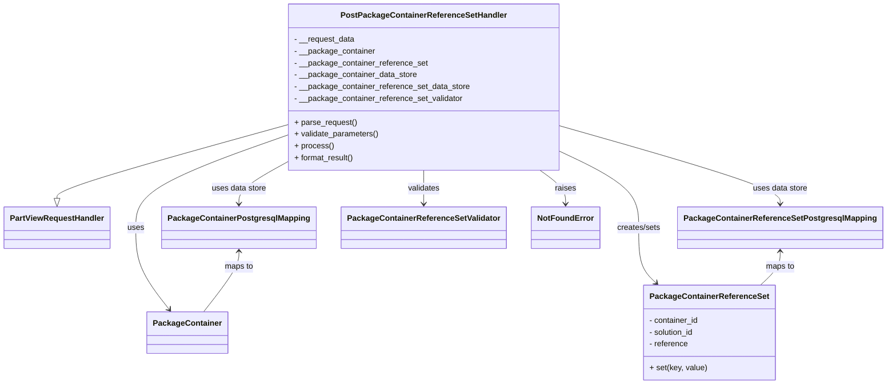

# Diagram: partview_core/partview_service/partview_service/api/package_container/reference/handler/PostPackageContainerReferenceSetHandler.py


> Auto-generated by Obscura crawlers

## Diagram 1



### SVG

<svg id="container" width="1723.40625" xmlns="http://www.w3.org/2000/svg" class="classDiagram" height="776" viewBox="0 0 1723.40625 776" role="graphics-document document" aria-roledescription="class"><style>#container{font-family:"trebuchet ms",verdana,arial,sans-serif;font-size:16px;fill:#333;}@keyframes edge-animation-frame{from{stroke-dashoffset:0;}}@keyframes dash{to{stroke-dashoffset:0;}}#container .edge-animation-slow{stroke-dasharray:9,5!important;stroke-dashoffset:900;animation:dash 50s linear infinite;stroke-linecap:round;}#container .edge-animation-fast{stroke-dasharray:9,5!important;stroke-dashoffset:900;animation:dash 20s linear infinite;stroke-linecap:round;}#container .error-icon{fill:#552222;}#container .error-text{fill:#552222;stroke:#552222;}#container .edge-thickness-normal{stroke-width:1px;}#container .edge-thickness-thick{stroke-width:3.5px;}#container .edge-pattern-solid{stroke-dasharray:0;}#container .edge-thickness-invisible{stroke-width:0;fill:none;}#container .edge-pattern-dashed{stroke-dasharray:3;}#container .edge-pattern-dotted{stroke-dasharray:2;}#container .marker{fill:#333333;stroke:#333333;}#container .marker.cross{stroke:#333333;}#container svg{font-family:"trebuchet ms",verdana,arial,sans-serif;font-size:16px;}#container p{margin:0;}#container g.classGroup text{fill:#9370DB;stroke:none;font-family:"trebuchet ms",verdana,arial,sans-serif;font-size:10px;}#container g.classGroup text .title{font-weight:bolder;}#container .nodeLabel,#container .edgeLabel{color:#131300;}#container .edgeLabel .label rect{fill:#ECECFF;}#container .label text{fill:#131300;}#container .labelBkg{background:#ECECFF;}#container .edgeLabel .label span{background:#ECECFF;}#container .classTitle{font-weight:bolder;}#container .node rect,#container .node circle,#container .node ellipse,#container .node polygon,#container .node path{fill:#ECECFF;stroke:#9370DB;stroke-width:1px;}#container .divider{stroke:#9370DB;stroke-width:1;}#container g.clickable{cursor:pointer;}#container g.classGroup rect{fill:#ECECFF;stroke:#9370DB;}#container g.classGroup line{stroke:#9370DB;stroke-width:1;}#container .classLabel .box{stroke:none;stroke-width:0;fill:#ECECFF;opacity:0.5;}#container .classLabel .label{fill:#9370DB;font-size:10px;}#container .relation{stroke:#333333;stroke-width:1;fill:none;}#container .dashed-line{stroke-dasharray:3;}#container .dotted-line{stroke-dasharray:1 2;}#container #compositionStart,#container .composition{fill:#333333!important;stroke:#333333!important;stroke-width:1;}#container #compositionEnd,#container .composition{fill:#333333!important;stroke:#333333!important;stroke-width:1;}#container #dependencyStart,#container .dependency{fill:#333333!important;stroke:#333333!important;stroke-width:1;}#container #dependencyStart,#container .dependency{fill:#333333!important;stroke:#333333!important;stroke-width:1;}#container #extensionStart,#container .extension{fill:transparent!important;stroke:#333333!important;stroke-width:1;}#container #extensionEnd,#container .extension{fill:transparent!important;stroke:#333333!important;stroke-width:1;}#container #aggregationStart,#container .aggregation{fill:transparent!important;stroke:#333333!important;stroke-width:1;}#container #aggregationEnd,#container .aggregation{fill:transparent!important;stroke:#333333!important;stroke-width:1;}#container #lollipopStart,#container .lollipop{fill:#ECECFF!important;stroke:#333333!important;stroke-width:1;}#container #lollipopEnd,#container .lollipop{fill:#ECECFF!important;stroke:#333333!important;stroke-width:1;}#container .edgeTerminals{font-size:11px;line-height:initial;}#container .classTitleText{text-anchor:middle;font-size:18px;fill:#333;}#container .label-icon{display:inline-block;height:1em;overflow:visible;vertical-align:-0.125em;}#container .node .label-icon path{fill:currentColor;stroke:revert;stroke-width:revert;}#container :root{--mermaid-font-family:"trebuchet ms",verdana,arial,sans-serif;}</style><g><defs><marker id="container_class-aggregationStart" class="marker aggregation class" refX="18" refY="7" markerWidth="190" markerHeight="240" orient="auto"><path d="M 18,7 L9,13 L1,7 L9,1 Z"></path></marker></defs><defs><marker id="container_class-aggregationEnd" class="marker aggregation class" refX="1" refY="7" markerWidth="20" markerHeight="28" orient="auto"><path d="M 18,7 L9,13 L1,7 L9,1 Z"></path></marker></defs><defs><marker id="container_class-extensionStart" class="marker extension class" refX="18" refY="7" markerWidth="190" markerHeight="240" orient="auto"><path d="M 1,7 L18,13 V 1 Z"></path></marker></defs><defs><marker id="container_class-extensionEnd" class="marker extension class" refX="1" refY="7" markerWidth="20" markerHeight="28" orient="auto"><path d="M 1,1 V 13 L18,7 Z"></path></marker></defs><defs><marker id="container_class-compositionStart" class="marker composition class" refX="18" refY="7" markerWidth="190" markerHeight="240" orient="auto"><path d="M 18,7 L9,13 L1,7 L9,1 Z"></path></marker></defs><defs><marker id="container_class-compositionEnd" class="marker composition class" refX="1" refY="7" markerWidth="20" markerHeight="28" orient="auto"><path d="M 18,7 L9,13 L1,7 L9,1 Z"></path></marker></defs><defs><marker id="container_class-dependencyStart" class="marker dependency class" refX="6" refY="7" markerWidth="190" markerHeight="240" orient="auto"><path d="M 5,7 L9,13 L1,7 L9,1 Z"></path></marker></defs><defs><marker id="container_class-dependencyEnd" class="marker dependency class" refX="13" refY="7" markerWidth="20" markerHeight="28" orient="auto"><path d="M 18,7 L9,13 L14,7 L9,1 Z"></path></marker></defs><defs><marker id="container_class-lollipopStart" class="marker lollipop class" refX="13" refY="7" markerWidth="190" markerHeight="240" orient="auto"><circle stroke="black" fill="transparent" cx="7" cy="7" r="6"></circle></marker></defs><defs><marker id="container_class-lollipopEnd" class="marker lollipop class" refX="1" refY="7" markerWidth="190" markerHeight="240" orient="auto"><circle stroke="black" fill="transparent" cx="7" cy="7" r="6"></circle></marker></defs><g class="root"><g class="clusters"></g><g class="edgePaths"><path d="M554.004,253.422L480.23,274.685C406.456,295.948,258.908,338.474,185.133,363.029C111.359,387.583,111.359,394.167,111.359,397.458L111.359,400.75" id="id_PostPackageContainerReferenceSetHandler_PartViewRequestHandler_1" class="edge-thickness-normal edge-pattern-solid relation" style=";;;" data-edge="true" data-et="edge" data-id="id_PostPackageContainerReferenceSetHandler_PartViewRequestHandler_1" data-points="W3sieCI6NTU0LjAwMzkwNjI1LCJ5IjoyNTMuNDIxNjAyMTE3NzAzOX0seyJ4IjoxMTEuMzU5Mzc1LCJ5IjozODF9LHsieCI6MTExLjM1OTM3NSwieSI6NDE4fV0=" marker-end="url(#container_class-extensionEnd)"></path><path d="M554.004,274.968L506.038,292.64C458.073,310.312,362.142,345.656,314.176,376.495C266.211,407.333,266.211,433.667,266.211,460C266.211,486.333,266.211,512.667,276.977,540.2C287.744,567.733,309.277,596.466,320.043,610.832L330.809,625.199" id="id_PostPackageContainerReferenceSetHandler_PackageContainer_2" class="edge-thickness-normal edge-pattern-solid relation" style=";;;" data-edge="true" data-et="edge" data-id="id_PostPackageContainerReferenceSetHandler_PackageContainer_2" data-points="W3sieCI6NTU0LjAwMzkwNjI1LCJ5IjoyNzQuOTY4MjQ2NzI0OTgyOH0seyJ4IjoyNjYuMjEwOTM3NSwieSI6MzgxfSx7IngiOjI2Ni4yMTA5Mzc1LCJ5Ijo0NjB9LHsieCI6MjY2LjIxMDkzNzUsInkiOjUzOX0seyJ4IjozMzQuNDA3NDgzNTUyNjMxNTYsInkiOjYzMH1d" marker-end="url(#container_class-dependencyEnd)"></path><path d="M1091.246,307.083L1116.492,319.403C1141.737,331.722,1192.228,356.361,1217.473,381.847C1242.719,407.333,1242.719,433.667,1242.719,460C1242.719,486.333,1242.719,512.667,1248.403,531.306C1254.087,549.946,1265.455,560.892,1271.138,566.365L1276.822,571.838" id="id_PostPackageContainerReferenceSetHandler_PackageContainerReferenceSet_3" class="edge-thickness-normal edge-pattern-solid relation" style=";;;" data-edge="true" data-et="edge" data-id="id_PostPackageContainerReferenceSetHandler_PackageContainerReferenceSet_3" data-points="W3sieCI6MTA5MS4yNDYwOTM3NSwieSI6MzA3LjA4MzQxNzAyMDAxMDR9LHsieCI6MTI0Mi43MTg3NSwieSI6MzgxfSx7IngiOjEyNDIuNzE4NzUsInkiOjQ2MH0seyJ4IjoxMjQyLjcxODc1LCJ5Ijo1Mzl9LHsieCI6MTI4MS4xNDQ1MDE4Nzk2OTkyLCJ5Ijo1NzZ9XQ==" marker-end="url(#container_class-dependencyEnd)"></path><path d="M554.004,330.22L539.262,338.683C524.521,347.147,495.038,364.073,480.296,377.703C465.555,391.333,465.555,401.667,465.555,406.833L465.555,412" id="id_PostPackageContainerReferenceSetHandler_PackageContainerPostgresqlMapping_4" class="edge-thickness-normal edge-pattern-solid relation" style=";;;" data-edge="true" data-et="edge" data-id="id_PostPackageContainerReferenceSetHandler_PackageContainerPostgresqlMapping_4" data-points="W3sieCI6NTU0LjAwMzkwNjI1LCJ5IjozMzAuMjE5ODMzNzE2MjIzNn0seyJ4Ijo0NjUuNTU0Njg3NSwieSI6MzgxfSx7IngiOjQ2NS41NTQ2ODc1LCJ5Ijo0MTh9XQ==" marker-end="url(#container_class-dependencyEnd)"></path><path d="M1091.246,255.081L1162.533,276.067C1233.82,297.054,1376.395,339.027,1447.682,365.18C1518.969,391.333,1518.969,401.667,1518.969,406.833L1518.969,412" id="id_PostPackageContainerReferenceSetHandler_PackageContainerReferenceSetPostgresqlMapping_5" class="edge-thickness-normal edge-pattern-solid relation" style=";;;" data-edge="true" data-et="edge" data-id="id_PostPackageContainerReferenceSetHandler_PackageContainerReferenceSetPostgresqlMapping_5" data-points="W3sieCI6MTA5MS4yNDYwOTM3NSwieSI6MjU1LjA4MDY2MTI2NjQzNjN9LHsieCI6MTUxOC45Njg3NSwieSI6MzgxfSx7IngiOjE1MTguOTY4NzUsInkiOjQxOH1d" marker-end="url(#container_class-dependencyEnd)"></path><path d="M822.625,344L822.625,350.167C822.625,356.333,822.625,368.667,822.625,380C822.625,391.333,822.625,401.667,822.625,406.833L822.625,412" id="id_PostPackageContainerReferenceSetHandler_PackageContainerReferenceSetValidator_6" class="edge-thickness-normal edge-pattern-solid relation" style=";;;" data-edge="true" data-et="edge" data-id="id_PostPackageContainerReferenceSetHandler_PackageContainerReferenceSetValidator_6" data-points="W3sieCI6ODIyLjYyNSwieSI6MzQ0fSx7IngiOjgyMi42MjUsInkiOjM4MX0seyJ4Ijo4MjIuNjI1LCJ5Ijo0MTh9XQ==" marker-end="url(#container_class-dependencyEnd)"></path><path d="M1047.786,344L1056.051,350.167C1064.316,356.333,1080.845,368.667,1089.11,380C1097.375,391.333,1097.375,401.667,1097.375,406.833L1097.375,412" id="id_PostPackageContainerReferenceSetHandler_NotFoundError_7" class="edge-thickness-normal edge-pattern-solid relation" style=";;;" data-edge="true" data-et="edge" data-id="id_PostPackageContainerReferenceSetHandler_NotFoundError_7" data-points="W3sieCI6MTA0Ny43ODU5NzU2MDk3NTYyLCJ5IjozNDR9LHsieCI6MTA5Ny4zNzUsInkiOjM4MX0seyJ4IjoxMDk3LjM3NSwieSI6NDE4fV0=" marker-end="url(#container_class-dependencyEnd)"></path><path d="M465.555,508L465.555,513.167C465.555,518.333,465.555,528.667,454.189,549C442.823,569.333,420.09,599.667,408.724,614.833L397.358,630" id="id_PackageContainerPostgresqlMapping_PackageContainer_8" class="edge-thickness-normal edge-pattern-solid relation" style=";;;" data-edge="true" data-et="edge" data-id="id_PackageContainerPostgresqlMapping_PackageContainer_8" data-points="W3sieCI6NDY1LjU1NDY4NzUsInkiOjUwMn0seyJ4Ijo0NjUuNTU0Njg3NSwieSI6NTM5fSx7IngiOjM5Ny4zNTgxNDE0NDczNjg0NCwieSI6NjMwfV0=" marker-start="url(#container_class-dependencyStart)"></path><path d="M1518.969,508L1518.969,513.167C1518.969,518.333,1518.969,528.667,1512.564,540C1506.16,551.333,1493.352,563.667,1486.947,569.833L1480.543,576" id="id_PackageContainerReferenceSetPostgresqlMapping_PackageContainerReferenceSet_9" class="edge-thickness-normal edge-pattern-solid relation" style=";;;" data-edge="true" data-et="edge" data-id="id_PackageContainerReferenceSetPostgresqlMapping_PackageContainerReferenceSet_9" data-points="W3sieCI6MTUxOC45Njg3NSwieSI6NTAyfSx7IngiOjE1MTguOTY4NzUsInkiOjUzOX0seyJ4IjoxNDgwLjU0Mjk5ODEyMDMwMDgsInkiOjU3Nn1d" marker-start="url(#container_class-dependencyStart)"></path></g><g class="edgeLabels"><g class="edgeLabel"><g class="label" data-id="id_PostPackageContainerReferenceSetHandler_PartViewRequestHandler_1" transform="translate(0, 0)"><foreignObject width="0" height="0"><div xmlns="http://www.w3.org/1999/xhtml" class="labelBkg" style="display: table-cell; white-space: nowrap; line-height: 1.5; max-width: 200px; text-align: center;"><span class="edgeLabel"></span></div></foreignObject></g></g><g class="edgeLabel" transform="translate(266.2109375, 460)"><g class="label" data-id="id_PostPackageContainerReferenceSetHandler_PackageContainer_2" transform="translate(-16.4921875, -12)"><foreignObject width="32.984375" height="24"><div xmlns="http://www.w3.org/1999/xhtml" class="labelBkg" style="display: table-cell; white-space: nowrap; line-height: 1.5; max-width: 200px; text-align: center;"><span class="edgeLabel"><p>uses</p></span></div></foreignObject></g></g><g class="edgeLabel" transform="translate(1242.71875, 460)"><g class="label" data-id="id_PostPackageContainerReferenceSetHandler_PackageContainerReferenceSet_3" transform="translate(-44.8125, -12)"><foreignObject width="89.625" height="24"><div xmlns="http://www.w3.org/1999/xhtml" class="labelBkg" style="display: table-cell; white-space: nowrap; line-height: 1.5; max-width: 200px; text-align: center;"><span class="edgeLabel"><p>creates/sets</p></span></div></foreignObject></g></g><g class="edgeLabel" transform="translate(465.5546875, 381)"><g class="label" data-id="id_PostPackageContainerReferenceSetHandler_PackageContainerPostgresqlMapping_4" transform="translate(-55.4375, -12)"><foreignObject width="110.875" height="24"><div xmlns="http://www.w3.org/1999/xhtml" class="labelBkg" style="display: table-cell; white-space: nowrap; line-height: 1.5; max-width: 200px; text-align: center;"><span class="edgeLabel"><p>uses data store</p></span></div></foreignObject></g></g><g class="edgeLabel" transform="translate(1518.96875, 381)"><g class="label" data-id="id_PostPackageContainerReferenceSetHandler_PackageContainerReferenceSetPostgresqlMapping_5" transform="translate(-55.4375, -12)"><foreignObject width="110.875" height="24"><div xmlns="http://www.w3.org/1999/xhtml" class="labelBkg" style="display: table-cell; white-space: nowrap; line-height: 1.5; max-width: 200px; text-align: center;"><span class="edgeLabel"><p>uses data store</p></span></div></foreignObject></g></g><g class="edgeLabel" transform="translate(822.625, 381)"><g class="label" data-id="id_PostPackageContainerReferenceSetHandler_PackageContainerReferenceSetValidator_6" transform="translate(-32.6875, -12)"><foreignObject width="65.375" height="24"><div xmlns="http://www.w3.org/1999/xhtml" class="labelBkg" style="display: table-cell; white-space: nowrap; line-height: 1.5; max-width: 200px; text-align: center;"><span class="edgeLabel"><p>validates</p></span></div></foreignObject></g></g><g class="edgeLabel" transform="translate(1097.375, 381)"><g class="label" data-id="id_PostPackageContainerReferenceSetHandler_NotFoundError_7" transform="translate(-21.25, -12)"><foreignObject width="42.5" height="24"><div xmlns="http://www.w3.org/1999/xhtml" class="labelBkg" style="display: table-cell; white-space: nowrap; line-height: 1.5; max-width: 200px; text-align: center;"><span class="edgeLabel"><p>raises</p></span></div></foreignObject></g></g><g class="edgeLabel" transform="translate(465.5546875, 539)"><g class="label" data-id="id_PackageContainerPostgresqlMapping_PackageContainer_8" transform="translate(-29.2578125, -12)"><foreignObject width="58.515625" height="24"><div xmlns="http://www.w3.org/1999/xhtml" class="labelBkg" style="display: table-cell; white-space: nowrap; line-height: 1.5; max-width: 200px; text-align: center;"><span class="edgeLabel"><p>maps to</p></span></div></foreignObject></g></g><g class="edgeLabel" transform="translate(1518.96875, 539)"><g class="label" data-id="id_PackageContainerReferenceSetPostgresqlMapping_PackageContainerReferenceSet_9" transform="translate(-29.2578125, -12)"><foreignObject width="58.515625" height="24"><div xmlns="http://www.w3.org/1999/xhtml" class="labelBkg" style="display: table-cell; white-space: nowrap; line-height: 1.5; max-width: 200px; text-align: center;"><span class="edgeLabel"><p>maps to</p></span></div></foreignObject></g></g></g><g class="nodes"><g class="node default" id="classId-PartViewRequestHandler-0" transform="translate(111.359375, 460)"><g class="basic label-container"><path d="M-103.359375 -42 L103.359375 -42 L103.359375 42 L-103.359375 42" stroke="none" stroke-width="0" fill="#ECECFF" style=""></path><path d="M-103.359375 -42 C-33.140115939552985 -42, 37.07914312089403 -42, 103.359375 -42 M-103.359375 -42 C-26.93502724499797 -42, 49.48932051000406 -42, 103.359375 -42 M103.359375 -42 C103.359375 -20.820117999410556, 103.359375 0.3597640011788883, 103.359375 42 M103.359375 -42 C103.359375 -20.909508784699618, 103.359375 0.18098243060076413, 103.359375 42 M103.359375 42 C49.17451503781079 42, -5.0103449243784155 42, -103.359375 42 M103.359375 42 C50.9389292543503 42, -1.481516491299402 42, -103.359375 42 M-103.359375 42 C-103.359375 18.88309010994312, -103.359375 -4.2338197801137625, -103.359375 -42 M-103.359375 42 C-103.359375 20.561880190117503, -103.359375 -0.8762396197649949, -103.359375 -42" stroke="#9370DB" stroke-width="1.3" fill="none" stroke-dasharray="0 0" style=""></path></g><g class="annotation-group text" transform="translate(0, -18)"></g><g class="label-group text" transform="translate(-91.359375, -18)"><g class="label" style="font-weight: bolder" transform="translate(0,-12)"><foreignObject width="182.71875" height="24"><div xmlns="http://www.w3.org/1999/xhtml" style="display: table-cell; white-space: nowrap; line-height: 1.5; max-width: 231px; text-align: center;"><span class="nodeLabel markdown-node-label" style=""><p>PartViewRequestHandler</p></span></div></foreignObject></g></g><g class="members-group text" transform="translate(-91.359375, 30)"></g><g class="methods-group text" transform="translate(-91.359375, 60)"></g><g class="divider" style=""><path d="M-103.359375 6 C-33.63186690458451 6, 36.095641190830975 6, 103.359375 6 M-103.359375 6 C-45.15044476811542 6, 13.05848546376916 6, 103.359375 6" stroke="#9370DB" stroke-width="1.3" fill="none" stroke-dasharray="0 0" style=""></path></g><g class="divider" style=""><path d="M-103.359375 24 C-50.78344226887522 24, 1.7924904622495603 24, 103.359375 24 M-103.359375 24 C-26.914428476782916 24, 49.53051804643417 24, 103.359375 24" stroke="#9370DB" stroke-width="1.3" fill="none" stroke-dasharray="0 0" style=""></path></g></g><g class="node default" id="classId-PostPackageContainerReferenceSetHandler-1" transform="translate(822.625, 176)"><g class="basic label-container"><path d="M-268.62109375 -168 L268.62109375 -168 L268.62109375 168 L-268.62109375 168" stroke="none" stroke-width="0" fill="#ECECFF" style=""></path><path d="M-268.62109375 -168 C-160.27868306657894 -168, -51.9362723831579 -168, 268.62109375 -168 M-268.62109375 -168 C-142.09625218466445 -168, -15.571410619328901 -168, 268.62109375 -168 M268.62109375 -168 C268.62109375 -58.45872342382279, 268.62109375 51.08255315235442, 268.62109375 168 M268.62109375 -168 C268.62109375 -63.16468839990394, 268.62109375 41.670623200192125, 268.62109375 168 M268.62109375 168 C68.16836392052582 168, -132.28436590894836 168, -268.62109375 168 M268.62109375 168 C115.7227055182438 168, -37.1756827135124 168, -268.62109375 168 M-268.62109375 168 C-268.62109375 59.727216472959086, -268.62109375 -48.54556705408183, -268.62109375 -168 M-268.62109375 168 C-268.62109375 95.09131158404793, -268.62109375 22.18262316809586, -268.62109375 -168" stroke="#9370DB" stroke-width="1.3" fill="none" stroke-dasharray="0 0" style=""></path></g><g class="annotation-group text" transform="translate(0, -144)"></g><g class="label-group text" transform="translate(-159.3046875, -144)"><g class="label" style="font-weight: bolder" transform="translate(0,-12)"><foreignObject width="318.609375" height="24"><div xmlns="http://www.w3.org/1999/xhtml" style="display: table-cell; white-space: nowrap; line-height: 1.5; max-width: 364px; text-align: center;"><span class="nodeLabel markdown-node-label" style=""><p>PostPackageContainerReferenceSetHandler</p></span></div></foreignObject></g></g><g class="members-group text" transform="translate(-256.62109375, -96)"><g class="label" style="" transform="translate(0,-12)"><foreignObject width="123.078125" height="24"><div xmlns="http://www.w3.org/1999/xhtml" style="display: table-cell; white-space: nowrap; line-height: 1.5; max-width: 180px; text-align: center;"><span class="nodeLabel markdown-node-label" style=""><p>- __request_data</p></span></div></foreignObject></g><g class="label" style="" transform="translate(0,12)"><foreignObject width="163.03125" height="24"><div xmlns="http://www.w3.org/1999/xhtml" style="display: table-cell; white-space: nowrap; line-height: 1.5; max-width: 221px; text-align: center;"><span class="nodeLabel markdown-node-label" style=""><p>- __package_container</p></span></div></foreignObject></g><g class="label" style="" transform="translate(0,36)"><foreignObject width="268.21875" height="24"><div xmlns="http://www.w3.org/1999/xhtml" style="display: table-cell; white-space: nowrap; line-height: 1.5; max-width: 326px; text-align: center;"><span class="nodeLabel markdown-node-label" style=""><p>- __package_container_reference_set</p></span></div></foreignObject></g><g class="label" style="" transform="translate(0,60)"><foreignObject width="247.484375" height="24"><div xmlns="http://www.w3.org/1999/xhtml" style="display: table-cell; white-space: nowrap; line-height: 1.5; max-width: 305px; text-align: center;"><span class="nodeLabel markdown-node-label" style=""><p>- __package_container_data_store</p></span></div></foreignObject></g><g class="label" style="" transform="translate(0,84)"><foreignObject width="353.9375" height="24"><div xmlns="http://www.w3.org/1999/xhtml" style="display: table-cell; white-space: nowrap; line-height: 1.5; max-width: 411px; text-align: center;"><span class="nodeLabel markdown-node-label" style=""><p>- __package_container_reference_set_data_store</p></span></div></foreignObject></g><g class="label" style="" transform="translate(0,108)"><foreignObject width="340.75" height="24"><div xmlns="http://www.w3.org/1999/xhtml" style="display: table-cell; white-space: nowrap; line-height: 1.5; max-width: 399px; text-align: center;"><span class="nodeLabel markdown-node-label" style=""><p>- __package_container_reference_set_validator</p></span></div></foreignObject></g></g><g class="methods-group text" transform="translate(-256.62109375, 72)"><g class="label" style="" transform="translate(0,-12)"><foreignObject width="126.046875" height="24"><div xmlns="http://www.w3.org/1999/xhtml" style="display: table-cell; white-space: nowrap; line-height: 1.5; max-width: 183px; text-align: center;"><span class="nodeLabel markdown-node-label" style=""><p>+ parse_request()</p></span></div></foreignObject></g><g class="label" style="" transform="translate(0,12)"><foreignObject width="170.953125" height="24"><div xmlns="http://www.w3.org/1999/xhtml" style="display: table-cell; white-space: nowrap; line-height: 1.5; max-width: 228px; text-align: center;"><span class="nodeLabel markdown-node-label" style=""><p>+ validate_parameters()</p></span></div></foreignObject></g><g class="label" style="" transform="translate(0,36)"><foreignObject width="77.96875" height="24"><div xmlns="http://www.w3.org/1999/xhtml" style="display: table-cell; white-space: nowrap; line-height: 1.5; max-width: 135px; text-align: center;"><span class="nodeLabel markdown-node-label" style=""><p>+ process()</p></span></div></foreignObject></g><g class="label" style="" transform="translate(0,60)"><foreignObject width="121.5" height="24"><div xmlns="http://www.w3.org/1999/xhtml" style="display: table-cell; white-space: nowrap; line-height: 1.5; max-width: 179px; text-align: center;"><span class="nodeLabel markdown-node-label" style=""><p>+ format_result()</p></span></div></foreignObject></g></g><g class="divider" style=""><path d="M-268.62109375 -120 C-160.91160559706668 -120, -53.202117444133336 -120, 268.62109375 -120 M-268.62109375 -120 C-119.63958608241322 -120, 29.341921585173566 -120, 268.62109375 -120" stroke="#9370DB" stroke-width="1.3" fill="none" stroke-dasharray="0 0" style=""></path></g><g class="divider" style=""><path d="M-268.62109375 48 C-156.52665765679333 48, -44.432221563586666 48, 268.62109375 48 M-268.62109375 48 C-76.94894991471318 48, 114.72319392057364 48, 268.62109375 48" stroke="#9370DB" stroke-width="1.3" fill="none" stroke-dasharray="0 0" style=""></path></g></g><g class="node default" id="classId-PackageContainer-2" transform="translate(365.8828125, 672)"><g class="basic label-container"><path d="M-77.453125 -42 L77.453125 -42 L77.453125 42 L-77.453125 42" stroke="none" stroke-width="0" fill="#ECECFF" style=""></path><path d="M-77.453125 -42 C-17.196982284444466 -42, 43.05916043111107 -42, 77.453125 -42 M-77.453125 -42 C-19.17182842840821 -42, 39.10946814318358 -42, 77.453125 -42 M77.453125 -42 C77.453125 -12.457136911476695, 77.453125 17.08572617704661, 77.453125 42 M77.453125 -42 C77.453125 -24.655193648383477, 77.453125 -7.3103872967669545, 77.453125 42 M77.453125 42 C36.561200418725065 42, -4.3307241625498705 42, -77.453125 42 M77.453125 42 C44.35855363842351 42, 11.263982276847017 42, -77.453125 42 M-77.453125 42 C-77.453125 16.466820266022278, -77.453125 -9.066359467955444, -77.453125 -42 M-77.453125 42 C-77.453125 24.74115920125151, -77.453125 7.482318402503019, -77.453125 -42" stroke="#9370DB" stroke-width="1.3" fill="none" stroke-dasharray="0 0" style=""></path></g><g class="annotation-group text" transform="translate(0, -18)"></g><g class="label-group text" transform="translate(-65.453125, -18)"><g class="label" style="font-weight: bolder" transform="translate(0,-12)"><foreignObject width="130.90625" height="24"><div xmlns="http://www.w3.org/1999/xhtml" style="display: table-cell; white-space: nowrap; line-height: 1.5; max-width: 179px; text-align: center;"><span class="nodeLabel markdown-node-label" style=""><p>PackageContainer</p></span></div></foreignObject></g></g><g class="members-group text" transform="translate(-65.453125, 30)"></g><g class="methods-group text" transform="translate(-65.453125, 60)"></g><g class="divider" style=""><path d="M-77.453125 6 C-17.60503777416605 6, 42.2430494516679 6, 77.453125 6 M-77.453125 6 C-42.24871967098433 6, -7.044314341968658 6, 77.453125 6" stroke="#9370DB" stroke-width="1.3" fill="none" stroke-dasharray="0 0" style=""></path></g><g class="divider" style=""><path d="M-77.453125 24 C-39.967325712797454 24, -2.4815264255949074 24, 77.453125 24 M-77.453125 24 C-18.56422639123673 24, 40.32467221752654 24, 77.453125 24" stroke="#9370DB" stroke-width="1.3" fill="none" stroke-dasharray="0 0" style=""></path></g></g><g class="node default" id="classId-PackageContainerReferenceSet-3" transform="translate(1380.84375, 672)"><g class="basic label-container"><path d="M-126.75390625 -96 L126.75390625 -96 L126.75390625 96 L-126.75390625 96" stroke="none" stroke-width="0" fill="#ECECFF" style=""></path><path d="M-126.75390625 -96 C-58.83954832936277 -96, 9.074809591274459 -96, 126.75390625 -96 M-126.75390625 -96 C-32.08495881840088 -96, 62.583988613198244 -96, 126.75390625 -96 M126.75390625 -96 C126.75390625 -40.88921728583152, 126.75390625 14.221565428336959, 126.75390625 96 M126.75390625 -96 C126.75390625 -22.65277106082104, 126.75390625 50.69445787835792, 126.75390625 96 M126.75390625 96 C65.61165092201318 96, 4.4693955940263805 96, -126.75390625 96 M126.75390625 96 C30.998229152617398 96, -64.7574479447652 96, -126.75390625 96 M-126.75390625 96 C-126.75390625 37.01360614747155, -126.75390625 -21.972787705056902, -126.75390625 -96 M-126.75390625 96 C-126.75390625 20.574939791342743, -126.75390625 -54.850120417314514, -126.75390625 -96" stroke="#9370DB" stroke-width="1.3" fill="none" stroke-dasharray="0 0" style=""></path></g><g class="annotation-group text" transform="translate(0, -72)"></g><g class="label-group text" transform="translate(-114.0390625, -72)"><g class="label" style="font-weight: bolder" transform="translate(0,-12)"><foreignObject width="228.078125" height="24"><div xmlns="http://www.w3.org/1999/xhtml" style="display: table-cell; white-space: nowrap; line-height: 1.5; max-width: 274px; text-align: center;"><span class="nodeLabel markdown-node-label" style=""><p>PackageContainerReferenceSet</p></span></div></foreignObject></g></g><g class="members-group text" transform="translate(-114.75390625, -24)"><g class="label" style="" transform="translate(0,-12)"><foreignObject width="101.015625" height="24"><div xmlns="http://www.w3.org/1999/xhtml" style="display: table-cell; white-space: nowrap; line-height: 1.5; max-width: 158px; text-align: center;"><span class="nodeLabel markdown-node-label" style=""><p>- container_id</p></span></div></foreignObject></g><g class="label" style="" transform="translate(0,12)"><foreignObject width="92.921875" height="24"><div xmlns="http://www.w3.org/1999/xhtml" style="display: table-cell; white-space: nowrap; line-height: 1.5; max-width: 150px; text-align: center;"><span class="nodeLabel markdown-node-label" style=""><p>- solution_id</p></span></div></foreignObject></g><g class="label" style="" transform="translate(0,36)"><foreignObject width="78.875" height="24"><div xmlns="http://www.w3.org/1999/xhtml" style="display: table-cell; white-space: nowrap; line-height: 1.5; max-width: 136px; text-align: center;"><span class="nodeLabel markdown-node-label" style=""><p>- reference</p></span></div></foreignObject></g></g><g class="methods-group text" transform="translate(-114.75390625, 72)"><g class="label" style="" transform="translate(0,-12)"><foreignObject width="115.46875" height="24"><div xmlns="http://www.w3.org/1999/xhtml" style="display: table-cell; white-space: nowrap; line-height: 1.5; max-width: 173px; text-align: center;"><span class="nodeLabel markdown-node-label" style=""><p>+ set(key, value)</p></span></div></foreignObject></g></g><g class="divider" style=""><path d="M-126.75390625 -48 C-58.55345179289952 -48, 9.647002664200954 -48, 126.75390625 -48 M-126.75390625 -48 C-26.529236682576368 -48, 73.69543288484726 -48, 126.75390625 -48" stroke="#9370DB" stroke-width="1.3" fill="none" stroke-dasharray="0 0" style=""></path></g><g class="divider" style=""><path d="M-126.75390625 48 C-59.780373796388574 48, 7.1931586572228525 48, 126.75390625 48 M-126.75390625 48 C-70.94775298096062 48, -15.141599711921216 48, 126.75390625 48" stroke="#9370DB" stroke-width="1.3" fill="none" stroke-dasharray="0 0" style=""></path></g></g><g class="node default" id="classId-PackageContainerPostgresqlMapping-4" transform="translate(465.5546875, 460)"><g class="basic label-container"><path d="M-147.8515625 -42 L147.8515625 -42 L147.8515625 42 L-147.8515625 42" stroke="none" stroke-width="0" fill="#ECECFF" style=""></path><path d="M-147.8515625 -42 C-63.1088571925588 -42, 21.633848114882397 -42, 147.8515625 -42 M-147.8515625 -42 C-56.835778934723734 -42, 34.18000463055253 -42, 147.8515625 -42 M147.8515625 -42 C147.8515625 -16.251282669789063, 147.8515625 9.497434660421874, 147.8515625 42 M147.8515625 -42 C147.8515625 -14.785451747394209, 147.8515625 12.429096505211582, 147.8515625 42 M147.8515625 42 C86.79762516977908 42, 25.743687839558163 42, -147.8515625 42 M147.8515625 42 C60.83755752422924 42, -26.17644745154152 42, -147.8515625 42 M-147.8515625 42 C-147.8515625 18.058341823020058, -147.8515625 -5.883316353959884, -147.8515625 -42 M-147.8515625 42 C-147.8515625 21.75538198551123, -147.8515625 1.5107639710224632, -147.8515625 -42" stroke="#9370DB" stroke-width="1.3" fill="none" stroke-dasharray="0 0" style=""></path></g><g class="annotation-group text" transform="translate(0, -18)"></g><g class="label-group text" transform="translate(-135.8515625, -18)"><g class="label" style="font-weight: bolder" transform="translate(0,-12)"><foreignObject width="271.703125" height="24"><div xmlns="http://www.w3.org/1999/xhtml" style="display: table-cell; white-space: nowrap; line-height: 1.5; max-width: 317px; text-align: center;"><span class="nodeLabel markdown-node-label" style=""><p>PackageContainerPostgresqlMapping</p></span></div></foreignObject></g></g><g class="members-group text" transform="translate(-135.8515625, 30)"></g><g class="methods-group text" transform="translate(-135.8515625, 60)"></g><g class="divider" style=""><path d="M-147.8515625 6 C-83.52636576054363 6, -19.201169021087253 6, 147.8515625 6 M-147.8515625 6 C-66.53306025911237 6, 14.78544198177525 6, 147.8515625 6" stroke="#9370DB" stroke-width="1.3" fill="none" stroke-dasharray="0 0" style=""></path></g><g class="divider" style=""><path d="M-147.8515625 24 C-38.09456364692751 24, 71.66243520614498 24, 147.8515625 24 M-147.8515625 24 C-41.46246629809346 24, 64.92662990381308 24, 147.8515625 24" stroke="#9370DB" stroke-width="1.3" fill="none" stroke-dasharray="0 0" style=""></path></g></g><g class="node default" id="classId-PackageContainerReferenceSetPostgresqlMapping-5" transform="translate(1518.96875, 460)"><g class="basic label-container"><path d="M-196.4375 -42 L196.4375 -42 L196.4375 42 L-196.4375 42" stroke="none" stroke-width="0" fill="#ECECFF" style=""></path><path d="M-196.4375 -42 C-53.256407913416666 -42, 89.92468417316667 -42, 196.4375 -42 M-196.4375 -42 C-114.14955691184345 -42, -31.861613823686895 -42, 196.4375 -42 M196.4375 -42 C196.4375 -20.646281678549133, 196.4375 0.7074366429017331, 196.4375 42 M196.4375 -42 C196.4375 -13.97115674832397, 196.4375 14.057686503352059, 196.4375 42 M196.4375 42 C48.38370172689727 42, -99.67009654620546 42, -196.4375 42 M196.4375 42 C104.1172303236898 42, 11.796960647379592 42, -196.4375 42 M-196.4375 42 C-196.4375 22.00550766447813, -196.4375 2.011015328956262, -196.4375 -42 M-196.4375 42 C-196.4375 16.72770628425551, -196.4375 -8.544587431488978, -196.4375 -42" stroke="#9370DB" stroke-width="1.3" fill="none" stroke-dasharray="0 0" style=""></path></g><g class="annotation-group text" transform="translate(0, -18)"></g><g class="label-group text" transform="translate(-184.4375, -18)"><g class="label" style="font-weight: bolder" transform="translate(0,-12)"><foreignObject width="368.875" height="24"><div xmlns="http://www.w3.org/1999/xhtml" style="display: table-cell; white-space: nowrap; line-height: 1.5; max-width: 412px; text-align: center;"><span class="nodeLabel markdown-node-label" style=""><p>PackageContainerReferenceSetPostgresqlMapping</p></span></div></foreignObject></g></g><g class="members-group text" transform="translate(-184.4375, 30)"></g><g class="methods-group text" transform="translate(-184.4375, 60)"></g><g class="divider" style=""><path d="M-196.4375 6 C-49.938754346238596 6, 96.55999130752281 6, 196.4375 6 M-196.4375 6 C-69.175159364084 6, 58.08718127183201 6, 196.4375 6" stroke="#9370DB" stroke-width="1.3" fill="none" stroke-dasharray="0 0" style=""></path></g><g class="divider" style=""><path d="M-196.4375 24 C-111.17002318521563 24, -25.902546370431253 24, 196.4375 24 M-196.4375 24 C-43.17578180522531 24, 110.08593638954937 24, 196.4375 24" stroke="#9370DB" stroke-width="1.3" fill="none" stroke-dasharray="0 0" style=""></path></g></g><g class="node default" id="classId-PackageContainerReferenceSetValidator-6" transform="translate(822.625, 460)"><g class="basic label-container"><path d="M-159.21875 -42 L159.21875 -42 L159.21875 42 L-159.21875 42" stroke="none" stroke-width="0" fill="#ECECFF" style=""></path><path d="M-159.21875 -42 C-38.08824992367427 -42, 83.04225015265146 -42, 159.21875 -42 M-159.21875 -42 C-84.05806943000779 -42, -8.897388860015582 -42, 159.21875 -42 M159.21875 -42 C159.21875 -21.49236139710188, 159.21875 -0.984722794203762, 159.21875 42 M159.21875 -42 C159.21875 -8.465217432800046, 159.21875 25.06956513439991, 159.21875 42 M159.21875 42 C63.99959733959385 42, -31.219555320812304 42, -159.21875 42 M159.21875 42 C68.22932626465742 42, -22.760097470685167 42, -159.21875 42 M-159.21875 42 C-159.21875 19.41431624292254, -159.21875 -3.171367514154923, -159.21875 -42 M-159.21875 42 C-159.21875 13.972694686824976, -159.21875 -14.054610626350048, -159.21875 -42" stroke="#9370DB" stroke-width="1.3" fill="none" stroke-dasharray="0 0" style=""></path></g><g class="annotation-group text" transform="translate(0, -18)"></g><g class="label-group text" transform="translate(-147.21875, -18)"><g class="label" style="font-weight: bolder" transform="translate(0,-12)"><foreignObject width="294.4375" height="24"><div xmlns="http://www.w3.org/1999/xhtml" style="display: table-cell; white-space: nowrap; line-height: 1.5; max-width: 340px; text-align: center;"><span class="nodeLabel markdown-node-label" style=""><p>PackageContainerReferenceSetValidator</p></span></div></foreignObject></g></g><g class="members-group text" transform="translate(-147.21875, 30)"></g><g class="methods-group text" transform="translate(-147.21875, 60)"></g><g class="divider" style=""><path d="M-159.21875 6 C-92.04569599872555 6, -24.872641997451097 6, 159.21875 6 M-159.21875 6 C-34.67812276237153 6, 89.86250447525694 6, 159.21875 6" stroke="#9370DB" stroke-width="1.3" fill="none" stroke-dasharray="0 0" style=""></path></g><g class="divider" style=""><path d="M-159.21875 24 C-74.10596339496641 24, 11.006823210067182 24, 159.21875 24 M-159.21875 24 C-89.77790346947383 24, -20.337056938947654 24, 159.21875 24" stroke="#9370DB" stroke-width="1.3" fill="none" stroke-dasharray="0 0" style=""></path></g></g><g class="node default" id="classId-NotFoundError-7" transform="translate(1097.375, 460)"><g class="basic label-container"><path d="M-65.53125 -42 L65.53125 -42 L65.53125 42 L-65.53125 42" stroke="none" stroke-width="0" fill="#ECECFF" style=""></path><path d="M-65.53125 -42 C-36.801283875493226 -42, -8.071317750986445 -42, 65.53125 -42 M-65.53125 -42 C-34.80132985488128 -42, -4.071409709762563 -42, 65.53125 -42 M65.53125 -42 C65.53125 -19.506804578918672, 65.53125 2.986390842162656, 65.53125 42 M65.53125 -42 C65.53125 -13.999560183242618, 65.53125 14.000879633514764, 65.53125 42 M65.53125 42 C29.472573307010784 42, -6.586103385978433 42, -65.53125 42 M65.53125 42 C15.81769572772587 42, -33.89585854454826 42, -65.53125 42 M-65.53125 42 C-65.53125 22.830152911989213, -65.53125 3.660305823978426, -65.53125 -42 M-65.53125 42 C-65.53125 9.000071702033324, -65.53125 -23.999856595933352, -65.53125 -42" stroke="#9370DB" stroke-width="1.3" fill="none" stroke-dasharray="0 0" style=""></path></g><g class="annotation-group text" transform="translate(0, -18)"></g><g class="label-group text" transform="translate(-53.53125, -18)"><g class="label" style="font-weight: bolder" transform="translate(0,-12)"><foreignObject width="107.0625" height="24"><div xmlns="http://www.w3.org/1999/xhtml" style="display: table-cell; white-space: nowrap; line-height: 1.5; max-width: 158px; text-align: center;"><span class="nodeLabel markdown-node-label" style=""><p>NotFoundError</p></span></div></foreignObject></g></g><g class="members-group text" transform="translate(-53.53125, 30)"></g><g class="methods-group text" transform="translate(-53.53125, 60)"></g><g class="divider" style=""><path d="M-65.53125 6 C-30.13833642267018 6, 5.254577154659643 6, 65.53125 6 M-65.53125 6 C-16.457157391790368 6, 32.616935216419265 6, 65.53125 6" stroke="#9370DB" stroke-width="1.3" fill="none" stroke-dasharray="0 0" style=""></path></g><g class="divider" style=""><path d="M-65.53125 24 C-19.834322739370542 24, 25.862604521258916 24, 65.53125 24 M-65.53125 24 C-24.300953087422563 24, 16.929343825154874 24, 65.53125 24" stroke="#9370DB" stroke-width="1.3" fill="none" stroke-dasharray="0 0" style=""></path></g></g></g></g></g></svg>

## Diagram 2

```mermaid
flowchart TD
  Start([Start]) --> ParseRequest[/"parse_request() -> gather path, query, body"/]
  ParseRequest --> Validate[/"validate_parameters() -> validator.validate(...)"/]
  Validate --> DecideType{pathParameters.type == "app" or "api"}
  DecideType -->|app| SearchContainer[/"search PackageContainer by tracking_number & solution_id"/]
  DecideType -->|api| ReadContainer[/"read PackageContainer by id & solution_id"/]
  SearchContainer --> SetContainer
  ReadContainer --> SetContainer
  SetContainer[/"if no container -> raise NotFoundError('Invalid package_container')"/] --> CheckExistingRefs
  CheckExistingRefs[/"search PackageContainerReferenceSet for container_id & solution_id"/] -->|found| RaiseExists[/"raise NotFoundError('This package already contains references.')"/]
  CheckExistingRefs -->|not found| BuildReference[/"build reference_data from body, filter empty values"/]
  BuildReference --> SetReference[/"set reference on PackageContainerReferenceSet and write to datastore"/]
  SetReference --> FormatResult[/"format_result() -> payload, HTTP 201"/]
  FormatResult --> End([End])
```

> SVG rendering failed for this diagram.
