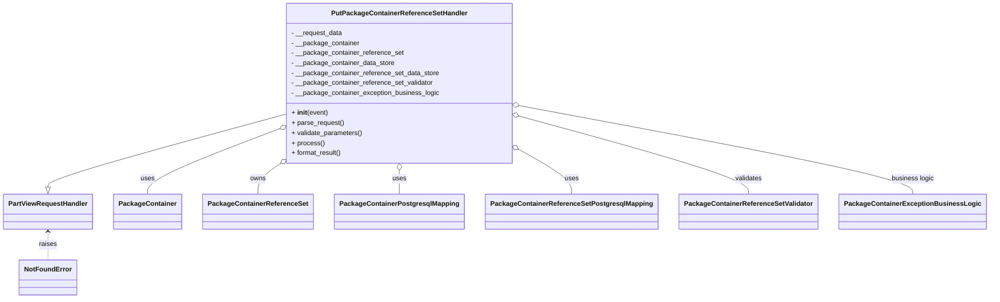

# Diagram: partview_core/partview_service/partview_service/api/package_container/reference/handler/PutPackageContainerReferenceSetHandler.py


> Auto-generated by Obscura crawlers

## Diagram 1



### SVG

<svg id="container" width="2265.828125" xmlns="http://www.w3.org/2000/svg" class="classDiagram" height="716" viewBox="0 0 2265.828125 716" role="graphics-document document" aria-roledescription="class"><style>#container{font-family:"trebuchet ms",verdana,arial,sans-serif;font-size:16px;fill:#333;}@keyframes edge-animation-frame{from{stroke-dashoffset:0;}}@keyframes dash{to{stroke-dashoffset:0;}}#container .edge-animation-slow{stroke-dasharray:9,5!important;stroke-dashoffset:900;animation:dash 50s linear infinite;stroke-linecap:round;}#container .edge-animation-fast{stroke-dasharray:9,5!important;stroke-dashoffset:900;animation:dash 20s linear infinite;stroke-linecap:round;}#container .error-icon{fill:#552222;}#container .error-text{fill:#552222;stroke:#552222;}#container .edge-thickness-normal{stroke-width:1px;}#container .edge-thickness-thick{stroke-width:3.5px;}#container .edge-pattern-solid{stroke-dasharray:0;}#container .edge-thickness-invisible{stroke-width:0;fill:none;}#container .edge-pattern-dashed{stroke-dasharray:3;}#container .edge-pattern-dotted{stroke-dasharray:2;}#container .marker{fill:#333333;stroke:#333333;}#container .marker.cross{stroke:#333333;}#container svg{font-family:"trebuchet ms",verdana,arial,sans-serif;font-size:16px;}#container p{margin:0;}#container g.classGroup text{fill:#9370DB;stroke:none;font-family:"trebuchet ms",verdana,arial,sans-serif;font-size:10px;}#container g.classGroup text .title{font-weight:bolder;}#container .nodeLabel,#container .edgeLabel{color:#131300;}#container .edgeLabel .label rect{fill:#ECECFF;}#container .label text{fill:#131300;}#container .labelBkg{background:#ECECFF;}#container .edgeLabel .label span{background:#ECECFF;}#container .classTitle{font-weight:bolder;}#container .node rect,#container .node circle,#container .node ellipse,#container .node polygon,#container .node path{fill:#ECECFF;stroke:#9370DB;stroke-width:1px;}#container .divider{stroke:#9370DB;stroke-width:1;}#container g.clickable{cursor:pointer;}#container g.classGroup rect{fill:#ECECFF;stroke:#9370DB;}#container g.classGroup line{stroke:#9370DB;stroke-width:1;}#container .classLabel .box{stroke:none;stroke-width:0;fill:#ECECFF;opacity:0.5;}#container .classLabel .label{fill:#9370DB;font-size:10px;}#container .relation{stroke:#333333;stroke-width:1;fill:none;}#container .dashed-line{stroke-dasharray:3;}#container .dotted-line{stroke-dasharray:1 2;}#container #compositionStart,#container .composition{fill:#333333!important;stroke:#333333!important;stroke-width:1;}#container #compositionEnd,#container .composition{fill:#333333!important;stroke:#333333!important;stroke-width:1;}#container #dependencyStart,#container .dependency{fill:#333333!important;stroke:#333333!important;stroke-width:1;}#container #dependencyStart,#container .dependency{fill:#333333!important;stroke:#333333!important;stroke-width:1;}#container #extensionStart,#container .extension{fill:transparent!important;stroke:#333333!important;stroke-width:1;}#container #extensionEnd,#container .extension{fill:transparent!important;stroke:#333333!important;stroke-width:1;}#container #aggregationStart,#container .aggregation{fill:transparent!important;stroke:#333333!important;stroke-width:1;}#container #aggregationEnd,#container .aggregation{fill:transparent!important;stroke:#333333!important;stroke-width:1;}#container #lollipopStart,#container .lollipop{fill:#ECECFF!important;stroke:#333333!important;stroke-width:1;}#container #lollipopEnd,#container .lollipop{fill:#ECECFF!important;stroke:#333333!important;stroke-width:1;}#container .edgeTerminals{font-size:11px;line-height:initial;}#container .classTitleText{text-anchor:middle;font-size:18px;fill:#333;}#container .label-icon{display:inline-block;height:1em;overflow:visible;vertical-align:-0.125em;}#container .node .label-icon path{fill:currentColor;stroke:revert;stroke-width:revert;}#container :root{--mermaid-font-family:"trebuchet ms",verdana,arial,sans-serif;}</style><g><defs><marker id="container_class-aggregationStart" class="marker aggregation class" refX="18" refY="7" markerWidth="190" markerHeight="240" orient="auto"><path d="M 18,7 L9,13 L1,7 L9,1 Z"></path></marker></defs><defs><marker id="container_class-aggregationEnd" class="marker aggregation class" refX="1" refY="7" markerWidth="20" markerHeight="28" orient="auto"><path d="M 18,7 L9,13 L1,7 L9,1 Z"></path></marker></defs><defs><marker id="container_class-extensionStart" class="marker extension class" refX="18" refY="7" markerWidth="190" markerHeight="240" orient="auto"><path d="M 1,7 L18,13 V 1 Z"></path></marker></defs><defs><marker id="container_class-extensionEnd" class="marker extension class" refX="1" refY="7" markerWidth="20" markerHeight="28" orient="auto"><path d="M 1,1 V 13 L18,7 Z"></path></marker></defs><defs><marker id="container_class-compositionStart" class="marker composition class" refX="18" refY="7" markerWidth="190" markerHeight="240" orient="auto"><path d="M 18,7 L9,13 L1,7 L9,1 Z"></path></marker></defs><defs><marker id="container_class-compositionEnd" class="marker composition class" refX="1" refY="7" markerWidth="20" markerHeight="28" orient="auto"><path d="M 18,7 L9,13 L1,7 L9,1 Z"></path></marker></defs><defs><marker id="container_class-dependencyStart" class="marker dependency class" refX="6" refY="7" markerWidth="190" markerHeight="240" orient="auto"><path d="M 5,7 L9,13 L1,7 L9,1 Z"></path></marker></defs><defs><marker id="container_class-dependencyEnd" class="marker dependency class" refX="13" refY="7" markerWidth="20" markerHeight="28" orient="auto"><path d="M 18,7 L9,13 L14,7 L9,1 Z"></path></marker></defs><defs><marker id="container_class-lollipopStart" class="marker lollipop class" refX="13" refY="7" markerWidth="190" markerHeight="240" orient="auto"><circle stroke="black" fill="transparent" cx="7" cy="7" r="6"></circle></marker></defs><defs><marker id="container_class-lollipopEnd" class="marker lollipop class" refX="1" refY="7" markerWidth="190" markerHeight="240" orient="auto"><circle stroke="black" fill="transparent" cx="7" cy="7" r="6"></circle></marker></defs><g class="root"><g class="clusters"></g><g class="edgePaths"><path d="M652.473,275.677L562.287,301.231C472.102,326.785,291.73,377.892,201.545,406.738C111.359,435.583,111.359,442.167,111.359,445.458L111.359,448.75" id="id_PutPackageContainerReferenceSetHandler_PartViewRequestHandler_1" class="edge-thickness-normal edge-pattern-solid relation" style=";;;" data-edge="true" data-et="edge" data-id="id_PutPackageContainerReferenceSetHandler_PartViewRequestHandler_1" data-points="W3sieCI6NjUyLjQ3MjY1NjI1LCJ5IjoyNzUuNjc2OTg1NzYxMDk5N30seyJ4IjoxMTEuMzU5Mzc1LCJ5Ijo0Mjl9LHsieCI6MTExLjM1OTM3NSwieSI6NDY2fV0=" marker-end="url(#container_class-extensionEnd)"></path><path d="M636.438,312.289L587.393,331.741C538.349,351.193,440.261,390.096,391.216,415.715C342.172,441.333,342.172,453.667,342.172,459.833L342.172,466" id="id_PutPackageContainerReferenceSetHandler_PackageContainer_2" class="edge-thickness-normal edge-pattern-solid relation" style=";;;" data-edge="true" data-et="edge" data-id="id_PutPackageContainerReferenceSetHandler_PackageContainer_2" data-points="W3sieCI6NjUyLjQ3MjY1NjI1LCJ5IjozMDUuOTI5MzQ4NDg3OTIzN30seyJ4IjozNDIuMTcxODc1LCJ5Ijo0Mjl9LHsieCI6MzQyLjE3MTg3NSwieSI6NDY2fV0=" marker-start="url(#container_class-aggregationStart)"></path><path d="M638.388,398.793L631.267,403.828C624.146,408.862,609.905,418.931,602.785,430.132C595.664,441.333,595.664,453.667,595.664,459.833L595.664,466" id="id_PutPackageContainerReferenceSetHandler_PackageContainerReferenceSet_3" class="edge-thickness-normal edge-pattern-solid relation" style=";;;" data-edge="true" data-et="edge" data-id="id_PutPackageContainerReferenceSetHandler_PackageContainerReferenceSet_3" data-points="W3sieCI6NjUyLjQ3MjY1NjI1LCJ5IjozODguODM0Njg4MTE4MDk1NH0seyJ4Ijo1OTUuNjY0MDYyNSwieSI6NDI5fSx7IngiOjU5NS42NjQwNjI1LCJ5Ijo0NjZ9XQ==" marker-start="url(#container_class-aggregationStart)"></path><path d="M919.555,409.25L919.555,412.542C919.555,415.833,919.555,422.417,919.555,431.875C919.555,441.333,919.555,453.667,919.555,459.833L919.555,466" id="id_PutPackageContainerReferenceSetHandler_PackageContainerPostgresqlMapping_4" class="edge-thickness-normal edge-pattern-solid relation" style=";;;" data-edge="true" data-et="edge" data-id="id_PutPackageContainerReferenceSetHandler_PackageContainerPostgresqlMapping_4" data-points="W3sieCI6OTE5LjU1NDY4NzUsInkiOjM5Mn0seyJ4Ijo5MTkuNTU0Njg3NSwieSI6NDI5fSx7IngiOjkxOS41NTQ2ODc1LCJ5Ijo0NjZ9XQ==" marker-start="url(#container_class-aggregationStart)"></path><path d="M1201.553,363.783L1220.268,374.652C1238.984,385.522,1276.414,407.261,1295.129,424.297C1313.844,441.333,1313.844,453.667,1313.844,459.833L1313.844,466" id="id_PutPackageContainerReferenceSetHandler_PackageContainerReferenceSetPostgresqlMapping_5" class="edge-thickness-normal edge-pattern-solid relation" style=";;;" data-edge="true" data-et="edge" data-id="id_PutPackageContainerReferenceSetHandler_PackageContainerReferenceSetPostgresqlMapping_5" data-points="W3sieCI6MTE4Ni42MzY3MTg3NSwieSI6MzU1LjExOTE1MjM1MDk0ODA3fSx7IngiOjEzMTMuODQzNzUsInkiOjQyOX0seyJ4IjoxMzEzLjg0Mzc1LCJ5Ijo0NjZ9XQ==" marker-start="url(#container_class-aggregationStart)"></path><path d="M1203.221,281.205L1289.267,305.837C1375.314,330.47,1547.407,379.735,1633.453,410.534C1719.5,441.333,1719.5,453.667,1719.5,459.833L1719.5,466" id="id_PutPackageContainerReferenceSetHandler_PackageContainerReferenceSetValidator_6" class="edge-thickness-normal edge-pattern-solid relation" style=";;;" data-edge="true" data-et="edge" data-id="id_PutPackageContainerReferenceSetHandler_PackageContainerReferenceSetValidator_6" data-points="W3sieCI6MTE4Ni42MzY3MTg3NSwieSI6Mjc2LjQ1NzQ1ODAyOTM1NzV9LHsieCI6MTcxOS41LCJ5Ijo0Mjl9LHsieCI6MTcxOS41LCJ5Ijo0NjZ9XQ==" marker-start="url(#container_class-aggregationStart)"></path><path d="M1203.567,255.413L1351.852,284.344C1500.136,313.275,1796.705,371.138,1944.989,406.235C2093.273,441.333,2093.273,453.667,2093.273,459.833L2093.273,466" id="id_PutPackageContainerReferenceSetHandler_PackageContainerExceptionBusinessLogic_7" class="edge-thickness-normal edge-pattern-solid relation" style=";;;" data-edge="true" data-et="edge" data-id="id_PutPackageContainerReferenceSetHandler_PackageContainerExceptionBusinessLogic_7" data-points="W3sieCI6MTE4Ni42MzY3MTg3NSwieSI6MjUyLjEwOTQwNDUzNjg2Mn0seyJ4IjoyMDkzLjI3MzQzNzUsInkiOjQyOX0seyJ4IjoyMDkzLjI3MzQzNzUsInkiOjQ2Nn1d" marker-start="url(#container_class-aggregationStart)"></path><path d="M111.359,556L111.359,561.167C111.359,566.333,111.359,576.667,111.359,588C111.359,599.333,111.359,611.667,111.359,617.833L111.359,624" id="id_PartViewRequestHandler_NotFoundError_8" class="edge-thickness-normal edge-pattern-dashed relation" style=";;;" data-edge="true" data-et="edge" data-id="id_PartViewRequestHandler_NotFoundError_8" data-points="W3sieCI6MTExLjM1OTM3NSwieSI6NTUwfSx7IngiOjExMS4zNTkzNzUsInkiOjU4N30seyJ4IjoxMTEuMzU5Mzc1LCJ5Ijo2MjR9XQ==" marker-start="url(#container_class-dependencyStart)"></path></g><g class="edgeLabels"><g class="edgeLabel"><g class="label" data-id="id_PutPackageContainerReferenceSetHandler_PartViewRequestHandler_1" transform="translate(0, 0)"><foreignObject width="0" height="0"><div xmlns="http://www.w3.org/1999/xhtml" class="labelBkg" style="display: table-cell; white-space: nowrap; line-height: 1.5; max-width: 200px; text-align: center;"><span class="edgeLabel"></span></div></foreignObject></g></g><g class="edgeLabel" transform="translate(342.171875, 429)"><g class="label" data-id="id_PutPackageContainerReferenceSetHandler_PackageContainer_2" transform="translate(-16.4921875, -12)"><foreignObject width="32.984375" height="24"><div xmlns="http://www.w3.org/1999/xhtml" class="labelBkg" style="display: table-cell; white-space: nowrap; line-height: 1.5; max-width: 200px; text-align: center;"><span class="edgeLabel"><p>uses</p></span></div></foreignObject></g></g><g class="edgeLabel" transform="translate(595.6640625, 429)"><g class="label" data-id="id_PutPackageContainerReferenceSetHandler_PackageContainerReferenceSet_3" transform="translate(-18.8359375, -12)"><foreignObject width="37.671875" height="24"><div xmlns="http://www.w3.org/1999/xhtml" class="labelBkg" style="display: table-cell; white-space: nowrap; line-height: 1.5; max-width: 200px; text-align: center;"><span class="edgeLabel"><p>owns</p></span></div></foreignObject></g></g><g class="edgeLabel" transform="translate(919.5546875, 429)"><g class="label" data-id="id_PutPackageContainerReferenceSetHandler_PackageContainerPostgresqlMapping_4" transform="translate(-16.4921875, -12)"><foreignObject width="32.984375" height="24"><div xmlns="http://www.w3.org/1999/xhtml" class="labelBkg" style="display: table-cell; white-space: nowrap; line-height: 1.5; max-width: 200px; text-align: center;"><span class="edgeLabel"><p>uses</p></span></div></foreignObject></g></g><g class="edgeLabel" transform="translate(1313.84375, 429)"><g class="label" data-id="id_PutPackageContainerReferenceSetHandler_PackageContainerReferenceSetPostgresqlMapping_5" transform="translate(-16.4921875, -12)"><foreignObject width="32.984375" height="24"><div xmlns="http://www.w3.org/1999/xhtml" class="labelBkg" style="display: table-cell; white-space: nowrap; line-height: 1.5; max-width: 200px; text-align: center;"><span class="edgeLabel"><p>uses</p></span></div></foreignObject></g></g><g class="edgeLabel" transform="translate(1719.5, 429)"><g class="label" data-id="id_PutPackageContainerReferenceSetHandler_PackageContainerReferenceSetValidator_6" transform="translate(-32.6875, -12)"><foreignObject width="65.375" height="24"><div xmlns="http://www.w3.org/1999/xhtml" class="labelBkg" style="display: table-cell; white-space: nowrap; line-height: 1.5; max-width: 200px; text-align: center;"><span class="edgeLabel"><p>validates</p></span></div></foreignObject></g></g><g class="edgeLabel" transform="translate(2093.2734375, 429)"><g class="label" data-id="id_PutPackageContainerReferenceSetHandler_PackageContainerExceptionBusinessLogic_7" transform="translate(-51.1796875, -12)"><foreignObject width="102.359375" height="24"><div xmlns="http://www.w3.org/1999/xhtml" class="labelBkg" style="display: table-cell; white-space: nowrap; line-height: 1.5; max-width: 200px; text-align: center;"><span class="edgeLabel"><p>business logic</p></span></div></foreignObject></g></g><g class="edgeLabel" transform="translate(111.359375, 587)"><g class="label" data-id="id_PartViewRequestHandler_NotFoundError_8" transform="translate(-21.25, -12)"><foreignObject width="42.5" height="24"><div xmlns="http://www.w3.org/1999/xhtml" class="labelBkg" style="display: table-cell; white-space: nowrap; line-height: 1.5; max-width: 200px; text-align: center;"><span class="edgeLabel"><p>raises</p></span></div></foreignObject></g></g></g><g class="nodes"><g class="node default" id="classId-PutPackageContainerReferenceSetHandler-0" transform="translate(919.5546875, 200)"><g class="basic label-container"><path d="M-267.08203125 -192 L267.08203125 -192 L267.08203125 192 L-267.08203125 192" stroke="none" stroke-width="0" fill="#ECECFF" style=""></path><path d="M-267.08203125 -192 C-88.7683989926322 -192, 89.5452332647356 -192, 267.08203125 -192 M-267.08203125 -192 C-92.52263328490673 -192, 82.03676468018654 -192, 267.08203125 -192 M267.08203125 -192 C267.08203125 -100.45215729282641, 267.08203125 -8.904314585652827, 267.08203125 192 M267.08203125 -192 C267.08203125 -83.57509084201837, 267.08203125 24.84981831596326, 267.08203125 192 M267.08203125 192 C112.86713644794219 192, -41.347758354115626 192, -267.08203125 192 M267.08203125 192 C86.31968293067467 192, -94.44266538865065 192, -267.08203125 192 M-267.08203125 192 C-267.08203125 50.692780930820106, -267.08203125 -90.61443813835979, -267.08203125 -192 M-267.08203125 192 C-267.08203125 97.99349073220942, -267.08203125 3.9869814644188466, -267.08203125 -192" stroke="#9370DB" stroke-width="1.3" fill="none" stroke-dasharray="0 0" style=""></path></g><g class="annotation-group text" transform="translate(0, -168)"></g><g class="label-group text" transform="translate(-155.3828125, -168)"><g class="label" style="font-weight: bolder" transform="translate(0,-12)"><foreignObject width="310.765625" height="24"><div xmlns="http://www.w3.org/1999/xhtml" style="display: table-cell; white-space: nowrap; line-height: 1.5; max-width: 357px; text-align: center;"><span class="nodeLabel markdown-node-label" style=""><p>PutPackageContainerReferenceSetHandler</p></span></div></foreignObject></g></g><g class="members-group text" transform="translate(-255.08203125, -120)"><g class="label" style="" transform="translate(0,-12)"><foreignObject width="123.078125" height="24"><div xmlns="http://www.w3.org/1999/xhtml" style="display: table-cell; white-space: nowrap; line-height: 1.5; max-width: 180px; text-align: center;"><span class="nodeLabel markdown-node-label" style=""><p>- __request_data</p></span></div></foreignObject></g><g class="label" style="" transform="translate(0,12)"><foreignObject width="163.03125" height="24"><div xmlns="http://www.w3.org/1999/xhtml" style="display: table-cell; white-space: nowrap; line-height: 1.5; max-width: 221px; text-align: center;"><span class="nodeLabel markdown-node-label" style=""><p>- __package_container</p></span></div></foreignObject></g><g class="label" style="" transform="translate(0,36)"><foreignObject width="268.21875" height="24"><div xmlns="http://www.w3.org/1999/xhtml" style="display: table-cell; white-space: nowrap; line-height: 1.5; max-width: 326px; text-align: center;"><span class="nodeLabel markdown-node-label" style=""><p>- __package_container_reference_set</p></span></div></foreignObject></g><g class="label" style="" transform="translate(0,60)"><foreignObject width="247.484375" height="24"><div xmlns="http://www.w3.org/1999/xhtml" style="display: table-cell; white-space: nowrap; line-height: 1.5; max-width: 305px; text-align: center;"><span class="nodeLabel markdown-node-label" style=""><p>- __package_container_data_store</p></span></div></foreignObject></g><g class="label" style="" transform="translate(0,84)"><foreignObject width="353.9375" height="24"><div xmlns="http://www.w3.org/1999/xhtml" style="display: table-cell; white-space: nowrap; line-height: 1.5; max-width: 411px; text-align: center;"><span class="nodeLabel markdown-node-label" style=""><p>- __package_container_reference_set_data_store</p></span></div></foreignObject></g><g class="label" style="" transform="translate(0,108)"><foreignObject width="340.75" height="24"><div xmlns="http://www.w3.org/1999/xhtml" style="display: table-cell; white-space: nowrap; line-height: 1.5; max-width: 399px; text-align: center;"><span class="nodeLabel markdown-node-label" style=""><p>- __package_container_reference_set_validator</p></span></div></foreignObject></g><g class="label" style="" transform="translate(0,132)"><foreignObject width="354.78125" height="24"><div xmlns="http://www.w3.org/1999/xhtml" style="display: table-cell; white-space: nowrap; line-height: 1.5; max-width: 412px; text-align: center;"><span class="nodeLabel markdown-node-label" style=""><p>- __package_container_exception_business_logic</p></span></div></foreignObject></g></g><g class="methods-group text" transform="translate(-255.08203125, 72)"><g class="label" style="" transform="translate(0,-12)"><foreignObject width="87.390625" height="24"><div xmlns="http://www.w3.org/1999/xhtml" style="display: table-cell; white-space: nowrap; line-height: 1.5; max-width: 177px; text-align: center;"><span class="nodeLabel markdown-node-label" style=""><p>+ <strong>init</strong>(event)</p></span></div></foreignObject></g><g class="label" style="" transform="translate(0,12)"><foreignObject width="126.046875" height="24"><div xmlns="http://www.w3.org/1999/xhtml" style="display: table-cell; white-space: nowrap; line-height: 1.5; max-width: 183px; text-align: center;"><span class="nodeLabel markdown-node-label" style=""><p>+ parse_request()</p></span></div></foreignObject></g><g class="label" style="" transform="translate(0,36)"><foreignObject width="170.953125" height="24"><div xmlns="http://www.w3.org/1999/xhtml" style="display: table-cell; white-space: nowrap; line-height: 1.5; max-width: 228px; text-align: center;"><span class="nodeLabel markdown-node-label" style=""><p>+ validate_parameters()</p></span></div></foreignObject></g><g class="label" style="" transform="translate(0,60)"><foreignObject width="77.96875" height="24"><div xmlns="http://www.w3.org/1999/xhtml" style="display: table-cell; white-space: nowrap; line-height: 1.5; max-width: 135px; text-align: center;"><span class="nodeLabel markdown-node-label" style=""><p>+ process()</p></span></div></foreignObject></g><g class="label" style="" transform="translate(0,84)"><foreignObject width="121.5" height="24"><div xmlns="http://www.w3.org/1999/xhtml" style="display: table-cell; white-space: nowrap; line-height: 1.5; max-width: 179px; text-align: center;"><span class="nodeLabel markdown-node-label" style=""><p>+ format_result()</p></span></div></foreignObject></g></g><g class="divider" style=""><path d="M-267.08203125 -144 C-124.76997106824965 -144, 17.542089113500708 -144, 267.08203125 -144 M-267.08203125 -144 C-112.71817135745954 -144, 41.64568853508092 -144, 267.08203125 -144" stroke="#9370DB" stroke-width="1.3" fill="none" stroke-dasharray="0 0" style=""></path></g><g class="divider" style=""><path d="M-267.08203125 48 C-128.31725764860377 48, 10.447515952792457 48, 267.08203125 48 M-267.08203125 48 C-159.54550448351407 48, -52.00897771702813 48, 267.08203125 48" stroke="#9370DB" stroke-width="1.3" fill="none" stroke-dasharray="0 0" style=""></path></g></g><g class="node default" id="classId-PartViewRequestHandler-1" transform="translate(111.359375, 508)"><g class="basic label-container"><path d="M-103.359375 -42 L103.359375 -42 L103.359375 42 L-103.359375 42" stroke="none" stroke-width="0" fill="#ECECFF" style=""></path><path d="M-103.359375 -42 C-44.317579496909104 -42, 14.724216006181791 -42, 103.359375 -42 M-103.359375 -42 C-23.20157690962884 -42, 56.95622118074232 -42, 103.359375 -42 M103.359375 -42 C103.359375 -12.03196624524497, 103.359375 17.93606750951006, 103.359375 42 M103.359375 -42 C103.359375 -22.724390958528833, 103.359375 -3.4487819170576657, 103.359375 42 M103.359375 42 C51.79686921381448 42, 0.23436342762896345 42, -103.359375 42 M103.359375 42 C22.638505330332123 42, -58.082364339335754 42, -103.359375 42 M-103.359375 42 C-103.359375 12.0476231670198, -103.359375 -17.9047536659604, -103.359375 -42 M-103.359375 42 C-103.359375 14.762441747736585, -103.359375 -12.47511650452683, -103.359375 -42" stroke="#9370DB" stroke-width="1.3" fill="none" stroke-dasharray="0 0" style=""></path></g><g class="annotation-group text" transform="translate(0, -18)"></g><g class="label-group text" transform="translate(-91.359375, -18)"><g class="label" style="font-weight: bolder" transform="translate(0,-12)"><foreignObject width="182.71875" height="24"><div xmlns="http://www.w3.org/1999/xhtml" style="display: table-cell; white-space: nowrap; line-height: 1.5; max-width: 231px; text-align: center;"><span class="nodeLabel markdown-node-label" style=""><p>PartViewRequestHandler</p></span></div></foreignObject></g></g><g class="members-group text" transform="translate(-91.359375, 30)"></g><g class="methods-group text" transform="translate(-91.359375, 60)"></g><g class="divider" style=""><path d="M-103.359375 6 C-26.380235269382013 6, 50.598904461235975 6, 103.359375 6 M-103.359375 6 C-29.875791145340926 6, 43.60779270931815 6, 103.359375 6" stroke="#9370DB" stroke-width="1.3" fill="none" stroke-dasharray="0 0" style=""></path></g><g class="divider" style=""><path d="M-103.359375 24 C-36.01380393074726 24, 31.331767138505484 24, 103.359375 24 M-103.359375 24 C-33.35282024764281 24, 36.65373450471438 24, 103.359375 24" stroke="#9370DB" stroke-width="1.3" fill="none" stroke-dasharray="0 0" style=""></path></g></g><g class="node default" id="classId-PackageContainer-2" transform="translate(342.171875, 508)"><g class="basic label-container"><path d="M-77.453125 -42 L77.453125 -42 L77.453125 42 L-77.453125 42" stroke="none" stroke-width="0" fill="#ECECFF" style=""></path><path d="M-77.453125 -42 C-26.871700011795546 -42, 23.709724976408907 -42, 77.453125 -42 M-77.453125 -42 C-22.456796232746733 -42, 32.539532534506534 -42, 77.453125 -42 M77.453125 -42 C77.453125 -22.886198442000605, 77.453125 -3.7723968840012105, 77.453125 42 M77.453125 -42 C77.453125 -11.89457163140684, 77.453125 18.21085673718632, 77.453125 42 M77.453125 42 C41.80592855466271 42, 6.158732109325413 42, -77.453125 42 M77.453125 42 C23.155006780459686 42, -31.143111439080627 42, -77.453125 42 M-77.453125 42 C-77.453125 23.879574828347327, -77.453125 5.759149656694653, -77.453125 -42 M-77.453125 42 C-77.453125 12.924899898119829, -77.453125 -16.150200203760342, -77.453125 -42" stroke="#9370DB" stroke-width="1.3" fill="none" stroke-dasharray="0 0" style=""></path></g><g class="annotation-group text" transform="translate(0, -18)"></g><g class="label-group text" transform="translate(-65.453125, -18)"><g class="label" style="font-weight: bolder" transform="translate(0,-12)"><foreignObject width="130.90625" height="24"><div xmlns="http://www.w3.org/1999/xhtml" style="display: table-cell; white-space: nowrap; line-height: 1.5; max-width: 179px; text-align: center;"><span class="nodeLabel markdown-node-label" style=""><p>PackageContainer</p></span></div></foreignObject></g></g><g class="members-group text" transform="translate(-65.453125, 30)"></g><g class="methods-group text" transform="translate(-65.453125, 60)"></g><g class="divider" style=""><path d="M-77.453125 6 C-31.651523396932845 6, 14.15007820613431 6, 77.453125 6 M-77.453125 6 C-45.13296005025646 6, -12.812795100512915 6, 77.453125 6" stroke="#9370DB" stroke-width="1.3" fill="none" stroke-dasharray="0 0" style=""></path></g><g class="divider" style=""><path d="M-77.453125 24 C-28.5278402580279 24, 20.3974444839442 24, 77.453125 24 M-77.453125 24 C-40.23593171617112 24, -3.0187384323422464 24, 77.453125 24" stroke="#9370DB" stroke-width="1.3" fill="none" stroke-dasharray="0 0" style=""></path></g></g><g class="node default" id="classId-PackageContainerReferenceSet-3" transform="translate(595.6640625, 508)"><g class="basic label-container"><path d="M-126.0390625 -42 L126.0390625 -42 L126.0390625 42 L-126.0390625 42" stroke="none" stroke-width="0" fill="#ECECFF" style=""></path><path d="M-126.0390625 -42 C-33.23864103645127 -42, 59.56178042709746 -42, 126.0390625 -42 M-126.0390625 -42 C-45.08363033240643 -42, 35.87180183518714 -42, 126.0390625 -42 M126.0390625 -42 C126.0390625 -21.439128241216203, 126.0390625 -0.8782564824324055, 126.0390625 42 M126.0390625 -42 C126.0390625 -22.66048527840404, 126.0390625 -3.320970556808078, 126.0390625 42 M126.0390625 42 C62.93761493578149 42, -0.16383262843702084 42, -126.0390625 42 M126.0390625 42 C58.47541314438884 42, -9.088236211222323 42, -126.0390625 42 M-126.0390625 42 C-126.0390625 19.463325221633507, -126.0390625 -3.0733495567329854, -126.0390625 -42 M-126.0390625 42 C-126.0390625 17.797649279094262, -126.0390625 -6.404701441811476, -126.0390625 -42" stroke="#9370DB" stroke-width="1.3" fill="none" stroke-dasharray="0 0" style=""></path></g><g class="annotation-group text" transform="translate(0, -18)"></g><g class="label-group text" transform="translate(-114.0390625, -18)"><g class="label" style="font-weight: bolder" transform="translate(0,-12)"><foreignObject width="228.078125" height="24"><div xmlns="http://www.w3.org/1999/xhtml" style="display: table-cell; white-space: nowrap; line-height: 1.5; max-width: 274px; text-align: center;"><span class="nodeLabel markdown-node-label" style=""><p>PackageContainerReferenceSet</p></span></div></foreignObject></g></g><g class="members-group text" transform="translate(-114.0390625, 30)"></g><g class="methods-group text" transform="translate(-114.0390625, 60)"></g><g class="divider" style=""><path d="M-126.0390625 6 C-63.17665933100407 6, -0.3142561620081352 6, 126.0390625 6 M-126.0390625 6 C-72.92791009016312 6, -19.816757680326262 6, 126.0390625 6" stroke="#9370DB" stroke-width="1.3" fill="none" stroke-dasharray="0 0" style=""></path></g><g class="divider" style=""><path d="M-126.0390625 24 C-68.55707660627047 24, -11.075090712540941 24, 126.0390625 24 M-126.0390625 24 C-68.05250826702249 24, -10.065954034044992 24, 126.0390625 24" stroke="#9370DB" stroke-width="1.3" fill="none" stroke-dasharray="0 0" style=""></path></g></g><g class="node default" id="classId-PackageContainerPostgresqlMapping-4" transform="translate(919.5546875, 508)"><g class="basic label-container"><path d="M-147.8515625 -42 L147.8515625 -42 L147.8515625 42 L-147.8515625 42" stroke="none" stroke-width="0" fill="#ECECFF" style=""></path><path d="M-147.8515625 -42 C-70.37904629693645 -42, 7.093469906127098 -42, 147.8515625 -42 M-147.8515625 -42 C-45.0794795382954 -42, 57.692603423409196 -42, 147.8515625 -42 M147.8515625 -42 C147.8515625 -20.00810001901259, 147.8515625 1.9837999619748174, 147.8515625 42 M147.8515625 -42 C147.8515625 -8.931440226354553, 147.8515625 24.137119547290894, 147.8515625 42 M147.8515625 42 C37.96967522030029 42, -71.91221205939942 42, -147.8515625 42 M147.8515625 42 C39.20372806633628 42, -69.44410636732744 42, -147.8515625 42 M-147.8515625 42 C-147.8515625 20.726844772625334, -147.8515625 -0.5463104547493316, -147.8515625 -42 M-147.8515625 42 C-147.8515625 23.000794312486487, -147.8515625 4.001588624972975, -147.8515625 -42" stroke="#9370DB" stroke-width="1.3" fill="none" stroke-dasharray="0 0" style=""></path></g><g class="annotation-group text" transform="translate(0, -18)"></g><g class="label-group text" transform="translate(-135.8515625, -18)"><g class="label" style="font-weight: bolder" transform="translate(0,-12)"><foreignObject width="271.703125" height="24"><div xmlns="http://www.w3.org/1999/xhtml" style="display: table-cell; white-space: nowrap; line-height: 1.5; max-width: 317px; text-align: center;"><span class="nodeLabel markdown-node-label" style=""><p>PackageContainerPostgresqlMapping</p></span></div></foreignObject></g></g><g class="members-group text" transform="translate(-135.8515625, 30)"></g><g class="methods-group text" transform="translate(-135.8515625, 60)"></g><g class="divider" style=""><path d="M-147.8515625 6 C-72.62318984613393 6, 2.605182807732149 6, 147.8515625 6 M-147.8515625 6 C-63.439650544755054 6, 20.972261410489892 6, 147.8515625 6" stroke="#9370DB" stroke-width="1.3" fill="none" stroke-dasharray="0 0" style=""></path></g><g class="divider" style=""><path d="M-147.8515625 24 C-34.70668008732066 24, 78.43820232535867 24, 147.8515625 24 M-147.8515625 24 C-50.135263911484415 24, 47.58103467703117 24, 147.8515625 24" stroke="#9370DB" stroke-width="1.3" fill="none" stroke-dasharray="0 0" style=""></path></g></g><g class="node default" id="classId-PackageContainerReferenceSetPostgresqlMapping-5" transform="translate(1313.84375, 508)"><g class="basic label-container"><path d="M-196.4375 -42 L196.4375 -42 L196.4375 42 L-196.4375 42" stroke="none" stroke-width="0" fill="#ECECFF" style=""></path><path d="M-196.4375 -42 C-68.99690829759453 -42, 58.44368340481094 -42, 196.4375 -42 M-196.4375 -42 C-97.41041835621951 -42, 1.616663287560982 -42, 196.4375 -42 M196.4375 -42 C196.4375 -16.284318612271868, 196.4375 9.431362775456265, 196.4375 42 M196.4375 -42 C196.4375 -15.729189001992836, 196.4375 10.541621996014328, 196.4375 42 M196.4375 42 C111.57230135184538 42, 26.707102703690765 42, -196.4375 42 M196.4375 42 C56.603037791953824 42, -83.23142441609235 42, -196.4375 42 M-196.4375 42 C-196.4375 25.197059394323034, -196.4375 8.394118788646068, -196.4375 -42 M-196.4375 42 C-196.4375 21.44244814845326, -196.4375 0.8848962969065184, -196.4375 -42" stroke="#9370DB" stroke-width="1.3" fill="none" stroke-dasharray="0 0" style=""></path></g><g class="annotation-group text" transform="translate(0, -18)"></g><g class="label-group text" transform="translate(-184.4375, -18)"><g class="label" style="font-weight: bolder" transform="translate(0,-12)"><foreignObject width="368.875" height="24"><div xmlns="http://www.w3.org/1999/xhtml" style="display: table-cell; white-space: nowrap; line-height: 1.5; max-width: 412px; text-align: center;"><span class="nodeLabel markdown-node-label" style=""><p>PackageContainerReferenceSetPostgresqlMapping</p></span></div></foreignObject></g></g><g class="members-group text" transform="translate(-184.4375, 30)"></g><g class="methods-group text" transform="translate(-184.4375, 60)"></g><g class="divider" style=""><path d="M-196.4375 6 C-110.04552099744723 6, -23.653541994894454 6, 196.4375 6 M-196.4375 6 C-106.17921116622111 6, -15.920922332442217 6, 196.4375 6" stroke="#9370DB" stroke-width="1.3" fill="none" stroke-dasharray="0 0" style=""></path></g><g class="divider" style=""><path d="M-196.4375 24 C-72.62844198026465 24, 51.18061603947069 24, 196.4375 24 M-196.4375 24 C-76.01124951886314 24, 44.41500096227372 24, 196.4375 24" stroke="#9370DB" stroke-width="1.3" fill="none" stroke-dasharray="0 0" style=""></path></g></g><g class="node default" id="classId-PackageContainerReferenceSetValidator-6" transform="translate(1719.5, 508)"><g class="basic label-container"><path d="M-159.21875 -42 L159.21875 -42 L159.21875 42 L-159.21875 42" stroke="none" stroke-width="0" fill="#ECECFF" style=""></path><path d="M-159.21875 -42 C-56.98160554065532 -42, 45.25553891868935 -42, 159.21875 -42 M-159.21875 -42 C-91.77736890304843 -42, -24.335987806096853 -42, 159.21875 -42 M159.21875 -42 C159.21875 -14.602096554124362, 159.21875 12.795806891751276, 159.21875 42 M159.21875 -42 C159.21875 -18.91002713445196, 159.21875 4.179945731096083, 159.21875 42 M159.21875 42 C71.03781903731827 42, -17.143111925363456 42, -159.21875 42 M159.21875 42 C78.71033740432644 42, -1.7980751913471238 42, -159.21875 42 M-159.21875 42 C-159.21875 18.53859043702365, -159.21875 -4.922819125952699, -159.21875 -42 M-159.21875 42 C-159.21875 19.848092925043083, -159.21875 -2.3038141499138334, -159.21875 -42" stroke="#9370DB" stroke-width="1.3" fill="none" stroke-dasharray="0 0" style=""></path></g><g class="annotation-group text" transform="translate(0, -18)"></g><g class="label-group text" transform="translate(-147.21875, -18)"><g class="label" style="font-weight: bolder" transform="translate(0,-12)"><foreignObject width="294.4375" height="24"><div xmlns="http://www.w3.org/1999/xhtml" style="display: table-cell; white-space: nowrap; line-height: 1.5; max-width: 340px; text-align: center;"><span class="nodeLabel markdown-node-label" style=""><p>PackageContainerReferenceSetValidator</p></span></div></foreignObject></g></g><g class="members-group text" transform="translate(-147.21875, 30)"></g><g class="methods-group text" transform="translate(-147.21875, 60)"></g><g class="divider" style=""><path d="M-159.21875 6 C-91.9742288472932 6, -24.72970769458641 6, 159.21875 6 M-159.21875 6 C-77.15311682109049 6, 4.912516357819015 6, 159.21875 6" stroke="#9370DB" stroke-width="1.3" fill="none" stroke-dasharray="0 0" style=""></path></g><g class="divider" style=""><path d="M-159.21875 24 C-33.33366089319003 24, 92.55142821361994 24, 159.21875 24 M-159.21875 24 C-36.174729849655165 24, 86.86929030068967 24, 159.21875 24" stroke="#9370DB" stroke-width="1.3" fill="none" stroke-dasharray="0 0" style=""></path></g></g><g class="node default" id="classId-PackageContainerExceptionBusinessLogic-7" transform="translate(2093.2734375, 508)"><g class="basic label-container"><path d="M-164.5546875 -42 L164.5546875 -42 L164.5546875 42 L-164.5546875 42" stroke="none" stroke-width="0" fill="#ECECFF" style=""></path><path d="M-164.5546875 -42 C-93.65243992655712 -42, -22.750192353114244 -42, 164.5546875 -42 M-164.5546875 -42 C-59.89530667188376 -42, 44.76407415623248 -42, 164.5546875 -42 M164.5546875 -42 C164.5546875 -15.29848772092826, 164.5546875 11.403024558143478, 164.5546875 42 M164.5546875 -42 C164.5546875 -24.693873379651865, 164.5546875 -7.387746759303731, 164.5546875 42 M164.5546875 42 C53.40759362847383 42, -57.73950024305233 42, -164.5546875 42 M164.5546875 42 C49.79158912557352 42, -64.97150924885295 42, -164.5546875 42 M-164.5546875 42 C-164.5546875 17.453712660309677, -164.5546875 -7.092574679380647, -164.5546875 -42 M-164.5546875 42 C-164.5546875 10.672332136451463, -164.5546875 -20.655335727097075, -164.5546875 -42" stroke="#9370DB" stroke-width="1.3" fill="none" stroke-dasharray="0 0" style=""></path></g><g class="annotation-group text" transform="translate(0, -18)"></g><g class="label-group text" transform="translate(-152.5546875, -18)"><g class="label" style="font-weight: bolder" transform="translate(0,-12)"><foreignObject width="305.109375" height="24"><div xmlns="http://www.w3.org/1999/xhtml" style="display: table-cell; white-space: nowrap; line-height: 1.5; max-width: 351px; text-align: center;"><span class="nodeLabel markdown-node-label" style=""><p>PackageContainerExceptionBusinessLogic</p></span></div></foreignObject></g></g><g class="members-group text" transform="translate(-152.5546875, 30)"></g><g class="methods-group text" transform="translate(-152.5546875, 60)"></g><g class="divider" style=""><path d="M-164.5546875 6 C-76.87766947636936 6, 10.799348547261275 6, 164.5546875 6 M-164.5546875 6 C-85.41613767268996 6, -6.277587845379912 6, 164.5546875 6" stroke="#9370DB" stroke-width="1.3" fill="none" stroke-dasharray="0 0" style=""></path></g><g class="divider" style=""><path d="M-164.5546875 24 C-88.97228866799843 24, -13.389889835996854 24, 164.5546875 24 M-164.5546875 24 C-79.07985351856308 24, 6.394980462873832 24, 164.5546875 24" stroke="#9370DB" stroke-width="1.3" fill="none" stroke-dasharray="0 0" style=""></path></g></g><g class="node default" id="classId-NotFoundError-8" transform="translate(111.359375, 666)"><g class="basic label-container"><path d="M-65.53125 -42 L65.53125 -42 L65.53125 42 L-65.53125 42" stroke="none" stroke-width="0" fill="#ECECFF" style=""></path><path d="M-65.53125 -42 C-21.713098808497627 -42, 22.105052383004747 -42, 65.53125 -42 M-65.53125 -42 C-25.82551156410839 -42, 13.880226871783222 -42, 65.53125 -42 M65.53125 -42 C65.53125 -17.469305157438455, 65.53125 7.061389685123089, 65.53125 42 M65.53125 -42 C65.53125 -14.585743275923523, 65.53125 12.828513448152954, 65.53125 42 M65.53125 42 C38.65137339373017 42, 11.771496787460329 42, -65.53125 42 M65.53125 42 C21.90154514154731 42, -21.72815971690538 42, -65.53125 42 M-65.53125 42 C-65.53125 10.413000788289793, -65.53125 -21.173998423420414, -65.53125 -42 M-65.53125 42 C-65.53125 19.799701035441387, -65.53125 -2.4005979291172252, -65.53125 -42" stroke="#9370DB" stroke-width="1.3" fill="none" stroke-dasharray="0 0" style=""></path></g><g class="annotation-group text" transform="translate(0, -18)"></g><g class="label-group text" transform="translate(-53.53125, -18)"><g class="label" style="font-weight: bolder" transform="translate(0,-12)"><foreignObject width="107.0625" height="24"><div xmlns="http://www.w3.org/1999/xhtml" style="display: table-cell; white-space: nowrap; line-height: 1.5; max-width: 158px; text-align: center;"><span class="nodeLabel markdown-node-label" style=""><p>NotFoundError</p></span></div></foreignObject></g></g><g class="members-group text" transform="translate(-53.53125, 30)"></g><g class="methods-group text" transform="translate(-53.53125, 60)"></g><g class="divider" style=""><path d="M-65.53125 6 C-14.194792085431978 6, 37.141665829136045 6, 65.53125 6 M-65.53125 6 C-18.917616957832507 6, 27.696016084334985 6, 65.53125 6" stroke="#9370DB" stroke-width="1.3" fill="none" stroke-dasharray="0 0" style=""></path></g><g class="divider" style=""><path d="M-65.53125 24 C-18.005798282210733 24, 29.519653435578533 24, 65.53125 24 M-65.53125 24 C-16.753201780317504 24, 32.02484643936499 24, 65.53125 24" stroke="#9370DB" stroke-width="1.3" fill="none" stroke-dasharray="0 0" style=""></path></g></g></g></g></g></svg>

## Diagram 2

```mermaid
sequenceDiagram
participant Client
participant Handler as PutPackageContainerReferenceSetHandler
participant Validator as PackageContainerReferenceSetValidator
participant PCStore as PackageContainerPostgresqlMapping
participant PCRefSetStore as PackageContainerReferenceSetPostgresqlMapping
participant Business as PackageContainerExceptionBusinessLogic

Client->>Handler: HTTP event
Handler->>Handler: parse_request()
Handler->>Validator: validate(request_data, method)
Validator-->>Handler: validation result
Handler->>PCStore: search/read PackageContainer (type "app" or "api")
PCStore-->>Handler: PackageContainer or None
alt package_container not found
Handler-->>Client: raise NotFoundError
else found
Handler->>PCRefSetStore: search PackageContainerReferenceSet by container_id, solution_id
PCRefSetStore-->>Handler: existing reference_set or None
Handler->>Handler: build reference_data from body
alt reference_set is None
Handler->>PCRefSetStore: write new PackageContainerReferenceSet
else existing
Handler->>PCRefSetStore: update PackageContainerReferenceSet
end
Handler->>Business: ocean_planned_transship_exception(package_container, reference_data)
Business-->>Handler: business result
Handler-->>Client: return payload, HTTP 200
```

> SVG rendering failed for this diagram.
