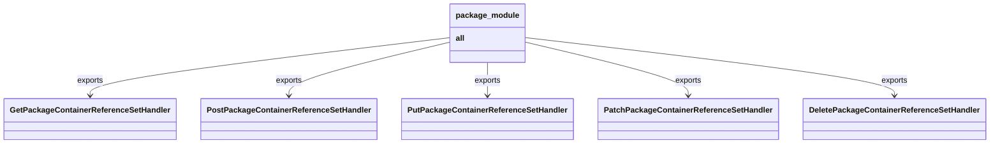

# Diagram: partview_core/partview_service/partview_service/api/package_container/reference/handler/__init__.py

> Auto-generated by Obscura crawlers

## Mermaid

### SVG

<svg id="container" width="1937.234375" xmlns="http://www.w3.org/2000/svg" class="classDiagram" height="294" viewBox="0 0 1937.234375 294" role="graphics-document document" aria-roledescription="class"><g><defs><marker id="container_class-aggregationStart" class="marker aggregation class" refX="18" refY="7" markerWidth="190" markerHeight="240" orient="auto"><path d="M 18,7 L9,13 L1,7 L9,1 Z"></path></marker></defs><defs><marker id="container_class-aggregationEnd" class="marker aggregation class" refX="1" refY="7" markerWidth="20" markerHeight="28" orient="auto"><path d="M 18,7 L9,13 L1,7 L9,1 Z"></path></marker></defs><defs><marker id="container_class-extensionStart" class="marker extension class" refX="18" refY="7" markerWidth="190" markerHeight="240" orient="auto"><path d="M 1,7 L18,13 V 1 Z"></path></marker></defs><defs><marker id="container_class-extensionEnd" class="marker extension class" refX="1" refY="7" markerWidth="20" markerHeight="28" orient="auto"><path d="M 1,1 V 13 L18,7 Z"></path></marker></defs><defs><marker id="container_class-compositionStart" class="marker composition class" refX="18" refY="7" markerWidth="190" markerHeight="240" orient="auto"><path d="M 18,7 L9,13 L1,7 L9,1 Z"></path></marker></defs><defs><marker id="container_class-compositionEnd" class="marker composition class" refX="1" refY="7" markerWidth="20" markerHeight="28" orient="auto"><path d="M 18,7 L9,13 L1,7 L9,1 Z"></path></marker></defs><defs><marker id="container_class-dependencyStart" class="marker dependency class" refX="6" refY="7" markerWidth="190" markerHeight="240" orient="auto"><path d="M 5,7 L9,13 L1,7 L9,1 Z"></path></marker></defs><defs><marker id="container_class-dependencyEnd" class="marker dependency class" refX="13" refY="7" markerWidth="20" markerHeight="28" orient="auto"><path d="M 18,7 L9,13 L14,7 L9,1 Z"></path></marker></defs><defs><marker id="container_class-lollipopStart" class="marker lollipop class" refX="13" refY="7" markerWidth="190" markerHeight="240" orient="auto"><circle stroke="black" fill="transparent" cx="7" cy="7" r="6"></circle></marker></defs><defs><marker id="container_class-lollipopEnd" class="marker lollipop class" refX="1" refY="7" markerWidth="190" markerHeight="240" orient="auto"><circle stroke="black" fill="transparent" cx="7" cy="7" r="6"></circle></marker></defs><g class="root"><g class="clusters"></g><g class="edgePaths"><path d="M879.844,77.195L762.501,91.829C645.159,106.463,410.474,135.732,293.132,155.532C175.789,175.333,175.789,185.667,175.789,190.833L175.789,196" id="id_package_module_GetPackageContainerReferenceSetHandler_1" class="edge-thickness-normal edge-pattern-solid relation" style=";;;" data-edge="true" data-et="edge" data-id="id_package_module_GetPackageContainerReferenceSetHandler_1" data-points="W3sieCI6ODc5Ljg0Mzc1LCJ5Ijo3Ny4xOTQ3MTQ1MzI1MjQ0Mn0seyJ4IjoxNzUuNzg5MDYyNSwieSI6MTY1fSx7IngiOjE3NS43ODkwNjI1LCJ5IjoyMDJ9XQ==" marker-end="url(#container_class-dependencyEnd)"></path><path d="M879.844,86.399L827.35,99.499C774.857,112.599,669.87,138.8,617.376,157.067C564.883,175.333,564.883,185.667,564.883,190.833L564.883,196" id="id_package_module_PostPackageContainerReferenceSetHandler_2" class="edge-thickness-normal edge-pattern-solid relation" style=";;;" data-edge="true" data-et="edge" data-id="id_package_module_PostPackageContainerReferenceSetHandler_2" data-points="W3sieCI6ODc5Ljg0Mzc1LCJ5Ijo4Ni4zOTkwMzkyMzQ2MDM2M30seyJ4Ijo1NjQuODgyODEyNSwieSI6MTY1fSx7IngiOjU2NC44ODI4MTI1LCJ5IjoyMDJ9XQ==" marker-end="url(#container_class-dependencyEnd)"></path><path d="M953.57,128L953.57,134.167C953.57,140.333,953.57,152.667,953.57,164C953.57,175.333,953.57,185.667,953.57,190.833L953.57,196" id="id_package_module_PutPackageContainerReferenceSetHandler_3" class="edge-thickness-normal edge-pattern-solid relation" style=";;;" data-edge="true" data-et="edge" data-id="id_package_module_PutPackageContainerReferenceSetHandler_3" data-points="W3sieCI6OTUzLjU3MDMxMjUsInkiOjEyOH0seyJ4Ijo5NTMuNTcwMzEyNSwieSI6MTY1fSx7IngiOjk1My41NzAzMTI1LCJ5IjoyMDJ9XQ==" marker-end="url(#container_class-dependencyEnd)"></path><path d="M1027.297,86.213L1080.453,99.344C1133.609,112.475,1239.922,138.738,1293.078,157.035C1346.234,175.333,1346.234,185.667,1346.234,190.833L1346.234,196" id="id_package_module_PatchPackageContainerReferenceSetHandler_4" class="edge-thickness-normal edge-pattern-solid relation" style=";;;" data-edge="true" data-et="edge" data-id="id_package_module_PatchPackageContainerReferenceSetHandler_4" data-points="W3sieCI6MTAyNy4yOTY4NzUsInkiOjg2LjIxMjcwOTY1NTU5Nzc4fSx7IngiOjEzNDYuMjM0Mzc1LCJ5IjoxNjV9LHsieCI6MTM0Ni4yMzQzNzUsInkiOjIwMn1d" marker-end="url(#container_class-dependencyEnd)"></path><path d="M1027.297,76.975L1147.81,91.646C1268.323,106.317,1509.349,135.658,1629.862,155.496C1750.375,175.333,1750.375,185.667,1750.375,190.833L1750.375,196" id="id_package_module_DeletePackageContainerReferenceSetHandler_5" class="edge-thickness-normal edge-pattern-solid relation" style=";;;" data-edge="true" data-et="edge" data-id="id_package_module_DeletePackageContainerReferenceSetHandler_5" data-points="W3sieCI6MTAyNy4yOTY4NzUsInkiOjc2Ljk3NTE5Mzg4OTY1Njk0fSx7IngiOjE3NTAuMzc1LCJ5IjoxNjV9LHsieCI6MTc1MC4zNzUsInkiOjIwMn1d" marker-end="url(#container_class-dependencyEnd)"></path></g><g class="edgeLabels"><g class="edgeLabel" transform="translate(175.7890625, 165)"><g class="label" data-id="id_package_module_GetPackageContainerReferenceSetHandler_1" transform="translate(-27.3046875, -12)"><foreignObject width="54.609375" height="24">

exports

</foreignObject></g></g><g class="edgeLabel" transform="translate(564.8828125, 165)"><g class="label" data-id="id_package_module_PostPackageContainerReferenceSetHandler_2" transform="translate(-27.3046875, -12)"><foreignObject width="54.609375" height="24">

exports

</foreignObject></g></g><g class="edgeLabel" transform="translate(953.5703125, 165)"><g class="label" data-id="id_package_module_PutPackageContainerReferenceSetHandler_3" transform="translate(-27.3046875, -12)"><foreignObject width="54.609375" height="24">

exports

</foreignObject></g></g><g class="edgeLabel" transform="translate(1346.234375, 165)"><g class="label" data-id="id_package_module_PatchPackageContainerReferenceSetHandler_4" transform="translate(-27.3046875, -12)"><foreignObject width="54.609375" height="24">

exports

</foreignObject></g></g><g class="edgeLabel" transform="translate(1750.375, 165)"><g class="label" data-id="id_package_module_DeletePackageContainerReferenceSetHandler_5" transform="translate(-27.3046875, -12)"><foreignObject width="54.609375" height="24">

exports

</foreignObject></g></g></g><g class="nodes"><g class="node default" id="classId-package_module-0" transform="translate(953.5703125, 68)"><g class="basic label-container"><path d="M-73.7265625 -60 L73.7265625 -60 L73.7265625 60 L-73.7265625 60" stroke="none" stroke-width="0" fill="#ECECFF" style=""></path><path d="M-73.7265625 -60 C-39.82902942307502 -60, -5.931496346150041 -60, 73.7265625 -60 M-73.7265625 -60 C-15.792717482454833 -60, 42.141127535090334 -60, 73.7265625 -60 M73.7265625 -60 C73.7265625 -20.770514542804584, 73.7265625 18.458970914390832, 73.7265625 60 M73.7265625 -60 C73.7265625 -27.45065400495043, 73.7265625 5.098691990099141, 73.7265625 60 M73.7265625 60 C23.79348962577081 60, -26.13958324845838 60, -73.7265625 60 M73.7265625 60 C23.80172819249568 60, -26.12310611500864 60, -73.7265625 60 M-73.7265625 60 C-73.7265625 28.491904060667274, -73.7265625 -3.0161918786654525, -73.7265625 -60 M-73.7265625 60 C-73.7265625 14.693370573811464, -73.7265625 -30.613258852377072, -73.7265625 -60" stroke="#9370DB" stroke-width="1.3" fill="none" stroke-dasharray="0 0" style=""></path></g><g class="annotation-group text" transform="translate(0, -36)"></g><g class="label-group text" transform="translate(-61.7265625, -36)"><g class="label" style="font-weight: bolder" transform="translate(0,-12)"><foreignObject width="123.453125" height="24">

package_module

</foreignObject></g></g><g class="members-group text" transform="translate(-61.7265625, 12)"><g class="label" style="" transform="translate(0,-12)"><foreignObject width="18.125" height="24">

<strong>all</strong>

</foreignObject></g></g><g class="methods-group text" transform="translate(-61.7265625, 60)"></g><g class="divider" style=""><path d="M-73.7265625 -12 C-28.850391093393803 -12, 16.025780313212394 -12, 73.7265625 -12 M-73.7265625 -12 C-33.87435338509763 -12, 5.9778557298047446 -12, 73.7265625 -12" stroke="#9370DB" stroke-width="1.3" fill="none" stroke-dasharray="0 0" style=""></path></g><g class="divider" style=""><path d="M-73.7265625 36 C-22.67265043734657 36, 28.381261625306863 36, 73.7265625 36 M-73.7265625 36 C-31.95929884670668 36, 9.80796480658664 36, 73.7265625 36" stroke="#9370DB" stroke-width="1.3" fill="none" stroke-dasharray="0 0" style=""></path></g></g><g class="node default" id="classId-GetPackageContainerReferenceSetHandler-1" transform="translate(175.7890625, 244)"><g class="basic label-container"><path d="M-167.7890625 -42 L167.7890625 -42 L167.7890625 42 L-167.7890625 42" stroke="none" stroke-width="0" fill="#ECECFF" style=""></path><path d="M-167.7890625 -42 C-86.63456777427453 -42, -5.480073048549059 -42, 167.7890625 -42 M-167.7890625 -42 C-70.15793112671435 -42, 27.47320024657131 -42, 167.7890625 -42 M167.7890625 -42 C167.7890625 -10.989795971125815, 167.7890625 20.02040805774837, 167.7890625 42 M167.7890625 -42 C167.7890625 -22.72160960340518, 167.7890625 -3.4432192068103618, 167.7890625 42 M167.7890625 42 C45.67725352884182 42, -76.43455544231637 42, -167.7890625 42 M167.7890625 42 C40.17220390105987 42, -87.44465469788025 42, -167.7890625 42 M-167.7890625 42 C-167.7890625 22.80689018759204, -167.7890625 3.613780375184078, -167.7890625 -42 M-167.7890625 42 C-167.7890625 12.232998585157933, -167.7890625 -17.534002829684134, -167.7890625 -42" stroke="#9370DB" stroke-width="1.3" fill="none" stroke-dasharray="0 0" style=""></path></g><g class="annotation-group text" transform="translate(0, -18)"></g><g class="label-group text" transform="translate(-155.7890625, -18)"><g class="label" style="font-weight: bolder" transform="translate(0,-12)"><foreignObject width="311.578125" height="24">

GetPackageContainerReferenceSetHandler

</foreignObject></g></g><g class="members-group text" transform="translate(-155.7890625, 30)"></g><g class="methods-group text" transform="translate(-155.7890625, 60)"></g><g class="divider" style=""><path d="M-167.7890625 6 C-46.9431536071622 6, 73.9027552856756 6, 167.7890625 6 M-167.7890625 6 C-53.748598085622234 6, 60.29186632875553 6, 167.7890625 6" stroke="#9370DB" stroke-width="1.3" fill="none" stroke-dasharray="0 0" style=""></path></g><g class="divider" style=""><path d="M-167.7890625 24 C-74.31913472877734 24, 19.150793042445315 24, 167.7890625 24 M-167.7890625 24 C-76.97903540607858 24, 13.83099168784284 24, 167.7890625 24" stroke="#9370DB" stroke-width="1.3" fill="none" stroke-dasharray="0 0" style=""></path></g></g><g class="node default" id="classId-PostPackageContainerReferenceSetHandler-2" transform="translate(564.8828125, 244)"><g class="basic label-container"><path d="M-171.3046875 -42 L171.3046875 -42 L171.3046875 42 L-171.3046875 42" stroke="none" stroke-width="0" fill="#ECECFF" style=""></path><path d="M-171.3046875 -42 C-58.34649073353779 -42, 54.61170603292442 -42, 171.3046875 -42 M-171.3046875 -42 C-66.97975711157733 -42, 37.345173276845344 -42, 171.3046875 -42 M171.3046875 -42 C171.3046875 -19.198464418794334, 171.3046875 3.6030711624113323, 171.3046875 42 M171.3046875 -42 C171.3046875 -12.907679995389149, 171.3046875 16.184640009221702, 171.3046875 42 M171.3046875 42 C58.757248655052024 42, -53.79019018989595 42, -171.3046875 42 M171.3046875 42 C42.555306090086475 42, -86.19407531982705 42, -171.3046875 42 M-171.3046875 42 C-171.3046875 9.079494353318218, -171.3046875 -23.841011293363565, -171.3046875 -42 M-171.3046875 42 C-171.3046875 21.646115736672133, -171.3046875 1.2922314733442661, -171.3046875 -42" stroke="#9370DB" stroke-width="1.3" fill="none" stroke-dasharray="0 0" style=""></path></g><g class="annotation-group text" transform="translate(0, -18)"></g><g class="label-group text" transform="translate(-159.3046875, -18)"><g class="label" style="font-weight: bolder" transform="translate(0,-12)"><foreignObject width="318.609375" height="24">

PostPackageContainerReferenceSetHandler

</foreignObject></g></g><g class="members-group text" transform="translate(-159.3046875, 30)"></g><g class="methods-group text" transform="translate(-159.3046875, 60)"></g><g class="divider" style=""><path d="M-171.3046875 6 C-56.045855156143475 6, 59.21297718771305 6, 171.3046875 6 M-171.3046875 6 C-78.4144895646239 6, 14.475708370752187 6, 171.3046875 6" stroke="#9370DB" stroke-width="1.3" fill="none" stroke-dasharray="0 0" style=""></path></g><g class="divider" style=""><path d="M-171.3046875 24 C-74.0127381684981 24, 23.279211163003794 24, 171.3046875 24 M-171.3046875 24 C-65.97521892859265 24, 39.35424964281469 24, 171.3046875 24" stroke="#9370DB" stroke-width="1.3" fill="none" stroke-dasharray="0 0" style=""></path></g></g><g class="node default" id="classId-PutPackageContainerReferenceSetHandler-3" transform="translate(953.5703125, 244)"><g class="basic label-container"><path d="M-167.3828125 -42 L167.3828125 -42 L167.3828125 42 L-167.3828125 42" stroke="none" stroke-width="0" fill="#ECECFF" style=""></path><path d="M-167.3828125 -42 C-64.6621912294389 -42, 38.05843004112219 -42, 167.3828125 -42 M-167.3828125 -42 C-40.41995649080134 -42, 86.54289951839732 -42, 167.3828125 -42 M167.3828125 -42 C167.3828125 -21.62902434918458, 167.3828125 -1.2580486983691586, 167.3828125 42 M167.3828125 -42 C167.3828125 -14.499018908693941, 167.3828125 13.001962182612118, 167.3828125 42 M167.3828125 42 C34.20830342373242 42, -98.96620565253517 42, -167.3828125 42 M167.3828125 42 C79.70169545551887 42, -7.9794215889622535 42, -167.3828125 42 M-167.3828125 42 C-167.3828125 12.629141391821939, -167.3828125 -16.741717216356122, -167.3828125 -42 M-167.3828125 42 C-167.3828125 16.772874053152766, -167.3828125 -8.454251893694469, -167.3828125 -42" stroke="#9370DB" stroke-width="1.3" fill="none" stroke-dasharray="0 0" style=""></path></g><g class="annotation-group text" transform="translate(0, -18)"></g><g class="label-group text" transform="translate(-155.3828125, -18)"><g class="label" style="font-weight: bolder" transform="translate(0,-12)"><foreignObject width="310.765625" height="24">

PutPackageContainerReferenceSetHandler

</foreignObject></g></g><g class="members-group text" transform="translate(-155.3828125, 30)"></g><g class="methods-group text" transform="translate(-155.3828125, 60)"></g><g class="divider" style=""><path d="M-167.3828125 6 C-54.9989245301866 6, 57.3849634396268 6, 167.3828125 6 M-167.3828125 6 C-90.7541933400407 6, -14.1255741800814 6, 167.3828125 6" stroke="#9370DB" stroke-width="1.3" fill="none" stroke-dasharray="0 0" style=""></path></g><g class="divider" style=""><path d="M-167.3828125 24 C-96.38206671990717 24, -25.381320939814344 24, 167.3828125 24 M-167.3828125 24 C-68.77436932410788 24, 29.83407385178424 24, 167.3828125 24" stroke="#9370DB" stroke-width="1.3" fill="none" stroke-dasharray="0 0" style=""></path></g></g><g class="node default" id="classId-PatchPackageContainerReferenceSetHandler-4" transform="translate(1346.234375, 244)"><g class="basic label-container"><path d="M-175.28125 -42 L175.28125 -42 L175.28125 42 L-175.28125 42" stroke="none" stroke-width="0" fill="#ECECFF" style=""></path><path d="M-175.28125 -42 C-67.20868395164398 -42, 40.86388209671205 -42, 175.28125 -42 M-175.28125 -42 C-39.45468778087772 -42, 96.37187443824456 -42, 175.28125 -42 M175.28125 -42 C175.28125 -18.985752620356987, 175.28125 4.028494759286026, 175.28125 42 M175.28125 -42 C175.28125 -10.604943600316805, 175.28125 20.79011279936639, 175.28125 42 M175.28125 42 C67.01219847366836 42, -41.256853052663274 42, -175.28125 42 M175.28125 42 C52.94302884867422 42, -69.39519230265157 42, -175.28125 42 M-175.28125 42 C-175.28125 22.044803830529844, -175.28125 2.089607661059688, -175.28125 -42 M-175.28125 42 C-175.28125 13.27965696422071, -175.28125 -15.44068607155858, -175.28125 -42" stroke="#9370DB" stroke-width="1.3" fill="none" stroke-dasharray="0 0" style=""></path></g><g class="annotation-group text" transform="translate(0, -18)"></g><g class="label-group text" transform="translate(-163.28125, -18)"><g class="label" style="font-weight: bolder" transform="translate(0,-12)"><foreignObject width="326.5625" height="24">

PatchPackageContainerReferenceSetHandler

</foreignObject></g></g><g class="members-group text" transform="translate(-163.28125, 30)"></g><g class="methods-group text" transform="translate(-163.28125, 60)"></g><g class="divider" style=""><path d="M-175.28125 6 C-41.082673536618444 6, 93.11590292676311 6, 175.28125 6 M-175.28125 6 C-39.43369580571709 6, 96.41385838856581 6, 175.28125 6" stroke="#9370DB" stroke-width="1.3" fill="none" stroke-dasharray="0 0" style=""></path></g><g class="divider" style=""><path d="M-175.28125 24 C-80.32373477286764 24, 14.633780454264723 24, 175.28125 24 M-175.28125 24 C-95.3565955255989 24, -15.43194105119781 24, 175.28125 24" stroke="#9370DB" stroke-width="1.3" fill="none" stroke-dasharray="0 0" style=""></path></g></g><g class="node default" id="classId-DeletePackageContainerReferenceSetHandler-5" transform="translate(1750.375, 244)"><g class="basic label-container"><path d="M-178.859375 -42 L178.859375 -42 L178.859375 42 L-178.859375 42" stroke="none" stroke-width="0" fill="#ECECFF" style=""></path><path d="M-178.859375 -42 C-102.77575503703287 -42, -26.69213507406573 -42, 178.859375 -42 M-178.859375 -42 C-46.71761341922317 -42, 85.42414816155366 -42, 178.859375 -42 M178.859375 -42 C178.859375 -13.654964114121363, 178.859375 14.690071771757275, 178.859375 42 M178.859375 -42 C178.859375 -18.65893248565707, 178.859375 4.682135028685863, 178.859375 42 M178.859375 42 C99.26664166319598 42, 19.673908326391967 42, -178.859375 42 M178.859375 42 C55.03560698635749 42, -68.78816102728501 42, -178.859375 42 M-178.859375 42 C-178.859375 18.2485137904142, -178.859375 -5.5029724191715985, -178.859375 -42 M-178.859375 42 C-178.859375 20.871888595144, -178.859375 -0.25622280971199984, -178.859375 -42" stroke="#9370DB" stroke-width="1.3" fill="none" stroke-dasharray="0 0" style=""></path></g><g class="annotation-group text" transform="translate(0, -18)"></g><g class="label-group text" transform="translate(-166.859375, -18)"><g class="label" style="font-weight: bolder" transform="translate(0,-12)"><foreignObject width="333.71875" height="24">

DeletePackageContainerReferenceSetHandler

</foreignObject></g></g><g class="members-group text" transform="translate(-166.859375, 30)"></g><g class="methods-group text" transform="translate(-166.859375, 60)"></g><g class="divider" style=""><path d="M-178.859375 6 C-76.18315905402177 6, 26.493056891956456 6, 178.859375 6 M-178.859375 6 C-107.04151637041817 6, -35.22365774083633 6, 178.859375 6" stroke="#9370DB" stroke-width="1.3" fill="none" stroke-dasharray="0 0" style=""></path></g><g class="divider" style=""><path d="M-178.859375 24 C-55.784252751252936 24, 67.29086949749413 24, 178.859375 24 M-178.859375 24 C-86.40419519738853 24, 6.050984605222936 24, 178.859375 24" stroke="#9370DB" stroke-width="1.3" fill="none" stroke-dasharray="0 0" style=""></path></g></g></g></g></g></svg>
