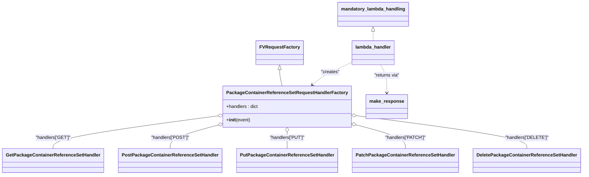
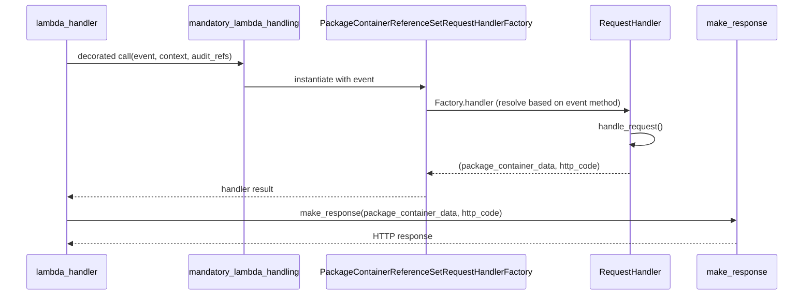

# Diagram: partview_core/partview_service/partview_service/api/package_container/reference/package_container_reference_handler.py

> Auto-generated by Obscura crawlers

## Diagram 1

### SVG

<svg id="container" width="1937.234375" xmlns="http://www.w3.org/2000/svg" class="classDiagram" height="610" viewBox="0 0 1937.234375 610" role="graphics-document document" aria-roledescription="class"><g><defs><marker id="container_class-aggregationStart" class="marker aggregation class" refX="18" refY="7" markerWidth="190" markerHeight="240" orient="auto"><path d="M 18,7 L9,13 L1,7 L9,1 Z"></path></marker></defs><defs><marker id="container_class-aggregationEnd" class="marker aggregation class" refX="1" refY="7" markerWidth="20" markerHeight="28" orient="auto"><path d="M 18,7 L9,13 L1,7 L9,1 Z"></path></marker></defs><defs><marker id="container_class-extensionStart" class="marker extension class" refX="18" refY="7" markerWidth="190" markerHeight="240" orient="auto"><path d="M 1,7 L18,13 V 1 Z"></path></marker></defs><defs><marker id="container_class-extensionEnd" class="marker extension class" refX="1" refY="7" markerWidth="20" markerHeight="28" orient="auto"><path d="M 1,1 V 13 L18,7 Z"></path></marker></defs><defs><marker id="container_class-compositionStart" class="marker composition class" refX="18" refY="7" markerWidth="190" markerHeight="240" orient="auto"><path d="M 18,7 L9,13 L1,7 L9,1 Z"></path></marker></defs><defs><marker id="container_class-compositionEnd" class="marker composition class" refX="1" refY="7" markerWidth="20" markerHeight="28" orient="auto"><path d="M 18,7 L9,13 L1,7 L9,1 Z"></path></marker></defs><defs><marker id="container_class-dependencyStart" class="marker dependency class" refX="6" refY="7" markerWidth="190" markerHeight="240" orient="auto"><path d="M 5,7 L9,13 L1,7 L9,1 Z"></path></marker></defs><defs><marker id="container_class-dependencyEnd" class="marker dependency class" refX="13" refY="7" markerWidth="20" markerHeight="28" orient="auto"><path d="M 18,7 L9,13 L14,7 L9,1 Z"></path></marker></defs><defs><marker id="container_class-lollipopStart" class="marker lollipop class" refX="13" refY="7" markerWidth="190" markerHeight="240" orient="auto"><circle stroke="black" fill="transparent" cx="7" cy="7" r="6"></circle></marker></defs><defs><marker id="container_class-lollipopEnd" class="marker lollipop class" refX="1" refY="7" markerWidth="190" markerHeight="240" orient="auto"><circle stroke="black" fill="transparent" cx="7" cy="7" r="6"></circle></marker></defs><g class="root"><g class="clusters"></g><g class="edgePaths"><path d="M927.391,243.25L927.391,246.542C927.391,249.833,927.391,256.417,928.872,265.875C930.353,275.333,933.315,287.667,934.796,293.833L936.277,300" id="id_FVRequestFactory_PackageContainerReferenceSetRequestHandlerFactory_1" class="edge-thickness-normal edge-pattern-solid relation" style=";;;" data-edge="true" data-et="edge" data-id="id_FVRequestFactory_PackageContainerReferenceSetRequestHandlerFactory_1" data-points="W3sieCI6OTI3LjM5MDYyNSwieSI6MjI2fSx7IngiOjkyNy4zOTA2MjUsInkiOjI2M30seyJ4Ijo5MzYuMjc3MzA3OTEyODQ0LCJ5IjozMDB9XQ==" marker-start="url(#container_class-extensionStart)"></path><path d="M724.784,404.063L633.285,416.886C541.786,429.708,358.787,455.354,267.288,474.344C175.789,493.333,175.789,505.667,175.789,511.833L175.789,518" id="id_PackageContainerReferenceSetRequestHandlerFactory_GetPackageContainerReferenceSetHandler_2" class="edge-thickness-normal edge-pattern-solid relation" style=";;;" data-edge="true" data-et="edge" data-id="id_PackageContainerReferenceSetRequestHandlerFactory_GetPackageContainerReferenceSetHandler_2" data-points="W3sieCI6NzQxLjg2NzE4NzUsInkiOjQwMS42Njg1NDgzNTQ2OTQ4NX0seyJ4IjoxNzUuNzg5MDYyNSwieSI6NDgxfSx7IngiOjE3NS43ODkwNjI1LCJ5Ijo1MTh9XQ==" marker-start="url(#container_class-aggregationStart)"></path><path d="M725.258,436.026L698.529,443.522C671.8,451.017,618.341,466.009,591.612,479.671C564.883,493.333,564.883,505.667,564.883,511.833L564.883,518" id="id_PackageContainerReferenceSetRequestHandlerFactory_PostPackageContainerReferenceSetHandler_3" class="edge-thickness-normal edge-pattern-solid relation" style=";;;" data-edge="true" data-et="edge" data-id="id_PackageContainerReferenceSetRequestHandlerFactory_PostPackageContainerReferenceSetHandler_3" data-points="W3sieCI6NzQxLjg2NzE4NzUsInkiOjQzMS4zNjgxMDU4MDQ3OTE3NX0seyJ4Ijo1NjQuODgyODEyNSwieSI6NDgxfSx7IngiOjU2NC44ODI4MTI1LCJ5Ijo1MTh9XQ==" marker-start="url(#container_class-aggregationStart)"></path><path d="M953.57,461.25L953.57,464.542C953.57,467.833,953.57,474.417,953.57,483.875C953.57,493.333,953.57,505.667,953.57,511.833L953.57,518" id="id_PackageContainerReferenceSetRequestHandlerFactory_PutPackageContainerReferenceSetHandler_4" class="edge-thickness-normal edge-pattern-solid relation" style=";;;" data-edge="true" data-et="edge" data-id="id_PackageContainerReferenceSetRequestHandlerFactory_PutPackageContainerReferenceSetHandler_4" data-points="W3sieCI6OTUzLjU3MDMxMjUsInkiOjQ0NH0seyJ4Ijo5NTMuNTcwMzEyNSwieSI6NDgxfSx7IngiOjk1My41NzAzMTI1LCJ5Ijo1MTh9XQ==" marker-start="url(#container_class-aggregationStart)"></path><path d="M1181.895,435.381L1209.285,442.984C1236.675,450.587,1291.455,465.794,1318.844,479.563C1346.234,493.333,1346.234,505.667,1346.234,511.833L1346.234,518" id="id_PackageContainerReferenceSetRequestHandlerFactory_PatchPackageContainerReferenceSetHandler_5" class="edge-thickness-normal edge-pattern-solid relation" style=";;;" data-edge="true" data-et="edge" data-id="id_PackageContainerReferenceSetRequestHandlerFactory_PatchPackageContainerReferenceSetHandler_5" data-points="W3sieCI6MTE2NS4yNzM0Mzc1LCJ5Ijo0MzAuNzY2ODc2OTAyNTY4Nn0seyJ4IjoxMzQ2LjIzNDM3NSwieSI6NDgxfSx7IngiOjEzNDYuMjM0Mzc1LCJ5Ijo1MTh9XQ==" marker-start="url(#container_class-aggregationStart)"></path><path d="M1182.364,403.298L1277.033,416.248C1371.701,429.199,1561.038,455.099,1655.707,474.216C1750.375,493.333,1750.375,505.667,1750.375,511.833L1750.375,518" id="id_PackageContainerReferenceSetRequestHandlerFactory_DeletePackageContainerReferenceSetHandler_6" class="edge-thickness-normal edge-pattern-solid relation" style=";;;" data-edge="true" data-et="edge" data-id="id_PackageContainerReferenceSetRequestHandlerFactory_DeletePackageContainerReferenceSetHandler_6" data-points="W3sieCI6MTE2NS4yNzM0Mzc1LCJ5Ijo0MDAuOTYwMjIxOTgwMzcwOH0seyJ4IjoxNzUwLjM3NSwieSI6NDgxfSx7IngiOjE3NTAuMzc1LCJ5Ijo1MTh9XQ==" marker-start="url(#container_class-aggregationStart)"></path><path d="M1235.945,109.25L1235.945,110.542C1235.945,111.833,1235.945,114.417,1235.945,119.875C1235.945,125.333,1235.945,133.667,1235.945,137.833L1235.945,142" id="id_mandatory_lambda_handling_lambda_handler_7" class="edge-thickness-normal edge-pattern-dashed relation" style=";;;" data-edge="true" data-et="edge" data-id="id_mandatory_lambda_handling_lambda_handler_7" data-points="W3sieCI6MTIzNS45NDUzMTI1LCJ5Ijo5Mn0seyJ4IjoxMjM1Ljk0NTMxMjUsInkiOjExN30seyJ4IjoxMjM1Ljk0NTMxMjUsInkiOjE0Mn1d" marker-start="url(#container_class-extensionStart)"></path><path d="M1163.969,218.34L1148.367,225.783C1132.766,233.226,1101.563,248.113,1080.085,261.041C1058.607,273.969,1046.854,284.937,1040.978,290.422L1035.102,295.906" id="id_lambda_handler_PackageContainerReferenceSetRequestHandlerFactory_8" class="edge-thickness-normal edge-pattern-dashed relation" style=";;;" data-edge="true" data-et="edge" data-id="id_lambda_handler_PackageContainerReferenceSetRequestHandlerFactory_8" data-points="W3sieCI6MTE2My45Njg3NSwieSI6MjE4LjMzOTU2MTIxNzI2ODIzfSx7IngiOjEwNzAuMzU5Mzc1LCJ5IjoyNjN9LHsieCI6MTAzMC43MTUzODEzMDczMzk0LCJ5IjozMDB9XQ==" marker-end="url(#container_class-dependencyEnd)"></path><path d="M1261.888,226L1265.697,232.167C1269.506,238.333,1277.124,250.667,1280.933,267C1284.742,283.333,1284.742,303.667,1284.742,313.833L1284.742,324" id="id_lambda_handler_make_response_9" class="edge-thickness-normal edge-pattern-dashed relation" style=";;;" data-edge="true" data-et="edge" data-id="id_lambda_handler_make_response_9" data-points="W3sieCI6MTI2MS44ODc5NTQ5MDUwNjMyLCJ5IjoyMjZ9LHsieCI6MTI4NC43NDIxODc1LCJ5IjoyNjN9LHsieCI6MTI4NC43NDIxODc1LCJ5IjozMzB9XQ==" marker-end="url(#container_class-dependencyEnd)"></path></g><g class="edgeLabels"><g class="edgeLabel"><g class="label" data-id="id_FVRequestFactory_PackageContainerReferenceSetRequestHandlerFactory_1" transform="translate(0, 0)"><foreignObject width="0" height="0">

</foreignObject></g></g><g class="edgeLabel" transform="translate(175.7890625, 481)"><g class="label" data-id="id_PackageContainerReferenceSetRequestHandlerFactory_GetPackageContainerReferenceSetHandler_2" transform="translate(-60.625, -12)"><foreignObject width="121.25" height="24">

"handlers['GET']"

</foreignObject></g></g><g class="edgeLabel" transform="translate(564.8828125, 481)"><g class="label" data-id="id_PackageContainerReferenceSetRequestHandlerFactory_PostPackageContainerReferenceSetHandler_3" transform="translate(-65.671875, -12)"><foreignObject width="131.34375" height="24">

"handlers['POST']"

</foreignObject></g></g><g class="edgeLabel" transform="translate(953.5703125, 481)"><g class="label" data-id="id_PackageContainerReferenceSetRequestHandlerFactory_PutPackageContainerReferenceSetHandler_4" transform="translate(-61.2421875, -12)"><foreignObject width="122.484375" height="24">

"handlers['PUT']"

</foreignObject></g></g><g class="edgeLabel" transform="translate(1346.234375, 481)"><g class="label" data-id="id_PackageContainerReferenceSetRequestHandlerFactory_PatchPackageContainerReferenceSetHandler_5" transform="translate(-69.2109375, -12)"><foreignObject width="138.421875" height="24">

"handlers['PATCH']"

</foreignObject></g></g><g class="edgeLabel" transform="translate(1750.375, 481)"><g class="label" data-id="id_PackageContainerReferenceSetRequestHandlerFactory_DeletePackageContainerReferenceSetHandler_6" transform="translate(-73.1953125, -12)"><foreignObject width="146.390625" height="24">

"handlers['DELETE']"

</foreignObject></g></g><g class="edgeLabel"><g class="label" data-id="id_mandatory_lambda_handling_lambda_handler_7" transform="translate(0, 0)"><foreignObject width="0" height="0">

</foreignObject></g></g><g class="edgeLabel" transform="translate(1092.69261, 252.34495)"><g class="label" data-id="id_lambda_handler_PackageContainerReferenceSetRequestHandlerFactory_8" transform="translate(-32.359375, -12)"><foreignObject width="64.71875" height="24">

"creates"

</foreignObject></g></g><g class="edgeLabel" transform="translate(1284.7421875, 263)"><g class="label" data-id="id_lambda_handler_make_response_9" transform="translate(-45.234375, -12)"><foreignObject width="90.46875" height="24">

"returns via"

</foreignObject></g></g></g><g class="nodes"><g class="node default" id="classId-FVRequestFactory-0" transform="translate(927.390625, 184)"><g class="basic label-container"><path d="M-77.0390625 -42 L77.0390625 -42 L77.0390625 42 L-77.0390625 42" stroke="none" stroke-width="0" fill="#ECECFF" style=""></path><path d="M-77.0390625 -42 C-38.14353738570401 -42, 0.7519877285919847 -42, 77.0390625 -42 M-77.0390625 -42 C-42.11088466790152 -42, -7.182706835803046 -42, 77.0390625 -42 M77.0390625 -42 C77.0390625 -18.205470471184555, 77.0390625 5.589059057630891, 77.0390625 42 M77.0390625 -42 C77.0390625 -10.556015540421754, 77.0390625 20.887968919156492, 77.0390625 42 M77.0390625 42 C42.46301705589818 42, 7.886971611796355 42, -77.0390625 42 M77.0390625 42 C27.467405983719487 42, -22.104250532561025 42, -77.0390625 42 M-77.0390625 42 C-77.0390625 22.98306776061415, -77.0390625 3.9661355212283027, -77.0390625 -42 M-77.0390625 42 C-77.0390625 24.577110599084197, -77.0390625 7.154221198168393, -77.0390625 -42" stroke="#9370DB" stroke-width="1.3" fill="none" stroke-dasharray="0 0" style=""></path></g><g class="annotation-group text" transform="translate(0, -18)"></g><g class="label-group text" transform="translate(-65.0390625, -18)"><g class="label" style="font-weight: bolder" transform="translate(0,-12)"><foreignObject width="130.078125" height="24">

FVRequestFactory

</foreignObject></g></g><g class="members-group text" transform="translate(-65.0390625, 30)"></g><g class="methods-group text" transform="translate(-65.0390625, 60)"></g><g class="divider" style=""><path d="M-77.0390625 6 C-25.86205773166767 6, 25.314947036664663 6, 77.0390625 6 M-77.0390625 6 C-15.689012678150313 6, 45.661037143699374 6, 77.0390625 6" stroke="#9370DB" stroke-width="1.3" fill="none" stroke-dasharray="0 0" style=""></path></g><g class="divider" style=""><path d="M-77.0390625 24 C-26.913171624790962 24, 23.212719250418075 24, 77.0390625 24 M-77.0390625 24 C-30.539010912587557 24, 15.961040674824886 24, 77.0390625 24" stroke="#9370DB" stroke-width="1.3" fill="none" stroke-dasharray="0 0" style=""></path></g></g><g class="node default" id="classId-PackageContainerReferenceSetRequestHandlerFactory-1" transform="translate(953.5703125, 372)"><g class="basic label-container"><path d="M-211.703125 -72 L211.703125 -72 L211.703125 72 L-211.703125 72" stroke="none" stroke-width="0" fill="#ECECFF" style=""></path><path d="M-211.703125 -72 C-112.47361743600372 -72, -13.244109872007442 -72, 211.703125 -72 M-211.703125 -72 C-75.90929599379652 -72, 59.88453301240696 -72, 211.703125 -72 M211.703125 -72 C211.703125 -22.945855084023854, 211.703125 26.10828983195229, 211.703125 72 M211.703125 -72 C211.703125 -22.10959552863814, 211.703125 27.780808942723723, 211.703125 72 M211.703125 72 C47.43726864778685 72, -116.8285877044263 72, -211.703125 72 M211.703125 72 C64.68896760451511 72, -82.32518979096977 72, -211.703125 72 M-211.703125 72 C-211.703125 38.04758498893038, -211.703125 4.095169977860763, -211.703125 -72 M-211.703125 72 C-211.703125 20.591539608536714, -211.703125 -30.816920782926573, -211.703125 -72" stroke="#9370DB" stroke-width="1.3" fill="none" stroke-dasharray="0 0" style=""></path></g><g class="annotation-group text" transform="translate(0, -48)"></g><g class="label-group text" transform="translate(-199.703125, -48)"><g class="label" style="font-weight: bolder" transform="translate(0,-12)"><foreignObject width="399.40625" height="24">

PackageContainerReferenceSetRequestHandlerFactory

</foreignObject></g></g><g class="members-group text" transform="translate(-199.703125, 0)"><g class="label" style="" transform="translate(0,-12)"><foreignObject width="111.578125" height="24">

+handlers : dict

</foreignObject></g></g><g class="methods-group text" transform="translate(-199.703125, 48)"><g class="label" style="" transform="translate(0,-12)"><foreignObject width="83.140625" height="24">

+<strong>init</strong>(event)

</foreignObject></g></g><g class="divider" style=""><path d="M-211.703125 -24 C-69.89816464461836 -24, 71.90679571076328 -24, 211.703125 -24 M-211.703125 -24 C-63.34217779757935 -24, 85.0187694048413 -24, 211.703125 -24" stroke="#9370DB" stroke-width="1.3" fill="none" stroke-dasharray="0 0" style=""></path></g><g class="divider" style=""><path d="M-211.703125 24 C-103.34329856888712 24, 5.016527862225757 24, 211.703125 24 M-211.703125 24 C-124.22240298138797 24, -36.741680962775945 24, 211.703125 24" stroke="#9370DB" stroke-width="1.3" fill="none" stroke-dasharray="0 0" style=""></path></g></g><g class="node default" id="classId-GetPackageContainerReferenceSetHandler-2" transform="translate(175.7890625, 560)"><g class="basic label-container"><path d="M-167.7890625 -42 L167.7890625 -42 L167.7890625 42 L-167.7890625 42" stroke="none" stroke-width="0" fill="#ECECFF" style=""></path><path d="M-167.7890625 -42 C-92.63594038524576 -42, -17.48281827049152 -42, 167.7890625 -42 M-167.7890625 -42 C-84.41672109281666 -42, -1.0443796856333165 -42, 167.7890625 -42 M167.7890625 -42 C167.7890625 -22.897039250572718, 167.7890625 -3.794078501145435, 167.7890625 42 M167.7890625 -42 C167.7890625 -9.158773752860945, 167.7890625 23.68245249427811, 167.7890625 42 M167.7890625 42 C55.40494460226897 42, -56.97917329546206 42, -167.7890625 42 M167.7890625 42 C65.69746495077902 42, -36.394132598441956 42, -167.7890625 42 M-167.7890625 42 C-167.7890625 8.755015850169507, -167.7890625 -24.489968299660987, -167.7890625 -42 M-167.7890625 42 C-167.7890625 23.823963082953007, -167.7890625 5.647926165906014, -167.7890625 -42" stroke="#9370DB" stroke-width="1.3" fill="none" stroke-dasharray="0 0" style=""></path></g><g class="annotation-group text" transform="translate(0, -18)"></g><g class="label-group text" transform="translate(-155.7890625, -18)"><g class="label" style="font-weight: bolder" transform="translate(0,-12)"><foreignObject width="311.578125" height="24">

GetPackageContainerReferenceSetHandler

</foreignObject></g></g><g class="members-group text" transform="translate(-155.7890625, 30)"></g><g class="methods-group text" transform="translate(-155.7890625, 60)"></g><g class="divider" style=""><path d="M-167.7890625 6 C-68.58908044948338 6, 30.610901601033248 6, 167.7890625 6 M-167.7890625 6 C-41.95029835799343 6, 83.88846578401314 6, 167.7890625 6" stroke="#9370DB" stroke-width="1.3" fill="none" stroke-dasharray="0 0" style=""></path></g><g class="divider" style=""><path d="M-167.7890625 24 C-76.73516673582816 24, 14.318729028343682 24, 167.7890625 24 M-167.7890625 24 C-43.68241052784744 24, 80.42424144430512 24, 167.7890625 24" stroke="#9370DB" stroke-width="1.3" fill="none" stroke-dasharray="0 0" style=""></path></g></g><g class="node default" id="classId-PostPackageContainerReferenceSetHandler-3" transform="translate(564.8828125, 560)"><g class="basic label-container"><path d="M-171.3046875 -42 L171.3046875 -42 L171.3046875 42 L-171.3046875 42" stroke="none" stroke-width="0" fill="#ECECFF" style=""></path><path d="M-171.3046875 -42 C-52.006078314768345 -42, 67.29253087046331 -42, 171.3046875 -42 M-171.3046875 -42 C-59.48973052349302 -42, 52.325226453013954 -42, 171.3046875 -42 M171.3046875 -42 C171.3046875 -9.475358024899187, 171.3046875 23.049283950201627, 171.3046875 42 M171.3046875 -42 C171.3046875 -22.934395057228084, 171.3046875 -3.868790114456168, 171.3046875 42 M171.3046875 42 C70.96811490842032 42, -29.368457683159363 42, -171.3046875 42 M171.3046875 42 C47.85045893144978 42, -75.60376963710044 42, -171.3046875 42 M-171.3046875 42 C-171.3046875 23.482145939449435, -171.3046875 4.9642918788988695, -171.3046875 -42 M-171.3046875 42 C-171.3046875 18.33725042375706, -171.3046875 -5.325499152485882, -171.3046875 -42" stroke="#9370DB" stroke-width="1.3" fill="none" stroke-dasharray="0 0" style=""></path></g><g class="annotation-group text" transform="translate(0, -18)"></g><g class="label-group text" transform="translate(-159.3046875, -18)"><g class="label" style="font-weight: bolder" transform="translate(0,-12)"><foreignObject width="318.609375" height="24">

PostPackageContainerReferenceSetHandler

</foreignObject></g></g><g class="members-group text" transform="translate(-159.3046875, 30)"></g><g class="methods-group text" transform="translate(-159.3046875, 60)"></g><g class="divider" style=""><path d="M-171.3046875 6 C-65.64021304875573 6, 40.02426140248855 6, 171.3046875 6 M-171.3046875 6 C-78.61584406380311 6, 14.072999372393781 6, 171.3046875 6" stroke="#9370DB" stroke-width="1.3" fill="none" stroke-dasharray="0 0" style=""></path></g><g class="divider" style=""><path d="M-171.3046875 24 C-89.83600336305787 24, -8.36731922611574 24, 171.3046875 24 M-171.3046875 24 C-91.35973398468087 24, -11.414780469361745 24, 171.3046875 24" stroke="#9370DB" stroke-width="1.3" fill="none" stroke-dasharray="0 0" style=""></path></g></g><g class="node default" id="classId-PutPackageContainerReferenceSetHandler-4" transform="translate(953.5703125, 560)"><g class="basic label-container"><path d="M-167.3828125 -42 L167.3828125 -42 L167.3828125 42 L-167.3828125 42" stroke="none" stroke-width="0" fill="#ECECFF" style=""></path><path d="M-167.3828125 -42 C-64.069647282497 -42, 39.243517935006 -42, 167.3828125 -42 M-167.3828125 -42 C-61.99277401254176 -42, 43.39726447491648 -42, 167.3828125 -42 M167.3828125 -42 C167.3828125 -22.166613491269747, 167.3828125 -2.333226982539493, 167.3828125 42 M167.3828125 -42 C167.3828125 -13.072906250588805, 167.3828125 15.854187498822391, 167.3828125 42 M167.3828125 42 C36.99920886828966 42, -93.38439476342069 42, -167.3828125 42 M167.3828125 42 C43.46439816756288 42, -80.45401616487425 42, -167.3828125 42 M-167.3828125 42 C-167.3828125 20.45756502550279, -167.3828125 -1.0848699489944167, -167.3828125 -42 M-167.3828125 42 C-167.3828125 17.140111345131615, -167.3828125 -7.71977730973677, -167.3828125 -42" stroke="#9370DB" stroke-width="1.3" fill="none" stroke-dasharray="0 0" style=""></path></g><g class="annotation-group text" transform="translate(0, -18)"></g><g class="label-group text" transform="translate(-155.3828125, -18)"><g class="label" style="font-weight: bolder" transform="translate(0,-12)"><foreignObject width="310.765625" height="24">

PutPackageContainerReferenceSetHandler

</foreignObject></g></g><g class="members-group text" transform="translate(-155.3828125, 30)"></g><g class="methods-group text" transform="translate(-155.3828125, 60)"></g><g class="divider" style=""><path d="M-167.3828125 6 C-34.52417377301816 6, 98.33446495396367 6, 167.3828125 6 M-167.3828125 6 C-94.08231142224484 6, -20.781810344489685 6, 167.3828125 6" stroke="#9370DB" stroke-width="1.3" fill="none" stroke-dasharray="0 0" style=""></path></g><g class="divider" style=""><path d="M-167.3828125 24 C-42.31279094811552 24, 82.75723060376896 24, 167.3828125 24 M-167.3828125 24 C-63.3428511381025 24, 40.69711022379499 24, 167.3828125 24" stroke="#9370DB" stroke-width="1.3" fill="none" stroke-dasharray="0 0" style=""></path></g></g><g class="node default" id="classId-PatchPackageContainerReferenceSetHandler-5" transform="translate(1346.234375, 560)"><g class="basic label-container"><path d="M-175.28125 -42 L175.28125 -42 L175.28125 42 L-175.28125 42" stroke="none" stroke-width="0" fill="#ECECFF" style=""></path><path d="M-175.28125 -42 C-100.04834900549406 -42, -24.81544801098812 -42, 175.28125 -42 M-175.28125 -42 C-40.99572731387224 -42, 93.28979537225553 -42, 175.28125 -42 M175.28125 -42 C175.28125 -14.685691552869685, 175.28125 12.628616894260631, 175.28125 42 M175.28125 -42 C175.28125 -15.722124472759852, 175.28125 10.555751054480297, 175.28125 42 M175.28125 42 C78.59387287102608 42, -18.093504257947842 42, -175.28125 42 M175.28125 42 C44.297900538306976 42, -86.68544892338605 42, -175.28125 42 M-175.28125 42 C-175.28125 22.42429558459835, -175.28125 2.848591169196702, -175.28125 -42 M-175.28125 42 C-175.28125 22.638532626794625, -175.28125 3.2770652535892495, -175.28125 -42" stroke="#9370DB" stroke-width="1.3" fill="none" stroke-dasharray="0 0" style=""></path></g><g class="annotation-group text" transform="translate(0, -18)"></g><g class="label-group text" transform="translate(-163.28125, -18)"><g class="label" style="font-weight: bolder" transform="translate(0,-12)"><foreignObject width="326.5625" height="24">

PatchPackageContainerReferenceSetHandler

</foreignObject></g></g><g class="members-group text" transform="translate(-163.28125, 30)"></g><g class="methods-group text" transform="translate(-163.28125, 60)"></g><g class="divider" style=""><path d="M-175.28125 6 C-36.744138011671396 6, 101.79297397665721 6, 175.28125 6 M-175.28125 6 C-51.11676362406969 6, 73.04772275186062 6, 175.28125 6" stroke="#9370DB" stroke-width="1.3" fill="none" stroke-dasharray="0 0" style=""></path></g><g class="divider" style=""><path d="M-175.28125 24 C-71.2950987134392 24, 32.691052573121596 24, 175.28125 24 M-175.28125 24 C-65.12314814579172 24, 45.034953708416566 24, 175.28125 24" stroke="#9370DB" stroke-width="1.3" fill="none" stroke-dasharray="0 0" style=""></path></g></g><g class="node default" id="classId-DeletePackageContainerReferenceSetHandler-6" transform="translate(1750.375, 560)"><g class="basic label-container"><path d="M-178.859375 -42 L178.859375 -42 L178.859375 42 L-178.859375 42" stroke="none" stroke-width="0" fill="#ECECFF" style=""></path><path d="M-178.859375 -42 C-91.41734932234134 -42, -3.9753236446826747 -42, 178.859375 -42 M-178.859375 -42 C-44.23194299475506 -42, 90.39548901048988 -42, 178.859375 -42 M178.859375 -42 C178.859375 -20.381592166772993, 178.859375 1.2368156664540138, 178.859375 42 M178.859375 -42 C178.859375 -23.452200861428725, 178.859375 -4.90440172285745, 178.859375 42 M178.859375 42 C42.73140746779862 42, -93.39656006440276 42, -178.859375 42 M178.859375 42 C106.57529612677877 42, 34.291217253557534 42, -178.859375 42 M-178.859375 42 C-178.859375 9.0029733958022, -178.859375 -23.9940532083956, -178.859375 -42 M-178.859375 42 C-178.859375 11.758866455762956, -178.859375 -18.48226708847409, -178.859375 -42" stroke="#9370DB" stroke-width="1.3" fill="none" stroke-dasharray="0 0" style=""></path></g><g class="annotation-group text" transform="translate(0, -18)"></g><g class="label-group text" transform="translate(-166.859375, -18)"><g class="label" style="font-weight: bolder" transform="translate(0,-12)"><foreignObject width="333.71875" height="24">

DeletePackageContainerReferenceSetHandler

</foreignObject></g></g><g class="members-group text" transform="translate(-166.859375, 30)"></g><g class="methods-group text" transform="translate(-166.859375, 60)"></g><g class="divider" style=""><path d="M-178.859375 6 C-89.13393880626577 6, 0.5914973874684506 6, 178.859375 6 M-178.859375 6 C-99.21053560638708 6, -19.561696212774166 6, 178.859375 6" stroke="#9370DB" stroke-width="1.3" fill="none" stroke-dasharray="0 0" style=""></path></g><g class="divider" style=""><path d="M-178.859375 24 C-83.62418208488216 24, 11.61101083023567 24, 178.859375 24 M-178.859375 24 C-64.39876569797568 24, 50.06184360404865 24, 178.859375 24" stroke="#9370DB" stroke-width="1.3" fill="none" stroke-dasharray="0 0" style=""></path></g></g><g class="node default" id="classId-make_response-7" transform="translate(1284.7421875, 372)"><g class="basic label-container"><path d="M-69.46875 -42 L69.46875 -42 L69.46875 42 L-69.46875 42" stroke="none" stroke-width="0" fill="#ECECFF" style=""></path><path d="M-69.46875 -42 C-19.055570387817482 -42, 31.357609224365035 -42, 69.46875 -42 M-69.46875 -42 C-30.445785719560376 -42, 8.577178560879247 -42, 69.46875 -42 M69.46875 -42 C69.46875 -21.110060523434022, 69.46875 -0.22012104686804435, 69.46875 42 M69.46875 -42 C69.46875 -20.84552570013188, 69.46875 0.3089485997362402, 69.46875 42 M69.46875 42 C40.779124239594935 42, 12.089498479189864 42, -69.46875 42 M69.46875 42 C20.898479946020743 42, -27.671790107958515 42, -69.46875 42 M-69.46875 42 C-69.46875 10.334666761322385, -69.46875 -21.33066647735523, -69.46875 -42 M-69.46875 42 C-69.46875 23.385657451564068, -69.46875 4.771314903128136, -69.46875 -42" stroke="#9370DB" stroke-width="1.3" fill="none" stroke-dasharray="0 0" style=""></path></g><g class="annotation-group text" transform="translate(0, -18)"></g><g class="label-group text" transform="translate(-57.46875, -18)"><g class="label" style="font-weight: bolder" transform="translate(0,-12)"><foreignObject width="114.9375" height="24">

make_response

</foreignObject></g></g><g class="members-group text" transform="translate(-57.46875, 30)"></g><g class="methods-group text" transform="translate(-57.46875, 60)"></g><g class="divider" style=""><path d="M-69.46875 6 C-25.895444122928993 6, 17.677861754142015 6, 69.46875 6 M-69.46875 6 C-24.42012695388712 6, 20.62849609222576 6, 69.46875 6" stroke="#9370DB" stroke-width="1.3" fill="none" stroke-dasharray="0 0" style=""></path></g><g class="divider" style=""><path d="M-69.46875 24 C-26.22465000510121 24, 17.01944998979758 24, 69.46875 24 M-69.46875 24 C-31.132862045731706 24, 7.203025908536588 24, 69.46875 24" stroke="#9370DB" stroke-width="1.3" fill="none" stroke-dasharray="0 0" style=""></path></g></g><g class="node default" id="classId-mandatory_lambda_handling-8" transform="translate(1235.9453125, 50)"><g class="basic label-container"><path d="M-119.4296875 -42 L119.4296875 -42 L119.4296875 42 L-119.4296875 42" stroke="none" stroke-width="0" fill="#ECECFF" style=""></path><path d="M-119.4296875 -42 C-71.4636046729435 -42, -23.497521845887007 -42, 119.4296875 -42 M-119.4296875 -42 C-50.113607477957245 -42, 19.20247254408551 -42, 119.4296875 -42 M119.4296875 -42 C119.4296875 -20.423179054982022, 119.4296875 1.1536418900359564, 119.4296875 42 M119.4296875 -42 C119.4296875 -12.718844402497925, 119.4296875 16.56231119500415, 119.4296875 42 M119.4296875 42 C27.733708029704715 42, -63.96227144059057 42, -119.4296875 42 M119.4296875 42 C69.7981171196165 42, 20.166546739233 42, -119.4296875 42 M-119.4296875 42 C-119.4296875 16.752268177596548, -119.4296875 -8.495463644806904, -119.4296875 -42 M-119.4296875 42 C-119.4296875 11.737245104011016, -119.4296875 -18.525509791977967, -119.4296875 -42" stroke="#9370DB" stroke-width="1.3" fill="none" stroke-dasharray="0 0" style=""></path></g><g class="annotation-group text" transform="translate(0, -18)"></g><g class="label-group text" transform="translate(-107.4296875, -18)"><g class="label" style="font-weight: bolder" transform="translate(0,-12)"><foreignObject width="214.859375" height="24">

mandatory_lambda_handling

</foreignObject></g></g><g class="members-group text" transform="translate(-107.4296875, 30)"></g><g class="methods-group text" transform="translate(-107.4296875, 60)"></g><g class="divider" style=""><path d="M-119.4296875 6 C-51.39556688674827 6, 16.63855372650346 6, 119.4296875 6 M-119.4296875 6 C-51.63389731556181 6, 16.16189286887638 6, 119.4296875 6" stroke="#9370DB" stroke-width="1.3" fill="none" stroke-dasharray="0 0" style=""></path></g><g class="divider" style=""><path d="M-119.4296875 24 C-51.7605462200261 24, 15.9085950599478 24, 119.4296875 24 M-119.4296875 24 C-31.710425206646804 24, 56.00883708670639 24, 119.4296875 24" stroke="#9370DB" stroke-width="1.3" fill="none" stroke-dasharray="0 0" style=""></path></g></g><g class="node default" id="classId-lambda_handler-9" transform="translate(1235.9453125, 184)"><g class="basic label-container"><path d="M-71.9765625 -42 L71.9765625 -42 L71.9765625 42 L-71.9765625 42" stroke="none" stroke-width="0" fill="#ECECFF" style=""></path><path d="M-71.9765625 -42 C-16.707023765352105 -42, 38.56251496929579 -42, 71.9765625 -42 M-71.9765625 -42 C-35.499308940108385 -42, 0.97794461978323 -42, 71.9765625 -42 M71.9765625 -42 C71.9765625 -9.261568177951801, 71.9765625 23.476863644096397, 71.9765625 42 M71.9765625 -42 C71.9765625 -13.576242684656176, 71.9765625 14.847514630687648, 71.9765625 42 M71.9765625 42 C29.859490529559075 42, -12.25758144088185 42, -71.9765625 42 M71.9765625 42 C35.42310337996833 42, -1.1303557400633366 42, -71.9765625 42 M-71.9765625 42 C-71.9765625 13.605367818393532, -71.9765625 -14.789264363212936, -71.9765625 -42 M-71.9765625 42 C-71.9765625 12.073039059190371, -71.9765625 -17.853921881619257, -71.9765625 -42" stroke="#9370DB" stroke-width="1.3" fill="none" stroke-dasharray="0 0" style=""></path></g><g class="annotation-group text" transform="translate(0, -18)"></g><g class="label-group text" transform="translate(-59.9765625, -18)"><g class="label" style="font-weight: bolder" transform="translate(0,-12)"><foreignObject width="119.953125" height="24">

lambda_handler

</foreignObject></g></g><g class="members-group text" transform="translate(-59.9765625, 30)"></g><g class="methods-group text" transform="translate(-59.9765625, 60)"></g><g class="divider" style=""><path d="M-71.9765625 6 C-39.09203003603778 6, -6.207497572075553 6, 71.9765625 6 M-71.9765625 6 C-42.85833507658887 6, -13.740107653177752 6, 71.9765625 6" stroke="#9370DB" stroke-width="1.3" fill="none" stroke-dasharray="0 0" style=""></path></g><g class="divider" style=""><path d="M-71.9765625 24 C-32.58053177515305 24, 6.815498949693904 24, 71.9765625 24 M-71.9765625 24 C-32.21771562922379 24, 7.541131241552421 24, 71.9765625 24" stroke="#9370DB" stroke-width="1.3" fill="none" stroke-dasharray="0 0" style=""></path></g></g></g></g></g></svg>

## Diagram 2

### SVG

<svg id="container" width="1615.5" xmlns="http://www.w3.org/2000/svg" height="585" viewBox="-50 -10 1615.5 585" role="graphics-document document" aria-roledescription="sequence"><g><rect x="1365.5" y="499" fill="#eaeaea" stroke="#666" width="150" height="65" name="Response" rx="3" ry="3" class="actor actor-bottom"></rect><text x="1440.5" y="531.5" dominant-baseline="central" alignment-baseline="central" class="actor actor-box" style="text-anchor: middle; font-size: 16px; font-weight: 400;"><tspan x="1440.5" dy="0">make_response</tspan></text></g><g><rect x="1165.5" y="499" fill="#eaeaea" stroke="#666" width="150" height="65" name="Handler" rx="3" ry="3" class="actor actor-bottom"></rect><text x="1240.5" y="531.5" dominant-baseline="central" alignment-baseline="central" class="actor actor-box" style="text-anchor: middle; font-size: 16px; font-weight: 400;"><tspan x="1240.5" dy="0">RequestHandler</tspan></text></g><g><rect x="609" y="499" fill="#eaeaea" stroke="#666" width="413" height="65" name="Factory" rx="3" ry="3" class="actor actor-bottom"></rect><text x="815.5" y="531.5" dominant-baseline="central" alignment-baseline="central" class="actor actor-box" style="text-anchor: middle; font-size: 16px; font-weight: 400;"><tspan x="815.5" dy="0">PackageContainerReferenceSetRequestHandlerFactory</tspan></text></g><g><rect x="325" y="499" fill="#eaeaea" stroke="#666" width="234" height="65" name="Decorator" rx="3" ry="3" class="actor actor-bottom"></rect><text x="442" y="531.5" dominant-baseline="central" alignment-baseline="central" class="actor actor-box" style="text-anchor: middle; font-size: 16px; font-weight: 400;"><tspan x="442" dy="0">mandatory_lambda_handling</tspan></text></g><g><rect x="0" y="499" fill="#eaeaea" stroke="#666" width="150" height="65" name="Lambda" rx="3" ry="3" class="actor actor-bottom"></rect><text x="75" y="531.5" dominant-baseline="central" alignment-baseline="central" class="actor actor-box" style="text-anchor: middle; font-size: 16px; font-weight: 400;"><tspan x="75" dy="0">lambda_handler</tspan></text></g><g><line id="actor4" x1="1440.5" y1="65" x2="1440.5" y2="499" class="actor-line 200" stroke-width="0.5px" stroke="#999" name="Response"></line><g id="root-4"><rect x="1365.5" y="0" fill="#eaeaea" stroke="#666" width="150" height="65" name="Response" rx="3" ry="3" class="actor actor-top"></rect><text x="1440.5" y="32.5" dominant-baseline="central" alignment-baseline="central" class="actor actor-box" style="text-anchor: middle; font-size: 16px; font-weight: 400;"><tspan x="1440.5" dy="0">make_response</tspan></text></g></g><g><line id="actor3" x1="1240.5" y1="65" x2="1240.5" y2="499" class="actor-line 200" stroke-width="0.5px" stroke="#999" name="Handler"></line><g id="root-3"><rect x="1165.5" y="0" fill="#eaeaea" stroke="#666" width="150" height="65" name="Handler" rx="3" ry="3" class="actor actor-top"></rect><text x="1240.5" y="32.5" dominant-baseline="central" alignment-baseline="central" class="actor actor-box" style="text-anchor: middle; font-size: 16px; font-weight: 400;"><tspan x="1240.5" dy="0">RequestHandler</tspan></text></g></g><g><line id="actor2" x1="815.5" y1="65" x2="815.5" y2="499" class="actor-line 200" stroke-width="0.5px" stroke="#999" name="Factory"></line><g id="root-2"><rect x="609" y="0" fill="#eaeaea" stroke="#666" width="413" height="65" name="Factory" rx="3" ry="3" class="actor actor-top"></rect><text x="815.5" y="32.5" dominant-baseline="central" alignment-baseline="central" class="actor actor-box" style="text-anchor: middle; font-size: 16px; font-weight: 400;"><tspan x="815.5" dy="0">PackageContainerReferenceSetRequestHandlerFactory</tspan></text></g></g><g><line id="actor1" x1="442" y1="65" x2="442" y2="499" class="actor-line 200" stroke-width="0.5px" stroke="#999" name="Decorator"></line><g id="root-1"><rect x="325" y="0" fill="#eaeaea" stroke="#666" width="234" height="65" name="Decorator" rx="3" ry="3" class="actor actor-top"></rect><text x="442" y="32.5" dominant-baseline="central" alignment-baseline="central" class="actor actor-box" style="text-anchor: middle; font-size: 16px; font-weight: 400;"><tspan x="442" dy="0">mandatory_lambda_handling</tspan></text></g></g><g><line id="actor0" x1="75" y1="65" x2="75" y2="499" class="actor-line 200" stroke-width="0.5px" stroke="#999" name="Lambda"></line><g id="root-0"><rect x="0" y="0" fill="#eaeaea" stroke="#666" width="150" height="65" name="Lambda" rx="3" ry="3" class="actor actor-top"></rect><text x="75" y="32.5" dominant-baseline="central" alignment-baseline="central" class="actor actor-box" style="text-anchor: middle; font-size: 16px; font-weight: 400;"><tspan x="75" dy="0">lambda_handler</tspan></text></g></g><g></g><defs><symbol id="computer" width="24" height="24"><path transform="scale(.5)" d="M2 2v13h20v-13h-20zm18 11h-16v-9h16v9zm-10.228 6l.466-1h3.524l.467 1h-4.457zm14.228 3h-24l2-6h2.104l-1.33 4h18.45l-1.297-4h2.073l2 6zm-5-10h-14v-7h14v7z"></path></symbol></defs><defs><symbol id="database" fill-rule="evenodd" clip-rule="evenodd"><path transform="scale(.5)" d="M12.258.001l.256.004.255.005.253.008.251.01.249.012.247.015.246.016.242.019.241.02.239.023.236.024.233.027.231.028.229.031.225.032.223.034.22.036.217.038.214.04.211.041.208.043.205.045.201.046.198.048.194.05.191.051.187.053.183.054.18.056.175.057.172.059.168.06.163.061.16.063.155.064.15.066.074.033.073.033.071.034.07.034.069.035.068.035.067.035.066.035.064.036.064.036.062.036.06.036.06.037.058.037.058.037.055.038.055.038.053.038.052.038.051.039.05.039.048.039.047.039.045.04.044.04.043.04.041.04.04.041.039.041.037.041.036.041.034.041.033.042.032.042.03.042.029.042.027.042.026.043.024.043.023.043.021.043.02.043.018.044.017.043.015.044.013.044.012.044.011.045.009.044.007.045.006.045.004.045.002.045.001.045v17l-.001.045-.002.045-.004.045-.006.045-.007.045-.009.044-.011.045-.012.044-.013.044-.015.044-.017.043-.018.044-.02.043-.021.043-.023.043-.024.043-.026.043-.027.042-.029.042-.03.042-.032.042-.033.042-.034.041-.036.041-.037.041-.039.041-.04.041-.041.04-.043.04-.044.04-.045.04-.047.039-.048.039-.05.039-.051.039-.052.038-.053.038-.055.038-.055.038-.058.037-.058.037-.06.037-.06.036-.062.036-.064.036-.064.036-.066.035-.067.035-.068.035-.069.035-.07.034-.071.034-.073.033-.074.033-.15.066-.155.064-.16.063-.163.061-.168.06-.172.059-.175.057-.18.056-.183.054-.187.053-.191.051-.194.05-.198.048-.201.046-.205.045-.208.043-.211.041-.214.04-.217.038-.22.036-.223.034-.225.032-.229.031-.231.028-.233.027-.236.024-.239.023-.241.02-.242.019-.246.016-.247.015-.249.012-.251.01-.253.008-.255.005-.256.004-.258.001-.258-.001-.256-.004-.255-.005-.253-.008-.251-.01-.249-.012-.247-.015-.245-.016-.243-.019-.241-.02-.238-.023-.236-.024-.234-.027-.231-.028-.228-.031-.226-.032-.223-.034-.22-.036-.217-.038-.214-.04-.211-.041-.208-.043-.204-.045-.201-.046-.198-.048-.195-.05-.19-.051-.187-.053-.184-.054-.179-.056-.176-.057-.172-.059-.167-.06-.164-.061-.159-.063-.155-.064-.151-.066-.074-.033-.072-.033-.072-.034-.07-.034-.069-.035-.068-.035-.067-.035-.066-.035-.064-.036-.063-.036-.062-.036-.061-.036-.06-.037-.058-.037-.057-.037-.056-.038-.055-.038-.053-.038-.052-.038-.051-.039-.049-.039-.049-.039-.046-.039-.046-.04-.044-.04-.043-.04-.041-.04-.04-.041-.039-.041-.037-.041-.036-.041-.034-.041-.033-.042-.032-.042-.03-.042-.029-.042-.027-.042-.026-.043-.024-.043-.023-.043-.021-.043-.02-.043-.018-.044-.017-.043-.015-.044-.013-.044-.012-.044-.011-.045-.009-.044-.007-.045-.006-.045-.004-.045-.002-.045-.001-.045v-17l.001-.045.002-.045.004-.045.006-.045.007-.045.009-.044.011-.045.012-.044.013-.044.015-.044.017-.043.018-.044.02-.043.021-.043.023-.043.024-.043.026-.043.027-.042.029-.042.03-.042.032-.042.033-.042.034-.041.036-.041.037-.041.039-.041.04-.041.041-.04.043-.04.044-.04.046-.04.046-.039.049-.039.049-.039.051-.039.052-.038.053-.038.055-.038.056-.038.057-.037.058-.037.06-.037.061-.036.062-.036.063-.036.064-.036.066-.035.067-.035.068-.035.069-.035.07-.034.072-.034.072-.033.074-.033.151-.066.155-.064.159-.063.164-.061.167-.06.172-.059.176-.057.179-.056.184-.054.187-.053.19-.051.195-.05.198-.048.201-.046.204-.045.208-.043.211-.041.214-.04.217-.038.22-.036.223-.034.226-.032.228-.031.231-.028.234-.027.236-.024.238-.023.241-.02.243-.019.245-.016.247-.015.249-.012.251-.01.253-.008.255-.005.256-.004.258-.001.258.001zm-9.258 20.499v.01l.001.021.003.021.004.022.005.021.006.022.007.022.009.023.01.022.011.023.012.023.013.023.015.023.016.024.017.023.018.024.019.024.021.024.022.025.023.024.024.025.052.049.056.05.061.051.066.051.07.051.075.051.079.052.084.052.088.052.092.052.097.052.102.051.105.052.11.052.114.051.119.051.123.051.127.05.131.05.135.05.139.048.144.049.147.047.152.047.155.047.16.045.163.045.167.043.171.043.176.041.178.041.183.039.187.039.19.037.194.035.197.035.202.033.204.031.209.03.212.029.216.027.219.025.222.024.226.021.23.02.233.018.236.016.24.015.243.012.246.01.249.008.253.005.256.004.259.001.26-.001.257-.004.254-.005.25-.008.247-.011.244-.012.241-.014.237-.016.233-.018.231-.021.226-.021.224-.024.22-.026.216-.027.212-.028.21-.031.205-.031.202-.034.198-.034.194-.036.191-.037.187-.039.183-.04.179-.04.175-.042.172-.043.168-.044.163-.045.16-.046.155-.046.152-.047.148-.048.143-.049.139-.049.136-.05.131-.05.126-.05.123-.051.118-.052.114-.051.11-.052.106-.052.101-.052.096-.052.092-.052.088-.053.083-.051.079-.052.074-.052.07-.051.065-.051.06-.051.056-.05.051-.05.023-.024.023-.025.021-.024.02-.024.019-.024.018-.024.017-.024.015-.023.014-.024.013-.023.012-.023.01-.023.01-.022.008-.022.006-.022.006-.022.004-.022.004-.021.001-.021.001-.021v-4.127l-.077.055-.08.053-.083.054-.085.053-.087.052-.09.052-.093.051-.095.05-.097.05-.1.049-.102.049-.105.048-.106.047-.109.047-.111.046-.114.045-.115.045-.118.044-.12.043-.122.042-.124.042-.126.041-.128.04-.13.04-.132.038-.134.038-.135.037-.138.037-.139.035-.142.035-.143.034-.144.033-.147.032-.148.031-.15.03-.151.03-.153.029-.154.027-.156.027-.158.026-.159.025-.161.024-.162.023-.163.022-.165.021-.166.02-.167.019-.169.018-.169.017-.171.016-.173.015-.173.014-.175.013-.175.012-.177.011-.178.01-.179.008-.179.008-.181.006-.182.005-.182.004-.184.003-.184.002h-.37l-.184-.002-.184-.003-.182-.004-.182-.005-.181-.006-.179-.008-.179-.008-.178-.01-.176-.011-.176-.012-.175-.013-.173-.014-.172-.015-.171-.016-.17-.017-.169-.018-.167-.019-.166-.02-.165-.021-.163-.022-.162-.023-.161-.024-.159-.025-.157-.026-.156-.027-.155-.027-.153-.029-.151-.03-.15-.03-.148-.031-.146-.032-.145-.033-.143-.034-.141-.035-.14-.035-.137-.037-.136-.037-.134-.038-.132-.038-.13-.04-.128-.04-.126-.041-.124-.042-.122-.042-.12-.044-.117-.043-.116-.045-.113-.045-.112-.046-.109-.047-.106-.047-.105-.048-.102-.049-.1-.049-.097-.05-.095-.05-.093-.052-.09-.051-.087-.052-.085-.053-.083-.054-.08-.054-.077-.054v4.127zm0-5.654v.011l.001.021.003.021.004.021.005.022.006.022.007.022.009.022.01.022.011.023.012.023.013.023.015.024.016.023.017.024.018.024.019.024.021.024.022.024.023.025.024.024.052.05.056.05.061.05.066.051.07.051.075.052.079.051.084.052.088.052.092.052.097.052.102.052.105.052.11.051.114.051.119.052.123.05.127.051.131.05.135.049.139.049.144.048.147.048.152.047.155.046.16.045.163.045.167.044.171.042.176.042.178.04.183.04.187.038.19.037.194.036.197.034.202.033.204.032.209.03.212.028.216.027.219.025.222.024.226.022.23.02.233.018.236.016.24.014.243.012.246.01.249.008.253.006.256.003.259.001.26-.001.257-.003.254-.006.25-.008.247-.01.244-.012.241-.015.237-.016.233-.018.231-.02.226-.022.224-.024.22-.025.216-.027.212-.029.21-.03.205-.032.202-.033.198-.035.194-.036.191-.037.187-.039.183-.039.179-.041.175-.042.172-.043.168-.044.163-.045.16-.045.155-.047.152-.047.148-.048.143-.048.139-.05.136-.049.131-.05.126-.051.123-.051.118-.051.114-.052.11-.052.106-.052.101-.052.096-.052.092-.052.088-.052.083-.052.079-.052.074-.051.07-.052.065-.051.06-.05.056-.051.051-.049.023-.025.023-.024.021-.025.02-.024.019-.024.018-.024.017-.024.015-.023.014-.023.013-.024.012-.022.01-.023.01-.023.008-.022.006-.022.006-.022.004-.021.004-.022.001-.021.001-.021v-4.139l-.077.054-.08.054-.083.054-.085.052-.087.053-.09.051-.093.051-.095.051-.097.05-.1.049-.102.049-.105.048-.106.047-.109.047-.111.046-.114.045-.115.044-.118.044-.12.044-.122.042-.124.042-.126.041-.128.04-.13.039-.132.039-.134.038-.135.037-.138.036-.139.036-.142.035-.143.033-.144.033-.147.033-.148.031-.15.03-.151.03-.153.028-.154.028-.156.027-.158.026-.159.025-.161.024-.162.023-.163.022-.165.021-.166.02-.167.019-.169.018-.169.017-.171.016-.173.015-.173.014-.175.013-.175.012-.177.011-.178.009-.179.009-.179.007-.181.007-.182.005-.182.004-.184.003-.184.002h-.37l-.184-.002-.184-.003-.182-.004-.182-.005-.181-.007-.179-.007-.179-.009-.178-.009-.176-.011-.176-.012-.175-.013-.173-.014-.172-.015-.171-.016-.17-.017-.169-.018-.167-.019-.166-.02-.165-.021-.163-.022-.162-.023-.161-.024-.159-.025-.157-.026-.156-.027-.155-.028-.153-.028-.151-.03-.15-.03-.148-.031-.146-.033-.145-.033-.143-.033-.141-.035-.14-.036-.137-.036-.136-.037-.134-.038-.132-.039-.13-.039-.128-.04-.126-.041-.124-.042-.122-.043-.12-.043-.117-.044-.116-.044-.113-.046-.112-.046-.109-.046-.106-.047-.105-.048-.102-.049-.1-.049-.097-.05-.095-.051-.093-.051-.09-.051-.087-.053-.085-.052-.083-.054-.08-.054-.077-.054v4.139zm0-5.666v.011l.001.02.003.022.004.021.005.022.006.021.007.022.009.023.01.022.011.023.012.023.013.023.015.023.016.024.017.024.018.023.019.024.021.025.022.024.023.024.024.025.052.05.056.05.061.05.066.051.07.051.075.052.079.051.084.052.088.052.092.052.097.052.102.052.105.051.11.052.114.051.119.051.123.051.127.05.131.05.135.05.139.049.144.048.147.048.152.047.155.046.16.045.163.045.167.043.171.043.176.042.178.04.183.04.187.038.19.037.194.036.197.034.202.033.204.032.209.03.212.028.216.027.219.025.222.024.226.021.23.02.233.018.236.017.24.014.243.012.246.01.249.008.253.006.256.003.259.001.26-.001.257-.003.254-.006.25-.008.247-.01.244-.013.241-.014.237-.016.233-.018.231-.02.226-.022.224-.024.22-.025.216-.027.212-.029.21-.03.205-.032.202-.033.198-.035.194-.036.191-.037.187-.039.183-.039.179-.041.175-.042.172-.043.168-.044.163-.045.16-.045.155-.047.152-.047.148-.048.143-.049.139-.049.136-.049.131-.051.126-.05.123-.051.118-.052.114-.051.11-.052.106-.052.101-.052.096-.052.092-.052.088-.052.083-.052.079-.052.074-.052.07-.051.065-.051.06-.051.056-.05.051-.049.023-.025.023-.025.021-.024.02-.024.019-.024.018-.024.017-.024.015-.023.014-.024.013-.023.012-.023.01-.022.01-.023.008-.022.006-.022.006-.022.004-.022.004-.021.001-.021.001-.021v-4.153l-.077.054-.08.054-.083.053-.085.053-.087.053-.09.051-.093.051-.095.051-.097.05-.1.049-.102.048-.105.048-.106.048-.109.046-.111.046-.114.046-.115.044-.118.044-.12.043-.122.043-.124.042-.126.041-.128.04-.13.039-.132.039-.134.038-.135.037-.138.036-.139.036-.142.034-.143.034-.144.033-.147.032-.148.032-.15.03-.151.03-.153.028-.154.028-.156.027-.158.026-.159.024-.161.024-.162.023-.163.023-.165.021-.166.02-.167.019-.169.018-.169.017-.171.016-.173.015-.173.014-.175.013-.175.012-.177.01-.178.01-.179.009-.179.007-.181.006-.182.006-.182.004-.184.003-.184.001-.185.001-.185-.001-.184-.001-.184-.003-.182-.004-.182-.006-.181-.006-.179-.007-.179-.009-.178-.01-.176-.01-.176-.012-.175-.013-.173-.014-.172-.015-.171-.016-.17-.017-.169-.018-.167-.019-.166-.02-.165-.021-.163-.023-.162-.023-.161-.024-.159-.024-.157-.026-.156-.027-.155-.028-.153-.028-.151-.03-.15-.03-.148-.032-.146-.032-.145-.033-.143-.034-.141-.034-.14-.036-.137-.036-.136-.037-.134-.038-.132-.039-.13-.039-.128-.041-.126-.041-.124-.041-.122-.043-.12-.043-.117-.044-.116-.044-.113-.046-.112-.046-.109-.046-.106-.048-.105-.048-.102-.048-.1-.05-.097-.049-.095-.051-.093-.051-.09-.052-.087-.052-.085-.053-.083-.053-.08-.054-.077-.054v4.153zm8.74-8.179l-.257.004-.254.005-.25.008-.247.011-.244.012-.241.014-.237.016-.233.018-.231.021-.226.022-.224.023-.22.026-.216.027-.212.028-.21.031-.205.032-.202.033-.198.034-.194.036-.191.038-.187.038-.183.04-.179.041-.175.042-.172.043-.168.043-.163.045-.16.046-.155.046-.152.048-.148.048-.143.048-.139.049-.136.05-.131.05-.126.051-.123.051-.118.051-.114.052-.11.052-.106.052-.101.052-.096.052-.092.052-.088.052-.083.052-.079.052-.074.051-.07.052-.065.051-.06.05-.056.05-.051.05-.023.025-.023.024-.021.024-.02.025-.019.024-.018.024-.017.023-.015.024-.014.023-.013.023-.012.023-.01.023-.01.022-.008.022-.006.023-.006.021-.004.022-.004.021-.001.021-.001.021.001.021.001.021.004.021.004.022.006.021.006.023.008.022.01.022.01.023.012.023.013.023.014.023.015.024.017.023.018.024.019.024.02.025.021.024.023.024.023.025.051.05.056.05.06.05.065.051.07.052.074.051.079.052.083.052.088.052.092.052.096.052.101.052.106.052.11.052.114.052.118.051.123.051.126.051.131.05.136.05.139.049.143.048.148.048.152.048.155.046.16.046.163.045.168.043.172.043.175.042.179.041.183.04.187.038.191.038.194.036.198.034.202.033.205.032.21.031.212.028.216.027.22.026.224.023.226.022.231.021.233.018.237.016.241.014.244.012.247.011.25.008.254.005.257.004.26.001.26-.001.257-.004.254-.005.25-.008.247-.011.244-.012.241-.014.237-.016.233-.018.231-.021.226-.022.224-.023.22-.026.216-.027.212-.028.21-.031.205-.032.202-.033.198-.034.194-.036.191-.038.187-.038.183-.04.179-.041.175-.042.172-.043.168-.043.163-.045.16-.046.155-.046.152-.048.148-.048.143-.048.139-.049.136-.05.131-.05.126-.051.123-.051.118-.051.114-.052.11-.052.106-.052.101-.052.096-.052.092-.052.088-.052.083-.052.079-.052.074-.051.07-.052.065-.051.06-.05.056-.05.051-.05.023-.025.023-.024.021-.024.02-.025.019-.024.018-.024.017-.023.015-.024.014-.023.013-.023.012-.023.01-.023.01-.022.008-.022.006-.023.006-.021.004-.022.004-.021.001-.021.001-.021-.001-.021-.001-.021-.004-.021-.004-.022-.006-.021-.006-.023-.008-.022-.01-.022-.01-.023-.012-.023-.013-.023-.014-.023-.015-.024-.017-.023-.018-.024-.019-.024-.02-.025-.021-.024-.023-.024-.023-.025-.051-.05-.056-.05-.06-.05-.065-.051-.07-.052-.074-.051-.079-.052-.083-.052-.088-.052-.092-.052-.096-.052-.101-.052-.106-.052-.11-.052-.114-.052-.118-.051-.123-.051-.126-.051-.131-.05-.136-.05-.139-.049-.143-.048-.148-.048-.152-.048-.155-.046-.16-.046-.163-.045-.168-.043-.172-.043-.175-.042-.179-.041-.183-.04-.187-.038-.191-.038-.194-.036-.198-.034-.202-.033-.205-.032-.21-.031-.212-.028-.216-.027-.22-.026-.224-.023-.226-.022-.231-.021-.233-.018-.237-.016-.241-.014-.244-.012-.247-.011-.25-.008-.254-.005-.257-.004-.26-.001-.26.001z"></path></symbol></defs><defs><symbol id="clock" width="24" height="24"><path transform="scale(.5)" d="M12 2c5.514 0 10 4.486 10 10s-4.486 10-10 10-10-4.486-10-10 4.486-10 10-10zm0-2c-6.627 0-12 5.373-12 12s5.373 12 12 12 12-5.373 12-12-5.373-12-12-12zm5.848 12.459c.202.038.202.333.001.372-1.907.361-6.045 1.111-6.547 1.111-.719 0-1.301-.582-1.301-1.301 0-.512.77-5.447 1.125-7.445.034-.192.312-.181.343.014l.985 6.238 5.394 1.011z"></path></symbol></defs><defs><marker id="arrowhead" refX="7.9" refY="5" markerUnits="userSpaceOnUse" markerWidth="12" markerHeight="12" orient="auto-start-reverse"><path d="M -1 0 L 10 5 L 0 10 z"></path></marker></defs><defs><marker id="crosshead" markerWidth="15" markerHeight="8" orient="auto" refX="4" refY="4.5"><path fill="none" stroke="#000000" stroke-width="1pt" d="M 1,2 L 6,7 M 6,2 L 1,7" style="stroke-dasharray: 0, 0;"></path></marker></defs><defs><marker id="filled-head" refX="15.5" refY="7" markerWidth="20" markerHeight="28" orient="auto"><path d="M 18,7 L9,13 L14,7 L9,1 Z"></path></marker></defs><defs><marker id="sequencenumber" refX="15" refY="15" markerWidth="60" markerHeight="40" orient="auto"><circle cx="15" cy="15" r="6"></circle></marker></defs><text x="257" y="80" text-anchor="middle" dominant-baseline="middle" alignment-baseline="middle" class="messageText" dy="1em" style="font-size: 16px; font-weight: 400;">decorated call(event, context, audit_refs)</text><line x1="76" y1="113" x2="438" y2="113" class="messageLine0" stroke-width="2" stroke="none" marker-end="url(#arrowhead)" style="fill: none;"></line><text x="627" y="128" text-anchor="middle" dominant-baseline="middle" alignment-baseline="middle" class="messageText" dy="1em" style="font-size: 16px; font-weight: 400;">instantiate with event</text><line x1="443" y1="161" x2="811.5" y2="161" class="messageLine0" stroke-width="2" stroke="none" marker-end="url(#arrowhead)" style="fill: none;"></line><text x="1027" y="176" text-anchor="middle" dominant-baseline="middle" alignment-baseline="middle" class="messageText" dy="1em" style="font-size: 16px; font-weight: 400;">Factory.handler (resolve based on event method)</text><line x1="816.5" y1="209" x2="1236.5" y2="209" class="messageLine0" stroke-width="2" stroke="none" marker-end="url(#arrowhead)" style="fill: none;"></line><text x="1242" y="224" text-anchor="middle" dominant-baseline="middle" alignment-baseline="middle" class="messageText" dy="1em" style="font-size: 16px; font-weight: 400;">handle_request()</text><path d="M 1241.5,257 C 1301.5,247 1301.5,287 1241.5,277" class="messageLine0" stroke-width="2" stroke="none" marker-end="url(#arrowhead)" style="fill: none;"></path><text x="1030" y="302" text-anchor="middle" dominant-baseline="middle" alignment-baseline="middle" class="messageText" dy="1em" style="font-size: 16px; font-weight: 400;">(package_container_data, http_code)</text><line x1="1239.5" y1="335" x2="819.5" y2="335" class="messageLine1" stroke-width="2" stroke="none" marker-end="url(#arrowhead)" style="stroke-dasharray: 3, 3; fill: none;"></line><text x="447" y="350" text-anchor="middle" dominant-baseline="middle" alignment-baseline="middle" class="messageText" dy="1em" style="font-size: 16px; font-weight: 400;">handler result</text><line x1="814.5" y1="383" x2="79" y2="383" class="messageLine1" stroke-width="2" stroke="none" marker-end="url(#arrowhead)" style="stroke-dasharray: 3, 3; fill: none;"></line><text x="756" y="398" text-anchor="middle" dominant-baseline="middle" alignment-baseline="middle" class="messageText" dy="1em" style="font-size: 16px; font-weight: 400;">make_response(package_container_data, http_code)</text><line x1="76" y1="431" x2="1436.5" y2="431" class="messageLine0" stroke-width="2" stroke="none" marker-end="url(#arrowhead)" style="fill: none;"></line><text x="759" y="446" text-anchor="middle" dominant-baseline="middle" alignment-baseline="middle" class="messageText" dy="1em" style="font-size: 16px; font-weight: 400;">HTTP response</text><line x1="1439.5" y1="479" x2="79" y2="479" class="messageLine1" stroke-width="2" stroke="none" marker-end="url(#arrowhead)" style="stroke-dasharray: 3, 3; fill: none;"></line></svg>
