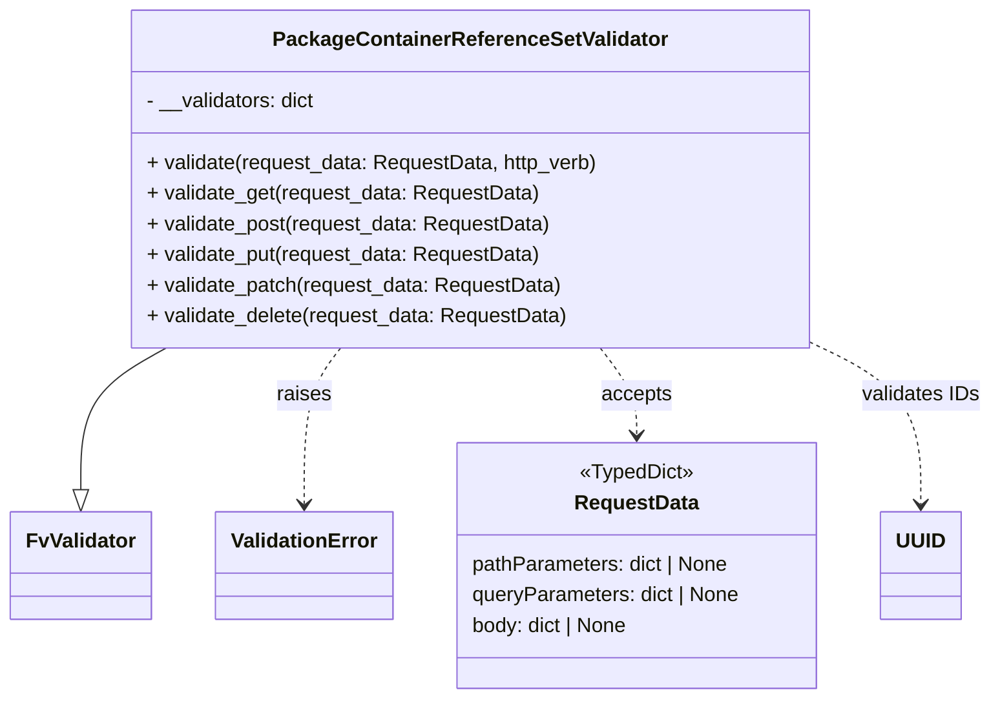

# Diagram: partview_core/partview_service/partview_service/api/package_container/reference/validation/PackageContainerReferenceSetValidator.py

> Auto-generated by Obscura crawlers

## Mermaid

### SVG

<svg id="container" width="765.140625" xmlns="http://www.w3.org/2000/svg" class="classDiagram" height="546" viewBox="0 0 765.140625 546" role="graphics-document document" aria-roledescription="class"><g><defs><marker id="container_class-aggregationStart" class="marker aggregation class" refX="18" refY="7" markerWidth="190" markerHeight="240" orient="auto"><path d="M 18,7 L9,13 L1,7 L9,1 Z"></path></marker></defs><defs><marker id="container_class-aggregationEnd" class="marker aggregation class" refX="1" refY="7" markerWidth="20" markerHeight="28" orient="auto"><path d="M 18,7 L9,13 L1,7 L9,1 Z"></path></marker></defs><defs><marker id="container_class-extensionStart" class="marker extension class" refX="18" refY="7" markerWidth="190" markerHeight="240" orient="auto"><path d="M 1,7 L18,13 V 1 Z"></path></marker></defs><defs><marker id="container_class-extensionEnd" class="marker extension class" refX="1" refY="7" markerWidth="20" markerHeight="28" orient="auto"><path d="M 1,1 V 13 L18,7 Z"></path></marker></defs><defs><marker id="container_class-compositionStart" class="marker composition class" refX="18" refY="7" markerWidth="190" markerHeight="240" orient="auto"><path d="M 18,7 L9,13 L1,7 L9,1 Z"></path></marker></defs><defs><marker id="container_class-compositionEnd" class="marker composition class" refX="1" refY="7" markerWidth="20" markerHeight="28" orient="auto"><path d="M 18,7 L9,13 L1,7 L9,1 Z"></path></marker></defs><defs><marker id="container_class-dependencyStart" class="marker dependency class" refX="6" refY="7" markerWidth="190" markerHeight="240" orient="auto"><path d="M 5,7 L9,13 L1,7 L9,1 Z"></path></marker></defs><defs><marker id="container_class-dependencyEnd" class="marker dependency class" refX="13" refY="7" markerWidth="20" markerHeight="28" orient="auto"><path d="M 18,7 L9,13 L14,7 L9,1 Z"></path></marker></defs><defs><marker id="container_class-lollipopStart" class="marker lollipop class" refX="13" refY="7" markerWidth="190" markerHeight="240" orient="auto"><circle stroke="black" fill="transparent" cx="7" cy="7" r="6"></circle></marker></defs><defs><marker id="container_class-lollipopEnd" class="marker lollipop class" refX="1" refY="7" markerWidth="190" markerHeight="240" orient="auto"><circle stroke="black" fill="transparent" cx="7" cy="7" r="6"></circle></marker></defs><g class="root"><g class="clusters"></g><g class="edgePaths"><path d="M126.458,272L115.533,278.167C104.607,284.333,82.757,296.667,71.832,315.125C60.906,333.583,60.906,358.167,60.906,370.458L60.906,382.75" id="id_PackageContainerReferenceSetValidator_FvValidator_1" class="edge-thickness-normal edge-pattern-solid relation" style=";;;" data-edge="true" data-et="edge" data-id="id_PackageContainerReferenceSetValidator_FvValidator_1" data-points="W3sieCI6MTI2LjQ1ODAxMzU5MDk3NjMyLCJ5IjoyNzJ9LHsieCI6NjAuOTA2MjUsInkiOjMwOX0seyJ4Ijo2MC45MDYyNSwieSI6NDAwfV0=" marker-end="url(#container_class-extensionEnd)"></path><path d="M259.306,272L254.587,278.167C249.868,284.333,240.43,296.667,235.711,317C230.992,337.333,230.992,365.667,230.992,379.833L230.992,394" id="id_PackageContainerReferenceSetValidator_ValidationError_2" class="edge-thickness-normal edge-pattern-dashed relation" style=";;;" data-edge="true" data-et="edge" data-id="id_PackageContainerReferenceSetValidator_ValidationError_2" data-points="W3sieCI6MjU5LjMwNjIwMTQ2MDc5ODgzLCJ5IjoyNzJ9LHsieCI6MjMwLjk5MjE4NzUsInkiOjMwOX0seyJ4IjoyMzAuOTkyMTg3NSwieSI6NDAwfV0=" marker-end="url(#container_class-dependencyEnd)"></path><path d="M461.331,272L466.05,278.167C470.769,284.333,480.207,296.667,484.926,308C489.645,319.333,489.645,329.667,489.645,334.833L489.645,340" id="id_PackageContainerReferenceSetValidator_RequestData_3" class="edge-thickness-normal edge-pattern-dashed relation" style=";;;" data-edge="true" data-et="edge" data-id="id_PackageContainerReferenceSetValidator_RequestData_3" data-points="W3sieCI6NDYxLjMzMDUxNzI4OTIwMTE3LCJ5IjoyNzJ9LHsieCI6NDg5LjY0NDUzMTI1LCJ5IjozMDl9LHsieCI6NDg5LjY0NDUzMTI1LCJ5IjozNDZ9XQ==" marker-end="url(#container_class-dependencyEnd)"></path><path d="M623.396,266.751L638.011,273.793C652.626,280.834,681.856,294.917,696.471,316.125C711.086,337.333,711.086,365.667,711.086,379.833L711.086,394" id="id_PackageContainerReferenceSetValidator_UUID_4" class="edge-thickness-normal edge-pattern-dashed relation" style=";;;" data-edge="true" data-et="edge" data-id="id_PackageContainerReferenceSetValidator_UUID_4" data-points="W3sieCI6NjIzLjM5NjQ4NDM3NSwieSI6MjY2Ljc1MTE3NjI3MDc5MDF9LHsieCI6NzExLjA4NTkzNzUsInkiOjMwOX0seyJ4Ijo3MTEuMDg1OTM3NSwieSI6NDAwfV0=" marker-end="url(#container_class-dependencyEnd)"></path></g><g class="edgeLabels"><g class="edgeLabel"><g class="label" data-id="id_PackageContainerReferenceSetValidator_FvValidator_1" transform="translate(0, 0)"><foreignObject width="0" height="0">

</foreignObject></g></g><g class="edgeLabel" transform="translate(230.9921875, 309)"><g class="label" data-id="id_PackageContainerReferenceSetValidator_ValidationError_2" transform="translate(-21.25, -12)"><foreignObject width="42.5" height="24">

raises

</foreignObject></g></g><g class="edgeLabel" transform="translate(489.64453125, 309)"><g class="label" data-id="id_PackageContainerReferenceSetValidator_RequestData_3" transform="translate(-27.421875, -12)"><foreignObject width="54.84375" height="24">

accepts

</foreignObject></g></g><g class="edgeLabel" transform="translate(711.0859375, 309)"><g class="label" data-id="id_PackageContainerReferenceSetValidator_UUID_4" transform="translate(-46.0546875, -12)"><foreignObject width="92.109375" height="24">

validates IDs

</foreignObject></g></g></g><g class="nodes"><g class="node default" id="classId-RequestData-0" transform="translate(489.64453125, 442)"><g class="basic label-container"><path d="M-141.47265625 -96 L141.47265625 -96 L141.47265625 96 L-141.47265625 96" stroke="none" stroke-width="0" fill="#ECECFF" style=""></path><path d="M-141.47265625 -96 C-67.60361956795958 -96, 6.265417114080833 -96, 141.47265625 -96 M-141.47265625 -96 C-41.27632402051337 -96, 58.92000820897326 -96, 141.47265625 -96 M141.47265625 -96 C141.47265625 -55.678494628151824, 141.47265625 -15.356989256303649, 141.47265625 96 M141.47265625 -96 C141.47265625 -30.29060519687731, 141.47265625 35.41878960624538, 141.47265625 96 M141.47265625 96 C35.73364419811847 96, -70.00536785376306 96, -141.47265625 96 M141.47265625 96 C37.342654002849585 96, -66.78734824430083 96, -141.47265625 96 M-141.47265625 96 C-141.47265625 33.337898768046735, -141.47265625 -29.32420246390653, -141.47265625 -96 M-141.47265625 96 C-141.47265625 39.19050691377937, -141.47265625 -17.618986172441254, -141.47265625 -96" stroke="#9370DB" stroke-width="1.3" fill="none" stroke-dasharray="0 0" style=""></path></g><g class="annotation-group text" transform="translate(-44.7421875, -72)"><g class="label" style="" transform="translate(0,-12)"><foreignObject width="89.484375" height="24">

«TypedDict»

</foreignObject></g></g><g class="label-group text" transform="translate(-46.8671875, -48)"><g class="label" style="font-weight: bolder" transform="translate(0,-12)"><foreignObject width="93.734375" height="24">

RequestData

</foreignObject></g></g><g class="members-group text" transform="translate(-129.47265625, 0)"><g class="label" style="" transform="translate(0,-12)"><foreignObject width="203.625" height="24">

pathParameters: dict | None

</foreignObject></g><g class="label" style="" transform="translate(0,12)"><foreignObject width="212.078125" height="24">

queryParameters: dict | None

</foreignObject></g><g class="label" style="" transform="translate(0,36)"><foreignObject width="125.234375" height="24">

body: dict | None

</foreignObject></g></g><g class="methods-group text" transform="translate(-129.47265625, 96)"></g><g class="divider" style=""><path d="M-141.47265625 -24 C-68.06362225286288 -24, 5.34541174427423 -24, 141.47265625 -24 M-141.47265625 -24 C-44.48785928980391 -24, 52.496937670392185 -24, 141.47265625 -24" stroke="#9370DB" stroke-width="1.3" fill="none" stroke-dasharray="0 0" style=""></path></g><g class="divider" style=""><path d="M-141.47265625 72 C-42.9066521270795 72, 55.65935199584101 72, 141.47265625 72 M-141.47265625 72 C-50.07648904554132 72, 41.319678158917355 72, 141.47265625 72" stroke="#9370DB" stroke-width="1.3" fill="none" stroke-dasharray="0 0" style=""></path></g></g><g class="node default" id="classId-FvValidator-1" transform="translate(60.90625, 442)"><g class="basic label-container"><path d="M-52.90625 -42 L52.90625 -42 L52.90625 42 L-52.90625 42" stroke="none" stroke-width="0" fill="#ECECFF" style=""></path><path d="M-52.90625 -42 C-22.723692113249314 -42, 7.458865773501373 -42, 52.90625 -42 M-52.90625 -42 C-17.56881207600688 -42, 17.768625847986243 -42, 52.90625 -42 M52.90625 -42 C52.90625 -14.072399156268318, 52.90625 13.855201687463364, 52.90625 42 M52.90625 -42 C52.90625 -22.18217977740479, 52.90625 -2.3643595548095817, 52.90625 42 M52.90625 42 C10.995238089790107 42, -30.915773820419787 42, -52.90625 42 M52.90625 42 C22.09680864377171 42, -8.712632712456582 42, -52.90625 42 M-52.90625 42 C-52.90625 8.68748540638601, -52.90625 -24.62502918722798, -52.90625 -42 M-52.90625 42 C-52.90625 21.881047003277963, -52.90625 1.7620940065559267, -52.90625 -42" stroke="#9370DB" stroke-width="1.3" fill="none" stroke-dasharray="0 0" style=""></path></g><g class="annotation-group text" transform="translate(0, -18)"></g><g class="label-group text" transform="translate(-40.90625, -18)"><g class="label" style="font-weight: bolder" transform="translate(0,-12)"><foreignObject width="81.8125" height="24">

FvValidator

</foreignObject></g></g><g class="members-group text" transform="translate(-40.90625, 30)"></g><g class="methods-group text" transform="translate(-40.90625, 60)"></g><g class="divider" style=""><path d="M-52.90625 6 C-22.864170258958435 6, 7.17790948208313 6, 52.90625 6 M-52.90625 6 C-19.515432433258432 6, 13.875385133483135 6, 52.90625 6" stroke="#9370DB" stroke-width="1.3" fill="none" stroke-dasharray="0 0" style=""></path></g><g class="divider" style=""><path d="M-52.90625 24 C-21.68168019670841 24, 9.54288960658318 24, 52.90625 24 M-52.90625 24 C-25.46932639382422 24, 1.9675972123515635 24, 52.90625 24" stroke="#9370DB" stroke-width="1.3" fill="none" stroke-dasharray="0 0" style=""></path></g></g><g class="node default" id="classId-ValidationError-2" transform="translate(230.9921875, 442)"><g class="basic label-container"><path d="M-67.1796875 -42 L67.1796875 -42 L67.1796875 42 L-67.1796875 42" stroke="none" stroke-width="0" fill="#ECECFF" style=""></path><path d="M-67.1796875 -42 C-34.26842426520194 -42, -1.357161030403887 -42, 67.1796875 -42 M-67.1796875 -42 C-25.194949556888062 -42, 16.789788386223876 -42, 67.1796875 -42 M67.1796875 -42 C67.1796875 -17.931342324155683, 67.1796875 6.137315351688635, 67.1796875 42 M67.1796875 -42 C67.1796875 -23.49087306049168, 67.1796875 -4.98174612098336, 67.1796875 42 M67.1796875 42 C32.94600794826827 42, -1.2876716034634654 42, -67.1796875 42 M67.1796875 42 C13.52577599175298 42, -40.12813551649404 42, -67.1796875 42 M-67.1796875 42 C-67.1796875 23.76792693326538, -67.1796875 5.535853866530758, -67.1796875 -42 M-67.1796875 42 C-67.1796875 21.375622551042706, -67.1796875 0.751245102085413, -67.1796875 -42" stroke="#9370DB" stroke-width="1.3" fill="none" stroke-dasharray="0 0" style=""></path></g><g class="annotation-group text" transform="translate(0, -18)"></g><g class="label-group text" transform="translate(-55.1796875, -18)"><g class="label" style="font-weight: bolder" transform="translate(0,-12)"><foreignObject width="110.359375" height="24">

ValidationError

</foreignObject></g></g><g class="members-group text" transform="translate(-55.1796875, 30)"></g><g class="methods-group text" transform="translate(-55.1796875, 60)"></g><g class="divider" style=""><path d="M-67.1796875 6 C-33.02408263965916 6, 1.1315222206816742 6, 67.1796875 6 M-67.1796875 6 C-14.531963639510657 6, 38.115760220978686 6, 67.1796875 6" stroke="#9370DB" stroke-width="1.3" fill="none" stroke-dasharray="0 0" style=""></path></g><g class="divider" style=""><path d="M-67.1796875 24 C-35.27543156286447 24, -3.371175625728938 24, 67.1796875 24 M-67.1796875 24 C-17.074857375342923 24, 33.029972749314155 24, 67.1796875 24" stroke="#9370DB" stroke-width="1.3" fill="none" stroke-dasharray="0 0" style=""></path></g></g><g class="node default" id="classId-UUID-3" transform="translate(711.0859375, 442)"><g class="basic label-container"><path d="M-29.96875 -42 L29.96875 -42 L29.96875 42 L-29.96875 42" stroke="none" stroke-width="0" fill="#ECECFF" style=""></path><path d="M-29.96875 -42 C-16.44820695367229 -42, -2.927663907344577 -42, 29.96875 -42 M-29.96875 -42 C-17.301384192139693 -42, -4.634018384279383 -42, 29.96875 -42 M29.96875 -42 C29.96875 -19.901878517120835, 29.96875 2.19624296575833, 29.96875 42 M29.96875 -42 C29.96875 -18.375361401410593, 29.96875 5.249277197178813, 29.96875 42 M29.96875 42 C14.157503995237251 42, -1.653742009525498 42, -29.96875 42 M29.96875 42 C13.594607380524579 42, -2.7795352389508423 42, -29.96875 42 M-29.96875 42 C-29.96875 19.337670472862243, -29.96875 -3.3246590542755143, -29.96875 -42 M-29.96875 42 C-29.96875 10.07781479501715, -29.96875 -21.8443704099657, -29.96875 -42" stroke="#9370DB" stroke-width="1.3" fill="none" stroke-dasharray="0 0" style=""></path></g><g class="annotation-group text" transform="translate(0, -18)"></g><g class="label-group text" transform="translate(-17.96875, -18)"><g class="label" style="font-weight: bolder" transform="translate(0,-12)"><foreignObject width="35.9375" height="24">

UUID

</foreignObject></g></g><g class="members-group text" transform="translate(-17.96875, 30)"></g><g class="methods-group text" transform="translate(-17.96875, 60)"></g><g class="divider" style=""><path d="M-29.96875 6 C-7.78666849199459 6, 14.39541301601082 6, 29.96875 6 M-29.96875 6 C-10.688348693091427 6, 8.592052613817145 6, 29.96875 6" stroke="#9370DB" stroke-width="1.3" fill="none" stroke-dasharray="0 0" style=""></path></g><g class="divider" style=""><path d="M-29.96875 24 C-15.196097110746095 24, -0.42344422149218985 24, 29.96875 24 M-29.96875 24 C-13.221645116497928 24, 3.5254597670041434 24, 29.96875 24" stroke="#9370DB" stroke-width="1.3" fill="none" stroke-dasharray="0 0" style=""></path></g></g><g class="node default" id="classId-PackageContainerReferenceSetValidator-4" transform="translate(360.318359375, 140)"><g class="basic label-container"><path d="M-263.078125 -132 L263.078125 -132 L263.078125 132 L-263.078125 132" stroke="none" stroke-width="0" fill="#ECECFF" style=""></path><path d="M-263.078125 -132 C-75.65871136143977 -132, 111.76070227712046 -132, 263.078125 -132 M-263.078125 -132 C-142.23891661446427 -132, -21.399708228928546 -132, 263.078125 -132 M263.078125 -132 C263.078125 -79.08603371326585, 263.078125 -26.172067426531697, 263.078125 132 M263.078125 -132 C263.078125 -45.013217565849686, 263.078125 41.97356486830063, 263.078125 132 M263.078125 132 C131.19720349792357 132, -0.6837180041528654 132, -263.078125 132 M263.078125 132 C71.5039586921688 132, -120.07020761566241 132, -263.078125 132 M-263.078125 132 C-263.078125 44.563047823493676, -263.078125 -42.87390435301265, -263.078125 -132 M-263.078125 132 C-263.078125 55.61763713498968, -263.078125 -20.764725730020643, -263.078125 -132" stroke="#9370DB" stroke-width="1.3" fill="none" stroke-dasharray="0 0" style=""></path></g><g class="annotation-group text" transform="translate(0, -108)"></g><g class="label-group text" transform="translate(-147.21875, -108)"><g class="label" style="font-weight: bolder" transform="translate(0,-12)"><foreignObject width="294.4375" height="24">

PackageContainerReferenceSetValidator

</foreignObject></g></g><g class="members-group text" transform="translate(-251.078125, -60)"><g class="label" style="" transform="translate(0,-12)"><foreignObject width="134.203125" height="24">

- __validators: dict

</foreignObject></g></g><g class="methods-group text" transform="translate(-251.078125, -12)"><g class="label" style="" transform="translate(0,-12)"><foreignObject width="354.9375" height="24">

+ validate(request_data: RequestData, http_verb)

</foreignObject></g><g class="label" style="" transform="translate(0,12)"><foreignObject width="307.40625" height="24">

+ validate_get(request_data: RequestData)

</foreignObject></g><g class="label" style="" transform="translate(0,36)"><foreignObject width="316.796875" height="24">

+ validate_post(request_data: RequestData)

</foreignObject></g><g class="label" style="" transform="translate(0,60)"><foreignObject width="309.28125" height="24">

+ validate_put(request_data: RequestData)

</foreignObject></g><g class="label" style="" transform="translate(0,84)"><foreignObject width="325.296875" height="24">

+ validate_patch(request_data: RequestData)

</foreignObject></g><g class="label" style="" transform="translate(0,108)"><foreignObject width="330.25" height="24">

+ validate_delete(request_data: RequestData)

</foreignObject></g></g><g class="divider" style=""><path d="M-263.078125 -84 C-68.10894618669238 -84, 126.86023262661524 -84, 263.078125 -84 M-263.078125 -84 C-155.25306707286614 -84, -47.42800914573232 -84, 263.078125 -84" stroke="#9370DB" stroke-width="1.3" fill="none" stroke-dasharray="0 0" style=""></path></g><g class="divider" style=""><path d="M-263.078125 -36 C-64.06873797035834 -36, 134.94064905928332 -36, 263.078125 -36 M-263.078125 -36 C-52.62364658613396 -36, 157.83083182773208 -36, 263.078125 -36" stroke="#9370DB" stroke-width="1.3" fill="none" stroke-dasharray="0 0" style=""></path></g></g></g></g></g></svg>
