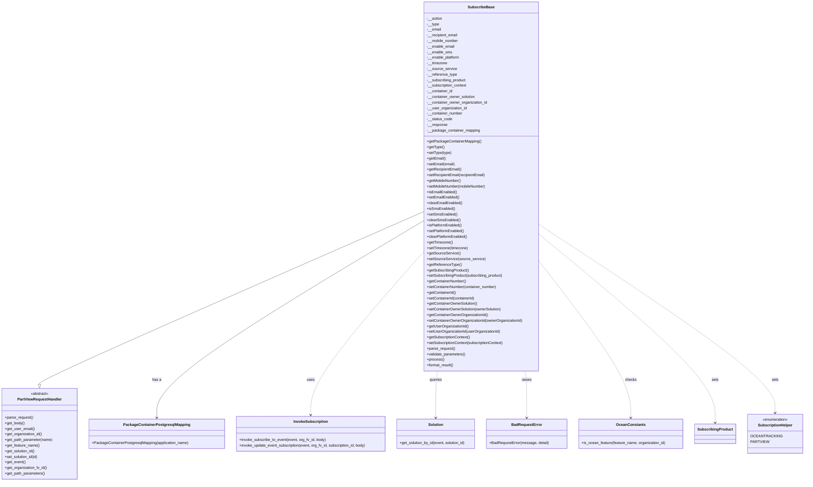

# Diagram: partview_core/partview_service/partview_service/api/package_container/subscription/classes/SubscribeBase.py

> Auto-generated by Obscura crawlers

## Mermaid

### SVG

<svg id="container" width="3420.765625" xmlns="http://www.w3.org/2000/svg" class="classDiagram" height="2064" viewBox="0 0 3420.765625 2064" role="graphics-document document" aria-roledescription="class"><g><defs><marker id="container_class-aggregationStart" class="marker aggregation class" refX="18" refY="7" markerWidth="190" markerHeight="240" orient="auto"><path d="M 18,7 L9,13 L1,7 L9,1 Z"></path></marker></defs><defs><marker id="container_class-aggregationEnd" class="marker aggregation class" refX="1" refY="7" markerWidth="20" markerHeight="28" orient="auto"><path d="M 18,7 L9,13 L1,7 L9,1 Z"></path></marker></defs><defs><marker id="container_class-extensionStart" class="marker extension class" refX="18" refY="7" markerWidth="190" markerHeight="240" orient="auto"><path d="M 1,7 L18,13 V 1 Z"></path></marker></defs><defs><marker id="container_class-extensionEnd" class="marker extension class" refX="1" refY="7" markerWidth="20" markerHeight="28" orient="auto"><path d="M 1,1 V 13 L18,7 Z"></path></marker></defs><defs><marker id="container_class-compositionStart" class="marker composition class" refX="18" refY="7" markerWidth="190" markerHeight="240" orient="auto"><path d="M 18,7 L9,13 L1,7 L9,1 Z"></path></marker></defs><defs><marker id="container_class-compositionEnd" class="marker composition class" refX="1" refY="7" markerWidth="20" markerHeight="28" orient="auto"><path d="M 18,7 L9,13 L1,7 L9,1 Z"></path></marker></defs><defs><marker id="container_class-dependencyStart" class="marker dependency class" refX="6" refY="7" markerWidth="190" markerHeight="240" orient="auto"><path d="M 5,7 L9,13 L1,7 L9,1 Z"></path></marker></defs><defs><marker id="container_class-dependencyEnd" class="marker dependency class" refX="13" refY="7" markerWidth="20" markerHeight="28" orient="auto"><path d="M 18,7 L9,13 L14,7 L9,1 Z"></path></marker></defs><defs><marker id="container_class-lollipopStart" class="marker lollipop class" refX="13" refY="7" markerWidth="190" markerHeight="240" orient="auto"><circle stroke="black" fill="transparent" cx="7" cy="7" r="6"></circle></marker></defs><defs><marker id="container_class-lollipopEnd" class="marker lollipop class" refX="1" refY="7" markerWidth="190" markerHeight="240" orient="auto"><circle stroke="black" fill="transparent" cx="7" cy="7" r="6"></circle></marker></defs><g class="root"><g class="clusters"></g><g class="edgePaths"><path d="M1823.084,907.57L1547.392,1027.808C1271.699,1148.046,720.314,1388.523,444.622,1512.053C168.93,1635.583,168.93,1642.167,168.93,1645.458L168.93,1648.75" id="id_SubscribeBase_PartViewRequestHandler_1" class="edge-thickness-normal edge-pattern-solid relation" style=";;;" data-edge="true" data-et="edge" data-id="id_SubscribeBase_PartViewRequestHandler_1" data-points="W3sieCI6MTgyMy4wODM5ODQzNzUsInkiOjkwNy41Njk2NzcyMjI0NjcxfSx7IngiOjE2OC45Mjk2ODc1LCJ5IjoxNjI5fSx7IngiOjE2OC45Mjk2ODc1LCJ5IjoxNjY2fV0=" marker-end="url(#container_class-extensionEnd)"></path><path d="M1823.084,945.839L1630.522,1059.699C1437.961,1173.559,1052.838,1401.28,860.276,1542.307C667.715,1683.333,667.715,1737.667,667.715,1764.833L667.715,1792" id="id_SubscribeBase_PackageContainerPostgresqlMapping_2" class="edge-thickness-normal edge-pattern-solid relation" style=";;;" data-edge="true" data-et="edge" data-id="id_SubscribeBase_PackageContainerPostgresqlMapping_2" data-points="W3sieCI6MTgyMy4wODM5ODQzNzUsInkiOjk0NS44MzkwMzE3NDk4MTN9LHsieCI6NjY3LjcxNDg0Mzc1LCJ5IjoxNjI5fSx7IngiOjY2Ny43MTQ4NDM3NSwieSI6MTc5OH1d" marker-end="url(#container_class-dependencyEnd)"></path><path d="M1823.084,1076.181L1740.801,1168.317C1658.518,1260.454,1493.952,1444.727,1411.67,1562.03C1329.387,1679.333,1329.387,1729.667,1329.387,1754.833L1329.387,1780" id="id_SubscribeBase_InvokeSubscription_3" class="edge-thickness-normal edge-pattern-dashed relation" style=";;;" data-edge="true" data-et="edge" data-id="id_SubscribeBase_InvokeSubscription_3" data-points="W3sieCI6MTgyMy4wODM5ODQzNzUsInkiOjEwNzYuMTgwOTcxMDk5MTgwOX0seyJ4IjoxMzI5LjM4NjcxODc1LCJ5IjoxNjI5fSx7IngiOjEzMjkuMzg2NzE4NzUsInkiOjE3ODZ9XQ==" marker-end="url(#container_class-dependencyEnd)"></path><path d="M1883.008,1592L1881.554,1598.167C1880.101,1604.333,1877.193,1616.667,1875.739,1650C1874.285,1683.333,1874.285,1737.667,1874.285,1764.833L1874.285,1792" id="id_SubscribeBase_Solution_4" class="edge-thickness-normal edge-pattern-dashed relation" style=";;;" data-edge="true" data-et="edge" data-id="id_SubscribeBase_Solution_4" data-points="W3sieCI6MTg4My4wMDgyMDEyNDAxOTksInkiOjE1OTJ9LHsieCI6MTg3NC4yODUxNTYyNSwieSI6MTYyOX0seyJ4IjoxODc0LjI4NTE1NjI1LCJ5IjoxNzk4fV0=" marker-end="url(#container_class-dependencyEnd)"></path><path d="M2256.449,1592L2257.903,1598.167C2259.357,1604.333,2262.264,1616.667,2263.718,1650C2265.172,1683.333,2265.172,1737.667,2265.172,1764.833L2265.172,1792" id="id_SubscribeBase_BadRequestError_5" class="edge-thickness-normal edge-pattern-dashed relation" style=";;;" data-edge="true" data-et="edge" data-id="id_SubscribeBase_BadRequestError_5" data-points="W3sieCI6MjI1Ni40NDg4MzAwMDk4MDEsInkiOjE1OTJ9LHsieCI6MjI2NS4xNzE4NzUsInkiOjE2Mjl9LHsieCI6MjI2NS4xNzE4NzUsInkiOjE3OTh9XQ==" marker-end="url(#container_class-dependencyEnd)"></path><path d="M2316.373,1120.476L2381.601,1205.23C2446.829,1289.984,2577.286,1459.492,2642.514,1571.413C2707.742,1683.333,2707.742,1737.667,2707.742,1764.833L2707.742,1792" id="id_SubscribeBase_OceanConstants_6" class="edge-thickness-normal edge-pattern-dashed relation" style=";;;" data-edge="true" data-et="edge" data-id="id_SubscribeBase_OceanConstants_6" data-points="W3sieCI6MjMxNi4zNzMwNDY4NzUsInkiOjExMjAuNDc2Mzg2OTc5ODU0fSx7IngiOjI3MDcuNzQyMTg3NSwieSI6MTYyOX0seyJ4IjoyNzA3Ljc0MjE4NzUsInkiOjE3OTh9XQ==" marker-end="url(#container_class-dependencyEnd)"></path><path d="M2316.373,1005.598L2441.017,1109.498C2565.66,1213.399,2814.947,1421.199,2939.591,1555.766C3064.234,1690.333,3064.234,1751.667,3064.234,1782.333L3064.234,1813" id="id_SubscribeBase_SubscribingProduct_7" class="edge-thickness-normal edge-pattern-dashed relation" style=";;;" data-edge="true" data-et="edge" data-id="id_SubscribeBase_SubscribingProduct_7" data-points="W3sieCI6MjMxNi4zNzMwNDY4NzUsInkiOjEwMDUuNTk3OTAwMTgyMDU0OX0seyJ4IjozMDY0LjIzNDM3NSwieSI6MTYyOX0seyJ4IjozMDY0LjIzNDM3NSwieSI6MTgxOX1d" marker-end="url(#container_class-dependencyEnd)"></path><path d="M2316.373,965.476L2481.205,1076.064C2646.036,1186.651,2975.7,1407.825,3140.532,1542.079C3305.363,1676.333,3305.363,1723.667,3305.363,1747.333L3305.363,1771" id="id_SubscribeBase_SubscriptionHelper_8" class="edge-thickness-normal edge-pattern-dashed relation" style=";;;" data-edge="true" data-et="edge" data-id="id_SubscribeBase_SubscriptionHelper_8" data-points="W3sieCI6MjMxNi4zNzMwNDY4NzUsInkiOjk2NS40NzYzMzgyMzA3NjEzfSx7IngiOjMzMDUuMzYzMjgxMjUsInkiOjE2Mjl9LHsieCI6MzMwNS4zNjMyODEyNSwieSI6MTc3N31d" marker-end="url(#container_class-dependencyEnd)"></path></g><g class="edgeLabels"><g class="edgeLabel"><g class="label" data-id="id_SubscribeBase_PartViewRequestHandler_1" transform="translate(0, 0)"><foreignObject width="0" height="0">

</foreignObject></g></g><g class="edgeLabel" transform="translate(667.71484375, 1629)"><g class="label" data-id="id_SubscribeBase_PackageContainerPostgresqlMapping_2" transform="translate(-19.171875, -12)"><foreignObject width="38.34375" height="24">

has a

</foreignObject></g></g><g class="edgeLabel" transform="translate(1329.38671875, 1629)"><g class="label" data-id="id_SubscribeBase_InvokeSubscription_3" transform="translate(-16.4921875, -12)"><foreignObject width="32.984375" height="24">

uses

</foreignObject></g></g><g class="edgeLabel" transform="translate(1874.28515625, 1629)"><g class="label" data-id="id_SubscribeBase_Solution_4" transform="translate(-27.2421875, -12)"><foreignObject width="54.484375" height="24">

queries

</foreignObject></g></g><g class="edgeLabel" transform="translate(2265.171875, 1629)"><g class="label" data-id="id_SubscribeBase_BadRequestError_5" transform="translate(-21.25, -12)"><foreignObject width="42.5" height="24">

raises

</foreignObject></g></g><g class="edgeLabel" transform="translate(2707.7421875, 1629)"><g class="label" data-id="id_SubscribeBase_OceanConstants_6" transform="translate(-24.4921875, -12)"><foreignObject width="48.984375" height="24">

checks

</foreignObject></g></g><g class="edgeLabel" transform="translate(3064.234375, 1629)"><g class="label" data-id="id_SubscribeBase_SubscribingProduct_7" transform="translate(-14.7265625, -12)"><foreignObject width="29.453125" height="24">

sets

</foreignObject></g></g><g class="edgeLabel" transform="translate(3305.36328125, 1629)"><g class="label" data-id="id_SubscribeBase_SubscriptionHelper_8" transform="translate(-14.7265625, -12)"><foreignObject width="29.453125" height="24">

sets

</foreignObject></g></g></g><g class="nodes"><g class="node default" id="classId-SubscribeBase-0" transform="translate(2069.728515625, 800)"><g class="basic label-container"><path d="M-246.64453125 -792 L246.64453125 -792 L246.64453125 792 L-246.64453125 792" stroke="none" stroke-width="0" fill="#ECECFF" style=""></path><path d="M-246.64453125 -792 C-128.9126935689356 -792, -11.180855887871218 -792, 246.64453125 -792 M-246.64453125 -792 C-106.43772228831489 -792, 33.769086673370225 -792, 246.64453125 -792 M246.64453125 -792 C246.64453125 -344.1229101637819, 246.64453125 103.75417967243618, 246.64453125 792 M246.64453125 -792 C246.64453125 -264.3272232644473, 246.64453125 263.3455534711054, 246.64453125 792 M246.64453125 792 C134.62784878986213 792, 22.611166329724256 792, -246.64453125 792 M246.64453125 792 C70.94355557436396 792, -104.75742010127209 792, -246.64453125 792 M-246.64453125 792 C-246.64453125 281.43897786641503, -246.64453125 -229.12204426716994, -246.64453125 -792 M-246.64453125 792 C-246.64453125 443.95870036602275, -246.64453125 95.91740073204551, -246.64453125 -792" stroke="#9370DB" stroke-width="1.3" fill="none" stroke-dasharray="0 0" style=""></path></g><g class="annotation-group text" transform="translate(0, -768)"></g><g class="label-group text" transform="translate(-53.8046875, -768)"><g class="label" style="font-weight: bolder" transform="translate(0,-12)"><foreignObject width="107.609375" height="24">

SubscribeBase

</foreignObject></g></g><g class="members-group text" transform="translate(-234.64453125, -720)"><g class="label" style="" transform="translate(0,-12)"><foreignObject width="66.703125" height="24">

-__action

</foreignObject></g><g class="label" style="" transform="translate(0,12)"><foreignObject width="53.125" height="24">

-__type

</foreignObject></g><g class="label" style="" transform="translate(0,36)"><foreignObject width="61.671875" height="24">

-__email

</foreignObject></g><g class="label" style="" transform="translate(0,60)"><foreignObject width="134.453125" height="24">

-__recipient_email

</foreignObject></g><g class="label" style="" transform="translate(0,84)"><foreignObject width="136.859375" height="24">

-__mobile_number

</foreignObject></g><g class="label" style="" transform="translate(0,108)"><foreignObject width="118.984375" height="24">

-__enable_email

</foreignObject></g><g class="label" style="" transform="translate(0,132)"><foreignObject width="107.625" height="24">

-__enable_sms

</foreignObject></g><g class="label" style="" transform="translate(0,156)"><foreignObject width="141.984375" height="24">

-__enable_platform

</foreignObject></g><g class="label" style="" transform="translate(0,180)"><foreignObject width="88.265625" height="24">

-__timezone

</foreignObject></g><g class="label" style="" transform="translate(0,204)"><foreignObject width="128.328125" height="24">

-__source_service

</foreignObject></g><g class="label" style="" transform="translate(0,228)"><foreignObject width="129.296875" height="24">

-__reference_type

</foreignObject></g><g class="label" style="" transform="translate(0,252)"><foreignObject width="170.703125" height="24">

-__subscribing_product

</foreignObject></g><g class="label" style="" transform="translate(0,276)"><foreignObject width="173.953125" height="24">

-__subscription_context

</foreignObject></g><g class="label" style="" transform="translate(0,300)"><foreignObject width="111.65625" height="24">

-__container_id

</foreignObject></g><g class="label" style="" transform="translate(0,324)"><foreignObject width="209.203125" height="24">

-__container_owner_solution

</foreignObject></g><g class="label" style="" transform="translate(0,348)"><foreignObject width="261.8125" height="24">

-__container_owner_organization_id

</foreignObject></g><g class="label" style="" transform="translate(0,372)"><foreignObject width="172.484375" height="24">

-__user_organization_id

</foreignObject></g><g class="label" style="" transform="translate(0,396)"><foreignObject width="154.375" height="24">

-__container_number

</foreignObject></g><g class="label" style="" transform="translate(0,420)"><foreignObject width="108.703125" height="24">

-__status_code

</foreignObject></g><g class="label" style="" transform="translate(0,444)"><foreignObject width="87.953125" height="24">

-__response

</foreignObject></g><g class="label" style="" transform="translate(0,468)"><foreignObject width="228.1875" height="24">

-__package_container_mapping

</foreignObject></g></g><g class="methods-group text" transform="translate(-234.64453125, -192)"><g class="label" style="" transform="translate(0,-12)"><foreignObject width="231.84375" height="24">

+getPackageContainerMapping()

</foreignObject></g><g class="label" style="" transform="translate(0,12)"><foreignObject width="74.640625" height="24">

+getType()

</foreignObject></g><g class="label" style="" transform="translate(0,36)"><foreignObject width="105.84375" height="24">

+setType(type)

</foreignObject></g><g class="label" style="" transform="translate(0,60)"><foreignObject width="80.9375" height="24">

+getEmail()

</foreignObject></g><g class="label" style="" transform="translate(0,84)"><foreignObject width="120.6875" height="24">

+setEmail(email)

</foreignObject></g><g class="label" style="" transform="translate(0,108)"><foreignObject width="149.140625" height="24">

+getRecipientEmail()

</foreignObject></g><g class="label" style="" transform="translate(0,132)"><foreignObject width="253.03125" height="24">

+setRecipientEmail(recipientEmail)

</foreignObject></g><g class="label" style="" transform="translate(0,156)"><foreignObject width="148.40625" height="24">

+getMobileNumber()

</foreignObject></g><g class="label" style="" transform="translate(0,180)"><foreignObject width="256.5625" height="24">

+setMobileNumber(mobileNumber)

</foreignObject></g><g class="label" style="" transform="translate(0,204)"><foreignObject width="129.234375" height="24">

+isEmailEnabled()

</foreignObject></g><g class="label" style="" transform="translate(0,228)"><foreignObject width="139.21875" height="24">

+setEmailEnabled()

</foreignObject></g><g class="label" style="" transform="translate(0,252)"><foreignObject width="152.953125" height="24">

+clearEmailEnabled()

</foreignObject></g><g class="label" style="" transform="translate(0,276)"><foreignObject width="119.125" height="24">

+isSmsEnabled()

</foreignObject></g><g class="label" style="" transform="translate(0,300)"><foreignObject width="129.109375" height="24">

+setSmsEnabled()

</foreignObject></g><g class="label" style="" transform="translate(0,324)"><foreignObject width="142.84375" height="24">

+clearSmsEnabled()

</foreignObject></g><g class="label" style="" transform="translate(0,348)"><foreignObject width="151.875" height="24">

+isPlatformEnabled()

</foreignObject></g><g class="label" style="" transform="translate(0,372)"><foreignObject width="161.859375" height="24">

+setPlatformEnabled()

</foreignObject></g><g class="label" style="" transform="translate(0,396)"><foreignObject width="175.59375" height="24">

+clearPlatformEnabled()

</foreignObject></g><g class="label" style="" transform="translate(0,420)"><foreignObject width="110.34375" height="24">

+getTimezone()

</foreignObject></g><g class="label" style="" transform="translate(0,444)"><foreignObject width="176.6875" height="24">

+setTimezone(timezone)

</foreignObject></g><g class="label" style="" transform="translate(0,468)"><foreignObject width="142.09375" height="24">

+getSourceService()

</foreignObject></g><g class="label" style="" transform="translate(0,492)"><foreignObject width="248.171875" height="24">

+setSourceService(source_service)

</foreignObject></g><g class="label" style="" transform="translate(0,516)"><foreignObject width="146.5625" height="24">

+getReferenceType()

</foreignObject></g><g class="label" style="" transform="translate(0,540)"><foreignObject width="182.296875" height="24">

+getSubscribingProduct()

</foreignObject></g><g class="label" style="" transform="translate(0,564)"><foreignObject width="330.75" height="24">

+setSubscribingProduct(subscribing_product)

</foreignObject></g><g class="label" style="" transform="translate(0,588)"><foreignObject width="169.78125" height="24">

+getContainerNumber()

</foreignObject></g><g class="label" style="" transform="translate(0,612)"><foreignObject width="302.234375" height="24">

+setContainerNumber(container_number)

</foreignObject></g><g class="label" style="" transform="translate(0,636)"><foreignObject width="125.71875" height="24">

+getContainerId()

</foreignObject></g><g class="label" style="" transform="translate(0,660)"><foreignObject width="208.609375" height="24">

+setContainerId(containerId)

</foreignObject></g><g class="label" style="" transform="translate(0,684)"><foreignObject width="219.3125" height="24">

+getContainerOwnerSolution()

</foreignObject></g><g class="label" style="" transform="translate(0,708)"><foreignObject width="324.890625" height="24">

+setContainerOwnerSolution(ownerSolution)

</foreignObject></g><g class="label" style="" transform="translate(0,732)"><foreignObject width="264.609375" height="24">

+getContainerOwnerOrganizationId()

</foreignObject></g><g class="label" style="" transform="translate(0,756)"><foreignObject width="415.484375" height="24">

+setContainerOwnerOrganizationId(ownerOrganizationId)

</foreignObject></g><g class="label" style="" transform="translate(0,780)"><foreignObject width="180.171875" height="24">

+getUserOrganizationId()

</foreignObject></g><g class="label" style="" transform="translate(0,804)"><foreignObject width="317.625" height="24">

+setUserOrganizationId(userOrganizationId)

</foreignObject></g><g class="label" style="" transform="translate(0,828)"><foreignObject width="187.78125" height="24">

+getSubscriptionContext()

</foreignObject></g><g class="label" style="" transform="translate(0,852)"><foreignObject width="332.8125" height="24">

+setSubscriptionContext(subscriptionContext)

</foreignObject></g><g class="label" style="" transform="translate(0,876)"><foreignObject width="121.796875" height="24">

+parse_request()

</foreignObject></g><g class="label" style="" transform="translate(0,900)"><foreignObject width="166.546875" height="24">

+validate_parameters()

</foreignObject></g><g class="label" style="" transform="translate(0,924)"><foreignObject width="73.734375" height="24">

+process()

</foreignObject></g><g class="label" style="" transform="translate(0,948)"><foreignObject width="117.015625" height="24">

+format_result()

</foreignObject></g></g><g class="divider" style=""><path d="M-246.64453125 -744 C-97.63034307375341 -744, 51.38384510249318 -744, 246.64453125 -744 M-246.64453125 -744 C-134.70786116963524 -744, -22.771191089270502 -744, 246.64453125 -744" stroke="#9370DB" stroke-width="1.3" fill="none" stroke-dasharray="0 0" style=""></path></g><g class="divider" style=""><path d="M-246.64453125 -216 C-134.3338105135732 -216, -22.023089777146424 -216, 246.64453125 -216 M-246.64453125 -216 C-59.2562713572878 -216, 128.1319885354244 -216, 246.64453125 -216" stroke="#9370DB" stroke-width="1.3" fill="none" stroke-dasharray="0 0" style=""></path></g></g><g class="node default" id="classId-PartViewRequestHandler-1" transform="translate(168.9296875, 1861)"><g class="basic label-container"><path d="M-160.9296875 -195 L160.9296875 -195 L160.9296875 195 L-160.9296875 195" stroke="none" stroke-width="0" fill="#ECECFF" style=""></path><path d="M-160.9296875 -195 C-90.67079049023073 -195, -20.41189348046146 -195, 160.9296875 -195 M-160.9296875 -195 C-44.78000193441457 -195, 71.36968363117086 -195, 160.9296875 -195 M160.9296875 -195 C160.9296875 -70.77406637376218, 160.9296875 53.45186725247564, 160.9296875 195 M160.9296875 -195 C160.9296875 -58.01577112702367, 160.9296875 78.96845774595266, 160.9296875 195 M160.9296875 195 C79.2265386088047 195, -2.4766102823905953 195, -160.9296875 195 M160.9296875 195 C79.80842231408428 195, -1.3128428718314353 195, -160.9296875 195 M-160.9296875 195 C-160.9296875 67.73605328902256, -160.9296875 -59.52789342195487, -160.9296875 -195 M-160.9296875 195 C-160.9296875 52.61771127245072, -160.9296875 -89.76457745509856, -160.9296875 -195" stroke="#9370DB" stroke-width="1.3" fill="none" stroke-dasharray="0 0" style=""></path></g><g class="annotation-group text" transform="translate(-38.609375, -171)"><g class="label" style="" transform="translate(0,-12)"><foreignObject width="77.21875" height="24">

«abstract»

</foreignObject></g></g><g class="label-group text" transform="translate(-91.359375, -147)"><g class="label" style="font-weight: bolder" transform="translate(0,-12)"><foreignObject width="182.71875" height="24">

PartViewRequestHandler

</foreignObject></g></g><g class="members-group text" transform="translate(-148.9296875, -99)"></g><g class="methods-group text" transform="translate(-148.9296875, -69)"><g class="label" style="" transform="translate(0,-12)"><foreignObject width="121.796875" height="24">

+parse_request()

</foreignObject></g><g class="label" style="" transform="translate(0,12)"><foreignObject width="85.53125" height="24">

+get_body()

</foreignObject></g><g class="label" style="" transform="translate(0,36)"><foreignObject width="127.65625" height="24">

+get_user_email()

</foreignObject></g><g class="label" style="" transform="translate(0,60)"><foreignObject width="161.671875" height="24">

+get_organization_id()

</foreignObject></g><g class="label" style="" transform="translate(0,84)"><foreignObject width="206.5" height="24">

+get_path_parameter(name)

</foreignObject></g><g class="label" style="" transform="translate(0,108)"><foreignObject width="149.40625" height="24">

+get_feature_name()

</foreignObject></g><g class="label" style="" transform="translate(0,132)"><foreignObject width="131.46875" height="24">

+get_solution_id()

</foreignObject></g><g class="label" style="" transform="translate(0,156)"><foreignObject width="144.953125" height="24">

+set_solution_id(id)

</foreignObject></g><g class="label" style="" transform="translate(0,180)"><foreignObject width="89.25" height="24">

+get_event()

</foreignObject></g><g class="label" style="" transform="translate(0,204)"><foreignObject width="182.421875" height="24">

+get_organization_fv_id()

</foreignObject></g><g class="label" style="" transform="translate(0,228)"><foreignObject width="173.21875" height="24">

+get_path_parameters()

</foreignObject></g></g><g class="divider" style=""><path d="M-160.9296875 -123 C-79.2512581549025 -123, 2.427171190194997 -123, 160.9296875 -123 M-160.9296875 -123 C-59.50575089326233 -123, 41.91818571347534 -123, 160.9296875 -123" stroke="#9370DB" stroke-width="1.3" fill="none" stroke-dasharray="0 0" style=""></path></g><g class="divider" style=""><path d="M-160.9296875 -99 C-95.98207477745743 -99, -31.034462054914854 -99, 160.9296875 -99 M-160.9296875 -99 C-53.04937072209809 -99, 54.83094605580382 -99, 160.9296875 -99" stroke="#9370DB" stroke-width="1.3" fill="none" stroke-dasharray="0 0" style=""></path></g></g><g class="node default" id="classId-PackageContainerPostgresqlMapping-2" transform="translate(667.71484375, 1861)"><g class="basic label-container"><path d="M-287.85546875 -63 L287.85546875 -63 L287.85546875 63 L-287.85546875 63" stroke="none" stroke-width="0" fill="#ECECFF" style=""></path><path d="M-287.85546875 -63 C-133.0820315961451 -63, 21.6914055577098 -63, 287.85546875 -63 M-287.85546875 -63 C-134.91302947446962 -63, 18.02940980106075 -63, 287.85546875 -63 M287.85546875 -63 C287.85546875 -34.104504187156934, 287.85546875 -5.209008374313861, 287.85546875 63 M287.85546875 -63 C287.85546875 -27.548316404603284, 287.85546875 7.903367190793432, 287.85546875 63 M287.85546875 63 C170.046013671281 63, 52.236558592562034 63, -287.85546875 63 M287.85546875 63 C151.13142510051486 63, 14.407381451029721 63, -287.85546875 63 M-287.85546875 63 C-287.85546875 13.595840519032045, -287.85546875 -35.80831896193591, -287.85546875 -63 M-287.85546875 63 C-287.85546875 13.20413352479278, -287.85546875 -36.59173295041444, -287.85546875 -63" stroke="#9370DB" stroke-width="1.3" fill="none" stroke-dasharray="0 0" style=""></path></g><g class="annotation-group text" transform="translate(0, -39)"></g><g class="label-group text" transform="translate(-135.8515625, -39)"><g class="label" style="font-weight: bolder" transform="translate(0,-12)"><foreignObject width="271.703125" height="24">

PackageContainerPostgresqlMapping

</foreignObject></g></g><g class="members-group text" transform="translate(-275.85546875, 9)"></g><g class="methods-group text" transform="translate(-275.85546875, 39)"><g class="label" style="" transform="translate(0,-12)"><foreignObject width="415.859375" height="24">

+PackageContainerPostgresqlMapping(application_name)

</foreignObject></g></g><g class="divider" style=""><path d="M-287.85546875 -15 C-134.5746296236644 -15, 18.706209502671186 -15, 287.85546875 -15 M-287.85546875 -15 C-76.9127453631676 -15, 134.0299780236648 -15, 287.85546875 -15" stroke="#9370DB" stroke-width="1.3" fill="none" stroke-dasharray="0 0" style=""></path></g><g class="divider" style=""><path d="M-287.85546875 9 C-160.98895980540237 9, -34.122450860804776 9, 287.85546875 9 M-287.85546875 9 C-150.29950137593792 9, -12.743534001875844 9, 287.85546875 9" stroke="#9370DB" stroke-width="1.3" fill="none" stroke-dasharray="0 0" style=""></path></g></g><g class="node default" id="classId-InvokeSubscription-3" transform="translate(1329.38671875, 1861)"><g class="basic label-container"><path d="M-323.81640625 -75 L323.81640625 -75 L323.81640625 75 L-323.81640625 75" stroke="none" stroke-width="0" fill="#ECECFF" style=""></path><path d="M-323.81640625 -75 C-121.2537821667135 -75, 81.30884191657299 -75, 323.81640625 -75 M-323.81640625 -75 C-71.6246518574107 -75, 180.5671025351786 -75, 323.81640625 -75 M323.81640625 -75 C323.81640625 -32.760311542780144, 323.81640625 9.479376914439712, 323.81640625 75 M323.81640625 -75 C323.81640625 -36.59490071803193, 323.81640625 1.8101985639361402, 323.81640625 75 M323.81640625 75 C130.00509617213916 75, -63.80621390572168 75, -323.81640625 75 M323.81640625 75 C160.13191828869495 75, -3.5525696726101046 75, -323.81640625 75 M-323.81640625 75 C-323.81640625 37.347756444862156, -323.81640625 -0.3044871102756872, -323.81640625 -75 M-323.81640625 75 C-323.81640625 25.02302682249104, -323.81640625 -24.95394635501792, -323.81640625 -75" stroke="#9370DB" stroke-width="1.3" fill="none" stroke-dasharray="0 0" style=""></path></g><g class="annotation-group text" transform="translate(0, -51)"></g><g class="label-group text" transform="translate(-70.8515625, -51)"><g class="label" style="font-weight: bolder" transform="translate(0,-12)"><foreignObject width="141.703125" height="24">

InvokeSubscription

</foreignObject></g></g><g class="members-group text" transform="translate(-311.81640625, -3)"></g><g class="methods-group text" transform="translate(-311.81640625, 27)"><g class="label" style="" transform="translate(0,-12)"><foreignObject width="374.609375" height="24">

+invoke_subscribe_to_event(event, org_fv_id, body)

</foreignObject></g><g class="label" style="" transform="translate(0,12)"><foreignObject width="552.78125" height="24">

+invoke_update_event_subscription(event, org_fv_id, subscription_id, body)

</foreignObject></g></g><g class="divider" style=""><path d="M-323.81640625 -27 C-126.64742851595591 -27, 70.52154921808818 -27, 323.81640625 -27 M-323.81640625 -27 C-86.33834020378981 -27, 151.13972584242038 -27, 323.81640625 -27" stroke="#9370DB" stroke-width="1.3" fill="none" stroke-dasharray="0 0" style=""></path></g><g class="divider" style=""><path d="M-323.81640625 -3 C-190.5973316134225 -3, -57.37825697684502 -3, 323.81640625 -3 M-323.81640625 -3 C-72.70816073701653 -3, 178.40008477596695 -3, 323.81640625 -3" stroke="#9370DB" stroke-width="1.3" fill="none" stroke-dasharray="0 0" style=""></path></g></g><g class="node default" id="classId-Solution-4" transform="translate(1874.28515625, 1861)"><g class="basic label-container"><path d="M-171.08203125 -63 L171.08203125 -63 L171.08203125 63 L-171.08203125 63" stroke="none" stroke-width="0" fill="#ECECFF" style=""></path><path d="M-171.08203125 -63 C-54.562518822084 -63, 61.956993605832 -63, 171.08203125 -63 M-171.08203125 -63 C-68.32773430137122 -63, 34.426562647257555 -63, 171.08203125 -63 M171.08203125 -63 C171.08203125 -37.146871270483395, 171.08203125 -11.29374254096679, 171.08203125 63 M171.08203125 -63 C171.08203125 -34.935176502906316, 171.08203125 -6.870353005812639, 171.08203125 63 M171.08203125 63 C96.32075393957075 63, 21.5594766291415 63, -171.08203125 63 M171.08203125 63 C39.950904251166435 63, -91.18022274766713 63, -171.08203125 63 M-171.08203125 63 C-171.08203125 21.29281730531514, -171.08203125 -20.41436538936972, -171.08203125 -63 M-171.08203125 63 C-171.08203125 35.82419855219075, -171.08203125 8.648397104381502, -171.08203125 -63" stroke="#9370DB" stroke-width="1.3" fill="none" stroke-dasharray="0 0" style=""></path></g><g class="annotation-group text" transform="translate(0, -39)"></g><g class="label-group text" transform="translate(-30.8359375, -39)"><g class="label" style="font-weight: bolder" transform="translate(0,-12)"><foreignObject width="61.671875" height="24">

Solution

</foreignObject></g></g><g class="members-group text" transform="translate(-159.08203125, 9)"></g><g class="methods-group text" transform="translate(-159.08203125, 39)"><g class="label" style="" transform="translate(0,-12)"><foreignObject width="287.328125" height="24">

+get_solution_by_id(event, solution_id)

</foreignObject></g></g><g class="divider" style=""><path d="M-171.08203125 -15 C-94.52470027243419 -15, -17.967369294868377 -15, 171.08203125 -15 M-171.08203125 -15 C-36.57953149308372 -15, 97.92296826383256 -15, 171.08203125 -15" stroke="#9370DB" stroke-width="1.3" fill="none" stroke-dasharray="0 0" style=""></path></g><g class="divider" style=""><path d="M-171.08203125 9 C-94.88145660211492 9, -18.680881954229847 9, 171.08203125 9 M-171.08203125 9 C-100.35898075779579 9, -29.635930265591583 9, 171.08203125 9" stroke="#9370DB" stroke-width="1.3" fill="none" stroke-dasharray="0 0" style=""></path></g></g><g class="node default" id="classId-BadRequestError-5" transform="translate(2265.171875, 1861)"><g class="basic label-container"><path d="M-169.8046875 -63 L169.8046875 -63 L169.8046875 63 L-169.8046875 63" stroke="none" stroke-width="0" fill="#ECECFF" style=""></path><path d="M-169.8046875 -63 C-82.05923086137544 -63, 5.6862257772491205 -63, 169.8046875 -63 M-169.8046875 -63 C-66.08274974349986 -63, 37.63918801300028 -63, 169.8046875 -63 M169.8046875 -63 C169.8046875 -27.64886851059437, 169.8046875 7.702262978811262, 169.8046875 63 M169.8046875 -63 C169.8046875 -27.852663822910905, 169.8046875 7.294672354178189, 169.8046875 63 M169.8046875 63 C74.85753099514112 63, -20.089625509717763 63, -169.8046875 63 M169.8046875 63 C47.144697524744174 63, -75.51529245051165 63, -169.8046875 63 M-169.8046875 63 C-169.8046875 13.647700276407399, -169.8046875 -35.7045994471852, -169.8046875 -63 M-169.8046875 63 C-169.8046875 25.785168863111508, -169.8046875 -11.429662273776984, -169.8046875 -63" stroke="#9370DB" stroke-width="1.3" fill="none" stroke-dasharray="0 0" style=""></path></g><g class="annotation-group text" transform="translate(0, -39)"></g><g class="label-group text" transform="translate(-62.28125, -39)"><g class="label" style="font-weight: bolder" transform="translate(0,-12)"><foreignObject width="124.5625" height="24">

BadRequestError

</foreignObject></g></g><g class="members-group text" transform="translate(-157.8046875, 9)"></g><g class="methods-group text" transform="translate(-157.8046875, 39)"><g class="label" style="" transform="translate(0,-12)"><foreignObject width="253.328125" height="24">

+BadRequestError(message, detail)

</foreignObject></g></g><g class="divider" style=""><path d="M-169.8046875 -15 C-90.91239653361858 -15, -12.020105567237152 -15, 169.8046875 -15 M-169.8046875 -15 C-50.646934976849806 -15, 68.51081754630039 -15, 169.8046875 -15" stroke="#9370DB" stroke-width="1.3" fill="none" stroke-dasharray="0 0" style=""></path></g><g class="divider" style=""><path d="M-169.8046875 9 C-73.71234995158898 9, 22.379987596822048 9, 169.8046875 9 M-169.8046875 9 C-84.18260811702939 9, 1.439471265941222 9, 169.8046875 9" stroke="#9370DB" stroke-width="1.3" fill="none" stroke-dasharray="0 0" style=""></path></g></g><g class="node default" id="classId-OceanConstants-6" transform="translate(2707.7421875, 1861)"><g class="basic label-container"><path d="M-222.765625 -63 L222.765625 -63 L222.765625 63 L-222.765625 63" stroke="none" stroke-width="0" fill="#ECECFF" style=""></path><path d="M-222.765625 -63 C-69.71710462613194 -63, 83.33141574773612 -63, 222.765625 -63 M-222.765625 -63 C-73.83796018967823 -63, 75.08970462064354 -63, 222.765625 -63 M222.765625 -63 C222.765625 -20.19738520174691, 222.765625 22.605229596506177, 222.765625 63 M222.765625 -63 C222.765625 -16.604031017712636, 222.765625 29.79193796457473, 222.765625 63 M222.765625 63 C55.90940366064541 63, -110.94681767870918 63, -222.765625 63 M222.765625 63 C130.6686203004841 63, 38.57161560096819 63, -222.765625 63 M-222.765625 63 C-222.765625 17.922133984138853, -222.765625 -27.155732031722295, -222.765625 -63 M-222.765625 63 C-222.765625 16.320239297168058, -222.765625 -30.359521405663884, -222.765625 -63" stroke="#9370DB" stroke-width="1.3" fill="none" stroke-dasharray="0 0" style=""></path></g><g class="annotation-group text" transform="translate(0, -39)"></g><g class="label-group text" transform="translate(-59.078125, -39)"><g class="label" style="font-weight: bolder" transform="translate(0,-12)"><foreignObject width="118.15625" height="24">

OceanConstants

</foreignObject></g></g><g class="members-group text" transform="translate(-210.765625, 9)"></g><g class="methods-group text" transform="translate(-210.765625, 39)"><g class="label" style="" transform="translate(0,-12)"><foreignObject width="362.453125" height="24">

+is_ocean_feature(feature_name, organization_id)

</foreignObject></g></g><g class="divider" style=""><path d="M-222.765625 -15 C-59.647620673954094 -15, 103.47038365209181 -15, 222.765625 -15 M-222.765625 -15 C-84.62696223375633 -15, 53.51170053248734 -15, 222.765625 -15" stroke="#9370DB" stroke-width="1.3" fill="none" stroke-dasharray="0 0" style=""></path></g><g class="divider" style=""><path d="M-222.765625 9 C-120.23383085113451 9, -17.702036702269027 9, 222.765625 9 M-222.765625 9 C-123.85394907673202 9, -24.942273153464043 9, 222.765625 9" stroke="#9370DB" stroke-width="1.3" fill="none" stroke-dasharray="0 0" style=""></path></g></g><g class="node default" id="classId-SubscribingProduct-7" transform="translate(3064.234375, 1861)"><g class="basic label-container"><path d="M-83.7265625 -42 L83.7265625 -42 L83.7265625 42 L-83.7265625 42" stroke="none" stroke-width="0" fill="#ECECFF" style=""></path><path d="M-83.7265625 -42 C-33.710998838317124 -42, 16.30456482336575 -42, 83.7265625 -42 M-83.7265625 -42 C-32.36317897309531 -42, 19.000204553809382 -42, 83.7265625 -42 M83.7265625 -42 C83.7265625 -19.91539139748795, 83.7265625 2.169217205024097, 83.7265625 42 M83.7265625 -42 C83.7265625 -9.615985276088551, 83.7265625 22.768029447822897, 83.7265625 42 M83.7265625 42 C32.86610153577065 42, -17.994359428458694 42, -83.7265625 42 M83.7265625 42 C24.029924134110097 42, -35.66671423177981 42, -83.7265625 42 M-83.7265625 42 C-83.7265625 16.39576397679981, -83.7265625 -9.20847204640038, -83.7265625 -42 M-83.7265625 42 C-83.7265625 21.951254080471106, -83.7265625 1.9025081609422116, -83.7265625 -42" stroke="#9370DB" stroke-width="1.3" fill="none" stroke-dasharray="0 0" style=""></path></g><g class="annotation-group text" transform="translate(0, -18)"></g><g class="label-group text" transform="translate(-71.7265625, -18)"><g class="label" style="font-weight: bolder" transform="translate(0,-12)"><foreignObject width="143.453125" height="24">

SubscribingProduct

</foreignObject></g></g><g class="members-group text" transform="translate(-71.7265625, 30)"></g><g class="methods-group text" transform="translate(-71.7265625, 60)"></g><g class="divider" style=""><path d="M-83.7265625 6 C-37.79128050362657 6, 8.144001492746867 6, 83.7265625 6 M-83.7265625 6 C-47.594090326583114 6, -11.461618153166228 6, 83.7265625 6" stroke="#9370DB" stroke-width="1.3" fill="none" stroke-dasharray="0 0" style=""></path></g><g class="divider" style=""><path d="M-83.7265625 24 C-22.38606359923849 24, 38.95443530152302 24, 83.7265625 24 M-83.7265625 24 C-41.52697237873265 24, 0.6726177425346975 24, 83.7265625 24" stroke="#9370DB" stroke-width="1.3" fill="none" stroke-dasharray="0 0" style=""></path></g></g><g class="node default" id="classId-SubscriptionHelper-8" transform="translate(3305.36328125, 1861)"><g class="basic label-container"><path d="M-107.40234375 -84 L107.40234375 -84 L107.40234375 84 L-107.40234375 84" stroke="none" stroke-width="0" fill="#ECECFF" style=""></path><path d="M-107.40234375 -84 C-21.851049711211473 -84, 63.70024432757705 -84, 107.40234375 -84 M-107.40234375 -84 C-46.83508739509522 -84, 13.732168959809556 -84, 107.40234375 -84 M107.40234375 -84 C107.40234375 -47.63271266659272, 107.40234375 -11.265425333185433, 107.40234375 84 M107.40234375 -84 C107.40234375 -22.93090652193711, 107.40234375 38.13818695612578, 107.40234375 84 M107.40234375 84 C38.41128022465233 84, -30.57978330069534 84, -107.40234375 84 M107.40234375 84 C61.02020154113972 84, 14.63805933227944 84, -107.40234375 84 M-107.40234375 84 C-107.40234375 32.8730523716653, -107.40234375 -18.253895256669395, -107.40234375 -84 M-107.40234375 84 C-107.40234375 35.059812389398, -107.40234375 -13.880375221204005, -107.40234375 -84" stroke="#9370DB" stroke-width="1.3" fill="none" stroke-dasharray="0 0" style=""></path></g><g class="annotation-group text" transform="translate(-55.5546875, -60)"><g class="label" style="" transform="translate(0,-12)"><foreignObject width="111.109375" height="24">

«enumeration»

</foreignObject></g></g><g class="label-group text" transform="translate(-71.0234375, -36)"><g class="label" style="font-weight: bolder" transform="translate(0,-12)"><foreignObject width="142.046875" height="24">

SubscriptionHelper

</foreignObject></g></g><g class="members-group text" transform="translate(-95.40234375, 12)"><g class="label" style="" transform="translate(0,-12)"><foreignObject width="119.78125" height="24">

OCEANTRACKING

</foreignObject></g><g class="label" style="" transform="translate(0,12)"><foreignObject width="70.53125" height="24">

PARTVIEW

</foreignObject></g></g><g class="methods-group text" transform="translate(-95.40234375, 84)"></g><g class="divider" style=""><path d="M-107.40234375 -12 C-60.867922859687155 -12, -14.33350196937431 -12, 107.40234375 -12 M-107.40234375 -12 C-31.20920226867179 -12, 44.98393921265642 -12, 107.40234375 -12" stroke="#9370DB" stroke-width="1.3" fill="none" stroke-dasharray="0 0" style=""></path></g><g class="divider" style=""><path d="M-107.40234375 60 C-29.19341961303293 60, 49.01550452393414 60, 107.40234375 60 M-107.40234375 60 C-53.30335407028564 60, 0.7956356094287145 60, 107.40234375 60" stroke="#9370DB" stroke-width="1.3" fill="none" stroke-dasharray="0 0" style=""></path></g></g></g></g></g></svg>
