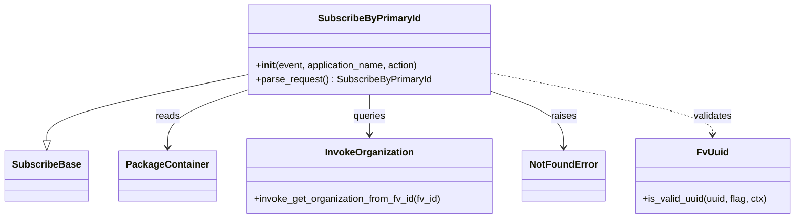

# Diagram: partview_core/partview_service/partview_service/api/package_container/subscription/classes/SubscribeByPrimaryId.py


> Auto-generated by Obscura crawlers

## Diagram 1



### SVG

<svg id="container" width="1302.515625" xmlns="http://www.w3.org/2000/svg" class="classDiagram" height="366" viewBox="0 0 1302.515625 366" role="graphics-document document" aria-roledescription="class"><style>#container{font-family:"trebuchet ms",verdana,arial,sans-serif;font-size:16px;fill:#333;}@keyframes edge-animation-frame{from{stroke-dashoffset:0;}}@keyframes dash{to{stroke-dashoffset:0;}}#container .edge-animation-slow{stroke-dasharray:9,5!important;stroke-dashoffset:900;animation:dash 50s linear infinite;stroke-linecap:round;}#container .edge-animation-fast{stroke-dasharray:9,5!important;stroke-dashoffset:900;animation:dash 20s linear infinite;stroke-linecap:round;}#container .error-icon{fill:#552222;}#container .error-text{fill:#552222;stroke:#552222;}#container .edge-thickness-normal{stroke-width:1px;}#container .edge-thickness-thick{stroke-width:3.5px;}#container .edge-pattern-solid{stroke-dasharray:0;}#container .edge-thickness-invisible{stroke-width:0;fill:none;}#container .edge-pattern-dashed{stroke-dasharray:3;}#container .edge-pattern-dotted{stroke-dasharray:2;}#container .marker{fill:#333333;stroke:#333333;}#container .marker.cross{stroke:#333333;}#container svg{font-family:"trebuchet ms",verdana,arial,sans-serif;font-size:16px;}#container p{margin:0;}#container g.classGroup text{fill:#9370DB;stroke:none;font-family:"trebuchet ms",verdana,arial,sans-serif;font-size:10px;}#container g.classGroup text .title{font-weight:bolder;}#container .nodeLabel,#container .edgeLabel{color:#131300;}#container .edgeLabel .label rect{fill:#ECECFF;}#container .label text{fill:#131300;}#container .labelBkg{background:#ECECFF;}#container .edgeLabel .label span{background:#ECECFF;}#container .classTitle{font-weight:bolder;}#container .node rect,#container .node circle,#container .node ellipse,#container .node polygon,#container .node path{fill:#ECECFF;stroke:#9370DB;stroke-width:1px;}#container .divider{stroke:#9370DB;stroke-width:1;}#container g.clickable{cursor:pointer;}#container g.classGroup rect{fill:#ECECFF;stroke:#9370DB;}#container g.classGroup line{stroke:#9370DB;stroke-width:1;}#container .classLabel .box{stroke:none;stroke-width:0;fill:#ECECFF;opacity:0.5;}#container .classLabel .label{fill:#9370DB;font-size:10px;}#container .relation{stroke:#333333;stroke-width:1;fill:none;}#container .dashed-line{stroke-dasharray:3;}#container .dotted-line{stroke-dasharray:1 2;}#container #compositionStart,#container .composition{fill:#333333!important;stroke:#333333!important;stroke-width:1;}#container #compositionEnd,#container .composition{fill:#333333!important;stroke:#333333!important;stroke-width:1;}#container #dependencyStart,#container .dependency{fill:#333333!important;stroke:#333333!important;stroke-width:1;}#container #dependencyStart,#container .dependency{fill:#333333!important;stroke:#333333!important;stroke-width:1;}#container #extensionStart,#container .extension{fill:transparent!important;stroke:#333333!important;stroke-width:1;}#container #extensionEnd,#container .extension{fill:transparent!important;stroke:#333333!important;stroke-width:1;}#container #aggregationStart,#container .aggregation{fill:transparent!important;stroke:#333333!important;stroke-width:1;}#container #aggregationEnd,#container .aggregation{fill:transparent!important;stroke:#333333!important;stroke-width:1;}#container #lollipopStart,#container .lollipop{fill:#ECECFF!important;stroke:#333333!important;stroke-width:1;}#container #lollipopEnd,#container .lollipop{fill:#ECECFF!important;stroke:#333333!important;stroke-width:1;}#container .edgeTerminals{font-size:11px;line-height:initial;}#container .classTitleText{text-anchor:middle;font-size:18px;fill:#333;}#container .label-icon{display:inline-block;height:1em;overflow:visible;vertical-align:-0.125em;}#container .node .label-icon path{fill:currentColor;stroke:revert;stroke-width:revert;}#container :root{--mermaid-font-family:"trebuchet ms",verdana,arial,sans-serif;}</style><g><defs><marker id="container_class-aggregationStart" class="marker aggregation class" refX="18" refY="7" markerWidth="190" markerHeight="240" orient="auto"><path d="M 18,7 L9,13 L1,7 L9,1 Z"></path></marker></defs><defs><marker id="container_class-aggregationEnd" class="marker aggregation class" refX="1" refY="7" markerWidth="20" markerHeight="28" orient="auto"><path d="M 18,7 L9,13 L1,7 L9,1 Z"></path></marker></defs><defs><marker id="container_class-extensionStart" class="marker extension class" refX="18" refY="7" markerWidth="190" markerHeight="240" orient="auto"><path d="M 1,7 L18,13 V 1 Z"></path></marker></defs><defs><marker id="container_class-extensionEnd" class="marker extension class" refX="1" refY="7" markerWidth="20" markerHeight="28" orient="auto"><path d="M 1,1 V 13 L18,7 Z"></path></marker></defs><defs><marker id="container_class-compositionStart" class="marker composition class" refX="18" refY="7" markerWidth="190" markerHeight="240" orient="auto"><path d="M 18,7 L9,13 L1,7 L9,1 Z"></path></marker></defs><defs><marker id="container_class-compositionEnd" class="marker composition class" refX="1" refY="7" markerWidth="20" markerHeight="28" orient="auto"><path d="M 18,7 L9,13 L1,7 L9,1 Z"></path></marker></defs><defs><marker id="container_class-dependencyStart" class="marker dependency class" refX="6" refY="7" markerWidth="190" markerHeight="240" orient="auto"><path d="M 5,7 L9,13 L1,7 L9,1 Z"></path></marker></defs><defs><marker id="container_class-dependencyEnd" class="marker dependency class" refX="13" refY="7" markerWidth="20" markerHeight="28" orient="auto"><path d="M 18,7 L9,13 L14,7 L9,1 Z"></path></marker></defs><defs><marker id="container_class-lollipopStart" class="marker lollipop class" refX="13" refY="7" markerWidth="190" markerHeight="240" orient="auto"><circle stroke="black" fill="transparent" cx="7" cy="7" r="6"></circle></marker></defs><defs><marker id="container_class-lollipopEnd" class="marker lollipop class" refX="1" refY="7" markerWidth="190" markerHeight="240" orient="auto"><circle stroke="black" fill="transparent" cx="7" cy="7" r="6"></circle></marker></defs><g class="root"><g class="clusters"></g><g class="edgePaths"><path d="M400.398,125.459L345.966,137.049C291.534,148.639,182.669,171.82,128.237,190.202C73.805,208.583,73.805,222.167,73.805,228.958L73.805,235.75" id="id_SubscribeByPrimaryId_SubscribeBase_1" class="edge-thickness-normal edge-pattern-solid relation" style=";;;" data-edge="true" data-et="edge" data-id="id_SubscribeByPrimaryId_SubscribeBase_1" data-points="W3sieCI6NDAwLjM5ODQzNzUsInkiOjEyNS40NTkxMjU0NzUyODUxNn0seyJ4Ijo3My44MDQ2ODc1LCJ5IjoxOTV9LHsieCI6NzMuODA0Njg3NSwieSI6MjUzfV0=" marker-end="url(#container_class-extensionEnd)"></path><path d="M400.398,150.12L378.176,157.6C355.953,165.08,311.508,180.04,289.285,196.187C267.063,212.333,267.063,229.667,267.063,238.333L267.063,247" id="id_SubscribeByPrimaryId_PackageContainer_2" class="edge-thickness-normal edge-pattern-solid relation" style=";;;" data-edge="true" data-et="edge" data-id="id_SubscribeByPrimaryId_PackageContainer_2" data-points="W3sieCI6NDAwLjM5ODQzNzUsInkiOjE1MC4xMTk1MzIyOTU1NTU0Mn0seyJ4IjoyNjcuMDYyNSwieSI6MTk1fSx7IngiOjI2Ny4wNjI1LCJ5IjoyNTN9XQ==" marker-end="url(#container_class-dependencyEnd)"></path><path d="M599.805,158L599.805,164.167C599.805,170.333,599.805,182.667,599.805,194C599.805,205.333,599.805,215.667,599.805,220.833L599.805,226" id="id_SubscribeByPrimaryId_InvokeOrganization_3" class="edge-thickness-normal edge-pattern-solid relation" style=";;;" data-edge="true" data-et="edge" data-id="id_SubscribeByPrimaryId_InvokeOrganization_3" data-points="W3sieCI6NTk5LjgwNDY4NzUsInkiOjE1OH0seyJ4Ijo1OTkuODA0Njg3NSwieSI6MTk1fSx7IngiOjU5OS44MDQ2ODc1LCJ5IjoyMzJ9XQ==" marker-end="url(#container_class-dependencyEnd)"></path><path d="M799.211,152.614L819.447,159.678C839.682,166.742,880.154,180.871,900.389,196.602C920.625,212.333,920.625,229.667,920.625,238.333L920.625,247" id="id_SubscribeByPrimaryId_NotFoundError_4" class="edge-thickness-normal edge-pattern-solid relation" style=";;;" data-edge="true" data-et="edge" data-id="id_SubscribeByPrimaryId_NotFoundError_4" data-points="W3sieCI6Nzk5LjIxMDkzNzUsInkiOjE1Mi42MTM3MzQzMjM2MzMyNX0seyJ4Ijo5MjAuNjI1LCJ5IjoxOTV9LHsieCI6OTIwLjYyNSwieSI6MjUzfV0=" marker-end="url(#container_class-dependencyEnd)"></path><path d="M799.211,122.491L860.232,134.576C921.253,146.661,1043.294,170.83,1104.315,188.082C1165.336,205.333,1165.336,215.667,1165.336,220.833L1165.336,226" id="id_SubscribeByPrimaryId_FvUuid_5" class="edge-thickness-normal edge-pattern-dashed relation" style=";;;" data-edge="true" data-et="edge" data-id="id_SubscribeByPrimaryId_FvUuid_5" data-points="W3sieCI6Nzk5LjIxMDkzNzUsInkiOjEyMi40OTExODYzODQ0ODM2M30seyJ4IjoxMTY1LjMzNTkzNzUsInkiOjE5NX0seyJ4IjoxMTY1LjMzNTkzNzUsInkiOjIzMn1d" marker-end="url(#container_class-dependencyEnd)"></path></g><g class="edgeLabels"><g class="edgeLabel"><g class="label" data-id="id_SubscribeByPrimaryId_SubscribeBase_1" transform="translate(0, 0)"><foreignObject width="0" height="0"><div xmlns="http://www.w3.org/1999/xhtml" class="labelBkg" style="display: table-cell; white-space: nowrap; line-height: 1.5; max-width: 200px; text-align: center;"><span class="edgeLabel"></span></div></foreignObject></g></g><g class="edgeLabel" transform="translate(267.0625, 195)"><g class="label" data-id="id_SubscribeByPrimaryId_PackageContainer_2" transform="translate(-20.0078125, -12)"><foreignObject width="40.015625" height="24"><div xmlns="http://www.w3.org/1999/xhtml" class="labelBkg" style="display: table-cell; white-space: nowrap; line-height: 1.5; max-width: 200px; text-align: center;"><span class="edgeLabel"><p>reads</p></span></div></foreignObject></g></g><g class="edgeLabel" transform="translate(599.8046875, 195)"><g class="label" data-id="id_SubscribeByPrimaryId_InvokeOrganization_3" transform="translate(-27.2421875, -12)"><foreignObject width="54.484375" height="24"><div xmlns="http://www.w3.org/1999/xhtml" class="labelBkg" style="display: table-cell; white-space: nowrap; line-height: 1.5; max-width: 200px; text-align: center;"><span class="edgeLabel"><p>queries</p></span></div></foreignObject></g></g><g class="edgeLabel" transform="translate(920.625, 195)"><g class="label" data-id="id_SubscribeByPrimaryId_NotFoundError_4" transform="translate(-21.25, -12)"><foreignObject width="42.5" height="24"><div xmlns="http://www.w3.org/1999/xhtml" class="labelBkg" style="display: table-cell; white-space: nowrap; line-height: 1.5; max-width: 200px; text-align: center;"><span class="edgeLabel"><p>raises</p></span></div></foreignObject></g></g><g class="edgeLabel" transform="translate(1165.3359375, 195)"><g class="label" data-id="id_SubscribeByPrimaryId_FvUuid_5" transform="translate(-32.6875, -12)"><foreignObject width="65.375" height="24"><div xmlns="http://www.w3.org/1999/xhtml" class="labelBkg" style="display: table-cell; white-space: nowrap; line-height: 1.5; max-width: 200px; text-align: center;"><span class="edgeLabel"><p>validates</p></span></div></foreignObject></g></g></g><g class="nodes"><g class="node default" id="classId-SubscribeBase-0" transform="translate(73.8046875, 295)"><g class="basic label-container"><path d="M-65.8046875 -42 L65.8046875 -42 L65.8046875 42 L-65.8046875 42" stroke="none" stroke-width="0" fill="#ECECFF" style=""></path><path d="M-65.8046875 -42 C-33.04596000983065 -42, -0.2872325196613019 -42, 65.8046875 -42 M-65.8046875 -42 C-30.33601542041012 -42, 5.132656659179759 -42, 65.8046875 -42 M65.8046875 -42 C65.8046875 -17.565916615674606, 65.8046875 6.868166768650788, 65.8046875 42 M65.8046875 -42 C65.8046875 -18.461901163671673, 65.8046875 5.0761976726566544, 65.8046875 42 M65.8046875 42 C26.94958486766643 42, -11.905517764667138 42, -65.8046875 42 M65.8046875 42 C39.343341807415996 42, 12.881996114831992 42, -65.8046875 42 M-65.8046875 42 C-65.8046875 8.465601703077283, -65.8046875 -25.068796593845434, -65.8046875 -42 M-65.8046875 42 C-65.8046875 12.676153194238925, -65.8046875 -16.64769361152215, -65.8046875 -42" stroke="#9370DB" stroke-width="1.3" fill="none" stroke-dasharray="0 0" style=""></path></g><g class="annotation-group text" transform="translate(0, -18)"></g><g class="label-group text" transform="translate(-53.8046875, -18)"><g class="label" style="font-weight: bolder" transform="translate(0,-12)"><foreignObject width="107.609375" height="24"><div xmlns="http://www.w3.org/1999/xhtml" style="display: table-cell; white-space: nowrap; line-height: 1.5; max-width: 156px; text-align: center;"><span class="nodeLabel markdown-node-label" style=""><p>SubscribeBase</p></span></div></foreignObject></g></g><g class="members-group text" transform="translate(-53.8046875, 30)"></g><g class="methods-group text" transform="translate(-53.8046875, 60)"></g><g class="divider" style=""><path d="M-65.8046875 6 C-31.8457824915863 6, 2.113122516827403 6, 65.8046875 6 M-65.8046875 6 C-29.344392487447685 6, 7.11590252510463 6, 65.8046875 6" stroke="#9370DB" stroke-width="1.3" fill="none" stroke-dasharray="0 0" style=""></path></g><g class="divider" style=""><path d="M-65.8046875 24 C-16.83361745259257 24, 32.13745259481486 24, 65.8046875 24 M-65.8046875 24 C-36.1668298625694 24, -6.528972225138801 24, 65.8046875 24" stroke="#9370DB" stroke-width="1.3" fill="none" stroke-dasharray="0 0" style=""></path></g></g><g class="node default" id="classId-SubscribeByPrimaryId-1" transform="translate(599.8046875, 83)"><g class="basic label-container"><path d="M-199.40625 -75 L199.40625 -75 L199.40625 75 L-199.40625 75" stroke="none" stroke-width="0" fill="#ECECFF" style=""></path><path d="M-199.40625 -75 C-65.49705525152504 -75, 68.41213949694992 -75, 199.40625 -75 M-199.40625 -75 C-49.51604623966628 -75, 100.37415752066744 -75, 199.40625 -75 M199.40625 -75 C199.40625 -20.386411283976855, 199.40625 34.22717743204629, 199.40625 75 M199.40625 -75 C199.40625 -25.0053776818022, 199.40625 24.989244636395597, 199.40625 75 M199.40625 75 C88.10104949580999 75, -23.204151008380023 75, -199.40625 75 M199.40625 75 C78.85821279469403 75, -41.68982441061195 75, -199.40625 75 M-199.40625 75 C-199.40625 16.967753025764992, -199.40625 -41.064493948470016, -199.40625 -75 M-199.40625 75 C-199.40625 15.019612717221605, -199.40625 -44.96077456555679, -199.40625 -75" stroke="#9370DB" stroke-width="1.3" fill="none" stroke-dasharray="0 0" style=""></path></g><g class="annotation-group text" transform="translate(0, -51)"></g><g class="label-group text" transform="translate(-81.109375, -51)"><g class="label" style="font-weight: bolder" transform="translate(0,-12)"><foreignObject width="162.21875" height="24"><div xmlns="http://www.w3.org/1999/xhtml" style="display: table-cell; white-space: nowrap; line-height: 1.5; max-width: 210px; text-align: center;"><span class="nodeLabel markdown-node-label" style=""><p>SubscribeByPrimaryId</p></span></div></foreignObject></g></g><g class="members-group text" transform="translate(-187.40625, -3)"></g><g class="methods-group text" transform="translate(-187.40625, 27)"><g class="label" style="" transform="translate(0,-12)"><foreignObject width="275.5" height="24"><div xmlns="http://www.w3.org/1999/xhtml" style="display: table-cell; white-space: nowrap; line-height: 1.5; max-width: 364px; text-align: center;"><span class="nodeLabel markdown-node-label" style=""><p>+<strong>init</strong>(event, application_name, action)</p></span></div></foreignObject></g><g class="label" style="" transform="translate(0,12)"><foreignObject width="293.703125" height="24"><div xmlns="http://www.w3.org/1999/xhtml" style="display: table-cell; white-space: nowrap; line-height: 1.5; max-width: 351px; text-align: center;"><span class="nodeLabel markdown-node-label" style=""><p>+parse_request() : SubscribeByPrimaryId</p></span></div></foreignObject></g></g><g class="divider" style=""><path d="M-199.40625 -27 C-46.22204969927529 -27, 106.96215060144942 -27, 199.40625 -27 M-199.40625 -27 C-83.07560236410175 -27, 33.25504527179649 -27, 199.40625 -27" stroke="#9370DB" stroke-width="1.3" fill="none" stroke-dasharray="0 0" style=""></path></g><g class="divider" style=""><path d="M-199.40625 -3 C-62.04142873543546 -3, 75.32339252912908 -3, 199.40625 -3 M-199.40625 -3 C-89.08999509969208 -3, 21.22625980061585 -3, 199.40625 -3" stroke="#9370DB" stroke-width="1.3" fill="none" stroke-dasharray="0 0" style=""></path></g></g><g class="node default" id="classId-PackageContainer-2" transform="translate(267.0625, 295)"><g class="basic label-container"><path d="M-77.453125 -42 L77.453125 -42 L77.453125 42 L-77.453125 42" stroke="none" stroke-width="0" fill="#ECECFF" style=""></path><path d="M-77.453125 -42 C-32.610945241996546 -42, 12.231234516006907 -42, 77.453125 -42 M-77.453125 -42 C-35.38826799105267 -42, 6.676589017894656 -42, 77.453125 -42 M77.453125 -42 C77.453125 -15.862993955901977, 77.453125 10.274012088196045, 77.453125 42 M77.453125 -42 C77.453125 -20.992841283043095, 77.453125 0.014317433913809907, 77.453125 42 M77.453125 42 C34.252531026077904 42, -8.948062947844193 42, -77.453125 42 M77.453125 42 C25.894902847186422 42, -25.663319305627155 42, -77.453125 42 M-77.453125 42 C-77.453125 18.077674411932023, -77.453125 -5.8446511761359545, -77.453125 -42 M-77.453125 42 C-77.453125 19.646067817350172, -77.453125 -2.707864365299656, -77.453125 -42" stroke="#9370DB" stroke-width="1.3" fill="none" stroke-dasharray="0 0" style=""></path></g><g class="annotation-group text" transform="translate(0, -18)"></g><g class="label-group text" transform="translate(-65.453125, -18)"><g class="label" style="font-weight: bolder" transform="translate(0,-12)"><foreignObject width="130.90625" height="24"><div xmlns="http://www.w3.org/1999/xhtml" style="display: table-cell; white-space: nowrap; line-height: 1.5; max-width: 179px; text-align: center;"><span class="nodeLabel markdown-node-label" style=""><p>PackageContainer</p></span></div></foreignObject></g></g><g class="members-group text" transform="translate(-65.453125, 30)"></g><g class="methods-group text" transform="translate(-65.453125, 60)"></g><g class="divider" style=""><path d="M-77.453125 6 C-26.859999273371358 6, 23.733126453257285 6, 77.453125 6 M-77.453125 6 C-25.128824321999396 6, 27.19547635600121 6, 77.453125 6" stroke="#9370DB" stroke-width="1.3" fill="none" stroke-dasharray="0 0" style=""></path></g><g class="divider" style=""><path d="M-77.453125 24 C-17.858581447011467 24, 41.735962105977066 24, 77.453125 24 M-77.453125 24 C-21.691105405158595 24, 34.07091418968281 24, 77.453125 24" stroke="#9370DB" stroke-width="1.3" fill="none" stroke-dasharray="0 0" style=""></path></g></g><g class="node default" id="classId-InvokeOrganization-3" transform="translate(599.8046875, 295)"><g class="basic label-container"><path d="M-205.2890625 -63 L205.2890625 -63 L205.2890625 63 L-205.2890625 63" stroke="none" stroke-width="0" fill="#ECECFF" style=""></path><path d="M-205.2890625 -63 C-80.14824850586017 -63, 44.992565488279666 -63, 205.2890625 -63 M-205.2890625 -63 C-123.0111171570046 -63, -40.73317181400921 -63, 205.2890625 -63 M205.2890625 -63 C205.2890625 -17.416421812212754, 205.2890625 28.167156375574493, 205.2890625 63 M205.2890625 -63 C205.2890625 -28.127999560928423, 205.2890625 6.744000878143154, 205.2890625 63 M205.2890625 63 C100.41509463568602 63, -4.458873228627965 63, -205.2890625 63 M205.2890625 63 C70.85565237826103 63, -63.577757743477946 63, -205.2890625 63 M-205.2890625 63 C-205.2890625 24.36141581961637, -205.2890625 -14.277168360767263, -205.2890625 -63 M-205.2890625 63 C-205.2890625 17.686011491399192, -205.2890625 -27.627977017201616, -205.2890625 -63" stroke="#9370DB" stroke-width="1.3" fill="none" stroke-dasharray="0 0" style=""></path></g><g class="annotation-group text" transform="translate(0, -39)"></g><g class="label-group text" transform="translate(-71.046875, -39)"><g class="label" style="font-weight: bolder" transform="translate(0,-12)"><foreignObject width="142.09375" height="24"><div xmlns="http://www.w3.org/1999/xhtml" style="display: table-cell; white-space: nowrap; line-height: 1.5; max-width: 190px; text-align: center;"><span class="nodeLabel markdown-node-label" style=""><p>InvokeOrganization</p></span></div></foreignObject></g></g><g class="members-group text" transform="translate(-193.2890625, 9)"></g><g class="methods-group text" transform="translate(-193.2890625, 39)"><g class="label" style="" transform="translate(0,-12)"><foreignObject width="315.53125" height="24"><div xmlns="http://www.w3.org/1999/xhtml" style="display: table-cell; white-space: nowrap; line-height: 1.5; max-width: 373px; text-align: center;"><span class="nodeLabel markdown-node-label" style=""><p>+invoke_get_organization_from_fv_id(fv_id)</p></span></div></foreignObject></g></g><g class="divider" style=""><path d="M-205.2890625 -15 C-87.39430734598984 -15, 30.50044780802031 -15, 205.2890625 -15 M-205.2890625 -15 C-95.20692948718026 -15, 14.875203525639478 -15, 205.2890625 -15" stroke="#9370DB" stroke-width="1.3" fill="none" stroke-dasharray="0 0" style=""></path></g><g class="divider" style=""><path d="M-205.2890625 9 C-46.62592431729311 9, 112.03721386541378 9, 205.2890625 9 M-205.2890625 9 C-51.02797455556467 9, 103.23311338887066 9, 205.2890625 9" stroke="#9370DB" stroke-width="1.3" fill="none" stroke-dasharray="0 0" style=""></path></g></g><g class="node default" id="classId-NotFoundError-4" transform="translate(920.625, 295)"><g class="basic label-container"><path d="M-65.53125 -42 L65.53125 -42 L65.53125 42 L-65.53125 42" stroke="none" stroke-width="0" fill="#ECECFF" style=""></path><path d="M-65.53125 -42 C-38.21993628812228 -42, -10.908622576244554 -42, 65.53125 -42 M-65.53125 -42 C-31.431589047706623 -42, 2.6680719045867534 -42, 65.53125 -42 M65.53125 -42 C65.53125 -22.565447374435337, 65.53125 -3.1308947488706735, 65.53125 42 M65.53125 -42 C65.53125 -11.390384401862736, 65.53125 19.219231196274528, 65.53125 42 M65.53125 42 C14.675904068558374 42, -36.17944186288325 42, -65.53125 42 M65.53125 42 C13.447777213463596 42, -38.63569557307281 42, -65.53125 42 M-65.53125 42 C-65.53125 8.697503416795698, -65.53125 -24.604993166408605, -65.53125 -42 M-65.53125 42 C-65.53125 15.999890833215165, -65.53125 -10.00021833356967, -65.53125 -42" stroke="#9370DB" stroke-width="1.3" fill="none" stroke-dasharray="0 0" style=""></path></g><g class="annotation-group text" transform="translate(0, -18)"></g><g class="label-group text" transform="translate(-53.53125, -18)"><g class="label" style="font-weight: bolder" transform="translate(0,-12)"><foreignObject width="107.0625" height="24"><div xmlns="http://www.w3.org/1999/xhtml" style="display: table-cell; white-space: nowrap; line-height: 1.5; max-width: 158px; text-align: center;"><span class="nodeLabel markdown-node-label" style=""><p>NotFoundError</p></span></div></foreignObject></g></g><g class="members-group text" transform="translate(-53.53125, 30)"></g><g class="methods-group text" transform="translate(-53.53125, 60)"></g><g class="divider" style=""><path d="M-65.53125 6 C-33.952810554801104 6, -2.374371109602201 6, 65.53125 6 M-65.53125 6 C-26.726068956795714 6, 12.079112086408571 6, 65.53125 6" stroke="#9370DB" stroke-width="1.3" fill="none" stroke-dasharray="0 0" style=""></path></g><g class="divider" style=""><path d="M-65.53125 24 C-25.918036981318238 24, 13.695176037363524 24, 65.53125 24 M-65.53125 24 C-38.30097333188347 24, -11.070696663766938 24, 65.53125 24" stroke="#9370DB" stroke-width="1.3" fill="none" stroke-dasharray="0 0" style=""></path></g></g><g class="node default" id="classId-FvUuid-5" transform="translate(1165.3359375, 295)"><g class="basic label-container"><path d="M-129.1796875 -63 L129.1796875 -63 L129.1796875 63 L-129.1796875 63" stroke="none" stroke-width="0" fill="#ECECFF" style=""></path><path d="M-129.1796875 -63 C-33.68093077461876 -63, 61.81782595076248 -63, 129.1796875 -63 M-129.1796875 -63 C-54.688261549278636 -63, 19.80316440144273 -63, 129.1796875 -63 M129.1796875 -63 C129.1796875 -13.30285313429281, 129.1796875 36.39429373141438, 129.1796875 63 M129.1796875 -63 C129.1796875 -35.18746789975617, 129.1796875 -7.374935799512343, 129.1796875 63 M129.1796875 63 C35.52679415477964 63, -58.126099190440726 63, -129.1796875 63 M129.1796875 63 C61.05557273392856 63, -7.0685420321428865 63, -129.1796875 63 M-129.1796875 63 C-129.1796875 16.037162504567235, -129.1796875 -30.92567499086553, -129.1796875 -63 M-129.1796875 63 C-129.1796875 20.29125064554998, -129.1796875 -22.41749870890004, -129.1796875 -63" stroke="#9370DB" stroke-width="1.3" fill="none" stroke-dasharray="0 0" style=""></path></g><g class="annotation-group text" transform="translate(0, -39)"></g><g class="label-group text" transform="translate(-24.5625, -39)"><g class="label" style="font-weight: bolder" transform="translate(0,-12)"><foreignObject width="49.125" height="24"><div xmlns="http://www.w3.org/1999/xhtml" style="display: table-cell; white-space: nowrap; line-height: 1.5; max-width: 99px; text-align: center;"><span class="nodeLabel markdown-node-label" style=""><p>FvUuid</p></span></div></foreignObject></g></g><g class="members-group text" transform="translate(-117.1796875, 9)"></g><g class="methods-group text" transform="translate(-117.1796875, 39)"><g class="label" style="" transform="translate(0,-12)"><foreignObject width="209.796875" height="24"><div xmlns="http://www.w3.org/1999/xhtml" style="display: table-cell; white-space: nowrap; line-height: 1.5; max-width: 267px; text-align: center;"><span class="nodeLabel markdown-node-label" style=""><p>+is_valid_uuid(uuid, flag, ctx)</p></span></div></foreignObject></g></g><g class="divider" style=""><path d="M-129.1796875 -15 C-46.41658537750236 -15, 36.346516744995284 -15, 129.1796875 -15 M-129.1796875 -15 C-49.17505894428156 -15, 30.82956961143688 -15, 129.1796875 -15" stroke="#9370DB" stroke-width="1.3" fill="none" stroke-dasharray="0 0" style=""></path></g><g class="divider" style=""><path d="M-129.1796875 9 C-29.67340270346213 9, 69.83288209307574 9, 129.1796875 9 M-129.1796875 9 C-54.64114658892561 9, 19.897394322148784 9, 129.1796875 9" stroke="#9370DB" stroke-width="1.3" fill="none" stroke-dasharray="0 0" style=""></path></g></g></g></g></g></svg>

## Diagram 2

```mermaid
flowchart TD
    A[parse_request] --> B[super.parse_request()]
    B --> C{get_path_parameter("containerId")}
    C -->|None or invalid| D[Assertion: "Invalid primary ID"]
    C -->|valid primary_id| E[read PackageContainer(id=primary_id)]
    E -->|container is None| F[NotFoundError: "Container not found"]
    E -->|container found| G[get tracking_number]
    G -->|missing| H[Assertion: "No tracking number"]
    G -->|present| I[setContainerId(tracking_number)]
    I --> J[get owner_org_fv_id]
    J --> K[InvokeOrganization.invoke_get_organization_from_fv_id(organizaton_fv_id)]
    K -->|None| L[Assertion: "No organization"]
    K -->|found| M[get organization_id]
    M --> N[setContainerOwnerOrganizationId(organization_id)]
    N --> O[return self]
    D --> P[stop]
    F --> P
    H --> P
    L --> P
```

> SVG rendering failed for this diagram.
